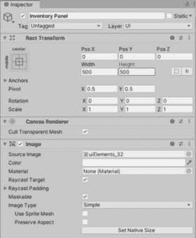

# 7

# 探索自动布局

现在我们已经掌握了使用 Rect Transform 和锚点手动定位、缩放和对齐 UI 元素的基础，我们可以探索如何使用自动布局。自动布局允许你将 UI 元素分组，以便它们相对于彼此自动定位。

在许多场景中，你可能希望 Unity 自动控制你的 UI 对象的布局。如果你通过代码生成 UI 项目，并且项目数量可能会变化，但你仍然希望它们正确对齐、缩放和定位，你可以使用自动布局。此外，如果你想创建完美间隔的 UI 对象，自动布局将帮助你创建这种完美间隔，而无需自己进行任何位置计算。这些自动布局非常适合像网格或列表对齐的库存系统等。

在本章中，我们将讨论以下主题：

+   使用布局组组件自动间隔、定位和对齐一组 UI 对象

+   使用布局元素组件、内容大小适配器组件和纵横比适配器组件来调整 UI 元素的大小

+   如何设置水平 HUD 选择菜单

+   如何设置网格库存

注意

本节中展示的所有示例都可以在名为**Chapter 07**.unitypackage 的 Unity 包中找到，在代码包中。每个示例图像都有一个说明示例编号的场景。在场景中，每个示例都在自己的 Canvas 上，其中一些 Canvas 已被禁用。要查看已禁用的 Canvas 上的示例，只需在**检查器**中选中 Canvas 名称旁边的复选框即可。

图 7.1：启用或禁用 Canvas 示例的复选框

让我们探索不同类型的自动布局组。

# 技术要求

你可以在此处找到本章的相关代码和资产文件：[`github.com/PacktPublishing/Mastering-UI-Development-with-Unity-2nd-Edition/tree/main/Chapter%2007`](https://github.com/PacktPublishing/Mastering-UI-Development-with-Unity-2nd-Edition/tree/main/Chapter%2007)

# 自动布局组的类型

当一个 UI 对象附加了自动布局组组件时，其所有子对象都将根据布局组件的参数进行对齐、调整大小和定位。自动布局组有三个选项：**水平布局组**、**垂直布局组**和**网格布局组**。

以下截图显示了三个面板（用灰色矩形表示），每个面板有六个 UI 图像子对象（用黑色矩形表示）；第一个面板有一个水平布局组组件，第二个面板有一个垂直布局组组件，第三个面板有一个网格布局组组件：

图 7.2：第七章场景中的自动布局组示例 1

从前面的截图，你可以清楚地看到三种自动布局组能完成什么。你可以使用这三种类型的任意组合来创建嵌套、完美间距的布局，如下所示：

图 7.3：第七章场景中的自动布局组示例 2

让我们分别查看这些布局组，并探索它们的各个属性。

## 水平布局组

带有**水平布局组**组件的 UI 对象的全部子元素都将自动并排放置。如果你允许水平布局组调整子元素的大小，它们将被定位和缩放，以确保它们完全位于父对象矩形变换的范围内。然而，如果你希望它们超出父对象矩形变换的范围，可以调整填充属性。

子元素在**层次结构**中出现的顺序决定了水平布局组将按照什么顺序进行布局。子元素将从左到右进行布局。层次结构中最顶层的子元素将被放置在最左侧的位置，而层次结构中最底层的子元素将被放置在最右侧的位置：

图 7.4：第七章场景中的水平布局组示例 1

要将水平布局组组件添加到 UI 对象中，请从对象的**检查器**中选择**添加组件** | **布局** | **水平布局组**。如果你点击**填充**属性旁边的箭头，你应该看到以下内容：

图 7.5：水平布局组组件

让我们进一步探讨水平布局组组件的每个属性。

### 填充

**填充**属性表示父对象矩形变换边缘的填充。正数将使子对象向内移动，而负数将使子对象向外移动。

图 7.6：第七章场景中的水平布局组示例 2

例如，前面的截图显示了三个应用了不同填充值的面板。第一个面板没有填充，第二个面板在所有四边都有正填充，而第三个面板在左侧、右侧和底部有正填充，但在顶部有负填充。

### 间距

**间距**属性确定子对象之间的水平间距。如果你在未使用**控制子元素大小**属性的情况下使用**子元素强制扩展**属性，则可能会覆盖此间距，子元素可能会有更大的间距。

### 子元素对齐

**Child Alignment**属性决定了子元素组将如何对齐。此属性有九个选项，如下所示：

图 7.7：水平布局组的子元素对齐选项

例如，以下图显示了三个重叠的 Panel，它们填充了屏幕。这些父 Panel 的 Rect Transform 区域由选定的 Rect Transform 表示。第一个 Panel 具有**Upper Left**子元素对齐。其子元素由白色方块表示。第二个 Panel 具有**Middle Center**子元素对齐，其子元素由灰色方块表示。第三个 Panel 具有**Lower Right**子元素对齐，其子元素由黑色方块表示：

图 7.8：第七章场景中的水平布局组示例 3

需要注意的是，**Child Alignment**属性只有在子元素（包括间距）没有完全填满 Rect Transform 时才会显示效果，如图所示。

### 反向排列

**Reverse Arrangement**属性是一个切换按钮。选择此切换按钮将导致元素以与它们在层次结构中出现的顺序相反的顺序排列。

### 控制子元素大小

**Control Child Size**选项允许自动布局覆盖子对象的当前**宽度**或**高度**。如果您选择这些复选框而没有选择相应的**Child Force Expand**复选框，您的子对象将不再可见（除非子元素具有具有**首选****宽度**指定的 Layout Element 组件）。

如果您没有设置此属性，子元素可能会绘制在父元素的 Rect Transform 之外——也就是说，如果存在太多的子元素。

注意

此属性更改子对象 Rect Transforms 的宽度和高度属性。因此，如果您选择然后取消选择它，子元素将不会回到它们原来的大小。您必须使用**编辑** | **撤销** (*Ctrl* + *Z*)或通过它们的 Rect Transform 组件手动重置子元素的大小。

由于此属性依赖于**Child Force Expand**属性，因此下一节将展示**Control Child Size**属性的示例。

### 子元素强制扩展

**Child Force Expand**属性将导致子元素填充可用空间。如果未选择相应的**Control Child Size**，则此属性将移动子元素，使它们及其间距填充空间。这可能会覆盖**Spacing**属性。如果选择了相应的**Control Child Size**，它将在所选方向上拉伸子元素，使它们及其间距完全填充空间。这将保持**Spacing**属性。

在以下屏幕截图中，所有三个面板都有一个水平布局组组件，具有**中间左** **子级对齐**，并选择了不同的**子级控制大小**和**子级强制扩展**组合。顶部面板只选择了**子级强制扩展宽度**，中间面板选择了**控制子级大小宽度**和**子级强制扩展宽度**，最后一个面板选择了**控制子级大小**属性和**子级强制扩展**属性：

图 7.9：第七章场景中水平布局组示例 4

接下来，让我们看看**使用子级** **缩放**属性。

### 使用子级缩放

**使用子级缩放**属性仅在 Unity 的最新版本中可用。勾选此属性将告诉布局组是否在自动化布局时考虑子级的缩放。

## 垂直布局组

**垂直布局组**组件与水平布局组非常相似，具有所有相同的属性，但具有垂直布局组组件的 UI 对象的子级将自动堆叠在一起，而不是并排排列。

与水平布局组一样，子级在层次结构中出现的顺序决定了垂直布局组将按照什么顺序进行布局。子级将按照它们在层次结构中出现的顺序从上到下进行布局：

图 7.10：第七章场景中垂直布局组示例

要将垂直布局组组件添加到 UI 对象中，请从对象的检查器中选择**添加组件** | **布局** | **垂直布局组**。如果您单击**填充**属性旁边的箭头，您应该看到以下内容：

图 7.11：垂直布局组组件

由于垂直布局组组件的属性与水平布局组相同，我们不会进一步探讨每个属性的细节。有关每个属性的说明，请参阅*水平布局* *组*部分。

## 网格布局组

**网格布局组**组件允许您在（你猜对了）网格布局中按列和行组织子对象。它的工作方式与水平和垂直布局组类似，但有一些可以操作的额外属性。

要将网格布局组组件添加到 UI 对象中，请从对象的检查器中选择**添加组件** | **布局** | **网格布局组**。如果您单击**填充**属性旁边的箭头，您应该看到以下内容：

图 7.12：网格布局组组件

网格布局组的某些属性与其他两个布局组相同，但让我们更仔细地看看网格布局组组件特有的属性。

### 单元大小

与水平和垂直布局组不同，它们通过其矩形变换组件确定子元素的大小，或者通过缩放使其适合父级的矩形变换，网格布局组要求您指定子对象的高度和宽度。您通过设置**单元大小**属性的**X**和**Y**属性来完成此操作。这将自动将指定的**X**和**Y**大小应用到每个子元素的矩形变换的**宽度**和**高度**属性。

由于**单元大小**属性和缺少**控制子元素大小**属性，子元素不一定能适合父级的矩形变换。如果存在太多的子元素，它们可能会被绘制在父级矩形变换之外。因此，如果您有一个动态填充的网格，在游戏过程中可能会改变，并且希望网格始终适合特定区域，您将必须为该溢出场景做好准备。

网格布局组允许您指定**X 间距**和**Y 间距**。**X 间距**是水平间距，**Y 间距**是垂直间距。这些值不会被进一步的属性选择覆盖，就像在水平和垂直布局组中那样。

### 起始角和起始轴

**起始角**属性决定了层次结构中第一个子元素的位置。**起始角**属性有四个选择，如下所示：

图 7.13：网格布局组组件的起始角选项

**起始轴**属性决定了所有其他子元素相对于第一个子元素的位置。有两个选项，如下所示：

图 7.14：网格布局组组件的起始轴选项

将**起始轴**属性设置为**水平**意味着子元素将从第一个子元素开始，以水平方式排列。如果将**起始角**分配给**左**选项之一，子元素将从左到右排列。如果将**起始角**分配给**右**选项之一，子元素将从右到左排列。一旦新行被填满，它将继续到下一行，并将在与**起始角**相同的侧重新开始。如果**起始角**是**上**选项之一，行将继续向下。如果**起始角**是**下**选项之一，行将继续向上。

以下截图演示了基于不同的**起始****角**选项的子对象流动，基于**水平起始轴**：

图 7.15：第七章场景中的网格布局组示例 1

将**起始轴**属性设置为**垂直**意味着子对象将从第一个子对象开始布局，然后以垂直方式排列。子对象是自上而下还是自下而上放置，与将此属性设置为**水平**时的方式相同，取决于**起始角**的位置。然后，当一列被填满时，子对象将根据**起始角**的位置从左到右或从右到左放置。

以下截图演示了基于不同的**起始****角**选项的子对象流动，基于**垂直起始轴**：

图 7.16：第七章场景中的网格布局组示例 2

如您所见，**起始角**和**起始轴**选项可以大大改变您的子对象显示的顺序。

### 约束

**约束**属性允许您指定网格将有多少行或列。这里有三种选项，如下所示：

图 7.17：网格布局组组件的约束选项

**固定列数**和**固定行数**属性允许您分别指定列数或行数。如果您选择这两个选项中的任何一个，将出现一个新的属性，**约束计数**。然后您指定您想要的列数或行数。当您选择**固定列数**时，行数将是可变的。当您选择**固定行数**时，列数将是可变的。

**灵活**选项会根据您选择的**单元格大小**和**起始轴**选项自动计算行数和列数。它将开始以定义的模式布局子对象，直到所选轴上没有空间为止。然后它将继续。**起始轴**中指定的轴将有固定数量的子对象，而另一个轴将是可变的。例如，如果**起始轴**设置为**水平**，并且三个子对象可以在定义的空间内水平放置，则将有三列，行数将由总子对象的数量决定。

现在我们已经探讨了三个自动布局组，让我们看看一个组件，它将允许我们改变这些布局组内子对象的大小或位置。

# 布局元素

**布局元素**组件允许我们指定对象在自动调整大小时的尺寸值范围。如果父对象尝试超出这些偏好设置调整其大小，布局元素将覆盖来自父对象的所有尺寸信息。

要将**布局元素**组件添加到 UI 对象，请从对象的**检查器**中选择**添加组件** | **布局** | **布局元素**。**布局元素**具有以下属性：

图 7.18：布局元素组件

要使用这些属性，您首先选择它们的复选框以启用它们；将出现框供您输入所需值：

图 7.19：设置布局元素组件的属性

让我们回顾一下布局元素组件的各个属性将如何影响它们所添加的元素。

## 忽略布局

**忽略布局**属性可用于使子对象忽略其父对象的任何自动布局组件。具有此属性选中的子对象可以自由移动和调整大小，而其他所有子对象都将不考虑被忽略的子对象进行布局。

在以下示例中，面板具有**水平布局组**组件和五个子对象。第一个子对象，标记为 1，具有具有**忽略布局**属性选中的**布局元素**组件：

图 7.20：第七章场景中的布局元素示例 1

您可以看到，由于第一个子对象选择了**忽略布局**属性，它可以被移动到父面板之外，并且在确定其他子对象的位置和缩放时被忽略。它还保持了其原始的矩形变换缩放。

如果取消选择**忽略布局**属性，第一个子对象将与其他子对象一起添加到水平布局组中。

## 宽度和高度属性

**布局元素**组件有三组属性，可用于指定对象如何调整大小。如果分配的大小超出了提供的值，这些属性将覆盖父对象分配给子对象的大小。

注意

重要的是要注意，这些属性不会覆盖网格布局组组件的**单元格大小**设置。*它们对网格布局组内的子对象没有任何影响*。

### 最小宽度和高度

**最小宽度**和**最小高度**属性是子对象可以达到的最小宽度和高度。如果父对象缩小，子对象将缩小，直到达到其**最小宽度**或**最小高度**。一旦达到，它将不再在该方向上缩放。

在下面的图中，面板包含一个**水平布局组**组件和五个子对象。第一个子对象，标记为 1，有一个设置了**最小宽度**和**最小高度**属性的**布局元素**组件：

图 7.21：第七章场景中的布局元素示例 2

您可以看到，当父对象的自定义布局组缩放时，它试图将所有子对象与其一起缩放。其他四个子对象也进行了缩放，但由于第一个子对象设置了**最小宽度**和**最小高度**属性，它拒绝进一步缩放。

### 优先宽度和优先高度

**优先宽度**和**优先高度**属性有些令人困惑，因为它们的性能取决于您为父布局组设置的配置。尽管存在**最小宽度**和**最小高度**设置，但没有官方的**最大宽度**和**最大高度**设置。然而，**优先宽度**和**优先高度**属性可以用来指定子对象将达到的最大尺寸，但前提是在父布局组上选择了正确的设置。

下面的图中包含三个带有**垂直布局组**组件的面板和不同的设置。它们的子元素在**布局** **元素**组件内也有不同的**优先高度**设置：

图 7.22：第七章场景中的布局元素示例 3

第一个父面板有一个带有**控制子大小宽度**和**高度**选择的**垂直布局组**组件，以及**子强制扩展**的**宽度**和**高度**。它没有任何子对象在**布局元素**组件内有**优先宽度**或**优先高度**设置。第一个面板将在比较其他面板时作为默认参考。

第二个父面板具有与第一个相同的属性——在**布局** **元素**组件中有一个`100`。

您可以看到，由于第二个父面板比其他四个子对象高`100`单位，所以当在父上选择**子强制扩展**属性时，具有**优先高度**的子对象不会使用**优先高度**作为其最大可能高度；它将此值添加到由父布局组组件分配的高度。

第三个面板在**布局** **元素**组件中包含一个`100`。

如果您将第三面板的子组件与第一面板（默认）的子组件进行比较，您会发现子组件更短。这是因为它们的**首选高度**设置比垂直布局组组件尝试分配给它们的高度小。因此，当取消选中**子强制扩展**的**高度**属性时，子组件将按预期使用它们的**首选高度**设置，使其成为子组件应达到的最大尺寸。

因此，如果您希望**首选宽度**或**首选高度**设置作为可达到的最大宽度和高度，您需要在父对象上取消选中相应的**子强制扩展**属性。

### 弹性宽度和弹性高度

**弹性宽度**和**弹性高度**属性表示一个百分比，其中百分比是子组件相对于其他子组件的大小。由于这些值是百分比，因此值为 0 表示 0%，值为 1 表示 100%。

与**首选宽度**和**首选高度**类似，除非取消选中**子强制扩展**属性，否则此设置不会按预期工作。在以下示例中，两个面板及其子组件的设置几乎完全相同。两者之间的唯一区别是，顶部父面板选中了**子强制扩展**的**宽度**属性，而底部父面板则没有。因此，如果父组件上选中了**子强制扩展**的**宽度**，则子组件的**弹性宽度**设置将被忽略：

图 7.23：第七章场景中的布局元素示例 4

前一图第二行的子组件具有以下`0`、`0.5`、`0.75`、`1`和`1.5`。您可以看到，子组件是相对于彼此按百分比缩放的。第一个子组件不可见，因为它设置了`0`。

布局元素组件基本上允许我们覆盖元素的自动大小和位置。现在，让我们回顾一些组件，这些组件将允许我们自动调整 UI 元素的大小。

# 适配器

有两个适配器布局组件。这些组件使它们附加的对象的矩形变换适应指定的区域。

## 内容大小适配器

**内容大小适配器**组件允许您强制父组件的大小适应其子组件的大小。这种适配可以基于子组件的最小或首选大小。

要将**内容大小适配器**组件添加到 UI 对象中，请从对象的**检查器**中选择**添加组件** | **布局** | **内容大小适配器**。**内容大小适配器**组件具有以下属性：

图 7.24：内容大小适配器组件

您可以为**水平适配**和**垂直适配**选择以下属性：

图 7.25：内容大小适配器组件的可能适配选项

如果选择**无约束**属性，则**内容大小适配器**将不会调整对象沿该轴的大小。

如果选择**最小大小**属性，则**内容大小适配器**将根据子组件的最小大小调整对象的大小。此最小大小由子组件的**布局元素**组件的**最小宽度**和**最小高度**属性确定。

如果父组件具有用于此属性的**网格布局组**组件，则子组件不需要有**布局元素**组件。如果为此具有**网格布局组**组件的对象选择此属性，则父组件的矩形变换将根据**单元格大小**和**填充**属性来适应子组件，如下所示：

图 7.26：第七章场景中的内容大小适配器示例

如果选择**首选大小**属性，则**内容大小适配器**将根据子组件的首选大小调整对象的大小。此首选大小由子组件的**布局元素**组件的**首选宽度**和**首选高度**属性确定。如果对象具有**网格布局组**组件，此设置将按与**最小大小**完全相同的方式执行。

## **纵横比适配器**

**纵横比适配器**组件与**布局元素**组件类似工作，因为它允许您覆盖发送给它的尺寸约束。它将强制附加到其上的 UI 对象根据纵横比进行缩放。

要将**纵横比适配器**组件添加到 UI 对象中，请从对象的**检查器**中选择**添加组件** | **布局** | **纵横比适配器（脚本）**。**纵横比适配器**组件具有以下属性：

图 7.27：纵横比适配器组件

一旦选择了一个**纵横比模式**选项，**纵横比**属性将是可编辑的。**纵横比**属性定义了矩形变换将保持的纵横比。例如，如果您想要 4:3 的纵横比，您只需在框中输入 4/3，它将转换为小数值：

图 7.28：将分数输入到纵横比适配器组件中

您可以为**纵横比模式**属性选择以下属性：

图 7.29：宽高比适配器组件的宽高比模式选项

如果选择了**无**属性，**宽高比适配器**将不会调整尺寸以适应**宽高比**。

如果选择了**宽度控制高度**属性，**宽高比适配器**将根据对象的宽度调整高度的尺寸。

如果选择了**高度控制宽度**属性，**宽高比适配器**将根据对象的高度调整宽度的尺寸。

如果选择了**适应父对象**属性，**宽高比适配器**将调整对象的尺寸以适应其父对象，但将保持**宽高比**。这将使子对象保持在父对象的边界内。

如果选择了**包裹父对象**属性，**宽高比适配器**将调整对象的尺寸以覆盖其父对象，但将保持**宽高比**。这与**适应父对象**属性类似，但不同之处在于，它不仅可以保持在父对象的边界内，还可以超出边界。

如果您尝试将一个**宽高比适配器**组件添加到一个父组件包含布局组组件的子组件中，您将在子组件上看到以下消息：

图 7.30：宽高比适配器警告消息

虽然您可以忽略此消息并继续操作，但它并不完全按预期工作。推荐的解决方案是在组内的子组件的子组件中添加**宽高比适配器**组件。例如，在以下图中，一个面板被添加为**水平布局组**的子组件。然后，一个带有**宽高比适配器**组件的子组件被添加到面板中，以便子组件可以具有 4:3 的**宽高比**：

图 7.31：第七章场景中的宽高比适配器示例

现在我们已经查看了一些自动布局组件的所有属性，让我们看看如何使用它们的示例！

# 示例

我们将继续工作于在*第六章*中创建的场景，并使用为它们导入的艺术资产。

注意

如果您没有跟随*第六章*中的示例，但想跟随这些示例，您可以从代码包中下载名为**第七章 - 示例 - 开始.unitypackage**的 Unity 包。

除了已经添加到我们项目中的艺术作品外，我们还将使用我从[`opengameart.org/content/platformer-pickups-pack`](https://opengameart.org/content/platformer-pickups-pack)找到的免费艺术资产中修改的艺术资产。

从上一个链接下载提供了许多单独的图像。我本可以使用那些图像，但出于性能原因，尽可能使用精灵表是更好的选择。因此，你可以在代码包中找到标记为 `foodSpriteSheet.png` 的精灵表。为了将所有图像组合成精灵表，我使用了 Texture Packer 程序，该程序可在 [`www.codeandweb.com/texturepacker`](https://www.codeandweb.com/texturepacker) 找到。

在开始以下示例之前，请完成以下步骤：

1.  将 `foodSpriteSheet.png` 精灵表导入到项目中的 `Asset/Sprites` 文件夹。

1.  将 `foodSpriteSheet.png` 改为 **Multiple**。使用 **Sprite Editor** 自动切片精灵表。

1.  自动切片会在精灵表中创建一个空白图像。在 **Sprite Editor** 中找到以下屏幕截图所示的矩形，然后选择并删除它：

图 7.32：需要删除的空精灵

1.  应用你的更改后，你应该在你的 `Sprites` 文件夹中有以下内容：

图 7.33：项目中当前所有的精灵

1.  通过按 *Ctrl* + *D* 复制名为 `Chapter6` 的场景，并将其命名为 `Chapter7`。打开 `Chapter7` 场景并在其中完成以下示例。

现在场景已复制且艺术资源已导入，让我们来看看应用一些自动布局。

## 布局 HUD 选择菜单

本章我们将介绍的是屏幕右下角使用 **Horizontal Layout Group** 组件的 HUD 选择菜单。完成之后，它将看起来像以下图示：

图 7.34：本例中将构建的 HUD 选择菜单

要创建前一个屏幕截图所示的 HUD 组，请完成以下步骤：

1.  目前，屏幕左上角有一个名为 `HUD Panel` 的面板。为了清晰起见，将此面板重命名为 `Top Left Panel`。

1.  我们将创建一个新的 HUD Panel 来存放我们的水果库存。我们希望将新的 HUD Panel 放在 HUD Canvas 上。在 **Hierarchy** 中右键单击名为 `HUD Canvas` 的 Canvas，然后选择 **UI** | **Panel**。

1.  将新面板重命名为 `Bottom Right Panel`：

图 7.35：层次结构中的面板

1.  修改 `Bottom Right Panel` 的 Rect Transform 属性，使面板锚定在右下角，具有 `500` 的宽度和 `100` 的高度。记得在选择右下角锚定预设时按住 *Shift* + *Alt*：

    图 7.36：Bottom Right Panel 的 Rect Transform

    你应该在游戏视图中看到以下内容：

    

    图 7.37：结果面板

1.  现在，我们将用`uiElements.png`精灵中的一个替换图片。将`uiElements_1`拖动到**Image**组件的**Source Image**属性中。更改**Color**属性，使其具有全不透明度：

    图 7.38：面板的 Image 组件属性

    你现在应该在你的**Game 视图**中看到以下内容：

    

    图 7.39：结果面板

1.  为了创建我们想要的布局，我们需要添加一个`Bottom Right Panel`。选择**添加组件** | **布局** | **水平布局组**。我们将稍后调整其属性。首先，让我们给这个面板添加一些子元素，这样我们就可以看到属性的效果。

1.  在层次结构中右键点击`Bottom Right Panel`并选择`Item Holder`。我们不会更改这个 Image 的**Rect Transform**组件，因为我们允许其父元素的**水平布局组**控制其大小、位置和锚点。

1.  这张图片将是物品的背景持有者。因此，将`uiElement_6`拖动到其**Image**组件的**Source Image**中。

1.  现在，让我们为水果添加图片。在`Food`中的`Item Holder`上右键点击：

图 7.40：UI 元素的层次结构

1.  为了确保我们看到的不是一个白色方块，让我们替换`foodSpriteSheet.png`。我使用了`foodSpriteSheet_18`，这是一个完整的橙子：

    图 7.41：食物元素的 Image 组件

    你应该看到类似这样的东西：

    

    图 7.42：包含橙子的结果面板

    如果你的橙子和它的持有者不在我的位置，不要担心。当我们开始添加更多子元素并调整**水平组布局**时，一切都应该正确地弹出。

1.  我们不希望我们的橙子图片的宽高比被扭曲，同时我们也想确保它总是填充`Item Holder`图片，而不会超出它。因此，让我们在`5`上调整一些属性。

1.  现在，选择`Food` Image 应该具有以下属性：

图 7.43：食物 UI 图片的 Rect Transform 和 Image 组件

1.  现在，我们准备开始添加更多的子元素。在`Item Holder` GameObjects 中的`Item`上选择`Item Holder` Image：

    图 7.44：UI 元素的层次结构

    你应该在**Game 视图**中看到以下内容：

    

    图 7.45：包含五个橙子的最终面板

1.  我不喜欢我的对象名称中包含带数字括号的名称，所以我将所有重复的图像重命名为`Item Holder`，不带数字。选择`Item Holder (1)`，按住*Shift*，然后选择`Item Holder (4)`，以便选中所有这些。现在，在名称槽中的`Item Holder`处按下*Enter*。它们现在都应该被重命名为`Item` `Holder`：

图 7.46：重命名元素的结果层次结构

1.  现在，让我们调整`Bottom Right Panel`上的属性。为此，选择`Bottom Right Panel`，并在其**水平布局组**组件中，给它以下属性：

    图 7.47：Bottom Right Panel 的水平布局组组件

    你现在将能够看到以下内容：

    

    图 7.48：最终面板中的橙子

    通过调整`Item Holder`图像，通过启用**控制子大小宽度**和**高度**，使它们适合父面板。

1.  现在，剩下的只是将橙子图像替换为其他四种物品。选择第二到第四个`Item Holder` GameObjects 的`Food`图像，并将它们的`foodSpriteSheet_13`、`foodSpriteSheet_22`、`foodSpriteSheet_34`和`foodSpriteSheet_45`更改为以下结果：

图 7.49：各种水果的最终面板

如此例所示，**水平布局组**组件和（类似地）**垂直布局组**组件设置起来并不困难，并且对于创建有组织的列表非常有用。

## 布局网格库存

本章我们将讨论的最后一个示例是使用**网格布局组**组件和**内容适配器**组件创建网格库存系统。我们将在后续章节继续在此面板上工作：

图 7.50：我们将在此示例中构建的网格库存

要创建前面截图所示的网格库存系统，请完成以下步骤：

1.  包含此库存系统的外壳看起来与我们之前的`Pause Panel`（见*图 7**.49*）非常相似。由于它们如此相似，而且没有必要重新发明轮子，我们将复制在*第六章*中创建的`Pause Panel`，并调整其一些设置以获得正方形形状。在层次结构中选择`Pause Panel`，然后按*Ctrl* + *D*复制它。现在，重命名副本`Inventory Panel`。重命名其子图像`Inventory Banner`：

图 7.51：复制和重命名后的结果层次结构

注意

记住我们在*第六章*中向**暂停面板**添加了一个 Canvas Group 组件。通过复制它来创建**库存面板**，**库存面板**也有一个**Canvas Group**组件。此组件将使我们能够轻松地隐藏和显示两个面板，我们将在下一章中这样做。

1.  要获得示例截图中的`Inventory Panel`的方形外观，我们需要取消选择`500`:

    图 7.52：库存面板的矩形变换和图像组件

    你现在应该在**游戏视图**中看到以下内容：

    

    图 7.53：生成的库存面板

1.  如果你查看*图 7**.50*，你会看到库存项目组有一个轮廓的精灵。这将作为我们网格的父对象。通过在`Inventory Holder`上右键单击来创建此父对象：

图 7.54：项目层次结构

1.  更改`uiElement_38`并使用**颜色**属性使图像完全不透明。

1.  目前，`Inventory Holder`完全覆盖了`Inventory Panel`。然而，我们不需要通过选择`Inventory Holder`没有子项来更改任何`Inventory Holder`，现在调整**水平适配**和**垂直适配**设置将导致它“消失”。

1.  通过选择**添加组件** | **布局** | **网格布局组**来添加一个`Inventory Holder`。再次提醒，现在不要调整设置。我们将在添加子项后进行此操作。

1.  从*图 7**.50*中注意，库存的子项设置与我们在上一个示例中创建的水平 HUD 中的子项设置一样。因此，我们将复制`Bottom Right Panel`的子项并将副本移动到`Inventory Holder`的子项。选择`Bottom Right Panel`的第一个`Item Holder`子项，按住*Shift*并选择`Bottom Right Panel`的最后一个`Item Holder`子项。这将选择所有子项。现在，所有子项都被选中，按*Ctrl* + *D*来复制它们。

1.  将`Bottom Right Panel`中的复制`Item Holder`GameObject 拖放到`Inventory Holder`中，使它们成为`Inventory Holder`的子项：

图 7.55：项目层次结构

1.  选择一个`Item Holder`GameObject 并复制四次，以便总共有九个`Item Holder`子项。选择所有`Item Holder`子项并将它们重命名为`Item Holder`，以便它们的名字中不再有数字：

    图 7.56：项目层次结构

    你现在应该在游戏视图中看到类似于 *图 7.57* 的内容。根据你复制的顺序或你执行操作的顺序，水果的顺序可能略有不同。不过，这没关系！

    

    图 7.57：水果的网格

1.  现在，让我们调整 `Inventory Holder Panel` 上的属性，以便子项将以 3x3 网格排列。调整属性以匹配以下截图中的属性：

图 7.58：库存持有者的网格布局组组件

1.  你现在应该在游戏视图中看到以下内容：

    图 7.59：库存持有者的网格布局组组件

    我们使用 `3` 在每个单元格之间添加间距。

1.  现在，由于 `Inventory Holder` 有子项，我们可以更改其 **Content Size Fitter** 的设置。将 **Horizontal Fit** 和 **Vertical Fit** 设置为 **Min Size**：

    图 7.60：库存持有者的内容大小适配器组件

    你现在应该在游戏视图中看到以下内容：

    

    图 7.61：水果的适配网格

    这有点难以看清，但 `Inventory Holder` 的图像现在紧紧地围绕 `Item Holder` 图像的网格。不过，我们想要一点填充。

1.  通过调整 **Grid Layout Group** 中的 **Padding** 属性，为 `Item Holder` GameObject 的两侧添加填充，如图所示：

图 7.62：水果的填充网格

1.  现在一切都已排列并正确定位，剩下要做的就是更改图像的顺序并更改最后四个槽位的图像。要更改图像的顺序，只需在 `Food` 项目中将它们的顺序更改为 `foodSpriteSheet_41`、`foodSpriteSheet_52`、`foodSpriteSheet_55` 和 `foodSpriteSheet_53`。这些更改导致以下完成的库存面板：

    图 7.63：各种食物的网格

    就这样。你现在应该有一个完美排列的库存网格。

    随着 `Inventory Holder` 的自动调整大小以适应所有项目，正如你所看到的：

    

    图 7.64：各种食物的小网格

    实际上，这种方法效果非常好，直到我们尝试向库存中添加更多项目。你会发现一旦我们有 10 个项目，一切看起来都很糟糕：

    

    图 7.65：各种食物的扩展网格

    我们可以做一些事情来处理这个问题，包括更改单元格大小和与**滚动矩形**一起使用遮罩。我们将在后面的章节中讨论如何进行这些更改。不过，现在请将你的库存保持在九个项目，这样一切看起来都很漂亮。

    完成前两章的所有示例后，你应该具备以下能力：

    

    图 7.66：第六章和第七章所有示例的结果

这就是为我们的场景添加自动布局的原因。我们将在未来的章节中继续对其进行改进。

# 摘要

现在，我们已经掌握了各种布局 UI 元素的技术。本章和上一章所涵盖的信息，已经提供了足够多的工具来创建几乎任何你可以想象到的 UI 布局。

本章讨论的自动布局不仅在你想要手动添加 UI 项目时有用，就像我们在本章中所做的那样。如果你想要根据特定条件动态创建和添加 UI 项目，这些自动布局尤其有用。

在下一章中，我们将学习如何通过代码访问 UI 组件，以及如何使用事件系统允许玩家与 UI 对象进行交互。
