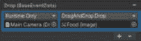

# 第八章：事件系统和 UI 编程

Unity UI 系统的关键特性之一是能够通过事件轻松编程 UI 元素如何接收玩家的交互。**事件系统**是一个强大的系统，允许你创建和管理事件。

一旦你学会了如何利用事件系统，你将能够创建可交互的 UI 以及响应游戏事件的事件 UI。

在本章中，我们将讨论以下主题：

+   如何通过代码访问 UI 元素及其属性

+   事件系统是什么以及如何与之协同工作

+   如何使用输入管理器自定义输入轴

+   输入模块是什么，以及 Unity 提供了哪些输入模块

+   如何使用事件触发组件接收 UI 对象上的事件

+   射线投射器是什么以及 Unity 提供了哪些类型的射线投射器

+   如何使用键盘输入显示和隐藏弹出面板

+   如何暂停游戏

+   如何创建拖放库存系统

+   如何使用鼠标或多点触控输入平移和缩放相机

# 技术要求

你可以在这里找到本章的相关代码和资产文件：[`github.com/PacktPublishing/Mastering-UI-Development-with-Unity-2nd-Edition/tree/main/Chapter%2008`](https://github.com/PacktPublishing/Mastering-UI-Development-with-Unity-2nd-Edition/tree/main/Chapter%2008)

# 在代码中访问 UI 元素

所有 UI 元素都可以像其他 GameObject 一样在代码中进行访问和操作。要访问代码中的 UI 元素，你必须包含`UnityEngine.UI`命名空间和正确的变量类型。让我们看看`UnityEngine.UI`命名空间。

## `UnityEngine.UI`命名空间

`using`关键字。

默认情况下，所有新的 C#脚本都包含了`System.Collections`、`System.Collections.Generic`和`UnityEngine`命名空间。要通过代码访问 UI 元素的属性，你必须首先使用`UnityEngine.UI`命名空间。

因此，在你的 C#脚本顶部，你需要包含以下行来表示你想要使用`UnityEngine.UI`命名空间：

```cs
using UnityEngine.UI;
```

在不使用命名空间的情况下，与 UI 元素相关的任何变量类型在你的代码编辑器中都会被标记为红色，并且你会收到一个编译错误。一旦你包含了命名空间，变量类型将变为蓝色文本，表示这是一个可用的变量类型，编译错误将消失。

## UI 变量类型

每个变量类型都是`UnityEngine.UI`命名空间中的一个类。因此，这些变量类型中的每一个都有自己的变量和函数集，可以访问。我们将在未来的章节中更详细地讨论每个变量类型，但就目前而言，让我们先看看在代码中访问 UI 元素属性的标准化模板。

你可以在源文件中找到一个名为`Chapter 08``.unitypackage`的 Unity 包。导入它将引入一个名为`Chapter8.unity`的场景和多个代码文件。导入包中的项目并打开场景。在`Chapter8`场景中，你会看到一个名为`UI Variables Example`的 UI 图像。它没有分配任何精灵，显示为一个白色方块。以下名为`AddSprite.cs`的脚本附加到 UI 图像上：

```cs
using System.Collections;
using System.Collections.Generic;
using UnityEngine;
using UnityEngine.UI;
public class AddSprite : MonoBehaviour {
     Image theImage;
     public Sprite theSprite;
     void Awake(){
          theImage = GetComponent<Image>();
     }
     void Start () {
          theImage.sprite = theSprite;
          theImage.preserveAspect = true;
     }
}
```

上一段代码中突出显示了 UI 特定的代码。请注意，`UnityEngine.UI`命名空间包含在类的顶部。

在类中定义了两个公共变量：`theImage`，它是一个`Image`类型，和`theSprite`，它是一个`Sprite`类型。`theImage`变量引用场景中的 UI 图像，而`theSprite`变量引用将成为 UI 图像源图像的精灵。

`Image`变量类型位于`UnityEngine.UI`命名空间中，表示 UI 图像 GameObject。`Sprite`变量类型不是一个 UI 元素，它包含在`UnityEngine`命名空间中。

在`Start()`函数中，通过在变量名后输入一个点然后输入属性来引用`theImage`上的`Image`组件的属性。你可以以这种方式访问 UI 元素对应组件中出现的任何属性。你也可以以这种方式访问组件中未列出的属性。

附加到`UI Variables Example (Image)`的`AddSprite`脚本在检查器中显示，如下面的截图所示：


图 8.1：AddSprite 脚本及其属性

现在，当场景播放时，精灵将从空白白色方块变为香蕉图像，并保持其宽高比。

让我们探索事件系统，这将使我们能够与我们的 UI 进行交互。

# 事件系统

在*第六章*中，我们了解到当第一个 Canvas 被添加到场景中时，会自动在层次结构中添加一个名为`EventSystem`的 GameObject。事件系统允许你轻松接收玩家交互并将这些交互通过事件发送到场景中的对象。请注意，我说的是*场景中的对象*，而不是*UI 对象*。事件系统还可以将事件发送到非 UI 元素！

在我们继续之前，我想指出我使用`EventSystem`（一个单词）和 Event System（两个单词），因为我将在两者之间来回切换。我想让你知道我这样做是有意为之，并不是随机决定有时候我讨厌空格键。

我将使用`EventSystem`（一个单词）来引用场景层次结构中实际出现的 GameObject，并使用 Event System（两个单词）来引用处理事件的系统。

除了向对象发送事件之外，事件系统还为你做了很多事情。它还跟踪当前选中的 GameObject、输入模块和射线投射。

EventSystem GameObject 默认初始化时包含三个组件：**Transform**、**Event System** 管理器和 **Standalone Input Module**，如下面的截图所示：


图 8.2：EventSystem GameObject 及其组件

由于 `EventSystem` 是一个 GameObject，它实际上存在于场景中（尽管它没有可渲染的组件使其可见），因此它具有与其他所有 GameObject 一样的 **Transform** 组件。你现在应该熟悉 **Transform** 组件了，所以我们不会进一步讨论它。然而，其他两个组件确实值得进一步讨论。现在让我们更仔细地看看 **Event System** 组件。我们还会在本章的 *Input Modules* 部分讨论 **Standalone Input Module** 组件。

你的场景中不能有超过一个 `EventSystem` GameObject。如果你尝试通过 **+** | **UI** | **Event System** 在场景中添加一个新的，则不会添加新的，而是会为你选择场景中当前存在的那个。

注意

如果你设法在你的场景中添加第二个 **EventSystem**（例如通过使用 *Ctrl* + *D* 复制现有的一个），你将在你的 **Console** 上看到一个警告信息。

如果你的场景中有多于一个 **EventSystem** GameObject，只有第一个添加的会实际执行任何操作。任何额外的 **EventSystems** 都将无法使用。

让我们接下来看看 **Event System** 管理器。

## Event System 管理器

**Event System** 管理器是负责跟踪和管理各种 **Event** **System** 元素的组件。

如果你想要与 `EventSystem` GameObject 一起工作，它不会自动为你创建。你可以通过在对象的检查器中选择 **Add Component** | **Event** | **Event System** 来将 **Event System** 管理器添加到 GameObject。让我们来谈谈 **Event** **System** 管理器下的属性。

### 首次选中

当你启动游戏时，你知道 **Start Game** 按钮会为你高亮显示，这样按下 *Enter* 就可以开始游戏，而无需使用鼠标？这就是 **First Selected** 属性为你做的事情。它在启动时自动为你选择场景中的 UI 元素。

你可以将任何不可交互的 UI 元素拖放到这个槽位，使其成为场景中第一个选中的 UI 项目。这对于不使用鼠标或触摸屏，而完全依赖游戏手柄、摇杆或键盘的游戏尤其有帮助。

### 发送导航事件

**Send Navigation Events** 属性可以开启或关闭。当此属性启用时，你可以通过游戏手柄、摇杆或键盘在 UI 元素之间导航。以下导航事件可以使用：

+   **移动**: 您可以通过键盘上的箭头键或游戏手柄上的控制杆（或您指定的任何移动键/按钮）选择各种 UI 元素。移动将从指定的**第一个选择**的 UI 项目开始。我们将在*第十章*中讨论如何使用移动来指定 UI 项目的选择顺序。

+   **提交**: 承诺选择 UI 项目。

+   **取消**: 取消选择。

### 拖动阈值

**拖动阈值**属性表示 UI 对象在被视为*拖动*之前可以移动的像素数。人们的手并不完全稳定，所以当他们试图点击或轻触 UI 项目时，他们的鼠标或手指可能会稍微移动。这个**拖动阈值**允许玩家在所选项目被*拖动*而不是*点击*之前稍微移动他们的输入（如果你将这个数字设置得高，那么移动可能会很多）。

# 输入管理器

在我们讨论**事件系统**管理器的下一个组件之前，我想讨论输入管理器。输入管理器是您通过将它们分配到鼠标、键盘或游戏手柄（游戏手柄）上的按钮来定义游戏中轴的地方。这也允许您在编码时使用轴名称，以便轻松引用您想要在动作中执行的所有输入。

注意

记住，正如我们在*第五章*中讨论的，实际上有两个系统可以允许您在游戏中处理输入：输入管理器和新的输入系统。本章将重点介绍输入管理器。我们将在未来的章节中讨论新的输入系统。

要打开**输入管理器**，请选择**编辑** | **项目设置** | **输入管理器**。

如果您选择**轴**旁边的箭头，您将看到默认的轴列表：


图 8.3：输入管理器和所有预定义的轴

默认情况下有 30 个总轴。更改**大小**旁边的数字将为您提供更多或更少的轴。展开单个轴将显示以下内容：


图 8.4：第一个水平输入轴

在**名称**槽中输入的单词将出现在可展开箭头旁边。在上面的截图中，所有允许水平移动的键都已定义。

注意，左箭头和右箭头，以及键盘上的*A*和*D*键，默认为**水平**移动。

列表中还有一个第二个**水平**轴。它配置为与游戏手柄一起工作。


图 8.5：第二个水平输入轴

由于有两个`"``Horizontal"`标签。

注意

要查看每个键盘键的关键字列表以及轴输入的每个属性的描述，请访问[`docs.unity3d.com/Manual/class-InputManager.xhtml`](https://docs.unity3d.com/Manual/class-InputManager.xhtml)。

这将允许你将所有这些按钮和摇杆作为一个组来引用。这比编写代码来获取每个单独摇杆上的单独键盘键要简单得多。

你可以通过右键单击并选择**删除** **数组元素**来删除这些 30 个默认轴中的任何一个。

然而，当你删除它们时要小心。你需要至少一个**提交**轴和一个**取消**轴才能使用**独立输入管理器**（除非你更改**独立输入管理器**中的**提交按钮**和**取消按钮**）。有关更多信息，请参阅本章的**独立输入管理器**部分。

现在我们已经探讨了输入管理器，我们可以回顾按钮和按键的各种输入函数。

# 按键和按键的输入函数

有很多种方法可以通过代码访问按键和按钮的按下。你如何做这取决于你是否在**输入管理器**中将键指定为轴，以及你是否希望键只注册一次或持续注册。我将在本文中讨论几个，但你可以在[`docs.unity3d.com/ScriptReference/Input.xhtml`](https://docs.unity3d.com/ScriptReference/Input.xhtml)找到完整的函数列表。

在本章前面我们回顾的`Chapter8`示例场景中，有一个名为`KeyPresses.cs`的脚本附加到了`Main Camera`上。如果你想要尝试按键，`KeyPresses.cs`脚本包含了本节中展示的所有代码。

## GetButton

如果你将按钮定义为`GetButton()`、`GetButtonDown()`和`GetButtonUp()`中的轴，以确定何时按下按钮。

`GetButton()`在按钮被按下时返回`true`，`GetButtonDown()`只在按钮最初按下的一帧返回`true`，而`GetButtonUp()`只在按钮释放的一帧返回`true`。

在每个函数中，你放置从脚本的`Update()`函数中获取的轴名称，这样它们就可以在任何时候被触发。

例如，如果你想检查*Enter*键是否被按下，因为它被分配给**提交**轴的**正按钮**，你可以在*Enter*键按下时触发以下代码：

```cs
void Update () {
     if (Input.GetButtonDown("Submit")){
          Debug.Log("You pressed a submit key/button!");
     }
}
```

请记住，这不仅仅会与*Enter*键触发，因为**提交**轴分配了一些键给**正按钮**和**Alt** **正按钮**。

注意

重要的是要注意，如果你要播放**Chapter8**场景并想观察这些按钮和按键触发控制台日志消息，你必须首先在**游戏视图**内点击，这样输入才会注册到游戏中。

## GetAxis

如果你需要一个在触发之间没有任何中断的连续触发的函数，你应该使用`GetAxis()`而不是`GetButton()`。`GetButton()`对于你想要按下但希望在事件触发之间有轻微暂停的按钮很好（想想按下射击按钮，枪在子弹之间有中断地射击）。`GetAxis()`由于这种连续的、帧率无关的执行，更适合涉及移动的事件。

`GetAxis()`的工作方式略有不同，因为它返回一个`float`值，而不是像`GetButton()`那样的`bool`值。它也最适合在`Update()`函数中使用。例如，你可以检查水平移动是否发生，如下所示：

```cs
void Update () {
     float horizontalValue = Input.GetAxis("Horizontal");
     if (horizontalValue != 0){
          Debug.Log("You're holding down a horizontal button!");
     }
}
```

## GetKey

如果你想要获取未分配给轴的键盘按键，你可以使用`GetKey()`、`GetKeyDown()`或`GetKeyUp()`通过它们的`KeyCode`引用键盘按键。

`GetKey()`函数的工作方式与`GetButton()`函数非常相似。`GetKey()`在按键被按下时返回`true`；`GetKeyDown()`只在按键首次按下时返回`true`；`GetKeyUp()`只在按键释放时返回`true`。

每个键都有自己的`KeyCode`，需要在`GetKey()`函数的括号中引用。你可以在[`docs.unity3d.com/ScriptReference/KeyCode.xhtml`](https://docs.unity3d.com/ScriptReference/KeyCode.xhtml)找到所有键盘`KeyCode`值的列表。

例如，如果你想检查字母数字键盘上的`*8*`键是否被按下，你可以在按下`*8*`键时触发以下代码：

```cs
void Update () {
     if (Input.GetKeyDown(KeyCode.Alpha8)){
          Debug.Log("You pressed the 8 key for some reason!");
     }
}
```

## GetMouseButton

就像`GetButton()`和`GetKey()`一样，有三个函数用于检查鼠标按钮是否被按下：`GetMouseButton()`、`GetMouseButtonDown()`和`GetMouseButtonUp()`。它们返回`true`的方式与`GetButton()`和`GetKey()`函数相同。

你可以将这些函数放在`Update()`函数中。在括号内，你检查哪个按钮被按下；`0`代表左键点击，`1`代表右键点击，`2`代表中间点击。

例如，如果你想检查中间鼠标按钮是否被点击，你可以在鼠标按钮按下时触发以下代码：

```cs
void Update () {
     if (Input.GetMouseButtonDown(2)){
          Debug.Log("You pressed the middle mouse button!");
     }
}
```

现在我们已经回顾了按钮和按键的输入函数，让我们回顾一下输入模块。

# 输入模块

输入模块描述了事件系统如何通过鼠标、键盘、触摸屏、游戏手柄等处理游戏的输入。你可以把它们看作是硬件和事件之间的桥梁。

Unity 提供了三个输入模块：

+   独立输入模块

+   基础输入模块

+   指针输入模块

要使用这些输入模块，你需要将它们作为组件附加到你的`EventSystem`游戏对象上。

你不仅限于使用这三个输入模块，还可以创建自己的模块，所以如果你有一个未被这三个模块覆盖的输入设备，你将创建自己的输入模块脚本，然后将其附加到事件系统。

另有一个名为触摸输入模块的输入模块，曾经是触摸屏输入所必需的。然而，此模块已被弃用，其功能现在被整合到独立输入模块中。由于此输入模块已被弃用，它将不会在本文本中讨论。

让我们深入探讨 Unity 提供的三个输入模块。

## 独立输入模块

**独立输入模块**是一个相当健壮的输入模块，可以与大多数输入设备一起工作。它支持鼠标、键盘、触摸屏和游戏手柄。

当创建`EventSystem`游戏对象时。然而，你可以使用**添加组件** | **事件** | **独立输入模块**在对象的**检查器**上将其作为组件附加。如果你想要添加第二个，之前已经删除了它，并想要重新附加，或者想要将**独立输入模块**添加到另一个游戏对象。


图 8.6：独立输入模块组件

你会看到**独立输入模块**的前四个属性是**水平轴**、**垂直轴**、**提交按钮**和**取消按钮**。这些属性是我想要在讨论输入模块之前先讨论输入管理器的原因。这些槽位分配的默认属性是**水平**、**垂直**、**提交**和**取消**。这些分配引用了输入管理器的轴分配。

`10`。这意味着在下一个输入动作被注册之前，将有一个十分之一秒的延迟。**重复延迟**属性是在**每秒输入动作数**发生之前的时间，以秒为单位。

将**Force Module Active**属性设置为 true 将使此**独立输入****模块**生效。

注意

你可以在以下位置了解更多关于独立输入模块的信息：

`docs.unity3d.com/Packages/com.unity.ugui@1.0/manual/script-StandaloneInputModule.xhtml`

[`docs.unity3d.com/2019.1/Documentation/ScriptReference/EventSystems.StandaloneInputModule.xhtml`](https://docs.unity3d.com/2019.1/Documentation/ScriptReference/EventSystems.StandaloneInputModule.xhtml)

## BaseInputModule/PointerInputModule

`BaseInputModule`和`PointerInputModule`是只能通过代码访问的模块。

如果您需要创建自己的输入模块，您将通过从`BaseInputModule`扩展来创建它。您可以在[`docs.unity3d.com/Packages/com.unity.ugui@1.0/api/UnityEngine.EventSystems.BaseInputModule.xhtml`](https://docs.unity3d.com/Packages/com.unity.ugui@1.0/api/UnityEngine.EventSystems.BaseInputModule.xhtml)查看通过扩展`BaseInputModule`可以利用的变量、函数和消息的完整列表。

`PointerInputModule`是一个`BaseInputModule`，它被前面描述的独立输入模块使用。它也可以用来编写自定义输入模块。您可以在[`docs.unity3d.com/Packages/com.unity.ugui@1.0/api/UnityEngine.EventSystems.PointerInputModule.xhtml`](https://docs.unity3d.com/Packages/com.unity.ugui@1.0/api/UnityEngine.EventSystems.PointerInputModule.xhtml)查看通过扩展`PointerInputModule`可以利用的变量、函数和消息的完整列表。

现在，让我们看看我们如何访问移动设备和触摸屏设备上的多点触控输入。

# 多点触控输入

访问多点触控非常简单。您可以使用`Input.GetTouch(index)`访问触摸，其中 index 代表触摸的索引，第一个触摸发生在索引`0`。从那里，您可以以几乎与访问鼠标信息相同的方式访问信息。您还可以使用`Input.touchCount`找出正在发生的总触摸数。请参阅本章的*示例*部分，了解如何访问多点触控输入的示例。

移动设备还具有加速度计和陀螺仪，为设备提供输入。让我们看看您如何访问这些输入。

# 加速度计和陀螺仪输入

您可以使用`Vector3 Input.acceleration`属性从设备的加速度计访问数据。`Input.acceleration`的坐标与基于设备旋转的场景对齐，如下所示：


图 8.7：基于屏幕旋转的世界坐标轴

这种情况的简单例子包括在设备移动时在场景中移动一个对象，可以在对象的`Update()`函数中使用以下内容：

```cs
transform.Translate(Input.acceleration.x, 0, -Input.acceleration.y);
```

陀螺仪使用更复杂的数学来使用`Gyroscope`类获取更精确的屏幕移动。记住，陀螺仪在许多设备上不受支持，因此当可能时最好使用加速度计。

注意

如何在 iOS 设备上使用陀螺仪的示例可以在这里找到：[`docs.unity3d.com/ScriptReference/Gyroscope.xhtml`](https://docs.unity3d.com/ScriptReference/Gyroscope.xhtml)。

现在我们已经回顾了各种输入模块，让我们来回顾一下事件触发器。

# 事件触发器

`onClick`事件。然而，如果您想向一个尚未设置接收事件的对象或希望它接收不同事件的对象添加事件，您可以将**事件触发器**组件附加到 GameObject 上。

你可以通过选择**添加组件** | **事件** | **事件触发器**来附加一个**事件触发器**组件。

使用**事件触发器**组件的一个注意事项是，附加到该组件的对象会接收到所有事件，而不仅仅是添加的事件。所以，即使你没有告诉对象如何处理指定的事件，它也会接收到该事件并确认事件已发生——它只是不会做出任何响应。这可能会降低你游戏的表现。如果你担心性能，你将需要编写自己的脚本，只将你想要使用的那些事件附加到组件上。下一节*事件输入*将讨论如何实现这一点。

如果你在一个非 UI 元素上使用**事件触发器**组件，该对象也必须有一个碰撞器组件，并且你必须在场景中包含摄像机的射线投射器。

你使用的碰撞器和射线投射器取决于你是否在 2D 或 3D 环境中工作。

如果你正在 2D 环境中工作，你可以通过选择**添加组件** | **物理 2D**来为对象添加一个 2D 碰撞器，然后从对象的**检查器**中选择合适的 2D 碰撞器。然后，你可以通过在摄像机的**检查器**中选择**添加组件** | **事件** | **物理 2D 射线投射器**来为摄像机添加一个射线投射器。

如果你正在 3D 环境中工作，你可以通过选择**添加组件** | **物理**来为对象添加一个 3D 碰撞器，然后从对象的**检查器**中选择合适的 3D 碰撞器。然后，你可以通过在摄像机的**检查器**中选择**添加组件** | **事件** | **物理射线投射器**来为摄像机添加一个射线投射器。

让我们看看事件触发器可以接收的各种事件类型。

## 事件类型

你可以通过选择**添加新事件类型**来告诉对象你希望接收哪种类型的输入事件。

许多这些事件都与对象的边界区域相关。UI 对象的边界区域由 Rect Transform 的面积表示。对于非 UI 对象，边界区域由 2D 或 3D 碰撞器表示。

### 指针事件

指针事件可以通过**独立输入模块**中的指针调用。记住，指针不仅仅是鼠标。在**独立输入模块**中的指针可以是鼠标、手指触摸或与游戏手柄移动相关的十字准星。

两种事件类型与指针相对于对象边界框区域的位置相关。当指针进入对象的边界框时，会调用**PointerEnter**事件，而当指针退出边界框区域时，会调用**PointerExit**。

与点击对象相关的事件有三个。当指针在对象的边界区域内按下时，会调用**PointerDown**事件，而当指针在对象的边界区域内释放时，会调用**PointerUp**。需要注意的是，在**PointerUp**事件中，指针可以在对象外部按下，然后保持按下状态，并在对象内部释放，以触发**PointerUp**事件。当指针在对象的边界区域内按下并释放时，会调用**PointerClick**事件。

### 拖放事件

当处理各种拖放事件时，区分被拖动的对象和拖动对象被放置的对象非常重要。

当发现拖动对象时，会调用**InitializePotentialDrag**事件，但在实际拖动对象之前。

当对象被拖动时，会调用**Drag**事件。当指针在对象的边界框内按下并移动而不释放时，会发生**Drag**事件。通过释放指针来结束。当拖动开始时，从被拖动的对象中调用**BeginDrag**事件，当拖动结束时，调用**EndDrag**事件。

**Drop**事件与**EndDrag**事件不同。**EndDrag**事件是在刚刚被拖动的对象上调用。**Drop**事件是由拖动对象被放置的对象调用的。因此，当拖动对象停止拖动时，**Drop**事件是由接触拖动对象的那个对象调用的。所以，如果您正在制作拖放菜单，您会将**Drag**事件添加到您想要拖动的对象上，并将**Drop**事件添加到它们将被拖放到其中的槽位。

### 选择事件

当对象被认为是选中的对象时，会调用**Select**事件，而当对象不再被认为是选中时，会调用**Deselect**。这些事件中的每一个都只触发一次——即对象被认为是选中或取消选中的那一刻。如果您想要一个在对象选中时持续触发的事件，您可以使用**UpdateSelected**事件。**UpdateSelected**事件会每帧调用一次。

### 其他事件

其他事件是基于输入管理器中的分配来触发的。请记住，您可以将按钮、键等分配给定义移动、提交和取消的轴。让我们来谈谈这些事件中的几个。

当鼠标滚轮滚动时，会调用**Scroll**事件，当发生移动时，会调用**Move**事件。当分配给**Submit**轴的按钮被按下时，会调用**Submit**事件，而当分配给**Cancel**轴的按钮被按下时，会调用**Cancel**事件。

## 将动作添加到事件中

一旦你实际选择了事件类型，你必须指定当该事件类型触发时会发生什么。以下截图显示了选择**指针进入**作为事件类型的结果：


图 8.8：事件触发器组件

上述截图显示已选择**指针进入**事件类型，但指针进入对象的边界区域时会发生什么尚未定义。要定义事件触发时会发生什么，你必须选择事件框右下角的**+**符号。你可以通过多次选择**+**符号来添加多个在事件触发时执行的操作。

一旦将事件类型添加到**事件触发器**组件中，就不能再次添加，并且在**添加新事件类型**列表中将变为灰色。

要从**事件触发器**组件中移除事件类型，请选择事件类型框右上角的**–**符号。

一旦选择了加号，事件类型应该看起来如下：


图 8.9：带有指针进入事件的事件触发器组件

此事件的第一项设置是一个下拉菜单，包含**仅运行时**（默认）、**编辑器和运行时**和**关闭**选项。这是我们指定事件何时可以触发的地方。将此设置为**关闭**将使事件永远不会触发。将此设置为**仅运行时**将在游戏正在播放时触发事件。将此设置为**编辑器和运行时**将使事件在游戏正在播放时触发，但它也接受在游戏不在播放模式时在编辑器中的触发。大多数情况下，**仅运行时**对于你要做的事情就足够了，因此它是默认设置。

在下拉菜单下方有一个槽位，里面写着**无（对象）**。你需要从层次结构中拖动你想要运行的功能所附加的任何项目到这个槽位。一旦分配完成，所有附加到该对象的可用组件和脚本的列表将在第二个下拉菜单中显示。你可以将此槽位中附加的**事件触发器**对象拖动并放下，并且不限于只使用其他对象。

以下截图显示了一个当指针进入其**矩形变换**时带有`foodSpriteSheet_1`精灵的`Image`游戏对象。


图 8.10：带有交换精灵的指针进入事件的事件触发器组件

要查看此`Chapter8`场景，将鼠标悬停在图像上。它最初看起来像一瓶药水，但当你的鼠标悬停在其上时，会变成三角形。

你还可以在附加到对象的脚本中运行函数。例如，下一张截图显示了相同的图像，但现在 `Main Camera` 附加了一个名为 `HelloWorld.cs` 的脚本，其中包含一个名为 `HeyThere()` 的函数。


图 8.11：具有触发方法的指针点击事件的 Event Trigger 组件

`HeyThere()` 函数简单地在 **控制台** 中打印 `Hello world! This is main camera speaking!`，每当点击右侧的图像时。

要从 **事件触发** 组件中运行一个函数，它必须是公共的，返回类型为 void，并且参数不超过一个。

现在，让我们回顾一下如何通过使用事件输入来编写与事件触发组件功能相似的代码。

# 事件输入

如 *事件触发* 部分所述，你可能不想使用 **事件触发** 组件，因为 **事件触发** 组件会导致它附加的对象接收 *事件触发* 部分中列出的所有事件。因此，如果你担心性能问题，你将希望有另一种方式在对象上接收事件。

在 *事件触发* 部分中可用的所有事件类型也可以通过代码添加到对象中，而无需使用 **事件触发** 组件。要使用没有 **事件触发** 组件的事件，你必须从适当的接口派生你的脚本，并知道事件使用的事件数据类类型。

**接口** 是一个模板，它定义了一个类可以实现的全部所需功能。因此，通过使用接口，你可以使用该接口中定义的任何方法或函数。我将向你展示一些如何做到这一点的示例，但首先，让我们看看可用的事件及其所需的接口。

事件数据可以派生自三个类，它们是 `PointerEventData`、`AxisEventData` 和 `BaseEventData`：

+   `PointerEventData` 是包含与指针相关事件的类

+   `AxisEventData` 包含与键盘和游戏手柄相关的事件

+   `BaseEventData` 包含所有事件类型使用的的事件

有一个第四个事件数据类，`AbstractEventData`。它是其他三个类继承的类。

在以下图表中提供了 `StandaloneInputModule` 可用的事件列表及其所需的接口和事件数据类。为了保持一致性，事件按照在事件触发组件中列出的顺序列出：

| **事件** | **接口** | **事件数据类型** |
| --- | --- | --- |
| `OnPointerEnter` | `IPointerEnterHandler` | `PointerEventData` |
| `OnPointerExit` | `IPointerExitHandler` | `PointerEventData` |
| `OnPointerDown` | `IPointerDownHandler` | `PointerEventData` |
| `OnPointerUp` | `IPointerUpHandler` | `PointerEventData` |
| `OnPointerClick` | `IPointerClickHandler` | `PointerEventData` |
| `OnDrag` | `IdragHandler` | `PointerEventData` |
| `OnDrop` | `IdropHandler` | `PointerEventData` |
| `OnScroll` | `IscrollHandler` | `PointerEventData` |
| `OnUpdateSelected` | `IUpdateSelectedHandler` | `BaseEventData` |
| `OnSelect` | `IselectHandler` | `BaseEventData` |
| `OnDeselect` | `IdeselectHandler` | `BaseEventData` |
| `OnMove` | `IMoveHandler` | `AxisEventData` |
| `OnInitializePotentialDrag` | `IInitializePotentialDragHandler` | `PointerEventData` |
| `OnBeginDrag` | `IbeginDragHandler` | `PointerEventData` |
| `OnEndDrag` | `IEndDragHandler` | `PointerEventData` |
| `OnSubmit` | `ISubmitHandler` | `BaseEventData` |
| `OnCancel` | `ICancelHandler` | `BaseEventData` |

表 8.1：各种事件的接口和事件数据类型

要编写具有这些事件之一的类，您将使用以下模板：

```cs
using UnityEngine;
using UnityEngine.UI;
using UnityEngine.EventSystems;
public class ClassName : MonoBehaviour, InterfaceName{
     public void EventName(EventDataTypeName eventData){
          //what happens after event triggers
     }
}
```

上一段代码中突出显示的项目将被上一表中相应的项目替换。

例如，如果您想实现一个 `OnPointerEnter` 事件，在将高亮代码替换为适当的事件、接口和事件数据类型后，代码将如下所示：

```cs
using UnityEngine;
using UnityEngine.UI;
using UnityEngine.EventSystems;
public class ClassName : MonoBehaviour, IPointerEnterHandler
     public void OnePointerEnter(PointerEventData eventData){
         //what happens after the event triggers
     }
}
```

您必须包含 `UnityEngine.EventSystems` 命名空间才能编写具有事件数据的代码。`UnityEngine.UI` 命名空间是可选的，并且仅在您还将为 UI 对象编写事件时才需要。

现在我们已经回顾了发送和接收事件的各种方法，让我们来看看射线发射器。

# 射线发射器

请记住，事件系统会跟踪射线投射以及我们讨论的所有其他事情。射线投射用于确定哪些 UI 元素正在与用户指针交互，通过从用户指针向场景投射一条射线来实现。这条射线被认为起源于摄像机的平面，然后向前穿过场景。射线击中的任何东西都会收到交互。您可以让射线继续穿过它击中的第一个 UI 元素，或者停止在它击中的第一个 UI 元素处。要让射线在击中的第一个 UI 元素处停止，该对象必须阻止射线投射。这将阻止其后面的项目被交互。接下来，我们将讨论射线发射器的类型。

## 图形射线发射器

当 Canvas 被添加到场景中时，它将自动获得一个 **图形** **射线发射器** 组件。

这是允许您与该 Canvas 的所有子 UI 对象交互的射线投射系统。它有三个属性：**忽略反转图形**、**阻挡对象**和**阻挡遮罩**。

**忽略反转图形** 开关确定如果图形对象面向后（相对于射线发射器），Canvas 内的图形对象是否可以交互。**阻挡对象**和**阻挡遮罩**属性允许您分配位于 Canvas 前面的对象类型（在摄像机和 Canvas 之间），这些对象可以阻止射线投射到 Canvas 上。

## 其他射线发射器

如前所述，如果你想在一个非 UI 对象上使用事件系统，你必须将射线投射器组件附加到场景中的相机上。根据你是否使用 2D 或 3D，你可以向你的相机添加**物理 2D 射线投射器**或**物理射线投射器**（或两者都添加）。

在相机的检查器中，你可以通过选择**添加组件** | **事件** | **物理 2D 射线投射器**来添加**物理 2D 射线投射器**，通过选择**添加组件** | **事件** | **物理射线投射器**来添加**物理射线投射器**。

这两个组件如下所示：


图 8.12：两种物理射线投射器类型

**事件掩码**属性决定了哪些类型的对象可以接收射线投射。

如果你尝试将这两个组件添加到非相机 GameObject 中，系统会自动将**相机**组件附加到 GameObject 上。

现在我们已经回顾了我们可以用来为我们的 UI 编程交互的各种系统，让我们看看一些示例。

# 示例

我们将继续构建我们在过去两章中构建的 UI。为了帮助组织项目，复制你在上一章中创建的`Chapter7`场景；它将自动命名为`Chapter8`。

注意

如果你没有完成*第六章*和*第七章*的示例，但想在本章中完成示例，你可以导入标记为**第八章 – 示例 1 - 开始**的包。你还可以在**第八章 – 示例 1 – 结束**包中查看完成的示例。

## 使用按键显示和隐藏弹出菜单

到目前为止，我们已经创建了两个计划将其转换为弹出窗口的面板：来自*第六章*的`暂停面板`和来自*第七章*的`库存面板`。目前，它们都在场景中可见（尽管`暂停面板`被`库存面板`遮挡）。我们希望当我们在键盘上按下*P*和*I*键时，它们能够弹出。为了演示目的，我们将为每个面板使用不同的键盘键访问方式。

记住这两个面板上都有 Canvas Group 组件。这些组件将允许我们轻松访问面板的 alpha、不可交互和阻挡射线投射属性。

### 使用 KeyCode 与库存面板

让我们从`库存面板`开始。我们希望当按下键盘上的*I*键时，面板能够弹出和关闭。为了使`库存面板`通过*I*键显示和隐藏，请完成以下步骤：

1.  在`Assets/Scripts`文件夹中创建一个新的 C#脚本，通过在文件夹的**项目**视图中右键单击并从弹出面板中选择**创建** | **C#脚本**来完成。

1.  将脚本命名为`ShowHidePanels.cs`，然后双击它以打开。

1.  现在，让我们使用一个名为 `inventoryPanel` 的 `public CanvasGroup` 变量来表示面板。我们使用 `CanvasGroup` 变量类型来引用面板，因为我们想访问 `ShowHidePanels` 脚本的属性，包括以下高亮显示的代码行：

    ```cs
    using System.Collections;
    using System.Collections.Generic;
    using UnityEngine;
    public class ShowHidePanels : MonoBehaviour {
        public CanvasGroup inventoryPanel;
    }
    ```

    尽管与 UI 元素一起使用，`CanvasGroup` 变量类型并不在 `UnityEngine.UI` 命名空间中，而是在 `UnityEngine` 命名空间中，因此我们目前不需要在我们的脚本中包含 `UnityEngine.UI` 命名空间。

1.  让我们创建另一个变量来跟踪 `Inventory Panel` 是否可见。将以下代码添加到脚本的下一条语句中，以初始化该变量：

    ```cs
    bool inventoryUp = false;
    ```

1.  我们将通过调整它们的 `alpha`、`interactable` 和 `blocksRaycasts` 属性来切换面板的开启和关闭。当面板被隐藏时，它也不应接受交互或阻挡射线。因此，让我们创建一个我们可以调用的方法来执行切换。将以下命名空间添加到您的脚本中：

    ```cs
    using System;
    ```

    将以下方法添加到您的脚本中：

    ```cs
    public void TogglePanel(CanvasGroup Panel, bool show)
    {
        Panel.alpha = Convert.ToInt32(show);
        Panel.interactable = show;
        Panel.blocksRaycasts = show;
    }
    ```

    如您所见，该方法有两个参数。第一个参数是一个名为 `Panel` 的 `CanvasGroup`，第二个参数是一个名为 `show` 的布尔值。当 `show` 为 `false` 时，它将 `alpha` 属性设置为 `0`，当 `show` 为 `true` 时，设置为 `1`。它还将 `interactable` 和 `blocksRaycasts` 属性在 `show` 为 `false` 时设置为 `false`，在 `show` 为 `true` 时设置为 `true`。

1.  我们希望当场景开始播放时，`Inventory Panel` 被隐藏。因此，更新 `Start()` 函数以包含以下代码：

    ```cs
    void Start () {
        TogglePanel(inventoryPanel, inventoryUp);
    }
    ```

1.  现在，我们需要编写代码，以便在按下键盘上的 *I* 键时触发。我们将以 `Input.GetKeyDown()` 函数的方式调用该函数，使其在键按下时立即被调用。我们还将使用 `KeyCode.I` 来引用键盘上的 *I* 键。将以下代码添加到您的 `Update` 函数中，以检查 *I* 键是否被按下：

    ```cs
    void Update () {
        //inventory Panel
        if(Input.GetKeyDown(KeyCode.I)){
        }
    }
    ```

1.  我们希望这个键可以禁用和启用面板，因此我们将 `inventoryUp` 的值更改为其当前值的相反。也就是说，如果它是 `true`，我们将将其设置为 `false`，如果它是 `false`，我们将将其设置为 `true`。然后，我们将调用 `TogglePanel()` 方法。

    将以下高亮显示的代码添加到您的 `Update()` 函数中：

    ```cs
    void Update()
    {
        // Inventory Panel
        if (Input.GetKeyDown(KeyCode.I))
        {
            inventoryUp = !inventoryUp;
            TogglePanel(inventoryPanel, inventoryUp);
        }
    }
    ```

1.  现在，为了使此代码正常工作，我们需要将其附加到场景中的某个 GameObject 上。实际上，我们附加到哪个 GameObject 上并不重要，因为我们使用了一个公共变量来访问我们的 `Inventory Panel`，我们可以通过检查器进行分配。然而，由于我们计划使用此脚本影响两个面板，我想将其添加到 `Main Camera` 上。将 `ShowHidePanels` 脚本拖放到 `Main Camera` 上。您现在应该看到以下内容作为 `Main Camera` 上的组件：


图 8.13：ShowHidePanel.cs 脚本组件

1.  现在，我们需要将`库存面板`GameObject 分配给标记为**库存面板**的槽位。从层次结构中拖放**库存面板**到这个槽位：


图 8.14：添加库存面板 ShowHidePanel.cs 脚本组件

1.  播放游戏以确保代码正确无误。你应该看到库存面板一开始是不可见的，然后按键盘上的*I*键时开启和关闭。

现在我们已经完成了显示和隐藏`库存面板`所需的工作，我们可以继续到`暂停面板`。

### 使用带有暂停面板的输入管理器

现在，让我们为`暂停面板`做同样的事情。我们将与`库存面板`略有不同。为了确保你可以看到如何使用输入管理器访问一个键，我们将使用输入管理器而不是`KeyCode`。我们还需要实际暂停游戏。

要使用*P*键显示`暂停面板`并暂停游戏，完成以下步骤：

1.  首先，我们需要设置输入管理器以包含一个`暂停`轴。通过**编辑** | **项目设置** | **输入管理器**打开输入管理器，并选择**轴**旁边的箭头以展开轴。

1.  默认情况下，你的项目有 30 个轴。如果你不打算使用它们，可以用新的`暂停`轴替换其中的一个，但我们可以直接创建一个新的。绝对不要删除`31`。这将复制列表中的最后一个轴，即**调试水平**，如下面的截图所示：


图 8.15：带有额外轴的输入管理器

1.  将第二个`调试水平`轴更改为`暂停`轴，通过更改`暂停`，`p`，并将其余属性更改为以下内容：


图 8.16：添加到输入管理器的暂停轴

1.  现在我们已经设置了`暂停`轴，我们可以开始编写代码。让我们定义一些变量来与`暂停面板`一起使用，类似于我们为`库存面板`定义变量的方式。在类中你的上一个变量定义下方添加以下变量定义：

    ```cs
    public CanvasGroup pausePanel;bool pauseUp = false;
    ```

1.  在`Start()`函数中添加以下内容，使`暂停面板`在开始时不可见：

    ```cs
    TogglePanel(pausePanel, pauseUp);
    ```

1.  由于我们向输入管理器添加了`暂停`轴，我们可以使用`Input.GetButtonDown()`而不是`Input.GetKeyDown()`，就像我们使用`库存面板`时做的那样。我们想使用`GetButtonDown()`而不是`GetAxis()`，因为我们想要一个一次返回`true`而不是持续返回的函数。如果它持续返回（使用`GetAxis()`），当按下*P*键时，面板会在开启和关闭之间闪烁。在`Update()`函数的末尾添加以下代码。注意，它与用于库存面板的代码非常相似：

    ```cs
    // pause Panel
    if(Input.GetButtonDown("Pause")){
         pauseUp = !pauseUp;
         TogglePanel(pausePanel, pauseUp);
    }
    ```

1.  现在我们已经在我们脚本中添加了新的公共变量，它应该会显示在 `Main Camera` 中。将 `Pause Panel` 从层级拖放到 **Pause** **Panel** 插槽。


图 8.17：添加了 Pause Panel 的 ShowHidePanel.cs 脚本组件

1.  现在，玩游戏并观察当你按下键盘上的 *P* 键时，`Pause Panel` 如何变得可见和不可见。

接下来，我们将学习如何暂停游戏。

## 暂停游戏

目前游戏实际上并没有暂停。如果我们场景中有动画或事件正在运行，即使 `Pause Panel` 打开，它们也会继续运行。暂停游戏的一个非常简单的方法是操作游戏的时间尺度。如果时间尺度设置为 `1`，时间将像平常一样运行。如果时间尺度设置为 `0`，游戏中的时间将暂停。

此外，我们当前的设置并不完全符合预期的暂停菜单。`Inventory Panel` 和 `Pause Panel` 可以同时显示。如果 `Inventory Panel` 打开，由于它渲染在后面，`Pause Panel` 会被它覆盖。此外，当游戏处于暂停状态时，可以激活 `Inventory Panel`。

为了使 `Pause Panel` 正确工作，我们需要暂停游戏的时间尺度、改变我们的 Panels 渲染的顺序，并在游戏暂停时禁用功能。要创建一个正常工作的 `Pause Panel`，请完成以下步骤：

1.  将以下内容添加到 `ShowHidePanels` 脚本的 `Update()` 函数中，以暂停游戏中的时间：

    ```cs
    // pause Panel
    if(Input.GetButtonDown("Pause")){
         pauseUp = !pauseUp;
         TogglePanel(pausePanel, pauseUp);
         Time.timeScale = Convert.ToInt32(pauseUp);
    }
    ```

1.  现在，让我们处理这样一个事实：`Pause Panel` 在 `Inventory Panel` 的后面。这是一个简单的修复。只需通过拖动 `Pause Panel` 到 `Inventory Panel` 下方来改变它们在层级中的顺序。在层级中列出的较低项目将在场景中渲染在列出的较高项目之上。现在，`Pause Panel` 将在场景中位于 `Inventory Panel` 之上：


图 8.18：Popup Canvas 的子项

1.  剩下的唯一事情就是禁用 `Inventory Panel` 在 `Pause Panel` 打开时出现和消失的能力。调整检查 *I* 键是否被按下的 `if` 语句，同时检查 `pauseUp` 是否为 `false`，如下所示：

    ```cs
    if(Input.GetKeyDown(KeyCode.I) Inventory Panel cannot be activated or deactivated. If the Inventory Panel is activated when the Pause Panel is already up, it cannot be deactivated until after the game is unpaused.
    ```

重要的是要记住，当你有一个 `Pause Panel` 时，其他事件需要被关闭。将时间尺度设置为 `0` 并不会停止其他事件发生的可能性；它实际上只会停止动画和任何使用时间尺度的时钟。因此，我们需要确保我们在游戏暂停时关闭任何其他我们编程的事件。

## 拖放库存物品

我们有一个可以显示和隐藏的`库存面板`和一个 HUD 库存。我希望能够将对象从我的较大的`库存面板`拖拽到我们在上一章中创建的较小的 HUD 库存`右下角面板`。

为了让我们自己更容易操作，让我们禁用本章早期添加到`主相机`的`ShowHidePanels`脚本。你可以通过在`主相机`上取消选中脚本组件旁边的复选框来完成此操作：


图 8.19：禁用 ShowHidePanel.cs 脚本组件

让我们也禁用`暂停面板`，这样它就不会妨碍我们。通过在`检查器`中取消选中`暂停面板`名称旁边的复选框来完成此操作。

现在，我们的面板将保持可见，这使得我们更容易调试即将编写的代码。

有很多种不同的方式来实现拖拽机制。为了确保本章提供一个如何使用`库存面板`和`右下角面板`的例子，请完成以下步骤：

1.  在`Assets/Scripts`文件夹中创建一个新的 C#脚本，命名为`DragAndDrop.cs`并打开它。

1.  在这个脚本中，我们将引用 UI 元素，所以将`UnityEngine.UI`命名空间添加到脚本的顶部，如下所示：

    ```cs
    using UnityEngine.UI;
    ```

1.  我们只需要向这个脚本添加两个变量：一个将代表被拖拽的 GameObject，另一个将代表物品将被拖拽在其上的 Canvas。将以下公共变量添加到类的顶部：

    ```cs
    public GameObject dragItem;¶public Canvas dragCanvas;
    ```

1.  在我们编写更多代码之前，让我们回到编辑器并做一些更多的准备工作。将`DragAndDrop.cs`脚本拖拽到`主相机`上以将其附加为组件：

    图 8.20：主相机的组件

    我选择创建一个附加到`主相机`的脚本而不是单个库存项目，以减少需要复制此脚本的需求。

1.  现在，通过选择`拖拽画布`创建一个新的 UI 画布。

1.  选择`HUD 画布`，通过在其右上角选择设置三个点（也称为“烤肉串”）并选择**复制****组件**来复制其**画布缩放器**组件。

1.  重新选择`拖拽画布`，通过在其右上角选择三个点并选择**粘贴****组件值**，将复制的**画布缩放器**属性粘贴到其**画布缩放器**组件中。

    完成这些操作后，它应该具有以下值：


图 8.21：拖拽画布上的画布缩放器组件

1.  将`拖拽画布`的画布组件设置为`1`。这将导致`拖拽画布`上的任何内容都会渲染在其他所有画布之前，因为其他画布的值为`0`：


图 8.22：在拖拽画布的画布组件上更新排序顺序

1.  将`Drag Canvas`从**层次结构**拖放到**主相机**上的`DragAndDrop`脚本组件中：


图 8.23：拖放组件

1.  重新打开`DragAndDrop`脚本。创建一个名为`StartDrag()`的新函数，如下所示：

    ```cs
    public void StartDrag(GameObject selectedObject){
        dragItem = Instantiate(selectedObject, Input.mousePosition, selectedObject.transform.rotation) as GameObject;
        dragItem.transform.SetParent(dragCanvas.transform);
        dragItem.GetComponent<Image>().SetNativeSize();
        dragItem.transform.localScale = 1.1f * dragItem.transform.localScale;
    }
    ```

    当拖动开始时，此函数将被调用。它接受一个 GameObject 作为参数，然后在鼠标的位置创建该对象的新实例。然后，它将其移动，使其成为`dragCanvas`的子对象。最后，它将图像组件上的精灵大小设置为原始大小。这会将图像的 Rect Transform 的缩放重置为其精灵的原始像素大小。（有关**设置原始大小**的更多信息，请参阅*第十二章*）。最后一行使图像比其原始大小大 10%。

注意

在我们将**开始拖动**和**拖动**事件连接起来之后，如果您注释掉设置大小为原始大小的代码行，您会发现图像实际上并没有在场景中渲染，因为它的缩放从原始 GameObject 在**布局组**内变得“古怪”。

1.  现在，创建一个名为`Drag()`的新函数，如下所示：

    ```cs
    public void Drag(){
         dragItem.transform.position = Input.mousePosition;
    }
    ```

    当对象被拖动时，此函数将被调用。在对象被拖动时，它将保持与鼠标的位置一致。

1.  返回到编辑器。我们现在只是将事件连接到**库存面板**中的第一个对象。选择**库存面板**中的第一个**食物**图像：


图 8.24：选择**食物**游戏对象

1.  通过在**检查器**中选择**添加组件** | **事件** | **事件触发**，向**食物**图像添加一个新的**事件触发**组件：


图 8.25：带有事件触发组件的**食物**游戏对象

1.  现在，通过选择**添加新事件类型** | **开始拖动**和**添加新事件类型** | **拖动**，将**开始拖动**事件类型和**拖动**事件类型添加到**事件触发**列表中：


图 8.26：具有两个事件的**事件触发**组件

1.  现在，我们将通过选择**开始拖动**区域右下角的加号来向**开始拖动**列表添加一个动作：


图 8.27：添加**开始拖动**事件

1.  将`Main Camera`拖入对象槽中：


图 8.28：使用相机更新**开始拖动**事件

1.  函数下拉列表现在不可操作。展开函数下拉列表以查看附加到`Main Camera`的函数、组件等列表。找到**DragAndDrop**脚本和**StartDrag (GameObject)**函数：

    图 8.29：添加**StartDrag**方法

    完成上述操作后，你应该会看到以下内容：

    

    图 8.30：添加 StartDrag 方法

1.  现在，我们需要分配 GameObject 参数。将此**事件触发器**组件附加到的`Food`图像拖放到参数槽中。


图 8.31：更新 StartDrag 方法

1.  现在，以类似的方式设置**Drag**事件列表，使其看起来像这样：


图 8.32：添加 Drag 方法

1.  如果你玩游戏，你现在应该能够将第一个槽位中的橙色拖出其槽位。

    图 8.33：从库存中拖动橙色

    你会在层次结构中看到一个名为`Food(Clone)`的新 GameObject，它是`Drag Canvas`的子对象。这是当你开始拖动时创建的橙色。

    

    图 8.34：在 Drag Canvas 中拖动的项目

    在这一点上，你实际上可以创建尽可能多的这些克隆。然而，稍后我们将使其在`Drag Canvas`中一次只有一个克隆。

1.  返回`DragAndDrop`脚本，创建一个名为`StopDrag()`的新函数，如下所示：

    ```cs
    public void StopDrag(){
         Destroy(dragItem);
    }
    ```

    此代码将在不再拖动`Food(Clone)`GameObject 时将其销毁。

1.  返回编辑器，重新选择`Inventory Panel`中的`Food`图像。通过从`DragAndDrop`脚本中选择`Drag()`函数来为此事件分配`EndDrag`事件类型，因为这是最后一个选定的函数：


图 8.35：使用 Drag 方法结束拖动事件

1.  将函数下拉菜单中的`Drag()`函数替换为`StopDrag()`函数：


图 8.36：使用 StopDrag 方法结束拖动事件

1.  开始游戏，你会看到现在可以拖动橙色出其槽位，当你释放鼠标时，它会被销毁。这阻止了你从该槽位拖动一串橙子的能力。

1.  返回`DragAndDrop`脚本，创建一个名为`Drop()`的新函数，如下所示：

    ```cs
    public void Drop(Image dropSlot){
         GameObject droppedItem = dragCanvas.transform.GetChild(0).gameObject;
         dropSlot.sprite = droppedItem.GetComponent<Image>().sprite;
    }
    ```

    此函数接受一个`Image`作为参数。此 Image 将是接收拖放操作的槽位的图像组件。函数的第一行找到`dragCanvas`的第一个子对象（位置`0`），然后将它的图像精灵分配给`dropSlot`的精灵。由于我们已经设置了`StopDrag()`函数，在停止拖动时销毁被拖动的对象，所以我们不必担心`Drag Canvas`GameObject 有多个子对象，这使得这是找到被拖动对象的最简单方法。

1.  返回编辑器并选择`底部右面板`中的第二个`Food`图像：

    图 8.37：选择正确的食品物品

    我们使用的是第二个`Food`图像，而不是第一个，因为第一个已经有一个橙子在里头，而且很难判断我们的脚本在那个槽位是否起作用。

1.  通过在其检查器中选择**添加组件** | **事件** | **事件触发器**来添加一个新的`Food`图像。

1.  通过选择**添加新事件类型** | **Drop**，向**事件触发器**组件添加一个`Drop`事件类型：


图 8.38：Drop 事件

1.  使用**+**号向列表中添加一个新动作。

1.  将`主相机`拖到对象槽位，并从`DragAndDrop`脚本中选择`Drop()`函数：


图 8.39：带有填充方法的 Drop 事件

1.  现在，将此**事件触发器**组件附加到的`Food`图像拖入参数槽位：



图 8.40：带有正确参数的 Drop 事件

1.  玩游戏，当你将橙色拖入香蕉上方的槽位时，`Drop()`函数似乎没有触发。这是因为被拖动的橙色阻挡了射线投射到达香蕉，所以香蕉从未认为有任何东西被扔到它上面。这是一个简单的修复。将以下代码行添加到`DragAndDrop`脚本中的`StartDrag()`函数末尾，这样射线投射就不会再被橙色阻挡了：

    ```cs
    dragItem.GetComponent<Image>().raycastTarget = false;
    ```

1.  玩游戏，你现在应该能够将`库存面板`的第一个槽位中的橙子拖到`底部右面板`的第二个槽位。

1.  拖放功能现在已完成；我们只需要添加其他槽位的功能。首先，让我们向其他`库存面板`物品添加拖动事件。

    使用组件右上角的三点复制`库存面板`中的`Food`物品，将其与事件连接起来。

1.  按住*Ctrl*键的同时点击其他`Food`图像，以选择`库存面板`中的所有其他`Food`图像。

1.  现在，所有八个`Food`图像仍然被选中，点击`Food`图像上的三点，现在应该具有带有所有适当事件的**事件触发器**组件。

1.  我们还没有完成这些其他库存物品。我们需要选择每个物品，并将其拖入其组件的`BeginDrag`事件类型参数中。否则，这八个其他`Food`物品将拖出橙子而不是适当的`Food`物品，因为原始的橙子被分配到那个槽位。现在就做吧。

1.  在继续之前，请玩游戏并确保`库存面板`中的每个库存物品都能拖出相应的图像。

1.  现在，我们将从`Bottom Right Panel`中的第二个`Food`图像复制事件到面板内的所有其他`Food`图像。复制`Bottom Right Panel`中的`Food`图像。

1.  在按住*Ctrl*键的同时选择`Bottom Right Panel`中的其他四个`Food`图像。

1.  在前一个屏幕截图中所显示的每个`Food`图像仍然被选中时，在检查器中粘贴组件作为新组件。

1.  现在，选择每个新的`Food`图像，并将它们分配给它们**事件****触发**组件中的参数槽位。

1.  播玩游戏并确保当食物物品放入其中时，正确的图像槽位会发生变化。

1.  现在拖放代码已经完成，重新启用`Main Camera`上的`ShowHidePanels`脚本和重新启用`Pause Panel`。

拖放代码就到这里了。目前，`Pause Panel`阻止了`Inventory Panel`内物品的射线投射，所以当游戏暂停时，你不必担心禁用这些事件。然而，如果你最终更改了布局，你将想要在执行任务之前检查`ShowHidePanels`中的`pauseUp`变量是否为`false`。

如果你想允许物体在两个面板之间来回移动（从两个面板拖动并放入两个面板），你只需要将适当的组件复制到对面的面板！

你可能还希望将重复的 UI 元素制作成预制体，这样你可以在开发过程中节省时间或以编程方式实例化它们。

我本想在本章中涵盖更多示例，但无法让本章占据整本书的页数！你将在接下来的章节中看到更多如何使用事件系统的示例，所以不用担心；这不是你将看到的最后一个代码示例。

## 使用鼠标和多点触控输入平移和缩放

本章要讨论的最后一个示例是如何使用两指触摸平移相机和捏合缩放。我们还将实现左键点击平移和滚轮缩放，以便你可以在电脑上轻松测试（当你没有多点触控输入时）。以下图片显示了我们将要实现的内容。


图 8.41：平移和缩放代码的工作演示

要在相机上实现平移和缩放，请完成以下步骤：

1.  为了我能够真正看到平移和缩放的效果，我想在场景中添加一些物品。让我们先创建一个预制体，我们将在背景中多次放置它。通过在`Assets`文件夹上右键单击并选择`Prefabs`来在你的项目中创建一个`Prefabs`文件夹。

1.  将一个精灵拖动到场景中。我选择了`foodSpriteSheet`中的第一个宝石，名为`foodSpriteSheet_1`。

1.  确保精灵的**变换**组件位于原点。如果不是，请选择组件右上角的三点，然后选择**重置**。

1.  将精灵重命名为`Tile`。

1.  现在，将精灵从层次结构拖动到你的`Prefabs`文件夹中。这将创建一个名为`Tile`的预设。

1.  我们不再需要场景中的预设，所以请将其删除。

1.  通过在层次结构中选择**+** | **Create Empty**创建一个空 GameObject。我们将使用它来存放实例化我们的瓷砖的代码。

1.  将这个空 GameObject 重命名为`Tile Maker`。

1.  在本书的源文件中，你会找到三个名为`Tile.cs`、`TileMaker.cs`和`CameraHandle.cs`的脚本。将它们导入到你的项目的`Scripts`文件夹中。

1.  将`Tile.cs`脚本附加到`Tile`预设。此脚本将用于使任何实例化的`Tile`预设具有随机精灵。

1.  由于`Tile.cs`脚本对示例不是必需的，所以我不将审查代码，但我会指出`possibleSprites`列表包含所有瓷砖可以转换成的精灵。将所有看起来像宝石的精灵添加到这个列表中。你应该会看到如下内容


图 8.42：瓷砖的可能精灵

1.  现在，将`TileMaker.cs`脚本附加到`Tile` `Maker` GameObject。

1.  将`Tile`预设拖动到**Tile Prefab**槽中，并设置其他值如下：

    图 8.43：TileMaker.cs 脚本组件

    这将总共实例化`500`个瓷砖，分布在`25`列和`20`行。

1.  玩游戏，你应该会看到场景中出现许多随机的宝石。


图 8.44：场景中的宝石

1.  现在，让我们连接上平移和缩放脚本。将`CameraHandler.cs`脚本附加到`Main Camera`。

1.  在我们审查代码之前，让我们向组件添加正确的变量。调整值如下：

    图 8.45：CameraHandler.cs 脚本组件

    不同的属性为相机平移和缩放的范围、缩放的程度以及平移和缩放的速度添加了限制。

1.  现在，让我们来审查代码。代码以两种方式处理平移和缩放：一种是通过鼠标输入，另一种是通过触摸输入。你会看到它还对通过 Unity 编辑器远程播放的触摸设备有特殊条件。

    这段代码的大部分是矢量数学，我将留给你自己复习。我想重点关注的代码部分是与本章相关的部分，特别是涉及`Input`和`Touch`的部分。首先，让我们看看`HandleMouse()`方法。我已经突出显示了相关部分：

    ```cs
    void HandleMouse() {
         if (Input.GetMouseButtonDown(0)) {
              lastPanPosition = Input.mousePosition;
         } else if (Input.GetMouseButton(0)) {
              PanCamera(Input.mousePosition);
         }
         float scroll = Input.GetAxis("Mouse ScrollWheel");
         ZoomCamera(scroll, zoomSpeedMouse);
    }
    ```

    注意它使用`Input.GetMouseButtonDown(0)`来检查是否按下了左鼠标按钮，使用`Input.GetMouseButton(0)`来检查鼠标按钮是否被点击，以及使用`Input.mousePosition`来找到鼠标的位置。

1.  现在，让我们看看如何在`HandleTouch()`方法中处理触摸输入。首先，它使用以下`switch`语句查看屏幕上有多少个手指在触摸：

    ```cs
    switch(Input.touchCount returns how many *fingers* are currently touching the screen.
    ```

1.  当单个手指触摸屏幕时，相机可以进行平移。它首先必须获取手指的位置。它使用以下代码来完成：

    ```cs
    Touch touch = Input.GetTouch(0);
    if (touch.phase == TouchPhase.Began) {
         lastPanPosition = touch.position;
         panFingerId = touch.fingerId;
    } else if (touch.fingerId == panFingerId && touch.phase == TouchPhase.Moved) {
         PanCamera(touch.position);
    }
    ```

    再次强调，我已经突出显示了相关代码。

1.  当两个手指触摸屏幕时，它会使用以下方式获取手指的位置：

    ```cs
    Vector2[] newPositions = new Vector2[]{Vector2 array. It then uses some fancy vector math to see whether the fingers are getting closer to each other or further away from each other, creating a pinch-to-zoom effect.
    ```

1.  我接下来要关注的是`PanCamera()`方法中的以下代码行：

    ```cs
    Vector3 offset = theCamera.DragCamera() and StopCameraDrag() methods, so it will know when to get the inputs. We’ll do this with Event Triggers on the Background Canvas. Add an Background Canvas with the following events:
    ```


图 8.46：背景画布上的事件触发器

1.  现在你已经审查了代码，再次玩游戏以查看平移和缩放功能。如果你能的话，我建议将移动设备连接到你的电脑，并通过 Unity Remote 运行游戏。你可以在这里查看有关如何使用 Unity Remote 的信息：[`docs.unity3d.com/Manual/UnityRemote5.xhtml`](https://docs.unity3d.com/Manual/UnityRemote5.xhtml)。

1.  我们不希望游戏在暂停时以及库存面板打开时进行平移和缩放！所以，让我们更新`ShowHidePanels.cs`脚本，调用`TurnOffPanAndZoom()`和`TurnOnPanAndZoom()`方法，这些方法切换`canPan`和`canZoom`布尔变量。

    将以下变量添加到`ShowHidePanels.cs`类中：

    ```cs
    CameraHandler cameraHandler;
    ```

1.  现在，我们需要初始化`cameraHandler`变量。添加一个`Awake()`方法，包含以下代码：

    ```cs
    void Awake() {¶    cameraHandler = GetComponent<CameraHandler>();¶}
    ```

1.  现在将以下内容添加到`TogglePanel()`方法中。这将使`TurnOffPanAndZoom()`方法在游戏暂停或显示库存时被调用，并在两个面板都不可见时调用`TurnOnPanAndZoom()`方法：

    ```cs
    if (inventoryUp || pauseUp)
    {
        cameraHandler.TurnOffPanAndZoom();
    }
    else
    {
        cameraHandler.TurnOnPanAndZoom();
    }
    ```

现在你应该拥有一个完全功能的平移和缩放功能，当菜单可见时将禁用！

这几乎是我用在游戏 Barkeology 中的确切代码，你可以在 iOS 应用商店找到它：[`apps.apple.com/kn/app/barkeology/id1500348850`](https://apps.apple.com/kn/app/barkeology/id1500348850)。所以，如果你没有在移动设备上测试代码的能力，但想看到它的工作情况，你可以在那里查看。

虽然这标志着本章的结束，但我们将继续在本文本中使用事件系统进行工作，所以你会看到更多示例。

# 摘要

现在我们已经知道了如何利用事件系统和为 UI 元素编程，我们可以开始制作交互式和可视化的 UI 元素。我们还可以创建在事件发生时其各种属性会改变的 UI。

在本章中，我们涵盖了大量的内容！我们讨论了如何访问 UI 元素的属性以及如何与事件系统协同工作。我们还讨论了如何使用输入模块。现在，你可以创建对用户输入做出响应的 UI，以及对你游戏中事件做出响应的 UI。

在下一章中，我们将探讨 Unity 提供的其他输入系统：新输入系统（是的，这就是它的实际名称）。
