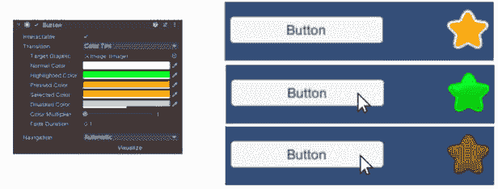

# UI 按钮组件

Unity 的 UI 系统提供的按钮是预先利用我们在上一章中介绍的事件系统的图形对象。当按钮放置在场景中时，它会自动添加组件，允许玩家与之交互。这是有意义的，因为按钮的全部目的就是与之交互。让我们探索如何在我们的游戏中添加和利用按钮。

在本章中，我们将讨论以下主题：

+   创建 UI 按钮并设置其属性

+   如何设置按钮过渡，使按钮在突出显示、按下或禁用时改变外观

+   如何使用不可见按钮区域以允许大触摸区域

+   使用键盘或摇杆在屏幕上导航按钮选择

+   如何创建一个看起来像被物理按下屏幕上的按钮

+   通过按钮点击加载场景

+   创建按钮过渡动画

注意

在“示例”部分之前显示的所有示例都可以在提供的代码包中的 Unity 项目中找到。它们可以在标记为 **Chapter9** 的场景中找到。

每个示例图像都有一个标题，说明场景中的示例编号。

在场景中，每个示例都在自己的 Canvas 上，其中一些 Canvas 已被禁用。要查看已禁用的 Canvas 上的示例，只需在检查器中选择 Canvas 名称旁边的复选框。每个 Canvas 也都有自己的事件系统。如果您同时激活了多个 Canvas，这将导致错误。

# 技术要求

您可以在此处找到本章的相关代码和资产文件：[`github.com/PacktPublishing/Mastering-UI-Development-with-Unity-2nd-Edition/tree/main/Chapter%2009`](https://github.com/PacktPublishing/Mastering-UI-Development-with-Unity-2nd-Edition/tree/main/Chapter%2009)

# UI 按钮

按钮是期望玩家点击的 UI 对象。您可以通过选择具有 `Text` 子对象的 `Button` 对象来创建按钮。与其他所有 UI 对象一样，如果您在创建 `Button` 时场景中没有 Canvas 或事件系统，将为您创建一个 `Canvas` 和 `Event System`，其中 `Canvas` 是您新 `Button` 的父对象：


图 9.1：将新的 UI 按钮添加到场景中

如果您不希望在按钮上显示文本，可以删除子 `Text` 对象。

按钮对象有三个主要组件：**Rect Transform**（类似于所有其他 UI 图形对象）、一个**图像**组件和一个**按钮**组件：


图 9.2：新 UI 按钮的组件

我们将在下一章更详细地讨论**图像**组件，但到目前为止，只需知道**图像**组件决定了按钮在标准状态下的外观。

## 按钮组件

当玩家尝试与按钮交互时，`Button` 将会执行的操作。

**按钮**组件的第一个属性是**交互**属性。此属性确定按钮是否可以通过接受玩家的输入进行交互。默认情况下，它是开启的，但如果你想要禁用按钮，可以将其关闭。

你会看到，当鼠标移出`按钮`的`Rect Transform`范围并释放鼠标时，`按钮`的**点击事件**将不会注册。你设置**点击事件**的方式与我们设置*第八章*中的事件相同。

## 过渡效果

**按钮**组件的第二个属性是**过渡**属性。**过渡**属性决定了按钮在不同状态下视觉上如何反应。这些不同的状态包括**未高亮**（或正常）、**高亮**、**按下**、**选中**或**禁用**。这些过渡是自动执行的，不需要编写代码。

你可以分配四种不同的过渡效果：**无**、**颜色渐变**、**精灵交换**和**动画**。

### 无

将**过渡效果**类型选择为**无**意味着按钮在不同状态下不会在视觉上发生变化。

### 颜色渐变

**颜色渐变**过渡类型将使按钮根据其状态改变颜色。你分配**正常颜色**、**高亮颜色**、**按下颜色**、**选中颜色**和**禁用颜色**。

在以下示例中，你可以看到当鼠标悬停在按钮上（因此高亮显示）时，按钮变为绿色，而当鼠标按下时，按钮变为红色：


图 9.3：第九章场景中颜色交换示例

如果你查看前面的示例，你会注意到按钮在被点击后会变成黄色。这是因为它被**选中**了。要将其恢复到正常颜色，请点击按钮外的任何区域。

要使按钮进入将赋予其**禁用颜色**的状态，按钮的**交互**属性必须被禁用。在以下屏幕截图中，你会看到当**交互**属性开启和关闭时按钮如何变化：


图 9.4：第九章场景中禁用按钮示例

你还可以选择`按钮`本身，这样当按钮被高亮、按下或禁用时，按钮的图像会改变颜色。然而，你可以选择将一个次要图形设置为**目标图形**。这意味着分配给**目标图形**的项目将根据按钮的交互而改变颜色。在以下示例中，一个次要图像被分配为**目标图形**。你会看到按钮没有进行过渡；相反，星形图像进行了过渡：



图 9.5：第九章场景中的目标图形示例

重要的是要注意，这些颜色将给 **目标图形** 的图像着色。因此，它实际上是在 **目标图形** 上叠加了一个颜色覆盖层。如果 **目标图形** 的图像是黑色的，这些着色看起来似乎对图像没有任何影响。注意，默认的 **正常颜色** 是白色。在图像上应用白色着色不会改变图像的颜色。

`1`，此属性将增加图形的透明度。这适用于所有状态（包括正常状态）。

**淡入持续时间** 属性是淡入状态颜色所需的时间（以秒为单位）。

### 精灵交换

**精灵交换** 过渡类型将使按钮在不同状态下显示不同的图像。

你会注意到没有属性可以分配一个精灵用于正常状态。这是因为正常状态将只使用分配给 **图像** 组件的精灵。

我们在 *第六章* 中导入的精灵表单有四个按钮图像，这些图像将有助于演示精灵交换过渡：标记为 `uiElements_39`、`uiElements_40`、`uiElements_41` 和 `uiElements_42` 的图像（如下截图所示）：


图 9.6：我们将使用这些精灵来演示按钮精灵交换

要使按钮在适当的状态下显示这些图像，我们只需将 `uiElements_39` 分配给 `uiElements_40`，然后分配给 `uiElements_41`，接着分配给 `uiElements_42`，最后分配给 **禁用精灵**。我们还需要从按钮中删除子 **文本** 对象：


图 9.7：第九章场景中的精灵交换示例

记住，你可以通过取消选择 **可交互** 来查看 **禁用精灵**。

一个我一直觉得很有吸引力的漂亮的精灵交换动画是将一个看起来按下状态的按钮图像应用到按下图像上。例如，我取了左侧的按钮并稍作编辑，以创建右侧的按钮。变化很小，但我通过稍微向下移动按钮的顶部部分来改变它，使其看起来被按下：


图 9.8：缩进按钮动画表

当并排查看时，看起来没有太大的区别。然而，当左侧的图像用于 **源图像**、**高亮精灵**、**选中精灵** 和 **禁用精灵**，而右侧的图像用于 **按下精灵** 时，按钮会过渡显示一个非常好的按钮按下动画：


图 9.9：第九章场景中的按下按钮示例

要查看实际效果，请查看`Chapter9Scene`中的`Pressed Button Example Canvas`；点击确实非常令人满意。

在*第十一章*中，我们将探讨如何在不使用按钮过渡属性的情况下创建图像交换，例如静音/取消静音按钮。

### 动画

**动画**过渡允许按钮在其各种状态下进行动画处理。

动画过渡类型需要将**动画器**组件附加到按钮上。您可以通过将其拖放到按钮的检查器上来向按钮添加预存在的动画集，或者您可以通过选择**自动生成动画**来创建一个新的**动画控制器**。如果您使用预存在的动画控制器，您可以直接将动画分配给单个状态。但是，如果您生成一个新的动画控制器，您可以从**动画**窗口中的剪辑列表中选择状态，并从该窗口进行编辑。本章的*示例*部分提供了一个具有动画过渡的按钮的示例。

## 导航

按钮具有一个**导航**属性，该属性决定了它们将通过键盘或控制器输入突出显示的顺序：


图 9.10：按钮组件上的导航属性

如果您想导航到场景中的所有按钮，每个按钮都必须设置此属性。如果您还记得从*第八章*，我们讨论了**事件系统**组件的**首次选中**属性。如果您将按钮分配为**首次选中**，则在加载场景时该按钮将被突出显示。如果您随后使用键盘导航按钮，导航将从具有**首次选中**属性的按钮开始。然而，如果您没有将按钮分配为**首次选中**，则导航将不会开始，直到使用鼠标选择了一个按钮。下一个选中的按钮由您为按钮选择的导航选项确定。

有五种**导航**选项：**无**、**水平**、**垂直**、**自动**和**显式**。

选择**无**将禁用所有键盘导航到指定的按钮。请记住，这是针对单个按钮的，因此如果您想禁用所有键盘导航，您必须为所有按钮选择**无**。

**水平**和**垂直**相当直观。如果一个按钮的**导航**属性设置为**水平**，当它被选中时，下一个选中的按钮将水平选择，即使用左右箭头。**垂直**的作用类似；这表示从该按钮导航*离开*，而不是*到达*该按钮。因此，如果一个按钮的**水平**设置为**水平**，并且其导航属性，您仍然可以通过垂直按钮从另一个按钮访问该按钮。

**自动**将允许**按钮**在水平和垂直方向上导航，这由其相对于其他按钮的位置自动确定。

**可视化**按钮允许你看到导航设置的视觉表示。每个按钮都将连接，箭头显示在哪个按钮之后将被选中。每个箭头从按钮的一侧开始，表示按下的方向箭头，并指向按下该箭头时将被高亮的下一个按钮。例如，如果箭头从一个按钮的右侧开始，那么这个箭头表示如果玩家在键盘上按下右键，将选择哪个按钮。以下示例显示了五个按钮的视觉表示，所有按钮的**导航**属性都设置为**自动**：


图 9.11：第九章场景中的导航示例

在前面的示例中，每个按钮都有一个**颜色渐变过渡**属性，将**高亮颜色**和**选中颜色**指定为绿色。标记为**1**的按钮已在**事件系统**中指定为**首次选中**：


图 9.12：将按钮 1 分配给首次选择的系统事件

因此，当场景开始播放时，它将自动被突出显示。根据可视化的图，如果场景加载后键盘上选择了右箭头键，则标记为**2**的**按钮**将被选中：


图 9.13：第九章场景中的导航示例

最后一种**导航**类型是**显式**，它允许进行显著更好的控制。使用这种方式，你可以明确定义每个单独的键盘按键将访问哪个按钮。


图 9.14：显式导航类型的属性

假设你希望玩家按顺序循环操作按钮 1-2-3-4-5，然后循环回到 1。你希望这个操作可以通过上按钮或右按钮完成。之前提到的任何导航方法都无法实现这一点。然而，你可以通过使用**显式**导航类型来实现。本章的第一个逐步示例涵盖了如何创建显式按钮导航映射。

# 不可见按钮区域

在*第二章*中，我们讨论了屏幕上的点击区域。在移动游戏中，通常点击屏幕上的任何位置都会触发一个事件。例如，很多时候，当你选择弹出窗口之外的区域时，它将会关闭。其他例子包括你可以点击屏幕的左侧或右侧来移动角色。点击屏幕上的区域可能看起来不像按钮实现，但实际上它是！按钮只是不可见的。

让我们探索第一个场景。如果你回顾`Chapter9`场景中的`Close Panel Example` GameObject，你会看到一个当按下信息按钮时出现的面板，当按下关闭按钮时关闭，当按下面板外的区域时也会关闭。这是通过在面板后面放置一个大型、不可见的按钮来实现的。为了使其正常工作，它需要位于信息按钮的前面（阻挡对其的射线投射）。


图 9.15：第九章场景中的关闭面板示例

即使背景区域会关闭面板，包含关闭按钮也是一个好的设计选择。许多人不会直观地认为点击面板外部是一个会关闭面板的动作，如果你不提供它，他们可能会花时间寻找关闭按钮。

现在让我们探索第二种场景，其中屏幕的两边会导致不同的动作。在`Tap Zone Example GameObject`中，点击左侧会将拐杖糖向左移动，点击右侧则会将拐杖糖向右移动。再次强调，这里使用了大型的不可见按钮。


图 9.16：第九章场景中的点击区域示例

当使用这些大型的不可见按钮时，非常重要的一点是，你需要考虑射线投射对这些按钮的影响，即使它们是不可见的。它们会阻挡它们后面的东西！

# 示例

在本章的前三个示例中，我们将暂时离开我们一直在工作的场景，构建一个新的场景，以便我们可以实验按钮导航和场景加载。然后，我们将从*第八章*的场景继续，向我们的场景添加一些按钮。

## 通过按钮导航和使用首次选中

我们将构建一个如下所示的外观起始屏幕：


图 9.17：我们将构建的起始屏幕场景

这些按钮中的大多数将是虚拟按钮，但在下一个示例中，我们将设置**播放**按钮，以便加载我们一直在工作的场景。

为了让我们能够实验按钮导航，我们将为它分配一个**显式**的导航方案，这样我们就可以按照以下模式循环遍历按钮：


图 9.18：按钮导航图

首先，将选择**播放**按钮。在键盘上持续按下*下*键将导致以下选择路径：


图 9.19：带有向下箭头的按钮导航流程

持续按下*上*按钮将导致以下路径：


图 9.20：带有向上箭头的按钮导航流程

接下来，我们将学习如何布局按钮。

### 布局按钮

让我们先创建一个新的场景并布局按钮。

要制作如图*图 9.17*所示的模拟启动屏幕，请完成以下步骤：

1.  创建一个新的空场景并将其命名为`Chapter9-Examples-StartScreen`。打开新场景。

1.  为了让这个场景与我们在前几章中制作的场景具有相同的背景，我们可以在**层次结构**中创建另一个`Chapter8-Examples`场景。你现在应该看到以下内容：


图 9.21：同时加载两个场景

1.  选择`Background Canvas`并按*Ctrl* + *D*键进行复制。现在，拖动复制的，标记为`Chapter9-Examples-StartScreen`的场景：


图 9.22：复制背景 Canvas

1.  我们现在可以关闭`Chapter8-Examples`场景，因为我们不再需要它。为此，选择`Chapter8-Examples`场景右侧的三个点，并选择**移除场景**。以防你意外删除了某些内容，当提示时选择**不保存**：

    图 9.23：移除场景

    现在，你应该只看到`Chapter9-Examples-StartScreen`在场景中，并且`Background Canvas`应该可见。

1.  将`Background Canvas (1)`重命名为`Background Canvas`并保存场景。

注意

你会注意到，通过这样做，我们在场景中有一个没有**事件系统**的**Canvas**。虽然这样很好，但一旦我们添加新的 UI 元素，事件系统会自动添加。 

1.  在我们继续之前，我们应该注意在控制台中弹出的警告信息。由于我们从另一个场景复制了`Background Canvas`，它正在尝试访问另一个场景中的相机，但找不到它。

    在`Background Canvas`上也会出现一个警告信息：

    

    图 9.24：Canvas 组件错误信息

    为了解决这个问题，只需将当前场景中的`Main Camera`拖动到**渲染相机**槽中，并将**排序层**设置为**背景**。

    

    图 9.25：分配了主相机的 Canvas 组件

1.  现在，让我们添加“按钮画布”。请注意，一旦你创建了“按钮画布”，就会为你创建一个“事件系统”游戏对象。

1.  创建一个新的 UI 按钮（`Button Canvas`）并赋予它以下**Rect Transform**和**Image**组件属性：


图 9.26：播放按钮的属性

1.  现在，选择子`Play Button`并设置其**Rect Transform**和**Text**组件属性如下：


图 9.27：播放按钮文本的属性

1.  现在，让我们创建一个“成就按钮”、“排行榜按钮”和“信息按钮”，使它们看起来如下所示：

    图 9.28：起始屏幕按钮布局

    要实现前面的布局，使用以下属性，并确保删除它们的子`Text`对象：

    

    图 9.29：三个按钮的属性

1.  现在要设置场景布局剩下的工作就是创建位于场景右下角的“Facebook 按钮”和“Twitter 按钮”。（忽略标志极其过时的实际情况。）为了实现图 9**.26**中的布局，创建两个具有以下属性的按钮：


图 9.30：两个按钮上的属性

你的场景现在应该布局正确，因此让我们着手设置导航。

### 设置显式导航和第一个选中

如果你选择了任何按钮组件中的“可视化”按钮，你应该看到以下导航路径：


图 9.31：自动按钮导航可视化

这种导航设置比我在本例开头描述的设置提供了更广泛的导航范围。这是因为每个按钮的导航都设置为“播放按钮”，它是我们事件系统中的**第一个选中的按钮**。

要设置本例开头描述的导航，完成以下步骤：

1.  通过拖放将`Play Button`选择到**第一个选中**槽位：

    图 9.32：以播放按钮为第一个选中的事件系统

    现在，当我们开始循环遍历我们的按钮时，我们的导航将从“播放按钮”开始。此外，如果我们在这个场景加载时按下*Enter*键，将自动执行“播放按钮”。

1.  现在，让我们将所有按钮设置为具有“显式导航”类型。在“层次”列表中选择所有六个按钮。

1.  选择所有选项后，从下拉菜单中将**导航**类型更改为**显式**。现在，每个按钮在其**按钮**组件中应具有以下设置。

1.  为了使我们的导航更容易看到，让我们将每个按钮上的**选中颜色**属性更改为深红色。它并不非常吸引人，但它将使我们更容易看到按钮是否被选中。您所有按钮上的**按钮**组件现在应如下所示：

    图 9.33：具有颜色色调转换的按钮组件

    如果您玩游戏，您应该看到`播放按钮`着色为红色，表示它已被选中（因为我们已在步骤 1 中将其设置为**第一个选中**）：

    

    图 9.34：播放按钮被选中并着色为红色

1.  现在，我们可以通过拖放它们到适当的槽位来明确（因此得名）设置每个按钮要导航到的按钮。让我们首先设置`播放按钮`，因为它将是第一个被选中的按钮。

    根据图 9.18 至图 9.20，当按下*上*键时，`播放按钮`应导航到`Twitter 按钮`，当按下*下*键时，应导航到`成就按钮`。因此，将这些按钮分别拖放到**上键选择**和**下键选择**的槽位中，从**层次结构**中拖放。

    如果您选中了**可视化**按钮，当您将按钮拖放到它们的槽位时，您应该看到导航可视化开始构建。


图 9.35：播放按钮的导航属性

注意

记住，如果箭头从一个按钮的顶部开始，那么这个箭头表示按下*上*键时导航将去哪里，如果箭头从一个按钮的底部开始，它表示按下*下*键时导航将去哪里。

1.  播玩游戏以检查它是否工作。按下*上*键，你应该看到`Twitter 按钮`变红，表示它已被选中。

    要看到`成就按钮`被选中，您实际上必须停止玩游戏并重新播放，因为我们尚未为`Twitter 按钮`设置返回到`播放按钮`的导航。因此，停止游戏，再次按下播放，然后按下*下*键，您应该看到`成就按钮`高亮显示为红色。

注意

您也可以用鼠标突出显示播放按钮，而不是重新启动游戏，这样您就可以导航到成就按钮。

1.  一旦为一个按钮设置了导航，其余的就不太困难，尽管有些繁琐。使用以下图表来帮助您设置其余按钮：

| **按钮** | **上键选择** | **下键选择** |
| --- | --- | --- |
| `播放按钮` | `Twitter 按钮` | `成就按钮` |
| `成就按钮` | `播放按钮` | `排行榜按钮` |
| `排行榜按钮` | `成就按钮` | `信息按钮` |
| `信息按钮` | `排行榜按钮` | `Facebook 按钮` |
| `Facebook 按钮` | `信息按钮` | `Twitter 按钮` |
| `Twitter 按钮` | `Facebook 按钮` | `播放按钮` |

表 9.1：每个按钮的向上选择和向下选择分配

当你完成时，你的导航可视化应该看起来像以下这样：


图 9.36：最终导航流程可视化

如果你玩游戏，你应该能够通过使用箭头键轻松地在按钮之间循环。

我建议将所有按钮设置为**水平**或**垂直****导航**模式，并观察它们与我们创建的模式的区别，这样你就可以看到这种模式不能通过应用于所有按钮的预定义模式来实现。

## 通过按钮点击加载场景

现在我们已经布置好起始屏幕，让我们将`播放按钮`连接到游戏。首先，使用 *Ctrl* + *D* 复制你在*第八章*中创建的场景，名为`Chapter8-Examples`。新场景应命名为`Chapter9-Examples`。我们的目标是让`Chapter9-Examples-StartScreen`中的`播放按钮`加载`Chapter9-Examples`场景。

要在`Chapter9-Examples-StartScreen`场景中制作`播放按钮`，请加载`Chapter9-Examples`场景并完成以下步骤：

1.  要在 Unity 中切换场景，你必须首先确保它们都列在**构建设置**中的**场景在构建中**列表中。选择**文件** | **构建设置**（或 *Ctrl* + *Shift* + *B*）。以下内容应该可见：


图 9.37：构建设置中没有场景的截图

1.  从`Chapter9-Examples-StartScreen`和`Chapter9-Examples`场景到列表中：

    图 9.38：将场景添加到构建中

    在此列表中场景出现的顺序并不重要，除了第一个场景（在位置**0**列出的场景`Chapter9-Examples-StartScreen`）。

1.  现在我们已经将场景放在你的`LevelLoader`文件夹中的`Scripts`文件夹中。打开新的`LevelLoader`脚本，并用以下代码替换代码：

    ```cs
    using UnityEngine;
    using UnityEngine.SceneManagement;

    public class LevelLoader : MonoBehaviour {

        public string sceneToLoad = "";

        public void LoadTheLevel() {
            SceneManager.LoadScene(sceneToLoad);
        }
    }
    ```

    上述代码包含一个单独的函数——`LoadTheLevel()`。此函数调用`SceneManager`类中的`LoadScene`方法。我们将加载`sceneToLoad`，这是一个在`UnityEngine.SceneManagement`命名空间中指定的字符串，必须在脚本顶部包含以下行：

    ```cs
    using UnityEngine.SceneManagement;
    ```

1.  如果你还没有打开`Chapter9-Examples-StartScreen`场景，请再次打开它。选择`播放按钮`并将`LevelLoader`脚本拖放到其**检查器**中。

1.  现在，在`Chapter9-Examples`中。你不需要用引号括起来；因为`sceneToLoad`变量是一个字符串，所以`Chapter9-Examples`被认为是无需引号的一个字符串：


图 9.39：LevelLoader.cs 脚本组件

1.  现在只剩下连接按钮的点击事件。选择`LevelLoader.cs`，它在`播放按钮`上，所以将`播放按钮`拖放到对象槽中。现在，从函数下拉菜单中选择**LevelLoader** | **LoadTheLevel**。


图 9.40：已连接的 OnClick 事件

就这样！当你点击或当它被高亮（如开始时或使用键盘导航）时，你的`播放按钮`应该会导航到`Chapter9-Examples`场景。

## 按钮动画过渡

通常按钮会以动画的形式出现，以吸引你的注意。让我们给`播放按钮`添加一个动画过渡，这样当它处于正常状态时，它会脉冲以吸引玩家的注意。

要在`播放按钮`上添加按钮动画过渡，请完成以下步骤：

1.  选择`播放按钮`并更改其**过渡**类型为**动画**。

1.  我们没有预构建的动画控制器，所以选择**自动生成动画**来创建一个新的。

1.  将会弹出一个窗口询问你保存新创建的动画控制器。在`Assets`文件夹中创建一个新的文件夹，命名为`动画`，并将新的动画控制器保存为`Play Button`到该文件夹。

    你现在应该能在新的`动画`文件夹中看到新的动画控制器：

    

    图 9.41：项目中的播放按钮动画

    你也会看到新的`播放按钮`：

    

    图 9.42：播放按钮动画组件

1.  通过选择**窗口** | **动画**打开**动画**窗口。如果你想要停靠这个新窗口，请将其停靠在某个位置，这样你仍然可以在打开时看到场景和游戏视图。

1.  选择`播放按钮`并打开**动画**窗口。与过渡状态相关联的各种动画剪辑将在动画剪辑下拉菜单中可见：

    图 9.43：播放按钮上的各种动画

    我们想编辑**正常**过渡状态的动画，所以请确保它被选中（**正常**是默认选中的动画）。

1.  要使按钮看起来像是在脉动，我们想要影响其缩放。选择 **添加属性** | **矩形变换**，然后点击 **Scale** 旁边的 **+** 图标：

    图 9.44：将缩放属性添加到播放按钮

    **Scale** 属性现在应该显示在 **动画** 时间线上：

    

    图 9.45：播放按钮缩放时间线

1.  为了通过缩放实现脉动效果，我们希望按钮从其正常大小开始，变大，然后回到正常大小。时间线上出现的钻石被称为关键帧。为了做到我刚才描述的，我们需要在时间线的正中央再添加一个关键帧。点击时间线顶部（数字出现的地方）将时间线移动到 **0:30** 标记处。然后，选择 **添加关键帧** 按钮来添加一个新的关键帧：


图 9.46：向时间线添加额外关键帧

1.  通过选择左侧的箭头来展开 **Scale** 属性。您会看到，如果您选择任何关键帧，三个缩放方向旁边都会出现数字 **1**。这表明该帧的缩放为 100%（或其正常缩放）：


图 9.47：展开播放按钮的缩放属性

1.  选择中间的关键帧。通过点击数字 **1** 并输入新值来更改数字 `1.2`。您可以在动画窗口中按下播放按钮来预览您的动画。您会看到按钮现在在场景中脉动。

    当您播放游戏时，您的按钮现在应该会脉动（并且不会再变红）。请注意，它不会立即脉动，因为按钮只有在正常状态下才会脉动。由于我们将其设置为 **首先选中**，它在开始时就会被选中。要取消选择，只需在按钮外的场景中单击任何位置或使用键盘导航离开。一旦按钮不再被选中，它应该开始脉动。

1.  让我们恢复红色选择，因为它使得判断按钮是否被选中变得容易（即使它不够吸引人）。从动画列表下拉菜单中选择 **Selected** 动画。


图 9.48：为播放按钮选择 Selected 动画

1.  选择 **添加属性** 按钮，然后选择 **图像** | **颜色**。


图 9.49：将颜色属性添加到播放按钮时间线

1.  通过选择第二个关键帧并按下 *Delete* 键来删除它。

1.  分别将剩余关键帧上的 `1`、`0`、`0` 和 `1` 进行更改。


图 9.50：调整播放按钮的颜色属性

现在你玩游戏时，`播放按钮`在没有被选中时应该会闪烁，当被选中时变为红色。

这标志着关于按钮的示例的结束，但我们将继续在未来的章节中使用它们。

# 摘要

一旦你学会了如何使用事件系统，使用按钮就只是个简单的扩展。按钮是最常见的交互式 UI 元素，因此掌握它们对于有效的 UI 开发至关重要。虽然将它们设置成点击时能工作只是过程的一半。如果你将为 PC、Mac 或控制台开发，你还需要确保你的按钮导航设置正确。

我们还没有完成按钮！我们将在这本书的整个过程中使用它们。一旦我们更深入地探索了图像组件，我们将介绍更多有趣的按钮实现和过渡。

在下一章中，我们将介绍 UI 文本组件！
