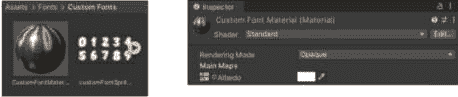

# 10

# UI 文本和 TextMeshPro

我们已经花费了一些时间与 UI 文本对象一起工作，因为它们是最基本的图形 UI 元素之一。我们在*第六章*中简要讨论了它们，因为在不显示任何可视内容的情况下开始布局 UI 是相当困难的。文本对象也是新按钮的子对象，我们在上一章中讨论了它们。然而，我们还没有探索文本对象的属性或如何在代码中与它们一起工作。

在本章中，我们将更深入地探讨 **UI 文本**对象。我们还将讨论 **Text-TextMeshPro** 对象以及它们如何允许我们在游戏中对文本有更多的控制。

在本章中，我们将讨论以下主题：

+   使用 UI 文本对象并设置它们的属性

+   使用 TextMeshPro - 文本对象和设置它们的属性

+   与字体和字体资产一起工作

+   使用标记格式与 UI 文本对象以及样式表与 TextMeshPro 对象

+   创建看起来像在逐字输入的动画文本

+   开发一个允许轻松文本翻译的系统

+   为 UI 文本对象创建一个自定义字体

+   创建沿曲线环绕并带有渐变的文本

注意

本节中显示的所有示例都可以在本书中提供的 Unity 项目中找到。它们可以在 **Chapter10** 场景中找到。

每个示例图像都有一个标题，说明场景中的示例编号。

在场景中，每个示例都在自己的画布上，其中一些画布已被禁用。要查看禁用画布上的示例，只需在 **检查器** 中选择画布名称旁边的复选框。每个画布也都有自己的事件系统。如果你同时激活多个画布，这将会导致错误。

# 技术要求

你可以在此处找到本章的相关代码和资产文件：[`github.com/PacktPublishing/Mastering-UI-Development-with-Unity-2nd-Edition/tree/main/Chapter%2010`](https://github.com/PacktPublishing/Mastering-UI-Development-with-Unity-2nd-Edition/tree/main/Chapter%2010)

# UI 文本 GameObject

你可以使用 **+** | **UI** | **Text** 创建一个新的 UI 文本对象：


图 10.1：UI 文本 GameObject 检查器

UI 文本 GameObject 包含 **Rect Transform** 和 **Canvas Renderer** 组件，以及 **Text** 组件。

UI 文本组件为附加到其上的对象提供了一个非交互式的文本显示。这个组件不能创建你可能感兴趣的所有类型的文本，但它允许显示大多数基本的文本。

## 文本和字符属性

**文本**属性会改变将要显示的文本。在这个框内输入的任何内容都会在文本对象中显示。

在**文本**属性下方是一组**字符**属性。这些属性允许您更改**文本**属性字段中单个字符的属性。

**字体**属性决定了整个文本块使用的字体。默认情况下，**字体**设置为**Arial**。要使用任何其他字体，您必须将字体导入到您的**资产**文件夹中。有关如何导入额外字体的信息，请参阅*处理字体*部分。

**字体样式**提供了一个下拉列表，列出了与提供的字体一起提供的字体样式。可能的样式有**正常**、**粗体**、**斜体**和**粗体和斜体**：


图 10.2：UI Text 组件的字体样式选项

注意

需要注意的是，并非所有字体都支持列出的所有字体样式。

**字体大小**决定了文本的大小，而**行间距**表示文本每行之间的垂直间距。

如果选择**富文本**属性，你可以在**文本**属性字段中包含标记标签，并且它们将以**富文本**样式显示，而不是以输入的样式显示。如果此属性未选择，文本将显示为输入的样式。有关使用**富文本**的更多信息，请参阅*标记格式*部分。

## 段落属性

下一个属性集——**段落**属性（*图 10**.1*）——允许您确定文本如何在（或超出）Rect Transform 的边界内显示。

**对齐**属性决定了文本将根据 Rect Transform 边界对齐的位置。您可以同时选择水平和垂直对齐选项。按钮代表相对于 Rect Transform 边界的位置，因此左对齐将使文本推到 Rect Transform 左边界的外边缘：


图 10.3：UI Text 组件的对齐选项

**按几何对齐**属性将文本对齐，好像字符或字符被裁剪到它们的不透明区域而不是它们覆盖的区域。这种裁剪基于它们的字符映射。这可以提供更紧密的对齐，但也可能导致重叠。

**水平溢出**属性决定了文本如果太宽而超出 Rect Transform 区域时会发生什么。有两个选项：**换行**和**溢出**。**换行**会使文本继续在下一行，而**溢出**会使文本扩展到矩形区域之外：


图 10.4：第十章场景中的水平溢出示例

**垂直溢出**属性决定了当文本长度超出矩形变换区域时文本的处理方式。有两种选项：**截断**和**溢出**。**截断**会将矩形区域外的所有文本截断，而**溢出**则会导致文本扩展到矩形区域之外。在下面的图中，两个文本框具有相同的文本，但**截断**移除了最后两行文本，因为它们位于矩形区域之外，而**溢出**允许文本超出框外：


图 10.5：第十章场景中的垂直溢出示例

**最佳适配**属性尝试调整文本大小，使其全部适合矩形区域。当你选择**最佳适配**属性时，将出现两个新的属性：**最小尺寸**和**最大尺寸**。这些属性允许你指定字体大小可以保持的范围。

请记住，根据你写的文本，**水平溢出**属性可能会导致其工作方式与你的预期略有不同。


图 10.6：第十章场景中的最佳适配示例

例如，图*10**.6*中的两个文本框都选择了**最佳适配**，但第一个将**水平溢出**设置为**换行**，而第二个设置为**溢出**。

## 颜色和材质属性

**颜色**和**材质**属性允许你调整文本字体的外观。**颜色**属性将设置文本的基本渲染颜色，并且是更改字体颜色的最快方式。默认情况下，此属性设置为非常暗（不是全黑）的灰色。**材质**属性允许你为字体分配材质。这为你提供了更多控制字体外观的能力，并允许你应用特定的着色器。默认情况下，此属性设置为**无**。

## 光线投射和可遮罩属性

**光线投射目标**属性决定了对象的矩形变换区域是否会阻止光线投射。如果此属性被选中，则点击不会在它后面的 UI 对象上注册。如果没有选中，则可以点击对象后面的项目。如果你希望文本阻止光线投射，但不是在整个区域上，你可以使用各种**光线投射****填充**属性调整区域。

最后一个属性，**可遮罩**，决定了文本是否可以被遮罩。我们将在*第十二章*中讨论这一点。

# 文本-TextMeshPro

在 UI 文本方面，你可以做的事情有一些限制。如果你发现自己想要使用文本完成一些 UI 文本无法完成的格式化，你可能可以使用 TextMeshPro GameObject 来完成。例如，如果你想使用带下划线的文本，我建议使用 TextMeshPro GameObject。TextMeshPro 资产允许进行显著更多的文本控制。此外，它的渲染允许文本在比标准 UI 文本更多的分辨率和点大小上清晰显示。

TextMeshPro 以前是 Unity Asset Store 中的付费资产，但大约在 2017 年 3 月被 Unity 采用，现在免费提供。然而，要使用 TextMeshPro 资产，你必须下载必要的资源。要下载 TextMeshPro 资源，请尝试通过前往 **+** | **UI** | **Text - TextMeshPro** 将 TextMeshPro - Text 添加到场景中；你将看到以下弹出窗口：


图 10.7：TMP 导入器

选择 **导入 TMP Essentials** 以获取所有必要的资产。我还建议选择 **导入 TMP 示例 &** **附加内容**。

注意

从 UI 菜单中选择任何 TextMeshPro GameObject（文本 - TextMeshPro、按钮 - TextMeshPro、下拉列表 - TextMeshPro 或输入字段 - TextMeshPro）将弹出先前的截图，并允许你下载必要的资源。

下载后，你将不再需要这样做。

由于 TextMeshPro 的强大功能，我很遗憾不能在本章中涵盖你所能用它做的所有事情。相反，我将提供一个关于其功能的广泛概述。幸运的是，TextMeshPro 资产附带许多示例和良好的文档，可以在以下位置找到：

[`docs.unity3d.com/Packages/com.unity.textmeshpro@4.0/manual/index.xhtml`](https://docs.unity3d.com/Packages/com.unity.textmeshpro@4.0/manual/index.xhtml)

当你创建一个新的 **TextMeshPro - Text** GameObject 时，你将看到一个具有以下组件的 GameObject：


图 10.8：TextMeshPro - Text 组件

你还可以通过 **GameObject** | **3D Object** | **Text-TextMeshPro** 在 Unity 的 UI 系统之外创建 Text-TextMeshPro GameObject。这将使文本独立于 UI 和 Canvas 渲染。

GameObject 本身将被命名为 **Text (TMP)**，为了简便起见，这就是我将如何引用它的方式。

与所有其他 UI 对象一样，GameObject 上也附加了 **Rect Transform** 和 **Canvas Renderer** 组件。**Text (TMP)** GameObject 的图形显示由 **TextMeshPro - Text (****UI)** 组件控制。

让我们调查 **TextMeshPro – Text (****UI)** 组件的属性。

## 文本输入属性

你可以在 **Text** **Input** 部分输入你希望显示的文本：


图 10.9：TextMeshPro - 文本组件的文本输入设置

**启用 RTL 编辑器**属性允许您创建从右到左显示的文本，这对于某些语言是必要的。当您选择它时，文本将以从右到左的顺序出现在第二个区域：


图 10.10：TextMeshPro - 文本组件的 RTL 文本输入设置

**文本样式**设置允许您指定文本的样式。您将在下拉菜单中看到多个预定义选项：


图 10.11：TextMeshPro - 文本组件的文本样式设置

我们将在本章的*样式表*部分更详细地探讨如何使用它。

## 主设置

**主设置**部分允许您调整文本的所有属性：


图 10.12：TextMeshPro - 文本组件的主设置部分

`LiberationSans SDF (TMP_Font Asset)`。我想指出，字体和字体资产是两回事。字体用于 UI 文本游戏对象，而字体资产用于 TextMeshPro 游戏对象。我将在*与字体* *一起工作* *部分讨论这些差异，以及如何导入新字体和创建新字体资产。

**字体资产**属性需要一个材质来渲染。任何包含字体资产名称的材质都将出现在**材质预设**列表中。您可以创建自己的材质，但创建新字体资产时，它将附带一个默认材质。此处选择的任何材质也将出现在组件底部的**额外设置**下方。从此区域，您还可以选择材质的着色器：


图 10.13：TextMeshPro - 文本的材质属性

**字体样式**属性允许您为文本创建基本格式。您可以从**粗体**、**斜体**、**下划线**、**删除线**、**小写**、**大写**或**小写字母**中选择。您可以选择前四个设置中的任何组合；然而，您只能选择**小写**、**大写**或**小写字母**。

**字体大小**属性按您预期的功能工作，但您还可以选择**自动大小**。**自动大小**属性将尝试根据您指定的属性，尽可能地将文本适应 Rect Transform 的边界框内：


图 10.14：TextMeshPro - 文本组件的字体大小属性

您可以指定最小（**Min**）和最大（**Max**）字体大小，以及**WD%**和**行**属性。**WD%**属性允许您水平挤压文本以使字符更高，而**行**属性允许您指定行高。

您可以使用**顶点颜色**属性或**颜色****渐变**属性来更改文本的颜色：


图 10.15：TextMeshPro - Text 组件的颜色属性

使用`<color>`标记标签的示例。

您可以在**间距****选项**区域设置**字符**、**单词**、**行**和**段落**之间的间距。

在 TextMeshPro-Text 中，您可用的**对齐**选项比标准 UI Text 多得多。

就像 UI Text 一样，您可以选择启用或禁用**换行**。然而，您有更多的**溢出**选项，如下面的截图所示：


图 10.16：TextMeshPro - Text 组件的溢出选项

**溢出**和**截断**与 UI Text 对象上的功能类似。在其他选项中，我只想提到当前的**省略号**选项。它将文本截断到文本框区域，但会添加省略号（…）：


图 10.17：第十章场景中的 Text Mesh Pro 溢出示例

**水平映射**和**垂直映射**属性允许您影响纹理在文本上的显示方式：


图 10.18：TextMeshPro - Text 组件的水平映射选项

您在**文本输入**部分和**主要设置**部分所做的大部分自定义字体工作，但让我们看看一些更细致的设置，您将使用字体进行调整。

## 额外设置

**额外设置**菜单必须展开才能可见。它允许您调整字体的一些不太常见的设置：


图 10.19：TextMeshPro - Text 额外设置部分

在此菜单中，最显著的属性是添加**边距**和启用**射线投射目标**的能力。

最后，您可以指定是否要**启用字距调整**或允许**额外填充**。选择**字距调整**将使用字体文件提供的字距调整数据。选择**额外填充**将在精灵的精灵图集上的字符周围添加一些填充。

注意

您可以在此处了解我略过或跳过的任何属性：[`docs.unity3d.com/Packages/com.unity.textmeshpro@4.0/manual/TMPObjectUIText.xhtml`](https://docs.unity3d.com/Packages/com.unity.textmeshpro@4.0/manual/TMPObjectUIText.xhtml)。

## TextMeshPro 项目设置

除了可以通过组件调整场景中每个 TextMeshPro 对象的个别设置外，您还可以通过 **项目设置**（**编辑** > **项目设置**）调整 TextMeshPro 的项目级设置：


图 10.20：TextMeshPro – 项目设置

这些设置允许您为新创建的 TextMeshPro 对象设置各种默认值。您可以在[`docs.unity3d.com/Packages/com.unity.textmeshpro@4.0/manual/Settings.xhtml`](https://docs.unity3d.com/Packages/com.unity.textmeshpro@4.0/manual/Settings.xhtml)了解更多关于每个属性的信息。

# 与字体一起工作

极有可能您不会想使用默认的 **Arial (UI 文本**) 或 **Liberation Sans (TMP 文本**) 字体，而希望将自定义字体引入到您的项目中。让我们来探讨如何找到这些文本资源并在您的项目中使用它们。

注意

您不需要在计算机上安装字体（用于 Unity 之外的程序）即可在 Unity 中使用该字体。

## 导入新字体

Unity 接受的字体文件格式是 `.tff` (TrueType) 和 `.otf` (OpenType)。您可以从多个地方获取这些文件。我最喜欢的寻找字体的地方如下：

+   *Google* *Fonts*: [`fonts.google.com/`](https://fonts.google.com/)

+   *DaFont*: [`www.dafont.com/`](http://www.dafont.com/)

+   *字体* *Squirrel*: [`www.fontsquirrel.com/`](https://www.fontsquirrel.com/)

在 *Google Fonts* 上的所有字体都是开源的，并且可以免费用于个人或商业用途（至少在撰写本书时是这样），但 *Font Squirrel* 和 *DaFont* 上的字体有不同的许可选项。在使用之前，请确保您获得的字体具有满足您需求的许可协议。

下载您选择的字体后，只需将字体拖放到您项目中的 `Assets` 文件夹。我强烈建议您在 `Assets` 文件夹内创建一个名为 `Fonts` 的文件夹，并将所有字体文件放置其中。

然后，如果您选择，可以在 **检查器**中调整字体的导入属性。以下截图显示了从 Google Fonts 下载的 **BungeeShade-Regular** 字体的导入设置：


图 10.21：Bungee Shade-Regular 字体的检查器

在这里，您可以调整许多有关字体如何被引擎处理的设置。

### 字体大小

**字体大小**设置决定了字体在其 Unity 创建的纹理图集中的显示大小。增加或减少**字体大小**设置将改变纹理图集中各种字符的大小。如果你的字体在游戏中看起来模糊，调整**字体大小**设置可能会改善其外观。

### 渲染模式

**渲染模式**设置告诉 Unity 如何平滑字符。可能的选项有**平滑**、**提示平滑**、**光栅**和**OS 默认**。

**平滑**渲染模式是最快的渲染模式。它使用抗锯齿渲染，这意味着它会平滑掉锯齿状、像素化的边缘。**提示平滑**渲染模式也会平滑边缘，但它将使用字体数据文件中包含的“提示”来确定如何填充这些锯齿边缘。这比**平滑**渲染模式慢，但可能看起来更清晰，更容易阅读。**提示光栅**渲染模式不提供抗锯齿，而是提供带锯齿或锯齿状的边缘。这是最清晰且最快的渲染模式。**OS 默认**将默认为 Windows 或 Mac OS 上操作系统的偏好设置。这将从**平滑**或**提示平滑**中选择。

### 字符

**字符**属性决定了哪个字体字符集将被导入到字体纹理图集中。有六个选项：**动态**、**Unicode**、**ASCII 默认集**、**ASCII 大写**、**ASCII 小写**和**自定义集**：

将**字符**属性设置为**动态**（默认值）将只包括所需的字符。这减少了字体所需的纹理大小，从而减少了游戏的下载大小。

**Unicode**用于那些在 ASCII 字符集中不支持的语言。例如，如果你想显示日语文本，你将需要使用**Unicode**。

如果你想在脚本中包含**Unicode**字符，你需要用 UTF-16 编码保存它们。这将允许你直接在代码中以字符串形式输入**Unicode**字符，以便它们可以在屏幕上的 Text 对象中显示。

由**Google Fonts**提供的**Noto 字体**支持多种语言，如果你想要创建一个被翻译成多种语言的游戏，这些字体会非常有帮助。**Noto 字体**可以在[`www.google.com/get/noto/`](https://www.google.com/get/noto/)找到。

**美国信息交换标准代码**（**ASCII**）是一组来自英语字符集的字符。**ASCII**字符集的三种变体允许你在完整集、仅大写或仅小写字符之间进行选择。你可以在[`ascii.cl/`](http://ascii.cl/)找到**ASCII**字符列表。

**自定义集**字符将允许您导入您自己的纹理图集以用于您自己的自定义字体。我发现这通常在开发者想要具有极小字符集的美化文本时最常用，例如仅数字。

### 上升计算模式

字体的**上升**是指字体基线与最高字形点之间的距离。这个所谓的**最高字形点**的确定没有标准，因此 Unity 提供了不同的模式供选择，每种模式确定不同的**最高字形点**。**上升计算模式**属性确定上升将如何计算。有三种选择来决定这种计算方式：**旧版 2 模式（字形边界框）**、**面上升度量**和**面边界框度量**。选择的方法可能会影响字体的垂直对齐。

**旧版 2 模式（字形边界框）**使用字体字符集中列出的任何字形的最高点作为高度来测量上升。这仅使用字符集中列出的字形，并且并非所有字形都可能包含在该集中。**面上升度量**使用定义来测量上升的面上升值，而**面边界框度量**使用面边界框来测量上升。

字体排印比许多人想象的要复杂得多，而且在这个书中完全涵盖它也太复杂了——更不用说，我并不是字体排印专家。如果您想了解更多关于字形度量信息，可以在[`www.freetype.org/freetype2/docs/glyphs/glyphs-3.xhtml`](https://www.freetype.org/freetype2/docs/glyphs/glyphs-3.xhtml)找到一篇很好的介绍。

### 动态字体设置

当您使用动态字符集导入您的字体时，将提供两个新的设置：**包含字体数据**和**字体名称**。

**包含字体数据**会在游戏中构建字体文件。如果不选择此选项，游戏将假定玩家已经在他们的机器上安装了字体。如果您正在使用从网络上下载的字体，那么最终用户很可能没有安装该字体，您应该选择**包含字体数据**。

**字体名称**是 Unity 在找不到字体时将回退到的字体名称列表。如果字体不包含请求的字形或**包含字体数据**属性未选中且用户没有在他们的机器上安装字体，它将需要回退到这个字体名称。如果 Unity 找不到字体，它将在游戏的项目文件夹或用户的机器上搜索与**字体名称**中列出的名称之一匹配的字体。一旦字体被输入到**字体名称**中，适当的字体将在**项目中的其他字体引用**部分列出：


图 10.22：Roboto-Regular 字体的检查器

如果 Unity 找不到列出的字体之一，它将使用 Unity 中预定义的回退字体列表中提供的字体。

一些平台在其系统中没有内置字体，或者无法访问内置字体。这些平台包括 WebGL 和一些控制台系统。当构建到这些平台时，Unity 将始终包含字体，无论选择的“包含”**字体数据**设置如何。

### 导入字体样式

如果您引入了一个具有多种样式（即粗体、斜体或粗体和斜体）的字体，您必须引入所有字体样式，以便它们能够正确显示。将字体引入您的项目可能不足以让字体识别在选择了**粗体**、**斜体**和**粗体和斜体**字体样式时应该使用哪种字体。例如，以下截图显示了顶行文本上的**Roboto-Regular** Google 字体和**粗体和斜体****字体样式**，以及底行文本上的**Roboto-BoldItalic** Google 字体和**正常****字体样式**：


图 10.23：Roboto 字体的样式

如果**字体样式**属性工作正常，两行应该匹配。然而，如您所见，它们并不匹配。要使字体正确显示，请选择常规字体，重新输入**字体名称**属性，使所有适当的字体都出现在字体列表中（如图*图 10.22*所示），然后按**应用**。完成此操作后，两个字体应该看起来相同：


图 10.24：正确应用 Roboto 字体的样式

现在我们已经回顾了如何导入字体，让我们看看如何创建自定义字体。

## 自定义字体

您可以通过从项目窗口中选择**创建** | **自定义字体**来创建自定义字体。要使用自定义字体，您将需要一个字体材质和字体纹理。如何做到这一点在本章的*示例*部分中有所说明。一旦您创建了您的自定义字体，您将获得以下属性来设置：


图 10.25：自定义字体的检查器

**行间距**属性指定了每行文本之间的距离。

数字`0`，它是 ASCII 索引`48`。因此，您可以将`48`设置为表示该字体字符集中的第一个字符是数字 0。您可以在 [`ascii.cl/`](http://ascii.cl/) 确定单个字符的 ASCII 索引号。

**Tracking** 属性表示一行文本中字符之间的间距。它允许所有字符之间的间距保持一致。

**Kerning** 属性已被 **Tracking** 属性所取代。**Tracking** 和 **Kerning** 都是关于字符间间距的属性，但它们是不同的。更多信息，请参阅 [`www.practicalecommerce.com/Typography-101-The-Basics`](http://www.practicalecommerce.com/Typography-101-The-Basics)。

**Character Spacing** 是字符间的空间量，而 **Character Padding** 是在间距之前围绕单个字符的填充量。

**Character Rects** 属性确定字体中总共有多少个字符。将数字从 0 更改为任何正数将提供一个可以展开的 **Elements** 列表：


图 10.26：自定义字体的字符矩形

每个元素代表字符集中的一个字符。**Index** 是指定字符的 ASCII 索引。

`.2` 和 `.5`。这应该适用于你所有的字符。**X** 和 **Y** 值是通过将 **W** 和 **H** 值乘以字符所在的列或行来确定的。

`50` 和 `-50`，分别。坦白说，我并不完全清楚为什么高度属性总是负数，我也似乎找不到答案。我怀疑这与它使用纹理坐标有关。**Vert** 的 **X** 和 **Y** 值代表位置的变化，这些数字可以是负数或正数。

**Advance** 设置表示特定字符与下一个字符之间的像素距离。

**Flipped** 设置指示字形是否翻转以及应该如何显示。

请参考 *示例* 部分，了解如何计算自定义字体的 **UV**、**Vert** 和 **Advance** 值。

在撰写本文时，Unity 的文档中并未完全定义自定义字体的所有属性，其中一些属性有些模糊不清。例如，**Convert Case** 以前是一个下拉菜单，现在我并不清楚它现在是如何使用的，因为它只接受数字输入。也许在未来，这些属性将得到更好的定义，手册也将更新以反映所做的新的更改，请参阅 [`docs.unity3d.com/Manual/class-Font.xhtml`](https://docs.unity3d.com/Manual/class-Font.xhtml)。

## 字体资源

请记住，TextMeshPro 对象需要使用字体资源，而不是字体。所以，如果你为你的项目下载了一些字体，你不会在 TextMeshPro 对象中看到它们作为可能的字体选项。如果你已经导入了 TextMeshPro 示例，你可能除了 Liberation Sans 之外没有其他选项。要在 TextMeshPro GameObject 中使用不同的字体，你不能简单地拖动一个新的字体到 **Font Asset** 槽中；你必须通过 **Font** **Asset Creator** 创建一个字体资源。

要访问**字体资产创建器**，请选择**窗口** | **TextMeshPro - 字体资产创建器**。这将允许您将字体文件转换为 TextMeshPro 可以使用的字体资产：


图 10.27：字体资产创建器窗口

有很多设置可以通过**字体资产创建器**来控制。您可以在 https://docs.unity3d.com/Packages/com.unity.textmeshpro@4.0/manual/FontAssetsCreator.xhtml?q=font%20asset%20creator 找到这些设置的详细说明。我将在本章的**示例**部分介绍创建字体资产的过程。

# 探索标记格式

类似于 HTML 的标记语言可以包含在 `<tag>您想要格式化的文本</tag>` 格式的文本字段中，其中您将 `tag` 替换为适当的标签。这些标签可以嵌套，就像在 HTML 中一样。

要在**文本**对象上使用标记格式，您必须首先在**文本**组件中选择**富文本**属性。默认情况下，它适用于**TextMeshPro**对象。

此格式化允许您更改字体样式、字体颜色和字体大小。以下图表列出了执行指定格式化所需的标签：

| **Format** | **Tag** |
| --- | --- |
| `Bold` | `b` |
| `Italic` | `i` |
| `Color` | `color` |
| `Size` | `size` |

表 10.1：格式及其标签

现在，让我们看看如何使用标记来更改字体的样式。

## 字体样式

您可以使用加粗和斜体标签来更改文本的字体样式。

要给文本添加加粗字体样式，请将 `<b></b>` 标签添加到您想要加粗的文本周围。要给文本添加斜体字体样式，请将 `<i></i>` 标签添加到您想要斜体的文本周围。


表 10.2：格式化标签示例

现在，让我们看看如何使用标记来更改字体的颜色。

## 字体颜色

您可以使用数字的十六进制值表示或使用颜色名称来更改字体颜色。要更改文本颜色，请将 `<color=value></color>` 添加到您想要着色的文本周围，其中您放置十六进制值（后跟一个 #）或颜色名称，其中出现单词 value。

只有有限的颜色名称可以替换十六进制值。可识别的颜色名称包括黑色、蓝色、棕色、青色、深蓝色、绿色、灰色、浅蓝色、黄绿色、洋红色、栗色、海军蓝、橄榄绿、橙色、紫色、红色、银色、青绿色、白色和黄色。您还可以用青色代替青色，用品红色代替洋红色。

当使用颜色标签时，任何未用颜色标签包围的文本将根据所选的**颜色**属性进行着色。

以下表格显示了如何使用颜色标签：


表 10.3：颜色格式化标签示例

现在，让我们看看如何使用标记来更改字体的大小。

## 字体大小

要更改字体大小，请将 `<size=#></size>` 标签添加到您想要调整大小的文本周围。任何不在标签内的文本都将根据 `size` 标签的大小进行调整：


表 10.4：多个字体大小标签的示例

到目前为止，我们已经探讨了我们可以使用标记格式化字体的方式。现在，让我们看看如何使用样式表来格式化字体。

# 使用样式表

除了上一节中描述的标记标签之外，TextMeshPro 对象还可以使用样式表标签。如您从*图 10**.9*中回忆的那样，**TextMeshPro - Text (UI)**组件有一个标记为**Text Style**的属性，在其下拉菜单中有十个选项。从那里，您可以选择以下图中显示的任何一种样式：


图 10.28：默认样式表中的各种默认样式

所有这些样式都是由分配给**Project Settings**中的**TextMeshPro Settings**的**Default Style Sheet**选项预定义的（正如我们在*TextMeshPro Project* *Settings*部分所讨论的）。


图 10.29：项目设置中的默认样式表设置

在`Assets`文件夹中的`Default Style Sheet`内的`Default Style Sheet (TMP_Style Sheet)`对象上单击：


图 10.30：资源中的默认样式表资产

您可以查看`Default Style Sheet`资产的**Inspector**，并查看每个默认样式表标签是如何定义的：


图 10.31：默认样式表的属性

您可以通过编辑此资产来更改这些标签的名称和属性。您可以添加和删除标签。

您还可以创建一个新的样式表并将其设置为默认样式表。要创建一个新的样式表，在`Assets`文件夹内右键单击并选择**Create** | **TextMeshPro** | **Style Sheet**。

您可以通过下拉菜单应用这些样式，就像我在本节开头所演示的那样，或者您可以通过使用`<style>`标签以标记格式将它们分配给文本的某些部分。例如，如果您想显示*图 10**.32*中显示的文本，您可以通过在**Text**字段中输入`Here's <style="Title">how</style> to use styles <style="Link">in-line</style>!`来实现：


图 10.32：以标记方式内联使用的样式

现在我们已经回顾了如何使用标记格式化字体，接下来让我们探索如何使用各种 Text 组件属性，并进行翻译。

# 翻译文本

如果您正在创建包含文本的游戏，您可能希望翻译这些文本。为了确保您的游戏易于翻译，您可以通过执行一些关键操作来简化不同语言之间的转换。

你需要确保你计划翻译的文本在翻译后如果变长或变短，仍然可以适应必要的区域。你可以通过使用**文本组件**的**根据几何对齐**和**最佳匹配**属性来实现这一点。这将使文本适应所需的空间。你也可以使用内容大小适配器（我们在*第七章*中讨论过）来确保围绕文本的任何面板都会收缩或扩展以完美地围绕文本。如果你不介意字体大小在不同语言间变化，可以使用第一个选项。如果你希望字体大小在不同语言间保持一致，可以使用第二个选项。请记住，一些语言可以在非常小的空间内渲染一个短语，而其他语言则会在非常大的空间内渲染。

使用可以支持你将要翻译的语言的字体。如果可能，一个适用于所有语言的单一字体将是首选，因为它将在所有翻译中保持一致的风格。你花了那么多时间挑选完美的字体！你不想在翻译你的游戏时所有这些都付诸东流，而字体无法渲染该语言的全部符号！这不是一个华丽或特别时尚的字体，但一个可以翻译成*许多*语言的字体是 Noto Sans 字体家族。如果你知道你将翻译成很多语言，你可能想要考虑它：[`fonts.google.com/noto/fonts`](https://fonts.google.com/noto/fonts).

如果你计划翻译成从右到左渲染的语言，例如阿拉伯语，你需要使用 TextMeshPro 对象，而不是 Text 对象，因为它将允许你从 RTL 渲染文本。

注意

在写作时，虽然 TextMeshPro 能够从右到左渲染文本，但它并不完全支持从右到左的语言。如果你想在你游戏的 UI 中显示阿拉伯语、波斯语和/或希伯来语，我推荐以下包：[`github.com/pnarimani/RTLTMPro`](https://github.com/pnarimani/RTLTMPro).

你也许还会欣赏以下关于渲染从右到左文本的教程：[`allcorrectgames.com/insights/unity-from-right-to-left/`](https://allcorrectgames.com/insights/unity-from-right-to-left/).

以下也是一个非常有用的资源，因为它分解了如何为你的项目构建本地化解决方案，并讨论了从右到左的文本翻译：[`phrase.com/blog/posts/localizing-unity-games-official-localization-package/`](https://phrase.com/blog/posts/localizing-unity-games-official-localization-package/).

在*示例*部分，我提供了一个小型示例，重点关注翻译的 UI 布局和字体方面。

# 示例

在本章中，我们将进一步扩展我们一直在构建的场景，并添加一个位于我们的起始屏幕和主游戏屏幕之间的新场景。

## 创建动画文本

首先，我们将创建一个新的场景，它将作为我们的起始屏幕和游戏场景之间的*场景过渡*。它将包括我们的猫自我介绍。文本将以类似打字的方式动画化，用户可以通过按按钮来加快速度。一旦文本完全显示，按下相同的按钮将显示下一个文本块或转到游戏场景。文本窗口将如下所示：


图 10.33：我们的动画文本框的最终结果

让我们先创建一个预制件以节省我们一些开发时间。

### 创建背景画布预制件和新的场景

在我们开始制作动画文本之前，我们需要构建我们的场景。在我们迄今为止创建的两个场景中，我们都使用了`背景画布`来显示背景图像，我们将在新的场景中再次使用它。

由于我们将多次使用这个`Background Canvas`，我们应该创建一个`Background Canvas`预制件。正如我们在前一章中学到的，**预制件**是一个可重复使用的 GameObject。在场景中使用预制件会在场景中创建预制件的实例。如果你对保存的预制件进行了更改，更改将反映在所有未断开的预制件实例中，这些实例位于所有场景中。

要创建一个可重复使用的`Background Canvas` prefab GameObject，请完成以下步骤：

1.  打开`Chapter9-Examples`场景。

1.  将`Background Canvas` GameObject 从层次结构拖动到`背景画布`文件夹内的`预制件`文件夹中。现在在**层次结构**中`Background Canvas`应该显示为蓝色（表示它是一个预制件）。

1.  让我们创建一个新的场景，我们将在这个场景中使用这个`Background Canvas`预制件。创建一个名为`Chapter10-Examples-IntroScene`的新场景，并将其保存在`Scenes`文件夹中。

1.  从**项目**视图中将`Background Canvas.prefab`拖动到新场景中。

1.  将`主摄像机`分配给`背景画布`，并确保**排序层**设置为**背景**。

现在，我们可以开始设置将包含我们的动画文本的窗口。

### 布局文本框窗口

要创建将显示我们的文本的文本框窗口，请完成以下步骤：

1.  创建一个新的 UI 画布，并将其命名为`文本画布`。设置其**画布**和**画布缩放器**属性，如图所示：


图 10.34：文本画布检查器

1.  创建一个新的 UI Image，并将其命名为`TextHolder1`。将它的锚点和支点设置为`uiElements_10`到**源图像**，然后选择**设置原生大小**以使图像的大小设置为 223 x 158。

1.  此面板将包含我们的猫的图像、一些文本和一个继续按钮。利用锚点、支点和拉伸，将 UI 对象作为`TextHolder1`的子对象布局，以便它们看起来如图所示：

    图 10.35：TextHolder1 及其子对象

    注意，在前面的屏幕截图中，`Text`子组件的 Rect Transform 并没有延伸到`TextHolder1`图像的全宽。这样，文本就不会跨越窗口的白色区域。

1.  我们希望能够打开和关闭这个窗口，所以添加一个`TextHolder1`。保留默认设置。

1.  现在，让我们更改字体。访问 https://www.dafont.com/milky-coffee.font 并下载名为*Milky Coffee*的字体。

1.  将`Milky Coffee`字体添加到`Assets/Fonts`文件夹中，然后将其拖放到`Text`对象的**Text**组件中。

1.  将字体更改为`18`。

1.  复制`TextHolder1`并将其命名为`TextHolder2`。

1.  将`TextHolder1`的`Text`子组件上的文本替换为`"Hello there!"`，并将`TextHolder2`的`Text`子组件上的文本替换为`"I'm a cat and, for some reason, I'm` `collecting food!"`。

1.  通过禁用**Canvas** **Group**组件上的`0`来隐藏和禁用`TextHolder2`。

现在，我们已经准备好开始对文本进行动画处理了！

### 动画文本框文本

现在我们已经设置了布局，我们可以对文本进行动画处理。为此，我们需要创建一个新的脚本。这个脚本将控制文本的动画，并在所有文本显示完毕后加载下一个场景。

要创建看起来像在打字的动画文本，请完成以下步骤：

1.  我们想要将以下三个元素组合起来创建动画文本框：包含文本的面板、将显示消息的文本对象以及我们想要显示的字符串。因此，为了将它们全部组合起来，我们需要创建一个类。创建一个名为`DialogueBox`的新类。

1.  更新脚本，使其不继承自`MonoBehaviour`，并如下所示：

    ```cs
    using UnityEngine;
    using UnityEngine.UI;
    [System.Serializable]
    public class DialogueBox
    {
        public CanvasGroup textHolder;
        public Text textDisplayBox;
        public string dialogue;
    }
    ```

    我使用了`[System.Serializable]`，这样我们就能在检查器中看到这些值。记住，每次我们使用`Text`类型时，都需要使用`UnityEngine.UI`命名空间。

1.  创建一个名为`DialogueSystem.cs`的新 C#脚本。

1.  我们将编写实现场景加载并使用各种`System`方法和集合的代码。因此，我们需要在脚本顶部包含以下命名空间：

    ```cs
    using System;
    using System.Collections;
    using System.Collections.Generic;
    using UnityEngine;
    using UnityEngine.SceneManagement;
    ```

1.  现在，让我们开始变量声明。首先，我们将创建一个名为`dialogueBoxes`的`DialogueBox`对象列表：

    ```cs
    public List<DialogueBox> dialogueBoxes;
    ```

1.  创建一个将保存动画后加载的场景名称的`private`变量：

    ```cs
    [SerializeField] string nextScene;
    ```

    我用`SerializeField`属性标记了它，这样我们就可以通过检查器分配它，同时它仍然是私有的。

1.  在我们继续之前，让我们在 Unity 编辑器中分配这些变量。将`DialogueSystem.cs`脚本附加到`Text Canvas`游戏对象上。你应该会看到以下内容：


图 10.36：对话系统组件

1.  在`DialogueBox`类序列化可编辑的底部按下加号，我们应该会看到以下内容：


图 10.37：具有两个元素的对话系统组件

1.  现在，让我们将适当的元素拖放到相应的字段中。将`TextHolder1`拖放到`TextHolder2`拖放到**元素 1**的**文本持有者**。

1.  将`TextHolder1`的`Text`子对象拖放到`TextHolder2`的`Text`子对象拖放到**元素 1**的**文本****显示框**。

1.  现在，更新`Hello there!`和`I'm a cat and, for some reason, I'm collecting food!`。我们将通过代码在文本框中生成文本。在先前的子节中，我们将文本添加到了场景中放置的文本框中。然而，由于我们将编写的代码，这一步将变得不再必要。尽管如此，将文本添加到这些文本框中是有帮助的，因为我们能够看到它将如何显示。

1.  目前，在编辑器中我们需要做的最后一件事是为对话完成后游戏将导航到的场景分配。我们稍后会创建一个名为`Chapter10-Examples`的场景，但，目前，让我们将`Chapter9-Examples`场景分配给`Chapter9-Examples`。您完成后的组件应如下所示：


图 10.38：填充了所有属性的对话系统组件

1.  现在，我们可以回到我们的`DialogueSystem.cs`脚本。我们的变量声明还没有完成。我们需要两个变量来跟踪我们想要显示的对话中的字符串，以及我们正在显示的特定字符串中的哪个字符。将以下变量声明添加到您的脚本中：

    ```cs
    int whichText = 0;
    int positionInString = 0;
    ```

    注意，这两个变量不是公共的或序列化的，因此不能在检查器中调整。它们的值将由脚本调整。`whichText`变量将允许我们在显示对话列表中的第一个字符串和第二个字符串之间切换。我们将编写的代码将很容易扩展到更多的字符串。`positionInString`变量将跟踪动画正在输入的哪个字符。我们想要跟踪这一点，以便我们可以判断文本是否被用户加速，或者他们是否已经阅读了整个文本，只想继续到下一部分。

1.  我们将使用一个协程来逐字动画化我们的文本。协程非常适合处理定时和计划事件。我们需要声明的最后一个变量将允许我们引用我们的协程，这样我们就可以轻松地停止它。声明以下变量：

    ```cs
    Coroutine textPusher;
    ```

1.  将控制文本动画的协程如下：

    ```cs
    IEnumerator WriteTheText()
    {
        for (int i = 0; i <= dialogueBoxes[whichText].dialogue.Length; i++)
        {
            dialogueBoxes[whichText].textDisplayBox.text = dialogueBoxes[whichText].dialogue.Substring(0, i);
            positionInString++;
            yield return new WaitForSeconds(0.1f);
        }
    }
    ```

    此代码使用`whichText`变量在当前对话框中查找当前字符串，并遍历其所有字符。在循环的每一步中，UI Text 对象的文本属性被更新以显示字符串的前`i`个字符，其中`i`代表循环的当前步骤。然后增加`positionInString`变量，并等待十分之一秒来显示下一个字符，通过继续循环的下一步来实现。

1.  在前面的代码执行任何操作之前，我们需要启动我们的协程。在启动的过程中，我还想分配`textPusher`变量。将以下内容添加到`Start()`函数中：

    ```cs
    void Start()
    {
        textPusher = StartCoroutine(WriteTheText());
    }
    ```

    如果你现在玩游戏，你应该会看到场景中的*Hello there!*文本逐字出现。

1.  目前，协程只遍历第一个`DialogueBox`中的字符串。我们需要通过增加`whichText`变量使其继续遍历列表中的`DialogueBox`。我们还需要添加功能，允许玩家显示所有文本，这样他们就不必等待文本完全动画化，如果他们不耐烦的话。让我们创建一个函数，该函数将在按钮按下时被调用。我们还将创建一个函数，用于封装 Canvas Group 的启用和禁用：

    ```cs
    public void ProceedText()
    {
        if (positionInString < dialogueBoxes[whichText].dialogue.Length)
        {
            StopCoroutine(textPusher);
            dialogueBoxes[whichText].textDisplayBox.text = dialogueBoxes[whichText].dialogue;
            positionInString = dialogueBoxes[whichText].dialogue.Length;
        }
        else
        {
            ToggleCanvasGroup(dialogueBoxes[whichText].textHolder, false);
            whichText++;
            if (whichText >= dialogueBoxes.Count)
            {
                SceneManager.LoadScene(nextScene);
            }
            else
            {
                positionInString = 0;
                ToggleCanvasGroup(dialogueBoxes[whichText].textHolder, true);
                textPusher = StartCoroutine(WriteTheText());
            }
        }
    }
    public void ToggleCanvasGroup(CanvasGroup Panel, bool show)
    {
        Panel.alpha = show ? 1 : 0;
        Panel.interactable = show;
        Panel.blocksRaycasts = show;
    }
    ```

    当按钮被按下时，代码首先使用`positionInString`变量确定是否已经显示了整个字符串。如果`positionInString`变量小于当前字符串中的总字符数，它将显示完整的字符串；否则，它将继续执行。

    当`positionInString`变量小于当前字符串中的总字符数时，协程会通过`StopCoroutine(textPusher)`提前停止。

    `textDisplayBox`的`text`属性被更新以显示整个字符串，并将`positionInString`设置为字符串的长度；这样，如果按钮再次被点击，这个函数将知道它可以继续到下一步。

    当`positionInString`变量不小于当前字符串中的总字符数时，当前 Canvas Group 被禁用，然后`whichText`变量增加。一旦这个变量增加，代码会检查是否还有其他文本框需要动画化。如果没有，则加载下一个场景。如果有更多文本框需要动画化，则将`positionInString`变量重置为`0`，这样字符串中的第一个字符将首先显示。新的 Canvas Group 现在被激活，`textPusher`变量被重新分配，以便协程循环再次播放。

1.  现在我们已经完成了代码，我们只需要将我们的按钮连接到执行之前步骤中描述的功能。对于两个 `TextHolder` 对象上的所有按钮，将 `DialogueSystem` 脚本中的 `ProceedText()` 函数设置到 `Text Canvas` 上。现在，当你玩游戏时，当你点击按钮而文本尚未完全输入时，它将完全显示，当你点击按钮而文本已经完全显示时，将显示下一个对话或下一个场景。

为了改进这一点，你也可以创建一个 `TextHolder` 对象的预制体，并编写代码根据 `Dialogue List` 在场景中实例化。如果你将要制作一个更复杂的对话系统，我建议实施这个更改。

注意

本书代码包中提供的代码示例包括一些代码注释，这里没有显示，因为它们太拥挤，无法在此文本中显示。

## 翻译对话

让我们扩展我们的动画文本示例，使其包括翻译。这是一个基本示例，用于演示如何访问文本组件的某些属性，并且不一定是以适合大型项目的方式架构的。

注意

请注意，我使用了 Google Translate 来获取这些翻译，因此它们可能不完全准确：


Figure 10.39: Google Translate

要将翻译添加到我们之前完成的动画文本示例中，请完成以下步骤：

1.  打开 `DialogueBox.cs` 脚本，并将以下命名空间添加到脚本顶部：

    ```cs
    using System.Collections.Generic;
    ```

1.  让我们向此脚本添加一个子类，该子类将根据适当的设置分组所有翻译。我们将使用此子类来存储有关翻译文本以及适当字体的信息：

    ```cs
    [System.Serializable]
    public class Translation
    {
        public string languageKey;
        public string translatedString;
        public Font font;
        public FontStyle fontStyle;
    }
    ```

    `languageKey` 字符串将用作键来查找适当的翻译。

1.  现在，添加一个列表来存储所有翻译：

    ```cs
    public List<Translation> translations;
    ```

    您的 `DialogueSystem` 组件现在应该更新为以下样子：

    

Figure 10.40: The Dialogue System component with translations

1.  让我们在 `translations` 列表中添加一些翻译。我们将使用 ISO 639-1 双数字代码作为每种语言的键。将以下四个键代码添加到翻译列表中，以表示西班牙语、日语、简体中文和韩语：


Figure 10.41: The translation keys filled out on the Dialogue Boxes

1.  为了节省输入这些键的时间，通过右键单击“**I'm a cat and, for some reason, I'm collecting food!**”元素，通过右键单击并选择**粘贴**来复制此列表，并将其粘贴到其**翻译**中。

1.  现在，让我们开始翻译。将以下数据输入到 **Translated** **String** 属性中：

    | **Key** | **Hello there!** | **I’m a cat and, for some reason, I’m** **collecting food!** |
    | --- | --- | --- |
    | es | ¡Hola! | ¡Soy un gato y, por alguna razón, estoy recolectando comida! |
    | ja | こんにちは！ | 私は猫で、なぜか食べ物を集めています！ |
    | zh | 你好呀！ | 我是一只猫，出于某种原因，我正在收集食物！ |
    | ko | 안녕! | 나는 고양이고, 왠지 모를 음식을 모으고 있다! |

    表 10.5：需要输入的翻译字符串

    你会注意到 Unity 引擎能够在检查器中渲染这些语言。

1.  我们现在需要为每种语言分配一些字体。当前的字体 `Milky Coffee`* 不支持这四种语言。如果我们尝试用这些翻译中的任何一个替换文本，引擎将使用支持它的字体渲染任何非支持符号，但将所有支持符号（如标点符号）渲染在 `Milky Coffee` 字体中。这将导致风格不一致，实际上看起来并不好。例如，如图所示，逗号和感叹号与文本的其余部分不在同一字体中：

    图 10.42：使用两种字体渲染韩文文本的对话框

    因此，每当发生翻译时，我们希望更改字体为我们特别选择的字体。我将使用 `ZCOOL KuaiLe` 字体进行简体中文翻译，而其他所有语言则使用 `RocknRoll One` 字体。

    从以下位置下载字体并将其添加到你的 `Assets/Fonts` 文件夹：

    +   [`fonts.google.com/specimen/ZCOOL+KuaiLe`](https://fonts.google.com/specimen/ZCOOL+KuaiLe)

    +   [`fonts.google.com/specimen/RocknRoll+One`](https://fonts.google.com/specimen/RocknRoll+One)

1.  将正确的字体分配给每个翻译。你的 **Dialogue Boxes** 列表中的两个元素应如下所示：

    图 10.43：两个对话框，所有属性已完成

    我已经包括了更改字体样式的选项，但在这个例子中，我将它们都设置为 **正常**。

1.  让我们编写将翻译我们的文本的代码。将以下变量声明添加到 `DialogueSystem.cs` 脚本顶部，使其成为第一个变量声明。这将用于确定游戏在运行时应该显示哪种语言。

    ```cs
    [SerializeField] string currentLanguage;
    ```

1.  将以下方法添加到脚本底部：

    ```cs
    private void Translate()
    {
        foreach (DialogueBox dialogueBox in dialogueBoxes)
        {
            int index = dialogueBox.translations.FindIndex(x => x.languageKey == currentLanguage);
            if (index >= 0)
            {
                dialogueBox.dialogue = dialogueBox.translations[index].translatedString;
                dialogueBox.textDisplayBox.font = dialogueBox.translations[index].font;
                dialogueBox.textDisplayBox.fontStyle = dialogueBox.translations[index].fontStyle;
            }
        }
    }
    ```

    此方法将找到具有 `currentLanguage` 变量指定的键的翻译之一。然后，它将更改 `dialogue` 变量、`font` 和 `fontStyle` 为适当的值。如果 `currentLanguage` 变量在任何 `languageKey` 中找不到，则 `index` 将等于 `-1`，并且不会实施任何更改。

1.  为了确保翻译发生，我们需要从 `Awake()` 方法中调用该方法。在你的 `Start()` 方法上方添加以下内容：

    ```cs
    void Awake()
    {
        Translate();
    }
    ```

1.  返回编辑器并将 `es` 输入到 **Current Language** 槽中。你会看到当你按下播放时，对话框现在会翻译并更改字体。然而，显示文本存在问题。你会注意到文本在第二个面板中被截断：


图 10.44：西班牙语翻译被截断

1.  回想一下，从*翻译文本*部分，你应该确保你的字体不仅能渲染文本，而且文本框有足够的空间来容纳翻译后的文本，这可能会更长（尤其是在渲染为不同字体时）！最简单的方法是使用层次结构中的`Text`对象，然后从它们的**文本**组件中选择**最佳匹配**设置。

1.  选择`18`后，这将阻止文本变得过大。

在此示例中使用**最佳匹配**的一个缺点是，随着文本的动画，字体大小会发生变化。这并不理想。但是，为了保持文本框大小，我们别无选择——目前是这样！在我们学习了*第十二章*中的滚动矩形和遮罩之后，我们可以在滚动文本时保持字体大小。

## 自定义字体

让我们暂时放下构建场景的工作，来探索制作自定义字体的过程。我们不会在我们一直在工作的场景中使用这个自定义字体，但创建自定义字体的过程仍然很重要。我们将使用以下精灵来创建一个显示数字 0 到 9 的自定义字体：


图 10.45：我们将创建的自定义字体

创建字体的精灵是从[`opengameart.org/content/shooting-gallery`](https://opengameart.org/content/shooting-gallery)找到的免费艺术资产中修改的。

为了创建一个均匀分布的精灵表，我使用了 TexturePacker 程序和 Photoshop。这个过程可以用像 Photoshop 这样的照片编辑软件完全完成，但 TexturePacker 简化了过程。TexturePacker 可以在[`www.codeandweb.com/texturepacker`](https://www.codeandweb.com/texturepacker)找到。

创建自定义字体的过程既耗时又有点痛苦。要创建自定义字体，你必须为每个你打算用该字体渲染的字符输入坐标位置，因此我不建议用于除了数字或非常有限的字符集之外的其他任何东西。

如果你想要一个具有更丰富字符集的自定义字体，请查看 Unity 资产商店中关于简化位图字体过程的多种选项。

要创建前面图中显示的自定义字体，请完成以下步骤：

1.  在你的`Assets/Fonts`文件夹中创建一个名为`Custom Fonts`的新文件夹。

1.  在代码包中找到`customFontSpriteSheet.png`文件，并将其拖放到你在*步骤 1*中创建的文件夹中。精灵表看起来如下所示：

    图 10.46：自定义精灵表

    当手动创建自定义字体时，你的字符必须均匀分布。这将使你在输入单个字符设置时生活变得更加容易。你可以将精灵图集的导入设置保留在**精灵（2D 和 UI）纹理类型**和**单精灵模式**的默认值。

1.  自定义字体需要一个材质来渲染。通过在`Custom Fonts`文件夹中右键单击并选择`CustomFontMaterial`来创建一个新的材质。

1.  选择`CustomFontMaterial`以将其`customFontSpriteSheet.png`拖放到**主贴图**中**Albedo**旁边的方形中。一旦这样做，材质的预览图像应该会更新：



图 10.47：自定义字体材质

1.  现在，我们需要更改材质的着色器。你可以使用几种不同的着色器选项：你可以使用**UI** | **默认**或任何无光照或无光照 UI 选项。我的偏好是使用**GUI** | **文本着色器**，因为我通常在正确渲染方面运气最好，并且我更喜欢它在**项目**视图中的显示方式：


图 10.48：自定义字体材质更新

1.  现在，我们可以创建我们的自定义字体。在`Custom Fonts`文件夹中，右键单击并选择`CustomFont`。

1.  选择`CustomFont`并将`CustomFontMaterial`分配给**默认材质**槽。

1.  目前在`1`下的属性。一旦我们有了所有字符将重复的属性，我们将将其更改为`10`。当你设置`1`时，你应该看到**元素 0**的属性出现：


图 10.49：自定义字体的字符矩形

1.  所有字符重复的第一个属性是**UV W**和**UV H**。这些值表示单个字符占据精灵总宽度和总高度的百分比。由于我们的字符在精灵图中均匀分布，这些值对所有字符都相同。如果你的字符大小均匀，你可以按以下方式计算这些值：

    图 10.50：计算 UV W 和 UV H 值

    总共有五列字符。因此，每个精灵占据精灵宽度的一半。五分之一等于 20%或 0.2 作为小数。我们需要在`0.2`的`1/5`处放入`0.2`。

    总共有两行字符。因此，每个精灵占据精灵高度的一半；一半等于 50%或 0.5 作为小数。在槽中的`0.5`处键入`1/2`。

1.  每个字符重复的下一个值是**H**槽中的`-57`中的`50`。记住，**H**值始终是负数！

1.  在所有字符中保持一致性的最后一个属性是`51`。

    在完成 *步骤 9* 至 *11* 后，你的 **元素 0** 角色应具有以下属性：


图 10.51：已填写值的元素 0

1.  现在我们已经放置了所有重复的属性，我们可以增加 `10`。你会看到一旦我们这样做，**元素 0** 的属性就会在 **元素 1** 到 **元素 9** 中重复：


图 10.52：通过元素 10 复制的元素 0

1.  现在，我们需要指定每个元素的 ASCII 索引。这将把输入的文本与正确的精灵绑定起来。没有这个，字体不知道输入数字 0 应该显示图集中的第一个精灵。以下表格表明数字 0 到 9 是 ASCII 数字 48 到 57：[`www.ascii.cl/`](http://www.ascii.cl/).

    因此，我们应该在 `0` 中输入 `48` 到 `57`。

    `1`

    `2`

    `3`

    `4`

    `5`

    `6`

    `7`

    `8`

    `9`

    `48`

    `49`

    `50`

    `51`

    `52`

    `53`

    `54`

    `55`

    `56`

    `57`

表 10.6：每个元素的索引值

1.  下一步是指定 **UV** **X** 和 **Y** 值。这是创建自定义字体花费时间最多的部分。这些值代表字符在精灵图中的 UV 坐标位置。这些数字基于字符所在的行和列号计算得出。行和列号从 0 开始，从左下角开始：

    图 10.53：精灵图的行和列

    要计算 **UV** **X** 和 **UV** **Y** 值，请使用以下公式：

    

    图 10.54：计算 UV X 和 UV Y

    记住，由于我们的字符均匀分布，我们的 **UV** **W** 和 **UV** **H** 值对每个字符都是相同的。

    因此，如果我们看 `0`，它的 `0.5`。

    下表表示每个字符应输入的 **UV** **X** 和 **UV** **Y** 值：

    | **元素** | **UV X** | **UV Y** |
    | --- | --- | --- |
    | `0` | `0` | `0.5` |
    | `1` | `0.2` | `0.5` |
    | `2` | `0.4` | `0.5` |
    | `3` | `0.6` | `0.5` |
    | `4` | `0.8` | `0.5` |
    | `5` | `0` | `0` |
    | `6` | `0.2` | `0` |
    | `7` | `0.4` | `0` |
    | `8` | `0.6` | `0` |
    | `9` | `0.8` | `0` |

    表 10.7：字体的 UV X 和 UV Y 属性

    下图提供了坐标模式的更直观表示：

    

    图 10.55：精灵图坐标

1.  现在，我们可以测试我们的字体，看看它是否工作。在任何场景中，创建一个新的 `自定义字体文本`。我创建了一个名为 `Chapter10-Examples-CustomFont` 的新场景，其中包含我的测试字体。更改 `0123456789` 并将 `CustomFont` 拖到 **字体** 槽中。你应该会看到以下内容：


图 10.56：步骤 15 后应显示的自定义字体

1.  要正确显示，请扩展文本框的大小以容纳所有字符，并将文本颜色更改为白色：


图 10.57：调整了一些属性后的自定义字体

现在我们已经完成了自定义字体的导入，让我们看看如何进一步调整它。

### 调整字符间距和更改字体大小

在我们的例子中，所有数字都是均匀间隔的，字体大小不能更改。你可能会希望数字更靠近或使用不同的字体大小。让我们修改我们的自定义字体，使精灵更靠近。以下图显示了调整后的字体与我们在本例最后一部分创建的原始字体的对比：


图 10.58：带和不带间距调整的自定义字体

要更改字符间距，请完成以下步骤：

1.  复制`CustomFont`，使用*Ctrl* + *D*并重命名副本为`CustomFontTight`。

1.  打开`CustomFontTight`的检查器。

1.  如果你希望数字更靠近，你只需更改特定元素的**Advance**属性。**Advance**属性表示从精灵开始到下一个精灵开始的像素数。因此，如果我们想让数字 2 看起来更靠近数字 1，我们可以将**Element 1**的**Advance**属性更改为更小的值，如下所示：


图 10.59：1 符号间距问题

注意

你可以在场景中预览结果的同时更改自定义字体的设置。为了在更改自定义字体后使场景中的文本刷新，你必须首先保存场景。

1.  调整`0`

    `1`

    `2`

    `3`

    `4`

    `5`

    `6`

    `7`

    `8`

    `9`

    `38`

    `30`

    `35`

    `35`

    `35`

    `35`

    `35`

    `35`

    `38`

    `35`

表 10.8：自定义字体的**Advance**属性

1.  字体现在应该如下所示：


图 10.60：显示字体的所有符号

1.  0 和 1 之间的间距仍然有点大；然而，如果你尝试减少 0 的**Advance**属性以使 1 更靠近，如果其他数字跟在 0 后面，它们将会与 0 重叠。以下示例显示了如果将**Element 0**的**Advance**属性减少到 35 会发生什么；1 看起来在 0 后面很好，但 9 与之重叠：


图 10.61：0 符号的不同 Advance 设置

1.  记住这一点，我们需要在我们的场景中将 1 号位置靠近一些。为了将 1 号位置靠近，我们需要将`-3`改为向左稍微移动一点。这将给字符带来更合适的间距。

现在，如果您想调整字体大小，您不能通过改变`0.5`来改变自定义字体的大小。

如我之前提到的，我们可能不会使用这个字体来构建我们的主示例场景，但创建自定义字体的过程仍然是一个有用的练习。现在，让我们继续创建一些其他常见的 UI 资产——生命条和进度条。

## TextMeshPro - 带渐变的扭曲文本

我们当前暂停面板的横幅看起来有点单调。现在我们已经介绍了使用 TextMeshPro - 文本，我们可以创建一个与横幅很好地对齐的漂亮弯曲文本和渐变：


图 10.62：带有渐变和扭曲的横幅文本

要创建前面截图所示的弯曲文本，请完成以下步骤：

1.  复制`Chapter 9-Examples`场景，并将新场景命名为`Chapter 10-Examples`。

1.  右键点击层次结构中的`Pause Banner` UI 图像，并选择`Paused TMP`以给它添加一个子 Text (TMP)对象。

1.  如果您还没有这样做，当弹出提示时，选择**导入 TMP Essentials**和**导入 TMP Examples & Extras**。如果您之前只导入了 TMP Essentials，但没有导入示例，请转到**文件 | 项目设置** | **TextMeshPro**并选择**导入 TMP Examples & Extras**。

1.  在`Paused`状态下。

1.  将**字体样式**设置为**粗体**。

1.  水平垂直居中文本。

1.  设置`43`。

1.  将字体更改为`Roboto-Bold`。（注意，这个**字体资产**只有在您导入了 TMP 示例后才会可用。）

1.  调整 Rect Transform，使文本在横幅中居中。您的文本应该如下所示：


图 10.63：横幅文本的位置

1.  现在，让我们给文本添加渐变填充。在**TextMeshPro - 文本（UI）**组件中，选中**颜色渐变**旁边的复选框。

1.  为了达到预期的效果，我们将保持左上角和右上角的颜色为白色。选择左下角的白色矩形以打开颜色选择器。在颜色选择器的顶部选择吸管，然后将鼠标移到`Pause Panel`图像的米色区域。当您关闭颜色选择器窗口时，米色将出现在左下角的槽中。


图 10.64：使用吸管工具获取文本颜色

1.  在左下角的槽中的颜色上右键点击并选择**复制**。

1.  在右下角的空白方块上右键点击并选择**粘贴**。现在，上面两个颜色应该是白色，下面两个颜色应该是米色。


图 10.65：完成颜色渐变属性

1.  在`0.25`。

1.  最后一步是弯曲文本。TextMeshPro 通过提供一个在运行时弯曲文本的示例脚本，使我们能够轻松地完成这项工作。要查看更改，您必须播放游戏，它们在场景视图中不会显示。选择**添加组件**按钮，然后选择**脚本** | **TMPro.Examples** | **Warp Text Example**。


图 10.66：Warp Text Example 组件

1.  在**顶点曲线**槽中选择波浪形绿色线以打开曲线编辑器。选择最左侧的选项——即平坦的线条。


图 10.67：选择顶点曲线的平坦曲线

1.  在`0.5`标记处的绿色线上右键单击并选择**添加关键帧**。

1.  选择这个新键并将其向上拖动到`1.3`稍下方。


图 10.68：顶点曲线的最终版本

1.  从此场景开始游戏并按**P**键查看`Pause Panel`。文本现在应该像本例开头那样显示。

1.  要查看整个流程，包括起始屏幕、简介场景以及带有更新`Pause Panel`的此场景，我们需要更新一些旧场景。打开`Chapter10-Examples-IntroScene`并将`Text Canvas`的`Chapter9-Examples`更改为`Chapter10-Examples`。

1.  复制名为`Chapter9-Examples-StartScreen`的场景并将其命名为`Chapter10-Examples-StartScreen`。

1.  打开新场景并选择`Button Canvas`下的`Play Button`子项。

1.  更改`Chapter10-Examples-IntroScene`。

1.  打开**Build Settings**并更新**构建中的场景**到以下内容：

    图 10.69：包含所有适当场景的 Build Settings

    您可以通过右键单击并删除它们来删除不必要的场景。

1.  在`Chapter10-Examples-StartScreen`场景打开的情况下，按编辑器中的播放按钮并观看游戏流程完成。

注意

我想指出，虽然我在每个新章节中复制并重命名每个场景，但您不必这样做。我这样做是为了保持一个易于查看的进度日志，记录这本书中场景的变化，但诚然，如果您也这样做，您的项目可能已经有点杂乱了。所以，如果您想知道“为什么我不能继续添加到我的场景中，而不是每次都创建一个新的场景？”您当然可以！

使用 TextMeshPro 创建包裹文本就到这里了！

# 摘要

哇！我敢打赌，当你开始这一章时，你可能会想，“关于文本你能说多少呢？”而且你没想到会面对迄今为止最长的章节！我几乎通过添加更多示例来让它变得更长！然而，尽管我非常愿意提供更多示例，但我必须遵守页面限制——尽管我已经超过了这个限制。如果你渴望更多关于 UI 文本和 Text-TextMeshPro 的示例，我强烈建议你回顾这一章中链接的各种示例，以及你与 TextMesh – Pro 示例一起下载的示例场景。

在下一章中，我们将深入探讨 UI 图像和效果。
