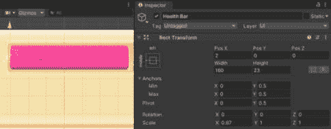
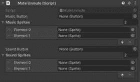

# UI 图像和效果

我们在之前的章节中已经使用过 UI 图像，但现在我们将学习更多关于组件的特定属性，以及如何通过代码访问组件。我们还将查看一些可以应用于我们的 UI 对象以增强视觉吸引力的 UI 效果组件。虽然我们将彻底研究这些组件，但本章的大部分内容将专注于您在视频游戏中（尤其是移动视频游戏中）会发现的具体的 UI 功能示例。

在本章中，我们将讨论以下主题：

+   创建 UI 图像并设置其属性

+   使用各种 UI 效果组件进一步自定义我们的图形 UI

+   实现水平和圆形进度条

+   如何创建不使用内置过渡效果的按钮，例如静音/取消静音按钮

+   添加按住/长按功能

+   创建屏幕上的四方向虚拟 D-Pad

+   创建一个浮动的八方向虚拟摇杆

注意

在“示例”部分之前展示的所有示例都可以在代码包中提供的 Unity 项目中找到。它们位于标记为**第十一章**的场景中。

每个示例图都有一个标题，说明场景中的示例名称。

在场景中，每个示例都在自己的 Canvas 上，其中一些 Canvas 被禁用。要查看禁用 Canvas 上的示例，只需在检查器中选择 Canvas 名称旁边的复选框。每个 Canvas 也都有自己的事件系统。如果您同时激活多个 Canvas，这将导致错误。

# 技术要求

您可以在此处找到本章的相关代码和资产文件：[`github.com/PacktPublishing/Mastering-UI-Development-with-Unity-2nd-Edition/tree/main/Chapter%2011`](https://github.com/PacktPublishing/Mastering-UI-Development-with-Unity-2nd-Edition/tree/main/Chapter%2011)

# UI 图像组件属性

我们之前创建了一个 UI 图像，但现在让我们看看它的属性和组件。

您可以使用 **+** | **UI** | **Image** 创建一个新的 UI 图像对象。

UI `Image` 对象包含 **Rect Transform** 和 **Canvas Renderer** 组件以及 **Image** 组件。我们已经详细地研究了 **Rect Transform** 和 **Canvas Renderer** 组件；现在，让我们看看 **Image** 组件。

**图像**组件的第一个设置是**源图像**属性，它表示将要渲染的精灵。**颜色**属性表示正在渲染的精灵的基本颜色。将颜色设置为白色会使图像看起来与精灵完全一样，但更改颜色将为图像添加带有色调的颜色叠加。您还可以通过降低 alpha 值来更改图像的不透明度。**材质**属性允许您向图像添加材质。

**射线投射目标**和**射线投射填充**属性与**文本**组件上的工作方式相同，通过指定图像是否会阻止其后面的 UI 对象的点击以及是否有任何填充来阻止。**可遮罩**属性确定图像是否可以被遮罩影响。

当精灵被分配到**源图像**槽位时，在**图像**组件下的**图像类型**中会出现新的选项，如图下所示：


图 11.1：UI 图像组件及其所有属性

让我们看看**图像类型**的各种选项以及它们如何影响精灵。

## 图像类型

**图像类型**属性确定由**源图像**指定的精灵将如何显示。有四种选项：**简单**、**切片**、**平铺**和**填充**。让我们来看看它们。

### 简单

当图像的**图像类型**属性设置为**简单**时，图像在精灵上均匀缩放。这是默认类型。当选择**简单**作为**图像类型**时，会出现一个标签为**使用精灵网格**的切换按钮，一个标签为**保持纵横比**的切换按钮，以及一个标签为**设置原始大小**的按钮。

选择**使用精灵网格**切换按钮将使图像使用由**TextureImporter**创建的精灵网格。默认情况下，此属性未选中，精灵的网格是一个四边形。如果你不希望图像以矩形表示，而是希望它有一个紧密围绕图像可见区域的网格，则将选择此属性。

当**保持纵横比**属性被勾选时，精灵将以保留其部分的方式显示，可能不会看起来填充整个 Rect Transform 区域。选择此属性确保你的精灵看起来与最初意图一致，并且不会被拉伸。

选择**设置原始大小**按钮将图像的尺寸设置为精灵的像素尺寸。

### 切片

**切片**图像被分成九个区域。当**切片**图像被缩放时，图像的所有区域都会缩放，除了角落。这允许你在不扭曲角落的情况下缩放图像。这对于你想要拉伸成圆角矩形的具有圆角精灵特别有效。

当图像设置为**切片**时，会出现**填充中心**和**每单位像素乘数**属性。下图显示了一个圆角矩形及其五个变体被拉伸的情况。你可以看到选择**切片**如何允许圆角矩形以保持圆角矩形形状的方式拉伸，而将**图像类型**保持在**简单**则会在缩放图像时导致边缘扭曲。


图 11.2：第十一章场景中的切片图像类型示例

您必须在精灵或精灵图的**精灵编辑器**中指定九个区域的位置。如果您没有指定区域，**图像组件**中将会显示一条消息。

要在**精灵编辑器**中指定区域，您需要将精灵边缘的绿色框拖动到所需位置。从以下屏幕截图可以看出，您想要拖动绿色线条，使它们停止围绕边缘的曲线：


图 11.3：在精灵编辑器中指定精灵的九个区域

接下来，让我们谈谈**图像类型**下的**平铺**选项。

### 平铺

选择**平铺**作为**图像类型**将导致图像重复以填充拉伸区域。以下图示演示了选择**简单**和**平铺**作为**图像类型**如何影响缩放后的图像：


图 11.4：第十一章场景中的平铺图像类型示例

接下来，让我们谈谈**图像类型**下的**填充**选项。

### 填充

对于**图像类型**选择**填充**的图像，将从指定方向的原点填充精灵的一部分，超过指定百分比的任何精灵部分将不会渲染。当选择**填充**时，将显示新的属性：


图 11.5：填充图像的属性

`0.75`或 75%：


图 11.6：第十一章场景中的填充图像类型示例

当您看到**水平**和**垂直****填充方法**选项在动作中的表现时，它们是相当直观的，但仅从外观上确定三种径向方法的确切工作方式可能有点困难。**径向 90**将径向的中心放置在角落之一，**径向 180**将径向的中心放置在边缘之一，而**径向 360**将径向的中心放置在精灵的中心。

**填充** **图像类型**选项也有**设置原始大小**属性。

现在我们已经探讨了 UI 图像组件，我们可以看看一些 UI 效果组件。

# UI 效果组件

三个效果组件允许您为文本和图像对象添加特殊效果：**阴影**、**轮廓**和**作为 UV1 定位**。它们都可以在**添加组件** | **UI** | **效果**下找到。让我们逐一查看每个组件，从阴影组件开始。

## 阴影

**阴影**组件为您的文本或图像对象添加简单的阴影。


图 11.7：阴影组件

您可以使用`0`更改阴影的颜色和透明度，使其不可见，但基于**效果** **颜色**属性上指定的透明度，阴影仍然可见。

下图显示了**阴影**组件的一些示例：


图 11.8：第十一章场景中的阴影组件示例

所有四个香蕉都设置了相同的`0`透明度值，但由于**阴影**组件上未选择**使用图形透明度**，阴影没有随着香蕉变暗，并保持在指定的透明度值。

## 轮廓

**轮廓**组件通过在其周围指定距离处创建四个阴影来模拟图形的轮廓。


图 11.9：轮廓组件

**轮廓**组件将根据**效果距离 X**在原始图形的左侧和右侧创建两个阴影，根据**效果距离 Y**在原始图形的顶部和底部创建两个阴影。与**阴影**组件不同，这两个距离的正负值没有区别，因为每个轴上创建的两个阴影是镜像的。

设置`-3`实际上只是交换了两个水平阴影的位置，但效果看起来相同，如下图所示：


图 11.10：第十一章场景中的轮廓组件示例 1

**使用图形透明度**属性在这个组件上的作用与在**阴影**组件上相同，如下所示：


图 11.11：第十一章场景中的轮廓组件示例 2

接下来，让我们看看**位置作为 UV1**组件。

## 位置作为 UV1

**位置作为 UV1**组件允许您更改 Canvas 渲染的 UV 通道。如果您想创建使用烘焙光照图的自定义着色器，则使用此功能。


图 11.12：位置作为 UV1 组件

很遗憾，自定义着色器是一个相当复杂的话题，超出了本文的范围，所以我就不再深入探讨这个组件的用法了。

现在我们已经回顾了 UI 图像组件和一些 UI 效果组件，让我们看看我们可以如何使用这些组件的示例。

# 示例

在本章中，我们将通过添加一些新的 UI 元素来进一步扩展我们一直在构建的场景。我们还将探讨一些移动/触摸屏 UI 和交互。

这些示例中的一些可能更适合按钮章节，但既然它们包括了访问图像组件属性的权限，我就把它们放在这里。

注意

我们已经创建了两个场景，它们将加载到我们一直在构建的场景中：一个开始屏幕和一个简介场景。由于我一直复制我们的主场景以使每个章节的进度跟踪变得容易，因此我们的简介场景将不会导航到我们在本章和未来章节中进行的更新，除非我们继续更新简介场景中**对话框**组件的**下一场景**变量，并将新场景包含在我们的**构建设置**中。

我不会在步骤中包含这个更新，因为场景导航不再是这些示例的重点。然而，它将包含在每个章节完成场景中我包含的包中。

## 水平和圆形生命值/进度条

让我们回到我们的主场景。复制`Chapter10-Examples`场景以创建一个`Chapter11-Examples`场景。

在本节中，我们将介绍如何创建两种类型的进度条，一个是水平的一个是圆形的，如下面的截图所示：


图 11.13：水平和垂直进度条的示例

我们将连接圆形和水平进度条，使它们都显示相同变量的进度，并且我们可以同时观察它们的变化。

圆形进度条实际上并不适合我们一直在构建的主场景，我们将在本章之后将其隐藏，但圆形进度条是常见的游戏元素，因此我认为在本章中包含一个如何实现它们的示例很重要。

### 水平生命值条

创建水平生命值条有几种不同的方法，但最快、最简单的方法是根据百分比缩放单个轴。以这种方式设置水平生命值条时，确保锚点设置在表示完全耗尽的条的位置非常重要。

记得在*第六章*中，我们设置了生命值条的锚点为左侧，因此我们已经正确设置了锚点。我们还沿*x*方向缩放了生命值条，以显示条在耗尽时的样子。



图 11.14：生命值条的矩形变换组件

现在，我们只需要将百分比与生命值条的**X 缩放**值关联起来。

要将生命值条的填充与实际值关联，请完成以下步骤：

1.  在你的`Scripts`文件夹中创建一个新的 C#脚本，并将其命名为`ProgressMeters.cs`。

1.  在`ProgressMeters`脚本中，初始化以下四个变量：

    ```cs
    public uint health;
    [SerializeField] uint totalHealth;
    [SerializeField] float percentHealth;
    [SerializeField] RectTransform healthBar;
    ```

    `health` 变量表示玩家的当前生命值，而 `totalHealth` 变量表示玩家可以获得的总生命值。由于这些值不应该是负数，它们已经被初始化为 `uint` 类型或正整数。我将 `health` 变量设置为 `public`，以便可以通过其他脚本访问并在检查器中查看。我将 `totalHealth` 设置为私有的 `SerializeField`，这样它就不能通过其他脚本访问，但仍然可以通过检查器查看和分配。

    `percentHealth` 变量将基于 `health` 和 `totalHealth` 变量的商来计算。我将此值设置为私有并序列化，不是为了在检查器中编辑它，而是为了可以轻松地在检查器中看到其值的变化。

    `healthBar` 变量存储了我们场景中 `Health Bar` UI Image 的 `RectTransform` 组件。

注意

由于 **RectTransform** 继承自 **Transform**，我们本可以将 **healthBar** 声明为 **Transform**，并且下面的代码仍然可以工作。

1.  返回 Unity 编辑器，将 `ProgessMeters` 脚本拖放到 `HUD Canvas` > `Top Left Panel`。将值 `500` 分配给 **Health Bar** 槽中的 `Health Bar` UI Image。你尝试输入到 **Percent Health** 槽中的任何值都将被我们在下一步中编写的代码覆盖。你的组件应该如下所示：


图 11.15：进度条组件

1.  我们希望对 `health` 值的任何更改都能自动更新 `percentHealth` 值和 `healthBar` 的比例。为此，我们可以在 `Update()` 函数中放置以下代码：

    ```cs
    void Update()
    {
        // Cap health
        if (health > totalHealth)
        {
            health = totalHealth;
        }
        // Calculate health percentage
        percentHealth = (float)health / totalHealth;
        // Update horizontal health bar
        healthBar.localScale = new Vector2(percentHealth, 1f);
    }
    ```

    使用 `uint` 类型声明我们的 `health` 和 `totalHealth` 变量阻止了它们变成负数，但我们仍然需要给 `health` 变量设置一个上限。它不应该超过 `totalHealth` 变量。

    虽然 `percentHealth` 是一个 `float` 类型的变量，但两个 `uint` 类型的变量之间进行除法运算将得到一个 `uint` 类型的结果，因此在整数除法前添加 `(float)` 可以得到一个浮点数结果。

    代码的最后部分设置了 `healthBar` 的 `localScale` 值。当你缩放 UI 对象时，你必须使用 `localScale`。这意味着相对于其父对象进行缩放。

1.  现在，我们可以在编辑器中轻松测试代码。玩游戏并将鼠标悬停在 **Progress Meters** 组件中的 **Health** 字样上，直到鼠标显示围绕它的两个箭头，如图所示：


图 11.16：进度条组件对仪表的影响

当这些箭头出现时，点击并拖动将根据您的鼠标位置操纵变量的值。您会看到，当您这样做时，场景中的“生命值条”大小会变化。您会注意到您不能设置 `0` 或以上 `500` 的值。

如您所见，设置水平生命值条并不特别困难。在游戏中通过事件减少生命值时重复此过程不需要很多步骤即可实现。只需确保正确设置生命值条的锚点。这个过程对于垂直生命值条也类似有效。

### 圆形进度条

水平生命值条设置起来并不需要太多工作。制作圆形进度条的工作几乎一样简单，只需再添加两行代码即可完成。由于我们场景中还没有圆形进度条，我们首先需要做一些设置。

要创建圆形进度条，请完成以下步骤：

1.  从代码包中，将 `circularMeter.png` 精灵拖入项目中的 `Sprites` 文件夹。

1.  将 `circularMeter.png` 精灵设置为 **多重** 并在 **精灵编辑器** 中自动切片。

1.  在层次结构中选择“左上角面板”，并为其添加一个新的 UI Image 子项。将 Image 命名为 `Progress Holder`。

1.  与我们设置生命值条的方式类似，将会有一个持有者和一个填充。将 `circularMeter_0` 子精灵拖入 `Progress Holder`。

1.  我们需要为我们的持有者和填充图像获取正确的比例非常重要。因此，为了确保图像比例正确，点击 **设置原始大小** 按钮在 **图像** 组件上。

1.  现在，向 `Progress Holder` 添加一个名为 `Progress Meter` 的子 UI Image。

1.  将“进度条”的锚点预设设置为居中。不要拉伸它。

1.  将 `circularMeter_1` 添加到 `Progress Meter`。

1.  同时点击“进度条”的“图像”组件。完成此步骤后，您应该看到以下内容：

    图 11.17：进度条上的进度

    如果粉红色填充没有完美地嵌入蓝色持有者中，您可能忘记点击“进度条”的锚点预设没有设置为居中。

1.  让我们移动这个仪表并稍微缩放一下。选择 `Progress Holder` 并将其移动到场景中位于 `Character Holder` 下方。将 `Progress Holder` 设置为 `0.8` 以使其稍微小一些。


图 11.18：重新定位圆形进度条

1.  对代码的最后一件事情是更改 `Progress Meter`。将 **图像类型** 更改为 **填充** 并使用 **径向 360 填充方法**。将 **填充起源** 更改为 **顶部**。调整 **填充量** 上的滚动条以预览仪表填充：


图 11.19：调整圆形进度条上的填充量

1.  现在，我们准备好编写一些代码。正如您可能从调整代码中 `fillAmount` 值到 `percentHealth` 变量中猜到的。首先，我们需要创建一个变量，我们可以通过它访问 `Progress Meter` 的图像组件。在代码顶部声明以下变量：

    ```cs
    [SerializeField] Image progressMeter;
    ```

1.  现在，在 `Update()` 函数的末尾添加以下内容：

    ```cs
    // Circular progress meter
    progressMeter.fillAmount = percentHealth;
    ```

1.  我们最后需要做的是将 `Progress Meter` UI 图像连接到 `progressMeter` 变量。将 `Progress Meter` 拖动到 **进度** **条** 槽中。


图 11.20：进度条组件的更新

1.  播玩游戏，并在检查器中调整 **健康** 值，就像您之前做的那样，并观察两个仪表同时移动。


图 11.21：进度条的最终结果

如您所见，制作圆形进度条实际上并不比制作水平进度条更困难！

注意

与我们之前使用的圆形进度条的填充量相同，我们也可以使用水平生命条上的填充量。将**图像类型**属性设置为**填充**和**水平**，然后影响**填充量**值而不是缩放，会产生类似的效果。

由于这个圆形进度条不是原始 UI 计划的一部分，只是为了演示目的而放置在场景中，我将在所有未来的图表和屏幕截图中禁用它。

## 带有精灵交换的静音按钮

现在，让我们看看一个基于预定义状态交换按钮精灵的例子。这与我们在*第九章*中讨论的精灵交换过渡不同，因为它不会使用高亮、按下、选中或禁用状态。它包含在本章而不是按钮章节中，因为它涉及影响图像组件，而不是按钮组件。

在场景中，我们有一个在按下键盘上的 *P* 键时弹出的 `Pause Panel`。在这个面板上，我们将放置两个静音按钮，一个用于音乐，一个用于声音，它们将在静音和取消静音状态之间切换。面板将如以下屏幕截图所示：


图 11.22：带有新静音按钮的暂停面板

要添加前面屏幕截图所示的音效和声音按钮，请完成以下步骤：

1.  首先，我们需要引入一个新的艺术资产。我们之前导入的精灵表中的按钮精灵有点太小，并且不包含静音版本。因此，我稍作编辑，并为您提供了一个新的精灵。在本书的源文件中，您应该找到一个名为 `muteUnmute.png` 的 `.png` 文件：

    图 11.23：muteUnmute.png 精灵

    将此 `.png` 文件导入到项目文件夹 `Assets/Sprites` 中。

1.  通过将 **Sprite Mode** 改为 **Multiple**，打开其 **Sprite Editor** 并应用自动切片类型，将精灵切割成多个子精灵。多个精灵应如下所示：


图 11.24：muteUnmute.png 精灵切片

1.  创建两个新的按钮作为 `Pause Panel` 的子项，并分别命名为 `Music Button` 和 `Sound Button`。删除它们的文本子项，因为我们不需要它们。


图 11.25：当前层次结构视图

1.  给这两个新的按钮以下 **Rect Transform** 和 **Image** 属性：

    图 11.26：两个按钮的 Rect Transform

    您的面板现在应该看起来就像本例开头的那样：

    

    图 11.27：暂停面板

1.  现在，让我们编写一些代码来使这些按钮交换代表声音和音乐开关的精灵。在您的 `Assets/Scripts` 文件夹中创建一个新的脚本，命名为 `MuteUnmute.cs`。

    将 `MuteUnmute` 的代码替换为以下内容：

    ```cs
    public class MuteUnmute : MonoBehaviour
    {
        [SerializeField] Button musicButton;
        private Image musicImage;
        [SerializeField] private Sprite[] musicSprites = new Sprite[2];
        private bool musicOn = true;
        [SerializeField] Button soundButton;
        private Image soundImage;
        [SerializeField] private Sprite[] soundSprites = new Sprite[2];
        private bool soundOn = true;
        void Awake()
        {
            musicImage = musicButton.GetComponent<Image>();
            soundImage = soundButton.GetComponent<Image>();
        }
        public void ToggleMusic()
        {
            musicOn = !musicOn;
            musicImage.sprite = musicSprites[Convert.ToInt32(musicOn)];
        }
        public void ToggleSound()
        {
            soundOn = !soundOn;
            soundImage.sprite = soundSprites[Convert.ToInt32(soundOn)];
        }
    }
    ```

如您所见，此代码包含两个主要函数：`ToggleMusic()` 和 `ToggleSound()`。这两个函数通过根据 `musicOn` 和 `soundOn` 布尔值在指定的按钮上交换精灵而完全相同。

要交换精灵，脚本首先在 `Awake()` 函数中找到指定为 `musicButton` 和 `soundButton` 的两个按钮上的 Image 组件，这些按钮将在检查器中分配。然后，脚本将 Image 组件的精灵交换到精灵数组中的正确精灵。静音和取消静音状态的精灵将在未来的步骤中在检查器中分配。

注意

很遗憾，这本书没有涵盖向 Unity 项目添加声音和音乐。这里提供的代码实际上并没有静音和取消静音音频；它只是交换精灵。您只需包含两个音频源：一个用于播放音乐，一个用于播放带有 **Music** 和 **Sound** 标签的声音。

1.  返回 Unity 编辑器，通过将其拖动到其 **Inspector** 中将 `MuteUnmute.cs` 脚本附加到 `Pause Panel`：



图 11.28：静音/取消静音组件

1.  现在，我们想要将适当的按钮和精灵分配到槽位。从层次结构中将 `Music Button` 和 `Sound Button` 拖动到它们的指定槽位。从项目视图中拖放音频按钮精灵到它们的适当槽位，确保将静音精灵放在数组的 0 元素中。


图 11.29：更新的静音/取消静音组件

1.  现在，我们只需要将按钮连接到调用适当的函数。选择`Music Button`。选择`MuteUnmute.cs`的`OnClick()`事件列表，位于`Pause Panel`上，因此将`Pause Panel`拖入对象槽中。现在，从函数下拉菜单中选择**MuteUnmute** | **ToggleMusic**。

1.  对`Sound Button`执行与之前步骤相同的操作，但这次从函数下拉列表中选择**MuteUnmute** | **ToggleSound**。

现在，玩游戏，按下*P*键调出`Pause Panel`，你会看到按钮在两个不同的精灵之间切换。

现在我们已经了解了如何实现进度条和精灵交换按钮，让我们看看如何实现一些不同的移动特定交互。

## 添加按下并保持/长按功能

在移动游戏中，按下并保持（Press-and-hold）操作被频繁使用。许多在 PC 或网页上使用右键点击的游戏，在转换为移动平台时使用按下并保持操作。

为了演示如何实现按下并保持功能，我们将创建一个具有表示保持时间的增长环的按钮。一旦经过指定的时间，就会触发一个函数：


图 11.30：按下并保持按钮示例

在处理这个示例时，重要的是要记住，尽管代码引用了指针，但这种功能并不仅限于鼠标。在触摸屏上放置手指与指针按下功能相同，抬起手指与指针抬起功能相同。

要创建一个表示保持时间的增长环的按钮，请按照以下步骤操作：

1.  在`Assets/Scenes`文件夹中创建一个名为`Chapter11-Examples-Buttons1`的新场景并打开该场景。

1.  选择**+** | **UI** | **Button**在场景中创建一个新的按钮。

1.  将按钮组件的**过渡**类型设置为**无**。

1.  将按钮上的文本更改为`Press` `and Hold`。

1.  在层次结构中右键单击`Button`，然后选择`Button`的`Image`子项。

1.  更改`Image`的`50`。

1.  将`circularMeter_1`精灵分配给**Image**组件的**源图像**属性。

1.  将`0`更改为。

1.  要在`Button`上创建按下并保持功能，我们将使用`Button`对象。

1.  选择**添加新事件类型**并选择**PointerDown**。

1.  选择**添加新事件类型**并选择**PointerUp**。

1.  现在，我们需要实际编写在之前步骤中设置的触发器事件将要调用的函数。在`Assets/Scripts`文件夹中创建一个新的脚本，命名为`LongPressButton`。

1.  在打开脚本之前，先将它作为组件附加到`Button`上。

1.  在脚本顶部添加`UnityEngine.UI`命名空间，如下所示：

    ```cs
    using UnityEngine.UI;
    ```

1.  要检查按钮被按下的持续时间，我们将使用一个布尔变量来检查按钮是否被按下，以及一些与时间相关的不同变量。将以下变量声明添加到您的脚本中：

    ```cs
    private bool buttonPressed = false;
    private float startTime = 0f;
    private float holdTime = 0f;
    [SerializeField] private float longHoldTime = 1f;
    ```

    当`holdTime`变量确定自`startTime`以来经过的时间时，`buttonPressed`变量将被设置为`true`，而`startTime`变量将被设置为当前时间。`longHoldTime`变量是按钮必须按下直到长按完成所需的时间量。它是序列化的，以便可以轻松自定义。

1.  我们需要的最后一个变量将表示径向填充图像。将以下变量声明添加到您的代码中：

    ```cs
    [SerializeField] private Image radialFillImage;
    ```

1.  现在，我们需要编写一个函数，该函数将由**指针按下**和**指针抬起**事件调用：

    ```cs
    public void PressAndRelease(bool pressStatus)
    {
        buttonPressed = pressStatus;
        if (!buttonPressed)
        {
            holdTime = 0;
            radialFillImage.fillAmount = 0;
        }
        else
        {
            startTime = Time.time;
        }
    }
    ```

    此函数接受来自事件触发器的布尔变量。然后，它将`buttonPressed`的值设置为传递的值。

    当按钮被释放时，将向函数传递一个值为`false`的值。如果传递的值是`false`，则经过的时间`holdTime`将被重置为`0`，`radialFillImage`图像将被重置为`fillAmount`值为`0`。

    当按钮被按下时，`startTime`值将被设置为当前时间。

1.  创建一个函数，当指定的`longHoldTime`所需的时间完成时将被调用：

    ```cs
    public void LongPressCompleted()
    {
        radialFillImage.fillAmount = 0;
        Debug.Log("Do something after long press");
    }
    ```

    此函数实际上并没有做任何事情，只是重置填充图像并打印出`Debug.Log`。然而，您可以在以后重用此代码，并将`Debug.Log`行替换为更有趣和更有意义的操作。

1.  可以使用`Update()`函数来使计时器向上计数。按如下方式调整`Update()`函数：

    ```cs
    void Update()
    {
        if (buttonPressed)
        {
            holdTime = Time.time - startTime;
            if (holdTime >= longHoldTime)
            {
                buttonPressed = false;
                LongPressCompleted();
            }
            else
            {
                radialFillImage.fillAmount = holdTime / longHoldTime;
            }
        }
    }
    ```

    如果`buttonPressed`的值设置为`true`，则此代码将使`holdTime`的值向上递增。记住——当`holdTime`的值达到`longHoldTime`指定的值时，`buttonPressed`将被重置为`false`，计时器将停止递增。此外，将调用`LongPressCompleted()`函数。如果尚未达到`longHoldTime`，图像的径向填充将更新以表示已发生所需总时间的百分比。

1.  现在脚本已完成，我们可以将`PressAndRelease()`函数连接到按钮上的事件触发器。将静态列表中的`PressAndRelease`函数添加到两个事件触发器上。`PressAndRelease`函数接受一个布尔变量，有一个复选框表示应该传递的布尔值。选择`true`的复选框（但不要选择`false`）。


图 11.31：事件触发器组件

1.  现在，我们需要将`Image`分配到**长按**组件上的**径向填充图像**槽位。


图 11.32：长按组件

现在玩游戏将演示当你按住按钮时图像径向填充，并在控制台打印`Do something after long press`。

按住并保持是一个相当常见的功能，虽然它不是 Unity 事件库中预安装的事件，但幸运的是，它并不太难连接。我建议保留这个脚本，以便将来可以重用它。

创建一个静态的四方向虚拟 D-Pad

D-Pad 简单来说就是方向板上四个按钮。要为移动游戏创建一个 D-Pad，你只需要创建一个包含四个按钮的图形。

本例中使用的艺术作品来自[`opengameart.org/content/onscreen-controls-8-styles`](https://opengameart.org/content/onscreen-controls-8-styles)。

要创建一个虚拟 D-Pad，请完成以下步骤：

1.  在`Assets/Scenes`文件夹中创建一个名为`Chapter11-Examples-Buttons2`的新场景并打开新场景。

1.  将`dPadButtons.png`精灵图集导入到`Assets/Sprites`文件夹。

1.  将新导入的精灵的**Sprite Mode**更改为**Multiple**并自动切割。

1.  创建一个新的 Canvas，并命名为`D-Pad Canvas`。

1.  在移动设备上，D-Pad 的大小非常重要。即使屏幕变得更小，你可能也希望 D-Pad 的大小保持不变。如果它太小，游戏可能无法玩或感觉不舒服。因此，将**Canvas Scaler**组件的**UI Scale Mode**值设置为**Constant** **Physical Size**。

1.  将一个新的 Image 作为`D-Pad Canvas`的子对象添加，并命名为`D-Pad Background`。

1.  设置`dPadButtons_4`。

1.  将其锚点和枢轴设置为屏幕的左下角，并设置其`30`。

1.  设置其`200`：


图 11.33：正确定位的 D-Pad

1.  右键单击`D-Pad Background`并添加一个新的按钮作为子对象，并命名为`Up`。

1.  删除其子`Text`对象。

1.  将`Up`按钮的值分别设置为`0`、`65`、`60`和`60`。这将创建一个覆盖 D-Pad Image 向上位置的方块。


图 11.34：带有向上按钮的 D-Pad

1.  将`Up`按钮复制三次，并将副本重命名为`Right`、`Left`和`Down`。

1.  将`Right`按钮的`65`和`0`分别设置。

1.  将`Left`按钮的`-65`和`0`分别设置。

1.  将`Down`按钮的`0`和`-65`分别设置。现在你应该有四个按钮，位置如下：

    图 11.35：带有所有按钮的 D-Pad

    这四个按钮覆盖了方向板臂的整个区域。它们将作为方向的击中区域。

1.  我们只真正需要这四个按钮的点击区域，并不希望在 UI 中实际显示它们。在层次结构中选择所有四个按钮，并将`alpha`值设置为`0`。

1.  由于方向盘图像是静态的，并且没有分成四个单独的按钮，因此应用在其上的任何过渡都会覆盖整个图像。然而，我们可以通过为方向上的箭头添加子图像，使单个方向看起来像被按下，并有一种颜色过渡。右键单击`上`按钮，并添加一个带有`Arrow`的图像作为子项。

1.  将`dPadButtons_5`精灵分配给其`Image`组件上的**源图像**，并选择**保持纵横比**。

1.  缩放并移动图像，使其与 D-Pad 背景图像上显示的箭头适当地对齐：


图 11.36：D-Pad 的上箭头

1.  选择`箭头`图像组件，并使用吸管工具从`D-Pad 背景`图像中抓取箭头的颜色。这将使其变为浅灰色而不是白色。

1.  为其他三个按钮创建`箭头`子项，并适当地调整大小、位置和颜色。确保也使用`dPadButtons`精灵图的正确子图像。完成后，你的 D-Pad 和层次结构应该如下所示：


图 11.37：D-Pad 上的所有箭头

1.  现在，为了让 D-Pad 在按下四个方向时在视觉上做出反应，我们将设置四个`箭头`子项，使其具有颜色渐变的按钮`箭头`子项到其**目标图形**槽在其**按钮**组件上。现在，当你按下单个按钮时，你会看到箭头颜色的轻微变化，指示哪个方向被按下。如果你发现难以判断是否发生了变化，你可能希望将按下颜色改为比默认灰色更明显一些的颜色。

1.  将书中代码包中的名为`DPad.cs`的脚本添加到`Assets/Scripts`文件夹。这是一个非常简单的脚本，它包含四个只写入控制台的功能。将这些功能连接到单个方向按钮不会做任何有趣的事情，但它将允许我们在控制台中看到日志，让我们知道按钮正在按预期执行。

1.  将脚本附加到`D-Pad` `Background`对象。

1.  选择每个四个方向按钮，在它们全部被选中时，向`按钮`组件添加一个**On Click ()**事件。

1.  现在，将`D-Pad 背景`对象拖动到**On Click ()**事件的对象槽中。

1.  分别选择每个按钮，并将适当的函数`PressUp`、`PressDown`、`PressLeft`和`PressRight`分配给它们的**On Click ()**事件。

在游戏中玩并选择四个方向按钮应该会在控制台显示适当的消息。

许多 D-Pad 实际上接受九个输入：四个方向，四个对角线（角落），以及中心。如果您想接受对角线输入以及 D-Pad 的中心点击，我建议使用网格布局组来均匀地分配您的九个按钮。

由于 D-Pad 倾向于允许按住，您可能希望将此示例中使用的过程与之前示例中描述的动作结合起来。而不是使用 `OnPointerDown` 和 `OnPointerUp` 事件。这些事件可以设置一个布尔变量为 `true` 和 `false`。例如，在 `Right` 按钮上，您可以将 `OnPointerDown` 事件设置一个名为 `moveRight` 的变量为 `true`，并将 `OnPointerUp` 事件将 `moveRight` 设置为 `false`。

## 创建一个浮动的八向虚拟模拟摇杆

在此示例中，我们将创建一个浮动的八向虚拟模拟摇杆。首先，我们将创建一个八向 D-Pad，模拟一个玩家拖动方向移动的控制杆：


图 11.38：浮动模拟摇杆的位置

然后，我们将扩展八向 D-Pad，使其浮动，这意味着它将在玩家在屏幕上按下某处之前在场景中不可见。然后，它将出现在玩家的拇指位置，并根据玩家的拇指拖动执行八个方向的运动。

设置八向虚拟模拟摇杆

要创建一个如图所示在八个方向上移动的模拟摇杆，请完成以下步骤：

1.  在 `Assets/Scenes` 文件夹中创建一个新的场景，命名为 `Chapter11-Examples-Buttons3` 并打开新场景。

1.  使用 `Stick Base` 创建一个新的图像。

1.  将 `dPadButtons_15` 精灵添加到其 **Image** 组件的 **Source Image** 槽中。

1.  调整大小，使其具有 `200` 并将其设置为 `0`。

1.  在层次结构中右键单击 `Stick Base`，然后选择 `Stick Base` 的 `Image` 子项。将子项命名为 `Stick`。

1.  将 `Stick` 图像调整到与 `Stick Base` 相匹配，通过设置其 **Rect Transform** 拉伸和锚点以在两个方向上完全拉伸。

1.  将 `dPadButtons_0` 精灵添加到 `Stick` 图像组件中。

1.  设置 `10` 以在 `Stick` 的边缘周围提供一些填充。

1.  现在，设置枢轴和位置，使 `Stick` 在 `Stick Base` 上不会移动。


图 11.39：摇杆的 Rect Transform 组件

1.  这就是设置虚拟模拟摇杆工作的全部内容。我们现在将其留在屏幕中央。现在，我们需要编写一些代码。在 `Assets/Script` 文件夹中创建一个新的脚本，并将其命名为 `FloatingAnalogStick`。

1.  将以下代码添加到脚本顶部的 `UnityEngine.UI` 命名空间中：

    ```cs
    using UnityEngine.UI;
    ```

1.  要使摇杆在基座上方摇摆，我们需要以下变量：

    ```cs
    [SerializeField] private RectTransform theStick;
    private Vector2 mouseStartPosition;
    private Vector2 mouseCurrentPosition;
    [SerializeField] private int dragPadding = 30;
    ```

    前三个变量应该是相当直观的。`dragPadding`变量将用于确定玩家需要拖动摇杆多远，它才会实际注册为移动。

1.  在我们编写检查玩家拖动手指距离的代码之前，让我们添加一些虚拟函数，这将允许这个模拟摇杆在未来实际上控制某些东西。将以下函数添加到您的脚本中：

    ```cs
    public void MovingLeft()
    {
        Debug.Log("move left");
    }
    public void MovingRight()
    {
        Debug.Log("move right");
    }
    public void MovingUp()
    {
        Debug.Log("move up");
    }
    public void MovingDown()
    {
        Debug.Log("move down");
    }
    ```

1.  当玩家将手指从起始的按下位置移动时，`Stick`会向外移动。因此，让我们创建一个函数，当玩家开始拖动手指时，它会找到起始位置。将以下函数添加到您的脚本中：

    ```cs
    public void StartDrag()
    {
        mouseStartPosition = Input.mousePosition;
    }
    ```

    记住——当使用触摸屏时，`Input.mousePosition`将给出触摸位置的价值。

1.  现在，让我们创建一个函数，检查玩家拖动手指的距离，并根据该信息移动`Stick`。将以下函数添加到您的脚本中：

    ```cs
    public void Dragging()
    {
        float xPos;
        float yPos;
        mouseCurrentPosition = Input.mousePosition;
        if (mouseCurrentPosition.x < mouseStartPosition.x - dragPadding)
        {
            MovingLeft();
            xPos = -10;
        }
        else if (mouseCurrentPosition.x > mouseStartPosition.x + dragPadding)
        {
            MovingRight();
            xPos = 10;
        }
        else
        {
            xPos = 0;
        }
        if (mouseCurrentPosition.y > mouseStartPosition.y + dragPadding)
        {
            MovingUp();
            yPos = 10;
        }
        else if (mouseCurrentPosition.y < mouseStartPosition.y - dragPadding)
        {
            MovingDown();
            yPos = -10;
        }
        else
        {
            yPos = 0;
        }
        theStick.anchoredPosition = new Vector2(xPos, yPos);
    }
    ```

1.  我们需要添加的最后一件事情是，当玩家停止拖动或抬起手指时，将摇杆重置到原始位置的某种东西。将以下函数添加到您的脚本中，以实现这一点：

    ```cs
    public void StoppedDrag()
    {
        theStick.anchoredPosition = Vector2.zero;
    }
    ```

1.  现在，我们需要将此脚本和这些函数连接到场景中的项目。将`FloatingAnalogStick`脚本添加到`Stick` `Base`图像。

1.  将`Stick`图像添加到**浮动模拟****摇杆**组件的**摇杆**属性中。

1.  使用**添加组件** | **事件** | **事件触发**添加一个`Stick Base`对象。这将允许用户使用除**On Click()**之外的事件类型。

1.  使用**添加新事件****类型**按钮添加**开始拖动**、**拖动**和**结束拖动**事件类型。

1.  在附加到`Stick Base`的`FloatingAnalogStick`脚本上添加适当的函数到事件中：


图 11.40：事件触发组件

如果现在您玩游戏，您应该会看到八方向模拟摇杆适当地响应。点击它并在任何方向上拖动将导致摇杆移动到拖动方向。

### 使八方向虚拟模拟摇杆浮动

如果您只需要一个八方向模拟摇杆，那么您就可以开始了！但如果您想让模拟摇杆浮动——出现在玩家点击屏幕的位置，当玩家抬起手指时消失——您需要做更多的工作。

要使模拟摇杆出现在玩家点击的位置，完成以下步骤：

1.  首先，我们需要创建一个区域，玩家点击该区域将弹出模拟摇杆。在层级中右键点击`Canvas`，然后选择`Canvas`的`Button`子项。将`Button`子项重命名为`Click Area`。

1.  从`Click Area`中移除`Text`子对象。

1.  将`Click Area`拉伸以填充整个`Canvas`。

1.  通过更改 `50` 为 `一些填充` 来给 `点击区域` 的两侧添加一些填充。我添加了这个填充，以便玩家不能点击屏幕的边缘，并且模拟杆大部分出现在屏幕外。

1.  在层次结构中，将 `点击区域` 移动到 `杆基` 之上。现在，`点击区域` 将在模拟杆之后渲染：


图 11.41：显示点击区域和杆基的层次结构

1.  打开你的 `FloatingAnalogStick` 代码，以便我们可以向其中添加一些功能。

1.  为了使我们的模拟杆的位置更容易与屏幕上鼠标的位置挂钩，我们应该将杆基移动到 `Canvas` 的左下角中心。将锚点和位置设置为 **底部左侧** 锚点预设。

1.  现在，将 `0.5` 设置为：

1.  设置 `0`。这应该将模拟杆放置在画布（或屏幕）的左下角，其支点设置为中心：


图 11.42：显示点击区域和杆基的层次结构

1.  我们现在需要两个额外的变量，以便将模拟杆放置在场景中我们想要的位置。将以下变量添加到你的脚本中，以分配杆并跟踪它是否已被添加：

    ```cs
    [SerializeField] private RectTransform theBase;
    [SerializeField] private bool stickAdded = false;
    ```

1.  现在，创建以下函数以将杆添加到场景中：

    ```cs
    public void AddTheStick()
    {
        theBase.anchoredPosition = Input.mousePosition;
        theStick.anchoredPosition = Vector2.zero;
        mouseStartPosition = Input.mousePosition;
        stickAdded = true;
    }
    ```

1.  添加以下 `Update()` 函数以确定杆何时出现：

    ```cs
    void Update()
    {
        if (stickAdded == true)
        {
            Dragging();
            if (Input.GetMouseButtonUp(0))
            {
                // ToggleBaseCanvasGroup(false);  // This line is commented out as ToggleBaseCanvasGroup is not defined in the provided code
                stickAdded = false;
                StoppedDrag();
            }
        }
    }
    ```

1.  将 `杆基` 添加到 **基础** 插槽：


图 11.43：浮动模拟杆组件

1.  添加 `点击区域`。

1.  添加以下 `点击区域`：

    图 11.44：事件触发组件

    现在玩游戏时，模拟杆将出现在你点击的位置，并随着你的拖动而移动。

1.  现在，让我们让它这样，模拟杆仅在玩家触摸屏幕时可见。添加一个 `杆基`。

1.  设置 `0`、`false` 和 `false`。

1.  将以下变量添加到你的 `FloatingAnalogStick` 脚本中，以跟踪 `CanvasGroup`：

    ```cs
    private CanvasGroup theBaseVisibility;
    ```

1.  添加以下 `Awake()` 函数以初始化 `theBaseVisibility` 变量：

    ```cs
    void Awake()
    {
        theBaseVisibility = theBase.GetComponent<CanvasGroup>();
    }
    ```

1.  创建一个名为 `ToggleBaseCanvasGroup()` 的新函数，用于切换 `CanvasGroup` 的属性开和关：

    ```cs
    public void ToggleBaseCanvasGroup(bool visible)
    {
        theBaseVisibility.alpha = Convert.ToInt32(visible);
        theBaseVisibility.interactable = visible;
        theBaseVisibility.blocksRaycasts = visible;
    }
    ```

1.  在 `AddTheStick()` 函数中添加以下内容以启用 `CanvasGroup`：

    ```cs
    ToggleBaseCanvasGroup(true);
    ```

1.  在 `Update()` 函数内部最内层的 `if` 语句中添加以下内容以关闭 `CanvasGroup`：

    ```cs
    ToggleBaseCanvasGroup(false);
    ```

现在，当玩家按下时，模拟杆将出现，并朝手指的方向移动，当玩家抬起手指时消失。

# 摘要

UI 图像是 Unity UI 系统的核心组件之一，操作它们对于创建视觉交互式用户界面至关重要。本章通过让我们创建利用事件、按钮和图像的有趣界面，总结了我们在前几章中学到的所有技能。

在下一章中，我们将探讨如何创建遮罩和滚动视图，以便我们可以在我们的面板容器中容纳更多的子对象。
