# 12

# 使用遮罩、滚动条和滚动视图

我们已经学习了如何创建所有组件都同时显示在屏幕上的 UI，但通常您会有一些 UI 元素在屏幕之外或菜单之外，直到您导航到它们或揭示它们才可见。

在本章中，我们将讨论以下主题：

+   如何使用遮罩隐藏 UI 图像的部分

+   使用滚动条并通过代码访问它们的属性

+   利用 UI 滚动视图创建可滚动菜单

+   使用遮罩和滚动文本创建设置菜单

注意

本章中展示的所有示例都可以在提供的 Unity 项目中的代码包中找到。它们可以在标记为 **Chapter12** 的场景中找到。

每个示例图像都有一个标题，说明场景中的示例编号。

在场景中，每个示例都在自己的 Canvas 上，其中一些 Canvas 被禁用。要查看禁用 Canvas 上的示例，只需在 **Inspector** 中选择 Canvas 名称旁边的复选框。每个 Canvas 也都有自己的事件系统。如果您同时激活多个 Canvas，这将会导致错误。

# 技术要求

您可以在此处找到本章的相关代码和资产文件：[`github.com/PacktPublishing/Mastering-UI-Development-with-Unity-2nd-Edition/tree/main/Chapter%2012`](https://github.com/PacktPublishing/Mastering-UI-Development-with-Unity-2nd-Edition/tree/main/Chapter%2012)

# 使用遮罩

遮罩会影响其形状内对象的可见性。如果一个对象受到遮罩的影响，其遮罩限制区域外的任何部分都将不可见。遮罩的可见区域可以由具有 **遮罩** 组件的图像或具有 **Rect Mask** **2D** 组件的 Rect Transform 确定。

使用 UI，遮罩可用于创建滚动菜单，因此存在于菜单区域之外的项目将不可见。它还用于 *裁剪* 图像。例如，以下图像显示了一个猫的图像被圆形遮罩裁剪出来：


图 12.1：第十二章场景中的圆形遮罩示例

您可能会注意到带有遮罩的猫的边缘看起来不太好。为了避免这种情况，请确保您使用具有适当图像分辨率的精灵，并在精灵的 **导入设置** 中尝试不同的过滤模式。

## 遮罩组件

可以将 **遮罩** 组件添加到具有 **Image** 组件的任何 UI 对象。如果将其添加到没有 **Image** 组件的 UI 对象，则它将无法工作，因为它需要一个 **Image** 来确定限制区域。

可以通过在 **Inspector** 中选择 **添加组件** | **UI** | **遮罩** 来将 **遮罩** 组件添加到 UI 对象：

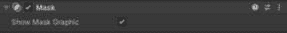

图 12.2：遮罩组件

包含**Mask**组件的 UI 对象的任何子对象，其可见性将被限制在其**Image**组件上的**Source Image**不透明区域内的区域。

在以下图像中，名为`Mask`的对象是一个带有**Mask**组件的 UI Image。如图所示，面板左侧的紫色三角形只有部分可见，而右侧的绿色三角形完全可见。绿色三角形完全可见，因为它不是包含**Mask**组件的 UI Image 的子对象：

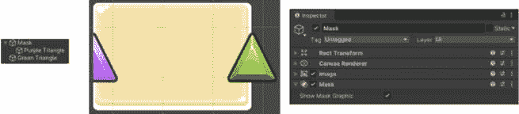

图 12.3：第十二章场景中的 Mask 组件示例

您可以选择隐藏定义**Mask**组件可见区域的**Source Image**。如果您取消选择**Show Mask Graphic**，则父对象的**Source Image**将不可见。重要的是要注意，在**Source Image**上更改不透明度不会影响**Mask**组件的功能。

## Rect Mask 2D 组件

使用**Mask**组件可以限制可见区域为非矩形形状。然而，如果您想将可见区域限制为矩形形状，并且不想使用图像来限制可见区域，则可以使用**Rect Mask** **2D**组件。

您可以通过在**Inspector**中选择**Add Component** | **UI** | **Rect Mask 2D**将**Rect Mask 2D**组件添加到 UI 对象中，如下所示：

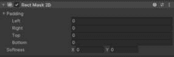

图 12.4：Rect Mask 2D 组件

注意，该组件允许您调整**Padding**和**Softness**。

当将**Rect Mask 2D**组件添加到 GameObject 中时，其子对象的可见性将受到其 Rect Transform 形状的影响。对于**Rect Mask 2D**组件能够正常工作，父对象上不需要添加**Image**组件。

在以下图像中，创建了一个`Empty` UI GameObject，并向其添加了**Rect Mask 2D**组件。然后给它添加了一个子 UI Image。如图所示，三角形被 Rect Transform 区域所蒙版：

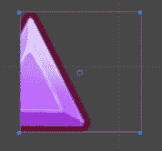

图 12.5：第十二章场景中的 Rect Mask 2D 组件示例

如果您想对一个矩形形状应用蒙版，我强烈建议您使用**Rect Mask 2D**组件而不是标准的**Mask**组件，因为它性能更优。

重要的是要注意，正如**Rect Mask 2D**的名称所暗示的，此蒙版仅适用于 2D 对象。您可以在[`docs.unity3d.com/Manual/script-RectMask2D.xhtml`](https://docs.unity3d.com/Manual/script-RectMask2D.xhtml)上了解更多关于其限制的信息。

如我之前所述，蒙版的一个常见用途是创建具有超出可见区域的对象的菜单。创建此类菜单需要滚动条和滚动视图，因此现在让我们看看这些组件。

# 实现 UI 滚动条

**UI 滚动条**对象允许用户沿着路径拖动一个手柄。手柄在路径上的位置会影响图像或对象在可用区域内的位置。

如果你从前面的描述中难以理解滚动条，这里有一个带有上下文的简单解释。它最常用于视频游戏中的菜单，这些菜单在可视区域内包含大量信息，而该信息占用的区域小于可视区域。

要创建 UI 滚动条，选择 `Sliding Area`。`Sliding Area` 也有一个名为 `Handle` 的子组件。

`Sliding Area` 子组件是一个空 GameObject。它的目的是确保其子组件，即 `Handle`，被正确定位和校准。`Handle` 是一个 UI Image。它代表滚动条的交互区域。

如果你想要更改滚动条背景和 `Handle` 的外观，你需要分别更改 `Handle` 子组件。

## 滚动条组件

父滚动条对象有一个 **Scrollbar** 组件。它具有所有交互式 UI 对象共有的属性，以及一些仅限于滚动条的属性：

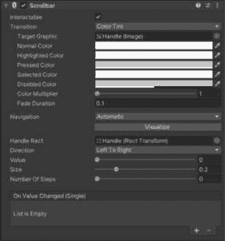

图 12.6：滚动条组件的属性

滚动条的 `0` 和 `1`。滚动条用于移动占用空间大于可视空间的物体。因此，滚动条的位置应容易转换为百分比或 `0` 到 `1` 之间的值。

`Handle` 被分配到这个属性。你会注意到 `Handle` GameObject 上的 Rect Transform 组件受滚动条的影响。滚动条的 `Handle` 位置与 **Scrollbar** 组件的 **Value** 属性相关联。

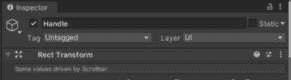

图 12.7：Handle GameObject 上的 Rect Transform 组件

**方向**属性允许你选择滚动条的方向。可用的选项与滑块相同，并相应地翻译：**从左到右**、**从右到左**、**从下到上**和**从上到下**。

滚动条的 `Handle` 占用的 `Sliding Area`。这可以是 `0` 到 `1` 之间的任何 `float` 值。我建议你选择一个与滚动对象的大小成比例的值，这样滚动条的运动感觉会更直观。这意味着可滚动区域越大，滚动条的 `Handle` 就越小。

**步数数量**属性用于当你想要滚动条有间隔的、离散的步骤，而不希望它有连续控制运动时。这用于当你想要你的滚动条将滚动对象移动到特定位置时。

通常，你会看到一个由点（如 iOS 设备上识别你正在查看哪个主屏幕的点）表示的滚动区域。这可以通过设置 `0` 来实现。将此值设置为 `0` 将允许进行连续控制移动，而不是跳跃的离散步骤。

在本章末尾的 *示例* 部分提供了创建连续和离散滚动条的示例。

### 滚动条默认事件 - 值改变（单个）

`Handle` 被移动了。它可以接受一个 `float` 参数。

当一个公共函数有一个 `float` 参数时，它将在函数的 **值改变（单个）** 事件下拉列表中显示两次：一次在 **静态参数** 列表中，再次在 **动态 float** 列表中，如下面的屏幕截图所示：

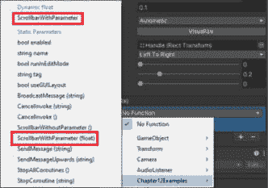

图 12.8：静态参数和动态 float 方法

如果函数在事件中作为 `float` 参数被选中。那么事件将只发送那个框内的值。在下面的屏幕截图示例中，将发送给 `ScrollbarWithParameter()` 函数的唯一值将是 `0`。

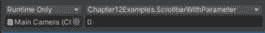

图 12.9：检查器中静态参数方法的示例

如果你希望滚动条的值作为参数发送给一个具有参数的函数，你必须从 **动态** **float** 列表中选择该函数。

以下函数和图像代表了在 `Chapter12` 场景中找到的滚动条示例，该示例触发调用带参数和不带参数的函数的事件：

```cs
public void ScrollbarWithoutParameter(){
    Debug.Log("changed");
}
public void ScrollbarWithParameter(float value){
    Debug.Log(value);
}
```

在下面的屏幕截图，第三个选项显示了从 **动态 float** 列表中选择的功能，并将 **值** 属性的值作为参数发送给函数：

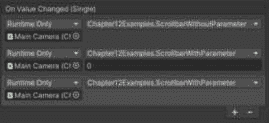

图 12.10：第十二章场景中的滚动条事件示例

现在我们已经回顾了如何在 Unity 中实现 UI 滚动条，让我们看看 UI 滚动视图。

# 实现 UI 滚动视图

**UI 滚动视图** 对象创建了一个可滚动区域，并附带两个子 UI 滚动条。可滚动区域可以通过滚动条、拖动滚动视图内的区域或使用鼠标的滚轮进行滚动。

要创建 UI 滚动视图，请选择 `Viewport`、`Scrollbar Horizontal` 和 `Scrollbar Vertical`。`Viewport` 对象还有一个名为 `Content` 的子对象。`Scrollbar Horizontal` 和 `Scrollbar Vertical` 子对象与默认 UI 滚动条的关系相同，如前文所述。

尽管 UI 滚动视图默认带有两个 `Scrollbar` 子对象，但你不必在 `Scroll View` 中使用这两个滚动条。实际上，你甚至不需要使用滚动条！有关更多详细信息，请参阅 *Scroll Rect 组件* 部分。

`视口`子对象是一个 UI 图像，其`视口`应用了一个遮罩到`滚动视图`内的一个区域：

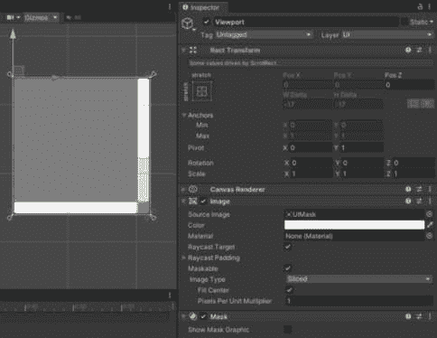

图 12.11：UI 滚动视图视口

这将使`滚动视图`内的项目仅在定义的区域内（滚动条之间）可见。您不能更改大多数的`视口`，因为这个区域是基于您在`滚动视图`的**滚动矩形**组件中设置的`滚动视图`设置来确定的（有关更多详细信息，请参阅*实现 UI 滚动条*部分）。

`视口`的子对象是一个名为`内容`的空`矩形变换`。这将成为您希望在`滚动视图`内放置的所有项目的容器。您可以将`内容`视为将在`滚动视图`内移动的东西。如您从以下图像中看到的，`内容`的矩形变换比由`视口`定义的可视区域大，因为`滚动视图`的目标是使项目超出可视区域。

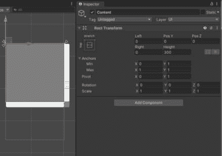

图 12.12：UI 滚动视图内容

要向`滚动视图`添加项目，您只需将子对象添加到`内容`对象中。由于`内容`是`视口`的子对象，其任何子对象都将受到`视口`的影响。

以下示例显示了作为`内容`子对象的四个图像。`内容`还添加了一个**垂直布局****组**组件：

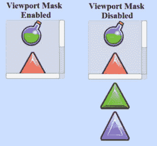

图 12.13：第十三章场景中的滚动视图示例

在前面的图像中，您可以看到当`视口`启用时，所有项目都是可见的。当您设置`滚动视图`时，我强烈建议您禁用`视口`，以便您可以看到您放置的项目的一般布局，并在完成所有项目的布局后重新启用它。

您还应调整`内容`的`矩形变换`区域，以包含其所有子项，或者使用`内容`不完整地包含所有项目，这样在滚动`滚动视图`时可能不会显示其可视区域外的项目。

`滚动视图`包含一个`滚动视图`（包围所有内容的灰色矩形），更改`滚动视图`。您可以通过调整`Scrollbar Horizontal`和`Scrollbar Vertical`子对象的显示外观来更改滚动条的显示外观，如*实现 UI 滚动条*部分所述。

现在我们已经了解了滚动矩形的意图和设置，让我们来看看滚动矩形组件的各个属性。

## 滚动矩形组件

`滚动视图`的行为由滚动视图父对象上的`滚动矩形`组件决定：

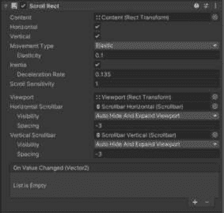

图 12.14：滚动矩形组件

注意，滚动矩形组件没有本章（以及前几章）中所有其他 UI 组件都有的**交互性**、**过渡**或**导航**属性！

我将按顺序讨论属性，以便更容易讨论。

默认情况下是`内容`。默认情况下是`视口`。

如果您正在创建一个不使用 UI 滚动视图的可滚动区域，则必须分配**视口**和**内容**属性，并且分配给**视口**的矩形变换必须是分配给**内容**的矩形变换的父级，以便**滚动矩形**组件正常工作。

### 移动属性

有三个属性与`滚动视图`中的`内容`如何移动相关。`滚动视图`在其边界处移动。

有三个`内容`。

当`内容`。一旦达到`内容`矩形变换的边缘。然而，当`内容`。

当`内容`被拖动超过其边界时，玩家停止拖动后，它将弹回原位。如果使用滚动轮，也会发生弹跳。当选择**弹性**时，子属性**弹性**变为可访问。**弹性**属性决定了弹跳的强度。

当选择**固定**作为**移动类型**时，内容将无法拖动超过其边界，并且不会发生弹跳。

### 与滚动速度相关的属性

选择`内容`后，在玩家停止拖动后继续移动。`内容`的移动由滚动条或鼠标滚轮初始化。当玩家停止拖动后，`内容`将停止移动。一个`0`将在玩家停止拖动时立即停止`内容`，而一个`1`将永远不会停止。默认值为`0.135`。

**滚动灵敏度**属性决定了每次滚动轮转动时内容将移动多远。数字越高，内容每次转动移动的距离就越远，看起来移动得越快。

如果您想禁用鼠标滚轮在滚动视图中的使用，请设置`0`。

### 滚动条属性

您可以为您的水平和垂直滚动条的反应方式分别设置属性。分别是`Scrollbar Horizontal`子项和`Scrollbar Vertical`子项。

如果您只想在滚动视图区域使用拖动，而不想使用滚动条，您只需将`None`设置为属性，或者简单地从场景中删除`Scrollbar Horizontal`和`Scrollbar Vertical`对象。

在每个滚动条分配下，您可以设置相应滚动条的**可见性**和**间距**属性。

**可见性**属性有三个选项：**永久显示**、**自动隐藏**和**自动隐藏并扩展视口**。当为**可见性**属性选择**永久显示**时，相应的滚动条将始终可见，即使不需要，如果允许其相应的移动。例如，如图所示，如果允许**水平**移动，并且将**水平滚动条**的**可见性**设置为**永久显示**，则相应的滚动条将可见，尽管这不是必要的（无法实现水平移动）：

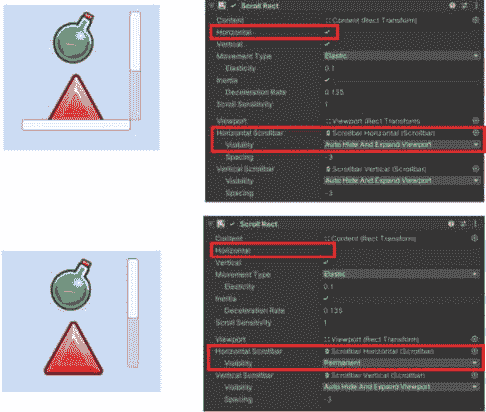

图 12.15：调整滚动矩形中的滚动条

然而，参考同一图像，你可以看到如果**水平**移动被禁用，将**水平滚动条**的**可见性**设置为**永久显示**，将完全从滚动视图中移除。它也在**层次结构**中禁用。

当为**可见性**属性选择**自动隐藏**时，如果不需要（意味着在该方向上不需要移动）或如果相应的轴移动被禁用，相应的滚动条将在游戏播放时变得不可见并在**层次结构**中禁用。

`Viewport`对象有一个**遮罩**组件，这将导致遮罩区域扩展以覆盖最初由滚动条占据的区域。

`-3`，这意味着两个矩形变换略微重叠。如果你想要改变**Viewport**的位置，你必须使用这个属性，因为与**Viewport**位置相关的属性在其矩形变换组件中被禁用。

### 滚动矩形默认事件 – 值更改（Vector2）

滚动矩形组件的默认事件是`Scroll View`的`Content`区域通过拖动、使用鼠标滚轮滚动或使用其中一个滚动条进行滚动。它接受一个`Vector2`位置作为参数，并且，就像本章中讨论的其他事件一样，你可以选择传递无参数、静态参数或动态参数。

如果你想要将`Content`的`Vector2`位置发送到函数，你需要将其发送到一个具有`Vector2`参数的函数，从相应的坐标中的`1.0`开始，到最后位置在相应坐标中的值为`0.0`。

让我们考虑以下函数：

```cs
public void ScrollViewWithParameter(Vector2 value)
{
    Debug.Log(value);
}
```

如果从**控制台**中打印的`Vector2`值中选择前面的功能：

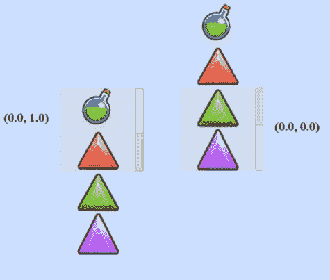

图 12.16：基于位置的滚动矩形值

现在我们已经查看了一些 UI 元素，让我们看看一些实现它们的示例。

# 示例

我在本章前面提到，遮罩和滚动视图的常见用法是包含多个项目的菜单。因此，在本章中，我们只创建一个示例，即通过模仿滚动视图 UI 对象的布局，从一个现有的菜单创建一个滚动视图。

## 从现有菜单创建滚动视图

为了帮助组织项目，复制你在上一章中创建的`Chapter11-Examples`场景；将其重命名为`Chapter12-Examples`。打开`Chapter12-Examples`并在其中完成以下示例。

我想能够向我的`Inventory Panel`添加更多项目，并允许玩家滚动查看这些项目。我可以创建一个新的 UI 滚动视图项目，并更新它以看起来像当前的`Inventory Panel`，但这会比值得的麻烦更多。所以，相反，我将当前的`Inventory Panel`转换为可滚动视图。完成后，它将看起来如下所示：

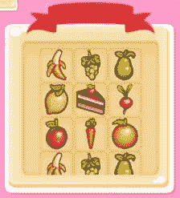

图 12.17：我们将构建的可滚动菜单

此面板可以通过拖动食物项旁边的区域来调整其视图。我本可以添加一个垂直滚动条来控制移动，但我想要展示如何在不使用滚动条的情况下创建可拖动区域。而且，没有滚动条看起来也更美观。

要使`Inventory Panel`可滚动，完成以下步骤：

1.  目前，`Pause Panel`挡在路上了。让我们通过取消选中其`Inventory Panel`中的复选框来更容易地禁用它。

1.  为了使可滚动视图真正工作，我们需要在库存中添加更多项目。选择名为`Item Holder`的`Inventory Holder`的所有子项，并使用*Ctrl* + *D*进行复制。现在，所有复制的项目都被选中，将它们重命名为`Item Holder`，这样就不会给每个项目添加编号后缀。现在，你的`Inventory Holder`中应该有两倍的项目，你应该看到以下内容：

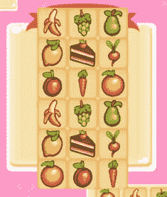

图 12.18：第二步后的结果

1.  要获得可滚动的视图，我们需要在场景中添加一些额外的项目，这些项目可以成为我们想要滚动的内容的父项。每个项目都需要特定的组件来创建可滚动的视图，你需要遵循非常具体的父/子关系，如下面的图所示：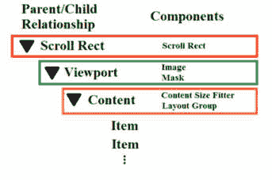

    图 12.19：创建可滚动菜单的层次布局

    让我们从将包含`Inventory Panel`的对象开始，右键单击并选择`Inventory Panel`。

1.  将新项目重命名为`Scroll Rect`，并在`Inventory Banner`中重新定位它。

1.  给`Scroll Rect`游戏对象添加`Scroll Rect`组件，在它的检查器中选择**添加组件** | **UI** | **Scroll Rect**。

1.  现在，让我们创建一个将包含`Scroll Rect`的项目，并选择`Scroll Rect`。

1.  将新的图像重命名为`Viewport`。

1.  `Inventory Holder`现在在视觉上挡住了，所以暂时禁用它。

1.  将`uiElements_38`图像添加到`Viewport`中。

1.  调整`滚动矩形`的 Rect Transform，使其填充其父级的 Rect Transform。

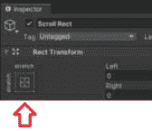

图 12.20：滚动矩形对象的 Rect Transform

1.  调整`Viewport`的 Rect Transform 属性，如下所示：

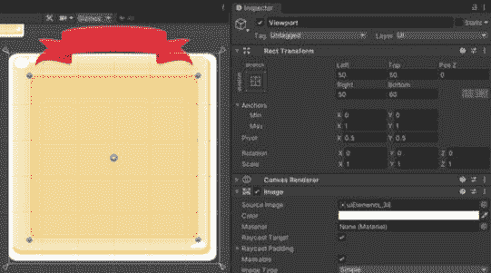

图 12.21：滚动矩形对象的 Rect Transform

1.  给`Viewport`添加**遮罩**组件，通过**添加组件** | **UI** | **遮罩**。

1.  重新启用`Inventory Holder`并将其重命名为`Content`。

1.  将`Content`的透明度设置为`0`，以便背景不可见。你应该看到以下内容：

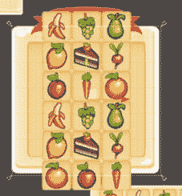

图 12.22：步骤 11 的结果

1.  现在，将`Content`拖动到`Viewport`中。这样做应该会立即将遮罩应用到`Content`的所有子元素上：

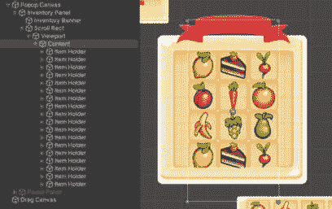

图 12.23：步骤 12 的结果

1.  将`Content`定位，使列表顶部的食物完全位于遮罩区域内：

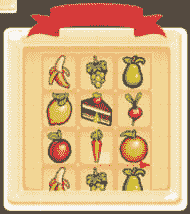

图 12.24：如何定位 Content

1.  现在剩下的工作就是设置`滚动矩形`上的属性，并将`Content`和`Viewport`拖到`滚动``矩形`组件的适当槽位中。

1.  禁用**水平**移动，因为我们只想让菜单垂直移动。将**移动类型**设置为**固定**，这样菜单就不会拉伸和弹跳，并保持在适当的范围内。你的**滚动矩形**组件现在应该如下所示：

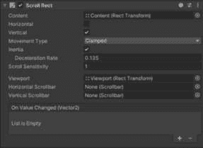

图 12.25：分配 Content 和 Viewport

1.  重新启用`Pause Menu`对象，以便我们的`Pause Menu`在游戏中能够正常工作。

如果你玩游戏，现在`Inventory Panel`应该有当你拖动它们时可以滚动的物品。记住，你可以通过按键盘上的*I*键打开`Inventory Panel`。由于我们在单个物品上实现了拖放功能，为了滚动，我们必须拖动`Content`上没有食物项的区域。

# 概述

本章介绍了如何隐藏 UI 元素的可见性以及使用滚动视图创建容器，这些容器可以容纳比屏幕一次能显示的更多物品。然而，仍然还有相当多的可交互 UI 元素。在下一章中，我们将探讨 Unity UI 系统提供的剩余交互 UI 元素。
