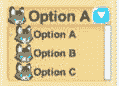

# 13

# 其他可交互 UI 组件

最受欢迎的可交互 UI 组件是按钮。然而，除了按钮之外，还有多种类型的可交互 UI 元素。如果您想到了您最近填写过的在线表单，您可能已经与按钮、文本字段以及可能是一个单选按钮或复选框进行了交互。虽然从技术上讲，所有这些可交互项都可以使用 UI 按钮、UI 文本和一些自定义代码来开发，但您不必自己构建它们！Unity 在 uGUI 系统中包含了多个常用可交互 UI 元素，既可以作为可编辑的 GameObject，也可以作为可以添加到现有 GameObject 中的组件。

本章将回顾 uGUI 系统附带的所有其他预构建 UI 元素。在回顾了按钮和文本章节之后，这些对象的属性中的大多数您都应该熟悉，但每个可交互项都有一些仅限于该 UI 元素类型的属性，因此我们将重点关注这些属性。

本章将讨论以下主题：

+   使用 UI 开关

+   使用 UI 滑块

+   使用 UI 下拉菜单和 Dropdown – TextMeshPros

+   使用 UI 输入字段和输入字段 – TextMeshPros

+   创建带有图像的下拉菜单

注意

本节中展示的所有示例都可以在代码包提供的 Unity 项目中找到。它们位于标记为 **Chapter13** 的场景中。

每个示例图像都有一个标题，说明场景中的示例编号。

在场景中，每个示例都在自己的 Canvas 上，其中一些 Canvas 已被禁用。要查看已禁用的 Canvas 上的示例，只需在 **Inspector** 中选择 Canvas 名称旁边的复选框。每个 Canvas 也都有自己的事件系统。如果您同时激活多个 Canvas，这将导致错误。

# 技术要求

您可以在此处找到本章的代码：[`github.com/PacktPublishing/Mastering-UI-Development-with-Unity-2nd-Edition/tree/main/Chapter%2013`](https://github.com/PacktPublishing/Mastering-UI-Development-with-Unity-2nd-Edition/tree/main/Chapter%2013)

# 使用 UI 开关

**UI 开关** 对象是一个带有标签的可交互复选框。要创建 UI 开关，请选择 **+** | **UI** | **Toggle**。


图 13.1：UI 开关 GameObject 及其子项

默认情况下，UI 开关有两个子项：一个 `Background` 和一个 `Label`。`Background` 也有一个子项，即 `Checkmark`。

`Background` 子项是一个表示 `Checkmark` UI 图像出现的“框”的 UI Image。`Label` 是一个 UI 文本对象。

如果您想更改框和勾选标记的外观，您需要更改 `Background` 和 `Checkmark` 子项上 Image 组件的源图像。

## 开关组件

父级切换对象有一个**切换**组件。切换组件看起来与按钮组件非常相似，并且具有许多相同的属性。正如您在本章中将会看到的，所有可交互 UI 对象的前几个属性都是相同的。组件底部的属性是仅属于 UI 切换对象的独有属性（*图 13.2*）：


图 13.2：切换组件的独特属性

**是否开启**属性决定了当切换在场景中初始化时是否被选中。

**切换过渡**属性决定了当切换在开启和关闭或选中和非选中之间转换时会发生什么。有两个选项：**无**和**淡入淡出**。**无**过渡将立即在勾选图像可见和不可见之间切换，而**淡入淡出**过渡将使勾选图像淡入淡出。

**图形**属性分配了将显示勾选标记的**图像**组件。勾选标记子组件的图像组件将自动分配给此属性，但您可以更改它，如果您愿意的话。

最后一个属性，**组**，分配了将定义切换所属的**切换组**组件（如果有的话）。

**切换**组件的默认事件是**值改变**事件，正如在**值改变（布尔值）**部分所看到的。

### 切换默认事件 – 值改变（布尔值）

**切换**组件的默认事件是**值改变**事件，正如在**切换组件的值改变（布尔值）**部分所看到的。此事件将在切换被选中或取消选中时触发。它可以接受布尔参数。

当一个公共函数有一个布尔参数时，它将在函数下拉列表中的**值改变（布尔值）**事件中出现两次：一次在**静态参数**列表中，再次在**动态布尔值**列表中，如下面的截图所示：


图 13.3：ToggleWithParameter 方法的静态和动态版本

如果从`ToggleWithParameter()`函数中选择，则该函数将为假（因为复选框已被取消选中）。

如果您想将切换的`.isOn`值传递到脚本中，则必须在事件的下拉列表中选择**动态布尔值**（而不是**静态参数**）列表中的函数。

为了演示**值改变（布尔值）**事件的工作方式，让我们看看以下两个函数在被调用时的响应：

```cs
public void ToggleWithoutParameter(){
    Debug.Log("changed");
}
public void ToggleWithParameter(bool value){
    Debug.Log(value);
}
```

在第十三章场景中添加到切换组件的事件如下：


图 13.4：第十三章场景中切换事件示例的事件

当场景中的**切换**被取消选中时，以下内容将在**控制台**中打印：

```cs
changed
False
False
```

当**切换**被选中时，以下内容将在**控制台**中打印：

```cs
changed
False
True
```

由于从第一个事件调用的函数没有参数，它将在切换的值改变时始终执行，而不管执行时切换的值是什么。

第二个事件将始终打印`False`的值，因为函数有一个参数，并且由于事件是从`False`中选择的。因此，`False`的值始终被发送到函数。

第三事件的功能是从切换更改到的`.isOn`值中选择的。

## 切换组组件

**切换组**组件允许你拥有许多协同工作的 UI 切换，其中一次只能选择或开启一个。当切换位于同一切换组中时，选择一个切换将关闭其他所有切换。为了使切换组在开始时正常工作，你应该将切换组内的所有切换的**开启**属性设置为**False**，或者只将单个切换的**开启**属性设置为**True**。

**切换组**组件不会创建可渲染的 UI 对象，因此将其附加到空 GameObject 上不会创建任何可见元素。

一旦**切换组**组件附加到一个 GameObject 上，该 GameObject 必须被拖动到每个将被包含在组内的切换的**组**属性中：


图 13.5：切换组组件属性

**切换组**组件上只有一个属性：**允许关闭**。**允许关闭**属性允许在切换处于开启状态时将其关闭。请记住，切换组组件强制每次最多只有一个切换处于开启状态。因此，**允许关闭**属性被关闭将强制始终至少有一个切换被选中。

使用此组件时，我的建议是使用一个空 GameObject 作为你希望分组在一起的切换的父项。然后，这个空 GameObject 将包含切换组组件（如第十三章场景中的**切换组示例**所示）。包含切换组组件的对象必须随后分配到每个切换子项的**切换**组件上的**组**属性。

# UI 滑块

UI 滑块对象允许用户沿着路径拖动把手。路径上的位置对应于一系列值。

要创建一个 UI 滑块，选择`背景`、`填充区域`和`把手滑动区域`。填充区域也有一个子项，即填充，把手滑动区域有一个子项，即把手。

背景子项是一个 UI 图像，它代表了滑块把手可以遍历的整个区域。在默认的滑块示例中，这是被填充的较暗灰色背景区域。

填充区域子对象是一个空的游戏对象。其主要目的是确保其子对象，即填充，正确对齐。填充是一个基于滑块值的 UI 图像。在默认的滑块示例中，这是跟随手柄并在背景中填充的浅灰色区域。

处理滑动区域子对象也是一个空的游戏对象。其目的是确保其子对象，即手柄，正确定位和校准。手柄也是一个 UI 图像。手柄代表滑块的交互区域。

如果您想改变滑块的外观，您需要更改背景、填充和手柄子对象上的**源图像**的**图像**组件。

## 滑块组件

父滑块对象有一个**滑块**组件。它具有所有交互式 UI 对象共有的属性，以及一些仅限于滑块的属性，如下面的图所示：


图 13.6：滑块组件的独特属性

**填充矩形**属性分配显示填充区域图像的对象的矩形变换。默认情况下，这是填充游戏对象的变换组件。您会注意到在填充的矩形变换组件上显示了一条消息，指出**某些值由滑块驱动**。这表明这些值是根据**滑块组件**来改变的。在播放场景时，如果您移动滑块的手柄，您将看不到填充的矩形变换属性更新。然而，如果您在**游戏**视图中移动手柄时使场景视图可见，您将看到填充的矩形变换区域随滑块的变化而变化。

**手柄矩形**属性分配显示手柄图像的对象的矩形变换。默认情况下，手柄的矩形变换被分配给此属性。您会注意到手柄游戏对象上的矩形变换组件也有**某些值由滑块驱动**的消息，因为手柄的位置受到滑块的影响。

滑块表示的值范围由**最小值**和**最大值**属性确定。您可以分配任何值给**最小值**和**最大值**属性，甚至负数。虽然**检查器**允许您将**最小值**定义为大于**最大值**的数字，但如果这样做，滑块将无法正常工作。

**方向**属性允许您选择滑块的朝向。可用的选项包括**从左到右**、**从右到左**、**从下到上**和**从上到下**。每个方向中位置顺序代表滑块值范围的第一个位置（或**最小值**）和最后一个位置（或**最大值**）。

如果选择**整数**属性，滑块可以表示的值范围将限制为整数（非小数）值。

注意

由于我是一名数学老师，我觉得有必要指出这一点。在数学中，术语“整数”代表所有非负整数（从 0 到无穷大）。在这里，在滑动条组件中，术语“整数”代表所有整数，包括负数。因此，如果你像我一样是个数学爱好者，不要让这一点让你认为如果选择了**整数**属性，滑动条就不能持有负值。

**值**属性是滑动条的值。滑动条的把手位置与该属性相关联。**检查器**中与**值**属性相邻的滑动条是对场景中滑动条一对一的表示。

### 滑动条默认事件 – On Value Changed (Single)

滑动条组件的默认事件是“值改变”事件，如滑动条组件的“**值改变（单值）**”部分所示。每当滑动条的把手被移动时，此事件都会触发。它可以接受一个浮点数参数。

如果你希望将滑动条的值作为参数传递给一个具有参数的函数，你必须从动态浮点数列表中选择该函数（类似于从切换的动态布尔列表中选择函数）。

以下函数和截图展示了在 Chapter7Text 场景中找到的滑动条示例，该示例触发调用带有和没有参数的函数的事件：

```cs
public void SliderWithoutParameter(){
    Debug.Log("changed");
}
public void SliderWithParameter(float value){
    Debug.Log(value);
}
```

在以下屏幕截图中，第三个选项显示了从**动态浮点数**列表中选择的函数，并将发送**值**属性的值作为参数传递给该函数：


图 13.7：Chapter13 场景中滑动条示例的事件

注意

重要的是要注意，如果选择了**整数**属性并且滑动条只能持有整数值，那么由该事件调用的函数将接收这些整数作为浮点数值。

现在我们已经回顾了如何使用滑动条，让我们回顾如何使用两种类型的下拉菜单。

# UI 下拉和 Dropdown – TextMeshPro

有两种下拉 UI 对象可供使用，分别是 Unity 中打包的 UI 下拉对象和 Dropdown—TextMeshPro 对象。这两个下拉对象都允许用户从选项列表中进行选择。当点击下拉按钮时，列表会变为可见。一旦从列表中选择了一个对象，列表将折叠，使所选选项在下拉菜单中可见（如果需要的话）。

这两个下拉选项在功能上几乎相同。两者之间的唯一区别是 UI 下拉使用 UI 文本对象来显示文本，而 Dropdown—TextMeshPro 使用 Text - TextMeshPro 对象。因此，我将在这个部分同时讨论这两个对象。此外，由于这两个对象在功能上相同，如果你想包含“花哨”的文本，你需要使用 Dropdown—TextMeshPro 而不是 UI 下拉。

要创建 UI 下拉，请选择 **+** | **UI** | **下拉**。要创建 TextMeshPro 下拉，请选择 **+** | **UI** | **下拉 - TextMeshPro**。如以下截图（*图 13**.8*）所示，两个下拉对象具有相同的父/子对象关系和名称。默认情况下，下拉对象有三个子项：一个标签、一个箭头和一个模板。模板子项默认禁用（因此，在层次结构中显示为灰色），并且有多个子项。

本章的**下拉模板**部分讨论了模板子项及其所有子项。


图 13.8：两种下拉类型的层次结构

在以下段落中，我将讨论所有文本对象，就好像它们是 UI 文本对象一样。然而，请记住，下拉—TextMeshPro 使用 TextMeshPro - 文本对象。

标签子项是一个 UI 文本对象。默认情况下，它显示下拉对象中代表所选选项的文本。当玩家更改所选选项时，标签的**文本**组件的**文本**属性会变为相应的选项。要更改显示在下拉框区域内的文本的属性，请更改标签上的**文本**组件的属性。当新的文本替换标签内的文本时，它将根据标签的文本组件设置的属性自动显示。

箭头子项是一个 UI 图像。它的唯一功能是持有下拉右侧（默认情况下）出现的箭头图像。这个箭头实际上并不做任何事情，它只是一个图像。它不接受输入或随下拉组件的属性而变化。

下拉的后台图像位于主下拉父对象上，而不是名为背景的子对象上。因此，如果您想更改下拉背景和箭头的外观，您需要更改下拉父对象和箭头子对象上的图像组件的**源图像**。下拉的图像仅影响可以选中以显示下拉菜单的矩形。当玩家与下拉交互时向外展开的菜单的背景由模板（在以下**下拉** **模板**部分中讨论）处理。

## 下拉模板

在我们讨论下拉组件的各种属性之前，让我们更仔细地看看下拉的**模板**。

下拉名为模板的子项允许您设置将作为下拉菜单中的选项出现的“项目”的属性。它还允许您设置菜单的背景属性以及当列表超出下拉菜单的可视区域时将出现的滚动条的属性。

请记住，模板子项默认禁用。通过在**检查器**中选择复选框来启用模板，将在场景中显示模板。


图 13.9：启用 Dropdown 的模板 GameObject

你可以在你的编辑器中永久启用此功能，因为一旦你进入**播放**模式，它就会隐藏，正如它应该的那样。

如果你仔细查看模板在**层次结构**中的父/子关系，你会注意到它只是一个带有单个滚动条的 UI 滚动视图对象：


图 13.10：下拉菜单内带有单个滚动条的 UI 滚动视图

查看模板 GameObject 的**检查器**，你会发现它实际上只是一个 UI 滚动视图对象，因为它附有一个带有**水平****滚动条**的**滚动矩形**组件，但没有分配任何**水平****滚动条**：


图 13.11：模板的滚动矩形组件

模板滚动视图对象的**内容**有一个名为**Item**的单个子对象。**Item**有三个子对象：**Item 背景**、**Item 复选标记**和**Item 标签**。如果你查看**Item**的**检查器**，你会发现它只是一个 UI Toggle，并且具有与本章开头讨论的 UI Toggle 相同的子对象和属性。

因此，所有的`模板`都是一个带有单个滚动条和单个切换作为其内容的滚动视图！一开始看起来要复杂得多，但当你分解出各个单独的部分时，你会发现它只是我们之前讨论过的几个 UI 元素的组合！


图 13.12：模板子组件的分解

当使用下拉菜单模板工作时，如果你想更改视觉属性和设置，只需记住前面图中显示的分解，编辑它的前景将显得不那么令人畏惧。

你设置在下拉菜单中出现的每个项目选项都将遵循你为项目切换设置的完全相同的视觉属性。

## 下拉菜单组件

现在我们已经分解了模板，我们可以查看**下拉菜单**组件的属性。

父级 Dropdown 对象有一个**下拉菜单**（或 Dropdown - TextMeshPro）组件。它具有所有其他交互式 UI 对象的共同属性，以及一些仅限于下拉菜单的属性：


图 13.13：两个下拉菜单组件之间的区别

如前图所示，UI 下拉菜单和 Dropdown - TextMeshPro 的属性几乎相同。只有两个主要区别。首先，UI 下拉菜单对象使用 UI Text 对象，而 Dropdown - TextMeshPro 对象使用 Text - TextMeshPro 对象。其次，Dropdown - TextMeshPro 有一个**占位符**属性。

下拉组件实际上非常强大。它处理与下拉菜单的所有交互，将切换文本显示，打开和关闭下拉菜单，并在下拉菜单内移动复选框。它甚至添加滚动条和手柄，以便下拉菜单能够显示非常长的列表。唯一必须由您编写的代码是如何解释玩家选择的属性。

让我们回顾一下两个下拉对象的各种属性。

### 标题属性

有两个属性与标题或当前选中的选项相关（*图 13**.3*）。

`无（文本）`。

**标题图像**属性包含将显示当前选中选项图像的 GameObject 的**图像**组件。默认情况下，此属性未分配，您会注意到**下拉**没有可以持有图像的子项。要显示带有文本的图像，您必须创建一个 UI 图像并将其分配给**标题图像**属性。最好是将您创建的 UI 图像创建为下拉的子项。

### 模板属性

有三个属性与将模板属性分配给所有可能的选项以在下拉列表中显示相关。

**模板**属性引用模板的 Rect Transform。如前所述，模板定义了下拉列表中每个选项的外观以及下拉容器的外观。默认情况下，此属性分配给子模板对象。

**项目文本**属性引用包含项目模板文本的 GameObject 的**文本**组件。默认情况下，项目标签（**项目**的子项）上的**文本**组件分配给此属性。

**项目图像**属性引用包含项目模板图像的 GameObject 的**图像**组件。默认情况下，此属性未分配，类似于**标题图像**。就像**标题图像**一样，要使用此属性，需要创建并分配一个 UI 图像到**标题图像**属性。如果您创建了它，请确保将其添加到模板子项中的**项目**作为子项，以避免混淆。

### 选项属性

**值**属性表示当前选中的选项。选项在一个列表中，**值**属性中的数字表示当前选中选项在列表中的索引。由于选项由它们的索引表示，第一个选项的**值**为 0（而不是 1）。

**选项**属性列出了**下拉菜单**中的所有选项。在列表中，每个选项都有一个文本字符串和精灵（可选）。此列表中的所有字符串和精灵将自动交换到下拉组件子项的正确组件属性中，基于**下拉组件**的属性。因此，您无需编写任何代码即可确保当玩家与下拉菜单交互时，这些项目能够适当地显示。

默认情况下，**选项** 列表包含三个选项。但是，您可以通过选择列表底部的加号和减号来添加或删除选项。您还可以通过拖放选项的手柄（两条水平线）在列表内重新排列选项。请注意，重新排列列表中的选项将更改它们在列表中的索引，然后更改发送到 **下拉列表** 组件的 **值**。

### 下拉列表默认事件 - 值更改（Int32）

下拉列表组件处理与下拉菜单本身的全部交互。您唯一需要编码的是如何解释玩家选择的选项。

下拉列表组件的默认事件是 **值更改** 事件，如 **下拉列表** 组件的 **值更改（Int32）** 部分所示。每当玩家选择新选项时，此事件都会触发。它接受一个整数作为参数，并且与其他章节中讨论的其他事件一样，您可以选择传递无参数、静态参数或动态参数。

如果您想将所选选项的索引（或 **值** 属性的值）发送到函数，您需要将其发送到具有 Int32 参数的 **动态整数** 列表中的函数。请参阅文本末尾的 *创建带有图像的下拉菜单* 示例，了解其实施方法。

我们接下来要审查的下一个交互式 UI 组件是 UI 输入字段。

# UI 输入字段

UI 输入字段提供了一个玩家可以输入文本的空间。

要创建 UI 输入字段，请选择 **+** | **UI** | **输入字段**。默认情况下，输入字段 GameObject 有两个子组件：一个占位符和一个文本对象。

占位符子组件是一个 UI Text 对象，代表玩家输入任何文本之前显示的文本。一旦玩家开始输入文本，占位符 GameObject 上的 Text 组件将停用，使文本不再可见。默认情况下，占位符显示的文本是 **输入文本…**，但可以通过影响占位符的 **Text** 组件上的属性轻松更改显示的文本及其属性。

文本子组件是一个 UI Text 对象，用于显示玩家输入的文本。在 Text 对象的 **Text** 组件上设置属性将改变玩家输入的文本显示。

输入字段包含一个 **图像** 组件。如果您想更改输入框的外观，请更改输入字段上的 **图像** 组件的 **源图像**。

## 输入字段组件

父输入字段对象有一个 **输入字段** 组件。它具有所有交互式 UI 对象的通用属性，以及一些仅限于输入字段的属性：


图 13.14：输入字段组件的独特属性

让我们来看看 UI 输入字段的各个属性。

### 输入文本和屏幕键盘的属性

**输入字段**组件中的许多属性会影响输入字段中显示的文本。由于一些属性有很多选项和相关信息，我将按顺序稍后讨论它们。

请记住，要更改输入文本的视觉样式，您需要更改 Text GameObject 上的**文本**组件的属性。

**文本**组件属性引用将显示玩家输入文本的 GameObject 的文本组件。默认情况下，这是 Text 子对象的**文本**组件。

**文本**属性是当前输入到输入字段的文本。当您尝试从输入字段检索数据时，您希望从该属性而不是 Text GameObject 上的**文本**组件获取信息。Text GameObject 上的文本组件只会存储当前显示的内容。因此，如果文本以星号显示，因为它是一个密码或已滚动，则完整的正确文本将不会存储在 Text GameObject 的**文本**组件中。

`0`允许无限文本输入。

**占位符**属性引用当玩家没有输入任何内容或已清除所有输入文本时显示文本的 GameObject 的**文本**组件。默认情况下，这是**占位符**子对象的**文本**组件。

**隐藏移动输入**属性允许您覆盖当选择文本**输入字段**时弹出的默认移动键盘。如果您有自己的键盘希望玩家使用，您将选择此选项。目前，这仅适用于 iOS 设备。

如果您想在 Android 设备上使用自己的键盘，您最好的选择是创建自己的自定义输入字段脚本。该脚本会在输入框被选中时显示键盘，并根据自定义键盘按键更改框内的文本。

**只读**属性使**输入字段**内的文本静态且不可由玩家编辑。当此属性激活时，玩家仍然可以选中文本进行复制和粘贴。

当选择**只读**属性时，输入字段显示的文本仍然可以通过访问输入字段组件上的**文本**属性通过代码进行编辑。但是，更改 Text GameObject 上的**文本**组件的**文本**属性，不会更改显示的文本。

#### 内容类型

**内容类型**属性决定了输入字段将接受哪些字符类型。在显示屏幕键盘的设备上，它还会影响当输入字段被选中时设备显示的键盘。如果所需的键盘不可用，将显示默认键盘。例如，如果设备没有仅数字的键盘，它将显示默认键盘。有关每个键盘和与这些内容类型一起提供的字符验证的更详细说明，请参阅*键盘类型*和*字符验证*选项部分。

可能的选项有**标准**、**自动更正**、**整数数字**、**小数数字**、**字母数字**、**名称**、**电子邮件地址**、**密码**、**PIN**和**自定义**。

**标准**选项允许输入任何字符。请注意，然而，对于输入文本的字体不可用的字符将不会显示。

**自动更正**选项的工作方式类似于**标准**选项，但在具有屏幕键盘的设备（尤其是触摸屏键盘）上，它允许设备的自动更正功能根据其自己的自动更正算法自动覆盖单词。

**整数数字**选项仅允许整数值（正数和负数，没有小数）。玩家将被限制只能输入一个负号。**小数数字**选项的工作方式类似，但除了接受小数点外，它还接受。玩家将被限制只能输入一个小数点。在具有屏幕键盘的设备（尤其是移动设备）上，这两个选项将显示数字键盘而不是标准键盘。

**字母数字**选项仅允许字母（大写和小写）、数字以及输入。不允许数学符号和标点符号，包括负数和小数点（句号）。

**名称**选项将自动将字段中输入的每个新单词的首字母大写。玩家可以选择通过删除字母并以小写重新输入来将单词的第一个字母小写。

**电子邮件地址**选项允许玩家输入电子邮件地址。它还将限制玩家只能输入一个@符号或两个连续的点（句号/小数点）。

**密码**选项允许在字段中输入字母、数字、空格和符号。当玩家将文本输入到**密码**输入字段时，输入的文本将隐藏起来，并以星号（*****）显示。

**PIN**选项允许输入整数数字（没有小数）。负数是可接受的。玩家在具有**PIN 内容类型**的字段中输入的文本将以与**密码**选项隐藏玩家输入相同的方式被隐藏。在具有屏幕键盘的设备上（尤其是屏幕键盘设备），将显示数字键盘，并带有**PIN**选项。

最后一个选项**自定义**让您对输入类型有最大的控制权。当选择时，**检查器**中会出现新的属性，允许您选择**行类型**、**输入类型**、**键盘类型**和**字符验证**。

#### 行类型

**行类型**选项与**内容类型**的**标准**、**自动更正**和**自定义**选项一起提供。有三个**行类型**选项：**单行**、**多行提交**和**多行换行**。所有其他**内容类型**都自动限制为**单行**类型。如果玩家可以输入比输入字段可见区域可以显示的更多文本（即**字符限制**属性不会将其限制在可见空间内），则文本将根据所选的**行类型**进行滚动。

**单行**选项仅允许输入的文本显示在一行上。如果文本超出可见的水平空间，文本将水平滚动。如果玩家按下*Enter*键，输入字段将像文本已被提交一样处理。

**多行提交**和**多行换行**选项允许文本在超出可见水平空间时垂直溢出，并在文本超出可见垂直空间时垂直滚动。两种选项之间的区别在于按下*Enter*键时会发生什么：**多行提交**将提交文本，而**多行换行**将开始新的一行。

#### 输入类型

当选择**自定义内容类型**时，您可以从三种**输入类型**中进行选择：**标准**、**自动更正**和**密码**。

选择这些不同的**输入类型**不会更改键盘或提供任何验证，就像同名**内容类型**一样。例如，**密码输入类型**将接受*Enter*键作为新行，并在字段中显示为星号，但在**文本**属性中实际存储的数据中将接受它作为新行。

**标准**选项不对输入类型施加任何特殊条件。

**自动更正**选项适用于具有内置自动更正功能的屏幕键盘平台。此选项允许设备的自动更正根据需要更改文本。

**密码**选项将文本显示为星号。

#### 键盘类型

当选择**自定义内容类型**时，您可以选择**键盘类型**。在具有屏幕键盘的设备上，此属性允许您选择在输入字段被选中时将显示哪个键盘。

可能的选项有**默认**、**ASCII 兼容**、**数字和标点符号**、**URL**、**数字键盘**、**电话键盘**、**姓名电话键盘**、**电子邮件地址**、**社交**、**搜索**、**十进制键盘**和**一次性代码**。

如果所选键盘在目标设备上不可用，设备将显示默认键盘。

**默认**选项显示设备的默认（字母）键盘。在大多数设备上，此键盘仅显示字母、空格键、退格键和回车（Enter）键。当选择此选项时，玩家将能够切换到带有数字和标点符号键的键盘。

例如，iOS 默认的英语键盘和数字标点符号键盘可以轻松切换，如图下所示：


图 13.15：iOS 默认英语键盘和数字标点符号键盘

**ASCII 兼容**选项显示带有标准 ASCII 键的设备键盘。此选项可用于限制键盘为英语和类似语言的键盘。此键盘也是一个字母键盘，并且可以选择切换到数字和标点符号键盘。例如，iOS 的 ASCII 键盘在先前的图表中显示，因为它与默认的英语键盘相同。

**数字和标点符号**选项打开设备的数字和标点符号键盘，并可以选择切换到“字母”键盘。例如，iOS 的数字和标点符号键盘在先前的图表中显示。

**URL 键盘**选项显示设备的 URL 键盘。此键盘具有句点（**.**）键、正斜杠（**/**）键和**.com**键，代替空格键。例如，以下图像显示了 iOS URL 键盘及其数字/标点符号格式。请注意，URL 键盘的数字/标点符号格式与默认/ASCII 键盘伴随的数字/标点符号格式不同：


图 13.16：iOS URL 键盘及其数字/标点符号格式

**数字键盘**选项显示带有数字（**0**-**9**）和（通常）退格键的设备键盘。此键盘用于 PIN，因此不允许使用其他字符。例如，以下图像显示了 iOS 数字键盘：


图 13.17：数字键盘

**电话键盘**选项显示与数字键盘相同键的设备键盘，但还包括星号和井号（磅号）键。例如，以下图像显示了 iOS 电话键盘及其符号显示：


图 13.18：iOS 电话键盘及其符号显示

**名称电话键盘**选项显示设备的“字母”键盘，并可以切换到电话键盘。例如，以下图像显示了 iOS 名称电话键盘的两个视图：


图 13.19：iOS 名称电话键盘的两个视图

**电子邮件地址**选项显示设备的电子邮件键盘。电子邮件键盘突出显示了**@**键和句点（**.**）键以及其他常见的电子邮件地址符号。例如，以下图像显示了 iOS 的电子邮件键盘及其数字/标点符号格式：


图 13.20：iOS 电子邮件键盘及其数字/标点符号格式

**社交键盘**选项显示设备的社交键盘。此键盘突出显示了常见的社交网络键，如**@**键和**#**键。例如，以下图像显示了 iOS 的“Twitter”键盘及其数字/标点符号格式。在 iOS 设备上，此键盘特别称为*Twitter 键盘*，但它显示在其他社交网络应用，如 Instagram 上：


图 13.21：iOS Twitter 键盘

**搜索**选项显示网络搜索键盘。此键盘突出显示了空格键和句点键。例如，以下图像显示了 iOS 网络搜索键盘及其数字/标点符号格式：


图 13.22：iOS 网络搜索键盘及其数字/标点符号格式

注意

您可以在[iOS 上所有可用的键盘类型列表](https://developer.apple.com/documentation/uikit/uikeyboardtype)中查看。

您可以在[Android 上所有输入类型列表](https://developer.android.com/reference/android/widget/TextView.xhtml#attr_android:inputType)中查看（不仅限于键盘，但它们包含在列表中）。

#### 字符验证选项

当选择**自定义内容类型**时，您可以选择希望使用的哪种类型的**字符验证**。此选项限制了可以在输入字段中输入的字符类型。如果玩家尝试输入不符合限制的字符，则不会在输入字段中插入任何字符。

可能的选项有**None**、**整数**、**小数**、**URL**、**字母数字**、**名称**和**电子邮件地址**。

**字符验证**仅检查输入的每个单独字符，以查看它是否允许在字段中使用。它不会检查整个字符串，以查看字符串本身是否有效。例如，如果选择了**电子邮件地址**，它将不会检查它是否实际上符合电子邮件地址的格式。这种验证类型必须通过代码来完成。

**None**选项不执行任何字符验证，允许任何格式化的字符被输入到输入字段中。

`0` 到 `9` 以及破折号（负号）。输入进一步限制为只允许负号作为第一个输入字符。

**十进制**选项与**整数**选项具有相同的限制，但它还允许输入单个小数点。

**字母数字**选项仅允许英文字母（a 到 z）和数字 0 到 9。允许大小写字母；负号和小数点不被接受。

**名称**选项允许在名称中通常找到的字符，并提供格式化。它允许字母、空格和单引号（‘）。它还强制字符串中第一个字符以及每个空格后的字符大写。单引号后不能有空格，并且空格后不能有空格。字符串中只允许一个单引号。字母不受**字母数字**选项中仅限于 a-z 的限制。允许任何 Unicode 字母。

备注

要查看所有允许的 Unicode 字母的列表，请查看 .NET 中 **Char.IsLetter** 方法的说明。[`msdn.microsoft.com/en-us/library/system.char.isletter(v=vs.110).aspx`](https://msdn.microsoft.com/en-us/library/system.char.isletter(v=vs.110).aspx)。

**电子邮件地址**选项允许在电子邮件地址中允许的字符，并强制执行一些格式化规则。与其他验证选项相比，它在可以输入的字符类型方面限制较少。以下字符是允许的：

+   小写和大写英文字母（a 到 z）

+   数字 0-9

+   以下标点符号和特殊符号：

| **符号名称** | **字符** |
| --- | --- |
| at 符号 | @ |
| 点/句号 | . |
| 问号 | ? |
| 感叹号 | ! |
| 破折号 | - |
| 下划线 | _ |
| 单引号 | ‘ |
| 反引号 | ` |
| 波浪号 | ~ |
| 开放和闭合花括号 | { 和 } |
| 竖线 | &#124; |
| 箭头 | ^ |
| 星号 | * |
| 加号 | + |
| 等号 | + |
| 斜杠 | / |
| 哈希符号/井号 | # |
| 美元符号 | $ |
| 百分比 | % |
| 和号 | & |

表 13.1：允许的特殊字符

不允许空格，字符串中只允许一个 `@` 符号，并且点不能跟随另一个点。

即使电子邮件地址的第一个字符是点不合法，**电子邮件地址字符验证**选项也不会限制它作为输入字段中第一个输入字符。

### 箭头和选择属性

`InputField Input Caret`。当输入字段被选中时，光标变为可见。

本节讨论的属性会影响光标的外观，以及如果使用光标（或突出显示）选择文本时的文本外观。

`0.85`。

`1`。

当选择 **自定义光标颜色** 属性时，一个次要属性，**光标颜色**，变得可用。然后你可以选择更改光标颜色。除非 **自定义光标颜色** 被选中并且 **光标颜色** 被更改，否则光标将呈现深灰色。

当光标在输入字段内的字符之间拖动时，这些字符将被选中（或突出显示）。**选择颜色**属性决定了选中文本的颜色。

### 输入字段默认事件 – 值更改（字符串）和末尾编辑（字符串）

输入字段组件有两个默认事件。第一个默认事件是**值更改**事件，如输入字段组件的**值更改（字符串）**部分所示。每当输入字段中的文本更改时，此事件都会触发。它接受一个字符串作为参数，其参数的使用方式与本章前面讨论的 UI 组件的**值更改**事件相同。如果你想向函数传递参数，你可以从**静态参数**列表或从**动态字符串**列表中选择函数，具体取决于你是否想向函数传递参数：


图 13.23：第十三章场景中输入字段值更改事件示例

如果你想要不断检查玩家在输入字段中输入的内容，你将使用前面图像中显示的第三种设置，该设置从**动态** **字符串**列表中选择一个带有参数的函数。

第二个默认事件是**末尾编辑**事件，如输入字段组件的**末尾编辑（字符串）**部分所示。每当玩家完成文本编辑时，此事件都会触发。玩家的完成可以通过点击输入字段外部（这样输入就不再被选中）或提交文本来确认。

它接受一个字符串作为参数。与其他本章讨论的事件一样，你可以选择不传递参数、传递静态参数或传递动态参数。以下截图显示了所有三种选项的设置：


图 13.24：第十三章场景中输入字段末尾编辑事件示例

如果你想在按下 *Enter* 键时调用末尾编辑事件，请使用 **单行** 或 **多行提交** 选项的 **行类型**。

现在我们已经回顾了 UI 输入字段，让我们来回顾其对应物，即输入字段 – TextMeshPro。

# 输入字段 - TextMeshPro

Input Field - TextMeshPro 与 UI 输入字段非常相似。当添加到场景中时，您会看到它看起来几乎相同，只是占位符文本使用了不同的字体。UI 输入字段默认使用 Arial 字体，而 Input Field - TextMeshPro 使用 Liberation Sans。

要创建 UI 输入字段，请选择**+** | **UI** | **Input Field - TextMeshPro**。默认情况下，Input Field - TextMeshPro GameObject 有一个名为文本区域的子对象，该子对象有两个子对象：一个占位符和一个文本对象。您将观察到它在设置上与 UI 输入字段略有不同。

文本区域 GameObject 包含一个 Rect Transform 组件和一个 Rect Mask 2D 组件。文本区域确保文本不会出现在指定的区域之外，如下图中突出显示的区域所示。如果您想更改此区域的大小，您将更改 Rect Transform 组件上的属性：


图 13.25：InputField - TextMeshPro 的文本区域

占位符和文本子对象仅仅是 Text - TextMeshPro 对象。您可以在*第十章*中找到有关 Text - TextMeshPro 对象的更多信息。

一个 Input Field - TextMeshPro GameObject 包含一个 Image 组件。如果您想更改输入框的外观，请更改 InputField (TMP)父级上的**Image**组件的**源图像**。

## TextMeshPro - 输入字段组件

父级 InputField (TMP)对象具有一个**TextMeshPro – 输入字段**组件。它具有所有交互式 UI 对象的公共属性，许多与标准 UI 输入字段的相同属性，以及一些仅适用于输入字段 - TextMeshPros 的属性。本节将不会讨论与 UI 输入字段共享的属性，因为它们已在上一节中讨论过，我们只会讨论仅适用于它的属性。您可以在以下图像中查看属性：


图 13.26：TextMeshPro – 输入字段组件

**文本视口**属性设置为应显示输入文本的区域中的 Rect Transform。默认情况下，文本区域子对象的 Rect Transform 分配给此属性。如前所述，文本区域子对象具有一个 Rect Mask 2D 组件，该组件阻止文本在文本区域 Rect Transform 组件定义的区域之外可见。

**文本组件**属性设置为应显示输入文本的对象中的 Text Mesh Pro UGUI 组件。分配给此属性的 TextMeshPro - Text 对象将确定输入文本的字体和显示设置。默认情况下，文本子对象的 Text Mesh Pro UGUI 组件分配给此属性。

**文本输入框**组可以展开以显示一个大的文本输入区域。**文本输入框**属性与 UI 输入字段组件上的**文本**属性工作方式相同。用户输入的文本将存储在此处，可以通过代码访问。这将存储实际输入的文本，而不是格式化后的文本。例如，如果文本已被格式化为显示为星号（如**Pin**和**密码内容类型**），实际的 PIN 或密码将存储在此处，而不是一串星号。

### 输入字段设置

**字体资产**属性确定输入字段 - TextMeshPro 中显示的各种文本的字体，而**点大小**属性确定文本的大小。您会注意到占位符和文本子项在其 Text Mesh Pro UGUI 组件上也有**字体资产**和**点大小**属性。更改输入字段 - TextMeshPro 父对象的**字体资产**和**点大小**属性也将更改子对象上的相应属性。

此组中的其余属性是包含在 UI 输入字段中的属性。

### 控制设置

如果选择**焦点时全选**属性，当选择输入字段- TextMeshPro 时，字段内的所有文本将被突出显示。

如果选择**在停用后重置**属性，光标将重置到文本前面的默认位置。

如果选择**按 ESC 键恢复**属性，则在按下*esc*键时，文本将重置回默认值。默认值将是空字符串或场景开始时在**文本输入框**中输入的内容。

**富文本**属性意味着可以接受任何富文本标签，而**允许富文本编辑**属性允许用户在字段内输入富文本标签。

### 输入字段 - TextMeshPro 默认事件 - 选择时（字符串）和取消选择时（字符串）

输入字段 - TextMeshPro 有四个默认事件：**值更改**事件、**结束编辑**事件、**选择**事件和**取消选择**事件，如**值更改（字符串**）、**结束编辑（字符串**）、**选择（字符串**）和**取消选择（字符串**）部分所示。

前两个事件，**值更改**事件和**结束编辑**事件与 UI 输入字段中展示的相同。

第三个事件是**选择**事件。每当选择输入字段 - TextMeshPro 时，此事件都会触发。第四个事件是**取消选择**事件。正如您所期望的，每当取消选择输入字段 - TextMeshPro 时，此事件都会触发。它与**结束编辑**事件的工作方式类似，但它在文本提交时不会触发。

与本章中讨论的其他事件一样，您可以选择向**选择**和**取消选择**事件传递无参数、静态参数或动态参数。

现在我们已经回顾了 uGUI 的各种可交互组件，让我们看看如何使用它们的例子。

# 例子

本章包含了许多新内容，以至于我可以花掉这本书的剩余部分来展示例子！遗憾的是，我无法做到这一点，所以我将展示一些我认为最有用的例子。让我们开始吧。

## 创建带有图像的下拉菜单

让我们继续工作在我们的场景中，创建一个下拉菜单，允许我们在猫和狗之间切换我们的玩家角色。最终版本将如下所示：


图 13.27：暂停菜单下拉菜单的最终版本

改变我们的选择将改变屏幕顶部出现的角色图像。

包含狗图像的精灵表是我从以下免费艺术资源中修改的：

[`opengameart.org/content/cat-dog-free-sprites`](https://opengameart.org/content/cat-dog-free-sprites)

这是我们提供猫精灵的同一资产。

当你想在播放模式下看到你的 UI 下拉菜单时，你必须按**P**键来弹出`暂停面板`。当你只想快速检查布局时，这可能会有些烦人。你可以通过禁用`主相机`上的`ShowHidePanels.cs`脚本来暂时禁用`暂停面板`的自动隐藏。记住，当你完成时一定要重新打开它！

### 以标题和项目图像布局下拉菜单

要创建一个像前一张图片中显示的 UI 下拉菜单，请完成以下步骤：

1.  定位到文本源文件中提供的`dogSprites.png`图像，并将其拖入项目`Assets/Sprites`文件夹中。

1.  通过将**精灵模式**设置为**多个**并利用**自动**切片来切割精灵表。当你执行**自动**切片时，将**锚点**设置为**底部**。

1.  现在，让我们向我们的`暂停面板`添加一个 UI 下拉菜单。在`暂停横幅`中，在`暂停面板`上右键单击`下拉菜单`向上。

1.  通过设置矩形变换属性来调整**下拉菜单**的大小和位置，如下所示：

    图 13.28：下拉菜单的矩形变换

    您的下拉菜单现在应该如下所示：

    

    图 13.29：下拉菜单的当前状态

1.  要更改下拉菜单的背景，我们需要将`uiElements_12`子精灵更改为`箭头`。你可以调整`箭头`的属性来改变其外观和一般位置。

    给`箭头`分配`uiElements_132`精灵，并调整矩形变换，如图所示：


图 13.30：箭头的矩形变换

注意

在项目视图的搜索栏中键入**132**是快速找到**uiElements_132**图像的方法。

1.  虽然下拉组件有一个标题变量，但 UI 下拉模板并没有预先构建一个。因此，我们必须自己手动添加一个。在 `Label` 中的 `Dropdown` 上右键单击。重命名为 `Caption`。

1.  给 `Caption` 赋予 `catSprites_0` 精灵并调整其矩形变换，如下所示：

    图 13.31：标题的矩形变换

    我们将其设置为猫的图片，这样我们就可以看到它是否显示正确，但请记住，它将根据选择自动更改为适当的精灵。

1.  现在，选择 `Label` 并调整其 **矩形变换** 和 **文本** 组件，如下所示：

    图 13.32：标签的矩形变换

    如果你尝试调整 **文本**，它将恢复到选项 A，因为这是由下拉组件驱动的。

1.  现在我们已经按照我们想要的方式设置了标题，让我们来处理模板。启用 `Template` 对象，以便在场景中查看它并在 `Scrollbar` 中展开它，这样我们就可以保持它不变。它将在场景视图中显示，但在播放模式下不可见，因为其 **可见性** 在模板的 Scroll Rect 组件中设置为 **自动隐藏并展开视口**。

1.  要更改下拉窗口的背景，将 `Template` 更改为 `uiElements_11`。

1.  `Item` 子项显示了所有将在我们的下拉列表中列出的选项的通用格式。我们对它所做的任何更改都将自动应用于当下拉脚本填充它们时所有选项。

    选择 `Item` 并更改其矩形变换 `50`。


图 13.33：项目的矩形变换和层次结构

1.  `Content` 需要完全封装 `Item`。因此，更改其矩形变换 `52`。确保 `0`。

    如果你玩过游戏，`Content` 从 `0` 变为其他东西。这实际上是应该发生的（在标题后面设置了选项 A），但当你试图布局你的 `Item` 时，这会让人感到烦恼，因为你将无法看到你的 `Item`。

    因此，在玩游戏后，将 `0` 更改，以便你可以继续编辑。

1.  正如我们不得不向 `Dropdown` 添加一个子图像以便有标题图像一样，我们也必须向 `Item` 添加一个子图像，以便在菜单中显示图像。

    在 `Image` 中的 `Item` 上右键单击。重命名为 `Item Image` 并在 **层次结构** 中将其移动到 `Item Checkmark` 和 `Item Label` 之间。

1.  给 `Item Image` 赋予 `catSprites_0` 精灵并调整其矩形变换，如下所示：


图 13.34：项目图像的矩形变换和层次结构

1.  选择 `Item Label` 并调整其 **矩形变换** 和 **文本** 组件，如下所示：


图 13.35：项目标签的矩形变换

1.  对`Item`做的最后一件事是移除白色背景。选择`Item Background`并更改`0`。现在你的下拉菜单应该看起来如下：


图 13.36：下拉的当前状态

1.  现在我们已经从视觉上设置了下拉菜单，我们需要设置下拉组件的属性。如果你玩游戏，你会看到我们的下拉菜单还没有正确的选项。虽然玩游戏时你看不出来，但**Caption Image**和**Item Image**也没有连接：



图 13.37：按下播放时的下拉当前状态

1.  让我们在`Dropdown`上更新下拉组件。将层次结构中的`Caption`子项拖到`Item Image`中，然后拖到`Caption`中，拖到**Caption Image**中。猫的图像将从场景中消失。别担心！它会回来的。它正在更新为**选项 A**的图像，目前设置为无。

1.  我们最后需要设置的是将在下拉菜单中显示的选项集。

    我们只需要两个选项，所以将`Option A`选择为`Cat`，将文本`Option B`选择为`Dog`。

    将`catSprites_0`拖到`Cat`下的精灵槽中，将`dogSprites_0`拖到`Dog`下的精灵槽中。你的下拉组件属性应该如下所示：

    

    图 13.38：下拉组件的属性

    如果你玩游戏，你会看到下拉菜单现在显示了适当的选项列表，并且根据你的选择更新了标题图像和文本：

    

    图 13.39：下拉选项的最终视觉设置

### 使用下拉选择的信息

现在我们已经将下拉菜单设置成我们想要的样子，并且它运行正常，我们可以用代码访问玩家的选择。我们将使用玩家的选择来更新屏幕左上角的玩家角色图像。

要用下拉选择替换玩家角色图像，完成以下步骤：

1.  在你的`Assets/Scripts`文件夹中创建一个新的 C# 脚本，命名为`PlayerCharacterSwap.cs`。

1.  为了访问 UI 变量类型，将`UnityEngine.UI`命名空间添加到脚本顶部的以下行：

    ```cs
    using UnityEngine.UI;
    ```

1.  我们只需要两个变量，一个用来表示将与**下拉菜单**中的选择进行交换的图像，另一个用来表示**下拉菜单**。

    我们将把这个脚本附加到下拉对象上，这样我们就不必将引用它的变量设置为公共的。在命名空间声明之后添加以下变量声明：

    ```cs
    public Image characterImage;
    Dropdown dropDown;
    ```

1.  在`Awake()`方法中初始化`dropDown`变量，将 Dropdown 组件附加到此脚本将要附加到的对象上：

    ```cs
    void Awake(){
        dropDown = GetComponent<Dropdown>();
    }
    ```

1.  Dropdown 组件的默认事件是**On Value Changed**事件，它接受一个整数参数。创建一个公共函数，接受一个整数参数，如下所示：

    ```cs
    public void DropDownSelection(int selectionIndex){
    }
    ```

1.  `DropDownSelection`方法将在我们的脚本中获取`selectionIndex`参数的整数值。

    将以下两行添加到您的`DropDownSelection`函数中：

    ```cs
    Debug.Log("player selected " + dropDown.options[selectionIndex].text);
    characterImage.sprite = dropDown.options[selectionIndex].image;
    ```

    第一行将在选项列表中找到指定索引处的文本，并将其打印到控制台。

    第二行将在选项列表中找到指定索引处的精灵，并将`characterImage`上的精灵更改为该精灵。

1.  我们现在已经完成了脚本，可以在 Unity 编辑器中连接它。将`PlayerCharacterSwap.cs`脚本拖到`Dropdown`上以附加它。

    记住，`dropDown`变量不是公共的，因为我们预计将此脚本作为组件附加到`Dropdown`。

1.  公共变量`characterImage`需要在检查器中分配。将**左面板** | **Character Holder** | **Character**中的`Character Image`拖到**Player Character Swap**组件上的**Character Image**槽中。

1.  现在我们需要在 Dropdown 组件的**On Value Changed**事件上调用**DropDownSelection**函数，从**PlayerCharacterSwap.cs**脚本中。在**On Value Changed (Int32)**事件列表中选择加号（**+**）来添加一个新的**On Value Changed**事件。将**Dropdown**从**层次结构**拖入对象槽中，并从**PlayerCharacterSwap**脚本的**Dynamic int**列表中选择**DropDownSelection**函数。**On Value Changed (Int32)**事件列表应如下所示：


图 13.40：On Value Changed (Int32)属性

就这样！现在玩玩游戏，看看玩家角色的图像是否与从 Dropdown 中选择的图像交换：


图 13.41：场景的最终版本

*图 13*.41 显示了游戏的场景最终版本。

# 摘要

谁能想到有这么多不同类型的可交互 UI 对象？为这些不同的 UI 对象提供模板非常有帮助。技术上，它们都可以通过按钮、图像和文本*手动*构建，但这将需要大量的努力，你不必担心，因为 Unity 已经为你做到了。在本章中，我们回顾了如何使用常见的 UI 元素：切换、滑块、下拉列表和输入字段。

接下来，我们将介绍如何在 UI 中使用动画！
