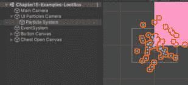
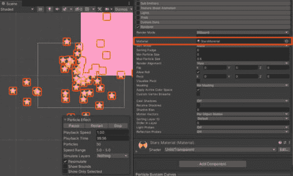
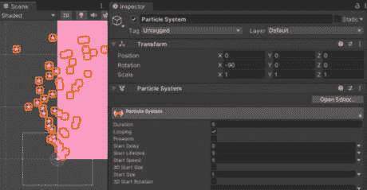
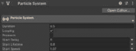
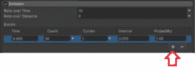
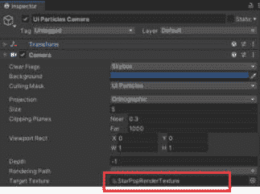
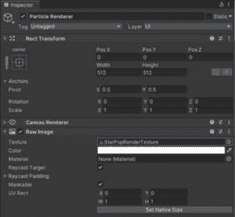

# UI 中的粒子

粒子效果是给游戏增添“活力”的一种有趣且吸引人的方式。Unity 引擎中的粒子系统为你提供了制作各种有趣效果（如火花、烟雾、火焰等）所需的工具。本章将讨论如何在 UI 中使用粒子效果。

在本章中，我们将讨论以下主题：

+   在 UI 中显示粒子效果的方法

+   将飞星添加到我们的宝箱动画中

本书是关于 UI，而不是粒子效果。由于粒子效果的复杂性质，我不会涵盖所有涉及的设置以及使用粒子效果的种种复杂性。我将指导你完成创建单个粒子效果的步骤，但不会进一步深入到创建粒子效果的过程。

# 技术要求

你可以在这里找到本章的相关代码和资产文件：[`github.com/PacktPublishing/Mastering-UI-Development-with-Unity-2nd-Edition/tree/main/Chapter%2015`](https://github.com/PacktPublishing/Mastering-UI-Development-with-Unity-2nd-Edition/tree/main/Chapter%2015)

# UI 中的粒子

在 UI 中使用粒子是一个热门话题。似乎几乎每个带有宝箱的移动游戏都使用粒子，但没有标准化的实现方式。尝试在 UI 中使用粒子的问题在于，在将**渲染模式**设置为**屏幕空间 - 覆盖**的 Canvas 上，粒子会渲染在 UI 后面。


图 15.1：Canvas 背后的粒子渲染

前面的截图显示了我们的工作示例中的两个 UI Canvas 和一个粒子系统（白色圆点）。粉红色的背景在`Background Canvas`上，它使用`HUD Canvas`渲染，而`HUD Canvas`也使用`HUD Canvas`渲染。然而，我想让粒子也显示在`HUD Canvas`的前面。

对于这个问题有几个解决方案。我最喜欢的两种解决方案如下：

+   将`HUD Canvas`更改为**屏幕空间 - 摄像机**，并调整其和粒子的排序顺序，使粒子显示在前面

+   使用第二个摄像机和一个渲染纹理，在 Canvas 中的原始图像上显示粒子

这两种方法都有利弊。第一种方法无疑是 easiest。它允许你通过仅对场景进行一到两次修改，就能在 UI 前查看粒子。然而，对于 UI 的**渲染模式**使用**屏幕空间 - 摄像机**可能对你的项目来说并不实用。如果你编辑游戏中摄像机的属性，UI 的属性也会改变。此外，在设置完成后更改 Canvas 的**渲染模式**可能会导致 UI 无法按照你最初期望的方式显示。

第二种方法实现起来并不复杂，但需要比第一种方法更多的工作。它的主要好处是可以在使用 **Screen Space - Overlay** 渲染的 Canvas 上渲染粒子。它主要的缺点，除了需要更多的工作来设置之外，可能还需要做出一些关于两个相机将要渲染什么的复杂决定，可能会稍微影响性能。本章的 *示例* 部分讨论了这种方法的一个示例。

对于这个问题，有其他解决方案，每个都比下一个更复杂（或成本更高），而你选择做什么取决于你的项目。有些项目完全放弃了粒子，并使用像 After Effects 这样的软件将粒子预渲染为精灵图集。有些项目使用 Asset Store 中的资源，而有些项目则完全使用脚本和着色器来处理一切。虽然我无法预见任何理由说明我提出的第二种解决方案不会适用于你的项目，但你的项目可能有一个我未考虑的边缘情况。希望在这种情况下，你将能够以最小的努力修改我的解决方案，使其适用于你的项目。

我给你的最好建议是尽早决定你是否会在你的 UI 中使用粒子。如果你知道你将要使用它们，提前规划你的 UI 布局和相机设置。此外，如果你想使用第一种方法，那就去做吧。

真的是太糟糕了，Unity 没有实现一个标准的处理方法。我猜想总有一天会有一个预先构建的 UI 粒子对象，这将使整个过程既简单又高效。

# 示例

对于本章的示例，我们将向第十四章*第十四章*中创建的动画添加一个粒子效果，该效果在宝箱打开时发生。

## 创建在 UI 中显示的粒子系统

让我们创建一个粒子系统，当箱子打开时会弹出。正如本章前面所述，我在 UI 前显示粒子的两种首选方式是使用 **Screen Space - Camera** 作为 Canvas 的 **渲染模式** 或使用渲染纹理。由于第二种选项更复杂，因此值得举例说明。你会注意到我们的所有 Canvas 都将它们的 **渲染模式** 设置为 **Screen Space - Overlay**，因此对于当前项目设置，使用 **渲染纹理** 是最佳方法。

我们将创建一个粒子系统，通过第二个相机渲染到纹理上，然后在该 UI 中的 **Raw Image** 上显示这个纹理。

要创建一个粒子系统，请完成以下步骤。我们将在下一节中讨论如何在 UI 中显示它：

1.  我们首先需要做的是创建一个用于粒子的材质。在 `Assets` 文件夹中创建一个名为 `Textures` 和 `Materials` 的新文件夹。

1.  在新文件夹内右键单击并选择 `StarsMaterial`。

1.  将 `StarsMaterial` 的 **着色器** 设置为 **Unlit/Transparent**。

1.  将`starIcon`精灵拖动到其纹理槽中。

1.  要在 UI 对象前面显示粒子，我们需要第二个相机。使用*Ctrl* + *D*复制`Main Camera`并将其重命名为`UI` `Particles Camera`。

1.  场景中只能有一个音频监听器，所以请删除新相机上的**音频监听器**组件。

1.  删除**动画器**和**胸动画** **控制**组件。

1.  你也不希望后续的任何代码认为这可能是`Main Camera`，所以将标签从`MainCamera`更改为`Untagged`。

1.  这个相机将仅用于显示我们将要制作的粒子弹出效果，所以我们可以通过右键点击`UI Particles Camera`并选择**效果** | **粒子系统**来将粒子系统设置为这个相机的子对象。



图 15.2：将粒子系统作为 UI Particles Camera 的子对象创建

注意

由于这本书不是关于粒子系统而是关于 UI，我们不会花时间详细讲解粒子系统的每个属性。幸运的是，大多数属性都有一定的自解释性，调整各种属性可以让你看到它们能做什么。因此，而不是逐个讲解粒子系统的每个属性，我将只提供必要的属性截图。

1.  滚动到**粒子系统**组件的底部并点击以展开**渲染器**属性。

1.  将`StarsMaterial`材质分配给**材质**属性。这样现在你的粒子效果中就会出现星星了。



图 15.3：将 StarsMaterial 材质添加到渲染器材质属性

1.  将变换`-90`进行修改。现在粒子应该向上发射。



图 15.4：更改变换旋转

1.  修改`10`。

1.  按如下方式更改粒子系统的**持续时间**、**起始寿命**和**起始速度**属性：



图 15.5：更新一些粒子系统设置

1.  在`0`和`0.5`上选择下拉菜单。

1.  在`-45`和`45`上选择下拉菜单。


图 15.6：更新起始大小和起始旋转

1.  将`1`和`0.5`进行修改。


图 15.7：更新粒子系统的设置

1.  展开**发射**属性并使用加号添加一个**爆发**。



图 15.8：添加爆发

1.  展开**形状**属性并从**形状**下拉菜单中选择**半球**。


图 15.9：更改形状

1.  选择 **Size over** **Lifetime** 属性。


图 15.10：生命周期内大小属性

1.  选择 **Rotation by** **Speed** 属性。

    图 15.11：通过速度旋转属性

    现在，我们已经完成了粒子系统的属性设置。最终，我们将选择 **Looping** 和 **Play on Awake**，但到目前为止，我们将保留它们未选中，以便在游戏播放时可以持续看到粒子系统在播放。

1.  我们要确保 `UI Particles Camera` 只显示 `Particle System`，而 `Main Camera` 显示除 `Particle System` 之外的一切。我们将通过 **Layers** 来实现这一点。

    选择 **Layers** 下拉菜单并选择 **Add Layer…**。

1.  添加一个新的 `UI Particles`。

1.  将 `UI Particles` 分配给 `Particle System`。

1.  现在，我们需要指定每个相机将使用其 `UI Particles Camera` 显示什么，仅显示 `Main Camera` 以排除 **UI Particles**。

1.  现在，让我们让 `UI Particles Camera` 渲染到一个纹理。在 `Textures and Materials` 文件夹中，右键单击并选择 `StarPopRenderTexture`。

1.  将其更改为 `512` `x 512`。

1.  将 `StarPopRenderTexture` 纹理分配给 `UI Particles Camera` 的 **Camera** 组件。



图 15.12：分配目标纹理

1.  剩下的唯一任务是让渲染纹理在 UI 中显示。

    使用 `Particle Canvas` 创建一个新的 UI 画布。

1.  选择 `Particle Canvas` 后，选择 `Particle Renderer`。

1.  将 `Particle Renderer` 的宽度和高度分别更改为 `512` 和 `512`，以匹配 `StarPopRenderTexture` 的属性。

1.  将 `StarPopRenderTexture` 分配给 `Particle Renderer`。



图 15.13：分配给纹理属性的渲染纹理

1.  我们不希望这张图片阻挡我们的鼠标点击，因此从 **Raw** **Image** 组件中取消选择 **Raycast Target**。

1.  现在，我们只需确保 `Particle Canvas` 在其他两个画布之前显示。将 `Particle Canvas` 的 `Canvas` 组件设置为 `2`。

1.  现在玩游戏，你应该现在看到粒子显示场景。

1.  我们将粒子系统设置为持续播放，因此取消选择 **Looping** 和 **Play on Awake** 以重置值到应有的状态。

那就是设置在 UI 中显示的粒子系统的全部内容。

### 调整粒子系统以在宝箱动画中播放

现在粒子系统已设置为在 UI 前显示，我们可以设置逻辑以正确顺序触发动画。为此，执行以下步骤：

1.  我们希望粒子系统在箱子打开时播放，因此我们必须编写一些代码来控制其行为。在 `Assets/Scripts` 文件夹中创建一个名为 `PlayParticles` 的新脚本。

1.  编辑 `PlayParticles` 类以包含以下代码：

    ```cs
    public ParticleSystem stars;
    void PlayTheParticles() {
        if (!stars.isPlaying) {
            stars.Play();
        }
    }
    ```

1.  所有这些代码所做的只是检查粒子系统是否正在通过 `PlayTheParticles()` 函数播放。如果没有播放，当函数运行时就会播放。

1.  我们将通过在 `Chest` 上的动画事件触发此函数。因此，将脚本添加到 `Chest` 作为组件。

1.  将 **层次结构** 中的 `Particle System` 分配到 **星星** 插槽。

1.  在 `ChestOpening` 动画的第一个帧上添加 `PlayTheParticles` 函数作为动画事件。


图 15.14：粒子动画事件

现在玩游戏应该会导致所有动画在适当的时间播放，粒子系统在箱子打开时显示。这样，宝箱动画教程就结束了！

# 摘要

初看之下，似乎你无法在设置为屏幕空间 - 覆盖的 Unity UI 中使用 Unity 粒子。然而，有一些简单的技巧可以让你在 UI 中实现粒子效果，并且让粒子渲染在它们前面。

在下一章中，我们将讨论如何使用世界空间画布渲染模式，使 UI 元素直接出现在你的 Unity 场景中，而不是在屏幕上。
