# 利用世界空间 UI

在*第六章*中，我们讨论了您可以分配给画布的三个不同的渲染模式。我们已经使用了屏幕空间叠加和屏幕空间相机，但尚未使用世界空间。正如*第二章*中所述，在世界空间中渲染的 UI 将直接放置在场景中。我们已经讨论了世界空间画布渲染的特性，因此本章将仅探讨何时使用它以及实现示例。

在本章中，我们将讨论以下主题：

+   何时使用世界空间 UI

+   在处理世界空间 UI 时需要考虑的一般技术

+   在 2D 游戏中使用世界空间画布创建相对于角色定位的状态指示器

+   使用世界空间画布在 3D 游戏中创建悬停在敌人头顶上的生命条

# 技术要求

您可以在此处找到本章的相关代码和资产文件：[`github.com/PacktPublishing/Mastering-UI-Development-with-Unity-2nd-Edition/tree/main/Chapter%2016`](https://github.com/PacktPublishing/Mastering-UI-Development-with-Unity-2nd-Edition/tree/main/Chapter%2016)

# 何时使用世界空间 UI

您可能想使用世界空间画布的许多原因。使用此渲染模式最常见的原因如下：

+   为了更好地控制单个 UI 对象相对于场景中对象的定位

+   为了旋转或弯曲 UI 元素

例如，游戏*Mojikara: Japanese Trainer*使用世界空间画布来旋转面板并保持 UI 对象，如文本，附加到 3D 对象上。正如以下截图所示，左侧的面板在 3D 空间中略微旋转，因为它位于世界空间画布上：

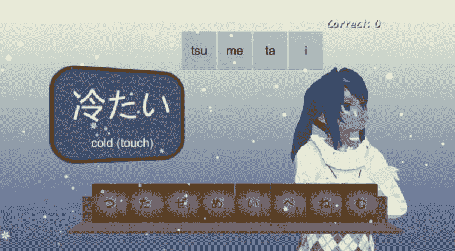

图 16.1：Mojikara: Japanese Trainer（由 Lisa Walkosz-Migliacio，Intropy Games 提供）

另一个旋转 UI 的例子可以在游戏*Cloudbase Prime*中找到，如下面的截图所示。它也使用了世界空间渲染来创建悬停在对象和角色上的指示器。

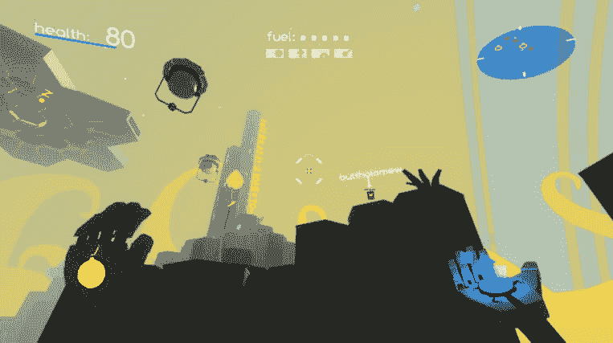

图 16.2：Cloudbase Prime（由 Tyrus Peace，Floating Island Games 提供）

在*Cloudbase Prime*中的所有 UI 都是在世界空间画布上完成的。这使得开发者能够创建酷炫的弯曲 UI，如下所示：

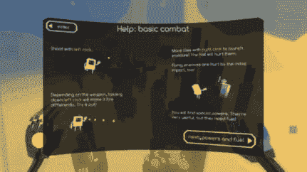

图 16.3：Cloudbase Prime（由 Tyrus Peace，Floating Island Games 提供）

在这里，您可以看到编辑器中的 UI 与玩家看到的 UI 之间的区别。这提供了一个很好的视角，了解 UI 是如何构建的：

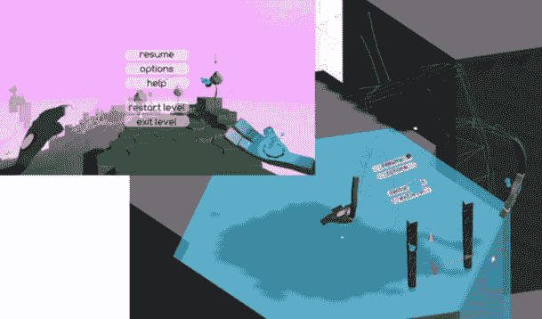

图 16.4： Cloudbase Prime（由 Tyrus Peace，Floating Island Games 提供）

我建议您查看以下网站，以了解*Cloudbase Prime*如何实现世界空间 UI 的更多方式，因为它们确实很美：[`imgur.com/a/hxNgL`](https://imgur.com/a/hxNgL)。

世界空间 UI 的另一种常见用法是在场景中模拟计算机屏幕和显示器。例如，我为朋友名为*Cloud Rise*的 VR 游戏构建了以下 UI。显示器是通过将世界空间画布直接放置在游戏屏幕上方来模拟的。然后我能够轻松地锚定和动画化 UI；同样，我在屏幕空间中渲染了 UI。

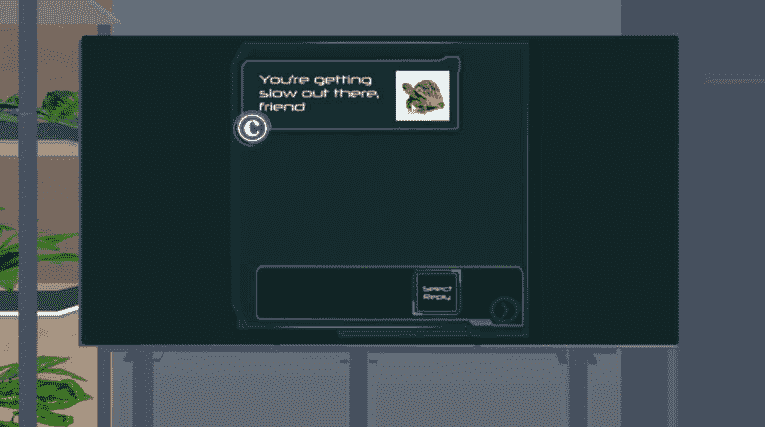

图 16.5： Cloud Rise（由 Meredith Wilson，Bedhouse Games 提供）

通常，VR 游戏的交互式 UI 位于世界空间画布上，因为玩家不能与*屏幕*进行交互。VR UI 的常见用法是扁平的浮动面板或包裹面板。

悬停指示器到目前为止是世界空间 UI 最常见的使用；它们专门用于游戏角色头顶上的生命条，如下面的*Iris Burning*截图所示：

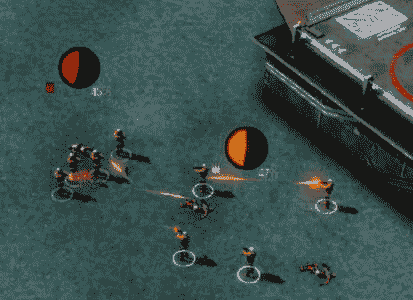

图 16.6： Iris Burning（由 William Preston，DCM Studios 提供）

当人们想到世界空间 UI 时，通常会想到 3D 游戏，因为他们认为 UI 看起来*很远*，但它在 2D 游戏中也很常见！管理和 RTS 游戏经常使用 UI 来创建按钮和进度条，以及其他 UI 元素与它们交互的对象保持位置。世界空间 UI 可以位于一个包含屏幕上所有项目的画布上，单个 UI 项目与它们所代表的项目的 2D 世界空间坐标相匹配，或者它们可以位于各自项目的单个画布上。我们将在本章末尾的示例中介绍如何使用世界空间 UI 创建 2D 游戏。

现在，让我们探索如何使用世界空间 UI。

# 在画布中适当地缩放文本

每次创建画布时，它都会以**屏幕空间 - 叠加**作为其**渲染模式**进行初始化。因此，当您将**渲染模式**属性更改为**世界空间**时，画布在场景中会变得很大。

当您将画布在场景中缩放到适当的大小时，文本可能会非常模糊或根本不可见。假设我们在**屏幕空间 - 叠加**中创建了以下画布，但决定将其放置在**世界空间**中：

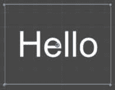

图 16.7：屏幕空间中的画布 - 叠加

将其转换为`4`和`3`（因为它最初是以 4:3 的屏幕宽高比创建的），文本将消失！

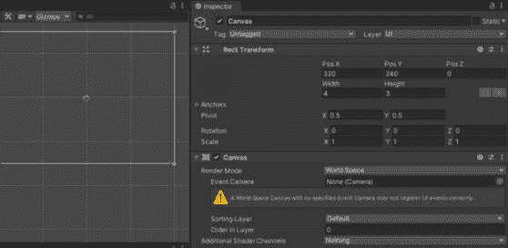

图 16.8：屏幕空间中的画布 - 叠加

如果我将**文本**设置为允许**水平溢出**和**垂直溢出**，您会看到它与画布相比非常大。在下面的屏幕截图中的中间的小矩形是画布：

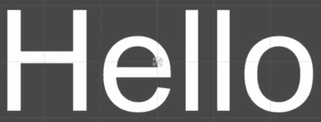

图 16.9：带有大量溢出文本的世界空间画布示例

为了解决这个问题，并使其看起来像我们想要的样子，我们需要调整`1`。

通常，为了确定新的`905`，将其除以新的`4`，然后在框中输入这个除法`905/4`将执行计算。）

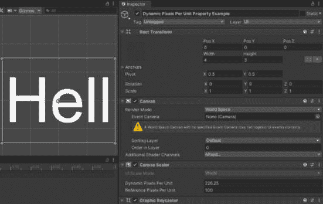

图 16.10：动态每单位像素属性调整

然而，那个计算并没有得到我想要的精确外观。因此，我增加了大小，直到它看起来正确：

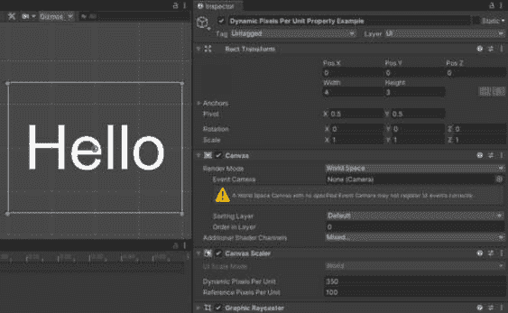

图 16.11：第十六章场景中动态每单位像素属性示例

每次您更改画布的**宽度**和**高度**时，您都必须调整**动态每单位像素**属性。减小画布的大小意味着增加**动态每单位像素**属性，而增加画布的大小意味着减小**动态每单位**的**像素**属性。

这里有两个画布，它们的大小都是前一个图中的四分之一。在上面的画布中，我改变了`1`和`.75`。在下面的画布中，我改变了`0.25`：

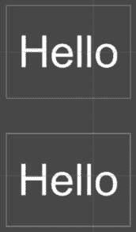

图 16.12：宽度和高度更改示例

在第一个例子中，因为我已经为我改变了`350*4`在`1400`（我喜欢 Unity 在框中进行计算）。

然而，在第二个画布中，我并不需要改变**动态每单位像素**的大小，因为以这种方式使用**缩放**属性进行缩放不需要我改变它。

从这个例子中我们可以看出，如果您的文本没有显示或看起来非常模糊，请调整**动态每单位像素**属性，直到它看起来应该是的样子，或者通过调整其**缩放**而不是**宽度**和**高度**来缩放您的画布。

使用世界空间 UI 时，文本缩放将是最重要的考虑因素，但让我们回顾一些其他重要主题。

# 在世界空间中工作时需要考虑的其他因素

在很大程度上，在世界空间中处理 UI 与在屏幕或相机空间中处理 UI 没有太大区别。尽管如此，您仍需注意一些事项。

当处理 3D 场景时，您可能希望 UI 始终面向玩家，无论玩家如何转动摄像头——这被称为**广告牌效果**。您可以通过在`Update()`函数中对对象的变换执行简单的`LookAt()`函数来实现这一点：

```cs
transform.LookAt(2*transform.position-theCamera.transform.position );
```

您可以使用前面代码的变体，具体取决于您希望旋转如何表现。

在 3D 世界空间 UI 中，另一个需要考虑的是它与相机的距离。你可能希望 UI 仅在它距离相机特定距离时渲染，因为当它太远时可能难以看到。

根据你的项目，使用世界空间 Canvas 可能会导致与 Raycasting 的困难，使得与 UI 交互成为问题。Floating Island Games 的 Tyrus Peace 建议，如果你最终需要创建自己的 Raycasting 系统，就像他在本章前面展示的*Cloudbase Prime*一样，创建自己的物理层。

# 示例

与世界空间 Canvas 一起工作与在屏幕和相机空间中与 Canvas 一起工作没有显著区别。世界空间 Canvas 提供了许多好处。如果你有一个存在于场景中的对象，并且 UI 专门与其位置相关联，使用世界空间 Canvas 非常有帮助，这样 UI 就可以跟随它无论它在哪里。这消除了尝试将对象的 World Space 坐标转换为 Screen 坐标以确保 UI 始终与对象对齐的需要。它还保证了 UI 对象将始终根据对象的位置正确显示，即使屏幕的分辨率发生变化。在本章中，我将介绍世界空间 Canvas 的两个常见用途：一个在 2D 空间中，另一个在 3D 空间中。让我们从 2D 空间开始。

## 2D 世界空间状态指示器

对于这个示例，我们将开始一个新的场景。为了让你不必构建场景，我们将从一个包含所有必需项目的资产包开始。

我们将创建一个 UI，允许角色在其头顶上方弹出状态指示器。场景播放 3 秒后，将在角色头顶上方出现状态指示按钮。一旦玩家点击状态指示器，将出现一个对话框。5 秒后，对话框将消失。状态指示器将在 10 秒后再次出现。

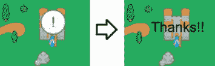

图 16.13：2D 世界空间 UI 示例

本示例中使用的艺术作品来自[`opengameart.org/content/medieval-rts-120`](https://opengameart.org/content/medieval-rts-120)。

要创建前一个示例中展示的状态指示 UI，请完成以下步骤：

1.  导入“第十六章”的`- Example 1-Start.unitypackage`包。此包包含一个带有背景图像和名为`Mage`的 2D 精灵的场景。包中包含的`Assets/Scripts/MageInteractions.cs`脚本控制状态指示器出现的计时器。此脚本需要两个 Canvas Group 项目——`theExclamationPoint`和`theDialogBox`——并包含一个名为`ShowTheDialogBox()`的函数，该函数可以通过按钮的`On` `Click()`事件调用。

1.  我们希望状态指示器和对话框与场景中“法师”的位置相关联。因此，我们将在“法师”的层级中创建一个 Canvas，并将其作为“法师”的子 Canvas 添加 UI Canvas。

1.  选择新创建的`Canvas`。将**Canvas**组件上的**渲染模式**更改为**世界空间**。

1.  将`Main Camera`分配到**事件** **相机**槽位。

1.  由于这个`Canvas`是`Mage`的子对象，其坐标系相对于`Mage`。为了使其完美地位于`Mage`上方，将`0`更改为。

1.  `Canvas`比`Mage`大得多。通过将`1`更改为更合理的尺寸。

1.  现在我们已经将`Canvas`缩放并定位在`Mage`周围的场景中，我们可以在其上添加 UI 元素。在层次结构中右键单击`Canvas`，创建一个 UI 按钮。将新按钮命名为`Alert`。

1.  通过设置其**Rect Transform**组件的拉伸和锚点来调整`Alert`的大小，使其与`Canvas`匹配。

1.  更改`Alert`按钮的`Knob`图像。它作为一个圆形比默认按钮精灵看起来更好：

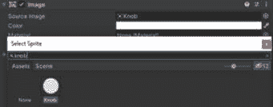

图 16.14：选择 UI 旋钮图像

1.  将`Alert`的`Text`子对象更改为显示感叹号而不是`Button`。

1.  按钮的文本目前不可见。为了修复这个问题，将`1000`更改为。

1.  将`Alert`按钮移动到位于 Mage 头部的位置。

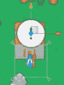

图 16.15：将感叹号移动到 Mage 的头上

1.  添加一个`Alert`按钮。

1.  将`0`设置为`False`，并将两个都设置为`False`。

1.  给`Mage`上附加的`MageInteractions`脚本中的`Alert`按钮一个`ShowTheDialogBox()`函数：

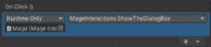

图 16.16：Alert 按钮的 OnClick()事件

1.  在层次结构中右键单击`Canvas`，创建一个 UI 文本对象。将新文本对象命名为`Dialog`。

1.  通过设置其`Canvas`来调整`Dialog`对象的大小，使其与`Canvas`匹配。

1.  将`Dialog`对象更改为显示`Thanks!!!`。同时，将文本居中对齐，并将**水平溢出**属性设置为**溢出**。

1.  将`Dialog`对象移动到位于 Mage 头部上方，如下所示：

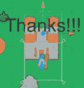

图 16.17：对话框

1.  添加一个`Dialog`文本对象。

1.  将`0`设置为`False`，并将两个都设置为`False`。

1.  选择`Mage`并将`Alert`添加到**对话框** **框**属性中的`Dialog`。

如果你玩游戏，你会看到 3 秒后出现感叹号按钮。点击按钮会使文本出现。尝试在场景中移动 Mage 角色。你会发现无论他在哪里，感叹号按钮和文本都会出现在他的头上。这是一个非常有用的技术，用于创建始终跟随移动角色的 UI 元素。

我知道现在的例子有点无聊，但我建议使用前两章中讨论的一些技术，为感叹号添加一个漂亮的弹跳动画，并使文本淡入淡出。

## 3D 悬停生命条

在 3D 场景中创建世界空间 UI 比在 2D 场景中创建世界空间 UI 需要更多的工作，如果相机可以在整个 3D 空间中旋转和移动。如果相机可以移动和旋转，UI 可能需要不断 *面向* 相机。否则，玩家将无法看到 UI 元素。

对于这个例子，我们将再次创建一个新的场景。为了您不必从头开始构建场景，我们将从一个包含所有必需项目的资产包开始。

我们将创建一个简单的悬停生命条，它始终面向相机。它还将接收点击，以便我们可以观察生命条减少：

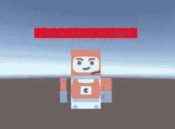

图 16.18：带有悬停生命条的宇航员

本例中使用的艺术作品来自 [`opengameart.org/content/space-kit`](https://opengameart.org/content/space-kit)。

要创建一个始终面向相机并接收玩家点击输入的生命条，请完成以下步骤：

1.  导入 `第十六章` `– 示例 2 - Start.unitypackage` 包。此包包含一个场景，其中有一个面向相机的 3D 角色。相机附有一个简单的 `RotatingCamera` 脚本，该脚本使用鼠标围绕宇航员旋转相机。该包还包含一个附加到 `astronaut` 角色的 `ReduceHealth` 脚本。此脚本有一个 `ReduceHealthBar` 函数，当点击角色头部的生命条时，我们将调用此函数。

1.  我们希望生命条与场景中宇航员的位置相关联。因此，我们将创建一个作为世界空间中宇航员子项的 `Canvas`。

    在层次结构中右键单击 `astronaut` 并添加一个 UI Canvas 作为 `astronaut` 的子项。

1.  选择新创建的 `Canvas` 并将 **Canvas** 组件上的 **渲染模式** 改为 **世界空间**。

1.  将 `Camera` 分配到 **事件** **相机** 插槽。

1.  由于这个 `Canvas` 是 `astronaut` 的子项，其坐标系相对于 `astronaut`。为了使其完美地位于 `astronaut` 上方，请更改 `0`。

1.  `Canvas` 的尺寸比 `astronaut` 大得多。通过更改 `10` 和 `1` 使其尺寸更合理。

1.  将 `Canvas` 定位在宇航员头部上方：

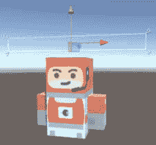

图 16.19：在宇航员上缩放 Canvas

1.  现在我们已经将 `Canvas` 缩放并定位在宇航员周围的场景中，我们可以在其上添加 UI 元素。在层次结构中右键单击 `Canvas` 并创建一个 UI 按钮。将新按钮命名为 `Health Bar`。

1.  通过设置其 `Canvas` 使 `Health Bar` 的大小与 `Canvas` 匹配。

1.  将 `Health Bar` 改为 **None** 以使其显示为白色矩形图像。

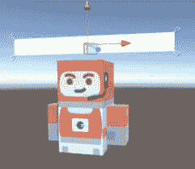

图 16.20：向按钮添加空白图像

1.  将 `Health Bar` 的 `Text` 子项更改为显示 `点击以减少` `我的生命`。

1.  将 `Text` 子项设置为 **溢出**。这将允许你在场景中看到文本当前渲染的大小：


图 16.21：健康条的放大文本

1.  在 **Text** 组件上设置 `10` 并取消选择 **射线投射目标**。

1.  选择 `Canvas` 并将鼠标悬停在 **Canvas Scaler** 组件中的 **动态每单位像素** 属性上，直到你看到鼠标光标周围出现两个箭头。一旦看到这些箭头，点击并拖动到右侧。这使得属性像滑块一样工作，允许你看到增加 **动态每单位像素** 属性如何连续改变场景中文本的渲染方式。这样做，直到文本适合画布：

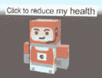

图 16.22：健康条的放大文本

注意

当尝试在 3D 空间中使文本看起来很漂亮时，如果只更改 **动态每单位像素大小** 导致文本出现 *锯齿状*，则更改属性，直到文本在场景中看起来非常清晰。然后，通过改变文本对象的 **Rect Transform** 组件的 **缩放** 和 **字体大小** 来找到 *最佳点*。

1.  右键单击 `Health Bar` 按钮并添加一个 UI Image 作为子项。将新图像命名为 `Health Fill`。

1.  将 `Health Fill` 调整到与画布 `Health Bar` 相匹配的大小，通过设置其 `Health Bar`。

1.  现在，将锚点和枢轴更改为 **左扩展**，使其将向 **左侧** 缩放。

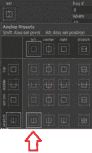

图 16.23：左扩展锚点

1.  在层次结构中重新定位 `Health Bar`，使其位于 `Text` 上方。这将使填充渲染在 `Text` 对象的后面。

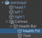

图 16.24：GameObject 的层次结构

1.  在 `Health Fill` 上，将 **颜色** 属性更改为红色，并取消选择 **射线投射** **目标** 属性。

1.  选择宇航员并将 `Health Fill` 对象分配给 `ReduceHealth` 组件。

1.  添加一个 `Health Bar` 按钮，该按钮在宇航员上调用 `ReduceHealth` 脚本的 `ReduceHealthBar` 函数：

    图 16.25：健康条的 OnClick()事件

    现在玩游戏应该会导致点击 `Health` `Bar` 按钮时 `Health Fill` 减少其填充值：

    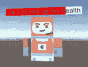

    图 16.26：健康条按钮减少

1.  现在，我们只需要向 `Canvas` 添加一个横幅效果。在 `Assets/Scripts` 文件夹中创建一个新的脚本，命名为 `BillboardPlane`。

1.  将 `BillboardPlane` 类的脚本更改为以下内容：

    ```cs
    public Camera theCamera;
    void Update()
    {
        transform.LookAt(2 * transform.position - theCamera.transform.position);
    }
    ```

1.  将 `BillboardPlane` 脚本附加到画布上。

1.  将 `Camera` 分配给 `BillboardPlane` 组件。

如果您现在玩游戏，您会看到当您移动相机时，生命条总是面向`Camera`。尝试更改`LookAt()`函数以产生更剧烈的效果。

# 摘要

**世界空间** UI 在实现上与在相机或屏幕空间中渲染的 UI 没有显著区别。将 UI 添加到世界空间中，您将能够创建酷炫的效果，并让您对 UI 相对于场景中对象的定位有更多控制。

在下一章中，我们将讨论如何优化 Unity UI。
