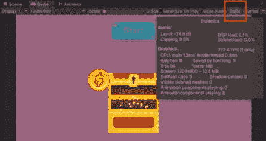
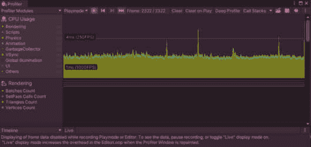
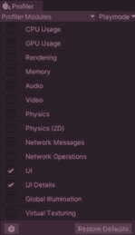
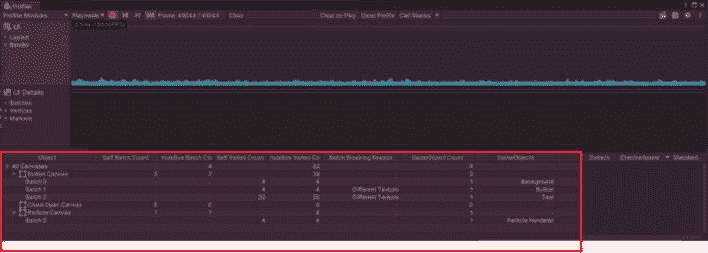
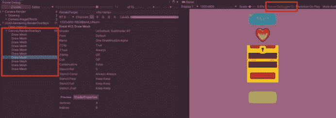
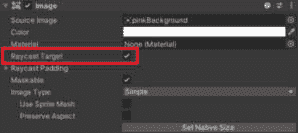
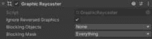

# 优化 Unity UI

**优化**是我们用来确保游戏运行顺畅且帧率一致的过程。通过优化，我们首先定位到游戏中降低游戏性能的资源，然后实施解决方案以提升性能。

有很多因素可能导致游戏性能不佳或帧率低。这包括诸如未优化的光照、编写不良的脚本、大型资源和不当的 UI 构建等问题。由于这是一本关于 UI 的书，我们将仅关注如何通过改进 UI 构建来提升性能。

在本章中，我将讨论以下内容：

+   与优化相关的关键术语和基本信息

+   Unity 内提供的工具概述，这些工具可以帮助你确定你的游戏性能如何

+   UI 的各种优化策略

在你能够优化 UI 之前，你需要学习如何判断它是否具有性能。让我们回顾一下图形渲染的基本术语和原则。

注意

本章将仅涵盖基本层面的性能分析，其重点将更多地放在你可以做的事情来构建更好的 UI 上。如果你在章节结束时想了解更多关于性能分析的信息，我建议以下资源：[`unity.com/how-to/best-practices-for-profiling-game-performance#gpu-bound`](https://unity.com/how-to/best-practices-for-profiling-game-performance#gpu-bound)

# 优化基础

如我之前所述，优化是我们用来确保应用程序运行顺畅、帧率一致的过程。我们希望优化我们的游戏，确保所有玩家无论在何种条件下玩游戏都能有相同的体验。例如，如果我们正在制作 PC 游戏，我们希望确保每个玩家无论其机器的功率如何，都能有相同的体验。我们还希望确保如果一个玩家在屏幕上渲染了很多东西，游戏与屏幕上渲染较少东西时的延迟相比不会变慢。

我们不希望帧率降低，也不希望输入延迟。这对像游戏这样的应用来说非常重要。在第一人称射击游戏或平台游戏中，输入延迟可能导致玩家输掉比赛或从悬崖上掉下来。

让我们回顾一下在讨论优化时经常听到的基本术语。首先，我们将从确定应用程序性能的常用指标开始。

## 帧率

**帧率**是我们衡量应用程序优化的一项指标。这是一个很好的指标，因为它不仅仅是用户在后台无法察觉的事情。用户可以看到并注意到帧率的变化，因此测量其性能可以衡量我们的用户是如何体验我们的游戏的。

帧率可以用每秒帧数（**fps**）或毫秒时间来衡量。目标是无论游戏中的情况如何，都要保持一致的帧率。

当以每秒帧数来测量帧率时，每个单独的帧都会在特定的时间内渲染出来。假设你的目标是 60 fps。你需要确保应用程序的各个方面都能以 60 fps 运行。因此，你的目标是每秒保持一致的帧数。因此，当我们设置 fps 基准时，这意味着我们希望应用程序在整个应用程序的所有部分都能以该 fps 持续运行。我们不希望我们的游戏在开始时以 60 fps 运行，然后在 UI 打开时下降。

测量帧率的另一种方式是毫秒时间。每个帧都需要一定的时间来渲染。我们希望每个帧的渲染时间尽可能低。每帧 10 毫秒相当于 60 fps，这是一个很好的毫秒时间。

既然我们已经讨论了帧率是什么，那么让我们来谈谈资源在我们的计算机上是如何被使用的。

## GPU 和 CPU

在尝试优化你的游戏时，你将调查游戏资源以确定资源使用最多的地方。你将想要确定问题是在 GPU 还是 CPU 上。**中央处理单元**（**CPU**）是计算机的大脑。**图形处理单元**（**GPU**）是渲染图像的部分。我们的资源是在 GPU 还是 CPU 上，这将决定优化解决方案。

CPU 上的问题示例包括指令过多，意味着运行了太多的脚本或者脚本运行时间过长。GPU 的问题通常意味着渲染了太多的东西。然而，CPU 在渲染中仍然扮演着一定的角色，因为 CPU 给出指令并告诉 GPU 要渲染什么。通常在讨论 GPU 和 CPU 时，你会听到**draw calls**这个术语。draw call 是指 CPU 告诉 GPU 需要在屏幕上绘制（或显示）某物。一般来说，你希望减少游戏产生的 draw call 数量。

我们将在本章的后续部分更深入地讨论 GPU 和 CPU，以及我们在设计 UI 时所做的各种选择如何受到 GPU 和 CPU 的影响。

现在我们已经介绍了一些优化基本概念，让我们回顾一下 Unity 提供的有助于优化的工具。

# 性能测定工具

在确定游戏性能时，你可以使用所谓的基准测试。**基准测试**允许你在给定条件下查看应用程序在不同时间运行得如何。在基准测试中，你收集性能指标并建立基准，或基准指标。然后，你将后续结果与该基准进行比较，以查看指标是否有所改善或恶化。这让你知道你所做的更改是否影响了游戏性能。

Unity 提供了一些工具，可以帮助您通过提供性能指标来评估游戏性能。现在让我们看看这些工具。

注意

注意环境以及您正在基准测试的内容。建议您在目标平台上进行基准测试。这样，您可以确定您计划在哪个最低标准设备上运行游戏。随着设备的升级，您游戏的性能将得到提升。

## 统计窗口

查看您游戏性能的一个简单方法是通过**游戏**视图中的**统计**窗口（或**Stats**窗口）。

图 17.1：分析统计窗口

如果您在**游戏**视图的右上角选择**Stats**按钮，您将看到有关项目的一些信息。在**图形**部分，您将看到每秒帧数和以毫秒为单位的时间。这将根据每一帧持续变化。您还可以看到关于 CPU 主线程和渲染线程的信息。

如果您以帧率作为基准，您可以在此处查看帧率值，并查看它们随时间的变化。记住，目标是保持一致性。

注意

您可以在此处了解更多关于统计窗口的信息：[`learn.unity.com/tutorial/working-with-the-stats-window-2019-3?uv=2019.4#`](https://learn.unity.com/tutorial/working-with-the-stats-window-2019-3?uv=2019.4#)

**统计**窗口提供了关于您游戏性能的一些直观的基本信息。然而，如果您想深入了解游戏运行情况，可以使用 Unity Profiler。

## Unity Profiler

Profiler 显示了您游戏性能的详细信息。要查看 Profiler，请选择**窗口** | **分析** | **Profiler**。当您玩游戏时，您可以看到哪些项目导致了性能问题。

图 17.2：查看 Unity Profiler

在**Profiler**中，您可以选择仅 UI 模块，以缩小每个 UI 元素对性能的影响。

图 17.3：仅启用 UI Profiler 模块

完成这些操作后，您可以看到每个 Canvas 的信息。

图 17.4：在 Profiler 中观察 UI 对象

注意

您可以在此处了解更多关于 Unity Profiler 及其使用方法：[`docs.unity3d.com/Manual/Profiler.xhtml`](https://docs.unity3d.com/Manual/Profiler.xhtml)

如果您对游戏中物品的批处理方式感兴趣，可以使用 Unity Frame Debugger。

## Unity Frame Debugger

Frame Debugger 可以帮助您解决 UI 的批处理问题。您可以通过**窗口** | **分析** | **Frame Debugger**访问 Frame Debugger。

图 17.5：审查帧调试器

启用帧调试器将允许您查看各种渲染事件。点击它们将在游戏窗口中前进，为您提供事件的预览。这将显示哪些项目被组合到批次中。

注意

您可以在此处了解更多关于帧调试器的信息：[`docs.unity3d.com/Manual/frame-debugger-window.xhtml`](https://docs.unity3d.com/Manual/frame-debugger-window.xhtml)

现在我们已经讨论了优化的基础知识，我们可以开始讨论优化 UI 的方法。

# 基本的 Unity UI 优化策略

记住，每个画布都有自己的画布渲染器组件。画布将所有元素组合成一起渲染的批次。如果一个画布的几何形状需要重建，则该画布被认为是**脏的**。优化 UI 的主要目标之一是减少画布或其元素被认为是脏的次数，以减少画布需要重新批次的次数。考虑到这一点，让我们看看一些优化 Unity UI 的技术。

## 使用多个画布和画布层次结构

每当画布上的一个元素被修改时，画布被认为是脏的，并且会向 GPU 发送一个绘制调用。如果画布上有多个项目，所有画布上的项目都需要重新分析，以确定它们应该如何最好地绘制。因此，修改画布上的一个元素需要 CPU 重建画布上的每个元素，这可能会导致 CPU 使用量突然增加。因此，你应该将 UI 放在多个画布上。

在确定如何分组您的画布时，考虑画布上的项目需要更改的频率。将所有静态 UI 元素分组到与动态项目分开的单独画布上是一种良好的做法。这将阻止静态元素在动态元素更改时需要重新绘制。此外，根据它们将何时更新，将动态元素拆分到画布中，尽量将同时更新的元素放在一起。

在尝试减少画布上的绘制调用时，还需要考虑元素的 z 坐标、纹理和材质。根据这些属性对 UI 元素进行分组也可以减少与 UI 相关的 CPU 使用量。

## 最小化使用布局组

`GetComponent`用于每个具有布局组的父对象。这使得嵌套布局组非常低效。

为了避免这种情况，您可以直接不使用布局组。相反，您可以使用锚点并编写自己的布局代码来动态放置项目。

完全避免它们并不一定是每个人的最佳解决方案，因此，如果你选择使用它们，尽量避免嵌套布局组或具有大量子项的布局组。你也可以选择只为动态元素使用布局组，并避免使用静态元素。你还可以在动态 UI 正确定位后立即禁用它们。

## 适当地隐藏对象

如果你想在画布上隐藏元素，如果可能的话，最好禁用整个画布组件。记住，画布组件是渲染 UI 的部分，因此禁用画布组件会导致它停止渲染。建议你禁用画布组件，而不是简单地改变画布的可见性，因为即使画布不可见，它也会继续进行绘制调用。禁用组件不会导致画布重建。这比启用和禁用画布 GameObject 更节省资源，因为这将触发`OnEnable`和`OnDisable`方法。

如果你想要隐藏游戏中带有 UI 的所有内容，例如你有一个完全覆盖屏幕的暂停菜单，你应该停止相机渲染游戏中的任何内容，除了 UI。例如，如果你有一个完全覆盖屏幕的菜单，即使你看不到菜单后面的项目，它们仍然被渲染。

## 适当地安排对象池的启用和禁用

**对象池**是一种优化技术，用于减少可重复使用对象创建（或实例化）的次数。在对象池中，你会在游戏开始时将一组禁用对象放置在池中，然后，而不是在游戏进行时实例化这些对象，你从池中取出它们。

对象池是提高游戏性能的绝佳方式，因为它通过创建可以重复使用的对象集合来减少对象必须创建的次数。

注意

有关对象池概念的更多信息，请访问以下网站：[`learn.unity.com/tutorial/introduction-to-object-pooling`](https://learn.unity.com/tutorial/introduction-to-object-pooling)

由于重新父化 UI 对象会导致画布被标记为脏，因此在使用对象池时，你需要仔细安排禁用、启用和重新父化的时间。由于 Canvas 内部元素的动态更改会导致 Canvas 向 GPU 发送绘制调用，因此在禁用它们之前或之后不适当地父化项目，可能会不必要地加倍你的绘制调用。目标是确保池中的对象不会向 GPU 发送任何绘制调用。因此，池中的对象应该始终以禁用状态附加到池中。

如果你将对象放入对象池中，请先禁用它，然后将其重新父级到池中。通过确保在放入池之前将其禁用，你可以消除池需要重建的需求。相反，如果你想从池中移除对象，请先重新父级，然后启用它。这同样可以消除池发送绘制调用的需求。

## 减少射线路径计算

每个 UI Image 组件都有 **射线路径目标** 属性。默认情况下，这是选中的。如果你不希望你的 UI 元素阻止射线路径，请禁用它以减少射线路径检查。

图 17.6：射线路径目标属性

此外，如果你的 UI 完全不可交互，你可以移除 Graphic Raycaster 组件，以消除它引起的非必要计算。

图 17.7：图形射线路径组件

使用本章中介绍的基本 Unity UI 优化策略，将使你能够创建不会反向影响游戏性能的 UI。

# 摘要

在本章中，我们讨论了优化 Unity UI 的基础知识。我们回顾了 Unity 优化的一些基本概念，查看允许我们评估游戏性能的工具，然后讨论了创建高性能 UI 的策略。

注意

本章仅关注如何通过 UI 提高游戏性能。但请记住，你的游戏有多个方面可能导致性能问题。为了获得关于提高游戏所有方面性能的良好资源，我建议查看 Unity 提供的免费电子书：[`resources.unity.com/games/performance-optimization-e-book-console-pc`](https://resources.unity.com/games/performance-optimization-e-book-console-pc)

在下一章中，我们将讨论由 Unity 创建的新 UI 系统，称为新的 Unity UI 工具包。它不仅可以在运行时创建 UI，还可以在编辑器中创建。因此，它可以用来帮助你创建工具以改进你的工作流程。

# 进一步阅读

关于优化 UI 的更多信息，我推荐以下资源：

+   [`learn.unity.com/tutorial/optimizing-unity-ui#`](https://learn.unity.com/tutorial/optimizing-unity-ui#)

+   [`unity.com/how-to/unity-ui-optimization-tips`](https://unity.com/how-to/unity-ui-optimization-tips)

+   [`www.youtube.com/watch?v=FPotgj_NHK4`](https://www.youtube.com/watch?v=FPotgj_NHK4)
