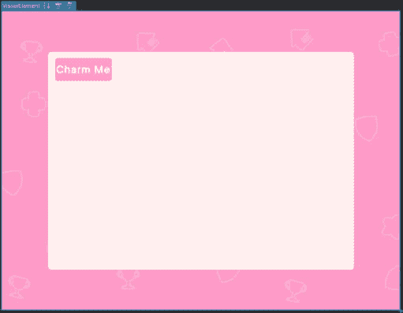

# 18

# 使用 UI 工具包入门

到目前为止，本书的重点一直是 **Unity UI** （**uGUI**）。然而，Unity 一直在开发另一个系统，你可以用它为你的游戏开发 UI：**UI 工具包**。它基于网页设计的原理，旨在允许你以比 uGUI 更灵活和可扩展的方式创建 UI。它是通过将 UI 的设计和开发从场景和 GameObject 中分离出来，并通过代码和样式表创建 UI 来实现这一点的——就像在网页设计中一样。

UI 工具包是一个完全不同的系统，因此如果你习惯于使用 uGUI 开发 UI，那么一开始使用它可能会感到有些不适应。然而，如果你有 `.xhtml` 和 `.css` 的经验，或者使用 `XML` 开发 Android 或 iOS 接口，那么这些都应该非常熟悉。

由于 UI 工具包是一个完全不同的系统，它使用与本书其他章节完全不同的原则，要完全解释你可以用它做什么，可能需要一本完全致力于它的教科书。因此，本章将提供你开始使用该系统所需的基本信息，但不会全面讨论其各个方面。如果想要进一步学习 UI 工具包，我将在本章中提供额外的资源供你回顾。

在本章中，我将讨论以下内容：

+   UI 工具包概述以及如何安装它（如果它尚未包含在你的 Unity 版本中）

+   UI 工具包的各个部分如何协同工作以创建和样式化界面

+   视觉元素是什么？UI 工具包层次结构是如何工作的？

+   如何使用 UI 构建器设计和布局 UI 工具包界面

+   如何在 C# 中访问 UI 工具包构建的 UI

+   创建一个与你一起在 Unity 编辑器中玩耍的虚拟宠物，并鼓励你

+   使用 UI 构建器创建样式表和动画过渡

+   使用网络请求随机生成你的 UI 的图像和文本

注意

本章假设你具有 HTML 和 CSS 的基本知识。然而，拥有更广泛的 HTML 和 CSS 经验将使采用 UI 工具包系统变得更加容易。

在我们深入了解 UI 工具包的内部工作原理之前，让我们回顾一下它的用例以及你将在何时使用它。

# 技术要求

你可以在此处找到本章的相关代码和资产文件：[`github.com/PacktPublishing/Mastering-UI-Development-with-Unity-2nd-Edition/tree/main/Chapter%2018`](https://github.com/PacktPublishing/Mastering-UI-Development-with-Unity-2nd-Edition/tree/main/Chapter%2018)

# UI 工具包概述

如你所回忆的，从 *第五章* 中，Unity 中可以使用总共三个 UI 系统。到目前为止，这本书的重点一直是 Unity UI (uGUI)，它可以用来制作游戏中的 UI（即运行时 UI）。然而，如果你想制作可以在你的编辑器中查看的 UI，你必须使用不同的系统。可以用来创建编辑器 UI 的两个系统是 **IMGUI**，我们将在下一章中讨论，以及 UI Toolkit。然而，虽然 IMGUI 只能用来制作编辑器 UI，但 UI Toolkit 可以用来制作运行时和编辑器 UI。


图 18.1：比较三个 UI 系统

Unity 的目标是完全用新的 UI Toolkit 替换 uGUI 系统。然而，它仍在开发中，并不具备 uGUI 所有的功能。例如，UI Toolkit 无法创建位于 3D 世界中的 UI，就像我们在 *第十六章* 中讨论的那样。它只能创建覆盖在屏幕上的 UI。此外，它无法使用自定义材质和着色器，并且不容易从 MonoBehaviours 中引用。

那么，你何时会想使用 UI Toolkit 呢？如果你想要创建风格化的 UI 而不处理与预制件和预制件变体一起出现的冗余，UI Toolkit 非常有用。你可以通过代码更改 UI 的设计，而不是修改 GameObject 的检查器属性。这使得 UI 更容易在多个项目中共享，并且可以快速自定义。此外，如果你有网页开发经验，你可能对 UI Toolkit 的工作流程更舒适。

如果你在处理一个较旧的项目，你将需要这本书中讨论的信息，这些信息集中在 uGUI 上，因为它仍然是使用最广泛的 UI 系统。然而，如果你正在创建一个新项目，并希望考虑为你的项目使用 UI Toolkit，我建议你查看以下文档，以确保你的需求能够得到满足：[`docs.unity3d.com/Manual/UI-system-compare.xhtml`](https://docs.unity3d.com/Manual/UI-system-compare.xhtml)

既然我们已经讨论了何时可以使用 UI Toolkit，让我们开始在我们的项目中安装它。

# 安装 UI Toolkit 包

根据你使用的 Unity 版本，可能没有安装必要的 UI Toolkit 包。允许你开发编辑器 UI 的 UI Toolkit 版本包含在所有相对较新的 Unity 版本中；然而，允许你创建运行时 UI 的版本只包含最新的版本。

你可以通过转到 **窗口** | **UI Toolkit** 来确定你是否已经安装了所有必要的 UI Toolkit 包版本。如果 **UI Builder** 子菜单不存在或 UI Toolkit 菜单项完全缺失，你需要导入该包。


图 18.2：确定是否已安装 UI 工具包包

如果你需要安装 UI 工具包，你可以通过从 `git` URL 导入包来完成。为此，完成以下步骤：

1.  使用 **窗口** | **包管理器** 打开包管理器。

1.  选择 **+** 按钮，然后选择 **从 git URL 添加包…**。


图 18.3：通过 git URL 添加包

1.  在出现的文本框中输入 `com.unity.ui`。确保地址后不要添加空格。如果你添加了空格，你会收到一个错误消息。

    导入完成后，你应该能在你的包窗口中看到以下工具包。


图 18.4：UI 工具包

1.  如果你希望将示例导入到你的项目中，请选择 **导入** 按钮以下载它们。

1.  你可能会注意到 UI 工具包的描述中提到 UI Builder 不包含在这个包中。因此，你必须单独导入那个包。为此，选择 **+** 按钮，然后再次选择 **从 git URL 添加包…**。

1.  这次，在出现的文本框中输入 `com.unity.ui.builder`。

    导入完成后，你应该能看到以下包。


图 18.5：UI Builder 包

1.  与其他包一样，你可以使用 **导入** 按钮将示例导入到你的项目中。

现在我们已经安装了适当的包，让我们来看看 UI 工具包系统的各个部分。

# UI 工具包系统的部分

UI 工具包使用一组资产和 GameObject 组件来创建 UI。用于创建 UI 的主要资产如下：

+   UI 文档 (UXML)

+   样式表 (USS)

+   面板设置

+   主题样式表 (TSS)


图 18.6：制作 UI 工具包界面时使用的资产

`.uxml` 扩展名)。此文件使用 **Unity 可扩展标记语言** (**UXML**) 来定义 UI 的布局和结构。虽然 UXML 是一个 Unity 特定的标记语言，但它与 HTML 和 XML 等其他标记语言类似。你可以通过在资产文件夹中右键单击并选择 **创建** | **UI 工具包** | **UI 文档**，然后适当地命名文件来创建 UXML 文件。

`.uss` 扩展名)。此文件用于指定在 UXML 文件中可以引用的样式属性。当与 HTML 一起工作时，这与 CSS 文件非常相似。你可以通过在资产文件夹中右键单击并选择 **创建** | **UI 工具包** | **样式表**，然后适当地命名文件来创建 USS 文件。

`.asset` 扩展名)定义了 UI 将拥有的属性集合。


图 18.7：默认面板设置资源的属性

（.tss 扩展名）。它通过维护一个集合，确定哪些面板设置将与哪些 TSS 和 USS 文件一起使用，如下图所示。


图 18.8：TSS 文件检查器

当您创建面板设置资源时，将在同一文件夹中自动创建一个名为 `Unity Themes` 的文件夹。在其中，将为您创建一个名为 `UnityDefaultRuntimeTheme.tss` 的单个 TSS 文件。但是，您可以通过在资源文件夹中右键单击并选择 **创建** | **UI 工具包** | **TSS 主题文件** 来创建更多 TSS 文件。

UI 工具包系统的最后一部分是 **UI 文档** 组件，如下截图所示。


图 18.9：UI 文档组件

此组件添加到场景中的 GameObject，并允许使用 UI 工具包创建的 UI 进行渲染。它有三个属性：**面板设置**、**源资源** 和 **排序顺序**。

您可以将一个面板设置资源分配给 **面板设置** 属性，以表示由该组件渲染的 UI 将具有哪些设置。**源资源** 属性是您分配 UI 文档（UXML）文件的地方。**排序顺序** 属性确定由 UXML 文件定义的 UI 相对于场景中任何其他使用相同面板设置的 UXML 文件将渲染的顺序。您可以通过在 **检查器** 中使用 **添加组件** 并搜索 **UI 文档** 来将此组件添加到 GameObject。

现在我们已经知道了所有必需的资源和组件，让我们回顾一下如何使用 UI 构建器实际构建这些资源。

# 视觉元素和 UI 层级

与 uGUI 构建的 UI 由多个 GameObject 组成的方式相同，UI 工具包构建的 UI 由 **视觉元素** 组成。在 UI 工具包系统中，您有多种 UI 元素可供选择（按钮、标签、滑块等），但视觉元素是所有这些元素的基础类，因此它们都从它那里继承了许多属性。

正如 GameObject 在 Unity 编辑器层级中组织一样，UI 工具包通过称为 **UI 层级** 的东西来组织其视觉元素。例如，假设我想创建一个类似于 *图 18.10* 中显示的 UI。


图 18.10：简单示例 UI

如果使用 uGUI 构建，编辑器中的场景层级与使用 UI 构建器创建的 UI 层级非常相似，如图 *18.11* 所示。


图 18.11：uGUI 与 UI 工具包 UI 层级的场景层级

除了命名和嵌套的一些细微变化外，它们几乎相同。你可以将 UI 文档视为在 UI 层次结构中以`Chapter18.uxml`表示，它在 UI 层次结构中具有与场景层次结构中的画布类似的功能。

注意

UI 层次结构截图是从 UI 构建器工具中获取的，我们将在下一节中讨论。

当使用 uGUI 时，每个 GameObject 的对齐和位置基于它嵌套的父对象。这对于使用 UI 工具箱系统创建的视觉元素也是如此。因此，对项目嵌套有感觉对于使用 UI 工具箱系统开发 UI 很重要。

注意

你可以在提供的代码包中的 Unity 项目中找到为*图 18.10*和*图 18.11*开发的示例 UI。它们可以在标记为**Chapter18.asset**的场景中找到。在场景层次结构中，**Canvas**游戏对象包含 uGUI 版本，而**UIDocument**游戏对象包含 UI 工具箱版本。

现在我们已经回顾了 UI 工具箱系统的一些基本概念，让我们看看如何实际使用它来构建 UI。

# 使用 UI 构建器创建 UI

要使用 UI 工具箱创建 UI，你必须创建一个 UI 文档来描述你将渲染的视觉元素以及它们的布局和其他属性。在 UI 工具箱系统中创建 UI 文档有两种方式：

+   编写布局视觉元素的代码

+   在 UI 构建器中排列元素，并让它为你编写代码

你还可以结合两者，在通过代码或 UI 构建器编辑 UI 之间切换。

要访问 UI 构建器，请选择**窗口** | **UI 工具箱** | **UI 构建器**。


图 18.12：UI 构建器窗口

在这个窗口中，你可以从**库**（左下角）拖放各种视觉元素到**视口**（中央）。你还可以在这个视口中调整视觉元素的大小和位置。你可以通过**层次**（左中）更改父级，从而改变视觉元素的排列方式。此外，你还可以在**UXML 审查**面板中查看从布局生成的代码文件，以及在**USS 预览**面板中查看代表你样式的代码文件（两者都在底部中央）。本章末尾的*示例*部分提供了一个如何使用 UI 构建器构建 UI 的示例。

要使用你用 UI 构建器创建的 UI 布局，你必须将 UI 文档保存为`.uxml`文件。按下*Ctrl* + *S*将为你将文件保存到您选择的位置。我建议你将它们保存在`Assets`中的`UI Toolkit`文件夹内。

现在我们已经回顾了如何创建 UI 文档，让我们回顾一下如何将文档与你的游戏场景关联起来。

你可以通过在层次结构中双击任何视觉元素并输入新名称来重命名任何视觉元素。当使用 UI Builder 时，如果需要通过 C#代码引用它们，视觉元素的名称将作为变量。因此，如果你计划通过 C#代码访问它们，给视觉元素起一个独特的名称是很重要的（有关更多信息，请参阅*使用事件使 UI 可交互*部分）。

# 使用 UI 文档组件

如本章*UI Toolkit 系统部分*所述，UI 文档组件必须添加到场景中的 GameObject 中，以便渲染你创建的 UI。你可以通过将 UI 文档组件添加到现有的 GameObject 或选择**+** | **UI Toolkit** | **UI Document**来实现这一点。这个 GameObject 将有一个**Transform**组件和一个**UI** **Document**组件。


图 18.13：UIDocument GameObject 的检查器

如果你在你的项目“资产”文件夹中还没有名为`UI Toolkit`的文件夹，系统会自动为你创建一个。在这个文件夹中，你会找到一个名为`PanelSettings`的资产，以及一个名为`UnityThemes`的文件夹。在`UnityThemes`文件夹中，你会找到一个名为`UnityDefaultRuntimeTheme.tss`的 TSS 文件。你的`UIDocument` GameObject 的`PanelSettings`资产被分配到你在**源资产**属性中创建的`.umxl`文件中，以便查看你在场景中创建的 UI。

现在我们已经了解了构建和渲染 UI 的基础知识，让我们看看如何使用 UI Toolkit 编写的 UI 的交互代码。

# 使用 C#使 UI 可交互

UI Builder 和你的 UXML 文档只处理 UI 的视觉属性。虽然你可以通过使用样式表来分配一些基本响应（如悬停时改变视觉），但你将需要创建 C#脚本来处理与你的 UI 相关的任何逻辑或事件。

## UIElements 命名空间

要能够编写与 UI 文档交互的代码，你必须使用`UnityEngine.UIElements`命名空间。如果你使用 UI Toolkit 来制作编辑器 UI，你可能还需要`UnityEditor.UIElements`命名空间。

注意

有关**UnityEngine.UIElements**和**UnityEditor.UIElements**命名空间的信息，请参阅以下资源：[`docs.unity3d.com/Packages/com.unity.ui@1.0/api/UnityEditor.UIElements.xhtml`](https://docs.unity3d.com/Packages/com.unity.ui@1.0/api/UnityEditor.UIElements.xhtml)。

## 获取 UI 文档变量的引用

在你的 C#脚本中，你可以创建一个指向`UIDocument`类型的引用变量。你可以像通常分配其他类的变量一样分配这个变量：在`GetComponent`中分配它，从一个脚本中传递它的引用，等等。

注意

虽然你可以使用**FindObjectOfType**，但这不是推荐用于查找**UIDocument**引用的方法，因为你很可能在场景中有多个 UI 文档。

在获取到您想要与之工作的 `UIDocument` 引用后，您可以通过获取 UI 文档上的根视觉元素引用，然后通过其名称查询该元素的视觉元素类型，来获取其中的视觉元素引用（例如，按钮、标签等）。

例如，在章节中前面显示的 UI 中，我将 `Label` 重命名为 `DogLabel`，将 `Button` 重命名为 `CatButton`，如下所示：


图 18.14：标签和按钮的新名称

要在 C# 脚本中创建这些变量的引用，我首先创建了 `UIDocument`、`Label` 和 `Button` 的引用变量，如下所示：

```cs
[SerializeField] private UIDocument uiDocument;
private Label dogLabel;
private Button catButton;
```

`uiDocument` 变量将在检查器中分配。与所有 `MonoBehaviour` 脚本一样，此脚本需要附加到场景中的 GameObject 上。我将此脚本附加到 `UIDocument` GameObject 上，然后将 `UIDocument` GameObject 拖动到 **Ui** **文档**属性。


图 18.15：将 UIDocument 分配给脚本

重要的是要注意，当您在 C# 中引用 `UIDocument` 时，您引用的是 `UIDocument` 组件，而不是 UI 文档源文件。

为了初始化 `dogLabel` 和 `catButton`，我获取了 `uiDocument` 上的 `rootVisualElement` 引用，然后使用 `Query` 方法找到每个视觉元素。

```cs
void Start(){
      var root = uiDocument.rootVisualElement;
      dogLabel = root.Q<Label>("DogLabel");
      catButton = root.Query<Button>("CatButton");
}
```

注意我如何使用 `root.Q` 来查找 `Label`，以及使用 `root.Query` 来查找 `Button`。您可以使用任一方法，我这样做只是为了让您知道有两种不同的方法。您可以使用您喜欢的任何一种。

## 管理视觉元素事件

由于 UXML 文档不管理事件，您可以通过订阅事件或注册回调方法来在事件触发时找出在 UXML 文档中定义的 UI 是否被交互。

例如，如果我想在点击 `catButton` 时在控制台记录一条消息，我需要创建一个订阅 `catButton` 的 `clicked` 事件的函数。

首先，我在我的脚本中添加了以下方法：

```cs
private void OnCatButtonClicked() {
     Debug.Log("CatButtonClicked");
}
```

然后，我需要在 `Start()` 方法中订阅 `catButton` 的 `clicked` 事件，如下所示。

```cs
catButton.clicked += OnCatButtonClicked;
```

为了避免在 GameObject 禁用或销毁时事件订阅出现错误，我在 `OnDisable()` 方法中取消订阅事件。

```cs
private void OnDisable() {
     catButton.clicked -= OnCatButtonClicked;
}
```

这将导致每次点击按钮时，`OnCatButtonClicked` 消息都会在控制台中显示。

## 访问视觉元素属性

与 uGUI GameObject 可以通过 C# 代码更改其属性的方式类似，视觉元素也可以通过 C# 代码调整其属性。例如，将 `OnCatButtonClicked()` 方法更改为以下内容将使 `Text` 字段变为 `Meow!`

```cs
public Camera theCamera;
void Update()
{
    transform.LookAt(2 * transform.position - theCamera.transform.position);
}
```

上述代码导致 UI 如下显示：


图 18.16：通过按钮点击更改文本后的 UI

我还可以说很多关于使用 UI Toolkit 的事情，但正如我在本章开头所说的，我只能提供一个概述——否则，我不得不写一本完全关于 UI Toolkit 的书！然而，我相信我已经提供了足够的概念概述，以便你可以深入到下一节中的示例工作。

# 示例

现在我们已经拥有了开始使用 UI Toolkit 创建一些 UI 所需的基本构建块。我没有深入探讨样式表或各种视觉元素的性质，但我会在这里展示一些示例，以扩展这方面的内容。如果你完成这些示例后还想了解更多，请参阅 *资源* 部分，那里有一系列示例和文档。

当使用 UI Toolkit 开发 UI 时，工作主要有两个部分：

+   使用 UI Builder 布局 UI（或通过编辑 UXML 文档）

+   编写 C# 代码以添加 UI 功能

因此，每个示例都将分为两部分：一部分用于构建 UI，另一部分用于编写功能。

由于 UI Toolkit 可以用于编辑器和运行时 UI，我将展示两个示例。让我们从编辑器示例开始！

## 使用 UI Toolkit 制作编辑器虚拟宠物

尽管这本书的主要重点是运行时 UI，但我不能不向你展示如何使用 UI Toolkit 创建一些编辑器 UI，因为这是它的主要优势之一。编辑器 UI 通常用于工具，以促进开发、提高生产力、简化工作流程等。最初，我计划向你展示如何制作一些通用的编辑器工具，你可以扩展它们来改进你的工作流程。然而，我决定制作一个可以改善你心情的编辑器工具。毕竟，自我照顾对生产力至关重要！虽然这个例子在传统意义上可能没有实际用途，但它很有趣，展示了如何使用大量的编辑器 UI 功能，所以这是一个双赢的局面。

这个例子涵盖了如何制作一个虚拟宠物，它在你的编辑器窗口中与你一起闲逛，并在你点击它时向你表示赞赏。这也展示了如何在 Unity 编辑器中创建动画精灵图集。


图 18.17：本例中创建的编辑器虚拟宠物

在这个例子中使用的猫精灵是从这里提供的公共领域艺术资产中派生出来的：[`opengameart.org/content/a-cat`](https://opengameart.org/content/a-cat)。

注意

对于这个例子，由于我们正在制作一个与迄今为止我们所做的任何工作都不相关的编辑器工具，你可能需要创建一个新的 Unity 项目来完成这项工作。如果你这样做，你需要重新导入任何 2D UI 包。

让我们从使用 UI 构建器布局 UI 开始！

### 使用 UI 构建器制作我们的编辑器窗口的 UI

要创建如图 18**.17**所示的虚拟宠物，请完成以下步骤：

1.  当为您的编辑器编写代码时，您应该将所有编辑器代码放在一个名为`Editor`的文件夹中。这表示 Unity 中任何位于其中的代码仅用于编辑器，而不是在运行时使用。在`Assets`中创建一个名为`Editor`的文件夹，并在其中创建一个名为`Resource`的文件夹。

1.  将在书籍源文件中找到的`idleCat.png`精灵图集拖放到您新创建的`Assets/Editor/Resources`文件夹中。

1.  设置其**导入设置**，使其**纹理类型**为**精灵（2D 和 UI）**，**精灵模式**为**多个**。

1.  打开**精灵编辑器**，您会注意到图像非常模糊。我们需要进一步编辑导入设置来修复这个问题。


图 18.18：模糊的精灵图集

1.  返回精灵的`64`和**压缩**为**无**。同时，将**过滤器模式**更改为**点（无过滤器）**。

1.  选择**应用**，精灵现在应该是清晰的像素艺术猫。

1.  现在，返回到`16` x `16`。


图 18.19：切割的精灵图集

1.  选择**切片**按钮以确认更改，然后选择**应用**以提交更改。您现在可以关闭**精灵编辑器**。

1.  现在我们已经正确导入精灵，我们就可以在 UI 构建器中构建编辑器 UI 了。通过**窗口** | **UI 工具包** | **UI 构建器**打开 UI 构建器。

1.  在**层次结构**中选择`<未保存文件>.uxml`UI 文档，以在**检查器**中显示其属性。


图 18.20：UXML 文件的检查器

1.  现在将`100` x `100`。

1.  通过选择`Assets/Editor/Resources`文件夹并命名文件为`IdleCat.uxml`（`.uxml`扩展名将自动为您添加）来保存 UI 文档。

1.  现在，让我们将猫添加到**视口**中。因为我们希望猫是可点击的，所以最简单的方法是使用按钮。将图标从**控件面板**拖放到**视口**中。注意，一旦这样做，按钮将位于容器顶部。


图 18.21：添加按钮

1.  在**层次结构**中选择`Button`以打开其检查器。

1.  展开**背景**属性，以便您可以更改按钮的外观。

1.  从**图像**属性的旁边下拉菜单中选择**精灵**。这将允许您选择**精灵**类型的图像。


图 18.22：将背景图像类型更改为精灵

1.  在`idleCat_0`中选择圆形。一旦这样做，您应该在**视口**中看到以下内容：


图 18.23：应用了猫图像的按钮

1.  让我们先将文本移开。在`Button`的**文本**属性顶部。


图 18.24：从按钮中移除文本

1.  现在，让我们调整它到适当的尺寸。将`auto` x `auto`更改为`64` x `64`。


图 18.25：更改按钮大小

1.  Visual Elements 始终在 UI 文档根容器中初始化，位于左上角。如果您想要能够在容器内定位它们，您必须创建一个高级 Visual Element，它充当“外壳”，其中所有其他项目都可以定位在其中。因此，为了使这个`Button`在窗口中居中，我们需要添加一个 Visual Element 来包含它。从**库**中将`VisualElement`拖动到**层次结构**中。


图 18.26：将 VisualElement 添加到层次结构中

1.  在`Button`上到`VisualElement`。这将使`Button`成为`VisualElement`的子元素。


图 18.27：将按钮设置为 VisualElement 的子元素

1.  从**层次结构**中选择`VisualElement`以打开其**检查器**。

1.  您可能会注意到`VisualElement`并没有完全填充根容器。展开`1`。这将使`VisualElement`填充整个根容器。


图 18.28：更新 Grow 属性

1.  现在，让我们将猫在`VisualElement`内居中。展开`VisualElement`并为中心的**对齐项**和**对齐内容**属性。


图 18.29：调整 VisualElement 的对齐属性

1.  让我们更改`VisualElement`的背景颜色。在`BE8D8D`中，通过选择颜色块并将`BE8D8D`输入到**十六进制**属性中。


图 18.30：调整 VisualElement 的背景颜色

1.  现在，很容易看出我们的猫`Button`周围有一些我们不想要的背景和边框。为了移除它，选择`Button`并更改其背景颜色，使 alpha 值为`0`。


图 18.31：移除按钮的背景颜色

1.  按钮周围仍然有一个我们不想要的边框。展开`0`。你现在应该有以下内容：


图 18.32：最终的 UI 外观

1.  我们几乎完成了 UI 构建器。我们需要做的最后一件事是将`Button`重命名，以便在 C#代码中易于访问。在`CatButton`中双击`Button`。

1.  通过按 *Ctrl* + *S* 保存你的工作，我们就完成了！你应该会有以下内容：


注意

如果你在当前打开的场景中添加了一个 **UIDocument** 游戏对象，你可能会在 **控制台** 中看到一个关于缺少面板设置的警告。你可以直接删除这个游戏对象并忽略错误信息。

现在 UI 已经完全布局，我们可以编写代码来开始添加功能！

### 编写 C# 代码以创建我们的编辑器窗口并添加功能

为了让我们的猫在 Unity 编辑器中以窗口的形式出现并具有功能，我们需要编写一些 C# 编辑器代码。我们希望猫能做几件事情：

+   当你使用 **工具** 菜单或使用预定义的热键时，出现在浮动窗口中

+   当你悬停在它上面时说“喵”

+   当你点击它时在 **控制台** 中赞美你

+   坐着循环的空闲动画

+   当你点击它时播放站立动画（即抚摸它）

我们可以在一个 C# 脚本中实现所有这些。为了让你的虚拟宠物在 Unity 编辑器中的窗口内出现并具有功能，请完成以下步骤：

1.  在你的 `Editor` 文件夹中，创建一个名为 `IdleCat.cs` 的 C# 脚本并打开它。

1.  我们需要做的第一件事是将脚本从 `MonoBehaviour` 改为 `EditorWindow`。将类定义改为以下内容：

    ```cs
    public class IdleCat : EditorWindow {
    ```

    这将自动添加 `UnityEditor` 命名空间。

1.  我们将通过选择 `IdleCat.cs` 脚本来使窗口出现：

    ```cs
    [MenuItem("Tools/I'm Lonely _%#K")]
     public static void ShowIdleCat() {
         EditorWindow window = GetWindow<IdleCat>();
         window.titleContent = new GUIContent("Kitty");
    }
    ```

    在前面的代码中，`[MenuItem("Tools/I'm Lonely _%#K")]` 行在选中时创建 `ShowIdleCat()` 方法。`_%#K` 表示这也可以通过 *Ctrl* + *Shift* + *K* 快捷键实现。

    以下行实例化了窗口并将其标题设置为 **Kitty**：

    ```cs
    EditorWindow window = GetWindow<IdleCat>();
    window.titleContent = new GUIContent("Kitty");
    ```

    保存你的代码，你应该能在编辑器中看到菜单项。点击它或按 *Ctrl* + *Shift* + *K* 应该会弹出一个名为 **Kitty** 的窗口。


1.  你的窗口可能和我的大小不同。不用担心。让我们通过代码设置大小。将以下两行代码添加到你的 `ShowIdleCat()` 方法中：

    ```cs
    window.maxSize = new Vector2(100, 100);
    window.minSize = window.maxSize;
    ```

    这不会自动改变你当前打开窗口的大小，因为这个函数只在你使用菜单项或快捷键时运行。你现在可以通过执行这些操作之一来调整窗口大小。你不需要关闭窗口。你可以在它仍然打开时这样做。

    有一个需要注意的事项是，编辑器窗口可以在 Unity 编辑器中停靠。因此，你的窗口大小可以根据用户停靠的位置而改变。

1.  现在，我们需要引用在这个脚本中用 UI Builder 创建的 UI 文档。由于这是一个编辑器脚本，它不能附加到 GameObject 上。这意味着我们无法通过拖放或使用`GetComponent`来分配变量。相反，我们必须通过从我们的`Editor/Resources`文件夹中加载它。

    当使用编辑器 UI 时，`CreateGUI()`方法是一个用于初始化 UI 的事件函数。

    编写以下代码，确保将`UnityEngine.UIElements`命名空间添加到脚本顶部：

    ```cs
    private void CreateGUI() {
         var root = rootVisualElement;
         var quickToolVisualTree = Resources.Load<VisualTreeAsset>("IdleCat");
         quickToolVisualTree.CloneTree(root);
    }
    ```

    此代码块执行了几件事。首先，它获取我们创建的编辑器窗口的`rootVisualElement`。然后，它通过在`Editor/Resources`文件夹中搜索名为`IdleCat`的`VisualTreeAsset`来找到`IdleCat.uxml`文件。然后，它克隆`IdleCat.uxml` UI 文档并将其放置在窗口的根目录中。

    如果您返回到编辑器，现在您应该能够在打开的窗口中看到您的 Kitty 在粉红色的背景上。


图 18.35：具有适当大小和 UI 文档的窗口

1.  现在，我们需要获取按钮的访问权限。将以下变量声明添加到您的脚本中：

    ```cs
    private Button catButton;
    ```

1.  为了分配`catButton`，我们需要`Query``root`对象。将以下行添加到您的`CreateGUI()`方法中：

    ```cs
    catButton = root.Q<Button>("CatButton");
    ```

1.  接下来，让我们在悬停在按钮上时显示提示。将以下行代码添加到`CreateGUI()`方法中：

    ```cs
    catButton.tooltip = "meow";
    ```

    保存脚本后，您应该能够立即在编辑器中看到这些更改的反映。（注意，我的截图工具没有捕获鼠标光标，所以它没有显示在下面的图中。）


图 18.36：喵喵提示

1.  现在，当您点击猫时，我们可以让它赞美您。首先，让我们创建一个名为`OnCatButtonClicked()`的新方法，该方法在控制台中显示`"You're doing great!"`消息。将以下代码添加到您的脚本中：

    ```cs
    private void OnCatButtonClicked()
    {
        Debug.Log("You're doing great!");
    }
    ```

1.  我们需要让`OnCatButtonClicked()`方法订阅和取消订阅`catButton`上的点击事件。将以下行添加到您的`CreateGUI()`方法中：

    ```cs
    catButton.clicked += OnCatButtonClicked;
    ```

    此外，创建以下`OnDisable()`方法：

    ```cs
    private void OnDisable()
    {
        catButton.clicked -= OnCatButtonClicked;
    }
    ```

    保存后，您可以在点击它时在控制台中看到猫在赞美您。


图 18.37：赞美的猫

1.  我们对虚拟宠物的最后两个目标涉及动画。这需要一些努力。我们不能使用 Unity 动画来实现它，因为我们处于编辑器中。因此，我们必须编写代码，通过某种定时器在代码中用适当的图像替换`catButton`的背景。

    做这件事的一种方法是用**协程**，但不幸的是，默认情况下协程在编辑器中不工作。然而，我们可以通过从 Unity 导入编辑器协程包在我们的编辑器中使用协程。

    要做到这一点，选择**窗口** | **包管理器**以打开**包管理器**。

1.  从下拉菜单中选择 **Package: Unity Registry** 以查看所有可用的 Unity 包。


图 18.38：更改 Package Manager 中显示的包

1.  现在，滚动直到您看到 **Editor Coroutines**。它可能被锁定。如果是这样，请选择 **解锁**。


图 18.39：解锁 Editor Coroutines 包

1.  现在您已经解锁了 Editor Coroutines 包，您可以将以下命名空间添加到您的 `IdleCat.cs` 脚本顶部：

    ```cs
    using Unity.EditorCoroutines.Editor;
    ```

    现在，我们可以在我们的代码中使用 `EditorCoroutines`！它们的工作方式与常规协程非常相似。但在我们编写第一个用于控制动画的 Editor 协程之前，让我们获取我们将在动画中使用的图像，并编写一些辅助函数。

1.  我想猫有两个动画：一个空闲动画和一个抚摸动画（将由鼠标点击触发）。我将将这些动画的图像存储在两个单独的列表中。为了将它们用作背景图像，我需要将它们存储在 `StyleBackgrounds` 列表中。将以下内容添加到您的类中：

    ```cs
    private List<StyleBackground> idleBackgrounds = new List<StyleBackground>();
    private List<StyleBackground> pettingBackgrounds = new List<StyleBackground>();
    ```

1.  在我们可以将这些适当的精灵存储到这些列表中之前，我们需要获取精灵表中的所有精灵的引用。我们将这样做，类似于我们之前找到 UI 文档文件的方式。将以下代码行添加到您的 `CreateGUI()` 方法中：

    ```cs
    Sprite[] allSprites = Resources.LoadAll<Sprite>("idleCat");
    ```

    这将在 `Editor/Resources` 文件夹中查找，并将所有名为 `idleCat` 的精灵存储到 `allSprites` 数组中。

1.  以下帧将代表特定的动画：

    图 18.40：哪些精灵属于哪个动画

    现在，我们需要遍历 `allSprites` 数组，并将这些精灵分配到正确的列表中。我们可以通过将以下代码添加到 `CreateGUI()` 方法中来实现这一点：

    ```cs
    for (int i = 0; i <= allSprites.Length - 1; i++)
    {
        StyleBackground backgroundImage = new StyleBackground(allSprites[i]);
        if (i < 11)
        {
            pettingBackgrounds.Add(backgroundImage);
        }
        if (i >= 10)
        {
            idleBackgrounds.Add(backgroundImage);
        }
    }
    ```

1.  在我们可以编写替换背景的正确图像的方法之前，我们需要添加一个变量来跟踪按钮当前显示的哪个动画的哪个帧。将以下变量初始化添加到您的类中：

    ```cs
    private int animationIndex = 0;
    ```

1.  好的，现在我们需要编写方法来增加 `animationIndex` 并将 `catButton` 的 `backgroundImage` 设置为适当的精灵。将以下方法添加到您的类中，以控制空闲动画的动画：

    ```cs
    private void IdleAnimation()
    {
        animationIndex++;
        if (animationIndex >= idleBackgrounds.Count)
        {
            animationIndex = 0;
        }

        catButton.style.backgroundImage = idleBackgrounds[animationIndex];
    }
    ```

    注意，当索引超出范围时，它会循环回到 `0`。

1.  添加一个类似的方法来控制抚摸动画：

    ```cs
    private void PettingAnimation()
    {
        animationIndex++;
        if (animationIndex >= pettingBackgrounds.Count)
        {
            animationIndex = 0;
        }

        catButton.style.backgroundImage = pettingBackgrounds[animationIndex];
    }
    ```

注意

**IdleAnimation()** 和 **PettingAnimation()** 方法有一些可重用的代码，可以为了简洁而重构；然而，为了清晰起见，我将保持原样。

1.  现在，我们准备好使用 `EditorCortoutine` 来调用这些方法并播放动画。让我们先创建以下 Editor 协程：

    ```cs
    IEnumerator NextAnimationFrame()
    {
        var waitForOneSecond = new EditorWaitForSeconds(1f);

        while (true)
        {
            yield return waitForOneSecond;
            IdleAnimation();
        }
    }
    ```

    这将创建一个无限循环，每秒运行一次 `IdleAnimation()` 方法。

1.  我们需要启动我们在上一步中编写的编辑器协程。在你的`CreateGUI()`方法中添加以下代码：

    ```cs
    EditorCoroutineUtility.StartCoroutine(NextAnimationFrame(), this);
    ```

1.  如果你回到你的编辑器，你应该能看到猫在循环空闲动画时摇尾巴。现在，我们需要编写一些代码，以便当你点击猫时播放抚摸动画。为此，我们需要另一个变量。在你的类中添加以下内容：

    ```cs
    private bool idle = true;
    ```

    这个变量将跟踪猫是否应该处于空闲状态。

1.  在`OnCatButtonClicked()`方法中添加以下内容，以表示点击后猫不再空闲：

    ```cs
    idle = false;
    ```

1.  更新`NextAnimationFrame()`编辑器协程，使其根据`idle`变量在空闲和抚摸动画之间切换。粗体的代码是新的：

    ```cs
    IEnumerator NextAnimationFrame()
    {
        var waitForOneSecond = new EditorWaitForSeconds(1f);
        while (true)
        {
            yield return waitForOneSecond;
            if (idle)
            {
                IdleAnimation();
            }
            else
            {
                PettingAnimation();
            }
        }
    }
    ```

1.  目前，如果你点击猫，它将进入抚摸动画，但会无限循环该动画。我们需要它在抚摸动画完成后回到空闲动画。更新`PettingAnimation()`方法，在`if`语句中包含`idle = true`。这将使动画完成后将`idle`变量重置为`true`。

1.  我们已经正式完成了我们设定的所有任务，但我们的代码中有一个问题。如果你在协程的`while`循环中放置一个`Debug.Log`，然后关闭它，`Debug.Log`仍然会在控制台中打印！我们需要在窗口关闭时停止该协程的`while`循环。为此，在你的类中添加另一个变量：

    ```cs
    private bool windowOpen = true;
    ```

1.  将`NextAnimationFrame()`协程中的`while`循环更改为以下内容：

    ```cs
    while (windowOpen) {
    ```

1.  现在，我们只需要在窗口关闭时将`windowOpen`设置为`false`。所以，在`OnDisable()`方法中添加以下内容：

    ```cs
    windowOpen = false;
    ```

就这样！你现在应该有一个小猫咪朋友，它会陪伴你工作。当你需要一点提神的时候，随时点击她。

使用 UI 工具包制作具有样式表和动画过渡的菜单

我们将查看如何使用 UI Builder 创建一个使用样式表和过渡动画的基本菜单，然后在这个例子中我们将连接菜单内的按钮以访问网络数据和随机生成内容。

由于上一个例子是一个旨在带给你快乐的虚拟宠物，我决定在这个例子中也坚持“自我关怀”的主题。以下图是我们将使用随机生成的猫的图片和从网络上检索到的引言制作的 UI 截图。


图 18.41：带有随机生成内容的 UI 菜单

按下**Charm Me**按钮将随机生成一张猫的图片，按下**Inspire Me**按钮将随机生成一句励志的引言。此外，当鼠标悬停或点击按钮时，按钮会改变颜色，并在动画过程中略微变大。

与上一个例子一样，我们将首先使用 UI Builder 来布局 UI。

### 使用 UI Builder 布局菜单、制作样式表和制作动画过渡

要创建如图 *图 18**.41* 所示的 UI，请完成以下步骤：

1.  创建一个名为 `Chapter18-Examples` 的新场景。

1.  在场景层次结构中右键单击并选择名为 `UI Toolkit` 的 `Assets` 文件夹。它将包含一个 `PanelSettings` 资产和一个 `Unity` `Themes` 文件夹。

1.  在 `UI Toolkit` 文件夹中，右键单击并选择 `InspirationalMenu.uxml`。

1.  将新的 UXML 文件拖入 `UIDocument` 游戏对象。

1.  为了确保我们有相同的游戏视图分辨率，将你的游戏场景视图设置为 **840x630**。


图 18.42：设置你的游戏视图分辨率

1.  双击 `InspirationalMenu.uxml` 文件以打开 UI Builder。

1.  从**层次结构**中选择 `InspirationalMenu.uxml` 以查看其**检查器**。

1.  将**画布大小**调整为**匹配游戏视图**。这将导致**视口**中的容器大小与你的游戏视图相同。


图 18.43：设置画布大小以匹配游戏视图

1.  从**控件**窗口中将 **Button** 拖入 **视口**。它应该延伸到容器整个宽度。

1.  `Button` 应该有一个蓝色轮廓围绕它，并在其右下角有一个把手。选择该把手以调整按钮到令人愉悦的“按钮”大小。大小由你决定。


图 18.44：视口中的按钮元素调整大小

1.  通过调整**文本**属性，将 `Button` 上的文本更改为 `Charm Me`。


图 18.45：如何更改按钮上显示的文本

1.  展开 `22` 和**对齐**以垂直和水平居中。根据需要拖动按钮的把手以使其稍微大一点或小一点以适应新的文本大小。


图 18.46：按钮的文本设置

1.  展开 `FF9BC8`。


图 18.47：更改按钮的背景颜色

1.  展开 `5` 和 `10`。


图 18.48：调整边框属性

1.  如果你转到你的**游戏**视图，你会注意到颜色与 UI Builder 中的颜色不完全相同。

    图 18.49：UI Builder 视口和编辑器游戏视图之间的差异

    要确保你在 UI Builder 中看到的内容与你的**游戏**视图相匹配，请从 UI Builder 视口右上角的下拉菜单中选择**Unity 默认运行时主题**。

    

    图 18.50：将视口设置为 Unity 默认运行时主题

1.  将 `Button` 的 **文本** 颜色更改为白色。


图 18.51：更改文本颜色

1.  现在，让我们创建一个将包含 `Button` 的面板。我们将稍后创建第二个按钮。从 **容器** **库** 中拖动一个 **VisualElement** 到 **视口**。

1.  与你调整 `Button` 大小的方式相同，将 `VisualElement` 调整到合理的面板大小。


图 18.52：调整 VisualElement 的大小

1.  将 `VisualElement` 的背景颜色设置为 `FFEFEF`。

1.  设置 `5` 和 `6`。你应该在你的视图中看到以下内容：


图 18.53：具有新设置的 Panel

1.  现在，让我们将 `Button` 设置为 `VisualElement` 面板的子元素。在 `Button` 上点击并拖动到 `VisualElement`。


图 18.54：将 Button 添加到 VisualElement 中

1.  我想在面板中有两个部分：左侧部分包含按钮，右侧部分包含猫的图片和励志引言。将一个 `VisualElement` 添加到表示面板的 `VisualElement` 中作为子元素。你会注意到它自动堆叠在视口中的 `Button` 下方。


图 18.55：添加一个新的 VisualElement

1.  将 `Button` 设置为新 `VisualElement` 的子元素。

1.  现在，调整 `VisualElement` 的大小，使其占据面板左侧的一部分，通过点击并拖动其蓝色手柄。你应该得到以下类似的内容：


图 18.56：调整 VisualElement 的大小

1.  现在，添加另一个 `VisualElement` 作为最高级 `VisualElement` 的子元素。你将看到以下内容：


图 18.57：向层次结构中添加另一个 VisualElement

1.  选择最顶层的 `VisualElement` 并更改 `VisualElement` 或在检查器中。

    图 18.58：设置 Flex 方向为行

    这样做将导致其两个 `VisualElement` 子元素从左到右排列，而不是从上到下。

1.  从层次结构中选择最底层的 `VisualElement`。在其 `1` 中。这将导致 `VisualElement` 填充其父元素内的可用空间。

1.  现在，我们希望将面板居中显示在屏幕上。为此，我们需要创建另一个 `VisualElement` 来容纳它，这样我们就可以在其父元素内居中。向层次结构中添加另一个 `VisualElement`。

1.  将表示面板的 `VisualElement` 在层次结构中拖动，使其成为新 `VisualElement` 的子元素。在下面的图中，层次结构中用红色矩形圈出的元素代表面板及其子元素。


图 18.59：我们当前布局的层次结构

1.  选择层次结构中最顶层的 `VisualElement`。你会看到它没有填充整个根容器。将其设置为 `1` 以填充可用空间。

1.  展开 **Align** 属性，并选择 **Align Items** 和 **Justify Content** 属性的中心。现在面板应该居中在容器中。

1.  在仍然选择最顶层的 `VisualElement` 的情况下，通过将 `pinkBackground` 展开到 **Image** 来更改背景图像。此时你应该会看到以下内容：



图 18.60：在背景上设置背景图像

1.  让我们向面板添加第二个按钮。拖动一个 `Button`。你应该会看到以下内容：


图 18.61：添加新的按钮

1.  我们不必手动设置新 `Button` 的所有属性以匹配其他按钮，我们可以使用应用于两者的样式表。这将确保它们始终具有相同的属性。选择第一个 `Button`（具有我们想要的属性），将其 `button-class` 展开到文本框中，然后按下 **Extract Inlined Styles to New Class** 按钮。


图 18.62：使用提取内联样式到新类创建样式表

1.  从出现的弹出菜单中选择**添加到新 USS**。

1.  将文件保存在 `Asset/UI Toolkit` 中，命名为 `ButtonStyle.uss`。

1.  `ButtonStyle.uss` 样式表现在应该出现在 **Stylesheets** 面板中。

    图 18.63：新的样式表

    现在，您可以通过从 `Button` 拖动 `ButtonStyle.uss` 来将此样式应用到未设置样式的按钮上。现在，两个按钮将具有相同的属性。

    

    图 18.64：具有相同样式表的两个按钮

1.  将底部 `Button` 上的文本更改为 `Inspire Me`。

1.  现在，让我们将这些按钮在其 `VisualElement` 父元素中对齐。选择它们的 `VisualElement` 父元素，并在视图中设置其 `VisualElement` 或从检查器中的 **Align** 属性设置。

    您的 UI 构建器应该看起来像以下这样：


图 18.65：按钮在其 VisualElement 父元素中居中

1.  现在，让我们添加用于存放猫的图片和从互联网生成的引语的容器。添加一个 `VisualElement`，使其成为最底层的 `VisualElement` 的子元素。

1.  将其调整大小，使其小于其`VisualElement`父元素。

1.  在其检查器中展开**位置**属性，并将位置从**相对**更改为**绝对**。这将允许您通过输入数字或将其拖动到视口中的位置来手动定位它。定位如下：


图 18.66：手动定位`VisualElement`

1.  将`Label`添加为我们刚刚创建的`VisualElement`的兄弟元素。

1.  将其**位置**属性更改为**绝对**，然后按以下方式缩放和定位。


图 18.67：向 UI 添加标签

1.  将`FF9BC8`进行更改。


图 18.68：标签的文本属性

1.  删除文本，以便那里不显示任何内容。

1.  目前，当您点击按钮时，反应不大。这使得用户难以判断他们是否点击了按钮。所以，让我们给按钮添加悬停和活动状态。

1.  在**样式表**面板中选择`.button-class`。右键单击它并选择**复制**。

1.  右键单击副本并重命名为`.button-class:hover`。这种命名约定表示此样式将应用于按钮的悬停状态。

1.  再次复制它，并将新副本重命名为`.button-class:active`。这种命名约定表示此样式将应用于按钮的点击状态。

1.  选择`.button-class:hover`样式。在检查器中，将`E96FA6`更改为`200` x `90`。

1.  选择`.button-class:active`样式。在检查器中，将`C35D8B`更改为`200` x `90`。

1.  您现在可以通过播放您的游戏或使用**视口****预览**来预览您所做的更改。这将显示悬停和活动状态的变化。

    图 18.69：在视口中使用预览查看按钮样式更改

    当您悬停和点击按钮时，按钮现在会变暗并变大。

1.  这些按钮上的样式更改很好，但从一个标准状态到其他状态的变化有点剧烈。我们可以在`.button-class`样式中添加过渡动画，这样当它过渡到其他样式时，它将更加平滑地动画化。

    从`0.5`和`EaseIn`中选择`.button-class`样式。这表示当按钮更改宽度时，它将在 0.5 秒内完成，并且会平滑过渡。


图 18.70：宽度过渡动画

1.  选择`0.5`，**EaseIn**。您的**过渡动画**现在应该看起来像以下内容。这将确保当按钮的宽度和高度发生变化时，它将在 0.5 秒内平滑过渡。

    图 18.71：按钮的过渡动画

    播放预览以查看当您悬停在按钮上时按钮逐渐增长。

1.  在 UI Builder 中，我们最后需要做的就是在这些视觉元素上为每个变量命名，这样我们就可以通过代码找到它们。将以下各种视觉元素的名称更改为以下内容：


图 18.72：重命名我们想要通过代码访问的视觉元素

呼吁。这一步真的很多！但我们正式完成了 UI Builder。现在我们可以开始编写我们的 C#脚本，以获得我们想要的功能。

### 使用 C#代码设置 VisualElement 和 Label 属性与网络数据

目前，我们的按钮除了在我们悬停或点击它们时进行动画外，没有任何功能。我们现在需要将它们连接到一些功能。当点击这两个按钮时，我们的目标如下：

+   `CharmButton`：这个按钮应该从互联网上获取可爱的小猫图片，并用可爱的小猫图片替换`CatPic`视觉元素的背景。

+   `InspireButton`：这个按钮应该从网络上获取励志名言，格式化文本，并将其放置在`InspirationalQuote`标签中。

实际上，到目前为止，为了这个例子，我所想要涵盖的内容就是我在最初开始规划时想要做的所有内容。然而，我对随机生成`VisualElements`属性变得有些兴奋，我可能使这个例子变得有些复杂。毕竟，我们工程师喜欢过度设计。这个例子使用了网络请求和 JSON 操作的概念。由于网络开发不是本书的重点，我不会详细解释执行这些功能的代码。我想这个例子关注的重点是 UI 特定的代码，而不是网络请求。我会解释每个代码部分的作用，但我不一定会逐行解释。

在我们进入实际代码之前，我想简要介绍一下我们将从其中获取数据的两个来源。我们将使用以下资源分别获取猫图片和励志名言：

+   [`placekitten.com/`](https://placekitten.com/)

+   [`zenquotes.io/`](https://zenquotes.io/)

Place Kitten 网站允许您通过简单地将尺寸添加到 URL 的末尾来获取具有特定尺寸的小猫图片。例如，[`placekitten.com/300/300`](https://placekitten.com/300/300)显示了一个 300 x 300 像素的小猫图片。这个网站在您开发网站并只需要填充特定位置时非常有用。而且，它很可爱！

Zen Quotes 网站提供了一个 API，允许你获取励志名言。API 是一组函数的集合，允许你与其数据交互。API 具有哪些类型的函数将取决于 API 的使用以及工程师选择创建它的设计范式。但通常，API 将具有获取数据的能力。Zen Quotes 允许你获取励志名言。你可以获取单个名言或一组名言。访问他们的网站以查看它提供的数据检索选项。Zen Quotes 以 JSON 格式返回你请求的数据。JSON 是一种信息标准化格式。当你获取它时，它看起来如下：

```cs
{"string":"HelloWorld","boolean":false,"number":123,"array":[1,2,3],"object":{"prop1":"a","prob2":"b"}}
```

但它可以格式化为以下样子：

```cs
{
  "string": "HelloWorld",
  "boolean": false,
  "number": 123,
  "array": [
    1,
    2,
    3
  ],
  "object": {
    "prop1": "a",
    "prob2": "b"
  }
}
```

我不会深入解释前面代码的具体含义，但我会指出我们覆盖的示例中的重要细节。如果你想了解更多关于 JSON 格式的信息，请参阅以下资源：[`www.w3schools.com/js/js_json_intro.asp`](https://www.w3schools.com/js/js_json_intro.asp)

为了完成这个示例，并让按钮生成猫图片和励志名言，请完成以下步骤：

1.  在你的 `Scripts` 文件夹中创建一个新的 C# 脚本，并将其命名为 `InspriationalPanel.cs`。

1.  让我们从获取到我们在上一节中创建的 `UIDocument` 的引用开始。将以下代码添加到你的类中，确保导入 `UnityEngine.UIElements` 命名空间：

    ```cs
    private UIDocument uiDocument;
    void Start()
    {
        uiDocument = GetComponent<UIDocument>();
    }
    ```

    这段代码在我们之前的编辑器代码示例之后应该看起来很熟悉；主要区别是我们通过使用 `GetComponent` 获取了 `UIDocument` 的引用。因此，我们需要将此脚本放在包含我们的 UI 文档组件的同一 GameObject 上。

1.  将此脚本拖放到我们的 `UIDocument` GameObject 上。

1.  现在，在 `Start()` 方法中使用以下代码创建 UI 文档根 Visual Element 的实例变量：

    ```cs
    var root = uiDocument.rootVisualElement;
    ```

1.  现在，让我们连接我们的魅力按钮。添加以下变量声明：

    ```cs
    private Button charmButton;
    ```

1.  将以下代码添加到 `Start()` 方法中以初始化它：

    ```cs
    charmButton = root.Q<Button>("CharmButton");
    ```

1.  我们需要一个在点击 `charmButton` 时运行的方法。更新你的代码如下。新的代码是粗体的。在我们之前的示例之后，这应该看起来都很熟悉：

    ```cs
    public class InspriationalPanel : MonoBehaviour
    {
        private UIDocument uiDocument;
        private Button charmButton;
        void Start()
        {
            uiDocument = GetComponent<UIDocument>();
            var root = uiDocument.rootVisualElement;
            charmButton = root.Q<Button>("CharmButton");
            charmButton.clicked += OnCharmClicked;
        }
        private void OnCharmClicked()
        {
            // Handle charm button click
        }
        private void OnDisable()
        {
            charmButton.clicked -= OnCharmClicked;
        }
    }
    ```

    我想添加前面的代码块，因为它基本上可以作为你使用 UI 工具包编写按钮的模板。

1.  现在，我们需要一个名为 `CatPic` 的 Visual Element 的引用，以便我们可以更改其背景。将以下代码添加到 `Start()` 方法中：

    ```cs
    VisualElement catPic = root.Q<VisualElement>("CatPic");
    ```

1.  你可能会注意到我没有将 `catPic` 设置为类变量，而是在 `Start()` 方法中将其作为实例变量。这是因为在这段代码中我们需要引用最多的不是 `CatPic` 本身，而是 `CatPic` 的样式。因此，请将以下变量添加到你的类中：

    ```cs
    private IStyle catPicStyle;
    ```

1.  现在，将以下内容添加到 `Start()` 方法中：

    ```cs
    catPicStyle = catPic.style;
    ```

1.  为了获取`catPic`背景的图像，我们将使用[`placekitten.com/`](https://placekitten.com/)。我们将随机选择 150 到 300 之间的宽度和高度，然后从[placekitten.com](http://placekitten.com)获取适合这些尺寸的图片。为此，我们需要使用协程，因为网络请求需要协程。首先创建以下方法：

    ```cs
    IEnumerator GetCatPic()
    {
        // Implement coroutine logic here
    }
    ```

注意

此方法将在您输入网络请求之前在您的 IDE 中显示错误。

确保将以下命名空间添加到您的代码中，以便它能够识别`IEnumerator`：

```cs
using System.Collections;
```

1.  现在，让我们随机生成我们将请求的图像的宽度和高度。将以下代码添加到您的`GetCatPic()`协程中，以获取随机数字，然后更改`catPic`的尺寸以匹配它：

    ```cs
    int randomWidth = Random.Range(150, 300);
    int randomHeight = Random.Range(150, 300);
    catPicStyle.width = randomWidth;
    catPicStyle.height = randomHeight;
    ```

1.  记住，地点猫图片的 URL 格式是`https://placekitten.com/300/300`。因此，我们需要创建一个字符串，将两个`300`值替换为`randomWidth`和`randomHeight`。将以下代码行添加到您的`GetCatPic()`协程中：

    ```cs
    string uri = "https://placekitten.com/" + randomWidth + "/" + randomHeight;
    ```

1.  现在，让我们向`uri`发送网络请求。将以下代码添加到您的`GetCatPic()`协程中：

    ```cs
    UnityWebRequest request = UnityWebRequestTexture.GetTexture(uri);
    yield return request.SendWebRequest();
    if (request.result != UnityWebRequest.Result.Success){
         Debug.Log(request.error);
    } else {
         // Do stuff here with returned data
    }
    ```

    上述代码尝试从网站获取纹理。如果请求失败，`if`将打印错误。确保导入以下命名空间，以便您的脚本理解`UnityWebRequest`：

    ```cs
    using UnityEngine.Networking;
    ```

1.  现在，让我们将`// Do stuff here with returned data`部分替换为以下代码：

    ```cs
    Texture2D myTexture = ((DownloadHandlerTexture)request.downloadHandler).texture;
    Debug.Log("Texture Acquired");
    catPicStyle.backgroundImage = new StyleBackground(myTexture);
    ```

    此代码将网络请求返回的图片存储为`Texture2D`。然后，它将`catPicStyle`的背景图像设置为该`Texture2D`图像。

1.  现在，我们需要让我们的按钮实际调用`GetCatPic()`协程。更新`OnCharmClicked()`方法以调用`GetCatPic()`协程：

    ```cs
    private void OnCharmClicked()
    {
        StartCoroutine(GetCatPic());
    }
    ```

    如果您玩游戏，现在您可以点击**Charm Me**按钮来获取随机的猫图片。


图 18.73：随机猫图片出现在我们的 UI 中

1.  如果您第二次点击按钮，可能会注意到图像有一点奇怪。因为`GetCatPic()`方法包含网络请求，它需要一段时间来获取图像并将其转换为纹理，所以当前占位图像将调整大小，变得扭曲，直到新图像加载完成。

    而不是让这种情况发生，让我们在加载新图像时移除原始图像。将以下代码作为`GetCatPic()`协程的第一行添加：

    ```cs
    catPicStyle.backgroundImage = null;
    ```

1.  现在，让我们设置**Inspire Me**按钮的功能。将以下变量声明添加到您的类中：

    ```cs
    private Button inspireButton;
    private Label inspirationalQuote;
    ```

1.  添加以下方法，该方法将在点击`inspireButton`时被调用：

    ```cs
    private void OnInspireClicked()
    {
        // Implement functionality for when the inspireButton is clicked
    }
    ```

1.  将以下代码添加到`Start()`方法中。现在，这一切都应该对您来说都很熟悉了：

    ```cs
    inspireButton = root.Q<Button>("InspireButton");
    inspireButton.clicked += OnInspireClicked;
    inspirationalQuote = root.Q<Label>("InspirationalQuote");
    ```

1.  现在，让我们继续填充励志引言的数据。我们将使用[`zenquotes.io/api/random`](https://zenquotes.io/api/random)请求来检索一个随机引言。如果你在网页浏览器中导航到该 URL，你可以看到它返回的数据是如何格式化的。将以下代码添加到你的`InspriationalPanel.cs`脚本中：

    ```cs
    IEnumerator GetInspiringQuote() {
         UnityWebRequest request = UnityWebRequest.Get("https://zenquotes.io/api/random");
         yield return request.SendWebRequest();
         if (request.result != UnityWebRequest.Result.Success) {
              Debug.Log(request.error);
         } else {
              Debug.Log("Quote Acquired");
              string response = request.downloadHandler.text;
              Debug.Log(response.ToString());
              // more code will go here
         }
    }
    ```

    你会注意到这的结构与我们用来获取猫图片的 Web 请求类似。在我们继续之前，让我们探索一下数据是如何返回的。

1.  使用以下代码更新你的`OnInspireClicked()`方法：

    ```cs
    private void OnInspireClicked()
    {
        StartCoroutine(GetInspiringQuote());
    }
    ```

1.  玩游戏并点击**Inspire Me**按钮。你将在控制台看到如下内容：

    图 18.74：API 请求响应

    如你所见，我们无法将完整的结果放入 Label 的文本字段中。我们需要将其格式化为可用的格式，并只获取我们想要的信息。为此，我们还需要另一个包。

    使用**窗口** | **包管理器**打开包管理器。

1.  选择加号，然后选择**从 git URL 添加包…**。

1.  在文本框中输入`com.unity.nuget.newtonsoft-json`并选择**添加**。经过一些加载后，你应该能在你的包列表中看到**Newtonsoft Json**。这将允许你轻松地操作 JSON 数据。

1.  返回到你的脚本，并添加以下命名空间：

    ```cs
    using Newtonsoft.Json.Linq;
    ```

    如果你的 IDE 不识别`Newtonsoft`，请关闭 IDE 和 Unity，然后重新打开它。

1.  现在，我们可以解析我们从 API 调用中接收到的数据，并获取我们想要的信息。API 调用返回的数据以`[`开头。这意味着我们接收到的数据是以数组格式发送的。因此，我们需要将数据转换为数组。将`// more code will go here`替换为以下内容：

    ```cs
    JArray jArray = JArray.Parse(response);
    ```

1.  我们只想获取分配给`"q"`属性和`"a"`属性的字符串，因为这些分别代表引言和作者。为了获取这些数据，我们需要我们的数据以对象格式存在。返回给我们的数组只有一个数组项，所以使用以下代码将数组项转换为对象：

    ```cs
    JObject jObject = JObject.Parse(jArray[0].ToString());
    ```

1.  现在，我们可以获取我们想要的字符串。添加以下行以获取引言和作者：

    ```cs
    string quote = (string)jObject["q"];
    string author = (string)jObject["a"];
    ```

1.  最后一件要做的事情是将标签的文本更改为我们想要的信息，并确保其格式正确。我想引言以引号显示。然后，在下一行，我想看到类似`~ 作者的名字`的内容。以下代码行将做到这一点：

    ```cs
    inspirationalQuote.text = "\"" + quote + "\" \n~" + author;
    ```

    玩游戏，你现在应该能够获取到小猫图片和励志引言！


图 18.75：我们示例的最终版本

因为 zenquotes 是一个 API，开发者已经将每 30 秒的调用次数限制为 5 次。所以，这意味着如果你在 30 秒内尝试点击按钮超过 5 次，你会收到一个错误信息。

您可以通过在开始时获取一组数据并将其本地存储来扩展此示例。这可以减少图像的加载时间，并减少所需的 API 调用次数。

对于 UI Toolkit 的示例，我就介绍到这里。正如我之前所说的，这是一个很大的主题，也是关于开发 UI 的一种全新的思维方式。我甚至没有涵盖我想涵盖的一半内容。如果您喜欢使用 UI Toolkit，我建议查看资源部分以获取建议的进一步阅读和教程。

# 资源

如果您需要更多文档，我建议查看 Unity 提供的以下资源：

+   [`unity.com/resources/user-interface-design-and-implementation-in-unity`](https://unity.com/resources/user-interface-design-and-implementation-in-unity)

+   [`docs.unity3d.com/Manual/UIE-Transitioning-From-UGUI.xhtml`](https://docs.unity3d.com/Manual/UIE-Transitioning-From-UGUI.xhtml)

如果您对教程感兴趣，这里有一些很好的资源。需要注意的是，到目前为止，大多数教程都是关于使用 UI Toolkit 进行编辑器 UI 的，因为运行时支持仍然较新：

+   [`docs.unity3d.com/Manual/UIE-examples.xhtml`](https://docs.unity3d.com/Manual/UIE-examples.xhtml)

+   [`docs.unity3d.com/2021.2/Documentation/Manual/UIE-HowTo-CreateRuntimeUI.xhtml`](https://docs.unity3d.com/2021.2/Documentation/Manual/UIE-HowTo-CreateRuntimeUI.xhtml)

+   [`docs.unity3d.com/2023.3/Documentation/Manual/UIE-simple-ui-toolkit-workflow.xhtml`](https://docs.unity3d.com/2023.3/Documentation/Manual/UIE-simple-ui-toolkit-workflow.xhtml)

+   [`learn.unity.com/tutorial/ui-toolkit-first-steps#61df0f23edbc2a2bf49579a2`](https://learn.unity.com/tutorial/ui-toolkit-first-steps#61df0f23edbc2a2bf49579a2)

+   [`docs.unity3d.com/Manual/UIE-HowTo-CreateCustomInspector.xhtml`](https://docs.unity3d.com/Manual/UIE-HowTo-CreateCustomInspector.xhtml)

+   [`docs.unity3d.com/Manual/UIE-HowTo-CreateEditorWindow.xhtml`](https://docs.unity3d.com/Manual/UIE-HowTo-CreateEditorWindow.xhtml)

+   [`youtu.be/J2KNj3bw0Bw?feature=shared`](https://youtu.be/J2KNj3bw0Bw?feature=shared)

最后，Unity 提供了一些使用 UI Toolkit 的出色预制作项目。您可以在资产商店中找到这些项目：

+   [`assetstore.unity.com/packages/essentials/tutorial-projects/quizu-a-ui-toolkit-sample-268492`](https://assetstore.unity.com/packages/essentials/tutorial-projects/quizu-a-ui-toolkit-sample-268492)

+   [`assetstore.unity.com/packages/essentials/tutorial-projects/ui-toolkit-sample-dragon-crashers-231178`](https://assetstore.unity.com/packages/essentials/tutorial-projects/ui-toolkit-sample-dragon-crashers-231178)

# 摘要

UI 工具包仍在开发中，但 Unity 正在积极开发它，作为替换当前 uGUI 系统（本书到目前为止一直关注）的系统。它使用 Web 开发的理念来开发 UI，可以提供比 uGUI 更干净、性能更好的 UI。然而，由于它仍在开发中，它还不能做到 uGUI 所做的一切……目前还不能。虽然您可能无法完全过渡到 UI 工具包系统来满足您的 UI 需求，但了解它是如何工作的还是有帮助的，因为总有一天，它将成为您唯一的选项。

为了帮助您了解 UI 工具包的概念，我们讨论了系统的通用概念以及如何使用它来在编辑器和运行时 UI 中创建 UI。

在下一章中，我们将讨论 Unity 中使用的另一个 UI 系统：IMGUI。
