# 19

# 使用 IMGUI

我将要介绍的最后一个 UI 系统是 **IMGUI** 或 **即时模式图形用户界面**。IMGUI 的主要用途是创建在开发过程中和调试期间帮助开发者的工具。虽然 IMGUI 在技术上可以创建运行时 UI，但 Unity 强烈不建议这样做。例如，您可以使用它来创建 Editor 扩展或调试菜单，这些菜单将在您的游戏视图中运行，并且可以在您在编辑器外玩游戏时访问。然而，请注意，这些游戏内的调试菜单是面向开发者的，而不是面向玩家的。IMGUI 最常用于开发 Editor UI 扩展。

由于本书的主要重点是运行时、面向玩家的 UI，因此我不会深入探讨这个系统；然而，我会介绍使用 IMGUI 制作面向开发者内容的基础知识。

在本章中，我将讨论以下内容：

+   IMGUI 的一般使用概述

+   最常用的 IMGUI 控件

+   如何使用 IMGUI 进行 Inspector UI

+   如何在您的游戏中显示调试帧率文本 UI

+   如何在 Inspector 组件上放置按钮并将数据导入到 ScriptableObject

重要的是要注意，Unity 并不推荐使用 IMGUI 系统。当涉及到运行时 UI 时，他们推荐使用 uGUI（本书的大部分内容都是关于这个的），而当涉及到编辑器 UI 时，他们推荐使用 UI Toolkit（在第十八章中介绍过。*第十八章*）。因此，学习 IMGUI 并非 Unity 开发者必须掌握的技能，尤其是对于非程序员来说。然而，它确实为程序员提供了一种非常快速构建 UI 的方法，以帮助他们进行开发，所以这些技能并非无用。

让我们回顾一下关于 IMGUI 的一些基本信息。

# 技术要求

您可以在此处找到本章相关代码和资产文件：[`github.com/PacktPublishing/Mastering-UI-Development-with-Unity-2nd-Edition/tree/main/Chapter%2019`](https://github.com/PacktPublishing/Mastering-UI-Development-with-Unity-2nd-Edition/tree/main/Chapter%2019)

# IMGUI 概述

如我之前所述，IMGUI 为程序员提供了一种快速构建 UI 的方法，这可以帮助他们在开发过程中。这是因为 IMGUI 完全通过代码构建。它与 GameObjects 无关，所有对象都是通过调用 `OnGUI()` 或 `OnInspectorGUI()` 方法来渲染的。`OnGUI()` 方法每帧都会被调用，类似于 `Update()` 方法。

如果您想让 IMGUI 在您的场景中显示，您需要在继承自 `MonoBehaviour` 的脚本中的 `OnGUI()` 方法中编写所有 UI 构建代码。因为 IMGUI 项目是通过代码创建的，所以您在 `MonoBehaviour` 脚本上使用它创建的任何 UI 都不会渲染，直到游戏运行。

如果你希望你的 UI 出现在编辑器窗口中，你将在继承自`EditorWindow`的脚本中的`OnGUI()`方法中编写所有 UI 构建代码。如果你希望你的 UI 出现在检查器中，你将在继承自`Editor`的脚本中的`OnInspectorGUI()`方法中编写所有 UI 构建代码。

所有 IMGUI 项目都是通过在`OnGUI()`或`OnInspectorGUI()`方法中调用它们的独特方法来创建的。每个独特的方法都可以使用矩形位置来定位和调整大小。当使用矩形位置定位对象时，你首先使用`Rect()`方法创建一个新的矩形。`Rect()`方法接受四个参数：`x`位置，`y`位置，宽度，和高度。所以，例如，你可以使用以下代码行创建一个新的矩形：

```cs
Rect rect = new Rect(10, 10, 50, 50);
```

这将在屏幕坐标`(10, 10)`处创建一个宽度为`50`，高度为`50`的矩形。

记住，屏幕坐标将位置`(0,0)`放在屏幕的左上角。

你也可以使用`Vector2`s 来指定参数。例如，你可以这样做以实现相同的结果：

```cs
Vector2 position = new Vector2(10, 10);
Vector2 dimensions = new Vector2(50, 50);
Rect rect = new Rect(position, dimensions);
```

现在我们已经知道了如何创建 IMGUI 项目，让我们回顾一下可以使用`OnGUI()`绘制的项目类型。

# IMGUI 控件

使用 IMGUI 绘制的项目被称为**控件**。虽然“控件”一词可能意味着项目是可交互的，但并非所有控件都是可交互的。IMGUI 系统中有多种控件可用，但你可以用以下几种控件实现大多数 IMGUI 目标：

+   `标签`

+   `按钮`

+   `重复按钮`

+   `文本字段`

+   `文本区域`

+   `切换`

注意

你可以在这里找到所有 IMGUI 控件的完整列表：[`docs.unity3d.com/2023.3/Documentation/Manual/gui-Controls.xhtml`](https://docs.unity3d.com/2023.3/Documentation/Manual/gui-Controls.xhtml)。

创建一个`标签`，你调用`GUI.Label()`方法。`GUI.Label()`方法有多个重载，但你将主要使用以下几种：

```cs
public static void Label(Rect position, string text);
public static void Label(Rect position, Texture image);
```

第一个用于定义文本标签，第二个用于定义图像标签。

例如，以下代码将在附加到 GameObject 并分配`labelTexture`变量到检查器的情况下，在场景中显示文本标签和图像标签：

```cs
public class Chapter19Labels : MonoBehaviour {
    public Texture2D labelTexture;
    private void OnGUI() {
        GUI.Label(new Rect(10, 10, 100, 50), "Text Label");
        GUI.Label(new Rect(10, 80, 50, 50), labelTexture);
    }
}
```

标签将看起来如下：

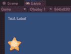

图 19.1：使用 IMGUI 标签

创建一个`按钮`，你调用`GUI.Button()`方法。`GUI.Button()`方法有多个重载，但你将主要使用以下几种：

```cs
public static bool Button(Rect position, string text);
public static bool Button(Rect position, Texture image);
```

第一个将用于定义文本按钮，第二个将用于定义图像按钮。

当按钮被点击时执行代码，你可以在`OnGUI()`方法中的`if`语句内创建按钮。

例如，以下代码将在附加到 GameObject 并在检查器中分配的情况下，在场景中显示文本按钮和图像按钮：

```cs
public class Chapter19Buttons : MonoBehaviour {
    public Texture2D buttonTexture;
    private void OnGUI() {
        if (GUI.Button(new Rect(10, 10, 100, 50), "Text Button")) {
            Debug.Log("Text Button Clicked");
        }
        if (GUI.Button(new Rect(10, 80, 50, 50), buttonTexture)) {
            Debug.Log("Image Button Clicked");
        }
    }
}
```

两个按钮每次点击都会在控制台写入一条消息。代码必须附加到一个 GameObject 上，并且必须在检查器中分配`buttonTexture`变量。

前面代码创建的按钮将看起来如下：

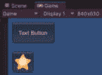

图 19.2：使用 IMGUI 按钮

如果你想要创建一个在点击并按住时调用方法的按钮，你可以使用`Button`。你可以将前面代码中的所有`GUI.Button`实例替换为`GUI.RepeatButton`，以实现类似的结果，但按钮将一直执行方法，直到按钮被按住。

当你只想有一行可编辑文本时，使用`TextField`，而当你想有多个行时，使用`TextArea`。要创建一个`TextField`或`TextArea`，你分别调用`GUI.TextField()`和`GUI.TextArea()`方法。`GUI.TextField()`方法有多个重载，但你将主要使用以下几种：

```cs
public static string TextField(Rect position, string text);
public static string TextArea(Rect position, string text);
```

第一个方法创建一个`TextField`，第二个创建一个`TextArea`。在两种情况下，`string`参数是在用户开始编辑文本之前将显示的文本。请注意，该方法返回一个`string`类型。你可以通过将构造的对象分配给一个`string`变量来获取用户输入的值。

例如，以下代码将在场景中附加到一个 GameObject 上时显示一个可以与之交互的`TextField`和`TextArea`：

```cs
public class Chapter10TextFieldAndArea : MonoBehaviour {
    private string textFieldText = "Enter text";
    private string textAreaText = "Enter text";
    private void OnGUI() {
        textFieldText = GUI.TextField(new Rect(10, 10, 100, 50), textFieldText);
        textAreaText = GUI.TextArea(new Rect(10, 80, 100, 100), textAreaText);
    }
}
```

在用户开始编辑文本之前，场景中渲染的项目如下所示：

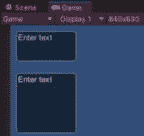

图 19.3：使用 IMGUI 文本字段和文本区域控制

`Toggle`，你调用`GUI.Toggle()`方法。`GUI.Toggle()`方法有多个重载，但你将主要使用以下几种：

```cs
public static bool Toggle(Rect position, bool value, string text);
```

注意，该方法返回一个`bool`类型。你可以通过将创建的对象分配给一个`bool`变量来获取切换的值。

例如，以下代码将创建一个切换，其值在切换被点击时分配给一个布尔变量。这个例子，就像其他例子一样，需要附加到场景中的 GameObject 上以进行渲染：

```cs
public class Chapter19Toggle : MonoBehaviour {
    private bool toggleBool = true;
    private void OnGUI() {
        toggleBool = GUI.Toggle(new Rect(10, 10, 100, 50), toggleBool,"Toggle Me");
    }
}
```

切换最初将在场景中按如下方式渲染，直到用户与之交互，此时切换将随着每次点击而打开和关闭。


图 19.4：使用 IMGUI 切换控制

我所展示的所有示例都是在场景中。然而，如果你想在你编辑器窗口中显示你的 UI，你的代码将类似地工作。你只需将你的代码放入一个继承自`EditorWindow`的脚本中。（参见*第十八章*中的示例。）但是，如果你想在检查器中创建 IMGUI，情况就略有不同。现在让我们来看看。

# 检查器中的 IMGUI

使用 IMGUI 增强你的组件的工作方式与在游戏内 IMGUI 和 `EditorWindow` IMGUI 中非常相似。然而，有一些小的变化。首先，你编写从 `Editor` 继承的脚本。其次，你使用 `OnInspectorGUI()` 方法，而不是 `OnGUI()` 方法。第三，如果你想检查器也包含所有其通常的数据，你需要在你的 `OnInspectorGUI()` 方法中调用 `DrawDefaultInspector()` 方法。最后，如果你想使 IMGUI 按钮与各种默认检查器元素对齐，你使用 `GUILayout` 基类，而不是 `GUI` 基类。所以，例如，你不会用以下代码创建一个按钮：

```cs
GUI.Button(new Rect(10, 10, 100, 50), "Text Button");
```

相反，你会用以下方式创建它：

```cs
GUILayout.Button("Text Button");
```

使用 `GUILayout` 创建的按钮不需要矩形位置，它们将自动在 UI 中定位。

我将在 *示例* 部分介绍这个示例。

现在，你已经有了足够的基本背景信息，可以开始使用 IMGUI 开发面向开发者的 UI。让我们看看一些基本示例，以帮助你开始使用该系统。

# 示例

对于本章的示例，我将介绍两种 IMGUI 的使用类型：一种用于游戏内的调试菜单，另一种用于检查器 UI。到目前为止，所有涵盖的示例都已经在游戏内的调试菜单 UI 中。

## 使用 IMGUI 在游戏中显示帧率

让我们创建一个非常简单的脚本，它将在场景中显示我们游戏的帧率。如果帧率低于某个值，它将改变颜色。

要在游戏中显示帧率，请完成以下步骤：

1.  创建一个名为 `Chapter19-Examples.unity` 的新场景。

1.  在新场景中，创建一个名为 `DebugMenu` 的新 GameObject。

1.  创建一个名为 `DebugFrameRate.cs` 的新脚本。

1.  将 `DebugFrameRate.cs` 脚本附加到你的 `DebugMenu` GameObject 作为组件。

1.  打开新脚本并添加以下变量声明：

    ```cs
    int fps;
    [SerializeField] int fpsThreshold;
    ```

    `fps` 变量用于获取我们游戏帧率的估计值，而 `fpsThreshold` 变量在检查器中分配，并用于确定当我们的 fps 在场景中显示为红色时的阈值。

1.  使用以下代码创建一个 IMGUI `Label`，用于显示 fps：

    ```cs
    private void OnGUI() {
            GUI.Label(new Rect(10, 10, 50, 50), "fps = " + fps.ToString());
    }
    ```

1.  现在，让我们计算 fps。我们可以使用以下方法来估计 fps：

    ```cs
    private void Update() {
        fps = (int)(1f / Time.unscaledDeltaTime);
    }
    ```

1.  玩你的游戏，你应该在场景中看到 fps 的显示。如果你打开 **Stats** 窗口，你应该看到这些值相对接近。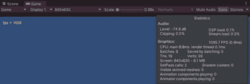

    图 19.5：显示在游戏中的帧率

    没有暂停游戏很难看到值。所以，让我们让它低于某个值时改变颜色。这将使得在帧率低于我们担忧的水平时更容易看到。我们将使用`fpsThreshold`值来实现这一点。你的游戏在编辑器中运行的帧率可能不同于我的，所以请使用一个对你系统有意义的值，以便能够看到代码执行。我将使用`1000`。在检查器中输入你的`fpsThreshould`值。

1.  现在，让我们让它低于那个阈值时改变颜色。将以下`if`/`else`语句添加到你的`OnGUI()`方法顶部，在创建标签之前：

    ```cs
    if (fps < fpsThreshold) {
        GUI.contentColor = Color.red;
    }
    else {
        GUI.contentColor = Color.white;
    }
    ```

这样，你就在游戏中有了帧率估计显示。

在游戏中显示帧率是使用游戏内调试 UI 制作你可能想要的东西的一个很好的例子。这将让你在运行游戏时，即使是在编辑器之外，也能轻松地看到游戏的整体性能。你可以扩展它，使其仅在执行特定任务时出现，或者每秒只更新一次。可能性是无限的。

你可能有其他很多原因想要使用游戏内的调试菜单。例如，你可能想要一些按钮，它们可以调用帮助你跳转到游戏特定部分的函数。或者你可能想要一个清除你保存数据的按钮。制作使用 IMGUI 的游戏内 UI 时，重要的是记住，这应该都是为了帮助你，开发者，而不应该用来向玩家显示信息。

现在，让我们看看你可以在你的编辑器中做的一些事情来帮助你进行开发。

## 使用 IMGUI 制作一个用于导入数据的检查器按钮

在游戏开发中，你通常会在外部存储一些数据，并需要在游戏代码中将这些数据导入为可用的格式。例如，你可能有一个团队成员负责在 Excel 表中创建所有对话，然后你需要找出如何将其导入到你的游戏中。这个例子将展示一个使用检查器按钮从文件中读取文本并将其分配到游戏中的适当位置的基本示例，特别是 ScriptableObject。

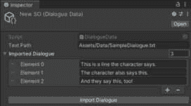

图 19.6：带有导入按钮的自定义检查器

注意

在本文中，我们还没有真正讨论过 ScriptableObjects。ScriptableObject 在 Unity 中本质上是一个数据容器。

要创建一个将数据导入到你的 ScriptableObject 中的按钮，请完成以下步骤：

1.  创建一个新的 C#脚本，名为`DialogueData.cs`。

1.  在你的`Assets`文件夹中创建一个名为`Data`的新文件夹。

1.  从代码文件中找到名为`SampleDialogue.txt`的文本文件。将其导入到你的`Data`文件夹中。或者，你也可以创建一个至少有三行文本的文本文件，并将其放入这个文件夹中。

1.  打开你的`DialogueData.cs`脚本，将其修改为从`Monobehavior`继承到`ScriptableObject`，如下所示：

    ```cs
    public class DialogueData : ScriptableObject {
    ```

1.  向类中添加以下两行代码：

    ```cs
    public string textPath;
    public List<string> importedDialogue;
    ```

    我们将使用`textPath`变量来定义导入的文本文件在我们项目中的位置，并使用`importedDialogue`变量来保存所有导入的对话。

1.  在类定义上方添加以下行，以创建一个菜单，使得`DialogueData` ScriptableObjects：

    ```cs
    [CreateAssetMenu(fileName = "New SO", menuName = "DialogueData", order = 1)]
    ```

1.  现在，返回到你的编辑器，通过在`Data`文件夹内右键点击并选择**创建** | **DialogueData**来创建一个新的 ScriptableObject。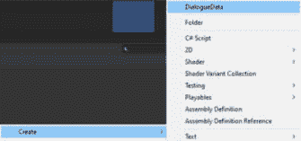

    图 19.7：创建 DialogueData ScriptableObject

    这将创建一个新的名为`New SO`的 ScriptableObject，其检查器如下所示：

    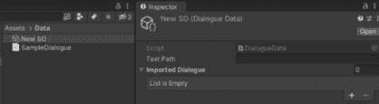

    图 19.8：ScriptableObject 的检查器

1.  现在，让我们使用导入按钮自定义检查器。创建一个新的脚本`DialogueDataCustomEditor.cs`并将其保存在你的`Editor`文件夹中。

1.  打开脚本，将其继承自`Editor`而不是`Monobehavior`，如下所示：

    ```cs
    public class DialogueDataCustomEditor : Editor {
    ```

1.  确保添加以下内容：

    ```cs
    using UnityEditor;
    ```

1.  现在，为了让脚本知道它是一个`DialogueData`类的自定义检查器，在类定义上方添加以下内容：

    ```cs
    [CustomEditor(typeof(DialogueData))]
    ```

1.  将以下代码添加到你的脚本中，以在检查器中显示按钮：

    ```cs
    public override void OnInspectorGUI()
    {
        if (GUI.Button(new Rect(10, 10, 100, 50), "Import Button"))
        {
            // Handle button click logic here
        }
    }
    ```

    如果你返回到你的`New SO`，你会看到检查器现在只包含一个按钮。

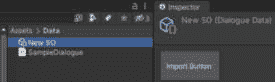

图 19.9：检查器中的按钮

1.  它不再显示我们想在检查器中显示的所有数据。因此，在按钮代码上方添加以下内容：

    ```cs
    DrawDefaultInspector();
    ```

1.  它现在应该在默认检查器信息上方绘制按钮，这并不是我们想要的。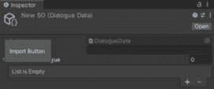

    图 19.10：检查器上方的按钮

    将按钮代码编辑为以下内容：

    ```cs
    if (GUILayout.Button("Import Dialogue")) {
    }
    ```

    这将导致按钮显示在组件的底部，利用 Unity GUI 的布局而不是显式定位。

    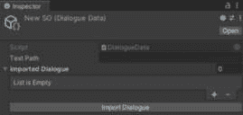

    图 19.11：使用 GUILayout 基类的按钮

1.  现在，我们只需要导入对话。将以下变量声明添加到你的代码中：

    ```cs
    private string[] splitTags = { "\r\n", "\r", "\n"};
    ```

    我们将使用这个变量来正确解析文本文件中的数据，确保每一行都是一个新的对话行。

1.  现在，我们需要添加代码，首先从文件获取数据，然后将其发送到 ScriptableObject：

    ```cs
    private void ReadString() {
        DialogueData dialogueDataScript = (DialogueData)target;
        StreamReader reader = new StreamReader(dialogueDataScript.textPath);
        ParseFile(reader.ReadToEnd());
        reader.Close();
    }
    private void ParseFile(string theFileText) {
        Debug.Log(theFileText);
        DialogueData dialogueDataScript = (DialogueData)target;
        dialogueDataScript.importedDialogue.Clear();
        string[] lines = theFileText.Split(splitTags, StringSplitOptions.None);
        foreach (var line in lines) {
            dialogueDataScript.importedDialogue.Add(line);
            EditorUtility.SetDirty(target);
        }
    }
    ```

1.  现在，更新你的`OnInspectorGUI()`方法以调用`ReadString()`方法：

    ```cs
    public override void OnInspectorGUI() {
            DrawDefaultInspector();
            if (GUILayout.Button("Import Dialogue")) {
                ReadString();
            }
      }
    ```

1.  我们需要将`SampleDialogue.txt`文件的位置添加到我们的 ScriptableObject 中。右键点击`SampleDialogue.txt`并选择**复制路径**。将其粘贴到**文本** **路径**槽中。

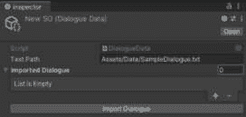

图 19.12：在检查器中分配的 textPath 变量

1.  我们应该可以开始了。点击**导入对话框**按钮，对话框现在将开始导入。你的检查器应该看起来像*图 19*。6*。

使用 IMGUI 在编辑器内创建按钮的操作就到这里了。

# 概述

在本章中，我们讨论了如何使用 IMGUI 系统为开发者构建 UI，包括游戏内的调试显示以及编辑器扩展。虽然 IMGUI 并非一个推荐的 UI 系统，但它对于在开发过程中快速创建辅助开发者的工具来说极为有用。

在下一章中，我们将探讨 Unity 提供的另一个输入系统：新输入系统。
