# 20

# 新输入系统

Unity 的 `Update()` 方法用于确定设备是否接收到了输入。这通常会在你的 `Update()` 方法中导致多个 if-else 分支，以控制每个接收到的输入所发生的事情。

输入系统通过使用基于事件的编程方法将处理单个输入设备的任务从代码中分离出来。你不需要在代码中为每个输入设备创建引用，而是创建响应特定操作的代码。然后，输入系统控制哪些来自哪些输入设备的交互触发这些操作。

这种将输入处理和代码分离的做法允许你创建更可定制的控制，更容易处理不同的输入设备，以及更容易处理来自具有极不同控制方案的不同控制台的控制。此外，输入系统的模块化允许你轻松地将你的控制方案复制到其他项目中，因为所有信息都存储在资产中。

本章旨在介绍输入系统，并将为你概述关键概念，以便你可以在项目中开始使用输入系统。

在本章中，我将讨论以下内容：

+   如何安装输入系统

+   轮询与订阅之间的差异

+   与输入系统相关的基本元素

+   如何编写使用输入系统控制游戏的代码

+   如何将使用旧输入系统（输入管理器）的项目转换为使用新输入系统

+   将你的输入系统连接到代码的两种不同方式

在我们开始查看如何使用输入系统之前，需要将其导入到你的项目中。让我们看看如何做到这一点。

# 技术要求

你可以在此处找到本章的资产文件和代码：[`github.com/PacktPublishing/Mastering-UI-Development-with-Unity-2nd-Edition/tree/main/Chapter%2020`](https://github.com/PacktPublishing/Mastering-UI-Development-with-Unity-2nd-Edition/tree/main/Chapter%2020)

# 安装输入系统

输入系统不再处于预览状态，并正式成为 Unity 的一部分。然而，它并没有预装在 unity 中，必须安装。你可以通过包管理器完成以下步骤，将输入系统安装到你的项目中。

1.  从下拉菜单中选择 **Unity 注册表**。

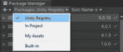

图 20.1：在包管理器中更改包过滤器

1.  在列表中搜索 **Input System** 并选择 **安装**。

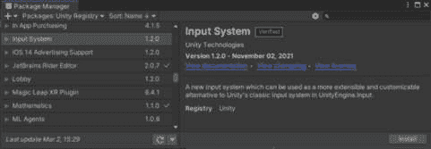

图 20.2：在包管理器中找到输入系统

你将看到一个弹出窗口，你必须同意才能继续。

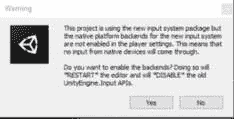

图 20.3：关于更改输入系统的警告

这个警告表明，你使用旧输入系统编写的任何代码将不再工作。这是一个破坏性行为，可能会破坏你的游戏。

注意

我建议你创建一个新的项目来探索输入系统，因为安装它可能会对你的项目造成破坏。它将导致使用输入管理器编写的所有代码停止工作。在你感到舒适之前，不要在现有的项目中安装它。

当你重新打开你的项目时，你可能想回到包管理器，并使用包安装 Unity 提供的各种示例。我建议你安装简单演示和 UI 与游戏输入。

由于这是一个新的输入系统，它确实使用了一种与旧输入系统不同的方法来访问输入。在我们开始查看输入系统的各个元素之前，让我们首先讨论这些方法之间的差异。

# 轮询与订阅

我们在*第八章*中讨论了输入管理器，直到最近，它一直是跟踪 Unity 构建的游戏中设备输入的唯一方式。当使用输入管理器时，你将特定的轴分配给不同的输入操作。然后，你编写一个 C#脚本，不断检查该操作是否被执行。

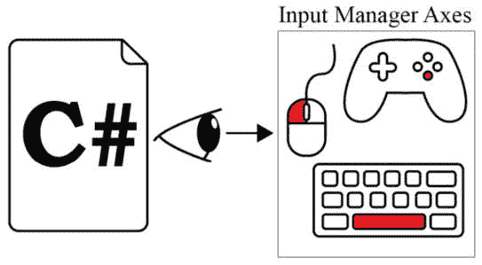

图 20.4：监视由输入管理器定义的特定输入的 C#脚本

为了实现这一点，你的代码可能看起来像以下伪代码：

```cs
void Update () {
     if (some input happened){
          do something
     }
}
```

这种定期请求信息的技术被称为**轮询**。你可以使用轮询模式以类似的方式从输入系统中获取信息，就像你可以使用输入管理器一样。然而，为了使你的代码更加模块化，当你使用输入系统时，大部分代码将使用**发布者-订阅者**（**pub-sub**）模式。

考虑以下类比：你非常喜欢某个 YouTube 内容创作者的内容。你每天都会查看他们的频道，看看是否有新内容发布。然而，你发现这样做很麻烦，于是决定订阅他们的频道。现在，YouTube 频道会在有新内容发布时提醒你，这样就节省了你的工作。想象一下，如果你有数百个 YouTube 频道想要通过订阅来获取更新，而不是不断检查它们，你会节省多少工作量。

让我们将这个类比与编码联系起来。而不是你的 C#脚本需要在`Update()`方法中不断检查各种输入，你还可以**订阅**由**输入系统**定义的特定事件。用更技术性的语言来说，你将编写事件订阅方法，以监听由输入系统引发的特定事件。

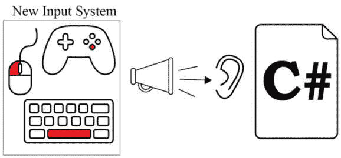

图 20.5：监听由新输入系统定义的特定事件的 C#脚本

因此，当使用新的输入系统时，您的代码可能看起来像以下伪代码：

```cs
void OnEnable() {
     subscribe DoSomething() to the event
}
private DoSomething() {
     do something
}
void OnDisable() {
     unsubscribe DoSomething() from the event
}
```

输入系统将根据您指定的输入和您的代码订阅的事件来确定调用哪些事件，当这些事件发生时，您的代码将执行适当的函数。

那么，您如何根据哪种输入来告诉输入系统调用哪些事件？以及它可以从这些输入调用哪些类型的事件？您可以通过使用动作、交互和输入绑定来完成此操作。现在让我们探讨这些概念。

# 输入系统元素

在输入管理器中，您列出各种轴并定义哪些按钮可以触发这些轴。在输入系统中，您定义一组**动作**并描述输入设备的各种**控制**如何通过**输入绑定**触发这些动作。

例如，您可以通过一个按下的交互将键盘上的空格键绑定到一个跳跃动作的输入绑定来创建输入绑定，其中输入设备是键盘，控制是键盘上的所有键。

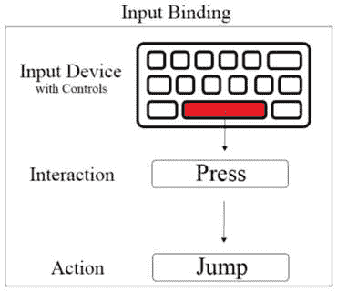

图 20.6：输入绑定的示例

您可以在所谓的**动作图**中创建这些动作集合。动作图包含动作列表。动作包含有关输入绑定的信息。一般想法是创建包含基于其目的的动作组的动作图，例如所有角色控制动作可以放在一个动作图中，所有用户界面动作可以放在另一个动作图中。

您可以在动作编辑器中查看您的动作图、动作、绑定和交互。例如，这里显示了“玩家”和“用户界面”。

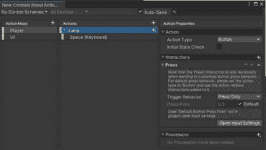

图 20.7：动作编辑器

在“玩家”动作图中，您可以看到带有“空格[键盘]”绑定和“按下”交互的“跳跃”动作。

要开始创建您的动作和动作图，在“资产”文件夹内右键单击，并在您的“资产”文件夹中选择“输入”。这样做时，您应该得到以下类似的内容：

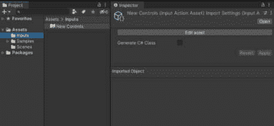

图 20.8：动作资产的检查器和图标表示

您可以双击您刚刚创建的资产，或从其检查器中选择**编辑资产**来查看动作编辑器。动作编辑器将包含您的动作图和动作列表，同时显示每个动作的属性。

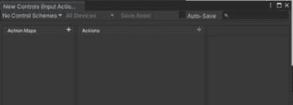

图 20.9：新创建的动作资产的动作编辑器

在**动作图**部分选择**+**号将创建一个新的动作图。

新的动作图将自动包含一个**新动作**，您可以重命名它。

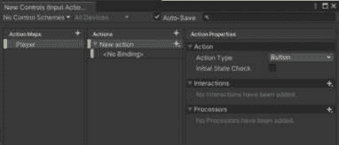

图 20.10：带有新动作的 Action Map

选择 **<无绑定>** 将允许您创建输入绑定。

我将在本章末尾的示例部分中介绍如何选择绑定和交互的示例，但就目前而言，让我们看看您如何将这些 Actions 连接到您的代码。

# 将 Actions 连接到代码

在您的代码中处理 Input System 的 Actions 有多种方法。在本节中，我将概述最重要的主题，这将使您能够开始使用 Input System。

要将您的 Actions 连接到您的代码，您需要使用以下语句导入 `InputSystem`：

```cs
using UnityEngine.InputSystem;
```

我将讨论两种将 Actions 连接到您代码的方法：

+   引用 Action Asset

+   使用 `PlayerInput` 组件

注意

有关将 Actions 连接到您代码的替代方法的更多信息，请参阅以下 Unity 文档：

[`docs.unity3d.com/Packages/com.unity.inputsystem@1.7/manual/Workflows.xhtml`](https://docs.unity3d.com/Packages/com.unity.inputsystem@1.7/manual/Workflows.xhtml)

您可以参考创建类型为 `InputActionsAsset` 的变量 Action Asset 的方法：

```cs
[SerializeField] private InputActionAsset actions;
```

然后，您可以在检查器中分配 `actions` 的值。

要在 `InputActionAsset` 中引用特定的 Action，您可以创建一个类型为 `InputAction` 的变量，如下所示：

```cs
private InputAction playerAction;
```

您可以通过找到 Action Asset 中的特定 Action Map 和 Action 来分配它，如下所示：

```cs
playerMoveAction = actions.FindActionMap("Player").FindAction("Move");
```

一旦找到 Action Asset 的引用，您需要启用和禁用适当的 Action Maps。例如，如果您有一个名为 `Player` 的 Action Map，您可以执行以下操作：

```cs
private void OnEnable()
{
    actions.FindActionMap("Player").Enable();
}
private void OnDisable()
{
    actions.FindActionMap("Player").Disable();
}
```

一旦您有了 `InputActionAsset` 的引用，您可以让您的方程序订阅 Action 的各种回调。每个 Action 都有以下回调，您可以订阅：

+   `Performed`：动作的交互已完成

+   `Started`：动作的交互已经开始

+   `Waiting`：动作已启用并等待输入以触发交互

+   `Canceled`：动作的交互已被取消

+   `Disabled`：由于禁用，动作无法接收任何输入

例如，您可以在名为 `Player` 的 Action Map 上订阅名为 `Jump` 的 Action，该 Action 由按钮按下触发，如下所示：

```cs
actions.FindActionMap("Player").FindAction("Jump").performed += OnJump;
```

如果您希望轮询 Actions 而不是订阅回调事件，您可以使用 `ReadValue<TValue>()` 方法，如下所示：

```cs
Vector2 moveVector = playerMoveAction.ReadValue<Vector2>();
```

如果您不是编写代码的大粉丝，您可以使用 `PlayerInput` 组件。`PlayerInput` 组件将允许您指定您的 C# 脚本中哪些方法被各种 Actions 调用。

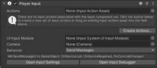

图 20.11：默认的 Player 输入组件

使用这种方法与直接在代码中引用动作主要取决于个人喜好。它需要的代码更少，但需要更多的检查器工作。作为一名程序员，我个人更喜欢在代码中引用动作的方法。我发现它更容易调试，更可定制，当有多个对象使用动作时，编辑起来也更快。然而，当我在一个项目中工作时，设计师在检查器中做出更改，他们不想在代码中工作，使用`PlayerInput`组件是一个好的解决方案，因为它允许他们在我不知情的情况下完成任务。您也可以结合使用，一切基于您的需求和偏好。

注意

要了解您可以使用代码访问动作的各种方法，请参阅以下文档：

[`docs.unity3d.com/Packages/com.unity.inputsystem@1.7/manual/Workflow-ActionsAsset.xhtml`](https://docs.unity3d.com/Packages/com.unity.inputsystem@1.7/manual/Workflow-ActionsAsset.xhtml)

现在我们对 Unity 输入系统的工作原理有了大致的了解，让我们看看一些如何与之工作的示例。

示例

现在我们已经回顾了开始使用输入系统的基本知识，让我们看看一些如何实现它的示例。我们将查看一个非常基础的字符控制器示例。我们将从一个使用旧输入管理器的示例开始，然后调整它以使用输入系统。

注意

这是一个非常基础的字符控制器。它被简化了，以便更容易理解将其转换为输入系统的过程。

我们将使用的示例只是一个会跳跃和四处移动的猫。

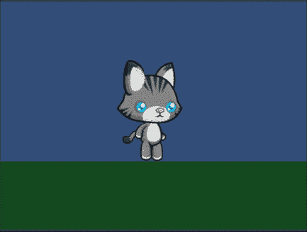

图 20.12：使用旧输入系统的字符控制器示例

在开始这些示例之前，请完成以下步骤：

1.  创建一个新的 2D Unity 项目。

1.  使用`Chapter 20` `– Example 1 - Start`包，该包由本书的源代码提供，通过`Chapter 20` `– Example 1`来感受猫的移动方式。这没有什么花哨的或特别令人印象深刻的地方，但猫可以用空格键跳跃，用箭头键和*A*- *D*键前后移动。

1.  打开`InputManagerBasicCharacterController.cs`类并查看代码。关键代码部分是`Update()`方法：

    ```cs
    void Update()
    {
        movement = Input.GetAxis("Horizontal");
        catRigidbody.velocity = new Vector2(speed * movement, catRigidbody.velocity.y);
        if (grounded && Input.GetButtonDown("Jump"))
        {
            catRigidbody.AddForce(new Vector2(catRigidbody.velocity.x, jumpHeight));
        }
    }
    ```

    注意到使用了`Input.GetAxis("Horizontal")`和`Input.GetButtonDown` **("Jump")**。这些函数定义在输入管理器中，您可以在**编辑** | **项目设置** | **输入管理器**中找到。

1.  现在您已经玩过游戏后，安装输入系统包，并在请求时重新启动。有关步骤，请参阅**安装输入系统**部分。

    如果您现在尝试玩游戏，您将在控制台看到以下错误。

    ```cs
    InvalidOperationException: You are trying to read Input using the UnityEngine.Input class, but you have switched active Input handling to Input System package in Player Settings.
    InputManagerBasicCharacterController.Update () (at Assets/Scripts/InputManagerBasicCharacterController.cs:20)
    ```

    这是因为当我们安装输入系统时，项目停止接受使用`UnityEngine.Input`的输入。猫将不再对按键做出响应。

好的，现在我们的项目已经开始并设置好了，我们可以将代码转换为可以被输入系统使用的代码！让我们先设置我们的动作。

## 创建基本角色控制器动作

在我们开始调整代码之前，我们首先必须设置我们的动作映射和动作。

要设置你的基本角色控制器动作，请完成以下步骤：

1.  在你的`Assets`文件夹中创建一个名为`Inputs`的新文件夹。

1.  在文件夹内右键单击并选择**创建** | **输入动作**。

1.  将新的动作资产重命名为`CatActions`。

1.  双击`CatActions.inputActions`以打开动作编辑器。

1.  打开**自动保存**复选框，以便您所做的任何更改都将自动保存。

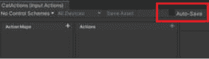

图 20.13：选择自动保存

1.  现在，我们需要添加一个动作映射，它将包含我们角色的所有动作。通过选择加号并命名动作映射为`Player`来创建一个新的动作映射。你现在应该看到以下内容：

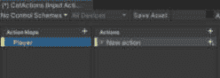

图 20.14：玩家动作映射

1.  让我们通过将“新建动作”重命名为“跳跃”来创建“跳跃”动作。你可以通过双击“新建动作”这个词来实现。注意**动作类型**被设置为**按钮**。这意味着跳跃动作将由类似按钮的输入触发。

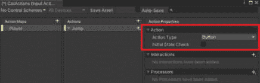

图 20.15：跳跃动作的属性

1.  点击`跳跃`动作旁边的箭头以查看所有绑定。你应该看到**无绑定**。

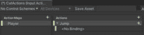

图 20.16：跳跃动作的绑定

1.  点击`空格`键，然后选择**空格 [键盘]**。这将把键盘上的空格键绑定到这个动作。注意它会自动为你命名绑定。

1.  现在我们来告诉这个绑定它可以接受哪种交互。在**交互**旁边选择加号，并从下拉菜单中选择**按下**。你的玩家动作映射现在应该如下所示：

![图 20.17：空格 [键盘] 绑定上的按下交互](img/Figure_20.17_B18327.jpg)

图 20.17：空格 [键盘] 绑定上的按下交互

1.  现在我们想要添加一个绑定到之前在输入管理器中由“水平”引用的键的动作。在“移动”旁边选择加号。

1.  将其**动作类型**设置为**值**，其**控制类型**设置为**Vector2**。

1.  现在我们需要添加键绑定。在“移动”动作旁边选择加号，你会注意到，因为我们把“移动”设置为与“跳跃”不同的动作类型，它有不同的**绑定选项**。选择**添加上下左右复合**。你现在应该看到以下内容：

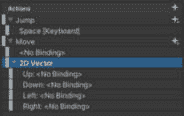

图 20.18：2D 向量绑定

1.  删除 **Up** 和 **Down** 绑定以及标记为 **<No Binding>** 的绑定，因为我们不需要它们。你可以通过右键点击并选择 **Delete** 来完成此操作。

1.  在 **路径** 中选择 `Left Arrow` 以找到 **Left Arrow [Keyboard]**。

1.  在 **路径** 中选择 `Right Arrow` 以找到 **Right Arrow [Keyboard]**。你现在应该有以下动作和绑定。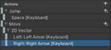

    图 20.19：左右绑定

    我们现在已经将箭头键绑定到了移动动作。

1.  现在我们需要绑定 *A* 和 *D* 键。通过右键点击并选择 **Duplicate** 来复制 **Left: Left Arrow [Keyboard]** 和 **Right: Right Arrow [Keyboard]** 绑定。

1.  在 **路径** 中选择复制的 `a keyboard` 以找到 **A [Keyboard]**。

1.  在 **路径** 中选择复制的 `d keyboard` 以找到 **D [Keyboard]**。你现在应该看到以下动作和绑定：

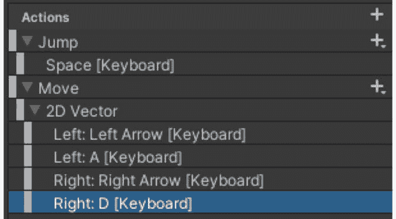

图 20.20：所有必要的动作和绑定

现在我们已经完成了动作的连接，我们可以开始使用它们与我们的代码！我会展示两种方法：使用 `PlayerInput` 组件和通过在脚本中引用动作。

## 使用 PlayerInput 组件创建一个基本的角色控制器

将我们的代码切换到使用 Actions 和 `PlayerInput` 组件，需要一些代码调整和一些检查器工作。

要使用 `PlayerInput` 组件与动作，请完成以下步骤：

1.  为了保留前面的例子，我将复制场景并命名为 `Chapter 20` `– Example 2`；复制 `InputManagerBasicCharacterController.cs` 脚本；并将副本重命名为 `PlayerInputBasicCharacterController.cs`。如果你只想在同一个场景中使用相同的脚本，可以跳过这一步。然而，如果你确实想这么做，确保也要更改类定义中的脚本名称，并将脚本作为组件添加到你的新场景中的 `Cat` 对象上。

1.  让我们先调整脚本。我们将移除 `Update()` 方法中检查输入轴的代码，并改用可以在检查器中连接的公共方法。注释掉 `Update()` 方法中的所有代码。不要删除它，因为我们稍后会将其中一些代码剪切粘贴到其他方法中。

1.  将以下语句添加到你的脚本顶部：

    ```cs
    using UnityEngine.InputSystem;
    ```

1.  创建一个新的方法 `OnJump()`。这将是在 `Jump` 动作被触发时调用的方法。它应该如下所示：

    ```cs
    public void OnJump(InputAction.CallbackContext context) {
    }
    ```

1.  我们希望我们的 `OnJump()` 方法的表现与我们在 `Update()` 方法中注释掉的以下语句相似。

    ```cs
    if (grounded && Input.GetButtonDown("Jump"))
    {
        catRigidbody.AddForce(new Vector2(catRigidbody.velocity.x, jumpHeight));
    }
    ```

    将其复制粘贴到 `OnJump()` 方法中。

1.  从 `if` 语句中移除 `&& Input.GetButtonDown("Jump")`。现在你的 `OnJump()` 方法应该如下所示：

    ```cs
    public void OnJump(InputAction.CallbackContext context) {
            if (grounded) {
                catRigidbody.AddForce(new Vector2(catRigidbody.velocity.x, jumpHeight));
            }
    }
    ```

1.  现在让我们在检查器中连接这个方法。从层次结构中选择您的`Cat`，并添加`PlayerInput`组件。您的 Cat 检查器应具有以下组件：

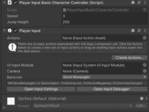

图 20.21：Cat 上的一些组件

1.  现在让我们将我们的动作添加到项目文件夹中的`CatActions`到**Actions**槽中。您的组件现在应如下所示：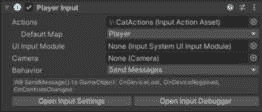

    图 20.22：将 CatActions 分配给 PlayerInput 组件

    注意它已经找到了我们的**Player**动作映射并将其添加为**默认映射**。如果我们有更多的动作映射，还有其他选项可供选择。

1.  从**Behavior**下拉菜单中选择**Invoke Unity Events**。这将添加一个**Events**设置，可以展开以显示**Player**事件的列表。展开**Player**将显示我们在玩家映射中定义的两个动作以及其他一些有用的动作。

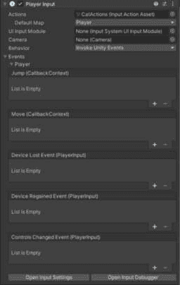

图 20.23：各种玩家动作事件

1.  我们可以将我们的`OnJump()`方法连接到`Cat`对象的`Object`槽中，然后选择**PlayerInputBasicCharacterController** | **OnJump**。您的**Jump**事件现在应如下所示：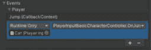

    图 20.24：玩家跳跃事件调用我们的 OnJump 方法

    玩游戏，当您按下空格键时，您应该看到猫跳跃。

1.  现在让我们连接移动动作。返回您的代码并创建以下方法：

    ```cs
    public void OnMove(InputAction.CallbackContext context) {¶}
    ```

1.  在您的代码中添加以下变量声明：

    ```cs
    private Vector2 moveVector = new Vector2();
    ```

1.  当我们从输入轴获取`movement`变量时，我们使用了以下行：

    ```cs
    movement = Input.GetAxis("Horizontal");
    moveVector = context.ReadValue<Vector2>();
    ```

    这将在调用`OnMove()`方法时获取移动动作的值。

1.  返回您的`Update()`方法并取消注释剩余的代码。您的`Update()`方法现在应如下所示：

    ```cs
    void Update()
    {
        movement = Input.GetAxis("Horizontal");
        catRigidbody.velocity = new Vector2(speed * movement, catRigidbody.velocity.y);
    }
    ```

1.  删除以下使用旧输入系统的行。

    ```cs
    Movement = Input.GetAxis("Horizontal");
    ```

1.  将剩余的行编辑为使用`moveVector`而不是`movement`浮点数。

    ```cs
    catRigidbody.velocity = new Vector2(speed * moveVector.x, catRigidbody.velocity.y);
    ```

1.  删除不再需要的`movement`浮点变量声明。

1.  返回您的检查器，并将`OnMove()`方法添加到`Cat`的`Object`槽中，然后选择**PlayerInputBasicCharacterController** | **OnMove**。您的移动事件现在应如下所示：

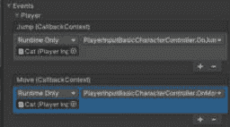

图 20.25：玩家移动事件调用我们的 OnMove 方法

玩游戏，现在您的猫应该能够移动和跳跃了！

个人来说，我不太喜欢使用 `PlayerInput` 组件。由于我是一名程序员，我更喜欢把大部分时间花在代码编辑器上，而不是 Unity 编辑器上。我发现调试在检查器中连接的代码比较困难。当我使用此功能时，我会尝试通过在代码中添加注释来使未来的自己（或我的其他编程同事）的生活更轻松，注释中说明了哪些组件调用哪些方法。这可以使调试和理解代码的工作方式变得更容易。使用像 Jetbrains Rider 这样的代码编辑器可以减轻一些压力，因为它会指示代码在检查器中的连接位置，但它并不总是显示所有必要的信息，而且你不能指望你的同事也使用 Rider IDE。如果你有类似的偏好，我将在下一个示例中向你展示如何以代码为中心的方式完成此操作。

## 通过在代码中引用动作创建基本角色控制器

为了重新执行我们之前的示例，以便在代码中引用动作，请完成以下步骤：

1.  为了保留之前的示例，我将复制场景并命名为 `第二十章` `– 示例 3`；复制 `PlayerInputBasicCharacterController.cs` 脚本；并将副本重命名为 `ActionReferenceBasicCharacterController.cs`。如果你更愿意在同一个场景中使用相同的脚本，你可以跳过此步骤。但是，如果你确实想这样做，请确保也更改类定义中的脚本名称，并将脚本作为组件添加到你的新场景中的 `Cat` 对象上。

1.  删除 `Cat` 的检查器。注意，如果你现在尝试玩游戏，猫将不会移动或跳跃，因为我们移除了将输入与我们的代码连接的组件。

1.  打开 `ActionReferenceBasicCharacterController.cs` 脚本。

1.  注释掉 `OnMove()` 方法。我们不会在检查器中通过事件调用此方法，因此不需要该方法。然而，我们将编写类似于此方法的代码，所以我现在先注释掉它，以便稍后可以复制并粘贴到正确的位置。

1.  我们需要做的第一件事是获取包含所有动作的动作资产的引用。创建以下变量声明：

    ```cs
    [SerializeField] private InputActionAsset actions;
    ```

1.  我们可以通过将 `CatActions` 资产拖动到检查器的 **动作** 槽中，在检查器中完成此操作。

1.  返回到脚本。为你的脚本添加一个空的 `OnEnable()` 方法和 `OnDisable()` 方法。我们稍后会向它们添加一些代码。

    我喜欢将 `OnEnable()` 方法放在 `Awake()` 方法下面，因为它在它之后执行，而将 `OnDisable()` 方法放在脚本底部，因为它将在我们的其他所有方法之后执行。

1.  由于我们通过代码引用我们的动作，我们需要启用和禁用我们的动作映射。将以下加粗的代码行添加到你的 `OnEnable()` 和 `OnDisable()` 方法中。

    ```cs
    private void OnEnable()
    {
        actions.FindActionMap("Player").Enable();
    }
    private void OnDisable()
    {
        actions.FindActionMap("Player").Disable();
    }
    ```

1.  现在，让我们连接我们的跳跃动作。我们将通过订阅跳跃动作的`performed`事件来完成此操作。将以下代码添加到你的`OnEnable()`方法中。

    ```cs
    actions.FindActionMap("Player").FindAction("Jump").performed += OnJump;
    ```

    这应该足以让之前编写的`OnJump()`方法与你的动作映射一起工作。玩游戏，你现在可以在按下空格键时看到猫跳跃。

1.  虽然在这个例子中并非完全必要，但我更喜欢养成在`OnDisable()`中总是取消订阅任何已订阅事件的习惯。养成这个习惯将使我未来在需要时避免问题。因此，将以下代码行添加到你的`OneDisable()`方法顶部：

    ```cs
    actions.FindActionMap("Player").FindAction("Jump").performed -= OnJump;
    ```

1.  现在，让我们连接我们的移动动作。为此，我们可以创建一个表示移动动作的`InputAction`的引用，以便通过代码轻松访问。将以下变量声明添加到你的代码顶部：

    ```cs
    private InputAction playerMoveAction;
    ```

1.  现在，让我们初始化它。将以下代码行添加到你的`OnEnable()`方法中。

    ```cs
    playerMoveAction = actions.FindActionMap("Player").FindAction("Move");
    ```

1.  我们不是订阅移动动作，而是在`Update()`方法中轮询它。将以下代码从你的注释掉的`OnMove()`方法中剪切并粘贴到`Update()`方法顶部。你现在可以删除`OnMove()`方法了。

    ```cs
    moveVector = context.ReadValue<Vector2>();
    ```

1.  你会在`context`变量上遇到错误。它是`OnMove()`方法的参数，在`Update()`方法中不存在。我们不再读取`context`的值，而是读取`playerMoveAction`的值。将`context`替换为`playerMoveAction`，以便你的`Update()`方法如下所示：

    ```cs
    void Update()
    {
        moveVector = playerMoveAction.ReadValue<Vector2>();
        catRigidbody.velocity = new Vector2(speed * moveVector.x, catRigidbody.velocity.y);
    }
    ```

    这样应该足以让我们的猫通过动作移动，而不需要`PlayerInput`组件。玩游戏，观察猫在按下适当的键时移动和跳跃。

我知道将我们的特定项目设置为使用输入系统而不是使用输入管理器要花费更多的工作，可能看起来不值得。对于这个微小的例子，这可能确实如此。然而，如果我们想要创建一个跨平台版本的项目，该版本可以接受来自多种类型设备的输入，那么在动作映射中为动作添加新的绑定比为每个我们想要处理的可能输入配置添加新的一行代码要简单得多。

# 摘要

在本章中，我们介绍了如何使用新的输入系统来收集游戏输入。这使我们能够创建一个易于定制的输入系统，可以从长远来看显著简化通过各种输入设备控制游戏。虽然设置起来可能需要一些工作，但它可以节省你大量的精力。

因此，我们来到了本书的结尾！我再也没有更多用户界面知识可以传授给你们了。
