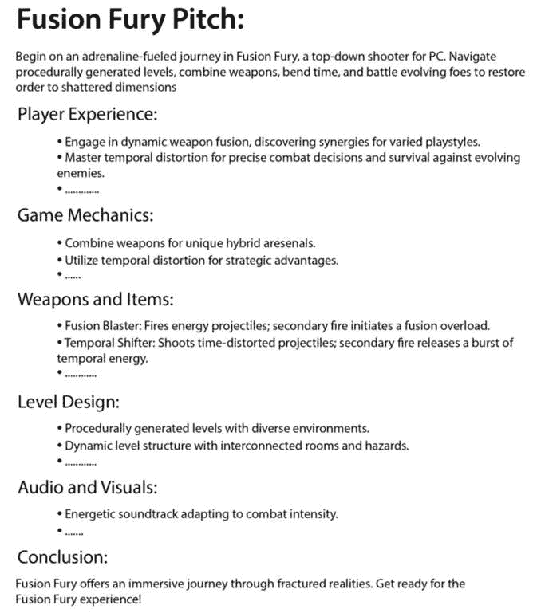
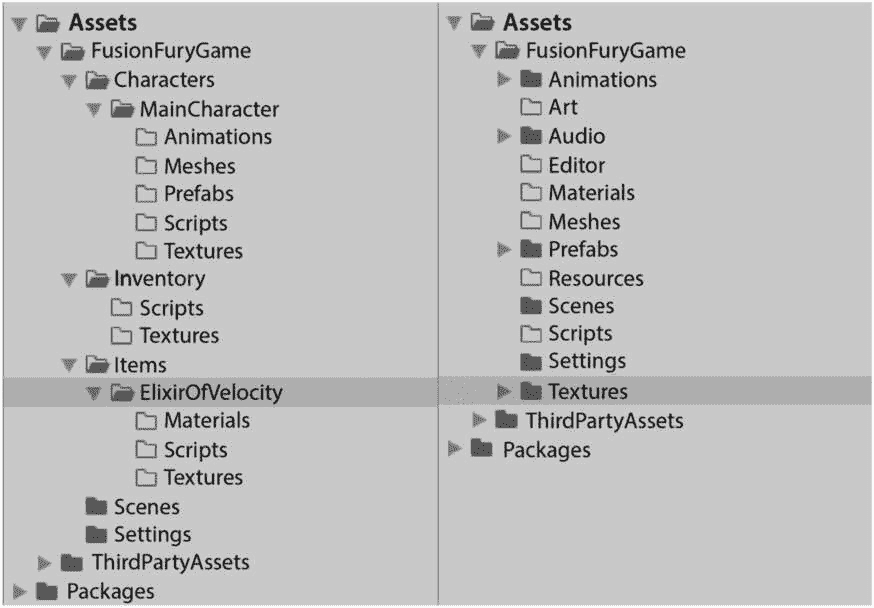
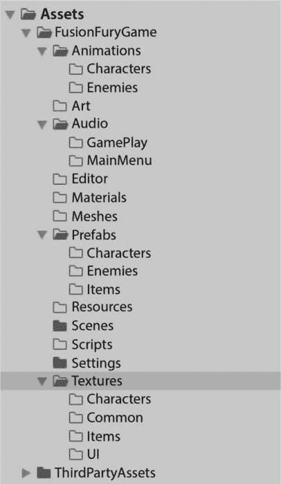
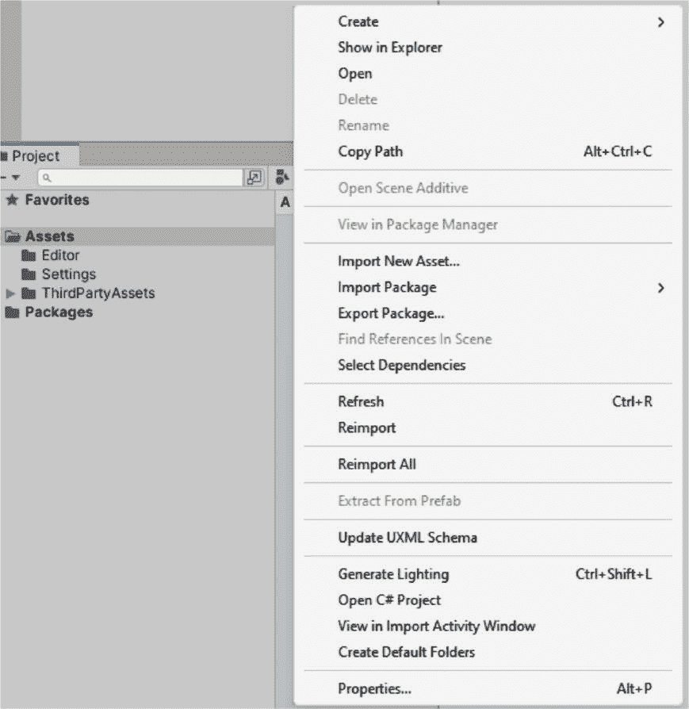
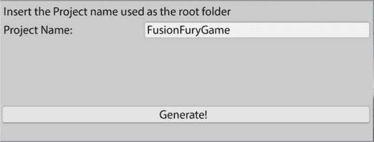
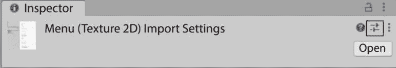
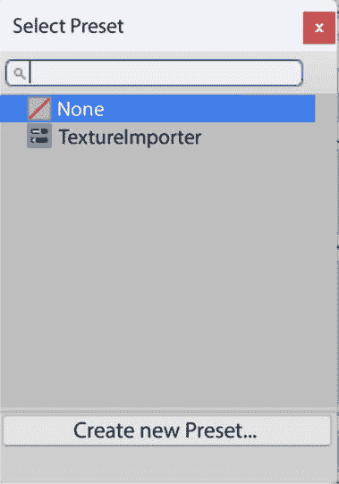
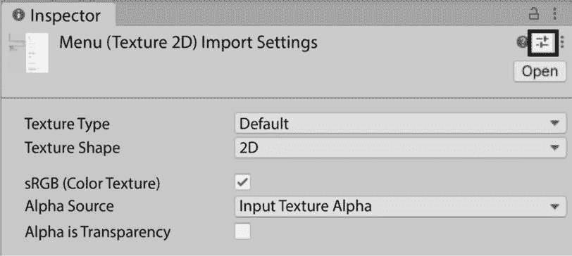
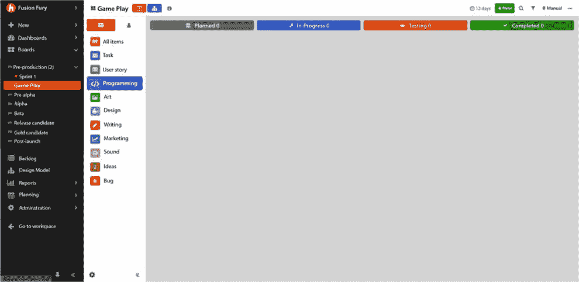
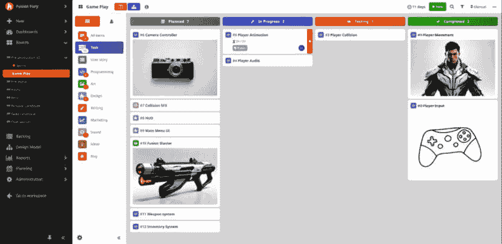

# 1

# 游戏设计与项目管理简介

踏入创意与结构相遇的领域——游戏设计与项目管理简介。本章是您了解赋予游戏生命力的核心原则的入门。在本章中，我们将探讨游戏设计的必要元素，探索制作引人入胜的机制和引人入胜的叙事的艺术。此外，我们将揭示有效项目组织的秘密，为您提供简化开发流程的工具。无论您是梦想着您的第一款游戏还是寻求提高技能，这个简介为您提供了一个激动人心的冒险的基础。

在本章中，我们将涵盖以下主要主题：

+   GDD 简介

+   玩家体验如何

+   让我们谈谈项目组织

# 技术要求

准备好深入 Unity 开发了吗？请确保您的系统已准备好：

+   **Unity 版本 2022.3.13**：下载并安装 Unity，选择版本 2022.3.13 以确保与提供的内容最佳兼容性。

+   **主要 IDE - Visual Studio 2022**：教程和代码示例使用 Visual Studio 2022 制作。请确保已安装，以便无缝跟随。如果您更喜欢 Rider 或其他 IDE，请随意探索，尽管说明是为 Visual Studio 定制的。

+   **足够的系统资源**：确保您的系统满足 Unity 的最低要求，以获得流畅的开发体验。

+   **代码示例的 GitHub 仓库**：在我们的专用 GitHub 仓库中访问代码示例和项目文件：[`github.com/PacktPublishing/Mastering-Unity-Game-Development-with-C-Sharp`](https://github.com/PacktPublishing/Mastering-Unity-Game-Development-with-C-Sharp)。克隆或下载仓库，以便轻松访问本章中展示的代码。

# GDD 简介

让我们深入了解游戏设计！我们将深入游戏设计文档（GDD）的世界。制作游戏不仅仅是关于代码；它是关于创造体验。这些基础知识有助于将想法转化为令人兴奋的游戏。我们将探讨 GDD 是什么以及它如何帮助制作玩家喜爱的游戏。

# GDD 是什么？

**游戏设计文档**（GDD）是一个全面的指南，概述了游戏项目的核心主题、风格、功能、机制和想法。其主要作用是有效地传达项目细节，无论是您在游戏开发过程中自我推进，还是向团队成员、发行商或潜在玩家等利益相关者传达。本质上，它是帮助管理和开发游戏概念的工具，为其创作提供关键路线图。虽然其格式没有严格的标准，但一个精心制作的 GDD 成为游戏开发不可或缺的一部分，确保开发团队之间的清晰和对齐。

## GDD 与提案：比较视角

当谈到游戏设计文档（GDD）和提案时，它们在游戏开发过程中具有不同的目的。GDD 是一份深入文档，捕捉核心元素和复杂性，为开发团队提供详细指南。另一方面，提案是一种简洁而有力的演示，旨在激发兴趣和支持。虽然 GDD 在整个游戏创作过程中提供全面信息，但提案充当了一个预告片——一个令人兴奋的快照，以激发潜在利益相关者的兴趣。

## 提案：激发对游戏概念的激情

提案是一种强大的工具，旨在激发对游戏概念的兴趣和支持。它是一种简短、引人注目的演示，迅速传达游戏的核心。与 GDD 的详细性质不同，提案完全是关于创造即时的兴奋。它在吸引注意、激发好奇心和为与利益相关者的潜在合作奠定基础方面发挥着至关重要的作用。

以下图像作为我们游戏的提案，提供视觉表现来阐述概念：



图 1.1 – Fusion Fury 的提案

你可以在 [`github.com/PacktPublishing/Mastering-Unity-Game-Development-with-C-Sharp`](https://github.com/PacktPublishing/Mastering-Unity-Game-Development-with-C-Sharp) 找到完整的 GDD。

## 理解 GDD 元素

如果你曾好奇视频游戏背后的魔法，你就在正确的位置。加入我们，开始对 GDD 元素的入门级探索，揭示游戏开发的神秘语言。以下列表显示了 GDD 的一些元素：

+   **游戏概念**:

    +   描述游戏的核心思想和整体概念。

    +   定义游戏的设定、主题和主要目标。

+   **核心游戏机制**:

    +   详细解释支配游戏的基本规则和交互。

    +   描述玩家如何参与和导航游戏世界。

+   **游戏功能特性**:

    +   识别和详细阐述增强游戏体验的关键特性。

    +   包括独特卖点、特殊能力和创新方面。

+   **游戏玩法分解**:

    +   游戏中不同阶段或级别的深入分解。

    +   概述玩家将遇到的进展和挑战。

+   **项目范围分解**:

    +   清晰界定项目的范围，包括其限制。

    +   定义项目包含的内容，以及同样重要的是，不包含的内容。

+   **技术要求**:

    +   与游戏开发所需的技术和工具相关的规格。

    +   包括有关平台、编程语言和软件要求的信息。

+   **艺术和音效资源**:

    +   游戏所需的视觉和听觉元素的概述。

    +   描述角色设计、环境艺术、音效和音乐。

+   **用户界面（UI）设计**:

    +   用户界面的设计，包括菜单、HUD 元素和导航。

    +   确保用户体验友好且视觉上吸引人。

+   **货币化策略**：

    +   讨论游戏如何产生收入（如果适用）。

    +   包括定价模式、应用内购买或其他收入来源。

+   **测试和质量保证**：

    +   测试游戏的策略，以识别和解决错误。

    +   确保游戏在发布前符合质量标准。

+   **营销和推广**：

    +   概述推广和营销游戏的计划。

    +   确定目标受众和建立认知的策略。

这些并不是 GDD 中唯一的元素，但这本书的重点不是这些。我们还提供了一些建议，特别是针对中期开发或独立游戏开发者。通常建议不要一开始就创建过于详细的 GDD，因为随着开发旅程的进行，你可能需要做出更改。

我们将在接下来的章节中创建游戏时使用这个游戏设计文档（GDD）。我们将学习如何理解 GDD，将其分解为任务，并组织它们以完成我们的游戏。

让我们讨论与玩家体验相关的一个关键方面，以及为什么它对我们游戏的成功至关重要。

# 玩家的体验如何？

欢迎来到游戏开发的核心，这里是魔法发生的地方——塑造玩家的体验。在本节中，作为本节的介绍，帮助您理解玩家体验，我们深入探讨创造吸引玩家并留下持久印象的沉浸式世界的艺术。玩家体验不仅仅是一个功能；它是你游戏灵魂的一部分，我们将引导您了解将提升玩家旅程的元素。

**玩家体验**，通常称为**PX**或**用户体验**（UX），是 GDD 中概述的一个关键方面。它体现了玩家在沉浸于电子游戏时所经历的整体印象和情感。以下是 GDD 中与玩家体验相关的关键组成部分：

+   **情感投入**：

    +   描述游戏旨在引发的预期情感反应。

    +   确定不同游戏阶段的情感旅程。

+   **沉浸感**：

    +   详细说明游戏如何让玩家沉浸在其虚拟世界中。

    +   讨论如逼真图形、音效设计和叙事深度等特性。

+   **挑战** **和难度**：

    +   概述挑战性游戏玩法和玩家参与度之间的平衡。

    +   定义难度曲线及其在整个游戏中的演变。

+   **奖励系统**：

    +   描述游戏如何奖励玩家的成就。

    +   包括得分、升级、成就或其他激励措施。

+   **玩家进步**：

    +   解释玩家如何进步，获得新能力或解锁内容。

    +   概述进步感和成就感。

+   **叙事影响**：

    +   讨论游戏故事如何对整体玩家体验做出贡献。

    +   解决叙事与游戏玩法机制的结合。

+   **用户界面（UI）反馈**：

    +   定义 UI 如何向玩家传达关键信息。

    +   确保提供清晰、直观的反馈，以增强整体体验。

+   **交互性**：

    +   描述玩家与游戏世界的交互程度。

    +   包括控制响应性、决策影响和玩家自主权。

+   **节奏**：

    +   概述了游戏节奏和流程，平衡紧张、放松和高潮。

    +   确保在整个玩家旅程中保持引人入胜的节奏。

+   **可访问性**：

    +   针对游戏如何适应不同技能水平和偏好的玩家。

    +   确保为多元化的观众群体提供包容性和积极的体验。

当你深入到创造玩家体验时，请记住，你的游戏的每个部分，无论是游戏机制还是叙事，都在吸引玩家方面发挥着作用。这不仅仅是创造一个游戏；这是关于与你的观众建立情感联系。通过精心设计的玩家体验，你的游戏从简单的娱乐转变为进入你虚拟领域的玩家难忘的旅程。

在下一节中，我们将探讨构建我们的 Unity 项目、任务组织和引入版本控制的重要性。

# 让我们谈谈项目组织

让我们跳入项目组织——这是独立开发者和团队成员都必备的一项技能。本节揭示了使用 Git 进行版本控制和 Hack N Plan 进行项目协调的秘诀。掌握项目组织可以提高效率，无论你是单独工作还是团队合作。从这里开始，为更顺畅的游戏开发之旅奠定了基础。所以，拿起你的工具包，让我们深入其中，让组织成为你的超级力量！

无论单独工作还是团队合作，整理你的游戏项目可以节省时间并增加灵活性。在游戏开发中采用结构化的方法可以帮助你保持进度并简化工作流程。这就像是在你的旅途中拥有了一张地图——简化了挑战的导航并确保了更顺畅的开发路径。我们将一起踏上这段旅程，保持混乱远离，为高效的游戏创作铺平道路。

## 掌握高效开发的项目结构

让我们深入探讨我们将如何构建我们的项目。我们将涵盖三个主要方面：

+   发现使用版本控制系统进行无缝协作的重要性。

+   在 Unity 中构建和整理项目，提供实用的技巧和最佳实践。

+   利用 Hack N Plan 高效地组织和管理工作任务。

在接下来的几节中，我们将探讨每个要点，以获得有效项目组织的有价值见解和技能。

### 版本控制系统

在游戏开发中使用版本控制系统对于独立开发者和团队都至关重要。它就像是一个安全网，允许你跟踪变更，在出现问题时回滚到之前的版本，并与他人无缝协作。

即使单独工作，它也能防止意外错误，并提供一种结构化的方式来管理项目的发展。对于团队来说，它确保每个人都在同一页面上，减少冲突，简化协作，使整个开发过程更加顺畅和有序。本质上，它是一个让你的游戏开发之旅无烦恼、高效的工具。

在 Git、Perforce 和 Unity 官方版本控制 Plastic 等众多版本控制系统的大千世界中，本书将通过专注于 Git 和 GitHub 来简化内容。虽然你可以自由选择你喜欢的工具，但我们推荐使用 GitHub，以便更好地与提供的代码保持一致，并实现无缝的工作流程跟踪。

#### 版本控制的工作原理

版本控制就像是你的游戏项目的安全网。想象一下，你正在尝试一个新功能，但它并不完全按预期工作。有了版本控制，你可以轻松地回滚到一个干净、功能正常的版本，撤销任何实验性更改。这就像是给你的项目配备了一个时间机器，让你可以无惧地迭代想法。

此外，如果你需要切换到主项目中的重大问题并协助处理，版本控制让你可以保存你的更改以供稍后使用。一旦紧急任务处理完毕，你可以无缝地恢复你的实验性工作。这个系统还可以防止在团队协作时意外覆盖。每次你提交工作，你都会检查最新更新，确保你不会与你的队友发生冲突。虽然一开始处理合并冲突可能听起来令人畏惧，但一旦掌握了技巧，它就是一个可管理的流程。

#### 版本控制的最佳实践

无论你选择哪种版本控制系统，各种最佳实践都可以提高团队的效率。由于每个团队都有独特的要求，并非每个实践都适合所有团队。以下是一些版本控制的最佳实践：

+   经常提交，但每次提交的增量要小。

    确保每次提交都对应一个特定的任务或票据，使更改保持专注且易于管理。这种做法使得在出现问题时，更容易识别和撤销任何负面更改，而不会影响到正面更改。

+   保持对最新变化的了解。

    定期从仓库中拉取最新更新到你的工作副本中，以避免孤立工作并最小化遇到合并冲突的机会。将这一做法融入你的日常工作中，以实现更顺畅的协作和有效的版本控制管理。

+   保持提交信息的清洁和描述性。

    清晰地传达每次提交的目的，使理解项目的历史更加容易。如果你使用任务票据系统，考虑在提交中包含票据号，以实现更好的可追溯性和协作。

在下一节中，我们将学习如何组织我们的 Unity 项目以及正确组织项目的重要性。

### 组织 Unity 项目

高效地组织 Unity 项目不仅简化了版本控制，还提高了整体团队协作，从而实现更流畅的工作流程。

在本节中，我们将了解如何构建我们的项目和组织我们的文件夹。我们还将了解各种命名规范以及如何使用它们。

#### 文件夹结构

这里有一些组织 Unity 内部文件夹的最佳实践：

+   文档命名规范和文件夹结构以方便文件组织；考虑使用风格指南或项目模板。

+   在命名规范上保持一致性；避免偏差。普遍修订规则，并使用脚本自动化大规模更新。

+   在文件和文件夹名称中避免使用空格，以防止与 Unity 的命令行工具出现问题。使用驼峰式作为替代。

+   为测试或实验创建单独的文件夹，以保持非生产场景的有序。带有用户名的子文件夹可以帮助按团队成员划分工作区域。

+   将内部资产与第三方资产分开，特别是如果是从资产商店或其他插件中获得的，因为它们可能有它们自己的项目结构。

虽然没有固定的规则来组织您的文件夹，但以下**图 1.2**显示了您可能如何构建 Unity 项目的示例：



图 1.2 – 功能结构（左）和垂直结构（右）

这些设置围绕按资产类型、功能或系统对项目进行分类。虽然您不必使用这些特定的文件夹名称，但它们提供了一个有用的起点。

为了更有效和简化的组织方法，建议同时利用这两种方法。

在以下图中，我们可以使用组合结构以获得更好的方法：



图 1.3 – 组合结构

好的，让我们通过实施一个自动化的系统来创建文件夹，从而简化我们的工作流程，提高项目管理的效率和节省时间。

在以下脚本中，我们将使用 Unity 编辑器逻辑来生成文件夹和子文件夹。

```cs
using UnityEditor;
using UnityEngine;
using System.Collections.Generic;
using System.IO;
public class CreateFolders : EditorWindow
{
    private static string projectName = "PROJECT_NAME";
    [MenuItem("Assets/Create Default Folders")]
    private static void SetUpFolders()
    {
        CreateFolders window = ScriptableObject.CreateInstance<CreateFolders>();
        window.position = new Rect(Screen.width / 2, Screen.height / 2, 400, 150);
        window.ShowPopup();
    }
    private static void CreateAllFolders()
    {
        List<string> folders = new List<string>
        {
            "Animations",
            "Audio",
            "Editor",
            "Materials",
            "Meshes",
            "Prefabs",
            "Scripts",
            "Scenes",
            "Shaders",
            "Textures",
            "UI"
        };
        foreach (string folder in folders)
        {
            if (!Directory.Exists("Assets/" + folder))
            {
                Directory.CreateDirectory("Assets/" + projectName + "/" + folder);
            }
        }
        List<string> uiFolders = new List<string>
        {
            "Assets",
            "Fonts",
            "Icon"
        };
        foreach (string subfolder in uiFolders)
        {
            if (!Directory.Exists("Assets/" + projectName + "/UI/" + subfolder))
            {
                Directory.CreateDirectory("Assets/" + projectName + "/UI/" + subfolder);
            }
        }
        AssetDatabase.Refresh();
    }
    void OnGUI()
    {
        EditorGUILayout.LabelField("Insert the Project name used as the root folder");
        projectName = EditorGUILayout.TextField("Project Name: ", projectName);
        this.Repaint();
        GUILayout.Space(70);
        if (GUILayout.Button("Generate!")) {
            CreateAllFolders();
            this.Close();
        }
    }
}
```

上述代码块显示了您在创建项目后可以在编辑器中使用的静态函数，以设置您想要的文件夹结构。

您还将有灵活性来修改名称、路径和整个结构。当您在编辑器中的项目标签页上右键单击鼠标时，我们将使用下拉菜单来方便地创建此文件夹结构。

在**图 1.4**中，我们可以看到下拉菜单，从中我们可以选择**创建默认文件夹**选项来创建我们自己的默认文件夹：



图 1.4 – 从菜单创建默认文件夹

一旦我们点击**创建默认文件夹**选项，您将看到以下面板，您可以在其中命名项目：



图 1.5 – 输入项目名称

一旦命名了项目，点击 **生成**！

### 命名规范

制定标准不仅仅是关于项目文件夹。为场景中的 GameObject 或项目文件夹中的 Prefabs 制定一致的命名约定可以简化团队内的协作。虽然不存在适用于所有 GameObject 的单一命名标准，以下是一些考虑因素：

+   使用描述性名称：

    +   选择几个月后您还能记住的名称。

    +   确保其他人能够理解和发音这些名称。

    +   避免使用混淆的缩写和拼写错误，例如，不要使用 **numBtn**，而应使用 **numberButton** 或 **numericButton**。

+   使用驼峰式/Pascal 标准命名：

    +   提高可读性和输入准确性，例如，使用 **OutOfMemoryException** 和 **dateTimeFormat**，避免使用 **Outofmemoryexception** 和 **datetimeformat**。

+   遵循设计文档的命名规范：

    +   使用设计文档中提到的确切拼写，例如，如果设计文档提到 **HighSpellTower**，则保持该拼写。

+   适度使用下划线：

    +   通常，避免使用下划线，但在特定情况下它们是有用的。例如，在长标识符中的名称清晰度或避免名称冲突。

    +   使用下划线作为前缀，使其在字母表中排在前面。

    +   使用下划线表示特定对象的变体，例如：

        +   激活状态：**EnterButton_Active**

        +   纹理贴图：**Foliage_Diffuse**

在下一节中，我们将探讨通过利用预设来简化工作流程的技术，使导入过程更加高效：

### 工作流程优化

除了决定如何在 **Assets** 文件夹中存储您的资产之外，还有各种设计和开发决策可以增强您的工作速度，尤其是在使用版本控制时。我们将在以下小节中探讨这些内容。

#### 使用预设

预设是您可以保存并应用于资产或组件的预定义设置或配置。预设帮助您快速将一致的设置应用于项目中的不同元素，节省时间并确保一致性。它们通常用于材质、灯光和其他 Unity 组件，以简化开发过程。当您在组件中应用设置时，您可以从检查器中选择预设窗口并创建一个新的预设以供以后应用。

在 *图 1.6* 中，您可以看到在检查器中如何选择预设窗口：



图 1.6 – 预设按钮

#### 应用预设设置

使用预设非常简单——转到 **选择预设** 窗口——当你点击预设选择器图标（*图 1.6*）时，此窗口将出现，或者从 **项目** 窗口拖动预设到具有组件的 GameObject 上。



图 1.7 – 预设菜单

重要提示

当您应用预设时，就像将预设的设置复制到您的项目项中。预设和项目项之间没有链接，因此对预设的任何更改都不会影响之前应用了它的项目项。

要使用**选择预设**窗口应用预设，请按照以下步骤操作：

1.  选择您想要应用预设的 GameObject 或资产。在**检查器**中点击预设选择器（滑块图标）。



图 1.8 – 点击此按钮选择预设

1.  在**选择预设**窗口中，找到并选择您想要的预设。通过这样做，Unity 将所选预设应用到您的组件、资产或项目设置中。

1.  关闭**选择** **预设**窗口。

如果您将组件预设拖放到 GameObject 上，您可以执行以下任何一项操作：

+   将其拖放到**层次结构**窗口中现有的 GameObject 上，Unity 将在复制预设属性的同时添加一个新的组件。

+   将其拖放到**层次结构**窗口的空白区域，以创建一个具有预设属性的新空 GameObject。

+   将其拖放到**检查器**窗口中现有组件的标题上，Unity 将复制预设属性。

+   将其拖放到**检查器**窗口的空白区域，Unity 将在复制预设属性的同时添加一个新的组件。

#### **分离您的资产**

以下是一些关于您项目的通用提示：

+   **分解 Unity 场景**：将级别分解为更小的场景以提高团队合作效率。

+   **使用 SceneManager 进行增量加载**：在运行时，使用具有**增量**模式的 SceneManager LoadSceneAsync。

+   **利用预制件实现模块化**：将工作分解为预制件以方便管理。

在这里，我们分享了一些有价值的提示，以帮助您项目顺利起步，确保有一个干净高效的基础。

### HacknPlan 管理工具

现在，让我们谈谈 Hack N Plan 管理工具。这是一个至关重要的工具，它将使您组织和管理游戏开发变得更加容易。请继续关注，我们将探讨其功能，使您的项目管理更加简单和成功。

尽管存在许多管理工具，但出于本书的目的，我们将专注于演示 HacknPlan——一个专门为游戏开发团队设计的项目管理解决方案。作为中央枢纽，它服务于开发者、设计师和团队成员，提供一系列工具，以有效地规划、监控和监督创建视频游戏的复杂过程。HacknPlan 的关键亮点包括：

+   **任务管理**：用户利用 HacknPlan 系统性地组织和监督任务，有效地进行分类。此工具非常适合游戏开发项目的动态和不断变化的特点。

+   **看板板**：利用看板式系统，就像便利贴一样。HacknPlan 提供了任务在不同项目阶段（如**待办**、**进行中**和**完成**）移动时的直观视觉表示。

+   **与版本控制系统的集成**：HacknPlan 与 Git 等版本控制系统无缝集成，促进协作并确保跟踪不同团队成员的贡献的变更。

+   **时间跟踪**：HacknPlan 允许用户跟踪在各项任务上花费的时间，为项目时间表和资源分配提供洞察。

+   **团队协作**：HacknPlan 通过允许任务相关的讨论、文件共享以及在平台内促进整体沟通，促进团队成员之间的协作。

+   **敏捷方法支持**：与敏捷开发原则相一致，HacknPlan 使团队能够有效地适应变化，并通过迭代开发过程逐步改进。

+   **路线图规划**：团队可以在 HacknPlan 上创建和可视化项目路线图，概述不同开发阶段的关键里程碑和目标。

+   **游戏设计文档**：HacknPlan 经常包括创建和管理游戏设计文档的工具，确保项目相关信息集中存储，便于团队轻松访问。

以下图像显示了 HacknPlan 内的默认屏幕，我们可以开始为任务添加卡片以进行检查 *图 1**.9*：



图 1.9 – HacknPlan 中的空项目

以下图像显示了组织任务的示例，检查 *图 1**.10*：



图 1.10 – 组织卡片示例

随着我们结束对游戏开发中组织项目的探索，是时候总结我们所学的内容了。我们深入研究了使用版本控制无缝协作的基本要素，在 Unity 中高效地安排我们的游戏元素，以及使用 Hack N Plan 精通任务管理。

现在我们已经涵盖了这些关键方面，你正站在本章的结尾，手中拿着一套宝贵的技能工具箱。无论你是独行侠还是团队的一员，这些见解都将是你进入游戏开发世界的伴侣。

因此，当你关闭这一章时，请记住，有效的组织不仅仅是一项技能；它是成功游戏开发冒险的支柱。愿你的未来项目顺利，你的合作蓬勃发展，你的游戏留下持久的印象。祝你将这些课程应用到你的游戏制作努力中一切顺利！

# 摘要

在本章中，我们探讨了游戏设计的基础，介绍了 GDD 及其如何塑造游戏体验。转向 Unity 2024 中的项目组织，我们探讨了版本控制系统的细节，理解了它是如何工作的，并分享了团队合作的最佳实践。然后，我们讨论了 Unity 项目的组织，重点在于拥有一个井然有序的文件夹系统，使用一致的名称，并使工作更加顺畅。我们还学习了预设及其为何保持资产分离的重要性。

本章以对“Hack N Plan”的深入探讨结束，这是一个有助于团队协作、良好组织任务并使沟通有效的实用工具。现在，在了解了游戏设计基础、项目组织技巧和强大工具之后，我们已准备好进入游戏开发的实战部分。请加入我们，在下一章中我们将看到这些原则的实际应用！

在下一章“编写清晰和模块化的 C#代码”中，我们将更深入地探讨项目组织，重点关注清晰和模块化的代码结构。基于本章的基础，我们将通过我们自己的游戏开发中的实际例子来探索游戏设计原则。

一个关键亮点将是探索 SOLID 原则和其他软件基础，帮助我们编写遵循最佳实践的效率代码。本章旨在揭示稳健和灵活代码背后的原则，提供创建引人入胜且持久的游戏所需的工具。

准备好将这些原则付诸实践，开辟通往游戏开发艺术和科学之精通的道路。
