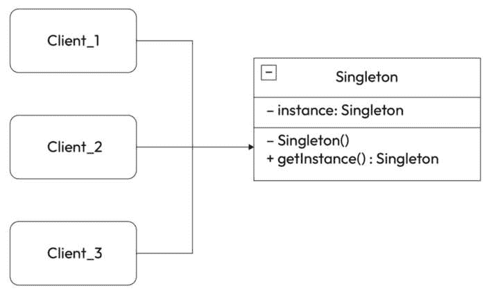
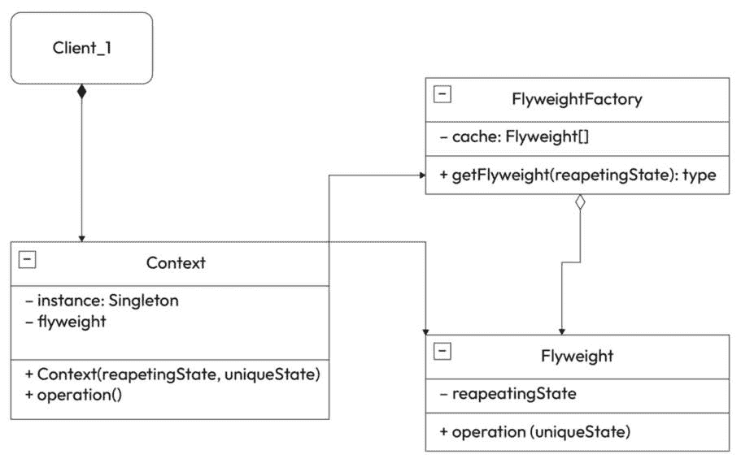
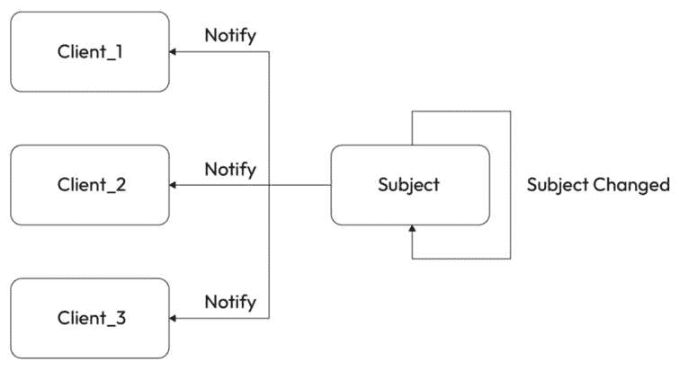

# 2

# 为 Unity 游戏开发编写干净和模块化的 C#代码

欢迎来到*第二章*，我们将重点介绍为 Unity 游戏开发编写干净和模块化 C#代码的重要性。在接下来的页面中，您将学习编写清晰和高效代码的实用技能。我们将涵盖干净代码原则，强调可读性的重要性，并介绍行业最佳实践。您还将探索协作的约定和代码结构。此外，我们将深入研究重构和优化技术，以增强您的 C#代码的性能和可扩展性。到本章结束时，您将具备有效地编写、文档化、重构和优化 C#代码的专业知识，为成功的 Unity 游戏开发打下坚实的基础。

在本章中，我们将涵盖以下主要主题：

+   编写干净代码的介绍

+   C#代码约定和可读性

+   C#代码重构和优化技术

# 技术要求

为了跟随我在本章中的学习，您需要以下内容：

+   **Unity 版本 2022.3.13**: 下载并安装 Unity 版本 2022.3.13 或任何其他版本。建议安装 2022 版本。

+   **主要 IDE – Visual Studio 2022**: 确保已安装 Visual Studio 2022 以获得最佳学习体验。

+   **代码样本的 GitHub 仓库**: 您可以从我们的 GitHub 仓库访问本章的代码样本和项目文件：[`github.com/PacktPublishing/Mastering-Unity-Game-Development-with-C-Sharp/tree/main/Assets/Chapter%2002`](https://github.com/PacktPublishing/Mastering-Unity-Game-Development-with-C-Sharp/tree/main/Assets/Chapter%2002)。克隆或下载仓库，以便轻松访问本章中展示的代码。

# 编写干净代码的介绍

干净代码指的是组织良好、易于阅读和理解的代码。它就像写一个清晰的故事，任何人都可以跟随而不会迷失在令人困惑的术语或混乱的段落中。

在软件开发中，干净代码非常重要。首先，它使团队中的每个人都更容易理解代码，帮助他们顺利合作。其次，它节省了时间，因为当出现问题需要修复时，干净代码更简单。最后，它就像有一个干净的房间——它感觉更好，并且从长远来看更容易管理。在这个列表中，我们强调了采用干净代码的重要性：

+   **构建 AAA 游戏**: 在您的编码之旅中是否遇到过“干净代码的力量”？好吧，它就像是烹饪高质量代码的秘密酱料，尤其是在您致力于创建顶级 AAA 游戏时。干净代码是构建在行业中脱颖而出的游戏的关键成分。

+   **与他人合作**：在编码的世界里，我们永远不会孤单。无论你是公司中高标准的一部分，还是在项目上进行合作，清晰的代码心态是你的无声伴侣。你可能没有意识到你正在使用它，但只要有一点知识，你就可以通过使你的代码对团队中的每个人来说都清晰易懂，来在行业中脱颖而出。

+   **在应用清晰代码时的灵活性**：本章的目标不是强迫你在每次都使用所有这些清晰的代码原则。有时你需要先进行编码，然后再进行整理。这些不是严格的规则；它们更像是在需要时可以取出的工具。如果一个功能很熟悉，你知道如何使用 SOLID 等原则来实现它，那就去做吧。但如果你不确定，从基础开始，完善你的代码，以便你能够更清楚地了解需要什么。

+   **每个程序员的挣扎**：想象一下：你厌倦了无休止的编码和更新，在编码过程中遇到问题。更改一个功能变成了一场头痛，尤其是当代码变成一个混乱的拼图时。与测试人员打交道就像是一个永无止境的修改循环。如果这听起来很熟悉，你并不孤单。本章将指导你克服代码维护和更新的挑战。

+   **讲述故事的代码**：有没有编写过一段代码，然后完全忘记了它的用途？这种情况发生在我们所有人身上。本章旨在教你如何编写讲述故事的代码——一个清晰易懂、易于跟随的故事，不会让你在以后挠头。

+   **模块化和效率技巧**：准备好一些关于如何使你的代码模块化和高效的技巧和窍门。我将带你了解一些基本原则，并展示如何在现实场景中应用它们。此外，我们将深入研究示例——混乱的代码与清晰的代码——对于每个清晰的代码原则，给你一个在实际项目中实施这些想法的实际理解。

清晰的代码对于构建更好的软件至关重要。通过理解其重要性，你将更好地装备自己，以编写清晰、易懂和有效的代码。在下一节中，我们将了解编写清晰代码的原则。

# 编写清晰代码的原则

在面向对象编程（**OOP**）的世界里，清晰的代码建立在五个关键原则的基础上，被称为**SOLID**。这些原则作为指导灯，帮助我们编写不仅功能性强，而且以下方面的代码：

+   **易于阅读和理解**：任何拿起你的代码的人都应该能够不费太多力气就理解其目的和逻辑。

+   **可维护性**：修改和更新应该变得轻而易举，即使是对代码历史不熟悉的人也是如此。

+   **可扩展性和可重用性**：在现有代码的基础上构建应该是直截了当的，促进代码重用，减少冗余。

让我给你讲一个故事。在我发现 SOLID 原则之前，我经常发现自己很难想出如何构建功能。到达终点就像一场混乱、杂乱无章的旅程。然后，SOLID 原则出现了，一切都变了。它就像一张地图，帮助我把思想和代码组织成清晰、结构化的路径。

但 SOLID 不仅仅是一个编写干净代码的工具；它赋予了我成为一个更好的问题解决者的能力。它将我的思维方式从“努力尝试”转变为“创造解决方案”。我从与代码搏斗的人变成了创造优雅解决方案的人。

作为软件开发者，我们的工作是解决问题。SOLID 成为你在这一战斗中的秘密武器。它为你提供了应对大多数挑战的框架。

然而，仅仅阅读关于 SOLID 的内容是不够的。真正的学习来自于自己应用它。拿起你现有的代码，深入其中！尝试将 SOLID 原则融入其中，看看它们如何改变你的工作。相信我，实践的经验将巩固你的理解，并解锁全新的开发技能层次。

## 单一职责原则（SRP）

让我们讨论一下在游戏开发背景下**单一职责原则**（**SRP**）。SRP 建议一个类应该只有一个改变的理由，这意味着它应该只有一个责任。在游戏世界中，这转化为确保每个组件或类只负责游戏的一个方面，使代码库更加模块化和易于维护。

当我们开始编码时，通常会将所有逻辑都塞进一个承担许多工作的巨大类中。试图修复一个问题而不会弄乱该类中的其他事物或引入最终导致其他部分行为异常的新逻辑，这变得很棘手。

让我们从玩家控制器脚本的一个例子开始，它结合了各种责任，然后重构它以符合 SRP。

在下面的代码块中，我们可以看到旧的`PlayerController`类，它承担了许多责任：

```cs
public class PlayerController : MonoBehaviour
{
    private Animator playerAnimator;
    private RigidBody rigidBody;
    private void Start()
    {
        playerAnimator = GetComponent<Animator>();
        rigidBody = GetComponent<RigidBody>();
    }
    private void Update()
    {
        // Logic for handling animations
        playerAnimator.SetBool("IsRunning",playerInput.IsRunning());
        // Logic for handling player input
        if (Input.GetKeyDown(KeyCode.Space))
        {
            rigidBody.AddForce(Vector3.up * jumpForce, ForceMode.Impulse);
        }
        // Logic for handling player movement
    }
}
```

让我们将这个大类拆分成更小的类，每个类都有自己的动作集。

在下面的代码块中，我们可以看到负责处理玩家动画的`PlayerAnimation`类：

```cs
public class PlayerAnimation : MonoBehaviour
{
    private Animator animator;
    private void Start()
    {
        animator = GetComponent<Animator>();
    }
    public void UpdateAnimation(bool isRunning)
    {
        animator.SetBool("IsRunning", isRunning);
    }
}
```

在下面的代码块中，我们可以看到`PlayerMovement`类，它负责处理玩家移动，以及`PlayerInput`类，它负责处理玩家输入：

```cs
public class PlayerMovement : MonoBehaviour
{
    public void Move(float horizontalInput)
    {
        // Logic for moving the player based on input
    }
     public void Jump()
    {
        // Logic for jumping the player based on input
    }
}
public class PlayerInput : MonoBehaviour
{
    public float HorizontalInput()
    {
        return Input.GetAxisRaw("Horizontal");
    }
    public bool IsJumping()
    {
        // Logic for determining if the player is jumping
        return Input.GetKeyDown(KeyCode.Space);
    }
    public bool IsRunning()
    {
        // Logic for determining if the player is running
        return Input.GetKey(KeyCode.LeftShift);
    }
}
```

在下面的代码块中，我们可以看到`PlayerController`类作为协调者，委托责任：

```cs
public class PlayerController : MonoBehaviour
{
    private PlayerAnimation playerAnimation;
    private PlayerInput playerInput;
    private PlayerMovement playerMovement;
    private void Start()
    {
        playerAnimation = GetComponent<PlayerAnimation>();
        playerInput = GetComponent<PlayerInput>();
        playerMovement = GetComponent<PlayerMovement>();
    }
    private void Update()
    {
        playerMovement.Move(playerInput.HorizontalInput());
        if (playerAnimation != null)
        {
            playerAnimation.UpdateAnimation(playerInput.IsRunning());
        }
        if (playerInput.IsJumping())
        {
            playerMovement.Jump();
        }
    }
}
```

在`PlayerController`类的这个简化版本中，我们为移动、输入处理和动画分别创建了类，使`PlayerController`更加专注，并符合 SRP。每个类处理其特定的责任，增强了代码的组织性和清晰度。

## 开放-封闭原则（OCP）

让我们探讨在游戏开发背景下**开放封闭原则**（**OCP**）。OCP 提倡一个类应该对扩展开放，同时对修改封闭。在游戏开发的背景下，这意味着能够在不修改现有代码的情况下引入新的功能或功能。这个原则在增强代码灵活性和可维护性方面发挥着关键作用，允许无缝地添加新元素到游戏中，而不会破坏现有的框架。

**增强功能困境**的一个例子如下。

想象一下，在你的游戏中有一个基本的增强功能系统，可以增加分数。使用 OCP，你可以创建一个具有常见功能的基础`PowerUp`类，例如激活和持续时间。然后，你可以为不同的特定增强功能创建子类，例如双跳或临时无敌。

这样，添加一个新的功能增强需要创建一个新的子类，而不需要修改现有的代码。你不会陷入一个僵化的系统——可能性是无限的！

OCP 允许你构建灵活、适应性强、易于维护的游戏。这就像拥有一个设计精良的构建套件，让你可以无限制地创建和扩展你的游戏世界。

在下面的代码块中，我们可以看到具有常见功能的基础`PowerUp`类：

```cs
public abstract class PowerUp
{
    public abstract void Activate(); // Common activation logic
    public abstract void Deactivate(); // Common deactivation logic
}
```

在下面的代码块中，我们可以看到`DoubleJumpPowerUp`的子类：

```cs
public class DoubleJumpPowerUp : PowerUp
{
    public override void Activate()
    {
        // Specific activation logic for double jump
    }
    public override void Deactivate()
    {
        // Specific deactivation logic for double jump
    }
}
```

在下面的代码块中，我们可以看到`TemporaryInvincibilityPowerUp`的子类：

```cs
public class TemporaryInvincibilityPowerUp : PowerUp
{
    public override void Activate()
    {
        // Specific activation logic for temporary invincibility
    }
    public override void Deactivate()
    {
        // Specific deactivation logic for temporary invincibility
    }
}
```

在下面的代码块中，我们可以看到`PowerUpManager`类正在使用增强功能：

```cs
public class PowerUpManager : MonoBehaviour
{
    private void Start()
    {
        // Example of using the power-up system
        PowerUp doubleJump = new DoubleJumpPowerUp();
        AddPowerUp(doubleJump);
        PowerUp invincibility = new TemporaryInvincibilityPowerUp();
        AddPowerUp(invincibility);
    }
    private void AddPowerUp(PowerUp powerUp)
    {
        powerUp.Activate();
        // Logic for adding power-up to the game
    }
    private void RemovePowerUp(PowerUp powerUp)
    {
        powerUp.Deactivate();
        // Logic for removing power-up from the game
    }
}
```

在这个 Unity 示例中，`PowerUp`类被扩展为特定的增强功能，如`DoubleJumpPowerUp`和`TemporaryInvincibilityPowerUp`。`PowerUp` **管理器**类展示了如何添加和移除增强功能，每个增强功能在激活和去激活时都会记录一条消息。这种结构允许在不修改现有代码的情况下添加新的增强功能，遵循 OCP。

现在，有趣的部分开始了！我们可以使用这个系统将每个增强功能子类连接到它自己的预制件。当玩家抓取一个增强功能时，只有与该预制件关联的特定增强功能会被激活。这意味着添加新的增强功能变得轻而易举——只需创建一个新的子类和它的预制件，然后就是了！你扩展了游戏的可能性，而没有触及核心逻辑。虽然这个原则不仅仅适用于增强功能，你还可以用它来处理敌人、物品、能力——天空才是极限！所以，勇敢地前进，用 OCP 的力量构建你的精彩游戏！

## Liskov 替换原则（LSP）

让我们探讨游戏开发领域内的**里氏替换原则**（**LSP**）。LSP 主张用子类对象替换超类对象不应破坏程序的正确性。在游戏开发的背景下，这意味着使用派生类（子类）应无缝集成，而不损害基类的预期功能。这个原则确保了类之间的平滑可替换性，在游戏开发场景中提供了灵活性和易用性。

*潜行敌人困境*的一个例子如下。

假设你有一个名为`Enemy`的基类，它具有基本的移动和攻击行为。然后你创建了两个子类：`GroundEnemy`和`FlyingEnemy`。LSP 确保这两个子类都表现出预期的敌人行为，以符合`Enemy`基类的定义进行移动和攻击。这意味着任何设计用于处理敌人的代码，如碰撞检测或伤害计算，都将无缝地与`GroundEnemy`和`FlyingEnemy`实例一起工作。这种一致性简化了开发，并允许你专注于为每个子类创建独特的行为，而无需担心破坏核心功能。

在下面的代码块中，我们可以看到`Enemy`类的基类：

```cs
public class Enemy : MonoBehaviour
{
    public virtual void Move()
    {// Basic movement logic for all enemies
    }
    public virtual void Attack()
    {// Basic attack logic for all enemies
    }
}
```

在下面的代码块中，我们可以看到`GroundEnemy`的子类：

```cs
public class GroundEnemy : Enemy
{
    public override void Move()
    {// Specific movement logic for ground enemies
    }
    public override void Attack()
    {// Specific attack logic for ground enemies
    }
}
```

在下面的代码块中，我们可以看到`FlyingEnemy`的子类：

```cs
public class FlyingEnemy : Enemy
{
    public override void Move()
    {// Specific movement logic for flying enemies
    }
    public override void Attack()
    {// Specific attack logic for flying enemies
    }
}
```

在下面的代码块中，我们可以看到演示 LSP 的`EnemyManager`类：

```cs
public class EnemyManager : MonoBehaviour
{
    void Start()
    {
        // Creating instances of GroundEnemy and FlyingEnemy
        Enemy groundEnemy = new GroundEnemy();
        Enemy flyingEnemy = new FlyingEnemy();
        // Using LSP, treating both enemies as base class
        groundEnemy.Move();
        groundEnemy.Attack();
        flyingEnemy.Move();
        flyingEnemy.Attack();
    }
}
```

在这个 Unity 示例中，`Enemy`类作为基类，具有基本的移动和攻击方法。`GroundEnemy`和`FlyingEnemy`子类扩展了基类，并为移动和攻击提供了特定的实现。`EnemyManager`类通过将两个子类的实例都视为基类的实例来演示 LSP，确保编写用于处理敌人的代码可以无缝地与`GroundEnemy`和`FlyingEnemy`实例一起工作。

## LSP（里氏替换原则）和 OCP（开闭原则）之间的区别是什么？

在游戏开发中，LSP 和 OCP 之间的关键区别在于它们的关注点和应用。

LSP 确保派生类可以无缝地替换其基类而不影响程序行为。在游戏中，这意味着不同类型的敌人（例如，地面和飞行敌人）应该是可互换的，而不会破坏预期的功能。

OCP 鼓励设计那些对扩展开放但对修改关闭的类。在游戏开发中，这允许在不更改现有代码的情况下添加新功能（例如，新类型的武器），从而促进灵活性和可维护性。

为了更好地说明它们的区别，这里有一个例子。在一个游戏系统中，考虑一个武器的基础类。遵循 LSP 允许在不破坏预期行为的情况下替换特定的武器类型，而遵循 OCP 则允许在不修改现有代码的情况下扩展系统以添加新的武器。

## 接口隔离原则 (ISP)

现在，让我们谈谈游戏世界中的**接口隔离原则**（**ISP**）。ISP 建议一个类不应该被要求去做它不需要做的事情。简单来说，它鼓励创建小型的、任务特定的接口，而不是大型的、通用的接口。在游戏开发的情况下，这意味着设计适合每个类特定需求的接口。这有助于保持事情清晰，使代码更加专注，并允许在游戏开发中更容易地进行维护和更改。

让我们看看 NPC 接口困境的一个例子。

想象一下，在你的游戏中，每个 NPC 都有各种功能，比如漫步、交谈和交易。应用 ISP 确保每个 NPC 只需要实现与其特定行为相关的接口，避免不必要的函数。

*没有 ISP*，在下面的代码块中，我们可以看到`INPC`接口，它为所有 NPC 提供了通用方法，以及`FriendlyNPC`和`AggressiveNPC`类，它们实现了`INPC`：

```cs
public interface INPC
{
    void Wander();
    void Talk();
    void Trade();
}
public class FriendlyNPC : INPC
{
    public void Wander() { /* Implementation */ }
    public void Talk() { /* Implementation */ }
    public void Trade() { /* Implementation */ }
}
public class AggressiveNPC : INPC
{
    // Unnecessary implementations for Wander and Trade
    public void Wander() { /* Unnecessary Implementation */ }
    public void Talk() { /* Implementation */ }
    public void Trade() { /* Unnecessary Implementation */ }
}
```

*应用 ISP*，在下面的代码块中，我们将根据功能分离接口，`FriendlyNPC`和`AggressiveNPC`类将实现相关的接口：

```cs
public interface IWanderable
{
    void Wander();
}
public interface ITalkable
{
    void Talk();
}
public interface ITradable
{
    void Trade();
}
public class FriendlyNPC : IWanderable, ITalkable, ITradable
{
    public void Wander() { /* Implementation */ }
    public void Talk() { /* Implementation */ }
    public void Trade() { /* Implementation */ }
}
public class AggressiveNPC : ITalkable
{
    public void Talk() { /* Implementation */ }
}
```

在这个修改后的例子中，应用 ISP 导致为不同的 NPC 功能创建了单独的接口。现在，每种 NPC 类型（友好或攻击性）现在只能实现与其行为相关的接口，避免了实现不必要的函数。这使得系统更加模块化和适应性强，因为不同的 NPC 类型可以遵循它们特定的接口，而不会受到无关方法的负担。

## 依赖倒置原则 (DIP)

让我们讨论一下在游戏开发中的**依赖倒置原则**（**DIP**）。DIP 建议高层模块（例如，游戏逻辑）不应该依赖于低层模块（例如，特定实现），而两者都应该依赖于抽象（例如，接口或抽象类）。此外，它还促进细节应该依赖于抽象，而不是相反。

让我们来看一个武器管理困境的例子。

考虑一个游戏，其中`WeaponManager`负责处理玩家使用的不同类型的武器。如果不遵循 DIP，`WeaponManager`可能会直接实例化和管理特定的武器类，例如手枪和步枪。然而，应用 DIP 会改变这一情况。现在，`WeaponManager`依赖于一个抽象，比如说`IWeapon`，它代表了所有武器的共同功能。

在下面的代码块中，我们可以看到高级模块以及没有使用 DIP 的低级模块：

```cs
public class WeaponManager
{
    private Pistol pistol;
    private Rifle rifle;
    public WeaponManager()
    {
        pistol = new Pistol();
        rifle = new Rifle();
    }
    public void UseWeapons()
    {
        pistol.Fire();
        rifle.Fire();
    }
}
public class Pistol
{
    public void Fire() { /* Implementation */ }
}
public class Rifle
{
    public void Fire() { /* Implementation */ }
}
```

*使用 DIP（依赖倒置原则）*，在下面的代码块中，我们可以看到高级模块和低级模块实现了抽象：

```cs
public interface IWeapon
{
    void Fire();
}
public class WeaponManager
{
    private readonly List<IWeapon> weapons;
    public WeaponManager(List<IWeapon> weapons)
    {
        this.weapons = weapons;
    }
    public void UseWeapons()
    {
        foreach (var weapon in weapons)
        {
            weapon.Fire();
        }
    }
}
public class Pistol : IWeapon
{
    public void Fire() { /* Implementation */ }
}
public class Rifle : IWeapon
{
    public void Fire() { /* Implementation */ }
}
```

在这个例子中，应用 DIP 允许`WeaponManager`依赖于抽象（`IWeapon`），使得在不修改高级模块的情况下，可以轻松地扩展新的武器类型。这种灵活性在游戏开发中至关重要，因为随着时间的推移，可能会添加新的功能和组件，而不会破坏现有代码。

在 Unity 中实现 SOLID 原则对于实现模块化的 C#代码至关重要，这是有效软件设计的关键方面。SOLID 原则通过将系统分解为自包含的组件来促进模块化，使得代码不仅易于理解、维护和测试，而且符合 LSP（里氏替换原则）。

模块化的重要性在于其增强代码组织的能力。应用 SRP（单一职责原则）确保每个模块只有一个职责，促进专注和模块化的代码库。OCP（开闭原则）支持在不更改现有模块的情况下扩展代码，允许无缝添加新功能。LSP（里氏替换原则）确保派生类可以在不影响程序行为的情况下替换其基类，促进了 Unity 代码的一致性和可预测性。

在 Unity 开发中，有效的代码组织涉及深思熟虑地使用命名空间和类。ISP（接口隔离原则）将接口定制为特定功能，促进简洁和模块化的设计。**依赖注入**（**DI**），由 DIP 倡导，创建了松散耦合的模块，增强了适应性。总之，SOLID 原则，包括 LSP，指导了 Unity 中模块化和灵活的 C#代码的创建，确保了健壮、可维护和一致的代码库。在下一节中，我们将探讨游戏开发中的设计模式，并学习如何在我们的代码库中有效地实现它们。

# 理解游戏开发中的设计模式

设计模式是解决软件开发中常见问题的既定解决方案。在游戏开发中，它们为构建健壮、可维护和高效的游戏提供了宝贵的工具。下一节将概述设计模式及其类型。

有许多设计模式，每种都适用于特定的情况。以下是游戏开发中常见的一些类型。

## 创建型模式

创建型模式是一组设计模式，它们提供了结构化的对象创建方法，确保了灵活性和可重用性，同时保持了对象创建和使用代码之间的清晰分离。以下是一些这些模式：

+   **单例模式**：确保在整个游戏过程中只存在一个类的实例。对于全局对象，如游戏管理器或音频播放器，非常有用。

+   **工厂方法模式**：创建对象而不指定确切的类，促进灵活性和代码重用。

+   **对象池**：预先分配和重用对象以提高性能，特别是对于经常创建的对象，如炮弹或敌人。

## 结构模式

结构模式关注于组织类和对象以形成更大的结构，从而在管理系统内实体之间的复杂关系时提供更好的组合和灵活性。以下是一些这些模式：

+   **享元模式**：通过在它们之间转换调用，使不兼容的接口协同工作。对于集成外部库或自定义代码非常有用。

+   **装饰器**：动态地向对象添加功能，而不需要通过子类化它，从而促进灵活的对象行为。

## 行为模式

行为模式关注于系统内对象之间的通信和交互，侧重于对象如何协作和分配责任以实现期望的行为和功能。这些模式有助于管理算法、关系和责任，以促进软件设计中的灵活性和可扩展性。以下是一些这些模式：

+   **观察者**：允许对象订阅并通知其他对象的变化，促进通信和事件处理。

+   **策略模式**：定义了一组算法，并将它们封装起来，以便在运行时进行切换。对于处理不同的玩家动作或敌人行为非常有用。

+   **状态**：封装了基于对象内部状态的行为，允许根据状态进行行为变化。对于处理角色状态，如行走、跳跃或攻击，非常有用。

在接下来的几节中，我们将讨论每种类型的一个设计模式。

### 单例设计模式

单例模式确保一个类只有一个实例，并在整个应用程序中提供一个全局访问点到该实例。*图 2**.1*展示了单例结构：



图 2.1 – 单例设计模式结构

在下面的代码块中，你可以看到 Unity 中 Singleton 实现的示例：

```cs
public class GameManager : MonoBehaviour
{
    // Static reference to the instance
    private static GameManager _instance;
    // Public property to access the instance
    public static GameManager Instance
    {
        get
        {
            if (_instance == null)
            {
                // If the instance is null, create a new instance
                _instance = new GameObject("GameManager").AddComponent<GameManager>();
            }
            return _instance;
        }
    }
    // Other GameManager properties and methods
    public void StartGame()
    {
        Debug.Log("Game Started!");
    }
}
```

在下面的代码块中，我们可以看到单例模式的使用示例：

```cs
public class PlayerController : MonoBehaviour
{
    private void Start()
    {
        // Accessing the GameManager instance
        GameManager.Instance.StartGame();
    }
}
```

在这个例子中，`GameManager`是一个单例，负责管理游戏状态。`PlayerController`类访问单个实例以启动游戏。虽然单例提供了全局访问和延迟初始化的好处，但开发人员应仔细考虑潜在的缺点，尤其是在大型项目中。

以下是一些使用单例模式的优点：

+   **全局访问**：提供一个单一的全局访问点来管理和控制游戏中的特定方面，例如游戏状态或设置

+   **延迟初始化**：实例仅在首次需要时创建，直到需要时才节省资源

+   **易于实现**：Singleton 模式易于实现且广为人知，这使得开发者容易理解和使用

使用 Singleton 模式的一些缺点如下：

+   **全局状态**：Singletons 引入了全局状态，过度使用可能导致紧密耦合和难以管理的全局状态

+   **滥用可能性**：开发者可能会过度使用 Singletons，导致全局实例的激增，从而减少封装的好处

+   **难以测试**：依赖于 Singletons 的代码测试可能具有挑战性，因为全局状态可能会影响单元测试的结果

然而，存在一个原则来解决 Singleton 问题，它被称为依赖注入。

DI 是一种设计模式，通过提供对象依赖项而不是让它们创建依赖项来解决与紧密耦合和全局状态相关的担忧。在 Unity 中，这通常通过构造函数注入或属性注入来实现。

以下是一些依赖注入（DI）的好处：

+   **减少耦合**：通过注入依赖项，类对特定实现的依赖性降低，减少了紧密耦合

+   **可测试性**：具有注入依赖项的类通常更容易测试，因为你可以为这些依赖项提供模拟或特定于测试的实现

+   **灵活性**：可以注入依赖项的不同实现，从而在不修改现有代码的情况下轻松交换组件

DI 可以通过以下方式帮助缓解与 Singleton 模式相关的一些问题：

+   **减少全局状态**：通过注入依赖项，你可以避免创建全局 Singletons，从而减少应用程序中的整体全局状态

+   **易于测试**：依赖于注入依赖项的代码通常更容易测试，因为你可以用模拟对象或特定于测试的实例替换真实实现

+   **提高模块化**：依赖注入鼓励模块化设计，其中组件松耦合，这使得理解和维护代码库更容易

Singleton 设计模式提供了一个类全局可访问的唯一实例，提供了便利，但可能导致紧密耦合和测试困难等问题。依赖注入（DI）通过允许对象从外部获得其依赖项来解决这些担忧，减少了对外部状态的依赖。这促进了松耦合，增强了可测试性，并通过解耦组件和简化对象生命周期的管理来提高代码的可维护性。

### Flyweight 设计模式

Unity 中的 Flyweight 模式提供了一种通过在多个对象间共享公共数据来优化内存使用的解决方案。它允许你通过外部存储共享数据并在需要时引用它来高效地管理资源。*图 2.2*展示了 Flyweight 的结构：



图 2.2 – Flyweight 设计模式结构

在下面的代码块中，您将看到一个可以应用 Flyweight 模式的示例场景。

`IWeapon` 接口代表了武器的共享属性和行为：

```cs
 // Flyweight interface for weapons
public interface IWeapon
{
    void Fire();
}
```

`Weapon` 类实现了 `IWeapon` 接口，并作为一个具体的 Flyweight 类，代表单个武器：

```cs
// Concrete flyweight class for shared weapon properties
public class Weapon : IWeapon
{
     private string name;
     private int damage;
     private string sound;
     public Weapon(string name, int damage, string sound)
     {
         this.name = name;
         this.damage = damage;
         this.sound = sound;
     }
     public void Fire()
     {
          Debug.Log($"{name} fired - Damage: {damage} - Sound: {sound}");
     }
}
```

`WeaponFactory` 类作为 Flyweight 工厂，根据特定的键（例如，武器类型）管理和重用 flyweight 对象：

```cs
// Flyweight factory class to manage and reuse flyweight objects
public class WeaponFactory
{
    private Dictionary<string, IWeapon> weapons;
    public WeaponFactory()
    {
        weapons = new Dictionary<string, IWeapon>();
    }
    public IWeapon GetWeapon(string key)
    {
        if (!weapons.ContainsKey(key))
        {
            switch (key)
            {
                case "pistol":
                    weapons[key] = new Weapon("Pistol", 30, "Bang!");
                    break;
                case "shotgun":
                    weapons[key] = new Weapon("Shotgun", 50, "Boom!");
                    break;
                case "rifle":
                    weapons[key] = new Weapon("Rifle", 40, "Pew Pew!");
                    break;
                default:
                    throw new ArgumentException("Invalid weapon key");
            }
        }
        return weapons[key];
    }
}
```

`GameClient` 类展示了如何使用从工厂检索的 flyweight 对象，展示了 Flyweight 模式的可重用性和内存效率：

```cs
public class GameClient : MonoBehaviour
{
    void Start()
    {
        WeaponFactory weaponFactory = new WeaponFactory();
        // Using flyweight objects
        IWeapon pistol = weaponFactory.GetWeapon("pistol");
        pistol.Fire();
        IWeapon shotgun = weaponFactory.GetWeapon("shotgun");
        shotgun.Fire();
        IWeapon rifle = weaponFactory.GetWeapon("rifle");
        rifle.Fire();
        // Reusing flyweight objects
        IWeapon anotherPistol = weaponFactory.GetWeapon("pistol");
        anotherPistol.Fire();
    }
}
```

此示例模拟了一个游戏场景，其中不同类型的武器被表示为 flyweight 对象，工厂有效地管理这些共享对象以优化内存使用并提高性能。

以下使用 Flyweight 模式的优点：

+   **内存优化**：通过共享常见数据，该模式减少了内存消耗，特别是对于大量类似对象。

+   **提高性能**：共享减少了创建和管理冗余数据的开销，从而提高了性能

+   **简化代码**：分离共享和独特数据，促进更干净、更易于维护的代码

以下使用 Flyweight 模式的缺点：

+   **复杂性**：实现 Flyweight 模式引入了额外的复杂性，尤其是在管理共享和独特状态时

+   **潜在开销**：虽然该模式提高了内存和性能，但它可能由于管理共享资源而引入开销

尽管有这些考虑，Flyweight 模式仍然是 Unity 项目中有效资源管理的宝贵工具，尤其是在需要内存优化的类似对象场景中。

### Observer 设计模式

Unity 中的 Observer 模式通过允许对象订阅事件并在事件发生时接收通知，促进了对象之间的松耦合。这样，对象可以响应变化，而无需了解引发事件的特定对象细节。

*图 2**.3* 展示了 Observer 的结构。



图 2.3 – Observer 设计模式结构

让我们在 Unity 中创建一个简单的示例，以演示使用 Observer 模式实现健康系统的实现。

在下面的代码块中，我们可以看到 `IHealthObserver` Observer 接口和 `IHealthSubject` 主题接口：

```cs
// Observer interface
public interface IHealthObserver
{
    void OnHealthChanged(int health);
}
// Subject interface
public interface IHealthSubject
{
    event Action<int> OnHealthChanged;
}
```

在下面的代码块中，我们可以看到 `HealthManager` 类实现了 `IHealthSubject`：

```cs
public class HealthManager : MonoBehaviour, IHealthSubject
{
    private int currentHealth;
    public int MaxHealth { get; private set; } = 100;
    // Event to notify observers when health changes
    public event Action<int> OnHealthChanged;
    private void Start()
    {
        currentHealth = MaxHealth;
    }
    // Method to damage the character
    public void TakeDamage(int damage)
    {
        currentHealth -= damage;
        currentHealth = Mathf.Clamp(currentHealth, 0, MaxHealth);
        // Notify observers about the health change
        OnHealthChanged?.Invoke(currentHealth);
        // Check for death condition
        if (currentHealth == 0)
        {
            Debug.Log("Character has died!");
            // Additional logic for character death...
        }
    }
}
```

在下面的代码块中，我们可以看到 `UIObserver` 类实现了 `IHealthObserver`：

```cs
public class UIObserver : MonoBehaviour, IHealthObserver
{
    public void OnHealthChanged(int health)
    {
        // Update UI elements based on the received health value
        Debug.Log($"Health UI Updated: {health}");
        // Additional UI update logic...
    }
}
```

在下面的代码块中，我们可以看到 `GameplayObserver` 类实现了 `IHealthObserver`：

```cs
public class GameplayObserver : MonoBehaviour, IHealthObserver
{
    public void OnHealthChanged(int health)
    {
        // Update gameplay mechanics based on the received health value
        Debug.Log($"Gameplay Updated: {health}");
        // Additional gameplay update logic...
    }
}
```

在下面的代码块中，我们可以看到在 Unity 中 Observer 模式的使用示例：

```cs
public class GameExample : MonoBehaviour
{
    private void Start()
    {
        HealthManager healthManager = new HealthManager();
        UIObserver uiObserver = new UIObserver();
        GameplayObserver gameplayObserver = new GameplayObserver();
        // Register observers with the HealthManager
        healthManager.OnHealthChanged += uiObserver.OnHealthChanged;
        healthManager.OnHealthChanged += gameplayObserver.OnHealthChanged;
        // Simulate damage to the character
        healthManager.TakeDamage(20);
    }
}
```

在此示例中，`HealthManager`类代表主题，而`UIObserver`和`GameplayObserver`类代表观察者。当角色受到伤害时，`HealthManager`触发`OnHealthChanged`事件，通知所有已注册的观察者。每个观察者随后根据接收到的健康值更新其状态，展示了观察者模式的应用。

使用观察者模式的优点如下：

+   **提高解耦性**：对象不依赖于彼此的实现细节，促进松散耦合和模块化

+   **增强可维护性**：由于事件处理是集中的，并且观察者是解耦的，因此代码更容易理解和修改

+   **增加灵活性**：允许动态地添加和删除观察者，使系统更能适应不断变化的需求

使用观察者模式的缺点如下：

+   **增加复杂性**：与直接通信相比，引入了额外的抽象层，这可能会略微增加代码复杂性

+   **性能开销**：事件处理涉及方法调用和可能的数据传输，这可能导致一些性能开销

总体而言，观察者模式是 Unity 中促进对象间通信和管理动态变化的有力工具。在涉及事件驱动行为的多数情况下，松散耦合和灵活性的好处超过了缺点。

此外，这里还有一些 Unity 中观察者模式的其它应用：

+   为角色和敌人实现状态机

+   根据游戏状态的变化（例如，得分、等级和库存）更新 UI 元素

+   根据游戏中的特定事件触发动画或音效

记住，您可以在 GitHub 上找到所有示例以供参考。

并非在所有代码中都必须使用这些模式。它们是解决常见问题的解决方案，但有时，实现模式可能会无谓地使事情复杂化。关键在于首先关注解决当前的问题，然后再寻找最佳解决方案。在下一节中，我们将深入探讨编码约定并探讨编写清晰代码的最佳实践。

# 编码约定和最佳实践

保持代码的一致性和清晰性对于有效的开发和协作至关重要。遵循公认的约定和最佳实践可以增强代码的清晰度、可维护性和可读性。以下是 C#编码的关键方面概述：

**C#命名约定**：理解和实现 C#命名约定对于保持代码一致性和清晰性至关重要。让我们深入了解命名变量、方法、类和命名空间的最佳实践，以确保我们的代码既易于阅读又具有表现力：

+   **变量**: 采用 **camelCase** (例如，**playerScore**, **enemyHealth**) 并选择描述性名称，传达变量的目的（例如，**currentLevel**, **isGameOver**）。除非广泛理解，否则避免缩写（例如，fps 代表每秒帧数）。

+   **方法**: 使用 **PascalCase** (例如，**StartGame**, **MovePlayer**) 并确保方法名称精确反映其功能。对于面向动作的方法使用动词（例如，**CalculateDamage**, **LoadLevel**）。

+   **类**: 使用 PascalCase 为类命名（例如，**Player**, **EnemyController**) 并避免使用通用名称，如 **MyClass** 或 **NewClass**。选择描述性名称，代表类的目的。

+   **命名空间**: 使用 PascalCase 为命名空间命名（例如，**MyGame.Characters**, **Utility.Math**) 并将代码组织成有意义的分层命名空间。

+   **有意义的和描述性的名称**: 构建有意义的和描述性的名称是编写清晰易懂代码的基本要素。让我们探讨选择名称的指南，这些名称能够准确传达变量目的和类型，避免歧义并提高代码可读性：

    +   选择准确反映所表示实体的名称。

    +   避免使用模糊的名称，如 **temp** 或 **data**。

    +   使用前缀和后缀来澄清变量类型（例如，**isJumping**, **playerPosition**）。

+   **代码格式化**: 掌握代码格式化是编写干净和有组织代码的基本方面。让我们探讨关键元素，如缩进、间距和注释，以增强编程工作中的可读性和结构：

    +   **缩进**: 使用一致的缩进来提高可读性和结构。

    +   **间距**: 在运算符、关键字和括号周围引入适当的间距。

    +   **注释**: 包含注释以阐明复杂逻辑、澄清算法和记录代码功能。

+   **错误处理和异常管理**: 错误处理和异常管理是软件开发的关键方面，确保在处理意外情况时具有鲁棒性和可靠性。让我们深入了解有效的策略，例如使用 **try-catch** 块和提供有意义的反馈，以优雅地管理错误并提高用户体验：

    +   实施健壮的错误处理，以优雅地管理意外情况。

    +   使用 **try-catch** 块来捕获异常并提供有意义的用户反馈。

    +   避免忽略错误以防止不可预测的行为。

+   **方法和类长度**: 当涉及到方法和类长度时，在简洁性和清晰性之间保持平衡对于培养可维护的代码库至关重要。让我们探讨保持方法和类简洁的同时确保它们保持专注和易于理解，从而提高代码的可读性和可维护性的策略：

    +   努力使方法和类简洁且专注。

    +   避免创建处理所有内容的“单体类”，这会使它们难以理解和维护。

    +   将复杂的功能提取到单独的方法中，以提高清晰度和可重用性

+   **额外最佳实践**：为了追求健壮和可维护的代码，除了基本准则之外，还需要接受额外的最佳实践。让我们深入了解策略：

    +   使用有意义的常量而不是魔法数字

    +   最小化全局变量的使用

    +   避免深层嵌套的代码和过多的缩进

在探索基本的编码约定和最佳实践的过程中，我们探讨了基本方面，如 C#命名约定，其中清晰和一致性是至高无上的。我们讨论了有意义的和描述性的名称的细微差别，掌握了代码格式的艺术，导航错误处理和异常管理，以及优化方法和类长度，同时发现了额外的最佳实践来改进代码库的健壮性和清晰度。

让我们通过示例探索一些重构技术。

## 重构技术

重构技术包括将长且复杂的方法分解成更小、更专注的函数，并消除重复代码，以遵循如**不要重复自己**（DRY）和**保持简单，傻瓜**（KISS）的原则，最终使 Unity 项目更加整洁和易于维护。

让我们看看 Unity 项目中可能表明需要重构的代码异味的一些例子。

### 示例 1：长且复杂的方法

在下面的代码块中，我们可以看到`PlayerController`类有一个长方法：

```cs
public class PlayerController : MonoBehaviour
{
    public void HandlePlayerInput()
    {
        // ... (code for handling input)
        if (isMoving)
        {
            // ... (code for player movement)
        }
        if (isShooting)
        {
            // ... (code for shooting logic)
        }
        // ... (more complex logic)
        if (isJumping)
        {
            // ... (code for jumping)
        }
        // ... (more code)
        if (isDucking)
        {
            // ... (code for ducking)
        }
        // ... (more code)
        if (isInteracting)
        {
            // ... (code for interacting with objects)
        }
        // ... (even more code)
    }
}
```

这里的代码异味是`HandlePlayerInput`方法过长，处理了多个任务，这使得维护变得困难。将其重构为针对特定玩家动作的较小、专用函数，例如移动、射击和跳跃。

*重构后*，在下面的代码块中，我们可以看到`PlayerController`类为每块逻辑都有方法，而不是一个大方法：

```cs
public class PlayerController : MonoBehaviour
{
    public void HandlePlayerInput()
    {
        HandleMovement();
        HandleShooting();
        HandleJumping();
        HandleDucking();
        HandleInteracting();
    }
    private void HandleMovement()
    {
        // ... (code for player movement)
    }
    private void HandleShooting()
    {
        // ... (code for shooting logic)
    }
    private void HandleJumping()
    {
        // ... (code for jumping)
    }
    private void HandleDucking()
    {
        // ... (code for ducking)
    }
    private void HandleInteracting()
    {
        // ... (code for interacting with objects)
    }
}
```

### 示例 2：重复代码

在下面的代码块中，我们可以看到`EnemyAI`类有重复的逻辑：

```cs
public class EnemyAI : MonoBehaviour
{
    public void AttackPlayer()
    {
        // ... (code for attacking player)
    }
    public void AttackAlly()
    {
        // ... (same code for attacking ally)
    }
    public void AttackBoss()
    {
        // ... (same code for attacking boss)
    }
}
```

这里的代码异味是攻击玩家、盟友和 Boss 的重复代码给维护带来了障碍。通过创建一个用于攻击的方法，并用不同的参数调用它来消除冗余。

*重构后*，在下面的代码块中，我们可以看到`EnemyAI`有用于攻击的通用代码：

```cs
public class EnemyAI : MonoBehaviour
{
    public void Attack(Entity target)
    {
        // ... (common code for attacking)
    }
    // Usage examples:
    // enemyAI.Attack(player);
    // enemyAI.Attack(ally);
    // enemyAI.Attack(boss);
}
```

这些重构示例遵循 DRY 和 KISS 原则，从而使得 Unity 代码更加整洁和易于维护。在接下来的几个要点中，我们将探讨 DRY 和 KISS 的定义：

+   **DRY 原则**：DRY 原则是一个软件开发概念，主张避免代码重复。它强调系统中的每一块知识或逻辑都应该有一个单一、明确的表示，以减少冗余。通过遵循 DRY，开发者旨在提高可维护性，减少错误发生的可能性，并提高代码的可读性。

+   **KISS 原则**：KISS 原则建议在设计决策中，简单性应是一个关键目标。它鼓励开发者优先选择简单、直接的解决方案，而不是复杂的解决方案。KISS 断言，简单性通常会导致更好的可理解性、可维护性，并降低出错的可能性。这个原则是对避免在解决问题时引入不必要的复杂性的提醒。

通过识别和解决 Unity 项目中的代码异味，我们确保代码更干净、更易于维护。通过例如分解长方法和消除重复代码的示例，我们遵循 DRY 和 KISS 原则，从而提高代码质量和可读性。

是时候展示你的知识了！尝试这些问题和挑战。

# 问题

+   编写干净代码的主要目标是什么？

+   实现一个单例模式来管理游戏设置，如音量、音乐音量和屏幕分辨率。确保在整个游戏中只有一个设置管理器实例。

+   创建一个单例得分管理器，用于跟踪玩家在多个游戏关卡或场景中的得分。确保得分管理器实例在场景变化之间保持持久。

+   在射击游戏中使用对象池实现轻量级模式，用于子弹。轻量级模式应有效地管理子弹对象的创建和重用，以最小化游戏过程中的内存开销。

+   设计一个轻量级模式，用于在 2D 游戏中渲染基于瓦片的地图。通过重用类似瓦片类型的轻量级瓦片对象（如草地、水域和岩石）来优化渲染过程。

+   开发一个基于观察者模式的系统，用于处理游戏中的事件，如玩家死亡、增益物品拾取和关卡完成。实现不同类型事件的观察者，并确保高效的事件广播。

+   创建一个观察者模式实现，根据游戏事件动态更新 UI 元素。例如，使用玩家健康变化、得分增加和物品拾取的观察者来更新生命值条、得分显示和库存图标。

+   结合单例、轻量级和观察者模式来设计玩家角色系统。使用单例模式处理玩家输入，使用轻量级模式高效管理玩家动画，使用观察者处理玩家状态变化（例如，健康、库存）。

+   设计一个游戏系统（例如，库存管理、任务追踪）并选择最合适的设计模式（单例、轻量级、观察者等）来实现系统的各个方面。根据 SOLID 原则和可扩展性来论证你的设计决策。

# 摘要

为了总结本章内容，请记住，编写整洁且组织良好的 C#代码对于成功的 Unity 游戏开发至关重要。你获得的一些技能，如合理命名事物和逻辑地排列代码，将使你的游戏创作之旅更加顺畅。保持简单并避免重复代码可以使你的工作更容易理解和维护。应用这些想法将导致代码清晰易懂的游戏，使你成为一个更高效和有效的游戏开发者。重要的是要注意，向干净代码和最佳实践迈进是一个持续的过程。你不必在每一个项目中应用所有原则，但持续地将它们融入你的编码思维中将随着时间的推移提高你的技能。

现在，准备好进入下一章，你将探索 Unity 插件。你将了解如何识别和评估各种类型的插件，并将它们无缝集成到你的项目中。这些知识将使你能够增强游戏功能，节省开发时间，并使用 C#实现新的机制。因此，准备好进入*第三章*，在那里你将扩展你的 Unity 工具集并提升你的游戏开发技能。
