# 使用 Unity 插件扩展功能

欢迎来到 *第三章*，我们将深入探讨 Unity 插件的世界。我们将探讨如何有效地将这些插件集成到您的项目中。本章旨在使您熟悉 Unity 生态系统中可用的不同类型插件，并指导您无缝地整合它们。通过掌握插件集成的基础知识，您将能够充分利用现有解决方案，增强游戏功能，并节省宝贵的发展时间。让我们开始探索，看看 Unity 插件如何显著提升您的游戏开发能力。

在本章中，我们将涵盖以下主要主题：

+   理解 Unity 插件

+   集成 Unity 插件

+   使用 Unity 插件的最佳实践

# 技术要求

您需要以下内容来跟随本章：

+   **Unity 版本 2022.3.13**：下载并安装 Unity 版本 2022.3.13 或任何其他版本。建议安装 2022 版本。

+   **主要 IDE – Visual Studio 2022**：确保已安装 Visual Studio 2022 以获得最佳学习体验。

+   **GitHub 代码示例仓库**：访问我们的 GitHub 仓库中的代码示例和项目文件：[`github.com/PacktPublishing/Mastering-Unity-Game-Development-with-C-Sharp/tree/main/Assets/Chapter%2003`](https://github.com/PacktPublishing/Mastering-Unity-Game-Development-with-C-Sharp/tree/main/Assets/Chapter%2003)。克隆或下载仓库，以便轻松访问本章中展示的代码。

# 理解 Unity 插件

在游戏开发的世界里，Unity 插件就像是开发者可以添加到他们的工具箱中的便捷工具。把它们想象成特殊的附加组件或额外功能，使构建游戏变得更加容易和有趣。

让我们在这里探讨这些可选升级如何提升您的游戏开发努力：

+   **对游戏开发的提升**：Unity 插件是游戏开发世界中的必备工具。这些紧凑的代码包作为 Unity 的宝贵补充，就像无缝集成到您游戏中的专用成分。由同行开发者打造，这些插件在 Unity 社区中慷慨共享，为所有人带来益处。

+   **Unity 插件在游戏开发中的重要性**：Unity 插件的吸引力在于它们能够轻松地增强游戏开发。想象一下：您正在构建一个游戏，您想象着拥有极其流畅的动作或令人叹为观止的特殊效果，如耀眼的爆炸。而不是与复杂的代码搏斗以实现这些元素，Unity 插件提供了一个解决方案。它们通过利用熟练开发者的专业知识来节省时间和精力，让您享受成果。

+   **扩展功能 – 将游戏提升到新的高度**：通过插件扩展功能就像赋予你的游戏超级能力。它超越了基础功能，允许你无需深入研究从头开始的所有复杂性，就能整合各种功能。这就像是给你的游戏升级，使其更加有趣和吸引人。

Unity 插件在游戏开发领域发挥着至关重要的作用，为开发者提供了一套工具箱，以增强 Unity 的功能。区分两个主要的插件类别至关重要：核心插件和额外插件。核心插件是 Unity 固有的，提供开箱即用的基础功能。另一方面，额外插件作为可选升级，允许你根据项目的具体需求定制工具箱。为了更好地理解这些区别，让我们考虑以下比较：

| **插件类型** | **描述** |
| --- | --- |
| 核心插件 | 随 Unity 预包装，提供基础功能 |
| 额外插件 | 根据特定项目需求可选的升级选项 |

在本章中，我们将优先考虑额外的插件，因为它们在增强项目方面发挥着至关重要的作用，深入探讨如何无缝扩展和集成它们到你的项目中。我们将重点关注**新的输入系统**和**Cinemachine**——作为重要的额外插件，它们是增强游戏而不深入研究核心功能的重要选择。

在下一节中，我们将开始介绍如何安装插件以及如何使用 C#脚本扩展它们。

# 集成 Unity 插件

让我们深入了解将外部插件无缝集成到 Unity 项目中的过程。发现这项技能如何解锁一个充满可能性的世界，通过精细的角色动作、电影般的视觉效果等，提升你的游戏开发体验。深入其中，提升你的项目。

我们将从新的输入系统及其如何用于处理角色的输入开始介绍。

## 新输入系统

Unity 通过两个系统处理输入：较旧的输入管理器，它是编辑器的一部分，以及较新的输入系统包。老旧的输入管理器是 Unity 核心的组成部分，如果你选择不安装输入系统包，它将直接可用。输入系统包提供了一个更新的视角，它允许你使用任何输入设备来控制你的 Unity 内容，取代了 Unity 的传统输入管理器。安装新的输入系统包非常简单——只需使用包管理器。我们将在本节中安装并使用它。

在以下表格中，我们将比较旧的输入系统与新的输入系统，突出它们的关键区别：

| **功能** | **旧** **输入管理器** | **新** **输入系统** |
| --- | --- | --- |
| 设备支持 | 限于键盘、鼠标和游戏手柄 | 针对所有设备的统一 API |
| 输入动作 | 基本按钮和轴映射 | 带有触发器和组合的复杂动作 |
| 架构 | 基于轮询的连续检查在固定时间间隔（如每帧）检测输入状态的变化，以实时响应用户操作 | 事件驱动依赖于基于用户操作的触发回调或事件，促进模块化和高效处理输入事件，无需连续轮询 |
| 性能 | 可能会缓慢 | 高效且响应迅速 |
| 可扩展性 | 封闭系统 | 开源且可扩展 |

对更多探索感到兴奋吗？期待下一节，我们将深入探讨配置系统、创建个性化动作和释放其全部潜力。

注意

请注意，新输入系统与 Unity 2019.4 及以上版本兼容，并需要.NET 4 运行时。使用旧.NET 3.5 运行时的项目不受支持。

在以下图中，您可以在**包管理器**中选择**输入系统**并安装它：

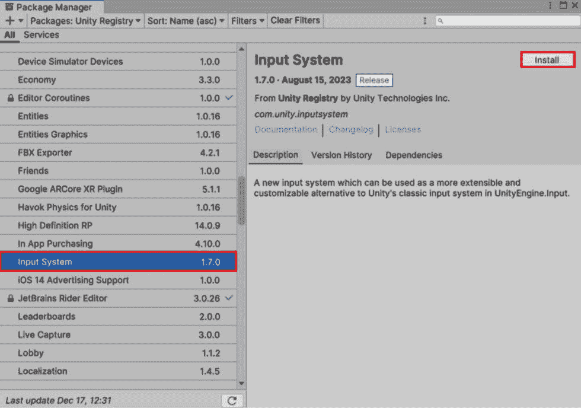

图 3.1 – 包管理器面板中的输入系统包

完成安装过程后，Unity 将询问您是否想要启用新后端。通过选择**是**，Unity 将启用新后端并禁用旧后端，Unity 编辑器将重新启动。您可以在以下图中看到**警告**信息：

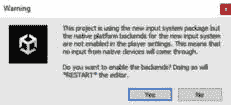

图 3.2 – 安装新输入系统后的警告信息

请注意，您可以选择同时启用旧系统和新系统。为此，将**Active Input Handling**设置为**Both**。

在**Player**设置中找到相关设置（导航至**Edit** | **Project Settings** | **Player**），具体在**Active Input Handling**下。您可以根据需要调整此设置；然而，请注意，进行更改将需要重新启动编辑器。

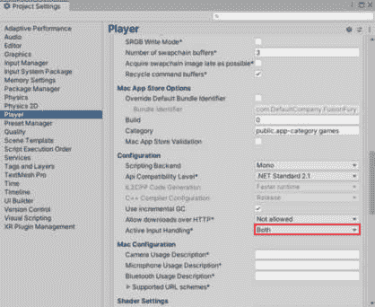

图 3.3 – 项目设置中的输入设置

现在我们已经介绍了新输入系统，让我们探索其实现。

### 实现 Unity 的新输入系统

在本小节中，我们的重点转向 Unity 新输入系统的实际应用。准备好通过我们引导的逐步实施过程进行动手学习。在本节结束时，您将具备将新输入系统无缝集成到 Unity 项目中的技能和知识，增强控制和响应性。让我们动手操作，一起深入了解实施此强大工具的实际步骤。

在 Unity 的新输入系统中，`InputActions` 对于定义和结构化输入控制（如键盘键、鼠标按钮和控制器输入）至关重要，这些控制绑定到特定的输入绑定，并组织成逻辑分组，称为 `PlayerInput` 组件。这些动作通过回调和事件集成到 GameObject 中，允许通过回调和事件高效地处理输入事件。InputActions 支持重新绑定和覆盖，使玩家能够自定义输入绑定，同时保持一个增强模块化和可重用性的输入系统架构，与 Unity 的传统输入系统相比。让我们使用新的输入系统。

1.  在你的项目文件夹内创建一个新的输入动作（**创建** | **输入动作**），如图所示：

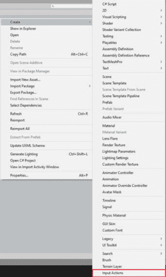

图 3.4 – 从创建面板选择输入动作

1.  然后，你可以打开这个输入动作，并会出现一个新的面板，如图所示：

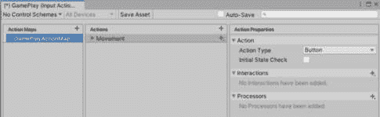

图 3.5 – 输入动作面板

1.  将**动作类型**值更改为**透传**和**控制类型**为**向量 2**，如图所示：

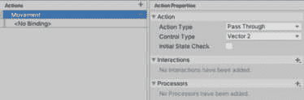

图 3.6 – 动作属性

1.  然后，选择添加移动的绑定，正如你在下一张图中可以看到的：

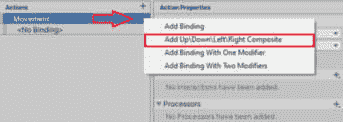

图 3.7 – 选择移动绑定

1.  在这里，你可以重命名移动绑定的名称。你还可以开始设置**路径**下拉菜单中每个过程的输入键，如图所示：

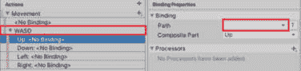

图 3.8 – 移动绑定

1.  新输入系统的魔法在于你可以为同一动作在不同设备上分配多个绑定，如图所示：

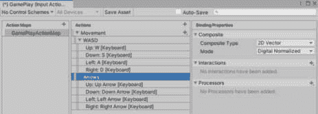

图 3.9 – 箭头绑定

1.  你也可以为**跳跃**和**连击**添加新的动作，但为此，你需要将**动作类型**值更改为**按钮**。你的最终设置应该看起来像这样：

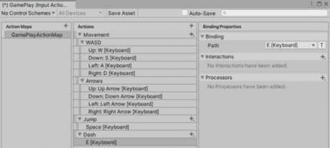

图 3.10 – 添加跳跃和连击

1.  作为此输入动作资产的最后一步，你需要回到**检查器**中的输入动作，并为其选择**生成 C# 类**：

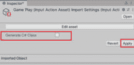

图 3.11 – 生成输入类

1.  然后，我们将创建一个包装脚本，从输入中获取回调并调用新动作以执行移动：

    我们将创建一个包装器来使用新的输入系统，首先在我们的 `PlayerInput` 脚本中实现游戏玩法映射动作，如下所示：

    ```cs
    public class PlayerInput : MonoBehaviour , GamePlay.IGamePlayMapActions
    ```

1.  此外，我们还将为这个动作注册回调并创建事件，以便我们可以在后续的 **PlayerMovement** 脚本中使用它们，如下面的代码块所示：

    ```cs
     private GamePlay gameplayControls;
     public static UnityAction onJump = delegate { };
     public static UnityAction onDash = delegate { };
     public static UnityAction<Vector2> onMovement = delegate { };
            private void OnEnable()
            {
                if (gameplayControls == null)
                {
                    gameplayControls = new GamePlay();
                    gameplayControls.GamePlayMap.SetCallbacks(this);
                }
                gameplayControls.GamePlayMap.Enable();
            }
            private void OnDisable()
            {
                gameplayControls.GamePlayMap.Disable();
            }
    ```

1.  现在，魔法就在这里发生。当我们获取动作回调并调用我们的事件时，我们将在 **PlayerMovement** 脚本中订阅这些事件，如下面的代码块所示：

    ```cs
    public class PlayerMovement : MonoBehaviour
        {
            private void OnEnable()
            {
                PlayerInput.onJump += Jump;
                PlayerInput.onDash += Dash;
                PlayerInput.onMovement += MovementInput;
            }
            private void OnDisable()
            {
                PlayerInput.onJump -= Jump;
                PlayerInput.onDash -= Dash;
                PlayerInput.onMovement -= MovementInput;
            }
    ```

    这是 `PlayerMovement` 脚本中的移动功能：

    ```cs
      private void MovementInput(Vector2 input)
            {
                movementVector = input;
            }
            private void MovePlayer()
            {
                Vector3 movement = new Vector3(movementVector.x , 0f , movementVector.y) * moveSpeed * Time.deltaTime;
                transform.Translate(movement);
            }
            private void Jump()
            {
                if (isGrounded)
                {
                    playerRigidbody.AddForce(Vector3.up * jumpForce, ForceMode.Impulse);
                    isGrounded = false;
                }
            }
            private void Dash()
            {
                if (canDash)
                {
                    Vector3 dashVector = new Vector3(movementVector.x, 0f, movementVector.y).normalized;
                    playerRigidbody.AddForce(dashVector * dashForce, ForceMode.Impulse);
                    canDash = false;
                    Invoke(nameof(ResetDash), dashCooldown);
                }
            }
            private void FixedUpdate()
            {
                MovePlayer();
                CheckGrounded();
            }
            private void CheckGrounded()
            {
                isGrounded = Physics.Raycast(groundChecker.position, Vector3.down, groundDistance, groundLayer);
            }
            private void ResetDash()
            {
                canDash = true;
            }
    ```

哇！新的输入系统现在被用于玩家移动。

### 讨论高级技术

在接下来的章节中，我们将讨论新输入系统的更多高级技术。让我们通过查看交互和处理器来探索 Unity 输入系统的功能，这些功能有助于在激活动作之前调整输入信号：

+   **交互**：交互在原始输入信号到达动作之前对其进行修改或过滤。Unity 的输入系统提供了一系列内置的交互，如 **Tap**（轻触）、**Slow Tap**（慢触）和 **Press**（按下），每个都针对特定的用例。例如，我们可以使用 **Multi Tap** 来实现双跳或激活特殊能力，而 **Press** 可以帮助解决游戏中的部分谜题。

    在下面的图中，你可以找到一个应用交互的列表：

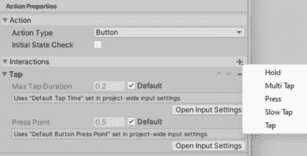

图 3.12 – 交互

+   **处理器**：处理器在交互之后但在动作触发之前应用于输入数据。它们允许你操纵输入数据，例如缩放、反转或平滑模拟值。处理器有助于输入行为的微调；你可以在控制、绑定和动作上应用它们。

    在下面的图中，你可以找到一个应用处理器的列表：

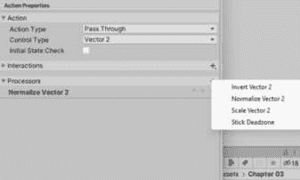

图 3.13 – 处理器

在深入了解 Unity 的输入系统后，我们现在理解了交互和处理器如何细化输入信号，增强我们游戏开发中的控制机制。在下一节中，让我们深入探讨 Cinemachine，这是 Unity 中的一个重要工具，它以电影化的风格彻底改变了游戏开发。

## Cinemachine

让我们谈谈 Cinemachine，这是 Unity 中的一个游戏改变者，它将你的游戏开发提升到电影化的水平。如果你是 Unity 开发者，Cinemachine 是你用于轻松管理动态摄像机移动、制作电影场景以及增强玩家在虚拟世界中导航方式的必备工具。

在其核心，Cinemachine 引入了虚拟摄像机，它们就像你在数字舞台上的个人摄像团队。无需复杂的摄像机脚本——Cinemachine 简化了这一过程，使得引导玩家视角变得容易。无论你想要充满动作的镜头、宁静的风景，还是沉浸式的叙事时刻，Cinemachine 都让你能够轻松地扮演导演，无需头痛。

### Cinemachine 的好处

按照以下方式探索 Cinemachine 在 Unity 游戏开发中提供的功能，以实现无缝和引人入胜的摄像机控制和叙事：

+   **直观控制**：Cinemachine 提供了用户友好的界面和直观的控制，消除了复杂相机脚本的需求，使得所有技能水平的开发者都能使用。

+   **轻松的视角引导**：使用 Cinemachine，您可以轻松引导玩家视角，从动态动作序列到宁静的风景，而无需深入研究复杂的代码。

+   **通过程序噪声实现逼真效果**：Cinemachine 通过程序噪声将逼真感引入场景，提供诸如在关键时刻相机抖动等微妙而影响深远的效果，从而增强整体游戏体验。

+   **自动构图组件**：**Composer** 组件自动调整相机的位置和**视野**（**FOV**）设置，确保关注关键元素，简化构图过程，并节省宝贵的发展时间。

+   **无缝时间轴集成**：Cinemachine 与 Unity 的 Timeline 无缝集成，使得创建电影化序列变得简单，从而提供更沉浸和以叙事驱动的游戏体验。

+   **增强的叙事能力**：除了相机系统之外，Cinemachine 还作为创意盟友，增强叙事能力，使游戏对玩家更具吸引力和难忘。

总结来说，Cinemachine 提供了一系列功能，旨在简化相机控制和增强 Unity 游戏开发中的叙事，提供直观的控制、轻松的视角引导、程序噪声带来的逼真效果、Composer 组件的自动化构图、无缝的时间轴集成和增强的叙事能力。

### 在我们的游戏中使用 Cinemachine

让我们以 Cinemachine 为起点，探索如何无缝将其集成到我们的游戏中。在本小节中，我们将学习如何安装 Cinemachine 并设置虚拟相机，以增强场景管理和动态相机运动。

在以下图中，您可以看到**包管理器**面板，您可以从其中选择和安装包，并等待编辑器完成脚本编译：

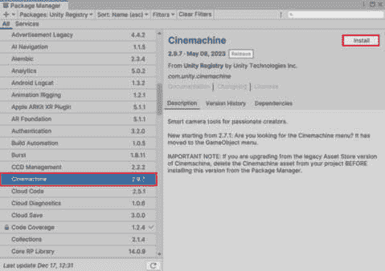

图 3.14 – 从包管理器安装 Cinemachine

Unity 在 Cinemachine 包中提供了各种相机。让我们讨论一些这些相机及其相应的用途：

+   **Freelook 相机（CinemachineFreeLook）**：

    +   *用法*：Freelook Camera 提供了在 3D 环境中创建动态和电影化相机运动的灵活控制。它常用于角色探索、动作序列和沉浸式游戏体验，其中流畅的相机运动增加了深度和参与感。

    +   *主要功能*：允许进行多轴旋转、可调整的跟随和注视目标、可定制的阻尼以实现平滑过渡，以及为不同相机行为定义多个机架配置的能力。

+   **虚拟相机（CinemachineVirtualCamera）**：

    +   *用法*：虚拟相机是 Cinemachine 中的基础相机工具，提供对构图、构图和行为精确控制的选项。它适用于各种场景，包括角色跟踪、场景构图、电影场景和脚本化相机序列。

    +   *主要功能*：提供目标跟踪选项、平滑过渡的阻尼设置、可自定义的 FOV、**景深**（**DOF**）以及各种混合模式，以实现无缝的相机过渡和效果。

+   **2D** **相机 (CinemachineVirtualCamera)**:

    +   *用法*：CinemachineVirtualCamera 的 2D 相机变体专门为 2D 游戏开发设计，提供与 3D 虚拟相机类似的功能，但针对 2D 环境进行了优化。它非常适合平台游戏、横版滚动游戏以及其他需要动态相机控制的 2D 项目。它非常适合平台游戏、横版滚动游戏和其他需要动态相机控制的 2D 项目。

    +   *主要功能*：支持 2D 特定设置，如正交模式、像素级相机设置、像素吸附、以及针对 2D 游戏机制优化的跟随和死区。允许平滑跟踪 2D 角色、视差效果和 2D 空间中的电影式相机运动。

在以下演示中，我们将实现虚拟相机，以突出从 Unity 默认相机切换到 Cinemachine 相机时发生的具体变化。

从**Cinemachine**列表中选择**虚拟相机**。当你尝试添加组件时，主相机将由 Cinemachine 管理：

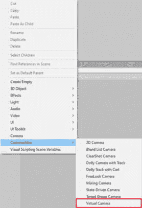

图 3.15 – 虚拟相机选项

选择**虚拟相机**后，**CinemachineBrain**组件将被添加到**MainCamera**游戏对象中，如图*图 3*.16 所示。**CinemachineBrain**组件协调多个虚拟相机，管理它们的激活、混合和行为，以实现平滑过渡和动态相机控制，这对于在 Unity 项目中使用 Cinemachine 创建沉浸式和视觉上引人入胜的场景至关重要：

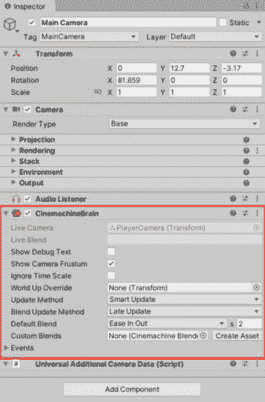

图 3.16 – CinemachineBrain 组件

此外，它还会在场景中为这个虚拟相机创建一个新的游戏对象，该对象包含**CinemachineVirtualCamera**组件，如图所示：

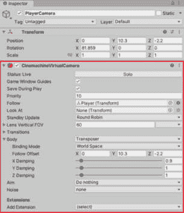

图 3.17 – CinemachineVirtualCamera 组件

总结来说，你成功地将 Cinemachine 集成到你的游戏中，允许进行简化的相机管理和动态虚拟相机运动，以增强你的游戏视觉体验。

### 使用 Cinemachine 增强游戏动态性 – 添加震动效果

利用 Cinemachine 提升我们的游戏体验，我们现在将探索效果的集成，特别是关注使用**CinemachineImpulseListener**组件来整合震动效果。这个 Unity Cinemachine 包中的关键组件作为其他 Cinemachine 模块脉冲信号的至关重要接收器，将它们转换成游戏中的影响力和听觉效果。其主要功能涉及监听由碰撞或爆炸等事件触发的脉冲信号，使开发者能够应用可定制的参数，如强度和持续时间，以提供沉浸式反馈体验。与 Cinemachine 模块无缝集成，**CinemachineImpulseListener**组件通过向游戏事件提供同步和动态响应，增强了游戏玩法和电影效果，从而显著提升了整体沉浸感和参与感玩家体验。

震动效果在游戏设计中是一个极具影响力的元素，对整体玩家体验的贡献显著。无论应用于模拟火焰、碰撞或其他游戏元素，此效果都增加了一层动态性和参与感。有效地集成震动效果可以增强玩家在游戏中的沉浸感，创造一个更具吸引力和愉悦的体验。

我们将在以下步骤中开始实现此功能：

1.  我们将首先点击**添加扩展**。它将显示如下菜单：

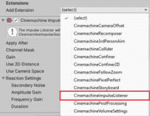

图 3.18 – 扩展菜单

1.  然后，我们点击**CinemachineImpulseListener**组件将其添加到我们的相机中。

    我们可以调整此组件内的值以获得更好的游戏效果，如图所示：

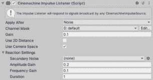

图 3.19 – CinemachineImpulseListener 组件

您可以在 Unity 官方文档中了解更多关于这些值的信息：[`docs.unity3d.com/Packages/com.unity.cinemachine@2.3/manual/`](https://docs.unity3d.com/Packages/com.unity.cinemachine@2.3/manual/)。

小贴士

对于大多数 Unity 组件，当鼠标悬停在变量名上时，会显示工具提示。

然后，我们需要将**CinemachineImpulseSource**添加到一个游戏对象中。在我们的例子中，我们可以轻松地将其添加到玩家游戏对象中，因为大多数交互都将来自这个玩家。Unity 的 Cinemachine 包中的**CinemachineImpulseSource**组件是一个多功能的工具，用于生成脉冲信号，以模拟游戏中的影响性事件。通过定义强度和持续时间等参数，我们可以创建一系列效果，如相机震动、控制器震动或屏幕闪烁。与 Cinemachine 的其他组件无缝集成，**CinemachineImpulseSource**通过允许对事件进行动态响应和调整效果以实现沉浸式和吸引人的玩家体验来增强游戏玩法和电影体验。其定制选项和脚本功能使我们能够根据游戏的美学和机制定制效果，为整体游戏世界增添深度和交互性。

我们需要在我们的脚本中引用**CinemachineImpulseSource**以开始使用它：

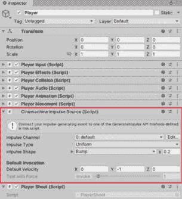

图 3.20 – CinemachineImpulseSource 组件

1.  现在，我们将使用**PlayerEffects**脚本，该脚本将订阅**PlayerShoot**射击事件以生成脉冲。

    在下面的代码中，我们将生成脉冲，当玩家射击火焰时：

    ```cs
    [RequireComponent(typeof(CinemachineImpulseSource))]
        public class PlayerEffects : MonoBehaviour
        {
            private CinemachineImpulseSource cinemachineImpulse;
            private void OnEnable()
            {
                PlayerShoot.onFire += ApplyShootFireEffect;
            }
            private void OnDisable()
            {
                PlayerShoot.onFire -= ApplyShootFireEffect;
            }
            private void Start()
            {
                cinemachineImpulse = GetComponent<CinemachineImpulseSource>();
            }
            private void ApplyShootFireEffect()
            {
                cinemachineImpulse.GenerateImpulse();
            }
        }
    ```

就这样！现在，每当玩家射击时，效果都会被应用。

### 动态电影体验 - 使用 Cinemachine 实现无缝相机融合

**Cinemachine**的另一个应用在于其能够同时管理多个相机并在运行时无缝地在它们之间切换。这种功能在需要为特定游戏事件创建专用相机的场景中非常有价值。例如，你可以设计一个特殊的相机，当玩家遇到 Boss 时触发，玩家进入 Boss 房间时自动激活。

在下面的图中，你可以在 Cinemachine 组件中找到添加自定义融合的选项。点击**创建资产**以生成一个新的可脚本化对象，该对象将负责管理相机之间的过渡，以及协调过渡过程中的缓动动作：

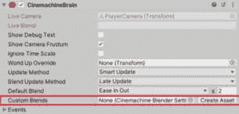

图 3.21 – Cinemachine 组件中的自定义融合部分

如以下图所示，使用可脚本对象 **CinemachineBlenderSettings**，您可以在相机之间添加过渡。Unity Cinemachine 包中的 **CinemachineBlenderSettings** 组件在场景中协调虚拟相机之间的平滑过渡中起着关键作用。通过定义混合曲线、权重参数和混合技术，我们可以控制相机混合的速度、风格和视觉主导性，从而在游戏玩法或电影序列中实现无缝且引人入胜的相机运动。支持优先级、触发机制和广泛的定制选项，**CinemachineBlenderSettings** 使我们能够创建符合游戏美学和叙事的动态和沉浸式相机过渡，从而增强整体玩家体验和沉浸感：

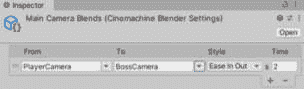

图 3.22 – CinemachineBlenderSettings 可脚本对象

要利用此功能，您可以通过增加当前相机的优先级并降低前一个相机的优先级来启用或禁用相机的游戏对象或调整当前相机的优先级。

```cs
SwitchCamera() function, which accepts an Enum parameter representing the camera type. This enables us to selectively activate the desired camera based on the specified type:
```

```cs
   public class CameraManager : Singlton<CameraManager>
    {
        // Dictionary to map enum values to Cinemachine virtual cameras
        public GenericDictionary<CameraType, CinemachineVirtualCamera> cameraDictionary = new GenericDictionary<CameraType, CinemachineVirtualCamera>();
        // Reference to the currently active virtual camera
        private CinemachineVirtualCamera currentCamera;
        void Start()
        {
            SwitchCamera(CameraType.PlayerCamera);
        }
        // Function to switch between virtual cameras using the enum
        public void SwitchCamera(CameraType newCameraType)
        {
            // Disable the current camera
            if (currentCamera != null)
            {
                currentCamera.gameObject.SetActive(false);
            }
            // Enable the new camera based on the enum
            if (cameraDictionary.ContainsKey(newCameraType))
            {
                currentCamera = cameraDictionary[newCameraType];
                currentCamera.gameObject.SetActive(true);
            }
            else
            {
                Debug.LogWarning("Camera of type " + newCameraType + " not found in the dictionary.");
            }
        }
    }
    // Enum to represent different cameras
    public enum CameraType
    {
        PlayerCamera,
        BossCamera,
        // Add more camera types as needed
    }
```

您可以在我们的 GitHub 仓库中找到所有代码，其链接在 *技术要求* 部分中提及。

注意

我选择使用枚举而不是字符串以提高性能效率。

以下代码概述了各种相机类型的枚举：

```cs
public enum CameraType
    {
        PlayerCamera,
        BossCamera,
        // Add more camera types as needed
    }
PlayerCollision class:
```

```cs
namespace FusionFuryGame
{
    public class PlayerCollision : MonoBehaviour
    {
        private void OnTriggerEnter(Collider other)
        {
            if (other.CompareTag("BossArea"))
            {
                CameraManager.Instance.SwitchCamera(CameraType.BossCamera);
            }
        }
        private void OnTriggerExit(Collider other)
        {
            if (other.CompareTag("BossArea"))
            {
                CameraManager.Instance.SwitchCamera(CameraType.PlayerCamera);
            }
        }
    }
}
```

小贴士

由于 Unity 插件众多，选择适合您项目的正确插件至关重要。

总结来说，Cinemachine 为 Unity 开发者提供了直观的相机控制、轻松的视角引导、通过程序噪声实现的逼真效果、自动构图、无缝时间轴集成以及增强的叙事能力。在本节结束时，我们探讨了其功能和优势，为在游戏开发中利用其力量做准备。

# 使用 Unity 插件的最佳实践

在将插件集成到您的项目中之前，彻底探索其功能、理解其文档、评估兼容性和潜在影响、评估特定功能、跟踪发布、检查版本兼容性、维护项目完整性、设置测试环境、为将来参考记录集成文档以及跟踪和解决集成过程中遇到的问题至关重要：

+   **探索插件功能**：在添加插件之前，彻底探索其功能和功能

+   **理解文档**：深入插件文档以清晰了解其功能

+   **兼容性和影响评估**：评估插件与您的项目是否兼容，考虑性能和潜在冲突等方面

+   **功能评估**：评估特定功能以确保它们符合您的项目需求

+   **保持插件更新**：了解您集成插件的更新、错误修复和新功能

+   **版本兼容性检查**: 确认插件与当前 Unity 版本兼容，在 Unity 更新期间保持谨慎

+   **维护项目完整性**: 在对项目进行重大更改之前，备份整个项目以避免数据丢失

+   **测试环境**: 创建一个专门的测试环境以评估插件更新或修改

+   **未来参考文档**: 创建详细的集成文档，包括配置、设置和故障排除步骤

+   **问题跟踪和解决**: 记录遇到的问题及其解决方案，以供将来参考

总结来说，探索、理解、评估、更新、检查兼容性、维护完整性、测试、记录文档和跟踪问题是在 Unity 项目中有效集成和管理插件的关键步骤。

# 摘要

在结束本章之前，我们已经涵盖了 Unity 插件的方方面面，了解了它们提供的基本和扩展功能。您还学习了如何使用 C#集成新的 Input System 和 Cinemachine，获得了增强游戏开发项目的实用技能。我们强调了在处理插件时采用最佳实践的重要性，为更高效地集成到项目中奠定了基础。当您反思保持代码整洁有序时，这些技能将在您继续成为熟练的 Unity 开发者之路上变得非常有价值。

展望下一章，“使用 Unity 中的 C#创建有趣的游戏机制”，准备好扩展您的游戏开发工具集。在了解清洁编码实践的基础上，您将探索如何通过富有表现力的 C#编程语言为您的游戏带来兴奋感。想象一下，将您对插件和组织化代码的知识无缝地融入引人入胜的游戏机制创作中。即将到来的章节承诺带来令人兴奋的挑战和发现，这将进一步增强您的 Unity 开发技能。准备好深入探索制作沉浸式和有趣游戏机制的世界，第四章。在这个技能提升的持续旅程中，祝您编码愉快！
