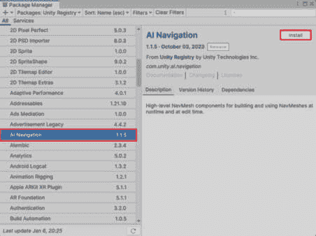
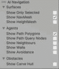
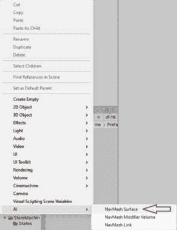
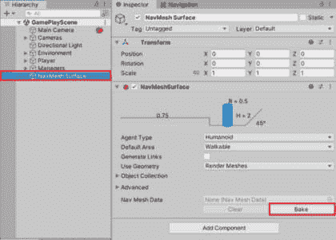
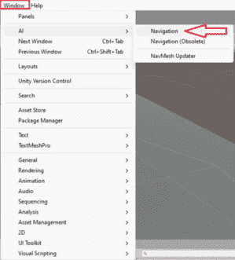
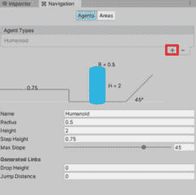
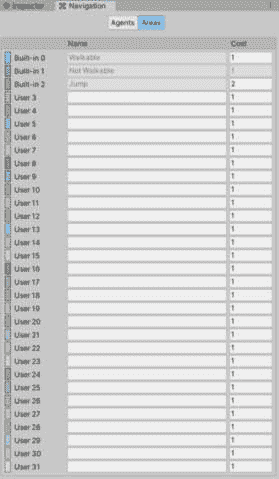
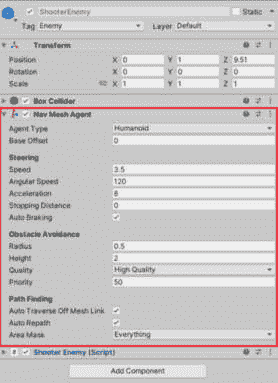

# 在 Unity 中使用 C#实现引人入胜的游戏机制

欢迎来到*第四章*，我们将邀请您进入游戏开发的动态世界。随着您深入本章，您的旅程将从探索推动成功游戏机制的基础原则开始。这一初步步骤包括对游戏机制的了解，让您掌握构成引人入胜游戏玩法骨干的基本概念。

在此之后，您将无缝过渡到玩家行为和 AI 领域，然后再深入研究挑战和奖励系统。这段旅程揭示了制作互动和响应式游戏体验的艺术。

到本章结束时，您将不仅具备理论洞察力，还将拥有使用 C#在 Unity 中塑造沉浸式游戏冒险的实用技能。

在本章中，我们将涵盖以下主要主题：

+   介绍游戏机制

+   使用 C#实现玩家行为和 AI 逻辑

+   使用 C#实现挑战和奖励系统

# 技术要求

您可以访问我们的专用 GitHub 仓库中的代码示例和项目文件：[`github.com/PacktPublishing/Mastering-Unity-Game-Development-with-C-Sharp/tree/main/Assets/Chapter%2004`](https://github.com/PacktPublishing/Mastering-Unity-Game-Development-with-C-Sharp/tree/main/Assets/Chapter%2004)。

复制或下载仓库，以便您能够轻松访问本章中展示的代码。

# 介绍游戏机制

**游戏机制**是塑造游戏玩法规则的规则和系统。把它们想象成定义玩家体验的后台机制。它们对于制作引人入胜的游戏玩法至关重要，影响着从移动和战斗到故事展开的方方面面。成功的游戏，如拥有跳跃机制的*马里奥*或拥有方块排列挑战的*俄罗斯方块*，展示了精心设计的机制如何为玩家创造难忘且愉快的体验。

游戏机制不仅使游戏能够运行，而且通过玩家如何互动来微妙地讲述故事。无论是在复杂的战斗游戏中还是在解谜的平台游戏中，这些机制都增添了整体故事。当玩家遵循游戏规则时，他们不仅仅是旁观者；他们成为了故事的一部分。

因此，理解和创造游戏机制就像成为互动叙事的高手。游戏中每个按下的按钮或移动的动作都帮助故事推进，使每一次游玩都成为独特且个性化的旅程。

在下一节中，我们将讨论您需要了解的游戏机制的基本原则。

## 游戏机制的基本原则

现在，让我们谈谈使游戏有趣的重要元素。我们谈论的是塑造玩家如何享受乐趣的基本规则。这一切都关于找到正确的平衡，提供反馈，并确保玩家感到掌控。这些简单的事情将游戏转变为激动人心的冒险，每个动作都增加了乐趣。

### 平衡

游戏中的**平衡**就像确保每个人都能公平地享受乐趣。想象一下一款一个角色超级强大，其他人无法享受的游戏——这显然是不公平的，对吧？游戏开发者努力创造一个平衡的体验，让每个玩家或角色都有机会发光。以《守望先锋》为例。在这款游戏中，每个英雄都有独特的技能，没有哪个角色过于强大或弱小。正是这种谨慎的平衡确保了公平的竞技场，让每个人都能享受乐趣并为游戏的激动人心做出贡献。

此外，平衡不仅体现在角色上；它还扩展到整体游戏体验。想象一下一款关卡要么过于简单要么难以置信地困难的游戏——玩家很快就会失去兴趣。在挑战、难度和奖励上实现平衡，可以保持玩家的参与度。能够达到这种微妙平衡的游戏，为所有技能水平的玩家提供令人满意和愉快的体验，使他们想要继续玩游戏并探索游戏所能提供的内容。

### 反馈

在游戏世界中，**反馈**是游戏与你交流的方式，让你知道你的表现。当你做得正确时，它就像一个鼓励；当你需要改进时，它就像一个温柔的提醒。例如，在《我的世界》中，当你成功开采资源时，伴随着动作会有一个令人满意的声响。那个声音就是反馈，一个小的庆祝，告诉你你已经完成了任务。

想象一下在没有任何反馈的情况下玩赛车游戏——没有欢呼的人群，没有速度表指针的上升——这会有些奇怪，对吧？良好的反馈，无论是视觉的、听觉的还是触觉的，对于让玩家感到成就感并引导他们通过游戏挑战都是至关重要的。

此外，反馈还扩展到游戏中的叙事。你做出的选择应该有后果，游戏应该让你知道你的决定如何影响故事。有效的反馈在玩家和游戏世界之间建立了一种动态的联系，使每个动作都感觉有意义。无论是成功任务后的胜利音乐，还是根据你的决定在环境中发生的微妙变化，反馈都为游戏体验增添了深度，确保玩家保持参与并投入到他们正在探索的虚拟世界中。

### 玩家能动性

**玩家自主权**就像在游戏中拥有方向盘——你可以做出选择并控制你的虚拟冒险。在《上古卷轴 V：天际》中，这一原则非常突出。从一开始，你就决定你的角色将成为谁。你想要成为一个勇敢的战士、一个狡猾的小偷，还是一个强大的法师吗？游戏不会强迫你走一条特定的道路；相反，它让你自己塑造自己的故事。

这种选择自由不仅限于角色创建。随着你在游戏中前进，你会遇到各种任务和挑战，在这里，玩家自主权再次成为焦点。你可以决定如何应对情况——你想谈判、战斗还是悄悄绕过敌人？你的选择不仅影响直接的结果，还影响整个故事。你的《上古卷轴 V：天际》版本可能与别人的完全不同，因为玩家自主权允许多样化的体验。

拥有玩家自主权将游戏转变为不仅仅是预设结果的固定路径。它将其转变为你的故事，你的决定至关重要，游戏会适应你的选择。这种控制感和塑造独特冒险的能力使得玩家自主权成为创造沉浸式和具有个人意义的游戏体验的关键原则。

在下一节中，我们将了解代码和游戏机制之间的关系。

## 代码与游戏机制之间的联系

现在，这里有个有趣的部分——代码是将想法转化为游戏行动的关键。它就像一本规则手册，告诉游戏该做什么。如果你想创建一个玩家可以射击激光的游戏，你需要编写代码来实现。因此，代码和游戏机制之间的关系就像厨师为美味佳肴准备的食谱——代码引导游戏做到我们想要的样子。

理解这些编码基础就像是拥有了游戏制作王国的钥匙。它让你能够将你的游戏想法变为现实，并创造出各种酷炫的东西。此外，你越了解 C#，你就能让你的游戏做更多令人惊叹的事情。所以，准备好进入本章的编码世界吧——它并没有听起来那么复杂，而且是让游戏如此有趣的关键因素！

# 使用 C#实现玩家行为和 AI 逻辑

在本节中，我们将探讨游戏是如何制作的，观察玩家在游戏中的行为以及计算机控制的角色（我们称之为 AI）是如何思考的。弄清楚玩家的行为和游戏角色的反应是制作有趣游戏的关键。这就像给玩家一个剧本去遵循，就像戏剧中的演员一样。玩家让游戏变得生动，有点像演员使故事变得有趣。我们将探讨不同类型的游戏，检查玩家在各种情况下的行为，从大冒险到战术战斗。

然后，我们将检查 AI，这是制作游戏中的敌人、朋友和其他角色感觉真实的智能计算机技术。AI 不仅仅是代码；它就像魔法，使挑战变得有趣，敌人变得狡猾，朋友变得有帮助。我们将解释这种数字魔法的背后基本理念，有点像理解指挥家给管弦乐队提供的提示，引导游戏中的所有行动和反应。

因此，我们正踏上使用 C#——一种与计算机交流的时髦方式——使玩家行为和 AI 逻辑更不神秘的旅程。你将准备好制作感觉真实的游戏，保持玩家的兴趣，让你的游戏超级刺激！

+   **理解玩家行为设计**：在玩家行为设计的领域，制作一个反应灵敏的游戏涉及到**健康管理**这一基本方面。**健康**，作为一个既适用于玩家也适用于敌人的通用概念，是极大地影响整体游戏体验的核心行为。为了实现一个模块化和可扩展的系统，我们必须引入一个**IHealth**接口，它封装了基本功能，例如跟踪最大健康值、当前健康值、受到伤害和恢复健康。通过采用这个接口，我们可以建立一个统一的方法来管理健康，这适用于玩家和敌人。这不仅简化了代码库，还允许随着游戏的演变轻松地进行扩展和修改。

+   **射击机制**：除了健康之外，我们还将深入研究射击机制，这是射击游戏中一个关键玩家行为。我们不会选择一个简单的射击脚本，而是采用模块化方法，为子弹、弹丸和武器创建单独的组件。这种模块化设计提供了灵活性和可扩展性，使得引入新武器、调整弹丸行为和增强整体游戏动态变得更加容易。

+   **AI 逻辑简介**：过渡到 AI 逻辑，我们将探讨赋予游戏中的敌人生命力的基本概念。基本的 AI 原则包括理解 AI 在创造动态和具有挑战性的游戏中的作用。AI 系统成为决定敌人行为的关键组件，从简单的游荡到复杂的攻击模式。通过深入研究这些概念，我们将了解驱动 AI 控制实体的决策过程，从而丰富游戏体验的整体丰富性。

+   **编码玩家行为和 AI**：从理论转向实践，我们将开始使用 C#脚本实现玩家行为和 AI 逻辑的实际应用。**IHealth**和**IDamage**接口成为实现与健康相关的功能的基础，确保在多样化的游戏元素中保持一致和可管理的做法。随着我们学会分别处理子弹、弹丸和武器，模块化的射击系统将形成，这促进了代码的可重用性和可维护性。

为了加强学习，我们将在接下来的章节中进行实际操作演示，展示创建用于玩家行为和 AI 逻辑的 C#脚本的逐步过程。我们将熟练掌握设计和实现响应式玩家行为，并了解如何在 Unity 游戏开发环境中使动态 AI 角色栩栩如生。

让我们从编写`IHealth`接口并建立其基本逻辑开始。

## 编写 IHealth 和 IDamage 接口

在下面的代码块中，我们引入了`IHealth`接口，该接口包含最大和当前健康属性，以及设置最大健康、造成伤害和促进治疗的必要函数。在这里，我们将创建一个接口来管理整个游戏中的健康逻辑。我设计它，以便一旦实体实现此接口，它就会监督每个实体的健康。这种方法将简化实体之间的通信，并在我们创建`IDamage`接口时证明是有益的。在负责造成伤害的组件中实现`IDamage`将使我们能够无缝地影响健康组件：

```cs
namespace FusionFuryGame
{
    public interface IHealth
    {
        float MaxHealth { get; set; }   // Property for maximum health
        float CurrentHealth { get; set; }  // Property for current health
        void TakeDamage(float damage);  // Method to apply damage
        void SetMaxHealth();  // Method to set current health to max health
        void Heal();            // Method to apply healing
    }
}
```

接下来，我们将创建`IDamage`接口，它将包含一个处理伤害的中心函数。后续的类将实现此接口，内部处理伤害计算，并将结果伤害值传递给其他类，如下面的代码块所示：

```cs
namespace FusionFuryGame
{
    public interface IDamage
    {
        float GetDamageValue();  // Method to retrieve the damage value
    }
}
```

现在，我们必须将`IHealth`接口集成到玩家中。因此，我们将生成`PlayerHealth`组件并将其附加到玩家的`GameObject`上。`PlayerHealth`类将管理与玩家健康相关的所有功能，包括设置最大健康和处理伤害。当玩家的健康降至零或以下时，玩家死亡。它被设计为一个独立的类，你可以将其附加到玩家的 GameObject 上，以便与敌人进行通信，如下面的代码块所示：

```cs
namespace FusionFuryGame
{
    public class PlayerHealth : MonoBehaviour, IHealth
    {
        public static UnityAction onPlayerDied = delegate { };
        public float startingMaxHealth = 100;  // Set a default starting maximum health for the player
        public float healInterval = 2f;  // Time interval for healing
        public float healAmount = 5f;    // Amount of healing per interval
        private WaitForSeconds healIntervalWait;  // Reusable WaitForSeconds instance
        private Coroutine healOverTimeCoroutine;
        public float MaxHealth { get; set; }
        public float CurrentHealth { get; set; }
```

在前面的代码中，我包含了与玩家健康和治疗相关的必需变量。此外，一个协程将确保玩家在`PlayerHealth`类中逐渐恢复健康：

```cs
        void OnDestroy()
        {
            // Ensure to stop the healing coroutine when the object is destroyed
            if (healOverTimeCoroutine != null)
                StopCoroutine(healOverTimeCoroutine);
        }
        void Start()
        {
            SetMaxHealth();  // Set initial max health
            healIntervalWait = new WaitForSeconds(healInterval);
            StartHealingOverTime();
        }
```

让我们看看前面的代码：

+   **销毁时**：此方法确保在玩家对象被销毁时停止治疗协程，以防止内存泄漏

+   **开始**：此方法初始化玩家的健康参数，设置其最大健康值，创建用于治疗间隔的**WaitForSeconds**实例，并启动治疗协程：

```cs
        public void TakeDamage(float damage)
        {
            // Implement logic to handle taking damage
            CurrentHealth -= damage;
            // Check for death or other actions based on health status
            if (CurrentHealth <= 0) onPlayerDied.Invoke();
        }
        public void SetMaxHealth()
        {
            MaxHealth = startingMaxHealth;
        }
        public void Heal()
        {
            CurrentHealth += healAmount;
            CurrentHealth = Mathf.Min(CurrentHealth, MaxHealth);
        }
        private void StartHealingOverTime()
        {
            healOverTimeCoroutine = StartCoroutine(HealOverTime());
        }
        private IEnumerator HealOverTime()
        {
            while (true)
            {
                yield return healIntervalWait;
                Heal();
            }
        }
    }
}
```

让我们分析前面的代码：

+   **受到伤害**：此方法处理玩家受到伤害时扣除健康的逻辑。它还会检查玩家的健康是否已达到零，如果需要，触发**onPlayerDied**事件。

+   **设置最大健康**：此方法将玩家的最大健康设置为指定的起始最大健康值。

+   **Heal**：这个方法恢复玩家的健康。它通过指定的治疗量增加当前健康值，并确保玩家的当前健康值不超过最大健康值。

+   **StartHealingOverTime**：这个方法启动负责在一段时间内逐渐恢复玩家健康的协程。

+   **HealOverTime**：这个协程无限期地等待指定的治疗间隔，然后调用**Heal**方法来恢复玩家的健康。

现在，让我们检查`PlayerCollision`组件，了解玩家如何受到伤害。以下代码块展示了玩家直接从敌人或其投射物受到伤害的过程。这个类充当玩家健康组件和碰撞对象`IDamage`接口之间的桥梁。我们可以利用`PlayerHealth`并通过使用`OnCollisionEnter`方法通过`IDamage`接口获取伤害：

```cs
namespace FusionFuryGame
{
    public class PlayerCollision : MonoBehaviour
    {
        private PlayerHealth playerHealth;
        private IDamage enemyDamage;
        private void Start()
        {
            playerHealth = GetComponent<PlayerHealth>();
        }
        private void OnCollisionEnter(Collision collision)
        {
            if (collision.gameObject.CompareTag("Enemy") || collision.gameObject.CompareTag("EnemyProjectile"))
            {
                if (collision.gameObject.TryGetComponent(out enemyDamage))
                {
                    playerHealth.TakeDamage(enemyDamage.GetDamageValue());
                }
            }
        }
    }
}
```

现在，让我们看看这里使用的不同变量：

+   **private PlayerHealth playerHealth;**：这是同一 GameObject 上附加的**PlayerHealth**组件的引用。该组件管理玩家的健康。

+   **private IDamage enemyDamage;**：这是一个处理敌人或敌人投射物造成的伤害的接口引用。

+   **Start**：这个方法在初始化期间检索附加到同一 GameObject 上的**PlayerHealth**组件。

+   **OnCollisionEnter**：当发生涉及 GameObject 的碰撞时，这个方法会自动调用。它通过比较标签来检查碰撞是否涉及敌人或敌人投射物。如果碰撞涉及敌人或敌人投射物，它将尝试使用**TryGetComponent**从碰撞对象中检索**IDamage**组件。如果成功，它将调用**PlayerHealth**组件的**TakeDamage**方法来对玩家的健康造成伤害。

总体来说，这个脚本处理玩家角色与敌人实体或敌人投射物的碰撞。碰撞发生时，它会从碰撞对象中检索伤害值并将其应用于玩家的健康，确保游戏中的伤害管理得当。

在下一节中，我们将探讨玩家如何射击敌人。然而，在深入探讨之前，我们将实现一个射击系统，以确保玩家和敌人都能使用它。

## 实现射击系统

在本节中，我们将创建用于射击的类。在这里，我们将`IDamage`接口纳入`BaseProjectile`类中，该类作为所有弹药类型的基石。这允许我们计算将应用于健康组件的伤害。

在接下来的代码块中，我们正在配置伤害值，这将用于玩家或敌人。这是一个适用于所有对象的通用系统：

```cs
namespace FusionFuryGame
{
    public abstract class BaseProjectile : MonoBehaviour, IDamage
    {
        private float damage;
        public virtual void SetDamageValue(float value)
        {
            damage = value;
        }
        public float GetDamageValue()
        {
            return damage;
        }
    }
}
```

让我们看看这里使用的变量：

+   **private float damage**；这个变量存储与弹体相关的伤害值。

+   **public virtual void SetDamageValue(float value)**：这个方法允许子类为弹体设置伤害值。它接受一个表示要设置的伤害的浮点参数`value`。当被调用时，它将提供的值分配给伤害变量。**virtual**关键字表示此方法可以被子类重写，以提供所需的专业行为。

+   **GetDamageValue 方法**：这个方法检索弹体的伤害值。它简单地返回存储在伤害变量中的值。

总体而言，这个抽象类为游戏中的弹体对象提供了一个蓝图。子类可以继承这个类，并通过重写`SetDamageValue`方法或添加所需的其他功能来自定义弹体的行为。`GetDamageValue`方法允许其他游戏组件在需要时访问弹体的伤害值，从而在整个游戏中实现一致的伤害处理。

接下来，我们可以创建`BaseWeapon`脚本，它足够灵活，可以被玩家和敌人使用，考虑到敌人也将拥有武器。每个武器都将关联一个附加的弹体，从而允许创建各种弹体类型。

此外，还有一个名为`weaponPower`的概念，这是一个变量，它因武器而异，影响施加的伤害。`muzzleTransform`作为射击弹体的点，而`projectileForce`决定了弹体的运动。

最后，我们必须定义`Shoot`函数，如下面的代码块所示：

```cs
namespace FusionFuryGame
{
    public abstract class BaseWeapon : MonoBehaviour
    {
        [SerializeField] protected BaseProjectile attachedProjectile;
        [SerializeField] protected float weaponPower;
        [SerializeField] protected Transform muzzleTransform;
        [SerializeField] protected float projectileForce;
        public virtual void Shoot( float fireDamage)
        {
          // Instantiate the projectile from the object pool
          GameObject projectileObject = ObjectPoolManager.Instance.GetPooledObject(attachedProjectile.tag);
          if (projectileObject != null)
          {
            // Set the position of the projectile to the gun's muzzle position
            projectileObject.transform.position = muzzleTransform.position;
            // Get the rigid body component from the projectile
            Rigidbody projectileRb = projectileObject.GetComponent<Rigidbody>();
            if (projectileRb != null)
            {
               // Apply force to the projectile in the forward vector of the weapon
               projectileRb.AddForce(muzzleTransform.forward * projectileForce, ForceMode.Impulse);
               // Modify the fire damage by adding the current weapon's power
               float modifiedDamage = fireDamage + weaponPower;
               // Apply damage and other logic to the projectile (consider implementing IDamage interface)
               attachedProjectile.SetDamageValue(modifiedDamage);
            }
            else
            {
               // Handle if the projectile doesn't have a rigid body
               Debug.LogWarning("Projectile prefab is missing Rigidbody component.");
            }
          }
        }
    }
}
```

让我们看看序列化字段：

+   **protected BaseProjectile attachedProjectile**：这指的是附加到武器上的弹体类型。它被序列化，以便在 Unity 的**Inspector**视图中进行赋值。

+   **protected float weaponPower**：这指的是武器的功率。它被序列化，以便在**Inspector**视图中进行调整。

+   **protected Transform muzzleTransform**：这指的是弹体生成的位置，通常是武器的枪口。

+   **protected float projectileForce**：这指的是当弹体从武器射出时施加的力。

+   **Shoot**：这个方法负责射击武器。首先，它尝试从对象池管理器中获取一个池化的弹体对象。如果检索到弹体对象，它将设置其位置为武器的枪口，并添加力以推动它向前。此方法还通过添加武器的功率来修改火灾伤害。最后，它将修改后的伤害和任何其他逻辑应用于弹体，可能通过实现**IDamage**接口。

总体而言，这个抽象类为在游戏中实现不同类型的武器提供了一个基础。子类可以继承这个类来创建特定的武器类型并按需自定义其行为。`Shoot` 方法处理项目的生成和发射，允许灵活和动态的武器功能。

下面的代码块提供了一个使用 `BaseWeapon` 和 `SimpleGun` 类的示例。我们将用它来让玩家射击敌人，因此它将作为玩家的武器使用：

```cs
namespace FusionFuryGame
{
    public class SimpleGun : BaseWeapon
    {
        public override void Shoot( float fireDamage)
        {
            base.Shoot( fireDamage );
            //Add here special logic for the gun if needed
        }
    }
}
```

让我们分解一下代码：

+   **SimpleGun**：这个类代表游戏中的一种特定类型的枪。它继承自 **BaseWeapon** 类，表明它与其他武器共享特性和功能，但可能具有特定的行为。

+   **Override Shoot**：

    +   **public override void Shoot(float fireDamage)**：此方法覆盖了在 **BaseWeapon** 类中定义的 **Shoot** 方法

    +   **base.Shoot(fireDamage)** 语句调用了基类（**BaseWeapon**）中的 **Shoot** 方法，允许枪支执行在基类中定义的标准射击行为

总结来说，`SimpleGun` 类通过提供自己的 `Shoot` 方法实现扩展了 `BaseWeapon` 类的功能。这允许在利用基类提供的通用功能的同时实现特定的行为。

现在，让我们介绍 `PlayerShoot` 组件，它包含了射击逻辑。在这个上下文中，玩家等待输入动作并拥有当前武器。在 *第六章*，该章节专注于数据处理，我们将为武器统计数据创建可脚本化的对象。这样，我们可以用武器的统计数据替换武器的力量，利用从它那里衍生出的力量。我们还可以为同一武器设置不同的统计数据，如下面的代码块所示：

```cs
namespace FusionFuryGame {
    public class PlayerShoot : MonoBehaviour
    {
        public static UnityAction onFire = delegate { };
        [SerializeField] BaseWeapon currentWeapon;
        [SerializeField] private float fireDamage;
        [SerializeField] private float shootingInterval = 0.5f;  // Set the shooting interval in seconds
        private float timeSinceLastShot = 0f;
        private void Update()
        {
            timeSinceLastShot += Time.deltaTime;
        }
        private void OnEnable()
        {
            PlayerInput.onShoot += OnShootFire;
        }
        private void OnDisable()
        {
            PlayerInput.onShoot -= OnShootFire;
        }
        private void OnShootFire()
        {
            // Check if enough time has passed since the last shot
            if (timeSinceLastShot >= shootingInterval)
            {
                // Shoot in the forward vector of the weapon and pass player power stat
                currentWeapon.Shoot(fireDamage);
                // Reset the timer
                timeSinceLastShot = 0f;
                // Invoke the onFire event
                onFire.Invoke();
            }
        }
    }
}
```

让我们分解前面的代码：

+   **onFire 事件**：

    +   **public static UnityAction onFire = delegate { };**：这个静态事件在玩家射击时被触发。其他脚本可以订阅此事件，以便在玩家射击时执行操作。

+   **序列化字段**：

    +   **currentWeapon**：此字段持有玩家当前使用的武器的引用

    +   **fireDamage**：此字段表示玩家射击的伤害值

    +   **shootingInterval**：此字段指定了连续射击之间的时间间隔

+   **事件订阅**：

    +   **OnEnable()**：当对象启用时，将 **OnShootFire** 方法订阅到 **onShoot** 事件

    +   **OnDisable()**：当对象禁用时，从 **onShoot** 事件中取消订阅 **OnShootFire** 方法

+   **OnShootFire**：此方法在玩家执行射击动作（**onShoot 事件**）时被调用。它检查自上次射击以来是否已经过去了足够的时间。如果是这样，它将触发当前武器的 **Shoot** 方法，重置射击计时器，并调用 **onFire** 事件。

总体而言，`PlayerShoot`类通过控制射击间隔、管理射击动作的事件以及将射击逻辑委托给当前武器来促进玩家的射击机制。

注意

确保为与玩家和敌人相关的弹道分配不同的标签。这可以防止它们相互碰撞时发生冲突。

目前，玩家具有射击和承受伤害的能力。在下一小节中，我们将深入探讨我们游戏的 AI 逻辑。

## 深入 AI 逻辑

欢迎来到**AI 逻辑**的世界！在本节中，我们将探讨将智能带入游戏角色的算法和决策过程。我们将了解 AI 逻辑如何增强导航、策略和动态交互，提升整体游戏体验。加入我们，一起揭开为更沉浸式虚拟世界构建智能行为的秘密。此外，我们将深入研究有限状态机的实现，为所有敌人创建不同的状态，实现行为之间的无缝转换。

在接下来的步骤中，我们将把`NavMesh`包集成到我们的项目中。然而，在深入 AI 逻辑之前，将导航包包含到项目中是至关重要的。按照以下步骤操作：

注意

在 Unity 2022 之前，导航是预实现的；然而，从 Unity 2022 开始，必须通过包管理器添加。

1.  通过**包管理器**安装**AI 导航**包，如图*图 4*.1*所示：



图 4.1 – 通过包管理器安装 AI 导航

1.  安装完成后，您会注意到一个新菜单，该菜单允许您切换**NavMesh**表面的可见性并访问其他关于**AI 导航**的选项。此菜单集成在*场景工具栏*中，如图*图 4*.2*所示。2*：



图 4.2 – 场景视图中的 AI 导航菜单

额外阅读

您可以探索**AI 导航**设置或在官方 Unity 文档中查找更多信息：[`docs.unity3d.com/Packages/com.unity.ai.navigation@1.1/manual/index.html`](https://docs.unity3d.com/Packages/com.unity.ai.navigation@1.1/manual/index.html)。

1.  要开始使用此功能，我们需要将一个**NavMesh Surface**属性集成到场景中。您可以从**创建**菜单中选择，如图*图 4*.3*所示：



图 4.3 – 从创建菜单中选择 NavMesh Surface

1.  随后，**NavMesh Surface**将被包含，此时您可以继续**烘焙**表面。这指的是预先计算并存储导航数据以供 AI 路径查找的过程，如图*图 4*.4*所示：



图 4.4 – NavMeshSurface 组件中的 Bake 操作

注意

在开始烘焙过程之前，移除玩家和动态对象至关重要，以防止在最终烘焙中创建空隙。

1.  您也可以通过在顶部栏的 **Window** 下的 **Navigation** 选项卡中导航来包含额外的 AI 代理。选择 **AI** 然后选择 **Navigation**，避免选择 **Navigation (Obsolete)** 选项，如图 *图 4.5* 所示：



图 4.5 – 选择导航

1.  在 **Navigation** 选项卡中，您可以选择包含更多具有各种设置的 **代理**，从而增加敌人行为的多样性，如图 *图 4.6* 所示：



图 4.6 – 通过导航选项卡添加更多代理

1.  此外，您还有灵活性引入更多的 **区域**，为您的游戏提供不同的玩法。如图所示，您可以将区域指定为 **可通行**、**不可通行**，甚至作为 **跳跃** 区域，以适应您游戏的具体需求：



图 4.7 – 导航选项卡中的区域

1.  现在我们已经熟悉了添加额外的区域或代理，我们不会对它们进行进一步修改。我仅提及它们作为信息。现在，让我们继续将 AI 集成到我们的游戏中。为此，我们必须将 **Nav Mesh Agent** 组件附加到敌人上以启用导航，如图 *图 4.8* 所示。我们有灵活性调整适合我们游戏的值，例如更改速度和 AI 达到目标时停止的条件。有关更多详细信息，请参阅官方 *Unity 文档*：



图 4.8 – 敌人之一的 Nav Mesh Agent 组件

安装包后，我们将启动 AI 逻辑。我们将首先建立 `BaseEnemy` 类，并为状态系统打下基础，因为我们打算构建一个有限状态机。

让我们从状态接口开始。以下代码块提供了基础结构：

```cs
namespace FusionFuryGame
{
    public interface IEnemyState
    {
        void EnterState(BaseEnemy enemy);
        void UpdateState(BaseEnemy enemy);
        void ExitState(BaseEnemy enemy);
    }
}
```

让我们更仔细地看看这段代码：

+   **void** **EnterState(BaseEnemy enemy)**:

    +   此方法负责在敌人进入此状态时设置初始条件和行为。它接受一个 **BaseEnemy** 对象作为参数，使我们能够访问敌人的属性和方法。

+   **void** **UpdateState(BaseEnemy enemy)**:

    +   此方法在敌人处于此状态时重复调用。它定义了敌人在此状态下应执行的逻辑和动作。同样，它接受一个 **BaseEnemy** 对象作为参数来操纵敌人的行为。

+   **void** **ExitState(BaseEnemy enemy)**:

    +   当敌人退出此状态时，将调用此方法。它负责清理任何资源或重置与此状态相关的任何变量。与其他方法一样，它也接受一个 **BaseEnemy** 对象参数。

通过实现此接口，代表特定敌人状态的类可以定义它们进入、更新和退出这些状态的独特行为。这种方法允许模块化和组织化地管理敌人行为，使得在游戏中根据需要添加、删除或修改状态变得更容易。

让我们继续创建敌人组件，从 `EnemyHealth` 开始。此组件将集成 `IHealth` 接口，并处理所有与敌人相关的健康逻辑。查看以下代码块：

```cs
    public class EnemyHealth : MonoBehaviour, IHealth
    {
        [SerializeField] float startingMaxHealth = 100;  // Set a default starting maximum health for the Enemy
        private float maxHealth;
        private float currentHealth;
        [SerializeField] float healAmount = 5f;    // Amount of healing per interval
        [SerializeField] float healInterval = 2f;  // Time interval for healing
        private WaitForSeconds healIntervalWait;  // Reusable WaitForSeconds instance
        private Coroutine healOverTimeCoroutine;
        public UnityAction onEnemyDied = delegate { };
        public float MaxHealth
        {
            get { return maxHealth; }
            set { maxHealth = value; }
        }
        public float CurrentHealth
        {
            get { return currentHealth; }
            set
            {
                currentHealth = Mathf.Clamp(value, 0, MaxHealth);
                if (currentHealth <= 0)
                {
                    onEnemyDied.Invoke();
                }
            }
        }
        private void Start()
        {
            SetMaxHealth();  // Set initial max health
            healIntervalWait = new WaitForSeconds(healInterval);
            StartHealingOverTime();
        }
        public void SetMaxHealth()
        {
            MaxHealth = startingMaxHealth;
        }
        public void TakeDamage(float damage)
        {
            // Implement logic to handle taking damage
            CurrentHealth -= damage;
        }
        //we can also just heal in some states only
        public void Heal()
        {
            CurrentHealth += healAmount;
            CurrentHealth = Mathf.Min(CurrentHealth, MaxHealth);
        }
        private void StartHealingOverTime()
        {
            healOverTimeCoroutine = StartCoroutine(HealOverTime());
        }
        private IEnumerator HealOverTime()
        {
            while (true)
            {
                yield return healIntervalWait;
                Heal();
            }
        }
    }
```

让我们了解 `EnemyHealth` 组件：

+   **startingMaxHealth**: 敌人的默认起始最大生命值。

+   **healAmount**: 每个间隔的治疗量

+   **healInterval**: 治疗的时间间隔

+   **healIntervalWait**: 用于治疗的可重用 **WaitForSeconds** 实例

+   **healOverTimeCoroutine**: 治疗协程

+   **maxHealth**: 敌人的最大生命值

+   **currentHealth**: 敌人的当前生命值

+   **TakeDamage(float damage)**: 处理敌人受到的伤害

+   **SetMaxHealth()**: 设置敌人的最大生命值

+   **Heal()**: 随时间治疗敌人

+   **StartHealingOverTime()**: 启动治疗协程

+   **HealOverTime()**: 治疗协程方法

接下来是 `EnemyAnimations` 组件，它负责管理敌人的动画。让我们深入其代码块：

```cs
  public class EnemyAnimations : MonoBehaviour
  {
      private Animator animator;
      private void Start()
      {
          animator = GetComponent<Animator>();
      }
      public void StartAttackAnimations()
      {
          animator.SetBool("IsAttacking", true);
      }
      public void StopAttackAnimations()
      {
          animator.SetBool("IsAttacking", false);
      }
  }
```

在这里，`StartAttackAnimations()` 和 `StopAttackAnimations()` 管理攻击动画。

接下来，我们将在 `EnemyCollision` 类中实现敌人的碰撞逻辑。此类将处理与玩家的碰撞，使敌人能够受到伤害。查看以下代码块以获取详细信息：

```cs
    public class EnemyCollision : MonoBehaviour
    {
        private IDamage playerDamage;
        private EnemyHealth healthComponent;
        private void Start()
        {
            healthComponent = GetComponent<EnemyHealth>();
        }
        //we can also make layers for them and reduce calculations of collision in layer matrix in project settings
        private void OnCollisionEnter(Collision collision)
        {
            if (collision.gameObject.CompareTag("PlayerProjectile"))
            {
                if (collision.gameObject.TryGetComponent(out playerDamage))
                {
                    healthComponent.TakeDamage(playerDamage.GetDamageValue());
                }
            }
        }
    }
```

让我们看看 `EnemyCollision` 类做了什么：

+   **playerDamage**: 表示玩家造成的伤害

+   **damage**: 敌人与玩家碰撞时造成的伤害

+   **OnCollisionEnter(Collision collision)**: 处理与玩家投射物的碰撞

敌人逻辑中的最后一个组件是 `EnemyShoot`。它负责使用附加武器发射投射物。在此处实现 `IDamage` 接口，以便将伤害值传递给玩家。请参阅以下代码块以获取详细信息：

```cs
    public class EnemyShoot : MonoBehaviour , IDamage
    {
        [SerializeField] float damage; //when the enemy collide with the player
        public BaseWeapon attachedWeapon;  // Reference to the attacted Weapon
        [SerializeField] float fireDamage; //when the enemy shoot the player
        public void FireProjectile()
        {
            attachedWeapon.Shoot(fireDamage);
        }
        public float GetDamageValue()
        {
            // You can implement more sophisticated logic here based on enemy stats
            return damage;
        }
    }
```

让我们看看 `EnemyShoot` 做了什么：

+   **fireDamage**: 敌人射击玩家时造成的伤害

+   **attachedWeapon**: 敌人附加武器的引用

+   **FireProjectile()**: 启动附加武器的射击

+   **GetDamageValue()**: 获取伤害值

现在，让我们创建一个`BaseEnemy`类，它是一个抽象类，定义了游戏中敌人基本的功能和属性。它将利用状态机逻辑，并包含对敌人射击和动画组件的引用。这个类促进了敌人不同状态之间的通信，使其适用于所有敌人：

```cs
[RequireComponent(typeof(EnemyHealth) , typeof(EnemyAnimations) , typeof(EnemyShoot)) ]
    [RequireComponent(typeof(EnemyCollision))]
    public abstract class BaseEnemy : MonoBehaviour
    {
        public Transform player;
        [HideInInspector] public NavMeshAgent navMeshAgent;
        // Reference to the current state
        protected IEnemyState currentState;
        // Define the different states
        public IEnemyState wanderState;
        public IEnemyState idleState;
        public IEnemyState attackState;
        public IEnemyState deathState;
        public IEnemyState chaseState;
        public float attackRange = 5f;
        [SerializeField] internal float chaseSpeed;
        [SerializeField] internal float rotationSpeed;
        internal EnemyAnimations animationComponent;
        internal EnemyShoot shootComponent;
        internal EnemyHealth healthComponent;
        protected virtual void Start()
        {
            // Initialize states
            wanderState = new WanderState();
            idleState = new IdleState();
            attackState = new AttackState();
            chaseState = new ChaseState();
            deathState = new DeathState();
            // Set initial state
            currentState = wanderState;
            // Get references
            player = GameObject.FindGameObjectWithTag("Player").transform;
            navMeshAgent = GetComponent<NavMeshAgent>();
            animationComponent = GetComponent<EnemyAnimations>();
            shootComponent = GetComponent<EnemyShoot>();
            healthComponent = GetComponent<EnemyHealth>();
            healthComponent.onEnemyDied += OnDied;
        }
        protected virtual void Update()
        {
            // Update the current state
            currentState.UpdateState(this);
        }
```

让我们更仔细地看看这段代码，以便我们理解它：

+   **player**: 对玩家**Transform**值的引用

+   **navMeshAgent**: 对导航**NavMeshAgent**组件的引用

+   **currentState**: 对敌人当前状态的引用

+   **wanderState**, **idleState**, **attackState**, **deathState**, **chaseState**: 敌人的不同状态（分别是游荡、空闲、攻击、死亡和追逐）

+   **attackRange**: 敌人可以攻击的范围

+   **chaseSpeed**: 敌人追逐玩家的速度

+   **rotationSpeed**: 敌人旋转的速度

+   **Start()方法**: 初始化状态，设置初始状态，并获取引用

+   **Update()方法**: 更新敌人的当前状态

现在，让我们深入了解负责在状态之间转换的状态机逻辑：

```cs
        public bool PlayerInSight()
        {
            Vector3 directionToPlayer = player.position - transform.position;
            float distanceToPlayer = directionToPlayer.magnitude;
            // Create a ray from the enemy's position towards the player
            Ray ray = new Ray(transform.position, directionToPlayer.normalized);
            RaycastHit hit;
            // Check if the ray hits something
            if (Physics.Raycast(ray, out hit, distanceToPlayer))
            {
                // Check if the hit object is the player
                if (hit.collider.CompareTag("Player"))
                {
                    // The player is in sight
                    return true;
                }
            }
            // No direct line of sight to the player
            return false;
        }
        public bool PlayerInRange()
        {
            Vector3 directionToPlayer = player.position - transform.position;
            float distanceToPlayer = directionToPlayer.magnitude;
            // Check if the player is within the attack range
            if (distanceToPlayer <= attackRange)
            {
                // Calculate the angle between the enemy's forward direction and the direction to the player
                float angleToPlayer = Vector3.Angle(transform.forward, directionToPlayer.normalized);
                // Set a cone angle to define the attack range
                float attackConeAngle = 45f; // Adjust this value based on your game's requirements
                // Check if the player is within the cone angle
                if (angleToPlayer <= attackConeAngle * 0.5f)
                {
                    // The player is in range and within the attack cone
                    return true;
                }
            }
            // Player is not within attack range or cone angle
            return false;
        }
        public bool IsIdleConditionMet()
        {
            return !PlayerInSight() && !PlayerInRange();
        }
        public void TransitionToState(IEnemyState newState)
        {
            currentState?.ExitState(this);
            currentState = newState;
            currentState?.EnterState(this);
        }
           private void OnDied()
        {
            healthComponent.onEnemyDied -= OnDied;
            // Trigger death logic if health reaches zero
            TransitionToState(deathState);
        }
    }
```

为了理解这段代码，让我们检查它的函数：

+   **PlayerInSight()** 和 **PlayerInRange()**: 这些函数分别检查玩家是否在视线或范围内

+   **IsIdleConditionMet()**: 检查是否满足空闲的条件

+   **TransitionToState()**: 转换到新状态

+   **OnDied()方法**: 转换到死亡状态

现在，让我们转向状态。首先，我们将实现`IEnemyStates`，这样我们就可以包含基本方法。然后，在随后的代码块中，我们将开发`IdleState`的逻辑，详细说明敌人在此状态下将采取的行动。`IdleState`是所有敌人的默认状态。在这里，我们只是检查其他状态的条件，以便在满足相应逻辑时转换到它们：

```cs
   public class IdleState : IEnemyState
    {
        private float idleTime = 3f; // Set the duration for which the enemy stays idle
        private float timer; // Timer to track the idle time
        public void EnterState(BaseEnemy enemy)
        {
            timer = 0f;
        }
        public void ExitState(BaseEnemy enemy)
        {
            //Logic for Exit
        }
        public void UpdateState(BaseEnemy enemy)
        {
            // Logic to be executed while in the idle state
            timer += Time.deltaTime;
            if (timer >= idleTime)
            {
                enemy.TransitionToState(enemy.wanderState);
            }
            else if (enemy.PlayerInSight())
            {
                enemy.TransitionToState(enemy.chaseState);
            }
            else if (enemy.PlayerInRange())
            {
                enemy.TransitionToState(enemy.attackState);
            }
        }
    }
```

让我们更仔细地看看前面的代码：

+   **Variables**:

    +   **idleTime**: 这个变量决定了敌人保持空闲的时间长度

    +   **timer**: 这个变量跟踪敌人处于空闲状态时的经过时间

+   **Methods**:

    +   **EnterState(BaseEnemy enemy)**: 当敌人进入空闲状态时调用此方法。在这里，它初始化计时器。

    +   **ExitState(BaseEnemy enemy)**: 当敌人退出空闲状态时调用此方法。目前它是空的，但如果有需要，你可以在这里添加逻辑。

    +   **UpdateState(BaseEnemy enemy)**: 这个方法在每一帧都会被调用以更新敌人的状态。以下是发生的情况：

        +   计时器通过自上一帧以来经过的时间增加

        +   如果空闲时间超过指定的持续时间（**idleTime**），敌人将转换到游荡状态，表示它准备四处移动

        +   如果敌人检测到玩家在其视线范围内（**PlayerInSight()**），它将转换到追逐状态以追捕玩家

        +   如果玩家在攻击范围内（**PlayerInRange()**），敌人将过渡到攻击状态以对抗玩家

此代码确保在空闲状态下，敌人表现如预期，根据特定条件（如经过的时间和玩家接近度）过渡到其他状态。

在下面的 `AttackState` 类中，我们还实现了 `IEnemyState`，以便我们可以修改基方法，使其适合攻击状态。攻击状态是所有敌人在攻击玩家时都会进入的状态。它包括跟踪玩家位置并向玩家发射弹丸的逻辑，以及处理相关的动画：

```cs
    public class AttackState : IEnemyState
    {
        private float attackTimer;  // Timer to control the attack rate
        private float timeBetweenAttacks = 1.5f;  // Adjust as needed based on your game's requirements
        public void EnterState(BaseEnemy enemy)
        {
            enemy.animationsComponent.StartAttackAnimations();
            attackTimer = 0f;
        }
        public void UpdateState(BaseEnemy enemy)
        {
            LookAtPlayer(enemy);
            attackTimer += Time.deltaTime;
            if (attackTimer >= timeBetweenAttacks)
            {
                AttackPlayer(enemy);
                attackTimer = 0f;  // Reset the timer after attacking
            }
        }
        public void ExitState(BaseEnemy enemy)
        {
            enemy.animationsComponent.StopAttackAnimations();
        }
        private void LookAtPlayer(BaseEnemy enemy)
        {
            Vector3 lookDirection = enemy.player.position - enemy.transform.position;
            lookDirection.y = 0;  // Keep the enemy's rotation in the horizontal plane
            Quaternion rotation = Quaternion.LookRotation(lookDirection);
            enemy.transform.rotation = Quaternion.Slerp(enemy.transform.rotation, rotation, Time.deltaTime * enemy.rotationSpeed);
        }
        private void AttackPlayer(BaseEnemy enemy)
        {
            enemy.shootComponent.FireProjectile();
        }
    }
```

下面是对此代码的解释：

+   **方法**：

    +   **EnterState**：初始化攻击状态，开始攻击动画，并重置攻击计时器。

    +   **UpdateState**：根据攻击之间的时间检查是否是攻击的时间。它确保敌人面向玩家，并在条件满足时启动攻击。

    +   **ExitState**：在退出状态时停止攻击动画。

    +   **LookAtPlayer**：计算看向玩家的方向，并平滑地将敌人旋转到玩家方向。

    +   **AttackPlayer**：使敌人执行攻击动作，例如发射弹丸。

通过这些，你已经学会了如何创建状态，使你可以轻松地添加更多状态，以便你可以定制你的游戏。

现在我们已经建立了敌人和玩家之间的交互循环，允许他们互相射击，下一步涉及为每个敌人创建一个预制体 - 例如，实现 `ShooterEnemy` 基类并将此组件添加到相应的 `GameObject` 中，将其转换为预制体。同样，对于弹丸，请记住，根据它们是为玩家还是敌人而修改标签是至关重要的。

# 使用 C# 实现挑战与奖励系统

挑战为游戏体验注入活力，充满激情和不可预测性，引导玩家通过需要技能、策略和决心的关键时刻。这些障碍确保玩家完全沉浸在游戏世界中，打造一个动态的景观，使每次游戏都变成一场冒险，充满意想不到的转折和变化。

在像 *Dark Souls* 这样的游戏中，挑战以强大的敌人和复杂的关卡设计的形式出现。玩家在战斗技能和适应性方面受到考验，创造了一个紧张而有益的经验。*超级马里奥兄弟* 通过精确的平台跳跃、时机和击败敌人引入挑战。每个关卡都提供了一套新的挑战，逐渐增加复杂性。

## 挑战与任务/探险

虽然**挑战、任务和任务**在吸引玩家方面有共同点，但它们的性质不同。**挑战**通常指的是测试玩家能力的特定障碍或任务，例如在时间限制内完成一个关卡或击败一个强大的对手。另一方面，**任务和任务**是更广泛的目标，它们有助于游戏的叙事，并涉及一系列可能包括挑战的任务。区别在于挑战的专注和技能测试性质，使它们成为动态游戏的关键组成部分。

在《塞尔达传说：荒野之息》中，挑战可能包括解决复杂的神殿谜题并测试玩家的解决问题的能力。相比之下，任务可能是游戏整体叙事的一部分，例如营救角色或找回特殊物品。挑战提供即时的、基于技能的障碍，而任务则有助于整体进度和叙事。

## 平衡难度级别以吸引更广泛的受众

实现和谐的难度曲线对于满足不同技能水平的玩家至关重要。平衡挑战确保新手和经验丰富的玩家都能找到乐趣，而不会遇到过多的挫折。例如，《Celeste》等游戏巧妙地平衡了难度，从简单的挑战开始，逐渐引入更复杂的挑战，让玩家随着游戏的复杂性一起成长。

成功的游戏通常采用**自适应难度调整**或可选挑战等技术，以适应不同玩家的技能水平。这种谨慎的平衡既防止了新手感到气馁，也为寻求更大挑战的老玩家提供了满意的体验。

## 探索奖励系统

**奖励系统**在游戏中就像是在玩家克服艰难挑战后等待胜利者的珍贵奖品。这些系统与挑战动态紧密相连，作为推动玩家前进的动力。奖励形式多样——包括增强、升级或游戏内货币，以及叙事进度和外观物品，每种都有其独特的吸引力。

在《塞尔达传说》等游戏中，征服棘手的地下城或击败强大的 Boss 通常会奖励玩家新的工具或能力，以便在故事中前进。在《巫师 3》等 RPG 游戏中，完成支线任务不仅提供经验点和游戏内货币，还能解锁新的故事线或装备。挑战与奖励之间的联系确保了克服障碍不仅考验玩家的技能，还承诺了有价值的激励，从而提高玩家的参与度和满意度。

将奖励成功融入游戏循环确保挑战不仅仅是障碍，而是成长的机会。这培养了成就感与进步感。玩家为了获得更多重大奖励的承诺，会更有动力接受更具挑战性的挑战，从而创造令人满意的游戏体验。奖励的无缝集成使游戏之旅变得充实和愉快。

## C# 挑战和奖励的实现

从理论到实践，我们用 C# 实现挑战和奖励，将编码洞察力变为现实。通过示例代码片段，您将获得实践经验，使挑战变得生动，并给予玩家有意义的奖励。我们将讨论保持玩家参与和动力的微妙平衡，了解挑战难度与奖励幅度的相关性。

### 介绍挑战逻辑

让我们首先建立挑战的基础数据结构。这可以在以下类中看到。每个挑战都将共享这组通用数据，简化运行时跟踪，并允许分配奖品：

```cs
[Serializable]
 public class CommonChallengeData
 {
     public bool isCompleted;
     public RewardType rewardType; // Type of reward
     public int rewardAmount;      // Amount or value of the reward
     … other challenge Data
 }
```

让我们转到 `BaseChallenge` 类，它包含开始和完成挑战的逻辑。有关详细信息，请参考以下代码块。所有挑战都将从这个脚本派生出来，在其方法内自定义其逻辑：

```cs
public abstract class BaseChallenge : MonoBehaviour
 {
     public CommonChallengeData commonData;
     public abstract void StartChallenge();
     public abstract void CompleteChallenge();
 }
```

让我们更深入地了解一下：

+   **public CommonChallengeData commonData**：这是一个公共变量，类型为 **CommonChallengeData**。它持有可能跨越各种类型挑战的通用数据。它允许派生类访问和修改共享的挑战数据。

+   **public abstract void StartChallenge()**：这是一个没有实现的具体方法声明。它指定了任何从 **BaseChallenge** 继承的类都必须为其 **StartChallenge** 方法提供自己的实现。此方法可能包含初始化或开始挑战的逻辑。

+   **public abstract void CompleteChallenge()**：与 **StartChallenge()** 类似，这也是一个任何派生类都必须实现的抽象方法。它负责处理挑战的完成，可能涉及更新用户界面、颁发奖励或触发其他游戏事件。

总结来说，`BaseChallenge` 作为创建游戏不同类型挑战的模板。它定义了所有挑战应具备的通用功能，例如开始和完成挑战，同时允许特定实现根据挑战类型的不同而有所变化。

让我们过渡到 `ChallengeManager`，这是一个中央实体，它存储所有挑战并承担启动挑战的责任。目前，它包括一个字典，用于按其相应类型存储所有挑战组件，涵盖所有挑战类型。它还包含一个开始挑战的方法，该方法将由 `LevelManager` 调用。

因此，每个等级都可以有一个指定的挑战，并且管理器会维护对当前挑战的引用。所有这些功能都在以下代码脚本中详细说明：

```cs
    public class ChallengeManager : Singleton<ChallengeManager>
    {
        // Define different types of challenges
        public enum ChallengeType
        {
            EnemyWaves,
            TimeTrials,
            LimitedResources,
            NoDamageRun,
            AccuracyChallenge
        }
        public GenericDictionary<ChallengeType, BaseChallenge> challengeDictionary = new GenericDictionary<ChallengeType, BaseChallenge>();
        public void StartChallenge(ChallengeType challengeType)
        {
            if (challengeDictionary.TryGetValue(challengeType, out BaseChallenge challengeScript))
            {
                if (!challengeScript.commonData.isCompleted)
                {
                    SetCurrentChallenge(challengeScript);
                    currentChallenge.StartChallenge();
                }
                else
                {
                    Debug.Log("Challenge already completed!");
                }
            }
            else
            {
                Debug.LogError($"No challenge script found for ChallengeType {challengeType}");
            }
        }
        private BaseChallenge currentChallenge;
        private void SetCurrentChallenge(BaseChallenge challengeScript)
        {
            if (currentChallenge != null)
            {
                currentChallenge.CompleteChallenge();
            }
            currentChallenge = challengeScript;
        }
    }
```

下面是对 `ChallengeManager` 类的解释：

+   **public enum ChallengeType**：这是一个枚举，定义了游戏中可用的不同类型挑战。每种挑战类型代表一种特定的游戏玩法挑战，例如 **EnemyWaves**、**TimeTrials**、**LimitedResources**、**NoDamageRun** 和 **AccuracyChallenge**。

+   **public GenericDictionary<ChallengeType**, **BaseChallenge> challengeDictionary**：这是一个泛型字典，将 **ChallengeType** 枚举值映射到相应的 **BaseChallenge** 对象。它存储与各自挑战类型相关联的不同挑战脚本的实例。

+   **public void StartChallenge(ChallengeType challengeType)**：此方法负责启动指定类型的挑战。它根据提供的挑战类型从字典中检索相应的挑战脚本，然后调用检索到的脚本中的 **StartChallenge()** 方法。

+   **private BaseChallenge currentChallenge**：这个私有字段持有当前活跃挑战的引用。它用于跟踪和管理正在进行的当前挑战的状态。

+   **private void** **SetCurrentChallenge(BaseChallenge challenge** **Script)**：此方法将当前挑战设置为提供的参数。在设置新挑战之前，它通过调用其 **CompleteChallenge()** 方法确保任何现有挑战已完成。

总结来说，`ChallengeManager` 类简化了游戏中不同类型挑战的管理和执行。它提供了启动挑战、处理挑战完成以及跟踪当前活跃挑战的方法。使用单例模式确保了对挑战管理操作的集中控制。

现在，让我们将注意力转向单个挑战。以下代码块包含了一个实现 `BaseChallenge` 类的示例，它集成了针对 `Enemy Waves` 挑战的特定逻辑。当挑战开始时，敌人在玩家附近生成。此外，它还包括在完成挑战后奖励玩家的逻辑。这通过 `RewardManager` 类来实现：

```cs
    public class EnemyWavesChallenge : BaseChallenge
    {
        public int totalWaves = 5;  // Adjust as needed
        private int currentWave = 0;
        public override void StartChallenge()
        {
            if (!commonData.isCompleted)
            {
                StartCoroutine(StartEnemyWavesChallenge());
            }
            else
            {
                Debug.Log("Challenge already completed!");
            }
        }
        IEnumerator StartEnemyWavesChallenge()
        {
            while (currentWave < totalWaves)
            {
                yield return StartCoroutine(SpawnEnemyWave());
                currentWave++;
            }
            CompleteChallenge();
        }
        public override void CompleteChallenge()
        {
            if (!commonData.isCompleted)
            {
                RewardManager.Instance.GrantReward(commonData);
                commonData.isCompleted = true;
            }
            else
            {
                Debug.Log("Challenge already completed!");
            }
        }
        IEnumerator SpawnEnemyWave()
        {
            // Adjust spawn positions, enemy types, and other parameters based on your game
            Debug.Log($"Spawning Wave {currentWave + 1}");
            yield return new WaitForSeconds(2f);
        }
    }
```

下面是对 `EnemyWavesChallenge` 类的解释：

+   **public int totalWaves = 5**：这个变量确定敌对挑战的总波数。游戏设计师可以调整此值以设置所需的波数。

+   **private int currentWave = 0**：这个变量跟踪挑战中的当前波次。它从 **0** 开始，随着波的生成而递增。

+   **public override void StartChallenge()**: 这个方法覆盖了从 **BaseChallenge** 类继承的 **StartChallenge()** 方法。如果挑战尚未完成，它将启动敌军波次挑战。在此方法内部，启动一个名为 **StartEnemyWavesChallenge()** 的协程来处理波次生成过程。

+   **IEnumerator StartEnemyWavesChallenge()**: 这个协程函数管理敌军波次的生成。它运行直到当前波次计数达到指定的总波次数。在循环内部，它使用 **SpawnEnemyWave()** 协程等待生成一个波次。

+   **public override void CompleteChallenge()**: 这个方法覆盖了基类中的 **CompleteChallenge()** 方法。它通过使用 **RewardManager** 为完成挑战提供奖励，并将挑战标记为已完成。

+   **IEnumerator SpawnEnemyWave()**: 这个协程函数代表了生成敌军波次的逻辑。游戏设计师可以调整生成位置、敌军类型和其他参数来自定义波次生成过程。在这个例子中，它记录了一条消息，表明正在生成波次，并在生成下一个波次之前等待设定的时间。

总结来说，`EnemyWavesChallenge` 类定义了一个挑战，其中敌军波次是顺序生成的。它提供了启动挑战、生成敌军波次和处理挑战完成（通过提供奖励）的方法。游戏设计师可以根据游戏需求自定义波次生成过程并调整参数。

之前的例子只是提供的挑战之一。你可以在本书的 GitHub 仓库中找到所有挑战（见 *技术要求* 部分）。最后，这是 `LevelManager`，它负责为当前级别分配合适的挑战：

```cs
   public class LevelManager : Singleton<LevelManager>
   {
       public GenericDictionary<int, ChallengeType> levelChallengeMapping = new GenericDictionary<int, ChallengeType>();
       public int currentLevel;
       private void Start()
       {
           StartChallengeForCurrentLevel(currentLevel);
       }
       public void StartChallengeForCurrentLevel(int currentLevel)
       {
           if (levelChallengeMapping.TryGetValue(currentLevel, out ChallengeType challengeType))
           {
               // Start the challenge associated with the current level
               ChallengeManager.Instance.StartChallenge(challengeType);
           }
           else
           {
               Debug.LogError($"No challenge mapped for Level {currentLevel}");
           }
       }
   }
```

下面是对 `LevelManager` 类的解释：

+   **public GenericDictionary<int**, **ChallengeType> levelChallengeMapping**: 这个字典存储了级别与其对应挑战类型之间的映射。键代表级别编号，值代表与该级别关联的挑战类型。

+   **public int currentLevel**: 这个变量存储了游戏当前的级别。

+   **private void Start()**: 当 **LevelManager** 对象初始化时调用此方法。它自动启动与当前级别关联的挑战。

+   **public void StartChallengeForCurrentLevel(int currentLevel)**: 这个方法为指定的当前级别启动挑战。它检查 **levelChallengeMapping** 字典中是否为当前级别映射了挑战。如果找到映射，它检索关联的挑战类型并使用 **ChallengeManager** 启动相应的挑战。

+   **ChallengeManager.Instance.StartChallenge(challengeType)**：这一行代码调用**ChallengeManager**单例实例的**StartChallenge**方法，传递与当前级别关联的挑战类型作为参数。

总结来说，`LevelManager`类通过在`levelChallengeMapping`字典中查找与当前级别关联的挑战类型，然后调用`ChallengeManager`单例实例的`StartChallenge`方法，来促进基于游戏当前级别的挑战的启动。它确保每个级别都启动了正确的挑战。

### 实现奖励系统

现在，让我们深入了解奖励系统，这是游戏流程中的关键元素，允许用户获得奖励。这个功能对于用户动机和参与度至关重要。

这里是`RewardManager`，它的任务是根据挑战数据为用户提供奖励。正如我们所见，它与其他管理者进行通信，以便用户能够获得特定的奖励：

```cs
    public class RewardManager : Singlton<RewardManager>
    {
        // Define different types of rewards
        public enum RewardType
        {
            PowerUp,
            UnlockableWeapon,
            ScoreMultiplier,
            SecretArea,
            Coins
        }
        public void GrantReward(CommonChallengeData commonData)
        {
            // Add code here to handle the specific reward type
            switch (commonData.rewardType)
            {
                case RewardType.PowerUp:
                    // Grant temporary power-up
                    break;
                case RewardType.UnlockableWeapon:
                    // Unlock a new weapon
                    break;
                case RewardType.ScoreMultiplier:
                    ApplyScoreMultiplier(commonData.rewardAmount);
                    break;
                case RewardType.SecretArea:
                    // Grant items found in a secret area
                    break;
                case RewardType.Coins:
                    GrantCoins(commonData.rewardAmount);
                    break;
            }
        }
        private void ApplyScoreMultiplier(int multiplier)
        {
            ScoreManager.Instance.ApplyMultiplier(multiplier);
            Debug.Log($"Score Multiplier Applied: {multiplier}x");
        }
        private void GrantCoins(int coinAmount)
        {
            CurrencyManager.Instance.AddCoins(coinAmount);
            Debug.Log($"Coins Granted: {coinAmount}");
        }
    }
```

下面是对`RewardManager`类的解释：

+   **public enum RewardType**：这个枚举定义了可以授予玩家的不同奖励类型，例如升级、可解锁武器、得分倍数、在秘密区域找到的物品和硬币。

+   **public void GrantReward(CommonChallengeData commonData)**：这个方法负责授予玩家奖励。它接受一个**CommonChallengeData**对象作为参数，其中包含有关要授予的奖励类型和数量的信息。

+   **switch (commonData.rewardType)**：这个 switch 语句检查**CommonChallengeData**对象中指定的奖励类型，并根据**RewardType**执行相应的奖励逻辑。

+   **case RewardType.PowerUp**：这个情况允许临时授予玩家升级。

+   **case RewardType.UnlockableWeapon**：这个情况允许为玩家解锁新武器。

+   **case RewardType.ScoreMultiplier**：这个情况通过调用带有指定倍数值的**ApplyScoreMultiplier**方法，将得分倍数应用于玩家的得分。

+   **case RewardType.SecretArea**：这个情况允许在秘密区域找到物品。

+   **case RewardType.Coins**：这个情况通过调用带有指定硬币数量的**GrantCoins**方法，将硬币授予玩家。

+   **private void ApplyScoreMultiplier(int multiplier)**：这个方法通过调用**ScoreManager**单例实例的**ApplyMultiplier**方法，将得分倍数应用于玩家的得分。

+   **private void GrantCoins(int coinAmount)**：这个方法通过调用**CurrencyManager**单例实例的**AddCoins**方法，将硬币添加到玩家的货币余额中。

总体而言，`RewardManager`类提供了一个集中机制，用于管理和授予玩家在完成挑战后各种类型的奖励。

以下代码块包含 `CurrencyManager`，它负责监督游戏中的货币。然而，这里的重点是添加金币到玩家余额的部分：

```cs
   Public class CurrencyManager : Singlton<CurrencyManager>
   {
       private int currentCoins;
       public void AddCoins(int amount)
       {
           currentCoins += amount;
           Debug.Log($"Coins: {currentCoins}");
       }
   }
```

这里是对 `CurrencyManager` 类的解释：

+   **private int currentCoins**: 这个变量存储玩家当前拥有的金币数量。

+   **public void AddCoins(int amount)**: 这个方法允许您向玩家的货币余额中添加金币。它接受一个名为 amount 的整数参数，表示要添加到当前余额中的金币数量。

+   **currentCoins += amount**: 这行代码将 **currentCoins** 变量增加指定的数量，从而向玩家的余额中添加金币。

总体而言，`CurrencyManager` 类为管理玩家的货币余额提供了简单而基本的功能，特别是向他们的总余额中添加金币。

以下代码块包含 `ScoreManager`，它负责管理玩家的分数并实现分数乘数：

```cs
    public class ScoreManager : Singlton<ScoreManager>
    {
        private float currentScore;
        private int scoreMultiplier = 1;
        public void ApplyMultiplier(int multiplier)
        {
            scoreMultiplier *= multiplier;
        }
        private void ResetMultiplier()
        {
            scoreMultiplier = 1;
        }
        public void AddScore(int scoreValue)
        {
            // Adjust score based on the current multiplier
            currentScore += scoreValue * scoreMultiplier;
            Debug.Log($"Score: {currentScore}");
        }
    }
```

这里是对 `ScoreManager` 类的解释：

+   **private float currentScore**: 这个变量存储玩家的当前分数。

+   **private int scoreMultiplier = 1**: 这个变量表示分数乘数，默认值为 **1**。

+   **public void ApplyMultiplier(int multiplier)**: 这个方法允许您将分数乘数应用于当前分数。它接受一个名为 multiplier 的整数参数，相应地调整分数乘数。

+   **scoreMultiplier = multiplier**: 这行代码将现有的分数乘数乘以指定的乘数，从而有效地调整分数乘数。

+   **private void ResetMultiplier()**: 这个方法将分数乘数重置为其默认值 **1**。

+   **public void AddScore(int scoreValue)**: 这个方法将指定的分数值添加到玩家的当前分数。它接受一个名为 **scoreValue** 的整数参数，表示要添加到当前分数的分数。

+   **currentScore += scoreValue * scoreMultiplier**: 这行代码根据分数值和当前分数乘数调整当前分数。它将分数值乘以分数乘数，并将其添加到当前分数。

总体而言，`ScoreManager` 类处理分数计算和更新，包括应用乘数和将分数值添加到玩家的总分数中。

这个例子突出了游戏开发中挑战和奖励系统之间的重要关系。挑战提供了吸引人的障碍和目标，促进了玩家的互动和进步。与奖励系统结合，完成挑战不仅是一种成就，也是一种令人满意的体验，提供了激励玩家继续前进的奖励。这种动态的互动增强了整体的游戏体验，确保玩家在整个游戏世界之旅中保持参与、动机和满足感。

在*第六章*，本章专注于数据处理，我打算介绍一个存储所有相关数据的保存系统，包括我们迄今为止讨论过的所有元素。本章将深入探讨实现该系统的具体细节。

提供的脚本作为演示，你可以在本书的 GitHub 仓库中找到完整的逻辑。

# 摘要

在本章中，我们深入探讨了 Unity 游戏开发的基本原则，特别是针对 C#的游戏机制，我们强调了它们在塑造引人入胜的游戏玩法中的重要性，包括平衡、反馈和玩家自主权等方面。这为你提供了使用 C#进行有效游戏机制实现的实用编程技能。过渡到下一节，*使用 C#实现玩家行为和 AI 逻辑*，我们探讨了玩家行为设计和基础 AI 概念。此外，我们还强调了挑战和奖励系统在提升玩家体验和培养参与度中的关键作用。

在*第五章**，*使用 C#为 Unity 游戏设计优化用户界面*中，你将深入 UI 设计原则和响应式 UI 元素领域。通过掌握使用 C#的 UI 设计技术，你将能够制作出视觉上吸引人且沉浸式的界面。本章旨在增强你在设计有效视觉层次、布局和响应式 UI 元素方面的技能，最终有助于提升用户体验，包括优化 UI 元素。

随着你开始这段技能提升的持续旅程，接下来的章节将带来令人兴奋的挑战和发现。祝您编码愉快！
