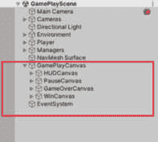
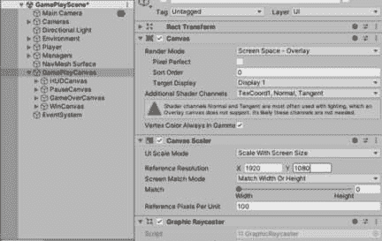
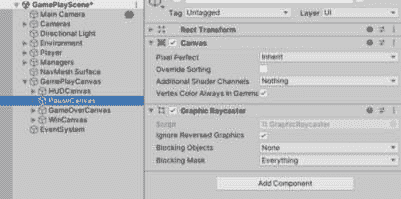
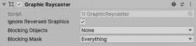
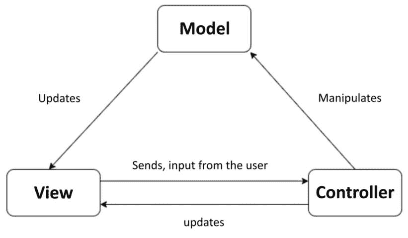
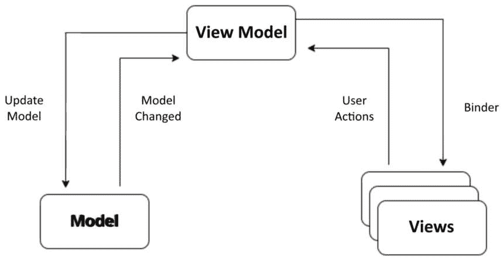
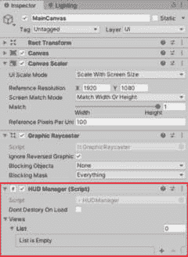
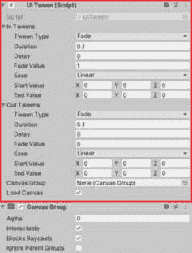
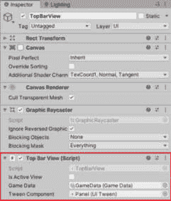

# 第六章：使用 C#为 Unity 游戏设计优化用户界面

欢迎来到*第五章*，我们将学习如何利用 C#的多功能性优化 Unity 游戏的用户界面（UI）。本章为你提供了实用的技能，以提升 UI 的性能并确保流畅的用户体验。第一个技能侧重于利用 C#进行高效的 UI 优化，最大化 UI 元素的性能。随后，我们将深入研究在 C#中创建优化 UI 系统的策略，提供关于有效构建和管理视图的见解。在本章中，所提出的系统作为一个灵活的框架，允许你根据游戏独特的需求自定义和优化 UI 元素。让我们深入优化 UI 的世界，利用 C#的力量来提升 Unity 游戏界面的性能和功能。

在本章中，我们将介绍以下主要内容：

+   游戏中的 UI 设计介绍

+   UI 的最佳实践和优化技术

+   使用 C#的 UI 系统

# 技术要求

本章的所有代码文件都可以在以下位置找到：[`github.com/PacktPublishing/Mastering-Unity-Game-Development-with-C-Sharp/tree/main/Assets/Chapter%2005`](https://github.com/PacktPublishing/Mastering-Unity-Game-Development-with-C-Sharp/tree/main/Assets/Chapter%2005)。

# 游戏中的 UI 设计介绍

在制作游戏的激动人心的世界中，UI 就像是玩家和游戏制作者创造的酷炫虚拟世界之间的联系。UI 设计不仅仅是关于让事物看起来好看；它在塑造玩家体验游戏的方式中起着至关重要的作用。本节讨论了为什么 UI 设计在游戏中非常重要，以及它如何真正影响玩家对游戏的投入程度和喜爱程度：

+   **第一印象：**

    将 UI 视为游戏与玩家之间的第一次问候。一个精心制作的 UI 能够吸引注意力，设定氛围，并使游戏看起来和感觉独特。无论你是在主菜单还是玩游戏，每个部分都汇聚成你开始玩游戏时获得的第一个感觉。

+   **增强** **玩家沉浸感：**

    玩游戏应该感觉就像你真的身处其中。一个经过深思熟虑的 UI 与游戏无缝融合，让你专注于游戏，而不会被分散注意力。无论是酷炫的动作、匹配的主题还是简单的控制，UI 都成为游戏故事的重要组成部分。

+   **引导** **用户交互：**

    UI 就像一个有用的指南，向玩家展示在游戏中应该做什么。从生命值条到任务标记，每一项都提供了重要的信息，而不会让玩家感到困惑。使 UI 清晰简单非常重要，这样玩家就可以思考他们的动作和游戏的难点，而不是在研究按钮。

+   **对** **玩家参与度** **的影响：**

    一个易于理解且看起来好的 UI 真的能保持玩家的兴趣。如果菜单操作流畅且游戏响应良好，玩家愿意花更多时间玩游戏。相反，一个制作糟糕的 UI 可能会让玩家感到沮丧，不想玩游戏，并破坏乐趣。

+   **适应** **多种平台：**

    由于我们现在在各种各样的设备上玩游戏，UI 必须在所有设备上都能良好工作。这就像为每种设备说不同的语言，确保无论您使用电脑、游戏机还是手机，游戏体验都是正确的。

在游戏中制作 UI 就像是找到让事物看起来好且工作良好的正确混合。这关乎选择颜色和字体，如何布局，以及确保一切运行顺畅。在 Unity 中使用 C# 让游戏制作者能够使用这些酷炫的设计理念，制作出不仅看起来很棒而且能很好地完成任务的界面。

在我们浏览这一章的过程中，我们将探讨 UI 设计背后的基本理念，并看看 C# 如何帮助制作出真正出色的 UI，使游戏体验更加精彩。

转向 UI 的最佳实践和优化技术，我们将探讨提高 UI 性能和响应性的策略。

# UI 的最佳实践和优化技术

在本节中，我们将讨论一些 UI 优化技术以及一些最佳实践，以获得更好的性能。让我们开始吧。

## 分割画布

**问题**：*在 UI 画布上修改单个元素会触发整个画布的刷新，* *影响性能。*

Unity UI 依赖于画布作为其基本组件。它创建代表 UI 元素的网格，当有变化时刷新这些网格，并将绘制调用发送到 GPU 以进行实际的 UI 显示。

网格生成是资源密集型操作，需要将 UI 元素分组批量处理以提高绘制调用的效率。由于批量重生成的成本，最小化不必要的刷新至关重要。当画布上的单个元素发生变化时，就会引发挑战，因为这会促使对整个画布进行全面评估，以确定重新绘制其元素的最佳方式。

许多用户在一个画布上构建整个游戏的 UI，包含众多元素。仅更改一个元素就可能引起显著的 CPU 峰值，消耗多个毫秒。

**解决方案**：分割您的画布。

每个画布作为一个独立的实体运行，将其元素与其他画布上的元素隔离开。利用 Unity GUI 对多个画布的支持，通过分割您的画布，解决 Unity UI 中的批量处理挑战。

嵌套画布提供了另一种解决方案，允许在不考虑元素在画布间空间排列的情况下创建复杂的分层 UI。子画布还能保护内容不受其父画布和兄弟画布的影响。它们保持独立的几何形状并执行独立的批处理。一种有效的分割策略是基于元素的刷新频率。将静态 UI 元素放置在独立的画布上，为同时更新的动态元素保留较小的子画布。此外，确保每个画布上所有 UI 元素的 Z 值、材质和纹理的一致性。

在我们的游戏中，让我用一个例子来说明。我们将为整个场景设置一个画布，在这个主画布内，每个面板将作为一个独立的画布使用。这意味着当我们进行更新，例如在游戏过程中更新 HUD 画布时，我们不会影响**暂停**面板或其他任何面板。确保每个面板或视图都有其专用的画布组件，这对于在应用更新时防止性能问题是至关重要的。

以下图示展示了游戏场景画布的分割到更小的子画布中。



图 5.1 – GamePlayCanvas 层次结构

以下图示展示了包含所有画布的**GamePlayCanvas**：



图 5.2 – GamePlayCanvas GameObject

以下图示展示了**PauseCanvas**，它是**GamePlayCanvas**的子类：



图 5.3 – PauseCanvas GameObject

## 避免使用过多的 Graphic Raycasters 并关闭 Raycast Target

**问题#1**：*没有很好地使用 Graphic Raycaster*

**Graphic Raycaster**组件有助于将屏幕上的点击或触摸转换为游戏能够理解的内容。它就像是你动作和游戏 UI 之间的翻译者，确定你触摸的位置，并将该信息发送到游戏的正确部分。你需要在需要触摸的每个屏幕上使用这个组件，即使在大型屏幕内部的小屏幕上也是如此。但是，它需要检查屏幕上你触摸的所有位置，看它们是否在 UI 区域内，这可能会有些繁琐。

尽管它被称为 Graphic Raycaster，但它并不真正发射射线。默认情况下，它只关心 UI 图形。它查看所有希望知道你何时触摸的 UI 部分，并检查你触摸的位置是否与已设置响应的 UI 部分相匹配。

问题在于并非所有 UI 部分都希望在触摸时被打扰。

`Image`组件 – 我们只为无法与之交互的图像关闭它：


图 5.4 – RayCast Target 变量

**问题#2**：*有时 Graphic Raycaster 所做的不仅仅是* *翻译触摸*。

当你将 Canvas 的 **渲染模式** 设置为 **世界空间相机** 或 **屏幕空间相机** 时，可以添加一个阻塞掩码。此掩码确定射线投射器是否使用 2D 或 3D 物理投射光线，从而确定是否有物理对象阻碍用户与 UI 的交互。

**解决方案**：通过 2D 或 3D 物理投射光线可能很耗费资源，因此请谨慎使用此功能。为了最小化图形射线投射器的数量，请从非交互式 UI 画布中排除它们，因为在这些情况下，没有必要检查交互事件。

在以下图中，你可以看到 **图形** **射线投射器** 组件：



图 5.5 – 图形射线投射器组件

## 有效管理 UI 对象池

**问题**：*UI 对象池中的低效实践*

经常有人通过首先更改父对象然后禁用它来池化 UI 对象，这导致不必要的复杂性。

**解决方案**：首先优化对象在池中重新分配父对象之前的禁用操作。

这种策略确保原始层次结构只被污染一次。一旦对象被重新分配父对象，就不再需要额外的层次结构更改，新的层次结构保持不受影响。当从池中提取对象时，首先重新分配其父对象，更新你的数据，然后激活它以保持效率。

## 正确隐藏画布的方法

**问题**：*不确定如何有效地隐藏* **画布**

有时候你希望将 UI 元素和画布隐藏起来。但如何有效地实现这一点呢？

`Canvas` 组件本身。

通过禁用 `Canvas` 组件，你停止了对 GPU 的绘制调用生成，使画布变得不可见。重要的是，画布保留了其顶点缓冲区，保留了所有网格和顶点。因此，重新启用它不会触发重建；它只是继续绘制。

此外，禁用 `Canvas` 组件可以避免在 Canvas 层次结构中启动资源密集型的 `OnDisable`/`OnEnable` 回调。只是在禁用执行每帧计算密集型代码的子组件时要小心。

## UI 元素动画的有效实现

**问题**：*在 UI 上实现动画器*

当动画器应用于 UI 时，它们会持续影响每一帧的 UI 元素，即使动画值保持不变。

**解决方案**：使用代码进行 UI 动画。

限制动画师的使用范围，仅限于动态 UI 元素，这些元素会经历持续的变化。对于不经常变化或由事件触发的临时更改的元素，可以选择编写动画代码或使用缓动系统，您可以通过代码创建该系统，或者可以使用第三方资源。在 Unity Asset Store 上可以找到各种有效的解决方案。对于我们的游戏，我们将使用免费的 `DoTween` 包来完成这项工作。

## 有效处理全屏 UI

**问题**：*全屏 UI 的性能问题*

当暂停或开始屏幕占据整个显示时，游戏的其他元素将继续在后台渲染，这可能导致性能问题。

**解决方案**：隐藏所有其他内容。

如果您展示一个覆盖整个场景的屏幕，请禁用负责渲染 3D 场景的相机。同样，禁用位于顶部 Canvas 之下的 Canvas 元素。

当全屏 UI 启用时，考虑降低 `Application.targetFrameRate`，因为没有必要以 **60** **fps** 的速率进行更新。

现在我们已经了解了 UI 的最佳实践和优化技术，让我们继续下一节，我们将探讨一些架构模式。

# 介绍架构模式（MVC 和 MVVM）

在游戏开发的世界里，组织和管理 UI 对于创建引人入胜且高效的体验至关重要。两种广泛使用的架构模式——即 **模型-视图-控制器**（**MVC**）和 **模型-视图-视图模型**（**MVVM**）——为以增强清晰性和可维护性方式结构化 UI 元素提供了框架。MVC 将应用程序分为三个相互关联的组件——用于数据和逻辑的 **模型**，用于用户界面的 **视图**，以及用于管理用户输入的 **控制器**。另一方面，MVVM 引入了 **ViewModel** 作为模型和视图之间的中介，简化了表示逻辑和数据绑定，即软件应用程序中 UI 和底层数据模型之间的数据自动同步。在本节中，我们将探讨这些模式在 Unity 游戏开发中的实际应用，提供见解和指导，帮助您在结构化游戏 UI 时做出明智的决定。

## 理解 MVC – 三角合作的三种角色

在下面的图中，您可以查看 MVC 模式的布局及其组件的交互方式。



图 5.6 – MVC 结构

让我们更深入地了解 MVC 结构：

+   **模型**：

    +   *本质*：代表应用程序的数据和业务逻辑

    +   *Unity 实现*：通常实现为 **ScriptableObject** 或常规 C# 类实例

    +   *角色*：管理数据，执行业务规则，并将更改通知给视图

+   **视图**：

    +   *本质*：代表 UI 元素，负责向用户显示数据

    +   *Unity 实现*：包括 Unity UI 组件，如**Canvas**、**Text**、**Image**等

    +   *角色*：渲染模型中的数据并处理用户输入交互，将它们转发到控制器

+   **控制器**:

    +   *本质*：作为模型和视图之间的中介，处理用户输入并相应地更新模型和视图

    +   *Unity 实现*：附加到 Unity UI 元素或游戏对象的**MonoBehaviour**脚本。

    +   *角色*：监听用户输入，更新模型，并指示视图反映变化

+   **交互流程**:

    +   *用户输入*：由控制器捕获

    +   *模型更新*：控制器根据用户输入更新模型

    +   *视图更新*：视图从模型接收通知并相应地更新 UI

+   **Unity 中的优点**:

    +   *简单性*：非常适合小型项目和简单的 UI 结构

    +   *Unity 兼容性*：与 Unity 内置 UI 系统无缝对接

+   **Unity 中的缺点**:

    +   *潜在复杂性*：随着项目的增长可能会导致复杂性增加

    +   *数据绑定挑战*：实现高效的数据绑定可能需要额外的努力

让我们继续了解下一个架构模式，MVVM。

## 理解 MVVM – 视图和模型的混合

在以下图中，您可以看到 MVVM 模式的布局及其组件的交互方式：



图 5.7 – MVVM 结构

让我们更深入地了解 MVVM 结构：

+   **模型**:

    +   *本质*：代表数据和业务逻辑，类似于 MVC

    +   *Unity 实现*：**ScriptableObject**或常规的 C#类实例，类似于 MVC

    +   *角色*：管理数据，执行业务规则，并将更改通知视图

+   **视图**:

    +   *本质*：代表 UI，负责显示数据

    +   *Unity 实现*：Unity UI 组件，与 MVC 相同

    +   *角色*：渲染模型中的数据并处理用户输入交互，将它们转发到控制器

+   **ViewModel**:

    +   *本质*：作为模型和视图之间的中介，暴露属性和命令

    +   *Unity 实现*：促进数据绑定的**MonoBehaviour**脚本

    +   *角色*：通过直接暴露数据和逻辑，简化了视图的数据绑定

+   **交互流程**:

    +   *用户输入*：由视图或 ViewModel 直接捕获

    +   *模型更新*：ViewModel 根据用户输入更新模型

    +   *视图更新*：当模型中的数据发生变化时，它们会通过数据绑定自动更新视图

+   **Unity 中的优点**:

    +   *增强的数据绑定*：简化了根据底层数据变化更新 UI 的过程

    +   *可测试性*：ViewModel 组件可以独立测试，从而促进可维护性

+   **Unity 中的缺点**:

    +   *学习曲线*：对于不熟悉该模式的开发者来说可能存在学习曲线

    +   *抽象的额外开销*：对于较小的项目，引入 ViewModel 可能被认为是过度设计

现在我们已经了解了 MVC 和 MVVM 是什么，让我们探讨如何根据某些因素决定我们的项目之间如何选择它们。

## 选择合适的 Unity UI 路径

以下要点解释了为什么我们会选择在 Unity 中使用 MVC：

+   **良好的兼容性**：Unity 内置的 UI 系统与 MVC 原则自然对齐

+   **适用于较小项目的简单性**：对于较小的项目或当简单性至关重要时，MVC 可以是一个务实的选择

以下要点解释了为什么我们会选择在 Unity 中使用 MVVM：

+   **数据驱动的复杂性**：MVVM 在需要高效数据绑定和复杂 UI 结构的场景中表现出色

+   **适用于更大项目的扩展性**：MVVM 促进可扩展性和可维护性，使其成为较大项目的稳健选择

以下要点将帮助你选择你的方法：

+   **考虑项目规模**：MVC 的简单性可能对较小的项目有利，而 MVVM 的增强数据绑定和可测试性对较大的项目有益

+   **评估数据绑定需求**：如果高效的数据绑定至关重要，MVVM 可能是首选方案

Unity UI 开发之旅是一个动态探索过程，由 MVC 和 MVVM 的架构选择引导。虽然 MVC 提供了简单性和熟悉性，但 MVVM 引入了一层抽象，提高了数据绑定和可测试性。在导航 Unity UI 架构时，考虑你项目的具体需求、UI 的复杂性和开发团队的熟悉度。无论遵循 MVC 的清晰性还是拥抱 MVVM 的复杂性，你选择的路径不仅定义了 UI 的结构，也定义了沉浸式玩家体验的基础。对于我们的游戏，我们将采用 MVC 结构。

## 提高你的 UI 开发效率的实用建议

这里有一些在工作 UI 时可能对你有益的建议：

+   为最常用的元素创建预制体：

    +   对于此，可以考虑使用标题文本作为示例，并将其组件附加到它上。这使得以后实施更改变得更容易，因为任何修改都将影响游戏中的所有元素。此外，你还可以创建图像和其他 UI 元素。

+   使用 Sprite Atlas：

    +   Sprite Atlas 是 Unity 中的一个功能，允许你将多个 Sprite 纹理打包成一个单独的纹理资产。这对于优化和提升游戏性能特别有用，因为它通过将多个 Sprite 合并到一个纹理中，减少了绘制调用的次数。

    这里是关于 Unity 中 Sprite Atlas 的一些关键点：

    +   **绘制调用优化**：通过使用 Sprite Atlas，Unity 可以高效地通过单个绘制调用渲染多个 Sprite，这可以显著提高性能，尤其是在移动设备上。

    +   **纹理分组**：Sprite Atlases 允许你将多个 Sprite 或纹理组合在一起，使管理游戏资源更容易。

    +   **纹理打包**：Unity 的 Sprite Atlas 系统执行自动纹理打包，将单个 Sprite 在 Atlas 中排列，以最小化浪费的空间并优化纹理使用。

    +   **Mipmapping**：Sprite Atlases 支持 Mipmapping，有助于提高从远处查看纹理时的渲染质量。

    +   **Atlas 变体**：Unity 允许你为不同的平台或屏幕分辨率创建不同的 Sprite Atlas 变体，确保在各种设备上实现最佳性能。

    +   **与 Unity 编辑器的集成**：你可以在 Unity 编辑器中直接创建和管理 Sprite Atlases，这使得游戏开发者能够方便地可视化并调整他们的资源。

+   使用透明图像叠加设计对齐：

    +   当提供设计师视图样本时，你可以叠加一个表示最终结果的图像，具有轻微的不透明度。这允许你根据设计对视图进行对齐和组织。

+   使用 UI 扩展包：

    +   发现 UI 扩展包，这是一个宝贵的工具包，显著增强了 Unity 原生 UI 系统的功能。以下是其关键功能的概述：

        +   **广泛的控件**：包含超过 70 个额外的 UI 控件，提供高级文本字段（自动完成、密码掩码、多行）、滑块、进度条、复选框、开关、颜色选择器、下拉菜单、列表视图、树视图、网格、工具提示、模态窗口、上下文菜单、工具栏、停靠面板等。

        +   **定制灵活性**：享受现有 UI 元素的广泛定制选项，包括添加阴影、轮廓和其他视觉效果，属性（位置、颜色、大小）的动画，以及创建自定义布局和交互。

        +   **实用函数**：利用各种有用的实用函数，轻松对元素进行对齐和定位。此外，发现了一个将元素锚定到角落的快捷方式，这对于管理多个分辨率尤其有用，尤其是在移动游戏中。

    此包提供了一套强大工具和功能，使 Unity 的 UI 开发更加灵活和高效。

现在我们已经了解了实用技巧和架构模式（MVC 和 MVVM）结构，让我们深入探讨使用 C# 创建 UI 系统，以有效地在我们的 Unity 项目中处理 UI 行为。

# 使用 C# 创建 UI 系统

在本节中，我们将创建一个 C# 系统，用于处理 UI 行为，利用优化技巧和 MVC 结构来实现我们的目标。这包括创建一个 `UIManager` 类来监督视图，一个包含核心视图逻辑的 `BaseView` 类，以及一个演示 UI 系统实现的实际示例。

## `UIManager` 类

要启动这个系统，我们将创建一个名为 `UIManager` 的基类。这个类将处理视图的 `show` 和 `hide` 函数的调用，并将作为所有视图的容器。对于每个场景，我们将创建 `UIManager` 的一个子类，负责控制该特定场景内的视图。这个特定场景的管理器将包含所有视图，为我们提供对这些视图的更好控制。这种设置允许我们隐藏所有视图，确保一次只有一个视图处于活动状态，这对性能有利。

下面的代码块提供了一个 `UIManager` 基类的示例，其中包含显示和隐藏视图的泛型函数：

```cs
public class UIManager : Singleton<UIManager>
{
    public GenericDictionary<Type, BaseView> views = new GenericDictionary<Type, BaseView>();
    private BaseView lastActiveView;
    protected override void Awake()
    {
        base.Awake();
    }
    // Register a view with the UIManager
    public void RegisterView<T>(T view) where T : BaseView
    {
        if (view != null && !views.ContainsKey(typeof(T)))
        {
            views.Add(typeof(T), view);
        }
    }
    // Show a view
    public void ShowView<T>() where T : BaseView
    {
        if (views.ContainsKey(typeof(T)))
        {
            var view = views[typeof(T)];
            // Show the new view
            view.Show();
            lastActiveView = view;
        }
        else
        {
            Debug.LogError("The View Of Type is Not Exist " + typeof(T).ToString());
        }
    }
    public void HideView<T>()
    {
        if (views.ContainsKey(typeof(T)))
        {
            var view = views[typeof(T)];
            if (view.IsVisible())
                view.Hide();
        }
    }
    // Hide the currently active view
    public void HideActiveView()
    {
        if (lastActiveView != null)
        {
            lastActiveView.Hide();
            lastActiveView = null;
        }
    }
    public BaseView GetView(Type viewType)
    {
        if (views.ContainsKey(viewType)) return views[viewType];
        else return null;
    }
    public T GetView<T>()
    {
        if (views.ContainsKey(typeof(T))) return (T)Convert.ChangeType(views[typeof(T)], typeof(T));
        else return (T)Convert.ChangeType(null, typeof(T));
    }
}
```

在前面的代码块中，我们使用了泛型函数来直接根据类型处理视图的显示和隐藏，以避免使用字符串以提高性能。

我们首先注册视图并将其添加到字典中，这样我们就可以在整个游戏过程中隐藏或显示它。此外，我们还有在需要时检索视图的函数，允许访问或对该视图执行特定操作。

### 利用 UIManager

要使用这个类，我们可以为每个场景创建子类，并将此组件附加到一个 GameObject 上，或者简单地将其放置在场景的主画布上。

如即将到来的代码块所示，我们有 `HUDManager`，它继承自 `UIManager`。我们将将其附加到游戏场景的主画布上，以管理和控制与该场景相关的所有视图：

```cs
    public class HUDManager : UIManager
    {
        //Override Methods or Add new Logic here
    }
```

在下面的图中，您将注意到 `HUDManager` 组件连接到了主画布：



图 5.8 – HUDManager 组件

现在，我们可以继续到 UI 系统的另一个关键组件，即 `BaseView` 类。

## 基础视图类

在 UI 系统中，我们需要一个基础类来处理所有视图，包括在 `hide` 和 `show` 操作期间定义视图行为、动作或逻辑的核心功能。虽然 UI 管理器负责调用这些函数，但底层逻辑位于基类中。我们主要利用 `hide` 和 `show` 画布过程以提高效率，并在这些操作期间利用 `DoTween` 包进行动画。

在下面的代码块中，您将找到 `BaseView` 类及其核心函数：

```cs
    public abstract class BaseView : MonoBehaviour
    {
        private Canvas canvas;
        public bool isActiveView;
        public GameData gameData;
        public UITween tweenComponent;
        protected virtual void Start()
        {
            canvas = GetComponent<Canvas>();
        }
        // Show this view
        public virtual void Show()
        {
            isActiveView = true;
            canvas.enabled = true;
            gameObject.SetActive(true);
            PlayTweens(true);
            ShowView();
        }
        public virtual void ShowView()
        {
        }
        // Hide this view
        public virtual void Hide()
        {
            PlayTweens(false);
        }
        private void OnOutTweenComplete()
        {
            isActiveView = false;
            canvas.enabled = false;
        }
        public virtual void HideCanvas()
        {
            canvas.enabled = false;
        }
        // Return true if this view is currently visible
        public bool IsVisible()
        {
            return canvas.enabled;
        }
        private void PlayTweens(bool state)
        {
            if (state)
            {
                tweenComponent?.PlayInTween();
            }
            else
            {
                if (tweenComponent == null)
                {
                    OnOutTweenComplete();
                }
                else
                {
                    tweenComponent.PlayOutTween(OnOutTweenComplete);
                }
            }
        }
    }
```

`BaseView` 类在我们的 UI 系统中充当基础元素，为 Unity 项目中管理视图提供关键功能。在其核心，这个类提供了显示和隐藏视图的方法。此外，它无缝地与 `tween` 组件集成，允许在视图转换期间应用动画。除了其基本功能外，`BaseView` 类提供了一套辅助方法，为我们的游戏实现复杂逻辑提供了宝贵的支持。

现在我们已经了解了 `BaseView` 类的功能，让我们继续了解 `UITween` 组件的功能，它用于对视图进行动画处理。

### UITween 组件

`UITween` 组件是我创建的一个包装器，用于利用 `DoTween`，简化在检查器中添加和删除动画以显示或隐藏视图的过程。

您可以在 GitHub 仓库中找到所有这些类和附加资源，其链接在技术要求部分中提到。

在下面的图中，您将观察到 `UITween` 组件。这是一个示例类，我们可以根据游戏需求进行调整。



图 5.9 – UITween 组件

### 利用 BaseView

要使用 `BaseView` 类，您只需为游戏中的每个视图创建一个子类，从而启用核心功能的使用。之后，您可以为每个视图添加特定的逻辑。

在下面的代码块中，您将看到 `BaseView` 类的使用示例：

```cs
    public class TopBarView : BaseView
    {
        protected override void Start()
        {
            base.Start();
            StartUIManager.Instance.RegisterView<TopBarView>(this);
            Show();
        }
       //Add here logic for displaying the currencies for the player
    }
```

`TopBar` 类，作为一个视图类，将负责显示游戏中的玩家货币等元素。只需将 `TopBar` 类附加到游戏场景中的 `TopBar` Canvas GameObject 上，即可完成。

在下面的图中，您将观察到附加到其画布上的 `TopBarView` 组件：



图 5.10 – TopBarView 组件

这个系统作为 UI 系统的抽象框架，提供了一个可以自定义或根据游戏需要扩展逻辑的基础。请根据您游戏的具体要求调整和扩展这个结构。

接下来，让我们通过一个例子来看一下 MVVM 的实现方式。

## 实现 MVVM

在 Unity 中实现 MVVM 结构涉及将逻辑和数据管理从 UI 元素中分离出来。让我们看看 Unity 中 MVVM 的一个示例实现。

在下面的代码块中，`PlayerData` 代表数据结构，例如玩家等级和分数：

```cs
// Model
public class PlayerData
{
    public int playerLevel;
    public int playerScore;
}
```

在下面的代码块中，`PlayerViewModel` 作为模型和视图之间的中介。它包含数据操作的逻辑，并公开视图可以绑定的属性：

```cs
// ViewModel
public class PlayerViewModel : MonoBehaviour
{
    private PlayerData playerData;
    // Properties for data binding
    public int PlayerLevel => playerData.playerLevel;
    public int PlayerScore => playerData.playerScore;
    private void Start()
    {
        playerData = new PlayerData();
    }
    public void UpdatePlayerData(int level, int score)
    {
        playerData.playerLevel = level;
        playerData.playerScore = score;
    }
}
```

在下面的代码块中，`PlayerView` 代表 UI 元素，并负责显示 `ViewModel` 中的数据。它订阅 `ViewModel` 事件并根据 `ViewModel` 的变化更新 UI 元素：

```cs
// View
public class PlayerView : MonoBehaviour
{
    [SerializeField] private PlayerViewModel playerViewModel;
    private void Start()
    {
        // Subscribe to ViewModel events
        playerViewModel.UpdatePlayerData(1, 100); // Example initialization
    }
    private void Update()
    {
        // Example of data binding
        Debug.Log("Player Level: " + playerViewModel.PlayerLevel);
        Debug.Log("Player Score: " + playerViewModel.PlayerScore);
    }
}
```

这种结构允许清晰地分离关注点，其中 `ViewModel` 负责逻辑和数据操作，而视图则专注于 UI 表示。数据绑定确保 `ViewModel` 中的更改自动反映在视图中，从而促进更组织化和可维护的代码库。

# 摘要

在本章中，我们学习了如何使用 C# 提升我们的游戏界面。我们首先通过提高 UI 各部分的运行速度来提升技能。然后，我们找到了组织和控制游戏内不同视图的方法。在这里学到的技能为你提供了根据游戏需求使 UI 看起来美观且运行流畅的工具。

在即将到来的*第六章*中，我们将深入探讨使用 C# 处理游戏数据。我们将学习如何在 Unity 中组织和保存游戏信息。这些技能将帮助我们管理游戏进度、保存和加载游戏状态，以及创建使用存储数据的特性。随着你继续这段编码之旅，你将发现使用 C# 有效处理游戏数据的新方法。为即将到来的章节中的更多编码挑战做好准备。祝编码愉快！
