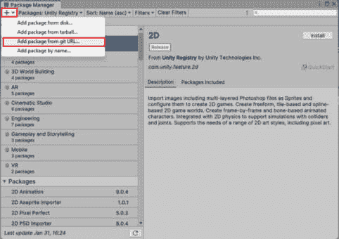
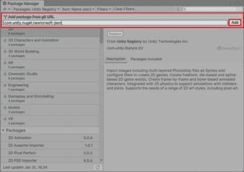

# 6

# 在 Unity 中使用 C# 进行有效的游戏数据处理和管理

欢迎来到 *第六章*，我们将深入探讨在 Unity 中使用 C# 进行有效的游戏数据处理和管理。通过实际探索，您将学习如何无缝地组织、存储和检索游戏数据。从理解数据组织和序列化到实现保存和加载系统，您将能够赋予玩家保存进度并构建动态、数据驱动的游戏体验的能力。到本章结束时，您将掌握使用 C# 进行高效游戏数据管理的艺术，解锁沉浸式游戏的无尽可能性。让我们共同踏上这段旅程，掌握游戏数据管理将开启游戏开发中无限创造力的门户。

在本章中，我们将涵盖以下主要主题：

+   使用 C# 进行数据组织和序列化

+   使用 C# 创建保存和加载系统

+   使用 C# 的数据驱动游戏玩法

# 技术要求

要完成本章，您必须具备以下条件：

+   **Unity 版本 2022.3.13**：下载并安装 Unity，选择 **2022.3.13** 版本以获得与提供内容的最优兼容性。

+   **主要 IDE – Visual Studio 2022**：本章中的教程和代码示例都是使用 Visual Studio 2022 制作的。请确保已安装，以便您可以无缝地跟随。如果您更喜欢 Rider 或其他 IDE，请随意探索，但请注意，提供的说明是为 Visual Studio 定制的。

+   **代码示例的 GitHub 仓库**：您可以通过本书的专用 GitHub 仓库访问本章的代码示例和项目文件：[`github.com/PacktPublishing/Mastering-Unity-Game-Development-with-C-Sharp/tree/main/Assets/Chapter%2006`](https://github.com/PacktPublishing/Mastering-Unity-Game-Development-with-C-Sharp/tree/main/Assets/Chapter%2006)。克隆或下载仓库，以便您可以轻松访问本章提供的代码。

# 使用 C# 进行数据组织和序列化

在本节中，我们将深入探讨 Unity 中使用 C# 进行数据组织和序列化。在这里，我们将学习如何高效地管理游戏数据。首先，我们将讨论选择合适的数据结构，例如数组和列表，以及如何创建自己的数据结构。然后，我们将介绍序列化，它有助于保存和加载游戏数据。接着，我们将探索 Unity 的选项，例如 **JavaScript 对象表示法**（**JSON**）和 **可扩展标记语言**（**XML**）。通过一些简单的示例，我们将向您展示如何使用 C# 整洁地组织和保存游戏数据。让我们开始学习如何掌握游戏数据管理吧！

## 理解数据结构

选择适合你在游戏中存储信息的数据结构需要考虑诸如数据类型、访问频率以及你需要对该数据进行哪些操作等因素。以下是一些示例，说明你可以如何选择正确的方法：

+   **数组**：当你有一个固定大小的相同类型元素集合时，请使用数组。

    比如，如果你有一个具有固定等级数量的游戏，如下面的代码所示，你可能使用数组来存储等级数据，例如每个等级的分数或完成状态：

    ```cs
    int[] levelScores = new int[10]; // An array to store scores for 10 levels
    ```

+   **列表**：列表是动态数组，可以在运行时增长或缩小。当你需要频繁地添加或删除元素时，它们是合适的。

    例如，如果你有一个具有动态添加或删除物品的库存系统的游戏，列表会更合适。看看以下代码的例子：

    ```cs
    List<string> inventoryItems = new List<string>(); // A list to store inventory items
    inventoryItems.Add("Sword");
    inventoryItems.Add("Potion");
    ```

+   **字典**：当你需要将键与值关联时，字典很有用。它们在需要根据特定键快速查找值的情况下非常理想。

    +   比如，如果你有一个排行榜的游戏，你可能使用字典将玩家名字映射到他们的分数，如下所示：

        ```cs
        Dictionary<string, int> leaderboard = new Dictionary<string, int>(); leaderboard.Add("Player1", 1000);
        leaderboard.Add("Player2", 1500);
        ```

+   **自定义数据结构**：有时，内置的数据结构都不完全适合你的需求。在这种情况下，你可以创建定制的、符合你特定要求的数据结构。

    +   例如，如果你正在开发一个复杂的角色扮演游戏（RPG），你可能创建一个自定义数据结构来表示角色属性和能力。**Character**类就是这样一种自定义数据结构：

        ```cs
        public class Character {
          public string Name;
          public int Health;
          public int AttackDamage;
        }
        ```

通过仔细考虑你的数据和你需要执行的操作，你可以为你的游戏选择最合适的数据结构，确保最佳性能和高效的数据管理。

## 通过适当选择数据结构来增强游戏性能

在游戏制作的世界里，速度和效率最为重要，选择合适的数据结构至关重要。这有助于游戏制作者实现更流畅、更快的游戏体验，使他们的游戏对玩家来说更加有趣。

选择合适的数据结构可以从几个方面显著提高游戏性能：

+   **优化内存使用**：使用正确的数据结构有助于最小化内存使用，这对于性能至关重要，尤其是在资源密集型游戏中。

    +   例如，如果你的游戏只需要存储固定数量的相同类型元素，使用数组而不是列表可以节省内存，因为数组具有固定的大小。

+   **更快的访问和检索**：某些数据结构提供了更快的访问和检索时间，这可以提高整体游戏响应速度。

    +   比如，字典提供了常数时间的查找，这使得它们在需要根据键快速检索值的情况下非常理想，例如在排行榜中访问玩家数据。

+   **高效的数据操作**：选择合适的数据结构可以简化数据操作，从而带来更流畅的游戏体验。

    +   例如，列表允许高效地插入和删除元素，这使得它们适合动态场景，如管理经常添加或删除物品的库存。

+   **增强代码可读性和可维护性**：使用合适的数据结构可以使你的代码更易于阅读和维护，从而简化调试和未来的更新。针对游戏特定需求定制的自定义数据结构可以改善代码组织性和清晰度，使你和其他开发者更容易理解和修改代码库。

    +   例如，如果你的游戏包含挑战，你可以设计一个专门用于管理这些挑战的自定义类。在这个类中，你可以包含诸如奖励列表和每个挑战的唯一标识符等属性。这种方法增强了代码库的可读性。

+   **减少处理开销**：最佳数据结构有助于减少处理开销，从而带来更流畅的游戏体验和更好的整体性能。

    +   例如，如果你的游戏需要按特定顺序遍历元素集合，使用列表而不是字典可以消除不必要的键值对查找，从而缩短迭代时间。

总结来说，选择合适的数据结构对于优化游戏性能至关重要，因为它有助于最小化内存使用，提高访问时间，简化数据操作，增强代码可读性，并减少处理开销。通过了解不同数据结构的特性和优势，游戏开发者可以为玩家设计更高效和响应迅速的游戏体验。

在接下来的小节中，我们将更深入地探讨 Unity 的序列化，探讨其在高效保存和加载数据中的作用。

## Unity 中的序列化

**序列化**是将复杂对象或数据结构转换为易于存储或传输的格式，并在以后重新构造的过程。在 Unity 游戏开发中，序列化在保存和加载游戏数据方面发挥着关键作用。通过序列化游戏对象及其属性，Unity 可以将它们存储为可以保存到磁盘或通过网络传输的格式，从而实现会话间的持久性，并启用保存游戏和网络多人游戏等功能。

序列化是游戏开发的一个基本方面，原因有以下几点：

+   **会话间的持久性**：序列化允许游戏状态和玩家进度在游戏会话之间保存和加载。这使得保存和加载游戏进度、维护玩家库存和保留游戏设置等功能成为可能。

+   **网络通信**：序列化有助于在网络中传输游戏数据，这对于多人游戏、客户端-服务器架构和在线功能至关重要。通过序列化游戏对象和消息，Unity 可以高效地在客户端和服务器之间发送数据。

+   **数据交换**：序列化允许数据在不同系统和平台之间交换。例如，游戏数据可以序列化为标准化的格式，如 JSON 或 XML，使其能够与其他应用程序共享或与网络服务集成。

+   **数据持久性**：序列化允许数据以结构化格式（如文件或数据库）存储，确保即使在游戏不运行时数据也能持久存在。这对于保存和加载用户偏好、高分和游戏配置等功能至关重要。

通过理解序列化的原理并掌握 Unity 的序列化选项，我们可以实现强大且灵活的数据管理系统，实现如保存游戏、网络多人游戏和数据驱动游戏机制等功能。序列化是我们工具箱中的基本工具，使我们能够创建跨平台和类型的沉浸式和动态游戏体验。序列化是我们工具箱中的基本工具，赋予我们创建跨平台和类型的沉浸式和动态游戏体验的能力。

在 Unity 中，序列化无缝集成到引擎的工作流程中，使我们能够轻松地使用内置的 API 和实用工具保存和加载游戏数据。Unity 提供了各种序列化选项，包括 JSON、XML 和二进制序列化，每个都适合不同的用例和需求。正如我们在这个部分所看到的。

让我们探索 Unity 中可用的选项，以便我们将它们集成到我们的游戏中。我们将从定义每个选项并提供示例以更好地理解开始。我们将深入探讨每一个，并展示它们的用法。

### JSON 序列化和反序列化

JSON 是一种轻量级的数据交换格式，常用于在服务器和 Web 应用程序之间传输数据。在 Unity 中，JSON 序列化和反序列化对于需要与外部系统或网络服务交换数据的场景非常有用。

*示例*：在下面的代码块中，我们正在使用 Unity 内置的系统来序列化和反序列化数据：

```cs
// Serialize object to JSON string
string jsonString = JsonUtility.ToJson(myObject);
// Deserialize JSON string back to object
MyClass deserializedObject = JsonUtility.FromJson<MyClass>(jsonString);
```

### XML 序列化和反序列化

XML 是一种多用途的格式，用于数据交换和配置设置。Unity 支持 XML 序列化和反序列化，使其适用于需要与遗留系统或使用 XML 作为数据交换格式的平台集成的场景。

*示例*：以下代码块演示了如何将数据序列化和反序列化到 XML。

要使用这种类型的序列化，您必须包含`using System.IO;`和`using System.Xml.Serialization;`命名空间，如下所示：

```cs
// Serialize object to XML string
XmlSerializer serializer = new XmlSerializer(typeof(MyClass));
StringWriter writer = new StringWriter();
serializer.Serialize(writer, myObject);
string xmlString = writer.ToString();
// Deserialize XML string back to object
StringReader reader = new StringReader(xmlString);
MyClass deserializedObject = (MyClass)serializer.Deserialize(reader);
```

让我们更详细地看看这里提供的 XML 序列化和反序列化：

+   **序列化过程**：

    +   序列化是将对象转换为易于存储或传输的格式，并在以后重建的过程。

    +   **XmlSerializer** 是 .NET 框架提供的一个类，用于将对象序列化和反序列化为 XML 格式。

    +   **XmlSerializer serializer = new XmlSerializer(typeof(MyClass));**: 这行代码创建一个 **XmlSerializer** 类的实例，指定要序列化的对象类型（**MyClass**）。

    +   **StringWriter writer = new StringWriter();**: 这行代码创建一个 **StringWriter** 对象，用于将 XML 内容作为字符串写入。

    +   **serializer.Serialize(writer, myObject);**: 这行代码将 **MyClass** 类型的 **myObject** 实例序列化为 XML 格式，并将其写入 **StringWriter**。

    +   **string xmlString = writer.ToString();**: 这行代码将写入到 **StringWriter** 的 XML 内容转换为字符串表示形式，并存储在 **xmlString** 变量中。

+   **反序列化过程**：

    +   反序列化是从其序列化的 XML 表示形式重建对象的过程。

    +   **StringReader reader = new StringReader(xmlString);**: 这行代码创建一个 **StringReader** 对象，用于从字符串中读取 XML 内容。

    +   **(MyClass)serializer.Deserialize(reader);**: 这行代码将 **StringReader** 中的 XML 内容反序列化为 **MyClass** 类型的对象。此操作使用 **XmlSerializer** 类的 **Deserialize** 方法完成。

    +   反序列化的对象随后被分配给 **deserializedObject** 变量，以便在程序中使用。

总结来说，提供的代码块演示了如何使用 C# 中的 `XmlSerializer` 类将 `MyClass` 类型的对象序列化为 XML 字符串，然后使用 `XmlSerializer` 类将 XML 字符串反序列化为相同类型的对象。这个过程允许对象以 XML 格式轻松持久化到存储或通过网络传输，并在以后重建以供应用程序使用。

### 二进制序列化和反序列化

二进制序列化和反序列化非常适合需要高效保存和加载游戏数据的场景，例如实现游戏保存或在本机设备上存储配置设置。与基于文本的格式（如 JSON 或 XML）相比，二进制序列化提供了数据紧凑的表示形式，并且读写速度更快。

*示例*：以下代码块展示了如何将数据序列化和反序列化为二进制格式。

要使用此类序列化，必须包含 `using System.IO;` 和 `using System.Runtime.Serialization.Formatters.Binary;` 命名空间，如下所示：

```cs
// Serialize object to binary format
BinaryFormatter formatter = new BinaryFormatter();
MemoryStream stream = new MemoryStream();
formatter.Serialize(stream, myObject);
byte[] binaryData = stream.ToArray();
// Deserialize binary data back to object
stream = new MemoryStream(binaryData);
MyClass deserializedObject = (MyClass)formatter.Deserialize(stream);
```

让我们更详细地看看这个代码块：

+   **序列化过程**：

    +   序列化是将对象转换为易于存储或传输的格式，并在以后重建的过程。

    +   **BinaryFormatter** 是 .NET 框架提供的一个类，用于将对象序列化和反序列化为二进制格式。

    +   **BinaryFormatter formatter = new BinaryFormatter();**: 这行代码创建了一个 **BinaryFormatter** 类的实例，用于二进制序列化

    +   **MemoryStream stream = new MemoryStream();**: 这行代码创建了一个 **MemoryStream** 对象，用于在内存中存储二进制数据

    +   **formatter.Serialize(stream, myObject);**: 这行代码将 **myObject** 实例序列化为二进制格式并写入 **MemoryStream**

    +   **byte[] binaryData = stream.ToArray();**: 这行代码将写入到 **MemoryStream** 的二进制数据转换为字节数组，可以轻松存储或传输

+   **反序列化过程**:

    +   反序列化是从其序列化的二进制表示中重建对象的过程。

    +   **stream = new MemoryStream(binaryData);**: 这行代码创建了一个新的 **MemoryStream** 对象，初始化时使用存储在 **binaryData** 字节数组中的二进制数据。

    +   **(MyClass)formatter.Deserialize(stream);**: 这行代码将 **MemoryStream** 中的二进制数据反序列化为 **MyClass** 类型的对象。这里使用 **BinaryFormatter** 类的 **Deserialize** 方法。

    +   反序列化的对象随后被分配给 **deserializedObject** 变量，以便在程序中使用。

总结来说，前面的代码块展示了如何使用 C# 中的 `BinaryFormatter` 类将 `MyClass` 类型的对象序列化为二进制格式，然后将二进制数据反序列化为同一类型的对象。这个过程允许对象以二进制格式轻松持久化到存储或通过网络传输，并在稍后重建以供应用程序使用。

### ScriptableObject 序列化

**ScriptableObjects** 是 Unity 资产，允许你在序列化格式中存储数据，并在 Unity 编辑器中创建用于修改该数据的自定义编辑器界面。它们对于管理配置设置、定义游戏参数以及创建可在多个游戏对象之间共享的可重用组件非常有用。

*示例*: 在下面的代码块中，我们将探索脚本对象数据的示例。然后，我们将演示如何使用脚本对象进行序列化和反序列化。

第一个代码块包含一个用于游戏设置的 ScriptableObject，封装了与游戏操作相关的必要数据：

```cs
[CreateAssetMenu(fileName = "NewSettings", menuName = "Game Settings")]
public class GameSettings : ScriptableObject {
    public int playerHealth;
    public int enemyCount;
    public float playerSpeed;
}
```

对于第二个代码块，`SettingsManager` 类包含对 `GameSettings` 数据的引用，并包括保存和加载设置的函数：

```cs
public class SettingsManager : MonoBehaviour {
    public GameSettings gameSettings;
    // Serialize the GameSettings ScriptableObject to a file
    public void SaveSettings() {
        string jsonSettings = JsonUtility.ToJson(gameSettings);
        System.IO.File.WriteAllText(Application.persistentDataPath + "/settings.json", jsonSettings);
    }
    // Deserialize the GameSettings ScriptableObject from a file
    public void LoadSettings() {
        if (System.IO.File.Exists(Application.persistentDataPath + "/settings.json")) {
            string jsonSettings = System.IO.File.ReadAllText(Application.persistentDataPath + "/settings.json");
            gameSettings = JsonUtility.FromJson<GameSettings>(jsonSettings);
        }
    }
}
```

让我们更详细地看看 `SettingsManager` 类：

+   **SaveSettings()** 方法:

    +   **public void** **SaveSettings() { ... }**: 这个方法负责将游戏设置保存到文件

    +   **JsonUtility.ToJson(gameSettings)**: 这个方法将 **gameSettings** 对象序列化为 JSON 格式

    +   **System.IO.File.WriteAllText(...)**: 这个方法将序列化的 JSON 数据写入应用程序持久数据路径中名为 **settings.json** 的文件

+   **LoadSettings()** 方法：

    +   **public void LoadSettings() { ... }**：此方法负责从文件中加载游戏设置

    +   **System.IO.File.Exists(...)**：此方法检查持久数据路径中是否存在 **settings.json** 文件

    +   **System.IO.File.ReadAllText(...)**：此方法从 **settings.json** 文件中读取 JSON 数据

    +   **JsonUtility.FromJson<GameSettings>(jsonSettings)**：此方法将 JSON 数据反序列化回 **GameSettings** 对象，并将其分配给 **gameSettings** 变量

总体来说，`SettingsManager` 类提供了使用 JSON 序列化和反序列化来保存和加载游戏设置的函数。它展示了在 Unity 中处理持久数据的文件 I/O 操作的基本方法。

关于 ScriptableObjects，我们有使用 XML 或二进制格式保存它们的灵活性，并将它们视为封装特定数据的自定义类。

总结来说，在 Unity 中选择合适的序列化和反序列化选项取决于数据交换需求、性能考虑以及与外部系统的集成。了解每个选项的优势和局限性，使开发者能够做出明智的决定，并在他们的 Unity 项目中实施高效的数据管理解决方案。

在理解数据组织的重要性之后，让我们考虑保存和加载系统在游戏管理中的作用。

# 使用 C# 创建保存和加载系统

保存和加载系统在管理游戏进度和确保无缝玩家体验方面发挥着关键作用。在本节中，我们将深入探讨各种方法，从基本的 **PlayerPrefs** 到更健壮的基于文件的保存系统，使我们作为开发者能够高效地保存和检索 Unity 中的玩家数据。

## PlayerPrefs

Unity 中的 PlayerPrefs 作为存储键值对的简单解决方案，这对于保存简单的游戏数据至关重要。理解 PlayerPrefs 对于在 Unity 项目中高效管理基本玩家偏好和进度是基本的。作为键值存储，PlayerPrefs 特别设计用于在游戏会话之间存储玩家偏好和小量数据。其简单的界面简化了数据的设置和检索，使其非常适合管理设置、用户偏好和基本游戏进度。

### 使用技巧

让我们探索在 Unity 游戏开发中最大化 PlayerPrefs 优势的必要使用技巧，包括数据序列化、加密和安全措施，以及性能优化技术：

+   **数据序列化**：虽然 PlayerPrefs 本地支持存储基本数据类型，如整数、浮点数和字符串，但更复杂的数据结构需要序列化。我们可以将自定义数据结构序列化成与 PlayerPrefs 兼容的格式，从而实现存储和检索复杂游戏数据。

+   **加密和安全**：在将敏感玩家数据存储在**PlayerPrefs**之前，可以通过实现加密机制来保护它们。通过加密**PlayerPrefs**数据，我们可以防止未经授权的访问并保护玩家隐私。

+   **优化性能**：**PlayerPrefs**访问涉及磁盘 I/O 操作，这可能会影响性能，尤其是在资源密集型游戏中。为了减轻性能开销，尽可能批量执行**PlayerPrefs**操作，并在游戏过程中最小化频繁的读写操作。

结合这些使用技巧将帮助我们优化**PlayerPrefs**的使用，确保数据安全、性能高效，并在 Unity 项目中有效处理复杂游戏数据。

现在，让我们看看一个示例，演示如何利用**PlayerPrefs**保存和加载数据。

在这个第一个代码块中，**GameData**类是一个自定义类，包含必须保存和加载的游戏数据字段：

```cs
// Define a class for game data serialization
[System.Serializable]
public class GameData {
    public int playerLevel;
    public int playerExperience;
    // Additional game data fields...
}
```

第二个代码块包含保存和加载函数，它们使用**GameData**类和**PlayerPrefs**：

```cs
// Save game data to PlayerPrefs
public void SaveGame() {
    GameData gameData = new GameData();
    // Populate game data with current game state
    gameData.playerLevel = PlayerController.instance.level;
    gameData.playerExperience = PlayerController.instance.experience;
    // Serialize game data to JSON
    string jsonData = JsonUtility.ToJson(gameData);
    // Save serialized data to PlayerPrefs
    PlayerPrefs.SetString("GameData", jsonData);
    PlayerPrefs.Save();
}
// Load game data from PlayerPrefs
public void LoadGame() {
    if (PlayerPrefs.HasKey("GameData")) {
        // Retrieve serialized data from PlayerPrefs
        string jsonData = PlayerPrefs.GetString("GameData");
        // Deserialize JSON data to game data object
        GameData gameData = JsonUtility.FromJson<GameData>(jsonData);
        // Apply loaded game data to game state
        PlayerController.instance.level = gameData.playerLevel;
        PlayerController.instance.experience = gameData.playerExperience;
    }
}
```

让我们更详细地看看保存和加载函数：

+   **SaveGame()**:

    +   此函数负责保存游戏数据。

    +   它初始化**GameData**类的新实例，该实例可能包含表示游戏状态各个方面的字段。

    +   当前游戏状态随后被捕获并存储在**GameData**实例中。在这个例子中，它似乎是从**PlayerController**单例实例中捕获玩家的等级和经验。

    +   接下来，使用**JsonUtility.ToJson()**将游戏数据序列化为 JSON 格式。

    +   最后，使用**PlayerPrefs.SetString()**和**GameData**键将序列化的 JSON 数据存储在**PlayerPrefs**中，并调用**PlayerPrefs.Save()**以持久化更改。

+   **LoadGame()**:

    +   此函数加载保存的游戏数据。

    +   首先，它检查是否通过使用**GameData**键和**PlayerPrefs.HasKey()**在**PlayerPrefs**中存储了现有的游戏数据。

    +   如果有保存的数据，它将使用**PlayerPrefs.GetString("GameData")**从**PlayerPrefs**中检索序列化的 JSON 字符串。

    +   然后使用**JsonUtility.FromJson<GameData>()**将 JSON 数据反序列化回**GameData**对象。

    +   最后，加载的游戏数据应用于游戏状态。在这个例子中，它似乎是将玩家的等级和经验恢复到保存的值。

总体而言，这些函数提供了一个简单的机制，用于使用**PlayerPrefs**保存和加载数据，允许在会话之间基本持久化游戏状态。

既然我们已经讨论了**PlayerPrefs**的显著好处，让我们看看它可能不是最佳选择的情况。

### 探索**PlayerPrefs**的限制和替代方案

虽然**PlayerPrefs**为 Unity 游戏存储少量数据提供了便利和简单性，但它也有几个限制和缺点，这可能会促使我们探索替代解决方案：

+   **存储容量有限**：PlayerPrefs 的存储容量有限，这使得它不适合存储大量数据或复杂数据结构。尝试在 PlayerPrefs 中存储过多数据可能导致性能问题和内存限制。

+   **安全担忧**：PlayerPrefs 数据以纯文本形式存储在玩家的注册表中（在 Windows 上）或**plist**文件中（在 macOS 和 iOS 上），这使得它容易受到篡改和未经授权的访问。对于需要增强安全措施或符合数据保护法规的应用程序，PlayerPrefs 可能无法为敏感数据提供充分保护。

+   **平台依赖性**：PlayerPrefs 的存储位置和行为可能因不同平台和设备而异。这种平台依赖性在将游戏部署到多个平台时可能会引入不一致性和兼容性问题，需要开发者实现特定平台的处理或替代存储解决方案。

+   **数据类型有限**：PlayerPrefs 支持有限的数据类型，包括整数、浮点数和字符串。复杂数据结构、数组或自定义对象不能直接存储在 PlayerPrefs 中，除非进行序列化和转换，这会导致额外的复杂性和潜在的性能开销。

+   **持久性挑战**：PlayerPrefs 数据在游戏会话之间持续存在，但它可能不会在不同的设备或安装之间持续存在。卸载或重新安装游戏、清除应用程序数据或切换设备可能导致 PlayerPrefs 数据丢失，影响玩家进度和偏好。

+   **性能开销**：访问 PlayerPrefs 涉及磁盘 I/O 操作，这可能会引入性能开销，尤其是在频繁读取或写入大量数据时。对于需要高性能数据存储或实时数据访问的应用程序，PlayerPrefs 可能无法满足性能要求。

由于这些限制和考虑，我们可能会选择替代的数据存储解决方案，例如二进制序列化、JSON 序列化、数据库系统或基于云的存储服务。这些解决方案为管理游戏数据提供了更大的灵活性、可伸缩性、安全性和性能，尤其是在涉及大量数据集、复杂数据结构或严格安全要求的情况下。虽然 PlayerPrefs 对于简单的数据存储需求来说是一个方便的选项，但在为 Unity 游戏设计数据管理系统时，我们应该仔细评估我们的需求并考虑替代方案。

## 自定义保存系统

在游戏制作不断变化的世界中，对强大且灵活的保存系统的需求越来越明显。现在，请进入自定义保存系统——这是一个旨在以技能和效率处理数据管理复杂性的智能解决方案。与通常的方法，如 PlayerPrefs 不同，**自定义保存系统**为我们提供了一套多功能工具，包括加密、云保存选项以及与可脚本化对象的平滑集成。

### 自定义保存系统功能

让我们来看看我们可以在自定义保存系统中使用哪些功能：

+   **通用功能**：自定义保存系统具有用于保存和加载数据的通用功能，允许与各种可脚本化对象无缝集成。通过针对每种数据类型的特定需求定制的动态参数和返回值，它确保了数据管理中的适应性和多功能性。

+   **加密和解密**：在游戏开发的世界中，安全性至关重要。利用加密和解密机制，自定义保存系统确保敏感玩家数据的机密性和完整性。通过强大的加密算法，它保护免受未经授权的访问和篡改，培养玩家的信任和信心。

我们将首先通过创建可脚本化对象来管理系统的数据来开始。我将草拟 `PlayerData` 脚本，该脚本将存储关键玩家信息，如下面的代码块所示：

```cs
  [CreateAssetMenu(fileName = "PlayerData", menuName = "Data/Player Data")]
  public class PlayerData : ScriptableObject
  {
      public string playerName;
      public int playerLevel;
      public float playerExperience;
  }
```

此外，我还会为 `GameSettings` 创建一个脚本，该脚本将存储相关游戏数据，如下面的代码块所示：

```cs
    [CreateAssetMenu(fileName = "GameSettings", menuName = "Data/Game Settings")]
    public class GameSettings : ScriptableObject
    {
        public int soundVolume;
        public bool isFullScreen;
        public int graphicsQuality;
    }
```

创建这些脚本后，您可以右键单击，选择 `Data` 并将实例放入其中。一旦完成，它们的结构将与 *图 6.1* 中显示的设置实例类似：


图 6.1 – 游戏设置 ScriptableObject 实例

这些数据文件仅用于演示目的，允许您根据项目需求进行调整。

接下来，我们将创建一个保存管理脚本。但在深入之前，我们必须集成 `2022.3.13`。请按照以下步骤操作：

1.  导航到顶部栏并打开 **Window** 菜单，然后选择 **Package Manager**。点击位于左上角的 **Add** 按钮。此操作将弹出一个菜单，如图 *图 6.2* 所示：



图 6.2 – 在包管理器面板中添加来自 git URL 的包

1.  将 [com.unity.nuget.newtonsoft-json](https://com.unity.nuget.newtonsoft-json) 粘贴到提供的面板中，然后点击 **Add**，如图 *图 6.3* 所示：



图 6.3 – 在包管理器面板中添加 git URL 的链接

在创建`SaveManager`脚本之前，等待安装完成并让 Unity 编辑器编译。

### `SaveManager`脚本

这个脚本是我们游戏中负责保存和加载数据的基本组件。如前所述，这种方法不是标准的，而是我们将用于我们游戏的一种方法。请随意采用这种方法或根据您的需求实现自己的方法。以下代码块包含`SaveManager`脚本：

```cs
    public class SaveManager : MonoBehaviour
    {
        private const string saveFileName = "saveData1.dat";
        private const string cloudSaveFileName = "cloudSaveData.dat";
        private static byte[] key = Convert.FromBase64String("kwAXmhR48HenPp04YXrKSNfRcFSiaQx35BlHnI7kzK0=");
        private static byte[] iv = Convert.FromBase64String("GcVb7iqWex9uza+Fcb3BCQ==");
        public static void SaveData(string key, string data)
        {
            string filePath = Path.Combine(Application.persistentDataPath, saveFileName);
            // Load existing data
            Dictionary<string, string> savedData = LoadSavedData();
            // Add or update data based on its key
            savedData[key] = data;
            // Serialize the entire dictionary
            string jsonData = JsonConvert.SerializeObject(savedData);
            byte[] encryptedData = EncryptData(jsonData);
            // Write the serialized data to the file
            using (FileStream fileStream = new FileStream(filePath, FileMode.Create))
            {
                fileStream.Write(encryptedData, 0, encryptedData.Length);
            }
        }
        public static string LoadData(string key)
        {
            string filePath = Path.Combine(Application.persistentDataPath, saveFileName);
            // Load existing data
            Dictionary<string, string> savedData = LoadSavedData();
            // Extract data based on its key
            if (savedData.ContainsKey(key))
            {
                return savedData[key];
            }
            else
            {
                Debug.LogWarning("No save data found for key: " + key);
                return null;
            }
        }
```

让我们更详细地看看其他脚本将使用的保存和加载方法：

+   **SaveData**:

    +   将键值对保存到文件中

    +   根据密钥加载现有数据，更新或添加新数据，并将字典序列化为 JSON

    +   将 JSON 数据加密并写入文件

+   **LoadData**:

    +   根据提供的密钥从保存文件中加载数据

    +   检查密钥是否存在于字典中，并返回相应的值

    +   如果密钥不存在，记录警告并返回**null**

以下代码块包含处理输入/输出操作的静态方法，用于加载和保存游戏数据：

```cs
        private static Dictionary<string, string> LoadSavedData()
        {
            string filePath = Path.Combine(Application.persistentDataPath, saveFileName);
            if (File.Exists(filePath))
            {
                byte[] encryptedData = File.ReadAllBytes(filePath);
                string jsonData = DecryptData(encryptedData);
                return JsonConvert.DeserializeObject<Dictionary<string, string>>(jsonData);
            }
            else
            {
                Debug.LogWarning("No save data found.");
                return new Dictionary<string, string>();
            }
        }
        public static void DeleteSaveData()
        {
            string filePath = Path.Combine(Application.persistentDataPath, saveFileName);
            if (File.Exists(filePath))
            {
                File.Delete(filePath);
                Debug.Log("Save data deleted.");
            }
            else
            {
                Debug.LogWarning("No save data found to delete.");
            }
        }
```

让我们更详细地看看之前的代码块：

+   **LoadSavedData**:

    +   从文件中加载保存的数据，并将其作为字典返回

    +   读取加密数据，解密它，将 JSON 反序列化为字典，并返回它

+   **DeleteSaveData**：如果存在，则删除保存数据文件

在以下代码块中，我们处理加密和解密以保护数据：

```cs
        private static byte[] EncryptData(string data)
        {
            using (Aes aesAlg = Aes.Create())
            {
                aesAlg.Key = key;
                aesAlg.IV = iv;
                ICryptoTransform encryptor = aesAlg.CreateEncryptor(aesAlg.Key, aesAlg.IV);
                using (MemoryStream msEncrypt = new MemoryStream())
                {
                    using (CryptoStream csEncrypt = new CryptoStream(msEncrypt, encryptor, CryptoStreamMode.Write))
                    {
                        using (StreamWriter swEncrypt = new StreamWriter(csEncrypt))
                        {
                            swEncrypt.Write(data);
                        }
                        return msEncrypt.ToArray();
                    }
                }
            }
        }
        private static string DecryptData(byte[] encryptedData)
        {
            using (Aes aesAlg = Aes.Create())
            {
                aesAlg.Key = key;
                aesAlg.IV = iv;
                ICryptoTransform decryptor = aesAlg.CreateDecryptor(aesAlg.Key, aesAlg.IV);
                using (MemoryStream msDecrypt = new MemoryStream(encryptedData))
                {
                    using (CryptoStream csDecrypt = new CryptoStream(msDecrypt, decryptor, CryptoStreamMode.Read))
                    {
                        using (StreamReader srDecrypt = new StreamReader(csDecrypt))
                        {
                            return srDecrypt.ReadToEnd();
                        }
                    }
                }
            }
        }
    }
```

让我们考虑加密方法（`EncryptData`和`DecryptData`）：

+   使用**AES**加密算法加密和解密数据

+   使用加密密钥和**IV**（**EncryptData**）对输入数据进行加密

+   使用相同的密钥和**IV**（**DecryptData**）解密加密数据

在这个脚本中，有一个名为`SaveData`的方法用于保存数据。它需要数据以字符串格式提供，以及相应的密钥。我们选择将数据存储在字符串和字符串的字典中，这样我们就可以轻松地管理各种文件的加载和保存数据。

对于加载，我们解密字符串数据然后加载它。

此外，我还实现了**AES 加密**方法来在加密和解密过程中保护数据。虽然 AES 加密的细节超出了本书的范围，但如果你对学习加密技术感兴趣，鼓励你进一步探索。

为了方便生成密钥和 IV，我准备了一个辅助脚本。您可以通过将此脚本附加到场景中的 GameObject 来使用此脚本。此脚本将使您能够为加密目的创建必要的密钥和 IV。您可以在`SaveManager`脚本中找到生成的密钥；无需重复创建过程，因为它只发生一次。

你可以从以下代码块中获取`KeyAndIVGenerator`脚本：

```cs
public class KeyAndIVGenerator : MonoBehaviour
{
    public static void GenerateKeyAndIV()
    {
        using (Aes aes = Aes.Create())
        {
            aes.GenerateKey();
            aes.GenerateIV();
            // Convert key and IV to base64 strings for easy storage and usage
            string base64Key = Convert.ToBase64String(aes.Key);
            string base64IV = Convert.ToBase64String(aes.IV);
            Debug.Log("Generated Key: " + base64Key);
            Debug.Log("Generated IV: " + base64IV);
        }
    }
    private void Start()
    {
        GenerateKeyAndIV();
    }
}
```

以下是`KeyAndIVGenerator`类的说明：

+   **KeyAndIVGenerator** 类包含一个名为 **GenerateKeyAndIV** 的方法，该方法负责生成加密密钥和 **初始化** **向量**（**IV**）。

+   在 **GenerateKeyAndIV** 方法内部，**KeyAndIVGenerator** 类使用 **Aes.Create()** 方法创建一个 **Aes** 类的实例，它代表 AES 算法。

+   然后，它调用 **Aes** 实例上的 **GenerateKey()** 和 **GenerateIV()** 方法来生成随机的加密密钥和 **IV**。

+   在生成密钥和 **IV** 后，它使用 **Convert.ToBase64String()** 方法将它们转换为 base64 字符串。**Base64** 编码用于方便地存储和使用密钥和 **IV**。

+   最后，它使用 **Debug.Log()** 将生成的密钥和 **IV** 记录到控制台，用于调试目的。

+   当 **KeyAndIVGenerator** 对象被初始化时，会调用 **Start** 方法，并调用 **GenerateKeyAndIV** 方法来生成密钥和 **IV**。

总体而言，此代码块展示了如何使用 AES 算法生成加密密钥和 `IV` 值，并将它们转换为 `base64` 字符串以进行存储和使用。这在密码学中常用于保护数据。

下面的代码块提供了一个 `GameManager` 脚本的示例，该脚本利用 `SaveManager` 中的保存和加载方法来管理保存和加载 `PlayerData` 和 `GameSettings` 的过程：

```cs
    public class GameManager : MonoBehaviour
    {
        public PlayerData playerData;
        public GameSettings gameSettings;
        private void Start()
        {
            LoadGameData();
        }
        private void OnApplicationQuit()
        {
            SaveGameData();
         }
```

让我们考虑 Unity 回调函数：

+   在 **Start** 方法中，当游戏开始时，它会调用 **LoadGameData** 函数来加载玩家数据和游戏设置。

+   当应用程序即将退出时，会调用 **OnApplicationQuit** 方法，并在退出前调用 **SaveGameData** 函数来保存玩家数据和游戏设置。

下面的代码块包含了加载和保存数据的逻辑：

```cs
        private void LoadGameData()
        {
            if (playerData == null)
            {
            }
            else
            {
                JsonUtility.FromJsonOverwrite(SaveManager.LoadData("playerData"), playerData);
            }
            if (gameSettings == null)
            {
                gameSettings = ScriptableObject.CreateInstance<GameSettings>();
            }
            else
            {  JsonUtility.FromJsonOverwrite(SaveManager.LoadData("gameSettings"), gameSettings);
            }
        }
        private void SaveGameData()
        {
            SaveManager.SaveData("playerData", JsonUtility.ToJson(playerData));
            SaveManager.SaveData("gameSettings", JsonUtility.ToJson(gameSettings));
        }
    }
```

让我们更详细地查看保存和加载函数：

+   **LoadGameData** 函数使用 **SaveManager.LoadData** 方法从保存文件中加载玩家数据和游戏设置。如果找不到数据，它将创建新的 **PlayerData** 和 **GameSettings** 实例。

+   **SaveGameData** 函数使用 **SaveManager.SaveData** 方法将玩家数据和游戏设置保存到保存文件中。在保存之前，它使用 **JsonUtility.ToJson** 将数据对象转换为 JSON 格式。

总体而言，此代码块展示了使用 JSON 序列化加载和保存游戏数据的基本实现。它确保玩家数据和游戏设置在游戏会话之间持久化，从而实现无缝的游戏体验。

在本节中，我们学习了如何保存和加载可脚本化对象，保存和加载到文件的技巧，使用 AES 加密以保护数据，以及如何生成加密密钥。最后，我们实际练习了使用这些概念。

现在，我们需要了解使用自定义方法而不是 PlayerPrefs 的好处。

### 相对于 PlayerPrefs 的优势

虽然 PlayerPrefs 提供了简单性，但自定义保存系统超越了其限制，提供了传统存储方法所不具备的各种功能和特性。通过减少性能开销和提高数据安全性，它标志着 Unity 游戏开发中数据管理新时代的到来。

总结来说，自定义保存系统代表了创新和创造力——这是对游戏开发中持续追求卓越的证明。凭借其简化数据管理、增强安全措施和提高玩家体验的能力，它已成为现代游戏开发实践的基础，每次保存都在重塑这一领域。

在下一节中，我们将实现游戏进度部分的 ScriptableObjects，同时保存和加载数据。

# 使用 C# 进行数据驱动游戏

**数据驱动设计**是一种游戏开发方法，其中游戏行为、内容和配置由外部数据文件定义和控制，而不是硬编码到游戏源代码中。这种方法提供了几个好处，包括提高灵活性、更容易的内容迭代和增强的可维护性。通过将游戏数据与代码分离，我们可以修改游戏行为、调整参数和添加新内容，而无需进行代码更改，从而加速迭代周期并赋予设计师在游戏机制方面进行实验的权力。

让我们从 ScriptableObjects 在管理数据方面的一个用途开始。

## 创建统计数据的数据

我们的项目中有一个 `PlayerMovement` 脚本，如下面的代码块所示，它处理玩家的移动：

```cs
   public class PlayerMovement : MonoBehaviour
   {
       public float moveSpeed = 5f;
       public float jumpForce = 5f;
       public float dashForce = 10f;
       public float dashCooldown = 2f;
       public Transform groundChecker;
       public LayerMask groundLayer;
       public float groundDistance;
       public Rigidbody playerRigidbody;
       private bool isGrounded = true;
       private bool canDash = true;
       private Vector3 movementVector;
  private void MovePlayer()
  {
      Vector3 movement = new Vector3(movementVector.x , 0f , movementVector.y) * moveSpeed * Time.deltaTime;
      transform.Translate(movement);
  }
//rest of code
}
```

在这里，我们可以创建一个 ScriptableObject，它将包含玩家移动的参数，例如速度和力量。然后，我们可以获取该 ScriptableObject 的引用。

以下代码块包含一个名为 `PlayerStats` 的 ScriptableObject，它将存储移动数据：

```cs
[CreateAssetMenu(fileName = "PlayerStats", menuName = "Data/Player Stats")]
 public class PlayerStats : ScriptableObject
 {
     [SerializeField] float moveSpeed = 5f;
     [SerializeField] float jumpForce = 5f;
     [SerializeField] float dashForce = 10f;
     [SerializeField] float dashCooldown = 2f;
     public float MoveSpeed { get => moveSpeed; set => moveSpeed = value; }
     public float JumpForce { get => jumpForce; set => jumpForce = value; }
     public float DashForce { get => dashForce; set => dashForce = value; }
     public float DashCooldown { get => dashCooldown; set => dashCooldown = value; }
 }
```

现在，我们可以在玩家移动脚本中将 `PlayerStats` ScriptableObject 作为变量使用，并相应地替换掉任何之前使用移动变量的逻辑：

```cs
  public class PlayerMovement : MonoBehaviour
  {
      public PlayerStats playerStats;
      public Transform groundChecker;
      public LayerMask groundLayer;
      public float groundDistance;
      public Rigidbody playerRigidbody;
      private bool isGrounded = true;
      private bool canDash = true;
      private Vector3 movementVector;
      private void MovePlayer()
      {
        Vector3 movement = new Vector3(movementVector.x , 0f , movementVector.y) * playerStats.MoveSpeed * Time.deltaTime;
        transform.Translate(movement);
      }
  //rest of code
  }
```

我们这样做是因为我们需要一个对所有移动参数的单个引用，并且以后从其他脚本（如特殊增益）应用或调整统计数据时，将方便地不修改玩家移动脚本内的代码。我们可以直接修改 ScriptableObject，这将影响玩家的移动。

此外，如果我们游戏中包含物品，将所有数据合并到每个物品类型的单独 ScriptableObject 中将简化使用和修改所有对象的过程。在不直接引用这些对象的情况下，我们可以更改数据文件，这将影响使用该数据的所有对象。

让我们考虑 ScriptableObjects 的另一种用途。

## 挑战系统

我们可以利用 ScriptableObjects 来跟踪挑战中的玩家进度，从而有效地跟踪挑战并保存所取得的进度。

我们将首先将`CommonChallengeData`迁移到 ScriptableObject 中，如下面的代码块所示：

```cs
    [CreateAssetMenu(fileName = "CommonChallengeData", menuName = "Data/Common Challenge Data")]
    [Serializable]
    public class CommonChallengeData : ScriptableObject
    {
        public bool isCompleted;
        public RewardType rewardType; // Type of reward
        public int rewardAmount;      // Amount or value of the reward
    }
```

然后，在完成挑战之后，我们可以利用之前建立的保存管理器来存储挑战统计数据。这可以在以下代码块中的`EnemyWavesChallenge`的`CompleteChallenge`函数中看到：

```cs
    public class EnemyWavesChallenge : BaseChallenge
    {
        //Rest of Code
        public override void CompleteChallenge()
        {
            if (!commonData.isCompleted)
            {
                RewardManager.Instance.GrantReward(commonData);
                commonData.isCompleted = true;
                SaveManager.SaveData(challengeSavedKey, JsonUtility.ToJson(commonData));
            }
            else
            {
                Debug.Log("Challenge already completed!");
            }
        }
        //Rest of code
    }
```

我们在`CompleteChallenge`方法中包含了最后一行，以便在挑战的完成函数中保存挑战数据。因此，在开始挑战之前，我们将在挑战管理器中验证其完成状态。

此外，我们必须在`ChallengeManager`中的`StartChallenge`函数内使用`SaveManager`脚本的加载数据功能，如下面的代码块所示：

```cs
    public class ChallengeManager : Singlton<ChallengeManager>
    {
        //Rest of code
        public void StartChallenge(ChallengeType challengeType)
        {
            if (challengeDictionary.TryGetValue(challengeType, out BaseChallenge challengeScript))
            {
                JsonUtility.FromJsonOverwrite(SaveManager.LoadData(challengeScript.challengeSavedKey), challengeScript.commonData);
                if (!challengeScript.commonData.isCompleted)
                {
                    SetCurrentChallenge(challengeScript);
                    currentChallenge.StartChallenge();
                }
                else
                {
                    Debug.Log("Challenge already completed!");
                }
            }
            else
            {
                Debug.LogError($"No challenge script found for ChallengeType {challengeType}");
            }
        }
//Rest of code
    }
```

这是一个简单的方法，可以将现有代码转换为使用 ScriptableObjects 或改进的数据管理方法。此外，它集成了保存和加载功能，以监控挑战进度。虽然从头开始设计系统将提供更好的数据处理策略，但这个系统是按照不同的方式构建的。我们有机会在本章中对其进行修改，强调了适应现有代码库的重要性。我们将在*第七章*中深入探讨这些技能的细化。

总结来说，使用 C#进行数据驱动游戏提供了创建动态、可定制和沉浸式游戏体验的强大框架。通过采用数据驱动设计原则，并利用 ScriptableObjects 来构建模块化游戏元素，我们可以构建灵活、可扩展且吸引玩家的游戏，这些游戏能够经受时间的考验。

# 摘要

在本章中，我们探讨了对于高效游戏开发至关重要的概念和技术。我们首先探讨了数据结构的重要性及其对游戏性能的影响，强调了选择适当的数据结构以获得最佳结果的重要性。在导航 Unity 的序列化选项时，Unity 的序列化成为焦点，包括 XML、JSON 和二进制序列化方法。我们讨论了每种序列化方法的细微差别及其在不同场景中的适用性，为 Unity 项目中稳健的数据管理奠定了基础。

我们继续深入探讨 Unity 游戏开发中 PlayerPrefs 及其局限性，为自定义存档系统铺平了道路。通过详细的讨论和实际案例，我们揭示了自定义存档系统相较于 PlayerPrefs 的优势和特点，强调了其在提升数据驱动游戏体验中的作用。《SaveManager》脚本成为了一个关键组件，它通过提高效率和灵活性，实现了无缝的数据保存和加载操作。通过利用 C#和 scriptableObjects，我们得以拥抱数据驱动的游戏机制，并优化挑战系统以增强用户参与度和进步。通过细致的探索和动手学习，本章为我们提供了掌握 Unity 中 C#数据组织和序列化的知识和工具。

在*第七章*中，我们将进入协作游戏开发和版本控制系统领域。基于我们的基础知识，我们将探讨如何有效地为现有代码库做出贡献，并使用 C#在开发团队中进行协作。从理解版本控制系统到掌握代码合并和冲突解决技术，我们将掌握在共享代码库中无缝导航的必要技能。通过实际案例和逐步指导，我们将了解与共享代码库协作的复杂性，以及在团队环境中维护代码质量。加入我们，深入了解游戏开发的协作方面，为增强团队合作和代码管理实践铺平道路。
