# 使用 C#在 Unity 中为现有代码库做出贡献

欢迎来到*第七章*。本章将为您提供在 C#开发团队中工作所需的基本协作技能。我们将探讨**版本控制系统**（**VCSs**）、代码合并和冲突解决，以实现无缝团队合作。我们还将涵盖掌握版本控制、使用共享仓库协作以及使用 C#解决冲突。最后，我们将了解现有代码库，以便导航结构、审查文档和有效沟通。掌握所有这些技能将促进有效的团队贡献，并在 Unity 项目中保持代码质量。

在本章中，我们将涵盖以下主要主题：

+   介绍 VCSs

+   使用 C#协作和解决冲突

+   理解现有代码库

# 技术要求

您需要以下内容来跟随本章：

+   **主要 IDE - Visual Studio 2022**：教程和代码示例使用 Visual Studio 2022 制作。请确保已安装，以便无缝跟随。如果您更喜欢 Rider 或其他 IDE，请随意探索，尽管说明是为 Visual Studio 量身定制的。

+   **GitHub Desktop**：请确保已安装，以便无缝跟随。

# 介绍 VCSs

VCS 是软件开发中用于管理文件更改的工具。它就像一个详细的记录员，记录项目文件所做的每一项更改。

这里是为什么它很重要：

+   **跟踪更改**：在协作项目中，多个人可能对同一文件进行工作。VCS 记录所有修改，确保透明度和问责制。

+   **促进协作**：使用 VCS，团队成员可以看到谁在何时进行了特定更改。这种透明度促进了顺畅的协作并防止了冲突。

+   **撤销更改**：错误是难免的，但 VCS 允许我们在需要时回滚到文件的早期版本。它充当安全网，提供撤销错误的方法。

+   **保持组织**：VCS 通过分类更改并提供管理项目文件的结构化方法来帮助保持秩序。它使团队能够高效工作并保持组织。

总结来说，VCS 是软件开发团队的关键工具。它有助于跟踪更改，鼓励团队合作，允许修复错误，并确保项目保持组织。

在接下来的部分中，我们将深入了解理解 VCSs，探讨两种主要类型：分布式和集中式系统。

## 理解 VCSs

当您在 VCS 中创建新仓库时，您将打开主分支。这也被称为主干 master。主干 master 作为主代码库的起点，然后经过编译和部署到达最终用户。

但分支呢？分支是在从主分支提取代码以创建单独路径时发生的。这使我们能够在不影响主版本的情况下修改代码。通过使用分支，我们避免了需要在同一地点合并所有更改的需求；相反，我们可以随着时间的推移跟踪代码的修改。然后，版本控制系统可以将这些独立的分支重新集成到主分支中。如果我们不打算将其他更改合并到主分支中，我们可以将它们存储在单独的分支中，稍后进行合并。

制定良好的分支策略对于防止代码中的冲突和错误非常重要。幸运的是，健壮的版本控制系统使团队轻松与主分支同步并解决任何潜在冲突——即使主分支已经进行了更改。

现在我们已经掌握了 VCS 的基本工作原理，让我们探索两种在塑造协作开发过程中发挥关键作用的初级类型：分布式和集中式系统。

### 分布式版本控制系统

**分布式版本控制系统**（**DVCS**）是一种版本控制系统，其中每个用户都在他们的本地计算机上拥有项目仓库的完整副本。这意味着即使他们离线，你也可以继续在项目上工作。

下图显示了 DVCS 的结构：

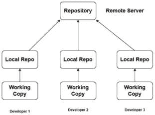

图 7.1 – DVCS 结构

这是如何工作的：

+   **本地副本**：在 DVCS 中，每个用户都有整个项目历史的本地副本，包括所有文件和随时间进行的更改。这允许你独立工作并做出更改，而不需要依赖于中央服务器。

+   **灵活的协作**：由于每个用户都有自己的仓库副本，他们可以在不影响彼此工作的情况下工作在不同的功能或修复上。他们可以将更改提交到本地仓库，并在稍后与别人分享。

+   **增强的安全性**：由于整个项目历史都存储在本地，DVCS 提供了冗余和安全。即使中央服务器宕机，你仍然可以继续在本地副本上工作，并在服务器恢复在线后同步更改。

+   **高效的分支和合并**：如**Git**这样的 DVCS 系统提供了强大的分支和合并功能。你可以创建分支来处理新功能或实验性更改，而不会影响主项目。当你准备好时，可以将你的更改合并回主分支。

Git 是 DVCS 的一个例子。它允许用户在本地计算机上维护项目仓库的完整副本。这意味着你可以访问整个项目历史，即使你离线也可以工作。

使用 Git，你可以创建分支来处理新功能或修复，而不会影响主代码库。一旦你的更改完成，这些分支可以合并回主分支。

Git 还通过允许您通过共享远程仓库与他人共享您的更改来促进团队成员之间的协作。然后，其他团队成员可以从远程仓库拉取您的更改到他们的本地副本。

总体而言，Git 的分布式特性和强大的分支功能使其成为许多开发团队的优先选择。它为软件项目的管理和跟踪变更提供了灵活性、效率和无缝协作。

总结来说，DVCS 使我们能够在去中心化的环境中独立工作，有效协作，并维护项目历史和完整性。它为软件项目的管理和跟踪变更提供了灵活性、安全性和强大的功能。

### 集中式版本控制系统

**集中式版本控制系统**（**CVCS**）是一种版本控制系统，其中有一个单一的中央仓库，存储所有文件及其相应的版本。

以下图显示了 CVCS 的结构：

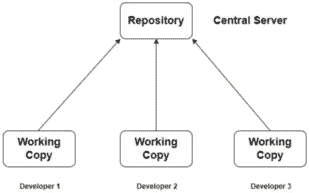

图 7.2 – CVCS 结构

这就是它的工作方式：

+   **单一仓库**：在 CVCS 中，所有用户都访问并工作在同一个中央仓库上。这意味着项目的历史只有一个副本，存储在中央服务器上。

+   **有限的离线访问**：由于仓库是集中的，用户通常需要连接到中央服务器才能访问文件并进行更改。这可能限制了离线工作或在连接有限的环境中的能力。

+   **协作工作流程**：用户直接将更改提交到中央仓库，在那里它们对所有团队成员可见。这促进了协作并确保每个人都在使用代码的最新版本。

+   **潜在的瓶颈**：在 CVCS 中，中央服务器可能成为瓶颈，尤其是在大型团队或使用量大的项目中。如果服务器宕机，开发者可能无法访问或提交更改，直到服务器恢复。

+   **有限的分支功能**：与 Git 这样的分布式系统相比，CVCS 系统通常提供有限的分支功能。当在不同的功能或更改上工作时，用户可能需要紧密协调以避免冲突。

**SVN**（或**Subversion**）是集中式版本控制系统（CVCS）的一个例子。在 SVN 中，有一个单一的中央仓库，存储所有项目文件及其相应的版本。

与 Git 这样的分布式版本控制系统（DVCS）不同，SVN 不向用户提供整个项目历史的本地副本。相反，用户直接与中央仓库交互，以访问文件并进行更改。

SVN 通过允许开发者直接将更改提交到中央仓库来促进协作工作流程。这确保了每个人都在使用代码的最新版本，并有助于维护项目完整性。

虽然 SVN 缺乏一些分布式版本控制系统（DVCSs）的灵活性和离线功能，但它仍然是许多开发团队的首选，尤其是在需要严格控制代码库的中心化环境中。

总结来说，集中式版本控制系统（CVCS）依赖于单个中央仓库来存储和管理项目文件和版本。虽然它促进了协作并提供了一个集中的**真相来源**（**SoT**），但它可能在离线访问、潜在瓶颈和有限的分支能力方面带来挑战。

接下来，让我们深入了解必要的 Git 命令。

在下面的表格中，您将找到必要的 Git 命令。请确保您的系统已安装 Git：

| **命令** | **描述** |
| --- | --- |
| **git init** | 在当前目录中初始化一个新的 Git 仓库 |
| **git clone [url]** | 从远程服务器克隆现有的 Git 仓库到本地机器 |
| **git add [file]** | 将文件或更改添加到暂存区，以便包含在下一个提交中 |
| **git commit -m "[message]"** | 使用描述性消息将更改提交到本地仓库 |
| **git push** | 将本地仓库内容上传到远程仓库 |
| **git pull** | 从远程仓库下载更改并将其合并到本地仓库 |
| **git status** | 显示工作目录和暂存区的状态 |
| **git log** | 显示仓库中的提交列表，包括作者、日期和提交信息等详细信息 |
| **git branch** | 列出本地仓库中的所有分支 |
| **git checkout [branch]** | 切换到指定的分支 |
| **git merge [branch]** | 将指定分支的更改合并到当前分支 |
| `git` `remote -v` | 列出与本地仓库关联的所有远程仓库 |

许多命令可能令人感到不知所措，尤其是考虑到我们书籍的背景。因此，我们将依赖图形用户界面（**GUI**）工具，如 GitHub Desktop 应用程序进行版本控制，其中大多数操作都可以通过用户界面（**UI**）完成。请随意依赖 GUI 来完成所有过程。

在下一节中，我们将探讨代码协作的最佳实践和高效解决冲突的方法。

# 使用 C# 进行协作和解决冲突

在协作环境中导航和维护代码质量是软件开发的重要方面。让我们在以下章节中探讨有效的协作、冲突解决和代码质量维护。

## 协作的最佳实践

高效的协作对于项目成功开发至关重要，采用最佳实践可以确保在整个过程中团队协作和代码管理顺畅。以下是一些在与其他版本控制系统（VCSs）一起工作时需要遵循的最佳实践：

+   **频繁和增量提交以实现流畅的工作流程**：进行小而频繁的提交是提高工作流程的简单而有效的方法，尽管这对一些开发者来说是一个挑战。在其他项目管理工具的背景下，任务通常被分解成可管理的部分，同样的方法也应该应用于提交。每个提交应专门对应一个任务或票据，除非一行代码奇迹般地解决了多个问题。对于更广泛的功能，将其分解成更小的任务并为每个任务创建提交是有益的。选择较小提交的主要优势是，在出现问题时，更容易检测和撤销不希望的变化。

+   **优先获取最新更改**：养成在可行时将仓库中的最新更改获取到工作副本中的习惯。不建议孤立工作，因为这会增加遇到合并冲突的风险。

+   **谨慎提交以实现流畅的工作流程**：避免仓促提交。**commit -a** 命令或其等效命令仅在项目的初始提交时使用，通常情况下，项目仅包含**README.md**文件。提交应仅包含与提交到仓库的特定更改相关的文件。在处理 Unity 项目时，要格外小心，因为某些修改可能会意外地影响多个文件，例如场景、预制件或精灵图集，即使不是有意为之。不小心提交更改到另一个团队成员正在同时编辑的场景可能会导致他们在自己的提交过程中遇到问题，需要事先合并您的更改。

+   **编写清晰的提交信息**：保持提交信息的清晰性，因为它们讲述了项目的发展历程。当提交信息明确指出“**实现了第 3 关的新敌人行为**”而不是选择更随意的表达，例如“**第 3 关添加了一些酷炫的东西**”时，在游戏中追踪新游戏机制的增加会更加方便。当使用 Jira 或 GitLab 等任务跟踪系统时，在提交信息中包含一个任务编号是有利的。许多系统可以配置为与智能提交集成，使您可以直接从提交信息中引用任务并更新其状态。例如，一个提交信息如“**JRA-123 #close #comment 任务完成**”将关闭 JRA-123 Jira 任务，并将注释“任务完成”附加到任务上。

在协作编码的领域，掌握这些最佳实践不仅能够促进团队协作的流畅性，还能在整个项目开发过程中简化代码管理。

## 掌握协作中的分支和合并

理解协作开发的分支和合并策略对于软件项目中的有效团队合作至关重要。以下是一些想法和指南，以帮助你实现这一点。

以下是一些构建分支和合并策略：

+   **功能分支**：在单独的分支中工作于新功能或修复。这种做法保持了主分支的清洁性，同时使我们能够独立工作。

+   **发布分支**：创建专门用于发布候选人的分支，以便在部署前稳定代码库。

+   **热修复分支**：建立分支以解决生产中的关键问题或错误，而不会干扰持续的开发。

+   **长期分支**：某些项目可能需要长期分支来支持持续的开发工作或特定的功能集。

探索分支、分叉和拉取请求为协作编码和版本控制系统提供了宝贵的见解：

+   **分支**：为每个你工作的新任务或功能创建功能分支。这有助于隔离更改，并使审查和合并代码变得更加容易。

+   **分叉**：在开源项目中，贡献者通常会分叉主存储库以独立工作。分叉允许在不影响原始代码库的情况下进行实验。

+   **拉取请求**：拉取请求（或合并请求）是提出更改和启动代码审查的关键机制。它们提供了一种结构化的方式来讨论和批准修改，在合并到主分支之前。

+   **代码审查**：强调在拉取请求过程中进行彻底代码审查的重要性。审查代码有助于维护代码质量，识别潜在问题，并在团队成员之间分享知识。

鼓励明确的分支和合并策略，以及有效使用分支、分叉和拉取请求，可以促进软件开发团队中的协作、代码质量和项目稳定性。

## 精通代码冲突管理

理解代码冲突的本质以及如何解决它们对于无缝协作和项目成功至关重要。让我们深入了解常见的冲突类型，并学习在 Unity 项目中解决它们的具体技巧。

### 探索代码冲突的起源和在 Unity 项目中导航冲突解决

理解代码冲突的起源对于维护和谐的开发环境并确保团队成员之间协作顺畅至关重要。让我们深入了解导致这些冲突的具体因素：

+   **合并冲突**：当多个贡献者修改相同的文件或代码块时，合并过程中可能会出现冲突

+   **结构变更**：重命名文件、移动目录或更改项目结构可能会引入冲突

+   **依赖困境**：项目组件之间的不兼容依赖或不同的库版本可能导致冲突

+   **分支分歧**：与主分支的显著偏差使得将更改合并回主代码库变得具有挑战性

接下来，我们将探讨两种解决冲突的方法：

+   **手动冲突解决**：学习如何审查代码文件中的冲突更改，并决定保留、修改或丢弃哪些修改

+   **版本控制集成**：探索 Git 和其他 VCS 如何与 Unity 集成，提供内置的合并工具和第三方插件以解决冲突

接下来，让我们进行实际的冲突解决。

### 实践冲突解决

在了解冲突的原因后，学习如何解决它们是至关重要的。我将分享一个来自我当前项目的冲突示例以及我如何成功解决它。虽然冲突并不重大，但用于解决代码冲突的方法是普遍适用的。让我们继续使用 GitHub Desktop 和 Visual Studio 解决代码冲突。

当你的本地更改与远程服务器上对同一文件的修改冲突时，将显示以下面板：

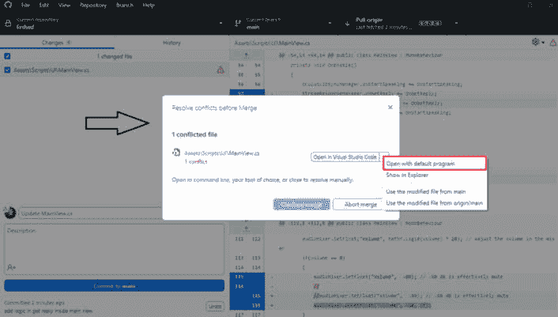

图 7.3 – GitHub Desktop 中的解决冲突面板

当此面板出现时，表示需要比较并决定来自不同来源的同一文件的冲突版本。在 GitHub Desktop 中，此面板代表冲突解决界面。通过点击下拉按钮，你可以选择你偏好的编辑程序，例如 Visual Studio 或 Visual Studio Code。对于此示例，当你选择 Visual Studio 作为默认程序时，编辑器将打开。你可以选择点击**打开合并编辑器**选项，如图所示：

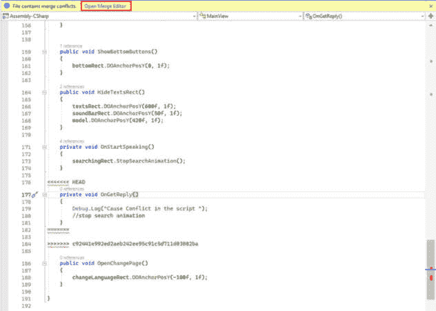

图 7.4 – Visual Studio 中的冲突模式

在合并编辑器中，你会注意到有三个部分：传入或远程版本、当前或本地版本以及合并后的结果文件。在这里，你需要审查更改并决定是否合并它们或根据功能或任务需求保留一个版本。一旦你或负责的高级人员完成编辑，点击**接受合并**：

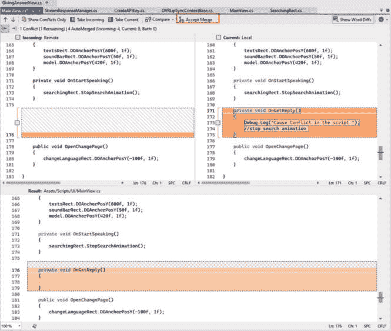

图 7.5 – Visual Studio 中的合并编辑器

关闭合并编辑器后，你会注意到侧边栏现在包括一个提交更改的选项。然后，你可以在侧面板中点击**提交暂存**来在合并后推送更改，如图所示：

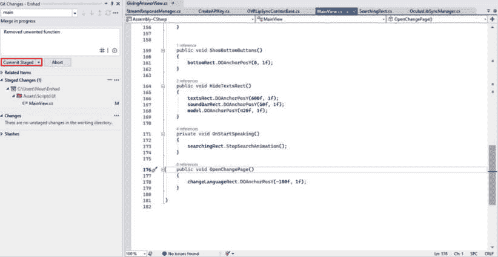

图 7.6 – 编辑冲突后的文件

记住

你需要集中注意力，尤其是在同一文件涉及两个不同任务时，确保两个任务的逻辑都能正常工作。

让我们使用**命令行界面**（**CLI**）来高效地解决合并冲突。

### 探索代码冲突起源并使用 CLI 导航冲突解决

命令行界面（CLI）是解决 Git 冲突的基本且广泛使用的方法。虽然提供了图形用户界面（GUI），并且可以提供冲突解决的视觉辅助，但许多开发者，尤其是那些习惯于基于终端的工作流程的开发者，更喜欢将命令行作为他们的默认方法。CLI 提供了细粒度的控制、精确的代码更改导航和高效的合并能力，使其成为有效管理 Git 冲突的强大工具。

为了测试这一点，请确保你在项目中还有一个分支。然后，我们将修改两个分支中的相同文件以创建冲突并解决它。让我们开始吧：

1.  导航到你的项目目录并在那里打开终端，或者使用终端中的 **cd** 命令导航到你的项目目录。

1.  或者，确保你目前处于你的其他分支之一。以我的情况为例，我有一个名为 **feature/branch-name** 的分支。

1.  使用 **git checkout branch-name** 命令切换到所需的分支，如下图中所示：

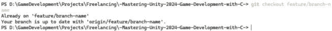

图 7.7 – 检出功能分支

1.  现在，让我们修改一个文件。以我的情况为例，我将在脚本中注释掉一行，如下图中所示：

图 7.8 – 在函数中注释掉一行

1.  我们需要使用 **git add filename** 命令添加并提交该文件，然后使用 **git commit -m "commit message"** 命令进行提交，正如以下图中所示：

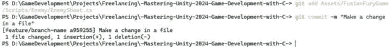

图 7.9 – 提交更改

1.  推送你的更改：

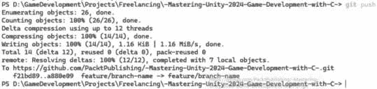

图 7.10 – 推送更改

1.  现在，我们可以转到另一个分支；以我的情况为例，我将使用 **git checkout** 命令返回到主分支：

图 7.11 – 返回主分支

1.  修改相同的文件以创建冲突，然后我们需要添加、提交和推送更改。

1.  然后，再次回到功能分支。

1.  接下来，从主分支执行 **merge** 命令，如下图中所示：

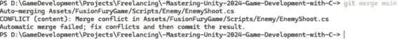

图 7.12 – 从主分支合并

我们也可以使用 `git status` 命令来识别需要解决冲突的文件或文件：

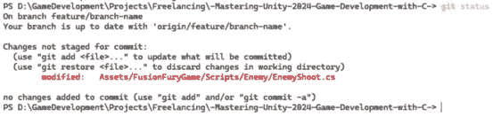

图 7.13 – 检查冲突文件

1.  在编辑器中打开文件以解决冲突，如下图中所示：

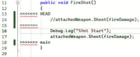

图 7.14 – 冲突代码

1.  在进行必要的编辑后，添加并提交文件：

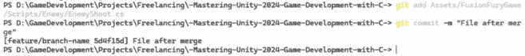

图 7.15 – 解决冲突后的提交

1.  使用 **git status** 命令确保一切清晰：

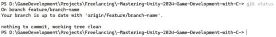

图 7.16 – 检查状态

1.  现在，在解决冲突后推送分支：

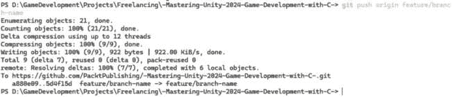

图 7.17 – 推送功能分支

通过使用命令行界面（CLI），我们可以通过导航到项目目录、切换到包含冲突的分支、修改冲突文件、添加和提交更改、推送分支，最后将更改与主分支合并，来有效地在 Git 仓库中解决冲突。

总结来说，掌握代码冲突管理涉及理解冲突的起源和解决技术。在本节中，我们探讨了常见的冲突类型，如合并冲突和结构变化，并深入探讨了使用 GitHub Desktop、Visual Studio 和 CLI 等工具的实际冲突解决方法。通过有效地处理冲突，我们确保在 Unity 项目中实现顺利的合作和项目成功。

在接下来的章节中，我们将探讨如何有效地处理现有项目，提供指导和实际示例。

# 理解现有代码库

在深入研究现有代码库时，有一些关键步骤可以帮助你熟悉其结构和功能：

+   **项目结构和组织**：首先探索项目的目录结构和组织方式。了解文件和文件夹是如何根据功能或模块进行排列和分组的。

+   **审查文档**：寻找任何可用的文档，包括 README 文件、维基页面或代码中的内联注释。文档可以为项目的目的、架构和设计决策提供宝贵的见解。

+   **识别关键组件和关系**：识别代码库中的关键组件、模块及其关系。确定代码的不同部分是如何相互交互的，并理解整体架构。

+   **利用代码分析工具和集成开发环境（IDE）功能**：利用 IDE 提供的代码分析工具和功能来探索代码依赖、继承层次和函数调用。例如，静态代码分析工具可以帮助识别潜在问题或改进区域。

+   **理解编码标准和规范**：熟悉项目中使用的编码标准和规范。注意命名规范、代码格式和文档实践，以确保代码库的一致性。

+   **与团队成员沟通**：与团队成员或项目负责人沟通，以深入了解代码库及其设计决策。讨论你任何疑问或不确定性，并利用他们的专业知识来加深你的理解。

开始处理现有项目需要时间和对复杂性的投入，但这个初步的探索为有成效的贡献奠定了基础，确保项目的耐用性和易于维护。随着你对代码库的熟悉，你将能够提出改进建议，解决难题，并与项目团队进行有效的协作。

## 对现有代码库的实用探索

我们将通过示例说明代码审查过程，无论是遵循前面的步骤之后，还是事先考虑这些步骤。

如果你在一个新项目中分配了一个任务，你可以独立地按照这些步骤进行，如果需要的话，向你的高级或领导寻求指导，或者检查游戏中是否已经实现了类似的方法。

我首选的方法是从终点开始，逆向工作到源头。例如，如果你在处理 UI 逻辑，首先检查按钮的 onclick 动作来确定它调用了哪个函数。然后，导航到那个脚本以审查该函数。

然后，你可以检查逻辑并检查对其他脚本的额外调用。继续这个过程，直到你达到逻辑的核心。有时，一个函数可能涉及对其他多个脚本的调用，因此需要逐个审查它们，以理解它们是如何交互的。这个过程增强了你对项目的理解。如果逻辑涉及管理者，你将掌握他们的责任。因此，当你未来处理与这些管理者相关的任务时，你将更有能力有效地理解和连接逻辑。

如果你分配了一个新任务，并意识到如处理玩家或游戏数据的管理者缺少必要的函数，你只需简单地向该管理者添加一个新函数。这种方法允许你无缝地扩展管理者的功能，以满足你的需求。

当与第三方合作时，检查示例场景或脚本以了解其功能是有益的。通过实验和修改这些示例，你可以深入了解它们的用法，并将它们适应到自己的功能中，只关注项目所需的必要逻辑。

现在，让我们看看一个示例，我们将遵循它来了解我们如何理解现有的代码库。

**示例**:

我目前正在审查`SettingsView`脚本中的声音切换功能，该功能处理我在另一个项目中参与的项目中的声音效果的开/关：

1.  我首先在层次结构中导航到**SettingsView**脚本，并定位到切换按钮。

1.  然后，我检查值变化时触发的动作，并识别相关的函数或函数。此外，验证切换是否在视图脚本中引用，以及函数是否通过代码附加，也是非常重要的。如图所示，该函数可以在**检查器**中找到：

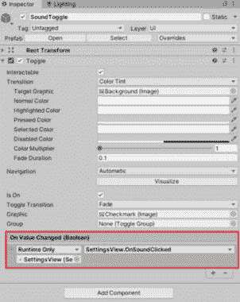

图 7.18 – SoundToggle 组件

1.  接下来，我们应该导航到 **SettingsView** 脚本来检查 **OnSoundClicked** 的逻辑，如图所示：

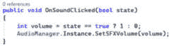

图 7.19 – SettingsView 脚本中的 OnSoundClicked 函数

1.  在 `SetSFXVolume` 函数中，如图所示，你可以观察到其相关的逻辑：

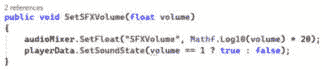

图 7.20 – AudioManager 脚本中的 SetSFXVolume 函数

1.  在 **SetSFXVolume** 函数中，我们在音频混音器中调整音效音量，使我们能够控制所有链接到该混音器的音频源，静音或取消静音它们的声音。此外，第二行管理声音状态数据，便于其持久化和本地或云端存储。

1.  现在，我们将检查负责在 **GameData** 脚本中设置声音状态的函数，该脚本管理游戏数据，如图所示：

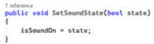

图 7.21 – GameData 脚本中的 SetSoundState 函数

总结来说，我们获得的优势是游戏内存在一个专门用于音频控制的脚本，并配备了可用于未来音频管理相关任务的函数。此外，还有一个名为 `GameData` 的脚本，负责管理游戏数据。这使得我们可以在以后的数据相关需求中引用它，例如检索保存的数据或存储新的数据状态。

这个例子很容易理解，但步骤很全面。请随意将这些步骤应用到你的项目中，或者当你处理新项目时。

# 总结

在本章中，我们学习了使用 C# 在 Unity 中处理现有代码。我们探讨了如何使用版本控制系统、合并代码以及在项目协作中解决冲突。通过理解这些概念，我们可以与其他开发者更好地合作并保持代码质量。本章还涵盖了如何理解项目结构、审查文档和与团队成员有效沟通。通过花时间理解现有项目，我们可以更有效地做出贡献并做出更好的决策。

在 *第八章* 中，我们将探讨使用 C# 将外部资源和功能添加到 Unity 游戏中。我们将学习如何使用预制资源来改善游戏视觉效果，并添加新的功能，如分析和货币化。准备好在下一章中学习新的游戏增强方法！
