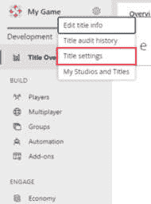

# 第九章：在 Unity 中使用 C#实现外部资产、API 和预构建组件

欢迎来到*第八章*，我们将深入探讨使用 C#进行游戏开发的关键方面。我们将从探索预构建资产的集成开始，这是增强游戏视觉和性能的基本技能。然后，我们将深入研究渲染管道的集成，这对于优化游戏视觉和实现更好的性能至关重要。之后，我们将讨论后端服务在游戏开发中的重要性，重点关注身份验证逻辑作为其重要性的主要例子。最后，我们将探索分析 API 及其在理解玩家行为和优化游戏性能中的关键作用。在本章中，我将演示如何将这些关键组件集成到我们的游戏中，让您能够创建沉浸式和引人入胜的游戏体验。

在本章中，我们将涵盖以下主要内容：

+   利用 C#预构建资产

+   利用 C#集成后端服务

+   利用 C#集成分析 API

# 技术要求

本章的所有代码文件都可以在以下位置找到：`github.com/PacktPublishing/Mastering-Unity-Game-Development-with-C-Sharp/tree/main/Assets/Chapter%2008`。

# 利用 C#预构建资产

在游戏开发的广阔世界中，时间与屏幕上的像素一样宝贵。每一刻都至关重要，每一行代码都塑造着玩家将要探索的世界。这就是第三方资产发挥作用的地方——它们是提高游戏设计变化中创造力的有效工具。

想象一下：你是一位拥有光明前景的新游戏开发者。你梦想着广阔的景观、细致的角色动画和能把玩家带到遥远土地的声音。然而，从想法到现实的旅程充满了挑战，时间难以捉摸。

第三方资产，在游戏开发中常常被低估，但发挥着至关重要的作用。这些现成的资源构成了游戏创作的基石，将虚拟世界变为现实。从宏伟的景观到微妙的细节，第三方资产简化了复杂的资产创建任务，使我们能够专注于优化游戏玩法和提升玩家体验。

*但为什么它们如此重要呢？* 首先，第三方资产提供了由专家创建的大量资源。无论你需要令人惊叹的环境、逼真的角色还是令人毛骨悚然的音效，第三方资产的庞大阵容应有尽有。这些资产激发创造力，激发想象力，帮助我们快速将想法变为现实。

此外，好处远不止便利性。通过使用预构建资产，我们可以专注于游戏的核心——游戏玩法本身。摆脱了创建资产的重担，他们可以打造沉浸式的世界、引人入胜的故事和难以忘怀的体验，这些都能抓住玩家的心并随着时间的推移而持久。

在本节中，我们将探讨 Unity 包管理器中可用的预构建资源的利用，例如**URP**，它提供了高级渲染选项。让我们开始我们的探索之旅。

## 通用渲染管线（URP）

在本节中，我们将探讨**通用渲染管线**（URP），这是一个强大的工具，有助于在我们的 Unity 项目中创建令人惊叹的视觉效果并优化性能。

URP 是由 Unity Technologies 提供的渲染解决方案。它旨在在视觉质量和性能之间取得平衡，使其适用于包括移动、游戏机和 PC 在内的广泛平台和设备。

URP 提供了一个灵活且高效的渲染管线，允许创建视觉上吸引人的游戏，同时确保在不同硬件配置上保持流畅的性能。无论你是创建风格化的独立游戏还是现实主义的 AAA 游戏，URP 都提供了将你的愿景变为现实所需的工具和功能。

### 在 Unity 的渲染管线之间进行选择——URP 与 HDRP

Unity 提供了两种不同的渲染管线，URP 和**高清渲染管线**（HDRP），它们分别针对游戏开发中的不同需求和需求量身定制。让我们探讨这两者之间的关键差异以及为什么你可能会选择其中一个而不是另一个来为你的游戏服务。

在下面的表格中，我概述了 Unity 渲染管线的比较，突出了关键点，以帮助您确定最适合您项目的管线。

| **方面** | **URP** | **HDRP** |
| --- | --- | --- |
| 图形保真度 | URP 旨在优化渲染性能，同时保持视觉质量和效率之间的平衡。它支持实时照明、阴影和后期处理效果等功能。 | HDRP 旨在提供高质量的视觉效果和图形保真度，尤其是在 PC 和游戏机等高端平台上。它提供基于物理的渲染和体积照明等高级渲染功能。 |
| 平台兼容性 | URP 针对跨平台开发进行了优化，使其适用于各种设备和平台，包括移动设备、游戏机和 PC。 | HDRP 针对高端平台，可能需要更强大的硬件才能实现最佳性能。由于其更高的要求，它可能不适合移动设备或低端 PC。 |
| 艺术风格和视觉方向 | URP 具有多功能性，可以适应广泛的风格和视觉方向，包括风格化、卡通化或现实风格的艺术。它允许在不同类型和主题中实现视觉上吸引人的结果。 | HDRP 非常适合追求照片级图形和沉浸式视觉体验的项目。它提供高级渲染功能和高保真效果，增强了现实感和沉浸感。 |
| 开发时间和资源 | URP 通过简化的工作流程和更简单的设置，在视觉质量和开发效率之间提供了平衡。它适用于资源有限或时间受限的开发者。HDRP 提供了高级功能和图形能力，但要充分发挥其潜力，可能需要额外的时间和资源。它需要仔细优化和调整以达到期望的性能。 |

总结来说，URP 和 HDRP 之间的选择取决于各种因素，包括你的项目目标平台、期望的图形保真度、艺术风格和可用的开发资源。如果你优先考虑性能、跨平台兼容性以及视觉质量和效率之间的平衡，URP 可能是更好的选择。另一方面，如果你的项目需要高端视觉、逼真度和高级图形效果，HDRP 可能是更好的选择，前提是你有必要的资源和硬件来支持它。

现在我们已经了解了 Unity 中两个不同渲染管道之间的对比，让我们继续安装 URP。

### 将 URP 安装到我们的项目中

重要提示

在升级到自定义渲染管道之前，备份你的项目是至关重要的。

我们已经为我们的项目选择了 URP 包。然而，如果它还没有在你的项目中配置，你可以简单地访问**包管理器**并选择**通用 RP**选项，正如你在*图 8**.1*中看到的那样：


图 8.1 – 安装 URP 包

当你点击**安装**时，Unity 将安装该包及其依赖项。

注意

如果你正在从内置管道迁移到 URP 或高清 RP，有一些特定的说明需要遵守。你需要调整所有材质以利用这些包提供的新着色器。然而，鉴于我们的游戏从一开始就使用这些包，导入的文件，如模型材质，已经配置为使用这些包提供的着色器。

由于迁移到内置管道不是我们的主要目标，所以不会深入探讨升级到 URP。你可以通过参考官方文档来探索其他可能性：

+   如果你使用的是 13.1 或更高版本的 URP，有一个内置的转换器可用。请参考此页面以获取有关如何使用此转换器的更多信息：**https://docs.unity3d.com/Packages/com.unity.render-pipelines.universal@14.0/manual/features/rp-converter.html**。

+   如果你使用的是 13.1 之前的 URP 版本，你需要参考这个链接：**https://docs.unity3d.com/Packages/com.unity.render-pipelines.universal@13.0/manual/upgrading-your-shaders.html**。

在下一个子节中，我们将发现 Unity 的 URP 的强大之处，这是一个提供优化渲染、自定义着色器和增强光照的多平台视觉项目包。

### 探索 Unity 中的 URP（通用渲染管线）- 特性和功能

Unity 中的 URP 包为开发者提供了一系列功能和功能，以增强项目的渲染能力。以下是 URP 包及其使用的一些关键方面：

+   **优化渲染管线**：URP 提供了一个优化的渲染管线，旨在在各种平台和设备上平衡性能和视觉质量。它包括诸如延迟渲染和前向渲染路径等功能，使我们能够选择最适合项目需求渲染技术。

+   **轻量级渲染**：URP 设计得轻量级，使其适合针对移动设备、低端硬件和性能敏感型应用程序的项目。它优化渲染过程以实现流畅的性能，同时保持视觉保真度。

+   **着色器图集成**：URP 无缝集成 Unity 的着色器图工具，使我们能够在不编写代码的情况下创建自定义着色器和视觉效果。着色器图通过基于节点的界面使我们能够设计复杂材料、照明效果和后处理效果。

+   **自定义渲染功能**：URP 通过**可脚本化渲染管线**（**SRP**）扩展提供了对自定义渲染功能的支持。我们可以通过实现自定义渲染通道、后处理效果和着色器变体来扩展和自定义渲染管线。

+   **增强的照明系统**：URP 包括一个灵活的照明系统，支持实时照明、阴影和反射。它提供诸如对象级和像素级照明、动态阴影和用于逼真照明效果的光探针等功能。

+   **后处理效果**：URP 内置了对后处理效果的支持，使我们能够增强场景的视觉质量。它提供了一系列后处理效果，如光晕、景深、色彩分级和环境遮挡。

+   **跨平台兼容性**：URP 旨在实现跨平台兼容性，使我们能够为各种平台创建游戏和应用程序，包括移动设备、游戏机和 PC。它优化了不同硬件配置和平台规范下的渲染性能。

总结来说，Unity 中的 URP 包为我们提供了一个轻量级、灵活且优化的渲染解决方案，用于创建视觉上令人惊叹且性能高效的项目。从照明和着色到后处理效果和自定义渲染功能，URP 使我们能够将创意愿景变为现实，同时确保在不同平台和设备上实现最佳性能。

接下来，我们将探讨更多高级主题，例如渲染回调和自定义渲染功能。

### 掌握 Unity 中的视觉修改 - 使用 URP 和 C#的高级技术

在 URP 中使用 C#引入高级技术可以极大地改变您 Unity 项目的视觉质量和性能。本节中我们可以探索和讨论的两个关键特性是自定义渲染通道和渲染管线回调：

+   **自定义** **渲染通道**：

    +   自定义渲染通道允许您将自定义渲染逻辑注入到渲染管线中，使您能够实现超出 URP 内置功能的专用效果或优化。

    +   使用自定义渲染通道，您可以在渲染过程的各个阶段进行精细控制，例如在透明或非透明渲染之前或之后，或者在特定的渲染队列之间。

    +   您可以使用自定义渲染通道实现轮廓渲染、屏幕空间效果、自定义后期处理或优化，例如为自定义着色器或计算渲染额外的缓冲区。

+   **渲染** **管线回调**：

    +   渲染管线回调提供了一种机制，可以在渲染管线中的特定事件和阶段执行自定义 C#代码。

    +   使用渲染管线回调，您可以执行诸如修改材质、动态调整渲染设置或在渲染过程中的特定点注入自定义渲染逻辑等任务。

    +   渲染管线回调可用于实现基于游戏事件动态修改材质、纹理或几何形状的生成，或根据运行时条件应用自定义着色器效果等高级功能。

接下来，让我们探索一个示例，演示如何在项目中应用这些高级技术。

### 实施高级技术的说明

下面是一个逐步指南，通过示例说明如何利用这些高级技术创建和控制轮廓效果：

1.  在创建渲染器功能之前，请确保您的项目已配置为在**项目设置**中的**质量和图形**设置中使用 URP 渲染器数据。在**项目**选项卡中右键单击，然后导航到**创建 | 渲染 | URP 渲染器功能**以生成一个新的功能脚本。您可以将其命名为**OutlineEffect**：


图 8.2 – 创建 URP 渲染器功能脚本

1.  接下来，我们打开**OutlineEffect**脚本，并根据以下代码块中的说明进行修改：

    ```cs
    public class OutlineEffect : ScriptableRendererFeature
    {
        class OutlineRenderPass : ScriptableRenderPass
        {
            public List<Material> outlineMaterials;
            public OutlineRenderPass(List<Material> materials)
            {
                this.outlineMaterials = materials;
                renderPassEvent = RenderPassEvent.AfterRenderingOpaques;
            }
            // This method is called before executing the render pass..
            public override void OnCameraSetup(CommandBuffer cmd, ref RenderingData renderingData)
            {
            }
            // Here you can implement the rendering logic.
            // Use <c>ScriptableRenderContext</c> to issue drawing commands or execute command buffers
            // https://docs.unity3d.com/ScriptReference/Rendering.ScriptableRenderContext.html
            // You don't have to call ScriptableRenderContext.submit, the render pipeline will call it at specific points in the pipeline.
            public override void Execute(ScriptableRenderContext context, ref RenderingData renderingData)
            {
                CommandBuffer cmd = CommandBufferPool.Get("OutlineRenderPass");
                // Set the render target to the camera's depth buffer
                cmd.SetRenderTarget(renderingData.cameraData.renderer.cameraDepthTargetHandle);
                // Clear the depth buffer to ensure the outline is rendered correctly
                cmd.ClearRenderTarget(false, true, Color.clear);
                var settings = new DrawingSettings(new ShaderTagId("UniversalForward"), new SortingSettings(renderingData.cameraData.camera));
                var filterSettings = new FilteringSettings(RenderQueueRange.opaque);
                context.DrawRenderers(renderingData.cullResults, ref settings, ref filterSettings);
                // Draw objects with outline materials
                // Draw objects with outline materials
                foreach (Material material in outlineMaterials)
                {
                    var drawSettings = new DrawingSettings(new ShaderTagId("Outline"), new SortingSettings(renderingData.cameraData.camera))
                    {
                        overrideMaterial = material
                    };
                    var filterSettingsOutline = new FilteringSettings(RenderQueueRange.opaque);
                    context.DrawRenderers(renderingData.cullResults, ref drawSettings, ref filterSettingsOutline);
                }
                context.ExecuteCommandBuffer(cmd);
                CommandBufferPool.Release(cmd);
            }
            // Cleanup any allocated resources that were created during the execution of this render pass.
            public override void OnCameraCleanup(CommandBuffer cmd)
            {
            }
        }
        OutlineRenderPass outlinePass;
        public List<Material> outlineMaterials;
        /// <inheritdoc/>
        public override void Create()
        {
            outlinePass = new OutlineRenderPass(outlineMaterials);
            outlinePass.renderPassEvent = RenderPassEvent.AfterRenderingOpaques;
        }
        // Here you can inject one or multiple render passes in the renderer.
        // This method is called when setting up the renderer once per-camera.
        public override void AddRenderPasses(ScriptableRenderer renderer, ref RenderingData renderingData)
        {
            renderer.EnqueuePass(outlinePass);
        }
    }
    ```

    让我们分解之前的代码，解释每个部分的作用：

    +   `OutlineEffect`类定义了一个自定义渲染器功能，通过使用带有轮廓材质列表的自定义渲染通道（`OutlineRenderPass`）来为场景中的对象添加轮廓效果。`OutlineRenderPass`类实现了在渲染过程中应用轮廓效果到对象的渲染逻辑。

    +   接下来，你可以将此功能集成到你的 URP 数据可脚本对象中。你可以根据游戏需求自定义设置。在我们的演示中，我保留了默认设置，如图*图 8**.3*所示：


图 8.3 – 添加 OutlineEffect 功能

你可以包括额外的功能以实现你期望的视觉效果。此外，你可以通过以下链接参考 Unity 的官方文档以获取更多详细信息：`https://docs.unity3d.com/Packages/com.unity.render-pipelines.universal@16.0/manual/index.html`。

在以下图中，你将观察到应用此功能前后的差异：


图 8.4 – OutlineEffect 功能效果

探索利用渲染通道功能优化渲染和增强视觉效果的重要影响和好处。

### 利用渲染通道功能的目的是什么？

使用 URP（Universal Render Pipeline）结合渲染通道可以为实现轮廓效果提供多项优势：

+   **模块化和可扩展性**：通过使用渲染通道，你可以模块化你的渲染管道，并将特定的渲染任务分离成独立的通道。这使得你的渲染管道更加灵活且易于维护。你可以根据需要添加或删除通道，而不会影响管道的其他部分。

+   **性能优化**：URP 中的渲染通道允许你控制渲染任务执行的顺序。这使你能够通过高效地批处理和排序对象、减少过度绘制和最小化不必要的渲染调用来优化性能。对于轮廓效果，你可以确保只有必要的对象使用轮廓材质进行渲染，从而减少计算开销。

+   **与 URP 渲染管道的集成**：URP 提供了一个优化性能的简化渲染管道，适用于各种平台。通过使用渲染通道将你的自定义渲染效果（如轮廓效果）集成到 URP 的管道中，你确保了与 URP 的渲染功能和优化的兼容性和一致性。

+   **跨平台一致性**：URP 旨在为不同平台和设备（包括桌面、移动和游戏机）提供一致的渲染结果。通过利用 URP 的功能，你可以确保你的轮廓效果在各种目标平台上表现可预测且性能最优。

+   **着色器图集成**：URP 无缝集成 Unity 的 Shader Graph 工具，允许你通过视觉方式创建自定义着色器而无需编写代码。你可以使用 Shader Graph 来设计轮廓着色器，并轻松将其集成到渲染通道中，使实现过程更加易于访问和直观。

总体而言，虽然可以在不利用 URP 的渲染通道功能的情况下直接应用轮廓效果，但将其与 URP 集成在性能优化、模块化、一致性和与 Unity 渲染管线兼容性方面提供了优势。它为在 Unity 项目中实现自定义渲染效果提供了一个更强大和灵活的解决方案。

游戏开发得益于预构建资源和 C#脚本，节省了时间并提高了创造力。Unity 的 URP 优化了视觉效果和性能。了解 URP 与 HDRP 的区别有助于选择管线。URP 的设置涉及包安装和配置。URP 的功能包括轻量级渲染、Shader Graph 集成以及自定义渲染通道等高级技术。URP 中的渲染通道提供了模块化和性能优化。

在下一节中，我们将探讨后端服务的集成，了解其在游戏开发中的重要性以及其必要性的原因。此外，我将通过一个包含可用服务之一的示例来说明它们的用法。

# 将后端服务与 C#集成

在本节中，我们将了解如何通过将后端 API 与 C#集成，为我们提供一种强大的工具，以丰富我们的项目功能。通过使用这些 API，我们可以无缝地将他们的 Unity 项目链接到外部服务，从而实现用户身份验证、数据存储和排行榜等功能。

让我们探索后端服务，并了解它们在游戏中的重要性。

## 后端服务

后端服务指的是支持软件应用程序（包括游戏）从服务器端视角运行的一组功能性和基础设施组件。在游戏开发背景下，后端服务包括旨在增强游戏体验、管理玩家数据和促进在线互动的各种功能和能力。以下是游戏开发中后端服务的一些关键方面：

+   **数据存储**：为游戏相关数据提供存储解决方案，包括玩家资料、游戏进度、成就、库存以及其他持久化游戏状态信息。这些数据通常存储在数据库或云存储系统中，确保在不同平台和设备上具有可靠性、可扩展性和可访问性。

+   **用户身份验证**：提供身份验证机制以验证玩家的身份并确保对游戏功能和内容的安全访问。身份验证过程通常涉及用户注册、登录和会话管理，采用加密和安全的协议来保护用户凭据并防止未经授权的访问。

+   **多人功能**：使游戏实现多人功能成为可能，允许玩家实时连接、交互和竞争。这包括匹配、大厅管理、游戏会话编排和网络环境中玩家动作的同步等功能。

+   **实时通信**：促进游戏客户端和服务器之间的实时通信，支持游戏内聊天、消息、通知和实时更新等功能。这些通信渠道使玩家能够相互交流，接收重要的游戏更新，并参与协作或竞技游戏体验。

+   **分析和洞察**：提供分析工具和能力，以跟踪玩家行为、监控游戏性能，并深入了解玩家的参与度、留存率和货币化模式。分析数据帮助我们做出明智的决策，优化游戏机制，并针对玩家偏好定制体验。

+   **实时运营和内容管理**：支持实时运营和内容管理，使我们能够无缝部署更新、补丁和新内容到游戏中。这包括**内容分发网络**（**CDNs**）、版本控制、A/B 测试和实时事件管理等功能，使游戏体验动态且不断进化。

总结来说，后端服务是现代游戏开发的基础，提供必要的基础设施和功能，以支持在线多人游戏、管理玩家数据、分析玩家行为，并在不同平台和设备上提供引人入胜和沉浸式的游戏体验。

### 后端服务提供商及其功能的介绍

几个后端服务提供商提供针对游戏开发者需求的全面解决方案，每个都有一套自己的特性和功能。以下是可用的服务，这些是在撰写本书时的常用选项：

+   **Firebase**：由谷歌开发，Firebase 提供一系列后端服务，包括实时数据库、身份验证、云存储和托管。它提供了与 Unity 的无缝集成，使我们寻求强大且可扩展的后端解决方案的理想选择。

+   **PlayFab**：PlayFab 提供专为游戏开发者设计的全面后端平台。其功能包括玩家身份验证、数据存储、游戏内分析、虚拟货币管理和实时运营工具。PlayFab 的灵活 API 和 SDK 支持与 Unity 的轻松集成，使我们能够构建引人入胜的多人体验和实时服务功能。

+   **亚马逊网络服务 (AWS)**：AWS 提供了包括数据库、身份验证、内容交付和数据分析在内的广泛基于云的服务。通过提供 Amazon DynamoDB、Amazon Cognito 和 Amazon GameLift 等服务，AWS 为寻求以灵活性和可靠性构建、部署和管理后端基础设施的游戏开发者提供了可扩展的解决方案。

我们将在本章中使用 PlayFab，并在下一节中相应地将其实现到我们的项目中。让我们开始集成 PlayFab。

### 集成 PlayFab

在本指南中，我将向您介绍实现 PlayFab 并在您的项目中设置它的过程。然后，我们将创建一个示例身份验证逻辑来演示其用法。

首先，您需要下载 PlayFab Unity 包。我为此使用了 PlayFab SDK 2.188，您可以从以下链接获取：[`github.com/PlayFab/UnitySDK/releases`](https://github.com/PlayFab/UnitySDK/releases)。下载后，按照以下步骤操作：

1.  在**图 8.5**中，如您所见，我们将 PlayFab SDK 提取到我们的项目中。只需点击**导入**即可启动导入文件和编译的过程。


图 8.5 – 导入 PlayFab SDK

1.  等待 Unity 编译完成，然后导航到**资产** | **PlayFabSDK** | **共享** | **公共** | **资源**。从那里，您可以选择可脚本对象**PlayFabSharedSettings**以配置它以适应您的项目。在**图 8.6**中，您可以观察到我们可以配置的 PlayFab 设置：


图 8.6 – PlayFab 共享设置

1.  对于**请求类型**，您可以选择**Unity 网络请求**或选择适合您项目的选项。然而，对于我们的项目，我将选择**Unity 网络请求**。

1.  我们将包括**标题 ID**值，您可以从您的 PlayFab 游戏项目仪表板中获取。如果您还没有项目，您可以创建一个并使用其密钥在您的项目中。**图 8.7**显示了您可以在哪里找到用于 PlayFab 设置的 ID。


图 8.7 – PlayFab 标题 ID

1.  接下来，访问项目以检索密钥；为此，点击设置图标并选择**标题设置**：



图 8.8 – PlayFab 标题设置

1.  前一步将打开设置选项卡，从这里，我们可以导航到**密钥**选项卡以检索密钥，如图 8.9 所示：


图 8.9 – 标题密钥

1.  点击**显示**以显示密钥。然后您可以复制它并将其粘贴到我们游戏中的 PlayFab 设置中的**开发者密钥**字段。

就这样！现在你已经将 PlayFab SDK 集成到你的项目中了。在接下来的步骤中，我们将开始使用它，并通过示例来学习。虽然这个示例只是一个样本，但它将涵盖使用这个包的完整流程。这个包有无数的使用可能性，所以请自由探索它们的文档以获取更多信息：`learn.microsoft.com/en-us/gaming/playfab/`。

### 开发一个示例登录系统

游戏中用户登录有多种方法，例如使用电子邮件、访客账户，以及对于移动平台，利用 Android 的 Play 服务和 iOS 的 Game Center。PlayFab 提供了各种选项，以方便根据游戏平台进行用户登录。

对于这个系统，我们可以通过以下步骤建立一个有组织的结构：

1.  我们将首先为登录方法创建一个接口。在下面的代码块中，你将找到一个登录方法以及登录状态的回调：

    ```cs
    using PlayFab.ClientModels;
    using PlayFab;
    public interface ILogin
    {
        void Login(System.Action<LoginResult> onSuccess, System.Action<PlayFabError> onFailure);
    }
    ```

1.  接下来，我们可以为每种登录方法创建一个类。对于访客登录，我们将使用设备 ID 进行身份验证。在下面的代码块中，我们已经实现了**ILogin**接口，并使用**DeviceLogin**类实现了使用设备 ID 进行登录的逻辑。

    ```cs
    using PlayFab.ClientModels;
    using PlayFab;
    public class DeviceLogin : ILogin
    {
        private string deviceId;
        public DeviceLogin(string deviceId)
        {
            this.deviceId = deviceId;
        }
        public void Login(System.Action<LoginResult> onSuccess, System.Action<PlayFabError> onFailure)
        {
            var request = new LoginWithCustomIDRequest
            {
                CustomId = deviceId,
                CreateAccount = true // Create account if not exists
            };
            PlayFabClientAPI.LoginWithCustomID(request, onSuccess, onFailure);
        }
    }
    ```

    你可以遵循这些步骤并创建额外的登录逻辑，特别是如果你针对的是移动平台，因为将会有针对移动设备的特定登录方法。

1.  然后，我们可以创建一个**LoginManager**类，它将负责调用适当的登录方法，如下面的代码块所示：

    ```cs
    using PlayFab.ClientModels;
    using PlayFab;
    using UnityEngine;
    public class LoginManager
    {
        private ILogin loginMethod;
        public void SetLoginMethod(ILogin method)
        {
            loginMethod = method;
        }
        public void Login(System.Action<LoginResult> onSuccess, System.Action<PlayFabError> onFailure)
        {
            if (loginMethod != null)
            {
                loginMethod.Login(onSuccess , onFailure);
            }
            else
            {
                Debug.LogError("No login method set!");
            }
        }
    }
    ```

1.  对于下一步，我们将实现一个**PlayfabManager**脚本，用于管理登录方法并处理用户输入，从而触发适当的操作：

    ```cs
    using PlayFab.ClientModels;
    using PlayFab;
    using UnityEngine;
    public class PlayFabManager
    {
        private LoginManager loginManager;
        private string savedEmailKey = "SavedEmail";
        private string userEmail;
        private void Start()
        {
            loginManager = new LoginManager();
            // Check if email is saved
            if (PlayerPrefs.HasKey(savedEmailKey))
            {
                string savedEmail = PlayerPrefs.GetString(savedEmailKey);
                // Auto-login with saved email
                EmailLoginButtonClicked(savedEmail, "SavedPassword");
            }
        }
        // Example method for triggering email login
        public void EmailLoginButtonClicked(string email, string password)
        {
            userEmail = email;
            loginManager.SetLoginMethod(new EmailLogin(email, password));
            loginManager.Login(OnLoginSuccess, OnLoginFailure);
        }
        // Example method for triggering device ID login
        public void DeviceIDLoginButtonClicked(string deviceID)
        {
            loginManager.SetLoginMethod(new DeviceLogin(deviceID));
            loginManager.Login(OnLoginSuccess, OnLoginFailure);
        }
        private void OnLoginSuccess(LoginResult result)
        {
            Debug.Log("Login successful!");
            // You can handle success here, such as loading player data
            // Save email for future auto-login
            if (!string.IsNullOrEmpty(userEmail))
                PlayerPrefs.SetString(savedEmailKey, userEmail);
            // Load player data
            LoadPlayerData(result.PlayFabId);
        }
        private void OnLoginFailure(PlayFabError error)
        {
            Debug.LogError("Login failed: " + error.ErrorMessage);
        }
        private void LoadPlayerData(string playFabId)
        {
            var request = new GetUserDataRequest
            {
                PlayFabId = playFabId
            };
            PlayFabClientAPI.GetUserData(request, OnDataSuccess, OnDataFailure);
        }
        private void OnDataSuccess(GetUserDataResult result)
        {
            // Process player data here
            Debug.Log("Player data loaded successfully");
        }
        private void OnDataFailure(PlayFabError error)
        {
            Debug.LogError("Failed to load player data: " + error.ErrorMessage);
        }
    }
    ```

    在`PlayFabManager`中，你会发现使用电子邮件和设备 ID 进行登录的方法，以及表示登录状态的回调。此外，我还包括了一个处理成功用户登录的示例，通过加载他们的数据来实现。这使得我们可以根据 PlayFab 中存储的数据执行进一步的逻辑。

这个示例就结束了，它可能看起来很简单，但它涵盖了使用 PlayFab 的完整过程。这个包提供了广泛的功能，包括排行榜管理、远程设置配置、分析和匹配。如前所述，探索它们的文档以获取更多信息和建议：`learn.microsoft.com/en-us/gaming/playfab/`。

总之，我们深入了解了后端服务对我们游戏的重要性。我们成功地将 PlayFab 集成到我们的项目中，并通过这个过程学习了如何开发登录系统。

在下一节中，我们将深入了解分析 API，它们在游戏中的好处以及它们在我们游戏开发努力中的必要性。

# 将分析 API 与 C#集成

分析 API 是软件接口，使我们能够将分析功能集成到我们的应用程序中，包括游戏。这些 API 允许我们收集、分析和解释与游戏内用户交互、行为和性能指标相关的数据。以下是分析 API 的一些关键方面：

+   **数据收集**：分析 API 简化了收集游戏内用户交互产生的各种类型数据的流程。这包括诸如玩家行为、会话时长、游戏内购买、进度里程碑和用户人口统计信息等数据。

+   **事件跟踪**：我们可以使用分析 API 跟踪游戏中的特定事件或行为，例如关卡完成、物品获取、任务成就和社交互动。通过定义和跟踪自定义事件，我们可以深入了解玩家如何与游戏的不同方面互动。

+   **性能监控**：分析 API 提供监控和分析游戏性能的工具，包括与帧率、加载时间、网络延迟和设备规格相关的指标。这些数据帮助我们识别性能瓶颈，优化游戏性能，并确保玩家获得流畅的游戏体验。

+   **用户行为分析**：分析 API 使我们能够分析用户行为模式和趋势，帮助他们了解玩家如何导航游戏，他们最常参与哪些功能，以及哪些因素影响他们的留存和参与度。这些信息有助于游戏设计决策，并帮助我们调整游戏体验以更好地满足玩家期望。

+   **留存和货币化分析**：分析 API 使我们能够跟踪玩家留存率随时间的变化，并分析导致玩家流失的因素。此外，我们还可以分析货币化指标，如每用户收入、转化率和**平均每付费用户收入**（**ARPPU**），以优化货币化策略并最大化收入机会。

+   **实时报告和洞察**：分析 API 提供实时报告和可视化工具，使我们能够获取可操作的洞察并做出数据驱动的决策。交互式仪表板、图表和报告使我们能够监控**关键绩效指标**（**KPIs**），跟踪目标进展，并识别改进的机会。

总结来说，分析 API 使我们能够深入了解玩家的行为、性能和货币化，使他们能够优化游戏设计，提升玩家体验，并推动商业成功。通过将分析功能集成到他们的游戏中，我们可以做出明智的决策，并持续改进游戏的质量和性能。

## 集成 GameAnalytics

**GameAnalytics** 是一个流行的 Unity 游戏开发包，它提供了对玩家行为和游戏性能的分析和洞察。它允许我们跟踪各种指标，例如玩家进度、留存率、游戏内事件和货币化数据，以优化他们的游戏并提高玩家参与度。

这里是 GameAnalytics Unity 包的关键功能和能力：

+   **事件跟踪**：GameAnalytics 使我们能够在他们的游戏中跟踪自定义事件，例如关卡完成、物品购买、解锁成就和教程进度。这些数据帮助我们了解玩家如何与他们的游戏互动，并确定改进的领域。

+   **用户分析**：该包提供了对用户行为和人口统计数据的洞察，包括活跃用户、会话长度、留存率和用户细分。我们可以分析这些数据，以根据特定玩家的偏好和人口统计数据调整他们的游戏。

+   **货币化跟踪**：GameAnalytics 允许我们跟踪应用内购买、广告收入和其他货币化指标。通过分析收入数据与玩家行为的结合，我们可以优化他们的货币化策略并最大化收入生成。

+   **实时仪表板**：该包提供实时仪表板和报告工具，可视化游戏分析数据，使我们能够轻松监控游戏性能并做出数据驱动的决策。我们可以自定义仪表板，专注于特定的指标和关键绩效指标（KPI）。

+   **与 Unity 集成**：GameAnalytics 提供了一个 Unity SDK，它可以无缝集成到 Unity 项目中，使得分析事件和指标的实施和跟踪变得简单。SDK 支持 Unity 编辑器和运行时环境，使我们能够在整个开发周期中测试和分析他们的游戏。

+   **跨平台支持**：GameAnalytics 支持多个平台，包括 PC、移动、游戏机和网页，使我们能够在各种设备和平台上跟踪分析数据。这种跨平台支持使我们能够深入了解不同环境中的玩家行为。

总体而言，GameAnalytics 是一个有价值的工具，可以帮助我们深入了解玩家行为，优化游戏性能，并通过数据驱动的决策最大化收入。其用户友好的界面、强大的功能集和跨平台支持使其成为全球游戏开发者中的热门选择。

在后续步骤中，我们将集成 GameAnalytics 并配置我们的初始事件：

1.  我们将使用 GameAnalytics Unity SDK 的 7.8.0 版本，您可以通过以下链接下载：`download.gameanalytics.com/unity/7.8.0/GA_SDK_UNITY.unitypackage`。

1.  下载包后，通过点击**导入**将其实现到您的项目中，如图 *图 8**.10* 所示。


图 8.10 – 导入 GameAnalytics 包

1.  在等待 Unity 编译文件后，导航到**窗口 | 游戏分析 | 选择设置**，如图*图 8.11*所示。


图 8.11 – 打开游戏分析设置

1.  按照前面的步骤操作，将显示游戏分析设置。然后，你可以使用你的账户登录或注册并创建一个项目（如果你还没有这样做），如图*图 8.12*所示。


图 8.12 – 游戏分析设置

1.  在成功登录并拥有 GameAnalytics 仪表板中的项目后，你将找到链接你的项目并使用适当的平台实现它的选项，无论是 Android、iOS 还是 Windows。对于我们的游戏，我选择了 Windows，因为我们正在制作 PC 游戏。在*图 8.13*中，你可以看到与项目相关的信息，例如游戏和组织，以及重要的元素，游戏密钥和密钥，这些在成功登录后会自动添加。


图 8.13 – 将我们的游戏与游戏分析链接

然后，你需要将游戏分析游戏对象添加到我们的场景中。记住，它是一个持久化的游戏对象，所以不需要在所有场景中实现它。只需添加一个游戏对象。

1.  你应该导航到**窗口 | 游戏分析 | 创建游戏分析对象**，游戏对象将被添加到你的场景中，如图*图 8.14*所示。


图 8.14 – 将游戏分析对象添加到我们的场景

现在，我们需要开始在代码中实现事件，这取决于你需要跟踪的内容。让我提供一个例子来澄清。

## 游戏分析使用示例

你现在可以初始化游戏分析并开始在代码中使用事件，如下面的代码块所示：

```cs
    private void Start()
    {
        GameAnalytics.Initialize();
    }
```

我们可以在`GameManager`脚本中添加这个示例，或者如果你有一个处理游戏服务初始化的脚本。

你可以像以下代码块中所示那样使用它。别忘了包含`GameAnalyticsSDK`命名空间：

```cs
// Call this method when the player completes a level
 public void LevelCompleted(int levelNum)
 {
     // Track the event using GameAnalytics
     GameAnalytics.NewDesignEvent("LevelComplete", levelNum);
 }
```

并且有各种类型的事件可供更好的数据收集。有关更详细的信息，你可以参考游戏分析文档：`docs.gameanalytics.com/event-types`。

你需要首先构建包含游戏分析游戏对象的场景，然后开始发送事件。结果可能需要几分钟才能在网站上显示。

你可以访问游戏分析网站上的你的游戏，然后导航到实时部分来查看数据，如图*图 8.15*所示。


图 8.15 – 我们游戏的实时数据

现在我们已经将分析 API，特别是 GameAnalytics，整合到我们的项目中，我们已经成功整合并投入使用。

注意

如果你已经整合了任何包，最初不要在它的可能性上花费太多时间。简单地进行整合，检查错误，创建一个示例，然后逐步探索其全部潜力。一开始不要无谓地使事情复杂化。

将第三方资产整合是一项对任何开发者都非常有价值的技能。许多成功的游戏都依赖于外部资源来节省时间并确保可能难以独立实现的顶级质量。

# 摘要

在本章中，我们深入探讨了使用 Unity 中的 C#整合预构建资源和 API，这是游戏开发的一个关键方面。我们首先探讨了利用预构建资源来增强游戏视觉效果和优化性能的方法，接着整合了渲染管线以实现更好的视觉效果。讨论随后转向了后端服务的重要性，以身份验证逻辑为例，强调了它们在游戏开发中的实用性。此外，我们还探讨了分析 API 及其在理解玩家行为和优化游戏性能中的作用，展示了如何有效地将它们整合到我们的游戏项目中。

展望第九章，我们将专注于使用 Unity 的剖析工具优化游戏性能。你将学习如何利用 Profiler、帧调试器和内存剖析器等工具来识别和解决性能瓶颈，优化渲染和管理内存使用。通过实际练习和实用见解，你将掌握优化技术，以确保你的游戏运行顺畅且高效。准备好在下一章提升你游戏的表现力吧！
