# 使用 Unity 的 Profiler、帧调试器和内存分析器优化游戏

欢迎来到您 Unity 游戏开发之旅的**第九章**，我们将探讨如何使用 Unity 的 Profiler、帧调试器和内存分析器来优化游戏性能。在本章中，我们将学习如何识别和解决性能瓶颈，优化渲染，并高效管理内存。我们将介绍 Unity 的性能分析工具，深入探讨如物理、音频、人工智能和脚本优化的性能优化技术，并深入研究内存管理和优化，包括内存分析器使用和资产导入优化。掌握这些技能将确保流畅的游戏体验和沉浸式的玩家体验。

在本章中，我们将涵盖以下主要主题：

+   介绍 Unity 性能分析工具

+   性能优化技术

+   内存管理和优化

# 技术要求

您需要安装以下内容才能跟随本章内容：

+   **主要集成开发环境 – Visual Studio 2022**：教程和代码示例是使用 Visual Studio 2022 制作的。请确保已安装，以便您可以无缝地跟随。如果您更喜欢 Rider 或其他 IDE，请随意探索，尽管说明是为 Visual Studio 定制的。

+   **Unity 版本 2022.3.13**：下载并安装 Unity，选择版本 2022.3.13 以获得与提供内容最佳兼容性。

本章的代码文件可在以下位置找到：[`github.com/PacktPublishing/Mastering-Unity-Game-Development-with-C-Sharp/tree/main/Assets/Chapter%2009`](https://github.com/PacktPublishing/Mastering-Unity-Game-Development-with-C-Sharp/tree/main/Assets/Chapter%2009)。

# 介绍 Unity 性能分析工具

欢迎使用 Unity 的性能分析工具！这些工具对于理解和提升游戏性能至关重要。它们为我们提供了深入了解游戏运行情况的有价值见解，并帮助我们优化游戏，以实现跨不同设备和平台的流畅体验。

那么，为什么我们需要利用性能分析工具呢？性能分析工具是优化过程中的宝贵资产，优化过程是将我们的游戏调整到尽可能高效运行的过程。这些工具在游戏开发的世界中充当我们的侦探伙伴，帮助我们调查和识别游戏可能减慢或使用过多内存的领域。通过使用这些工具，我们可以有针对性地改进游戏性能，确保玩家拥有无缝且愉快的游戏体验。

那么，在游戏开发中，优化意味着什么？优化是一个使我们的游戏尽可能高效运行的过程，包括寻找减少不必要的计算、最小化内存使用和提高渲染性能的方法。就像一个组织良好的城市确保交通流畅和资源管理高效一样，优化确保我们的游戏代码和图形协同工作，为玩家提供引人入胜的体验。这种优化至关重要，因为它直接影响玩家的体验。没有人想玩一个卡顿、停滞或意外崩溃的游戏。通过优化我们的游戏，我们可以确保它们在各种硬件配置上运行顺畅，为玩家提供跨平台的持续和愉快的游戏体验。

## 深入探索 Unity 的性能分析工具

Unity 的性能分析工具提供了一套全面的特性，帮助我们理解和改进游戏性能。Profiler 允许我们实时分析 CPU 和 GPU 使用情况，为我们提供宝贵的优化见解。另一方面，Frame Debugger 帮助我们可视化游戏图形的渲染过程。

在接下来的章节中，我们将逐一深入探讨这些性能分析工具，并学习如何有效地使用它们来优化我们的游戏。那么，让我们准备好深入 Unity 性能分析的世界吧！

### Profiler

Unity 中的 Profiler 就像是你游戏的贴心侦探。它会检查游戏的表现——例如，计算机思考了多少（CPU），图形表现如何（GPU），以及使用了多少内存。它就像一个捕捉问题并使你的游戏运行得更好的工具。

要打开 Profiler，请转到**窗口** | **分析** | **Profiler**。会出现一个新窗口，如图*图 9.1*所示：

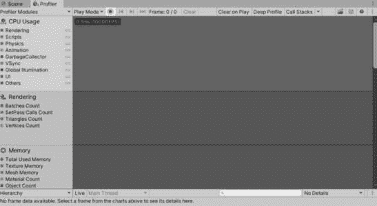

图 9.1 – Profiler

现在我们已经打开了 Profiler，让我们深入了解它是如何工作的。

#### 理解 Unity 的 Profiler 功能

Unity 中的 Profiler 通过在游戏运行时持续监控游戏性能的各个方面来工作。它收集有关 CPU 使用率、GPU 使用率、内存分配、渲染性能等方面的数据，使我们能够深入了解游戏如何利用系统资源。

当你在 Unity 中打开 Profiler 时，它会显示各种图表和图形，实时可视化这些数据。这些图表显示了诸如 CPU 使用率随时间变化、游戏不同组件的内存使用量以及渲染每一帧所需的时间等指标。

Profiler 通过在你的游戏代码中添加性能标记来收集这些数据。这些标记跟踪特定函数和操作执行所需的时间，使我们能够识别性能瓶颈和优化区域。

例如，如果分析器在游戏过程中显示 CPU 使用量激增，我们可以使用分析器的**调用栈**视图来定位消耗最多 CPU 时间的函数。然后它可以分析这些函数内的代码，以识别低效或需要优化的区域。

类似地，如果分析器检测到过度的内存使用，我们可以使用内存分配视图来识别代码中内存分配和释放的位置。这有助于识别内存泄漏或可能影响性能的低效内存使用模式。

总体而言，Unity 中的分析器为我们提供了关于游戏性能的宝贵见解，使我们能够识别和解决可能影响玩家体验的问题。通过有效地使用分析器，我们可以优化游戏，使其在各种平台和设备上运行顺畅且高效。

在 Unity 中，优化游戏的性能对于提供流畅和沉浸式的玩家体验至关重要。Unity 分析器是一个强大的工具，通过其多样化的模块，为游戏性能的各个方面提供见解，每个模块都专注于不同的分析区域。

Unity 分析器的主要模块如下：

+   **CPU 分析器**：此模块监控游戏运行时的 CPU 使用情况。它有助于识别与脚本、物理计算、渲染和其他 CPU 密集型任务相关的性能瓶颈。

+   **GPU 分析器**：GPU 分析器专注于监控游戏的 GPU 使用情况。它提供了有关渲染性能的信息，包括绘制调用、着色器和与图形相关的计算所花费的时间。

+   **内存分析器**：此模块跟踪游戏中的内存使用情况，包括分配、释放和内存泄漏。它有助于识别内存使用效率低下或资源管理不当的区域。

+   **音频分析器**：音频分析器监控游戏中的音频相关操作性能，如播放音频剪辑、混合音频通道和处理音频效果。它有助于优化音频性能并解决与音频播放相关的问题。

+   **物理分析器**：此模块专注于分析游戏中的物理计算性能。它提供了关于物理模拟、碰撞、刚体动力学和其他与物理相关的计算所花费时间的见解。

+   **UI 分析器**：UI 分析器专门设计用于分析游戏中的用户界面（UI）元素性能。它有助于识别与 UI 相关的瓶颈，例如布局计算、渲染开销和事件处理。

+   **网络分析器**：网络分析器监控游戏中的网络活动，包括数据传输、延迟和网络相关事件。它有助于优化网络性能并解决与多人联网或在线游戏相关的问题。

+   **渲染分析器**：此模块专注于分析游戏中的渲染性能。它提供了关于渲染开销、绘制调用、批处理以及其他与图形相关的优化的见解。

这些模块共同为您提供了游戏性能的全面视图，使您能够有效地识别和解决性能问题。通过使用 Unity 分析器的各种模块，我们可以优化游戏以获得更好的性能、更流畅的游戏体验和增强的玩家体验。

在本章中，我们将重点关注 CPU 分析器，并学习如何使用它来识别与 CPU 相关的性能问题。

### CPU 分析器模块

CPU 分析器模块是 Unity 中分析游戏性能的必备工具。它提供了游戏在运行时花费时间的详细分解，包括渲染、脚本和动画等领域。本节深入探讨了 CPU 分析器模块的各个方面，包括图表类别、模块详细信息面板、实时设置等。

#### 图表类别

**CPU 使用率**分析器模块的图表将游戏主线程上花费的时间分为九个类别。这些类别是**渲染**、**脚本**、**物理**、**动画**、**垃圾回收器**、**垂直同步**、**全局照明**、**用户界面**和**其他**。通过了解这些类别的时间分布，我们可以确定改进的区域并相应地优化游戏性能。

通过理解每个部分及其作用或影响，我们可以轻松地确定脚本或动画中的问题区域。这使我们能够将工作重点放在解决这些具体问题上。您可以参考*图 9.2*中的图表及其定义的颜色：

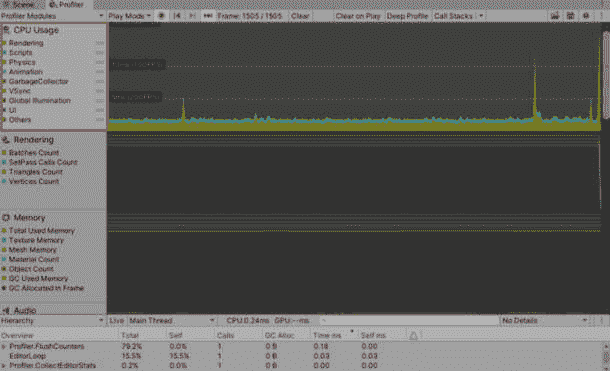

图 9.2 – CPU 模块

在以下表格中，我列出了每个类别，以及可能在该类别中发生的常见活动，指出了所花费的时间或对性能的影响：

| **类别** | **实时执行的活动** |
| --- | --- |
| 渲染 | 为 GPU 处理数据并等待 GPU 操作。这包括渲染网格、处理着色器、管理纹理以及其他与图形相关的计算任务。 |
| 脚本 | `MonoBehaviour`更新方法和协程执行。这涉及执行脚本代码、处理游戏逻辑以及管理游戏对象之间的交互。 |
| 物理模拟 | 执行物理模拟和相关过程，包括碰撞检测、刚体交互、关节处理以及其他与物理相关的计算。 |
| 动画 | 动画系统处理和性能考虑，包括处理关键帧、混合树、动画状态转换以及其他与动画相关的任务。 |
| 垃圾回收器 | 垃圾回收和内存分配活动，包括内存分配、释放未使用的内存、管理对象生命周期以及优化内存使用。 |
| VSync | 等待垂直同步活动。这包括将游戏帧率与显示刷新率同步，确保平滑且无撕裂的渲染。 |
| 全局照明 | 全局照明包括与场景中的照明相关的计算，例如光照贴图烘焙、实时 GI 计算、光照探针和反射探针。 |
| UI | UI 活动涉及渲染和交互元素，例如画布、文本元素、按钮、面板以及其他 UI 组件。 |
| 其他 | 这些是其他类别之外的附加 CPU 活动。这可能包括各种引擎任务、与编辑器相关的活动、音频处理、网络任务以及其他在运行时发生但不符合定义的类别的不规则计算。 |

理解每个类别内的活动使我们能够根据项目的优化需求针对特定区域。

#### 模块详细信息面板

您可以选择以三种不同的视图显示所选帧，让您能够了解如何在这之间切换，如图 *图 9**.3* 所示：

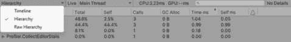

图 9.3 – 视图下拉菜单

让我们了解这些视图是如何工作的：

+   **时间线**：此视图提供了在不同线程上的单个时间轴上时间分布的概述，有助于可视化并行执行

+   **层次结构**：此视图按内部层次结构分组时间数据，提供了关于函数调用和内存分配的详细见解

+   **原始层次结构**：这与**层次结构**视图类似，但提供了关于性能警告和线程分组的额外详细信息

现在我们已经了解了分析器中可用的视图，我们可以切换它们以更好地了解帧的工作方式。

#### 在分析时使用实时设置

Unity CPU 分析器中的“实时”设置提供了我们在与游戏交互时的性能指标动态和即时视图，使我们能够进行高效的即时分析和优化。

让我们启用实时设置并看看它是如何工作的：

+   在开始录制之前，在 CPU 分析器模块中启用实时设置。

+   当我们与游戏交互并触发不同事件时，分析器立即在详细信息面板中显示关于当前帧的实时信息。

+   我们可以立即看到每个动作如何影响 CPU 使用率、内存分配以及其他性能指标。

+   这种实时反馈使我们能够快速识别性能瓶颈，即时进行调整，并立即看到优化的影响。

我们还可以启用**显示完整脚本方法名称**选项来显示完整的方法名称。这在处理复杂脚本或需要精确了解正在执行的功能时特别有用。您可以通过设置启用此选项，如图 *图 9**.4* 所示：


图 9.4 – 显示完整的脚本方法名称

在深入实际部分之前，理解常见的 Profiler 标记是至关重要的。

### 常见标记

Unity 的代码被各种 Profiler 标记所增强，提供了对性能关键任务和优化区域的洞察。通过利用这些标记，我们可以识别瓶颈并简化性能关键操作，从而提高我们游戏的整体效率和响应速度。

Unity 的代码带有许多 Profiler 指示器，这些指示器提供了对您游戏性能的洞察。这些标记对于识别瓶颈和优化您的代码非常有价值。让我们深入了解 Profiler 标记的主要类别及其功能：

+   **主线程** **基本标记**：

    主线程基本标记用于区分在您的游戏上花费的时间和在编辑器和 Profiler 任务上花费的时间。这些标记对于理解主线程上的帧时间至关重要。以下是一些示例：

    +   **PlayerLoop**：包含来自您游戏主循环的样本。当在玩家活动时针对编辑器，**PlayerLoop** 样本在 **EditorLoop** 之下。

    +   **EditorLoop**（仅编辑器标记）：包含在编辑器中分析玩家时的编辑器主循环的样本。**EditorLoop** 样本表示在玩家和编辑器同时运行时渲染和执行编辑器所花费的时间。

    +   **Profiler.CollectEditorStats**（仅编辑器标记）：包括与收集活动 Profiler 模块统计信息相关的样本。这些样本提供了关于玩家在收集模块统计信息时产生的开销的洞察。

+   **仅编辑器标记**：

    某些标记仅在 Unity 编辑器中进行分析时才会出现，提供了对编辑器特定活动（如安全检查和预制件相关任务）的洞察。以下是一个示例：

    +   **GetComponentNullErrorWrapper**：一个仅适用于 Unity 编辑器的标记，有助于识别空组件的使用

+   `MonoBehaviour` 更新方法和协程执行。以下是一个示例：

    +   **BehaviourUpdate**：包含所有 **MonoBehaviour.Update** 方法的样本

+   **渲染和** **VSync 标记**：

    这些标记揭示了与处理 GPU 数据和等待 GPU 操作完成相关的 CPU 活动。以下是一个示例：

    +   **WaitForTargetFPS**：表示等待由 **Application.targetFrameRate** 指定的目标帧率的所花费的时间

+   **后端** **脚本标记**：

    这些标记突出了脚本后端活动，有助于解决与垃圾收集和内存分配相关的问题。以下是一个示例：

    +   **GC.Alloc**：表示在托管堆中的分配，受自动垃圾收集的影响

+   **多线程标记**：

    这些标记专注于线程同步和作业系统，提供了有关并行处理和同步点的信息。以下是一个示例：

    +   **空闲**：包含表示 Worker 线程保持不活跃时间的样本

+   **物理标记符**：

    物理标记符提供了对物理模拟及其相关过程（如碰撞检测和关节处理）执行的洞察。以下是一个示例：

    +   **Physics.FetchResults**：包含收集物理引擎中物理模拟结果的样本

+   **动画标记**：

    这些标记符与动画系统相关，提供了关于动画处理阶段和性能考虑的详细信息。以下是一个示例：

    +   **Director.PrepareFrame**：安排并等待**Director.PrepareFrameJob**作业，评估活动 Animator 组件的状态机

+   **性能警告**：

    CPU 剖析器识别常见的性能问题，并向开发者显示警告，帮助他们有效地优化代码。以下是一个示例：

    +   **Animation.DestroyAnimationClip**：指示与销毁**AnimationClips**相关的调用存在性能问题，触发资源密集型操作

通过对这些剖析标记符的深入了解，我们可以定位性能瓶颈，并优化我们的 Unity 游戏以增强效率和响应性。

你可以在官方 Unity 文档中了解更多关于常见标记符的信息：[`docs.unity3d.com/Manual/profiler-markers.html`](https://docs.unity3d.com/Manual/profiler-markers.html)。

通过熟悉常见的标记符，我们发现它们在我们的优化之旅中证明是无价之宝。它们使我们能够高效地专注于特定区域，确保我们的努力既有效又精确。

## 理解剖析过程

让我们讨论剖析过程的一般技巧，包括如何识别瓶颈并更好地理解整个过程。

剖析在以下三个特定时间使用时最为有效：

+   在实施重大更改之前，通过剖析建立基线

+   在开发过程中跟踪更改，并确保它们不会对性能产生负面影响或超出资源预算

+   开发完成后，再次进行剖析以确认所做的更改已实现预期的性能改进

在确定你的游戏中存在问题时再进行剖析。此外，避免过度剖析；确定你游戏所需的帧率。每一帧都应该遵循与你的目标**每秒帧数**（**FPS**）相匹配的时间预算。例如，目标为 30 FPS 的游戏每帧应消耗少于 33.33 毫秒（1,000 毫秒除以 30 FPS）。同样，目标为 60 FPS 允许每帧 16.66 毫秒。

注意

要实现最精确的剖析结果，需要在目标设备上直接运行和剖析构建。表单顶部

### 识别瓶颈

你应该确定你的游戏是 CPU 绑定还是 GPU 绑定，这样你就可以正确地集中优化努力。例如，请注意，虽然 VSync 在所有平台上都是可选的，但在移动设备上通常启用，可能会对 CPU 时间等待做出贡献。

**VSync**，即**垂直同步**，是一种图形技术，它将游戏的帧率与显示器或显示设备的刷新率同步。这种同步防止了屏幕撕裂等问题，即不同帧的部分同时出现在屏幕上，导致视觉上的冲击。VSync 确保在渲染下一帧之前，每个帧都完整显示，为玩家创造更平滑、更视觉上愉悦的体验。

一个项目的性能由需要最多时间处理的芯片或线程决定。这是优化努力应该集中的地方。例如，考虑一个目标帧时间预算为 16.66 ms 且启用了 VSync 的游戏：

+   如果 CPU 帧时间（不包括 VSync）为 10 ms，而 GPU 时间为 12 ms，那么没有问题，因为两者都在预算范围内。

+   如果 CPU 帧时间为 20 ms，而 GPU 时间为 12 ms，则需要优化 CPU 性能，因为 GPU 不会从优化中受益。考虑将一些 CPU 任务转移到 GPU 上。

+   如果 CPU 帧时间为 8 ms，而 GPU 时间为 20 ms，则应专注于优化 GPU 工作负载，因为它受 GPU 绑定。

+   如果 CPU 和 GPU 的时间都为 20 ms，那么你将受到两者的限制，需要将它们优化到 16.66 ms 以下才能达到 60 FPS 的帧率。

在接下来的小节中，我们将了解更多关于 CPU 和 GPU 绑定问题的内容。

#### CPU 绑定问题

当 CPU 时间超过分配的时间预算时，被认为是 CPU 绑定问题。让我们通过一个例子来说明如何使用 Profiler 来识别和解决此类问题。利用 Profiler 中的**时间轴**和**层次结构**视图可以帮助我们更清楚地了解具体问题。请参阅*图 9**.5*以获取关于峰值帧的详细信息：

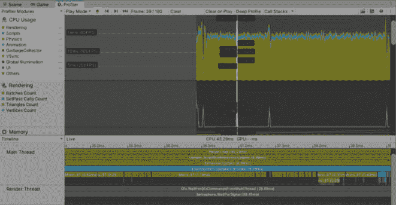

图 9.5 – 峰值帧

`gfx.waitForCommandsFromMainThread`标记表示主线程上可能存在的瓶颈，这会影响整体性能。这发生在渲染线程等待来自主线程的命令时，表明正在 CPU 上处理的任务或命令需要更长的时间。因此，游戏出现 CPU 绑定问题，导致渲染延迟。解决这些瓶颈和优化 CPU 绑定问题可以显著提高游戏性能和响应速度。

通过分析哪个线程最活跃来识别 CPU 瓶颈。性能分析有助于准确定位瓶颈，以便进行针对性的优化。猜测可能导致无效的优化甚至降低性能。

识别性能问题的主要线程通常包括以下内容：

+   **主线程**：此线程处理游戏逻辑和脚本执行，包括与物理、动画、UI 和渲染相关的任务。它占用了相当一部分的处理时间。

+   **渲染线程**：此线程负责在渲染过程中处理场景元素，例如相机剔除、深度排序和绘制调用批处理。它将 Unity 的场景表示转换为特定图形 API 调用以进行 GPU 渲染。

+   **工作线程**：这些线程利用 C#作业系统将特定任务卸载到单独的工作线程上，从而减少主线程的工作负载。Unity 的各种系统，如物理、动画和渲染，也利用作业系统来提高性能。

您需要识别代码中任何出现峰值的地方，确定导致高 CPU 使用率或处理时间延长的原因，并调查它是否对应于 Profiler 中的常见标记。理解这些标记的含义有助于您有效地解决问题。根据您的发现优化代码，在应用修复后再次监控 Profiler，并继续此迭代过程，直到达到目标帧率。

#### GPU 受限问题

如果您的游戏在 Profiler 标记如`Gfx WaitForPresentOnGfxThread`（表示渲染线程的空闲时间）上出现长时间活动，同时显示如`Gfx PresentFrame`或`<GraphicsAPIName> WaitForLastPresent`等标记，这表明是一个 GPU 受限的场景。在这种情况下，GPU 受限的特征是 GPU 利用率高，以及帧渲染和展示可能出现的延迟。

如果您的游戏看起来大量使用 GPU，您可以使用帧调试器快速检查发送到 GPU 的绘制调用批次。我将在下一节中更详细地讨论此工具。然而，重要的是要注意，尽管帧调试器可以提供对场景构建的见解，但它不提供具体的 GPU 时间细节。因此，您可以在 Profiler 和帧调试器之间切换，以修复任何与 GPU 相关的问题。

让我们探讨可能导致我们项目中 GPU 性能问题的因素。以下是一些常见问题：

+   具有大量粒子或复杂行为的复杂粒子系统可能会影响 GPU 性能

+   实时反射或折射，尤其是在有许多反射表面的场景中，可能会对 GPU 造成大量负载

+   着色器排列或针对不同材质或效果的着色器变体可能会增加 GPU 的工作负载，尤其是如果它们没有被高效管理的话

+   动态天气或环境效果，如雨、雾或动态天空，如果未进行优化，可能会增加 GPU 开销

+   动态遮挡剔除和可见性计算可能会影响 GPU 性能，尤其是在具有复杂几何形状或许多移动对象的场景中

+   高屏幕分辨率，尤其是 4K 显示器或移动设备上的视网膜显示器，可能会对 GPU 造成沉重的负载

在使用 Profiler 时，以下是一些有用的提示：

+   在**CPU 使用率**Profiler 模块中关闭**VSync**和**其他**类别。**VSync**标记表示 CPU 主线程的不活跃期，隐藏这些标记可以增强你的性能分析分析的清晰度。

+   在你的项目构建中禁用**VSync**，以清晰地了解主线程、渲染线程和 GPU 之间的交互。禁用**VSync**的性能分析构建可以简化 Profiler 数据的解释。

+   注意在播放模式或编辑模式中何时进行性能分析。使用播放模式进行游戏性能分析，使用编辑模式监控 Unity 编辑器进程。对编辑器进行性能分析有助于识别性能瓶颈并提高生产力。

+   当你需要快速迭代解决性能问题时，选择在编辑器中进行性能分析。在识别问题后，使用播放模式性能分析来高效迭代更改并验证解决方案。

利用帧调试器的强大功能，优化 Unity 中的图形性能和识别渲染瓶颈变得流畅且高效。我们将在下一节中深入了解这一点。

### 帧调试器

帧调试器是一个强大的工具，用于分析和调试游戏中帧的渲染过程。它允许你检查渲染过程中涉及的每个步骤，如绘制调用、批量处理、纹理和材质。这个工具对于优化图形性能和识别渲染瓶颈至关重要。

你可以从**窗口** | **分析** | **帧** **调试器**菜单打开**帧调试器**工具：

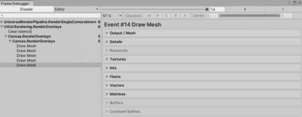

图 9.6 – 帧调试器

现在我们已经学会了如何打开帧调试器，让我们探索它是如何工作的以及它做了什么。

#### 理解帧调试器的工作原理

帧调试器通过拦截和分析发送到图形 API（例如 DirectX 或 OpenGL）的渲染命令来工作。它捕获有关每个绘制调用的信息，包括涉及的着色器、纹理、材质和网格。然后，这些捕获的数据以可视化界面呈现，使开发者能够检查和理解帧的渲染管道。

帧调试器实时运行，这意味着你可以在播放模式下暂停游戏，分析当前帧的渲染，并即时进行优化。

#### 探索帧调试器的关键功能

帧调试器的主要功能如下：

+   捕获并显示在渲染过程中进行的每个绘制调用

+   显示如何将对象批量处理以优化渲染性能

+   提供有关在渲染过程中使用的着色器、纹理、材质和网格的详细信息

+   识别渲染目标和离屏渲染纹理

让我们探索帧调试器。这是**帧调试器**窗口的外观：

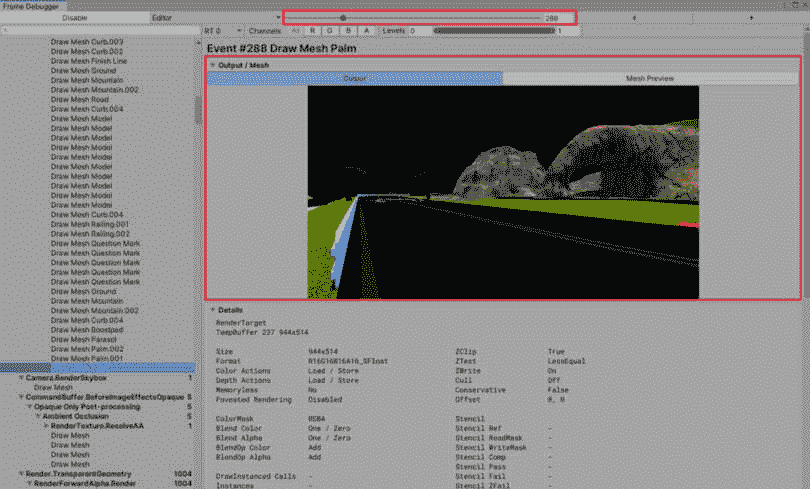

图 9.7 – 帧调试器窗口已启用

启用帧调试器后，游戏将暂停，你将能够查看该帧的所有图形相关细节。这包括从初始黑屏到当前场景的每个绘制调用。在 Unity 2022 中，这是我们使用的版本，帧调试器具有一个 **输出/网格** 部分带有两个标签：一个显示图形/场景的完整输出或当前状态，另一个显示绘制的网格，例如本例中的棕榈树示例。你可以在 *图 9.8* 中看到这个网格：

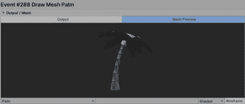

图 9.8 – 网格预览

每个绘制调用的详细信息将在一个包含重要信息（如 **渲染目标**、**顶点**、**索引** 和 **使用的着色器**）的单独部分中展示：

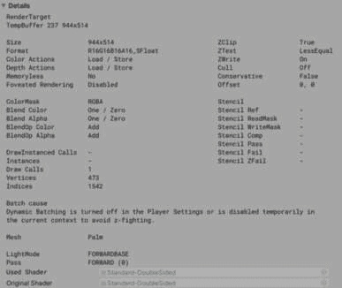

图 9.9 – 详细信息部分

此外，帧调试器还包括用于使用的 **纹理**、**向量**、**浮点数**和其他部分的区域，如图 *图 9.10* 所示：

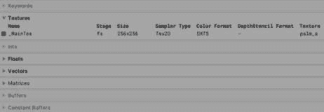

图 9.10 – 帧调试器中的其他部分

一旦你确定了帧的内容，优化过程就取决于采用针对每个游戏独特方面的特定策略和技术。解决问题需要彻底研究以确定优化区域，这个过程通常涉及迭代步骤以达到最佳性能。减少绘制调用的最重要方法之一是使用批处理。让我们更详细地看看。

#### 绘制调用批处理

绘制调用批处理是一种通过合并多边形来优化绘制调用的技术，允许 Unity 在更少的绘制调用中渲染它们。Unity 提供了两种默认的绘制调用批处理方法：

+   **静态批处理**：

    在此过程中，Unity 将静态游戏对象合并并一起渲染。

    Unity 中的静态批处理是指通过在构建时间或运行时合并网格来优化绘制调用的过程。当使用静态批处理时，确保某些标准得到满足对于游戏对象有资格进行静态批处理至关重要：

    +   游戏对象必须处于活动状态

    +   它应该有一个启用的 **网格过滤器** 组件，并引用一个顶点数大于 0 的网格

    +   游戏对象还应有一个启用的 **网格渲染器** 组件，并使用一个没有禁用批处理的着色器的材质

    +   要一起批处理的多边形必须共享相同的顶点属性

    当使用静态批处理时，Unity 允许整个批处理的多边形作为一个整体进行变换，例如移动、旋转或缩放它们。然而，不能对批处理内的单个多边形应用变换。

    值得注意的是，为了有效地使用运行时静态批处理，必须启用对网格的读写访问。总的来说，静态批处理是优化绘制调用并提高 Unity 项目中性能的有用技术。

+   **动态批处理**:

    动态批处理是一个过程，其中 Unity 通过在 CPU 上变换小网格的顶点并将相似顶点分组，最终在一个绘制调用中渲染它们。

    要在 Unity 中启用网格的动态批处理，请按照以下步骤操作：

    1.  导航到**编辑** | **项目设置** | **玩家**。

    1.  在**其他设置**部分，激活**动态批处理**选项。

    如果它们满足指定的标准，Unity 将自动将移动网格分组到一个单独的绘制调用中。

    Unity 中的动态批处理不适用于在**Transform**组件中具有镜像变换的 GameObject。例如，如果一个 GameObject 的缩放为 1，而另一个为-1，Unity 无法将它们一起批处理。

通常，Unity 会结合使用相同材质的 GameObject 的绘制调用，因此通过在多个 GameObject 之间共享材质来最大化批处理效率至关重要。如果你有两个几乎相同的材质资产，除了它们的纹理外，考虑将纹理合并到同一个图集中，从而创建一个更大的纹理。这允许你使用一个材质资产而不是两个。从 C#脚本访问共享材质属性时，请确保使用`Renderer.sharedMaterial`而不是`Renderer.material`。使用`Renderer.material`会创建材质的副本，从而阻止 Unity 为该渲染器批处理绘制调用。

以下是一些你可以利用的额外方法来减少绘制调用批次的数量：

+   使用遮挡剔除来消除隐藏在前景元素后面的对象并最小化过度绘制。请注意，这可能会增加 CPU 处理，因此请使用 Profiler 评估将工作负载从 GPU 转移到 CPU 的影响。

+   使用 GPU 实例化来减少批次，特别是对于共享相同网格和材质的多个对象。限制场景中的模型数量可以提高性能，并且通过谨慎的实现，你可以创建一个复杂而不会重复的场景。

+   利用 SRP 批处理器通过分组**绑定**和**绘制**GPU 命令来减少绘制调用之间的 GPU 设置。为了最大化 SRP 批处理的优势，使用多个材质，但将它们限制在几个兼容的着色器变体上，例如**通用渲染管线**（**URP**）和**高清渲染管线**（**HDRP**）中的**Lit**和**Unlit**着色器，最小化关键字组合之间的差异。

利用这些技术可以显著提高渲染性能并简化 Unity 游戏开发过程。

现在，让我们探讨任何游戏中各种类别的优化技术，以提高性能。

# 性能优化技术

在本节中，我们将深入研究 Unity 中性能优化技术的关键方面。性能优化在确保游戏运行顺畅、高效利用系统资源并向玩家提供无缝体验方面发挥着关键作用。通过实施优化技术、分析性能数据并采用高效的脚本实践，开发者可以显著提高他们游戏的表现力和整体质量。让我们详细探讨这些技能，以了解它们如何有助于在 Unity 中创建高性能游戏。

下面的子节涵盖了优化技术的关键领域。

## 物理和碰撞

为了提高 Unity 中物理和碰撞的性能和效率，战略性的优化技术起着至关重要的作用。在这里，我们将探讨两种这样的技术，并详细说明它们各自的问题、解决方案、示例和结果：

+   **碰撞层掩码**:

    +   **问题**：存在不必要的碰撞检查，这些对象之间没有交互，导致计算资源浪费。

    +   **解决方案**：使用碰撞层掩码指定哪些层应该相互交互，避免不必要的碰撞检查。

    +   **工作原理**：根据对象的交互需求分配不同的层。配置物理设置以仅启用需要交互的特定层之间的碰撞。

    +   **示例**：让我们考虑一个 2D 平台游戏，其中玩家角色与敌人、收藏品和环境障碍物交互。通过将这些对象分配到不同的层（例如，玩家、敌人、收藏品和障碍物），您可以配置物理设置以仅允许特定层之间的碰撞。以下是一个示例：

        +   玩家层与敌人和障碍物层交互，但不与收藏品层交互

        +   敌人层与玩家和障碍物层交互，但不与收藏品层交互

        +   收藏品层不与玩家、敌人或障碍物层交互：

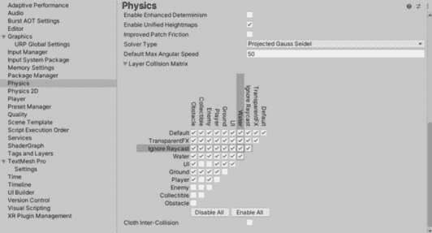

图 9.11 – 物理设置

在您的脚本中，当使用射线投射或碰撞触发器执行碰撞检查时，您可以应用层掩码以过滤掉不必要的碰撞。例如，当您检查敌人碰撞时，您可以指定仅包括敌人层的层掩码，忽略与收藏品或障碍物的碰撞。

+   **结果**：通过消除不必要的物理计算，减少了碰撞检查的数量并提高了性能。

在 Unity 中，通过碰撞层掩码优化物理和碰撞涉及战略性地分配层、配置物理设置以及应用层掩码以简化碰撞检查并提高性能。

+   **简化** **碰撞检测**：

    +   **问题**：对于不需要真实物理交互的对象进行碰撞检测的完整物理计算可能会消耗大量资源。

    +   **解决方案**：使用触发器作为非必要对象的简化碰撞检测。

    +   **如何工作**：Unity 中的触发器是碰撞组件，它们可以检测当另一个碰撞体进入或退出它们的体积时，而无需与它们发生物理碰撞。它们非常适合需要检测交互而不需要模拟物理力的场景。

    +   **示例**：在一个游戏中，收集品硬币散布在关卡周围，而不是为硬币使用基于刚体的碰撞，你可以将触发碰撞体附加到硬币上。当玩家的角色与硬币的触发碰撞体重叠时，你可以处理收集逻辑，而无需进行完整的物理计算。

    +   **结果**：使用触发器可以减少仅需要碰撞检测而不需要物理响应的对象的物理计算相关的计算开销。这有助于提高性能，尤其是在有大量非必要对象的情况下。

    这种技术在优化场景中非常有用，其中对象不需要详细的物理交互，但仍然需要基本的碰撞检测功能。通过使用简化的碰撞检测方法，你可以节省计算资源，并提高 Unity 项目的整体性能。

## 音频

在 Unity 中优化音频对于保持流畅和沉浸式的游戏体验至关重要。让我们探索一种高级技术，以减少内存使用并提高游戏中的音频性能：

+   **音频** **压缩技术**：

    +   **问题**：大音频文件会消耗大量内存，导致性能问题。

    +   **解决方案**：使用 Ogg Vorbis 或 MP3 等格式压缩音频文件，以减少内存使用而不影响质量。你可以通过参考 Unity 官方文档了解更多关于 Unity 的导入设置：https://docs.unity3d.com/Manual/class-AudioClip.html#:~:text=Whenever%20importing%20a%20file%2C%20Unity,to%20the%20original%20as%20possible:

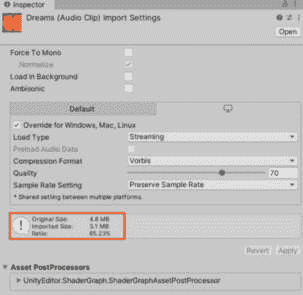

图 9.12 – 导入音频设置

+   **示例**：在游戏中压缩背景音乐和音效。

+   **结果**：减少内存占用，加快加载时间，以及更流畅的游戏体验。

通过采用高级音频优化技术，如压缩和流式传输，你可以显著提高游戏性能，同时保持高质量的音频输出。

## UI

我在*第五章*，*使用 C#为 Unity 游戏设计优化的用户界面*中详细介绍了这个主题。你可以查看它以获取更多详细信息。优化 UI 是性能的关键部分，尤其是在移动游戏中，因为它直接影响用户体验和设备资源利用。

## 网络和多人游戏

优化 Unity 游戏中的网络和多玩家功能对于确保跨各种设备和玩家交互的流畅游戏体验至关重要。在这里，我们将探讨增强网络性能和实施 Unity 游戏中的有效多玩家机制的关键技术和策略：

+   **延迟补偿技术**：

    +   **问题**：延迟可能导致多人游戏中的延迟，导致同步问题和游戏不一致性。

    +   **解决方案**：实施延迟补偿技术以减轻网络延迟对游戏的影响。这取决于你实施的网络解决方案。你可以参考他们的文档以获取特定网络解决方案的信息，例如 Photon。

    +   **示例**：使用客户端预测、插值和延迟补偿等技术，根据输入和网络数据预测和平滑网络对象的移动。

    +   **结果**：在多人游戏中提高了响应性和同步性，减少了网络延迟对玩家体验的影响，并增强了游戏流畅性。

+   **网络** **对象池**：

    +   **问题**：过度实例化和销毁网络对象可能导致网络拥塞和性能问题。

    +   **解决方案**：实施网络对象池来重复使用现有的网络对象，而不是频繁地创建和销毁它们。

    +   **示例**：在一个多人游戏中，而不是每次开火时都实例化和销毁子弹，使用对象池来回收子弹。当子弹不再需要时，它被返回到池中，以后可以再次使用。

    +   **结果**：由于对象实例化和销毁次数减少，网络开销降低，性能提高，从而带来更平滑的游戏体验。

这些技术在优化 Unity 游戏中的网络方面至关重要，因为它们有效地最小化了网络开销，提高了数据传输效率，并为玩家提供了更令人满意的多人游戏体验。然而，这些优化的有效性取决于游戏中实施的特定网络解决方案。

## 人工智能和路径查找

有效的 AI 和路径查找技术在创建沉浸式和引人入胜的游戏体验方面至关重要。我们将探讨两个关键解决方案：A*（A 星）路径查找和分层路径查找，以及行为树和状态机，以优化 AI 导航和行为：

+   **使用** **行为树**：

    +   **问题**：效率低下的路径查找算法可能导致高计算开销和缓慢的性能，尤其是在具有动态障碍物的复杂游戏环境中。

    +   **示例**：在 Unity 中使用 NavMesh 系统实现 A*算法。

    +   **How it works**: A* 是一种流行的路径查找算法，它能够高效地在图或网格上找到两点之间的最短路径。在 Unity 中，NavMesh 系统利用 A* 算法进行 AI 导航，使代理能够在避免障碍物的同时导航动态环境。

    +   **Result**: 改善 AI 导航性能，降低计算成本，并在复杂游戏场景中使 AI 代理的运动更加平滑。

+   **Using state machines for** **AI behavior**:

    +   **Problem**: AI 行为缺乏真实性和多样性可能导致可预测和单调的游戏体验。

    +   **Example**: 实现状态机以用于 AI 角色行为。

    +   **How it works**: 状态机将 AI 行为建模为一组状态、转换和动作。每个状态代表特定的行为或条件，转换定义了 AI 代理根据环境刺激或内部变量在状态之间切换的方式。

    这里是一个 AI 行为状态机的简化结构：

    **State interface/class**:

    +   **Enter**: 进入状态时调用的方法

    +   **Update**: 在状态中每个更新周期调用的方法

    +   **Exit**: 离开状态时调用的方法

    **Concrete states**:

    +   **Idle State**: 这表示 AI 正在空闲，具有针对空闲行为的特定 **Enter**、**Update** 和 **Exit** 方法。

    +   **Attack State**: 表示 AI 正在攻击，具有针对攻击行为的特定 **Enter**、**Update** 和 **Exit** 方法

    +   根据需要添加其他状态，每个状态都有自己的行为方法

    **State** **machine manager**:

    +   **Current State**: 跟踪 AI 的当前状态

    +   **Change State**: 通过更新 **Current** **State** 变量将 AI 从一个状态转换到另一个状态的方法

    +   **Update**: 在每个更新周期中要调用的方法，它反过来调用当前状态的 **Update** 方法

    **Usage**:

    +   使用初始状态（例如，**空闲状态**）初始化 AI

    +   在每个更新周期中，调用状态机管理器的 **Update** 方法来执行当前状态的行为

    +   当条件发生变化（例如，AI 检测到敌人）时，使用 **Change State** 方法切换到适当的状态（例如，**攻击状态**）

    该结构概述了状态机中组件及其关系。您可以通过创建状态类/接口、实现处理状态转换的管理器以及将它们集成到您的 AI 系统中来用任何编程语言实现此结构。

    +   **Result**: 模块化和组织化的 AI 行为设计，更容易调试和维护 AI 逻辑，以及更好地适应不断变化的游戏条件。

## 构建大小

高效的构建大小对于向玩家交付优化和完善的 Unity 游戏至关重要。让我们探讨一种称为构建大小缩减的技术，通过资产压缩来提高构建效率：

+   **Build** **size reduction**:

    +   **问题**：大型构建大小会导致下载时间更长，并增加玩家所需的存储空间。

    +   **解决方案**：实施资产压缩技术，如纹理压缩、音频压缩和代码剥离，以减少构建的整体大小。对于纹理压缩，建议使用 2 的幂次方尺寸，例如 64x64。这种方法对压缩有益，从而减少内存使用并减小最终构建大小。

    +   **示例**：使用适用于 Android 构建的 ETC2 和适用于 iOS 构建的 ASTC 纹理压缩格式，可以显著减小纹理资产的大小，同时不牺牲质量。纹理的大小在以下图中显示：

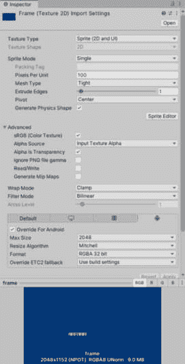

图 9.13 – 使用压缩格式前

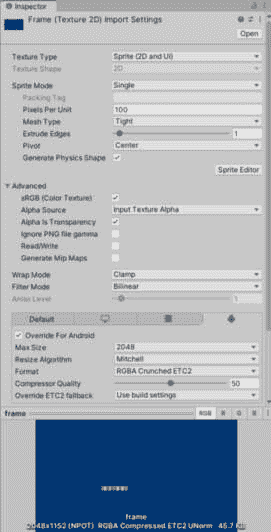

图 9.14 – 使用压缩格式后

+   **结果**：减小构建大小，加快下载时间，并在存储空间有限的设备上提高性能。

## 渲染

优化渲染对于提供视觉上令人惊叹的游戏同时保持最佳性能至关重要。让我们探讨两种强大的技术：用于高效网格渲染的**细节级别**（**LOD**）系统和遮挡剔除以最小化不必要的渲染，从而提高性能和视觉质量：

+   **LOD 系统**：

    +   **问题**：高多边形模型和复杂场景可能导致性能问题，尤其是在低端设备上。

    +   **解决方案**：实施一个 LOD 系统，其中对象具有多个版本，具有不同的细节级别。当对象远离摄像机时，系统切换到低细节版本，从而减少渲染工作量。

    +   **示例**：使用 Unity 的 **LOD 组** 组件为网格创建 LOD 级别，确保根据摄像机距离平滑过渡到 LOD 级别。确保你有必要的网格，可以通过从艺术家那里请求，利用资产商店中的资产，或者如果你有技能，可以手动创建。从原始网格创建低多边形网格对于优化性能很重要：

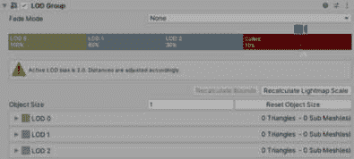

图 9.15 – LOD 组组件

+   **结果**：通过减少渲染的多边形数量来提高性能，同时不牺牲视觉质量。

+   **遮挡剔除**：

    +   **问题**：渲染屏幕外对象会消耗资源并影响性能，即使它们对玩家不可见。

    +   **解决方案**：使用遮挡剔除来防止被其他对象遮挡或不在玩家视锥体内的对象被渲染。

    +   **示例**：在 Unity 中配置遮挡剔除体积，以定义应应用遮挡剔除的区域，通过跳过遮挡对象来优化渲染：

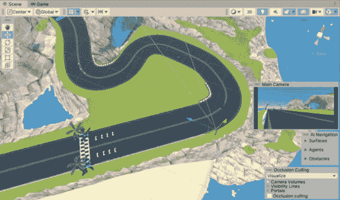

图 9.16 – 起跑线前的摄像机

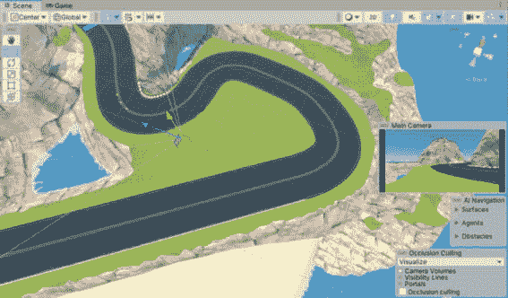

图 9.17 – 起跑线后的摄像机

+   **结果**：减少了渲染工作量，提高了帧率，并增强了整体性能，尤其是在复杂场景中。

## 脚本

有效的脚本编写实践对于优化游戏性能和确保流畅的游戏体验至关重要。让我们探讨两种强大的技术：用于高效对象管理的对象池和用于增强协程性能的协程优化，从而提高整体游戏性能和响应速度。

### 对象池

让我们考虑一个对象池的解决方案：

+   **问题**：在游戏过程中频繁地实例化和销毁对象会导致由于内存分配和垃圾回收而产生的性能开销。

+   **解决方案**：实现对象池，其中一组预分配的对象被重复使用，而不是您需要反复实例化和销毁它们。

+   `ObjectPoolManager`及其功能。

    在下面的代码块中，`ObjectPoolManager`类负责处理与池化对象相关的所有操作。为了使其可以从其他脚本中访问，我们将它实现为一个单例：

    ```cs
     public class ObjectPoolManager : MonoBehaviour
       {
           // Static instance of the ObjectPoolManager
           private static ObjectPoolManager instance;
           // Property to access the ObjectPoolManager instance
           public static ObjectPoolManager Instance
           {
               get
               {
                   if (instance == null)
                   {
                       instance = FindObjectOfType<ObjectPoolManager>();
                       // If not found, create a new GameObject and add the ObjectPoolManager script to it
                       if (instance == null)
                       {
                           GameObject obj = new GameObject("ObjectPoolManager");
                           instance = obj.AddComponent<ObjectPoolManager>();
                       }
                   }
                   return instance;
               }
           }
           private void Awake()
           {
               if (instance != null && instance != this)
               {
                   Destroy(gameObject);
               }
               else
               {
                   instance = this;
                   DontDestroyOnLoad(gameObject);
               }
           }
    ```

    此脚本使用静态`Instance`属性来实现`ObjectPoolManager`的单例模式。它还包括一个`Awake`方法，以确保场景中只有一个`ObjectPoolManager`实例，并在需要时在场景变化之间持续存在。

    在下面的代码块中，我将继续通过`GetPooledObject`和`ReturnToPool`函数实现与对象池相关的逻辑：

    ```cs
            // Define a dictionary to store object pools
            private Dictionary<string, Queue<GameObject>> objectPools = new Dictionary<string, Queue<GameObject>>();
            // Create or retrieve an object from the pool based on the name of it
            public GameObject GetPooledObject(string objectName)
            {
                if (objectPools.ContainsKey(objectName))
                {
                    if (objectPools[objectName].Count > 0)
                    {
                        GameObject obj = objectPools[objectName].Dequeue();
                        obj.SetActive(true);
                        return obj;
                    }
                }
                Debug.LogWarning("No available object in the pool with name: " + objectName);
                return null;
            }
            // Return an object to the pool
            public void ReturnToPool(string objectName, GameObject obj)
            {
                obj.SetActive(false);
                objectPools[objectName].Enqueue(obj);
            }
    ```

    下面是每个部分的解释：

    +   **private Dictionary<string, Queue<GameObject>> objectPools = new Dictionary<string, Queue<GameObject>>();**：这一行声明了一个名为**objectPools**的私有字典，它根据名称存储对象池。每个名称对应一个 GameObject 队列。

    +   **public GameObject GetPooledObject(string objectName)**：此方法根据名称从对象池中检索一个对象。它检查是否存在具有给定名称的对象池以及池中是否有可用的对象。如果可用，它将对象出队、激活并返回它。如果没有可用对象，它记录一个警告并返回 null。

    +   **public void ReturnToPool(string objectName, GameObject obj)**：此方法根据名称将对象返回到对象池。它禁用对象并将其重新入队到相应的对象池队列中。

    最后，我将创建一个函数，从其他脚本中实例化池化对象，如下面的代码块所示：

    ```cs
      // Create an object pool for a specific prefab so I can dynamically add object to the pool in runtime
      public void CreateObjectPool(GameObject prefab, int poolSize, string objectName)
      {
          if (!objectPools.ContainsKey(objectName))
          {
              objectPools[objectName] = new Queue<GameObject>();
              for (int i = 0; i < poolSize; i++)
              {
                  GameObject obj = Instantiate(prefab);
                  obj.SetActive(false);
                  objectPools[objectName].Enqueue(obj);
              }
          }
          else
          {
              Debug.LogWarning("Object pool with name " + objectName + " already exists.");
          }
      }
    ```

    下面是`CreateObjectPool`方法的解释：

    +   **public void CreateObjectPool(GameObject prefab, int poolSize, string objectName)**：此方法为特定预制体创建一个具有给定池大小和对象名称的对象池。它会检查是否已存在具有相同名称的对象池。如果没有，它将在字典中创建一个新的队列，并根据预制体实例化对象以填充池。

    下面是一个如何使用此管理器的示例：

    ```cs
    public class ExampleUsage : MonoBehaviour
     {
         public GameObject prefabToPool;
         public int poolSize = 10;
         public string objectName = "MyTag";
         void Start()
         {
             // Create an object pool with the specified prefab, pool size, and tag
             ObjectPoolManager.Instance.CreateObjectPool(prefabToPool, poolSize, objectName);
             // Get an object from the pool
             GameObject obj = ObjectPoolManager.Instance.GetPooledObject(objectName);
             if (obj != null)
             {
                 // Use the object
                 obj.transform.position = Vector3.zero;
             }
             // Return the object to the pool
             ObjectPoolManager.Instance.ReturnToPool(objectName, obj);
         }
     }
    ```

+   **结果**：减少了内存开销，提高了性能，并改善了游戏体验的流畅性，尤其是在频繁创建和销毁对象的场景中。

### 协程优化

现在，让我们考虑一个协程优化的解决方案：

+   **问题**：过度使用协程而不进行优化可能导致性能问题，尤其是在处理长时间运行或频繁调用的协程时。

+   **解决方案**：通过使用**WaitForSeconds**代替**WaitForSecondsRealtime**、最小化**WaitForSeconds**调用，以及在可能的情况下避免嵌套协程等技术来优化协程。此外，考虑定义或缓存**WaitForSeconds**实例，以避免每次协程执行时都创建新实例，这可以提高内存效率。以下代码块展示了如何定义**WaitForSeconds**的示例：

    ```cs
    // Define WaitForSeconds as a variable
        private WaitForSeconds waitShort = new WaitForSeconds(2f);
    ```

+   **示例**：重构协程密集型脚本，减少协程实例的数量，优化 yield 指令，并使用如**InvokeRepeating**等替代方案进行重复性任务。

+   **结果**：通过减少协程开销，使游戏体验更加流畅，以及提高帧率，尤其是在运行多个协程的复杂场景中，性能得到提升。

我们现在已经了解了一些常见问题和它们相应的解决方案。在下一节中，我们将继续学习如何优化内存。

# 内存管理和优化

Unity 中的内存分析涉及使用内存分析器模块和包等工具来分析和优化内存使用，使我们能够识别改进区域并提升整体性能。在本节中，你将了解更多关于内存分析器包的内容。

你可以通过两种方法在 Unity 应用程序中分析内存使用情况。首先，内存分析器模块提供了对内存使用的关键洞察，突出了应用程序消耗内存的区域。其次，通过将内存分析器包集成到项目中，你可以在 Unity 编辑器中获得一个增强的**内存分析器**窗口。这个高级工具允许进行更详细的分析，包括存储和比较快照以识别内存泄漏，以及检查内存布局以检测碎片化问题。

## 内存分析器

Unity 中的内存分析器是一个用于分析和优化 Unity 项目中内存使用的工具。它帮助我们了解我们的游戏如何使用内存，并识别可以优化的内存区域。

您需要将此包安装到您的项目中。转到 **包管理器** 窗口并选择 **内存分析器**，如图 *图 9*.18* 所示：

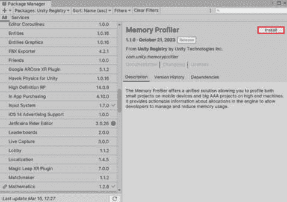

图 9.18 – 安装内存分析器包

等待 Unity 完成内存分析器包的安装，然后从 **窗口** | **分析** | **内存分析器** 菜单打开它。如果您第一次在项目中使用它，将打开一个空窗口，如图 *图 9*.19* 所示：

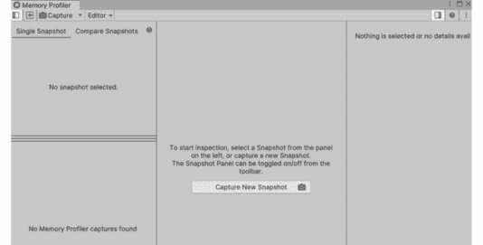

图 9.19 – 内存分析器面板

现在我们已经学会了如何打开内存分析器，让我们来探索它是如何工作的以及它做了什么。

#### 理解内存分析器的工作原理

内存分析器通过在 Unity 项目运行时实时监控和记录内存分配和使用情况来工作。它跟踪各种指标，如堆大小、按类型分配的内存、实例计数和内存泄漏。它提供了内存使用的详细分解，使开发者能够定位内存消耗高的区域和潜在的内存泄漏。

#### 探索内存分析器的关键功能

内存分析器的主要功能如下：

+   **跟踪内存分配**：内存分析器跟踪您的游戏所做的内存分配，包括堆内存、对象实例和资源使用

+   **识别内存泄漏**：它通过突出显示未正确处置或从内存中释放的对象来帮助识别内存泄漏

+   **按类型分析内存使用情况**：您可以看到项目中不同类型对象、脚本、纹理和其他资产的内存使用分解

+   **提供实例计数**：内存分析器显示了当前内存中每种对象类型的实例数量，帮助您了解内存消耗模式

+   **深入了解资源使用情况**：它提供了关于纹理、音频剪辑和其他资源如何影响内存使用的见解

现在，让我们学习如何使用内存分析器。

### 使用内存分析器

在我们深入内存分析器之前，考虑并遵守目标设备在多平台开发中的内存限制至关重要。根据硬件能力，在为每个设备指定的内存预算内设计场景和关卡，以确保基于硬件能力的最佳性能。设定明确的限制和指南有助于保持平台间的兼容性。

内存分析器包提供了全面的内存分析功能。利用它来存储和比较快照，以识别内存泄漏和优化应用程序的内存布局。与内存分析器模块不同，此包扩展了其功能，包括托管内存分析、快照保存、比较以及通过可视化分解详细探索内存内容：

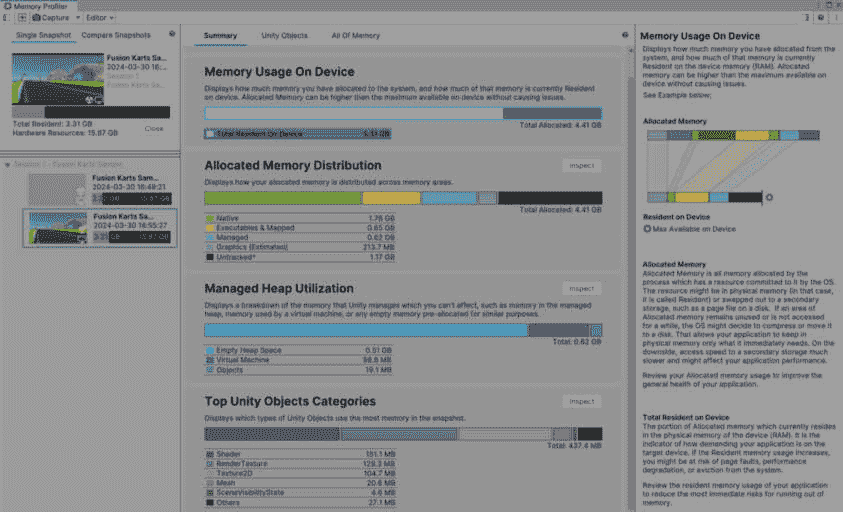

图 9.20 – 内存分析器中的摘要选项卡

**摘要**选项卡提供了所选快照（s）中内存状态的概述。

一旦您点击摘要中的任何区域，有关该区域的更多详细信息将出现在右侧面板中。

我们还应考虑的另一个选项卡是**Unity 对象**，它展示了正在使用内存的 Unity 对象，以及它们在本地和托管内存中的相应分配和总计。您可以使用这些数据来查找重复的内存条目或确定具有重大内存使用的对象。您还可以使用搜索栏根据指定的文本过滤表中的条目。这可以在*图 9*.*21*中看到：

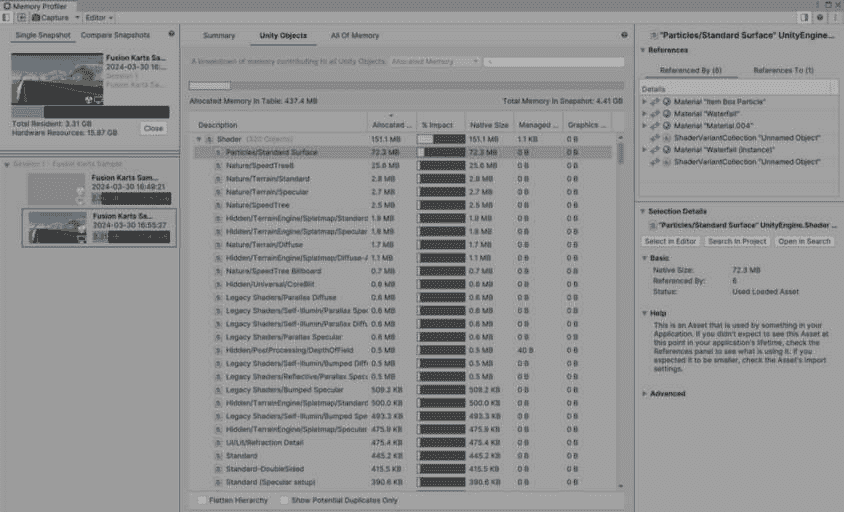

图 9.21 – 内存分析器中的 Unity 对象选项卡

最后，**所有内存**选项卡仅适用于**单快照**模式，提供了快照中所有跟踪内存的详细分解。它可视化内存使用情况，展示了由 Unity 或平台管理的较大部分。此选项卡对于区分与 Unity 无关的内存消耗和揭示在**Unity** **对象**选项卡中不明显潜在内存问题至关重要：

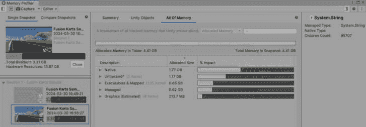

图 9.22 – 内存分析器中的所有内存选项卡

您可以通过以下步骤识别优化候选对象：

1.  通过参考打开快照的说明来打开快照。

1.  访问**Unity** **对象**选项卡。

1.  确保表格按降序排序，这是内存分析器窗口中的默认设置。如果排序顺序已更改，请选择**总大小**列标题以将此过程重置为降序。这种安排将内存使用量最高的对象置于表格顶部。

您可以通过两种方式之一搜索结果：

+   展开组以查看每个组内的单个对象。

+   考虑启用**扁平化层次结构**属性，以仅显示表格中的单个对象。

如果您不确定哪些对象可能使用过多内存，请禁用**扁平化层次结构**属性，并检查组以识别最大的对象。如果大多数资产都理解但怀疑有少数异常对象消耗了过多内存，则启用此属性。

此外，启用**仅显示潜在重复项**属性以识别内存分析器标记为潜在重复的对象。利用**引用**组件和**选择详情**组件对这些对象进行深入了解。这些信息有助于区分预期的重复项，例如场景中 Prefab 的多个实例，与问题重复项，例如意外创建的对象或 Unity 未正确处理的实例。

在内存分析方面，以下是一些考虑因素：

+   根据质量级别、图形层级和 AssetBundle 变体等设置使用不同的内存使用情况，尤其是在更强大的设备上。

+   **质量级别**和**图形**设置可能会影响用于阴影图的 RenderTextures 的大小。

+   分辨率缩放会影响屏幕缓冲区、RenderTextures 和后期处理效果。

+   文本质量设置影响所有纹理的大小。

+   最大检测限（LOD）可能会影响模型和其他元素。

+   如 HD 和 SD 版本之类的 AssetBundle 变体可以根据设备的规格产生不同的资产大小。

+   目标设备的屏幕分辨率会影响用于后期处理效果的 RenderTextures 的尺寸。

+   支持的图形 API 可以根据 API 特定的变体影响着色器的大小。

+   游戏过程中动态生成的内容，如程序化关卡，可能会显著影响内存使用。监控动态生成资产的内存占用，以确保有效的内存管理。

+   在具有不同规格、屏幕分辨率和硬件配置的目标设备上进行全面测试，以识别和解决每个平台特有的内存问题。

通过考虑这些方面并进行全面的内存分析，您可以在不同平台上优化内存使用，确保 Unity 项目中的性能和资源利用达到最佳。

在 Unity 中，通过优化资产导入设置来提高内存优化是一种有效的方法。

#### 导入模型

导入模型是 3D 游戏开发的关键方面，优化这一过程可以显著提高内存使用率和整体性能。在本节中，我们将探讨如图*图 9.23*所示的几个关键设置，这些设置可以通过调整来实现有效的优化：

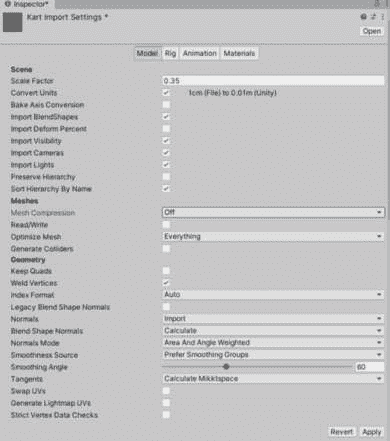

图 9.23 – 模型的设置

**网格压缩**是一个设置，它决定了应用于导入的网格数据的压缩级别。它影响网格资产的大小，并可能影响内存使用和渲染性能：

+   **选项**：Unity 为**网格压缩**提供了三个选项：

    +   **关闭**：不应用压缩，导致文件大小更大，但可能具有更好的渲染性能。

    +   **低**：应用基本的压缩算法以减小文件大小，同时仍保持视觉质量。这在许多情况下都适用，因为它对渲染性能没有显著影响。

    +   **中/高**：使用更高级的压缩技术进一步减小文件大小。然而，更高的压缩级别可能会由于额外的解压缩开销而导致渲染性能略有下降。

+   **最佳实践**：根据您游戏的具体需求，明智地使用**网格压缩**。对于复杂模型或具有复杂细节的模型，考虑使用**低**压缩以平衡文件大小减少与渲染性能。测试不同的压缩级别以找到您项目的最佳平衡。

**读写启用**设置确定网格数据是否可以在运行时访问和修改。启用此设置允许脚本在游戏过程中读取和修改网格属性：

+   **对性能和内存的影响**：启用网格的读写权限会增加内存使用，因为网格数据需要以允许运行时修改的格式存储。然而，它也可以为动态网格操作提供灵活性，例如变形或程序化网格生成。

+   **最佳实践**：只为需要运行时修改的网格启用读写权限。对于在游戏过程中不发生变化的静态网格，保持此设置禁用以减少内存开销。

**优化网格**设置确定 Unity 是否对导入的网格数据应用额外的优化以提高渲染性能：

+   **对性能和内存的影响**：启用**优化网格**允许 Unity 执行优化，如顶点焊接，这在不显著影响视觉质量的情况下减少了网格中的顶点数量。这可以通过减少 GPU 上的工作量来提高渲染性能。

+   **最佳实践**：为可以受益于顶点减少而不影响视觉保真度的网格启用**优化网格**。这对于具有冗余或重叠顶点的模型尤其有用，因为它可以显着减少内存使用并提高渲染性能。

在**Rig**选项卡中将静态游戏对象的**动画类型**选项设置为**无**可以对性能和内存使用产生积极影响。当您选择**无**时，Unity 会跳过与动画绑定相关的任何处理，并在运行时不分配与动画相关的计算资源。这可以在*图 9.24*中看到：

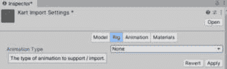

图 9.24 – 模型设置中的 Rig 选项卡

让我们看看将**动画类型**设置为**无**如何影响性能和内存。

**性能影响**：

+   通过将**动画类型**设置为**无**，Unity 避免了处理游戏对象的动画数据和计算。这减少了 CPU 和 GPU 的工作量，尤其是在渲染和动画播放阶段。

+   由于没有动画更新要执行，Unity 可以通过跳过与骨骼变换、混合形状或动画状态更新相关的计算来优化渲染管线。

+   这种优化可以导致帧率更平滑，整体性能得到提升，尤其是对于不需要任何动画功能的静态对象。

**内存影响**：

+   将**动画类型**设置为**无**也有节省内存的好处。Unity 不会为应用此设置的 GameObject 分配内存以存储动画片段、绑定数据或与动画相关的组件（例如，Animator 或 Animation Controller）。

+   这种内存使用量的减少可能非常显著，尤其是在包含多个静态对象或大型模型且不需要动画功能的场景中。

+   通过最小化动画相关资源的内存分配，您可以释放更多内存用于其他游戏资产，并减少 Unity 项目的整体内存占用。

**最佳实践**：

+   对于静态游戏对象或模型，如果不需要动画功能，将**动画类型**设置为**无**。这对于环境道具、静态景观元素或建筑模型尤其有效。

+   对于需要动画的动态对象，例如角色或交互元素，根据它们的动画需求选择合适的**动画类型**（例如，**通用**、**人形**、**旧版**等）。

+   定期审查和优化每个游戏对象的动画设置，以确保资源的高效使用并提高性能。

总结来说，将静态游戏对象的**动画类型**设置为**无**可以是一种有益的优化策略，因为它可以减少 Unity 项目中的 CPU/GPU 工作负载和内存使用。

最后，当在 Unity 中考虑模型设置动画选项卡中的**动画压缩**选项时，选择**最佳压缩**或**关键帧减少**确实会对性能和内存使用产生影响。这可以在*图 9.25*中看到：

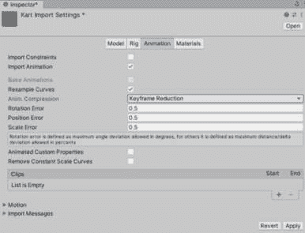

图 9.25 – 模型设置中的动画选项卡

让我们看看每个选项如何影响您的项目。

**最佳压缩**：

+   **性能影响**：**最佳压缩**旨在在保持视觉质量的同时减少动画片段的大小。这可以在运行时提高性能，尤其是在处理能力或内存带宽有限的设备上。

+   **内存影响**：通过有效地压缩动画数据，**最佳压缩**减少了动画片段的内存占用。这对于拥有许多动画或大型动画文件的项目有益，可以降低内存使用并改善资源管理。

**关键帧减少**：

+   **性能影响**：**关键帧减少**专注于在保持平滑运动的同时最小化动画片段中的关键帧数量。这可以通过减少动画播放期间在关键帧之间插值计算的开销来提高性能。

+   **记忆影响**：虽然**关键帧减少**可以通过减少动画播放所需的数据来帮助节省内存，但在内存优化方面可能不如**最佳压缩**高效。然而，它仍然可以有助于降低动画片段的整体内存使用。

**最佳实践**：

+   **最佳压缩**：对于需要在文件大小减少和视觉质量之间取得平衡的动画，请使用**最佳压缩**。它适用于广泛的动画，并可以提供显著的内存和性能优势。

+   **关键帧减少**：对于减少关键帧数量不会显著影响视觉保真度的动画，可以考虑使用**关键帧减少**。此选项对于重复或简单的动画特别有用，有助于简化内存使用并提高播放性能。

**选择正确的选项**：

+   评估您项目的动画需求，并选择最适合您需求的压缩选项。**最佳压缩**通常推荐用于大多数场景，因为它在减少文件大小和内存使用的同时保持了视觉质量。

+   定期测试不同压缩设置下的动画，以找到适合您特定项目需求的性能、内存使用和视觉保真度之间的最佳平衡。

总之，**动画压缩**选项中的**最佳压缩**和**关键帧减少**都会影响 Unity 中的性能和内存。选择与您的项目动画复杂度、视觉质量标准和目标平台能力相匹配的压缩设置以实现最佳结果。

为了自动化此过程，我们可以创建一个名为 `PostProcessor` 的资产脚本，这是一个编辑器脚本，允许我们为导入资产设置默认设置。以下是一个示例代码块，演示了一个 `CustomMeshPostProcessor` 类，在导入网格时实现所需的默认设置。只需创建此脚本并将其放置在项目中的 `Editor` 文件夹中。一旦实施，脚本将自动在导入新模型时应用这些设置。您可以自由地对其进行自定义并根据需要添加更多设置以适应您的游戏：

```cs
using UnityEditor;
using UnityEngine;
public class CustomMeshPostprocessor : AssetPostprocessor
{
    void OnPreprocessModel()
    {
        ModelImporter importer = assetImporter as ModelImporter;
        importer.isReadable = false; // Set Read/Write option to disabled
        importer.meshCompression = ModelImporterMeshCompression.Medium; // Set Mesh Compression to Medium
    }
}
```

总体而言，在 Unity 中对模型导入设置进行优化对于实现游戏中的高效内存使用和整体性能至关重要。通过仔细配置这些设置并遵循最佳实践，您可以在保持最佳资源利用率的同时显著提升用户体验。

#### 导入纹理

导入纹理的话题对优化游戏和内存性能影响极大，其显著效果还扩展到 UI 性能。*图 9.26* 中显示了可用的设置：

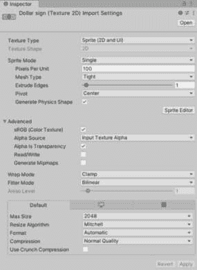

图 9.26 – 纹理设置

当将纹理导入 Unity 时，有两个关键设置会影响性能和内存使用，即**读/写**和**生成 MipMaps**。让我们深入了解每个设置及其影响。

**读/写**：

+   **性能影响**：启用**读/写**允许脚本在运行时访问和修改纹理数据。虽然这种灵活性对于某些功能（如动态纹理更新或程序生成）可能有益，但它也带来了性能成本。每个标记为**读/写**的纹理都会消耗额外的内存，并且在运行时可能需要更多的处理能力。

+   **内存影响**：启用**读/写**的纹理与未启用此选项的纹理相比，占用的内存更多。这是因为 Unity 为纹理数据和可以修改的附加副本分配空间。因此，为多个纹理启用**读/写**可能导致内存使用增加，尤其是在资源受限的平台。

**生成 MipMaps**：

+   **性能影响**：生成 MipMaps 创建了一系列预计算的纹理级别（MipMaps），这提高了渲染质量和性能。然而，这个过程在纹理导入或运行时生成时需要额外的计算资源，影响加载时间和初始性能。

+   **内存影响**：包含 MipMaps 会增加纹理的内存占用，因为每个 MipMap 级别都会增加纹理的总大小。虽然 MipMaps 通过在不同距离提供优化的纹理采样来提高渲染性能，但它们也消耗更多的内存，尤其是对于具有众多 MipMap 级别的较大纹理。

**最佳实践**：

+   **读/写**：仅对需要运行时修改或动态更新的纹理启用**读/写**。对于用作精灵、背景或 UI 元素的静态纹理，禁用**读/写**以节省内存并提高性能。

+   **生成 MipMaps**：对于将受益于改进的渲染质量和性能的纹理，例如用于 3D 模型或远距离地形的纹理，使用**生成 MipMaps**。在决定是否包含 MipMaps 时，考虑提高视觉保真度和增加内存使用之间的权衡。

**选择正确的设置**：

+   评估你项目中每种纹理的具体需求。根据纹理是否需要运行时修改以及是否需要 MipMaps 进行优化渲染，明智地启用**读/写**和**生成 MipMaps**。

+   定期监控不同设置下纹理的内存使用和性能影响，以优化资源利用并保持高效的运行时行为。

总结来说，当你在 Unity 中导入纹理时，管理**读取/写入**和**生成 Mip 贴图**设置对于平衡性能、内存使用和视觉质量至关重要。根据每个纹理的预期使用情况选择适当的设置有助于优化资源分配并提高整体应用程序性能。

另一个需要考虑的方面是压缩设置，这些设置根据目标平台而异，每个平台都有其独特的配置。虽然具体的平台设置非常广泛且依赖于平台，但有一些通用的优化压缩的建议。

**最大尺寸**:

+   调整纹理的最大尺寸决定了导入时的纹理尺寸。较高的分辨率提供更好的视觉质量，但消耗更多的内存。考虑设备的性能和纹理的预期用途，在质量和性能之间取得平衡。

+   **最佳实践**：根据目标平台和纹理在游戏中的作用设置最大尺寸。对于背景元素或远距离对象使用较低的分辨率以节省内存。

**调整尺寸的算法**：

+   调整尺寸的算法决定了当纹理的尺寸超过最大尺寸时如何缩放纹理。不同的算法可能影响图像质量和内存使用。

+   **最佳实践**：选择适合纹理类型的算法。对于细节纹理使用更锐利的算法，对于渐变或图案使用更平滑的算法以保持质量。

**格式**:

+   纹理格式决定了图像数据如何存储，影响压缩、内存使用和视觉保真度。常见的格式包括 PNG、JPG 和 TGA，每种格式都有其压缩级别和质量权衡。

+   **最佳实践**：根据纹理的内容和使用情况选择格式。使用 PNG 以获得无损质量，使用 JPG 以压缩照片纹理，使用 TGA 以获得具有透明度的高质量图像。

**压缩**:

+   压缩方法可以减小纹理大小和内存占用。Unity 提供了**正常质量**、**高质量**和**低质量**等压缩选项，它们以不同的方式影响图像质量和内存使用。

+   **最佳实践**：根据性能要求和视觉标准选择压缩设置。对于关键纹理使用高质量压缩，对于背景或非关键元素使用低质量压缩。

**Crunch 压缩**:

+   Crunch 压缩是一种进一步减少纹理文件大小的同时保持可接受质量的方法。它对于优化内存使用，尤其是在资源受限的平台上有益。

+   **最佳实践**：对于文件大小减少至关重要的纹理，如 UI 元素或常用纹理，启用 Crunch 压缩。平衡压缩级别以在保持视觉质量的同时最小化内存影响。

记住，这些设置的影响可能因平台而异，因此测试和迭代是关键。定期监控内存使用情况和性能指标，以优化纹理设置，以在每个目标平台上获得最佳结果。

通过仔细配置导入设置，你可以减少内存使用并提高 Unity 项目的整体性能。

在 Unity 中，利用精灵图集是内存优化的一项关键技术。

### 精灵图集

Unity 中的精灵图集是优化内存和性能的必要工具，尤其是对于 UI 元素。它们允许你将多个精灵组合成单个图像，减少绘制调用和纹理内存使用。让我们学习如何有效地使用精灵图集，同时考虑其最佳实践和它们对内存和性能的影响。

#### 创建精灵图集

注意

确保你通过**包管理器**在你的项目中安装了**2D Sprite**包。

在你的**项目**标签页中，右键单击并选择**创建** | **2D** | **精灵图集**，如图 9**.27**所示：

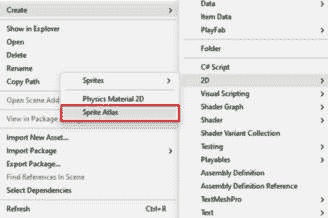

图 9.27 – 精灵图集

注意

确保你在**编辑** | **项目设置** | **编辑器**中启用了**精灵打包器**选项，这样你就可以开始使用这个包了。

启用**精灵打包器**，如图 9**.28**所示：

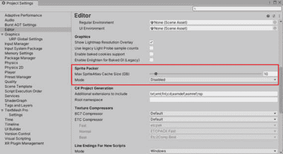

图 9.28 – 在项目设置中启用精灵打包器

创建精灵图集后，导航到它以开始添加纹理。点击**+**号选择单个纹理或包含纹理的文件夹。然后，点击**打包预览**将它们组合成图集文件，如图 9**.29**所示：

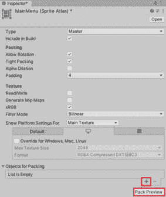

图 9.29 – 精灵图集设置

这里有一些你应该考虑的最佳实践：

+   将常用精灵合并到单个精灵图集中，以最小化绘制调用并提高性能

+   使用**精灵打包器**窗口中的打包选项来优化精灵在图集中的打包方式，以最小化浪费的空间

+   避免在图集中包含过大或不必要的精灵，以保持图集大小可控

精灵图集对内存和性能有影响。让我们更深入地了解一下：

+   **内存**：精灵图集通过减少加载到内存中的单个纹理数量来帮助节省内存。然而，请注意精灵图集的总大小，因为它仍然根据其尺寸和内容占用内存。

+   **性能**：精灵图集通过减少渲染 UI 元素所需的绘制调用次数来提高性能。这对于具有许多精灵的复杂 UI 尤其有益。

精灵图集主要影响 UI 元素在内存和性能方面的表现。它们旨在优化 2D 图形的渲染，因此它们对游戏的其他方面，如 3D 模型或音频，的影响最小。然而，对于以 UI 为主的游戏或应用程序，正确利用精灵图集可以显著提升性能和内存管理。

# 摘要

在本章中，我们开始了使用 Unity 强大的性能分析工具来优化游戏性能的旅程。在掌握我们已经获得的知识的基础上，我们深入了解了 Unity 性能分析工具的介绍，加强了识别性能瓶颈和应用优化技术以显著提升游戏性能的能力。本章进一步加深了我们对于内存管理和优化的理解，指导我们如何有效地管理内存使用并优化游戏中的内存性能。通过实际练习和洞察，我们巩固了对 Profiler、帧调试器和内存分析器的掌握，确保我们的游戏运行顺畅且高效。

展望第十章，我们将发现一大堆使用 C#增强 Unity 开发技能的技巧和窍门。下一章将专注于提高生产力的快捷方式、高级技术和工作流程，以及解决 Unity 开发中常见挑战的方法。我们将学习如何利用快捷方式提高开发效率，应用高级技术来提升我们的游戏开发流程，并解决我们可能遇到的常见挑战。本章将为我们提供宝贵的见解，我们可以将这些见解应用于改进我们的工作流程、克服挑战，并在使用 C#进行 Unity 游戏开发时解锁新的可能性。
