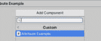

# Unity 中的技巧与窍门

欢迎来到我们使用 C# 进行游戏开发之旅的最后一章！在本章中，我们将深入探讨旨在提高生产力和提升您游戏开发技能的高级技术和工作流程。我们将从探索必要的 Unity 编辑器快捷键开始，接着是节省时间的代码编辑器快捷键，专门针对 C# 脚本编写。接下来，我们将深入研究优化您的预制件工作流程和有效地掌握预制件的使用。在高级技术方面，我们将揭示 Scriptable Objects 在数据驱动开发中的力量，并深入探讨创建自定义编辑器以增强工作流程和用户体验。最后，我们将解决故障排除和常见挑战，掌握调试工具并解决特定平台挑战，如移动优化和跨平台开发。准备好提升您的游戏开发技能，随着我们导航这些提高生产力的策略和高级技术！

在本章中，我们将涵盖以下主要主题：

+   C# 的提高生产力快捷键

+   C# 的高级技术和工作流程

+   故障排除和常见挑战

# 技术要求

本章所需的所有代码文件都可以在以下位置找到：`github.com/PacktPublishing/Mastering-Unity-Game-Development-with-C-Sharp/tree/main/Assets/Chapter%2010`。

# C# 的提高生产力快捷键

在本节中，我们将深入探讨各种基本快捷键和技巧，这些技巧可以显著提高您的 Unity 开发工作流程。我们将从探索必要的 Unity 编辑器快捷键开始，这些快捷键对于快速有效地导航 Unity 编辑器至关重要。接下来，我们将关注代码编辑器快捷键，您将学习针对您首选代码编辑器中 C# 脚本编写的节省时间的键盘快捷键。随后，我们将讨论预制件工作流程优化，提供有效使用预制件和高效预制件管理的快捷键。每个主题都将帮助简化您的开发过程，使使用 Unity 更高效和更有生产力。

快捷键是极具生产力的工具，帮助我们节省宝贵的时间，这在我们的工作流程中至关重要。

## Unity 编辑器快捷键

在本子节中，我们将解锁 Unity 编辑器快捷键的强大功能，以实现高效的导航和管理，节省我们宝贵的时间，并提高 Unity 开发的生产力。

### 层次结构导航快捷键

首先，让我们开始探索 Unity 的层次结构导航快捷键，以实现复杂场景中 GameObject 的有序和高效编辑。让我们深入了解这些有用的快捷键：

+   *Ctrl*/*Cmd* + *左箭头*：在 **层次结构** 视图中折叠选定的 GameObject 的层次结构，如图下所示：


图 10.1 – 折叠选定的 GameObject

+   *Ctrl*/*Cmd* + *右箭头*: 在**层次结构**视图中展开选定的 GameObject 的层次结构，如图下所示：


图 10.2 – 展开选定的 GameObject

接下来，我们将探讨另一类快捷键，这次聚焦于 GameObject。

### GameObject 创建和管理快捷键

在这里，我们将探讨 Unity 的 GameObject 创建和管理快捷键，用于在场景中高效创建、添加组件、设置父对象和维持层次结构。让我们深入了解这些提高生产力的快捷键：

+   *Ctrl*/*Cmd* + *Shift* + *N*: 创建一个空 GameObject：


图 10.3 – 创建一个空 GameObject

+   *Ctrl*/*Cmd* + *Shift* + *A*: 向选定的 GameObject 添加组件：


图 10.4 – 向选定的 GameObject 添加组件

+   *Ctrl*/*Cmd* + *Shift* + *V*: 将 GameObject 作为另一个 GameObject 的子对象粘贴：


图 10.5 – 将 GameObject 作为另一个 GameObject 的子对象粘贴

+   *Ctrl*/*Cmd* + *Shift* + *G*: 为选定的 GameObject 创建一个空父对象：


图 10.6 – 为 GameObject 创建一个空父对象

上述快捷键只是提高生产力的简单示例。您可以通过导航到**快捷键**（**编辑** | **快捷键**）来学习更多快捷键。

导航到**快捷键**后，您将看到如图*图 10**.7*所示的面板。注意左侧列表中的创建配置文件、分类快捷键和修改现有快捷键的选项。您还可以为空槽分配快捷键：


图 10.7 – 快捷键面板

如果您需要为工作创建特定的配置文件，只需单击**创建新配置文件..**选项。这将弹出一个面板，您可以在其中为新配置文件分配名称：


图 10.8 – 创建配置文件面板

在创建新配置文件后，您可以修改其中的默认快捷键。

利用这些 Unity 编辑器快捷键可以减少开发时间，提高工作效率，从而更有效地利用时间在关键任务上。

现在，让我们探索节省时间的 Visual Studio 快捷键，这些快捷键可以提高您的生产力。

## Visual Studio 快捷键

在本小节中，我们将探讨提升效率的 Visual Studio 快捷键，这些快捷键分为导航、重构和代码生成类别，以简化您的编码体验并提高生产力。

### 导航快捷键

我们将从发现一系列强大的 Visual Studio 导航快捷键开始，这些快捷键旨在简化您的编码体验并提高生产力。让我们深入这些节省时间的快捷键：

+   *Ctrl* + *T*: 打开一个搜索窗口，以便您可以快速导航到任何文件、类型或成员：


图 10.9 – 搜索面板

+   *Ctrl* + *Shift* + *V*: 允许您查看剪贴板历史记录，以便您可以粘贴之前复制的项目：


图 10.10 – 编辑器剪贴板

接下来，让我们探索另一类快捷键，这次聚焦于重构。

### 重构快捷键

让我们了解 Visual Studio 的重构快捷键如何帮助您轻松提高代码可读性、可维护性和整体代码质量。让我们深入这些高效的重构工具！

+   *Ctrl* + *R*, *R*: 在整个代码库中重命名符号：


图 10.11 – 重命名符号

+   *Ctrl* + *R*, *M*: 将方法提取为重构代码到单独的方法：


图 10.12 – 提取方法

接下来，让我们探索另一类快捷键，这次聚焦于代码生成。

### 代码生成快捷键

在这里，我们将探索 Visual Studio 的代码生成快捷键，这些强大的工具旨在简化编码任务，自动化重复性操作，并增强代码的一致性和可读性。让我们深入这些节省时间的快捷键：

+   *Ctrl* + *K*, *S*: 将选定的代码包裹在一个代码片段（例如 **try-catch** 或 **if-else**）中：


图 10.13 – 包围选定的代码

+   *Ctrl* + *Space*: 显示 IntelliSense 以帮助自动完成代码或显示代码完成的建议：


图 10.14 – 自动完成代码

您可以通过导航到 **工具** | **选项** | **环境** | **键盘** 来访问和修改 Visual Studio 的快捷键。

注意

这些快捷键专门为 Visual Studio 设计。要了解更多关于您编辑器的快捷键，您可以导航到其 **快捷键** 面板。

总结来说，掌握 Visual Studio 的强大快捷键，用于导航、重构和代码生成，对于优化您的编码工作流程和提升开发项目中的效率至关重要。通过探索和利用这些节省时间的工具，您可以提高代码可读性，简化编码任务，并最终在编程工作中提高生产力。

优化预制工作流程对于高效的 Unity 开发至关重要，它允许您简化资产管理、增强模块化，并在整个项目中提高生产力。

## 预制工作流程优化

预制件工作流程优化包括各种技术和策略，以有效地管理预制件，提高可重用性，并在您的 Unity 项目中保持一致性。以下是一些您可以实施的技术，以改进您的流程：

+   **预制件变体**：使用预制件变体来创建具有覆盖属性或组件的基预制件的变体。这允许您在自定义特定预制件实例的同时保持一致性。

    要创建预制件变体，首先选择您想要从中派生的基预制件。然后，在**项目**窗口中右键单击它，并选择**创建** | **预制件变体**。这将创建基预制件的新变体。您可以在保持与基预制件连接的同时自定义变体的属性、组件和层次结构。这允许您对变体进行特定更改，而不会影响基预制件的其他实例。

+   **嵌套预制件**：利用 Unity 的嵌套预制件功能创建具有嵌套层次结构的模块化和可重用组件。这有助于更好地组织并简化复杂预制件结构的更新。

    要创建嵌套预制件，只需在 Unity 层次结构中将一个预制件拖放到另一个预制件上。这将使拖动的预制件成为另一个预制件的子项，创建嵌套关系。嵌套预制件允许您在父预制件内封装可重用组件或对象，使其更容易管理和更新复杂的预制件结构。对嵌套预制件所做的更改将自动反映在父预制件的所有实例中。

+   `ScriptableObject`资产，用于存储配置数据、参数或其他资产的引用。然后，您可以通过将它们作为属性或参数分配到附加到预制件实例的脚本中，将这些`ScriptableObject`资产应用于预制件。这允许数据驱动的预制件定制和灵活性。

+   **预制件 PrefabUtility 事件**：利用**PrefabUtility**事件，例如**Prefab** **InstanceUpdatedCallback**或`PrefabUtility`事件，例如`PrefabInstanceUpdatedCallback`或`PrefabInstanceRemovedCallback`，在编辑器中修改或删除预制件时执行自定义操作或验证。通过在您的编辑器脚本中订阅这些事件，您可以根据预制件的修改触发自定义逻辑或工作流程，从而实现自动验证检查或工作流程优化。

让我们探索一个实际示例，展示这些技术中的一种实现。

### 在预制件实例间更新组件属性

让我们考虑一个场景，您在 Unity 项目中拥有大量预制件，并且需要更新场景中特定预制件的所有实例的特定组件或属性。手动更新每个实例可能既耗时又容易出错。然而，通过使用 C#脚本和 Unity 的`PrefabUtility` API，您可以有效地自动化此过程。

*问题*：您有一个游戏中散布在场景中的数百个敌人预制体。由于游戏玩法的变化，您需要更新所有敌人预制体中`EnemyMovement`组件的移动速度属性。

*解决方案*：您可以创建一个 C#脚本，遍历场景中所有敌人预制体的实例，并按程序方式更新`EnemyMovement`组件的移动速度属性，如下所示：

```cs
using UnityEngine;
using UnityEditor;
public class EnemyPrefabUpdater : MonoBehaviour
{
    public float newMovementSpeed = 10f; // New movement speed value
    [MenuItem("Tools/Update Enemy Prefabs")]
    static void UpdateEnemyPrefabs()
    {
        GameObject[] enemyPrefabs = Resources.LoadAll<GameObject>("Prefabs/Enemies"); // Load all enemy prefabs from Resources folder
        foreach (GameObject prefab in enemyPrefabs)
        {
            // Instantiate prefab to apply changes
            GameObject instance = PrefabUtility.InstantiatePrefab(prefab) as GameObject;
            // Update movement speed property of EnemyMovement component
            EnemyMovement enemyMovement = instance.GetComponent<EnemyMovement>();
            if (enemyMovement != null)
            {
                enemyMovement.movementSpeed = newMovementSpeed;
            }
            // Save changes to prefab
            PrefabUtility.ApplyPrefabInstance(instance, InteractionMode.UserAction);
            // Destroy temporary instance
            DestroyImmediate(instance);
        }
        Debug.Log("Enemy prefabs updated successfully.");
    }
}
```

让我们更详细地看看`UpdateEnemyPrefabs`方法。

此方法被标记为静态，并带有`[MenuItem]`属性，使其成为可以从 Unity 编辑器的**工具**菜单访问的自定义菜单项：

+   **static void UpdateEnemyPrefabs()**：这个**静态**方法遍历 Unity 项目**Resources**目录中**Prefabs/Enemies**文件夹内的所有敌人预制体

+   **GameObject[] enemyPrefabs = Resources.LoadAll<GameObject>("Prefabs/Enemies");**：这一行使用**Resources.LoadAll()**方法从**Prefabs/Enemies**文件夹加载所有 GameObject 预制体

+   **foreach (GameObject prefab in enemyPrefabs) { ... }**：这个**foreach**循环遍历从**Resources**文件夹加载的每个敌人预制体

按照以下步骤有效地使用此组件并实现所需的解决方案：

1.  将**EnemyPrefabUpdater**脚本附加到场景中的任何 GameObject 上。

1.  将**newMovementSpeed**变量设置为移动速度属性的期望值。

1.  在编辑器中，转到`EnemyMovement`组件，并将更改保存回预制体。

总体而言，此脚本提供了一个方便的方法，通过单个菜单命令在 Unity 编辑器中更新多个敌人预制体的属性，从而提高工作流程效率和生产力。

通过实施这些预制体工作流程优化技术，您可以简化资产管理，加速开发迭代，并确保 Unity 项目中更组织化和可扩展的项目结构。

让我们深入了解 Unity 游戏开发的世界，探索涉及使用 C#的高级技术和工作流程。

# C#的高级技术和工作流程

在本节中，我们将深入了解 Unity 中高级 C#技术和工作流程的细节，提供有关这些策略如何增强您的游戏开发过程的见解。我们将涵盖几个关键主题，包括 ScriptableObjects 和自定义编辑器。

## ScriptableObjects

ScriptableObjects 是 Unity 中的动态资源，允许您将数据与 GameObject 实例分开存储和管理。它们非常适合实现数据驱动系统并促进游戏不同部分之间的通信。让我们看看您可以利用 ScriptableObjects 的不同方式：

+   **数据驱动开发**：

    使用 ScriptableObjects 存储数据，例如游戏设置、角色统计数据、物品属性等。这允许在不修改代码的情况下轻松修改和迭代。你可以在*第六章*，*使用 C#进行有效的游戏数据处理和管理*中了解更多关于数据驱动开发的内容。

+   **事件系统**：

    事件驱动架构是一种强大的方式，可以以解耦的方式在不同游戏元素之间促进通信。通过使用 ScriptableObjects 作为事件，我们将创建一个灵活且健壮的系统来处理交互和触发游戏中的动作。

以下是基于 ScriptableObjects 的事件系统的优势：

+   **解耦通信**：基于 ScriptableObjects 的事件系统使得游戏中的不同组件之间可以实现解耦通信。这意味着组件可以相互交互，而无需直接引用，从而使得代码更加清晰和模块化。

+   **灵活性和可扩展性**：ScriptableObjects 提供了一种灵活且可扩展的方式来定义自定义事件和数据结构。这允许你创建针对特定交互或游戏机制的事件类型，使你能够轻松设计复杂的系统。

+   **集中式事件管理**：通过在 ScriptableObjects 中集中管理事件，你可以为处理游戏事件保持一个清晰和有序的结构。这使得在项目发展过程中更容易调试、修改和扩展你的事件系统。

+   **松耦合**：使用 ScriptableObjects 进行事件通信可以促进游戏元素之间的松耦合。这意味着对代码库某一部分的更改不太可能对其他部分产生意外的后果，从而使得代码更加健壮和易于维护。

让我们通过考虑游戏中的一个真实场景以及我们如何使用 ScriptableObjects 进行事件驱动架构来学习。

想象一个塔防游戏，其中塔需要响应敌人生成、玩家升级和环境效果。我们将使用 ScriptableObjects 实现一个事件系统来处理这些交互：

1.  首先，让我们使用 ScriptableObjects 为敌人生成、玩家升级和环境效果定义自定义事件：

    ```cs
    using UnityEngine;
    using UnityEngine.Events;
    // Scriptable Object representing an enemy spawn event
    [CreateAssetMenu(fileName = "EnemySpawnEvent", menuName = "Events/Enemy Spawn")]
    public class EnemySpawnEvent : ScriptableObject
    {
        public UnityAction<Vector3> onEnemySpawn;
        public void RaiseEvent(Vector3 spawnPosition)
        {
            onEnemySpawn?.Invoke(spawnPosition);
        }
    }
    // Scriptable Object representing a player upgrade event
    [CreateAssetMenu(fileName = "PlayerUpgradeEvent", menuName = "Events/Player Upgrade")]
    public class PlayerUpgradeEvent : ScriptableObject
    {
        public UnityAction<int> onPlayerUpgrade;
        public void RaiseEvent(int upgradeLevel)
        {
            onPlayerUpgrade?.Invoke(upgradeLevel);
        }
    }
    // Scriptable Object representing an environmental change event
    [CreateAssetMenu(fileName = "EnvironmentChangeEvent", menuName = "Events/Environment Change")]
    public class EnvironmentChangeEvent : ScriptableObject
    {
        public UnityAction<Color> onEnvironmentChange;
        public void RaiseEvent(Color newColor)
        {
            onEnvironmentChange?.Invoke(newColor);
        }
    }
    ```

1.  接下来，我们将在**Tower**类中订阅这些事件，并实现当这些事件被触发时的逻辑：

    ```cs
    using UnityEngine;
    public class Tower : MonoBehaviour
    {
        public EnemySpawnEvent enemySpawnEvent;
        public PlayerUpgradeEvent playerUpgradeEvent;
        public EnvironmentChangeEvent environmentChangeEvent;
        private void OnEnable()
        {
            enemySpawnEvent.onEnemySpawn += ReactToEnemySpawn;
            playerUpgradeEvent.onPlayerUpgrade += ReactToPlayerUpgrade;
            environmentChangeEvent.onEnvironmentChange += ReactToEnvironmentChange;
        }
        private void OnDisable()
        {
            enemySpawnEvent.onEnemySpawn -= ReactToEnemySpawn;
            playerUpgradeEvent.onPlayerUpgrade -= ReactToPlayerUpgrade;
            environmentChangeEvent.onEnvironmentChange -= ReactToEnvironmentChange;
        }
        private void ReactToEnemySpawn(Vector3 spawnPosition)
        {
            // Logic to react to enemy spawn
            Debug.Log("Tower reacting to enemy spawn at position: " + spawnPosition);
        }
        private void ReactToPlayerUpgrade(int upgradeLevel)
        {
            // Logic to react to player upgrade
            Debug.Log("Tower reacting to player upgrade, level: " + upgradeLevel);
        }
        private void ReactToEnvironmentChange(Color newColor)
        {
            // Logic to react to environment change
            Debug.Log("Tower reacting to environment change, new color: " + newColor);
        }
    }
    ```

1.  接下来，我们将从相关组件中触发事件。**EnemySpawner**、**PlayerManager**和**EnvironmentManager**类负责调用相应的事件：

    ```cs
    using UnityEngine;
    public class EnemySpawner : MonoBehaviour
    {
        public EnemySpawnEvent enemySpawnEvent;
        public void SpawnEnemy(Vector3 spawnPosition)
        {
            // Logic to spawn enemy
            // ...
            // Raise enemy spawn event
            enemySpawnEvent.RaiseEvent(spawnPosition);
        }
    }
    public class PlayerManager : MonoBehaviour
    {
        public PlayerUpgradeEvent playerUpgradeEvent;
        public void UpgradePlayer(int upgradeLevel)
        {
            // Logic to upgrade player
            // ...
            // Raise player upgrade event
            playerUpgradeEvent.RaiseEvent(upgradeLevel);
        }
    }
    public class EnvironmentManager : MonoBehaviour
    {
        public EnvironmentChangeEvent environmentChangeEvent;
        public void ChangeEnvironmentColor(Color newColor)
        {
            // Logic to change environment color
            // ...
            // Raise environment change event
            environmentChangeEvent.RaiseEvent(newColor);
        }
    }
    ```

在这个例子中，我们使用 ScriptableObjects 创建了三个自定义事件：`EnemySpawnEvent`、`PlayerUpgradeEvent`和`EnvironmentChangeEvent`。每个事件封装了一个特定的游戏事件，并提供了一种机制来使用相关数据触发事件。

`Tower`类订阅了这些事件，并实现了事件处理程序以响应敌人生成、玩家升级和环境变化。其他组件，如`EnemySpawner`、`PlayerManager`和`EnvironmentManager`，在游戏中的相关动作发生时引发这些事件。

此实现展示了使用 ScriptableObjects 进行游戏元素解耦通信的强大功能，使 Unity 中的灵活和模块化事件驱动架构成为可能。

解锁 Unity 编辑器的全部潜力超出了默认的**检查器**视图。通过自定义编辑器，我们可以根据其精确规格定制界面，提高生产力和用户体验。

## 自定义编辑器

自定义编辑器对于扩展 Unity 编辑器功能，超出默认的**检查器**视图至关重要。它们允许您创建针对特定需求的专用界面，提供更高效的流程和增强用户体验。以下是一些自定义编辑器开发的高级技术：

+   定制属性绘制

+   使用场景辅助线

我们将在接下来的小节中逐一介绍这些高级技术。

### 定制属性绘制

我们可以自定义在`[Header]`、`[Space]`、`[Range]`、`[TextArea]`和其他中的属性显示方式。您还可以创建自定义属性抽屉，以完全控制特定数据类型或类的 UI。

在自定义检查器和编辑器中，调整属性显示方式的能力至关重要。Unity 提供了一系列属性，允许我们在**检查器**窗口内创建视觉上吸引人且组织有序的 UI。以下我将提及一些这些属性及其用法：

+   **[ContextMenu("菜单项名称")]**: 此属性用于在 Unity 编辑器中右键单击组件或资产时创建自定义上下文菜单项。*图 10.15*和*图 10.16*展示了在编辑器中使用此属性的方法：


图 10.15 – ContextMenu 属性


图 10.16 – ContextMenu 使用

+   **[AddComponentMenu("菜单名/子菜单名/组件名")]**: 此属性将组件添加到**添加组件**菜单中的特定菜单层次结构。*图 10.17*和*图 10.18*展示了在编辑器中使用此属性的方法：


图 10.17 – AddMenuComponent 属性



图 10.18 – AddMenuComponent 使用

+   **[ColorUsage(bool showAlpha, bool hdr)]**: 此属性为**检查器**视图中的**颜色**和**渐变**字段提供颜色选择器选项，允许您指定是否显示 alpha 通道和使用**高动态范围**（**HDR**）颜色。*图 10.19*和*图 10.20*展示了在编辑器中使用此属性的方法：


图 10.19 – ColorUsage 属性


图 10.20 – ColorUsage 使用

虽然我不会详尽地介绍每个属性，但我将提及其他一些属性以供您了解，并鼓励您根据需要探索和使用它们在代码中：

+   **[RequireComponent(typeof(ComponentType))]**: 当脚本附加时自动将指定的组件添加到 GameObject 中，确保所需组件始终存在。

+   **[Range(min, max)]**: 限制**float**或**int**属性的范围，在**检查器**视图中显示为滑块，以便轻松选择值。

+   **[HideInInspector]**: 完全隐藏属性从**检查器**视图中，确保用户不可见或编辑。

+   **[TextArea(minLines, maxLines)]**: 在**检查器**视图中渲染多行文本字段，用于字符串属性，具有可调整的最小和最大行数，以便更好地进行文本编辑。

+   **[Tooltip("Tooltip Text")]**: 在**检查器**视图中的属性上添加工具提示，当鼠标光标悬停在属性上时提供有用的信息。

+   **[ReadOnly]**: 在**检查器**视图中将属性渲染为只读，防止用户修改其值，但仍然显示它以供参考。

+   **[Space(height)]**: 在**检查器**视图中的属性之间插入指定高度（以像素为单位）的垂直空间，有助于视觉分离和可读性。

+   **[Header("Section Name")]**: 在**检查器**视图中创建带有标签的标题，用于分组相关的属性，增强组织和可读性。

+   **[SerializeField]**: 强制 Unity 序列化私有字段，使其在**检查器**视图中可见并可编辑，尽管其访问级别。

+   **[ExecuteInEditMode]**: 在**编辑**模式下执行脚本的代码，允许您在编辑器中执行操作或更新，而无需进入**播放**模式。

+   **[Multiline(int lines)]**: 指定字符串属性应在**检查器**视图中显示为多行文本区域，具有指定的行数用于文本输入。

+   **[System.Flags]**: 将枚举转换为**检查器**视图中的位掩码字段，允许您使用复选框同时选择多个枚举值。这对于一次性定义多个选项非常有用。

+   **[Delayed]**: 延迟更新属性值，直到用户完成在**检查器**视图中的编辑。这对于性能优化很有用。

+   **[DisallowMultipleComponent]**: 限制 GameObject 只能有一个组件实例，防止重复。

+   **[SelectionBase]**: 在选择子对象时突出显示**层次结构**视图中的 GameObject，使得在复杂场景中更容易识别。

+   **[ExecuteAlways]**: 强制脚本在**编辑**模式下执行其方法，允许在开发过程中获得即时反馈。

+   **[SerializeReference]**: 序列化引用类型属性，支持序列化对象中的多态性和继承。

+   **[FormerlySerializedAs("OldName")]**: 重命名序列化字段，而不会丢失其序列化数据。

+   **[HelpURL("URL")]**: 链接到与属性或组件相关的在线文档或资源。

+   **[CanEditMultipleObjects]**: 允许你在**检查器**视图中同时编辑具有相同组件的多个对象。

+   **[RuntimeInitializeOnLoadMethod]**: 标记一个在游戏开始或编辑器加载时执行的方法。

+   **[ExecuteInEditMode, HelpURL("URL")]**: 将**ExecuteInEditMode**与帮助 URL 结合，以便轻松访问文档。

通过掌握属性自定义，我们可以设计直观且高效的检查器界面，从而增强编辑体验并简化 Unity 中的工作流程。

### 场景 gizmos

Unity 中的场景 gizmos 是强大的工具，可以直接在**场景**视图中直观地表示游戏元素、调试信息和其他关键数据。通过添加自定义场景 gizmos，我们可以增强我们的工作流程，改进可视化，并简化调试过程。以下是一些重要的考虑因素：

+   **可视化表示**：Gizmos 允许我们在**场景**视图中直观地表示游戏元素，如向量、光线、球体、立方体、线条等。这种可视化表示有助于您在运行时和在编辑器中理解对象的定位、朝向和行为。

+   **调试辅助工具**：Gizmos 是强大的调试工具，帮助我们识别问题、可视化数据，并更有效地调试复杂系统。例如，我们可以使用 gizmos 来显示路径、边界、碰撞区域、触发区域和其他有助于调试和测试的临界信息。

+   **增强的工作流程**：通过添加自定义的 gizmos，我们可以通过改进可视化、简化调试任务以及为游戏机制和交互提供有价值的见解来增强我们的工作流程。这种简化的工作流程可以在开发和测试阶段节省时间和精力。

+   **交互式反馈**：Gizmos 可以在游戏和编辑器模式期间提供交互式反馈，允许我们动态调整参数、可视化更改，并在**场景**视图中直接微调游戏元素。这种交互式反馈循环促进了快速迭代和原型设计，从而带来更好的设计决策和优化的游戏体验。

让我们展示 Unity 中 gizmos 的一个应用实例。

在下面的代码块中，`DisplayForwardDirection`类展示了通过绘制光线来直观表示 GameObject 前向方向的方法：

```cs
using UnityEngine;
public class DisplayForwardDirection : MonoBehaviour
{
    [SerializeField]
    private Color gizmoColor = Color.blue; // Color for the arrow gizmo
    [SerializeField]
    private float gizmoSize = 1f; // Size of the arrow gizmo
    #if UNITY_EDITOR
    private void OnDrawGizmos()
    {
        // Set the gizmo color
        Gizmos.color = gizmoColor;
        // Calculate the forward direction in world space
        Vector3 forwardDirection = transform.TransformDirection(Vector3.forward) * gizmoSize;
        // Draw the arrow gizmo
        Gizmos.DrawRay(transform.position, forwardDirection);
    }
    #endif
}
```

现在，将`DisplayForwardDirection`脚本附加到您想要的 GameObject 上。之后，您可以自定义光线的颜色或大小。请参考*图 20*。21*来查看附加组件的说明：


图 10.21 – DisplayForwardDirection 脚本

*图 20.22* 显示了从显示的圆柱体延伸出的向前方向的射线：


图 10.22 – 延伸向前的射线

总结来说，利用 Unity 中的自定义场景图示显著提高了开发工作流程，改善了调试能力，优化了游戏性能，并促进了团队成员之间更好的沟通和协作。有效地集成场景图示可以导致更高效的开发周期和更高质量的游戏。

通过将这些高级技术和工作流程集成到您的 Unity 项目中，您不仅可以扩展您的技能，还可以解锁创建引人入胜和沉浸式游戏体验的新可能性。

在游戏开发中导航复杂性通常涉及遇到故障排除和常见挑战，需要熟练的问题解决技能。我们将在下一节中考虑这一点。

# 故障排除和常见挑战

在本节中，我们将深入研究基本的调试技术和策略，以帮助您有效地识别和解决错误。此外，我们还将探讨特定平台挑战，重点关注移动优化、跨平台开发和针对不同游戏平台的复杂性。

让我们从调试开始，这是游戏开发中的一个基本技能，它允许开发者有效地识别和修复代码中的错误。

## 调试技术

在本小节中，我们将深入了解 Unity 中的调试工具和技术，让您掌握高效故障排除和解决代码问题的技能。

让我们先来探索不同的调试信息类型。有效地使用调试信息是一项宝贵的技能，它可以在故障排除和改进我们的代码方面给我们带来很大的好处。

以下代码块包含了在 Unity 中可以使用和自定义的四种主要类型的调试信息：

```cs
  Debug.Log("Info Message", gameObject); // Info level log
    Debug.LogWarning("Warning Message", gameObject); // Warning level log
    Debug.LogError("Error Message", gameObject); // Error level log
    Debug.LogException(new System.Exception("Custom Exception"), gameObject); // Exception level log
```

您可以将调试信息格式化，以便在文本中包含额外的信息。以下代码块显示了这一点：

```cs
Debug.LogFormat("[Scoreboard] Player score: {0:N0}", playerScore); // Custom log message with formatting for numbers
    Debug.LogFormat("[{0}] Game started at {1}", gameObject.name, System.DateTime.Now.ToString("HH:mm:ss")); // Custom log message with time stamp
```

您还可以使用颜色来格式化调试信息，如下面的代码块所示：

```cs
    Debug.Log("<color=green>[GameManager]</color> Game initialized successfully."); // Custom log message with color formatting
```

接下来，我们将了解如何在 Unity 中使用代码编辑器调试器来导航断点，这将使您能够有效地调试和解决项目中的错误。

### 代码编辑器调试器

让我们一步步地了解如何使用代码编辑器调试器，这样您就可以将以下技术应用到需要调试的代码中：

1.  在您的代码面板的左侧放置断点，如图 *图 10.23* 所示：


图 10.23 – 添加断点

1.  然后，点击**附加到 Unity**，如图 *图 10.24* 所示。构建过程将开始，等待与 Unity 同步：


图 10.24 – 连接到 Unity 按钮

如果你第一次使用调试器，你会看到 *图 10.25* 中显示的消息。你可以点击 **仅为此项目启用调试**，或者点击 **为所有项目启用调试** 以在所有项目中启用它：


图 10.25 – 连接到 C#调试器

1.  在编辑器中播放游戏，等待代码到达断点。游戏将暂停，编辑器将在断点位置打开。将鼠标悬停在行上以查看变量信息和条件，如图 *图 10.26* 所示：


图 10.26 – 鼠标悬停时显示的数据

1.  审查数据后，你可以通过按下 **继续** 按钮来恢复你的会话，如图 *图 10.27* 所示。如果没有设置断点，游戏将按正常方式继续；然而，当遇到断点时，任何现有的断点都将再次执行：


图 10.27 – 继续按钮

你可以按照以下步骤使用游戏中的断点开始调试。这种方法对于显示有关自定义类和条件的综合信息以及显示断点行上的所有数据非常有用。此外，你可以在某些点使用 **Step Into** 或 **Step Over** 来全面了解特定代码块的功能。

### 异常处理和错误日志记录

异常处理涉及管理在运行时发生的意外错误或异常，防止崩溃，并确保应用程序的稳定性。Unity 提供了各种机制来优雅地处理异常，例如 `try-catch` 块、自定义错误日志记录和处理特定异常类型。

以下是对异常处理和错误日志记录的好处：

+   **防止崩溃**：通过实现强大的异常处理，你可以在错误导致应用程序崩溃之前捕获和管理错误，从而提供更平滑、更可靠的用户体验

+   **优雅的错误处理**：适当的异常处理允许你优雅地响应错误，向用户提供有意义的错误消息，并为调试目的记录详细的信息

+   **调试和故障排除**：错误日志记录在调试和解决代码库中的问题时起着至关重要的作用，因为它提供了错误记录以及相关的上下文信息

让我们通过三个示例来演示这一点：

+   *示例 1 – 基本异常处理*

    在下面的代码块中，我实现了一个基本的 `try-catch` 块来处理数字数组中的错误。然后我可以调试错误，了解其本质和解决方案：

    ```cs
    try
    {
        int[] numbers = { 1, 2, 3 };
        Debug.Log(numbers[5]); // Trying to access an out-of-bounds index
    }
    catch (Exception ex)
    {
        Debug.LogError("An error occurred: " + ex.Message); // Log the error message
    }
    ```

+   *示例 2 – 自定义* *错误日志*

    在下面的代码块中，我实现了一个自定义的 try-catch 日志记录方法：

    ```cs
    public class GameManager : MonoBehaviour
    {
        void Start()
        {
            try
            {
                // Code that may throw an exception
            }
            catch (Exception ex)
            {
                LogErrorToFile("GameManager", ex.Message); // Custom method to log errors to a file
            }
        }
        void LogErrorToFile(string context, string errorMessage)
        {
            // Code to log errors to a file or external logging system
            Debug.LogErrorFormat("[{0}] Error: {1}", context, errorMessage);
        }
    }
    ```

    在 catch 块中，调用了名为`LogErrorToFile`的自定义方法。此方法负责将错误消息记录到文件或外部日志系统中。在这个例子中，它使用 Unity 的`Debug.LogErrorFormat`方法以指定格式在控制台中记录错误消息。

+   *示例 3 – 处理* *特定异常*

    在下面的代码块中，我实现了一个特定的异常：

    ```cs
    void Start()
    {
        try
        {
            int result = DivideNumbers(10, 0); // Dividing by zero will throw a DivideByZeroException
            Debug.Log("Result: " + result);
        }
        catch (DivideByZeroException ex)
        {
            Debug.LogError("Division by zero error: " + ex.Message);
        }
    }
    int DivideNumbers(int a, int b)
    {
        if (b == 0)
        {
            throw new DivideByZeroException("Cannot divide by zero.");
        }
        return a / b;
    }
    ```

通过实施强大的异常处理和错误记录实践，如这些，您可以增强 Unity 应用程序的稳定性和可靠性，确保用户获得更平滑的游戏体验，并简化开发者的调试过程。

平台特定的挑战是游戏开发中的一个关键方面，需要专业知识以及战略性的考虑，以优化不同设备和平台上的性能。

## 平台特定的挑战

作为经验丰富的 Unity 开发者，我们了解平台特定优化带来的复杂挑战，尤其是在移动环境和跨平台开发场景中。

以下是一些关于移动优化的技巧和窍门：

+   利用**细节级别**（**LOD**）技术来管理复杂场景并提高移动设备上的性能

+   实现动态批处理和静态批处理以减少绘制调用次数并优化移动平台上的渲染

+   优化着色器复杂度并使用适合移动设备的着色器，以确保在各种移动硬件上实现流畅的性能

+   实现性能优化，如对象池和纹理压缩

+   利用 Unity 的 Profiler 和性能工具进行深入分析和优化

+   利用 GPU 实例化和动态批处理，在移动设备上实现高效的渲染

+   实现异步加载和资产流式传输，以无缝管理资源密集型场景

+   利用 Unity 的 Addressable Asset 系统进行优化的资产管理以及动态内容加载

+   通过使用如**固定像素大小**或**根据屏幕大小缩放**等画布缩放模式来优化移动设备上的 UI 元素，以确保在不同屏幕分辨率上正确显示 UI 元素

+   通过仅渲染相机视图内的对象来实现遮挡剔除，以优化渲染并提高复杂场景中的性能

+   最小化动态光源的使用，并在可能的情况下使用烘焙光照，以减少 GPU 开销并提高移动平台上的性能

+   通过使用音频池、流式音频片段和减少同时音频源的数量，实现高效的音频管理，以在移动设备上节省资源

+   使用纹理图集和精灵打包将多个纹理合并到一个纹理图集中，以减少绘制调用次数并优化内存使用

+   在目标移动设备上定期进行性能分析和测试，以识别瓶颈、优化关键区域，并确保在各种设备上实现流畅高效的游戏体验

以下是一些你应该考虑的跨平台开发策略：

+   使用特定平台的编译指令来定制不同平台的行为

+   设计模块化架构和功能标志，以适应平台变化而不损害代码库的完整性

+   利用 Unity Cloud Build 和自动化测试框架以实现简化的部署和兼容性测试

+   使用特定平台的编译指令（如 **#if UNITY_IOS**、**#if UNITY_ANDROID** 等）来定制不同平台上的代码行为

+   实施响应式 UI 设计原则，以创建在不同屏幕分辨率和宽高比上无缝工作的自适应用户界面

+   实施开发在多个平台上无缝运行的游戏的高级方法，例如 PC、游戏机和移动设备，重点关注代码架构和特定平台的优化

+   利用 Unity 的可寻址资产系统在不同平台上高效地管理和加载资产，允许动态更新内容，无需重新编译整个项目

+   使用远程配置服务根据特定平台的要求或用户偏好动态调整游戏设置、功能和内容

+   利用基于云的分析和监控工具收集不同平台上的实时性能数据和用户反馈，实现数据驱动的优化和更新

+   实施本地化和国际化功能，以支持各种平台上的多种语言和文化偏好，增强全球可访问性和用户参与度

+   实施特定平台的输入映射和控制定制选项，允许玩家根据他们偏好的设备和平台调整控制方案

+   利用 Unity 的构建报告工具和性能分析功能来监控不同平台上的构建大小、内存使用、帧率和其他性能指标，从而实现数据驱动的优化

+   实施特定平台的测试和 QA 流程，包括测试计划、设备兼容性测试和特定平台的错误跟踪，以识别和解决特定平台的问题，并确保所有平台上的高质量发布

通过掌握这些特定平台的挑战并实施高级优化技术，我们可以提供高质量的游戏，这些游戏在各种设备和平台上表现最佳，展示了我们作为 Unity 开发者的专业知识。

总结来说，掌握这些故障排除技术并掌握特定平台的考虑因素，将使你具备克服常见挑战的技能，并在不同平台上为玩家提供无缝和优化的游戏体验。

# 概述

在本章的结尾部分，我们探讨了使用 C# 的高级游戏开发技术和提高生产力的策略。我们首先介绍了 Unity 编辑器的基本快捷键和代码编辑器中的节省时间的快捷键。我们还深入探讨了预制件工作流程的优化、用于数据驱动开发的 ScriptableObjects 以及创建自定义编辑器以提升用户体验。此外，我们还掌握了调试工具，应对了特定平台挑战，如移动优化，并为有效的跨平台开发提供了见解。

随着本书的结束，我想向读者表达我衷心的感谢，感谢您与我们一同踏上这段学习之旅。请记住，本书的精髓不在于记忆特定的技术，而在于理解其背后的概念和原则。愿这些知识能够赋予您释放创造力并在游戏开发事业中创新的能量。继续拓展边界，探索新的可能性，为世界各地的玩家创造引人入胜的体验。感谢您成为这段旅程的一部分，并祝愿您在游戏开发事业中继续取得成功和满足。
