# 第一章. Unity C# 复习

本书关于掌握 Unity 脚本编写，特别是掌握在 Unity 游戏开发背景下的 C#。在进一步讨论之前，需要定义和限定“掌握”的概念。通过“掌握”，我的意思是这本书将帮助你从拥有中级和理论知识过渡到拥有更流利、实用和高级的脚本知识。流利是关键词。从学习任何编程语言的开始，重点总是转向语言的语法和规则和法律——语言的正式部分。这包括诸如变量、循环和函数等概念。然而，随着程序员经验的积累，重点从语言本身转移到语言在解决现实世界问题中的应用方式上。重点从语言导向的问题转变为上下文敏感的应用问题。因此，本书的大部分内容将不会主要关于 C# 的正式语言语法。

在这一章之后，我将假设你已经掌握了基础知识。相反，本书将关于案例研究和 C# 的实际应用案例。然而，在转向这一点之前，本章将专注于 C# 的基础知识。这是故意的。它将快速、简要地涵盖你需要跟随后续章节有效进行的所有 C# 基础知识。我强烈建议你从头到尾阅读一遍，无论你的经验如何。本书主要面向那些对 C# 比较陌生但想深入学习的读者。然而，它对经验丰富的开发者来说也很有价值，可以帮助他们巩固现有知识，也许还能在过程中获得新的建议和想法。因此，在这一章中，我将从零开始，以逐步、总结的方式概述 C# 的基础知识。我将假设你已经理解了编程的基本概念，可能使用另一种语言，但从未接触过 C#。那么，让我们开始吧。

# 为什么选择 C#？

当涉及到 Unity 脚本编写时，在制作新游戏时早期的一个问题就是选择哪种语言，因为 Unity 提供了选择。官方的选择是 C# 或 JavaScript。然而，由于对语言进行的 Unity 特定适配，关于 JavaScript 是否应该更恰当地被称为 "JavaScript" 或 "UnityScript" 存在争议。这一点在此处不是我们的关注点。问题是应该为你的项目选择哪种语言。现在，最初看起来，既然我们有选择，我们实际上可以选择这两种语言，并在一种语言中编写一些脚本文件，在另一种语言中编写其他脚本文件，从而有效地混合语言。这当然是技术上可行的。Unity 不会阻止你这样做。然而，这是一个“不好的”做法，因为它通常会导致混淆以及编译冲突；这就像同时尝试用英里和公里计算距离一样。

相反，建议选择三种语言中的一种，并在整个项目中一致地应用它作为权威语言。这是一个更流畅、更高效的流程，但这意味着必须选择一种语言，而牺牲其他语言。这本书选择了 C#。为什么？首先，并不是因为 C# 比“其他”更好。在我看来，没有绝对的“更好”或“更差”。每种语言都有其自身的优点和用途，并且所有 Unity 语言在制作游戏方面都是同样有用的。主要原因可能是 C# 是最广泛使用和受支持的 Unity 语言，因为它与大多数开发者接触 Unity 时已有的现有知识联系最为紧密。大多数 Unity 教程都是针对 C# 编写的，因为它在其他应用开发领域有很强的存在感。C# 历史上与 .NET 框架相关联，该框架也用于 Unity（在那里称为 Mono），C# 与 C++ 最相似，C++ 通常在游戏开发中占有很强的地位。此外，通过学习 C#，你更有可能发现你的技能集与当代游戏行业中 Unity 程序员的需求相匹配。因此，我选择了 C#，以使这本书具有最广泛的吸引力，并且与大量的外部教程和文献相连接。这让你在阅读这本书之后更容易将你的知识进一步深化。

# 创建脚本文件

如果你需要为你的游戏定义逻辑或行为，那么你需要编写脚本。Unity 中的脚本编写从创建一个新的脚本文件开始，这是一个添加到项目中的标准文本文件。该文件定义了一个程序，列出了 Unity 需要遵循的所有指令。如前所述，指令可以用 C#、JavaScript 或 Boo 编写；对于这本书，语言将是 C#。在 Unity 中创建脚本文件有多种方法。

一种方法是前往应用程序菜单中的**资产** | **创建** | **C# 脚本**，如图下所示：

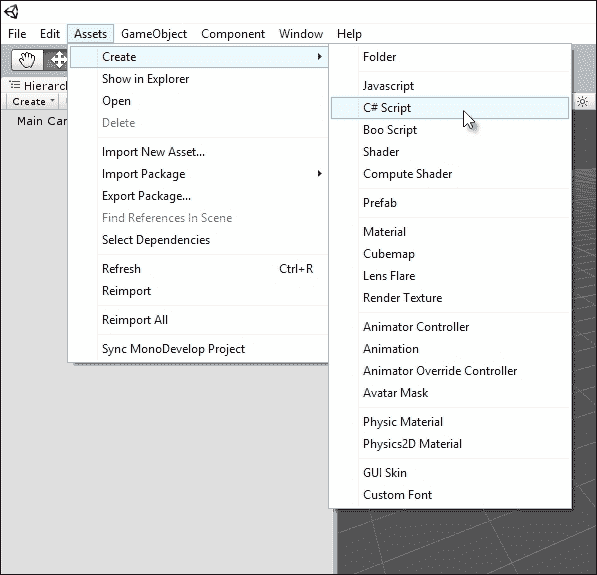

通过应用程序菜单创建脚本文件

另一种方法是右键单击**项目**面板中的任何空白区域，然后在上下文菜单中选择**创建**菜单中的**C# 脚本**选项，如图下所示。这将在当前打开的文件夹中创建资产。

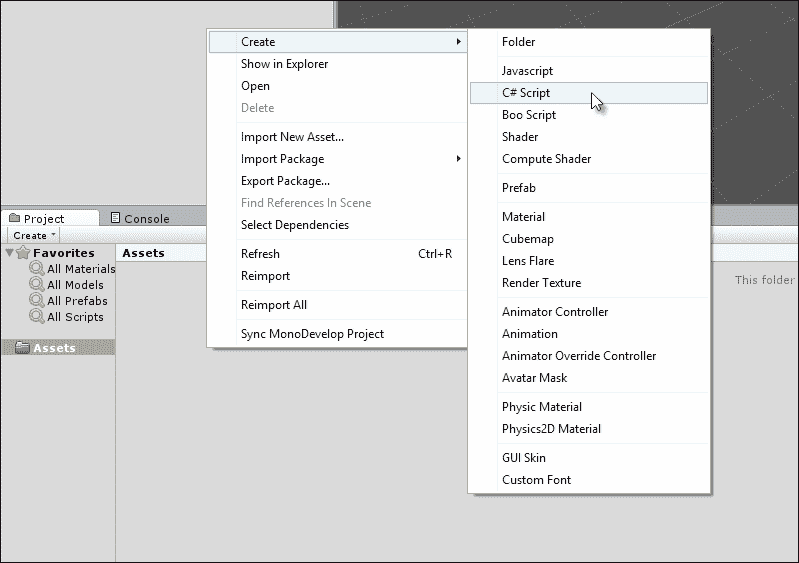

通过项目面板上下文菜单创建脚本文件

创建后，将在 `Project` 文件夹内生成一个新的脚本文件，文件扩展名为 `.cs`（代表 C Sharp）。文件名尤为重要，并且对脚本文件的有效性有重大影响，因为 Unity 使用文件名来确定文件内要创建的 C# 类的名称。类将在本章后面更深入地讨论。简而言之，务必给你的文件起一个独特且具有意义的名称。

当我们说独特时，指的是在整个项目中，无论文件位于不同的文件夹中与否，都不应有其他脚本文件与它同名。所有脚本文件在整个项目中都应具有唯一名称。名称还应具有意义，清楚地表达脚本打算做什么。此外，C#中还有关于文件名以及类名的有效性规则。这些规则的正式定义可以在网上找到，地址为[`msdn.microsoft.com/en-us/library/aa664670%28VS.71%29.aspx`](http://msdn.microsoft.com/en-us/library/aa664670%28VS.71%29.aspx)。简而言之，文件名应以字母或下划线字符开头（不允许以数字开头），并且名称中不应包含空格，尽管允许使用下划线（_）：

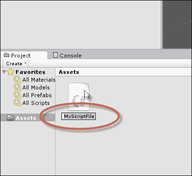

以独特的方式并根据 C#类命名约定命名脚本文件

Unity 脚本文件可以在任何文本编辑器或 IDE 中打开和检查，包括 Visual Studio 和 Notepad++，但 Unity 还提供了免费的开放源代码编辑器**MonoDevelop**。此软件是安装包中的主要 Unity 部分，无需单独下载。通过双击**项目**面板中的脚本文件，Unity 将自动在 MonoDevelop 中打开该文件。如果您后来决定或需要重命名脚本文件，您还需要将文件中的 C#类重命名为与文件名完全匹配，如下面的截图所示。如果不这样做，将导致代码无效和编译错误或问题，当将脚本文件附加到对象时会出现问题。

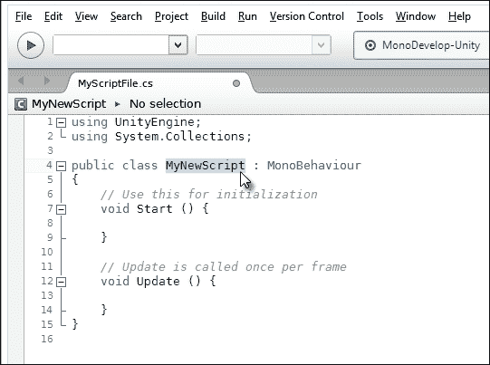

将类重命名为与重命名的脚本文件匹配

### 注意

**编译代码**

要在 Unity 中编译代码，您只需在 MonoDevelop 中保存您的脚本文件，通过从应用程序菜单中选择**文件**菜单中的**保存**选项（或按键盘上的*Ctrl* + *S*）然后返回到主 Unity 编辑器。当重新聚焦到 Unity 窗口时，Unity 会自动检测文件中的代码更改，然后响应地编译您的代码。如果有错误，游戏无法运行，错误将打印到**控制台**窗口。如果编译成功，您不需要做任何事情，只需在**编辑器**工具栏上按**播放**并测试运行您的游戏。请注意，如果您在修改代码后忘记在 MonoDevelop 中保存文件，Unity 仍然会使用较旧的、编译过的代码版本。因此，出于此原因以及备份的目的，定期保存您的作品非常重要，所以请确保按*Ctrl* + *S*在 MonoDevelop 中保存。

# 实例化脚本

Unity 中的每个脚本文件定义了一个主类，类似于蓝图或设计，可以被实例化。它是一系列相关的变量、函数和事件（我们很快就会看到）。默认情况下，脚本文件就像任何其他类型的 Unity 资产，例如网格和音频文件。具体来说，它保持在`Project`文件夹中处于休眠状态，不执行任何操作，直到它被添加到特定的场景中（通过将其作为组件添加到对象中），在那里它在运行时变得活跃。现在，由于脚本本质上是逻辑和数学的，它们不会像网格那样作为有形的、独立的对象添加到场景中。您无法直接看到或听到它们，因为它们没有可见或可听的存在。相反，它们作为组件添加到现有的游戏对象上，定义了这些对象的行为。将脚本作为特定对象上的特定组件激活的过程被称为实例化。当然，单个脚本文件可以在多个对象上实例化，以复制它们的行为，从而避免为每个对象创建多个脚本文件，例如当多个敌人角色必须使用相同的人工智能时。理想情况下，脚本文件的目的是为对象定义一个抽象公式或行为模式，该模式可以在所有可能的场景中成功地在许多类似的对象之间重用。要将脚本文件添加到对象上，只需将脚本从**Project**面板拖放到场景中的目标对象即可。脚本将以组件的形式实例化，并且其公共变量将在选择对象时在**Object Inspector**中可见，如下面的截图所示：

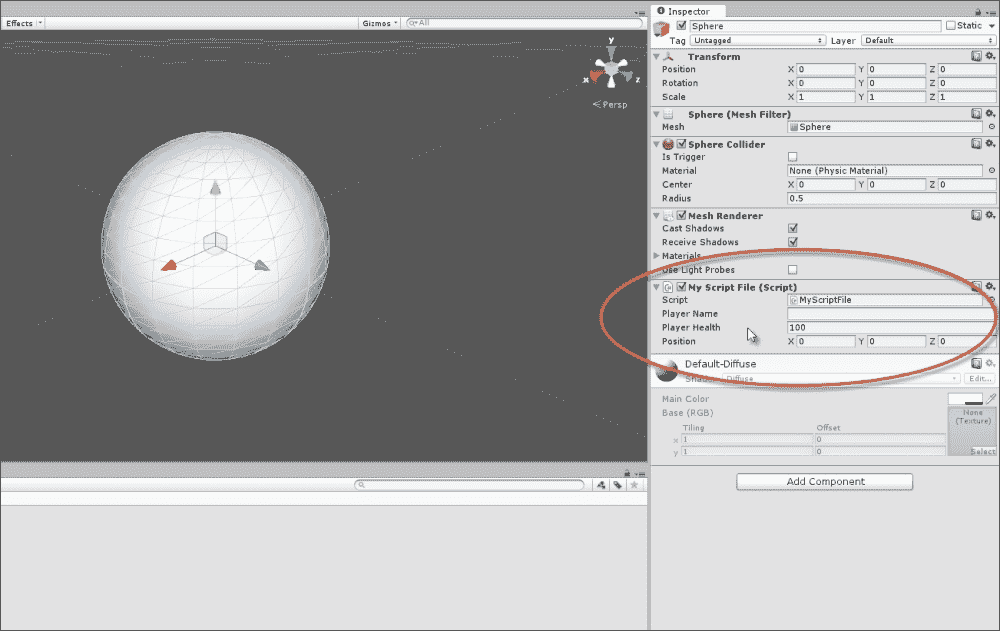

将脚本作为组件附加到游戏对象上

变量将在下一节中做更深入的讨论。

### 小贴士

在线可以找到更多关于在 Unity 中创建和使用脚本的详细信息，请访问[`docs.unity3d.com/412/Documentation/Manual/Scripting.html`](http://docs.unity3d.com/412/Documentation/Manual/Scripting.html)。

# 变量

在编程和 C# 中，核心概念可能是变量。变量通常对应于代数中使用的字母，并代表数值量，如 *X*、*Y*、*Z* 和 *a*、*b*、*c*。如果你需要跟踪信息，例如玩家名称、分数、位置、方向、弹药、健康以及众多其他可量化的数据类型（由名词表示），那么变量将是你的朋友。变量代表单个信息单位。这意味着需要多个变量来存储多个单位，每个变量对应一个。此外，每个单位都将具有特定的类型或种类。例如，玩家的名字代表一系列字母，如 "John"、"Tom" 和 "David"。相比之下，玩家的健康指的是数值数据，如 100%（1）或 50%（0.5），这取决于玩家是否受到伤害。因此，每个变量必然有一个数据类型。在 C# 中，变量使用特定的语法或语法创建。考虑以下代码示例 1-1，它定义了一个名为 `MyNewScript` 的新脚本文件和类，该类声明了三个具有类作用域的不同变量，每个变量具有唯一的数据类型。单词 "声明" 的意思是我们，作为程序员，正在告诉 C# 编译器所需的变量：

```cs
01 using UnityEngine;
02 using System.Collections;
03 
04 public class MyNewScript : MonoBehaviour 
05 {
06     public string PlayerName = "";
07     public int PlayerHealth = 100;
08     public Vector3 Position = Vector3.zero;
09 
10     // Use this for initialization
11     void Start () {
12 
13     }
14 
15     // Update is called once per frame
16     void Update () {
17 
18     }
19 }
```

### 注意

**变量数据类型**

每个变量都有一个数据类型。其中一些最常见的数据类型包括 `int`、`float`、`bool`、`string` 和 `Vector3`。以下是一些这些类型的示例：

+   `int`（整数或整个数字）= -3、-2、-1、0、1、2、3…

+   `float`（浮点数或小数）= -3.0、-2.5、0.0、1.7、3.9…

+   `bool`（布尔或 `true`/`false`）= `true` 或 `false`（1 或 0）

+   `string`（字符序列）= "hello world"、"a"、"another word…"

+   `Vector3`（位置值）= (0, 0, 0)、(10, 5, 0)…

从代码示例 1-1 的第 06-08 行中可以看出，每个变量都被分配了一个起始值，并且其数据类型被明确声明为 `int`（整数）、`string` 和 `Vector3`，它们代表 3D 空间中的点（以及我们将看到的方向）。没有可能的完整数据类型列表，因为这将根据你的项目而广泛变化（你也会创建自己的数据类型！）。在这本书的整个过程中，我们将使用最常见的数据类型，所以你会看到很多示例。最后，每个变量声明行都以关键字 `public` 开头。通常，变量可以是 `public` 或 `private`（还有一个叫做 `protected` 的，这里没有涉及）。`public` 变量将在 Unity 的对象检查器中可访问和可编辑（我们很快就会看到，你还可以参考前面的截图），并且其他类也可以访问它们。

变量之所以被这样命名，是因为它们的值可能会随时间变化（或改变）。当然，它们不会以任意和不可预测的方式改变。相反，它们会在我们明确更改它们时改变，无论是通过代码中的直接赋值、从对象检查器，还是通过方法和函数调用。它们可以直接和间接地改变。变量可以直接赋值，如下所示：

```cs
PlayerName = "NewName";
```

它们也可以通过表达式间接赋值，即，最终值必须在赋值最终完成到变量之前评估的语句，如下所示：

```cs
//Variable will result to 50, because: 100 x 0.5 = 50
PlayerHealth = 100 * 0.5;
```

### 注意

**变量作用域**

每个变量都使用隐式作用域声明。作用域决定了变量的生命周期，即，在源文件内可以成功引用和访问变量的地方。作用域由变量声明的位置决定。代码示例 1-1 中声明的变量具有类作用域，因为它们是在类的顶部声明的，并且在任何函数之外。这意味着它们可以在整个类中访问，并且（因为是公共的）也可以从其他类中访问。变量也可以在特定的函数内部声明。这些被称为局部变量，因为它们的作用域限制在函数内，即，局部变量不能在其声明的函数外部访问。类和函数将在本章的后面讨论。

关于变量及其在 C# 中的使用的更多信息，请参阅[`msdn.microsoft.com/en-us/library/aa691160%28v=vs.71%29.aspx`](http://msdn.microsoft.com/en-us/library/aa691160%28v=vs.71%29.aspx)。

# 条件语句

变量可能在许多不同的情况下发生变化：当玩家改变他们的位置，当敌人被摧毁，当关卡改变，等等。因此，你将经常需要检查变量的值，以便根据值分支执行你的脚本，执行不同的动作集。例如，如果 `PlayerHealth` 达到 0%，你将执行死亡序列，但如果 `PlayerHealth` 在 20%，你可能只显示一个警告消息。在这个特定的例子中，`PlayerHealth` 变量驱动脚本向指定的方向执行。C# 提供了两种主要的条件语句来实现这种程序分支。这些是 `if` 语句和 `Switch` 语句。两者都非常有用。

## if 语句

`if` 语句有多种形式。最基本的形式是检查一个条件，如果且仅当该条件为 `true` 时，将执行后续的代码块。考虑以下代码示例 1-2：

```cs
01 using UnityEngine;
02 using System.Collections;
03 
04 public class MyScriptFile : MonoBehaviour 
05 {
06     public string PlayerName = "";
07     public int PlayerHealth = 100;
08     public Vector3 Position = Vector3.zero;
09 
10     // Use this for initialization
11     void Start () {
12     }
13 
14     // Update is called once per frame
15     void Update () 
16     {
17         //Check player health - the braces symbol {} are option for one-line if-statements
18         if(PlayerHealth == 100)
19         {
20         Debug.Log ("Player has full health");
21         }
22     }
23 }
```

前面的代码与其他类型的 Unity 代码一样执行，通过从工具栏中按下**播放**按钮，只要脚本文件之前已经在活动场景中的对象上实例化。第 18 行的`if`语句持续检查`PlayerHealth`类变量的当前值。如果`PlayerHealth`变量正好等于（`==`）`100`，则在大括号`{}`（第 19-21 行）内的代码将被执行。这是因为所有条件检查都会产生`true`或`false`的布尔值；条件语句实际上检查查询的条件（`PlayerHealth == 100`）是否为`true`。理论上，大括号内的代码可以跨越多行和多个表达式。然而，在这里，第 20 行只有一行：`Debug.Log` Unity 函数将**玩家健康值满**字符串输出到控制台，如下面的屏幕截图所示。当然，`if`语句可能以另一种方式执行，即如果`PlayerHealth`不等于`100`（可能是`99`或`101`），则不会打印任何消息。它的执行始终取决于前面的`if`语句评估为`true`。

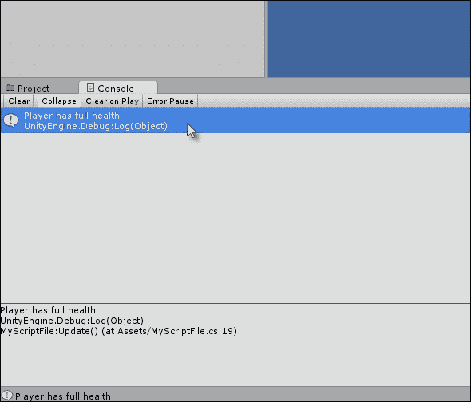

Unity 控制台对于打印和查看调试消息非常有用

在线可以找到有关 C#中的`if`语句、`if-else`语句及其使用的更多信息，请访问[`msdn.microsoft.com/en-GB/library/5011f09h.aspx`](http://msdn.microsoft.com/en-GB/library/5011f09h.aspx)。

### 注意

**Unity 控制台**

如前一个屏幕截图所示，控制台是 Unity 中的一个调试工具。这是一个可以通过`Debug.Log`语句（或`Print`函数）从代码中打印消息的地方，以便开发者查看。它们有助于在运行时和编译时诊断问题。如果您遇到编译时或运行时错误，它应该列在**控制台**选项卡中。默认情况下，**控制台**选项卡在 Unity 编辑器中应该是可见的，但可以通过从 Unity 应用程序文件菜单中选择**窗口**菜单中的**控制台**来手动显示。有关`Debug.Log`函数的更多信息，请访问[`docs.unity3d.com/ScriptReference/Debug.Log.html`](http://docs.unity3d.com/ScriptReference/Debug.Log.html)。

您当然可以检查比仅仅等于（`==`）更多的条件，就像我们在代码示例 1-2 中所做的那样。您可以使用`>`和`<`运算符来检查一个变量是否大于或小于另一个值。您还可以使用`!=`运算符来检查一个变量是否不等于另一个值。此外，您甚至可以使用`&&`（AND）运算符和`||`（OR）运算符将多个条件检查组合到同一个`if`语句中。例如，查看以下`if`语句。它仅在`PlayerHealth`变量在`0`到`100`之间且不等于`50`的情况下执行大括号`{}`之间的代码块，如下所示：

```cs
if(PlayerHealth >= 0 && PlayerHealth <= 100 && PlayerHealth !=50)
{
Debug.Log ("Player has full health");
}
```

### 注意

**`if-else` 语句**

`if` 语句的一种变体是 `if-else` 语句。如果 `if` 语句的条件评估为 `true`，则执行代码块。然而，`if-else` 语句扩展了这一点。如果其条件为 `true`，则执行 `X` 代码块；如果条件为 `false`，则执行 `Y` 代码块：

```cs
if(MyCondition)
{
//X - perform my code if MyCondition is true
}
else
{
//Y – perform my code if MyCondition is false
}
```

## `switch` 语句

正如我们所见，`if` 语句用于确定单个特定条件是 `true` 还是 `false`，并根据此执行特定的代码块。相比之下，`switch` 语句允许您检查变量的多个可能条件或状态，然后允许您根据许多可能的方向之一分支程序，而不仅仅是 `if` 语句中的一个或两个方向。例如，如果您正在创建一个可以处于许多可能动作状态之一（`CHASE`、`FLEE`、`FIGHT`、`HIDE` 等）的敌人角色，您可能需要适当地分支代码以处理每个状态。`break` 关键字用于退出状态，返回到 `switch` 语句的末尾。以下代码示例 1-3 使用枚举处理了一个示例敌人：

```cs
01 using UnityEngine;
02 using System.Collections;
03 
04 public class MyScriptFile : MonoBehaviour 
05 {
06     //Define possible states for enemy using an enum
07     public enum EnemyState {CHASE, FLEE, FIGHT, HIDE};
08 
09     //The current state of enemy
10     public EnemyState ActiveState = EnemyState.CHASE;
11 
12     // Use this for initialization
13     void Start () {
14     }
15 
16     // Update is called once per frame
17     void Update () 
18     {
19          //Check the ActiveState variable
20          switch(ActiveState)
21          {
22          case EnemyState.FIGHT:
23          {
24                //Perform fight code here
25                Debug.Log ("Entered fight state");
26          }
27                break;
28 
29 
30          case EnemyState.FLEE:
31          case EnemyState.HIDE:
32          {
33               //Flee and hide performs the same behaviour
34               Debug.Log ("Entered flee or hide state");
35          }
36               break;
37 
38          default:
39          {
40               //Default case when all other states fail
41               //This is used for the chase state
42               Debug.Log ("Entered chase state");
43           }
44               break;
45           }
46     }
47 }
```

### 注意

**枚举**

代码示例 1-3 中的第 07 行声明了一个名为 `EnemyState` 的枚举（enum）。枚举是一种特殊结构，用于存储一个或多个其他变量的潜在值范围。它本身不是一个变量，而是一种指定变量可能具有的值范围的方式。在代码示例 1-3 中，第 10 行声明的 `ActiveState` 变量使用了 `EnemyState`。它的值可以是 `ActiveState` 枚举中的任何有效值。枚举是帮助您验证变量、限制它们在特定范围和一系列选项中的值的一种很好的方式。

枚举的另一个巨大好处是，基于它们的变量在对象检查器中显示为可选择的选项，如下面的截图所示：


枚举为您在对象检查器中提供了变量下拉选项

在线可以找到有关枚举及其在 C# 中使用的更多信息，请访问 [`msdn.microsoft.com/en-us/library/sbbt4032.aspx`](http://msdn.microsoft.com/en-us/library/sbbt4032.aspx)。

以下是对代码示例 1-3 的注释：

+   **第 20 行**: `switch` 语句开始。括号 `()` 用于选择需要检查其值或状态的变量。在这种情况下，正在查询 `ActiveState` 变量。

+   **行 22**: 第一个 case 语句是在 `switch` 语句内部做出的。如果 `ActiveState` 变量被设置为 `EnemyState.Fight`，则以下代码块（第 24 和 25 行）将被执行。否则，代码将被忽略。

+   **第 30 和 31 行**: 在这里，两个 case 语句依次出现。如果 `ActiveState` 是 `EnemyState.Flee` 或 `EnemyState.Hide`，则第 33 和 34 行的代码块将被执行。

+   **第 38 行**：对于`switch`语句，默认语句是可选的。当包含时，如果没有其他情况语句为`true`，它将被进入。在这种情况下，如果`ActiveState`是`EnemyState.Chase`，它将适用。

+   **第 27、36 和 44 行**：`break`语句应出现在情况语句的末尾。当它被达到时，它将退出它所属的完整`switch`语句，然后从`switch`语句之后的行恢复程序执行，在这种情况下，是第 45 行。

    ### 小贴士

    关于`switch`语句及其在 C#中的使用的更多信息，可以在[`msdn.microsoft.com/en-GB/library/06tc147t.aspx`](http://msdn.microsoft.com/en-GB/library/06tc147t.aspx)找到。

# 数组

列表和序列在游戏中无处不在。因此，你经常会需要跟踪同一类型的数据列表：关卡中的所有敌人、收集到的所有武器、可能收集到的所有升级、库存中的所有法术和物品等等。列表的一种类型是数组。本质上，数组中的每个项目都是一个信息单元，在游戏过程中可能发生变化，因此变量适合存储每个项目。然而，将所有相关变量（所有敌人、所有武器等等）收集到一个单一、线性且可遍历的列表结构中是有用的。这正是数组所实现的。在 C#中，有两种类型的数组：静态和动态。静态数组可能在内存中保留一个固定和最大的可能条目数，这是预先决定的，并且在整个程序执行过程中，即使你只需要存储少于容量数的项目，这个容量也不会改变。这意味着一些槽位或条目可能会被浪费。动态数组可以根据需要增长和缩小容量，以适应所需的确切项目数。静态数组通常性能更好且速度更快，但动态数组看起来更整洁，避免了内存浪费。本章仅考虑静态数组，动态数组将在后续章节中讨论，如下面的代码示例 1-4 所示：

```cs
01 using UnityEngine;
02 using System.Collections;
03 
04 public class MyScriptFile : MonoBehaviour 
05 {
06     //Array of game objects in the scene
07     public GameObject[] MyObjects;
08 
09      // Use this for initialization
10      void Start ()
11      {
12       }
13 
14       // Update is called once per frame
15       void Update () 
16       {
17       }
18 }
```

在代码示例 1-4 中，第 07 行声明了一个完全空的`GameObjects`数组，命名为`MyObjects`。为了创建这个数组，它在`GameObject`数据类型之后使用`[]`语法来指定一个数组，即表示正在声明一个`GameObjects`列表，而不是单个`GameObject`。在这里，声明的数组将是场景中所有对象的列表。它开始是空的，但你可以使用 Unity 编辑器中的对象检查器手动构建数组，通过设置其最大容量并用所需的任何对象填充它。为此，在场景中选择附加脚本的对象，并在`My Objects`字段中输入一个**大小**值来指定数组的容量。这应该是你想要持有的对象总数。然后，只需将场景层次结构面板中的对象单独拖放到对象检查器中的数组槽位中，以用项目填充列表，如图所示：

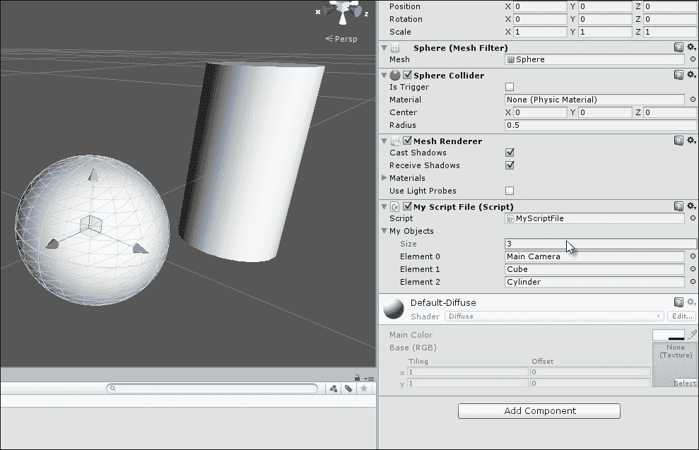

从 Unity 对象检查器构建数组

您也可以通过 `Start` 函数手动在代码中构建数组，而不是使用对象检查器。这确保了数组在级别开始时构建。两种方法都很好，如下面的代码示例 1-5 所示：

```cs
01 using UnityEngine;
02 using System.Collections;
03 
04 public class MyScriptFile : MonoBehaviour 
05 {
06     //Array of game objects in the scene
07     public GameObject[] MyObjects;
08 
09     // Use this for initialization
10     void Start ()
11     {
12          //Build the array manually in code
13          MyObjects = new GameObject[3];
14          //Scene must have a camera tagged as MainCamera
15          MyObjects[0] = Camera.main.gameObject; 

16       //Use GameObject.Find function to
17       //find objects in scene by name
18       MyObjects[1] = GameObject.Find("Cube"); 
19       MyObjects[2] = GameObject.Find("Cylinder"); 
20     }
21 
22     // Update is called once per frame
23     void Update ()
24     {
25     }
26 }
```

以下是对代码示例 1-5 的注释：

+   **第 10 行**: `Start` 函数在启动级别执行。函数将在本章后面更深入地讨论。

+   **第 13 行**: 使用 `new` 关键字创建一个容量为三个的新数组。这意味着列表在任何时候都不能容纳超过三个元素。默认情况下，所有元素都设置为起始值 `null`（表示无内容）。它们是空的。

+   **第 15 行**: 在这里，数组中的第一个元素被设置为场景中的主相机对象。这里应该注意两个重要点。首先，可以使用数组索引运算符 `[]` 访问数组中的元素。因此，`MyObjects` 的第一个元素可以通过 `MyObjects[0]` 访问。其次，C# 数组是“零索引”的。这意味着第一个元素始终位于位置 `0`，下一个位于 `1`，再下一个位于 `2`，依此类推。对于 `MyObjects` 的三个元素数组，每个元素都可以通过 `MyObjects[0]`、`MyObjects[1]` 和 `MyObjects[2]` 访问。请注意，最后一个元素是 `2` 而不是 `3`。

+   **第 18 行和第 19 行**: 使用 `GameObject.Find` 函数在 `MyObjects` 数组的元素 `1` 和 `2` 中填充对象。这将在活动场景中搜索具有指定名称（区分大小写）的游戏对象，并在 `MyObjects` 数组的指定元素中插入它们的引用。如果没有找到匹配名称的对象，则插入 `null`。

### 小贴士

在线可以找到有关数组和它们在 C#中使用的更多信息，请参阅[`msdn.microsoft.com/en-GB/library/9b9dty7d.aspx`](http://msdn.microsoft.com/en-GB/library/9b9dty7d.aspx)。

# 循环

循环是编程中最强大的工具之一。想象一个整个关卡都可以被核爆的游戏。当这种情况发生时，您会希望销毁场景中的几乎所有内容。现在，您可以通过在代码中逐行删除每个对象来实现这一点。如果您这样做，那么只有几个对象的场景只需要几行代码，这不会成问题。然而，对于可能包含数百个对象的较大场景，您将不得不编写大量的代码，并且如果更改场景内容，则需要更改此代码。这将很繁琐。循环可以将过程简化为几行代码，无论场景复杂度或对象数量如何。它们允许您对可能许多对象重复执行操作。C# 中有几种循环类型。让我们看看一些示例。

## foreach 循环

也许，在 C#中最简单的循环类型就是`foreach`循环。使用`foreach`，你可以按顺序遍历数组中的每个元素，从开始到结束，按需处理每个项目。考虑以下代码示例 1-6；它销毁了`GameObject`数组中的所有`GameObjects`：

```cs
01 using UnityEngine;
02 using System.Collections;
03 
04 public class MyScriptFile : MonoBehaviour 
05 {
06     //Array of game objects in the scene
07     public GameObject[] MyObjects;
08 
09     // Use this for initialization
10     void Start ()
11     {
12          //Repeat code for all objects in array, one by one
13          foreach(GameObject Obj in MyObjects)
14          {
15              //Destroy object
16              Destroy (Obj);
17          }
18    }
19 
20    // Update is called once per frame
21    void Update () 
22    {
23    }
24 }
```

### 注意

**下载示例代码**

您可以从您在[`www.packtpub.com`](http://www.packtpub.com)的账户下载示例代码文件，以获取您购买的所有 Packt Publishing 书籍。如果您在其他地方购买了这本书，您可以访问[`www.packtpub.com/support`](http://www.packtpub.com/support)并注册，以便将文件直接通过电子邮件发送给您。

`foreach`循环重复第 14-17 行之间的代码块`{}`，对于数组`MyObjects`中的每个元素执行一次。循环的每次通过或循环称为一次迭代。循环依赖于数组大小；这意味着较大的数组需要更多的迭代和更多的时间。循环还包含一个局部变量`obj`。它在第 13 行的`foreach`语句中声明。当循环通过每个迭代时，这个变量代表数组中被选择或激活的元素，因此`obj`代表第一次迭代的第一个元素，第二次迭代的第二个元素，依此类推。

### 小贴士

在 C#中关于`foreach`循环及其使用的更多信息可以在[`msdn.microsoft.com/en-GB/library/ttw7t8t6.aspx`](http://msdn.microsoft.com/en-GB/library/ttw7t8t6.aspx)找到。

## `for`循环

当您需要按顺序从开始到结束遍历单个数组时，`foreach`循环非常方便。但有时您需要对迭代有更多的控制。您可能需要从末尾到开始处理循环，您可能需要同时处理两个长度相等的数组，或者您可能需要处理每隔一个数组元素而不是每个元素。您可以使用`for`循环实现这一点，如下所示：

```cs
//Repeat code backwards for all objects in array, one by one
for(int i = MyObjects.Length-1; i >= 0; i--)
{
   //Destroy object
   DestroyMyObjects[i]);
}
```

以下是对前面代码片段的注释：

+   在这里，`for`循环从`MyObjects`数组的末尾开始向前遍历，删除场景中的每个`GameObject`。它使用局部变量`i`来完成这项工作。这有时也被称为`Iterator`变量，因为它控制着循环的进展。

+   `for`循环行有三个主要部分，每个部分由分号字符分隔：

    +   `i`：它初始化为`MyObjects.Length – 1`（数组的最后一个元素）。请记住，数组是零索引的，所以最后一个元素总是`Array Length -1`。这确保了循环迭代从数组的末尾开始。

    +   `i >= 0`：这个表达式表示循环应该终止的条件。`i`变量像一个倒计时变量，通过数组向后递减。在这种情况下，当`i`不再大于或等于`0`时，循环应该结束，因为`0`代表数组的开始。

    +   `i--`: 这个表达式控制变量 `i` 在循环的每次迭代中如何变化，从数组末尾向开头移动。在这里，`i` 将在每次迭代中减一，也就是说，每次循环迭代都会从 `i` 中减去一个值 `1`。相比之下，`++` 语句将添加 `1`。

+   在循环期间，表达式 `MyObjects[i]` 用于访问数组元素。

### 提示

关于 `for` 循环及其在 C# 中的使用，更多信息可以在 [`msdn.microsoft.com/en-gb/library/ch45axte.aspx`](http://msdn.microsoft.com/en-gb/library/ch45axte.aspx) 找到。

## `while` 循环

`for` 循环和 `foreach` 循环在遍历数组时特别有用，在每次迭代上执行特定操作。相比之下，`while` 循环用于不断重复特定的行为，直到指定的条件评估为 `false`。例如，如果你必须在对玩家造成伤害，只要他们站在热熔岩上，或者不断移动车辆直到刹车被应用，那么 `while` 循环可能正是你所需要的，如下面的代码示例 1-7 所示：

```cs
01 using UnityEngine;
02 using System.Collections;
03 
04 public class MyScriptFile : MonoBehaviour 
05 {
06     // Use this for initialization
07     void Start ()
08    {
09         //Will count how many messages have been printed
10         int NumberOfMessages = 0;
11 
12         //Loop until 5 messages have been printed to the console
13         while(NumberOfMessages < 5) 
14         {
15              //Print message

16              Debug.Log ("This is Message: " + NumberOfMessages.ToString());

17 
18              //Increment counter
19              ++NumberOfMessages;
20         }
21    }
22 
23    // Update is called once per frame
24    void Update () 
25    {
26    }
27 }
```

### 注意

**ToString**

Unity 中的许多类和对象都有一个 `ToString` 函数（参见代码示例 1-7 的第 16 行）。这个函数将对象，例如整数（整数），转换为人类可读的单词或语句，可以打印到 **控制台** 或 **调试** 窗口。这在调试时将对象和数据打印到控制台时非常有用。请注意，将数值对象转换为字符串需要隐式转换。

以下是对代码示例 1-7 的注释：

+   第 13 行开始 `while` 循环，条件是它重复执行，直到整数变量 `NumberOfMessages` 大于或等于 5

+   代码块在第 15 行和第 19 行之间被重复用作 `while` 循环的主体

+   第 19 行在每次迭代中增加变量 `NumberOfMessages`

当在游戏模式下执行代码示例 1-7 的结果时，会在关卡开始时将五条文本消息打印到 Unity 控制台，如下面的截图所示：


在 `while` 循环中打印消息到控制台

### 提示

关于 `while` 循环及其在 C# 中的使用，更多信息可以在 [`msdn.microsoft.com/en-gb/library/2aeyhxcd.aspx`](http://msdn.microsoft.com/en-gb/library/2aeyhxcd.aspx) 找到。

## 无限循环

使用循环的一个危险，尤其是 `while` 循环，是意外创建一个无限循环，即一个无法结束的循环。如果你的游戏进入无限循环，它通常会冻结，可能是永久性的，需要你通过终止应用程序来强制退出！通常，Unity 会捕捉到这个问题并退出，但不要依赖这一点。例如，删除代码示例 1-7 中的第 19 行将创建一个无限循环，因为 `NumberOfMessages` 变量永远不会增加到满足 `while` 循环条件的水准，从而引起退出。本节的要点首先是，“在编写和规划循环时要小心，以避免无限循环。”以下是一个经典的无限循环示例，它肯定会给你的游戏带来问题，所以请务必避免它们：

```cs
//Loop forever
while(true)
{
}
```

然而，信不信由你，在某些条件下，无限循环实际上可能是你游戏所需要的！如果你需要一个可以无限上下移动的平台，一个不断旋转的魔法球，或者一个永无止境的昼夜循环，那么无限循环可能是可用的，只要它被适当地实现。在本书的后续部分，我们将看到无限循环如何被良好地利用。循环是强大而有趣的构造，但如果不恰当地编写，无论是无限循环还是非无限循环，都可能是崩溃、停滞和性能问题的来源，所以请小心。在本书中，我们将看到创建循环的良好实践。

# 函数

我们在本章中已经使用了函数，例如 `Start` 和 `Update` 函数。然而，现在，我们需要更正式和精确地考虑它们。本质上，一个函数是一系列语句的组合，作为一个单一的、可识别的块，被赋予一个集体名称，可以在需要时执行，函数中的每一行按顺序执行。当你思考你游戏的逻辑时，有时你需要对你的对象重复执行某些操作，例如，开火、跳跃、杀死敌人、更新分数和播放声音。你可以在源文件中复制和粘贴你的代码，无论你需要在哪里重用它；这不是一个应该培养的好习惯。将可重用的代码合并到一个函数中，当你需要时可以通过名称来执行它，这比在源文件中复制粘贴代码要容易得多，如下面的代码示例 1-8 所示：

```cs
01 using UnityEngine;
02 using System.Collections;
03 
04 public class MyScriptFile : MonoBehaviour 
05 {
06     //Private variable for score
07     //Accessible only within this class
08     private int Score = 0;
09 
10     // Use this for initialization
11     void Start ()
12    {
13       //Call update score
14       UpdateScore(5, false); //Add five points
15       UpdateScore (10, false); //Add ten points

16       int CurrentScore = UpdateScore (15, false); //Add fifteen points and store result

17 
18       //Now double score
19        UpdateScore(CurrentScore);
20     }
21 
22     // Update is called once per frame
23     void Update () 
24     {
25     }
26 
27     //Update game score

28     public int UpdateScore (int AmountToAdd, bool PrintToConsole = true)

29     {
30       //Add points to score
31       Score += AmountToAdd;
32 
33       //Should we print to console?

34       if(PrintToConsole){Debug.Log ("Score is: " + Score.ToString());}

35 
36       //Output current score and exit function
37       return Score;
38     }
39 }
```

以下是代码示例 1-8 中现有代码的分解：

+   **行 08**：声明了一个私有的整型类变量 `Score`，用于跟踪样本分数值。这个变量将在后续的 `UpdateScore` 函数中使用。

+   **第 11 行、第 23 行和第 28 行**: 类 `MyScriptFile` 有三个函数（有时也称为方法或成员函数）。这些是 `Start`、`Update` 和 `UpdateScore`。`Start` 和 `Update` 是 Unity 提供的特殊函数，我们将在稍后看到。`UpdateScore` 是 `MyScriptFile` 的自定义函数。

+   **第 28 行**: `UpdateScore` 函数代表从第 29 行到第 38 行之间的一个完整的代码块。这个特定的函数应该在游戏分数必须更改时每次被调用。当被调用时，代码块（第 29-38 行）将按顺序执行。通过这种方式，函数为我们提供了代码的可复用性。

+   **第 14-19 行**: 在 `Start` 函数中，`UpdateScore` 函数被多次调用。对于每次调用，`Start` 函数的执行将暂停，直到 `UpdateScore` 函数完成。此时，执行将从下一行继续。

+   **第 28 行**: `UpdateScore` 接受两个参数或参数。这些是一个整数 `AmountToAdd` 和一个布尔值 `PrintToConsole`。参数就像我们可以插入到函数中以影响其操作的输入。`AmountToAdd` 变量表示应该添加到当前 `Score` 变量的数值，而 `PrintToConsole` 决定在函数执行时是否应该在 **Console** 窗口中显示 `Score` 变量。理论上，函数可以有的参数数量没有限制，一个函数也可以没有任何参数，例如 `Start` 和 `Update` 函数。

+   **第 31-34 行**: 在这里，分数实际上被更新并打印到 **Console**，如果需要的话。注意，`PrintToConsole` 参数在行 28 的函数声明中已经分配了一个默认值 `true`。这使得在调用函数时参数是可选的。第 14、15 和 16 行明确地通过传递一个值为 `false` 来覆盖默认值。相比之下，第 19 行省略了第二个值，因此接受默认的 `true`。

+   **第 28 行和第 37 行**: `UpdateScore` 函数有一个返回值，这是一个在函数名之前第 28 行指定的数据类型。在这里，值是一个 `int`。这意味着在退出或完成时，函数将输出一个整数。在这种情况下，这个整数将是当前的 `Score`。实际上，这是在第 37 行使用 `return` 语句输出的。函数不一定要返回一个值，这不是必需的。如果不需要返回值，返回类型应该是 `void`，就像 `Start` 和 `Update` 一样。

    ### 提示

    关于函数及其在 C#中的使用，更多信息可以在[`csharp.net-tutorials.com/basics/functions/`](http://csharp.net-tutorials.com/basics/functions/)找到。

# 事件

事件本质上是在特定方式下使用的函数。我们之前已经看到的`Start`和`Update`函数，更准确地描述应该是 Unity 特定的事件。事件是在某些关键时刻被调用的函数，用来通知一个对象发生了重要的事情：关卡开始，新帧开始，敌人死亡，玩家跳跃，以及其他情况。在这些关键时刻被调用，它们为对象提供了必要的响应机会。`Start`函数在对象首次创建时由 Unity 自动调用，通常在关卡启动时。`Update`函数也会自动调用，每帧调用一次。因此，`Start`函数为我们提供了在关卡开始时执行特定操作的机会，而`Update`函数每秒可以多次调用。因此，`Update`函数特别适用于在游戏中实现运动和动画。请参考代码示例 1-9，它会在一段时间内旋转一个对象：

```cs
01 using UnityEngine;
02 using System.Collections;
03 
04 public class MyScriptFile : MonoBehaviour 
05 {
06     // Use this for initialization
07     void Start ()
08     {
09     }
10 
11     // Update is called once per frame
12     void Update () 
13     {
14       //Rotate object by 2 degrees per frame around the Y axis
15       transform.Rotate(new Vector3(0.0f, 2.0f, 0.0f));
16     }
17 }
```

代码示例 1-9 的第 15 行每帧调用一次。它持续围绕*y*轴旋转对象 2 度。这段代码依赖于帧率，这意味着在帧率更高的机器上运行时，它会更快地旋转对象，因为`Update`会被更频繁地调用。有一些技术可以实现帧率无关性，确保你的游戏在所有机器上都能保持一致的性能，无论帧率如何。我们将在下一章中看到这些技术。你可以直接从 Unity 编辑器的**游戏**标签中轻松检查游戏的帧率。选择**游戏**标签，然后在工具栏右上角点击**统计信息**按钮。这将显示**统计信息**面板，提供游戏性能的一般统计概述。此面板显示游戏的**每秒帧数**（**FPS**），这表明了`Update`在对象上被调用的频率以及游戏在系统上的整体性能。一般来说，低于 15 的 FPS 表明存在重大的性能问题。努力实现 30 或更高的 FPS。请参考以下截图以访问**统计信息**面板：

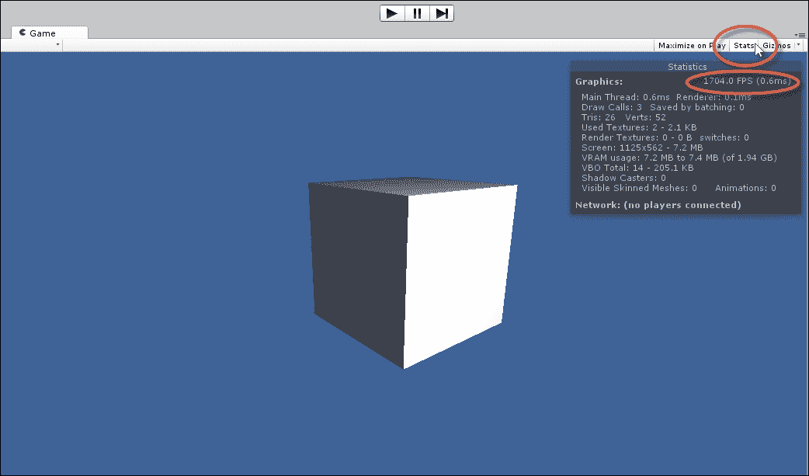

访问游戏标签页的“统计信息”面板以查看每秒帧数（FPS）

### 小贴士

事件类型太多，无法一一列举。然而，在 Unity 中，一些常见的事件，如`Start`和`Update`，可以在`MonoBehaviour`类中找到。有关`MonoBehaviour`的更多信息，请参阅[`docs.unity3d.com/ScriptReference/MonoBehaviour.html`](http://docs.unity3d.com/ScriptReference/MonoBehaviour.html)。

# 类和面向对象编程

类是由许多相关变量和函数组成的混合体，所有这些都被组合成一个自包含的单元或“事物”。换句话说，如果你考虑一个游戏（例如幻想 RPG），它充满了许多独立的事物，如法师、精灵、树木、房屋、玩家、任务、库存物品、武器、法术、门、桥梁、力场、传送门、守卫等等。其中许多对象与现实世界中的对象平行。然而，关键的是，这些事物中的每一个都是一个独立的对象；法师不同于力场，守卫不同于树木。然后，这些事物可以被视为对象——一个自定义类型。如果我们专注于一个特定的对象，例如一个精灵敌人，我们可以在该对象中识别出属性和行为。精灵将有一个位置、旋转和缩放；这些对应于变量。

精灵可能也有几种攻击方式，例如用斧头进行的近战攻击和用弩进行的远程攻击。这些攻击是通过函数来执行的。通过这种方式，一系列变量和函数被组合在一起，形成一个有意义的关联。将这些事物组合在一起的过程被称为封装。在这个例子中，精灵已经被封装成一个类。在这种情况下，这个类代表了一个通用、抽象的精灵（精灵的概念）。相比之下，对象是`Orc`类在关卡中的具体、实例化的体现。在 Unity 中，脚本文件定义了一个类。要将类作为关卡中的对象实例化，需要将其添加到`GameObject`中。正如我们所看到的，类作为组件附加到游戏对象上。组件是对象，多个组件组合在一起形成一个`GameObject`。请参考代码示例 1-10，以获取一个示例`Orc`类框架：

```cs
01 using UnityEngine;
02 using System.Collections;
03 
04 public class Orc : MonoBehaviour 
05 {
06 //Reference to the transform component of orc (position, rotation, scale)
07 private Transform ThisTransform = null;
08 
09 //Enum for states of orc
10 public enum OrcStates {NEUTRAL, ATTACK_MELEE, ATTACK_RANGE};
11 
12 //Current state of orc
13 public OrcStates CurrentState = OrcStates.NEUTRAL;
14 
15 //Movement speed of orc in meters per second
16 	public float OrcSpeed = 10.0f;
17 
18 //Is orc friendly to player
19 public bool isFriendly = false;
20 
21 //--------------------------------------------------
22 // Use this for initialization
23 void Start ()
24 {
25       //Get transform of orc
26       ThisTransform = transform;
27 }
28 //--------------------------------------------------
29 // Update is called once per frame
30 void Update ()
31 {
32 }
33 //--------------------------------------------------
34 //State actions for orc
35 public void AttackMelee()
36 {
37        //Do melee attack here
38 }
39 //--------------------------------------------------
40 public void AttackRange()
41 {
42        //Do range attack here
43 }
44 //--------------------------------------------------
45 }
```

以下是对代码示例 1-10 的注释：

+   **第 04 行**：在这里，使用`class`关键字定义了一个名为`Orc`的类。这个类继承自`MonoBehaviour`。下一节将更深入地探讨继承和派生类。

+   **第 09-19 行**：在`Orc`类中添加了几个变量和一个枚举。这些变量的类型不同，但都与精灵的概念相关。

+   **第 35-45 行**：精灵有两个方法：`AttackMelee`和`AttackRange`。

    ### 小贴士

    关于类及其在 C#中的使用的更多信息，请参阅[`msdn.microsoft.com/en-gb/library/x9afc042.aspx`](http://msdn.microsoft.com/en-gb/library/x9afc042.aspx)。

# 类和继承

想象一个场景，你创建了一个 `Orc` 类来在游戏中编码一个兽人对象。完成之后，你决定创建两个升级类型。一个是兽人首领，拥有更好的盔甲和武器，另一个是兽人法师，正如其名所示，是一个施法者。两者都能做普通兽人能做的所有事情，但不仅如此。现在，为了实现这一点，你可以通过在它们之间复制和粘贴共同代码来创建三个单独的类，`Orc`、`OrcWarlord` 和 `OrcMage`。

问题在于，由于兽人首领和兽人法师与兽人有很多共同的基础和行为，因此会浪费地复制和粘贴大量代码来复制这些共同行为。此外，如果你在某个类的共享代码中发现了错误，你需要将修复复制粘贴到其他类中，以传播它。这既麻烦又技术上危险，因为它可能会浪费时间，引入错误，并造成不必要的混淆。相反，面向对象的概念——继承可以帮助我们。继承允许你创建一个完全新的类，该类隐式地吸收或包含另一个类的功能，即它允许你创建一个扩展现有类的新类，而不会影响原始类。当发生继承时，两个类之间就建立了一种关系。原始类（如 `Orc` 类）被称为案例类或祖先类。扩展祖先类的新类（如兽人首领或兽人法师），被称为超类或派生类。

### 提示

在 C# 中有关继承的更多信息可以在 [`msdn.microsoft.com/en-gb/library/ms173149%28v=vs.80%29.aspx`](http://msdn.microsoft.com/en-gb/library/ms173149%28v=vs.80%29.aspx) 找到。

默认情况下，每个新的 Unity 脚本文件都会创建一个从 `MonoBehaviour` 继承的新类。这意味着每个新脚本都包含所有 `MonoBehaviour` 功能，并且有可能根据你添加的额外代码进行扩展。为了证明这一点，请参考以下代码示例 1-11：

```cs
01 using UnityEngine;
02 using System.Collections;
03 
04 public class NewScript : MonoBehaviour 
05 {
06 //--------------------------------------------------
07    // Use this for initialization
08    void Start ()
09    {
10       name = "NewObject";
11 }
12    //--------------------------------------------------
13    // Update is called once per frame
14    void Update ()
15    {
16    }
17 }
```

以下是对代码示例 1-11 的注释：

+   **第 04 行**: 类 `NewScript` 继承自 `MonoBehaviour`。然而，你可以用几乎任何有效的类名替换 `MonoBehaviour`，只要你想要从它那里继承。

+   **第 10 行**: 在 `Start` 事件中，变量名被赋予了一个字符串。但是，请注意，该名称在 `NewScript` 源文件的任何地方都没有明确声明为变量。如果 `NewScript` 是一个完全新的类，且在第 04 行没有定义任何祖先，那么第 10 行将是无效的。然而，因为 `NewScript` 继承自 `MonoBehaviour`，它自动继承了所有变量，这使得我们能够从 `NewScript` 中访问和编辑它们。

    ### 注意

    **何时继承**

    只有在真正合适的情况下才使用继承；否则，你会使你的类变得庞大、笨重且难以理解。如果你正在创建一个与另一个类共享大量公共功能并且建立它们之间联系是有意义的类，那么请使用继承。继承的另一个用途，正如我们将看到的，是在你想覆盖特定函数时。

# 类和多态性

为了说明 C#中的多态性，让我们首先考虑以下代码示例 1-12。这个示例并不立即展示多态性，但它代表了多态性将变得有用的场景的开始，正如我们将看到的。在这里，为通用 RPG 游戏中的潜在**非玩家角色**（**NPC**）定义了一个基本的骨架类。这个类故意不是全面的，只包含标记角色起点的基本变量。这里最重要的是，该类具有一个`SayGreeting`函数，当玩家与 NPC 进行对话时应该调用它。它向**控制台**显示一个通用的欢迎消息，如下所示：

```cs
01 using UnityEngine;
02 using System.Collections;
03 
04 public class MyCharacter
05 {
06 public string CharName = "";
07 public int Health = 100;
08 public int Strength = 100;
09 public float Speed = 10.0f;
10 public bool isAwake = true;
11 
12     //Offer greeting to the player when entering conversation
13     public virtual void SayGreeting()
14     {
15         Debug.Log ("Hello, my friend");
16     }
17 }
```

第一个出现的问题与`MyCharacter`类的多样性和可信度有关，如果我们尝试想象它在游戏中的实际工作方式。具体来说，从`MyCharacter`实例化的每个角色在调用`SayGreeting`时都会提供完全相同的问候：男性、女性、兽人和所有人。他们都会说同样的话，即“你好，我的朋友”。这既不可信也不理想。也许，最优雅的解决方案就是给类添加一个公共字符串变量，从而允许对打印的消息进行定制。然而，为了清楚地说明多态性，让我们尝试一个不同的解决方案。我们可以创建几个额外的类，所有这些类都从`MyCharacter`派生而来，每个新 NPC 类型一个，每个都从`SayGreeting`函数提供独特的问候。这是可能的，因为`SayGreeting`已经使用虚拟关键字（第 13 行）声明。这允许派生类覆盖`MyCharacter`类中`SayGreeting`的行为。这意味着派生类中的`SayGreeting`函数将替换基类中原始函数的行为。这样的解决方案可能看起来类似于代码示例 1-13：

```cs
01 using UnityEngine;
02 using System.Collections;
03 //-------------------------------------------
04 public class MyCharacter
05    {
06    public string CharName = "";
07    public int Health = 100;
08 public int Strength = 100;
09 public float Speed = 10.0f;
10 public bool isAwake = true;
11 
12 //Offer greeting to the player when entering conversation
13 public virtual void SayGreeting()
14 {
15        Debug.Log ("Hello, my friend");
16 	}
17 }
18 //-------------------------------------------
19 public class ManCharacter: MyCharacter
20 {
21 public override void SayGreeting()
22 {
23        Debug.Log ("Hello, I'm a man");
24 }
25 }
26 //-------------------------------------------
27 public class WomanCharacter: MyCharacter
28 {
29 public override void SayGreeting()
30 {
31        Debug.Log ("Hello, I'm a woman");
32 }
33 }
34 //-------------------------------------------
35 public class OrcCharacter: MyCharacter
36 {
37 public override void SayGreeting()
38 {
39        Debug.Log ("Hello, I'm an Orc");
40 }
41 }
42 //-------------------------------------------
```

使用此代码，进行了一些改进，即为每种 NPC 类型创建不同的类，即`ManCharacter`、`WomanCharacter`和`OrcCharacter`。每个类在`SayGreeting`函数中提供不同的问候。此外，每个 NPC 从共享的基类`MyCharacter`继承所有共同的行为。然而，关于类型特定性的技术问题出现了。现在，想象一下在酒馆内部创建一个位置，其中有许多不同类型的 NPC，到目前为止，他们都在享受一桶麦酒。当玩家进入酒馆时，所有 NPC 都应该提供他们独特的问候。为了实现这个功能，如果我们能够有一个包含所有 NPC 的单个数组，并简单地从循环中调用他们的`SayGreeting`函数，每个 NPC 提供他们自己的问候，那就太好了。然而，最初似乎不能这样做。这是因为单个数组中的所有元素必须是相同的数据类型，例如`MyCharacter[]`或`OrcCharacter[]`。我们不能在同一个数组中混合类型。当然，我们可以为每种 NPC 类型声明多个数组，但这感觉很不方便，并且不容易在编写数组代码后无缝创建更多 NPC 类型。为了解决这个问题，我们需要一个特定且专门的解决方案。这就是多态性发挥作用的地方。参考以下示例 1-14，它在一个完全独立的脚本文件中定义了一个新的`Tavern`类：

```cs
01 using UnityEngine;
02 using System.Collections;
03 
04 public class Tavern : MonoBehaviour 
05 {
06 //Array of NPCs in tavern
07 public MyCharacter[] Characters = null;
08 //-------------------------------------------------------
09 // Use this for initialization
10 void Start () {
11 
12       //New array - 5 NPCs in tavern
13       Characters = new MyCharacter[5];
14 
15        //Add characters of different types to array MyCharacter
16        Characters[0] = new ManCharacter();
17        Characters[1] = new WomanCharacter();
18        Characters[2] = new OrcCharacter();
19        Characters[3] = new ManCharacter();
20        Characters[4] = new WomanCharacter();
21 
22        //Now run enter tavern functionality
23        EnterTavern();
24 }
25 //-------------------------------------------------------
26 //Function when player enters Tavern
27 public void EnterTavern()
28 {
29       //Everybody say greeting
30       foreach(MyCharacter C in Characters)
31       {
32              //call SayGreeting in derived class
33              //Derived class is accessible via base class
34             C.SayGreeting();
35       }
36 }
37 //-------------------------------------------------------
38 }
```

以下是对代码示例 1-14 的注释：

+   **第 07 行**: 为了跟踪酒馆中的所有 NPC，无论 NPC 的类型如何，声明了一个类型为`MyCharacter`的单个数组（`Characters`）。

+   **第 16-20 行**: `Characters`数组被填充了多种不同类型的多个 NPC。这是因为尽管它们属于不同的类型，但每个 NPC 都派生自同一个基类。

+   **第 27 行**: 在等级启动时调用`EnterTavern`函数。

+   **第 34 行**: 一个`foreach`循环遍历`Characters`数组中的所有 NPC，调用`SayGreeting`函数。结果如下面的截图所示。每个 NPC 的独特消息被打印出来，而不是基类中定义的通用消息。多态性允许在派生类中调用重写的方法。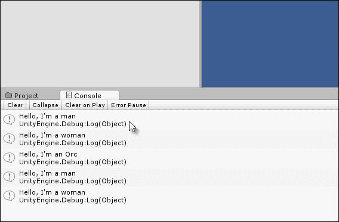

    多态性在共享共同血统的数据类型之间产生向后透明性

### 小贴士

在[C#中的多态性](http://msdn.microsoft.com/en-GB/library/ms173152.aspx)方面更多信息可以在此处找到。

# C#属性

当将值赋给类变量，例如`MyClass.x = 10;`时，有几个重要的事项需要注意。首先，你通常会想要验证被赋予的值，确保变量始终有效。典型的情况包括将整数限制在最小和最大范围之间，或者只允许字符串变量具有有限的字符串集。其次，你可能需要检测变量何时发生变化，从而启动其他依赖函数和行为。C#属性让你实现这两个功能。参考以下代码示例 1-15，它将整数限制在`1`和`10`之间，并在值发生变化时向控制台打印一条消息：

```cs
01 using UnityEngine;
02 using System.Collections;
03 //------------------------------------------------------
04 //Sample class - can be attached to object as a component
05 public class Database : MonoBehaviour 
06 {
07 //------------------------------------------------------
08 //Public property for private variable iMyNumber
09 //This is a public property to the variable iMyNumber
10 public int MyNumber
11 {
12        //Called when retrieving value
13        get
14       {
15               return iMyNumber; //Output iMyNumber
16       }
17 
18         //Called when setting value
19        set
20       {
21              //If value is within 1-10, set number else ignore
22             if(value >= 1 && value <= 10)
23             {
24                    //Update private variable
25                    iMyNumber = value;
26 
27                    //Call event
28                    NumberChanged();
29             }
30        }
31 }
32 //------------------------------------------------------
33 //Internal reference a number between 1-10
34 private int iMyNumber = 0;
35 //------------------------------------------------------
36 // Use this for initialization
37 void Start () 
38 {
39        //Set MyNumber
40        MyNumber = 11; //Will fail because number is > 10
41 
42        //Set MyNumber
43         MyNumber = 7; //Will succeed because number is between 1-10
44 }
45 //------------------------------------------------------
46 //Event called when iMyNumber is changed
47 void NumberChanged()
48 {

49        Debug.Log("Variable iMyNumber changed to : " + iMyNumber.ToString());

50 }
51 //------------------------------------------------------
52 }
53 //------------------------------------------------------
```

以下是对代码示例 1-15 的注释：

+   **第 10 行**：声明了一个公共整数属性。这个属性不是一个独立的变量，而是一个`wrapper`和`accessor`接口，用于访问在第 34 行声明的私有变量`iMyNumber`。

+   **第 13 行**：当使用或引用`MyNumber`时，会调用内部的`get`函数。

+   **第 14 行**：当`MyNumber`被赋予一个值时，会调用内部的`set`函数。

+   **第 25 行**：`set`函数具有一个隐含的参数值，它代表要赋予的值。

+   **第 28 行**：当`iMyNumber`变量被赋予一个值时，会调用`NumberChanged`事件。

    ### 注意

    **属性和 Unity**

    属性对于验证和控制变量值的赋值非常有用。在 Unity 中使用它们的主要问题在于它们在对象检查器中的可见性。具体来说，C#属性在对象检查器中不会显示。你既不能在编辑器中获取也不能设置它们的值。然而，社区制作的脚本和解决方案可以改变这种默认行为，例如暴露 C#属性。这些脚本和解决方案可以在[`wiki.unity3d.com/index.php?title=Expose_properties_in_inspector`](http://wiki.unity3d.com/index.php?title=Expose_properties_in_inspector)找到。

关于 C#中**属性**的更多信息，可以在[`msdn.microsoft.com/en-GB/library/x9fsa0sw.aspx`](http://msdn.microsoft.com/en-GB/library/x9fsa0sw.aspx)找到。

# 注释

注释是将可读性强的消息插入到你的代码中的实践，纯粹用于注释、描述，并使读者更清楚。在 C# 中，单行注释以 `//` 符号开头，多行注释以 `/*` 开头，以 `*/` 结尾。本书中的代码示例中使用了注释。注释很重要，如果你还没有养成使用注释的习惯，我建议你养成这个习惯。它们不仅对团队中的其他开发者有益（如果你与他人一起工作），对你自己也有好处！它们有助于你在几周或几个月后再次回到代码时回忆起代码的功能，甚至有助于你清晰地了解你现在正在编写的代码。当然，所有这些好处都取决于你编写简洁且富有意义的注释，而不是充满无关紧要的长篇大论。然而，MonoDevelop 也提供了基于 XML 的注释来描述函数和参数，并且与代码补全集成。它可以显著提高你的工作效率，尤其是在团队工作中。让我们看看如何使用它。首先，编写你的函数或任何函数，如下面的截图所示：

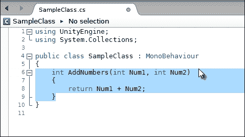

在 MonoDevelop 中编写一个函数（AddNumbers）（准备代码注释）

然后在函数标题上方的行插入三个正斜杠字符（`///`），如下面的截图所示：

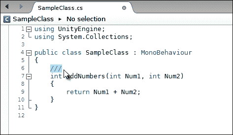

在函数标题上方插入 `///` 以创建 XML 注释

当你这样做时，MonoDevelop 会自动插入一个模板 XML 注释，供你完成适当的描述。它会创建一个摘要部分，一般描述该函数，并为函数中的每个参数创建参数条目，如下面的截图所示：

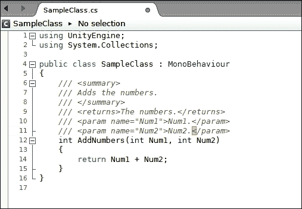

在函数标题上方插入 `///` 将自动生成 XML 注释

接下来，填写你的函数的 XML 模板，并添加注释。务必为每个参数也提供一个适当的注释，如下面的截图所示：

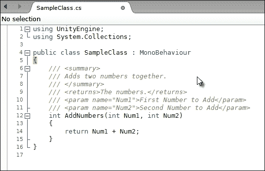

使用 XML 注释注释你的函数

现在，当你在代码的其他地方调用 `AddNumbers` 函数时，代码补全弹出助手将显示函数的摘要注释以及参数注释的上下文敏感信息，如下所示：

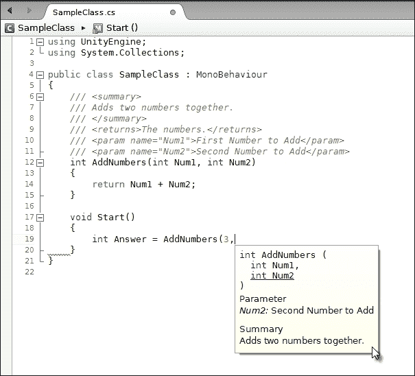

在调用函数时查看注释

# 变量可见性

Unity 的一个特别出色的功能是，它在 Unity 编辑器的对象检查器中公开显示公共类变量，允许你在运行时编辑和预览变量。这对于调试来说特别方便。然而，默认情况下，对象检查器不会公开私有变量。它们通常被检查器隐藏起来。这并不总是好事，因为在很多情况下，你可能希望从检查器中调试或至少监控私有变量，而不必将它们的范围更改为公共。有两种主要方法可以轻松解决这个问题。

如果你想查看类中的所有公共和私有变量，第一个解决方案将很有用。你可以在**调试**模式下切换对象检查器。为此，点击**检查器**窗口右上角的下拉菜单图标，并从下拉菜单中选择**调试**，如下面的截图所示。当选择**调试**时，类中的所有公共和私有变量都将显示。

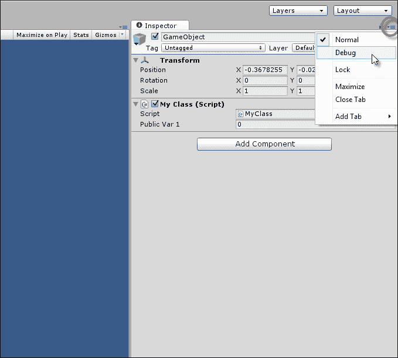

在对象检查器中启用调试模式将显示类中的所有变量

第二种解决方案对于显示特定的私有变量很有用，这些变量是你明确标记为希望在对象检查器中显示的。这些变量将在**正常**和**调试**模式下都显示。为了实现这一点，请使用属性`[SerializeField]`声明私有变量。C#属性将在本书的后面部分进行讨论，如下所示：

```cs
01 using UnityEngine;
02 using System.Collections;
03 
04 public class MyClass : MonoBehaviour 
05 {
06 //Will always show
07 public int PublicVar1;
08 
09 //Will always show
10 [SerializeField]
11 private int PrivateVar1;
12 
13 //Will show only in Debug Mode
14 private int PrivateVar2;
15 
16 //Will show only in Debug Mode
17 private int PrivateVar3;
18 }
```

### 小贴士

你还可以使用`[HideInInspector]`属性来从检查器中隐藏全局变量。

# `?`运算符

`if-else`语句在 C#中非常常见且广泛使用，因此有一个专门的简写符号可用于编写更简单的语句，而无需使用完整的多行`if-else`语句。这个简写符号称为`?`运算符。这个语句的基本形式如下：

```cs
//If condition is true then do expression 1, else do expression 2
(condition) ? expression_1 : expression_2;
```

让我们通过以下示例看看`?`运算符的实际应用：

```cs
//We should hide this object if its Y position is above 100 units
bool ShouldHideObject = (transform.position.y > 100) ? true : false;

//Update object visibility
gameObject.SetActive(!ShouldHideObject);
```

### 小贴士

`?`运算符对于简短的语句很有用，但对于长且复杂的语句，它可能会使你的代码更难阅读。

# SendMessage 和 BroadcastMessage

Unity API 中包含的`MonoBehaviour`类，作为大多数新脚本的基础类，提供了`SendMessage`和`BroadcastMessage`方法。使用这些方法，你可以通过指定要运行的函数的名称来轻松地在对象的所有组件上执行函数。要调用类的某个方法，通常需要一个对该类的本地引用，以便访问和运行其函数以及访问其变量。然而，`SendMessage`和`BroadcastMessage`函数允许你通过简单地指定要运行的函数的名称来使用字符串值运行函数。这非常方便，并且可以使你的代码看起来更简单、更短，但如我们稍后所见，这会牺牲效率。请参考以下代码示例 1-16：

```cs
01 using UnityEngine;
02 using System.Collections;
03 
04 public class MyClass : MonoBehaviour 
05 {
06 void start()
07 {
08        //Will invoke MyFunction on ALL components/scripts attached to this object (where the function is present)

09         SendMessage("MyFunction", SendMessageOptions.DontRequireReceiver);

10 }
11 
12 //Runs when SendMessage is called
13 void MyFunction()
14 {
15        Debug.Log ("hello");
16 }
17 }
```

以下是对代码示例 1-16 的注释：

+   **行 09**：调用 `SendMessage` 来调用函数 `MyFunction`。`MyFunction` 不仅会在本类中调用，如果 `GameObject` 上其他组件（包括 `Transform` 组件等）有 `MyFunction` 成员，也会在其他组件上调用。

+   **行 09**：参数 `SendMessageOptions.DontRequireReceiver` 定义了如果组件上不存在 `MyFunction` 时会发生什么。在这里，它指定 Unity 应该忽略该组件，并继续在找到的任何地方调用 `MyFunction`。

    ### 提示

    当函数属于一个类时，术语函数和成员函数意思相同。属于类的函数被称为成员函数。

我们已经看到，`SendMessage` 在单个 `GameObject` 所附着的所有组件中调用指定的函数。`BroadcastMessage` 结合了 `SendMessage` 的行为，并更进一步，即它为 `GameObject` 上的所有组件调用指定的函数，然后递归地对场景层次结构中所有子对象重复此过程，向下级联到所有子对象。

关于 `SendMessage` 和 `BroadcastMessage` 的更多信息可以在 [`docs.unity3d.com/ScriptReference/GameObject.SendMessage.html`](http://docs.unity3d.com/ScriptReference/GameObject.SendMessage.html) 和 [`docs.unity3d.com/ScriptReference/Component.BroadcastMessage.html`](http://docs.unity3d.com/ScriptReference/Component.BroadcastMessage.html) 找到。

### 注意

**反射**

`SendMessage` 和 `BroadcastMessage` 是促进对象间通信和组件间通信的有效方法，也就是说，如果组件需要相互通信、同步行为和回收功能，这是一个非常好的方法。然而，`SendMessage` 和 `BroadcastMessage` 都依赖于一个名为 **反射** 的 C# 功能。通过使用字符串调用一个函数，你的应用程序需要在运行时查看自身（进行反射），搜索其代码以找到要运行的预期函数。与正常方式运行函数相比，这个过程计算成本较高。因此，尽量减少使用 `SendMessage` 和 `BroadcastMessage`，尤其是在 `Update` 事件或其他基于帧的场景中，因为它们对性能的影响可能很大。这并不意味着你永远不应该使用它们。可能会有一些时候，它们的使用很少、不频繁且方便，实际上没有明显的负面影响。然而，本书的后续章节将展示使用代理和接口的替代和更快的技术。

如果你在继续阅读本书之前需要更多关于 C# 及其使用的详细信息，那么我推荐以下资源：

+   *《通过使用 Unity 3D 开发游戏学习 C# 入门指南》*，作者：*特里·诺顿*，出版社：*Packt Publishing*

+   *《Unity 中 C#编程和脚本入门》*，作者：*艾伦·桑恩*（3DMotive 视频课程，可在[`www.udemy.com/3dmotive-intro-to-c-programming-and-scripting-for-games-in-unity/`](https://www.udemy.com/3dmotive-intro-to-c-programming-and-scripting-for-games-in-unity/)找到）

+   *《使用 C#进行专业 Unity 游戏开发》*，作者：*艾伦·桑恩*，*Apress*

以下是一些在线资源：

+   [MSDN 库](http://msdn.microsoft.com/en-gb/library/aa288436%28v=vs.71%29.aspx)

+   [C#教程站](http://www.csharp-station.com/tutorial.aspx)

+   [Unity3D 官方文档](http://docs.unity3d.com/ScriptReference/)

# 摘要

本章提供了一个通用的、针对 Unity 的 C#概述，探讨了游戏开发中最常见和广泛使用的语言特性。后续章节将以更深入的方式回顾一些这些主题，但这里涵盖的所有内容对于理解和使用后续章节中的代码都将是关键的。
