# 第八章. 定制 Unity 编辑器

Unity 编辑器是一个功能强大、通用的游戏开发工具。然而，在开发过程中，有时你可能希望编辑器提供一些它没有的功能，或者以特定的方式运行，仅仅是因为这对您和您的特定游戏来说会更加方便。也许您希望有路径编辑功能、批量重命名功能或网格创建工具等。在这种情况下，您可以在 Asset Store 中搜索满足您需求的插件。但即使如此，您可能仍然找不到您需要的东西。因此，关注点转向了如何调整或定制编辑器以实现您的目的。幸运的是，Unity 作为工具有很多可以改变的地方，本章重点介绍了特定的案例研究。首先，它探讨了如何创建一个**批量重命名**工具，以便在一次操作中重命名多个选定的对象。其次，它涵盖了如何在对象检查器中创建一个颜色范围字段，使用滑块在两种颜色之间混合。第三，它探讨了如何在外部检查器中公开 C#属性，以便设置和获取值。最后，它涵盖了如何使用 C#属性创建一个本地化工具包，允许您通过点击按钮自动将所有游戏中的字符串更改为所选语言（英语、法语等）。

# 批量重命名

当创建包含多个敌人、增益物品、道具或其他对象实例的场景时，你通常会使用复制功能来克隆对象（*Ctrl* + *D*）。这会导致许多对象具有相同的名称。现在，虽然名称重复本身在技术上并没有错误，但它既不方便又杂乱无章。它会导致具有相同名称的对象层次面板，而且仅凭名称几乎无法区分特定的对象。此外，在脚本中使用`GameObject.Find`函数进行对象搜索时，不能依赖于检索到所需的特定对象，因为它可能返回任何具有相同名称的对象。因此，解决方案是为每个对象命名唯一且适当。但这样做可能会很繁琐，尤其是当你处理许多对象时。因此，需要一个批量重命名工具。

理论上，这将允许你在层次面板中选择多个对象，然后根据编号约定自动重命名它们。这个方法唯一的技術问题是 Unity 本身并不原生支持这样的功能。但我们可以自己编写代码来实现，如下面的截图所示：

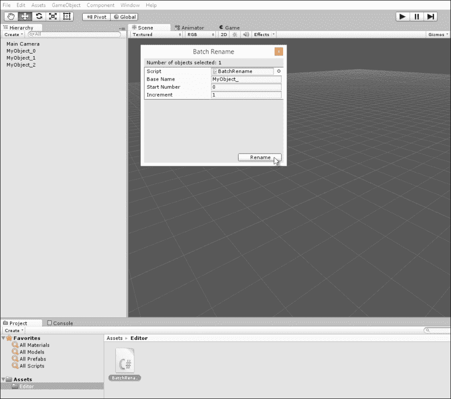

创建批量重命名编辑器插件

要开始自定义 Unity 编辑器，首先在项目内创建一个名为 `Editor` 的文件夹。这很重要。`Editor` 是一个被 Unity 识别为存放所有自定义脚本的特殊文件夹。因此，如果你打算更改 Unity 编辑器，请确保所有自定义脚本都位于 `Editor` 文件夹内。你的项目可以有多个名为 `Editor` 的文件夹，但唯一重要的是至少有一个 `Editor` 文件夹，并且其中包含一个编辑器脚本，如下所示：

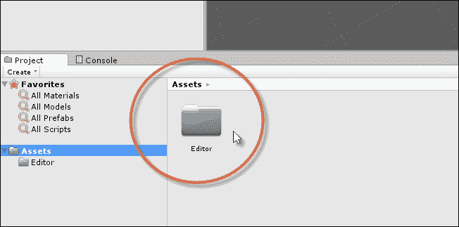

为所有编辑器脚本创建一个编辑器文件夹

接下来，我们将从 `ScriptableWizard` 类创建一个批量重命名实用工具。这个类是我们从中派生新类的一个祖先。所有派生类都将像可以从 Unity 主菜单启动的弹出实用工具对话框一样工作。它们的目的是在用户按下执行一次性过程的确认按钮之前，向用户提供一组选项。换句话说，从 `ScriptableWizard` 派生的类非常适合对单个或多个对象执行自动化的、一次性操作。

### 小贴士

更多关于 `ScriptableWizard` 类的信息可以在 Unity 在线文档中找到，网址为 [`docs.unity3d.com/ScriptReference/ScriptableWizard.html`](http://docs.unity3d.com/ScriptReference/ScriptableWizard.html)。

以下代码示例 8-1 列出了批量重命名实用工具的完整源代码：

```cs
01 //------------------------------------
02 using UnityEngine;
03 using UnityEditor;
04 using System.Collections;
05 //------------------------------------
06 public class BatchRename : ScriptableWizard
07 {
08 //Base name
09 public string BaseName = "MyObject_";
10 
11 //Start Count
12 public int StartNumber = 0;
13 
14 //Increment
15 public int Increment = 1;
16 
17 [MenuItem("Edit/Batch Rename...")]
18     static void CreateWizard()
19     {
20         ScriptableWizard.DisplayWizard("Batch Rename",typeof(BatchRename),"Rename");
21     }
22 //------------------------------------
23 //Called when the window first appears
24 void OnEnable()
25 {
26       UpdateSelectionHelper();
27 }
28 //------------------------------------
29 //Function called when selection changes in scene
30 void OnSelectionChange()
31 {
32       UpdateSelectionHelper();
33 }
34 //------------------------------------
35 //Update selection counter
36 void UpdateSelectionHelper()
37 {
38        helpString = "";
39 
40        if (Selection.objects != null)
41 helpString = "Number of objects selected: " + Selection.objects.Length;
42 }
43 //------------------------------------
44 //Rename
45 void OnWizardCreate()

46 {
47       //If selection empty, then exit
48       if (Selection.objects == null)
49              return;
50 
51       //Current Increment
52       int PostFix = StartNumber;
53 
54       //Cycle and rename
55       foreach(Object O in Selection.objects)
56       {
57              O.name = BaseName + PostFix;
58              PostFix += Increment;
59       }
60 }
61 //------------------------------------
62 }
63 //------------------------------------
```

以下是对代码示例 8-1 的注释：

+   **第 03 行**：编辑器扩展应该包含 `UnityEditor` 命名空间，这允许你访问编辑器类和对象。

+   **第 06 行**：`BatchRename` 类并非从 `MonoBehaviour` 继承，这与大多数脚本文件不同，而是从 `ScriptableWizard` 继承。从这里继承的类将被 Unity 视为独立的工具，可以从应用程序菜单启动。

+   **第 17-21 行**：`MenuItem` 属性作为 `CreateWizard` 函数的前缀。这将在应用程序菜单中创建一个条目，列在 **编辑/批量重命名** 下，并在点击时调用 `CreateWizard` 函数以显示 **批量重命名** 窗口。

+   **第 8-16 行**：在调用 `CreateWizard` 之后，`BatchRename` 窗口显示。从这里，所有公共类成员（包括 **基础名称**、**起始数字**和**增量**）将自动作为可编辑字段出现在窗口中，供用户编辑。

+   **第 45-60 行**：当用户从 **批量重命名** 窗口中按下 **重命名** 按钮时，将调用 `OnWizardCreate` 函数作为事件。按钮被称为 **重命名** 是因为第 20 行。`OnWizardCreate` 函数遍历场景中所有选定的对象（如果有），并根据 **基础名称**、**起始数字**和**增量**字段按顺序重命名它们，如下所示：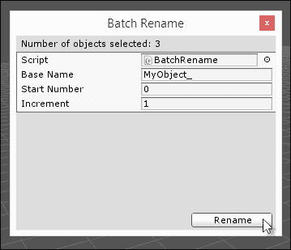

    批量重命名工具

要使用批量重命名工具，只需在场景中选择一组对象，然后从应用程序菜单中的**编辑**选项点击**批量重命名**。**基础名称**字段定义了一个需要添加到所有对象名称前缀的字符串，而**增量**字段定义了整数计数器应该增加的量，该计数器将添加到基础名称前。**起始数字**值是所有增量开始的位置，如下面的截图所示：

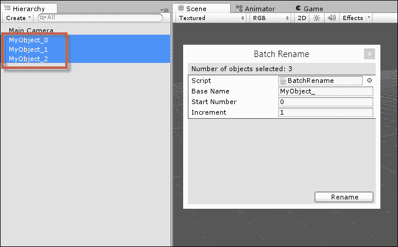

使用批量重命名工具重命名的对象

# C#属性和反射

从本章的这个点开始，所有编辑器扩展都将大量依赖属性和反射的概念。这些概念不仅限于 Unity，而是指计算机科学、编程以及它们在 C#语言以及.NET 框架中的应用中的更一般性思想。在继续下一个编辑器扩展之前，让我们通过`Range`属性（这是 Unity 的固有属性）的例子来考虑属性和相关概念。考虑以下代码行：

```cs
public float MyNumber = 0;
```

这个公共变量将在对象检查器中显示，并带有允许用户输入任何有效浮点数的编辑字段，从而设置`MyNumber`的值，如下面的截图所示：

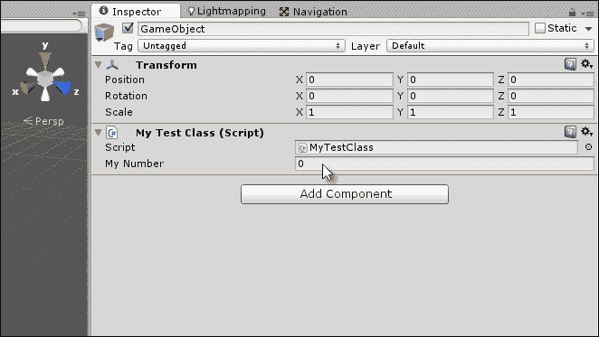

在对象检查器中输入浮点值

此代码运行良好，并且在许多情况下都适用，但有时验证数值输入到特定范围内（在最小值和最大值之间剪辑数字）更可取。您可以在代码中使用`Mathf.Clamp`函数来完成此操作，但您也可以使用属性来验证输入。您可以将`Range`属性附加到浮点变量（`MyNumber`）上，以显示滑块而不是编辑框，如下面的代码所示：

```cs
 [Range(0f,1f)]
public float MyNumber = 0;
```

### 小贴士

更多关于属性的信息可以在 Unity 在线文档中找到，请参阅[`unity3d.com/learn/tutorials/modules/intermediate/scripting/attributes`](http://unity3d.com/learn/tutorials/modules/intermediate/scripting/attributes)。

当此代码编译时，`MyNumber`变量在对象检查器中的显示方式不同，遵循`0`和`1`之间的数值范围，如下面的截图所示。请注意，提供给`Range`属性作为参数的所有数字都必须是编译时已知的显式值，而不是依赖于变量（这些变量可以在运行时变化）的表达式。所有属性值都必须在编译时已知。

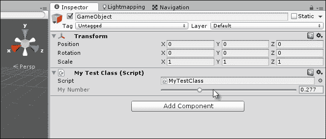

使用属性自定义检查器显示

那么属性是如何工作的呢？简而言之，属性是一种元数据的形式；它们就像标签。程序员可以将属性附加到类、变量或方法上，以将数据与之关联，这是编译器所知道的。属性本身完全是描述性的，因为它什么都不做；它只是数据。属性的重要性在于，所有基于.NET（或 Mono）的代码都有能力跳出自身，变得有自我意识，也就是说，能够查看程序内部包含的所有类、数据类型和实例。对于程序中的每个对象，其元数据（属性）都可以被查询和检查。程序能够“从外部观察自己”的能力被称为反射，就像在镜子中观察一样。当然，程序并不是以相反或扭曲的方式看待自己，而是以它真正的方式，包括所有其元数据。为了快速举例说明反射，尝试以下代码示例 8-2。此代码将遍历 Unity 应用程序中所有源文件中的所有自定义类。注意，它不仅列出了场景中类的所有实例，还列出了所有类本身（即蓝图，比喻来说）：

```cs
01 using UnityEngine;
02 using System.Collections;
03 using System.Reflection;
04 using System;
05 
06 public class MyTestScript : MonoBehaviour 
07 {
08 // Use this for initialization
09 void Start () 
10 {
11        //List all classes in assembly
12 foreach(Type t in Assembly.GetExecutingAssembly().GetTypes())

13        {
14              Debug.Log (t.Name);
15        }
16 }
17 }
```

以下是对代码示例 8-2 的注释：

+   **第 03-04 行**：应该包含`System`和`System.Reflection`这两个命名空间，因为它们包含执行.NET 中反射所需的所有类和对象。

+   **第 12 行**：这个`foreach`循环遍历活动程序集（即编译后的代码，包括所有自定义的脚本文件）中的所有类（类型）。

你甚至可以将反射的概念进一步扩展。例如，在列出代码示例 8-2 中的所有类型之后，你甚至可以列出类型的所有方法、属性和变量（`Fields`）。参考以下代码示例 8-3，它接受一个特定的类型作为参数，并将列出所有公共成员变量：

```cs
 //Function to list all public variables for class t
 public void ListAllPublicVariables(Type t)
 {
    //Loop through all public variables
    foreach(FieldInfo FI in t.GetFields(BindingFlags.Public | BindingFlags.Instance)
    {
         //Print name of variable
         Debug.Log (FI.Name);
    }
 }
```

### 小贴士

关于位运算的更多信息，如本代码示例中所用，可以在以下网址找到：[`www.blackwasp.co.uk/CSharpLogicalBitwiseOps.aspx`](http://www.blackwasp.co.uk/CSharpLogicalBitwiseOps.aspx)。

然而，最重要的是，你还可以列出分配给类型的属性。这让你可以在运行时查询类型的元数据并检查其属性，如下面的代码示例 8-4 所示：

```cs
01 public void ListAllAttributes(Type t)
02 {
03 foreach(Attribute attr in t.GetCustomAttributes(true))
04 {
05        //List the type of attribute found
06        Debug.Log (attr.GetType());
07 }
08 }
```

代码示例 8-4 展示了在运行时可以从代码中检索给定数据类型的所有属性数据。这意味着数据类型和变量可能与其关联元数据，这些元数据可以被检索并用于进一步影响对象的处理方式。这对于编辑器插件来说非常强大，因为通过创建可以附加到数据类型和成员变量上的自定义定义属性，我们可以在不破坏其逻辑或运行时结构的情况下将我们的代码与 Unity 编辑器集成。也就是说，我们可以通过在代码中使用属性标记变量来自定义它们在 Unity 编辑器中的显示方式，而不会在运行时逻辑或结构上无效化或影响它。接下来，我们将看到如何创建自定义属性来自定义编辑器。

# 颜色混合

之前探索的 `Range` 属性可以通过其声明方式附加到整数和浮点变量上，以限制在 Unity 编辑器中它们的最小值和最大值之间的接受值。在 Unity 编辑器中，一个滑动控件代替了可编辑字段，用于控制变量的接受值。当然，这不会影响代码中分配给相同变量的值。在代码中，在运行时，`Range` 属性本身没有效果。相反，`Range` 属性仅控制数值公共变量在对象检查器中的显示方式以及用户输入时如何输入。在幕后，一个 `Editor` 类通过反射查询对象的 `Attribute` 数据，以控制数据类型在对象检查器中的渲染方式。

`Range` 属性在处理数字时表现良好。但若能将其类似行为应用于除数字之外的其他数据类型，那就更完美了。例如，在场景过渡时，从黑色渐变到透明度以创建淡入和淡出效果是很常见的。这被称为颜色线性插值（Color Lerping）。也就是说，通过一个归一化的浮点数（介于 `0` 和 `1` 之间）在两个极端颜色之间生成一个中间颜色。

对于此类数据类型，合适的 `Inspector` 属性将是一个滑动控件，类似于 `Range` 属性，它控制 `0` 和 `1` 之间的插值颜色，如下所示：

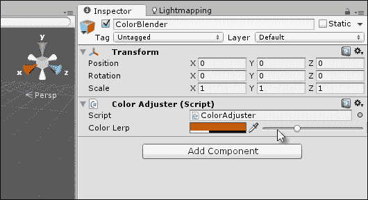

在两种颜色之间进行线性插值

因此，本质上，我们需要自定义编辑器，以便在场景中选中一个对象时，该对象具有我们指定的自定义类型的公共成员，我们希望自定义该成员在对象检查器中的渲染方式。这让我们能够在对象检查器中提供自定义控件和输入，从而验证该成员的数据输入，而不是简单地接受其默认值。为了开始这个过程，让我们创建一个自定义类，并定义整个颜色混合的所有数据。颜色混合需要四个变量，即标记混合范围的 `SourceColor` 和 `DestColor`。接下来，`BlendFactor` 是一个介于 `0` 和 `1`（起始和结束）之间的归一化浮点数，它决定了应该通过插值生成哪个中间颜色。然后，最后，输出颜色本身（`BlendedColor`）。此过程的完整类定义包含在下面的代码示例 8-5 中：

```cs
[System.Serializable]
 public class ColorBlend : System.Object
 {
    public Color SourceColor = Color.white;
    public Color DestColor = Color.white;
    public Color BlendedColor = Color.white;
    public float BlendFactor = 0f;
 }
```

由于 `ColorBlend` 类使用了 `[System.Serializable]` 属性，当它作为类的公共成员添加时，Unity 将自动在对象检查器中渲染该类及其成员。默认情况下，`ColorBlend` 的所有公共成员都将被渲染，`BlendFactor` 字段将作为一个可编辑的字段渲染，可以直接在其中输入数字，包括 `0` 和 `1` 之外的数字，如下所示：

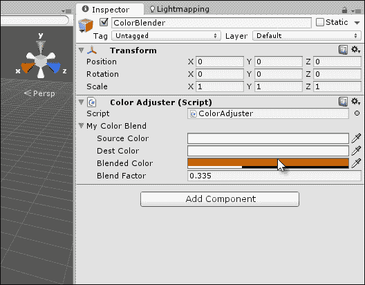

通过默认值和更改其属性来公开 `Color Adjuster` 类

现在，让我们开始自定义 Unity 如何在对象检查器中渲染此类。首先，创建一个新的属性类，命名为 `ColorRangeAttribute`，如下面的代码示例 8-6 所示：

```cs
01 public class ColorRangeAttribute : PropertyAttribute
02 {
03 //------------------------------------------------------------
04 public Color Min;
05 public Color Max;
06 //------------------------------------------------------------
07 public ColorRangeAttribute(float r1, float g1, float b1, float a1,
08                            float r2, float g2, float b2, float a2)
09 {
10       this.Min = new Color(r1, g1, b1, a1);
11       this.Max = new Color(r2, g2, b2, a2);
12 }
13 //------------------------------------------------------------
14 }
```

以下是对代码示例 8-6 的注释：

+   **行 01**: `ColorRangeAttribute` 类定义了一个元数据结构，我们可以将其标记到其他数据类型上。注意，它继承自 `PropertyAttribute`。这表明，除了其他一切之外，`ColorRangeAttribute` 是一个属性和元数据结构，而不是一个常规类。它不应该像常规类那样被实例化。

+   **行 07**: 该属性有一个构造函数，它接受八个浮点值，用于定义 Lerp 的源和目标颜色的 RGBA 通道。这些值将在将属性附加到变量时很快被使用。

现在，我们将编写一个声明带有 `ColorRangeAttribute` 属性的 `ColorBlend` 实例的类。然而，即使现在，添加 `ColorRangeAttribute` 本身也不会产生任何效果，因为没有编写处理它的 `Editor` 类。这可以在下面的代码中看到：

```cs
public class ColorAdjuster : MonoBehaviour 
{
   [ColorRangeAttribute(1f,0f,0f,0f,   0f,1f,0f,1f)]
   public ColorBlend MyColorBlend;
}
```

在对象检查器中使用滑动控件渲染 `ColorBlend` 的 `Editor` 类涉及处理 `ColorRangeAttribute` 类。具体来说，Unity 提供了 `PropertyDrawer` 基类扩展，我们可以从中派生新类以覆盖任何添加到变量中的特定属性的 Object Inspector 渲染。简而言之，`PropertyDrawer` 类让我们可以为带有公共属性的任何变量自定义检查器绘制。因此，在您的项目 `Editor` 文件夹中创建一个新的 `ColorRangeDrawer` 类，如下面的代码示例 8-7 所示：

```cs
01 using UnityEngine;
02 using UnityEditor; //Be sure to include UnityEditor for all extension classes
03 using System.Collections;
04 //------------------------------------------------------------
05 //CustomPropertyDrawer attribute for overriding drawing of all ColorRangeAttribute members

06 [CustomPropertyDrawer(typeof(ColorRangeAttribute))]
07 public class ColorRangeDrawer : PropertyDrawer
08 {
09 //------------------------------------------------------------
10 //Event called by Unity Editor for updating GUI drawing of controls

11 public override void OnGUI (Rect position, SerializedProperty property, GUIContent label)

12 {
13        //Get color range attribute meta data
14 ColorRangeAttribute range  = attribute as ColorRangeAttribute;
15 
16        //Add label to inspector
17 position = EditorGUI.PrefixLabel (position, new GUIContent ("Color Lerp"));
18 
19        //Define sizes for color rect and slider controls
20 Rect ColorSamplerRect = new Rect(position.x, position.y, 100, position.height);

21 Rect SliderRect = new Rect(position.x+105, position.y, 200, position.height);
22 
23       //Show color rect control
24 EditorGUI.ColorField(ColorSamplerRect, property.FindPropertyRelative("BlendedColor").colorValue);
25 
26      //Show slider control
27 property.FindPropertyRelative("BlendFactor").floatValue = EditorGUI.Slider(SliderRect, property.FindPropertyRelative("BlendFactor").floatValue, 0f, 1f);
28 
29      //Update blended color based on slider
30 property.FindPropertyRelative("BlendedColor").colorValue = Color.Lerp(range.Min, range.Max, property.FindPropertyRelative("BlendFactor").floatValue);
31 }
32 //------------------------------------------------------------
33 }
34 //------------------------------------------------------------
```

以下是对代码示例 8-7 的注释：

+   **第 01 行**: 这里使用 `CustomPropertyDrawer` 属性将 `PropertyDrawer` 类与 `ColorRangeAttribute` 属性关联。Unity 编辑器使用此元数据内部确定哪些类型需要在对象检查器中进行自定义渲染。在这种情况下，所有带有 `ColorRangeAttribute` 的成员都将由 `PropertyDrawer` 类的 `OnGUI` 函数手动绘制。

+   **第 11 行**: `OnGUI` 函数是从基类重写的，用于定义所有带有 `ColorRangeAttribute` 的字段在对象检查器中应该如何渲染。`EditorGUI` 是一个原生的 Unity 编辑器实用工具类，用于绘制 GUI 元素，如按钮、文本框和滑动条。有关 `EditorGUI` 的更多信息，请参阅在线文档[`docs.unity3d.com/ScriptReference/EditorGUI.html`](http://docs.unity3d.com/ScriptReference/EditorGUI.html)。

+   **第 14 行**: `OnGUI` 函数会被调用一次，可能每秒调用多次，用于在对象检查器中手动渲染每个唯一的成员。在这里，使用类型转换检索 `ColorRangeAttribute` 的属性数据，这使我们能够直接访问当前正在渲染的对象的所有成员。要访问对象本身的成员变量（用于读写访问），而不是其属性，应使用 `SerializedProperty` 参数，例如 `FindPropertyRelative` 方法。有关更多信息，请参阅在线 Unity 文档[`docs.unity3d.com/ScriptReference/SerializedProperty.html`](http://docs.unity3d.com/ScriptReference/SerializedProperty.html)。

+   **第 24 行**: 从这里开始，使用 `FindPropertyRelative` 函数来检索所选对象中的公共成员变量，例如 `SourceColor`、`DestColor` 和 `BlendedColor`。这是通过移动滑动组件来实际设置值的。

    ### 提示

    关于 `PropertyDrawer` 类的更多信息，可以在在线 Unity 文档[`docs.unity3d.com/Manual/editor-PropertyDrawers.html`](http://docs.unity3d.com/Manual/editor-PropertyDrawers.html)中找到。

代码示例 8-7 在标记有`ColorRangeAttribute`属性时覆盖了任何`ColorBlend`实例的对象检查器绘制。这提供了一种易于访问和使用的创建混合颜色的方法。记住，你可以使源颜色和目标颜色公共，以便从**检查器**选项卡中访问，如下所示：

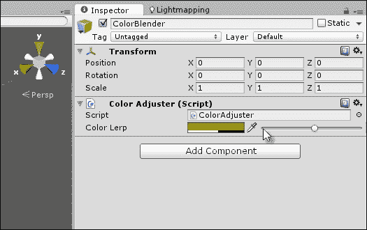

为 ColorBlend 类创建 ColorBlender 显示

# 属性暴露

默认情况下，对象检查器会显示类的所有公共成员变量，除非处于**调试**模式或私有成员被显式标记为具有`SerializeField`属性，在这些情况下，私有成员变量也会显示：

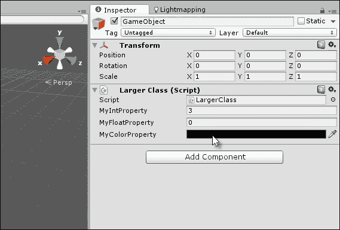

从对象检查器访问属性

然而，C#属性在默认情况下永远不会显示，无论是**发布**还是**调试**模式。如第一章中所述，*Unity C# 快速入门*，C#属性类似于变量的访问器函数。它们本质上允许在每个`get`和`set`操作上进行验证，因为每个`get`和`set`操作都涉及内部函数调用。然而，无论 Unity 在对象检查器中的限制如何，都可以编写一个编辑器扩展，该扩展将在对象检查器中显示类的所有属性，从而允许直接获取和设置值。本节将更详细地考虑这一点。再次强调，我们将严重依赖反射。

### 小贴士

关于`SerializeField`类的更多信息可以在 Unity 在线文档中找到，网址为[`docs.unity3d.com/ScriptReference/SerializeField.html`](http://docs.unity3d.com/ScriptReference/SerializeField.html)。

考虑以下代码示例 8-8，其中包含一些属性：

```cs
 //----------------------------------------------
 using UnityEngine;
 using System.Collections;
 //----------------------------------------------
 [System.Serializable]
 public class ClassWithProperties : System.Object
 {
    //Class with some properties
    //----------------------------------------------
 public int MyIntProperty
    {
          get{return _myIntProperty;}

          //Performs some validation on values
    set{if(value <= 10)_myIntProperty = value;else _myIntProperty=0;}
    }
    //----------------------------------------------
    public float MyFloatProperty
   {
          get{return _myFloatProperty;}
          set{_myFloatProperty = value;}
   }
    //----------------------------------------------
 public Color MyColorProperty
   {
          get{return _myColorProperty;}
          set{_myColorProperty = value;}
    }
    //----------------------------------------------
    //Private members
    private int _myIntProperty;
    private float _myFloatProperty;
    private Color _myColorProperty;
    //----------------------------------------------
 }
 //----------------------------------------------
```

此类将作为公共成员由不同的类内部使用，如下面的代码示例 8-9 所示：

```cs
 using UnityEngine;
 using System.Collections;

 public class LargerClass : MonoBehaviour 
 {
    public ClassWithProperties MyPropClass;
 }
```

默认情况下，公共`MyPropClass`成员（尽管标记为`System.Serializable`）在对象检查器中不会显示其成员。这是因为 C#属性不是原生支持的：

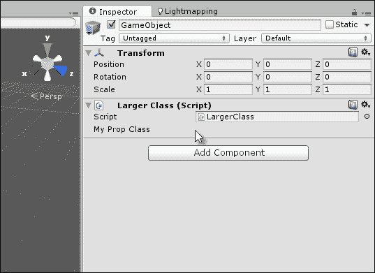

默认情况下，对象检查器不会渲染 C#属性

为了解决这个问题，我们可以回到`PropertyDrawer`类；这次将类与一个特定的类相关联，而不是与一个属性相关联，如下面的代码示例 8-10 所示：

```cs
01 //Custom Editor class to expose global properties of a class
02 //----------------------------------------------
03 using UnityEngine;
04 using UnityEditor;
05 using System.Collections;
06 using System.Reflection;
07 //----------------------------------------------
08 [CustomPropertyDrawer(typeof(ClassWithProperties))]
09 public class PropertyLister : PropertyDrawer
10 {
11 //Height of inspector panel
12 float InspectorHeight = 0;
13 
14 //Height of single row in pixels
15 float RowHeight = 15;
16 
17 //Spacing between rows
18 float RowSpacing = 5;
19 
20 // Draw the property inside the given rect
21 public override void OnGUI(Rect position, SerializedProperty property, GUIContent label) 
22 {
23        EditorGUI.BeginProperty(position, label, property);
24 
25        //Get referenced object
26        object o = property.serializedObject.targetObject;
27 ClassWithProperties CP = o.GetType().GetField(property.name).GetValue(o) as ClassWithProperties;
28 
29        int indent = EditorGUI.indentLevel;
30        EditorGUI.indentLevel = 0;
31 
32       //Layout
33 Rect LayoutRect = new Rect(position.x, position.y, position.width, RowHeight);
34 
35       //Find all properties for object
36 foreach(var prop in typeof(ClassWithProperties).GetProperties(BindingFlags.Public | BindingFlags.Instance))
37       {
38              //If integer property
39              if(prop.PropertyType.Equals(typeof(int)))
40              {
41 prop.SetValue(CP, EditorGUI.IntField(LayoutRect, prop.Name, (int)prop.GetValue(CP,null)), null);

42 LayoutRect = new Rect(LayoutRect.x, LayoutRect.y + RowHeight+RowSpacing, LayoutRect.width, RowHeight);
43              }
44 
45             //If float property
46             if(prop.PropertyType.Equals(typeof(float)))
47             {
48 prop.SetValue(CP, EditorGUI.FloatField(LayoutRect, prop.Name, (float)prop.GetValue(CP,null)), null);

49 LayoutRect = new Rect(LayoutRect.x, LayoutRect.y + RowHeight+RowSpacing, LayoutRect.width, RowHeight);
50             }
51 
52             //If color property
53              if(prop.PropertyType.Equals(typeof(Color)))
54              {
55 prop.SetValue(CP, EditorGUI.ColorField(LayoutRect, prop.Name, (Color)prop.GetValue(CP,null)), null);

56 LayoutRect = new Rect(LayoutRect.x, LayoutRect.y + RowHeight+RowSpacing, LayoutRect.width, RowHeight);
57             }
58        }
59 
60        //Update inspector height
61        InspectorHeight = LayoutRect.y-position.y;
62 
63        EditorGUI.indentLevel = indent;
64        EditorGUI.EndProperty();
65 }
66 //----------------------------------------------
67 //This function returns how high (in pixels) the field should be
68 //This is to make controls not overlap
69 public override float GetPropertyHeight (SerializedProperty property, GUIContent label)
70 {
71        return InspectorHeight;
72 }
73 //----------------------------------------------
74 }
75 //----------------------------------------------
```

以下是对代码示例 8-10 的注释：

+   **第 08 行**：注意，`CustomPropertyDrawer`属性现在与一个常规类相关联，而不是一个属性。在这种情况下，特定类的渲染是为了对象检查器定制的，而不是不同类型的不同属性，这些属性可以共享一个公共属性。

+   **第 12-18 行**: 声明了一些公共成员，主要是为了计算对象检查器中单行的高度（以像素为单位）。默认情况下，对象检查器为我们的自定义渲染分配一行（或一行），并且所有绘图都应该适应这个空间。如果我们的渲染总高度超过一行的高度，所有额外的控件和数据都将重叠并混合在下面的控件和小部件中。为了解决这个问题，可以使用`GetPropertyHeight`（第 69 行）函数来返回为我们的自定义绘图分配的像素高度。

+   **第 26-27 行**: 这些行特别重要。它们使用反射来检索对当前正在为`OnGUI`调用绘制的`ClassWithProperties`实例的正确类型对象引用。具体来说，检索到`targetObject`的引用（选中的对象），然后从该引用中检索到`ClassWithProperties`的实例。结果是，这段代码为我们提供了对`ClassWithProperties`对象的直接和即时访问。

+   **第 37-58 行**: 对象上的每个公共属性按顺序循环，对于有效或支持的数据类型，绘制一个检查器属性，允许对属性的读写访问，前提是该属性本身支持这两种方法。

以下截图显示了 C#属性：

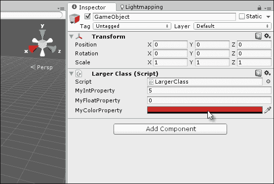

访问 C# 属性

# 本地化

游戏开发中最被低估和最缺乏文档记录的方面之一可能是本地化。这指的是开发者为了支持游戏中的多种自然语言而采取的广泛的技术、经济和物流措施，例如英语、法语、德语、西班牙语、世界语等等。技术目标并不是支持这个或那个特定的语言，而是建立一个可以支持在任何时候（现在或以后）选择的任何任意语言的架构。本地化在开发中的整个范围和作用超出了本书的范围，但在这里我们将探讨一种 Unity 编辑器可以定制以简化本地化工作流程的方法。例如，考虑以下示例 XML 文件，其中主菜单系统中按钮的游戏文本以英语和一种称为 Yoda 的“恶搞语言”定义：

```cs
<?xml version="1.0"?>
<text>
    <language id="english">
         <text_entry id="text_01"><![CDATA[new game]]></text_entry>
         <text_entry id="text_02"><![CDATA[load game]]></text_entry>
         <text_entry id="text_03"><![CDATA[save game]]></text_entry>
         <text_entry id="text_04"><![CDATA[exit game]]></text_entry>
   </language>
   <language id="yoda">
         <text_entry id="text_01"><![CDATA[new game, you start]]></text_entry>
         <text_entry id="text_02"><![CDATA[load game, you will]]></text_entry>
         <text_entry id="text_03"><![CDATA[game save, you have]]></text_entry>
         <text_entry id="text_04"><![CDATA[leave now, you must]]></text_entry>
   </language>
</text>
```

### 小贴士

注意，CDATA 元素包围了所有自定义文本节点，以允许使用任何字符和符号。有关 CDATA 的更多信息，可以在网上找到：[`www.w3schools.com/xml/xml_cdata.asp`](http://www.w3schools.com/xml/xml_cdata.asp)。

之前定义的 XML 创建了四个文本元素，每个元素对应于示例用户界面菜单上的一个按钮。每个文本元素都被分配了一个唯一的 ID：`text_01`、`text_02`、`text_03`和`text_04`。这些 ID 唯一地标识了游戏中的每个文本项，并且将在所有指定的语言中匹配。这里的目的是将文本文件导入 Unity，允许开发者通过点击按钮在语言之间切换，并且让游戏中的所有相关文本元素自动更改以适应语言切换。让我们看看它是如何工作的。

首先将本地化文本导入 Unity 项目中的`Resources`文件夹。创建一个名为`Resources`的文件夹，然后将本地化文本文件导入其中，如图所示。在代码中，这意味着任何对象或类都可以使用`Resources.Load`调用加载或打开文本文件，正如我们很快将看到的。

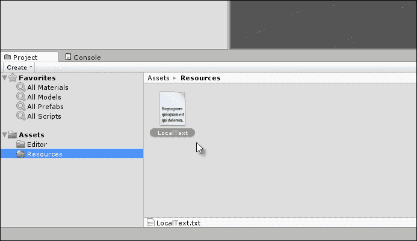

将本地化文本导入项目

### 小贴士

更多关于资源的信息可以在 Unity 文档的在线资源中找到，请参阅[`docs.unity3d.com/ScriptReference/Resources.html`](http://docs.unity3d.com/ScriptReference/Resources.html)。

导入的文本文件简单地包含了要包含在游戏中的所有文本数据，其中每个元素都与它的 ID 相关联。因此，每个字符串值都与一个 ID 相关联，并且 ID 在语言方案中是一致的，这允许语言之间的无缝过渡。ID 是使自动化本地化成为可能的一个共同分母。为了在代码中实现本地化系统，我们首先创建一个应该应用于所有本地化字符串的属性。该属性仅定义要附加到特定字符串变量的 ID，如以下代码示例 8-11 所示：

```cs
using UnityEngine;
 using System.Collections;

 //Attribute to attach to string objects
 public class LocalizationTextAttribute : System.Attribute
 {
    //ID to assign
    public string LocalizationID = string.Empty;

    //Constructor
    public LocalizationTextAttribute(string ID)
    {
           LocalizationID = ID;
   }
 }
```

现在已经创建了`LocalizationTextAttribute`属性，我们可以在代码中将它应用于字符串成员，将它们与特定的 ID 关联起来，如以下代码示例 8-12 所示：

```cs
//----------------------------------------------
 using UnityEngine;
 using System.Collections;
 //----------------------------------------------
 public class SampleGameMenu : MonoBehaviour 
 {
    [LocalizationTextAttribute("text_01")]
    public string NewGameText = string.Empty;

    [LocalizationTextAttribute("text_02")]
    public string LoadGameText = string.Empty;

   [LocalizationTextAttribute("text_03")]
   public string SaveGameText = string.Empty;

    [LocalizationTextAttribute("text_04")]
    public string ExitGameText = string.Empty;
 }
 //----------------------------------------------
```

`SampleGameMenu`类在对象检查器中显示为一个普通类，如图所示。稍后，通过我们的`Editor`类，我们将开发自动更改所有字符串成员到所选语言的能力。

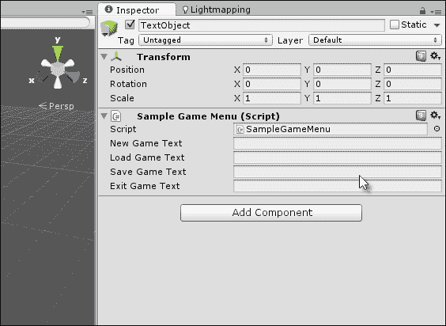

SampleGameMenu 类包含示例菜单屏幕所需的所有纹理

现在，我们将编写一个`Editor`类来在语言之间切换。这个类将在应用程序菜单上添加菜单项，当点击时将更改活动语言，如以下代码示例 8-13 所示。这个示例借鉴了我们已经看到的一系列相关概念，包括新的概念。具体来说，它使用了`Reflection`、`Linq`和`Editor`类以及 Mono 框架 XML 处理类：

```cs
01 //-------------------------------------------
02 using UnityEngine;
03 using UnityEditor;
04 using System.Collections;
05 using System.Xml;
06 using System.Linq;
07 using System.Reflection;
08 //-------------------------------------------
09 public class LanguageSelector
10 {
11 [MenuItem ("Localization/English")]
12 public static void SelectEnglish()
13 {
14        LanguageSelector.SelectLanguage("english");
15 }
16 
17 [MenuItem ("Localization/French")]
18 public static void SelectFrench()
19 {
20        LanguageSelector.SelectLanguage("french");
21 }
22 
23 [MenuItem ("Localization/Yoda")]
24 public static void SelectYoda()
25 {
26        LanguageSelector.SelectLanguage("yoda");
27 }
28 
29 public static void SelectLanguage(string LanguageName)
30 {
31        //Access XML Text File in Project
32 TextAsset textAsset = Resources.Load("LocalText") as TextAsset;
33 
34        //Load text into XML Reader object
35         XmlDocument xmlDoc = new XmlDocument();
36         xmlDoc.LoadXml(textAsset.text);
37 
38       //Get language nodes
39 XmlNode[] LanguageNodes = (from XmlNode Node in xmlDoc.GetElementsByTagName("language")

40 where Node.Attributes["id"].Value.ToString().Equals(LanguageName.ToLower())
41       select Node).ToArray();
42 
43        //If no matching node found, then exit
44        if(LanguageNodes.Length <= 0)
45              return;
46 
47       //Get first node
48       XmlNode LanguageNode = LanguageNodes[0];
49 
50      //Get text object
51 SampleGameMenu GM = Object.FindObjectOfType<SampleGameMenu>() as SampleGameMenu;
52 
53      //Loop through child xml nodes
54      foreach (XmlNode Child in LanguageNode.ChildNodes)
55        {
56              //Get text Id for this node
57              string TextID = Child.Attributes["id"].Value;
58               string LocalText = Child.InnerText;
59 
60              //Loop through all fields
61 foreach(var field in GM.GetType().GetFields(BindingFlags.Instance | BindingFlags.Public | BindingFlags.NonPublic | BindingFlags.FlattenHierarchy))
62              {
63                    //If field is a string then is relevant
64                    if(field.FieldType == typeof(System.String))
65                    {
66                          //Get custom attributes for field
67 System.Attribute[] attrs = field.GetCustomAttributes(true) as System.Attribute[];

68 
69                    foreach (System.Attribute attr in attrs)
70                    {
71        if(attr is LocalizationTextAttribute)
72                                 {
73                                     //We've found text
74 LocalizationTextAttribute LocalAttr = attr as LocalizationTextAttribute;
75 
76               if(LocalAttr.LocalizationID.Equals( TextID ))
77                           {
78                          //id matches, now set value
79                          field.SetValue(GM, LocalText);
80                           }
81                     }
82              }
83              }
84       }
85       }
86 }
87 }
88 //-------------------------------------------
```

以下是对代码示例 8-13 的注释：

+   **行 02-07**：请记住包括广泛的使用范围，如所示。我们的代码将在某种程度上依赖于它们。

+   **第 11-23 行**：对于此示例应用程序，可以从应用程序菜单中选择三种语言：**英语**、**法语**和**Yoda**。对于您自己的项目，您的语言列表可能不同。但关键的是，根据此处提供的本地化系统，即使在较晚的时间，集成额外的语言也很容易。

+   **第 32 行**：在此处调用`Resources.Load`函数以从项目中的`Resources`文件夹打开 XML 文本文件，并将其文本内容提取到一个单一的连接字符串变量中。

+   **第 35-36 行**：XML 字符串被加载到一个`XmlDocument`对象中，这是一个封装了完整 XML 文件的 Mono 类，无论是磁盘上的还是内存中的。该类在加载时还会验证文档，这意味着如果文件包含语法错误，将在此处生成异常。

+   **第 53 行**：一旦从 XML 文件中选择了一种语言，就会遍历该语言的子节点（每个节点都是唯一的字符串）以找到匹配的 ID。

+   **第 61 行**：对于每个字符串条目，都会在文本类的所有公共字符串成员中搜索合适的`LocalizationTextAttribute`，当找到时，将字符串 ID 与现有 ID 进行比较以检查匹配。当找到匹配项时，字符串变量将被分配相应的本地化字符串。

要使用此处提供的本地化框架，首先将一个`SampleGameMenu`对象添加到场景中，如图所示：

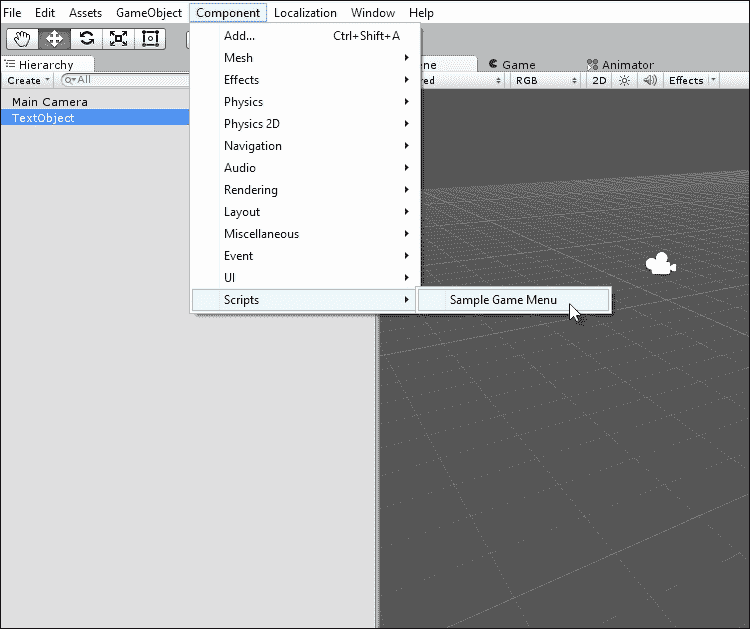

将带有本地化文本成员的示例游戏菜单对象添加到场景中

然后，通过在**本地化**标签页中选择**英语**或**Yoda**，从应用程序主菜单中选择一种语言，如图所示：

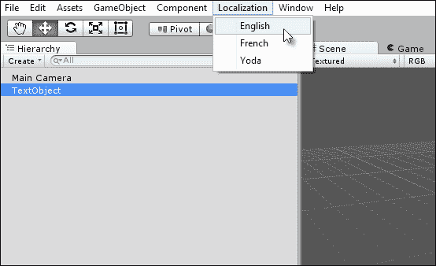

设置游戏的活动语言

一旦指定了活动语言，所有带有`LocalizationTextAttribute`属性的字符串都将更新，如下面的屏幕截图所示：

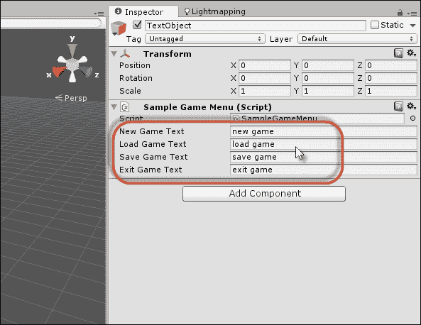

选择活动语言后更新本地化文本

# 摘要

本章深入探讨了作为概念的反射与其实际应用之间的关系，即创建扩展编辑器行为的`Editor`类，使其能够适应自定义意图，而不仅仅是默认行为。这种能力对于构建 Unity 游戏本身并非总是必需的，但它可以使你的工作更加轻松。此外，如果你希望开发能够帮助其他开发者的自定义插件，这也可以通过 Asset Store 带来盈利。在这里，你看到了如何使用`ScriptableWizard`类创建批量重命名工具，以及为对象检查器添加颜色混合属性。接下来，我们广泛使用了反射来暴露对象检查器中所有公共的 C#属性，这使我们能够直接访问设置和获取属性值，就像我们在运行时访问它们一样。进一步地，我们探讨了如何通过`Editor`类从 XML 文件实现本地化框架，这些类允许字符串变量自动更改以匹配所选语言。更多信息，您可以访问[`catlikecoding.com/unity/tutorials/editor/custom-data/`](http://catlikecoding.com/unity/tutorials/editor/custom-data/)和[`catlikecoding.com/unity/tutorials/editor/custom-list/`](http://catlikecoding.com/unity/tutorials/editor/custom-list/)。在下一章中，我们将带着概念和技术上的负担，从更不寻常的角度探索 2D 世界。
