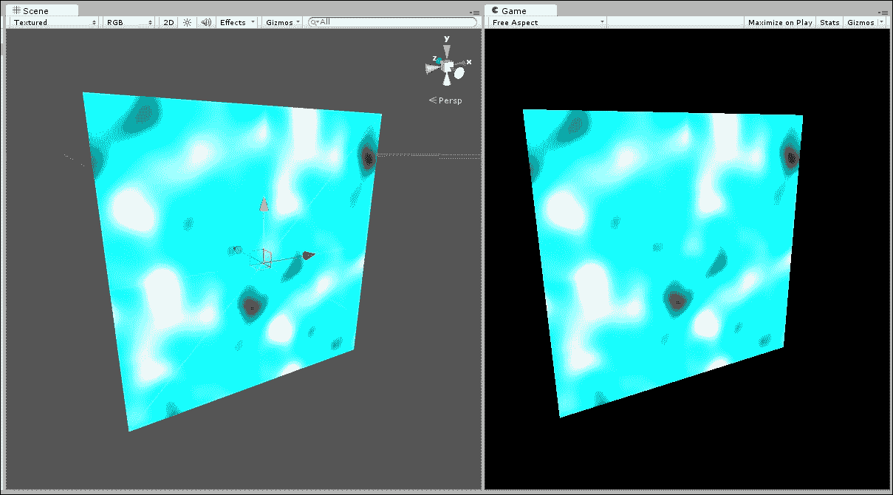
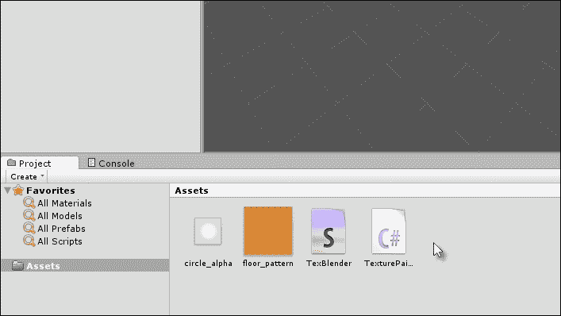

# 第九章. 使用纹理、模型和 2D

今天的大多数游戏引擎都将它们的功能集定位为 3D 游戏而不是广义上的 2D。这往往具有讽刺意味，使得 3D 任务和工作流程比 2D 任务和工作流程更简单，至少在最初开始时是这样。在本章中，我们将探讨一些 2D 问题，但有一些限制。自从 Unity 4.3 发布以来，编辑器中已经添加了许多 2D 功能：最初是一个本机精灵系统，然后是一个新的 GUI 系统。虽然这两个系统在它们各自的方式中都很有用，但本章的主要焦点不会特别关注这些功能。第一个原因是许多教程已经相当详细地解释了它们，但第二个也是最重要的原因是，即使在添加了 2D 功能之后，关于在更宽松的 2D 中工作的基本问题仍然存在。这些问题包括如何操纵 2D 平面的几何形状，如顶点和边，如何调整和动画纹理坐标，如何编辑纹理，以及如何使用类似画笔的系统实时在纹理上绘制纹理，以创建贴图和血迹等。这些问题在涉及 2D 平面的几何和纹理方面比 3D 更相关，但它们对 2D 和 3D 游戏都具有相关性。它们的重要性非常显著，尽管在可用的教程中它们的覆盖范围有些不足，所以我在这里进行了覆盖。因此，我将主要限制本章的内容在 2D 的非传统方面。

# 天空盒

天空盒可能看起来不是开始分析 2D 的好地方，但它展示了相机的重要功能集，特别是分层。天空盒本质上是一个基于立方体的背景，它附着在相机上以显示云彩、天空和其他应始终作为场景背景的遥远细节，但它永远不会代表玩家可以靠近的任何东西。它始终是遥远的，如图所示：


天空盒资源用于为相机显示天空背景

Unity 默认天空盒的主要问题是它们默认是静态和不动的。然而，大多数开发者希望他们的天空和云彩能够轻轻旋转，即使相机静止不动，以描绘一天或时间流逝的过程。现在，让我们使用 Unity 天空盒资源、两个分层相机和一个 C#脚本文件来创建一个改进的天空盒预制体。

### 小贴士

旋转天空盒的最终项目可以在本书的配套文件中找到。

对于在此处创建的示例项目，让我们导入**角色控制器**包以获取第一人称控制器资源，导入**地形资源**包以获取可以绘制到示例地形上的地形纹理，以及导入**天空盒**包以获取天空盒纹理，如图下所示。

所有这些都将有助于构建一个带有旋转 Skybox 的示例项目。


导入角色控制器、Skybox 和地形资产

接下来，让我们开始创建旋转的 Skybox 预制件，以创建一个可重复使用的对象。该对象由三个主要部分或子对象组成：一个允许玩家移动并渲染大多数场景对象的第一人称控制器，一个位于第一人称相机下方并仅显示 Skybox 的第二相机，以及一个具有反转法线的立方体对象，它包围 Skybox 相机并在每个面上显示每个 Skybox 纹理。

首先，在场景原点创建一个新的空对象（命名为`SkyBoxCamera`），并将一个第一人称控制器对象作为子对象添加。然后，从主菜单创建六个**四边形**对象（通过导航到**GameObject** | **3D Object** | **Quad**），将每个对象对齐到另一个对象的角落，使顶点吸附以形成一个倒置的立方体，即面朝内的立方体，如下面的截图所示。这代表了手动 Skybox 的网格。


从六个四边形对象创建手动 Skybox

### 小贴士

如有必要，缩放四边形，并确保它们包含并包围第一人称控制器，该控制器应位于 Skybox 的中心。

将 Skybox 面分配到新的层`SkyBoxLayer`，选择第一人称控制器相机，然后更改**剔除遮罩**字段以排除`SkyBoxLayer`层。第一人称相机应仅渲染前景对象，而不是背景对象。为了实现这一点，在对象检查器中将**清除标志**字段更改为**仅深度**，如下面的截图所示。这使相机背景变为透明，允许低级相机显示出来，如果有的话。


使相机背景透明

现在，创建一个新的`Camera`对象，并将其作为第一人称相机的直接子对象，并匹配其位置、旋转和缩放。这允许相机继承第一人称相机所有的变换。次要相机的目的是在匹配第一人称位置和旋转的同时，仅作为层在第一人称相机下方渲染 Skybox 对象。

为此，将新相机的**深度**值更改为任何小于第一人称相机深度的值；例如`-1`。如有必要，移除任何音频监听器组件。


为 Skybox 渲染创建第二个相机

为每个立方体面分配一个独特的 Skybox 纹理，并注意通过旋转或调整四边形的对齐方式来无缝地对齐它们。然后，将 Skybox 纹理的材质**着色器**类型更改为**未光照/纹理**，使 Skybox 不受场景光照的影响。Skybox 网格应该开始成形，如下所示：


将 Skybox 纹理添加到四边形

最后，将以下代码示例 9-1 应用到 Skybox 父对象上，以创建其旋转行为并将其持续对齐到相机位置。这确保了 Skybox 无论在场景中移动到何处，始终位于相机中心：

```cs
01 //--------------------------------------------------
02 using UnityEngine;
03 using System.Collections;
04 //--------------------------------------------------
05 public class SkyBox : MonoBehaviour 
06 {
07 //--------------------------------------------------
08 //Camera to follow
09 public Camera FollowCam = null;
10 
11 //Rotate Speed (Degrees per second)
12 public float RotateSpeed = 10.0f;
13 
14 //Transform
15 private Transform ThisTransform = null;
16 //--------------------------------------------------
17 // Use this for initialization
18 void Awake () {
19       ThisTransform = transform;
20 }
21 //--------------------------------------------------
22 // Update is called once per frame
23 void Update () {
24        //Update position
25        ThisTransform.position = FollowCam.transform.position;
26 
27        //Update rotation
28 ThisTransform.Rotate(new Vector3(0,RotateSpeed * Time.deltaTime,0));
29 }
30 //--------------------------------------------------
31 }
32 //--------------------------------------------------
```

从这里，你现在拥有了一个完整且增强的 Skybox，它围绕着相机旋转，以产生更真实和生动的场景。你甚至可以通过在每个 Skybox 内部添加多个堆叠的 Skybox 来更进一步，每个 Skybox 都具有透明度，以创建额外的效果，例如雾、薄雾等：


完成手动 Skybox 预制件

# 程序化网格

尽管 Unity 现在从应用程序菜单提供了一个 Quad 原语，您可以通过导航到**GameObject** | **3D Object** | **Quad**来访问它，但了解如何手动创建几何形状，如 Quads，仍然很有用。这里有几个原因。首先，你将经常需要在脚本中编辑顶点以移动、动画或扭曲网格以创建各种效果，例如，在平台游戏中创建一个类似果冻的表面，当角色踩在上面时弯曲和摇晃。其次，你可能需要编辑网格的 UV 坐标，例如，以创建动画或滚动的纹理效果，如下所示：


从脚本生成网格

考虑以下代码示例 9-2，它应包含在项目中的`Editor`文件夹内。它创建了一个编辑器插件，该插件在脚本中生成一个具有对网格枢轴点位置完全定制的 Quad。正如我们将在代码注释中看到的，这个示例包含了许多有用的提示：

```cs
001 //EDITOR CLASS TO CREATE QUAD MESH WITH SPECIFIED ANCHOR
002 //------------------------------------------------
003 using UnityEngine;
004 using UnityEditor;
005 using System.IO;
006 //------------------------------------------------
007 //Run from unity editor
008 public class CreateQuad : ScriptableWizard
009 {
010       //Anchor point for created quad
011       public enum AnchorPoint
012     {
013         TopLeft,
014         TopMiddle,
015         TopRight,
016         RightMiddle,
017         BottomRight,
018         BottomMiddle,
019         BottomLeft,
020         LeftMiddle,
021         Center,
022             Custom
023     }
024 
025      //Name of Quad Asset
026      public string MeshName = "Quad";
027 
028      //Game Object Name
029      public string GameObjectName = "Plane_Object";
030 
031      //Name of asset folder
032      public string AssetFolder = "Assets";
033 
034      //Width of quad in world units (pixels)
035      public float Width = 1.0f;
036 
037      //Height of quad in world units (pixels)
038      public float Height = 1.0f;
039 
040      //Position of Anchor
041      public AnchorPoint Anchor = AnchorPoint.Center;
042 
043      //Horz Position of Anchor on Plane
044      public float AnchorX = 0.5f;
045 
046     //Vert Position of Anchor on Plane
047      public float AnchorY = 0.5f;
048      //------------------------------------------------
049      [MenuItem("GameObject/Create Other/Custom Plane")]
050     static void CreateWizard()
051     {
052         ScriptableWizard.DisplayWizard("Create Plane",typeof(CreateQuad));
053     }
054 
055      //------------------------------------------------
056      //Function called when window is created
057      void OnEnable()
058      {
059             //Call selection change
060             OnSelectionChange();
061       }
062       //------------------------------------------------
063       //Called 10 times per second
064       void OnInspectorUpdate()
065       {
066             switch(Anchor)
067             {
068                   //Anchor is set to top-left
069                   case AnchorPoint.TopLeft:
070                         AnchorX = 0.0f * Width;
071                         AnchorY = 1.0f * Height;
072                   break;
073 
074                   //Anchor is set to top-middle
075                   case AnchorPoint.TopMiddle:
076                          AnchorX = 0.5f * Width;
077                          AnchorY = 1.0f * Height;
078                   break;
079 
080                   //Anchor is set to top-right
081                   case AnchorPoint.TopRight:
082                          AnchorX = 1.0f * Width;
083                          AnchorY = 1.0f * Height;
084                   break;
085 
086                   //Anchor is set to right-middle
087                   case AnchorPoint.RightMiddle:
088                         AnchorX = 1.0f * Width;
089                         AnchorY = 0.5f * Height;
090                   break;
091 
092                   //Anchor is set to Bottom-Right
093                   case AnchorPoint.BottomRight:
094                         AnchorX = 1.0f * Width;
095                         AnchorY = 0.0f * Height;
096                   break;
097 
098                   //Anchor is set to Bottom-Middle
099                   case AnchorPoint.BottomMiddle:
100                         AnchorX = 0.5f * Width;
101                         AnchorY = 0.0f * Height;
102                   break;
103 
104                   //Anchor is set to Bottom-Left
105                   case AnchorPoint.BottomLeft:
106                         AnchorX = 0.0f * Width;
107                         AnchorY = 0.0f * Height;
108                   break;
109 
110                   //Anchor is set to Left-Middle
111                   case AnchorPoint.LeftMiddle:
112                         AnchorX = 0.0f * Width;
113                         AnchorY = 0.5f * Height;
114                   break;
115 
116                   //Anchor is set to center
117                   case AnchorPoint.Center:
118                         AnchorX = 0.5f * Width;
119                         AnchorY = 0.5f * Height;
120                   break;
121 
122                   case AnchorPoint.Custom:
123                   default:
124                   break;
125            }
126      }
127       //------------------------------------------------
128       //Function called when window is updated
129       void OnSelectionChange()
130      {
131             //Check user selection in editor 
132      if (Selection.objects != null && Selection.objects.Length == 1)
133             {
134             //Get path from selected asset
135       AssetFolder = Path.GetDirectoryName(AssetDatabase.GetAssetPath(Selection.objects[0]));

136             }
137      }
138      //------------------------------------------------
139      //Function to create quad mesh
140      void OnWizardCreate()
141      {
142             //Create Vertices
143             Vector3[] Vertices = new Vector3[4];
144 
145             //Create UVs
146             Vector2[] UVs = new Vector2[4];
147 
148             //Two triangles of quad
149             int[] Triangles = new int[6];
150 
151             //Assign vertices based on pivot
152 
153             //Bottom-left
154             Vertices[0].x = -AnchorX;
155             Vertices[0].y = -AnchorY;
156 
157             //Bottom-right
158             Vertices[1].x = Vertices[0].x+Width;
159             Vertices[1].y = Vertices[0].y;
160
161             //Top-left
162             Vertices[2].x = Vertices[0].x;
163             Vertices[2].y = Vertices[0].y+Height;
164 
165             //Top-right
166             Vertices[3].x = Vertices[0].x+Width;
167             Vertices[3].y = Vertices[0].y+Height;
168             
169             //Assign UVs
170             //Bottom-left
171             UVs[0].x=0.0f;
172             UVs[0].y=0.0f;
173
174             //Bottom-right
175             UVs[1].x=1.0f;
176             UVs[1].y=0.0f;
177
178             //Top-left
179             UVs[2].x=0.0f;
180             UVs[2].y=1.0f;
181 
182             //Top-right
183             UVs[3].x=1.0f;
184             UVs[3].y=1.0f;
185 
186             //Assign triangles
187             Triangles[0]=3;
188             Triangles[1]=1;
189             Triangles[2]=2;
190 
191             Triangles[3]=2;
192             Triangles[4]=1;
193             Triangles[5]=0;
194 
195             //Generate mesh
196             Mesh mesh = new Mesh();
197             mesh.name = MeshName;
198             mesh.vertices = Vertices;
199             mesh.uv = UVs;
200             mesh.triangles = Triangles;
201             mesh.RecalculateNormals();
202 
203             //Create asset in database
204      AssetDatabase.CreateAsset(mesh, AssetDatabase.GenerateUniqueAssetPath(AssetFolder + "/" + MeshName) + ".asset");

205            AssetDatabase.SaveAssets();
206 
207             //Create plane game object
208             GameObject plane = new GameObject(GameObjectName);

209       MeshFilter meshFilter = (MeshFilter)plane.AddComponent(typeof(MeshFilter);

210             plane.AddComponent(typeof(MeshRenderer));
211 
212             //Assign mesh to mesh filter
213             meshFilter.sharedMesh = mesh;
214             mesh.RecalculateBounds();
215 
216             //Add a box collider component
217             plane.AddComponent(typeof(BoxCollider));
218      }
219 
220       //------------------------------------------------
221 }
```

以下是对代码示例 9-2 的注释：

+   **第 004 行**：此示例被编码为一个编辑器插件。因此，包含了`UnityEditor`命名空间。有关创建编辑器插件的更多信息，请参阅第八章，*自定义 Unity 编辑器*。

+   **第 135 行**：当用户在 Unity 编辑器中通过鼠标或键盘更改选择时，会调用`OnSelectionChanged`事件。在这里，调用`GetAssetPath`方法来检索当前在**项目**面板中打开的文件夹。

+   **第 140 行**：调用`OnWizardCreate`函数在脚本中生成一个 Quad 网格。这是通过填充顶点和 UV 数组，然后在第 196 行创建的`Mesh`对象内部填充来实现的。

+   **第 204 行**：关键的是，网格本身被保存，不是作为特定场景中的对象，而是作为项目的一般资产。这样可以通过`AssetDatabase`类实现。这对于允许网格在需要时跨多个场景重用，以及允许其更改和细节在场景间持久化非常重要。

    ### 小贴士

    更多关于`AssetDatabase`类的信息可以在 Unity 文档中在线找到，链接为[`docs.unity3d.com/ScriptReference/AssetDatabase.html`](http://docs.unity3d.com/ScriptReference/AssetDatabase.html)。

# 动画 UVs – 滚动纹理

滚动纹理是许多游戏的一般性需求，然而，Unity 本身并不原生支持滚动纹理；也就是说，你需要“动手编码”来实现它们。滚动纹理对于创建视差效果很有用；用于移动云彩、表面和水；或者表达游戏中的运动或移动。通常，滚动纹理是无缝图像，其像素在垂直和水平方向上平铺。这允许无限滚动和重复，如下所示：



在四边形上的滚动纹理

当附加到四边形时，以下代码示例 9-3 将根据水平和垂直速度动画化其纹理：

```cs
01 //CLASS TO SCROLL TEXTURE ON PLANE. CAN BE USED FOR MOVING SKY
02 //------------------------------------------------
03 using UnityEngine;
04 using System.Collections;
05 //------------------------------------------------
06 [RequireComponent (typeof (MeshRenderer))] 
07 public class MatScroller : MonoBehaviour
08 {
09 //Public variables
10 //------------------------------------------------
11 //Reference to Horizontal Scroll Speed
12 public float HorizSpeed = 1.0f;
13 
14 //Reference to Vertical Scroll Speed
15 public float VertSpeed = 1.0f;
16 
17 //Reference to Min and Max Horiz and vert
18 public float HorizUVMin = 1.0f;
19 public float HorizUVMax = 2.0f;
20 
21 public float VertUVMin = 1.0f;
22 public float VertUVMax = 2.0f;
23 
24 //Private variables
25 //------------------------------------------------
26 //Reference to Mesh Renderer Component
27 private MeshRenderer MeshR = null;
28 
29 //Methods
30 //------------------------------------------------
31 // Use this for initialization
32 void Awake ()
33 {
34        //Get Mesh Renderer Component
35        MeshR = GetComponent<MeshRenderer>();
36 }
37 //------------------------------------------------
38 // Update is called once per frame
39 void Update () 
40 {
41        //Scrolls texture between min and max
42 Vector2 Offset = new Vector2((MeshR.material.mainTextureOffset.x > HorizUVMax) ? HorizUVMin : MeshR.material.mainTextureOffset.x + Time.deltaTime * HorizSpeed,
43 (MeshR.material.mainTextureOffset.y > VertUVMax) ? VertUVMin : MeshR.material.mainTextureOffset.y + Time.deltaTime * VertSpeed);

44 
45       //Update UV coordinates
46       MeshR.material.mainTextureOffset = Offset;
47 }
48 //------------------------------------------------
49 }
50 //------------------------------------------------
```

### 小贴士

`MatScroller`类与任何`MeshRenderer`组件和四边形对象一起工作。一个完整的滚动纹理项目可以在本书的配套文件（代码包）中找到。

将此脚本附加到你的四边形对象上，并调整其滚动速度以产生所需的结果，如下面的截图所示。这将有助于创建动画天空背景和侧滚动射击或平台游戏的背景。它还可以与透明度结合使用来创建流动的瀑布和体积光照！


从对象检查器调整纹理滚动字段

# 纹理绘制

在许多实际场景中，需要在运行时将像素绘制到纹理上。有时，这种需求本身可能很简单，例如，使用 alpha 透明度在另一个表面前显示贴图纹理（如脚印或文字信息）。在这种情况下，你可以简单地通过在另一个平面前放置一个 alpha 裁剪平面来解决这个问题，作为背景。然而，有时你的需求更为复杂，实际上你需要求助于真正的纹理绘制。例如，在街头打斗游戏中，拳头和其他攻击造成的血迹会落在地面和周围景观上，你希望它成为环境纹理的一部分。另一个例子可能是一个休闲化妆艺术家游戏，玩家必须将腮红或眼影绘制到面部网格上。

在这里，你并不想在网格前面单独作为对象绘制纹理四边形来创建纹理贴图的视觉效果。相反，你真正需要将源纹理（如笔刷）绘制到应用于网格的目标纹理上。在这里，绘制不仅仅发生在两个独立的纹理之间，而是在网格及其 UV 映射之间进行。换句话说，源纹理必须应用于场景中网格表面，然后，笔刷像素必须通过网格 UV 映射重新投影回目标纹理。这确保了笔刷像素被绘制到目标纹理的正确位置，如图下所示。因此，这种方法允许任何大小的源纹理通过 UV 映射绘制到任何 3D 表面及其任何大小的目标纹理上。

在本节中，我们将探讨如何实际有效地实现这一点。然而，在开始之前，应该指出，以这种方式进行纹理绘制应作为最后手段，当其他方法（如裁剪四边形）不足够时。这是因为真正的纹理绘制在计算上非常昂贵。


通过网格及其 UV 映射实时绘制纹理笔刷到其他纹理上

### 小贴士

完整的纹理绘制项目可以在本书的配套文件（代码包）中找到。

## 第一步 – 创建纹理混合着色器

首先，让我们认识到这里理想的两种层叠方法。首先，我们有笔刷源纹理本身，当用户在场景中点击网格时，它将被绘制到目标纹理上，如图所示：


笔刷纹理，其中黑色是透明的（alpha）

然后，我们有应用于网格的目标纹理，当绘制时，笔刷笔触应该叠加到其上，如图下所示：


应该绘制笔刷的目标纹理

然而，我们通常不希望在绘制操作期间绘制的笔刷笔触覆盖或更改原始目标纹理。这是因为目标纹理可能应用于场景中的多个对象（至少在理论上是这样），覆盖或更改原始像素将导致其效果传播到使用该纹理的所有对象。

相反，最好将绘制效果分离到具有透明背景的单独纹理上，并通过自定义材质将其层叠到目标纹理上。这会在目标纹理和绘制效果之间创建真正的分离，尽管外观上看起来像是一个统一的纹理。为了实现这种效果，必须编写自定义着色器，如下面的代码示例 9-4 所示。这个着色器在背景纹理上混合一个顶部纹理（具有 alpha 透明度）：

```cs
01 Shader "TextureBlender"
02 {
03     Properties
04     {
05     _Color ("Main Color", Color) = (1,1,1,1)
06     _MainTex ("Base (RGB) Trans (A)", 2D) = "white" {}
07     _BlendTex ("Blend (RGB)", 2D) = "white"
08     }
09     
10     SubShader
11     {
12 Tags { "Queue"="Geometry-9" "IgnoreProjector"="True" "RenderType"="Transparent" }

13     Lighting Off
14     LOD 200
15     Blend SrcAlpha OneMinusSrcAlpha
16     
17     CGPROGRAM
18            #pragma surface surf Lambert
19            uniform fixed4 _Color;
20            uniform sampler2D _MainTex;
21            uniform sampler2D _BlendTex;
22 
23            struct Input 
24            {
25              float2 uv_MainTex;
26            };
27 
28            void surf (Input IN, inout SurfaceOutput o) 
29            {
30                  fixed4 c1 = tex2D( _MainTex, IN.uv_MainTex );
31                  fixed4 c2 = tex2D( _BlendTex, IN.uv_MainTex );
32 
33                  fixed4 main = c1.rgba * (1.0 - c2.a);
34                  fixed4 blendedoutput = c2.rgba * c2.a;
35 
36 o.Albedo = (main.rgb + blendedoutput.rgb) * _Color;

37                  o.Alpha = main.a + blendedoutput.a;
38            }
39     ENDCG
40     }
41     Fallback "Transparent/VertexLit"
42 }
```

一旦着色器编写并保存，它就会作为对象检查器中**材质**面板创建的任何材质的可选择着色器类型出现。这个着色器应该用于任何需要绘制细节的对象，如图所示。`_MainTex`插槽指的是需要叠加细节但必须保留的背景纹理。`_BlendTex`插槽指的是要叠加到`_MainTex`上的纹理，它保留了其 alpha 透明度。通常，这个插槽将在运行时由脚本通过生成一个 alpha 透明纹理来填充，以接收画笔笔触，正如我们很快将看到的。


创建一个自定义着色器以混合最顶部的纹理到最底部的纹理

## 第二步 – 创建纹理绘制脚本

现在我们已经创建了一个着色器，它接受两个纹理作为输入（顶部和底部纹理）并将顶部纹理混合到底部；这允许使用 alpha 透明度。这会产生类似于 Photoshop 图层效果。这允许我们将纹理绘制分离到顶部纹理上，同时保留其下原始背景的像素，如图所示：


创建纹理绘制脚本

然而，在继续之前，我们必须首先通过对象检查器编辑我们计划使用的画笔纹理资产。具体来说，从 Unity 编辑器的**项目**面板中选择画笔纹理，并将**纹理类型**更改为**高级**。启用**可读写**复选框；这允许使用纹理编辑功能访问纹理。

此外，启用**Alpha 是透明度**并禁用**生成 Mip 贴图**，如图所示：


配置纹理以进行纹理绘制

现在，我们需要创建一个纹理绘制脚本，允许我们使用鼠标通过其 UV 坐标在场景中的 3D 对象上绘制画笔纹理。该脚本如下代码示例 9-5 所示：

```cs
001 //-----------------------------------------------------------
002 using UnityEngine;
003 using System.Collections;
004 //-----------------------------------------------------------
005 public class TexturePainter : MonoBehaviour 
006 {
007       //Square texture with alpha
008        public Texture2D BrushTexture = null;
009 
010       //Width and height of destination texture
011       public int SurfaceTextureWidth = 512;
012       public int SurfaceTextureHeight = 512;
013 
014      //Reference to painting surface texture
015       public Texture2D SurfaceTexture = null;
016 
017      //Reference to material for destination texture 
018      public Material DestMat = null;
019      //-------------------------------------------------
020      // Use this for initialization
021      void Start () 
022      {
023            //Create destination texture
024       SurfaceTexture = new Texture2D(SurfaceTextureWidth, SurfaceTextureHeight, TextureFormat.RGBA32, false);

025 
026             //Fill with black pixels (transparent; alpha=0)
027             Color[] Pixels = SurfaceTexture.GetPixels();
028             for(int i=0; i<Pixels.Length; i++)
029                    Pixels[i] = new Color(0,0,0,0);
030             SurfaceTexture.SetPixels(Pixels);
031             SurfaceTexture.Apply();
032 
033            //Set as renderer main texture
034            renderer.material.mainTexture = SurfaceTexture;
035 
036            //If destination material, set blend texture 
037           //Used with custom shader
038              if(DestMat)
039       DestMat.SetTexture("_BlendTex", SurfaceTexture);
040       }
041       //--------------------------------------------------
042       // Update is called once per frame
043       void Update () 
044       {
045            //If mouse button down, then start painting
046            if(Input.GetMouseButtonDown(0))
047            {
048                   //Get hit of mouse cursor
049                   RaycastHit hit;
050 
051                   //Convert screen point to ray in scene
052      if (!Physics.Raycast(Camera.main.ScreenPointToRay(Input.mousePosition), out hit))
053                          return;
054 
055                   //Get hit collider
056                   Renderer renderer = hit.collider.renderer;
057        MeshCollider Collide = hit.collider as MeshCollider;

058       if (renderer == null || renderer.sharedMaterial == null || renderer.sharedMaterial.mainTexture == null || Collide == null)
059                         return;
060 
061                   //Get UV Coords of hit surface
062                   Vector2 pixelUV = hit.textureCoord;
063       pixelUV.x *= renderer.material.mainTexture.width;
064       pixelUV.y *= renderer.material.mainTexture.height;
065 
066       //Update coords to texture middle (align brush texture center to cursor)
067                   pixelUV.x -= BrushTexture.width/2;
068                   pixelUV.y -= BrushTexture.height/2;
069 
070             //Clamp pixel values between 0 and width
071      pixelUV.x = Mathf.Clamp(pixelUV.x, 0, renderer.material.mainTexture.width);

072      pixelUV.y = Mathf.Clamp(pixelUV.y, 0, renderer.material.mainTexture.height);
073 
074             //Paint onto destination texture
075      PaintSourceToDestTexture(BrushTexture, renderer.material.mainTexture as Texture2D, (int)pixelUV.x, (int)pixelUV.y);
076             }
077      }
078      //--------------------------------------------------
079      //Paint source text to destination
080      //Will paint a brush texture onto a destination texture 
081      public static void PaintSourceToDestTexture(Texture2D Source, Texture2D Dest, int Left, int Top)
082       {
083             //Get source pixels
084             Color[] SourcePixels = Source.GetPixels();
085 
086             //Get dest pixels
087             Color[] DestPixels = Dest.GetPixels();
088 
089             for(int x=0; x<Source.width; x++)
090             {
091                     for(int y=0; y<Source.height; y++)
092                    {
093                         //Get source pixel
094      Color Pixel = GetPixelFromArray(SourcePixels, x, y, Source.width);

095 
096                          //Get offset in destination
097                          int DestOffsetX = Left + x;
098                          int DestOffsetY = Top + y;
099 
100      if(DestOffsetX < Dest.width && DestOffsetY < Dest.height)

101      SetPixelInArray(DestPixels, DestOffsetX, DestOffsetY, Dest.width, Pixel, true);
102                    }
103            }
104 
105            //Update destination texture
106            Dest.SetPixels(DestPixels);
107            Dest.Apply();
108      }
109      //-------------------------------------------------------
110       //Reads color from pixel array
111       public static Color GetPixelFromArray(Color[] Pixels, int X, int Y, int Width)
112       {
113             return Pixels[X+Y*Width];
114       }
115       //------------------------------------------------
116       //Sets color in pixel array
117        public static void SetPixelInArray(Color[] Pixels, int X, int Y, int Width, Color NewColor, bool Blending=false)
118       {
119             if(!Blending)
120                   Pixels[X+Y*Width] = NewColor; 
121             else
122             {
123      //Here we blend the color onto existing surface, preserving alpha transparency

124      Color C = Pixels[X+Y*Width] * (1.0f - NewColor.a);

125                   Color Blend = NewColor * NewColor.a;
126 
127                   Color Result = C + Blend;
128                    float Alpha = C.a + Blend.a;
129 
130       Pixels[X+Y*Width] = new Color(Result.r, Result.g, Result.b, Alpha);

131             }
132      }
133      //-------------------------------------------------
134 }
135 //-----------------------------------------------------------
```

以下是对代码示例 9-5 的注释：

+   **第 008 行**：此行中的公共变量维护了对一个有效纹理资产的引用，该纹理资产在绘制操作期间用作画笔图形。对于每个鼠标点击，这个纹理将被“放置”或绘制到变量`SurfaceTexture`上。

+   **行 015**: `SurfaceTexture` 将引用一个动态生成的纹理，默认情况下填充透明像素，这将揭示任何在其下层的纹理。此纹理将接受绘画操作期间的所有画笔笔触。简而言之，此纹理将被输入到 `TextureBlender` 着色器中的 `_BlendTex` 变量。

+   **行 026-031**: 在 `Start` 函数期间生成一个新纹理。该纹理为 RGBA32 格式，支持 alpha 通道。使用 `SetPixels` 函数批量填充（洪水填充）纹理为相同颜色的像素。有关 `GetPixels` 和 `SetPixels` 函数的更多信息将在稍后考虑。

+   **行 046**: 在 `Update` 函数中，检测鼠标点击以启动纹理绘制功能。

+   **行 048-059**: 如果按下鼠标按钮，函数应在目标上绘制画笔纹理。在第 52 行调用 `Physics.Raycast` 以确定一些事情，例如查看场景中的网格对象是否被射线击中。为了正常工作，该对象应具有 `Collider` 组件。

+   **行 062-072**: 如果检测到碰撞，应通过 `RaycastHit` 结构的 `textureCoord` 变量检索被击中位置的 UV 坐标。有关此变量的更多信息，可以在 Unity 文档的在线文档中找到，网址为 [`docs.unity3d.com/ScriptReference/RaycastHit-textureCoord.html`](http://docs.unity3d.com/ScriptReference/RaycastHit-textureCoord.html)。此成员仅在相交的网格具有 `MeshCollider` 时有效，而不是其他碰撞器类型，如 `BoxCollider` 或 `CapsuleCollider`。然而，这意味着任何用作纹理绘制目标的对象应具有 `MeshCollider` 组件，因为它包含 UV 数据。第 63-72 行将 UV 坐标转换为绝对像素位置，将画笔源纹理中心对准光标位置。此代码的结果是在源画笔纹理上清楚地标识一个应作为支点或原点的位置，并在源纹理应绘制到目标纹理中的像素 *x*、*y* 坐标位置处建立。

+   **行 075**: 最后，调用 `PaintSourceToDestTexture` 函数本身执行绘画操作。

+   **行 081**: `PaintSourceToDestTexture` 函数接受四个参数：`Source`、`Dest`、`Left` 和 `Top`。基于这些参数，`Source` 纹理被绘制到 `Dest` 的 `Left` 和 `Top` 位置。此函数被声明为静态的，这意味着不需要声明此类的任何实例。

+   **行 084-087**：纹理绘制过程的第一步是检索 `Source` 和 `Dest` 纹理中的所有像素。这是通过使用 `GetPixels` 函数实现的。有关 `GetPixels` 的更多信息，可以在 Unity 文档中找到，网址为 [`docs.unity3d.com/ScriptReference/Texture2D.GetPixels.html`](http://docs.unity3d.com/ScriptReference/Texture2D.GetPixels.html)。现在，尽管每个图像在视觉上都是一个像素的二维数组，但 `GetPixels` 返回的数组实际上是线性的（一维的）。这就是为什么有 `GetPixelFromArray` 和 `SetPixelFromArray` 函数，它们将像素的 *x* 和 *y* 位置转换为线性数组索引的原因。

+   **行 89-101**：在这里，每个像素从 `Source` 纹理中检索出来并绘制到目标上。这检查确保画笔纹理以目标边界绘制，并允许所需的裁剪。这是必要的，因为画笔标记原则上可以靠近纹理边缘；在这种情况下，实际上只有画笔的一部分会被绘制到目标上，因为一些像素会被“剪掉”。像素是通过 `GetPixelFromArray` 从 `Source` 纹理中检索的，而目标像素是通过 `SetPixelInArray` 设置的。

+   **行 106-107**：最后，目标像素被推回到目标纹理缓冲区，并调用 `Apply` 函数以确认操作。Unity 还支持一个 `SetPixel` 函数（单数）而不是 `SetPixels`（复数）。然而，`SetPixels` 由于重复调用 `SetPixel` 而能带来更好的性能。

+   **行 111-114**：`GetPixelFromArray` 函数接受一个像素数据数组以及一个像素的 *x* 和 *y* 坐标以及纹理数据的像素宽度。基于此，它返回一个线性索引到像素数组中，在那里你可以找到像素颜色值。

+   **行 117-131**：`SetPixelInArray` 函数改变线性数组中像素的颜色。改变的方法由参数 `Blending` 决定。如果 `Blending` 设置为 `false`，则源像素将简单地替换目标像素。如果 `Blending` 为 `true`，则源像素将与目标像素混合或分层，以保留 alpha 透明度。在将 alpha 透明度画笔绘制到目标纹理时，应将 `Blending` 设置为 `true`，以允许颜色值的累积和混合。

## 步骤 3 – 设置纹理绘制

现在我们已经有一个工作的着色器、纹理绘制脚本和配置好的纹理，我们将逐步运行配置 Unity 中纹理绘制的过程。从一个空项目开始，只包括我们的着色器、纹理绘制脚本和两个配置好的纹理：一个背景纹理和一个画笔纹理，如图所示：



开始纹理绘制项目

从 **Project** 面板配置画笔纹理为小尺寸（例如 `32 x 32`），并将其 **格式** 设置为 **RGBA 32 位** 以实现透明度，如图所示：


配置画笔纹理

使用 **TextureBlender** 着色器创建一个新的材质，并将背景纹理分配给 `MainTexture` 插槽，如图所示：


从我们的 TextureBlender 着色器创建一个新的材质

在场景中添加一个新的 **Quad**、**Plane** 或 **Mesh**，如果有的话，移除其碰撞器。这个对象将接收最终的绘制输出，尽管点击检测将在一个副本网格上发生。我保持最终输出网格和点击检测网格分开，以便目标网格在需要时可以具有其他碰撞器类型或组件。

一旦添加了 Quad，使用 **TextureBlender** 着色器将其分配给该 Quad，如图所示：


添加一个新的 Quad

复制 **Quad**，添加 **Mesh Collider**，禁用 **Mesh Renderer**，并为其分配一个空的漫反射材质。这个网格将不会渲染，但会检测鼠标点击并执行绘制操作。

此外，将 `TexturePainter` 脚本添加到对象中，并将 **Brush Texture** 字段分配给画笔纹理本身，将 **Dest Mat** 字段分配给来自 **Project** 面板的 **Custom_Mat** 材质，如图所示：


创建点击检测 Quad

现在，运行应用程序并开始点击你的网格。当你这样做时，绘制笔触将被应用到纹理上并在视口中显示，如图所示：


纹理绘制完成

# 摘要

本章在“二维性”的广义范畴下涵盖了广泛的内容。在这里，二维的定义并不仅仅是在传统意义上的二维游戏，而是基于纹理的理解，这对于二维和三维游戏都具有关键意义。所涉及的主题包括与二维平面及其内部空间相关的操作和思想。具体来说，它探讨了如何通过构建手动 Skybox 来创建旋转的 Skybox 背景，结合相机深度设置以创建分层渲染。然后，它探讨了如何生成诸如平面之类的程序化几何形状。随着 Unity 四边形作为原型的加入，单独考虑时平面的生成更为有限，但用于生成四边形的方法和概念更为有用，使我们能够编辑和调整任何网格，无论它是否是四边形。实时编辑网格对于创建各种效果至关重要，从冲击波爆炸到基于果冻的蹦床。向前推进，我们考察了网格 UV 的动画。它们允许我们在可平铺的纹理上无限滚动 2D 背景四边形，这对于视差效果以及水和其他基于运动的幻觉都很有用。最后，我们考虑了在网格上进行动态纹理绘制，使用鼠标点击网格可以在网格纹理上绘制源纹理，允许其 UV 坐标和 alpha 透明度混合。这个功能集特别强大，具有广泛的应用性，可以创建实时贴图，如弹孔、血迹和基于玩家的绘制。在下一章中，我们将考虑一系列提示和技术，以更好地与 Unity 项目合作。
