# 1

# 单元测试和测试驱动开发

本章深入探讨了 Visual Studio 2022 中单元测试和 **测试驱动开发**（**TDD**）的基础概念。您将了解在编写代码之前编写测试的重要性，并探索测试框架的集成。实际示例将指导您创建有效的单元测试，确保代码可靠性，并培养测试驱动的心态。

我们将开始一段旅程，了解单元测试和 TDD 的基本要素。我们将从对这些基础概念的整体了解和探索它们在软件开发生命周期中的重要性开始。

在此介绍之后，我们将深入探讨在 Visual Studio Code 中设置单元测试的实际方面。本节将指导您完成配置开发环境的初始步骤，为将测试框架集成到您的流程中打下基础。

一旦设置完成，我们将过渡到创建第一个测试，使用的是 Visual Studio 的一个功能——IntelliTest，它可以自动化生成单元测试。这种动手经验将展示 IntelliTest 如何简化测试过程，使其更加高效和节省时间。

接下来，我们将应用所学知识，通过一个真实世界示例练习从零开始的 TDD。本节将向您介绍在编写代码之前编写测试的过程，这是 TDD 的一个核心原则，以及它如何导致更健壮和可靠的软件。

最后，我们将探索如何使用 Live Unit Testing 自动化测试过程，这是一个在您编码时在后台运行单元测试的功能。本节将向您展示如何启用并利用 Live Unit Testing 来增强您的开发流程，确保您的代码在整个开发过程中保持可靠且无错误。

在本章中，我们将涵盖以下主要主题：

+   介绍单元测试和 TDD

+   在 Visual Studio 中设置单元测试

+   使用 IntelliTest 创建测试

+   使用真实世界示例练习 TDD

+   使用 Live Unit Test 自动化测试

# 技术要求

在编写本章时，我使用了以下版本的 Visual Studio：

+   Visual Studio Enterprise 2022 版本 17.12.0

+   预览 1.0

本章的代码文件可以在[`github.com/PacktPublishing/Mastering-Visual-Studio-2022/tree/main/ch01`](https://github.com/PacktPublishing/Mastering-Visual-Studio-2022/tree/main/ch01)找到

# 介绍单元测试和 TDD

在深入探讨通过 Visual Studio 使用单元测试和 TDD 方法之前，让我们先回顾一下它们是什么以及为什么在项目中考虑它们是有价值的。

单元测试是一种针对软件系统内单个单元或组件的集中式软件测试方法。单元测试的主要目标是确保每个软件单元按预期工作，满足指定的要求。通常由开发者执行，单元测试在开发早期进行，先于整个系统的集成和测试。

自动化单元测试在代码发生修改时执行，确保新更改不会破坏现有功能。这些测试被精心设计来验证最小的可想象代码单元，如函数或方法，在更广泛的系统之外进行。这种方法使开发者能够在开发初期迅速识别和解决问题，从而提高整体软件质量并减少后续测试阶段所需的时间。

## 单元测试的 F.I.R.S.T.原则

通过认真遵循单元测试的**快速、隔离/独立、可重复、自我验证、及时**（**F.I.R.S.T.**）原则，开发者被引导精心制作有效的测试。这些原则作为指南针，通过灌输支撑单元测试可靠性和鲁棒性的关键标准，将测试过程引导至卓越。

让我们更详细地看看 F.I.R.S.T.的每个因素：

+   **快速**：执行速度是有效单元测试的一个基本特征。单元测试必须运行迅速，因为开发者经常在整个开发过程中执行它们。快速的测试套件提供快速反馈，使开发者能够及时识别和纠正问题。这不仅加速了开发周期，还培养了一种响应性文化，鼓励开发者频繁运行测试。快速获得反馈的能力增强了早期发现潜在问题的能力，促进了对软件质量的主动方法。

+   **隔离/独立**：独立性是单元测试的一个基石原则。每个单元测试都应该在隔离状态下运行，不依赖于其他测试。测试执行的顺序或某个测试的成功或失败不应影响其他测试的结果。这种隔离确保开发者能够以专注的方式定位和解决问题，简化调试过程。遵循独立性的原则，开发者能够精确地识别问题的根源，从而加速问题的解决过程。

+   **可重复性**：单元测试的可重复性对于维护测试过程的一致性至关重要。单元测试应在每次执行时始终产生相同的结果。这种一致性确保了测试结果的可信度，促进了一个可靠和可预测的测试环境。如果测试失败，开发者应该能够一致地重现失败，使他们能够自信地调查和解决问题。可重复性是建立对测试套件和整体软件开发过程信任的基础。

+   **自我验证**：单元测试应具备成功或失败的自包含标准，无需人工解释。自我验证的测试确保结果明确，减少了误解的可能性。开发者可以仅根据测试结果快速了解代码的状态，从而简化调试和问题解决过程。单元测试的自我验证特性有助于测试套件的清晰性和有效性，使开发者能够根据每个测试的明确结果做出明智的决策。

+   **及时性**：测试编写的及时性是单元测试有效性的关键因素。理想情况下，测试应该在相应的代码实现之前编写。这种主动的方法确保测试作为期望行为的活生生的规范，指导实现过程。及时编写测试为定义明确和受控的开发周期奠定了基础。及时测试在开发周期早期识别和解决问题上也发挥着关键作用，减少了缺陷传播到软件开发后期阶段的可能性。采用及时测试可以增强整个软件开发生命周期的效率和可靠性。

现在我们已经建立了单元测试及其原则的基础理解，让我们将注意力转向 TDD 的更广泛背景。

## TDD – 软件质量统一原则

这些 F.I.R.S.T 原则无缝地铺平了通往一个称为 TDD 的总体方法的道路。TDD 将设计、开发和测试合并到一个统一的框架中，为开发者提供了一种全面的方法，不仅能够编写简单和干净的代码，还能确保彻底的测试。增量开发方法系统地测试了业务逻辑的所有方面，使 TDD 成为创建高质量软件的黄金标准。它在整个过程中体现了最佳的编码和设计实践。

TDD 的主要目的是实现更简单、更可靠的代码。为此，TDD 遵循一个简单而有效的过程，即**红-绿-重构周期**：

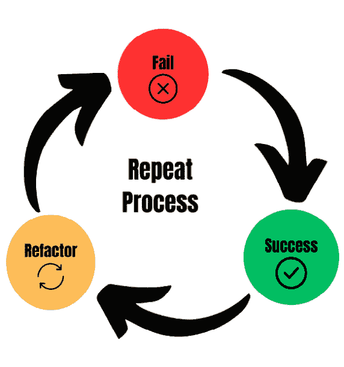

图 1.1 – TDD 周期

让我们更详细地了解这个 TDD 周期：

+   **红色 – 编写一个** **失败的测试** :

    在 TDD 的第一个阶段，称为红阶段，开发者通过创建一个失败的测试来开始他们的旅程。这个测试专门针对尚未实现的小功能单元。它作为期望行为的具体表达，本质上概述了尚未编写的代码的期望。重要的是要注意，在这个阶段，测试预计会失败，因为相应的功能尚未存在于代码库中。

    红阶段的主要目的是为后续的开发过程设定一个明确的目标。通过最初专注于预期结果而不放置任何代码，开发者为即将实施的功能制定了路线图。在编写代码之前先编写测试的这种有意行为不仅为即将到来的功能建立了规范，还有助于巩固开发者对当前问题的理解。

+   **绿色 – 编写通过测试所需的最小代码**：

    在红阶段之后，开发过程进入绿色阶段。在这里，开发者编写必要的最小代码，使之前编写的测试成功通过。这个阶段的重点是简洁和效率。目标是不要创建复杂的解决方案，而是解决失败测试所突出的即时需求。

    通过专注于实现成功所需的最小代码量，开发者培养了一种简洁的文化，避免了不必要的复杂性。这种专注的方法鼓励创建满足测试具体需求的代码，为既功能性强又简洁的解决方案奠定基础。在这个阶段测试的成功表明了目标功能的实现，验证了在红阶段设定的初始期望。

+   **重构 – 重构代码**：

    在测试通过后，开发过程进入重构阶段。在这个阶段，开发者会退后一步，回顾并增强已经实现的代码。重构的主要目标是在不改变其功能的前提下，提高代码的可维护性、可读性和可扩展性。

    重构是 TDD 的关键方面，因为它确保代码库保持清洁并适应未来的变化。开发者努力消除冗余，改进命名约定，并在适当的地方应用设计模式。这个阶段强化了生产不仅功能性强而且精心制作的代码的承诺。这个阶段的成功完成为长期有效的代码库奠定了基础。

+   **重复 – 迭代过程**：

    TDD 遵循迭代方法，重复（Repeat）阶段封装了这种开发方法的循环性质。对于需要实现的新功能，整个红-绿-重构（Red-Green-Refactor）周期都会重复进行。这种迭代过程确保代码库的系统性和渐进式演变，每个周期都对软件的整体开发做出贡献。

通过重复循环，开发者不断改进和扩展应用程序，响应不断变化的需求，并确保代码与项目目标保持一致。TDD 的这种迭代性质促进了适应性和敏捷性，使其成为具有变化或发展需求的项目的一种有价值的开发方法。

这种方法不仅确保创建出功能软件，而且培养了在开发过程中的持续改进和适应性思维模式。

## AAA 模式 - 测试的结构化方法

建立在 TDD 和 F.I.R.S.T 原则的基础上，单元测试领域中的另一个关键方法是**安排-行动-断言**（**AAA**）模式。该模式为测试套件内的测试组织提供了一个统一的结构。AAA 模式对测试套件的可读性和可维护性做出了重大贡献，与 TDD 的总体目标无缝对接。

AAA 模式将测试分解为三个不同的部分：

+   **安排**：本节涉及设置测试环境。

    在安排（Arrange）部分，重点是准备测试环境。这包括设置要测试的对象，将**系统单元**（**SUT**）带到特定状态，并配置任何依赖项。无论是直接实例化对象还是准备测试替身依赖项，目标都是为测试建立一个受控和一致的开始点。

+   **行动**：本节涉及在系统单元（SUT）上执行操作。

    行动（Act）部分是实际与系统单元（SUT）交互的地方。这包括在系统单元上调用方法或执行操作，传递任何必需的依赖项，并在适用的情况下捕获输出值。行动阶段对于模拟系统的实际使用和观察其行为至关重要。

+   **断言**：本节专注于验证预期的结果。

    在断言（Assert）部分，测试对预期的结果做出明确声明。这可能包括检查返回值、检查系统单元及其协作者的最终状态，或验证调用在它们上的方法。断言阶段是测试的总结，确保行为与预期结果一致。

AAA 模式的结构化方法为套件中所有测试提供了清晰和一致性。通过遵循此模式，开发者可以轻松理解并导航测试，从而降低整个测试套件的维护成本。无论从 Arrange、Act 还是 Assert 开始，AAA 模式都能适应不同的测试风格，同时促进统一和系统的测试方法。

现在，我们已经对单元测试和 TDD 进行了简要的介绍，让我们深入探讨如何在 Visual Studio 中创建单元测试项目。

# 在 Visual Studio 2022 中设置单元测试

在本节中，我们将首先在 Visual Studio 中创建一个单元测试项目。一旦完成，我们将概述**测试资源管理器**视图及其主要选项。**测试资源管理器**视图充当 IDE 中所有测试活动的中心枢纽，提供对我们测试套件状态和性能的全面概述。它允许我们轻松导航测试结果，识别失败，并访问每个测试用例的详细信息。

## 创建单元测试项目

Visual Studio 和 .NET 支持三种测试框架：

+   **MSTest**：这是 Microsoft 为 .NET 应用提供的默认测试框架。它完全集成到 Visual Studio 中，并提供在 IDE 中编写和运行测试的功能。

+   **NUnit**：这是 .NET 应用中流行的开源测试框架。它提供了一个灵活且可扩展的平台来编写和执行测试，并在 .NET 社区中得到广泛应用。

+   **xUnit**：这是另一个用于 .NET 应用的开源测试框架。与 MSTest 和 NUnit 相比，它采用更现代和灵活的方法，并且在 .NET 开发者中越来越受欢迎。

首先，你需要为你的测试集创建一个新的项目，在包含我们想要测试的项目解决方案中。右键单击你的解决方案，然后选择**添加** | **新建项目...**。这将带您进入以下屏幕：

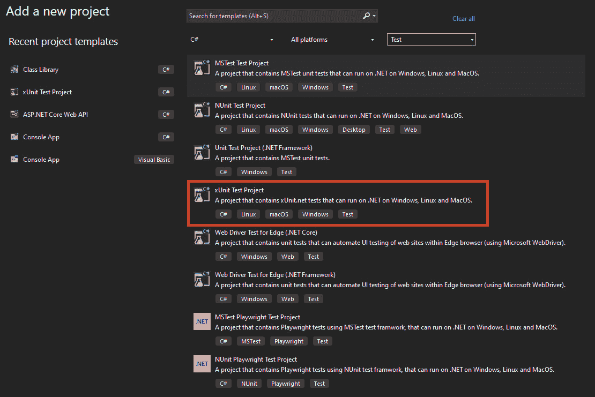

图 1.2 – 添加新的测试项目

我通过三个顶部下拉菜单过滤了这个视图，以保持默认显示在 Visual Studio 中可用的测试模板项目。你可能注意到列表中的最后两个模板提到了**Playwright**。Playwright 是一个库，它使现代 Web 应用能够进行端到端测试。使用它，你可以创建单元测试来评估用户界面的功能。

由于 xUnit 是行业中最常用的框架，我们将专注于它来展示我们的示例。

创建单元测试项目的另一种方法是直接在代码库中右键单击你的类，然后从菜单中选择**创建单元测试**：

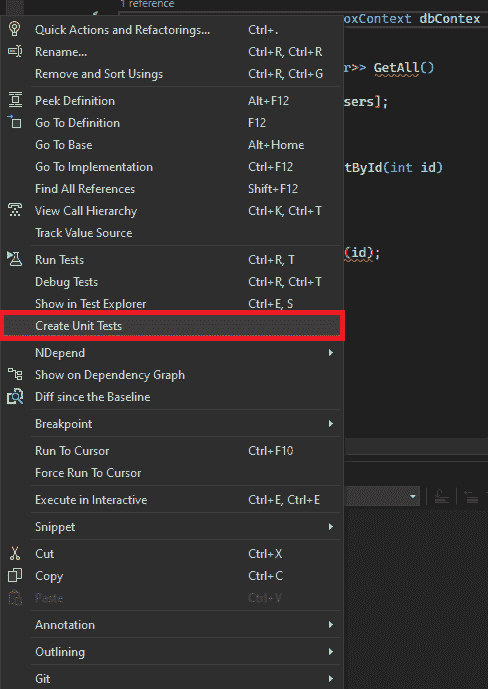

图 1.3 – 从菜单中选择创建单元测试

此操作将打开一个菜单，允许您配置您的单元测试项目：

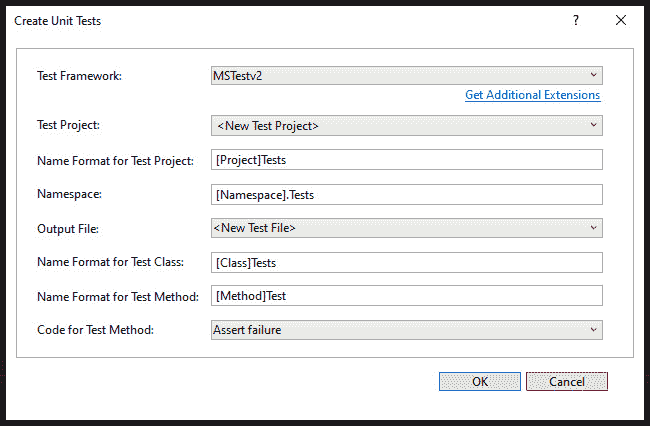

图 1.4 – 创建单元测试窗口

默认情况下，这允许您创建一个 MSTestv2 项目，但您可以安装额外的扩展来使用其他框架。如果您已经创建了一个单元测试项目，您可以将测试方法添加到其中。

无论您如何创建它们，本项目中所有测试都可以在**测试探索器**视图中进行管理，我们将在下一节中探讨它。

## 测试探索器视图概述

测试探索器在 Visual Studio 2022 中作为强大的集中式工具，简化了单元测试的管理和执行。这个功能丰富的窗口允许开发者无缝地查看、组织和运行他们的单元测试，在**集成开发环境**（**IDE**）中。

要访问测试探索器，有两种选择：

+   您可以在 Visual Studio 中导航到**测试**菜单，或利用通过按下*Ctrl* + *E*，释放它们，然后按下*T*键可访问的方便的键盘快捷键。

+   自 17.6 版本以来，您可以使用**一站式搜索**功能快速访问 Visual Studio 提供的所有功能。只需使用*Ctrl* + *Q*快捷键打开一站式搜索，输入**测试探索器**，然后按*Enter*键，您将被导向**测试探索器**窗口。

这是**测试探索器**窗口的视觉展示：

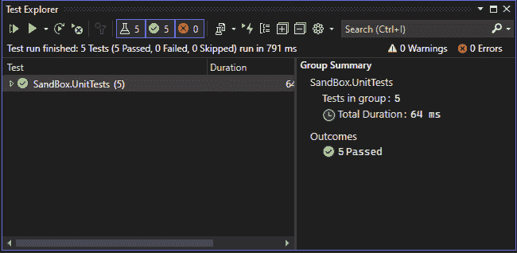

图 1.5 – 测试探索器窗口

**测试探索器**控制台提供了所有可用测试的清晰和组织视图，使得开发者能够轻松地浏览他们的测试套件。此界面提供了测试管理的先进功能，例如以下内容：

+   **分类和分组测试**：利用属性和类别根据功能区域、功能或特定要求对测试进行分组。这有助于创建逻辑层次结构，并使关注特定测试子集变得更容易。默认情况下，测试基于**项目**分组，然后是**命名空间**，接着是**类**。如果您想修改测试的组织结构，只需在测试探索器中点击**按组**按钮并选择一个新的分组标准：

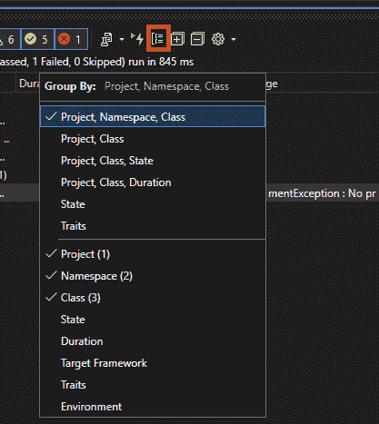

图 1.6 – 测试探索器 – 按组

这里是您可以选择的分组描述：

+   **持续时间**：按执行时间分组：**快速**、**中等**和**慢速**

+   **状态**：按执行结果分组测试：**失败的测试**、**跳过的测试**、**通过的测试**和**未运行的测试**

+   **目标框架**：按项目目标框架分组测试

+   **命名空间**：按包含的命名空间分组测试

+   **项目**：按包含的项目分组测试

+   **类**：按包含的类分组测试

+   **过滤和搜索**：在大型代码库中，定位特定测试可能具有挑战性。测试资源管理器提供过滤选项和强大的搜索功能。

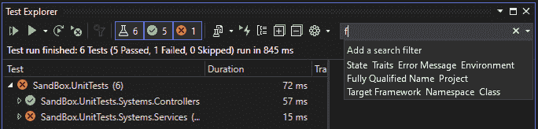

图 1.7 – 测试资源管理器 – 应用搜索过滤器

您可以在文本框中输入命令，例如 **命名空间:""** 或您希望用于搜索的任何其他过滤标准。此外，您可以直接点击提供的命令来启动过滤。

+   **创建播放列表**：您可以在 Visual Studio 中创建和管理测试播放列表，以组织和运行特定的测试集。要创建播放列表，请在测试资源管理器中选择一个或多个测试，右键单击，然后选择 **添加到播放列表** | **新建播放列表**。

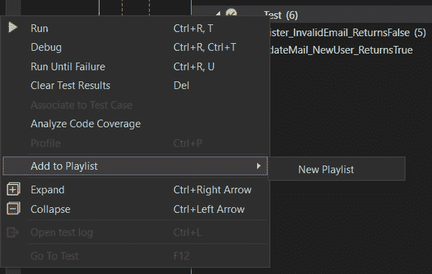

图 1.8 – 测试资源管理器 – 添加到播放列表

播放列表在新 **测试资源管理器** 选项卡中打开，您可以为其命名并指定位置。您可以通过添加或删除测试来编辑播放列表，并可以使用 **编辑** 按钮通过复选框更方便地管理测试。播放列表可以是动态的，并基于包含或排除的测试自动更新。它们可以保存为 XML 文件，如果需要可以手动编辑。

现在我们已经对 **测试资源管理器** 视图有了概述，让我们探索 Visual Studio 2022 的预览功能并使用它创建一个测试。

# 使用 IntelliTest 创建测试

在本节中，我们的目标是探索如何使用 IntelliTest 创建测试。为此，我们首先将学习如何启用 IntelliTest 功能。接下来，我们将学习如何执行它并使用它生成测试。在本节结束时，我们将学习如何通过保存、执行和审查来组织我们生成的单元测试。

IntelliTest 提供特征测试，允许您通过一系列传统的单元测试来了解代码的行为。这个套件可以作为回归测试套件，帮助处理重构旧代码或未知代码的挑战。

通过引导测试输入生成，IntelliTest 采用开放代码分析和约束求解方法自动生成精确的测试输入值，通常无需用户干预。它为复杂对象类型生成工厂，并允许自定义这些工厂以满足特定要求。代码中指定的正确性断言被用于进一步指导测试输入生成。

与 Visual Studio IDE 无缝集成，IntelliTest 为测试套件生成提供了一个统一的环境。在测试套件创建过程中收集的信息，包括自动生成的输入、代码输出和生成的测试用例，以及它们的通过或失败状态，在 Visual Studio 中均可轻松访问。这种集成使得在 IDE 中无需离开即可轻松地在代码精炼和 IntelliTest 重新运行之间迭代。测试结果可以保存为解决方案中的单元测试项目，并由 Visual Studio 测试资源管理器自动识别。

IntelliTest 可在 Visual Studio Enterprise Edition 中使用。它系统地探索代码库，为每个方法生成测试数据和单元测试，以确保全面的代码覆盖并验证代码行为。截至编写本文时，IntelliTest 是 Visual Studio 17.9 的预览功能，因此您必须通过以下步骤从 **选项** 菜单中启用它：

1.  前往 **工具** | **选项** | **管理** **预览功能** 。

1.  在 **预览功能** 下检查 **IntelliTest 支持 NetFx 和 Net6 使用 Z3 v4** 选项。

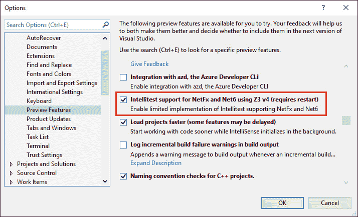

图 1.9 – 启用预览功能 – Intellitest

启用后，我们可以探索 IntelliTest 的工作方式。例如，我创建了一个实现 **FizzBuzz** 的公共类。要为该类使用 IntelliTest 生成测试，右键单击类名，找到 **IntelliTest (预览)** 选项，然后选择 **生成测试**：

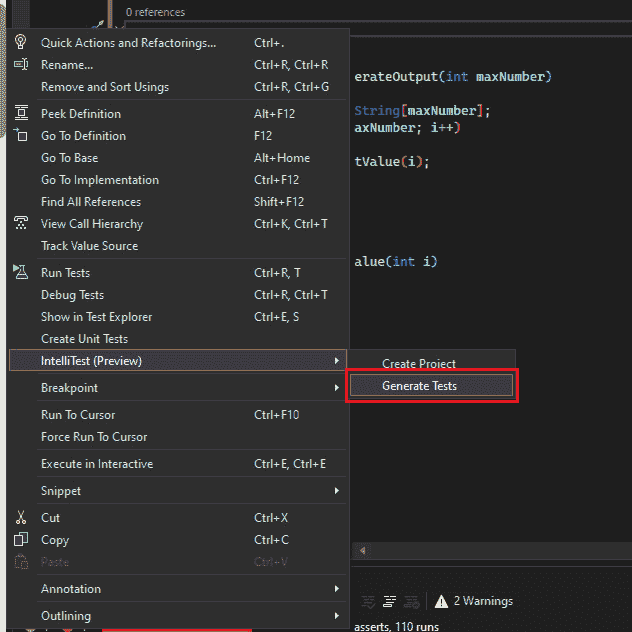

图 1.10 – IntelliTest – 生成测试

## IntelliTest 执行和测试生成

IntelliTest 使用各种输入多次执行我们的代码。每次执行都在表中记录，显示输入测试数据以及相应的输出或发生的任何异常。

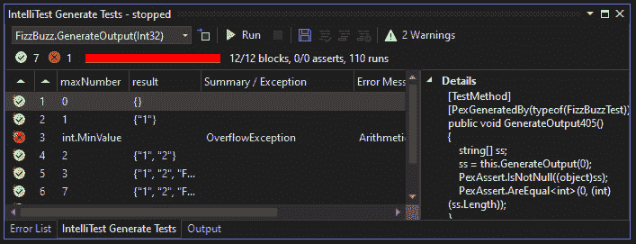

图 1.11 – 使用 IntelliTest 生成测试

在测试生成后，我们可以访问测试项目并检查已生成的参数化单元测试。

## 保存、执行和审查单元测试

我们可以选择我们想要保留并使用的单元测试，并使用保存选项来保存它们。

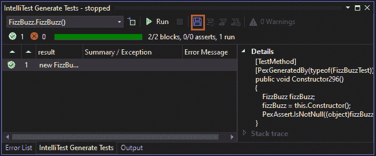

图 1.12 – IntelliTest 的保存选项

窗口左上角的复选框允许您过滤通过类的所有方法。与每一行相关联的单独单元测试存储在测试项目中的 **.g.cs** 文件中，而参数化单元测试存储在其各自的 **.** **cs** 文件中。

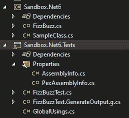

图 1.13 – IntelliTest – 单元测试项目

我们可以使用测试资源管理器执行这些单元测试并审查结果，就像我们处理手动创建的单元测试一样。

与经典单元测试类似，我们可以通过选择菜单中的选项来生成项目，而无需首先运行 IntelliTest。

使用 IntelliTest 从您的代码库中生成测试是一个非常有价值的工具，特别是对于遗留项目和回归测试。现在，让我们通过一个真实世界的例子来说明如何在 Visual Studio 中实现 TDD。

# 通过真实世界的例子练习 TDD

在 TDD 中，一切从规格说明和对预期功能的彻底理解开始。为了编写有效的测试，理解我们想要完成的意义是至关重要的。考虑到这一点，让我们为我们的示例建立一个场景。

我们将创建一个**ValidateMail**方法来处理电子邮件验证。我们的目标是探索 Visual Studio 中可用的工具，以增强我们的 TDD（测试驱动开发）体验。

现在我们已经概述了我们的需求，我们的下一步是开始创建我们的单元测试项目。为此，我们将选择 xUnit，正如本章前面所讨论的。我们将创建一个空的类库项目：

1.  我们将首先在 xUnit 项目中编写一个测试，指定我们想要实现的行为或功能：

    ```cs
    [Fact]
    public void ValidateMail_NewUser_ReturnsTrue()
    {
        // Arrange
        var user = new User();
        // Act
        bool result =
            user.ValidateMail("john@example.com");
        // Assert
        Assert.True(result);
    }
    ```

1.  当我们编写这段代码时，我们首先会注意到我们的测试无法编译，因为我们的类库项目中还没有**User**类。

1.  我们将利用 IntelliSense 的强大功能来创建我们的类及其方法。IntelliSense 是 Visual Studio 中集成的代码补全工具，提供各种功能，如列出成员、参数信息、快速信息和完成单词。这些功能有助于更深入地理解正在使用的代码，帮助管理键入参数，并允许通过最少的按键快速添加对属性和方法的调用。

1.  将光标放在**User()**类上，展开 IntelliSense 菜单，选择**生成新类型…**快速操作：

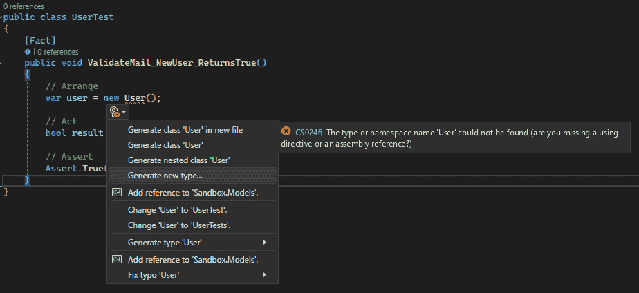

图 1.14 – 生成新类型...

1.  这将打开一个窗口，我们可以选择可访问性（**默认**、**内部**或**公共**）、类型（**类**或**结构**）、项目，以及是否创建新文件或使用现有文件。由于我们选择了我们的类库项目，我们新类的可访问性显然设置为**公共**。

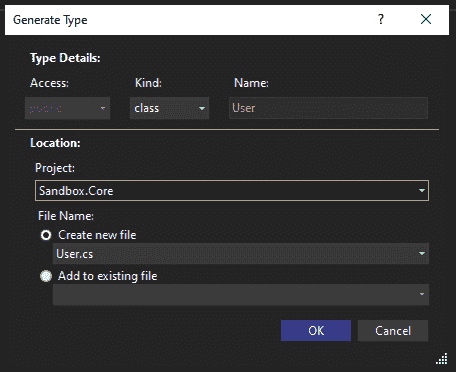

图 1.15 – 生成类型窗口

1.  现在，以同样的方式，我们将使用 IntelliSense 来创建我们的**ValidateMail()**方法：

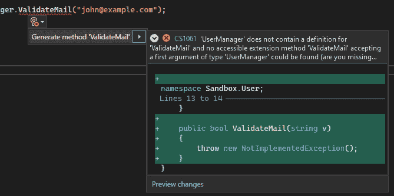

图 1.16 – 生成方法 ValidateMail’

1.  完成这些后，我们的测试已经构建，但它仍然失败，因为我们还没有修复其行为。

这是我们的**User**类，包含使测试通过所需的最少代码：

```cs
public class User
{
    public User()
    {
    }
    public bool ValidateMail(string mail)
    {
        return true;
    }
}
```

现在我们有一个返回**true**的**ValidateMail**方法，它应该遵守我们的测试规格说明。

您可以使用位于方法上方的高级访问功能来运行单元测试，而无需进入**测试资源管理器**视图。

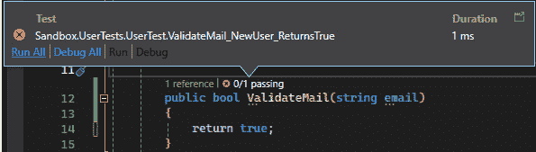

图 1.17 – 使用快速访问工具运行测试

到这里了；我们的第一个测试是绿色的。我们可以编写第二个测试类，该类将处理我们的**ValidateMail()**必须返回**false**的情况。为此，我们将使用**Theory**和**InlineData** xUnit 属性：

```cs
[Theory]
[InlineData("invalidemail")]
[InlineData("invalidemail@")]
[InlineData("invalidemail@example")]
[InlineData("invalidemail@example.")]
[InlineData("invalidemail@.com")]
public void ValidateMail_InvalidEmail_ReturnsFalse(string email)
{
    // Arrange
    var userManager = new User();
    // Act
    bool result = userManager.ValidateMail(email);
    // Assert
    Assert.False(result);
}
```

我们准备进行另一轮迭代，从红色变为绿色。以下是使单元测试通过所需的最少代码的方法：

```cs
public bool ValidateMail(string email)
{
    if (!email.Contains('@'))
        return false;
    if (email.EndsWith('@'))
        return false;
    if (!email.Contains('.'))
        return false;
    if (email.EndsWith('.'))
        return false;
    if (email.Contains("@."))
        return false;
    return true;
}
```

在这里，我们正在检查测试方法的每个条件，每个测试都有一个**If**来使其通过。

如您所见，我们的方法保持了一种天真而简单的视角。现在，是时候进入我们 TDD 流程的重构阶段了。为此，我们将探索 Visual Studio 的一个名为实时单元测试的功能。

# 使用实时单元测试自动化测试

在本节中，我们将探索使用实时单元测试自动化测试的功能。首先，我们将学习如何配置实时单元测试。然后，我们将看到如何启动它

实时单元测试通过在您进行代码更改时自动执行单元测试来革新测试过程。这个动态功能为开发者提供了重构和修改代码的信心。通过在代码编辑期间自动运行所有受影响的测试，实时单元测试确保所做的任何更改都不会引入回归。

此外，实时单元测试可以提供有关代码库测试覆盖率充分性的见解。它实时地以可视化的方式呈现代码覆盖率，使开发者能够快速识别测试不足的区域。

通过导航到**测试** | **实时单元测试** | **启动**来激活此功能。

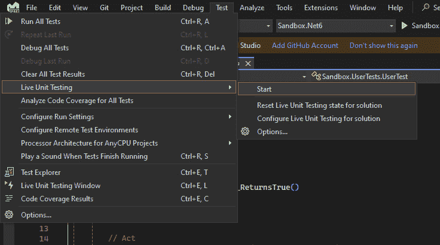

图 1.18 – 开始实时单元测试

当您首次启动实时单元测试时，配置窗口将打开：

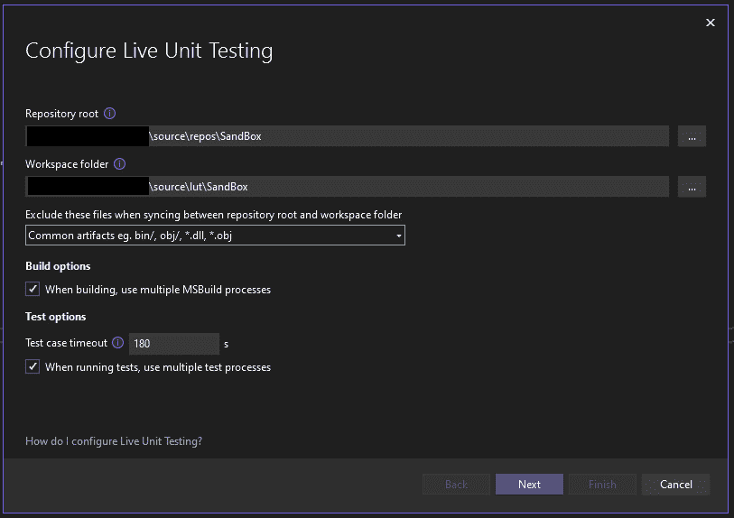

图 1.19 – 配置实时单元测试

## 配置实时单元测试

当实时单元测试被禁用时，您可以通过导航到**测试** | **实时单元测试** | **配置实时单元测试**来访问设置向导。

在实时单元测试操作期间，会建立一个工作区——原始存储库的副本。在 Visual Studio 中进行的任何尚未保存的修改都将集成到这个工作区中。随后，实时单元测试启动构建，执行测试运行，并提供最新的代码覆盖率报告。

向导中的初始设置应解决文件复制源和目标。

让我们更深入地了解这个向导中的设置：

+   **仓库根目录**：这是包含所有 Live Unit Testing 所需文件的主要文件夹。它应包括所有源代码、二进制文件和测试所需的工具。如果解决方案文件不在该根目录内，可能需要调整以确保正确设置。

+   **工作区文件夹**：这是 Live Unit Testing 存储仓库副本的位置（默认设置为**lut**用于 Live Unit Testing）。默认情况下，此根目录创建在用户的家目录中，但可以根据偏好或特定要求进行自定义。

+   **排除的文件**：排除生成的工件被复制到 Live Unit Testing 工作区，以防止干扰常规构建。

+   **构建选项**：默认情况下，Live Unit Testing 使用多个 CPU 核心进行更快地构建。

+   **测试用例超时**：这允许设置一个特定的时间段，在此之后，如果测试超过分配的时间，则自动终止。

+   **使用多个处理器**：默认情况下，Live Unit Testing 会尝试利用多个处理器以加快测试执行速度。但是，如果您的机器出现减速或并行测试执行导致问题，如文件冲突，请取消选择此选项。

如果我们为**排除**文件选择**<自定义>**，我们可以定义自己的规则。设置向导将带我们到**lutignore**文件编辑器，其中不填充默认值。

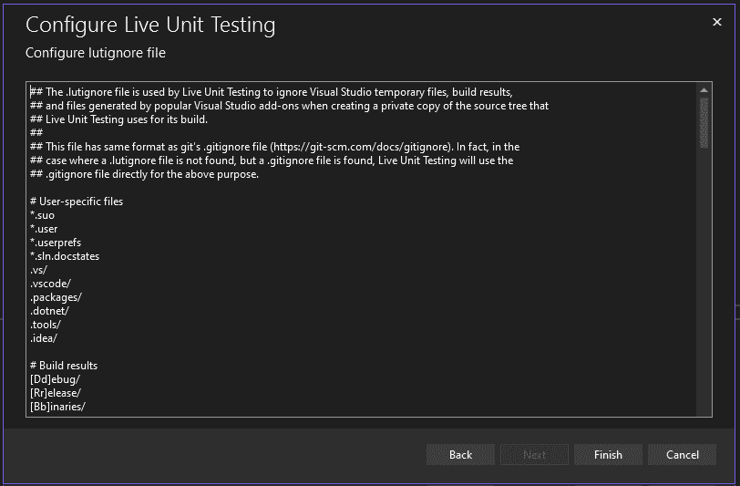

图 1.20 – 配置 lutignore 文件

让我们根据 Microsoft 文档概述一下**lutignore**文件结构。

**lutignore**文件遵循与**gitignore**文件相同的格式。它应包括与构建过程中创建的文件夹或文件相对应的规则，确保它们不会被复制到 Live Unit Testing 工作区。对于大多数默认项目模板，提供的**lutignore**文件是足够的：

```cs
[BB]IN
[OO]BJ
```

这些规则防止将任何**BIN**或**OBJ**文件夹复制到 Live Unit Testing 工作区。

如果您的仓库只有一个构建文件夹，请在**ignore**文件中指定该文件夹：

```cs
[AA]RTIFACTS/
```

此规则确保**ARTIFACTS**文件夹不会被复制到 Live Unit Testing 工作区。

在您的仓库包含构建文件夹中的额外工具的情况下，也应使用匹配模式排除这些工具：

```cs
[AA]RTIFACTS/
![AA]RTIFACTS/TOOLS/
```

第一条规则排除了**ARTIFACTS**文件夹。第二条确保**ARTIFACTS**中的**TOOLS**子文件夹被复制，其中可能包含必要的工具和实用程序。

## 启动 Live Unit Testing

现在我们已经配置了 Live Unit Testing，它已打开并等待运行测试的播放列表。

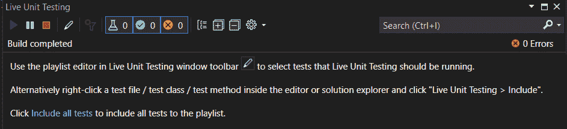

图 1.21 – Live Unit Testing 控制台

使用笔形图标添加您的测试集。或者，您也可以通过点击消息底部的链接来添加所有测试。

回到我们之前的例子和我们的 **ValidateMail()** 函数，您可以在代码行的左侧看到绿色的勾选标记。这表明代码已被通过单元测试覆盖。

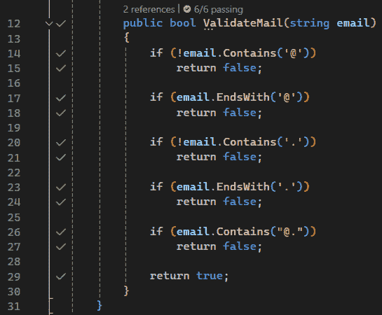

图 1.22 – 实时单元测试勾选标记

现在，我们可以继续进行我们的 TDD 迭代的重构步骤。

首先，我们将所有条件连接起来，并故意让测试失败：

```cs
        public bool ValidateMail(string email)
        {
            return !email.Contains('@') &&
                email.EndsWith('@') &&
                !email.Contains('.') &&
                email.EndsWith('.') &&
                email.Contains("@.");
        }
```

当我们更新文档时，实时单元测试会自动重新构建并更新测试状态指示器，将勾选标记变为红色叉号。

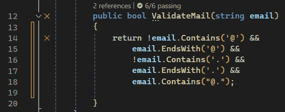

图 1.23 – 实时单元测试红色叉号

现在，我们可以修复我们的代码，勾选标记将自动出现。

在我们的案例中，这个过程非常顺利，但在更大的代码库和更多的单元测试中，它们可能在我们已经更改代码的情况下还没有完成运行。对于这个问题，您在 Visual Studio 的顶级菜单中有一个选项：**工具** | **选项** | **实时单元测试** | **常规** 。

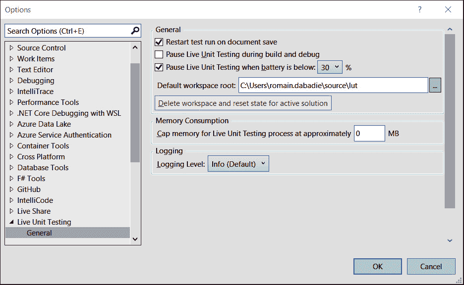

图 1.24 – 额外配置 – 实时单元测试

多亏了这个窗口，您可以根据您的需求自定义您的实时单元测试体验。

我们可以看到，实时单元测试为我们提供了代码覆盖率的快速可视化。您可以通过导航到 Visual Studio 的**测试**菜单并选择**分析所有测试的代码覆盖率**来访问对代码库覆盖的更深入分析。有关更多信息，您可以查阅 Microsoft 文档，网址为 [`learn.microsoft.com/en-us/visualstudio/test/using-code-coverage-to-determine-how-much-code-is-being-tested?view=vs-2022&tabs=csharp`](https://learn.microsoft.com/en-us/visualstudio/test/using-code-coverage-to-determine-how-much-code-is-being-tested?view=vs-2022&tabs=csharp) 。

# 摘要

在本章中，我们讨论了单元测试作为非回归或开发过程的重要性。我们从提醒良好的单元测试实践和 TDD 开始，然后探讨了 Visual Studio 2022 提供的功能，以增强我们的生产力。

我们概述了**测试资源管理器**视图，展示了如何管理和组织单元测试。然后，我们深入探讨了新的智能感知功能，该功能提供工具，可以以最小的努力轻松地将非回归测试添加到旧代码库中，从而让我们有更多精力进行未来的重构。最后，我们学习了如何利用智能感知工具和实时单元测试来简化我们的测试驱动开发（TDD）体验。

在下一章中，我们将更深入地探索调试的世界，并了解 Visual Studio 2022 为高级策略提供的所有功能。
