# 高级调试策略

在上一章中，我们探讨了单元测试和**测试驱动开发**（**TDD**），为构建可靠的代码奠定了坚实的基础。现在，我们的焦点转向 Visual Studio 中的高级调试策略领域。本章的目标是让我们掌握必要的工具和方法，以有效地处理错误。

在本章中，我们将涵盖以下主题：

+   掌握 Visual Studio 调试器

+   高级断点和数据检查

+   通过自动反编译和外部资源提升调试

+   远程调试

+   扩展调试功能超出代码库

+   掌握远程调试

到本章结束时，我们将能够显著更快地解决复杂错误，节省时间和精力。我们还将对代码有更深入的理解，从而构建更健壮、易于维护的应用程序。最后，我们将了解如何在生产环境中自信地工作，知道我们可以轻松处理意外问题。

因此，让我们一起踏上高级调试大师的旅程。通过我们获得的知识和技能，我们将能够直面任何调试挑战，确保代码的质量和性能。

# 技术要求

在编写本章时，我使用了以下版本的 Visual Studio：

+   Visual Studio Enterprise 2022 版本 17.12.0

+   预览 1.0

# 掌握 Visual Studio 调试器

调试是寻找和修复任何软件源代码中的错误或错误的过程。要正确完成这项任务，需要遵循几个步骤。

调试的第一步是定义问题。这包括识别其症状，比较预期与实际结果，确定其范围，评估其严重性和影响，并记录重现它的步骤。这种清晰度简化了故障排除过程。

重新生成错误通常是确定其原因的最有效方法。然而，如果无法这样做，请尝试检查它发生的环境，在线搜索错误消息，评估当时系统的状态，注意其发生的频率，并确定任何重复的模式。有效的调试技能对于提高软件质量和开发者生产力至关重要。

## 进入调试模式

为了帮助我们进行这些调试过程，现代**集成开发环境**（**IDE**）提供了强大的调试器。作为一名开发者，如果你曾经使用过 Visual Studio，那么你应该已经使用过 Visual Studio 中的调试器了。现在，让我们深入了解其最有价值的特性。

我已经设置了一个项目，通过使用调试器功能来分析代码的工作方式，我相信你可以在你当前的一个项目中尝试我们将会看到的内容。

启动调试器有两种常见选项：

+   以调试模式启动整个解决方案

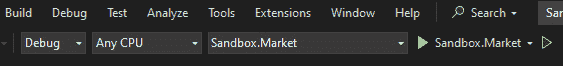

图 2.1 – 调试模式

+   调试特定公共方法的单元测试

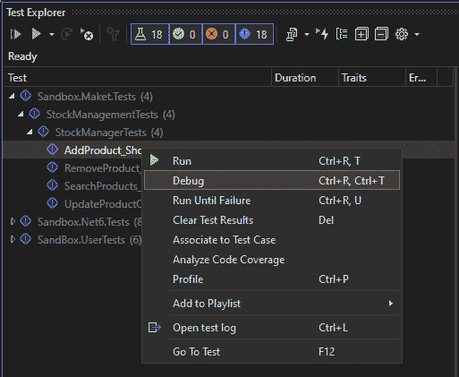

图 2.2 – 单元测试调试

第二个选项可能是我们在开发过程中节省编译时间的良好选择。无论我们的选择如何，首先要做的事情是通过在源文件左侧单击来设置断点以导航代码。我们将在本章后面讨论断点的详细信息。

简而言之，断点是在程序中故意停止或暂停的位置。

当我们设置断点并启动调试器（*F5*）时，我们可以观察方法的行为。以下是我们代码库中导航的三个主要选项的提醒：

+   **步入**（*F11*）：此命令步入代码，意味着它进入当前行上被调用的方法或函数。如果有嵌套调用，它将进入最深层嵌套的调用。

+   **步过**（*F10*）：此命令步过当前代码行，这意味着它执行当前行，然后停止在当前方法或函数的下一行。它不会进入任何方法或函数。

+   **步出**（*Shift* + *F11*）：此命令从当前方法或函数中退出，这意味着它将执行方法或函数的其余部分，然后停止在方法调用之后的下一行。

在调试模式下，Visual Studio 2022 提供了多种方式，帮助我们能够在调试会话期间导航我们的代码应用程序。

## 高级调试导航

Visual Studio 2022 允许我们通过调试器光标来探索代码库的不同区域，以下列出了两个功能：

### 运行到光标（Ctrl + F10）

**运行到光标处**功能允许我们快速导航到代码中的特定位置，并执行到该点为止的代码。要使用**运行到光标处**，我们只需将光标放在我们希望执行停止的代码行上，然后右键单击并从上下文菜单中选择**运行到光标处**。或者，我们可以使用键盘快捷键*Ctrl* + *F10*。

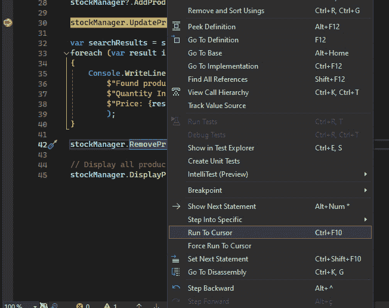

图 2.3 – 运行到光标

重要的是要注意，我们放置光标的代码行必须是可到达的，这意味着它应该是应用程序运行时执行的代码的一部分。如果该行不可到达，**运行到光标处**命令将不起作用。

此命令将运行代码，直到达到光标的位置，但如果在光标之前设置了断点，调试器将停止在该断点处。

如果我们想通过调试器直接到达一行代码，自 Visual Studio 2022 以来，我们已经能够使用**强制运行到** **点击**功能。

### 强制运行到点击

从 Visual Studio 2022 开始提供的**强制运行到点击**功能是一个强大的工具，允许我们在代码执行过程中跳过断点以及任何首次机会异常。当我们想要测试更新后的代码或专注于程序中的特定区域而不受断点的干扰时，这特别有用。

要使用**强制运行到点击**功能，我们需要在调试器中处于暂停状态。当调试器暂停时，我们可以在源代码中悬停在一个语句上，按住*Shift*键，然后选择**运行执行到此处**（由绿色箭头图标表示）。

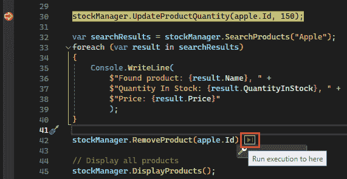

图 2.4 – 运行执行到此处

当我们选择此选项时，应用程序将继续运行，直到达到光标位置，在此过程中发生的任何断点和首次机会异常都将暂时禁用。

当我们在应用程序中设置了多个断点并希望快速跳过它们以测试或调试代码中的特定点时，此功能特别方便。

现在我们已经使用调试器导航了代码库，我们需要了解每个步骤发生的情况。Visual Studio 提供了几个工具来帮助我们检查调试会话期间应用程序的状态。

## 理解调试工具

Visual Studio 调试器提供了一些窗口，有些比其他窗口更新，用于探索我们的变量和对象。让我们详细探讨这些窗口。

### 自动窗口

**自动窗口**显示由调试器自动评估的变量和表达式。它显示了当前作用域内局部变量和表达式的值。当拥有许多变量且不想将所有变量都添加到**本地变量**窗口中时，**自动窗口**非常有用。它仅根据我们当前的执行上下文评估最相关的变量。

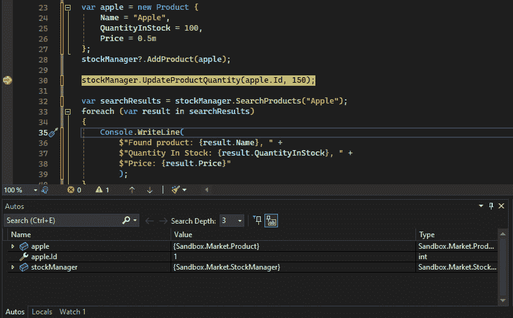

图 2.5 – 自动窗口

在此示例中，我们有一个**int apple.Id = 1;**变量以及正在使用的**apple**和**stockManager**对象；**自动窗口**可能只显示它们及其值，而不是显示当前作用域中的每个变量。

接下来，让我们看一下**本地变量**窗口。

### 本地变量窗口

**本地变量**窗口显示了当前作用域中的所有局部变量。与仅显示变量子集的**自动窗口**不同，**本地变量**窗口列出了所有局部变量，无论其相关性如何。当我们需要查看特定断点处所有局部变量的确切状态时，这可能很有帮助。

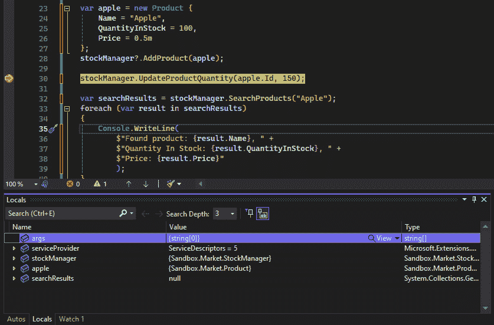

图 2.6 – 本地变量窗口

在这里，**本地变量**窗口允许你在代码执行暂停时查看每个变量的值。

接下来，我们将查看**监视**窗口。

### 监视窗口

我们使用 **观察** 窗口来监视特定的变量或表达式。我们可以手动将变量或表达式添加到 **观察** 窗口中，并且当执行暂停时，调试器将评估它们。这在我们需要跟踪变量值随时间的变化或我们需要评估涉及多个变量的复杂表达式时特别有用。

要将表达式添加到 **观察** 窗口中，右键单击代码并选择 **添加观察**。我们也可以直接在 **观察** 窗口中键入或编写代码。

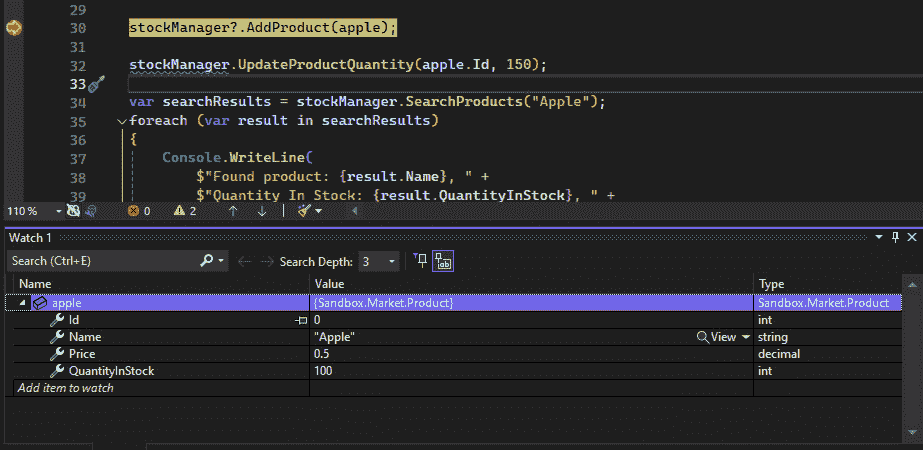

图 2.7 – 观察窗口

**观察** 窗口还可以在调试过程中修改变量的值，这有助于测试不同的场景。

### 调用栈窗口

现在，如果我们进入 **UpdateProduct()** 方法，我们可以在 **调用** **栈** 窗口中跟踪序列。

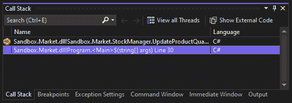

图 2.8 – 调用栈窗口

Visual Studio 中的 **调用栈** 窗口是调试的关键工具，因为它允许我们查看导致程序当前执行点的函数或方法调用序列。此窗口对于理解执行流程和诊断代码中的问题至关重要。

下面是 Visual Studio 中 **调用栈** 窗口的一些关键功能：

+   **查看调用栈**：我们可以看到导致程序当前执行点的函数和方法调用序列。

+   **切换堆栈帧**：我们可以通过在 **调用栈** 窗口中右键单击一个帧并选择 **切换到帧**，或者通过双击帧来切换到不同的堆栈帧。这允许我们检查该帧中的代码和数据。

+   **反汇编代码视图**：要查看调用栈上函数的反汇编代码，只需右键单击该函数并选择**转到** **反汇编**。

+   **加载符号**：Visual Studio 中的 **调用栈** 窗口具有为当前缺少符号的代码加载调试符号的能力。这些符号可能包括从微软的公共符号服务器获取的 .NET 或系统符号，或者位于我们计算机上的符号路径中的符号。

+   **代码映射集成**：Visual Studio Enterprise 提供了在调试过程中可视映射调用栈的功能。此功能使我们能够在新的代码映射中以图形格式观察当前的调用栈，该映射会随着调试的进行自动更新。这种视觉表示有助于更直观地理解我们代码的结构和流程，有助于识别潜在问题或优化区域。请注意，要将 **CodeMap** 扩展添加到 Visual Studio 中才能使用此功能。

最后，让我们看看 **立即** 窗口。

### 立即窗口

Visual Studio 中的**立即**窗口是一个古老且鲜为人知的调试工具，它允许我们在调试会话期间即时执行代码、评估表达式和打印变量值。

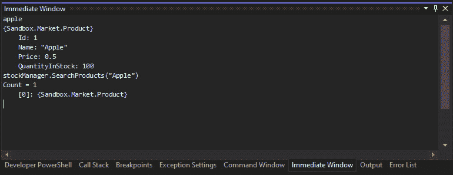

图 2.9 – 立即窗口

它旨在帮助进行动态代码评估和快速测试代码片段，而无需停止应用程序的执行。要使用**立即**窗口，可以通过转到**调试**菜单，选择**窗口**，然后选择**立即**窗口，或者按*Ctrl* + *Alt* + *I*来打开它。此窗口在调试应用程序时特别有用，因为它允许我们检查变量的值，调用函数，并执行语句，而无需逐行通过代码。

在调试期间有效地使用**立即**窗口的一些宝贵技巧：

+   **立即窗口的调试方法**：我们可以在方法中设置断点，并从**立即**窗口中调用它们以进行调试，即使我们已经通过了代码中的该点。请注意，我们可以使用**运行到光标位置**（*Ctrl* + *Shift* + *F10*）功能返回到同一作用域中的任何代码行，并使用*F11*进入方法以进行常规调试。

+   **绕过访问规则**：**立即**窗口不强制执行类访问规则，允许我们调用在常规代码中不可访问的私有、受保护和内部成员。然而，IntelliSense（内置的自动完成工具）仍然只会显示公共方法。

+   **评估无副作用的表达式**：在**立即**窗口中评估表达式可能会更改变量值并调用方法，这可能会引起副作用。为了避免这种情况，将**无副作用**（**nse**）附加到表达式，这将评估它而不会更改应用程序状态。

+   **访问特殊调试变量**：**立即**窗口可以显示特殊调试变量的值，例如**$exception**（当前抛出的异常）、**$returnvalue**（当前返回方法的返回值）和**$user**（当前操作系统用户和进程信息）。

+   **评估 Make Object ID**：在调试时，您可以在**数据提示**中为变量**Make Object ID**，这为对象创建一个唯一的标识符。此标识符可以在任何时间在**立即**窗口中评估，以查看对象值或存在状态的变化。

识别错误是我们调试过程中的一个基本步骤，但目标是修复它们。让我们探讨如何通过使用 Visual Studio 在线修复它们来提高生产力。

## 即时修复错误

为了在调试期间提高我们的生产力并避免停止和启动调试器来修复错误的需要，Visual Studio 2022 允许我们使用以下功能即时进行。

### 编辑并继续

**编辑并继续**是一种功能，允许您在应用程序处于断点模式时修改源代码。当您应用更改时，Visual Studio 会尝试重新编译修改后的代码并将这些更改应用到正在运行的应用程序中。这意味着您可以在不中断调试会话流程的情况下修复错误、添加功能或对代码更改进行实验。

这就是它的工作原理：

1.  我们开始调试您的应用程序。

1.  我们触发了断点并暂停了执行。

1.  在暂停时，我们可以在编辑器中编辑代码。

1.  编辑完成后，我们可以选择继续执行并应用新更改。

我们甚至可以将黄色的执行指针移动回去以改变执行流程并执行我们的编辑代码。

当我们在调试会话期间发现错误时，这个功能尤其有用，我们可以立即知道如何修复它。无需停止调试器、进行更改然后重新启动应用程序，您只需编辑代码并继续即可。

### 热重载

**热重载**是**.NET 6**中引入的新功能，并在 Visual Studio 2022 中得到支持。它允许我们在应用程序运行时更改代码，并且这些更改几乎会立即反映在运行的应用程序中。这就像编辑并继续，但有一些关键的区别：

+   热重载支持 UI 更新，而编辑并继续则不支持。如果我们更改了 UI 的布局或外观，热重载将更新正在运行的应用程序以反映这些更改。

+   热重载旨在与.NET 应用程序一起使用，包括 ASP.NET Core Web 应用程序和 Blazor WebAssembly 应用程序。

+   与编辑并继续相比，热重载需要更多的设置。我们需要在项目设置中启用它，并确保我们的应用程序与该功能兼容。我们将在下一章中更深入地探讨它。

+   使用热重载，我们可以立即看到我们的更改效果，这可以加快开发过程，尤其是在处理 UI 或前端代码时。

编辑并继续和热重载都是强大的工具，可以节省时间并减少在调试过程中停止和重新启动应用程序的挫败感。它们允许我们保持流畅的工作流程，并快速迭代代码，这可能导致更有效的解决问题和更快的开发周期。

现在我们已经掌握了导航调试器的技巧，对它们的窗口进行了概述，并执行了实时修复，让我们更深入地探讨两个提升调试能力的强大工具：高级断点和数据检查。虽然我们已经提到了它们，但请将此视为一次深入探讨，以便您能够精确地使用它们，并从代码行为中获得宝贵的见解。

# 高级断点和数据检查

Visual Studio 2022 中的高级断点是强大的工具，允许我们在调试会话期间检查和控制程序的执行流程。

## 理解断点的类型

Visual Studio 中的断点可以分为几种类型。具体如下。

### 条件断点

我们可以通过设置条件来控制断点的执行时机。这个功能自 Visual Studio 2005 以来就可用。我们可以右键单击断点符号并选择**条件**，或者右键单击代码旁边的空白处并从上下文菜单中选择**插入条件断点**。在**断点设置**窗口中，选择**条件表达式**、**命中次数**或**过滤器**，并在文本框中相应地设置条件表达式。

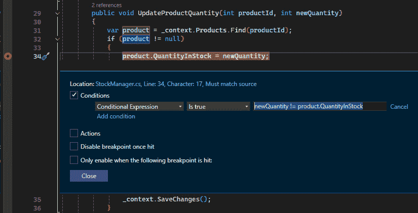

图 2.10 – 条件断点

在这个例子中，根据我们的设置，如果**newQuantiy**不等于**product.QuantityStock**，调试器将停止。

### Tracepoints

自 Visual Studio 2005 引入以来，**tracepoint**作为一种断点变体，允许用户根据可定制的条件将信息记录到**输出**窗口，就像条件断点一样，而不会改变或暂停代码执行。Tracepoints 与 C#、Visual Basic、F#等托管语言以及 JavaScript 和 Python 等语言兼容。

要设置 tracepoint，只需单击位于所需行号左侧的空白处。将鼠标悬停在随后出现的红色圆圈上，然后单击齿轮图标以打开**断点设置**窗口。通过选择**操作**复选框来继续。此操作将红色圆圈转换为菱形，表示从传统断点转换为 tracepoint。

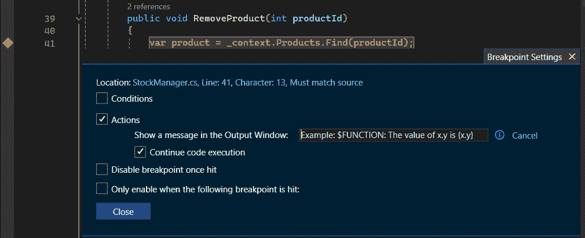

图 2.11 – Tracepoint

将我们想要记录的消息输入到**在输出窗口中显示消息**文本框中。如果我们想添加决定我们的消息是否显示的条件，我们可以选择**条件**复选框。至于条件断点，我们有三种条件选择：**条件表达式**、**过滤器**和**命中次数**。Tracepoints 对于调试很有用，因为它们允许我们记录信息，而不会在代码中添加打印语句或如**Debug.WriteLine()**之类的函数，从而不会使代码变得杂乱。

### 数据断点

数据断点允许我们作为开发者，在特定对象的属性值改变时暂停执行。这个特性在需要监控数据变化而不必手动逐行通过代码的调试场景中特别有用。数据断点可以为**.NET Core 3.x**或**.NET 5+**项目设置，并且对于跟踪对象属性的变化特别有用。

要在.NET Core 或.NET 5+项目中设置数据断点，我们开始调试并等待直到达到断点。然后，在**自动**、**监视**或**局部变量**窗口中，我们右键单击一个属性并从上下文菜单中选择**当值改变时中断**。

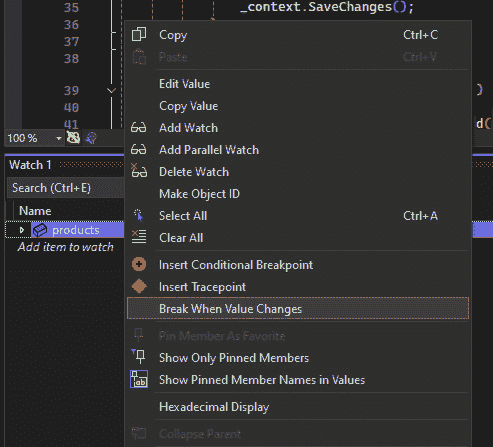

图 2.12 – 当值改变时中断

这将设置一个数据断点，当所选属性的值发生变化时触发。

数据断点受硬件和内核限制。Windows 内核和底层硬件对可以同时设置的数据断点数量有限制。这些限制确保我们的调试体验保持高效和响应。

需要注意的是，数据断点依赖于特定的内存地址，并且变量的地址可能会从一个调试会话变化到下一个调试会话。因此，数据断点在每个调试会话结束时自动禁用。如果我们对一个局部变量设置了数据断点，当函数结束时，断点仍然启用，但内存地址不再适用，这可能导致不可预测的行为。建议在函数结束时删除或禁用此类断点，以避免混淆。

Visual Studio 2019 中为 .NET Core 引入的数据断点标志着这一功能的开始，这使得它在我们使用 .NET Core 3.x 或 .NET 5+ 时成为一个有价值的工具。

### 函数断点

自从 Visual Studio 2012 以来，我们能够在函数上设置断点，这在我们知道函数名但不知道其位置，或者有重载函数时很有用。要设置函数断点，请选择**调试** | **新建断点** | **函数断点**，或者按*Ctrl* + *K*，然后*B*。

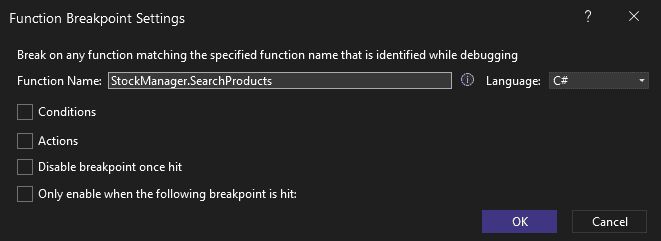

图 2.13 – 函数断点

输入完全限定的函数名，包括重载函数的参数类型，或使用*!*符号指定模块。在这里，我们为**StockManager**类的**SearchProducts**方法设置了一个断点。

### 依赖断点

Visual Studio 2022 介绍了设置依赖断点的可能性，这是一个强大的调试功能，它允许我们仅在另一个特定的断点首先被触发时暂停程序的执行。这在复杂的调试场景中特别有用，例如当我们处理多线程应用程序或当我们想专注于调试应用程序特定部分的代码时。

要设置依赖断点，我们首先需要确定当前断点将依赖的断点。然后，我们将鼠标悬停在断点符号上，选择设置图标，并在**断点设置**窗口中选择**仅当以下断点被触及时启用**。

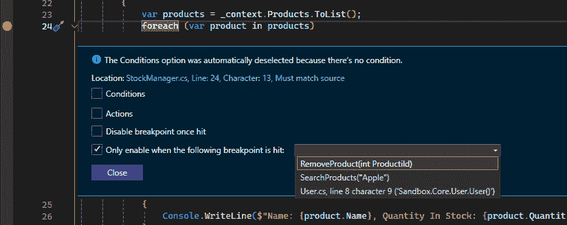

图 2.14 – 仅当以下断点被触及时启用复选框

从下拉菜单中，我们选择我们希望当前断点依赖的先决断点。设置完成后，我们可以关闭对话框。

另一种设置依赖断点的方法是使用右键单击上下文菜单。我们在代码左侧的空白处右键单击，并从上下文菜单中选择**插入依赖断点**。

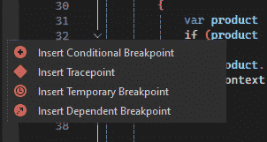

图 2.15 – 插入依赖断点

重要的是要注意，如果我们的应用程序中只有一个断点，依赖断点将不起作用。如果先决断点被删除，依赖断点将被转换为普通行断点。

此功能旨在通过允许我们专注于与当前调试任务相关的代码特定部分来简化我们的调试过程，从而在调试过程中可能节省时间和精力。

### 临时断点

Visual Studio 2022 中的临时断点是一个强大的调试功能，它允许我们作为开发者，在特定位置暂停代码的执行仅一次。一旦在调试会话中命中断点，它将自动禁用自己，这使得它在需要检查特定条件或行为而不需要重复命中相同断点的情况下非常理想。

要设置临时断点，我们首先需要确定当前断点所依赖的断点。然后，我们将鼠标悬停在断点符号上，选择设置图标，并在**断点设置**窗口中选择**一旦命中则禁用断点**。此操作将配置断点在调试会话中命中后自动禁用自己。

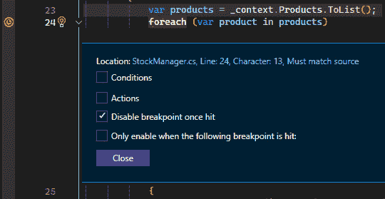

图 2.16 – 一旦命中则禁用断点

或者，我们也可以通过在断点空白处右键单击并从上下文菜单中选择**插入临时断点**来直接设置临时断点。

Visual Studio 2022 中临时断点的引入通过提供一种工具来检查代码中的特定点，而不需要在它们被命中后手动删除或禁用断点，从而增强了我们的调试体验。此功能特别适用于验证假设、检查执行流程或在我们调试过程中验证变量的特定状态。 

现在我们已经了解了所有关于断点的知识，让我们学习如何组织它们。

## 组织我们的断点

我们可以使用标签在**断点**窗口中对断点进行排序和筛选。右键单击断点并选择**编辑标签…**以添加或更改标签。

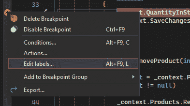

图 2.17 – 编辑标签…

然后，在**断点**窗口中，我们可以检索我们的标签以进行筛选和组织。

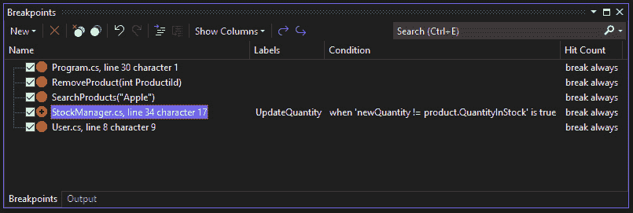

图 2.18 – 带标签的断点

在这个例子中，我给我的条件断点命名为**UpdateQuantity**。

既然我们已经知道根据我们的需求使用哪些断点，让我们看看如何高效地检查数据。

## 检查数据

正如我们之前所看到的，Visual Studio 中的 **监视** 窗口是一个强大的调试工具，它允许我们在程序执行期间监控变量和表达式的值。当我们想要关注代码执行时变量值的变化时，它尤其有用，这在调试复杂的逻辑或性能问题时特别有帮助。

虽然 **监视** 窗口为监控变量提供了一个专用空间，但 Visual Studio 还为我们提供了一种更直接的选择：**数据提示**。这些方便的弹出窗口直接出现在代码编辑器中，直接显示变量值。

要利用 DataTips，只需将鼠标悬停在代码中的任何变量名上。然后，会出现一个工具提示，显示该变量的当前值。

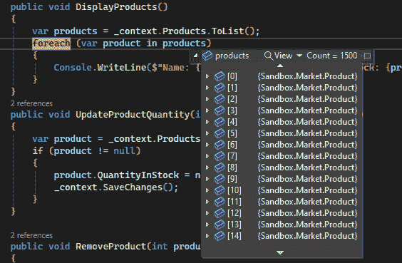

图 2.19 – 显示数据提示

在某些场景中，例如 *图 2.19* 中所示，在大型列表中定位感兴趣的具体项目可能具有挑战性。

### 锁定属性

当查看包含大量复杂数据的数据列表时，可能很难集中精力关注所需的数据部分。解决方案是利用 **可锁定属性** 功能，该功能也存在于 **监视** 窗口中。为了实现这一点，我们展开一个变量并锁定我们感兴趣的属性。例如，如果我们对产品的名称感兴趣，我们可以将其锁定以方便引用。

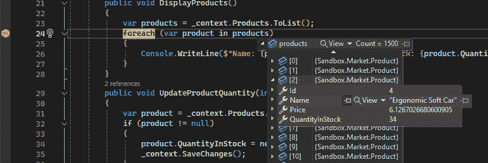

图 2.20 – 锁定名称属性

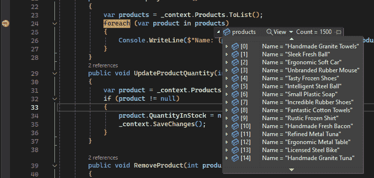

图 2.21 – 带有锁定名称的产品列表

现在，无论何时我们使用 DataTips 检查此对象，即使在 **监视** 窗口中，锁定属性都会替换对象名称，直到我们取消锁定。

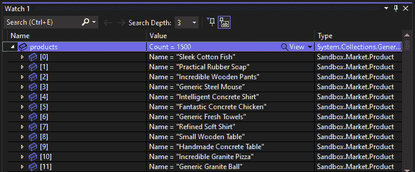

图 2.22 – 监视窗口中的锁定属性

现在，我们可以轻松访问我们想要检查的产品。此外，我们还可以使用位于产品对象旁边的锁定图标来保持弹出窗口可见。

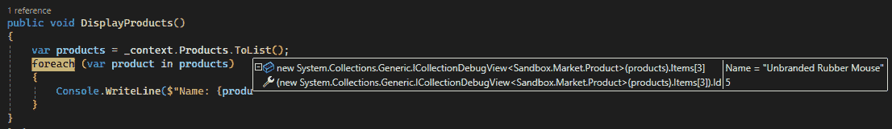

图 2.23 – 数据提示锁定

在这个例子中，我锁定了产品的 **名称** 和 **Id** 属性，这样我们就可以在循环执行期间监控其行为。

### 编辑值

DataTips 使我们能够编辑非只读变量的值，这在验证某些场景时可能很有用。为此，我们只需单击属性值以更新它。

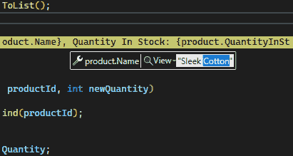

图 2.24 – 在 DataTips 中编辑值

数据提示还允许我们编辑非只读变量的值，这对于验证某些场景可能很有用。此功能也适用于**监视**窗口，尽管它不在**局部**或**自动**窗口中。

虽然在我们自己的代码中进行细致的调试实践至关重要，但有时真正的罪魁祸首隐藏在外部组件中。理解它们的行为是解锁难以捉摸的 bug 和构建真正稳健解决方案的关键。让我们探讨从版本 17.7 开始的 Visual Studio 如何帮助我们在这个方面取得进展。

# 使用自动解耦和外部资源提升调试

Visual Studio 2022 通过引入自动解耦和外部资源显著增强了调试体验。这些功能允许开发者以与自己的代码相同的轻松程度调试外部代码，如 .NET 库或**NuGet**包。

## 自动解耦

自动解耦是一个将编译的二进制代码转换为高级编程语言（如 C#）的功能，使我们能够像处理自己的代码一样检查、调试和修复外部代码中的问题。这在源代码不可用或我们需要检查第三方库中的代码时尤其有用。

### 自动解耦的工作原理

调试器使用**ILspy**反编译器引擎实时反编译外部代码并将其纳入调试会话。调试器首先在我们的机器上查找本地外部资源，然后使用 PDB 文件中的**源链接**或**源服务器**信息来加载源代码。如果这些方法失败，调试器将回退到反编译代码。

### 控制自动解耦

在过去，.NET 包作者可以通过实现**SuppressIldasmAttribute**属性来控制其代码是否可以被反编译。尽管从 .NET 6+ 开始此属性已过时，但 Visual Studio 仍然尊重它。

### 自动解耦的限制

在尝试反编译 .NET 程序集时可能会遇到问题，例如变量名称不准确或不可用变量进行评估。这些限制在调试优化或发布程序集时可能更为明显。

## 外部资源

Visual Studio 中的外部资源功能允许我们调试并单步执行不属于我们解决方案的依赖 NuGet 或 .NET 库中的代码。这是通过在**解决方案资源管理器**中添加外部资源节点来实现的，该节点在调试期间出现，并显示包含源链接或源服务器信息的已加载符号的管理模块的源。

我们可以在**解决方案资源管理器**中找到它们位于解决方案顶部节点下方：

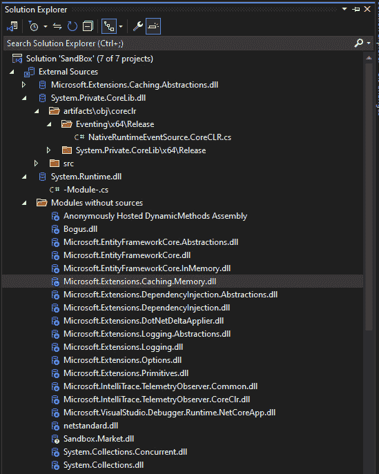

图 2.25 – 外部资源节点

这里有一份关于利用此功能的全面指南：

+   **使用外部源**：外部源节点组织来自不同调用栈的反编译外部代码模块，使我们能够在其中导航和设置断点。这使得调试外部代码与调试我们自己的代码一样无缝。

+   **启用外部源**：要调试外部源，我们可能需要启用**加载所有模块**，以便调试器为所有模块加载符号。如果需要，我们还可以通过从顶部菜单的**调试** | **窗口** | **模块**进入，从**模块**窗口手动加载模块。

+   **下载源代码**：如果我们双击外部源节点中的某个项目，可能会提示从服务器下载源代码。接受后，我们可以在编辑器中查看源代码。

自动反编译和外部源使得我们更容易调试外部代码，这在处理复杂库或尝试解决第三方代码中的问题时尤其有益。这些功能简化了我们的调试过程，减少了我们在理解和导航外部代码上花费的时间。包作者可以使用**SuppressIldasmAttribute**属性来防止其代码被反编译，从而确保他们对其知识产权的控制。然而，调试反编译代码可能并不总是像调试源代码那样准确，可能会出现诸如变量名不准确或变量不可用等问题。此外，单步执行反编译代码可能并不总是与原始源代码对齐。

通过利用这些功能，Visual Studio 2022 提供了更全面的调试体验，使我们能够更有效地诊断和解决应用程序中的问题。

# 并发调试

多线程是一种技术，其中进程分为多个线程，从而允许更好的性能，尤其是在具有多个处理器或核心的系统上。然而，管理多个线程可能具有挑战性，因为它们可能需要并发访问共享资源，从而导致潜在的死锁等错误。调试此类问题可能既困难又耗时。

在本节中，我们将学习如何通过使用**线程**窗口和处理并行调试来解决这个问题。

为了做到这一点，我们将创建一个简单的控制台应用程序，调用十个简单的线程。以下是我们将用于示例的代码：

```cs
for (int i = 0; i < 10; i++)
{
    CreateThreads();
}
static void CreateThreads()
{
    Dummy dummy = new Dummy();
    Thread dummyCaller = new Thread(
        new ThreadStart(dummy.Instance)
    );
    dummyCaller.Start();
    Console.WriteLine("New thread called "
        + "starting the new Dummy thread.");
}
public class Dummy
{
    static int count = 0;
    public void Instance()
    {
        Console.WriteLine(
            "Dummy.Instance is running on another
            thread.");
        int data = count++;
        Thread.Sleep(3000);
        Console.WriteLine(
            "The instance method called by the worker
            thread has ended. " + data);
    }
}
```

代码演示了在 C#中创建和执行多个线程的过程，每个线程运行一个**Dummy**类的**Instance**方法实例。

首先，我们将在**Instance**方法上的**Thread.Sleep(3000)**处设置断点，并以调试模式启动我们的项目。

我们可以通过在调试工具栏上激活**显示源代码中的线程**按钮来跟踪线程。

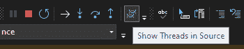

图 2.26 – 显示源代码中的线程

这将在窗口的左侧显示**线程创建者图标**。当我们悬停在它们上面时，我们可以查看每个停止线程的名称和线程 ID 号。

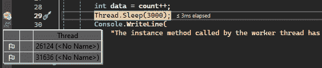

图 2.27 – 线程列表

通过右键单击其中一个线程，我们可以访问不同的操作类型以在线程之间导航，如下所示：

+   **标记** / **取消标记**

+   **冻结** / **解冻**

+   **切换到线程**

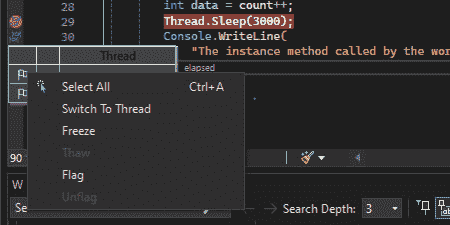

图 2.28 – 操作线程

当我们标记线程时，它使我们能够专注于一个线程，同时忽略其他线程。

为了解决并发问题并控制线程执行工作的顺序，我们必须使用**冻结**和**解冻**功能，允许我们挂起和恢复线程。

此外，**切换到线程**功能允许我们在逐步调试中从一个线程跳转到另一个线程。

关于常见的调试过程，Visual Studio 提供了一个名为**并行监视**的**监视**窗口。我们可以通过点击顶部菜单栏的**调试** | **窗口** | **并行监视** | **并行监视 1**来访问它。

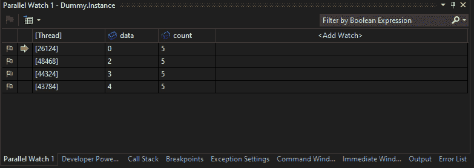

图 2.29 – 并行监视

在这里，我们可以通过在**<添加监视>**单元格中输入它们的名称来添加数据到监视。此外，我们可以通过双击我们感兴趣的线程行轻松地切换到线程。右键单击允许我们访问**标记**和**冻结**功能。位于左上角的标记按钮使我们能够过滤并仅显示标记的线程。

Visual Studio 提供的另一种高效跟踪线程的视图是**并行堆栈**窗口。要访问它，我们使用调试菜单，可以通过点击**调试** | **窗口** | **并行堆栈**来访问。

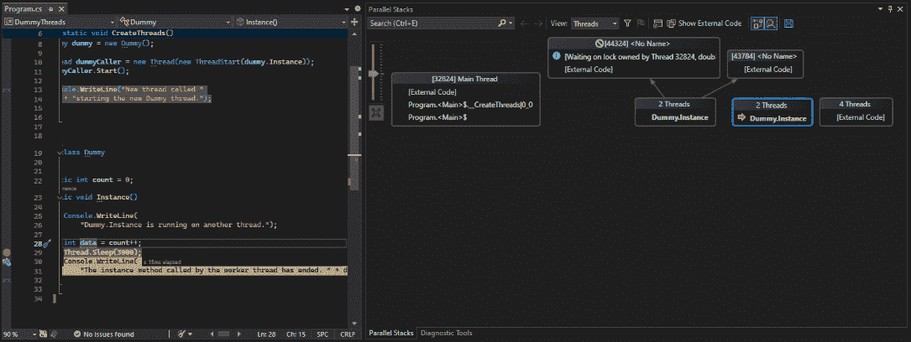

图 2.30 – 并行堆栈

此窗口提供了**线程**和**任务**视图，显示每个线程的调用堆栈信息。当前线程由一个黄色箭头指示，使我们能够轻松地跟踪每个线程的路径。这些信息也可以通过转到**调试** | **窗口** | **线程**来以列表格式在**线程**窗口中查看。

最后，我们可以利用条件断点，这允许我们根据各种条件设置断点，例如线程名称或 ID。当需要对每个线程独有的数据进行条件设置时，这个功能特别有用。在调试过程中，尤其是在关注特定数据值而不是单个线程时，这是一个常见的做法。

现在我们已经探索了 Visual Studio 2022 关于调试的技术和工具，让我们看看如何通过利用远程调试功能来解决著名的“在我的笔记本电脑上它工作”的问题。

# 远程调试

远程调试是 Visual Studio 中的一个强大功能，允许我们调试在不同机器、设备或环境中运行的应用程序。当我们需要解决在生产环境中或在我们无法本地访问的不同平台上发生的问题时，这尤其有用。

为了有效地利用此功能，我们需要确保在本地和远程机器上都安装了 Visual Studio。我们需要通过安装兼容的 Visual Studio 版本并允许通过防火墙设置进行远程连接来配置远程机器。

在本地机器上，我们通过指定远程机器的地址和（如果需要）凭据，在 Visual Studio 的设置中启用远程调试。为此，我们转到我们想要调试的应用程序的项目属性，并导航到 **调试** 选项卡。

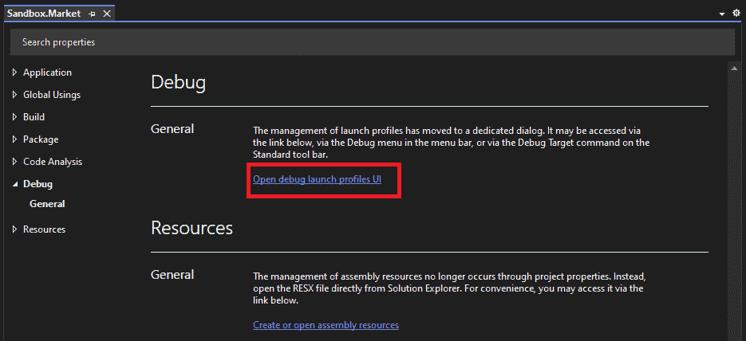

图 2.31 – 项目属性 | 调试选项卡

在这里，我们可以点击 **打开调试启动配置文件 UI** 链接。一旦进入 **启动配置文件** 窗口，我们可以勾选 **使用远程机器** 复选框，这将显示两个额外的字段，允许我们配置远程连接：

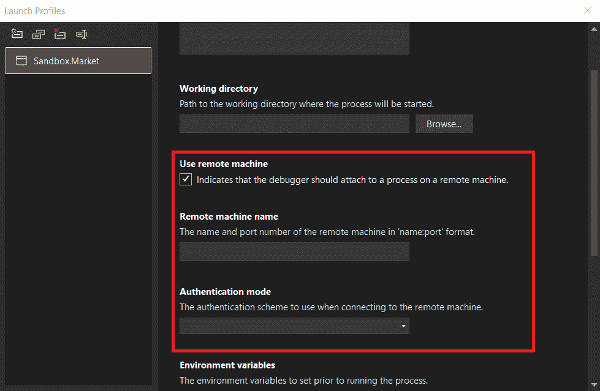

图 2.32 – 使用远程机器复选框

在一个关键情况下，如果在实时生产服务器上调试 Web 应用程序，能够访问生产服务器的调试器变得至关重要。

将应用程序部署到生产服务器，确保安装了所有必要的组件。之后，我们需要在服务器上配置 Visual Studio 以进行远程调试，并相应地调整防火墙设置。在本地机器上的 Visual Studio 中，通过输入远程机器的地址和凭据来附加到远程进程。

然后，我们可以调试应用程序，选择 Web 应用程序的过程，并像往常一样进行调试，包括设置断点和检查变量。最后，我们可以在调试过程中重现问题，一旦确定问题，就修复它，并部署更新后的应用程序。

远程调试简化了在生产环境类似环境中诊断问题，而不会干扰实时流量。访问生产数据有助于理解问题的上下文。应实施安全措施以保护敏感信息。注意性能影响，在非高峰时段或在测试环境中安排调试。利用远程调试通过解决传统方式无法访问的环境中的问题，提高了应用程序的可靠性，增强了整体质量和稳定性。

通过使用远程调试，我们可以有效地诊断和修复在无法直接访问代码或数据的环境中发生的问题，从而提高我们应用程序的可靠性和质量。

# 摘要

本章深入探讨了 Visual Studio 2022 中强大的高级调试策略世界，为您提供了应对甚至最复杂代码的有效技能。我们探讨了各种调试工具和技术，这些对于识别和解决代码中的问题至关重要。

我们从掌握导航代码的艺术开始，重点关注断点、单步执行模式和调用栈，这些都是定位错误来源的关键。本章还介绍了实时代码修改的概念，允许您通过诸如“编辑并继续”和“热重载”等功能，动态修复错误并实时实验代码更改。我们不仅限于调试自己的代码；还探讨了自动反编译和外部源的优势，这些功能使得外部库和 NuGet 包的调试变得无缝。此外，本章还涵盖了远程调试技术，这是一种允许您在不影响实时流量的情况下，在生产环境类似环境中诊断和修复问题的技术。通过掌握这些高级调试技术，您可以更快地解决复杂错误，从而减少开发时间和挫折。

在下一章中，我们将根据第一章中看到的 TDD 循环继续我们的旅程。在用调试修复我们的代码之后，我们将深入探讨将代码塑造成最佳形态的艺术。我们将开始一段在 Visual Studio 2022 中进行高级代码分析和重构的旅程。
