# 第三章：高级代码分析和重构

本章通过专注于 Visual Studio 2022 中的高级代码分析和重构技术，提升了我们的技能。

通过 Roslyn 驱动的静态代码分析来理解代码分析的基础，为识别漏洞和确保代码正确性奠定了坚实的基础。此外，借助内置的 IntelliCode，它利用机器学习来优化代码库，你将学习如何有效地提高可维护性和可扩展性。

除了这些基础概念之外，我们还将深入探讨代码指标的重要性，为你提供评估项目可维护性和安全状态的有价值见解。通过使用这些指标，你将获得所需的战略远见，以便做出明智的决定并对代码库进行有针对性的改进。

在本章中，我将通过实际的代码审查重构案例研究来阐述这些概念。通过探索 Visual Studio 工具的实际应用，你不仅能够掌握理论概念，还能了解如何在日常开发工作中有效地实施它们。

到本章结束时，你将掌握提升代码质量、增强安全实践和简化维护工作所需的知识和工具，所有这些都在熟悉的强大环境中完成，即 Visual Studio。

在本章中，我们将涵盖以下主要主题：

+   理解 Visual Studio 中的代码分析

+   利用静态代码分析进行质量保证和安全

+   利用 IntelliCode 进行代码重构

+   使用代码指标进行可维护性和安全性

+   重构案例研究

# 技术要求

在编写本章时，我使用了以下版本的 Visual Studio：

+   Visual Studio Enterprise 2022，版本 17.12.0

+   预览 1.0

本章的代码文件可以在[`github.com/PacktPublishing/Mastering-Visual-Studio-2022/tree/main/ch03`](https://github.com/PacktPublishing/Mastering-Visual-Studio-2022/tree/main/ch03)找到

# 理解 Visual Studio 中的代码分析

首先，让我们讨论 Visual Studio 和 .NET 如何分析我们的代码。

**Visual Studio 2022 中的代码分析**旨在帮助我们提高代码质量。它提供了一些工具和指标来分析和增强代码的可维护性、可读性和性能。通过识别潜在问题并提出改进建议，它旨在简化开发过程，减少错误，并提高整体代码质量。

Visual Studio 2022 可以通过两种主要方式执行代码分析：

+   **遗留分析（FxCop 静态分析）**：这种方法分析编译后的代码以识别问题。这是一个过时的方法，它只在代码编译后进行检查。

+   **基于.NET 编译器平台的代码分析器**：这些是现代分析器，在您键入时实时分析您的代码。它们是动态的，可以提供实时反馈，使在开发早期阶段捕捉和修复问题变得更容易。

现在，让我们深入了解.NET 编译器平台，也称为**Roslyn**，它彻底改变了 Visual Studio 2022 中的代码分析能力。Roslyn 是一个平台，它将 C#和 Visual Basic 编译器的代码分析能力暴露给开发者。它提供了一套 API，允许创建专注于代码分析、重构和转换的工具和应用程序。

这里是 Roslyn 的一些好处：

+   **丰富的语言支持**：Roslyn 支持 C#和 Visual Basic 语言，提供全面的语言特性和语法支持，用于构建自定义的开发者工具和扩展。

+   **程序化代码操作**：使用 Roslyn，我们可以通过.NET API 程序化地分析、重构和生成代码，使它们能够自动化重复性任务，并提高代码质量和一致性。

+   **IDE 可扩展性**：Roslyn 允许开发自定义的 IDE 扩展和工具，增强 Visual Studio 和其他.NET IDE 的功能，扩展其能力以支持专门的流程和开发场景。

+   **开源社区**：Roslyn 是一个托管在 GitHub 上的开源项目，它促进了开发社区的协作和贡献。开发者可以向 Roslyn 代码库贡献增强功能、错误修复和新功能，推动平台创新和进化。

Roslyn 显著降低了创建专注于代码的工具和应用程序的难度，为包括元编程、生成和转换代码、将交互式功能集成到 C#和 Visual Basic 语言中以及将这些语言嵌入到特定领域在内的各个领域的创新铺平了道路。

## Roslyn 的工作原理

Roslyn 通过将其分解为不同的组件而彻底改变了传统的编译器结构。此外，它通过镜像编译器内部过程的 API 提供对编译器管道每个阶段的访问。

这里是如何组织这种映射的说明：

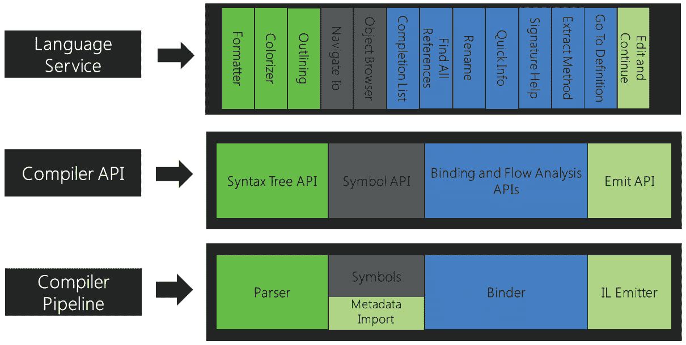

图 3.1 – 编译器 API 和编译器管道

编译器 API 和编译器管道提供对几个关键阶段的访问：

+   **解析阶段**：源代码经过标记化和解析，生成遵循语言语法的语法树。

+   **声明阶段**：从源代码和导入的元数据中分析声明以构建命名符号。这些符号组织成一个层次符号表。

+   **绑定阶段**：代码中的标识符与符号匹配，生成反映编译器分析的语义模型。

+   **Emit Phase**：编译器累积所有相关信息，并以汇编的形式输出。这个汇编通过一个 API 表示，该 API 生成**中间语言**（**IL**）字节码。

这种模块化方法允许全面访问编译器管道每个阶段的详细信息。它赋予开发者丰富的代码分析和操作能力。三个阶段的编译器 API（语法树、语义模型和工作区级别）在促进稳健的代码分析方面尤其重要。

首先，**语法树**作为源代码结构的基石表示，包括词汇和语法元素。它们在软件开发的各种阶段都至关重要，包括编译、代码分析、绑定、重构和 IDE 功能。语法树提供了对源信息的完整反映，与原始文本保持一致，确保不可变性和线程安全。这促进了源代码的自然操作，而无需直接进行文本编辑。

转向语义层面，**语义模型**深入挖掘代码背后的含义。它在一个源文件中捕获所有语义细节，揭示了符号引用、表达式类型、诊断（错误和警告）、源区域内的变量流以及其他细微方面。通过封装语言规则，该模型使得源代码中的程序元素与预编译库中的元素之间的区别更加清晰。

在工作区级别，一个中心枢纽组织整个解决方案的信息，简化了代码分析和重构过程。这一层将项目数据整合到一个统一的对象模型中，无需文件解析、配置调整或项目间依赖关系管理即可无缝访问编译层对象模型。关键的是，它为集成开发环境（如 Visual Studio）中稳健的代码分析和重构工具的发展奠定了基础。

## Visual Studio 2022 如何使用 Roslyn？

Visual Studio 2022 使用 .NET 编译器平台（Roslyn）在开发者编写代码时实时分析并重构 C# 或 Visual Basic 代码。此过程集成到开发环境中，提供对代码样式、质量、可维护性、设计和其他问题的即时反馈。在接下来的章节中，我们将学习 Visual Studio 2022 如何利用 Roslyn 进行分析和重构。

### 使用 Roslyn 分析器进行分析

Visual Studio 2022 包含内置的代码样式分析器（IDExxxx，例如，IDE0001）和代码质量分析器（CAxxxx，例如，CA1822），它们在所有打开的文件的设计时检查你的代码。这些分析器是 .NET 5 SDK 的一部分，默认启用。

我们可以将外部分析器，如**StyleCop**、**Roslynator**、**XUnit Analyzers**和**SonarAnalyzer**，作为 NuGet 包或 Visual Studio 扩展安装。这些分析器扩展了内置功能，允许进行更专业的检查和规则。

此外，我们使用**带有代码修复的 Analyzer**模板创建自己的自定义分析器，该模板包括一个 VSIX 扩展和一个用于分析器的独立项目。这可以通过 NuGet 进行部署。这允许我们创建自己的自定义分析器。分析器可以在匹配的代码下方显示波浪线并在错误列表中添加条目，可选的代码修复。这种方法允许更集成的开发体验，在 IDE 中直接提供反馈和修复。

对于不需要与 Visual Studio 集成的分析场景，例如在构建服务器上，我们可以使用**独立代码分析工具**模板。此工具打开解决方案工作区并分析项目，无需在项目中或 IDE 中安装 VSIX 扩展或 NuGet 包。

### 使用 Roslyn 进行重构

Roslyn 的语法 API 将 C#代码解析成节点树（类节点、方法节点等），使得对代码结构的详细操作成为可能。这个 API 对于自动化代码重构至关重要，例如自动化应用程序迁移到.NET Core。

**SyntaxEditor**类用于对代码树应用更改。它确保当一个节点被替换或删除时，所有子节点都会相应地更新，避免冲突和异常。这对于需要根据某些模式或规则修改代码的脚本重构特别有用。

Visual Studio 中的**代码重构**模板允许创建一个与 IDE 中的**快速操作**菜单集成的 VSIX 扩展。这使得开发者可以直接从编辑器应用快速代码修复，而无需定义额外的分析器 ID 或在错误列表中显示条目。

现在我们已经了解了 Visual Studio 如何使用 Roslyn 帮助我们分析和重构代码，让我们更深入地探讨如何使用静态代码分析进行质量保证和安全。

# 利用静态代码分析进行质量保证和安全

对于目标.NET 5 或更高版本的 Visual Studio 项目，默认启用了内置的**代码质量分析**功能。但是，我们可以通过在**.csproj**文件中添加并设置为**true**的**EnabeNETAnalyzers**属性来为我们的旧.NET 项目启用它。

静态代码分析促进了开发团队内部的持续改进和协作文化。通过提供可操作的建议和见解，这些工具促进了建设性的代码审查，促进了知识共享，并最终提高了开发者的技能和熟练度。

## 理解如何在 Visual Studio 中使用代码分析

代码质量分析将检查我们的代码库的安全性、性能、设计和其他潜在改进领域。默认情况下，分析会自动运行，因此我们可以在键入时通过代码下的波浪线或错误列表窗口直接看到错误、警告和信息。

如果我们编写的代码像*图 3.2*中所示的那样，我们将看到波浪线出现：

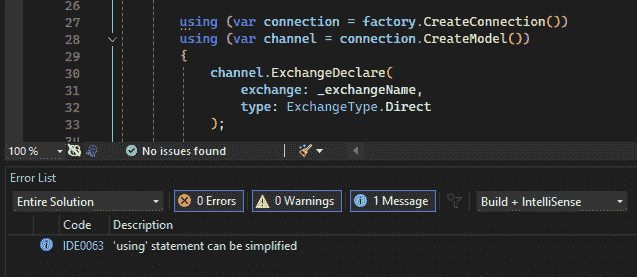

图 3.2 – 信息波浪线

在此示例中，分析器通知我们我们的**using**语句可以根据 C# 8.0 引入的功能进行简化。

分析规则组织到以下类别：设计、文档、全球化、可移植性和互操作性、可维护性、命名、性能、可靠性、安全性、样式和用法。您可以在 Microsoft 文档中找到有关每个规则类别的详细信息：[`learn.microsoft.com/en-us/dotnet/fundamentals/code-analysis/categories`](https://learn.microsoft.com/en-us/dotnet/fundamentals/code-analysis/categories)。

每个规则都有一个严重级别，用于确定其行为：

+   **默认**：这是已启用但未设置特定严重性的规则的默认严重级别。这通常意味着规则是激活的，并将报告问题，但确切的行为（例如，是否被视为警告、错误或建议）取决于规则的配置或工具的默认行为。

+   **错误**：当规则设置为错误严重级别时，任何违反规则的行为都将被报告为错误。这意味着代码将不会编译，直到问题得到解决。错误通常用于在代码被认为正确之前必须修复的关键问题。

+   **警告**：设置为警告的规则将报告违规行为为警告。警告不会阻止代码编译，但通常用于指示应解决以改进代码质量或可维护性的潜在问题。警告可以配置为在特定构建配置中视为错误，允许开发者对生产代码强制执行更严格的标准。

+   **建议**：建议严重级别的规则报告的问题不是关键的，但可以改进代码。这些规则通常用于风格问题或不是必需但建议的做法。建议通常与自动应用推荐更改的代码修复结合使用，使开发者更容易提高代码质量。

+   **静默**：设置为静默的规则将不会报告任何问题，实际上禁用了该规则。这对于与你的项目无关的规则或当你想暂时禁用规则而不从配置中删除它时非常有用。

+   **无**：此严重性级别类似于静默，但用于明确表示规则不应应用。这是一种明确表示规则有意禁用的意图的方式。

让我们看看如何使用严重性级别来提高我们项目的质量。

## 调整严重性级别

我们可以通过通过**错误列表**右键单击建议并选择**设置严重性**来调整规则的严重性级别。

这使我们能够优先考虑并自定义 Visual Studio 如何呈现和处理由规则识别的潜在问题。根据项目需求和开发环境，调整严重性级别可以集中关注关键问题，同时最大限度地减少对影响较小问题的干扰。

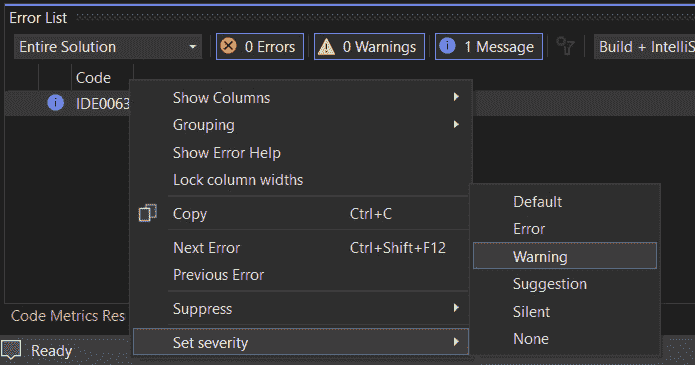

图 3.3 – 设置严重性选项

此操作将在我们的解决方案根目录中生成一个**.editorconfig**文件，其中包含覆盖的严重性规则，我们可以与我们的团队共享以确保一致的编码实践。

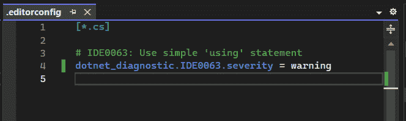

图 3.4 – 生成的 .editorconfig 文件

调整严重性级别的另一种方法是通过**灯泡**上下文菜单，它还通过快速操作提供代码修复。

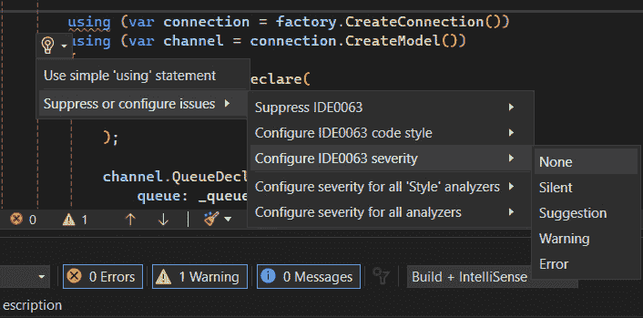

图 3.5 – 使用灯泡图标设置严重性

在代码审查期间，我们可能会遇到如图 3.6* 所示的可以改进的实践。

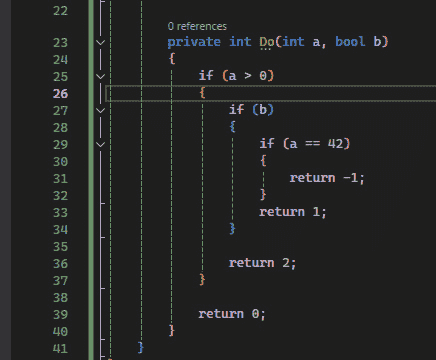

图 3.6 – 金字塔代码

例如，一个金字塔代码结构可能不会触发波浪线，但 IDE 可能会建议简化一个**if**语句（**IDE0046**）。如果您想强制执行特定的编码标准，可以将此规则的严重性级别设置为**错误**。

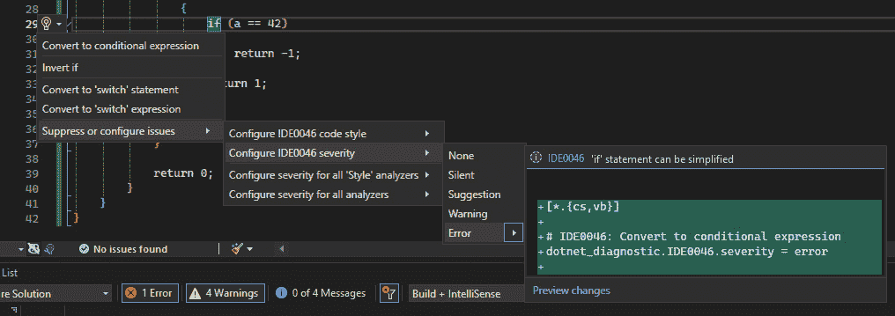

图 3.7 – 更改 IDE0046 的严重性级别

同样，当我们和我们的团队成员遇到此规则时，我们被迫重构我们的代码。我们可以注意到 Visual Studio 为此规则提供了四种代码修复：

+   **转换为条件表达式**：此修复将**if-else**语句转换为条件（三元）表达式。

+   **反转 if**：此修复反转 if 语句的条件并交换代码块。

+   **转换为 switch 语句**：此修复适用于您有基于相同变量或表达式的多个条件时。它将**if-else**链转换为**switch**语句，这对于处理基于相同变量的多个条件来说更易读且易于维护。

+   **转换为 switch 表达式**：与转换为**switch**语句类似，此修复将**if-else**链转换为**switch**表达式，这是一种更简洁且功能更强大的处理多个条件的方法。它从 C# 8.0 开始可用。

为了更好的可读性，我更喜欢在这个例子中使用 Invert if，但 IDE0046 规则强制将其转换为条件表达式。请记住，这只是一个例子，我们可以根据我们的需求调整解决方案中分析规则的程度。

正如我们所见，调整严重程度级别会生成一个包含我们自定义配置的**.editorConfig**文件。让我们探索如何生成这样的文件，以便轻松地将我们的 Visual Studio 设置与团队共享。

## 生成 .editorconfig 文件

如果你在团队环境中工作，我建议你生成一个可以根据你的需求进行调整的**.editorConfig**文件。

要生成一个**.editorconfig**文件，我们在我们的解决方案上*右键单击*，然后在上下文菜单中选择**添加** | **新建** **Editor Config** 。

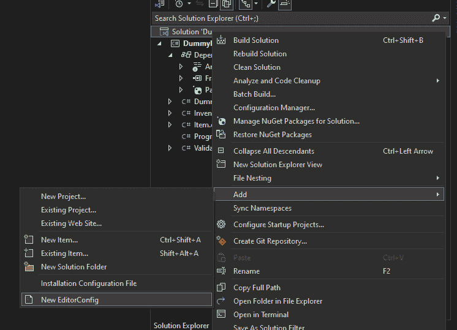

图 3.8 – 新的 EditorConfig

这将生成一个新文件，其中将包含我们 IDE 的所有配置。在这个文件中，我们将检索**分析器**的所有规则。

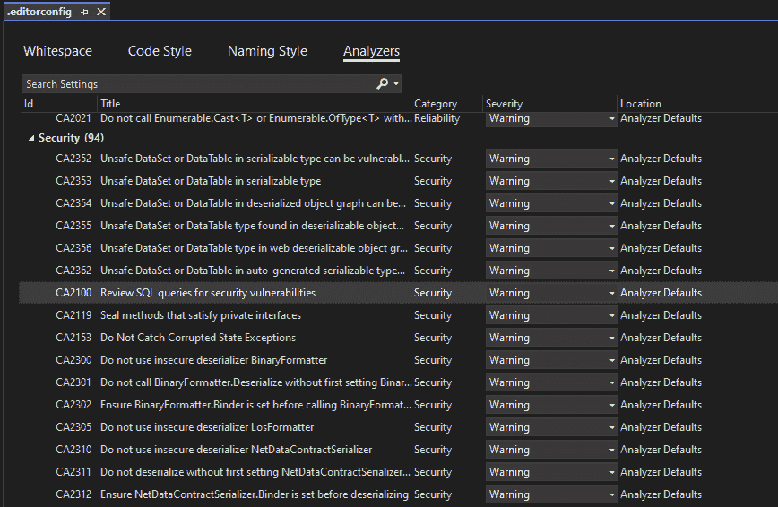

图 3.9 – EditorConfig 分析器

这使我们能够轻松列出并设置每个规则的严重程度级别。

在这里，我们可以看到 Visual Studio 分析器提供了关于安全的 94 条规则。这些规则涵盖了 OWASP Top Ten 的所有主题，以及更多。OWASP Top 10 作为开发者和网络应用安全的一个广泛认可的参考文档，它基于行业内的集体协议，突出了网络应用面临的最重大的安全漏洞。

进一步阅读

我们可以在 Microsoft 文档中找到所有安全规则：

[`learn.microsoft.com/en-us/visualstudio/code-quality/security-rules-rule-set-for-managed-code?view=vs-2019&viewFallbackFrom=vs-2022`](https://learn.microsoft.com/en-us/visualstudio/code-quality/security-rules-rule-set-for-managed-code?view=vs-2019&viewFallbackFrom=vs-2022) .

现在我们已经学习了如何使用静态代码分析，让我们深入了解一个新特性。确实，Visual Studio 2022 现在将 IntelliCode 作为一个内置特性集成，对所有订阅者可用。让我们探索它是如何工作的，以及我们如何利用其功能。

# 利用 IntelliCode 进行代码重构

作为开发者，我们需要不断重构我们的代码来改善其结构、可读性或性能，尤其是在我们使用 TDD（测试驱动开发）时，需要关注第一章中解释的流程。

一个显著提高了我们重构过程的工具是**IntelliCode**，它使用人工智能和机器学习提供智能建议并自动化重复性任务。IntelliCode 现在已集成到 Visual Studio 2022 的 C#中。在本节中，我们将探讨使用 IntelliCode 进行有效代码重构的策略，借鉴我们的经验和洞察。

首先，我们需要确保我们在 Visual Studio 中安装了 IntelliCode，通过顶部菜单栏的 **选项** 菜单进行，即 **工具** | **选项** | **IntelliCode** 。

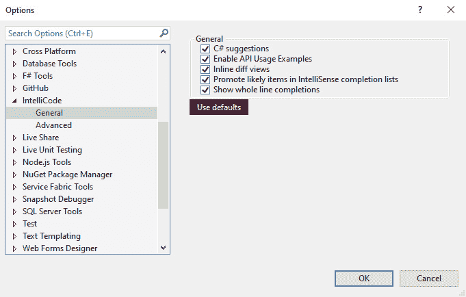

Figure 3.10 – IntelliCode Options

如果你在 **选项** 菜单中找不到 IntelliCode，请通过 Visual Studio 安装程序安装它，勾选 **IntelliCode** 复选框。

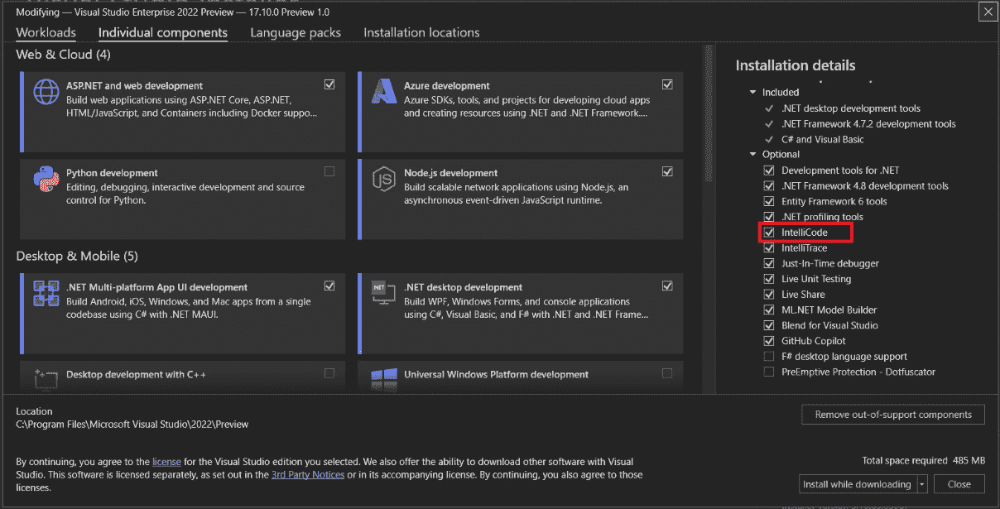

Figure 3.11 – Visual Studio Installer IntelliCode

现在，我们已经确保 IntelliCode 在 Visual Studio 中已启用，让我们探索它如何增强我们的编码体验。

## 使用整行自动补全预测代码

IntelliCode 是在 Visual Studio 2022 中引入的，提供带有建议的整行自动补全。此功能旨在简化开发过程，提高代码质量，并提高生产力。

以下图像展示了整行自动补全：

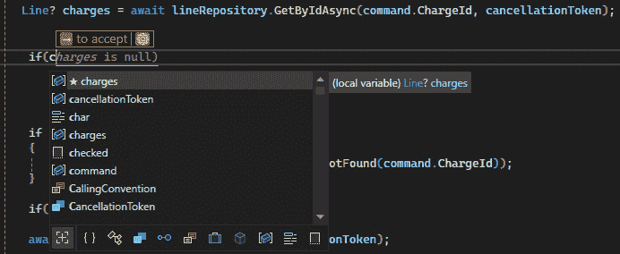

Figure 3.12 – Whole-line autocompletion from typing

在 *Figure 3* *.12* 中，我们可以看到根据上下文生成的 *灰色文本行预测*。该预测基于大量公共、开源的 GitHub 仓库。IntelliCode 的建议与 IntelliSense 中的建议无缝集成。这些 IntelliCode 建议通过位于建议左侧的 *黑色星号* 图标突出显示，易于识别。

如果我们选择了一个不同于整行自动补全提供的建议，IntelliCode 将根据我们的选择生成一个新的预测。

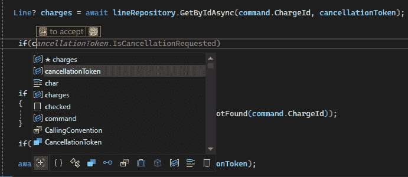

Figure 3.13 – Whole-line autocompletion from IntelliSense

要接受整行自动补全，我们只需按 *Tab* 键或点击出现在建议上方的 *箭头*。我们可以按 *Esc* 或 *Delete* 键来取消它。

IntelliCode 在本地机器上运行，提供整行自动补全，这增强了代码安全性和对属性的考虑，与 ChatGPT 和其他在线 AI 预测工具不同，这些工具是在行内生成的。

现在，我们已经看到 IntelliCode 如何帮助我们生成代码，让我们探索它如何通过提供直接访问文档来帮助我们理解代码。

## 访问 GitHub 文档

当使用外部库或代码块时，我们可能会遇到不知道如何高效使用的函数。IntelliCode 提供了一个有用的功能，称为 **API 使用示例**，它提供了如何有效使用这些函数的实际示例。

要激活此功能，请转到 **选项** 菜单（见 *Figure 3* *.10* ）并勾选 **启用 API** **使用示例** 。

现在，我们可以将光标悬停在想要了解更多信息的函数上，我们会看到一个标记为 **GitHub 示例** **和文档** 的链接：

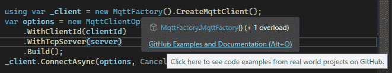

图 3.14 – GitHub 示例和文档链接

点击链接（**GitHub 示例和文档**）后，会打开一个侧边固定窗口，展示通过几个 GitHub 仓库实现方法示例：

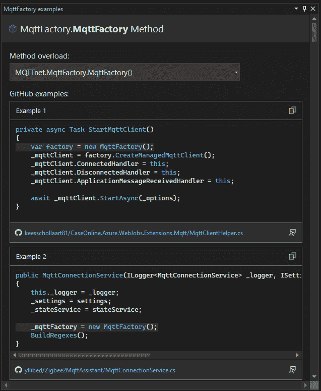

图 3.15 – GitHub 示例

此功能帮助我们根据其他项目中实现的示例来规划重构，利用其他开发者的经验。

在下一节中，让我们深入了解代码度量，这些度量指向我们项目中需要重构以改善可维护性和质量的部分。

# 代码度量、可维护性和安全性

作为开发者，我们依赖**代码度量**来评估软件系统的质量。这些定量措施为我们代码的各个方面提供洞察，如复杂度、可维护性和安全性。通过理解这些度量，我们可以识别可能需要改进的区域，确保我们的代码库保持可管理、安全且高效。

## 理解度量

Visual Studio 允许我们生成包含度量值列表的报告，如下所示：

+   **可维护性指数**评估代码的可维护性，给出 0 到 100 的分数，分数越高表示可维护性越好。评分用颜色编码：绿色（20-100）表示*良好*，黄色（10-19）表示*中等*，红色（0-9）表示*低*。

+   **循环复杂度**通过计算代码的不同流程路径来衡量代码的结构复杂度。高复杂度表明需要更多的测试以实现良好的覆盖率并降低可维护性。

+   **继承深度**衡量有多少个类相互继承，数值越低越好，以防止广泛的变化。

+   **类耦合**衡量类之间的连接紧密程度，高耦合表示设计不佳。

+   **源代码行数**计算源文件中的所有行，而**可执行代码行数**近似可执行行的数量。

现在我们已经理解了度量，让我们深入了解如何通过 Visual Studio 使用它们。

## 在 Visual Studio 2022 中使用代码度量

Visual Studio 2022 提供了一套强大的工具用于分析代码度量。以下是两种使用它们的方法：

+   在顶部菜单栏中选择**分析** | **计算代码度量**，并选择您是否要在特定项目或解决方案上计算度量。

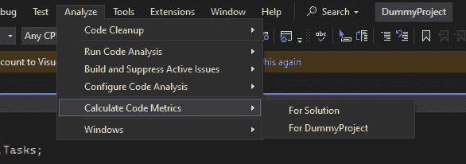

图 3.16 – 从顶部菜单计算代码度量

+   或者，您可以直接在想要测量的解决方案或项目上*右键单击*，然后从上下文菜单中选择**分析和代码清理** | **计算** **代码度量**

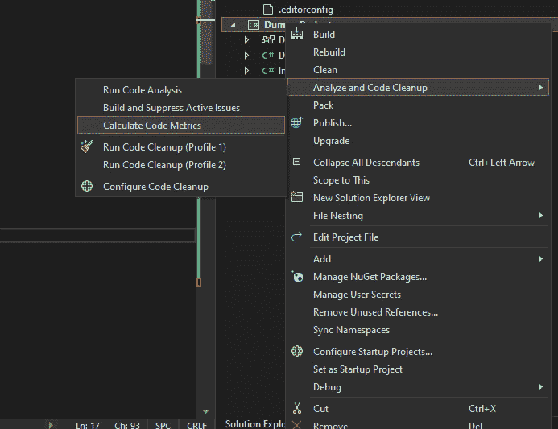

图 3.17 – 为项目计算代码度量

分析完成后，将打开一个窗口显示代码度量结果：

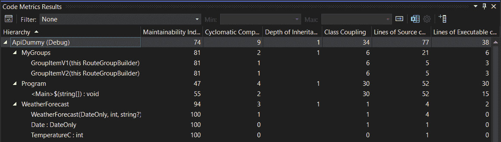

图 3.18 – 代码度量结果

在这里，我们可以查看诸如 **循环复杂度**、**继承深度**、**类耦合**、**源代码行数** 和 **可执行代码行数** 等度量。我们可以应用自定义过滤器，将度量结果限制在最小值和最大值之间。此外，为了更好地处理数据，我们可以将代码度量结果导出到 Excel 文件中。

理解和利用代码度量对于维护高质量的软件至关重要。Visual Studio 2022 提供了强大的工具来分析代码度量，帮助开发者识别和解决与安全和可维护性相关的问题。通过关注这些方面，开发者可以确保他们的代码库保持稳健、安全且易于管理。

在本节中，我们已导航到识别需要改进的代码部分的工具，并使用 IntelliCode 进行重构。在最后一节中，让我们深入了解重构的实际用例。

# 重构案例研究

**重构**涉及在不影响代码初始功能的情况下重构代码。目标是通过对代码进行增量修改来增强内部结构，而不影响代码的外部行为。为了检查代码的完整性，我们使用单元测试（参见本书的*第一章*）。重构是测试驱动设计过程的最后一步。

本节展示了一段包含不良实践的代码片段。我们将看到如何借助 Visual Studio 高效地修复这些问题。请记住，规范和实践必须与所有团队讨论，并且可能因团队而异。

## 处理常见的不良实践

这里有一段具有不良命名和可以轻松简化的条件检查的代码：

```cs
    public static bool canregister(int age)
    {
        if(age > 18)
        {
            return true;
        }
        else
        {
            return false;
        }
    }
```

我们将使用 *灯泡* 来修复由实时代码分析器提供的命名违规（**IDE1006**）：

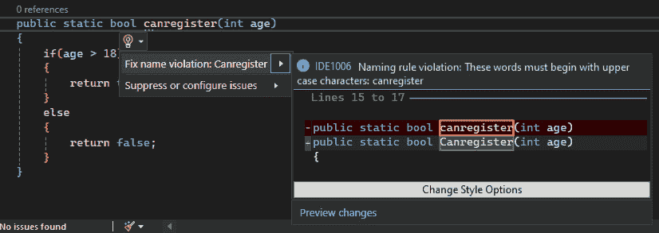

图 3.19 – 修复命名违规

之后，我们可以使用 *灯泡* 简化年龄检查：

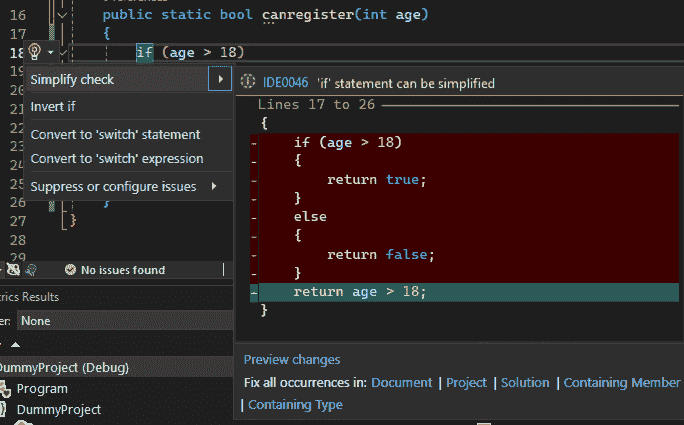

图 3.20 – 简化年龄检查

我们可以看到，**预览更改**窗口允许我们在解决方案的不同级别中更积极地修复所有出现的问题。

接下来，由于我们的方法只包含 **return**，我们可以通过将其转换为 **表达式体**（定义方法体的简洁方式）来提高可读性。我们将使用 *螺丝刀* 来完成这项工作：

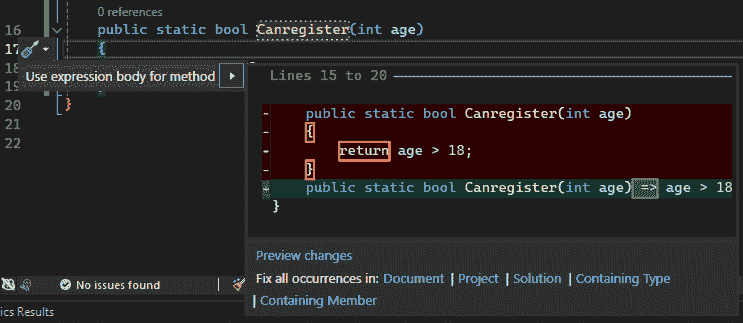

图 3.21 – 使用表达式体

最后一个需要处理的不良实践是使用魔法数字。魔法数字指的是在源代码中直接出现的没有解释其意义或目的的数值字面量。没有适当的上下文，它可能很难更改或理解。因此，我们将引入一个具有可读性名称的常量来解释这个数字的目的。我们还将再次使用 *灯泡* 来完成这个任务：

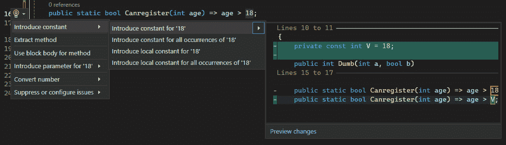

图 3.22 – 引入一个常量

现在我们得到了一个简单的表达式主体，名字起得很好，并且遵循了清洁代码实践。

## 生成一个接口

例如，假设我们得到一个 **AirTraffic** 类，它有一个 **RegisterAircraft** 方法。现在为了给我们的代码添加抽象，我们想要创建一个 **IAirTraffic** 接口。我们将使用 *螺丝刀* 无缝地提取接口。

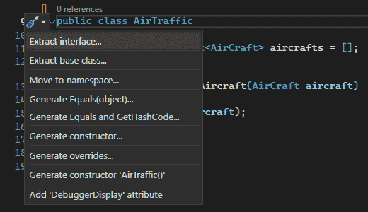

图 3.23 – 提取一个接口

这将打开一个窗口，其中包含选项，允许我们选择接口的配置。我们将保留默认选择，在新的文件中创建接口，命名为 **IairTraffic.cs**。

现在，我们正在添加一个新的方法，**SendMessage**，我们希望它也属于接口。再次，我们可以使用 *螺丝刀* 将新方法提升到接口：

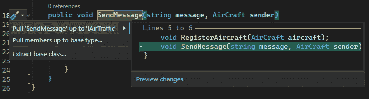

图 3.24 – 将方法提升到接口

这种重构确保了所有实现 **IAirTraffic** 的类都将能够访问 **SendMessage** 方法，促进了接口和代码的重用的一致性。

## 文件作用域我们的命名空间

在 C# 10 中引入的 **文件作用域命名空间** 功能提供了一种更简洁的声明命名空间的方法。它消除了包围命名空间主体的花括号的需要，简化了语法并提高了可读性。

默认情况下，当我们创建 Visual Studio 中的类时，它使用较旧的命名空间版本，该版本使用花括号包围整个文件的内容。我们可以在命名空间的声明末尾添加一个分号，Visual Studio 将自动理解你想要将其转换为文件作用域命名空间。

为了避免这种重复操作，我们可以通过使用顶部的菜单栏将文件作用域命名空间设置为 Visual Studio 的默认值：选择 **工具** | **选项** | **文本编辑器** | **C#** | **代码样式** | **常规** 并将命名空间声明值更改为 **文件作用域**：


图 3.25 – 使命名空间声明为文件作用域

如果我们在团队中工作，我们可以通过点击 **从设置生成 .editor 文件** 选项直接为 **选项** 窗口生成 **.editorconfig** 文件，如图 *图 3* *.25* 所示。

如果我们已经有了一个 **.editorconfig** 文件（可能是手动创建的，或者通过更改严重性级别生成的，如本章中 *利用静态代码分析进行质量保证和安全* 部分所示），我们可以添加以下行来设置命名空间声明为 **file_scoped** :

```cs
csharp_style_namespace_declarations = file_scoped
```

如果我们希望 Visual Studio 在未使用文件作用域命名空间时触发编译时错误，语法如下：

```cs
csharp_style_namespace_declarations = file_scoped:error
```

这使得我们可以将配置提交到我们的 Git 仓库，确保它与我们的团队共享。

# 摘要

在本章中，我们探讨了 Visual Studio 2022 中 Roslyn 的内部工作原理，使开发者能够充分利用其功能。通过掌握静态代码分析，我们可以通过精细控制严重性级别以及生成 **.editorconfig** 文件并将其传播到我们的团队，来增强项目中的质量保证和安全措施。

我们看到了 IntelliCode 如何重新定义生产力，通过整行自动完成和无缝访问 GitHub 文档提供预测性编码。

我们导航了代码的可维护性和安全性指标，这些指标为我们提供了宝贵的见解，使我们能够评估和改进代码库。凭借 Visual Studio 2022 的内置工具，项目可以优化以实现长期可持续性和健壮性。

我们以实际重构案例研究结束了本章，解决了一些常见陷阱，并展示了接口生成和命名空间细化等技术。通过分析现实场景，我们在应用高级重构原则方面获得了实践经验。

在下一章中，我们将探讨识别性能瓶颈、优化代码执行以及利用 Visual Studio 2022 的分析工具以确保应用程序性能达到顶峰的策略。
