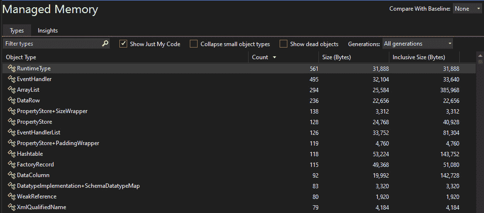

# 第四章：性能优化和性能分析

在本章中，我们深入探讨确保我们的代码不仅正确运行，而且运行高效的至关重要的方面。虽然编写能够工作的代码是必要的，但优化其性能同样重要，尤其是在当今快节奏的数字环境中，用户期望快速响应的应用程序。

在前几章中，我们通过掌握单元测试、**测试驱动开发**（**TDD**）、高级调试策略和代码分析，打下了基础。现在，我们将焦点转向 Visual Studio 2022 中可用的优化和性能分析工具，以便我们能够对应用程序进行微调，以实现最佳性能。

在本章中，我们将探讨各种旨在提高软件速度、响应性和资源效率的技术和方法。我们将从介绍性能优化的基础和利用性能分析工具来识别瓶颈和改进区域的重要性开始。

本章涵盖的关键主题包括以下内容：

+   性能优化简介

+   利用 Visual Studio 性能分析工具

+   分析 CPU 使用情况

+   内存性能分析和优化

+   优化数据库交互

通过掌握这些概念和技术，我们将学习如何定位性能问题，优化代码库的关键部分，并确保我们的应用程序在各种工作负载和条件下提供无缝的用户体验。

让我们共同踏上构建更快、更高效软件的旅程。

# 技术要求

在编写本章时，我使用了以下版本的 Visual Studio：

+   Visual Studio Enterprise 2022 版本 17.12.0

+   预览 1.0

本章的代码文件可以在[`github.com/PacktPublishing/Mastering-Visual-Studio-2022/tree/main/ch04`](https://github.com/PacktPublishing/Mastering-Visual-Studio-2022/tree/main/ch04)找到。

# 性能优化简介

软件开发中的性能优化涉及对应用程序进行精炼，使其以最大效率运行，最小化资源消耗，如内存、CPU 和带宽。这个过程包括分析各个开发阶段的表现，通常在产品稳定版本确立后，会着重提高效率。

我们性能优化过程中的主要步骤是*识别瓶颈*，因为这使我们能够确定代码中导致性能问题的具体区域。**瓶颈**是代码中执行速度显著减慢的点，通常是由于资源限制或效率低下的算法。通过识别这些瓶颈，我们可以将优化努力集中在最能产生影响的领域，从而实现更高效、更快的应用程序。这种有针对性的方法不仅提高了应用程序的性能，还通过减少加载时间和提高响应速度来增强整体用户体验。此外，在开发早期阶段识别瓶颈可以防止昂贵的返工和延误，因为在问题根深蒂固于我们应用程序的架构之前解决性能问题更为经济。本质上，识别和解决瓶颈的能力是我们作为开发者创造高性能应用程序的关键技能，确保我们的软件运行顺畅且高效。

性能优化可以在不同的层面上进行，并提供了不同的探索路径：

+   在设计层面，系统的架构在其性能中起着至关重要的作用。以性能为导向的设计涉及对系统如何与硬件和网络资源交互做出战略决策。例如，通过最小化网络请求可以降低网络延迟，理想情况下是一次请求而不是多次。这种方法不仅减少了网络负载，还简化了应用程序的架构，使其更容易维护和扩展。

+   源代码中的实现选择也对系统优化有重大影响。采用高效的编码实践对于实现系统优化至关重要。这包括避免不必要的计算，这可以显著减少应用程序的计算开销。例如，使用**语言集成查询**（**LINQ**）进行数据处理可以生成比传统循环更易读且可能更高效的代码。此外，利用 C#的异步编程功能，如 async 和 await，可以通过允许应用程序在等待长时间运行的操作完成时执行其他任务来提高应用程序的响应速度。

+   算法和数据结构的选择是系统性能的关键因素。高效的算法和数据结构可以显著降低操作的时间复杂度，使系统能够轻松处理更大的数据集和更复杂的任务。理想情况下，算法应该以常数（O(1)）、对数（O(log n)）、线性（O(n)）或对数线性（O(n log n)）的时间复杂度运行。具有二次复杂度（O(n²)）的算法在数据集规模增长时可能难以高效扩展。同样，封装数据和操作的抽象数据类型，与更复杂的数据结构相比，可能对系统优化更有效。

+   在构建级别进行优化涉及在构建过程中做出决策，这些决策可以使应用程序针对特定的处理器模型或环境进行定制。这可能包括禁用不必要的软件功能，从而减小可执行文件的大小并提高其性能。此外，构建级别的优化可能涉及使用编译器标志启用特定的优化，例如循环展开或函数内联，这可以提高生成代码的效率。

你可能已经注意到，我使用 Big O 表示法根据复杂度对算法进行了分类；让我们回顾一下这个表示法。

Big O 表示法是一种数学表示，用于描述算法的性能或复杂度，特别是关于它们随着输入大小增加的运行时行为。

理解 Big O 表示法对于软件工程师来说非常重要。它使我们能够评估和对比不同算法的效率。因此，我们可以就选择适合特定场景的算法做出明智的决定。

以下要点概述了著名的 Big O 表示法：

+   **常数时间 O(1)**：无论输入数据如何，执行时间保持不变

+   **对数时间 O(log n)**：对于输入数据的每次加倍，复杂度增加一个单位

+   **线性时间 O(n)**：执行时间随着输入数据大小的增加而线性增长

+   **对数线性时间 O(n log n)**：复杂度随着线性和对数的组合增长

+   **二次时间 O(n²)**：所需时间与元素数量的平方成正比

+   **立方时间 O(n³)**：所需时间与元素数量的立方成正比

+   **指数时间 O(2^n)**：每增加一个新元素，时间翻倍

+   **阶乘时间 O(n!)**：复杂度根据数据集的大小以阶乘方式增长

既然我们已经探讨了软件开发中性能优化的基本原理，让我们深入了解识别和解决性能问题的实际方法。在我们的努力中，Visual Studio 性能分析工具是一套宝贵的工具。通过利用这些工具的功能，我们可以更深入地了解应用程序的性能，并简化优化过程。让我们看看如何有效地利用 Visual Studio 性能分析工具来提高我们的软件应用程序的性能。

# 利用 Visual Studio 性能分析工具

Visual Studio 性能分析工具是一套集成到 Visual Studio 中的性能测量和诊断工具。在本节中，我们将探讨如何使用它，并探索提供的工具以探索和监控我们的应用程序。

要打开性能分析器，我们前往 **调试** | **性能分析器** 或按 *Alt* + *F2*。


图 4.1 – 性能分析器

在点击 **开始** 按钮之前，让我们回顾性能分析器功能提供的各种选项，以便对应用程序进行性能分析。

## 分析 .NET 异步事件

.NET 的异步和 await 功能允许我们分析按时间顺序组织的事件，以表格形式显示活动发生时的开始时间、结束时间和持续时间。任务在 **名称** 列中标出。


图 4.2 – .NET 异步

如果在收集会话期间任务未完成，**结束时间**列将出现一个 **不完整** 标签。

要调查特定的任务或活动，我们可以右键单击该行并选择 **转到源文件**，以查看该活动发生在我们代码的哪个位置。

理解异步性能的特征至关重要。虽然异步方法旨在提高应用程序的响应性和可伸缩性，但它们确实由于编译器创建的状态机而引入了一些开销。然而，这种开销通常很小，对于高吞吐量场景来说效率很高。

当比较异步代码与同步代码的性能时，我们需要考虑所执行操作的性质。对于本质上异步的操作（如 **输入/输出** ( **I/O** )-bound 操作），异步方法可以通过在等待时释放线程来处理其他请求，从而提供显著的性能优势。然而，对于 CPU-bound 操作，异步和同步方法之间的性能差异可能微不足道。

为了有效地使用 .NET 的异步和等待功能监控我们的应用程序性能，我们可以利用 Visual Studio 中的 **.NET 异步** 工具进行异步代码执行的详细分析。此外，像 Stackify Retrace 这样的外部工具为 .NET 应用程序提供全面的监控能力，包括对异步/等待的支持。了解异步方法的表现特性和执行操作的本质对于做出何时采用异步编程模式的明智决策至关重要。

## 使用 .NET 计数器进行监控

Visual Studio 2022 集成了 **.NET Counters** 工具，这是一个高级功能，允许我们像我们这样的开发者直接在 Visual Studio 分析器中可视化性能计数器随时间的变化。此工具证明对于监控和分析 .NET 应用程序的各种指标（如 CPU 使用率、垃圾收集器堆大小以及我们可能在应用程序中实现的任何自定义计数器）特别有用。这种集成使我们能够直接从 Visual Studio 环境中利用 .NET Counters 的功能，为性能监控和分析提供更流畅和集成的体验。

Visual Studio 2022 增强了 .NET 计数器工具以支持两个创新指标：**UpDownCounter** 和 **ObservableCounter**。**UpDownCounter** 允许实时跟踪具有递增和递减变化的值，这对于监控如网络应用程序中的用户交互等动态值非常理想。另一方面，**ObservableCounter** 自动管理聚合总数，提供可定制的回调委托以实现精确控制。此功能可以通过有效管理活动会话总数来特别有用，从而优化服务器资源。

此外，工具中的过滤器弹出功能使我们能够方便地根据标签过滤数据点。此动态调整功能显著增强了我们在项目中监控动态值的灵活性和流程化。

在收集数据时，我们可以看到 .NET 计数器的实时值，并同时查看多个计数器的图表。


图 4.3 – .NET 计数器

一旦我们停止收集，我们就会得到一份详细的报告，显示所选时间范围内每个计数器的最小值、最大值和平均值。这份报告为我们提供了应用程序性能指标的综合概述，帮助我们更有效地识别和解决性能瓶颈。

## 跟踪 .NET 对象分配

**.NET 对象分配跟踪** 工具对于理解 .NET 代码中的分配模式以及通过识别最占用内存的方法来优化应用程序的内存使用非常有价值。然而，需要注意的是，虽然此工具可以揭示对象分配的位置，但它并不能阐明对象为何保留在内存中。

我们通过点击**开始**按钮来启动工具，如果我们在开始分析器之前希望数据收集暂停，工具会提供**开始时收集暂停**选项。


图 4.4 – 开始分析

这允许我们通过在诊断会话视图中点击**记录**按钮手动开始数据收集。

执行工具后，我们可以停止收集数据或关闭我们的应用程序以审查数据。该工具提供了全面的内存分配数据，包括分配内存的对象的位置以及这些对象分配的内存量。它还显示了在特定分配类型或函数中占用内存的对象数量，以及消耗的内存量而不是对象数量。

此外，该工具还提供了一个**收集**视图，展示了在垃圾回收期间收集或保留的对象数量，为我们提供了有关垃圾回收事件（如垃圾回收类型、事件原因以及垃圾回收器执行后**大对象堆**（**LOH**）和**固定对象堆**（**POH**）的大小）的见解。

## 查看事件

**事件查看器**工具允许我们在应用程序停止后检查收集到的信息，就像尸检分析一样。它显示了一个事件列表，如模块加载、线程启动和系统配置，有助于在 Visual Studio 分析器中诊断我们的应用程序性能。

要启用自定义**Windows 事件跟踪**（**ETW**）事件，我们可以使用自定义事件对代码进行操作，并配置它们在事件查看器中显示。这涉及到设置提供程序名称和 GUID 以用于我们的自定义事件代码。对于 C#自定义事件代码，我们设置与声明事件代码时相同的提供程序名称值，而对于本地自定义事件代码，我们根据自定义事件代码的 GUID 设置提供程序 GUID。一旦配置完成，这些自定义事件将在我们收集诊断跟踪时在事件查看器中显示。

事件查看器一次可以显示多达 20,000 个事件。为了关注特定事件，我们可以通过选择**事件**过滤器来过滤显示。此外，我们还可以看到每个提供程序发生的总事件数的百分比，提供了我们时间花费的细分。这种过滤和细分有助于识别分析中最相关的事件。

例如，要启用自定义 ETW 事件：

1.  首先，构建我们的自定义事件代码。

1.  然后，在**性能分析器**窗口（通过*Alt* + *F2*访问），启用**事件查看器**并选择其旁边的**设置**图标。

1.  在对话框中，启用**附加提供程序**下的第一行，并根据我们的自定义事件代码进行配置。

1.  对于本机自定义事件代码，我们设置**提供者 GUID**值，并将**提供者名称**值留空或使用其默认值。

1.  对于 C#的自定义事件代码，我们在声明事件代码时设置了相同的**提供者名称**值，并将**提供者 GUID**留空。配置完成后，当我们收集诊断跟踪时，我们的自定义事件将出现在事件查看器中。

对于我们这些希望诊断性能问题或详细了解应用程序行为的开发者来说，此工具特别有用。它为我们应用程序的活动和性能指标提供了一个全面的视图。

## 分析文件 I/O

Visual Studio 中的**文件 I/O**工具是一个强大的分析工具，旨在帮助我们优化文件 I/O 操作，从而提高我们应用程序的性能。此工具特别适用于诊断缓慢的加载时间和低效的数据读取或写入模式。它提供了在分析会话期间关于文件读取和写入操作的详细信息，包括访问的文件、每个文件的目标进程以及每个文件的汇总信息。该工具还提供诸如**重复因子**等功能，帮助我们确定是否读取或写入比必要更多的数据，这表明了潜在的优化区域，例如缓存文件读取的结果。

文件 I/O 工具提供了在分析会话期间读取的文件读取和写入信息。收集后，文件会自动生成在报告中，并按其目标进程排列，显示汇总信息。如果我们右键单击其中一行，我们可以进入代码中的源。如果一个汇总行被读取多次，我们可以展开它以查看该文件的个别读取操作及其频率，如果它们被多次读取。

## 分析数据库性能

Visual Studio 中的**数据库分析器**工具是一个旨在帮助我们开发者诊断和优化应用程序中数据库操作性能的功能。它对于使用 ADO.NET 或 Entity Framework Core 的.NET Core 应用程序特别有用，提供了关于数据库活动（如查询执行时间、使用的连接字符串以及这些查询在代码中的位置）的见解。此工具是 Visual Studio 中的性能分析器的一部分，自 Visual Studio 2019 版本 16.3 以来一直可用。

一旦我们开始分析会话，我们就像平时一样与我们的应用程序交互，执行我们怀疑可能引起数据库性能问题的操作。完成我们的操作后，我们在 Visual Studio 中停止收集。然后，该工具处理收集到的数据，并显示在我们分析会话期间发生的查询表，以及显示这些查询的时序和频率的图表。这些信息可以帮助我们识别长时间运行的查询、低效的连接字符串或数据库操作中的其他性能瓶颈。

此外，数据库分析工具支持分析使用 dotnet trace 收集的跟踪，允许我们从.NET Core 运行的任何地方收集数据，包括 Linux，并在 Visual Studio 中进行分析。这个特性特别适用于诊断在没有安装 Visual Studio 的环境中或用于脚本化性能跟踪收集的环境中的性能问题。

总结来说，Visual Studio 中的数据库分析工具是我们这些与数据库交互的.NET Core 应用程序的开发者强大的诊断工具。它提供了对数据库操作的详细洞察，帮助我们更有效地识别和解决性能问题。

## 仪器化我们的.NET 应用程序

在 Visual Studio 中，我们使用仪器工具来收集精确的调用次数和调用时间，这对于性能分析和优化至关重要。有两种主要的仪器方法可用：

+   **静态仪器**：这种方法涉及在程序运行之前修改程序的文件。我们使用名为 VSInstr 的工具将仪器代码插入到应用程序的二进制文件中。静态仪器对于收集详细的时序数据非常有效，但由于文件修改可能会破坏强名称签名。它还要求文件以特定的顺序部署，这对于复杂的程序来说可能很麻烦。

+   **动态仪器**：在 Visual Studio 2022 版本 17.5 中引入，这种方法不会修改程序的文件。相反，它将文件加载到内存中并在运行时修改它们以收集仪器信息。动态仪器提供了更准确的信息，特别是对于程序的小部分，并允许调查特定的代码部分。由于仪器在运行时发生，因此避免了破坏强名称签名的问题。这种方法简化了查找和仪器文件的过程，尤其是在复杂的程序中。

这个工具类似于 CPU 使用工具，但专注于墙钟时间而不是 CPU 利用率，这使得它在理解函数执行时间至关重要的场景中适用。

通过使用上述工具，我们可以收集关于我们应用程序性能的宝贵见解。

然而，为了确保性能测量的最佳准确性，建议我们在**发布**模式下而不是**调试**模式下分析我们的应用程序。调试构建可能会引入额外的开销，从而可能歪曲我们的结果。

当我们在分析过程中需要检查变量值或使用断点时，我们应该考虑利用**诊断工具**窗口中找到的集成调试工具。这些工具针对此类任务进行了定制，可能为我们提供更适合的分析环境。

为了全面了解我们应用程序的性能，我们可以利用 Visual Studio 同时利用多个分析工具的能力。这种方法允许我们从不同的角度检查应用程序的性能，提供更全面的分析。

你可能已经注意到，我遗漏了 Profiler 性能工具提供的三个工具。我将在下一节中突出它们，首先是 CPU 使用情况分析器。

# 分析 CPU 使用情况

Visual Studio 中的**CPU 使用情况**工具旨在帮助我们识别应用程序中的高 CPU 利用率和其他相关性能问题。它可以用于本地跟踪会话和生产环境，提供有关可能需要优化的地方的洞察。要使用 CPU 使用情况工具而不使用调试器，我们应该将解决方案配置设置为**发布**，并将部署目标选择为**本地 Windows 调试器（或本地计算机）**。在可用工具下，我们选择**CPU 使用情况**，然后选择**启动**。

如果我们启用“启动时收集暂停”选项，数据收集将不会开始，直到我们在诊断会话视图中选择**记录**按钮。应用启动后，诊断会话开始，显示 CPU 使用数据。收集完数据后，我们选择**停止收集**。然后工具分析数据并显示报告，可以过滤和搜索特定线程或节点。

CPU 使用情况工具特别适用于诊断我们代码库中的性能问题，识别瓶颈，并理解 CPU 使用模式。它提供自动洞察和多种数据视图，使我们能够有效地分析和诊断性能问题。此工具在生产环境中很有益，但目前难以调试，但可以使用此工具捕获和分析数据，以了解潜在原因并提出修复建议。

CPU 使用情况工具特别适用于诊断减速、进程挂起以及识别代码库中的瓶颈，使其成为优化应用程序性能的必备工具。

当运行此分析工具时，它会检测每秒的 CPU 使用情况并收集跟踪信息，生成一个包含图表的报告以可视化 CPU 使用的峰值和谷值。

当我们首次启动 CPU 使用率工具时，它将每秒收集大量数据以分析应用程序中的情况，默认设置为**1000**样本/秒。

我们可以通过点击配置控制台**CPU 使用率**标签右侧的齿轮，在点击**开始**按钮之前，来个性化设置每秒收集样本的数量（*图 4.1*）。根据我们的需求，我们可以调整结果的准确性和数据收集时间。


图 4.5 – CPU 使用率设置

当我们停止收集或关闭我们的应用程序时，CPU 使用率工具会生成报告。最初，我们会进入摘要页面，该页面显示泳道图、**顶级函数**部分和**热点路径**部分。


图 4.6 – 摘要页面

在这里，我们可以通过右键单击并拖动图形来包围我们想要关注的峰值，从而缩小潜在的瓶颈。通过这样做，我们实际上通过时间过滤了图形。

通过点击**打开详细信息…**链接，我们可以深入了解其他五个视图：

+   **调用者/被调用者**

+   **调用树**

+   **模块**

+   **函数**

+   **火焰图**

让我们详细了解每个部分：

+   在**调用者/被调用者**视图中，我们可以观察所选函数与其被调用的函数（**调用函数**）以及它调用的函数（**被调用函数**）之间的关系。它提供了关于所选函数所花费的总时间和其在整个应用程序运行时间中所占百分比的见解。此外，它还提供了关于仅在函数体中花费的时间（**函数体**）的信息。此视图有助于我们了解函数对应用程序性能的影响并识别潜在的瓶颈。


图 4.7 – 调用者/被调用者

+   **调用树**视图展示了我们应用程序中函数调用的层次结构表示，从顶级伪节点开始。它包括系统和框架代码（在**[外部代码**]节点下）以及用户代码方法。


图 4.8 – 调用树视图

此视图有助于了解函数调用的顺序和嵌套，有助于识别应用程序中最占用 CPU 的路径。

+   在**模块**视图中，我们可以看到包含函数的模块列表，这在分析外部代码时特别有用。


图 4.9 – 模块视图

它帮助我们了解哪些模块对 CPU 使用率贡献最大，有助于识别可能影响性能的第三方库或系统组件。

+   **函数**视图列出了我们应用程序中的所有函数，按其 CPU 使用率排序。它提供了详细的信息，例如**总 CPU**（函数及其调用的任何函数所花费的时间）和**自 CPU**（仅在函数体中花费的时间）。


图 4.10 – 函数视图

这种视图对于识别我们应用程序中最资源密集型的功能并集中优化努力至关重要。

+   **火焰图**是一种表示我们应用程序随时间推移的调用栈的可视化。它有助于识别热点路径，即消耗大量 CPU 时间的函数调用序列。图中每个函数的宽度对应于它消耗的 CPU 时间，这使得更容易发现性能瓶颈。**火焰图**视图特别有助于理解我们应用程序的整体 CPU 使用模式，并确定优化的具体区域。


图 4.11 – 火焰图

我们可以通过使用**翻转火焰图**选项并放大我们的兴趣点来根据我们的偏好翻转视图。

对于调试会话，可以通过**诊断工具**窗口访问 CPU 使用率工具，该窗口默认自动出现，除非已关闭。我们可以通过工具栏上的**选择工具**设置选择是否查看**CPU 使用率**、**内存使用率**或两者，工具默认启用以进行 CPU 利用率分析。

当调试器暂停时，**诊断工具**窗口中的 CPU 使用率工具会收集关于我们应用程序中正在执行的功能的信息，列出执行工作的功能，并提供一个时间线图，以便关注采样会话的特定部分。

虽然 CPU 使用率和内存使用率相关，但它们之间没有直接相关性。一个对另一个的影响取决于系统上运行的应用程序所执行的具体任务。监控这两个指标对于优化系统性能和有效管理能耗至关重要。

现在我们已经探讨了如何分析 CPU 使用率，让我们继续我们的旅程，通过监控内存分配来继续前进。

# 内存分析和优化

提醒一下，当计算机程序错误处理内存分配时，就会发生内存泄漏，导致不再需要的未释放内存。由于自动垃圾回收和.NET 应用程序是用托管代码编写的，因此.NET 应用程序通常不太容易发生内存泄漏。这意味着运行时控制内存分配和释放。然而，如果我们编写有问题的代码或误用可处置模式，内存泄漏仍然可能发生。

在本节中，我们将探讨如何利用 Visual Studio 通过使用**内存使用率**分析工具和调试期间可用的诊断工具来解决内存泄漏。

## 使用内存使用工具

要找到和解决内存泄漏，我们可以使用 Visual Studio 中的**内存使用**工具。这是一个强大的分析功能，旨在有效地监控和分析应用程序的内存使用情况。它支持各种应用程序类型，包括.NET、ASP.NET、C++和混合模式应用程序。这个多功能的工具可以在有和没有调试器的情况下使用，满足不同的开发场景。其关键优势之一在于其识别内存泄漏和低效内存使用模式的能力。

在我们的诊断会话期间，内存使用工具提供了一个时间线图，显示了应用程序运行时的内存波动。这种图形表示有助于确定代码中可能收集或生成数据低效的区域，这可能导致内存泄漏或过度使用内存。


图 4.12 – 内存使用图

我们可以使用这个工具在不同的时间间隔内详细记录应用程序的内存状态快照。然后，我们可以将这些快照进行比较，以确定内存问题的根本原因。它们展示了关键指标，如内存中对象和字节数的总数，以及连续快照之间的差异。



图 4.13 – 内存使用报告类型

我们可以通过详细的内存使用报告视图深入了解这些快照，了解每个快照中存在的类型和实例，或两个快照之间的差异。

一旦停止数据收集，内存使用工具将显示一个包含内存使用数据的概览页面。这个概览有助于我们了解应用程序的内存影响，并找出可能从优化中受益的区域。

对于更高级的分析，内存使用工具提供了对各种内存问题的洞察，如重复字符串、稀疏数组和事件处理器泄漏，特别是对于托管内存分析非常有用。


图 4.14 – 内存使用报告洞察

利用这些洞察，我们可以更有效地识别和解决常见的内存问题。

有些场景可能需要我们专注于深入挖掘代码库的某个特定部分，为此，我们可以使用调试模式下的诊断工具。

## 在调试时探索内存使用情况

对于这部分，我将创建一个小的控制台应用程序，您可以在 GitHub 上检索。以下代码包含一个**while**循环，该循环将一个字符串列表填充为一个大随机字符串：

```cs
List<string> list = new();
while (true)
{
    list.Add(GenRandomStr(10000));
    Thread.Sleep(1);
}
static string GenRandomStr(int length)
{
    Random rnd = new();
    var chars = new List<char>();
    for (var i = 0; i < length; i++)
    {
        var a = (char)rnd.Next(65, 122);
        chars.Add(a);
    }
    return string.Concat(chars);
}
```

在前面的代码块中，我们首先在我们的应用程序中设置断点，我们怀疑内存泄漏可能发生的地方。这可能是在函数的开始或我们怀疑导致内存泄漏的代码区域。

对于这个示例，由于代码简单，我们将在循环的闭合括号处设置断点。

此外，在更复杂的场景中，我们可以利用其他分析工具来识别代码库中的可疑位置。

接下来，我们将使用 **诊断工具**，默认情况下，它会在调试器启动时打开。如果没有，您可以通过导航到顶部菜单并点击 **调试** | **窗口** | **显示** **诊断工具** 来访问它。


图 4.15 – 诊断工具

在 **诊断工具** 窗口中，我们检索 **事件**、**进程内存** 和 **CPU** 使用图表。在我们的示例中，我们将观察 **进程内存** 部分，其中内存使用量随着循环迭代而增加。此外，我们还可以监控垃圾收集器的工作，以评估其对内存分配的影响。

要分析堆栈，我们可以使用 **获取快照** 选项进行快照。此操作将生成不同时间间隔的内存状态报告，正如我们在之前的分析工具描述中观察到的。


图 4.16 – 内存使用快照

在 *图 4.16* 中，我们可以观察到在快照之间，**堆大小** 和 **对象** 的数量危险地增加。这表明分配不当，换句话说，就是内存泄漏。

我们可以通过点击 **查看堆** 选项来深入了解，通过大小和数量探索 **对象类型**。


图 4.17 – 内存使用

在这里，我们可以看到我们的内存泄漏原因是 **List<String>**，它永远不会释放。

虽然 CPU 和内存可以提供对我们应用程序性能的洞察，但软件中观察到的大多数延迟都来自数据库交互，在下一节中，我们将看到如何优化它们。

# 优化数据库交互

Visual Studio 2022 引入了一个名为 **数据库分析器** 的新分析工具。它允许我们探索应用程序中的数据库交互。

在本节中，我们将探讨如何使用数据库分析器工具以及它们如何帮助我们识别代码库中的查询优化机会。

要打开它，我们通过 **性能分析器** 选择 **数据库**，在那里我们可以将其与 **CPU 使用** 结合以获得更多信息。


图 4.18 – 选择数据库和 CPU 使用工具

当我们点击 **启动** 按钮，分析器将启动我们的应用程序并开始收集数据。在此期间，我们可以在应用程序上执行长时间运行的操作，以确定延迟的根本原因。

在点击 **停止收集** 按钮后，我们将启动报告的生成。


图 4.19 – 数据库报告

数据库报告将显示一个包含已执行查询信息的表格；默认情况下，它显示以下信息的列：

+   查询的开始时间

+   查询的 SQL 代码

+   执行持续时间

+   受影响的记录数

+   读取的记录数

在更大的应用程序中，我们可以集成多个数据库，例如在利用**命令查询责任分离**（**CQRS**）模式以及数据库复制时。为了帮助我们的调查，我们可以通过右键单击显示的列并检查我们需要哪一个来显示另外三个列。


图 4.20 – 数据库报告管理列

附加的列如下：

+   **数据库**

+   **连接字符串**

+   **查询源**显示所使用的数据提供程序（EFCore、Dapper、ADO.NET 或其他）

结合 CPU 使用工具，我们可以轻松地聚焦于消耗周期，以检查在此时间内的查询启动。


图 4.21 – 数据库报告时间筛选

当我们识别到一个可能因其长事务持续时间或大量相关查询而引起我们注意的查询时，我们可以进行调查。

最后，在查询列表中，我们可以通过右键单击我们感兴趣的行并选择**转到****源文件**，轻松地跳入代码源进行进一步调查或甚至重构。


图 4.22 – 转到源文件

Visual Studio 性能分析工具的强大之处在于能够结合其一些工具进行综合调查。我的建议是利用本章中突出显示的三个工具：内存使用、CPU 使用和数据库工具。这将帮助我们快速识别诸如生成过多内存分配和 CPU 利用率的查询等问题，尤其是在使用**对象关系映射**（**ORMs**），如 EF Core 或 Dapper，需要实例化对象以运行查询时。

# 摘要

本章提供了利用 Visual Studio 性能分析工具来帮助我们调查和优化性能瓶颈的关键见解，从而提高了应用程序的性能。

在本章中，我们涵盖了一系列主题，从理解性能优化的基础知识到有效地利用 Visual Studio 的性能分析工具。我们学习了如何分析 CPU 使用情况并识别内存和数据库瓶颈，以识别和优化关键部分和我们的代码库，以改善性能。

在我们结束本章时，我们标志着掌握核心开发技能旅程的第一部分的结束。从单元测试和 TDD 到高级调试策略、代码分析和现在性能优化与剖析，你已经为你的开发旅程奠定了坚实的基础。

在接下来的章节中，我们将继续拓展我们的视野，深入探讨高级主题，如多平台应用 UI 开发、高级 Web 开发工具、机器学习集成以及高级云集成和服务。

开始第二部分，我们将通过探索 Visual Studio 为 MAUI 提供的工具，深入跨平台开发的世界。

# 第二部分：拓展开发视野

在本第二部分中，我们专注于通过利用 Visual Studio 的高级技术来扩展您的开发专业知识，构建多功能应用程序。从多平台应用 UI 开发到高级 Web 工具，再到机器学习集成和云服务，这些章节为您提供了构建现代、可扩展和智能应用程序的技能，推动您开发能力的边界。

本部分包含以下章节：

+   *第五章* ，*多平台应用 UI 开发*

+   *第六章* ，*高级 Web 开发工具*

+   *第七章* ，*机器学习集成*

+   *第八章* ，*高级云集成和服务*
