# 5

# 多平台应用 UI 开发

本章深入探讨了使用 Visual Studio 2022 进行跨平台开发，重点关注.NET **MAUI**（**多平台应用 UI**）。我们将全面了解如何使用.NET MAUI 构建在多个平台上无缝运行的应用程序。主题包括.NET MAUI 的介绍、探索高效开发的基本工具、在多种设备上的调试以及从 Xamarin 迁移到.NET MAUI 的实用指南。

在本章中，我们将探讨以下内容：

+   MAUI 简介

+   探索 MAUI 的工具

+   设备调试

+   从 Xamarin 迁移

到本章结束时，我们将能够高效且有趣地构建引人入胜的多平台应用程序。

那么，让我们共同踏上掌握 Visual Studio 进行 MAUI 开发的旅程吧。

# 技术要求

在编写本章时，我使用了以下版本的 Visual Studio：

+   Visual Studio Enterprise 2022 版本 17.12.0

+   预览版 1.0

本章的代码文件可以在以下 GitHub 仓库找到：[`github.com/PacktPublishing/Mastering-Visual-Studio-2022/tree/main/ch05`](https://github.com/PacktPublishing/Mastering-Visual-Studio-2022/tree/main/ch05)。

要访问本章中的 WordPuzzle 项目，请查看以下 GitHub 仓库：[`github.com/dotnet/maui-samples/tree/main/8.0/Apps/WordPuzzle`](https://github.com/dotnet/maui-samples/tree/main/8.0/Apps/WordPuzzle)。

# MAUI 简介

**MAUI**是一个多才多艺的框架，它使开发者能够使用 C#和 XAML 为移动和桌面平台创建原生应用。使用 MAUI，开发者可以从统一代码库针对 Android、iOS、macOS 和 Windows 设备。

这个开源框架建立在 Xamarin.Forms 的基础上，扩展其功能以覆盖桌面场景，同时旨在提高性能、灵活性和将应用逻辑和 UI 布局合并到一个代码库中的能力。

## 跨平台开发的演变

跨平台开发框架通过允许多平台代码共享而彻底改变了应用开发。例如，Xamarin.Forms 使公司能够共享超过 95%的代码库，最大化了开发投资。然而，这一领域已经发展，促使出现如 MAUI 这样的框架来解决之前的限制并适应应用开发的不断变化需求。

## 什么是 MAUI？

由微软开发的 MAUI 是一个开源框架，旨在通过单一代码库简化原生跨平台应用的开发。它建立在 Xamarin.Forms 的基础上，增加了额外的功能，例如统一的项目结构和灵活性。

通过利用.NET 6，MAUI 集成了.NET 框架的最新进展、性能增强和安全更新，使开发者能够利用.NET 库和工具的广泛生态系统来提升他们的应用程序。

## MAUI 的关键特性

MAUI 的一些关键特性如下：

+   **多平台单一代码库**：MAUI 通过将代码、资源和 UI 元素合并到单一的项目结构中，简化了项目管理，减少了复杂性，并节省了时间

+   **增强的性能和响应性**：MAUI 针对性能改进而设计，确保在所有支持的平台上运行顺畅且高效

+   **原生功能和控件支持**：MAUI 优先考虑原生用户界面，在所有平台上提供无缝的用户体验

+   **提高开发者生产力**：如 XAML 和 CSS 的 Hot Reload 等特性，能够实时可视化 UI 更改，显著加速开发过程

现在我们已经探讨了.NET MAUI 的关键特性和架构，很明显，这个框架代表了在应用程序开发方面的一大飞跃。

## MAUI 的架构

MAUI 采用一种策略，它利用每个平台的原生功能，同时保持单一的代码库。这种方法使开发者能够通过统一的 API 访问原生平台功能和 UI 控件，从而提供无妥协的用户体验，同时实现更高的代码重用。

.NET MAUI 为构建移动和桌面应用程序的用户界面提供了一个统一的框架。

*图 5.1*（来自[learn.microsoft.com](http://learn.microsoft.com)）的图表展示了.NET MAUI 应用程序的高级结构：

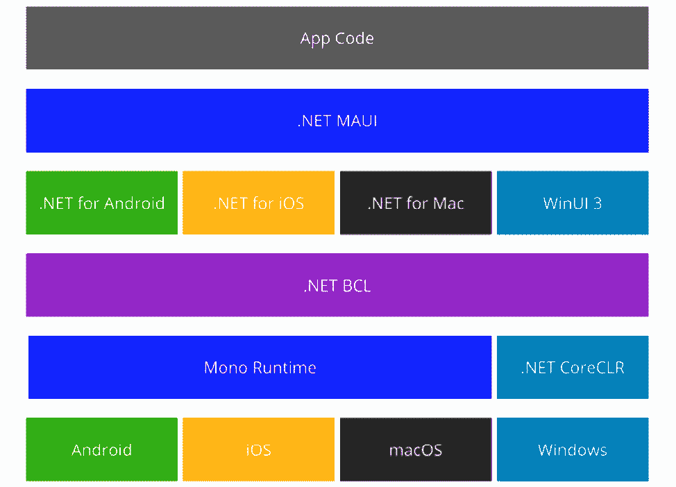

图 5.1 – MAUI 的高级结构（来源：learn.microsoft.com）

我们可以在 PC 或 Mac 上构建.NET MAUI 应用程序。在我们的.NET MAUI 应用程序中，我们的代码将主要与.NET MAUI API 交互。然后，.NET MAUI 随后直接访问原生平台 API。此外，当需要时，我们的应用程序代码可以直接与平台 API 交互。

最后，代码被编译成原生应用程序包：

+   .NET MAUI 通过将 C#编译成**中间语言**（**IL**）来促进 Android 应用程序的开发。在应用程序启动时，此 IL 代码随后被 JIT 编译成原生程序集。相比之下，使用.NET MAUI 开发的 iOS 应用程序在部署前直接从 C#编译成原生 ARM 汇编代码。

+   对于 macOS 应用程序，.NET MAUI 利用了苹果提供的 Mac Catalyst 功能。此功能允许使用 UIkit 构建的 iOS 应用程序在 macOS 平台上运行。此外，它还支持 AppKit 和必要的平台特定 API 的集成。

+   当涉及到 Windows 应用程序时，.NET MAUI 使用 **Windows UI 3**（**WinUI 3**）工具包。这种方法使得创建本地的 Windows 桌面应用程序成为可能。

现在我们已经了解了 MAUI 是什么，让我们深入了解 Visual Studio 为增强我们的 MAUI 体验提供的工具。

# 探索 MAUI 工具

在本节中，为了探索 Visual Studio 为 MAUI 提供的工具，我们将首先创建一个基本应用程序。通过构建此应用程序，我们将获得在 Visual Studio 为 MAUI 开发中可用的各种工具和功能的实际经验。这种实用方法将确保我们不仅理解这些工具的目的，而且学习如何有效地利用它们，从而提高我们的开发流程。

## 创建简单的 MAUI 应用程序

首先，我们必须确保我们安装了带有 MAUI 工作负载的最新版本的 Visual Studio 2022。如果您尚未安装，您可以从 Visual Studio 安装程序或使用以下命令更新您的 Visual Studio：

```cs
dotnet workload install maui
```

您还可以使用 Visual Studio 安装程序来安装 MAUI 工作负载或检查您拥有的版本是否为最新版本，通过启动您的 Visual Studio 安装程序并点击修改已安装的 Visual Studio 的按钮（见 *图 5.2*）：

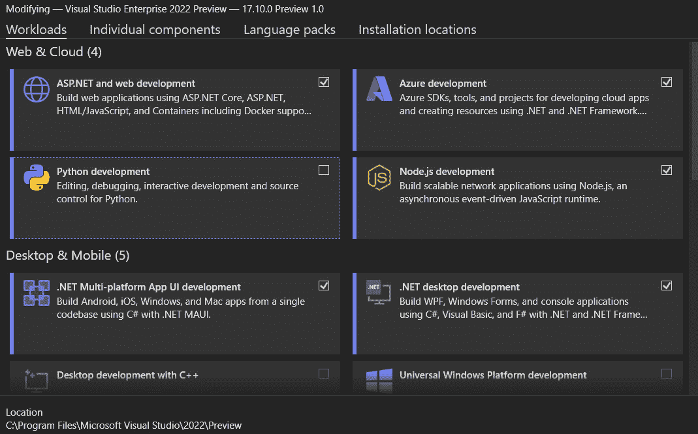

图 5.2 – 修改 Visual Studio 的工作负载

现在，我们已经准备就绪。我们可以按照以下步骤创建我们的新 MAUI 项目：

1.  打开 Visual Studio 并创建一个新的项目。选择 **MAUI** 作为项目类型。

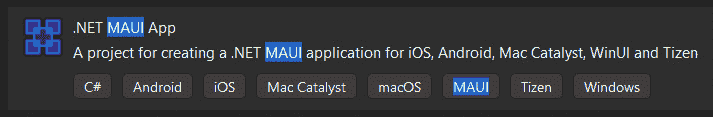

图 5.3 – .NET MAUI 应用模板

1.  我们可以看到，MAUI 项目有一个针对多个平台的共享代码库。在 .NET MAUI 设置中，公共代码库位于共享项目中。相反，每个特定平台的项目的独特代码针对其相应环境进行了定制（例如，**Platforms** | **Android**，**Platforms** | **iOS**，**Platform** | **Tizen**，**Platforms** | **MacCatalyst**，以及 **Platforms** | **Windows**），如 *图 5.4* 所示：

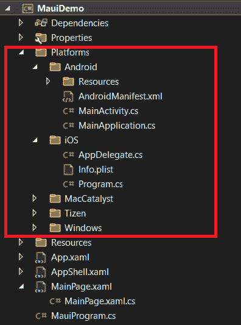

图 5.4 – MAUI 文件夹架构

1.  在 **Shared** 项目中，我们找到主页的 XAML 文件，位于 **MainPage.xaml**。这是我们设计应用程序 UI 的地方。

对于我们的示例，我们将简单地构建一个应用程序，其中包含一个按钮，点击后显示文本消息。

我们将首先设计 UI。为此，我们在 **Shared** 项目中打开 **MainPage.xaml** 并用以下 XAML 代码替换其内容：

```cs
<ContentPage xmlns=»http://schemas.microsoft.com/
             dotnet/2021/maui»
             xmlns:x=»http://schemas.microsoft.com/
             winfx/2009/xaml»
             x:Class="MyMauiApp.MainPage">
    <StackLayout>
        <Button x:Name="MyButton"
                Text="Click Me"
                Clicked="OnButtonClicked"/>
        <Label x:Name="MessageLabel"
               Text="Welcome to MAUI!"/>
    </StackLayout>
</ContentPage>
```

这段 XAML 代码片段定义了我们 .NET MAUI 应用程序中 **ContentPage** 的基本结构。这个页面包含 **StackLayout**，这是一个简单的布局，它将子元素排列成一行，可以是水平或垂直方向。

然后，我们在**Shared**项目中打开**MainPage.xaml.cs**并添加以下 C#代码：

```cs
using Microsoft.Maui.Controls;
namespace MyMauiApp
{
    public partial class MainPage : ContentPage
    {
        public MainPage()
        {
            InitializeComponent();
        }
        private void OnButtonClicked(
            object sender,
            EventArgs e)
        {
            MessageLabel.Text = "You clicked the button!";
        }
    }
}
```

这是.NET MAUI 应用程序中**MainPage**类的 C#代码后置。此代码补充了您之前共享的 XAML 标记，定义了**ContentPage**的行为。具体来说，它包括**OnButtonClicked**方法的实现，该方法在按钮被点击时更新名为**MessageLabel**的标签的文本。

最后，我们可以运行应用程序。**启动**按钮允许我们选择模拟器或设备作为目标（见*图 5.5*）：

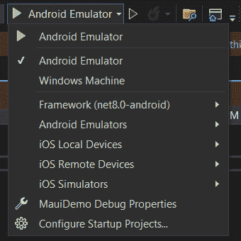

图 5.5 – 启动 Android 模拟器

例如，我们可以选择**Android 模拟器**；当我们第一次启动它时，Visual Studio 将提示我们使用向导进行安装。

现在，当我们启动我们的应用程序时，我们将看到一个标签为**点击我**的按钮（见*图 5.6*）。

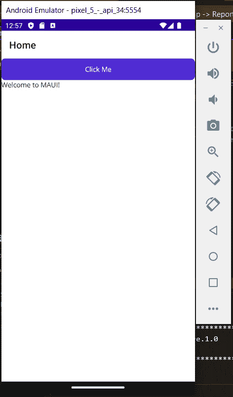

图 5.6 – Android 模拟器

当我们点击按钮时，其下方的文本会变为**您点击了按钮**！。

这是一个基本示例，帮助我们开始使用 MAUI。现在我们有一个正在运行的应用程序，我们可以探索 Visual Studio 提供的所有工具，以增强我们的 MAUI 开发体验。

接下来，让我们探索 XAML 实时预览以利用即时 UI 修改。

## XAML 实时预览

当使用 Windows 机器可执行文件时，Visual Studio 中的**XAML 实时预览**功能允许开发者无需手动保存或重新构建项目即可看到 XAML UI 更改的实时更新。此功能特别适用于快速迭代 UI 设计并确保更改立即反映在预览窗口中。

要启用**XAML 实时预览**，在**Visual Studio 工具栏**中寻找*视频摄像头*图标。此图标是**XAML 实时预览**按钮。点击它将启用实时预览功能。

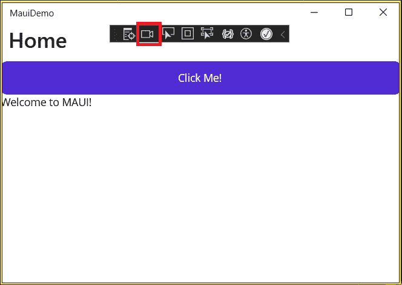

图 5.7 – XAML 实时预览按钮

注意，我们可以在**调试**模式下直接通过 Visual Studio 顶栏菜单打开**XAML 实时预览**；导航到**调试** | **窗口** | **XAML 实时预览**。

这个操作允许我们将 XAML 预览窗口停靠在 Visual Studio 旁边，紧邻我们的代码库。当我们修改 XAML 代码时，更改几乎会立即反映在 XAML 实时预览窗口中。这允许我们立即看到更改的影响，无需保存或重新构建项目。

当鼠标悬停在元素上时，我们可以检索各种样式信息并识别定义该元素的文件。

在这个示例中，我们将鼠标悬停在**MyButton**元素上：

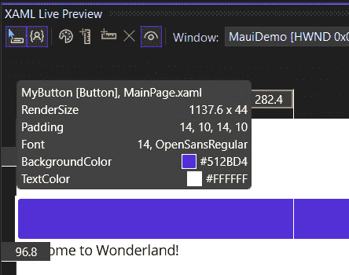

图 5.8 – 元素的样式属性

在**图 5.8**中，我们可以检索**MyButton**在**MainPage.xaml**中定义的**TextColor**和**BackgroundColor**值。

此外，我们可以通过滚动和缩放来平滑地与预览交互。除了使用滚动条滚动外，我们还可以利用以下交互：

+   **鼠标滚轮**，垂直和水平（如果鼠标支持的话）

+   **触摸板**两指滚动，垂直和水平

+   按下**Ctrl**键，配合**鼠标****拖动**动作

此外，对于缩放，我们可以使用以下交互：

+   底左角的**放大**或**缩小**按钮。

+   如果我们更喜欢使用键盘，可以按下**Ctrl** + **加号**（**+**）或**Ctrl** + **减号**（**-**）快捷键。

+   按下**Ctrl**键，配合**鼠标滚轮**动作，或者使用**触摸板**的**捏合缩放**动作。使用鼠标的一个好处是保持更精确的控制。

此外，我们可以添加标尺来帮助我们定义元素的大小和位置。**标尺**帮助我们将应用程序内的元素对齐。它们显示以应用单位为单位的距离。此功能有助于我们验证应用程序不同组件之间的间距。

第二组工具栏按钮控制标尺，如图 5.9 所示：

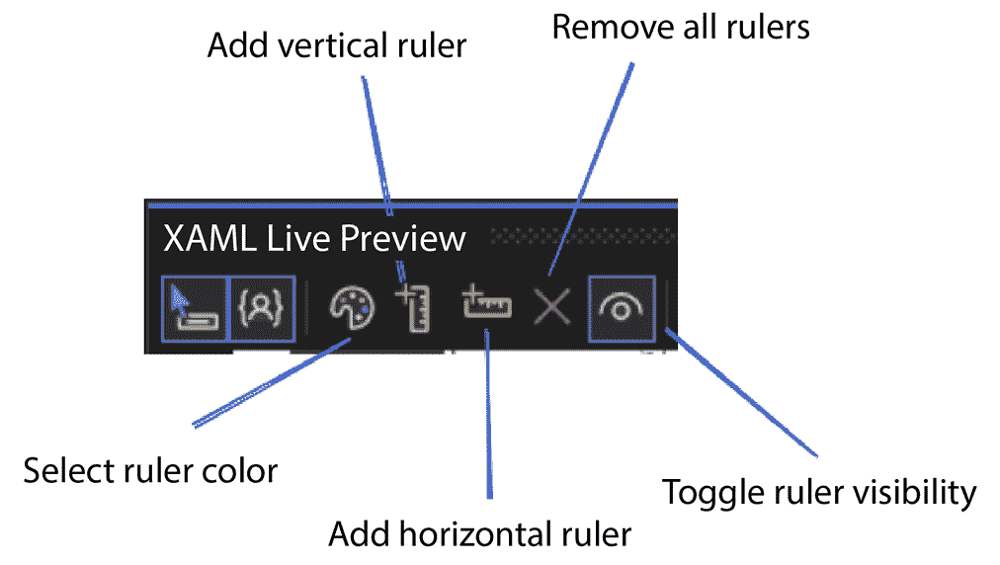

图 5.9 – 标尺工具栏

这里是工具栏提供的主要功能列表：

+   **添加垂直标尺**：这将添加一个单独的垂直标尺。连续多次点击此按钮会将新的标尺定位以避免与现有的标尺重叠。

+   **添加水平标尺**：这插入一个单独的水平标尺，其功能与垂直标尺类似。

+   **删除所有标尺**：这会一次性清除所有标尺。

+   **选择标尺颜色**：这会调整标尺的颜色。

+   **切换标尺可见性**：这通过单次点击切换所有标尺的可见性。

标尺设计得对键盘友好。我们可以使用**Tab**键在它们之间导航。利用**箭头**键，我们可以每次移动一个像素，或者我们可以按住**Ctrl**键同时使用**箭头**键，每次移动 10 个应用单位。按下**Del**键删除当前选中的标尺。此外，我们可以通过选择**删除标尺**按钮来使用鼠标删除标尺。

我们也可以在**元素选择**时添加标尺。右键单击添加垂直标尺，在右键单击的同时按住**Shift**键则添加水平标尺。

当在具有多个窗口的应用程序中工作时，我们可以通过使用**窗口组合框**来选择要显示的窗口。或者，我们可以使用应用程序工具栏中的**在 XAML 实时预览中显示**按钮，该按钮位于我们想要预览的窗口上，正如我们之前所看到的。

XAML 实时预览功能通过提供对 UI 变化的即时反馈，显著加快了开发过程，使得设计和调试基于 XAML 的应用程序（如 MAUI）变得更加容易。

XAML 实时预览提供了一个选择元素的功能，它反映了运行中的应用程序中的选择过程。此功能使我们能够在实时视觉树或源 XAML 中定位元素。实时视觉树是另一个帮助我们理解 MAUI 应用程序 XAML 结构的工具。

让我们探索实时视觉树提供的可能性。

## 实时视觉树

Visual Studio 中的 **实时视觉树** 功能提供了我们应用程序中 UI 元素的实时、层次视图，允许我们在 IDE 中直接检查和修改 UI 结构。此功能特别适用于调试布局问题、理解视觉树以及在开发过程中对 UI 进行动态更改。

如果您想跟随相同的代码库来展示此功能的函数，使用一个更复杂的项目，我克隆了 GitHub 仓库中的 WordPuzzle 应用程序：[`github.com/dotnet/maui-samples/tree/main/8.0/Apps/WordPuzzle`](https://github.com/dotnet/maui-samples/tree/main/8.0/Apps/WordPuzzle)。

### 使用实时视觉树功能

要利用实时视觉树功能，我们需要调试我们的应用程序。默认情况下，**实时视觉树**窗口位于 Windows IDE 的左侧和 Mac 的右侧。如果您找不到它，可以通过导航到顶部菜单栏 – **调试** | **窗口** | **实时** **视觉树** 来显示它。

当打开时，**实时视觉树**窗口显示了我们可以轻松探索和跟踪的 UI 元素层次结构，展示了我们的应用程序布局是如何呈现的（参见 *图 5.10* ）：

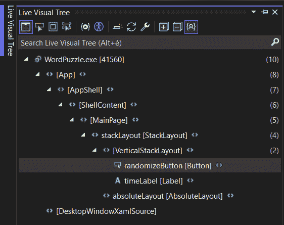

图 5.10 – 实时视觉树

现在我们已经介绍了实时视觉树，让我们探索顶部菜单栏。

### 探索实时视觉树顶部菜单栏

实时视觉树 *顶部菜单栏* 提供了一些方便的功能，可以帮助我们在代码库中导航并帮助我们调试布局。

*图 5.11* 显示了实时视觉树顶部菜单栏：

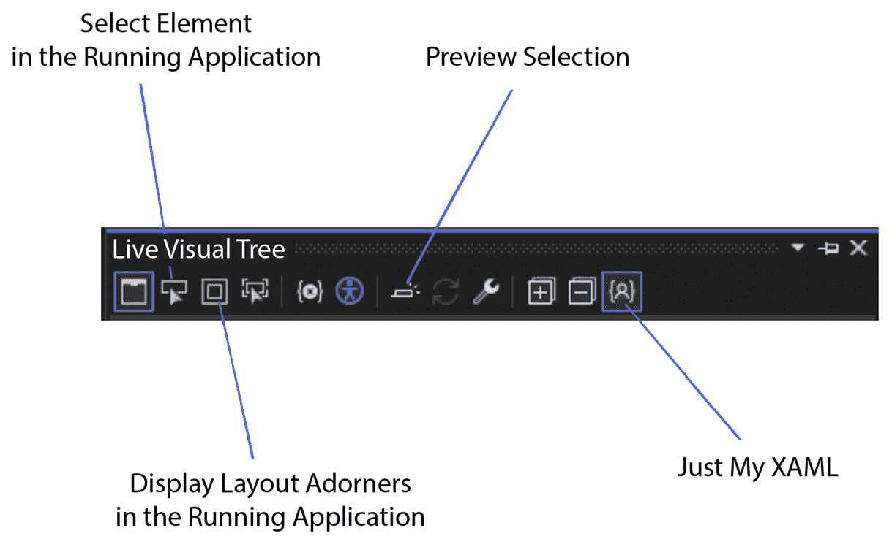

图 5.11 – 实时视觉树菜单

让我们通过全面概述我们可以如何利用它们来探索实时视觉树的这些功能：

+   **在运行的应用程序中选择元素**：此功能使我们能够在应用程序中选取一个 UI 元素。

    然后，实时视觉树会自动更新以显示树中的相应节点及其属性。此功能对于快速识别和检查我们应用程序中的特定元素非常有价值。

+   **在运行的应用程序中显示布局装饰器**：此模式展示了选定对象的水平和垂直线条边界，以及指示边距的矩形。这些视觉辅助工具使对齐和间距 UI 元素变得容易，有助于识别布局问题。

+   **预览选择**：此模式在我们可以访问应用程序源代码的情况下，揭示了所选元素的 XAML 声明。这是一个方便的功能，可以快速导航到实时视觉树中选定元素的源代码。

+   **仅我的 XAML**：默认情况下，实时视觉树通过使用 **仅我的 XAML** 功能简化了 XAML 元素的视图。此功能隐藏了我们可能不直接感兴趣的部分，简化了通过树状结构的导航。我们可以通过在 **实时视觉树** 工具栏上的 **显示仅我的 XAML** 按钮来切换此功能的开/关。请注意，Visual Studio for Mac 目前不支持此功能。

Visual Studio 2022 提供的即时重新加载功能无缝支持实时树视图和 XAML 预览功能。**即时重新加载**通过监控源代码中的更改来工作。当检测到更改时，即时重新加载将更改应用到正在运行的应用程序中，而无需完全重新构建。这意味着我们可以立即看到更改的效果，而不会丢失应用程序的当前状态。

现在我们已经探索了增强 MAUI 开发体验的主要工具，在下一节中，我们将看到如何直接在设备上调试我们的应用程序。

# 设备调试

正如我们在本章前面所看到的，我们可以轻松地将我们的应用程序作为 **通用** **Windows 平台**（**UWP**）运行，或者通过每个现有设备操作系统的模拟器。使用 Visual Studio 在设备上直接调试 .NET MAUI 应用程序涉及几个步骤。这个过程允许我们在真实设备上测试我们的应用程序，这对于测试需要特定硬件功能的特性或进行性能测试特别有用。

在本节中，我们将逐步指导如何在设备上进行调试。

## 在我们的设备上启用开发者模式

在设备上调试您的 MAUI 应用程序，首先激活 **开发者模式** 是至关重要的。然而，根据设备操作系统的不同，执行此操作的步骤也有所不同。

让我们看看在 Windows、Android 和 iOS 设备上启用开发者模式的步骤：

+   **对于 Windows 设备**：转到 **设置** | **更新和安全** | **为开发者** 并选择 **开发者模式**。

+   **对于 Android 设备**：转到 **设置** | **关于手机** | **软件信息**，并选择 **构建号** 选项，连续点击七次以解锁 **开发者选项**。之后，返回到 **设置** | **开发者选项** 并开启 USB 调试。

+   **对于 iOS 设备**：您需要有一台安装了 Xcode 的 Mac。将您的 iOS 设备连接到您的 Mac，打开 Xcode，转到**窗口** | **设备和模拟器**，选择您的设备，并启用**通过网络连接**。

**开发者模式**选项的位置可能因设备用户界面而异。如果您在查找 USB 调试时遇到困难，参考设备手册以获取指导将很有帮助。

## 网络设备

最后一步是将设备连接到计算机。这个过程将取决于我们的设备。让我们探索两种主要的使用案例。

### 安卓

当使用 Android 时，最好使用 USB，因为它是最简单、最可靠的方法。

连接后，您的设备将询问您是否信任该计算机（如果这是您第一次在其上进行调试）。您还可以选择**始终允许来自此计算机**以避免将来出现此提示。

或者，您还可以通过 Wi-Fi 调试 Android 设备，从而消除需要物理连接到计算机的需求。尽管这种方法需要更多设置工作，但在设备远离计算机且无法实现持续电缆连接的情况下，它可能是有益的。

### 带有热重启的 iOS

**热重启**是 Visual Studio 2022 中的一个功能，允许您快速将应用程序重新部署到 iOS 设备，而无需经过完整的构建和部署过程。这可以显著加快您的开发周期，尤其是在您频繁更改并需要在设备上测试它们时。以下是使用 Visual Studio 2022 进行 iOS 部署的热重启的使用方法。

要设置热重启，请按照以下步骤操作：

1.  首先，在 Visual Studio 工具栏中，从**调试**目标下拉菜单中选择**iOS 本地设备**，然后选择**本地设备**。

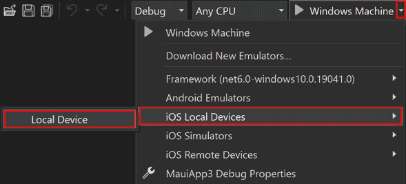

图 5.12 – iOS 本地设备

此操作将在调试开始时启动**设置热重启**设置向导，引导我们设置本地 iOS 设备以进行热重启部署。然后，选择**下一步**以继续。

1.  如果未安装 iTunes，设置向导会提示我们下载它。我们可以从 Microsoft Store 或 Apple 的网站安装 iTunes。

1.  接下来，使用 USB 线将您的 iOS 设备连接到您的开发机器，并在设备上被提示时信任您的开发机器。一旦您的本地 iOS 设备被检测到，请在设置向导中点击**下一步**。

1.  通过点击**使用个人账户登录**超链接并提供您的 App Store Connect API 密钥数据，配置**热重启**以使用您的个人 Apple 开发者计划账户。点击**完成**将完成设置向导，并将您的 Apple 开发者计划账户添加到 Visual Studio 中。

1.  在 **解决方案资源管理器** 中，右键单击您的项目并选择 **属性**。在 **iOS** | **捆绑签名** 下，从 **方案** 下拉菜单中选择 **自动配置**，然后点击 **配置** **自动配置**。

1.  在 **配置自动配置** 对话框中，选择您的 Connect API 密钥所在的团队，然后 Visual Studio 完成自动配置过程。

1.  最后，点击 **确定** 关闭对话框。

最后一步是启动针对我们的设备的调试会话。

## 启动调试会话

现在，Visual Studio 将识别我们的设备，并出现直接在其上调试的选项。

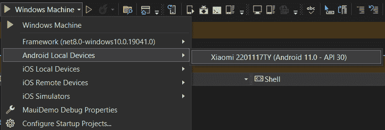

图 5.13 – Android 本地设备

当我们选择 **设备调试** 选项时，我们的应用程序将安装在手机上。随后，我们必须启动应用程序以开始调试，这与我们在模拟器或 Windows 机器上所做的方式类似。

在了解 MAUI、探索 Visual Studio 中的工具以及在本地设备上进行调试后，您可能会发现自己有一个现有的 Xamarin 项目需要迁移到 MAUI。让我们探讨如何利用 Visual Studio 扩展轻松实现这一点。

# 从 Xamarin 迁移

在本节中，我们将了解如何将使用 Xamarin 编写的遗留项目迁移到前沿的 MAUI 应用程序。首先，我们将探讨 MAUI 和 Xamarin 之间的关键差异。然后，最后，我们将安装 .NET 升级助手以用于迁移我们的项目。

## 理解关键差异

MAUI 被认为是 Xamarin 的继任者；然而，它们之间有一些关键差异。

**Xamarin** 是 .NET 生态系统中的一个框架，它允许开发人员使用 C# 和 .NET 创建跨平台应用程序。它支持主要平台，如 Android、iOS 和 Windows (UWP)。Xamarin 通过将代码编译成特定平台的本地二进制文件，促进了原生应用程序的开发，确保了高性能和原生用户体验。

相反，MAUI 是 Xamarin.Forms 的下一版本，旨在进一步简化跨平台开发。它扩展了平台支持，包括 Android、iOS、macOS 和 Windows，旨在实现这些平台上的统一代码库。MAUI 优先考虑现代开发实践，专注于性能优化并提供类似原生的体验。

Xamarin.Forms 提供了一套全面的 UI 控件和布局，这些控件在每个支持的平台上都以原生方式渲染。虽然开发人员在平台之间共享代码，但 Xamarin.Forms 确保用户界面元素符合每个平台的原生外观和感觉，确保设备之间的一致性。

此外，MAUI 引入了一组全新的控件和布局，旨在提高效率和灵活性。它旨在为所有支持的平台提供现代、统一的 UI 体验，弥合原生和跨平台应用程序开发之间的差距。

为了迁移我们的遗留 Xamarin 项目，我们有两种选择——手动操作或使用升级助手。让我们探讨如何使用 .NET 升级助手。

## 使用 .NET 升级助手

将我们的项目迁移的一种方法是修改 Xamarin 项目的每个文件，通过创建一个新的 MAUI 项目来将其转换为 MAUI。这种方法可能耗时且需要完全理解项目。然而，对于大型和复杂的项目来说，这是一个很好的选择。

或者，我们可以使用**.NET 升级助手**来简化我们的过程。.NET 升级助手可以作为 Visual Studio 扩展或 .NET 命令行工具安装。在这里，我们的示例中，我们将将其用作 Visual Studio 扩展。

.NET 升级助手可以通过以下方法作为 Visual Studio 扩展或 .NET 命令行工具安装：

1.  当 Visual Studio 激活时，导航到**扩展**|**管理扩展**以打开**管理****扩展**窗口。

1.  在**管理扩展**窗口中，在搜索框中搜索**升级**。

1.  选择**.NET 升级助手**选项，然后点击**安装**。

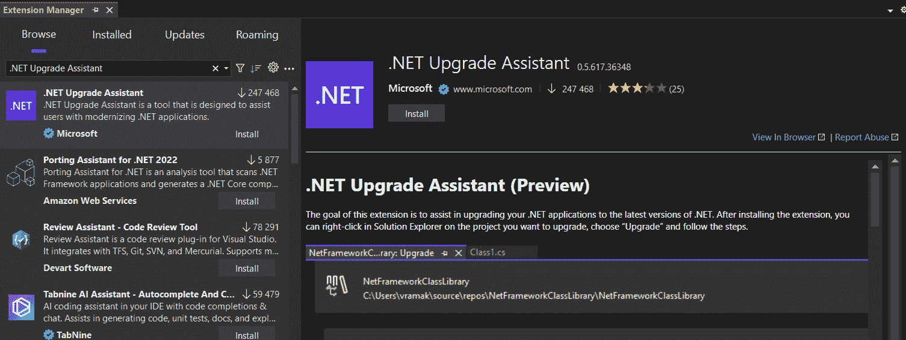

图 5.14 – 安装扩展 .NET 升级助手

1.  一旦扩展下载完成，安装将在 Visual Studio 关闭时启动，然后按照说明进行安装。

1.  安装后，在**解决方案资源管理器**中的项目节点上右键单击，并选择**升级**。

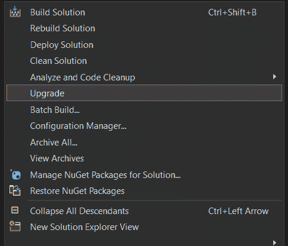

图 5.15 – 选择升级

1.  这将打开一个窗口，让您在两个选项之间进行选择（参见 *图 5.16* ）：

    +   **就地项目升级**：这将用新项目替换遗留项目。

    +   **并行项目升级**：这将创建一个包含新 MAUI 项目的全新项目。

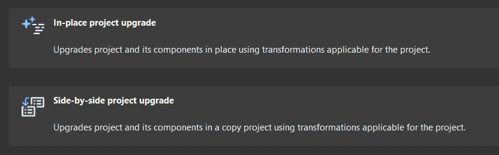

图 5.16 – 升级选项

我建议选择**并行项目升级**选项，以确保在升级成功完成之前，我们的工作 Xamarin 项目安全。

然后，我们只需按照向导的步骤完成升级。升级助手对于相对简单的项目是一个不错的选择。然而，在过程结束时，我们可能需要做一些手动调整。

对于复杂和大型项目，升级应手动进行，遵循 MAUI 专用书籍中找到的逐步说明。

# 摘要

在本章中，我们踏上了使用 Visual Studio 2022 深入多平台应用程序 UI 开发的旅程，重点关注 .NET MAUI。从揭示 .NET MAUI 的本质到掌握高效开发、跨多种设备调试以及从 Xamarin 无缝过渡的基本工具，我们已装备了构建引人入胜的多平台应用程序所需的知识和技能。

在我们的探索过程中，我们已经全面了解了.NET MAUI 的核心原则及其在现代应用开发中的重要性。我们深入研究了 Visual Studio 2022 为.NET MAUI 开发量身定制的工具库，利用它们的力量以信心和精确度创建、预览和调试应用程序。

在下一章中，我们将探索 Visual Studio 2022 的最新功能，以增强我们的 Web 开发体验。
