# 第六章：高级网络开发工具

在本章中，我们将开始对 Visual Studio 2022 强大环境中的网络开发工具进行高级探索。我们的探索将从检查由 Web Live Preview 驱动的网络表单设计器开始，它为我们提供了一个在处理遗留 ASP.NET 网页表单应用程序时可视化和迭代设计的方法。接下来，我们将关注 Visual Studio 的 API 探索和 Dev Tunnel 功能的动态能力，增强我们的 API 开发体验。进一步丰富我们的工具集，我们将研究 Visual Studio 的 Node.js 工作负载。

在本章中，我们将涵盖以下主题：

+   由 Web Live Preview 提供的实时网页预览

+   使用 Visual Studio 的 API 探索和 Dev Tunnel

+   Visual Studio 与 Node.js 的集成

到本章结束时，凭借这些高级网络开发工具和技术，我们将能够将我们的网络项目生产力提升到新的高度。

# 技术要求

在编写本章时，我使用了以下版本的 Visual Studio：

+   Visual Studio Enterprise 2022 版本 17.12.0

+   预览 1.0

本章的代码文件可以在 [`github.com/PacktPublishing/Mastering-Visual-Studio-2022/tree/main/ch06`](https://github.com/PacktPublishing/Mastering-Visual-Studio-2022/tree/main/ch06) 找到

# 由 Web Live Preview 提供的实时网页预览

微软宣布，当与旧框架（包括网页表单应用程序）一起使用时，ASP.NET 将继续支持旧的 .NET Framework 版本。随后，Visual Studio 2022 引入了一个由 Web Live Preview 驱动的 Web 表单项目设计器。在本节中，我们将探讨如何利用新的 Web 表单设计器以及 Web Live Preview 提供的附加功能。此功能专门针对处理遗留项目的团队。

由于此功能目前仅针对 .NET Framework 中的 Web 表单，如果您正在使用 MVC 和 .NET Core，则没有可用的表单设计器。为了保持对最新网络标准和浏览器支持的最新了解，Visual Studio 中的 Web Live Preview 使用 WebView2，它由 Microsoft Edge 驱动。

为了说明我们的示例，我们将创建一个使用 *ASP.NET (.NET Framework)* 的项目。

如果我们打开 **default.aspx** 文件或任何其他 **.aspx** 文件，我们会在左下角注意到两个按钮：

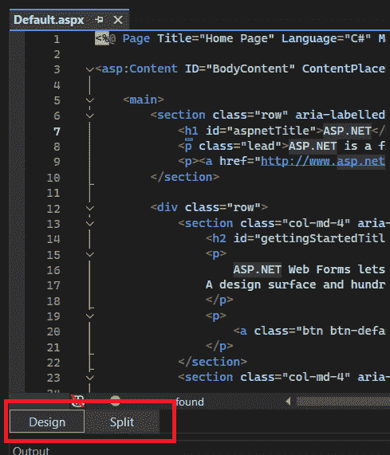


这些按钮允许我们以两种不同的方式显示由 Web Live Preview 驱动的设计器：全尺寸或分割在代码旁边。我们将点击 **分割** 按钮来观察设计器对我们代码库的影响：

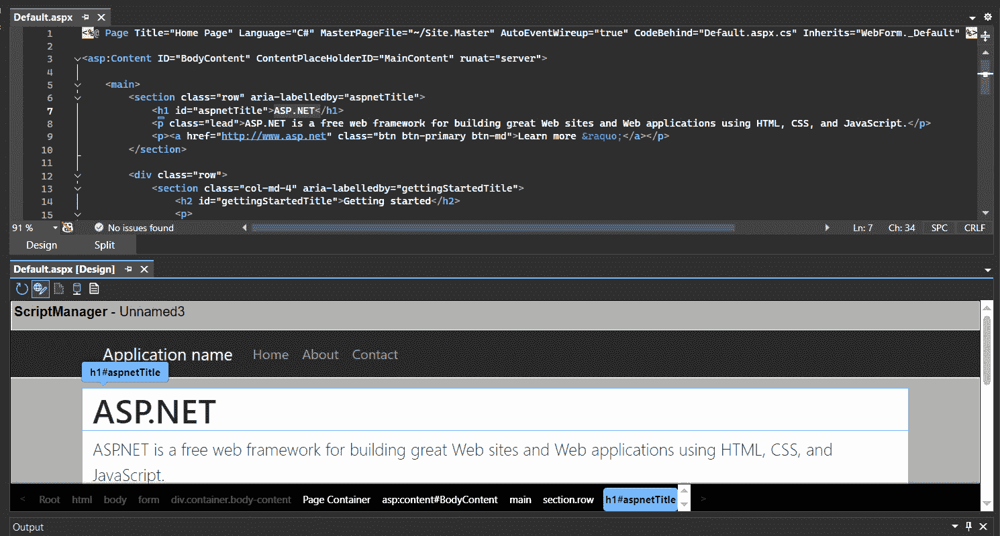

图 6.2 – 分割视图

通过单击组件，我们可以编辑标签。此外，就像在 WinForm 设计器中一样，我们可以在工具箱中拖放项目，将它们放置在设计器中。

此工具箱提供了以下选项：

+   **刷新**：更新您的 Web 应用程序的实时预览，以反映在编辑器中做出的任何更改

+   **切换设计模式**：激活或停用可视化设计器界面，使我们能够在设计 UI 和直接编辑代码之间切换

+   **显示空元素**：在页面上显示一个空的 UI 组件，以便我们配置其属性并添加内容

+   **使用实时数据**：将我们的应用程序的 UI 元素动态绑定到数据源，使我们能够在开发过程中实时查看我们的应用程序如何与数据交互

+   **显示源视图**：打开与所选 UI 元素或控件关联的代码后置文件，使我们能够直接查看或编辑源代码：


图 6.3 – 设计器 Web 工具箱

如*图 6.2*所示，设计者默认显示实时数据以提供有价值的预览。在某些情况下，显示占位符可能很有价值。这就是为什么设计工具提供了**使用实时数据**切换选项。

在本节中，我们了解了 Visual Studio 2022 如何增强我们使用遗留 Web 框架的工作体验。现在，让我们来看看 Visual Studio 2022 为前沿 API 开发带来了什么。

# 使用 API 资源管理器和 Dev Tunnel 与 Visual Studio

当我们谈论 Web 开发时，API 会浮现在脑海中，用于处理每个组件的通信。在本节中，我们将探索新的 Visual Studio 功能，以增强我们在 API 开发过程中的体验。首先，我们将学习如何使用 HTTP 文件来探索我们的端点，之后我们将配置 Dev Tunnel，以便我们可以与客户、经理和同事共享我们正在开发的 API。

## 使用端点资源管理器生成 .http 文件

使用**.http**文件测试和记录 API 端点非常方便和高效。这种方法允许我们在**集成开发环境**（**IDE**）中直接简化 API 测试和开发，例如 Visual Studio、Visual Studio Code 或 IntelliJ。

使用**.http**文件，我们可以在我们的 IDE 中直接编写 HTTP 请求并执行它们，而无需切换到单独的工具或浏览器。这种集成使我们的开发工作流程保持在 IDE 中，从而实现快速迭代和调试，最终提高生产力。

这些 **.http** 文件遵循 RFC 9110 HTTP 语义标准（文档的最新版本，为理解和实现协议奠定了坚实的基础：[`www.rfc-editor.org/rfc/rfc9110.html`](https://www.rfc-editor.org/rfc/rfc9110.html)），确保我们的请求格式正确且被集成到我们 IDE 中的 HTTP 客户端正确理解。这种标准化也使得文件易于携带和共享，并且可以无缝集成到我们的 CI/CD 管道中，以实现高效开发。

此外，将 **.http** 文件集成到我们现有的开发流程中，包括版本控制和代码审查，简化了 API 测试代码的管理，使其更易于维护和阅读。对各种 HTTP 方法、头和身份验证机制的支持为我们提供了在 API 测试方面的灵活性和强大功能。

关于 Visual Studio，对 **.http** 文件的支持显著简化了 API 测试过程。我们可以在 Visual Studio 中直接创建和执行 HTTP 请求，从而消除了为测试目的重新创建请求的需要，这使得整个过程更加高效和用户友好。

首先，我们可以使用 **Endpoint Explorer** 视图列出我们应用程序的所有端点。要打开它，我们可以使用顶部菜单栏，转到 **视图** | **其他** **窗口** | **端点探索器**：

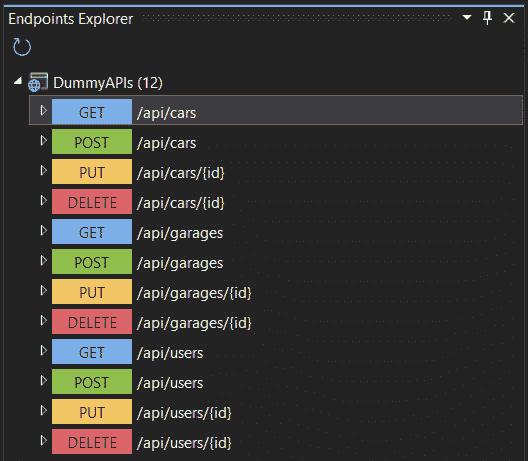

图 6.4 – 端点探索器

此视图显示我们在应用程序中构建的所有端点的列表。在这里，我们可以右键单击一个端点，它将显示以下两个选项：

+   **在编辑器中打开**：跳转到定义端点的代码

+   **生成请求**：在 **.** **http** 文件中编写必要的代码：

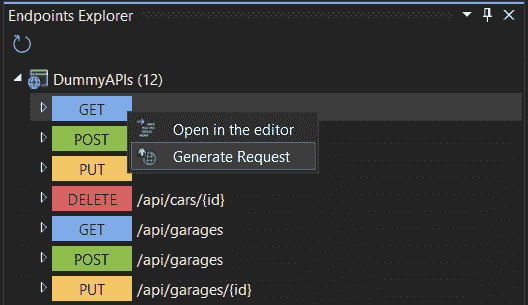

图 6.5 – 生成请求

在此示例（ *图 6* *.5* ）中，我们正在生成 **/** **api/cars** 端点的请求：

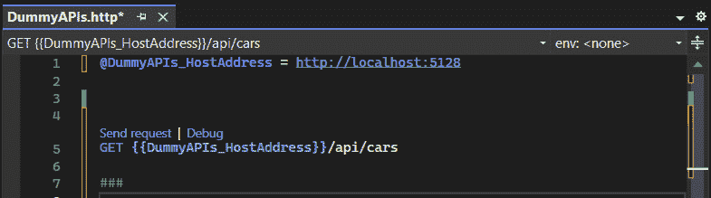

图 6.6 – 生成的 .http 请求

现在，我们在 **.http** 文件中至少有一个请求，我们可以用它来测试和调试我们的端点。Visual Studio 提供了一个内置的界面来探索发送请求的响应：


图 6.7 – .http 文件响应

在测试 API 时，我们可能想要使用不同的环境。HTTP 文件允许我们在外部文件中定义环境变量。为此，我们可以创建一个名为 **http-client.env.json** 的文件。此文件必须放置在 **.http** 文件所在的同一文件夹或父文件夹中。我们必须在 JSON 文件中设置不同的环境，如下所示：

```cs
{
  "dev": {
    "HostAddress": "https://localhost:5128"
  },
  "remote": {
    "HostAddress": "https://contoso.com"
  }
}
```

现在，我们可以从文件的右上角选择我们想要发送请求的环境：

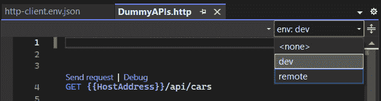

图 6.8 – 选择环境

现在，我们可以构建一个可以与团队或客户共享以测试和记录我们的 API 的文件。在某些场景中，我们可能希望通过另一台设备调试我们的 API。Visual Studio 2022 提供了一个名为 **Dev Tunnel** 的功能，允许我们这样做。

## 配置 Dev Tunnel

在 Visual Studio 2022 中，Dev Tunnel 允许开发者创建无法直接连接的机器之间的临时连接。这个特性非常适合调试和测试 Web API 和 ASP.NET Core 应用程序，尤其是在这些应用程序需要从各种设备（如移动模拟器或物理设备）访问时。当我们正在开发需要跨不同机器或设备测试的应用程序时，这是一个非常有价值的工具。

这里有一些 Dev Tunnel 可能有用的用例：

+   Web 应用程序与手机或平板电脑之间的通信

+   端口转发解决方案

+   与外部服务（例如，Twilio webhooks）的通信

我们可以通过点击调试模式按钮并选择 **Dev Tunnels（无活动隧道）** | **创建** **隧道…** 来创建一个 Dev Tunnel：

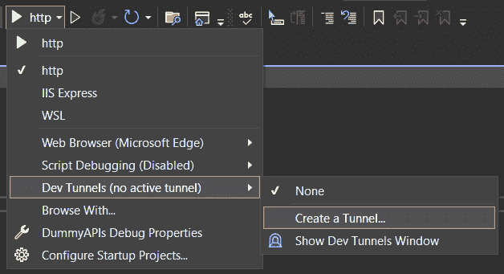

图 6.9 – 创建隧道…

之后，我们就可以访问 Dev Tunnel 的配置窗口：

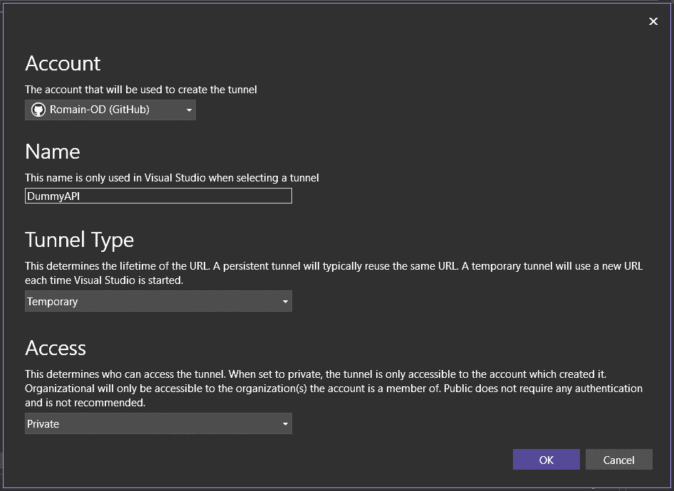

图 6.10 – 配置我们的 Dev Tunnel

在此窗口中，我们可以设置以下参数：

+   **账户**：我们需要选择一个账户来创建 Dev Tunnel。这可能是 Azure、Microsoft Account（MSA）或 GitHub。

+   **名称**：在 Visual Studio 中用于识别 Dev Tunnel 的名称。

+   **隧道类型**：在这里，我们可以选择两种类型 – **临时**或**持久**：

    +   **临时**：每次启动 Visual Studio 时都会生成一个新的 URL

    +   **持久**：每次启动 Visual Studio 时都会显示相同的 URL

+   **访问**：这允许我们设置访问级别。在这里，我们有三个选项：

    +   **私有**：只有创建者可以访问

    +   **组织**：同一组织内的所有用户均可访问

    +   **公共**：免费且任何人都可以使用

现在，我们可以从本地主机获取一个 URL，并准备好在任何设备上共享。例如，我们可以在移动设备上使用 URL API 测试我们的应用程序，在此期间，我们可以使用 Visual Studio 2022 调试 API 调用。

当我们谈论现代高级 Web 开发时，现代 JavaScript 框架是前端工具列表中的首选。让我们看看我们如何利用 Visual Studio 进行 Node.js 开发。

# Node.js 与 Visual Studio 的集成

为了开发现代 JavaScript 前端和后端，我们必须探索 Visual Studio 提供的一些功能。在本节中，我们将深入了解如何使用 Visual Studio 工作负载创建 JavaScript 项目。然后，我们将学习如何管理 **npm** 包，以便我们可以直接通过 Visual Studio 调试我们的 JavaScript 应用程序。

## 探索 JavaScript 项目模板

在 Visual Studio 2022 中，引入了一种新的项目类型，称为 **JavaScript 项目系统**（**JSPS**），它使用 **.esproj** 文件格式。这个系统允许我们在 Visual Studio 中直接创建独立的 Angular、React 和 Vue 项目。这些前端项目利用了我们机器上安装的相应框架的 CLI 工具，使我们能够选择我们偏好的模板版本。

首先，我们需要验证 Node.js workload 是否已正确安装在我们的 Visual Studio 实例中。为此，打开 Visual Studio 安装程序，通过单击所需 Visual Studio 实例的 **更新** 按钮来检查已安装的工作负载（见 *图 6* *.11* ）：

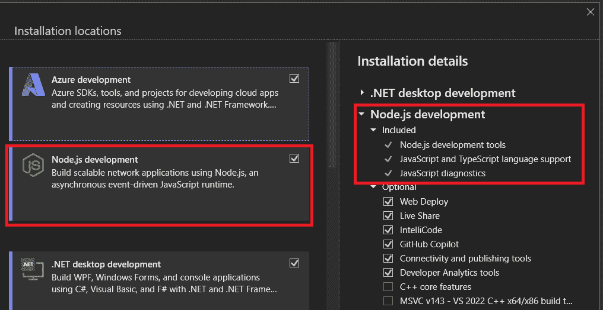

图 6.11 – Node.js 开发 workload

确保我们安装了必要的 workload 后，我们可以探索 Visual Studio 2022 为 JavaScript 开发提供的模板。为此，我们将创建一个新的项目，并在 **语言组合框** 中选择 **JavaScript**。一旦你这样做，你将看到以下屏幕：

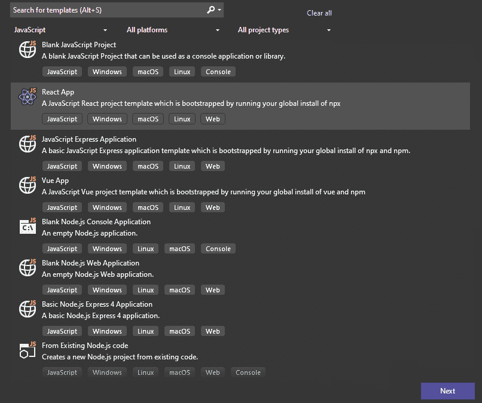

图 6.12 – JavaScript 模板

在这里，我们可以看到 Visual Studio 提供了几个 JavaScript 基础模板，这些模板可以分为三类：

+   ASP.NET Core 与现代 JavaScript 框架结合

+   独立 JavaScript 项目（客户端）

+   后端 Node.js 项目

对于我们的示例，我们将选择 **ReactApp** 模板作为独立的 JavaScript 项目。

在创建项目时，我们会看到 Visual Studio 启动一个控制台，提示输入 **npm cli** 命令，以便它可以创建应用程序：

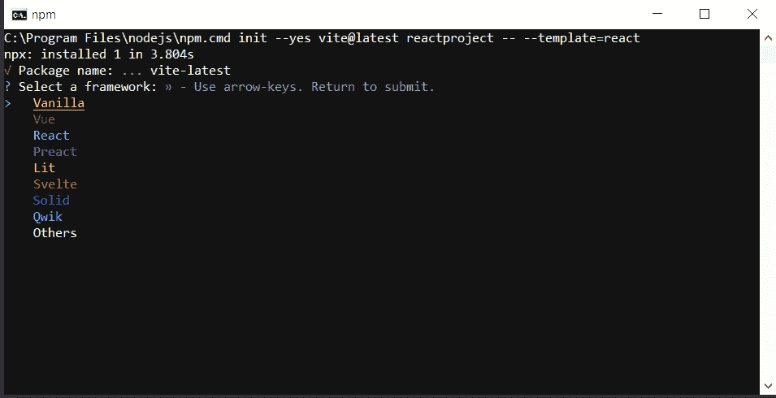

图 6.13 – npm CLI

一旦我们设置了项目，我们就可以在遵循 React 或其他现代 JavaScript 框架的同时开发我们的应用程序。其中一个初始步骤是安装必要的 npm 包。虽然我们可以直接使用 npm CLI 来做这件事，但让我们看看 Visual Studio 如何帮助我们完成这个过程。

## 管理 npm 包

在 Visual Studio 2022 中管理 npm 包涉及使用 npm 包管理器。

从 Visual Studio 2022 开始，我们可以访问基于 CLI 的项目的 npm 包管理器。这意味着我们现在可以像下载 ASP.NET Core 项目的 NuGet 包一样下载 npm 模块。然后，我们可以利用 **package.json** 文件对包进行修改，并在需要时将其删除。

我们可以通过右键单击文件夹结构中的 **npm** 节点来访问 npm 包管理器：

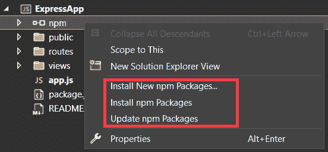

图 6.14 – 调试 JavaScript 应用程序

然后，我们可以选择 **安装新的 npm 包…**，这将打开管理器：

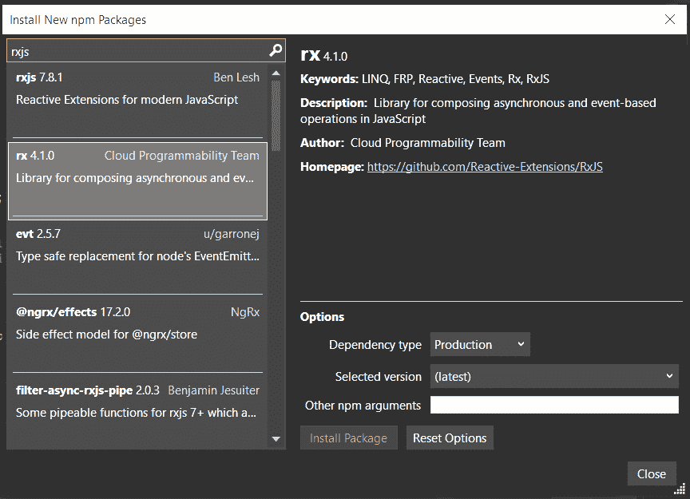

图 6.15 – 安装新的 npm 包

在此窗口中，我们可以找到构建现代 JavaScript 应用程序所需的所有包。与任何应用程序开发过程一样，总有需要调试的时候。让我们来探讨 Visual Studio 如何增强我们调试现代 JavaScript 应用程序的经验。

## 调试 JavaScript 应用程序

使用服务器端 JavaScript 可以使我们以类似于调试 C# 应用程序的方式调试我们的应用程序。为此，我们必须遵循以下步骤：

1.  **设置断点**：在 Visual Studio 中打开您的服务器端 JavaScript 文件（例如，**server.js**），然后在空白区域单击以设置断点。

1.  **以调试模式运行应用程序**：按 *F5* 或转到 **调试** | **开始调试** 以在调试模式下运行我们的应用程序。Visual Studio 将在设置的断点处暂停执行。

1.  **检查应用程序的状态**：在断点暂停时，我们可以通过悬停在作用域内的变量上或使用如 **局部变量** 和 **监视** 等调试窗口来检查应用程序的状态。

1.  **继续执行**：在检查完应用程序后，再次按 *F5* 以继续运行我们的应用程序。

如您所见，调试服务器端 JavaScript 应用程序非常简单。现在，让我们来探讨如何调试客户端脚本。

### 调试客户端脚本

在 Visual Studio 中，当涉及到客户端调试时，我们为 Chrome 和 Microsoft Edge（Chromium）提供了专门的调试支持。有时，我们的调试器会自动在 JavaScript、TypeScript 以及 HTML 文件中嵌入的脚本断点处停止。

要使用 Chrome、Edge（Chromium）和 Internet Explorer 调试 ASP.NET 中的 JavaScript，我们需要通过选择 **工具** | **选项** | **调试** | **常规** 来导航到调试选项，然后勾选 **为 ASP.NET（Chrome、Edge 和 IE）启用 JavaScript 调试** 复选框：

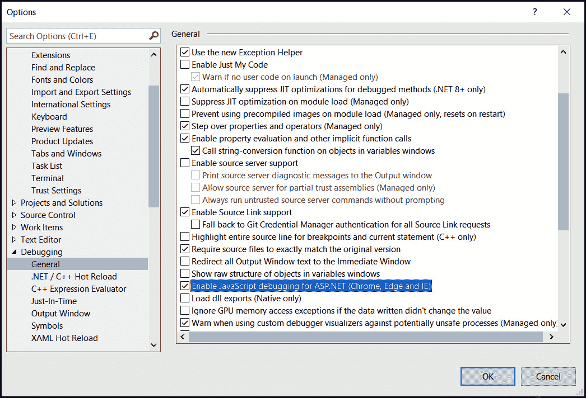

图 6.16 – 调试选项

启用此选项确保 Visual Studio 在 ASP.NET 项目中有效地支持客户端代码的调试。

在我们之前的示例中，我们创建了一个独立的 React 应用程序，它需要我们的源代码通过 TypeScript 或 Babel 等工具进行转换。在调试期间使用源映射通过连接压缩或转换代码与其原始的、可读的格式，确保了最佳体验。这通过允许开发者在浏览器开发者工具或 Visual Studio 的调试环境中设置断点并检查其原始状态下的变量，从而简化了调试过程。

Visual Studio 自动为 TypeScript 项目生成源映射。然而，对于 JavaScript 项目，我们需要配置构建工具，如 webpack，以生成源映射。对于 TypeScript 项目，包含一个设置 **sourceMap** 编译器选项为 true 的 **tsconfig.json** 文件。对于使用 webpack 的 JavaScript 项目，配置它为 **devtool: "source-map"**。

接下来，确保 Visual Studio 正确配置以使用源映射。这可能涉及调整生成的源映射文件中的路径，以准确引用源文件。对于 webpack 用户，从源映射路径中移除 **webpack:///** 前缀。

一旦设置了源映射，在 Visual Studio 中调试 React 项目就变得简单直接。只需将调试器附加到正在运行的应用程序上——这允许你设置断点并像代码以原始、未压缩的形式运行时一样逐步执行代码。这种简化的方法有助于快速识别和修复问题。

对于更复杂的调试场景，可能需要对项目配置进行额外调整或使用辅助工具。确保 webpack 正确配置以生成源映射。此外，在浏览器开发者工具设置中启用 JavaScript 源映射，以便在调试期间充分利用源映射。

# 摘要

在本章中，我们开始了对 Visual Studio 2022 强大环境中网络开发工具的高级探索。我们的旅程从对 Web Live Preview 的深入分析开始，这是一个前沿工具，能够实现实时网络预览，从而简化 Web Forms 项目的可视化设计和迭代。

然后，我们深入研究了 Visual Studio 的 API 探索和 Dev Tunnel 功能的动态能力，使开发者能够深入了解服务端点，并能够无缝集成外部 API 进行交互式开发和测试。

此外，我们探讨了 Node.js 与 Visual Studio 的集成，揭示了 JavaScript 项目模板、有效的 npm 包管理技巧以及 Visual Studio 生态系统内调试 JavaScript 应用程序的复杂性。

在下一章中，我们将深入探讨 Visual Studio 2022 与机器学习的集成，探索如何利用最新功能无缝地将机器学习模型集成到应用程序中。
