# 7

# 机器学习集成

在本章中，我们将开始探索如何使用 Visual Studio 无缝地将 **机器学习**（**ML**）集成到软件开发工作流程中。随着我们在数字时代的不断进步，将机器学习能力集成到应用程序中变得越来越关键，这使我们能够在软件系统中实现智能决策和自动化。

我们的旅程从机器学习的简介开始，揭示其核心概念和应用。接下来，我们将通过利用 Visual Studio 中的 **ML.NET** 和 **Model Builder** 的力量来深入实际方面。通过动手示例和指导教程，我们将展示如何在熟悉的 Visual Studio 环境中直接创建和训练 ML 模型。

随着我们前进，重点转向 ML 模型的部署策略。我们将探讨如何在 ASP.NET Core web API 中部署一个训练好的模型，以实现实时推理和与基于 Web 的应用程序的集成。此外，我们还将探索在 Azure Functions 中部署模型，利用无服务器计算来实现可扩展且成本效益高的部署场景。

本章涵盖的关键主题包括以下内容：

+   机器学习简介

+   使用 ML.NET 和 Model Builder 创建机器学习模型

+   在 ASP.NET Core web API 中部署模型

+   在 Azure Functions 中部署模型

在这个旅程中，我们将解锁使用 Visual Studio 将 ML 集成到我们的软件项目中的潜力，使我们能够构建与当今技术景观相呼应的智能和自适应应用程序。

# 技术要求

我撰写本章时考虑的 Visual Studio 版本如下：

+   Visual Studio Enterprise 2022 版本 17.12.0

+   预览 1.0

本章的代码文件可以在[`github.com/PacktPublishing/Mastering-Visual-Studio-2022/tree/main/ch07`](https://github.com/PacktPublishing/Mastering-Visual-Studio-2022/tree/main/ch07)找到。

# 机器学习简介

**ML** 是人工智能（**AI**）的一个分支，专注于开发算法和统计模型，使计算机能够在没有明确编程的情况下执行任务。这些任务可以从基本的模式识别到复杂的决策过程。在其核心，机器学习涉及机器从数据中学习以随着时间的推移提高算法的性能。

机器学习主要有三种类型：

+   **监督学习**：这涉及到在标记的数据上训练一个模型，根据输入数据预测输出，例如回归（预测连续值）和分类（预测离散标签）

+   **无监督学习**：这涉及到在未标记的数据上训练一个模型，以识别数据集中的模式或结构，例如聚类（将相似的数据点分组）和降维（减少输入变量）

+   **强化学习**：模型通过与环境的交互并接收奖励或惩罚形式的反馈来学习做出决策，以最大化累积奖励。

ML 利用各种算法，如决策树、**支持向量机**（**SVMs**）和神经网络，这些算法基于特定问题、数据特征和期望结果进行选择。

ML.NET 是微软的一个开源、跨平台的 ML 框架，它简化了.NET 开发者的 ML，使他们能够将 ML 功能集成到应用程序中，而无需深入的专业 ML 或数据科学知识。

ML.NET 的关键特性包括以下内容：

+   **跨平台兼容性**：它在 Windows、Linux 和 macOS 上无缝工作。

+   **与.NET 的集成**：它轻松地将 ML 功能集成到.NET 项目中。

+   **可定制模型**：开发者可以根据自己的需求定制模型，包括在自定义数据集上进行训练。

+   **透明度和可解释性**：它提供了理解模型如何进行预测的工具，这对于建立对人工智能的信任至关重要。

+   **开源和社区驱动**：它受益于社区贡献，导致持续改进和新特性的出现。

**ML.NET**是一个多功能的框架，它简化了将 ML 功能集成到.NET 应用程序中的过程。如**自动 ML**（**AutoML**）和 ML.NET CLI 以及 Model Builder 等工具使过程变得简单，即使对于没有丰富数据科学经验的开发者也是如此。它支持跨平台开发，并通过 NimbusML 无缝集成到流行的 Python 库，如 TensorFlow 和 ONNX。

ML.NET 中的 Model Builder 工具通过 AutoML 简化了模型创建过程，使开发者能够通过加载数据快速部署模型。此工具自动化了整个模型构建过程，包括为使用这些模型生成代码。结合其利用现有 ML 库的灵活性，ML.NET 为寻求将 ML 集成到其应用程序中的.NET 开发者提供了一个强大的解决方案。

现在，让我们深入了解如何使用 ML.NET 和直观的 Model Builder**用户****界面**（**UI**）创建 ML 模型。

# 使用 ML.NET 和 Model Builder UI 创建 ML 模型

Model Builder 最初作为 Visual Studio 2019 的一个预览功能引入，截至 2022 年已转变为一个稳定的功能。在本节中，我们将探讨如何使用 Model Builder 结合 ML.NET 创建一个机器学习模型。

首先，让我们确保 Model Builder 组件已正确安装在我们的 Visual Studio 实例中。为此，我们打开 Visual Studio 安装程序，并确认在**单独组件**选项卡下已选中 ML.NET Model Builder：

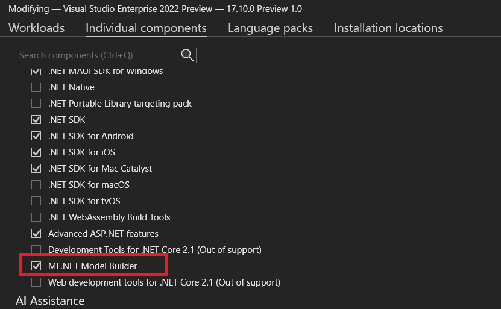

图 7.1 – 安装程序 – ML.NET Model Builder

然后，我们可以创建一个新的空控制台项目作为支持我们的机器学习过程的基础。现在，我们已经准备就绪，可以通过右键单击项目并选择 **添加** | **机器** **学习模型…** 来创建我们的 ML.NET：

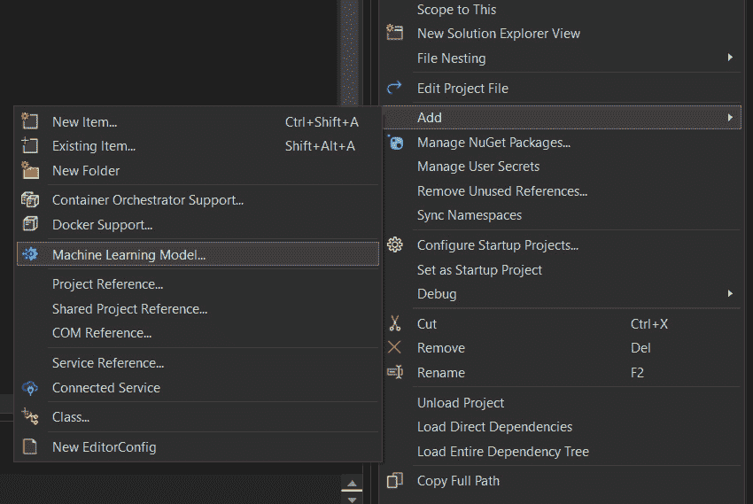

图 7.2 – 添加一个机器学习模型

此前的操作将启动 **.mbconfig** 文件。此文件是一个 JSON 文件，它跟踪 UI 的状态，包括模型的配置、数据转换、算法以及学习率、层数和神经元数量等设置。

在选择 **.mbconfig** 文件名称后，模型构建器提示的第一步是选择我们机器学习模型的 **场景** 选项。

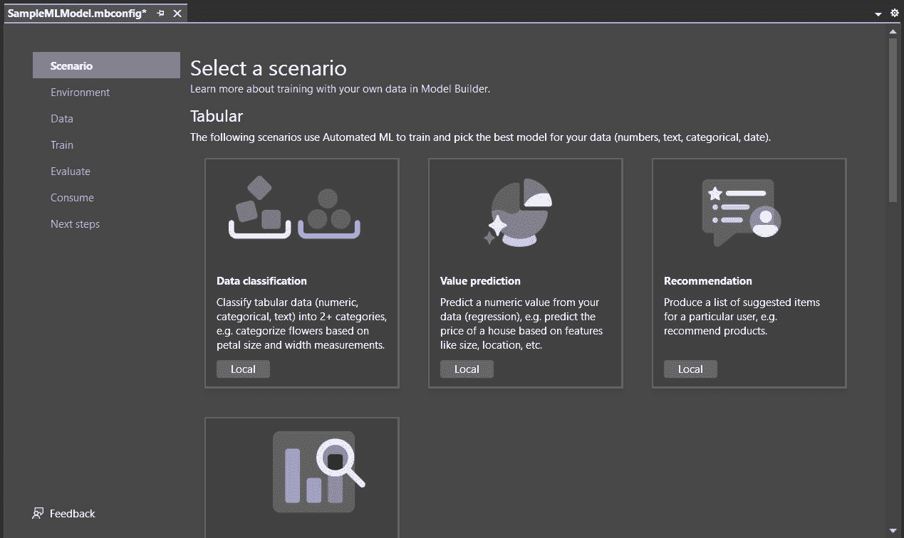

图 7.3 – 配置 .mbconfig

模型构建器的选择窗口提供了三个主要类别组织下的几个场景：

+   **表格**：本类别包括回归、分类和聚类等任务的场景，其中数据以表格格式组织

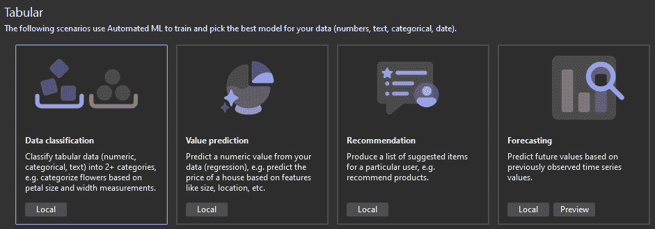

图 7.4 – 表格

+   **计算机视觉**：本类别包括与图像分类、目标检测和其他计算机视觉任务相关的场景

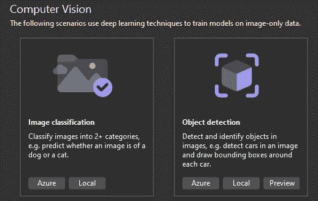

图 7.5 – 计算机视觉

+   **自然语言处理**：本类别包括自然语言处理任务的场景，例如情感分析、文本分类和语言翻译

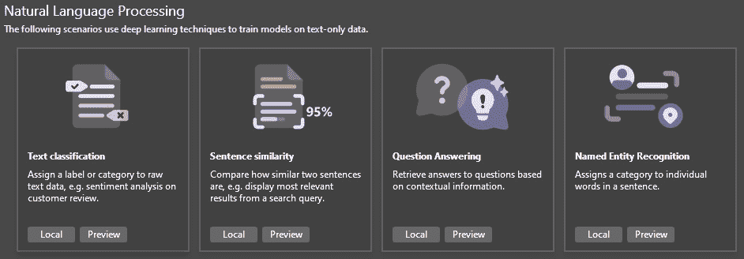

图 7.6 – 自然语言处理

在我们的示例中，我们将在 **表格** 类别下选择 **数据分类** 场景。

第二步是选择训练环境。根据情况，我们可以选择在本地机器上或在 Azure 云中训练我们的机器学习模型。当我们本地训练时，我们在计算机资源（CPU、内存和磁盘）的限制内操作。然而，当我们云中训练时，我们可以扩展我们的资源以满足场景的需求，特别是处理大数据集的需求。请注意，环境的可用性取决于我们选择的场景。以下是目前可用组合的表格：

| **场景** | **本地 CPU** | **本地 GPU** | **Azure** |
| --- | --- | --- | --- |
| 数据分类 | **✔️** | **❌** | **❌** |
| 值预测 | **✔️** | **❌** | **❌** |
| 推荐 | **✔️** | **❌** | **❌** |
| 预测 | **✔️** | **❌** | **❌** |
| 图像分类 | **✔️** | **✔️** | **✔️** |
| 目标检测 | **❌** | **❌** | **✔️** |
| 文本分类 | **✔️** | **✔️** | **❌** |

现在我们已经选择了场景和训练环境，我们必须收集用于训练的数据。模型构建器将根据我们选择的场景引导我们完成这个过程，帮助我们上传数据。

最后，我们可以启动我们 ML 模型的训练。我们可以为训练设置一个特定的开始时间。Model Builder 会根据我们的数据集大小自动选择训练时间。

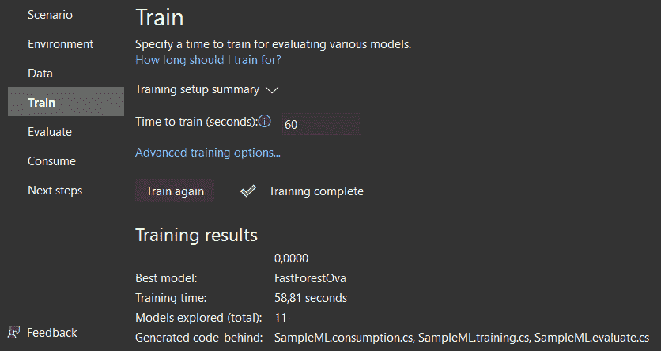

图 7.7 – 训练

在 **Evaluate** 步骤中，我们将发现性能最佳的算法及其最高准确率，为我们模型的表现提供有价值的见解。此步骤还使我们能够在 UI 中直接实验模型。

在 **尝试您的模型** 部分，我们可以输入样本数据以生成预测。文本框预先填充了数据集的第一行数据，但我们可以修改输入并点击 **预测** 按钮来观察不同的价格预测。

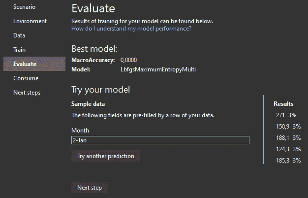

图 7.8 – 评估

Model Builder 的最后一个面板是关于消费我们刚刚创建的模型。让我们探索如何使用 Visual Studio 将我们的模型集成到 Web API 中。

# 在 ASP.NET Core Web API 中部署模型

在本节中，我们将学习如何将我们的 ML.NET 模型集成到现有的 Web API 中。为此，我们将跳转到 Model Builder 的 **Consume** 面板。

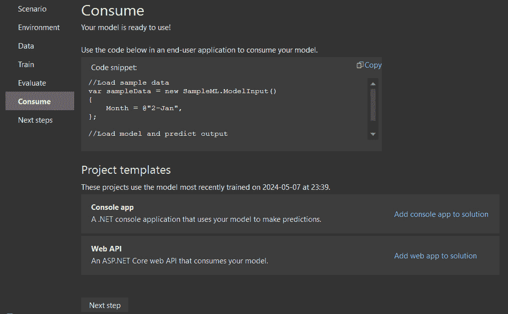

图 7.9 – 消费

Model Builder 中的 **Consume** 面板是集成我们训练好的 ML 模型到 .NET 应用程序的关键工具。一旦我们完成了评估阶段，Model Builder 会生成一个模型文件以及将模型集成到我们的应用程序中所需的代码。这些模型以 **.zip** 文件的形式保存，并将加载和使用我们的模型的代码添加到我们解决方案中的新项目中。此外，Model Builder 还提供了一个我们可以运行的示例控制台应用程序，以查看我们的模型在实际中的应用。

**Consume** 面板为我们提供了创建消费我们模型的项目的选项，例如以下内容：

+   **控制台应用**：生成一个专门用于使用我们的模型进行预测的 .NET 控制台应用程序

+   **Web API**：设置 ASP.NET Core Web API，允许我们通过互联网消费我们的模型

这些项目对于将我们的模型部署到各种环境至关重要，无论是用于本地测试还是可在线访问的基于 Web 的应用程序。

让我们点击 **将 Web 应用添加到解决方案** 链接以创建新的 ASP.NET Core Web API，这将公开我们的模型。这将设置一个可工作的 Web API，使我们能够以最小 API 的方式公开我们刚刚训练的模型。

现在，为了了解它的表述方式，我们将查看向导为我们生成的内容。让我们探索项目结构：

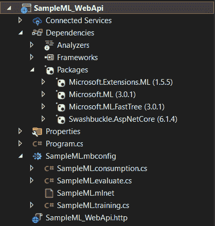

图 7.10 – 生成 Web API 项目结构

模板使用以下包使 ML.NET 模型对 ML 可用：

+   **Microsoft.ML**

+   **Microsoft.Extensions.ML**

在这些库中，在 **Program.cs** 文件中，我们可以观察到 Visual Studio 生成了一个 POST 请求。以下是代码片段：

```cs
app.MapPost("/predict",
    async (PredictionEnginePool<SampleML.ModelInput,
           SampleML.ModelOutput> predictionEnginePool,
           SampleML.ModelInput input) =>
        await Task.FromResult(
            predictionEnginePool.Predict(input)
        )
);
```

此代码片段使用模型生成器生成的模型在 ASP.NET Core 最小 API 应用程序中设置 HTTP POST **端点 /predict**。

这是因为以下代码行：

```cs
builder.Services
    .AddPredictionEnginePool<SampleML.ModelInput,
        SampleML.ModelOutput>()
    .FromFile("SampleML.mlnet");
```

此代码正在配置一个 ASP.NET Core 应用程序，以使用名为 **SampleML.mlnet** 的文件中存储的 ML 模型进行预测。该模型期望输入为 **SampleML.ModelInput** 类型，并产生 **SampleML.ModelOutput** 类型的输出。这种设置允许应用程序在不同部分的应用程序中有效地管理和重用 ML 模型。

现在，我们可以使用端点资源管理器和 **.http** 文件测试端点，正如我们在 *第六章* 中所看到的。由于此端点使用的 HTTP 动词是 **POST**，我们必须在我们的请求中添加一个主体。

这是设置我们的工作请求在 **.** **http** 文件中的正确语法：

```cs
@SampleML_WebApi_HostAddress = https://localhost:63555
POST {{SampleML_WebApi_HostAddress}}/predict
Content-Type: application/json
{
    "Month": "2-Jan"
}
```

现在，我们可以验证我们拥有一个能够消费由 Model Builder 生成的模型的 Web API。这个 Web API 可以像 .NET 生态系统中的任何其他 API 一样无缝部署。

消费我们生成的 ML 模型的另一种方法是，通过 Azure Functions 消费它。

# 在 Azure Functions 中部署模型

在本节中，我们将学习如何将 Model Builder 生成的 ML 模型集成到 Azure Functions 中。这个过程将不会那么直接，因为没有提供模板。

**Azure Functions** 是由 Microsoft Azure 提供的无服务器计算服务。无服务器计算是一种云计算执行模型，其中云服务提供商运行服务器，并动态管理机器资源的分配。计费基于应用程序实际消耗的资源数量，而不是预先购买的容量单位。

首先，我们需要确保 Azure 开发工作负载在我们的 Visual Studio 实例中安装良好，方法是导航到 Visual Studio 安装程序。

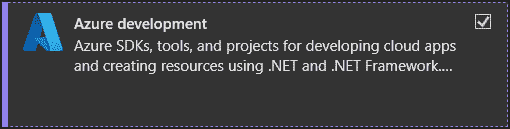

图 7.11 – Azure 开发工作负载

一旦工作负载安装完成，我们可以开始创建一个新的 Azure Functions 项目，例如，我们将将其命名为 **SampleML_AzureFunction**，并将所有参数保持默认设置。

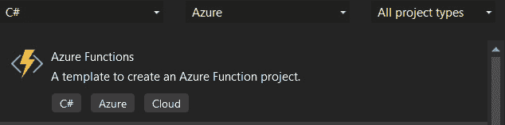

图 7.12 – Azure Functions 项目

这次，我们需要自己添加这两个库，如前文所述，使用 NuGet 管理器。我们将通过右键单击项目名称，选择 **管理 NuGet 包…**，然后浏览所需库，最后安装它们：

+   **Microsoft.ML**

+   **Microsoft.Extension.ML**

现在，为了能够使用我们的预训练模型，我们只需要将 **.mbconfig** 文件复制到 Azure Functions。之后，为了确保在编译后可以访问 **.mlnet** 包，我们需要将 **复制到输出目录**属性设置为 **复制** **如果较新**。

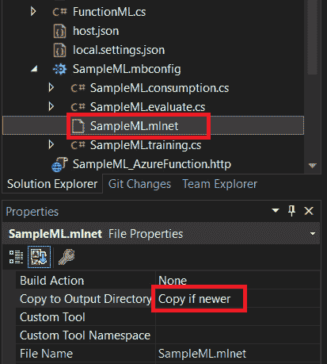

图 7.13 – SampleML.Net 属性

一切准备就绪后，我们可以按照以下简单步骤开发我们的函数：

1.  将 **startup.cs** 添加到配置我们的 Azure Functions 项目以使用 **SampleML.mlnet**：

    ```cs
    [assembly: FunctionsStartup(typeof(Startup))]
    namespace SampleML_AzureFunction;
    public class Startup : FunctionsStartup
    {
        public override void Configure(
            IFunctionsHostBuilder builder)
        {
            builder.Services
                .AddPredictionEnginePool<
                    SampleML.ModelInput,
                    SampleML.ModelOutput>()
                .FromFile("SampleML.mlnet");
        }
    }
    ```

1.  在 Azure 的 **run** 方法中调用 ML.NET 包的 **predict** 方法：

    ```cs
        public class FunctionML
        {
            private PredictionEnginePool<
                SampleML.ModelInput, SampleML.ModelOutput>
                _predictionEnginePool;
            public FunctionML(
                PredictionEnginePool<SampleML.ModelInput,
                    SampleML.ModelOutput>
                predictionEnginePool)
            {
                _predictionEnginePool =
                    predictionEnginePool;
            }
            [FunctionName("FunctionML")]
            public async Task<IActionResult> Run(
                [HttpTrigger(
                    AuthorizationLevel.Anonymous,
                    "post",
                    Route = null)] HttpRequest req)
            {
                string requestBody = await new
                    StreamReader(req.Body)
                    .ReadToEndAsync();
                SampleML.ModelInput input = JsonConvert
                    .DeserializeObject<
                        SampleML.ModelInput>(
                    requestBody);
                SampleML.ModelOutput responseMessage =
                    await Task.FromResult(
                        _predictionEnginePool
                            .Predict(input));
                return new OkObjectResult(
                    responseMessage);
            }
        }
    ```

最后，我们可以使用 Endpoints Explorer 和 **.http** 测试 Azure 函数，就像在上一节中测试 Web API 一样。

# 摘要

在本章中，我们探讨了使用 Visual Studio 将 ML 功能集成到软件开发工作流程中，为开发者提供了利用应用程序中智能决策的必备技能。

我们首先介绍了机器学习（ML）的基本概念，提供了概述以理解其在现代软件开发中的应用和重要性。接下来，我们通过演示如何在 Visual Studio 中使用 ML.NET 和 Model Builder 创建和训练 ML 模型，深入到实际实施中。然后，我们探讨了训练模型的部署策略，展示了如何在 ASP.NET Core Web API 中部署 ML 模型以进行实时推理和与 Web 应用程序的集成。此外，我们还讨论了在 Azure Functions 中部署模型以利用无服务器计算进行可扩展和高效的部署场景。

在本章中，您通过使用 Visual Studio 构建、训练和部署 ML 模型获得了实践经验，使您能够将智能功能融入您的应用程序。

在下一章中，我们将继续通过 Visual Studio 2022 向高级云集成和服务迈进。
