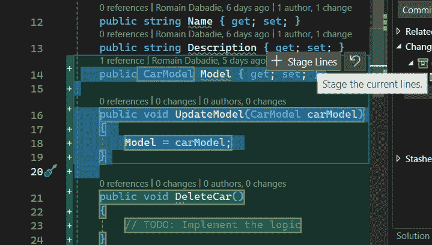

# 处理高级 Git 工作流程

在本章中，我们将深入探讨 Visual Studio 中 Git 集成的世界，重点关注将增强我们的软件开发工作流程的实用技能。我们将专注于 Visual Studio 2022 提供的高级功能。本章旨在为您提供管理仓库、有效解决冲突和利用交互式暂存能力的工具和技术。

在本章中，我们将涵盖以下主要主题：

+   通过 Visual Studio 管理仓库

+   通过 Visual Studio 解决冲突

+   探索 Visual Studio 中的交互式暂存

为了简化我们的协作开发流程，我们将探讨掌握分支管理、解决冲突和实施交互式暂存。

# 技术要求

在编写本章时，我使用了以下版本的 Visual Studio：

+   Visual Studio Enterprise 2022 版本 17.12.0

+   预览 1.0

# 通过 Visual Studio 管理仓库

如果你熟悉开发，你可能已经使用过**GitKraken**或**Sourcetree**等工具，以及其他工具。目前，我们所有的 Git 和仓库管理都可以在 Visual Studio 中完全处理。在本节中，我们将探讨如何利用 Visual Studio 来管理我们的仓库，而无需退出我们最喜欢的 IDE。

## 探索管理分支窗口

Visual Studio 2022 引入了一个名为**管理分支**的窗口。要打开它，我们有几种选择。第一种选择是使用顶部的**Git** | **管理分支**菜单选项：


图 9.1 – 管理分支顶部菜单选项

第二种选择是进入**Git 更改**窗口，然后在窗口右上角的三点菜单中选择**管理分支**：


图 9.2 – 管理分支 Git 更改菜单

此外，在**Git 更改**窗口中，如果我们有挂起的出站或入站提交，我们可以直接点击**分支****组合框**下方的**查看提交**链接。

注意，我们可以通过使用带有*Ctrl* + *Q*快捷键的**功能搜索**框来搜索这个功能。

此操作将打开**Git** **仓库**窗口：


图 9.3 – Git 仓库窗口

在这个窗口中，我们可以找到我们仓库的所有分支。当我们点击一个分支时，我们可以在窗口的右侧看到其状态详情，这些详情被组织成三个部分：

+   **入站**：此部分显示尚未合并到当前选定分支的其他分支的更改。这些更改可能来自任何与我们本地分支相比有更新的远程分支。

+   **输出**：此部分显示在本地已做更改但尚未推送到远程仓库的更改。这包括自我们上次与远程分支同步以来所做的提交。

+   **本地历史**：此部分提供了当前选中分支的提交历史的详细视图。与专注于与其他分支相对更改的**输入**和**输出**部分不同，**本地历史**部分专注于选中分支内提交的按时间顺序进展。

通过此窗口，我们可以使用工具箱菜单提供的功能来组织我们的视图：


图 9.4 – 管理分支工具箱

此工具箱为我们提供了以下选项：

+   **刷新**：更新显示的分支、标签和其他仓库对象的列表。

+   **转到子分支**：直接导航到当前选中分支的子分支。子分支通常是通过分支或合并等操作从一个分支（父分支）创建的。

+   **转到父分支**：启用导航到当前选中分支的父分支。父分支是从中创建当前分支的分支。

+   **仅显示第一个父分支**：过滤视图以仅显示当前选择的直接父分支。

+   **显示本地分支**：隐藏任何远程分支，以便您专注于仅存在于本地机器上的分支。

+   **显示远程分支**：过滤视图以仅显示存在于远程仓库中的分支。

+   **显示标签**：使 Git 标签在**Git 仓库**窗口中与分支一起可见。Git 标签是对我们仓库历史中特定点的引用，通常用于标记发布版本。

+   **清除历史中的切换分支**：通过移除历史面板中分支旁边的切换来清理分支的历史记录。这可以使查看当前选中分支的提交历史记录更加容易，而不会被表示其他分支存在于历史中的切换所分散注意力。

使用此工具箱，我们可以与不同的分支交互并执行各种 Git 操作。要访问这些选项，我们通过在所需的分支或提交上右键单击来打开上下文菜单。


图 9.5 – Git 命令菜单

从此菜单中，我们可以处理经典的 Git 命令，如创建新分支和标签、查看提交详情、撤销提交，甚至删除更改。某些选项可能根据提交的状态而禁用。

提供的一个方便的选项是**检出（--detach）**。

## 查看检出（--detach）

在 Git 命令菜单（*图 9.5*）中，我们可以找到**检出 (--detach**)选项，它允许我们恢复到仓库的早期状态，这对于测试或运行特定时刻存在的代码特别有用。

在某些情况下，我们可能想检出远程分支的最新提交，以便快速审查拉取请求并评估最新的更新。为此，我们首先需要确保我们已经获取并更新了本地分支的副本。然后，我们可以右键单击感兴趣的远程分支并选择**检出提示** **提交 (--detach**)：


图 9.6 – 检出提示提交 (--detach)

需要特别注意，在**分离头**状态下做出的任何提交都没有链接到特定的分支。因此，当你切换到另一个分支时，Git 可能会删除这些提交，因为它们变得容易删除。因此，为了保护我们的工作，如果我们想保留潜在的变化，建议在从分离头状态移开之前开始一个新的分支。

## 处理多个仓库

为了更方便，或者根据我们团队的组织结构，我们可能会遇到跨越多个仓库构建的解决方案。这可能是一个噩梦。Visual Studio 引入了多仓库分支，这简化了这种情况。

Visual Studio 中的状态栏和**Git 变更**工具窗口现在都包括增强的分支选择功能，支持与多个仓库一起工作。这些工具允许我们轻松地在分支之间切换，并促进我们对所有当前活动仓库的分支管理。要快速在任何活动仓库中更改分支，只需在分支选择器中展开仓库树，然后选择要切换到的分支。


图 9.7 – 选择仓库

为了提高效率，Visual Studio 提供了将多个仓库作为单个仓库一起工作的能力。确实，我们可以通过使用顶部**Git** | **新建分支…**菜单选项在多个仓库中创建一个新的分支。


图 9.8 – 在多仓库中创建新分支

在这里，我们可以通过复选框选择在创建新分支时要包含哪些仓库。

最后，我们可以通过**管理分支**功能访问和管理所有仓库和分支，使我们能够无缝地与之交互。

现在我们已经学会了如何利用 Visual Studio 2022 来管理分支，使用**管理分支**和多个仓库功能，在下一节中，我们将探讨共享代码库的一个重要部分：解决冲突。

# 通过 Visual Studio 解决冲突

解决冲突涉及识别和合并多个贡献者对同一行代码所做的更改。这个过程确保了每个人的贡献都能顺利集成，保持共享代码库的完整性和一致性。通过理解和有效管理这些冲突，团队可以确保他们的软件开发过程保持高效和高效，营造一个所有团队成员的贡献都受到重视并无缝集成的协作环境。在本节中，我们将了解 Visual Studio 2022 如何让我们处理这个过程。

在正常情况下，Git 擅长无缝集成文件修改，前提是文件内容在更新之间没有发生重大更改。当我们的分支与主分支落后很多时，在发起拉取请求之前重新设置我们的分支是明智的。这个过程确保我们的分支可以顺利地合并到主分支中，而不会遇到冲突问题。

尽管 Git 在利用仓库历史记录解决更改方面非常熟练，但合并更改有时并不清晰，Git 会停止合并并通知我们文件冲突。

因此，在这种情况下，当我们从远程分支将代码拉到本地仓库时，Visual Studio 将在 **Git 变更** 窗口中通过消息和列出发生冲突的文件来警告我们。


图 9.9 – 合并冲突出现

在这个例子中，**Car.cs** 文件在远程和本地分支上都进行了修改。在这种情况下，我们必须自己完成合并过程。为此，我们将双击相关的文件，这将以解决冲突模式打开该文件。


图 9.10 – 解决冲突模式

在此模式下，我们可以看到三个部分：

+   **传入**：这些是我们尝试与当前分支合并的分支所做的修改。

+   **当前**：这些更改指的是我们在当前分支中进行的修改。

+   **结果**：本节总结了合并的结果。请注意，我们可以根据自己的方便手动编辑这部分内容。

我们可能对冲突窗口的显示方式有独特的偏好。为了根据个人方便调整这些设置，只需单击界面右上角的位置图标。


图 9.11 – 更改解决冲突视图

这样，我们可以在三种模式之间切换：

+   **垂直视图**：**结果**部分位于**传入**和**传出**部分之间

+   **水平视图**：**结果**部分位于**传入**和**传出**部分下方

+   **混合视图**：在这里，**传入**和**传出**部分并排，**结果**部分位于它们下方

解决冲突模式还提供了一个工具箱，使我们能够轻松解决冲突。


图 9.12 – 解决冲突工具箱

此工具箱允许我们使用**Take Incoming**按钮（或按*F10*）自动接受来自另一个分支的所有更改。或者，我们可以点击**Take Current**按钮（或按*F11*）以保留所有冲突更改的当前版本。

在左上角，箭头使我们能够浏览文件中的差异和冲突。这样，我们可以逐行解决冲突。要合并两种修改，我们可以在每个部分的左侧使用复选框。它们在*图 9.10*中可见。

在成功解决所有冲突后，一个指示**0 Remaining**的通知将出现在屏幕左上角箭头附近。这表示没有未解决的冲突。要完成合并操作，请点击**Accept Merge**按钮。

最后，在我们接受合并并在所有冲突文件中重复此过程后，我们使用**Git Changes**窗口创建合并提交并解决冲突。在我们的日常使用案例中，我们有时会编写我们不希望立即或根本提交的代码。Git 为我们提供了对要提交的更改的精细控制，这一功能被称为暂存。在下一节中，我们将探讨 Visual Studio 如何简化此过程。

# 探索 Visual Studio 中的交互式暂存

暂存区域是 Git 存储有关我们将要提交的信息的地方。

暂存允许我们选择我们想要包含在下一个提交中的更改。这是 Git 的一个关键功能。主要原因是我们提供了对要提交内容的粒度和控制。通过仅暂存必要的更改，我们使项目历史更加清晰易懂。

例如，假设我们正在处理一个涉及两个函数中几个更改的功能。我们可能已经完成了一个函数的更改，但仍在处理另一个。通过暂存，我们可以提交第一个函数而不包括第二个。这样，我们的提交反映了该功能在那一刻的状态，我们的队友可以集成稳定部分，而不会被不完整的任务所分散。

自 17.6 版本以来，Visual Studio 2022 已集成交互式暂存功能。在本节中，我们将探讨如何实现。

当我们对文件进行修改时，这些修改将出现在**Git Changes**窗口的**Changes**部分上方。


图 9.13 – **Changes**部分

在此示例中，我们对三个文件进行了更改。默认情况下，Visual Studio 显示**Commit All**按钮，该按钮**暂存**文件中的所有更改，然后使用文本框中输入的消息提交它们。就像我们直接执行了以下命令：

```cs
git add .
git commit -m "Your commit message here"
```

如果我们只想暂存**Car.cs**文件，我们可以右键单击它并选择**暂存**；或者，当文件被选中时，我们可以使用右侧出现的**+**按钮：


图 9.14 – 暂存文件

这样，**暂存更改**部分就会出现，我们可以在其中找到列出的**Car.cs**文件：


图 9.15 – 暂存更改部分

你可能会注意到，现在**Git 更改**窗口将显示一个**暂存提交**按钮而不是**提交所有**按钮。在底层，Visual Studio 将执行以下**git**命令来暂存我们指定的文件：

```cs
git add Car.cs
```

如果我们回到我们的初始示例，这两个功能可以位于同一个文件中。例如，我们完成了**UpdateModel()**函数的实现，并将**DeleteCar()**置于待机状态。在这里，我们将利用交互式暂存功能，通过逐行选择我们想要暂存的更改，按照以下步骤进行：

1.  在**Git 更改**窗口中，我们双击**Car.cs**文件以打开**差异**窗口。这将显示远程仓库和我们的本地仓库之间的差异。


图 9.16 – 差异窗口

1.  一旦你确定了想要暂存的行，选中它们并点击**+ 暂存行**弹出按钮来添加它们：



图 9.17 – 暂存行

1.  现在，在**Git 更改**窗口中，我们可以找到我们的**Car.cs**文件的两个版本：一个是在**暂存更改**部分中选择的行，另一个是在**更改**部分中的完整挂起更改。


图 9.18 – 按行暂存的文件

在暂存我们的更改后，我们可以使用带有**暂存提交**按钮的标准提交工作流程来提交它们。这确保了我们的提交是干净的并且逻辑上组织良好，反映了我们打算分享的更改。

在本节中，我们探讨了如何通过选择性地选择特定的更改行来正确地暂存提交。

# 摘要

本章深入探讨了使用 Visual Studio 管理软件开发项目的关键方面，重点关注仓库管理、解决冲突以及利用交互式暂存功能。这些课程至关重要，因为它们为我们提供了维护干净、高效的代码库并确保团队成员之间协作顺畅所需的工具和技术。

我们从深入研究 Visual Studio 管理仓库的功能开始，强调了其在简化版本控制流程中的关键作用。随后，我们探讨了在 Visual Studio 中解决冲突的艺术，提供了关于如何应对团队合作中常见的合并冲突挑战的宝贵见解。我们的旅程以对交互式暂存功能的考察结束，该功能提供了一种更用户友好的方法来准备提交。

随着我们迈向下一章节，我们将基于本章所获得的基础知识进行构建。接下来的讨论将聚焦于自动化集成过程，进一步优化项目效率和可靠性。这一过渡标志着我们在通过 Visual Studio 2022 掌握现代软件开发实践旅程中的下一个逻辑步骤，其中持续集成在持续交付高质量软件中扮演着关键角色。
