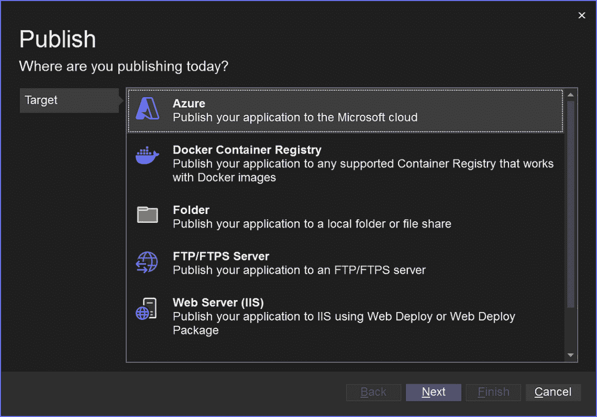
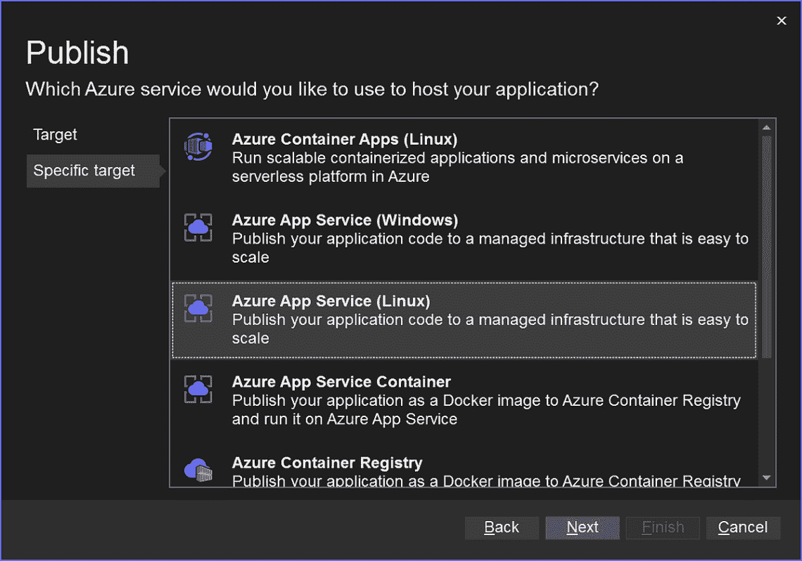
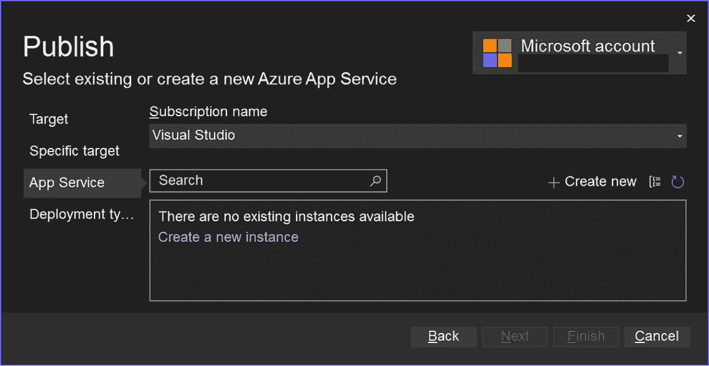
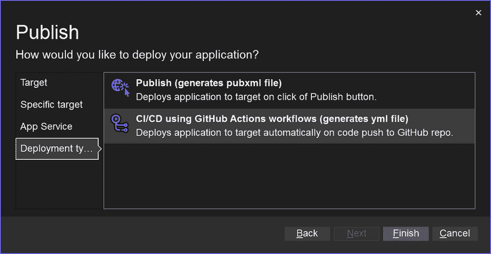
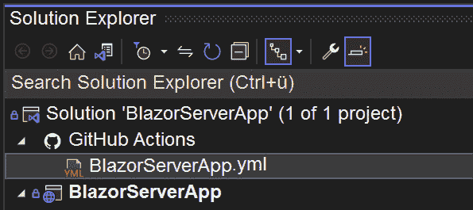

# 使用 GitHub Actions 进行持续集成

欢迎来到使用 GitHub Actions 进行**持续集成**（**CI**）的章节。随着我们深入本章，我们将全面了解 GitHub Actions 如何增强我们的开发工作流程，简化我们的流程，并确保我们的代码库保持稳健和可靠，以及 Visual Studio 如何帮助我们实现这一点。

首先，我们将探索 GitHub Actions 的基础知识，这是一个直接集成到 GitHub 中的强大 CI/CD 工具。接下来，我们将深入了解在 GitHub Actions 中配置工作流程。本节将指导您设置和管理满足项目需求的工作流程。最后，我们将关注使用 Visual Studio 生成 GitHub Actions 文件。Visual Studio 为创建和管理 GitHub Actions 以支持 Azure 部署提供了强大的支持，使我们能够更容易地将 CI/CD 集成到开发环境中。我们将涵盖以下主题：

+   理解 GitHub Actions 在 CI/CD 中的作用

+   在 GitHub Actions 中配置工作流程

+   使用 Visual Studio 生成 GitHub Actions 文件

精通 GitHub Actions 在 CI/CD 中的使用对于任何现代开发者来说至关重要。在本章结束时，您将掌握设置和管理自动化工作流程所需的知识和技能，这将显著提高您的开发效率。

# 技术要求

在编写本章时，我使用了以下版本的 Visual Studio：

+   Visual Studio Enterprise 2022 版本 17.12.0

+   预览 1.0

要完全理解本章内容，您还需要一个有效的 GitHub 账户，您可以在[`github.com/`](https://github.com/)上创建。

# 理解 GitHub Actions 在 CI/CD 中的作用

在本节中，我们将深入探讨 GitHub Action，了解其在 GitHub 仓库内直接自动化软件工作流程以及促进持续集成（**CI**）和**持续部署**（**CD**）过程中的作用。CI/CD 实践旨在加速开发周期，提高代码质量，并简化应用程序部署流程。

GitHub Actions 允许在 GitHub 仓库内直接自动化软件工作流程，包括 CI/CD 过程。通过自动化这些工作流程，可以加快开发周期，确保代码质量，并简化应用程序部署流程。这种自动化的一个例子是在将更改推送到仓库时自动运行测试。

在 CI/CD 的背景下，CI 涉及每天多次将所有开发者的工作副本合并到一个共享的主线上。这有助于快速检测和解决错误。通过频繁集成代码，团队可以在开发周期的早期识别并修复问题，从而降低后期解决这些问题的成本和努力。例如，我们可以设置一个 GitHub Action，每次将拉取请求合并到主分支时都运行单元测试。

CD 在 CI 的基础上进一步自动化，在代码变更通过 CI 管道后，将它们部署到选定的基础设施环境中。CD 确保新功能和修复能够快速且可靠地发布，从而提高软件发布过程的整体效率。GitHub 允许我们在 CI 管道中成功构建后自动将 Web 应用程序部署到预发布环境中。

GitHub Actions 为实施 CI/CD 管道提供了多项好处，包括设置简便、与 GitHub 生态系统的集成以及定制工作流程以适应特定项目需求的能力。这些好处使得它适用于各种规模的团队，从个人在个人项目上工作到管理复杂软件产品的庞大组织。团队可以轻松设置 CI/CD 管道，无需广泛的 DevOps 专业知识，从而加快开发周期并提高发布质量。

GitHub Actions 简化了 CI/CD 管道的设置，消除了手动配置的需求，例如设置网关、购买硬件和管理安全补丁。它与 GitHub 的无缝集成使其能够响应任何网关，从而实现自动化或 CI/CD 管道的灵活事件触发。GitHub 社区通过 GitHub Marketplace 贡献了大量预构建的 CI/CD 工作流程，使用户能够更容易地使用现有解决方案或分享自己的解决方案。此外，GitHub Actions 支持任何平台、语言和云，为各种技术提供了无与伦比的灵活性。

为了更好地理解这个过程，我们将探讨 GitHub Actions 的不同组件：

+   **工作流程**：工作流程是一个可配置的自动化过程，您可以在您的存储库中设置它以构建、测试、打包、发布或部署 GitHub 上的任何项目。工作流程使用存储在您的存储库 **.github/workflows** 目录中的 **YAML** 文件定义。YAML 最初代表 **Yet Another Markup Language**，但后来成为递归缩写 **YAML Ain’t Markup Language**。

+   **事件**：事件是在 GitHub 存储库中发生的事情，可以触发工作流程。例如，包括代码推送（**push**）、打开拉取请求（**pull_request**）和创建新问题（**issue_comment**）。

+   **作业**：作业是一组在同一运行者上执行的步骤。每个作业都在由 **runs-on** 指定的虚拟环境的独立实例中运行。

+   **操作**：操作是执行特定任务的代码的可重用单元，例如构建 Docker 镜像、运行测试或将内容部署到服务器。它们可以用 JavaScript（使用 Node.js）或 TypeScript 编写，并可以托管在 GitHub Marketplace 或自托管。

+   **运行者**：运行者是作业执行期间作业所在的服务器。运行者有两种类型：GitHub 托管运行者和自托管运行者。

在对 GitHub Actions 的概述之后，我们将学习如何配置工作流程。

# 配置 GitHub Actions 中的工作流程

GitHub 的所有组件都可以通过 YAML 文件进行配置。在本节中，我将解释 GitHub Actions 配置文件的组织方式，以帮助您了解其功能。

YAML 文件放置在我们仓库的 **.github/workflows** 目录中。这些文件被称为工作流程文件，定义了我们的 CI/CD 管道的场景。

一个典型的 GitHub Actions 工作流程配置文件由几个关键部分组成：

+   **name** : 为工作流程提供一个人可读的名称。

+   **on** : 指定触发工作流程的事件（s）。

+   **jobs** : 定义组成工作流程的作业。每个作业都在由 **runs-on** 指定的运行器环境中运行。

+   **steps** : 在每个作业中，步骤按顺序执行。步骤可以运行命令、设置任务或在您的仓库、公共仓库或 Docker 注册表中发布的操作中执行操作。

+   **env** : 允许您为作业中的所有步骤设置环境变量。

+   **defaults** : 为工作流程中所有作业和步骤设置默认行为。

+   **permissions** : 控制在作业执行期间授予 GitHub Actions 运行器的权限。

让我们通过一个针对 C#应用程序的实际 CI 工作流程来分解这些关键部分。

下面是一个我们将命名为 **CI.yaml** 的工作流程文件的内容：

```cs
name: C# CI
on:
  push:
    branches: [ main ]
  pull_request:
    branches: [ main ]
jobs:
  build:
    runs-on: windows-latest
    steps:
      - uses: actions/checkout@v2
        with:
          fetch-depth: 0 # Fetches all history for all tags
                         # and branches
      - name: Setup .NET
      uses: actions/setup-dotnet@v1
      with:
        dotnet-version: '3.1.x' # Specify the .NET version
                                # you need
      - name: Build
      run: dotnet build --configuration Release
      - name: Test
      run: dotnet test --no-build --verbosity normal
```

现在，让我们了解这个工作流程是如何工作以及如何表达的。此文件中有四个部分，它们按以下方式组织：

**Part 1: the** **Workflow Metadata** :

+   **name** : **C# CI**

    这是一个描述性的工作流程名称，使其在 GitHub UI 中更容易识别。

**Part 2: the** **Trigger Conditions** :

+   **on:**

+   **push:**

+   **branches: [** **main ]**

    这意味着每当向主分支推送时，工作流程就会运行。同样，以下工作流程将在针对主分支打开、同步或重新打开拉取请求时运行：

+   **pull_request:**

+   **branches: [** **main ]**

**Part 3:** **the Jobs** :

+   **jobs** :

+   **build:**

+   **runs-on** : **windows-latest**

    这指定了作业应在 GitHub Actions 提供的最新 Windows 环境中运行。这很重要，因为.NET Core/.NET 5+应用程序通常需要 Windows 环境才能正确构建和运行。

**Part 4:** **the Steps** :

每个作业由一系列按顺序执行的步骤组成。以下是每个步骤的作用：

1.  检出代码：

    +   **uses** : **actions/checkout@v2**

    此操作检查我们的仓库位于 **$GITHUB_WORKSPACE** 下，允许作业中的后续步骤访问它。**fetch-depth: 0** 选项确保获取所有标签和分支的历史记录，而不仅仅是默认分支。

1.  设置.NET:

    +   **name** : **Setup.NET**

    +   **uses** : **actions/setup-dotnet@v1**

    此操作设置 .NET 环境。**dotnet-version: '3.1.x'** 输入指定要使用哪个版本的 .NET。我们可以调整它以匹配我们项目的需求。

1.  构建：

    +   **名称**：**构建**

    +   **运行**：**dotnet build --** **配置 Release**

    此步骤使用 .NET CLI 编译应用程序。**--configuration Release** 标志表示构建应生成 **发布构建**，优化输出以获得性能。

1.  测试：

    +   **名称**：**测试**

    +   **运行**：**dotnet test --no-build --** **verbosity normal**

    此步骤在重建项目之前运行项目中的任何单元测试（**--no-build**）。**--verbosity normal** 选项控制日志输出的数量。这有助于保持日志清洁并专注于关键信息。

此工作流程为 C# 项目提供了一个简单的 CI 管道，确保对主分支的每次推送或拉取请求都会自动构建和测试。通过调整 .NET 版本并可能添加更多作业或步骤，我们可以调整此工作流程以适应我们项目的特定需求。

在将我们的 YAML 文件推送到 GitHub 之后，我们现在可以转到 GitHub 仓库中的 **操作** 选项卡以查看我们的工作流程正在运行。当我们向主分支推送更改或打开拉取请求时，工作流程将自动运行。

# 使用 Visual Studio 生成 GitHub Actions 文件

在本节中，我们将了解 Visual Studio 如何帮助我们生成用于 Azure 部署的 GitHub Actions 文件。请注意，您需要有效的订阅，如 *技术要求* 部分所述，才能完成本节。

首先，我们需要一个可以部署到 Azure 的应用程序，为此，我简单地启动了一个 Blazor 项目，使用 Visual Studio 提供的模板，我将其命名为 **BlazorServerApp**。之后，按照以下步骤操作：

1.  右键单击项目顶部的节点以启动发布向导并选择 **Azure**：



图 10.1 – 发布 Azure

1.  然后，选择您想要的目标类型。选择适合您预算和公司政策的目标由您决定。对于本例，我们将选择 **Azure 应用服务（Linux）**：



图 10.2 – 特定目标

1.  一旦我们选择了目标，我们就会跳转到选择新的 **应用服务**。在这里，我们必须选择订阅中现有的实例。



图 10.3 – 应用服务订阅

如果没有可用的实例，您可能需要通过单击 **创建一个新实例** 链接并按照向导中的说明创建一个新的实例。

最后，在最后一步，我们将确定 **部署类型**。

1.  选择 **使用 GitHub Actions 工作流程进行 CI/CD（生成 yml 文件**），这将根据我们的配置生成相应的 YAML 文件：



图 10.4 – 部署类型

1.  现在在 **解决方案资源管理器** 中，我们可以看到 Blazor Server 项目，以及位于 **GitHub** **Actions** 节点下的生成的 **BlazorServerApp.yml** 文件。



图 10.5 – GitHub Actions 节点

我们已经看到了如何生成 GitHub Actions 文件。我们能够通过使用外部工具，例如广泛使用的静态分析解决方案 SonarCloud，来自定义它以添加代码质量到我们的管道中。GitHub Actions 是一个值得探索的强大工具，我建议您阅读 Eric Chapman 的书籍 *Mastering GitHub Actions* ([`www.packtpub.com/en-us/product/mastering-github-actions-9781805128625`](https://www.packtpub.com/en-us/product/mastering-github-actions-9781805128625)) 以深入了解该主题。

# 摘要

在本章中，我们探讨了 GitHub Actions 在 CI/CD 中的强大功能，学习了如何自动化和简化我们的开发工作流程。我们首先理解了 GitHub Actions 的基本概念。接下来，我们转向配置 GitHub Actions 中的工作流程。然后我们学习了如何编写和管理定义我们的 CI/CD 管道的 YAML 文件。在最后一节中，我们专注于使用 Visual Studio 生成 GitHub Actions 文件。Visual Studio 对 GitHub Actions 的强大支持简化了将 CI/CD 集成到您的开发环境中的过程。

在使用 GitHub Actions 自动化 CI/CD 建立了坚实的基础之后，现在是时候扩展我们的协作能力了。在下一章中，我们将探讨 Azure DevOps 如何增强团队协作，简化项目管理，并进一步优化您的开发流程。
