# 第十一章：使用 Azure DevOps 进行协作开发

在软件开发快节奏的世界中，协作和效率至关重要。Azure DevOps 提供了一套旨在简化并增强基于团队的开发努力的工具。本章将指导您了解利用 Azure DevOps 在 Visual Studio 中进行协作开发的必要方面。

第一部分将介绍 Azure DevOps，这将提供对其核心服务和功能的基础理解。接下来，我们将介绍设置团队项目的过程，以在 Visual Studio 和 Azure DevOps 之间建立连接。然后，我们将探讨敏捷开发的原则以及如何在 Azure DevOps 中集成它们。我们将利用工作项来提高协作、可追溯性和生产力。最后，在最后一部分，我们将探讨如何在 Visual Studio 中管理构建。

在本章中，我们将涵盖以下主要主题：

+   Azure DevOps 简介

+   设置团队项目

+   实施敏捷开发实践

+   集成 Azure Pipelines 进行持续集成

到本章结束时，我们将能够有效地在 Visual Studio 中的开发工作流程中利用 Azure DevOps。

# 技术要求

在编写本章时，我使用了以下版本的 Visual Studio：

+   Visual Studio Enterprise 2022 版本 17.12.0

+   预览 1.0

为了完全跟随本章内容，您还需要一个有效的 Azure DevOps 账户。

# Azure DevOps 简介

作为在 .NET 生态系统内工作的经验丰富的开发者，我们一直在寻找提高我们的生产力、简化我们的工作流程并确保我们的软件项目质量的方法。在本章中，我们深入探讨 Azure DevOps 的世界，这是一个由开发工具、服务和功能组成的套件，赋予团队规划工作、协作进行代码开发以及高效构建和部署应用程序的能力。

Azure DevOps 作为一款综合平台，将项目管理、版本控制、报告和自动化构建集成到单一服务中，脱颖而出。它支持基于云和本地部署模型，使其能够适应各种组织需求。通过利用 Azure DevOps，我们可以提高团队效率，增强团队成员之间的协作，并加速高质量软件解决方案的交付。

以下是我们可以利用的核心组件概述，以帮助我们在 Azure DevOps 的帮助下转变我们的开发实践：

+   **Azure Boards** 用于编排工作、规划冲刺和管理待办事项，以无与伦比的清晰度和精确度

+   **Azure Repos** 用于利用 Git 仓库的力量，确保无缝的版本控制和协作编码体验

+   **Azure Pipelines** 用于自动化构建和部署流程，促进持续集成，并确保我们的应用程序始终准备好发布

+   **Azure 测试计划** 用于简化测试阶段，使我们能够高效地创建、执行和跟踪测试

+   **Azure Artifacts** 用于共享包和依赖项，促进一致且高效的开发生态系统

现在我们已经熟悉了 Azure DevOps 的上下文，让我们深入了解如何在 Visual Studio 内部连接我们的 Azure DevOps 项目。

# 设置团队项目

要在 Visual Studio 内部有效地与 Azure DevOps 项目协同工作，我们需要在这两个之间建立连接。这包括设置我们的环境、配置项目设置，并确保 Visual Studio 和 Azure DevOps 正确集成。在本节中，我们将导航此过程。

在开始之前，请确保您有以下条件：

+   一个活动的 Azure 订阅

+   访问 Azure DevOps 组织及其内部至少一个项目

Visual Studio 允许我们通过 **Team Explorer** 视图连接到 Azure DevOps 项目。这种方法允许我们直接在 Visual Studio 内部访问和管理我们的 Azure DevOps 项目，而无需打开单独的 Azure DevOps 窗口。要这样做，请按照以下步骤操作：

1.  导航到 **视图** | **Team Explorer** :

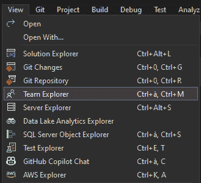

图 11.1 – 打开 Team Explorer

1.  在 **Team Explorer** 打开的情况下，点击位于 **Team Explorer** 窗口顶部的 *管理连接* 按钮，其图标为一个 *电源插头* :

l

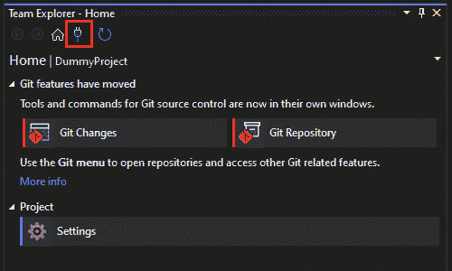

图 11.2 – 管理连接按钮

这将引导我们登录到我们的 Azure DevOps 账户。如果您尚未设置，我们可以在此处检索我们的活动 AzureDevOps 连接。

1.  接下来，点击 **管理连接** 链接，然后点击 **连接到** **项目…** :

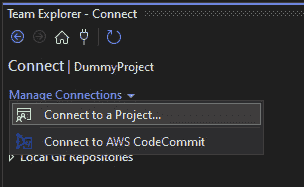

图 11.3 – 连接到项目…

登录后，我们将看到一个列表，其中包含我们有权访问的 Azure DevOps 组织和项目：

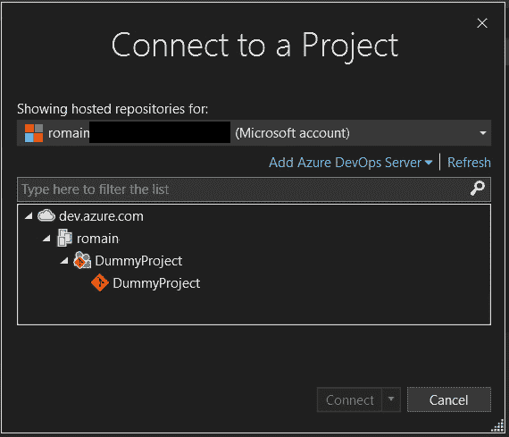

图 11.4 – 连接到项目

1.  选择您希望连接的项目，然后点击 **连接** 。此操作将在 Visual Studio 和您选择的 Azure DevOps 项目之间建立连接。

连接后，让我们看看如何利用这个连接，直接从 **Team** **Explorer** 窗口管理我们的 Azure DevOps 项目。

# 实施敏捷开发实践

现在，我们已经将 Visual Studio 与 Azure DevOps 项目连接起来，我们可以直接从 **Team Explorer** 窗口开始管理我们的 Azure DevOps 项目。在本节中，我们将回顾敏捷开发是什么以及如何利用 Visual Studio 来简化我们的敏捷流程。

## 介绍敏捷开发

敏捷开发是一种灵活的项目管理和软件开发方法，强调协作、客户反馈和适应变化。它于 2001 年通过敏捷宣言确立，旨在快速且持续地向客户提供价值，并不断改进流程和产品。

敏捷开发的关键方面包括以下内容：

+   **以人为本而非流程**：敏捷重视人际互动和协作，而非僵化的流程和工具，认识到有效的沟通对于项目成功至关重要。

+   **功能性软件而非详尽的文档**：敏捷团队专注于频繁交付可工作的软件，相信功能性产品比全面的文档更有价值。

+   **与客户协作**：敏捷开发鼓励在整个项目生命周期中与客户紧密合作，以更好地理解和满足他们的需求。

+   **适应性**：敏捷方法接受变化，甚至在开发后期，理解适应新的需求有助于交付真正满足客户需求的产品。

敏捷实践涉及将项目分解成更小、更易于管理的单元，称为冲刺，通常持续一到四周。在这些冲刺期间，团队协作工作，以交付产品的功能性增量，从而允许进行定期的反馈和调整。

在敏捷的背景下，工作项被用来组织、跟踪和管理项目中涉及的各种工作元素。这些元素可以包括用户故事、任务、缺陷和特性等。工作项是敏捷项目中规划和跟踪工作的基石，使团队能够捕捉关于工作的细节，分配责任，设定优先级，并跟踪进度。

在敏捷方法中，工作项通常被分类为用户故事、缺陷、任务、特性和史诗等类型，每个类型都服务于特定的目的：

+   用户故事代表了从最终用户的角度需要开发的功能。它们帮助团队理解用户的需求和原因。

+   缺陷用于跟踪在测试或开发阶段发现的软件中的错误或问题。

+   任务是需要完成以实现用户故事或解决缺陷的小型工作单元。

+   特性代表更大的功能块，可能包含多个用户故事。它们有助于将相关的工作组合在一起。

+   史诗比特性更广泛，代表跨越多个冲刺或发布的庞大工作集。

工作项对于敏捷项目管理至关重要，因为它们促进了团队成员之间的沟通，有助于优先级排序工作，并能够跟踪向项目目标迈进的过程。团队可以将工作项相互链接，以显示依赖关系，将工作汇总到更大的倡议之下，并生成报告以更好地监督项目。

敏捷团队通常使用 Azure DevOps 等工具来有效地管理工作项。这些工具为不同类型的工作项提供模板，支持根据团队流程进行定制，并提供跟踪依赖关系、管理工作负载以及通过仪表板和报告可视化进度的功能。

总结来说，工作项是敏捷实践的基本方面，提供了一种结构化的方式来规划、跟踪和管理项目生命周期各个阶段的工作。

## 通过 Visual Studio 管理工作项

回到**团队资源管理器**的**主页**，我们可能会注意到**项目**部分有三个瓷砖，其中一个名为**工作项**。在这个部分，我们将探讨如何通过 Visual Studio 与工作项进行交互。

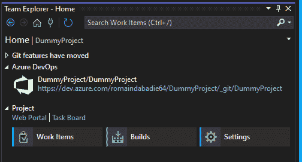

图 11.5 – 团队资源管理器主页

点击瓷砖，我们可以访问我们项目的**工作项**列表：

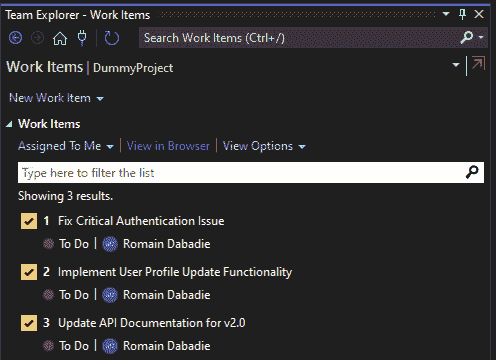

图 11.6 – 可视化工作项

在此窗口中，我们可以列出所有我们的工作项。两个下拉选项**分配给我**和**查看选项**，以及文本框允许我们搜索和过滤列表。此外，**在浏览器中查看**链接允许我们通过浏览器直接访问 Azure 仪表板。

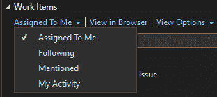

图 11.7 – 过滤工作项

点击**工作项**标题下的第一个链接，我们可以访问以下四个选项：

+   **分配给我**：此过滤器显示专门分配给当前登录用户的**工作项**。它帮助我们专注于我们的责任和任务，而不会因整个项目的工作负载而感到不知所措。

+   **关注**：此过滤器显示我们选择关注的工作项。这可能包括分配给他人且我们对其有利益关系或希望跟踪以进行协作或监督的任务。

+   **提及**：此选项过滤出提及我们的工作项。提及通常出现在评论或描述中，作为吸引他人注意特定项的一种方式。

+   **我的活动**：此过滤器显示我们以某种方式交互过的工作项。这可能包括创建、编辑、评论或以其他方式参与工作项。

这些**团队资源管理器**中的过滤选项通过允许用户根据他们在项目中的角色、兴趣和责任定制他们对工作项的视图，从而提高了生产力。

此外，**查看选项**链接为我们提供了管理工作项显示的选项。

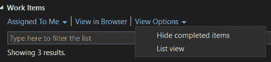

图 11.8 – 查看选项

在这里，我们可以选择**隐藏已完成项**并在**列表视图**显示或**详细视图**之间切换。

现在我们已经看到了如何管理我们的工作项列表，让我们探索我们可以如何与这些工作项交互。我们通过右键单击其中一个来打开**工作项**上下文菜单。

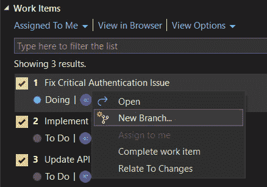

图 11.9 – 工作项上下文菜单

此菜单包含以下操作：

+   **打开**：此操作将在 Azure 门户中直接以详细视图打开所选工作项。

+   **新分支…**：这将在我们的版本控制系统中为所选工作项创建一个新的分支。这有助于隔离与工作项相关的更改，使得跟踪和稍后审查这些更改变得更加容易。

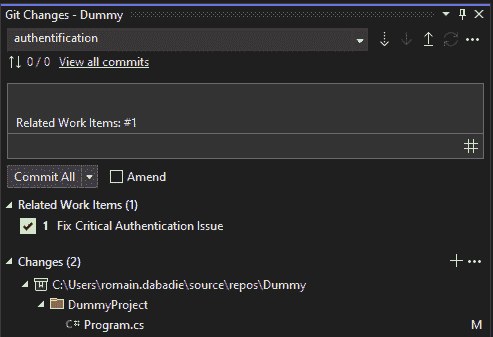

图 11.10 – 相关工作项

这样，这个分支中的每个提交将直接包含提及相关工作项 ID 的标签在提交信息中。

+   **分配给我**：此操作将所选工作项分配给当前登录的用户。这是一种承担任务所有权的方式，表明我们将负责完成它。

+   **完成工作项**：这标志着所选工作项已完成。这通常将工作项的状态更改为表示所有必需的工作都已完成，它已准备好进行审查或关闭。

+   **关联到更改**：这将在版本控制系统中将所选工作项链接到特定的更改集、提交或分支。这创建了工作（代码更改）和更改原因（工作项）之间的可追溯性。这样，即使分支不是为了这个工作项而创建的，我们也可以轻松地将它链接到一个提交。

如果我们需要创建一个新的工作项，我们可以通过在**工作项**窗口顶部使用**新建工作项**链接快速完成：

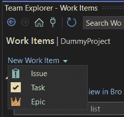

图 11.11 – 创建新工作项

这将提示我们选择三种类型的工作项（**问题**、**任务**或**史诗**），然后出现一个简单的表单来设置标题。一旦创建，工作项将出现在**我的活动**过滤器下。

在 Visual Studio 中直接管理工作项可以让我们提高生产力。正确使用此功能可以增强我们开发团队中的协作、可追溯性和生产力。

正如我们在上一章中通过 GitHub Actions 所看到的，持续集成是现代应用程序开发的一个关键部分。在下一节中，我们将看到如何在 Visual Studio 中与 Azure Pipelines 交互并管理我们的构建。

# 集成 Azure Pipelines 进行持续集成

Visual Studio 中**Team Explorer**窗口的**构建**功能旨在帮助开发者管理、监控和与团队项目中的构建过程进行交互。它提供了一个集中界面，用于查看构建定义、排队新构建、监控正在进行的构建和审查完成的构建。此功能支持手动和自动构建过程，使团队更容易确保其软件产品的质量和可靠性。

我们可以通过点击**Teams Explorer**主页上的**构建**磁贴来访问此界面：

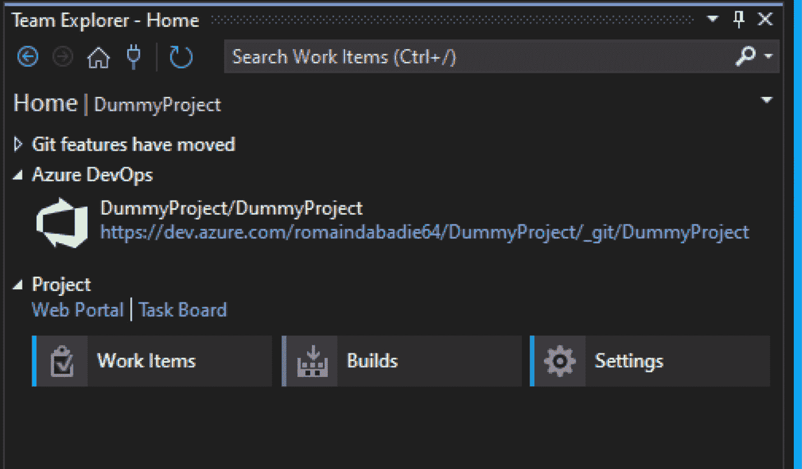

图 11.12 – Team Explorer 中的构建磁贴

在**Team Explorer**的**构建**部分，我们可以看到四个部分，这些部分帮助我们与 Azure 构建进行交互。

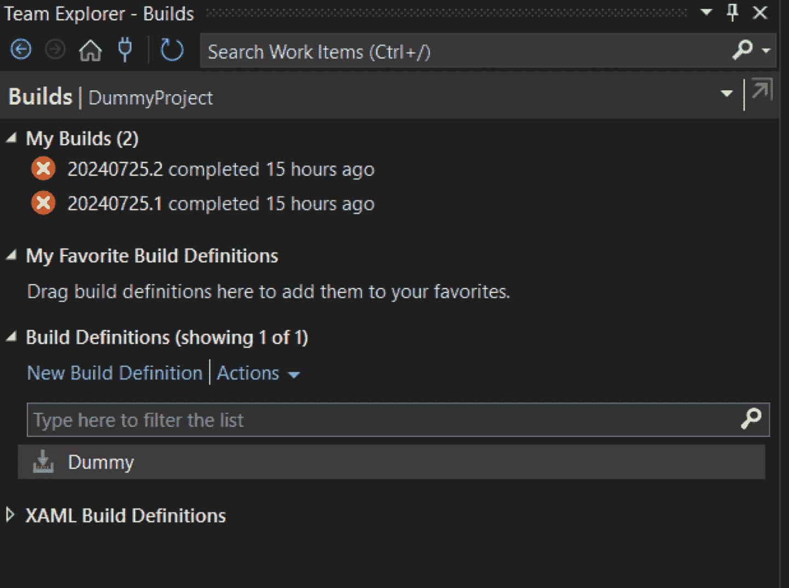

图 11.13 – Team Explorer 构建视图

该功能的基石是**构建定义**。这些定义了应用程序应该如何构建，包括触发构建的内容（例如，持续集成）、要包含哪些源文件以及任何预构建或后构建任务。我们可以在**构建定义**下找到我们项目的所有构建定义。通过点击其中一个构建，我们可以访问上下文菜单。

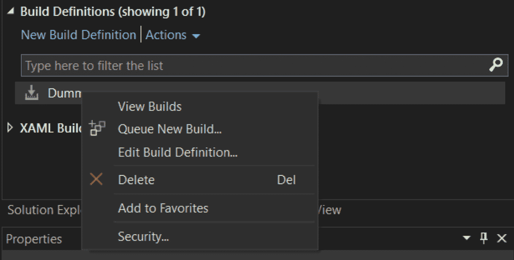

图 11.14 – 构建定义上下文菜单

**构建定义**的上下文菜单提供了几个操作，例如以下操作：

+   **查看构建**：此操作将通过浏览器在 Azure Devops 界面中打开构建

+   **编辑构建定义...**：此操作将在浏览器中的 Azure Devops 界面中以编辑模式打开构建定义，以便对其进行编辑

+   **排队新构建…**：我们可以从**Team Explorer**窗口手动排队构建，指定要使用的构建定义以及是否立即运行构建或将其安排在稍后进行

+   **添加到收藏夹**：将构建定义添加到收藏夹简化了对常用构建的访问，通过减少在各个构建定义之间导航的时间来提高生产力

此外，**构建**功能允许用户查看当前构建的状态，包括进度、成功或失败消息。这种实时反馈有助于我们快速解决问题。构建完成后，我们可以审查日志、测试结果和构建过程中生成的其他工件。这有助于故障排除并确保所有组件符合质量标准。

因此，将**Team Explorer**中的**构建**功能与 Azure DevOps 集成提供了一个强大的平台，可以直接在 Visual Studio 中管理端到端的 CI/CD 管道。这种集成提高了生产力，确保了环境间的连贯性，并支持可扩展、安全的软件交付流程。

# 摘要

在本章中，我们探讨了使用 Azure DevOps 进行协作开发的要点，为你提供了在 Visual Studio 内部简化开发工作流程所需的知识和技能。我们首先介绍了 Azure DevOps，强调了其核心服务，并展示了它如何与 Visual Studio 集成以增强团队协作和项目管理。

接下来，我们深入探讨了实施敏捷开发实践的方法，从对敏捷方法的全面介绍开始。我们学习了如何通过 Visual Studio 直接管理工作项，确保任务、错误和用户故事的跟踪和解决的高效性。

然后，我们学习了如何集成 Azure Pipelines 进行持续集成，引导你通过 Visual Studio 内部的构建管理。

随着我们过渡到下一章节，我们将继续扩展我们的技能集。Docker 容器已经彻底改变了我们开发、测试和部署应用程序的方式，为开发的不同阶段提供了一个一致的环境。在接下来的章节中，你将学习如何利用 Visual Studio 的强大容器工具来与 Docker 一起工作。
