# 12

# Visual Studio Container Tools for Docker

在本章中，我们将深入探讨 Docker 与 Visual Studio 的强大集成，这种协同作用简化了容器管理并加速了您的开发工作流程。我们将从介绍 Docker 及其如何与 Visual Studio 集成的基础知识开始。我们将了解容器化的基本概念以及为什么它已成为现代开发实践的基础。接下来，我们将逐步介绍如何配置我们的开发环境以支持 Docker。这包括安装必要的组件、在 Visual Studio 中设置 Docker 支持以及配置项目以使用 Docker。然后，我们将深入探讨将应用程序转换为 Docker 容器的实际操作。最后，我们将探讨部署阶段。我们将学习各种将容器化应用程序部署到本地 Docker 主机、远程服务器或云平台的方法。

在本章中，我们将涵盖以下主要主题：

+   Docker 与 Visual Studio 集成的简介

+   在 Visual Studio 中设置 Docker 环境

+   使用 Visual Studio 容器化应用程序

+   部署容器化应用程序

到本章结束时，您将具备在 Visual Studio 中使用 Docker 的知识和技能，使您的开发过程更加高效和可扩展，而无需离开我们最喜欢的 IDE。

# 技术要求

在编写本章时，我使用了以下版本的 Visual Studio：

+   Visual Studio Enterprise 2022 版本 17.12.0

+   预览版 1.0

为了完全跟随本章内容，您还需要安装 Docker Desktop。

# Docker 与 Visual Studio 集成的简介

将容器化技术（如 Docker）与强大的 IDE（如 Visual Studio）集成已成为现代应用程序开发的必要条件。本节介绍了 Docker 及其在 Visual Studio 中的无缝集成，展示了这种组合如何增强开发工作流程。

Docker 是一个开源平台，它自动化了应用程序的部署、扩展和管理。自 2013 年推出以来，Docker 利用容器化技术将应用程序及其环境依赖打包成一个标准化的单元，称为**容器**。

**容器**是轻量级、独立且可执行的包，包含运行软件所需的一切，包括代码、运行时、系统工具、库和设置。容器共享主机**操作系统**（**OS**）的内核，将应用程序进程与系统其他部分隔离开来，确保在各种环境中保持一致的性能。这种抽象优化了系统资源的使用，并简化了部署和可扩展性。

Docker 基于客户端-服务器模型，有三个主要组件：Docker 客户端、Docker 主机和 Docker Registry：

+   **Docker 客户端**：Docker 的主要用户界面，通过**命令行界面**（**CLI**）命令访问。用户可以构建镜像、从注册表中下载镜像、运行容器以及管理容器网络和卷。Docker 客户端与 Docker 守护进程通信，负责构建、运行和管理容器。

+   **Docker 主机**：容器的运行环境，包括几个关键组件：

    +   **Docker 守护进程**：在主机机器的背景中运行，管理 Docker 容器的构建、运行和分发。它监听来自 Docker 客户端的 API 请求并管理 Docker 对象，如镜像、容器、网络和卷。

    +   **容器**：Docker 镜像的可运行实例，封装了应用程序及其环境、库和依赖项。

    +   **图像**：用于创建容器、包含应用程序及其所有依赖项的只读模板。

    +   **网络**：为容器通信配置的自定义网络。

    +   **存储**：通过卷管理 Docker 容器生成和使用的数据。

+   **Docker 注册库**：在中央存储库中存储 Docker 镜像，便于在不同主机之间共享和部署镜像。注册库可以是公共的，如 Docker Hub，也可以是私有的，用于安全存储和管理组织镜像。

Docker 的另一个关键组件是**Docker 镜像**。Docker 镜像是容器在特定时间点的配置快照，包含应用程序代码、运行时、库、工具和依赖项。它们是不可变的，并作为创建容器的依据。对镜像的修改会创建新的镜像，从而实现应用程序环境的持续复制。

Docker 使用 Dockerfile 来自动化 Docker 镜像的创建。**Dockerfile**是一个包含定义应用程序运行环境的指令的脚本。常见的指令包括以下内容：

+   **FROM**：这指定了基本镜像（例如，**FROM mcr.microsoft.com/dotnet/sdk:9.0**使用标记为版本 9.0 的.NET SDK 镜像）

+   **RUN**：在当前镜像之上执行新层的命令，通常用于安装软件包（例如，**RUN** **npm install**）

+   **CMD**：为执行 Docker 容器提供默认值（例如，**CMD ["** **npm", "start"]**）

Dockerfiles 简化了容器的设置和配置，确保在开发阶段高效地定义和复制应用程序环境。

Visual Studio 为 Docker 提供了强大的支持，使开发者能够轻松地将应用程序容器化并直接从 IDE 管理容器编排。这种集成简化了开发、测试和部署容器化应用程序的过程，特别是针对目标为.NET Framework、.NET Core、ASP.NET 和 ASP.NET Core 的项目。

接下来，我们将探讨如何在 Visual Studio 内部设置 Docker 环境。

# 在 Visual Studio 中设置 Docker 环境

在本节中，我们将探讨如何利用 Docker 支持。Visual Studio 中的 Docker 支持为开发旨在在 Docker 容器内运行的应用程序提供了无缝体验。Docker 支持可以在项目创建期间添加到 Visual Studio 项目，也可以添加到现有项目。

## 创建具有 Docker 支持的项目

假设您已安装并运行 Docker Desktop，首先要做的事情是创建一个新的项目。

我们将像往常一样创建一个 ASP.NET Core 应用程序，并在**附加信息**窗口中勾选**启用容器支持**复选框：

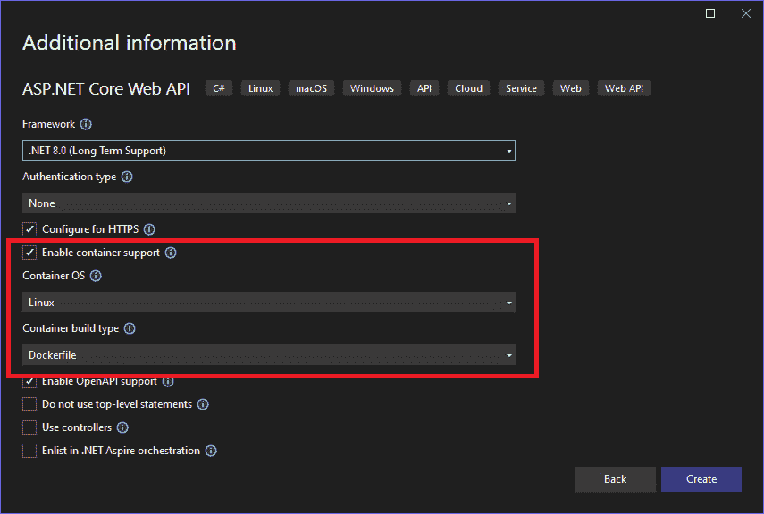

图 12.1 – 启用容器支持

一旦勾选，它将启用两个文本框，**容器操作系统**和**容器构建类型**，以配置容器类型。根据我们的需求，我们可以为**容器操作系统**选项选择**Windows**或**Linux**。对于**容器构建类型**，我们可以选择以下任何一个：

+   **Dockerfile**：当您在 ASP.NET Core 应用程序中选择**Dockerfile**时，您正在选择手动定义如何使用 Dockerfile 构建您的容器镜像。使用 Dockerfile 可以让您完全控制容器镜像的内容，包括基础镜像、依赖项、环境变量、暴露的端口以及运行应用程序的特定命令。

+   **.Net SDK**：选择**.Net SDK**通过利用 Visual Studio 内置的容器支持简化了过程。

对于本章的以下示例，我们将选择**Dockerfile**选项。

## 将 Docker 支持添加到现有项目

如果您有一个现有项目并且想要向其添加 Docker 支持，我们遵循以下步骤：

1.  要添加 Docker 支持，在**解决方案资源管理器**中右键单击项目，然后导航到**添加** | **Docker 支持...**：

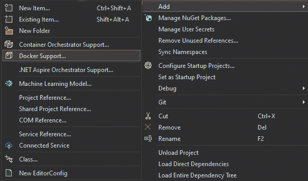

图 12.2 – 添加 Docker 支持

Visual Studio 将为我们的项目生成必要的 Docker 文件。

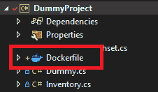

图 12.3 – Dockerfile

1.  将会显示以下对话框，您需要在此配置 Docker 设置：

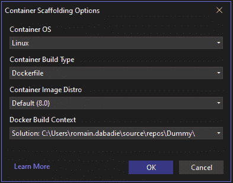

图 12.4 – 容器搭建选项

+   **容器操作系统**：此设置允许我们选择将在您的 Docker 容器内部使用的操作系统。当我们创建新项目时添加 Docker 支持，我们可以在 Linux 和 Windows 之间进行选择。

+   **容器构建类型**：如前所述，此设置确定您的 Docker 镜像将如何构建（例如，Dockerfile / .Net SDK）。

+   **容器镜像发行版**：此设置指的是容器的基础镜像发行版。当选择基于 Linux 的容器操作系统时，这一点尤其相关。

+   **Docker 构建上下文**：Docker 构建上下文是指 Docker 在构建镜像时位于指定路径或 URL 中的文件集。本质上，它定义了 Docker 在构建过程中可以访问的文件范围。

1.  添加 Docker 支持后，我们现在可以在 Docker 容器内构建和运行我们的项目。Visual Studio 在工具栏中提供了方便的按钮，用于构建和运行您的 Docker 化应用程序。

图 12.5 – 容器运行/调试按钮

现在我们已经设置了 Docker 支持，让我们了解一下它如何可能提高我们的生产力。

# 使用 Visual Studio Docker 化应用程序

现在我们已经为我们的项目设置了 Docker 支持，在本节中，我们将通过 Visual Studio 的容器窗口探索我们的应用程序的 Docker 化。我们可以在窗口中检索我们容器的所有信息。要打开此窗口，请转到**视图** | **其他窗口** | **容器**：

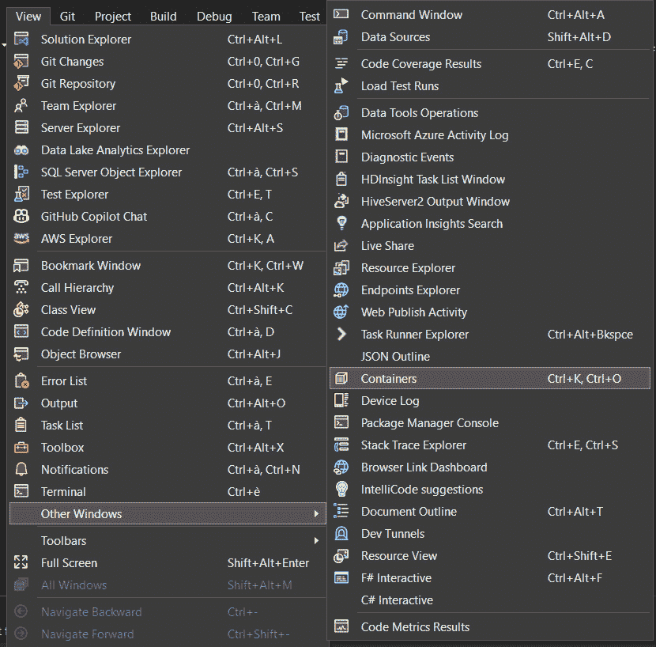

图 12.6 – 打开容器窗口

在这里，我们可以找到有关**解决方案容器**以及 Docker Desktop 中所有容器的信息：

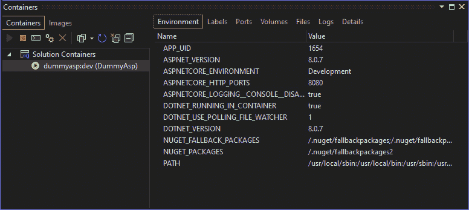

图 12.7 – 容器窗口

注意，Docker Desktop 必须在您的计算机上运行，以确保 Docker 引擎正在运行并提供构建、管理和运行 Docker 容器的必要环境。

容器窗口允许我们直接在 Visual Studio 中快速访问容器的信息，以便监控容器状态、查看日志以及管理容器生命周期，而无需离开 Visual Studio。

工具栏允许我们管理容器：

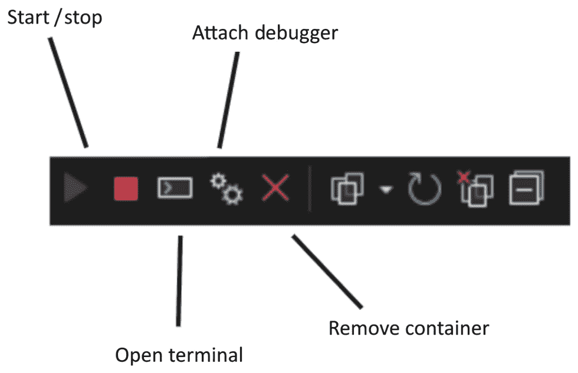

图 12.8 – 容器工具箱

让我们详细了解这些工具栏选项：

+   **启动/停止**：这些选项允许您直接从 Visual Studio 管理容器的生命周期，而无需使用 Docker CLI 命令。

+   **附加调试器**：对于运行支持调试的应用程序（例如 .NET Core 应用程序）的容器，此选项允许将调试器附加到容器。这使您能够设置断点并检查变量，就像应用程序在本地运行一样。

+   **打开终端**：这将在容器内打开一个终端会话。这在执行容器环境中的命令时特别有用。

+   **删除容器**：这允许您删除容器。这对于清理不再需要的已停止容器非常有用。

此外，我们还可以在右侧找到面板，允许我们咨询有关容器的所有信息。

**日志**窗格显示容器的日志。这对于调试和监控容器的输出非常有用：

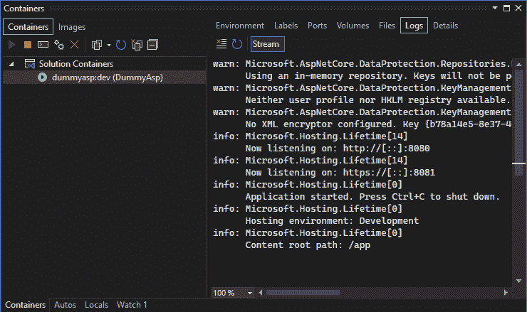

图 12.9 – 容器 | 日志

当我们在调试模式下启动容器时，此显示会自动显示。

现在我们可以直接在 Visual Studio 中运行我们的容器，让我们看看如何部署它。

# 部署容器化应用程序

当应用程序开发完成后，下一步就是部署它。在本节中，我们将看到 Visual Studio 提供的内置选项以实现这一点。

首先，我们通过**解决方案资源管理器**右键单击项目，然后选择**发布…**选项来访问发布向导。

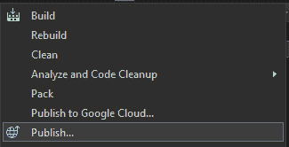

图 12.10 – 发布…

我们已经在*第八章*和*第十章*中看到，它将打开一个窗口，允许我们选择发布的目的地。在本章中，我们将关注两个选项，**Docker 容器注册库**和**Azure**。

## 在容器注册库中部署

让我们先回顾一下容器注册库是什么。**容器注册库**是一个集中存储和分发命名 Docker 镜像及其相关标签的系统。它充当容器镜像的存储库，使我们能够高效地构建、共享和部署容器化应用程序。容器注册库可以是公共的或私有的，这取决于它们是否对所有人开放或仅限于授权用户。

因此，在这种情况下，在**目标**窗口中，我们将选择**Docker** **容器注册库**：

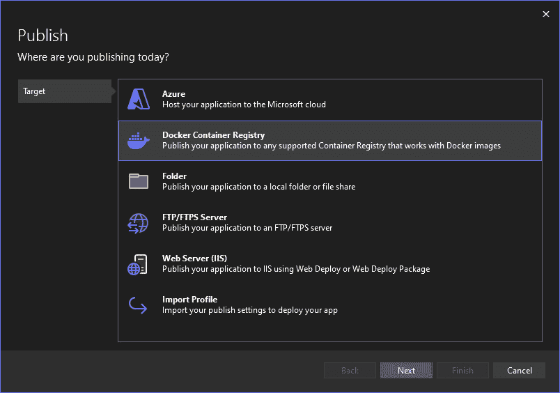

图 12.11 – Docker 容器注册库

然后，点击**下一步**进入**特定目标**选项卡以选择应用程序的主机：

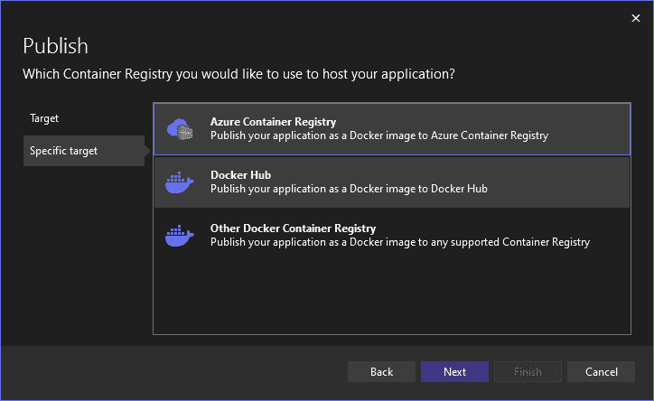

图 12.12 – 特定目标容器注册库

这里，我们有三个选项：

+   **Azure 容器注册库**：**Azure 容器注册库**（**ACR**）是 Azure 提供的一个私有、托管和安全的 Docker 注册库。它允许我们在中央注册库中存储和管理我们的 Docker 镜像和相关工件，从而实现可靠、安全且可扩展的部署。ACR 在 Azure 的网络安全性和访问控制机制后面提供 Docker 镜像的安全存储。

+   **Docker Hub**：**Docker Hub**是一个公共的、基于云的存储库，Docker 用户和合作伙伴在其中创建、测试、存储和分发容器镜像。虽然不如 ACR 在企业使用中安全或功能丰富，但 Docker Hub 广泛用于共享开源项目和基础镜像。

+   **其他 Docker 容器注册库**：除了**ACR**和 Docker Hub，还有其他几个容器注册库可供选择，每个都有自己的功能和定价模式。其中一些值得注意的包括**Google 容器注册库**（**GCR**）和 Amazon **弹性容器** **注册库**（**ECR**）。

对于 ACR，Visual Studio 将要求我们使用有效的 Azure 订阅。另一方面，如果我们选择 Docker Hub，它将提示我们提供我们的 Docker 凭据。

## 在 Azure 中以服务形式部署

返回到**目标**窗口，我们选择**Azure**：

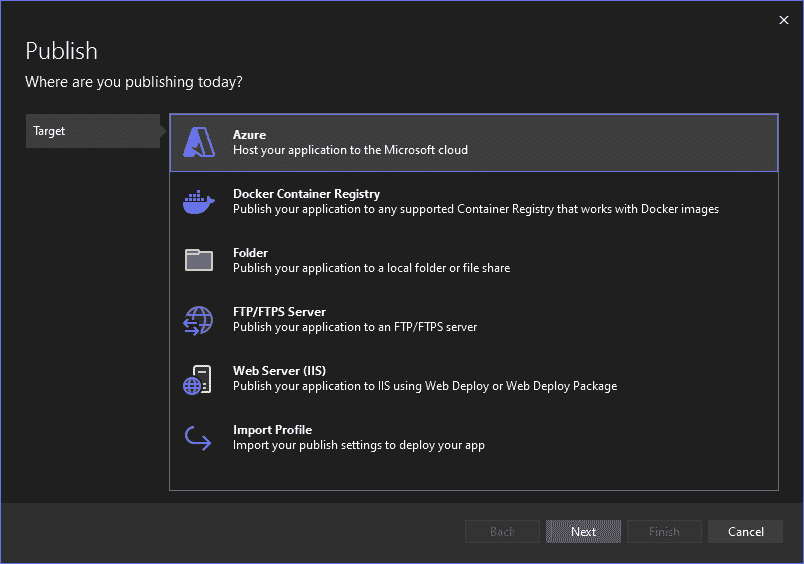

图 12.13 – 目标 Azure

这将带我们到**特定目标**窗口，在这里我们可以找到几个选项来在我们的 Azure 订阅上部署我们的应用程序。

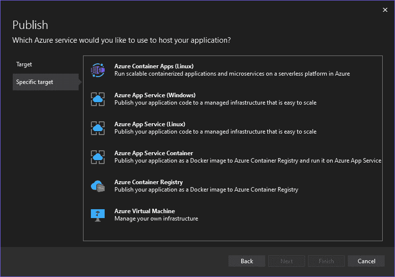

图 12.14 – 特定目标 Azure

在本章中，我们将关注这些容器选项：

+   **Azure 容器应用（Linux）**：**Azure 容器应用**是一个完全托管的旨在直接运行容器的服务，无需 orchestrators，如 Kubernetes。它针对运行微服务和无服务器应用程序进行了优化，内置了对源代码存储库、CI/CD 管道和自动扩展的支持。

+   **Azure 应用服务容器**：**Azure 应用服务**是一个完全托管的平台，用于构建、部署和扩展 Web 应用程序。应用服务中的容器选项允许我们运行 Docker 容器，提供了一种简单的方式来部署和管理容器化应用程序或网站。

+   **Azure 容器注册表**：在这里，我们检索 ACR，这是 Azure 提供的私有、托管和安全的 Docker 注册表。

每个选项都满足不同的需求，从针对微服务的优化型无服务器容器到用于 Web 应用程序的完全托管环境，再到用于 Docker 镜像的安全、私有注册表。

# 摘要

在本章中，我们探讨了 Docker 和 Visual Studio 之间强大的集成，这种组合显著增强了您的开发工作流程。我们从介绍 Docker 和 Visual Studio 集成开始，涵盖了 Docker 的基本知识及其在现代软件开发中的重要性。下一节指导您在 Visual Studio 中配置 Docker 支持。接下来，我们关注了将您的应用程序转换为 Docker 容器的实际方面。最后，我们讨论了 Visual Studio 中可用的各种部署策略。

通过掌握这些技能，您现在已经准备好简化您的开发过程，提高部署速度，并有效地采用现代 DevOps 实践，同时保持在 Visual Studio 中。

在下一章中，我们将深入探讨如何创建我们自己的 Visual Studio 扩展，我们将学习如何自定义和扩展 Visual Studio 以满足您独特的开发需求。

# 第四部分：精通核心开发技能

在本节的最后部分，我们将关注自定义和增强您的开发环境。您将学习如何编写您自己的项目模板，创建 Visual Studio 扩展，并构建 NuGet 包以与开发社区和您所在的组织共享。这些技能将使您能够根据您的需求定制 Visual Studio，简化工作流程并提高生产力。

本部分包含以下章节：

+   *第十三章* ，*编写您自己的项目模板*

+   *第十四章* ，*编写您自己的 Visual Studio 扩展*

+   *第十五章* ，*为社区创建和发布强大的 NuGet 包*
