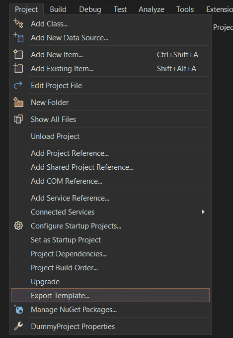
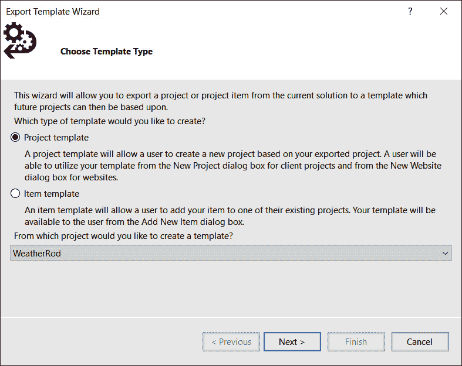
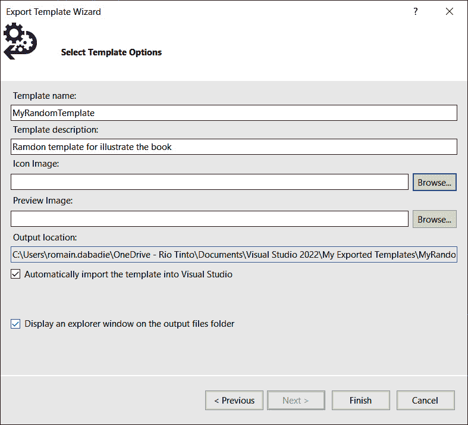
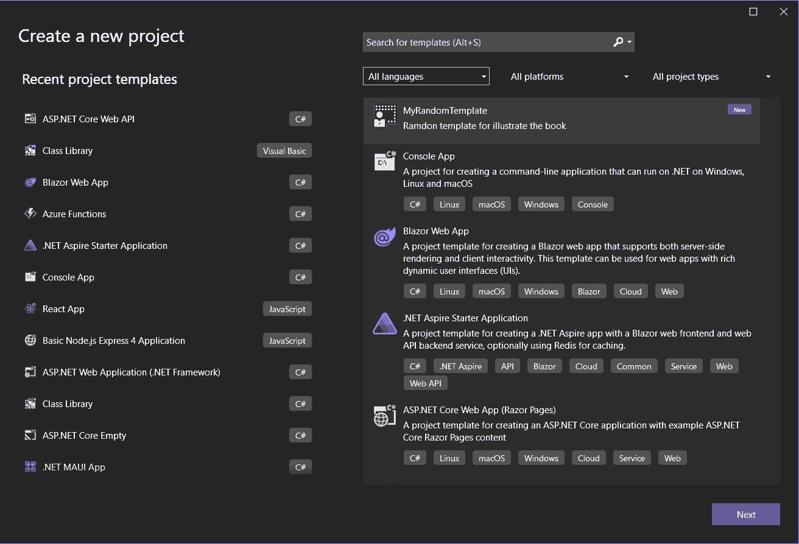
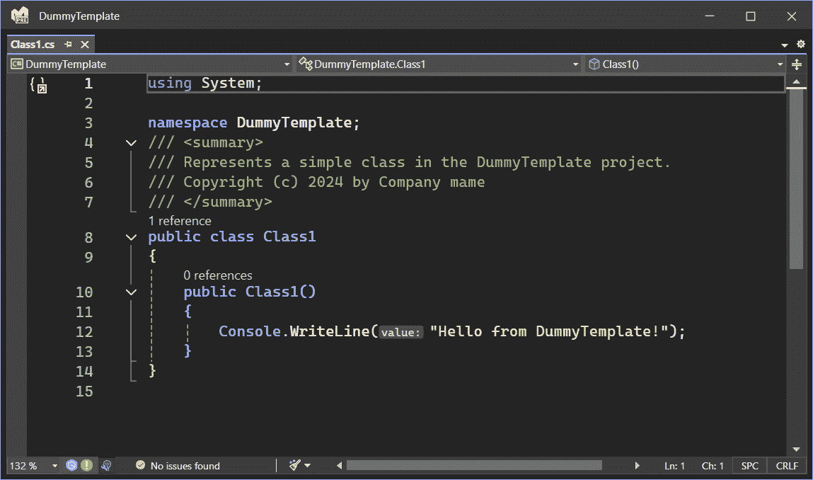
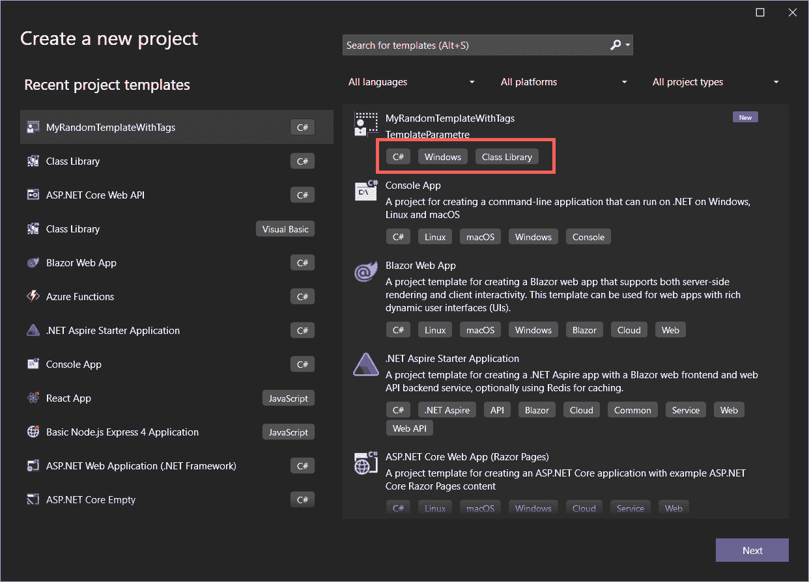
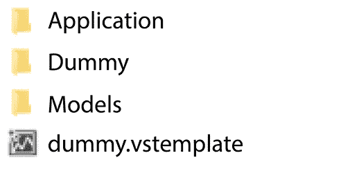
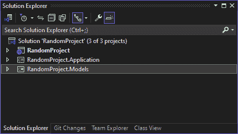

# 编写你自己的项目模板

在本章中，我们将深入探索 Visual Studio 的世界，通过了解如何创建自定义项目模板来展开。这些模板是极其强大的工具，使我们能够简化我们的开发过程，确保我们的团队能够以一致的结构和配置开始每个项目。我们将从剖析构成项目模板的基本结构开始，为你提供一个坚实的基础来构建。随着我们的进展，我们将发现如何将参数集成到我们的模板中，允许在项目创建点进行动态定制。最后，我们将深入研究高级功能，教你如何将项目模板扩展为完整的解决方案模板，以处理复杂的多项目解决方案。

在本章中，我们将涵盖以下主要主题：

+   理解项目模板结构

+   构建基本项目模板

+   为不同的工作流程自定义项目模板

+   集成模板参数

+   使用高级功能扩展项目模板

到本章结束时，你不仅将拥有创建和自定义项目模板的知识，还将了解如何利用这些工具来提高生产力和保持项目之间的一致性。

# 技术要求

在编写本章时，我使用了以下版本的 Visual Studio：

+   Visual Studio Enterprise 2022 版本 17.12.0

+   预览 1.0

本章的代码文件可以在[`github.com/PacktPublishing/Mastering-Visual-Studio-2022/tree/main/ch13`](https://github.com/PacktPublishing/Mastering-Visual-Studio-2022/tree/main/ch13)找到。

# 理解项目模板结构

当我们使用 Visual Studio 创建新项目或新项目项时，我们都会使用模板。在本节中，我们将介绍项目模板和项目项模板之间的区别，然后查看涉及此过程的文件。Visual Studio 中的项目模板是强大的工具，可以帮助开发者快速设置具有预定义配置和结构的新项目。另一方面，我们可以为项目的特定部分创建项目项模板。这些模板提供了一个基础，可以根据特定需求进行定制，简化开发过程并确保项目之间的一致性。

Visual Studio 中的项目模板和项目项模板都是可重用的结构，旨在通过提供基本的代码框架和配置来简化开发，这些框架和配置可以根据特定需求进行定制。尽管它们有相似之处，但在 Visual Studio 环境中的应用范围和作用上存在显著差异。

**项目模板**作为创建新项目的基石蓝图。它们包括整个项目结构、必要的文件、引用和针对特定项目类型（例如，ASP.NET Core Web App、类库）定制的配置设置。当在 Visual Studio 中开始新项目时，我们选择符合我们要求的模板。此模板建立了初始项目框架，包括默认命名空间、程序集引用和编译器选项，节省时间并确保项目之间的一致性。

**项目模板**专注于项目中的单个组件。这些模板的范围可以从简单的文件类型（例如，XML、HTML、CSS）到涉及多个文件和资源的复杂结构。它们旨在快速将预定义的项目元素添加到现有项目中。我们在通过**添加新项**对话框向项目中添加新元素时使用项目模板。这可能包括从类文件或接口到预配置的网页等任何内容。项目模板允许快速包含这些元素，而无需手动配置。

创建新模板涉及与以下要点中描述的不同文件一起工作：

+   **要创建的文件**：

    +   **源代码文件**：这些是模板中包含的初始编码文件。例如，C#类库模板可能以默认的**Class1.cs**文件开始。

    +   **嵌入式资源**：此类别包括项目可能需要的图像、配置文件或其他资源。

    +   **项目文件**：这些包括解决方案和项目文件（例如，C#项目的**.sln**和**.csproj**文件），它们概述了项目的结构和依赖关系。

+   **.** **vstemplate**：

    +   此 XML 文件对于定义模板至关重要。它包含有关模板的元数据，例如模板的名称、描述、图标和项目类型。

    +   它概述了要包含在项目中的文件，并指定了在实例化模板时需要处理的任何附加参数或向导数据。

+   **压缩成一个** **ZIP 文件**：

    +   一旦准备好模板及其相关文件，它们就会被压缩成一个**.zip**文件。此文件放置在 Visual Studio 可以识别的特定文件夹中。

    +   对于项目模板，**.zip**文件放置在**\Documents\Visual Studio <** **版本>\Templates\ProjectTemplates**目录中。

    +   对于项目模板，它们位于**\Documents\Visual Studio <** **版本>\Templates\ItemTemplates**目录中。

Visual Studio 中的项目模板为整个项目提供了一个起点，提供了一个基于所选模板规格的结构化基础。相反，项目项模板用于加速在项目内添加单个组件或文件，通过提供可重用的代码片段或资源来简化开发工作流程。理解这两种模板之间的区别可以显著提高软件开发实践中的生产力和一致性。

现在，让我们学习如何创建基本模板。

# 构建基本项目模板

在本节中，我们将介绍构建项目模板的更便捷方法。该过程包括构建一个具有最小需求的骨架项目，以满足我们公司的要求，例如。之后，我们可以使用 Visual Studio 的导出模板向导，通过使用 Visual Studio 顶栏菜单：**项目** | **导出模板…**将现有项目导出为模板：



图 13.1 – 导出模板…

上述操作将打开**导出模板** **向导**窗口：



图 13.2 – 导出模板向导

首先，我们选择要导出的模板类型；要么是**项目模板**，要么是**项模板**。

然后，该工具允许我们定义关键细节，例如模板的名称、描述、图标和预览图像。



图 13.3 – 选择模板选项

完成后，项目将被打包成一个**.zip**文件并保存到所选输出位置。此外，我们可以选择直接将模板导入 Visual Studio 以立即使用。要访问和使用我们新创建的模板，请打开创建新项目的对话框。



图 13.4 – 使用自定义模板

我们可以通过搜索其名称或浏览列表来定位模板。请注意，对于自定义模板，可能不支持按语言或项目类型进行筛选。

让我们探索如何自定义模板。

# 为不同工作流程自定义项目模板

更新 Visual Studio 模板有两种方式，要么使用导出模板向导，要么手动调整模板内的文件。

第一种方法是利用导出模板向导，通过在我们要修改的项目模板内启动一个新项目，然后按照以下步骤进行：

1.  在项目内执行我们想要的修改。这可能包括更改输出类型、添加新文件或实施其他更改。

1.  **导出修改后的模板**：在调整了我们的项目后，转到**项目** | **导出模板**以访问导出模板向导。

1.  **完成导出过程**：遵循向导的说明，成功导出我们修改后的模板为**.zip**文件。

另一种选择是将手动修改应用于模板，通过以下步骤修改**.vstemplate**文件：

1.  **识别模板**：找到我们打算修改的模板对应的**.zip**存档。通常，它位于**%USERPROFILE%\Documents\Visual** **Studio <version>\Templates\ProjectTemplates**。

1.  **解压缩存档**：提取模板存档的内容。

1.  **编辑文件**：对模板中的文件进行必要的编辑、添加或删除。

1.  **修改 .vstemplate 文件**：调整**.vstemplate** XML 文件以准确反映所做的更改。

1.  **存档更改**：将所有修改后的文件压缩回一个**.zip**存档。

1.  **实施更新后的模板**：将新压缩的**.zip**文件传输到原始目录，替换过时的模板文件。

定制化允许我们在现有模板中使用一些参数和变量。让我们在下一节中看看如何实现这一点。

# 集成模板参数和变量

现在我们已经看到了如何打开现有的**.vstemplate**文件以进行自定义，在本节中，我们将探讨如何利用参数在模板实例化时动态替换模板中的值。使用 Visual Studio 中的**.vstemplate**文件中的参数和变量，我们可以创建动态模板，这些模板可以适应不同的项目名称、命名空间和其他可定制方面。此功能增强了模板的可重用性和可定制性，使模板创建成为简化开发工作流程的有力工具。

**模板参数**是我们模板中的占位符，在模板实例化时用实际值替换。这些参数可以代表我们项目的各个方面，例如项目名称、命名空间，甚至自定义定义的值。

Visual Studio 提供了一组保留的模板参数，您可以直接在模板中使用这些参数。以下是这些保留参数的列表，根据微软的文档：

+   **clrversion**：当前版本的**公共语言****运行时**（**CLR**）。

+   **ext_***：添加到任何参数前缀，以引用父模板中的变量（例如，**ext_safeprojectname**）。

+   **guid[1-10]**：用于在项目文件中替换项目 GUID 的 GUID。最多可以指定 10 个唯一的 GUID（例如，**guid1**）。

+   **itemname**：使用参数的文件的名称。

+   **machinename**：当前计算机名称（例如，**Computer01**）。

+   **projectname**：用户在创建项目时提供的名称。这仅适用于项目模板。

+   **registeredorganization**：来自**HKEY_LOCAL_MACHINE\Software\Microsoft\WindowsNT\CurrentVersion\RegisteredOrganization**的注册表键值。

+   **rootnamespace** : 当前项目的根命名空间，后跟当前项的子文件夹，斜杠被点号替换。

+   **defaultnamespace** : 当前项目的根命名空间。

+   **safeitemname** : 与 **itemname** 相同，但将所有不安全字符和空格替换为下划线字符。

+   **safeitemrootname** : 与 **safeitemname** 相同。

+   **safeprojectname** : 在创建项目时用户提供的名称，但已移除所有不安全字符和空格。这仅适用于项目模板。

+   **targetframeworkversion** : 目标 .NET Framework 的当前版本。

+   **time** : 基于 Windows 用户设置的格式（例如，DD/MM/YYYY 00:00:00）的当前时间。

+   **specifiedsolutionname** : 解决方案名称。行为取决于是否勾选了**将解决方案和项目放在同一目录中**或**创建解决方案目录**。

+   **userdomain** : 当前用户域。

+   **username** : 当前用户名。

+   **webnamespace** : 当前网站的名称，用于网页表单模板以确保类名唯一。

+   **year** : 当前年份，格式为 YYYY。

+   **solutiondirectory** : 解决方案的目录。

+   **destinationdirectory** : 创建 **.csproj** 后的目录路径。

这些保留参数可以用于在模板中动态插入项目特定的信息。例如，我们可以使用 **$safeprojectname$** 和 **$year$** 保留参数动态生成命名空间并添加版权声明。

对于这个例子，我们将手动创建一个新的模板。本例将重点创建一个使用多个保留模板参数的 C# 类库项目模板，这些参数根据用户输入和系统信息动态生成命名空间、类名和文件名。让我们从以下步骤开始：

1.  首先，在 **.vstemplate** 文件中定义我们的项目模板结构。此文件指定在实例化模板时创建的内容：

    ```cs
    <VSTemplate Version="3.0.0"
      xmlns="http://schemas.microsoft.com/developer/
             vstemplate/2005"
      Type="Project">
      <TemplateData>
        <Name>Masterize VS ClassTemplate</Name>
        <Description>TemplateParametre</Description>
        <ProjectType>CSharp</ProjectType>
        <SortOrder>1000</SortOrder>
        <CreateNewFolder>true</CreateNewFolder>
        <DefaultName>ClassTemplate</DefaultName>
        <ProvideDefaultName>true</ProvideDefaultName>
        <LocationField>Enabled</LocationField>
        <EnableLocationBrowseButton>
          true
        </EnableLocationBrowseButton>
        <CreateInPlace>true</CreateInPlace>
        <Icon>__TemplateIcon.ico</Icon>
      </TemplateData>
      <TemplateContent>
        <Project TargetFileName="ClassTemplate.csproj"
          File="ClassTemplate.csproj"
          ReplaceParameters="true">
          <ProjectItem
            ReplaceParameters="true"
            TargetFileName="Class1.cs">
            Class1.cs
          </ProjectItem>
          <ProjectItem
            ReplaceParameters="true">
            Properties\AssemblyInfo.cs
          </ProjectItem>
        </Project>
      </TemplateContent>
    </VSTemplate>
    ```

    注意，如果需要为每个 **ProjectItem** 指定 **TargetFileName** 以确保它们在新建的项目中具有特定的名称，这是一个常见的做法。第二个 **<ProjectItem>**（**Properties\AssemblyInfo.cs**）没有 **TargetFileName**。如果您想确保此文件在新项目中具有相同的名称，这是可以的。如果您想替换参数，它也应该具有 **ReplaceParameters="true"** 属性（如当前所示）。

1.  接下来，创建一个名为 **Class1.cs** 的 C# 类文件，该文件将成为我们模板的一部分。我们将使用 **$safeprojectname$** 和 **$year$** 保留参数动态生成命名空间并添加版权声明：

    ```cs
    using System;
    namespace $safeprojectname$
    {
        /// <summary>
        /// Represents a simple class in the
        /// $safeprojectname$ project.
        /// Copyright (c) $year$ by Company name
        /// </summary>
        public class Class1
        {
            public Class1()
            {
                Console.WriteLine(
                    "Hello from $safeprojectname$!"
                );
            }
        }
    }
    ```

1.  我们还将在模板中的 **Properties** 文件夹下创建一个 **AssemblyInfo.cs** 文件。此文件将包含程序集元数据，我们将使用 **$projectname$**、**$year$** 和 **$username$** 保留参数来自定义程序集标题和版权信息：

    ```cs
    using System.Reflection;
    using System.Runtime.CompilerServices;
    [assembly: AssemblyTitle("$projectname$")]
    [assembly: AssemblyDescription("A simple class library project.")]
    [assembly: AssemblyCompany("Your Company")]
    [assembly: AssemblyProduct("$projectname$")]
    [assembly: AssemblyCopyright("Copyright © $year$ $username$. All rights reserved.")]
    [assembly: AssemblyTrademark("")]
    [assembly: AssemblyVersion("1.0.*")]
    ```

1.  创建这些文件后，将它们打包成**.zip**文件，并将它们放置在 Visual Studio 模板目录中，或者通过 Visual Studio 的模板管理器导入它们。

当基于此模板创建新项目时，Visual Studio 将提示我们输入项目名称和位置。因此，**Class1.cs**文件将填充提供的值：



图 13.5 – 生成 Class1

然后，它将用实际值替换模板文件中的保留参数，例如安全的项目名称、当前年份和用户名。在这个例子中，我选择**DummyTemplate**作为项目名称，系统使用当前年份来设置**$** **year$**参数。

当我们从自定义模板创建项目时，你可能会注意到我们可以使用过滤器组合框来过滤它们。在我们的**.vstemplate**文件的**<TemplateData>**部分中，我们可以添加以下元素来指定标签：

+   **<LanguageTag>**：这指定了模板中使用的编程语言

+   **<PlatformTag>**：这表示目标平台（例如，Windows，Web）

+   **<ProjectTypeTag>**：这描述了项目的类型（例如，类库、控制台应用程序）

每个标签元素应包含标签的名称作为其文本内容：

```cs
<TemplateData>
    …
    <LanguageTag>C#</LanguageTag>
    <PlatformTag>Windows</PlatformTag>
    <ProjectTypeTag>Class Library</ProjectTypeTag>
</TemplateData>
```

以这种方式更新我们的模板时，我们可以观察到模板列表中描述上出现的标签。



图 13.6 – 带有标签的模板列表

这些标签允许我们在寻找模板时利用列表上的三个过滤器。

有时候，我们需要不止一个项目，并且我们期望使用一个带有多库项目的现成解决方案来构建一个干净的架构，例如；让我们在下一节中看看我们如何实现这一点。

# 扩展项目模板以包含高级功能

在本节中，我们将通过结合多个项目模板来创建一个可以称为解决方案模板的内容。

在 Visual Studio 中创建一个多项目解决方案模板涉及几个步骤，包括创建单个项目模板，将它们组合成一个解决方案模板，并配置解决方案模板在创建时实例化多个项目。让我们开始吧：

1.  首先，创建将包含在解决方案模板中的模板。为此，请遵循本章“构建基本项目模板”部分提供的说明。

1.  接下来，为解决方案模板准备一个目录结构。这包括为解决方案模板创建一个文件夹，并将每个项目模板解压缩的内容复制到这个文件夹中。



图 13.7 – 文件夹结构

1.  在这个例子中，我创建了三个项目模板来构建解决方案。

1.  现在，在解决方案模板目录的根目录下创建或修改一个 **.vstemplate** 文件。此文件定义了我们的解决方案模板的结构，包括对各个项目模板的引用。在此文件中，我们将 **Project Type** 选项设置为 **ProjectGroup**，以表明此模板代表一组项目，如下所示：

    ```cs
    <VSTemplate Version="3.0.0"
      xmlns="http://schemas.microsoft.com/developer/
             vstemplate/2005"
      Type="ProjectGroup">
      <TemplateData>
        <Name>CleanDummyArch</Name>
        <Description>Dummy solution</Description>
        <ProjectType>Web</ProjectType>
        <ProjectSubType>CSharp</ProjectSubType>
        <SortOrder>1000</SortOrder>
        <CreateNewFolder>true</CreateNewFolder>
        <DefaultName>DummySolution</DefaultName>
        <ProvideDefaultName>true</ProvideDefaultName>
        <LocationField>Enabled</LocationField>
        <EnableLocationBrowseButton>
          True
        </EnableLocationBrowseButton>
        <CreateInPlace>true</CreateInPlace>
        <Icon>__TemplateIcon.ico</Icon>
        <LanguageTag>C#</LanguageTag>
        <PlatformTag>Windows</PlatformTag>
        <ProjectTypeTag>Class Library</ProjectTypeTag>
      </TemplateData>
      <TemplateContent>
        <ProjectCollection>
          <ProjectTemplateLink
            ProjectName="$safeprojectname$">
              Dummy\MyTemplate.vstemplate
          </ProjectTemplateLink>
          <ProjectTemplateLink
            ProjectName="$safeprojectname$.Application">
              Application\MyTemplate.vstemplate
          </ProjectTemplateLink>
          <ProjectTemplateLink
            ProjectName="$safeprojectname$.Models">
              Models\MyTemplate.vstemplate
          </ProjectTemplateLink>
        </ProjectCollection>
      </TemplateContent>
    </VSTemplate>
    ```

1.  在 **<TemplateContent>** 中，我们使用 **<ProjectCollection>** 而不是 **<Project>** 来定义一组项目。每个子项目通过一个 **<ProjectTemplateLink>** 元素链接，该元素建立链接，指向解决方案模板目录中项目模板的相对路径。

1.  一旦我们的解决方案模板配置完成，我们将执行以下操作：

    +   我们将解决方案模板目录的内容进行压缩，包括修改后的 **.vstemplate** 文件和未压缩的项目模板

    +   我们将压缩文件放置在 Visual Studio 模板目录中或通过 Visual Studio 的模板管理器导入它

1.  最后，通过在 Visual Studio 中从它创建一个新项目来测试解决方案模板，以确保它能够正确地生成包含所有所需项目的解决方案，通过**解决方案资源管理器**。



图 13.8 – 解决方案架构

因此，我们启动了一个包含三个项目的解决方案，正如模板中定义的那样。这个过程允许我们创建一个可重复使用的解决方案模板，该模板包含多个项目，简化了基于预定义配置的新解决方案的设置，节省了时间并确保了项目之间的一致性。

# 摘要

在本章中，我们探讨了在 Visual Studio 2022 中制作自定义项目模板的艺术，这对于任何希望标准化和加速其工作流程的开发者来说是一项关键技能。我们首先理解了构成项目模板骨架的基本结构。然后我们深入到定制中，向您展示如何调整这些模板以适应不同的工作流程，确保它们满足您项目的特定需求。从那里，我们探讨了参数的集成，允许您向模板添加动态元素以获得更大的灵活性。最后，我们将重点扩展到高级功能，使您能够轻松创建可以管理复杂的多项目解决方案的解决方案模板。

随着我们继续前进，我们将通过探索 Visual Studio 的另一个强大功能：创建自己的扩展来构建这一知识。在下一章中，我们将深入到自定义工具的世界，在那里你将学习如何通过创建和部署针对你独特需求的扩展来进一步增强你的开发环境。
