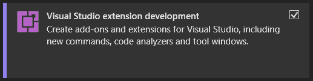
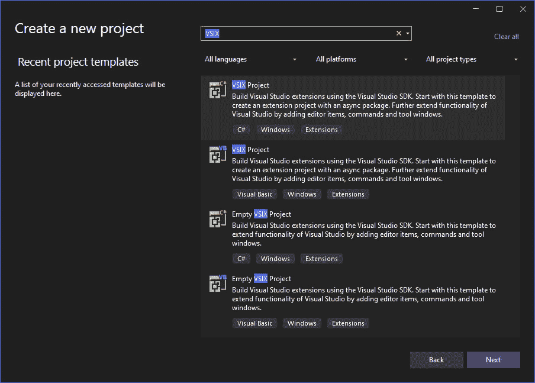
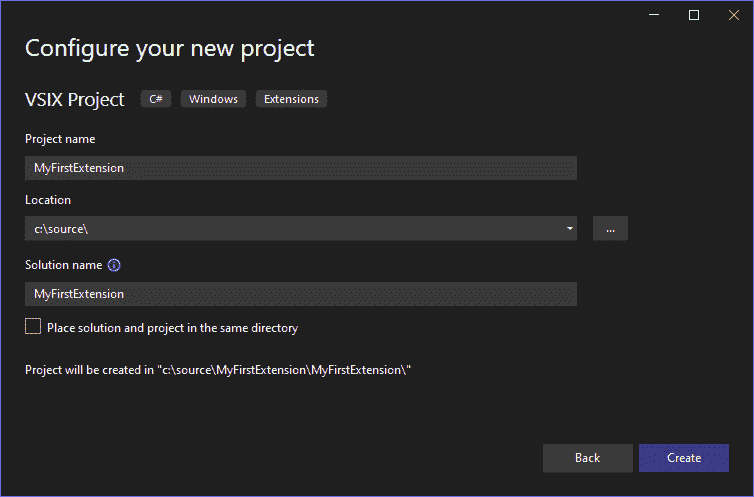
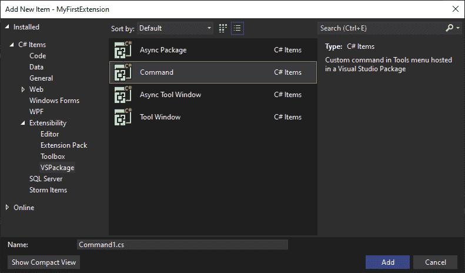
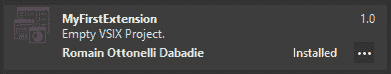
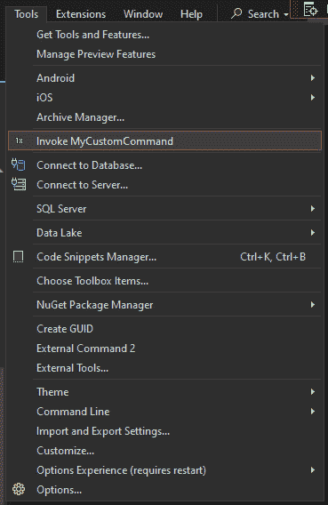
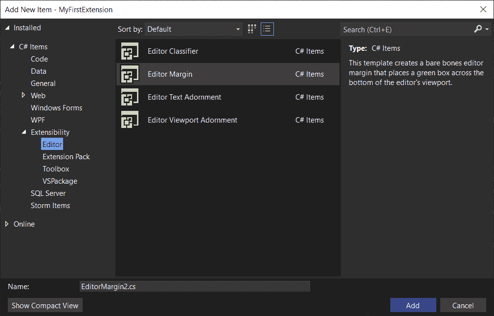
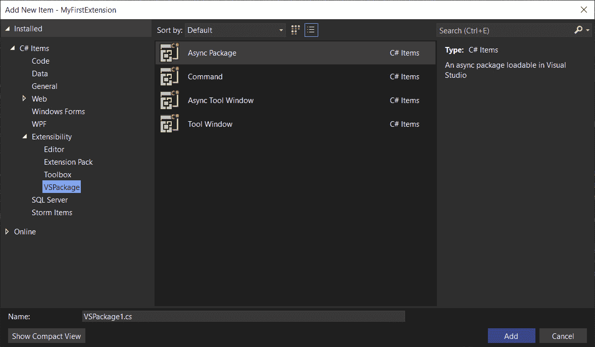

# 14

# 编写您自己的 Visual Studio 扩展

在本章中，我们将深入 Visual Studio 扩展开发的领域，我们将学习如何创建能够增强我们的开发环境的工具。**Visual Studio** 扩展功能强大，能够添加自定义功能、自动化重复性任务以及创建满足特定需求的定制工作流程。

我们将首先分解 Visual Studio 扩展架构，这将为我们提供一个对其核心组件及其在 **集成开发环境**（**IDE**）中如何工作的坚实基础。有了这个基础，我们将使用提供的项目模板构建和测试我们的第一个扩展。随着我们的进步，我们将探索更复杂的功能，检查预加载模板提供的功能。最后，我们将介绍部署和共享过程，确保我们能够有效地分发我们的扩展，无论是用于个人使用、团队内部还是更广泛的开发者社区。

在本章中，我们将涵盖以下主要主题：

+   理解 Visual Studio 扩展架构

+   构建您的第一个扩展

+   高级扩展功能

+   部署和共享您的扩展

到本章结束时，您将掌握创建、优化和共享 Visual Studio 扩展所需的知识和实践技能，这将显著提高您的生产力。

# 技术要求

在编写这一章时，我使用了以下版本的 Visual Studio：

+   Visual Studio Enterprise 2022 版本 17.12.0

+   预览 1.0

# 理解 Visual Studio 扩展架构

**Visual Studio 扩展** 是增强 Microsoft Visual Studio 功能的强大工具，允许开发者自定义和扩展 IDE，以更好地满足他们的开发需求。本节深入探讨了 Visual Studio 扩展的底层架构，突出了关键组件、它们之间的交互以及它们所运行的更广泛生态系统。

Visual Studio 扩展建立在称为 **Visual Studio Shell** 的强大基础之上，该 Shell 作为与 IDE 交互的核心环境。这个 Shell 具有高度的可定制性，提供了一个框架，使我们能够无缝地创建和集成新功能。开发扩展的过程始于 **扩展清单**，这是一个包含基本元数据的关键文件，例如扩展的名称、版本、描述和依赖项。这个清单对于 Visual Studio 中的安装过程至关重要，一旦扩展部署，它在管理更新中也发挥着重要作用。

扩展的核心是**包**组件，它封装了所有必要的功能性和资产，包括**动态链接库**（**DLL**）和图像，成为一个单一的、可部署的单元。这种打包确保所有必需的文件都正确安装在 Visual Studio 环境中。对于需要与**用户界面**（**UI**）交互的扩展，包含菜单命令和工具窗口是必要的。这些元素使用 XML 定义，可以根据 IDE 内发生的特定条件或事件动态启用或禁用。

当扩展在项目级别运行时，**项目系统集成**变得至关重要。这涉及到与**项目系统对象模型**（**PSOM**）一起工作，它在 Visual Studio 中表示项目的结构和属性。提供代码生成和分析工具的扩展利用 Visual Studio 提供的 API 生成样板代码，重构现有代码或执行全面的代码分析。最后，扩展的成功往往取决于有效地利用 Visual Studio 提供的各种**集成点**，例如允许扩展响应特定 IDE 操作的事件处理器，如打开文档或构建解决方案。这些集成点使扩展能够通过响应 IDE 内的操作来自动化任务并增强用户体验。

除了构成 Visual Studio 扩展的核心组件外，**Visual Studio Marketplace**在生态系统中发挥着关键作用。这个平台作为扩展的主要分发中心，使开发者能够轻松地找到、安装和管理各种第三方工具。Visual Studio Marketplace 不仅简化了访问扩展的过程，而且还通过提供一个反馈和开发者与用户之间互动的空间来促进社区参与。

为了支持这些扩展的创建，Visual Studio **软件开发工具包**（**SDK**）提供了所有必要的工具和文档。SDK 包括库、示例代码和全面的教程，旨在帮助我们开始构建自己的扩展。这个工具包对于导航扩展开发的复杂性并确保新工具与 Visual Studio 环境顺利集成至关重要。

在对 Visual Studio 扩展的基础组件及其支持生态系统有充分理解之后，你现在已经准备好迈出下一步：构建你的第一个扩展。在下一节中，我们将从头开始创建一个基本的 Visual Studio 扩展，展示如何利用 Visual Studio SDK 提供的工具和资源将你的想法变为现实。

# 构建你的第一个扩展

让我们创建一个简单的 Visual Studio 扩展，该扩展在**工具**菜单下添加一个新的菜单项。当点击时，这个菜单项将显示一个消息框。这个示例将指导我们设置一个基本的扩展项目。

在深入扩展开发之前，正确设置你的环境至关重要。第一步是确保我们安装了正确的工具。首先打开**Visual Studio 安装程序**并修改当前的 Visual Studio 安装。在安装程序中，我们需要检查 Visual Studio 扩展开发工作负载是否已安装。



图 14.1 – Visual Studio 扩展开发工作负载

这个工作负载包括 Visual Studio SDK 和其他构建扩展所需的必需工具。拥有这些组件是顺利开发过程的基础，确保你可以访问创建和测试我们的扩展所需的所有库、模板和资源。

要开始构建我们的扩展，请按照以下步骤操作：

1.  首先打开 Visual Studio，为任何类型的项目选择**创建新项目**选项。

1.  在项目创建窗口中，搜索**VSIX 项目**。这个模板专门用于创建 Visual Studio 扩展。一旦找到，选择模板并点击**下一步**继续。



图 14.2 – 创建新的 VSIX 项目

1.  接下来，系统会提示我们为项目命名。选择一个能反映我们扩展功能的名字，以我们的示例为例，我们将选择**MyFirstExtension**，并指定你想要保存项目文件的路径。



图 14.3 – 配置 VSIX 项目

1.  在我们配置了这些设置之后，点击**创建**以生成项目结构。这一步为我们的扩展设置了基本框架，使我们能够开始自定义和添加项目功能。

1.  创建一个好的扩展的第一步是为我们的新功能添加一个入口点。最方便的方式是添加一个新的命令。在这里，我们将通过在项目节点上右键点击，选择**添加 | 新项**，然后在**C#项** | **可扩展性**下查找**命令**来利用 Visual Studio SDK 提供的项目模板。



图 14.4 – 添加新项 | 命令

在这个示例中，我们选择名字**MyCustomTemplate**。这个项目模板为我们第一个命令添加了所有需要的内容：

+   **.vsct** 文件，即 **Visual Studio 命令表**文件，是一个 XML 文件，用于在 Visual Studio 扩展中定义扩展添加到 Visual Studio 环境中的菜单、命令和其他 UI 元素的结构和行为。它充当扩展如何与 Visual Studio UI 集成的蓝图，指定菜单和按钮应放置的位置、它们应使用的图标以及它们在点击时的行为。

+   **MyCustomCommand.cs** 文件被添加到您的项目中；您需要用适当的代码替换其内容以定义所需的功能。目前，它定义了一个在执行时显示消息框的命令。

1.  现在，当我们启动调试模式时，它将打开一个 Visual Studio 的实验实例。在这个实例中，我们将从**扩展** | **管理扩展**窗口检索我们安装的包。



图 14.5 – MyFirstExtension 已安装

此外，在**工具**菜单中，我们找到了**调用 MyCustomCommand**选项。目前，此命令仅简单地打开一个显示基本消息的消息框。



图 14.6 – 调用 MyCustomCommand

我们现在已经构建了我们的第一个扩展。让我们在下一节中探索我们可以添加的功能，以自定义我们的 Visual Studio 扩展。

# 高级扩展功能

正如我们所见，我们可以轻松地向 Visual Studio 的菜单中添加新命令，使我们能够与我们的 IDE 交互，甚至打开外部工具。在本节中，我们将探讨我们可以利用的预设模板来扩展 Visual Studio。

因此，如果我们回到**添加项目**窗口，通过右键单击项目节点并选择**添加 | 新项…**，我们可以找到按四个类别排序的 kickstart 命令。

首先，**编辑器**类别包括模板，允许修改和增强 Visual Studio 编辑器本身。这些修改可以从更改文本的突出显示到在编辑器面板内添加交互式元素。



图 14.7 – 添加新的编辑器项

以下是对**编辑器**类别内子类别的概述：

+   **编辑器分类器**：一个**编辑器分类器**项允许我们根据自定义规则对编辑器中的文本进行分类。这可以用于语法突出显示、识别代码中的特定模式，甚至提供关于编码标准的实时反馈。例如，我们可以创建一个分类器，用鲜艳的颜色突出显示所有待办事项注释，以确保它们引起开发者的注意。

+   **编辑器边距**：**编辑器边距**模板允许创建围绕**编辑器**面板的定制边距。这些边距可以显示与正在查看的代码相关的额外信息或控件。一个用例是实现一个显示代码文件迷你图的边距，使用户能够快速导航大型文件。

+   **编辑器文本装饰**：**文本装饰**允许在编辑器中对文本进行装饰。这可以包括下划线、删除线、背景颜色，甚至可以在文本中插入图像或图标。这允许我们为已弃用的方法添加红色波浪下划线，以视觉上指示它们不应被使用，例如。

+   **编辑器视口装饰**：类似于文本装饰，但专注于视口（编辑器的可见区域），**视口装饰**可以在编辑器内容之上叠加图形或 UI 元素。例如，在查看只读文件时，在编辑器上显示水印或横幅。

**扩展包**实际上是一组扩展的组合，旨在提供围绕特定主题或目的的全面功能集。创建扩展包允许开发者分发一套无缝协作的工具，增强特定开发场景的生产力并简化工作流程。

然后，**工具箱**类别包括为在 Visual Studio 中创建可以添加到 Windows Forms 或**Windows Presentation Foundation**（**WPF**）设计表面的控件而设计的模板。这些控件可以从简单的 UI 元素到封装特定功能的复杂组件不等。

此外，**VSPackages**代表了 Visual Studio 中更深层次的扩展性，允许创建可以修改或添加到 IDE 核心功能的扩展。这些包可以从简单的命令到复杂的工具窗口和服务不等。



图 14.8 – 添加新的 VSPackage 项目

在本节中，我们可以找到以下项目模板：

+   **异步包**：这为在 Visual Studio 扩展中创建异步操作提供了一个基础。这对于可能需要很长时间才能完成的操作特别有用，例如从外部服务获取数据或执行密集型计算。

+   **命令**：如前节所述，命令允许向 Visual Studio 菜单、工具栏或甚至上下文菜单中添加新操作。此模板便于创建可以与 IDE 或外部工具交互的命令，从而实现广泛的定制功能。

+   **异步工具窗口**：这与**异步包**类似，但专门针对在 Visual Studio 中创建异步工具窗口。这些工具窗口可以执行后台操作而不阻塞 UI，从而提高 IDE 的响应性。

+   **工具窗口**：此模板允许在 Visual Studio 中创建自定义工具窗口。工具窗口可以在 IDE 中停靠，并服务于各种目的，例如显示项目属性、搜索结果，甚至与您的流程相关的自定义控件和可视化。

此外，您还可以在 GitHub 上的官方 Visual Studio SDK 仓库中找到示例和样本：[`github.com/microsoft/VSSDK-Extensibility-Samples/tree/master`](https://github.com/microsoft/VSSDK-Extensibility-Samples/tree/master)。

记住，当使用这些模板开发扩展时，与其他开发一样，考虑最终用户的使用体验非常重要，确保添加的功能能够无缝集成到现有的 Visual Studio 环境中。测试和迭代是完善这些扩展并向开发者社区提供价值的关键。一旦我们的扩展经过定制和充分测试，下一步就是打包和部署它以供普遍使用。

# 部署和分享您的扩展

将 Visual Studio 扩展部署和分享给社区是扩展开发过程中的一个令人兴奋的步骤。这使我们能够为生态系统做出贡献，有可能改善全球成千上万的 Visual Studio 用户的使用体验。在本节中，我们将详细介绍部署和分享我们的扩展的指南，包括为增强安全性和可信度对 VSIX（一个 **.vsix** 文件包含一个或多个 Visual Studio 扩展）包进行签名。

一旦我们确保它经过彻底测试并准备好公开发布，我们就可以开始部署阶段。这包括在不同版本的 Visual Studio 上进行测试、处理边缘情况，并确保与各种项目类型和配置的兼容性。

首先，为了防止篡改并与最终用户建立信任，我们使用 **Sign CLI** 对我们的 VSIX 进行签名。您需要从受信任的 **证书颁发机构**（**CA**）购买代码签名证书。我使用 .NET CLI 安装 Sign CLI。请注意，在撰写本文时，Sign CLI 仍处于预发布阶段；因此，当我们需要获取最新版本时，我们需要包含 **-prerelease** 标签：

```cs
dotnet tool install sign --prerelease –global
```

安装后，Sign CLI 可以在开发者 PowerShell 实例中使用 **sign code <command> <option>** 命令访问。您可以在官方文档中找到更多详细信息：[`learn.microsoft.com/en-us/visualstudio/extensibility/dotnet-sign-cli-reference-vsix?view=vs-2022`](https://learn.microsoft.com/en-us/visualstudio/extensibility/dotnet-sign-cli-reference-vsix?view=vs-2022)。

在对您的扩展进行签名后，下一步是将它部署到 Visual Studio Marketplace，这样全球的 Visual Studio 用户都可以访问。这个过程涉及几个关键步骤，以确保您的扩展得到适当的展示并准备好安装：

1.  首先，在 Visual Studio Marketplace 上创建一个发布者账户。

1.  如果您尚未这样做，请使用您的 Microsoft 账户登录并按照提示设置发布者配置文件。此账户将允许您在平台上管理和跟踪您的扩展。

1.  接下来，通过导航到 **发布者** 控制台并选择 **新建扩展** 选项（这里是 Visual Studio 市场控制台的链接：[`marketplace.visualstudio.com/manage/createpublisher?managePageRedirect=true`](https://marketplace.visualstudio.com/manage/createpublisher?managePageRedirect=true)）来创建一个新的扩展。在这里，您需要提供有关您扩展的基本信息，包括标题、描述以及相关的视觉元素，如图标和截图。这些元素有助于潜在用户了解您的扩展提供的内容。

1.  一旦填写完详细信息，请上传您已签名的 VSIX 包。Visual Studio 市场将自动验证该包及其数字签名，确保一切就绪后再继续。

1.  上传后，提交您的扩展以供审查。微软将仔细评估您的提交，以确保其符合市场政策和指南。

此审查过程对于维护用户可用的扩展的质量和安全至关重要。

最后，在批准后，您的扩展将在 Visual Studio 市场发布。然后，它将可以通过 Visual Studio IDE 直接安装，或从 Visual Studio 市场网站下载，让全球的开发者都能从您的贡献中受益。

# 摘要

在我们结束关于 Visual Studio 扩展开发的这一章时，您已经获得了创建、精炼和分发您自己的强大扩展所需的知识和技能。从理解核心架构到构建您的第一个扩展，再到探索高级功能，您已经学会了如何增强 Visual Studio 以更好地满足您和您团队的需求。通过掌握部署和共享过程，您现在可以贡献给更广泛的开发者社区，提供可以简化工作流程并提高生产力的工具。

在这个坚实的基础之上，我们现在准备过渡到本书的最后一章。在这一章的结尾，我们将深入探讨 NuGet 包的创建世界，您将学习如何打包和分发可重用的代码库。
