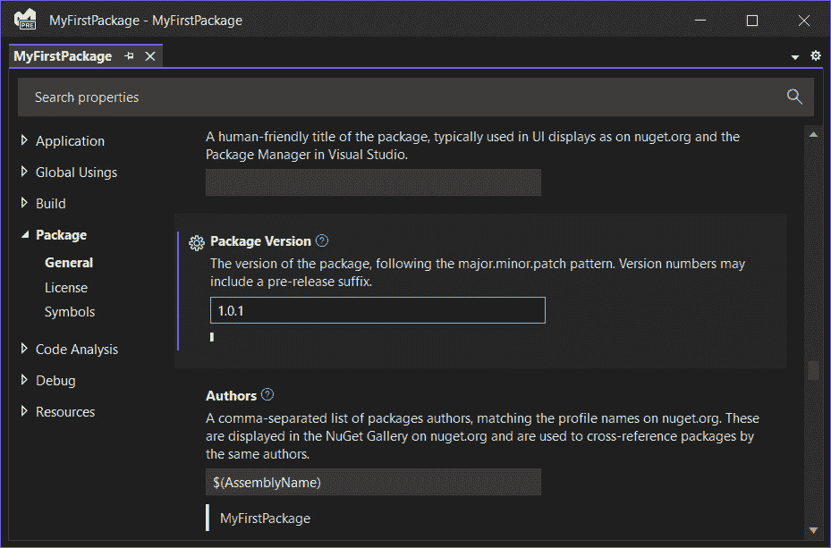

# 为社区创建和发布强大的 NuGet 包

在本章中，我们将开始一段全面探索 NuGet 和包管理的旅程，这是现代 .NET 开发的一个基本方面。无论你是经验丰富的开发者还是新手，理解 NuGet 都能提升你管理依赖项和简化工作流程的能力。

我们将从介绍 NuGet 的基础知识开始，涵盖它是什么以及为什么它是 .NET 生态系统中的基石。你将获得创建第一个 NuGet 包的实用见解，包括设置项目、打包你的代码和生成 **.nupkg** 文件的动手经验。随着我们的进展，我们将掌握版本管理和依赖项管理，这些是确保你的包兼容和更新的关键技能。然后，我们将探讨发布和分发你的包的过程，确保我们的工作能够触及正确的受众。最后，我们将深入研究高级功能和最佳实践，从针对特定平台到包含预发布版本。

在本章中，我们将涵盖以下主要主题：

+   介绍 NuGet 和包管理

+   创建你的第一个 NuGet 包

+   版本管理和依赖项管理

+   发布和分发

+   高级 NuGet 功能

到本章结束时，你将具备创建、管理和分发 NuGet 包的有效知识和技术，这将使你能够自信地贡献更广泛的 .NET 社区。

# 技术要求

在编写本章时，我使用了以下版本的 Visual Studio：

+   Visual Studio Enterprise 2022 版本 17.12.0

+   预览 1.0

本章的代码文件可以在 [`github.com/PacktPublishing/Mastering-Visual-Studio-2022/tree/main/ch15`](https://github.com/PacktPublishing/Mastering-Visual-Studio-2022/tree/main/ch15) 找到。

# NuGet 和包管理简介

在本节开头，我们将为后续内容打下基础。我们将探讨 NuGet 是什么，它在 .NET 生态系统中的重要性，以及它如何改变开发者共享和重用代码的方式。

NuGet 是一个免费且开源的包管理器，专为 Microsoft 开发平台设计，包括 .NET。在其核心，NuGet 作为一种共享代码和加速开发过程的机制。它允许开发者创建封装功能、库或框架的包，并通过 NuGet 仓库进行分发。

NuGet 的重要性在于其简化将第三方库纳入项目、管理依赖项并保持其更新的能力。这种方法显著降低了与手动依赖项管理相关的复杂性，这在 .NET 开发中曾经是一个常见的挑战。

NuGet 生态系统庞大且动态。其核心是官方的 NuGet 仓库（[nuget.org](https://nuget.org)），它托管了由社区贡献的数千个包。然而，NuGet 不仅限于公共仓库；它还支持私有源，允许组织控制对内部包的访问。

NuGet 最显著的优点之一是它简化了依赖关系管理。使用 NuGet，开发者不再需要手动下载和安装库。相反，他们只需在项目中添加对所需包的引用，NuGet 就会负责下载和安装正确的版本。

为了有效地创建和消费包，正确设置开发环境至关重要。我们可以通过顶级工具栏访问包管理器的一般配置 – **工具** | **NuGet 包管理器** | **包** **管理器设置** 。


图 15.1 – NuGet 包管理器选项

这里有一些关于可用选项的详细信息：

+   **包还原**：在此处勾选两个复选框可以确保在构建解决方案时自动还原 NuGet 包。这很重要，因为它保证了所有必要的包都可用，即使它们没有被包含在源控制中，从而避免了构建过程中的包缺失问题。

+   **绑定重定向**：这是一个用于解决程序集之间版本冲突的机制。当你在引用多个库的 .NET 项目上工作时，经常会遇到不同库依赖于同一程序集的不同版本的情况。这可能导致由于版本冲突而导致的运行时错误。你可以选择跳过那些库，但在你无法控制第三方库的版本依赖但需要确保应用程序兼容性的场景中，这尤其有用。

+   **包管理**：在这里，我们可以选择包管理文件的默认格式。我们还可以选择在安装第一个包时选择格式。

+   **清除所有 NuGet 存储**：全局 NuGet 缓存存储了我们下载或安装的包的副本。清除此缓存确保我们的开发环境从头开始，没有任何可能损坏或过时的包。这有助于解决与包相关的问题，并确保我们使用的是干净、最新的包。另一种实现此目的的方法是以管理员身份打开命令提示符并运行 **nuget locals all -** **clear** 命令。

既然我们已经了解了 NuGet 的基本知识和其重要性，让我们继续探讨实际操作方面。现在是时候卷起袖子，开始创建我们自己的 NuGet 包了。

# 创建您的第一个 NuGet 包

在这里，我们将直接进入行动。我们将逐步介绍从头创建简单 NuGet 包的过程，涵盖从初始设置到发布的每个步骤。这种动手经验将帮助巩固上一节中介绍的概念，并为您准备更高级的包创建。

让我们进一步分解这个过程。首先，我们将在 Visual Studio 中创建一个新的 .NET Standard 库项目。这种类型的项目非常适合创建 NuGet 包，因为它与多个 .NET 框架兼容。让我们开始以下步骤：

1.  打开 Visual Studio 并选择 **新建项目**。

1.  对于此示例，在 **C#** 部分下选择 **.NET Standard**。

1.  命名项目（例如，**MyFirstPackage**）并点击 **确定**。

接下来，我们将通过向项目中添加一些示例代码来编写包内容。为此示例，让我们创建一个简单的实用类，用于在摄氏度和华氏度之间转换温度：

```cs
using System;
namespace MyFirstPackage
{
    public static class TemperatureConverter
    {
        public static double ConvertCelsiusToFahrenheit(
            double celsius)
        {
            return (celsius * 9 / 5) + 32;
        }
        public static double ConvertFahrenheitToCelsius(
            double fahrenheit)
        {
            return (fahrenheit - 32) * 5 / 9;
        }
    }
}
```

现在我们有了代码，我们需要为打包做准备：

1.  在 **解决方案资源管理器** 窗口中右键单击项目。

1.  选择 **添加** | **新建文件夹**。

1.  将文件夹命名为 **lib**。

1.  将 **TemperatureConverter.cs** 文件移动到这个文件夹中。

在我们的项目准备就绪后，我们现在可以创建 NuGet 包：

1.  在 **解决方案资源管理器** 窗口中右键单击项目。

1.  从上下文菜单中选择 **打包**。

这将在 **bin/Debug** 文件夹中生成一个 **.nupkg** 文件。

让我们验证我们的包是否已成功创建：

1.  在 **bin/Debug** 文件夹中定位 **.nupkg** 文件。

1.  双击文件以查看其内容。

1.  检查包是否包含包含我们的 **TemperatureConverter.cs** 文件的 **lib** 文件夹。

现在我们已经创建了我们第一个 NuGet 包，让我们花点时间反思我们所取得的成就。我们从没有任何包变成了一个功能齐全的包，我们可能与他人分享。现在我们已经做到了这一点，有一个重要的方面我们需要解决——我们如何确保我们的包保持稳定，不会在其他人的项目中引起问题？

# 版本控制和依赖关系管理

版本控制对于保持兼容性和负责任地管理更新至关重要。正确处理包之间的依赖关系同样重要，因为它确保您的包能够与其他项目中的包无缝工作。

版本控制是将唯一标识符分配给我们的包的不同版本的过程。这是向用户传达自上次发布以来您的包发生了多少变化的一种方式。版本控制有两种主要方法：

+   **语义版本控制**：

    +   **主版本**：破坏性更改

    +   **次要版本**：新增功能

    +   **补丁版本**：错误修复

    例如 1.0.0, 1.1.0, 1.2.0 等等

+   **基于日期的版本控制**：

    +   使用日期来表示包发布的时间

    例如 2023.01.01.0

虽然基于日期的版本更简单，但语义版本通常更受欢迎，因为它提供了关于包历史的更多有意义信息。

我们可以通过导航到我们的项目的属性来轻松定义我们的包版本：

1.  在**解决方案资源管理器**窗口中，右键单击项目，

1.  选择**属性**。

1.  前往**包**选项卡。



图 15.2 – 包属性

在这里，我们定义了我们的包的 1.0.1 版本；如果我们再次打包项目，它将生成一个带有新定义版本的新**.nupkg**文件。

依赖管理涉及指定您的包依赖于哪些其他包。这对于确保我们的包在各种环境中正确运行至关重要。

在 NuGet 包中声明依赖有两种方式：

+   **直接依赖** :

    +   指定您依赖的包的确切版本。以下是一个示例：

        ```cs
        <dependencies>
          <group targetFramework="netstandard2.0">
            <dependency
              id="System.Collections"
              version="4.3.0"
            />
          </group>
        </dependencies>
        ```

+   **范围依赖** :

    +   指定可接受版本的范围。以下是一个示例：

        ```cs
        <dependencies>
          <group targetFramework="netstandard2.0">
            <dependency
              id="Newtonsoft.Json"
              version="[12.0,13.0)"
            />
          </group>
        </dependencies>
        ```

范围依赖允许灵活性，同时仍然保持对使用版本的一定控制。

有效的版本管理和依赖管理是软件开发中的基本实践。在整个包的生命周期中坚持选择版本策略对于保持一致性至关重要。

明确传达这种策略，特别是通过如**README.md**文件这样的文档，有助于确保所有利益相关者都理解这种方法。保持依赖项更新同样重要，因为对您依赖的包的定期更新可以防止兼容性问题并增强安全性。

对不同版本的依赖进行彻底测试是必要的，以尽早识别潜在冲突。此外，考虑传递依赖也很重要——这些间接依赖可能会影响您的包的行为，以保持整体稳定性和可靠性。

现在我们已经涵盖了版本管理和依赖管理的要点，让我们将注意力转向将我们的包推向世界的下一个关键步骤——发布和分发。这是我们将我们的辛勤工作提供给他人并可能成为.NET 包丰富生态系统一部分的地方。

# 发布和分发

发布您的 NuGet 包可以让整个.NET 社区或您整个组织访问它。本节将指导您将包发布到官方 NuGet 库，以及替代分发方法。

让我们详细探讨如何发布到官方 NuGet 库：

1.  在[`www.nuget.org/`](https://www.nuget.org/)上登录您的账户。

1.  点击**创建新包**并填写所需详细信息。

1.  上传**.** **nupkg**文件。

1.  填写包元数据（描述、标签等）。

1.  审查并提交包。

虽然官方图库是分发包最广泛认可的方法，但在某些情况下，其他分发方法可能更合适。例如，私有资源库对于公司内部或团队特定的包特别有用。这些资源库可以托管在 Azure DevOps、GitHub 或甚至自托管服务器上，为组织内部的包分发提供了一个安全和受控的环境。本地资源库是另一个选项，非常适合测试和开发环境。这些可以直接在您的本地机器上设置，或集成到 CI/CD 管道中，在开发过程中提供方便的包管理方式。对于那些需要更多控制的人来说，自定义服务器允许对包分发进行细粒度管理，尽管这也带来了托管基础设施和持续维护的额外责任。

私有资源库为组织内部或特定开发人员群体内部使用的 NuGet 包提供了一个安全和受控的环境。与任何人都可以访问的公共资源库（如 [nuget.org](http://nuget.org)）不同，私有资源库仅限制授权用户访问。这对于专有软件组件、测试版本或需要遵守特定安全策略的情况尤其有用。

**JFrog Artifactory** 是管理二进制存储库中最受欢迎的工具之一，包括 NuGet 包。它支持公共和私有 NuGet 资源库，使其成为组织建立自己的 NuGet 存储库基础设施的绝佳选择。

下面是如何在 Artifactory 中设置私有 NuGet 资源库的详细信息：

1.  **安装 Artifactory**：首先，您需要在您的服务器或云环境中安装 JFrog Artifactory。遵循 JFrog 提供的官方安装指南。

1.  **创建新的存储库**：一旦 Artifactory 启动并运行，登录到管理控制台。导航到 **存储库** 部分，并选择创建新的存储库。选择 **NuGet** 作为包类型。

1.  **配置存储库设置**：根据您的需求指定存储库密钥、布局和其他设置。对于私有资源库，请确保存储库不可公开访问。

1.  **设置访问控制**：定义谁可以访问您的新 NuGet 资源库。您可以创建不同团队或项目的组，并分配适当的权限。

1.  **发布包**：设置好存储库后，您现在可以将其发布到其中。使用 **nuget push** 命令或将其集成到您的 CI/CD 管道中以自动化此过程。

当与 Artifactory 和其他私有 NuGet 资源库一起工作时，我们必须在 Visual Studio 中设置一个 NuGet 源，以便在包还原过程或向项目中添加新包时指定 NuGet 包的检索位置。

这是我们在 Visual Studio 中设置 NuGet 源的方法：

1.  转到**工具** | **NuGet 包管理器** | **包管理器设置**。

1.  从左侧导航菜单中选择**包源**。

    要添加新的包源，请点击**包源**窗口右上角的绿色加号（**+**）按钮。


图 15.3 – 添加新的包源

1.  在**名称**和**源**文本框中填写以适应要添加的期望的 NuGet 源。


图 15.4 – 配置新的包源

1.  然后，通过点击**更新**按钮验证源。

添加并配置您的包源后，您可以通过尝试还原包或搜索 Visual Studio 中的包来验证它是否正常工作。转到**工具** | **NuGet 包管理器** | **管理解决方案的 NuGet 包…**，然后您可以使用右上角的选择框选择您想要使用的包源。


图 15.5 – 选择包源

在我们结束创建和发布 NuGet 包的过程时，值得花点时间来欣赏 NuGet 的强大和灵活性。从它作为简单的包管理器的朴素起源到目前作为.NET 开发基石的地位，NuGet 一直在发展和改进。

# 高级 NuGet 功能

在本节的最后，我们将探讨 NuGet 的一些更高级功能，例如目标框架、预发布版本和自定义脚本，并讨论包开发的最佳实践。这些知识将帮助您创建更健壮、灵活和可维护的包。

## 目标框架

目标框架允许我们指定您的包支持哪些.NET 平台，确保在各种环境中保持兼容性。此功能通过仅允许在针对支持框架的项目中安装您的包来帮助防止兼容性问题。

在创建 NuGet 包时，您可以在**.csproj**或**.nuspec**文件中定义多个目标框架。这种设置使 NuGet 可以为每个框架打包单独的二进制文件，确保当可用时，您的包利用平台特定的功能。

这里有一个配置示例：

```cs
<PropertyGroup>
  <TargetFrameworks>net46;netstandard2.0</TargetFrameworks>
</PropertyGroup>
```

此配置表示项目针对.NET Framework 4.6 和.NET Standard 2.0，允许在不同环境中实现最佳兼容性和功能。

## 预发布版本

预发布版本是分发尚未准备好用于生产使用的包的一种方式。这些版本通常用于 beta 测试、发布候选或夜间构建。

为了允许软件包作者分发他们认为不稳定或最终的软件包版本，消费者可以选择安装这些预发布版本以提前测试新功能或错误修复。

预发布版本通过在版本号后附加一个后缀来表示，后跟一个连字符。常见的后缀包括**-alpha**、**-beta**、**-rc**（**发布候选**）和**-preview**。消费者需要明确选择才能接收预发布软件包，通常通过他们的软件包管理器客户端中的设置来完成。

这里是一个配置**-** **beta** 版本的示例：

```cs
<Version>1.0.0-beta1</Version>
```

这表明该软件包是 1.0.0 的 beta 版本，适合测试但不推荐用于生产使用。

## 定制脚本

NuGet 支持在安装或卸载软件包时执行 PowerShell 脚本。此功能可用于各种目的，例如修改项目文件、注册**组件对象模型（COM）**组件或执行其他设置任务。

定制脚本自动化了在安装或卸载软件包时需要执行的任务，减少了消费者的手动步骤并确保了一致性。

作为软件包作者，我们可以在我们的软件包中包含 PowerShell 脚本，NuGet 将在适当的时候执行这些脚本。有几种类型的脚本，包括**init.ps1**（每次解决方案运行一次）、**install.ps1**（每次安装软件包时运行）和**uninstall.ps1**（在卸载软件包时运行）：

```cs
<packageTargetFallback
  Condition="'$(OS)' == 'Windows_NT'">
  win7-x64-msvc2015
</packageTargetFallback>
<script
  src="img/precompile.js"
  condition="$([MSBuild]::GetTargetPath(
    '$(ProjectDir)tools\precompile.js')) != ''"
/>
```

此配置指定了一个后备目标框架，并包含一个将在特定条件下执行的定制脚本（**precompile.js**）。请注意，定制脚本现在使用较少，尤其是在.NET Core 和.NET Standard 的发展过程中，但为了向后兼容，它们仍然得到支持。

通过利用 NuGet 的这些高级功能，我们可以创建更复杂和灵活的软件包，更好地满足不同环境和开发阶段用户的需求。

# 摘要

在本章中，我们探讨了.NET 生态系统内 NuGet 和软件包管理的关键方面。我们首先了解了什么是 NuGet 以及为什么它是现代开发中管理依赖关系的关键工具。我们学习了如何创建我们的第一个 NuGet 软件包，包括设置项目、编写必要的代码并将其打包成**.** **nupkg**文件。

我们随后深入探讨了版本控制和依赖关系管理，强调了语义版本控制的重要性以及在不同版本之间保持兼容性的策略。本章还涵盖了发布和分发 NuGet 软件包的步骤，无论是官方 NuGet 库还是通过其他方法，确保您的软件包对他人可访问。

最后，我们探讨了高级功能和最佳实践，例如针对特定平台，使用预发布版本，以及集成自定义脚本。现在，你已经全面了解了如何创建、管理和分发 NuGet 包，并为你提供了增强 .NET 开发实践的工具。

随着《精通 Visual Studio》的结束，我们经历了一系列对任何在 .NET 和 Visual Studio 生态系统内工作的严肃开发者至关重要的高级技术、工具和最佳实践。这本书为你提供了强大的技能和知识，使你成为一个更高效、多才多艺和创新的开发者。无论你是在构建智能应用、优化性能，还是为开发者社区做出贡献，你所获得的技能将继续推动你在软件开发世界中的成功。
