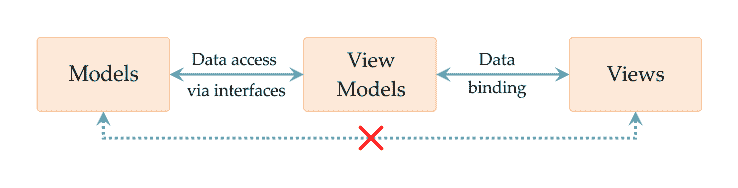
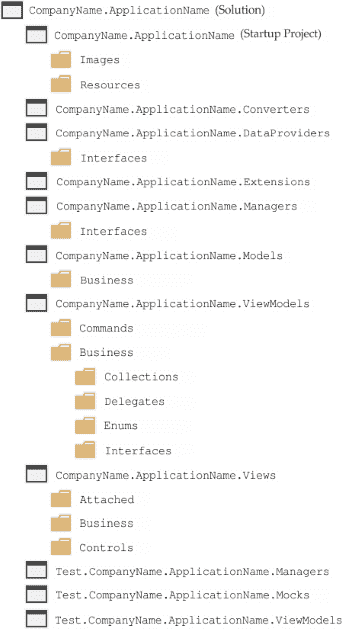
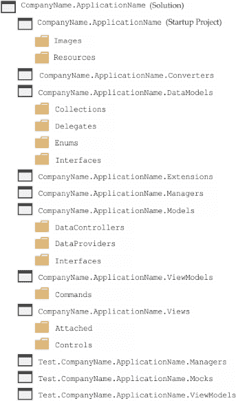

# 智能化使用 WPF 的方法

当**Windows Presentation Foundation**（**WPF**）在 2006 年作为.NET Framework 3.0 的一部分首次发布时，它被誉为桌面应用程序**图形用户界面**（**GUI**）语言的未来，支持者声称它将结束之前的 GUI 技术，即 Windows Forms。然而，随着时间的推移，它远远没有达到这一预期。

WPF 没有像预期的那样广泛流行，主要原因有三个。第一个原因与 WPF 无关，源于最近将一切托管在云中，并使用 Web 界面而不是桌面应用程序的趋势。第二个原因是 WPF 的学习曲线非常陡峭，需要一种非常不同的工作方式才能掌握。

最后一个原因是它不是一个非常高效的编程语言，如果一个 WPF 应用程序有很多“花哨的功能”，那么客户端计算机可能需要安装额外的 RAM 和/或显卡，或者它们可能会面临缓慢和卡顿的用户体验。

这解释了为什么许多今天使用 WPF 的公司都在金融行业，在那里他们可以承担起升级所有用户的计算机以优化运行其应用程序的费用。本书的目标是通过提供实用的技巧和窍门，使 WPF 对我们其他人来说更容易接近，帮助我们更容易、更高效地构建现实世界的应用程序。

我们可以做出的最简单且对工作流程改进最大的改变之一，就是遵循 MVVM 软件架构模式来改进我们使用 WPF 的方式。它描述了如何组织我们的类，使我们的应用程序更易于维护、测试，并且通常更容易理解。在本章中，我们将更深入地研究这个模式，并了解它如何帮助我们改进我们的应用程序。

在发现 MVVM 是什么以及它的好处之后，我们将学习几种在新的环境中在各个组件之间进行通信的新方法。然后，我们将专注于典型 MVVM 应用程序的代码库的物理结构，并调查各种替代安排。

# 什么是 MVVM 以及它如何帮助？

**模型-视图-视图模型**（**MVVM**）是一种软件架构模式，它由 John Gossman 在 2005 年在其博客上著名地引入，现在在开发 WPF 应用程序时被广泛使用。它的主要目的是在业务模型、**用户界面**（**UI**）和业务逻辑之间提供**关注点分离**。它是通过将它们分为三种不同的核心组件：模型、视图和视图模型来实现的。让我们看看它们的排列方式以及每个组件代表什么：



如我们所见，**视图模型**组件位于**模型**和**视图**之间，并为它们各自提供双向访问。此时应注意的是，**视图**和**模型**组件之间不应存在直接关系，而其他组件之间只有松散的联系。现在让我们更详细地看看每个组件代表什么。

# 模型

与其他 MVVM 组件不同，模型组成部分包括多个元素。它包括业务数据模型及其相关的验证逻辑，以及提供应用程序数据访问和持久性的**数据访问层**（**DAL**）或数据存储库。

数据模型表示在应用程序中持有数据的类。它们通常在某种程度上反映了数据库中的列，尽管它们通常是层次结构的，因此可能需要在数据源中执行连接操作以完全填充它们。

一种替代方案是设计数据模型类以适应 UI 的要求，但无论哪种方式，业务逻辑或验证规则通常都会驻留在与数据模型相同的项目中。

用于与我们在应用程序中使用的任何数据持久化技术接口的代码也包含在模式的模型组件中。在代码库中组织此组件时，应谨慎行事，因为有许多问题需要考虑。我们稍后再进一步探讨这个问题，但现在，让我们继续了解这个模式中的组件。

# 视图模型

视图模型可以很容易地解释；每个视图模型都为其关联的视图提供所需的所有数据和功能。在某种程度上，它们可以被认为是类似于旧 Windows Forms 代码背后的文件，除了它们与它们所服务的视图没有直接关系。如果你熟悉 MVC，一个更好的类比是，它们类似于**模型-视图-控制器**（**MVC**）软件架构模式中的控制器。实际上，在 John 的博客中，他将 MVVM 模式描述为 MVC 模式的变体。

他们与模型组件有双向连接，以便访问和更新视图所需的数据，并且通常以某种方式转换这些数据，使其更容易在用户界面中显示和交互。他们还通过数据绑定和属性更改通知与视图进行双向连接。简而言之，视图模型构成了模型和视图之间的桥梁，否则它们之间没有直接的联系。

然而，应注意的是，视图模型仅通过其数据绑定和接口与视图和模型组件松散连接。这种模式的美丽之处在于，它使每个元素能够独立于彼此运行。

为了保持视图模型和视图之间的分离，我们避免在视图模型中声明任何与 UI 相关类型的属性。我们不希望在视图模型项目中包含任何与 UI 相关的 DLL 引用，因此我们使用自定义的 `IValueConverter` 实现来将它们转换为原始类型。例如，我们可能将 UI 中的 `Visibility` 对象转换为普通的 `bool` 值，或将某些彩色 `Brush` 对象的选择转换为在视图模型中安全使用的 `Enum` 实例。我们将在本书中看到几个转换器的示例，但现在让我们继续。

# 视图

视图定义了 UI 的外观和布局。它们通常通过使用它们的 `DataContext` 属性与视图模型连接，并显示它提供的数据。它们通过将视图模型的命令连接到用户与之交互的 UI 控件来公开视图模型提供的功能。

通常，基本规则是每个视图都有一个相关的视图模型。这并不意味着视图不能绑定到多个数据源，或者我们不能重用视图模型。这仅仅意味着，一般来说，如果我们有一个名为 `SecurityView` 的类，那么我们很可能也会有一个名为 `SecurityViewModel` 的类的实例，该实例将被设置为该视图的 `DataContext` 属性的值。

# 数据绑定

MVVM 模式经常被忽视的一个方面是其对数据绑定的要求。没有它，我们就无法实现完整的 **关注点分离**，因为没有简单的方法在视图和视图模型之间进行通信。XAML 标记、数据绑定类以及 `ICommand` 和 `INotifyPropertyChanged` 接口是 WPF 中提供此功能的主要工具。

`ICommand` 接口是 .NET Framework 中命令实现的方式。它提供了实现并甚至扩展了始终有用的命令模式的行为，在该模式中，一个对象封装了执行动作所需的所有内容。WPF 中的大多数 UI 控件都有 `Command` 属性，我们可以使用这些属性将它们连接到命令提供的功能。

`INotifyPropertyChanged` 接口用于通知绑定客户端属性值已更改。例如，如果我们有一个 `User` 对象，并且它有一个 `Name` 属性，那么我们的 `User` 类将负责触发 `INotifyPropertyChanged` 接口的 `PropertyChanged` 事件，每次其值更改时指定属性名称。我们将在稍后更深入地探讨所有这些内容，但现在让我们看看这些组件的排列如何帮助我们。

# 那么 MVVM 如何帮助呢？

采用 MVVM 的一大好处是它为业务模型、UI 和业务逻辑之间提供了至关重要的关注点分离。这使我们能够做几件事情。它使视图模型从模型中解放出来，无论是业务模型还是数据持久化技术。

这反过来又使我们能够在其他应用程序中重用业务模型，并替换掉数据访问层（DAL），用模拟数据层（mock data layer）来替换它，这样我们就可以在不需要任何真实数据连接的情况下，有效地测试我们的视图模型中的功能。

它还切断了视图与它们所需的视图逻辑之间的联系，因为这是由视图模型提供的。这使得我们可以独立运行每个组件，这有一个优点，即允许一个团队设计视图，而另一个团队则专注于视图模型。并行工作流使得公司能够从大幅缩短的生产时间中受益。

此外，这种分离还使得我们能够在不修改模型代码的情况下，轻松地用不同的技术替换视图。我们可能需要更改视图模型的一些方面，例如，用于视图的新技术可能不支持 `ICommand` 接口，但原则上，我们需要更改的代码量将是相当小的。

MVVM 模式的简单性也使得 WPF 更易于理解。知道每个视图（View）都有一个视图模型（View Model）为其提供所有所需的数据和功能，这意味着当我们想要找到数据绑定属性在哪里声明时，我们总是知道该往哪里看。

# 那么有缺点吗？

然而，使用 MVVM 也有一些缺点，并且它并不适用于所有情况。实现 MVVM 的主要缺点是它给我们的应用程序增加了一定的复杂性。首先，有数据绑定，这可能需要一些时间来掌握。此外，根据您的 Visual Studio 版本，数据绑定错误可能仅在运行时出现，并且可能非常难以追踪。然而，我们将在下一章中探讨解决这个问题的方法。

然后，我们需要了解视图和视图模型之间通信的不同方式。以不寻常的方式执行命令和处理事件需要一段时间来适应。在代码库中找到所有所需组件的最佳排列也需要时间。因此，在确保能够熟练实现 MVVM 之前，我们需要攀登一个陡峭的学习曲线。本书将详细涵盖所有这些领域，并尝试减少学习曲线的梯度。

然而，即使我们对这种模式非常熟练，仍然有偶尔的情况，在这种情况下实现 MVVM 并没有意义。一个例子是，如果我们的应用程序非常小，我们不太可能想要为其编写单元测试或替换其任何组件。因此，当它提供的关注点分离（Separation of Concerns）的好处并不需要时，通过增加模式的复杂性来实现它是不切实际的。

# 消除关于代码后置的神话

关于 MVVM 的一个重大误解是，我们应该避免将任何代码放入视图的代码后文件中。虽然这一点有一定的真实性，但并不是在所有情况下都适用。如果我们稍微逻辑思考一下，我们已经知道使用 MVVM 的主要原因之一是利用其架构提供的关注点分离。其中一部分是将视图模型中的业务功能与视图中的用户界面相关代码分离。因此，规则实际上应该是*我们应该避免将任何业务逻辑放入视图的代码后文件中*。

考虑到这一点，让我们看看我们可能想要放入视图代码后文件的代码。最有可能的嫌疑人是一些与 UI 相关的代码，可能是处理某个特定事件，或者启动某种类型的子窗口。在这些情况下，使用代码后文件是完全可行的。这里没有与业务相关的代码，所以我们没有理由将其与其他 UI 相关代码分离。

另一方面，如果我们已经在视图的代码后文件中编写了一些与业务相关的代码，那么我们该如何测试它呢？在这种情况下，我们将无法将这部分代码与视图分离，不再有我们的关注点分离（Separation of Concerns），因此也就破坏了我们对 MVVM 的实现。所以在这种情况下，这个神话不再是神话...它是一条好的建议。

然而，即使在像这种情况一样，我们想要从视图调用一些与业务相关的代码时，也是有可能在不违反任何规则的情况下实现的。只要我们的业务代码位于视图模型中，它就可以通过该视图模型进行测试，因此在运行时它被调用的位置并不那么重要。理解了我们可以始终访问绑定到视图的`DataContext`属性的视图模型，让我们来看一个简单的例子：

```cs
private void Button_Click(object sender, RoutedEventArgs e) 
{ 
  UserViewModel viewModel = (UserViewModel)DataContext; 
  viewModel.PerformSomeAction(); 
} 
```

现在，有些人可能会对这个代码示例感到犹豫，因为他们正确地认为视图（Views）不应该了解任何关于它们相关的视图模型（View Models）的信息。这段代码实际上将这个视图模型与这个视图绑定在一起。如果我们想在某个时候更改应用程序的 UI 层或者让设计师处理视图，那么这段代码就会给我们带来问题。然而，我们需要保持现实...我们真正需要这样做的机会有多大？

如果这种情况很可能会发生，那么我们真的不应该将这段代码放入代码后文件中，而是通过将其包装在一个附加属性（Attached Property）中处理事件，我们将在下一节中看到这个例子。然而，如果这种情况根本不可能发生，那么将其放在那里实际上并没有问题。

例如，如果我们有一个`UserView`，它有一个相应的`UserViewModel`类，并且我们确信我们不需要更改它，那么在这种情况下，我们可以安全地使用上述代码，无需担心直接转换会导致异常抛出。让我们在它们对我们有意义时遵循规则，而不是盲目地坚持它们，因为某人在不同场景中说它们是个好主意。

另一种情况下，我们可以忽略“无代码后端”规则，那就是在基于`UserControl`类编写自包含控件时。在这些情况下，后端代码文件通常用于定义依赖属性和/或处理 UI 事件，以及实现通用 UI 功能。但请记住，如果这些控件实现了某些与业务相关的功能，我们应该将其写入视图模型，并在控件中调用它，以便仍然可以进行测试。

避免在视图的后端文件中编写与业务相关的代码的一般想法确实很有意义，我们应该始终尝试这样做。然而，我们现在可能已经理解了这个想法背后的原因，并可以使用我们的逻辑来确定在每个可能出现的特定情况下是否可以这样做。

# 学习如何再次进行沟通

由于我们倾向于不直接处理 UI 事件，当使用 MVVM 时，我们需要实现它们提供相同功能的替代方法。需要不同的方法来重现不同事件的功能。例如，集合控件`SelectionChanged`事件的功能通常通过将视图模型属性数据绑定到集合控件的`SelectedItem`属性来重现：

```cs
<ListBox ItemsSource="{Binding Items}" 
  SelectedItem="{Binding CurrentItem}" /> 
```

在这个例子中，`CurrentItem`属性的设置器将在每次从`ListBox`中选择新项目时由 WPF 框架调用。因此，我们可以在视图模型的属性设置器中直接调用任何方法，而不是在代码后端处理`SelectionChanged`事件：

```cs
public TypeOfObject CurrentItem 
{ 
  get { return currentItem; } 
  set 
  { 
    currentItem = value; 
    DoSomethingWithTheNewlySelectedItem(currentItem); 
  } 
} 
```

注意，我们需要确保从数据绑定属性设置器调用的任何方法不要做得太多，因为执行它们所需的时间可能会在输入数据时对性能产生负面影响。然而，在这个例子中，我们通常会使用这个方法来启动一个异步数据访问函数，使用当前项的值或更改视图模型中另一个属性的值。

许多其他 UI 事件可以直接在 XAML 标记中使用某种形式的`Trigger`来替换。例如，假设我们有一个`Image`元素，它被设置为`Button`控件的`Content`属性值，并且我们希望当`Button`被禁用时，`Image`元素是半透明的。我们可以在后端文件中处理`UIElement.IsEnabledChanged`事件，而不是在`Style`中编写一个`DataTrigger`，并将其应用于`Image`元素：

```cs
<Style x:Key="ImageInButtonStyle" TargetType="{x:Type Image}"> 
  <Setter Property="Opacity" Value="1.0" /> 
  <Style.Triggers> 
    <DataTrigger Binding="{Binding IsEnabled,       
      RelativeSource={RelativeSource FindAncestor, 
      AncestorType={x:Type Button}}, FallbackValue=False}" 
      Value="False"> 
      <Setter Property="Opacity" Value="0.5" /> 
    </DataTrigger> 
  </Style.Triggers> 
</Style> 
```

绑定语法将在第四章“精通数据绑定”中详细介绍，但简而言之，这个 `DataTrigger` 中的绑定指定了目标为具有 `Button` 类型的 `Image` 元素的祖先（或父）的 `IsEnabled` 属性。当这个绑定目标值为 `False` 时，`Image` 的 `Opacity` 属性将被设置为 `0.5`，并在目标属性值变为 `True` 时恢复到原始值。因此，当按钮被禁用时，我们的 `Button` 中的 `Image` 元素将变为半透明。

# 介绍 ICommand 接口

当涉及到 WPF 和 MVVM 中的按钮点击时，我们通常使用实现 `ICommand` 接口的一些形式的命令来处理众所周知的 `Click` 事件。让我们看看一个基本标准命令的例子：

```cs
using System; 
using System.Windows.Forms; 
using System.Windows.Input; 

public class TestCommand : ICommand 
{ 
  public event EventHandler CanExecuteChanged; 

  public void Execute(object parameter) 
  { 
    MessageBox.Show("You executed a command"); 
  } 

  public bool CanExecute(object parameter) 
  { 
    return true; 
  } 
}
```

请注意，在这本书中，我们将使用两个空格的缩进来显示代码，而不是更常用的四个空格缩进，以便使每个代码片段的更多字符能够适应每一行。

我们可以看到它有一个 `Execute` 方法，其中执行了命令提供的功能。`CanExecute` 方法在 `CommandManager` 认为输出值可能发生变化的各种时间点被调用。我们将在稍后更详细地介绍这一点，但基本上，引发 `CanExecuteChanged` 事件是触发 `CommandManager` 执行此操作的一种方式。`CanExecute` 方法的输出指定了是否可以调用 `Execute` 方法。

你可以想象，如果我们需要为每个需要实现的操作创建这样一个类，那将会多么繁琐。此外，除了单个命令参数之外，没有上下文可以说明命令是从哪里被调用的。这意味着，如果我们想让命令向一个集合中添加一个项目，我们就必须将集合和要添加的项目都放入另一个对象中，这样它们才能通过单个输入参数传递。

当使用 MVVM 时，我们倾向于使用一个单一、可重用的实现来处理命令，这允许我们在 View Model 中直接使用标准方法来处理操作。这使得我们无需为每个命令创建一个单独的类。这个命令有许多变体，但它的最简单形式如下所示：

```cs
using System; 
using System.Windows.Input; 

public class ActionCommand : ICommand 
{ 
  private readonly Action<object> action; 
  private readonly Predicate<object> canExecute; 

  public ActionCommand(Action<object> action) : this(action, null) { } 

  public ActionCommand(Action<object> action, 
    Predicate<object> canExecute) 
  { 
    this.action = action; 
    this.canExecute = canExecute; 
  } 

  public event EventHandler CanExecuteChanged 
  { 
    add { CommandManager.RequerySuggested += value; } 
    remove { CommandManager.RequerySuggested -= value; } 
  } 

  public bool CanExecute(object parameter) 
  { 
    return canExecute == null ? true : canExecute(parameter); 
  } 

  public void Execute(object parameter) 
  { 
    action(parameter); 
  } 
} 
```

类型为 `Action<object>` 的 `action` 参数将持有在执行命令时将被调用的方法的引用，而 `object` 泛型参数与可选使用的命令参数相关。类型为 `Predicate<object>` 的 `canExecute` 参数将持有在验证命令是否可以执行时将被调用的方法的引用，其 `object` 泛型参数再次与可选使用的命令参数相关。

当`canExecute`参数值发生变化时，应该触发`CanExecuteChanged`事件。通常，这个事件由命令源，例如`Button`控件，来适当地设置它们的`IsEnabled`属性值来处理。当一个命令源收到这个事件已被触发的通知时，它将调用`ICommand.CanExecute`方法来检查新的值。因此，当一个命令可以执行时，其数据绑定控件将被启用，而当它不能执行时，其数据绑定控件将被禁用。

当`CommandManager`检测到 UI 的变化，这可能影响命令是否可以执行时，将触发`CommandManager.RequerySuggested`事件。例如，这可能是由于用户交互，如选择集合中的项目或其他焦点变化。因此，将它们连接起来似乎是合乎逻辑的事情。实际上，这种做法的例子可以在.NET `RoutedCommand`类的源代码中找到。

这个命令类通常用于视图模型类中，如下面的示例所示，其中命令功能来自`Save`方法，而`CanSave`方法的`bool`返回值决定了命令是否可以执行：

```cs
public ICommand SaveCommand 
{ 
  get { return new ActionCommand(action => Save(), 
    canExecute => CanSave()); } 
} 
```

当`CanExecute`条件不满足时，确保命令不会被代码调用的一种更安全的方法是进行这种修改；然而，请注意，`CommandManager`类在调用任何命令之前总是会执行这个检查：

```cs
public void Execute(object parameter) 
{ 
  if (CanExecute(parameter)) action(parameter); 
} 
```

对于这个自定义命令，全部的功劳应该归功于 Josh Smith，因为他的`RelayCommand`类是我遇到的第一种类似实现，尽管网上可以找到几种变体。这种特定实现的美丽之处不应被低估。它不仅简单、优雅，节省了我们编写大量代码，而且还使得测试我们的功能变得更加容易，因为我们的命令代码现在可以直接定义在我们的视图模型中。

我们将在第三章“编写自定义应用程序框架”中再次详细地查看这个`ActionCommand`，但到目前为止，让我们继续到下一个通信方法。

# 在附加属性中处理事件

在 WPF 中，有一种处理事件的方法，无需在视图的代码背后文件中编写代码。使用附加属性，我们可以封装事件的处理，并有效地通过我们可以数据绑定到视图中的属性来公开它们的行为。让我们看看使用`PreviewKeyDown`事件的简单示例：

```cs
public static DependencyProperty OnEnterKeyDownProperty =  
  DependencyProperty.RegisterAttached("OnEnterKeyDown", 
  typeof(ICommand), typeof(TextBoxProperties), 
  new PropertyMetadata(OnOnEnterKeyDownChanged)); 

public static ICommand GetOnEnterKeyDown(DependencyObject dependencyObject) 
{ 
  return (ICommand)dependencyObject.GetValue(OnEnterKeyDownProperty); 
} 

public static void SetOnEnterKeyDown(DependencyObject dependencyObject, 
  ICommand value) 
{ 
  dependencyObject.SetValue(OnEnterKeyDownProperty, value); 
} 

private static void OnOnEnterKeyDownChanged( 
  DependencyObject dependencyObject, 
  DependencyPropertyChangedEventArgs e) 
{ 
  TextBox textBox = (TextBox)dependencyObject; 
  if (e.OldValue == null && e.NewValue != null)  
    textBox.PreviewKeyDown += TextBox_OnEnterKeyDown; 
  else if (e.OldValue != null && e.NewValue == null)  
    textBox.PreviewKeyDown -= TextBox_OnEnterKeyDown; 
} 

private static void TextBox_OnEnterKeyDown(object sender, KeyEventArgs e) 
{ 
  if (e.Key == Key.Enter || e.Key == Key.Return) 
  { 
    TextBox textBox = sender as TextBox; 
    ICommand command = GetOnEnterKeyDown(textBox); 
    if (command != null && command.CanExecute(textBox))  
      command.Execute(textBox); 
  } 
} 
```

如此例所示，事件通过以正常方式附加事件处理程序来处理，但所有相关代码都被封装在声明附加属性的类中。让我们更仔细地看看。首先，我们在名为`TextBoxProperties`的类中声明了一个名为`OnEnterKeyDown`的附加属性，其类型为`ICommand`，并将我们处理方法的引用传递给`PropertyMetadata`构造函数的`PropertyChangedCallback`委托参数。

`GetOnEnterKeyDown`和`SetOnEnterKeyDown`方法代表了获取和设置附加属性值的正常方式。在不幸命名的`OnOnEnterKeyDownChanged`方法中，当属性值改变时将被调用，我们查看`DependencyPropertyChangedEventArgs`输入参数的`NewValue`和`OldValue`值，以决定我们是否需要将事件处理程序附加或从相关`TextBox`的`PreviewKeyDown`事件中分离。

如果`OldValue`值为`null`且`NewValue`值不为`null`，这意味着没有之前的值，因此属性是第一次被设置。在这种情况下，我们想要附加事件处理程序。相反，当`OldValue`值不为`null`且`NewValue`值为`null`时，这意味着之前有一个值，该值已被删除，因此我们应该分离事件处理程序。

最后，`TextBox_OnEnterKeyDown`事件处理方法首先检测是否按下了*Enter*键或*Return*键。如果其中一个被按下，则会检查数据绑定的`ICommand`实例是否为`null`，如果命令可以执行，则执行它。因此，我们有效地将一个`PreviewKeyDown`事件封装在一个附加属性中，现在可以在用户按下键盘上的*Enter*键时执行任何已数据绑定到它的命令。

为了使用这个附加属性，我们必须首先在需要此功能的视图的 XAML 文件中为我们的`Attached`文件夹添加一个 XAML 命名空间前缀。请注意，`TextBoxProperties`类将在视图项目的`Attached`文件夹中声明，因此其命名空间如下：

```cs
xmlns:Attached="clr-namespace:CompanyName.ApplicationName.Views.Attached;  
  assembly=CompanyName.ApplicationName.Views" 
```

微软为这些前缀命名的约定是第一个字符为小写字母，但对我来说，简单地使用声明的命名空间的最后一段，并以大写字母开头，似乎更有意义。一旦你定义了前缀，你就可以使用附加属性，如下面的示例所示：

```cs
<TextBox Attached:TextBoxProperties.OnEnterKeyDown="{Binding Command}" /> 
```

我们可能需要在我们的应用程序中处理的任何 UI 事件都可以以这种方式封装在附加属性中。起初，与在代码背后文件中有一个简单的处理程序相比，这似乎是一种处理事件复杂的方法，但一旦我们声明了这些属性的集合，我们会发现自己需要创建越来越少的新属性。把它们看作是将事件转换为属性的可重用方式。

# 使用委托

委托与事件非常相似，实际上，事件可以被视为一种特定的委托。它们是在程序中将信号或消息从一个地方传递到另一个地方的非常简单的工具。与创建自定义事件不同，我们不必使用特定的输入参数，例如`EventArgs`类的一些形式。在创建自定义委托时，我们完全不受约束，能够定义自己的方法签名，包括输入和输出参数类型。

由于你们大多数人已经熟悉事件和事件处理，你们可能已经无意中知道了如何使用委托。让我们看看一个简单的例子。想象一下，我们有一个父视图模型，它会生成子视图模型，其中之一与一个视图配对，该视图允许管理员用户选择安全权限。现在，让我们想象一下，与父视图模型相关的父视图有一个菜单，需要根据用户在子视图中的选择进行更新。我们如何在选择时通知父视图模型？

这就是代表们拯救世界的地方。为了使这个例子简单起见，我们先假设我们只需要通知父视图模型（ViewModel）已经做出了一些特定的更改，以便它可以从数据库中刷新当前用户的权限。在这种情况下，我们只需要传递一个信号，因此我们可以创建一个没有输入或输出参数的委托。我们可以在将要发送信号的视图模型中声明它，在这种情况下，是子视图模型：

```cs
public delegate void Signal(); 
```

注意，我们定义它的方式与定义抽象方法的方式相同，只是在访问修饰符之后将`abstract`关键字替换为`delegate`关键字。简而言之，委托定义了一个引用具有特定签名的方法的类型。现在我们已经定义了我们的信号委托，我们需要创建一种方式，让视图模型之外的其他元素可以使用它。为此，我们可以在同一个视图模型中简单地创建一个新委托类型的属性：

```cs
public Signal OnSecurityPermissionChanged { get; set; }  
```

由于我们不需要为这个属性提供任何属性更改通知，我们可以节省一些打字时间，并利用.NET 自动实现属性语法。请注意，委托以多播方式工作，就像事件一样，这意味着我们可以为每个委托附加多个处理程序。为了做到这一点，我们需要使用`+=`运算符为委托添加处理程序，在这个例子中，我们希望在子视图实例化时在父视图模型中这样做：

```cs
ChildViewModel viewModel = new ChildViewModel(); 
viewModel.OnSecurityPermissionChanged += RefreshSecurityPermissions; 
```

在这里，我们将父视图模型中的`RefreshSecurityPermissions`方法指定为处理此代理的事件处理程序。请注意，在附加处理程序时，我们省略了括号以及如果有任何输入参数也一并省略。现在，你可能想知道，“*这个处理程序的方法签名是什么样的？*”，但你已经有了答案。如果你记得，我们声明代理时使用了我们想要处理的方法的签名。因此，任何具有相同签名的函数都可以成为此类代理的处理程序：

```cs
private void RefreshSecurityPermissions() 
{ 
  // Refresh user's security permissions when alerted by the signal 
} 
```

请注意，所使用的名称无关紧要，在匹配代理签名时，重要的是输入和输出参数。因此，我们现在已经声明了代理，并将其连接到父视图模型中的处理程序，但它仍然不会做任何事情，因为我们还没有实际调用它。在我们的例子中，是子视图模型将要调用代理，因为这是需要发送信息或信号的物体。

在调用代理时，我们必须始终记得在使用之前检查`null`，因为可能没有附加处理程序。在我们的例子中，我们将在需要从子视图模型发送信号的时刻调用我们的`Signal`代理，比如说，当用户更改自己的安全权限时：

```cs
if (OnSecurityPermissionChanged != null) OnSecurityPermissionChanged(); 
```

或者，我们可以使用 C# 6.0 中更简洁的空条件运算符来完成，如果代理不是`null`，它将调用代理的`Invoke`方法：

```cs
OnSecurityPermissionChanged?.Invoke(); 
```

请注意，即使在第一个例子中调用代理时需要包括括号，即使`OnSecurityPermissionChanged`是一个属性。这是因为属性的代理类型与一个方法相关联，而我们正在调用的是这个方法。请记住，这些方法中的第一个不是线程安全的，所以如果你的应用程序需要线程安全，那么你需要使用后面的方式。

我们现在有了完整的画面，但尽管有一个像这样的信号发送代理很常见，但它并不特别有用，因为它只传递信号而没有其他信息。在许多实际场景中，我们通常会想要有一个某种输入参数，这样我们就可以传递一些信息，而不仅仅是信号。

例如，如果我们想要在用户每次从 UI 中的集合控件中选择不同的项目时收到通知，我们可以在我们的应用程序中的通用`BaseCollection`类中添加一个`CurrentItem`属性，并将其绑定到数据绑定集合控件的`SelectedItem`属性。每次用户进行新的选择时，WPF 框架都会调用这个`CurrentItem`属性，因此我们可以从其属性设置器调用我们新的代理：

```cs
protected T currentItem; 

public virtual CurrentItemChange CurrentItemChanged { get; set; }  

public virtual T CurrentItem 
{ 
  get { return currentItem; } 
  set 
  { 
    T oldCurrentItem = currentItem; 
    currentItem = value; 
    CurrentItemChanged?.Invoke(oldCurrentItem, currentItem); 
    NotifyPropertyChanged(); 
  } 
} 
```

代理可以用于在任何相关类之间进行通信，只要它们可以访问公开代理的类，以便它们可以附加处理程序。它们通常用于在子视图或视图模型及其父级之间发送信息，甚至可以在视图和视图模型之间使用，但它们也可以用于在应用程序的任何两个连接部分之间传递数据。

# 结构化应用程序代码库

现在我们对 MVVM 模式有了更好的理解，让我们看看我们如何在 WPF 应用程序中实现它。我们的应用程序文件夹结构应该是什么样的？显然，我们需要一个地方来放置我们的 Models、Views 和 View Models；然而，它们的排列将部分取决于我们应用程序的整体大小。

正如我们所听到的，非常小的项目并不真正适合 MVVM，因为实现它可能需要大量的准备工作，而且通常，好处并不适用。对于小型 WPF 应用程序，我们通常在我们的 WPF 应用程序中只有一个项目。在这些情况下，我们的类将在这个单一的项目中分离到不同的文件夹中。

对于更大规模的应用程序，我们按照相同的基本结构排列我们的类，但由于有更多的类，我们想要重用其中一些代码的可能性更大，因此使用单独的项目而不是文件夹是有意义的。无论如何，我们的类最终应该具有相同的 CLR 命名空间，因为它们往往遵循应用程序的结构，无论这些类是使用文件夹还是项目进行分离。

虽然在我们初创项目的 CLR 命名空间可能类似于 `CompanyName.ApplicationName`，但 Models 组件中类的命名空间将是，或者以，`CompanyName.ApplicationName.Models` 开头。在本书的剩余部分，我们将假设我们正在处理一个大规模的 WPF 应用程序，并使用项目来分离我们的类。

MVVM 模式中没有规定我们的代码库应该有什么结构，尽管有一些线索。我们显然需要 `Views` 和 `ViewModels` 项目，但 `Models` 项目定义得不太明确。MVVM 的 Models 组件中有几个元素，但我们不一定想将它们全部组合到我们的代码库中的单个项目中。还需要其他项目。让我们可视化一些可能的结构，这样我们就可以开始构建我们的应用程序了：



这些示例展示了基于 MVVM 的 WPF 应用程序的项目结构可能是什么样的。然而，没有任何东西是固定不变的，我们可以根据需要重命名和重新组织我们的应用程序项目。重要的是组件之间的连接方式，而不是应用程序文件的排列。

在我们开发了一系列 WPF 应用程序之后，我们会对哪些项目名称和哪些结构更偏好有所体会，所以我建议尝试几种不同的变体，看看哪种你感觉更舒适地工作。当然，我们中的一些人可能没有足够的自由来创建或修改我们所工作的应用程序的结构。让我们首先关注两个示例结构共有的项目。

我们可以看到 `Images` 和 `Resources` 文件夹位于启动项目中。虽然这是惯例，但它们在技术上可以位于任何项目中，甚至可以位于它们自己的项目中。然而，我更喜欢将它们放在这个项目中，因为这提供了一点点性能优势。通常，在使用 MVVM 时，启动项目中除了 `MainWindow.xaml` 和 `MainWindow.xaml.cs` 文件外，还可能有其他视图文件，以及 `App.xaml`（可能还有其代码后文件）和 `app.config` 文件。

`Images` 文件夹包含在 UI 控件中显示的图像和图标，而 `Resources` 文件夹通常包含任何资源文件，例如 XML 架构或文本或数据文件，这些文件被应用程序使用。

下一个项目被命名为 `Converters`，其名称相当直观。它只包含实现了 `IValueConverter` 或 `IMultiValueConverter` 接口的类，并且用于在视图中将数据绑定值进行转换。这些类都是可重用的，并且从这个项目中生成的 DLL 应该保持最新状态，并在我们的其他应用程序之间共享。

这两个示例都显示了一个名为 `Extensions` 的项目，但这完全是可选的，并不是 MVVM 模式的必需品。我恰好发现扩展方法是 .NET 开发的一个基本组成部分，因为我已经建立了一个包含大量宝贵辅助方法的庞大集合。例如，在习惯了在 `IEnumerable` 实例上调用 `Add` 或在查询结果上调用 `ToObservableCollection` 之后，我现在在每一个应用程序中都重用它们。我们将在第三章 编写自定义应用程序框架、第九章 实现响应式数据验证和第十章 完成那个伟大的用户体验中看到这些示例。

我们接下来可以看到的下一个常见项目是一个名为 `Managers` 的项目。其他人可能更喜欢将其称为 `Engines`、`Services` 或类似名称，但这只是个人偏好，无论如何，内容都是相同的。在这个项目中，我们通常会发现许多类，这些类共同为视图模型提供了广泛的功能。

例如，在这个项目中，我们可能会找到名为 `ExportManager`、`FeedbackManager`、`HardDriveManager`、`WindowManager` 等的类。

拥有一个这样的项目非常重要，这个项目可以为我们提供一个共同的地方，用于提供应用所需的所有专用功能，而不是在每个需要该功能的 View Model 中重复代码。这些类可以在不同的应用之间完全重用，并且这种安排也有助于在整个应用中保持行为一致性。

例如，如果没有在这个项目中整合所有功能，我们可能会倾向于从一个 View Model 复制和粘贴某些代码到另一个 View Model。如果代码在未来需要更改，我们可能不会记得已经复制了它，并且只在一个 View Model 中更新它，从而破坏了应用的一致性。

利用此类项目的另一个好处是，它减少了其他项目所需的引用数量。通常，`Managers` 项目需要添加许多引用，而使用其功能的 View Model 和其他类只需添加对该项目的单个引用。

这些类的一些或所有功能可以通过 `BaseViewModel` 类公开，因此可以提供给每个 View Model。我们将在第三章编写自定义应用程序框架中了解更多关于这一点，但现在，让我们开始探讨两种结构之间的差异。

在第一个结构示例中，`Models` 项目中的 `Business` 文件夹仅代表应用的业务数据模型。除了它们与 `ViewModels.Business` 视图模型和 `Views.Business` 视图相关联的事实之外，实际上没有必要将这些类放在单独的 `Business` 文件夹中。

从技术角度来看，我们应用中的数据模型类应该代表我们的业务对象，而不应包含任何与业务模型无关的属性，例如名为 `CurrentItem` 或 `IsSelected` 的属性。如果情况如此，并且它们在它们自己的项目中定义，如第一个示例所示，那么我们可以在我们的其他业务应用中重用它们的 DLL。或者，也许我们已经有了一个代表另一个应用中的业务模型的 DLL，我们将在下一个应用中重用它。

在这两种情况中，我们都需要在 `ViewModels` 项目中添加其他文件夹，在这些文件夹中，我们将为每个要显示的业务模型类实现一个额外的 View Model 类。这种安排在第一个示例的 `ViewModels` 中的 `Business` 文件夹中显示，并展示了数据模型与视图之间的分离。

在这些类中，我们将每个公共业务模型属性封装在一个新的属性中，该属性会触发更改通知，并添加 UI 所需的任何其他属性。它看起来类似于以下示例，其中`BaseBusinessViewModel`类只是实现了`INotifyPropertyChanged`接口：

```cs
using System;

namespace CompanyName.ApplicationName.Models.Business
{
  public class User
  {
    public User(Guid id, string name, int age)
    {
      Id = id;
      Name = name;
      Age = age;
    }

    public Guid Id { get; set; }

    public string Name { get; set; }

    public int Age { get; set; }
  }
}

using System;
using CompanyName.ApplicationName.Models.Business;

namespace CompanyName.ApplicationName.ViewModels.Business
{
  public class UserViewModel : BaseBusinessViewModel
  {
    private User model;
    private bool isSelected = false;

    public UserViewModel(User model)
    {
      Model = model;
    }

    public User Model
    {
      get { return model; }
      set { model = value; NotifyPropertyChanged(); }
    }

    public Guid Id
    {
      get { return Model.Id; }
      set { Model.Id = value; NotifyPropertyChanged(); }
    }

    public string Name
    {
      get { return Model.Name; }
      set { Model.Name = value; NotifyPropertyChanged(); }
    }

    public int Age
    {
      get { return Model.Age; }
      set { Model.Age = value; NotifyPropertyChanged(); }
    }

    public bool IsSelected
    {
      get { return isSelected; }
      set { isSelected = value; NotifyPropertyChanged(); }
    }
  }  
} 
```

在实现这个模式时，在从数据源加载每个数据对象之后，在将其显示在 UI 之前，需要将其包装在这些视图模型类之一中：

```cs
User user = new User(Guid.NewGuid(), "James Smith", 25);
UserViewModel userViewModel = new UserViewModel(user); 
```

按照第一个示例结构中的模式，一直应用到`Views`项目，我们可以看到它也包含一个`Business`文件夹。通常，我们可以在那里为每个与业务模型相关的视图模型找到一个小型的、单独的对象大小的视图。然而，在绝大多数应用中，这种业务模型和 UI 之间的额外分离级别是根本不必要的。此外，遵循这种模式还会给所有实现和数据访问时间增加一点开销。

对于一些人来说，一个可行的替代方案是将 UI 所需的属性和属性更改通知直接添加到数据模型类中。如果我们不需要这种分离，那么编写所有额外代码就几乎没有意义。

我非常推崇敏捷实践，敏捷软件开发宣言中的十二条原则之一完美地总结了这一点：

“简洁——最大化未完成工作的艺术——是至关重要的”

这种更简单、替代的实现方式在第二个示例的`DataModels`项目中展示，其中业务模型类与 UI 相关的属性相结合，以及业务规则或验证逻辑。

在其他类型的应用中，你可能会找到一个位于 DAL 和 UI 层后面的代码之间的单独验证层。但正如我们将在第九章实现响应式数据验证中看到的那样，使用 WPF，我们可以在业务类中直接构建验证，包括它们正在验证的属性。

在这个`DataModels`项目中，包含了许多子文件夹，将相似类型的类分组在一起。`Collections`文件夹通常包含应用程序中每个数据模型类的`ObservableCollection<T>`类的扩展。`Enums`文件夹在大多数 WPF 应用中也经常被使用，因为枚举在绑定到单选按钮或复选框时非常有用。

在`Interfaces`文件夹中找到的接口对于启用基类的功能至关重要，正如我们将在第三章中看到的，*编写自定义应用程序框架*。如果我们可能在我们应用程序中使用大量的代理，那么将它们组织到一个单独的`Delegates`文件夹中也是有意义的。否则，如果一个代理与特定的类紧密相关，它们可以直接在将引发它们的类中声明。

另一个选择可能是在`Models`项目中有一个单独的类，它封装了所有的应用程序代理，尽管这样做在使用它们时需要将这个类的名称作为前缀添加到代理名称之前，例如，`Delegates.CloseRequest`。在使用它们的类中声明每个代理使我们能够直接引用它们，例如，`CloseRequest`。

这个项目中的数据模型类也可以被视为视图模型，尽管它们只服务于单个对象的显示，而不是服务于主应用程序的视图。它们将有一个基类，实现与主视图模型相同的`INotifyPropertyChanged`接口，然后通常还会实现一个验证错误接口。

它们也与主应用程序的视图模型不同，因为它们通常只为它们关联的视图提供验证以外的功能。我们可以将这些类视为仅具有一些额外属性以实现与 UI 有效通信的简单数据容器。

当遵循这种结构时，我们可以使用数据模板在 UI 中渲染这些单个对象大小的视图模型，所以我们通常不需要为每个它们声明一个单独的视图。此外，我们可能希望在应用程序的不同部分以不同的方式显示相同的对象，或者甚至根据某些用户操作切换它们的显示，而这也可以通过数据模板更容易地实现。

这解释了为什么这些对象不与主应用程序的视图模型一起位于`View Models`项目中。如果你还记得，每个视图模型应该只关联一个视图。为了本书的目的，这种更简单、替代的实现方式是我们将遵循的模式。现在，让我们继续通过调查应用程序的 DAL（数据访问层）来继续。

第一个示例中的`DataProviders`项目负责提供对应用程序持久数据源的访问。另一个常用的名称是`Repositories`，但同样，你可以称它为你喜欢的名字。重要的是它有一个包含一个或多个接口的`Interfaces`文件夹，这些接口形成了数据源（们）与应用程序其余部分之间的连接。

在第二个示例中，“数据提供程序”和“接口”文件夹位于“模型”项目中，但它们具有相同的职责。无论如何，正是通过使用这些接口，我们能够断开数据源，并在测试时用某种类型的模拟源替换它。我们将在第三章“编写自定义应用程序框架”中查看一个示例，但现在让我们继续。

“视图模型”项目相当容易理解，因为它只包含视图模型。你可能想知道为什么它里面有一个“命令”文件夹。如果我们像过去那样使用命令，为每个命令编写一个单独的类，那么我们可能会得到很多类，这可能会要求我们将它们放入自己的项目中。

然而，如果你记得，我们将只使用一个单独的命令，即“操作命令”。由于这个命令将由视图模型类单独使用，因此将其包含在它们的项目中是有意义的。我们已经讨论了两个示例结构之间视图模型和视图项目之间的差异，所以让我们完成对剩余共同部分的查看。

我们经常在“视图”项目中找到一个名为“附件”的文件夹，其中包含应用程序中使用的附件属性。由于这些类包含与视图相关的代码，并且仅由视图使用，因此它们应该位于此处是合乎逻辑的。除此之外，我们还可以看到“控件”文件夹，其中包含可重用的用户控件和/或自定义控件，例如，当点击时可以弹出一个子窗口以帮助编辑的自定义文本框，或者可以用来输入时间的自定义时钟面。

在两个示例结构的底部，我们看到包含测试应用程序代码的测试项目。如果你的应用程序需要测试，这是一个很好的模式。通过在我们的测试项目名称前加上“测试”域，它们将全部出现在 Visual Studio 解决方案资源管理器中的一个组中，要么在其它项目之上或之下，并且按照测试项目的顺序排列。

“模拟”项目通常包含在测试应用程序时使用的应用程序对象。这通常包括任何模拟数据生成或提供程序类以及模拟“管理器”类。如果我们不想在测试时使用昂贵的资源，或者它们访问我们希望在测试时避免的任何 UI 元素，我们可能需要创建这些模拟“管理器”类。让我们看看`UiThreadManager`类的一个可能的方法示例：

```cs
public Task RunAsynchronously(Action method) 
{ 
  return Task.Run(method); 
} 
```

此方法相当直接，使我们能够传递任何我们想要异步运行的方法的引用。它只是将方法引用传递给`Task.Run`方法，并让它自行处理。它可以这样调用：

```cs
UiThreadManager.RunAsynchronously(() => GenerateReports()); 
```

然而，在单元测试中异步运行代码可能会产生不可预测的结果，这可能导致测试失败。因此，在测试时，我们需要使用`MockUiThreadManager`类并实现其`RunAsynchronously`方法，如下所示：

```cs
public Task RunAsynchronously(Action method) 
{ 
  Task task = new Task(method); 
  task.RunSynchronously(); 
  return task; 
} 
```

在这个方法中，我们可以看到我们使用`Task`类的`RunSynchronously`方法来同步运行引用的方法，换句话说，立即在同一线程上运行。实际上，这仅仅绕过了原始方法的功能。使用这些模拟对象，我们可以在测试时运行与运行时不同的代码。我们将在第三章中看到更多这些模拟对象的例子，*编写自定义应用程序框架*，但让我们首先回顾一下到目前为止我们已经覆盖了什么内容。

# 摘要

在本章中，我们已经了解了 MVVM 架构模式及其在开发 WPF 应用程序时的好处。我们现在处于更好的位置来决定哪些应用程序可以使用它，哪些不适用。我们开始研究这种模式中各个组件之间通信的各种新方法，并调查了组织源代码最常见的方式。我们现在准备开始制定我们自己的应用程序结构。

在下一章中，在我们正式开始构建我们的应用程序之前，我们将探讨几种调试数据绑定值这一有时棘手任务的方法。我们将发现其他有用的技巧和窍门，这些技巧和窍门可以帮助我们消除应用程序中可能出现的任何问题，这样一旦我们开始构建，我们就能避免浪费时间在可能出现的问题上。
