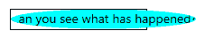
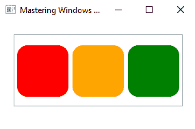
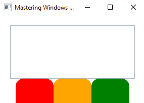
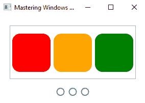
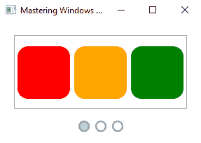
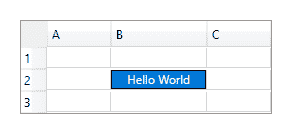
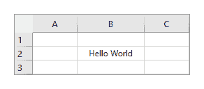
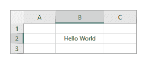
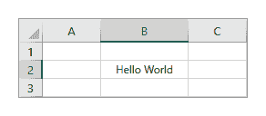
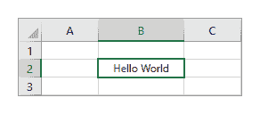

# 第六章：适配内置控件

.NET 框架附带了许多内置控件，涵盖了大多数现实世界场景。当我们需要稍微不同一点的东西时，我们已经看到我们可以利用 WPF 样式化和/或模板化系统来调整它们以满足我们的需求。然而，还有其他方法可以调整内置控件以适应我们的需求。

每个 .NET 控件都有一些方法，每个方法都以前缀 `On` 命名，例如 `OnInitialized` 或 `OnApplyTemplate`。这些是受保护的方法，可以在扩展 .NET 控件的任何自定义类中重写。它们在控件生命周期的特定点被调用，使我们能够改变每个控件的默认行为。

它们使我们能够做到像在控件初始化后立即启动一个进程这样简单的事情，或者一旦应用了自定义的`ControlTemplate`，就可以访问一个命名的控件。但它们也可以用来完全改变控件的默认行为或外观。在本章中，我们将研究这些方法，并给出如何利用它们为我们带来好处的示例。

我们将进一步探讨自定义内置控件的方法，通过调整它们的默认`ControlTemplate`并利用它们的新用途，同时保持或扩展它们现有的功能。在本章中，我们将内置控件仅视为我们需求的一个起点，并学习如何在此基础上构建，保留所需的部分并更改不需要的部分。

# 检查受保护的方法

每个 .NET 控件都有几个方法，这些方法允许开发者扩展该控件，以便与之交互或更改其功能。请注意，这些不是事件，而是受保护的方法，在控件生命周期的特定点被调用。正如我们已经在*第五章，使用适合工作的控件*中看到的那样，每个 .NET 控件都扩展了多个基类，每个基类都提供了一些额外的功能。

以类似的方式，每个基类也提供了一些这些受保护的方法，使我们能够与控件内部进行交互。在本章中，我们还将展示如何创建我们自己的方法，使扩展我们自己的控件类的开发者能够调整或扩展其功能。

让我们先看看 `Window` 类的受保护方法：

```cs
protected override Size ArrangeOverride(Size arrangeBounds); 
protected override Size MeasureOverride(Size availableSize); 
protected virtual void OnActivated(EventArgs e); 
protected virtual void OnClosed(EventArgs e); 
protected virtual void OnClosing(CancelEventArgs e); 
protected override void OnContentChanged(object oldContent, object newContent); 
protected virtual void OnContentRendered(EventArgs e); 
protected override AutomationPeer OnCreateAutomationPeer(); 
protected virtual void OnDeactivated(EventArgs e); 
protected virtual void OnLocationChanged(EventArgs e); 
protected override void 
    OnManipulationBoundaryFeedback(ManipulationBoundaryFeedbackEventArgs e); 
protected virtual void OnSourceInitialized(EventArgs e); 
protected virtual void OnStateChanged(EventArgs e); 
protected internal sealed override void  
    OnVisualParentChanged(DependencyObject oldParent); 
```

你可能会注意到，它们都带有虚拟或重写关键字，这表明它们可以在扩展类中被重写。除了我们在*第五章，使用适合工作的控件*中发现的`ArrangeOverride`和`MeasureOverride`方法之外，你应该看到它们的名称都以前缀`On`开头。这表示它们在某个动作发生后会被调用。

例如，当 `Window` 成为计算机上的活动窗口时，会调用 `OnActivated` 方法，而当 `Window` 失去焦点时，会调用 `OnDeactivated` 方法。这些方法通常一起使用，以暂停和恢复动画或其他过程，当 `Window` 失去焦点时。

如预期的那样，当 `Window` 被关闭时，会调用 `OnClosed` 方法，这给了我们处理任何资源或关闭应用程序前保存用户首选项的机会。相反，`OnClosing` 方法在 `Window` 关闭之前被调用，这给了我们取消关闭操作的机会。

因此，`OnClosing` 方法是一个很好的方法，可以用来显示对话框，要求用户确认关闭操作。让我们快速看一下在一个扩展 `Window` 类的类中我们如何实现这一点：

```cs
using System.ComponentModel; 
using System.Windows; 

... 

protected override void OnClosing(CancelEventArgs e) 
{ 
  base.OnClosing(e); 
  MessageBoxResult result = MessageBox.Show("Are you sure you want to close?", 
    "Close Confirmation", MessageBoxButton.OKCancel, MessageBoxImage.Question); 
  e.Cancel = result == MessageBoxResult.Cancel; 
} 
```

在这个简单的例子中，我们重写了 `OnClosing` 方法，并在其中首先调用基类方法，以确保任何基类例程按预期运行。然后我们向用户显示一个消息框，要求他们确认他们的关闭操作。

通过消息框按钮从用户那里获得的结果值，我们设置传入方法的 `CancelEventArgs` 对象的 `Cancel` 属性。如果返回值是 `Cancel`，则将 `Cancel` 属性设置为 `true` 并取消关闭操作，否则将其设置为 `false` 并关闭应用程序。

现在回到 `Window` 类，我们看到 `OnLocationChanged` 方法，该方法在 `Window` 被移动或调整大小，从而改变其左上角位置时被调用。我们可以使用这个方法来保存 `Window` 的最后位置，以便用户下次打开应用程序时能够返回到那里。然而，这种操作通常是在用户关闭应用程序时执行的。

`OnSourceInitialized` 方法在窗口源创建后、显示前被调用，而当 `WindowState` 属性改变时，会调用 `OnStateChanged` 方法。所以你看，这些方法为我们提供了在每个控件生命周期中特定点执行操作的机会。

每个基类都为我们添加了自己的受保护方法集合，我们可以在扩展类中重写这些方法。查看 `Window` 类的声明，我们看到它扩展了 `ContentControl` 类。注意，它的 `OnContentChanged` 方法被标记为 `override` 关键字。

这是因为这个方法实际上是在 `ContentControl` 类中声明的，但在 `Window` 类中被重写，以便在基类功能执行后添加自己的代码。让我们快速看一下 `Window` 类中这个方法的源代码。为了简洁，源代码中的注释已被删除：

```cs
protected override void OnContentChanged(object oldContent, object newContent) 
{ 
    base.OnContentChanged(oldContent, newContent); 

    SetIWindowService(); 
    if (IsLoaded == true) 
    { 
        PostContentRendered(); 
    } 
    else 
    { 
        if (_postContentRenderedFromLoadedHandler == false) 
        { 
            this.Loaded += new RoutedEventHandler(LoadedHandler); 
            _postContentRenderedFromLoadedHandler = true; 
        } 
    } 
} 
```

方法首先调用基类版本的方法，这通常是一个好习惯，除非我们不想停止现有功能的执行。接下来，它调用 `SetIWindowService` 方法，该方法只是将 `Window` 对象设置为 `IWindowServiceProperty` 依赖属性，然后它检查 `Window` 是否已经通过了加载阶段。

如果已经通过，那么它将调用 `PostContentRendered` 方法，该方法基本上使用 `Dispatcher` 对象调用 `OnContentRendered` 方法。否则，如果 `_postContentRenderedFromLoadedHandler` 变量是 `false`，它将事件处理程序附加到 `Loaded` 事件并将变量设置为 `true`，以确保不会附加多次。

回到我们的调查，我们看到 `Window` 类添加了与 `Window` 相关的受保护方法，而 `ContentControl` 类添加了与控件内容相关的受保护方法。现在让我们看看 `ContentControl` 类的受保护方法：

```cs
protected virtual void AddChild(object value); 
protected virtual void AddText(string text); 
protected virtual void OnContentChanged(object oldContent, object newContent); 
protected virtual void OnContentStringFormatChanged(string oldContentStringFormat, string newContentStringFormat); 
protected virtual void OnContentTemplateChanged(DataTemplate oldContentTemplate, DataTemplate newContentTemplate); 
protected virtual void OnContentTemplateSelectorChanged(DataTemplateSelector oldContentTemplateSelector, DataTemplateSelector newContentTemplateSelector); 
```

除了前两个方法，可以用来向 `ContentControl` 元素添加指定的对象或文本字符串外，其余四个方法都是在内容或控件内容格式发生变化时被调用。

现在继续，`ContentControl` 类扩展了 `Control` 类，它引入了 `ControlTemplate` 的概念。因此，它提供了一个受保护的 `OnTemplateChanged` 方法，当 `ControlTemplate` 值改变时被调用：

```cs
protected override Size ArrangeOverride(Size arrangeBounds); 
protected override Size MeasureOverride(Size constraint); 
protected virtual void OnMouseDoubleClick(MouseButtonEventArgs e); 
protected virtual void OnPreviewMouseDoubleClick(MouseButtonEventArgs e); 
protected virtual void OnTemplateChanged(ControlTemplate oldTemplate, ControlTemplate newTemplate); 
```

`Control` 类扩展了 `FrameworkElement` 类，它提供了框架级别的 方法和事件。这些包括鼠标、键盘、笔、触摸和焦点相关的受保护方法，以及一些其他方法：

```cs
protected virtual Size ArrangeOverride(Size finalSize); 
protected override Geometry GetLayoutClip(Size layoutSlotSize); 
protected override Visual GetVisualChild(int index); 
protected virtual Size MeasureOverride(Size availableSize); 
protected virtual void OnContextMenuClosing(ContextMenuEventArgs e); 
protected virtual void OnContextMenuOpening(ContextMenuEventArgs e); 
protected override void OnGotFocus(RoutedEventArgs e); 
protected virtual void OnInitialized(EventArgs e); 
protected override void OnPropertyChanged(DependencyPropertyChangedEventArgs e); 
protected virtual void OnToolTipClosing(ToolTipEventArgs e); 
protected virtual void OnToolTipOpening(ToolTipEventArgs e); 
```

可能到现在你已经注意到，许多这些方法名称与每个类引发的事件名称密切相关。事实上，有一个 .NET 框架编程指南，用于具有引发事件的受保护虚拟方法，以允许派生类覆盖事件调用行为，我们将在本章后面看到这个示例。

因此，在重写这些方法时，我们需要调用基类方法来引发相应的事件。如果有疑问，通常最好调用基类方法版本，以确保不会丢失默认功能。然而，查看基类方法源代码是一个好习惯，可以在 [www.referencesource.microsoft.com](http://www.referencesource.microsoft.com) 网站上查看，以检查我们是否需要调用它。

你可能想知道处理事件和重写相关受保护方法之间的区别，这取决于所讨论的方法。首先要注意的是，为了重写受保护方法，我们需要声明一个声明该方法的类的子类。

*所以，假设我们已经有了一个扩展基类的类，它们之间有什么区别呢？* 对于一些方法，例如我们探讨的 `OnClosing` 方法，差别很小。我们可以在附加到 `Closing` 事件的处理器中实现相同的功能，尽管没有调用基类方法。实际上，这是唯一的真正区别。

当重写 `OnClosing` 方法时，我们可以控制基类方法何时或是否被调用。在处理事件时，我们无法控制这一点。因此，如果我们需要在基类例程执行之前执行某些操作，或者我们想要阻止其执行，那么我们就需要重写 `OnClosing` 方法。

因此，`OnClosing` 方法的出现纯粹是为了方便，让我们能够改变 `Closing` 事件的默认行为。然而，其他方法，例如 `OnContextMenuClosing` 方法，为我们提供了一种进行类级处理相关事件的方式。

有时候，我们别无选择，只能重写这些受保护的成员方法。通常，这些类型的方法不以 `On` 前缀开头，也不与任何事件相关。偶尔，为了执行特定的操作，我们可能需要扩展一个类，以便我们可以为这些方法之一提供新的实现。

让我们看看一个例子，使用我们刚才看到的 `FrameworkElement` 类的 `GetLayoutClip` 方法。

# 布局剪辑

默认情况下，`TextBlock` 类会在其边界矩形内剪辑其文本内容，这样文本就不会从其中溢出。剪辑是剪切掉控件可见输出一部分的过程。*但是如果我们想让文本扩展其边界呢？*

有一个名为 `Clip` 的属性，我们通常用它来调整控件的可见部分。然而，这只能减少已经可见的部分。它不能增加控件可用的渲染空间。在我们继续我们的例子之前，让我们短暂地偏离一下，来调查这个属性。

定义在 `UIElement` 类中的 `Clip` 属性接受一个 `Geometry` 对象作为其值。我们可以从扩展 `Geometry` 类的任何类中创建传递给它的对象，包括 `CombinedGeometry` 类。因此，剪辑对象可以被制成任何形状。让我们查看一个简单的例子：

```cs
<Rectangle Fill="Salmon" Width="150" Height="100" RadiusX="25" RadiusY="50"> 
  <Rectangle.Clip> 
    <EllipseGeometry Center="150,50" RadiusX="150" RadiusY="50" /> 
  </Rectangle.Clip> 
</Rectangle> 
```

在这里，我们使用一个 `EllipseGeometry` 对象来使 `Rectangle` 元素呈现出一个小子弹形状。这是通过显示 `EllipseGeometry` 对象椭圆边界内的 `Rectangle` 元素的所有图像像素，并隐藏所有位于边界之外的那些像素来实现的。让我们看看这段代码的视觉输出：


回到我们之前的示例，`TextBlock`类也会以类似的方式剪辑其内容，但使用的是控件大小的矩形，而不是偏离中心的椭圆形。它不是使用提供用户与其它控件相同剪辑能力的`Clip`属性，而是使用一个受保护的方法来请求用于剪辑过程的`Geometry`对象。

我们确实可以从这个方法返回任何几何形状，但它不会产生与将形状传递给`Clip`属性相同的视觉效果。在我们的示例中，我们不想限制控件的可视大小，而是移除控件边界的剪辑区域。

如果我们确切知道要设置剪辑范围的尺寸，我们可以从`GetLayoutClip`方法返回该尺寸的`Geometry`对象。然而，出于我们的目的，以及为了使我们的任何自定义`TextBlock`对象能够超出其边界输出无限文本，我们可以简单地从这个方法返回`null`。让我们看看两种方法之间的区别。

首先，我们通过扩展`TextBlock`类来创建我们的`BoundlessTextBlock`类。在**Visual Studio**中，这可能是最简单的方法之一：将一个 WPF 用户控件对象添加到我们的 Controls 文件夹中，然后在 XAML 文件及其关联的后台代码文件中，将单词`UserControl`简单地替换为`TextBlock`。如果未能同时更改这两个文件，将导致设计时错误，错误信息会抱怨**`BoundlessTextBlock`的局部声明**必须**不能指定不同的基类**：

```cs
<TextBlock x:Class="CompanyName.ApplicationName.Views.Controls.BoundlessTextBlock" 

   /> 
```

如此示例所示，我们的 XAML 文件可以非常简洁，对于我们的需求，我们只需要在后台代码文件中重写单个`GetLayoutClip`方法。在这个第一个示例中，我们将返回一个与将要用于用户界面的文本块相同大小的`EllipseGeometry`对象：

```cs
using System.Windows; 
using System.Windows.Controls; 
using System.Windows.Media; 

namespace CompanyName.ApplicationName.Views.Controls 
{ 
  public partial class BoundlessTextBlock : TextBlock 
  { 
    public BoundlessTextBlock() 
    { 
      InitializeComponent(); 
    } 

    protected override Geometry GetLayoutClip(Size layoutSlotSize) 
    { 
      return new EllipseGeometry(new Rect(new Size(150, 22))); 
    } 
  } 
} 
```

让我们看看如何使用我们的新类。首先，我们需要定义一个 XAML 命名空间，它映射到我们保存类的 CLR 命名空间。接下来，为了演示目的，我们将`BoundlessTextBlock`对象包裹在一个`Border`对象中，这样我们就可以看到它的自然边界：

```cs

... 

<Border BorderBrush="Black" BorderThickness="1" HorizontalAlignment="Center" 
  VerticalAlignment="Center" SnapsToDevicePixels="True"> 
  <Controls:BoundlessTextBlock Text="Can you see what has happened?" 
    Background="Aqua" FontSize="14" Width="150" Height="22" /> 
</Border> 
```

让我们看看这个示例的视觉输出：


如您所见，我们的`BoundlessTextBlock`对象的视觉输出已被限制，只显示从`GetLayoutClip`方法返回的`EllipseGeometry`对象内的像素。*但是，如果我们返回一个比我们的自定义文本块更大的`EllipseGeometry`对象会发生什么？* 让我们通过返回这个对象来找出答案：

```cs
return new EllipseGeometry(new Rect(new Size(205, 22)));
```

现在，让我们看看`BoundlessTextBlock`对象的视觉输出，我们可以看到，由于`Border`对象和蓝色背景，我们自定义文本块的内容现在超出了其边界：



因此，我们可以看到，使用从`GetLayoutClip`方法返回的`Geometry`对象应用的裁剪不仅不受控件自然边界的限制，而且实际上可以直接改变它们。回到我们关于这个主题的原始想法，如果我们想完全移除控件边界处的裁剪，我们可以简单地从该方法返回`null`：

```cs
protected override Geometry GetLayoutClip(Size layoutSlotSize) 
{ 
  return null; 
} 
```

让我们看看这个更改的结果：


如您所见，文本现在延伸到了包含`TextBlock`对象的边界之外，并继续到文本值的末尾。请注意，如果其父控件（们）提供了足够的空间，它将延伸到文本字符串所需的长度。

现在我们来看一下扩展这些类以修改其功能的另一个示例。

# 修改默认行为

`ItemsControl`类的开发者为其赋予了特定的默认行为。他们认为任何扩展`UIElement`类的对象都将有自己的 UI 容器，因此应该直接显示，而不是允许它们以通常的方式模板化。

`ItemsControl`类中有一个名为`IsItemItsOwnContainer`的方法，该框架调用它以确定`Items`集合中的项目是否是其自己的项目容器。让我们首先看看这个方法的源代码：

```cs
public bool IsItemItsOwnContainer(object item) 
{ 
  return IsItemItsOwnContainerOverride(item); 
} 
```

注意，在内部，此方法只是调用`IsItemItsOwnContainerOverride`方法，并返回其值不变。现在让我们看看该方法的源代码：

```cs
protected virtual bool IsItemItsOwnContainerOverride(object item) 
{ 
  return (item is UIElement); 
} 
```

在这里，我们看到两件事：第一是刚刚提到的默认实现，其中对于所有扩展`UIElement`类的项目返回`true`，对于所有其他类型返回`false`；第二是此方法被标记为`virtual`，因此我们可以扩展此类并重写该方法以返回不同的值。

现在我们来看看`ItemsControl`类源代码的关键部分（不带注释），其中将使用我们的重写方法。此摘录来自`GetContainerForItem`方法：

```cs
DependencyObject container; 

if (IsItemItsOwnContainerOverride(item)) 
  container = item as DependencyObject; 
else 
  container = GetContainerForItemOverride(); 
```

在默认实现中，我们看到`UIElement`项目被转换为`DependencyObject`类型，并设置为容器，而为所有其他类型的项目创建了一个新的容器。在重写此方法之前，让我们用一个示例来看看默认行为的效果。

本例的目的是为集合中的每个项目渲染一个小空心圆。想象一下幻灯片放映，这些圆圈将代表幻灯片，或者页码编号或链接系统。因此，我们需要一个包含一些项目的集合控件和一个`DataTemplate`，以便定义这些圆圈。让我们首先看看包含项目的集合控件：

```cs
<UserControl 
  x:Class="CompanyName.ApplicationName.Views.ForcedContainerItemsControlView" 

  Height="175" Width="287"> 
  <Grid> 
    <Grid.Resources> 
      <ItemsPanelTemplate x:Key="HorizontalPanelTemplate"> 
        <StackPanel Orientation="Horizontal" /> 
      </ItemsPanelTemplate> 
      <Style TargetType="{x:Type Rectangle}"> 
        <Setter Property="Width" Value="75" /> 
        <Setter Property="Height" Value="75" /> 
        <Setter Property="RadiusX" Value="15" /> 
        <Setter Property="RadiusY" Value="15" /> 
      </Style> 
    </Grid.Resources> 
    <Grid.RowDefinitions> 
      <RowDefinition Height="Auto" /> 
      <RowDefinition /> 
    </Grid.RowDefinitions> 
    <ListBox Name="ListBox" Height="105" Margin="20,20,20,0"
      ItemsPanel="{StaticResource HorizontalPanelTemplate}"> 
      <Rectangle Fill="Red" /> 
      <Rectangle Fill="Orange" /> 
      <Rectangle Fill="Green" /> 
    </ListBox> 
  </Grid> 
</UserControl> 
```

我们从资源开始，其中我们声明了一个 `ItemsPanelTemplate`，设置为 `StackPanel` 的一个实例，其 `Orientation` 属性设置为 `Horizontal`。这将使面板的项目水平显示。然后我们添加了一个基本的 `Style`，在其中我们设置了 `Rectangle` 类的常用属性。

在标记中，我们有一个 `Grid` 面板，有两行。在第一行，我们有一个名为 `ListBox` 的 `ListBox`，在其 `Items` 集合中声明了三个彩色的 `Rectangle` 对象。其 `ItemsPanel` 属性设置为我们在控件 `Resources` 部分中声明的 `ItemsPanelTemplate` 实例。第二行目前为空，但让我们看看到目前为止的视觉输出：



到目前为止，一切顺利。我们可以在 `ListBox` 控件中看到我们的三个圆形矩形。现在，让我们在 `Resources` 部分添加一个 `DataTemplate`，并在 `Grid` 面板的第二行添加一个 `ItemsControl` 元素，直接在 `ListBox` XAML 下方声明：

```cs
<DataTemplate x:Key="EllipseDataTemplate" DataType="{x:Type UIElement}"> 
  <Ellipse Width="16" Height="16" 
    Stroke="Gray" StrokeThickness="2" Margin="4" /> 
</DataTemplate> 

... 

<ItemsControl Grid.Row="1" ItemsSource="{Binding Items, ElementName=ListBox}" 
  ItemsPanel="{StaticResource HorizontalPanelTemplate}" 
  ItemTemplate="{StaticResource EllipseDataTemplate}" 
  HorizontalAlignment="Center" /> 
```

注意，这个 `ItemsControl` 元素的 `ItemsSource` 属性数据绑定到了 `ListBox` 的 `Items` 属性，使用了一个 `ElementName` 绑定。像 `ListBox` 控件一样，它也使用 `ItemsPanelTemplate` 资源水平排列其项目。它还应用了我们刚刚添加到 `Resources` 部分的新的 `DataTemplate` 元素。

在这个 `DataTemplate` 中，我们定义了一个用于渲染集合中每个项目的空心灰色 `Ellipse` 元素，指定了其尺寸、间距和描边设置。现在让我们看看我们示例的视觉输出：



如您所见，我们得到了一些意外的结果。我们没有渲染在 `DataTemplate` 中定义的小灰色椭圆，而是 `ItemsControl` 中的项目显示了 `ListBox` 的实际项目。更糟糕的是，由于每个 UI 元素在任何给定时间点只能显示在一个位置，原始项目甚至不再出现在 `ListBox` 中。

你可能会看到关于这个问题的 `ArgumentException`：

```cs
Must disconnect the specified child from current parent Visual before attaching to new parent Visual.
```

*但是，根据我们的* `DataTemplate`*，为什么这些对象没有被渲染成空心圆圈呢*？* 你还记得我们调查过的* `IsItemItsOwnContainerOverride` *方法吗？* 好吧，这就是原因。

绑定到 `ItemsControl` 的 `ItemsSource` 属性的对象扩展了 `UIElement` 类，因此 `ItemsControl` 类使用它们作为自己的容器，而不是为它们创建一个新的容器并应用项目模板。

*那么，我们如何改变这种默认行为呢*？* 对，我们需要扩展 `ItemsControl` 类并重写 `IsItemItsOwnContainerOverride` 方法，使其始终返回 `false`。这样，就会始终创建一个新的容器，并且始终应用项目模板。让我们看看在一个新类中这会是什么样子：

```cs
using System.Windows.Controls; 

namespace CompanyName.ApplicationName.Views.Controls 
{ 
  public class ForcedContainerItemsControl : ItemsControl 
  { 
 protected override bool IsItemItsOwnContainerOverride(object item) 
    { 
      return false; 
    } 
  } 
} 
```

这里我们有非常简单的 `ForcedContainerItemsControl` 类，它有一个重写的方法，总是返回 `false`。在这个类中我们不需要做其他任何事情，因为我们很高兴使用 `ItemsControl` 类的默认行为来处理其他所有事情。

剩下的就是在我们示例中使用我们的新类。我们首先为我们的 `Controls` CLR 命名空间添加一个 XAML 命名空间：

接下来，我们将 `ItemsControl` XAML 替换为以下内容：

```cs
<Controls:ForcedContainerItemsControl Grid.Row="1" 
  ItemsSource="{Binding Items, ElementName=ListBox}" 
  ItemsPanel="{StaticResource HorizontalPanelTemplate}" 
  ItemTemplate="{StaticResource EllipseDataTemplate}" 
  HorizontalAlignment="Center" Height="32" /> 
```

让我们看看现在的新的视觉输出：



现在，我们看到我们最初期望看到的东西：为集合中的每个项渲染一个小空心圆。我们自定义的 `ItemsControl` 中的项现在都已经生成了新的容器，并且按照预期应用了我们的模板。

*但是如果我们需要在这个示例中使用选中项怎么办？* `ItemsControl` 类没有选中项的概念，所以在这种情况下，我们需要在 `Grid` 面板的第二行中使用 `ListBox` 控件。

然而，请注意，`ListBox` 类也重写了 `IsItemItsOwnContainerOverride` 方法，这样它就不会有相同的问题。

事实上，它只会将项用作容器，如果它实际上是这个类的正确容器；一个 `ListBoxItem`。让我们看看它重写的方法：

```cs
protected override bool IsItemItsOwnContainerOverride(object item)  
{  
  return (item is ListBoxItem); 
} 
```

因此，如果我们需要从 `ListBox` 类中访问 `SelectedItem` 属性，那么我们不需要创建我们自己的扩展类来重写这个方法，而是可以使用它们的标准实现。然而，为了获得相同的视觉输出，我们需要一些样式来隐藏 `ListBox` 的边框和选中项的高亮。让我们看看这个基本示例：

```cs
<Style x:Key="HiddenListBoxItems" TargetType="{x:Type ListBoxItem}"> 
  <Setter Property="Template"> 
    <Setter.Value> 
      <ControlTemplate TargetType="{x:Type ListBoxItem}"> 
        <ContentPresenter /> 
      </ControlTemplate> 
    </Setter.Value> 
  </Setter> 
</Style> 
<Style x:Key="HiddenListBox" TargetType="{x:Type ListBox}"> 
  <Setter Property="Template"> 
    <Setter.Value> 
      <ControlTemplate TargetType="{x:Type ListBox}"> 
        <ScrollViewer> 
          <ItemsPresenter SnapsToDevicePixels="{TemplateBinding 
            SnapsToDevicePixels}" /> 
        </ScrollViewer> 
      </ControlTemplate> 
    </Setter.Value> 
  </Setter> 
</Style> 
```

我们还需要更新我们的 `EllipseDataTemplate` 模板，以便包含一个触发器，在顶部的 `ListBox` 控件中选择相关项时突出显示小的 `Ellipse` 对象：

```cs
<DataTemplate x:Key="EllipseDataTemplate" DataType="{x:Type UIElement}"> 
  <Ellipse Width="16" Height="16" Stroke="Gray" StrokeThickness="2" 
    Margin="8"> 
    <Ellipse.Style> 
      <Style TargetType="{x:Type Ellipse}"> 
        <Setter Property="Fill" Value="Transparent" /> 
        <Style.Triggers> 
          <DataTrigger Binding="{Binding IsSelected, 
            RelativeSource={RelativeSource 
            AncestorType={x:Type ListBoxItem}}}" Value="True"> 
            <Setter Property="Fill" Value="LightGray" /> 
          </DataTrigger> 
        </Style.Triggers> 
      </Style> 
    </Ellipse.Style> 
  </Ellipse> 
</DataTemplate> 
```

最后，我们需要将我们的 `ForcedContainerItemsControl` 元素替换为标准的 `ListBox`，并将其样式应用到它及其容器上：

```cs
<ListBox Grid.Row="1" ItemsSource="{Binding Items, ElementName=ListBox}" 
  ItemsPanel="{StaticResource HorizontalPanelTemplate}" 
  ItemTemplate="{StaticResource EllipseDataTemplate}" 
  SelectedItem="{Binding SelectedItem, ElementName=ListBox}" 
  Style="{StaticResource HiddenListBox}" 
  ItemContainerStyle="{StaticResource HiddenListBoxItems}" 
  HorizontalAlignment="Center" /> 
```

当我们现在运行应用程序时，我们看到当在顶部的 `ListBox` 中选择相关项时，小的空心 `Ellipse` 对象会变成实心：



因此，我们已经看到了如何重写这些受保护的方法来改变内置控件的默认行为。现在让我们看看如何将这些受保护的方法构建到我们自己的自定义类中，以便它们可以影响我们控件功能的一部分的自然流程。

# 创建可重写的方法

我们需要做的第一件事是在我们的基类中定义一个抽象方法或虚方法。请注意，为了声明一个抽象方法，类必须是抽象的。我们选择哪一个将取决于我们是否希望将实现留给使用我们代码的开发者，或者如果我们需要在方法中自己实现一些实现。

让我们通过一个例子来澄清这一点。这里，我们看到一个来自抽象 `BaseDragDropManager` 类的方法。它处理用作拖放源的控件上的 `PreviewMouseMove` 事件，例如，在一个 `ListBox` 上，一个项目正在被拖动：

```cs
private void DragSourcePreviewMouseMove(object sender, MouseEventArgs e) 
{ 
  if (_isMouseDown && IsConfirmedDrag(e.GetPosition(sender as ListBox))) 
  { 
    _isMouseDown = false; 
    OnDragSourcePreviewMouseMove(sender, e); 
    if (e.Handled) return; 
    OnDragStart(sender as UIElement); 
  } 
} 

protected virtual void 
  OnDragSourcePreviewMouseMove(object sender, MouseEventArgs e) { } 

protected abstract void OnDragStart(UIElement uiElement); 
```

在这个例子中，`DragSourcePreviewMouseMove` 方法首先执行一个检查，以验证是否由用户启动了拖动操作。然后，它调用标记为 `virtual` 的 `OnDragSourcePreviewMouseMove` 方法，这使得在派生类中重写它是可选的。

`DragSourcePreviewMouseMove` 方法的下一行检查 `MouseEventArgs` 输入参数的 `Handled` 属性，如果它在派生类中被设置为 `true`，则将执行权返回给调用者，而不是继续拖放操作。如果事件没有被处理，则调用 `OnDragStart` 方法。

这是将派生类可能的输入链接起来的关键部分。在扩展类中重写 `OnDragSourcePreviewMouseMove` 方法的唯一原因是将 `MouseEventArgs` 输入参数的 `Handled` 属性设置为 `true` 并停止拖放操作开始，这可能根据扩展类拥有的某些信息。

相反，`OnDragStart` 方法被标记为 `abstract`，要求在所有派生类中重写它。这是准备拖放过程数据的方法，并且需要调用基类的 `StartDrag` 方法以开始操作，传递准备好的数据。

在这个特定的例子中，我们的虚拟方法在基类中是空的，并且不需要从重写的方法中调用它。更典型的情况是，基类将包含一个默认实现，这可以在派生类中重写，但可能需要调用基类，以保留其功能。

例如，存在一个从派生类中引发基类事件的 .NET Framework 编程指南。通常，派生类不能引发基类事件，任何尝试这样做都会遇到编译错误：

```cs
The event ClassName.EventName can only appear on the left hand side of += or -= (except when used from within the type ClassName)
```

指南中解决这个问题的方法是，在基类中包装这些事件的调用在一个受保护的方法中，以便可以在派生类中调用或重写。让我们向我们的 `AddressControl` 控件添加一个自定义的 `EventArgs` 类和一个事件，以演示这个指南：

```cs
public class AddressEventArgs : EventArgs 
{ 
  public AddressEventArgs(Address oldAddress, Address newAddress) 
  { 
    OldAddress = oldAddress; 
    NewAddress = newAddress; 
  } 

  public Address OldAddress { get; } 

  public Address NewAddress { get; } 
} 

... 

public event EventHandler<AddressEventArgs> AddressChanged;  

... 

public virtual Address Address 
{ 
  get { return (Address)GetValue(AddressProperty); } 
  set 
  { 
    if (!Address.Equals(value)) 
    { 
      Address oldAddress = Address; 
      SetValue(AddressProperty, value); 
      OnAddressChanged(new AddressEventArgs(oldAddress, value)); 
    } 
  } 
} 

... 

protected virtual void OnAddressChanged(AddressEventArgs e) 
{ 
  AddressChanged?.Invoke(this, e); 
} 
```

首先，我们为我们的事件创建一个自定义的 `EventArgs` 类。然后，我们声明一个名为 `AddressChanged` 的事件和一个用于引发它的受保护的虚拟方法，使用空条件运算符。这可以直接从派生类中调用以引发事件，也可以重写，以添加到或阻止基类实现执行。

最后，我们更新我们的`Address`属性，以调用调用方法，并传入所需的先前和当前`Address`对象。请注意，我们现在也将此属性标记为`virtual`，这样派生类也可以重写它，以完全控制事件何时以及是否应该被触发。

这比在派生类中声明一个虚拟事件并重写它要好得多，因为编译器并不总是按预期处理这种情况，这是由于一些复杂的事件重写规则，我们也不能总是确定订阅者实际上会订阅哪个版本的事件。

现在我们对这些受保护的方法有了更好的理解，让我们看看通过在派生类中重写它们我们可以做些什么。我们将使用一个扩展示例，该示例提出了许多问题，我们可以通过重写这些受保护基类方法中的几个来修复这些问题。

# 定制以满足我们的需求

让我们想象一下，我们想要创建一个显示表格数据的程序。这听起来最初并不复杂，但实际上这是一个很好的示例，可以用来展示如何调整内置的.NET 控件以满足我们的需求。随着我们通过这个示例的进展，我们将遇到几个潜在的问题，并逐一找出如何克服这些问题。

对于这个扩展示例，我们将创建一个`Spreadsheet`控件。和往常一样，在创建新的控件时，我们会查看现有的控件，看看是否有任何控件可以作为我们良好的起点。第一个跳入脑海的控件是`Grid`面板，因为它有行、列，因此也有单元格，但创建所有的`RowDefinition`和`ColumnDefinition`对象可能会很繁琐或有问题。

还有`UniformGrid`面板，但正如其名称所暗示的，它的所有单元格都是统一的，或者彼此大小相同，但在电子表格中这并不总是情况。我们可以使用一个`ItemsControl`对象和一个自定义的`DataTemplate`来手动绘制每个单元格的边框和内容，*但有没有更好的起点呢？*

*那么，`DataGrid`控件怎么样呢？* 它有行、列和单元格，甚至为我们绘制单元格之间的网格线。它还有一个选中单元格的概念，如果我们想让用户与我们的电子表格控件交互，这可能很有用。它没有在网格轴上的数字、字母或选中单元格标记，但我们可以扩展控件来添加这些，所以它似乎是这项工作的最佳候选人。

我们需要做的第一件事是创建一个新的类，该类扩展了`DataGrid`类。正如我们在本章前面所看到的，我们可以通过向我们的项目中添加一个`UserControl`并将其 XAML 文件和其代码背后的文件中的`UserControl`一词替换为`DataGrid`来实现这一点。如果未能同时更改这两个地方，将导致设计时错误，错误信息会抱怨类不匹配。

让我们看看我们的新 `Spreadsheet` 类：

```cs
using System.Windows.Controls; 

namespace CompanyName.ApplicationName.Views.Controls 
{ 
  public partial class Spreadsheet : DataGrid 
  { 
    public Spreadsheet() 
    { 
      InitializeComponent(); 
    } 
  } 
} 
```

背后的代码很简单，目前没有自定义代码。然而，XAML 中设置了许多重要的属性，所以现在让我们看看它：

```cs
<DataGrid x:Class="CompanyName.ApplicationName.Views.Controls.Spreadsheet" 

  AutoGenerateColumns="False" SelectionUnit="Cell" SelectionMode="Single" 
  IsReadOnly="True" RowHeight="20" RowHeaderWidth="26" ColumnHeaderHeight="26"
  CanUserAddRows="False" CanUserDeleteRows="False" CanUserReorderColumns="False"
  CanUserResizeColumns="False" CanUserResizeRows="False" 
  HorizontalGridLinesBrush="{DynamicResource GridlinesBrush}" 
  VerticalGridLinesBrush="{DynamicResource GridlinesBrush}" 
  BorderBrush="{DynamicResource BorderBrush}"> 
  <DataGrid.Resources> 
    <Color x:Key="BackgroundColor">#FFE6E6E6</Color> 
    <Color x:Key="BorderColor">#FF999999</Color> 
    <SolidColorBrush x:Key="BackgroundBrush" Color="{StaticResource BackgroundColor}" /> 
    <SolidColorBrush x:Key="BorderBrush" Color="{StaticResource BorderColor}" /> 
    <SolidColorBrush x:Key="SelectedBackgroundBrush" Color="#FFD2D2D2" /> 
    <SolidColorBrush x:Key="GridlinesBrush" Color="#FFD4D4D4" /> 
    <SolidColorBrush x:Key="SelectionBrush" Color="#FF217346" /> 
  </DataGrid.Resources> 
</DataGrid> 
```

对于这个实现，我们将 `AutoGenerateColumns` 属性设置为 `False`，因为我们将会以编程方式创建电子表格控件的列。为了近似电子表格控件，我们还需要限制我们自定义 `DataGrid` 的选择可能性。

因此，我们将 `SelectionUnit` 属性设置为 `Cell`，这样用户就只会选择他们点击的单元格，而不是整行，这是默认的选择行为。此外，为了简化这个示例，我们还设置了 `SelectionMode` 属性为 `Single`，`IsReadOnly` 属性为 `True`，以及 `RowHeight` 属性为 `20`。

我们的行和列标题都将设置为 26 像素，因此我们将 `RowHeaderWidth` 和 `ColumnHeaderHeight` 属性设置为 `26`。请注意，我们也可以在它们的相对样式中设置行和列标题的尺寸，但我们需要稍后引用这些属性，所以在这里设置它们是很重要的。接下来的五个属性，以 `CanUser` 为前缀，也已设置为 `False`，以进一步缩短这个示例。

然后，我们将 `HorizontalGridLinesBrush` 和 `VerticalGridLinesBrush` 属性都设置为来自 `Resources` 部分的 `GridlinesBrush` 画笔，并将 `BorderBrush` 属性设置为 `BorderBrush` 画笔。请注意，在这些情况下，我们需要使用 `DynamicResource` 标记扩展，因为这些画笔是在 `DataGrid` 声明之后定义的，包括其他所有资源，而 XAML 解析器无法使用标准的 `StaticResource` 标记扩展来定位它们。

此外，请注意，我们必须删除 Visual Studio 添加到每个新 `UserControl` 中的空 `Grid` 面板。原因是任何在 `DataGrid` 控件内部声明的元素都被确定为它的项目，我们不能同时使用它的 `Items` 属性和 `ItemsSource` 属性，而这是我们打算使用的。如果我们同时使用它们，我们将在运行时看到这个异常被抛出：

```cs
System.InvalidOperationException: 'Items collection must be empty before using ItemsSource.'
```

现在让我们继续前进，研究我们如何在电子表格中显示数据。

# 数据填充

为了将一些数据放入我们的 `Spreadsheet` 控件中，我们需要一个类来表示电子表格中的每个单元格。现在让我们看看一个基本的 `Cell` 类：

```cs
namespace CompanyName.ApplicationName.DataModels
{
  public class Cell : BaseDataModel
  {
    private string address = string.Empty, content = string.Empty;
    private double width = 0;

    public Cell(string address, string content, double width)
    {
      Address = address;
      Content = content;
      Width = width;
    }

    public string Address
    {
      get { return address; }
      set { if (address != value) { address = value; 
        NotifyPropertyChanged(); } }
    }

    public string Content
    {
      get { return content; }
      set { if (content != value) { content = value; 
        NotifyPropertyChanged(); } }
    }

    public double Width
    {
      get { return width; }
      set { if (width != value) { width = value; NotifyPropertyChanged(); } }
    }

    public override string ToString()
    {
      return $"{Address}: {Content}";
    }
  }
} 
```

这是一个非常直接的类，只有三个属性，一个用于填充这些属性的构造函数，以及一个重写的 `ToString` 方法。像往常一样，我们扩展了 `BaseDataModel` 类，以便我们可以访问 `INotifyPropertyChanged` 接口。请注意，在一个真正的基于电子表格的应用程序中，我们会在这个类中有更多的属性，以便我们可以适当地样式化和格式化内容。

现在让我们继续创建我们的`SpreadsheetViewModel`和`SpreadsheetView`类。在`SpreadsheetViewModel`类中，我们用一些基本示例数据填充一个`DataTable`，并将其数据绑定到`SpreadsheetView`类中的新`Spreadsheet`控件：

```cs
using CompanyName.ApplicationName.DataModels; 
using System.Data; 

namespace CompanyName.ApplicationName.ViewModels 
{ 
  public class SpreadsheetViewModel : BaseViewModel 
  { 
    private DataRowCollection dataRowCollection = null; 

    public SpreadsheetViewModel() 
    { 
      Cell[] Cells = new Cell[9]; 
      Cells[0] = new Cell("A1", "", 64); 
      Cells[1] = new Cell("B1", "", 96); 
      Cells[2] = new Cell("C1", "", 64); 
      Cells[3] = new Cell("A2", "", 64); 
      Cells[4] = new Cell("B2", "Hello World", 96); 
      Cells[5] = new Cell("C2", "", 64); 
      Cells[6] = new Cell("A3", "", 64); 
      Cells[7] = new Cell("B3", "", 96); 
      Cells[8] = new Cell("C3", "", 64); 

      DataTable table = new DataTable(); 
      table.Columns.Add("A", typeof(Cell)); 
      table.Columns.Add("B", typeof(Cell)); 
      table.Columns.Add("C", typeof(Cell)); 
      table.Rows.Add(Cells[0], Cells[1], Cells[2]); 
      table.Rows.Add(Cells[3], Cells[4], Cells[5]); 
      table.Rows.Add(Cells[6], Cells[7], Cells[8]); 

      Rows = table.Rows; 
    } 

    public DataRowCollection Rows 
    { 
      get { return dataRowCollection; } 
      set { if (dataRowCollection != value) { dataRowCollection = value; 
        NotifyPropertyChanged(); } } 
    } 
  } 
}
```

在这个非常简单的视图模型中，我们声明了一个类型为`DataRowCollection`的单个属性，以包含我们的电子表格数据。使用此类型使我们能够轻松地从`DataTable`对象填充我们的电子表格，例如，从数据库加载或从 XML 文件生成。

在构造函数中，我们通过编程初始化并填充一个`DataTable`，使用示例`Cell`对象，并将其`Rows`属性值设置为我们的`Rows`属性。现在让我们看看这个`Rows`属性是如何在`SpreadsheetView`类中与我们的`Spreadsheet`控件数据绑定的：

```cs
<UserControl x:Class="CompanyName.ApplicationName.Views.SpreadsheetView" 

  > 
  <Controls:Spreadsheet ItemsSource="{Binding Rows}" Margin="50" /> 
</UserControl> 
```

再次强调，这是一个非常简单的类，除了为我们的`Controls`项目声明一个 XAML 命名空间以及一个`Spreadsheet`控件，其`ItemsSource`属性绑定到视图模型的`Rows`属性外，没有其他内容。代码背后更是简单，其中没有任何自定义代码。此外，请记住使用您喜欢的任何方法将视图和视图模型链接在一起。

然而，在我们能够在`Spreadsheet`控件中看到任何数据之前，我们需要声明一个`DataTemplate`来定义每个单元格应该如何渲染，并程序化设置我们的列，与数据绑定项相关。现在让我们在 XAML 文件中声明所需的 XAML 命名空间，并将`DataTemplate`添加到我们的`Spreadsheet`控件的`Resources`部分中：

```cs

... 
<DataTemplate x:Key="CellTemplate" DataType="{x:Type DataModels:Cell}"> 
  <TextBlock Text="{Binding Content}" HorizontalAlignment="Center" 
    VerticalAlignment="Center" /> 
</DataTemplate> 
```

在这里，我们有一个水平居中的`TextBlock`控件，用于输出每个单元格的内容。在实际应用中，我们会用`Border`元素包围它，以着色每个单元格的背景，并将数据绑定到更多属性，以便我们为每个单元格设置不同的样式和格式设置。然而，在这个例子中，我们将保持简单。

回到列生成的主题，记住我们不知道传入数据中会有多少列，因此我们需要找到一个地方来程序化设置它们。为此，我们回到受保护的基类方法。

在查看`DataGrid`类的受保护方法时，我们看到一个好的候选者：`OnItemsSourceChanged`方法。此方法将在`ItemsSource`值更改时被调用，因此它是初始化电子表格列的绝佳位置，当数据源更改时。

但是我们的项目是`DataRow`对象，每个`Cell`对象在其`ItemArray`集合中的位置都不同。我们需要一种方法来使用数组语法来数据绑定每个`Cell`，但是内置的列类型没有这个功能。因此，我们需要创建一个自定义的，而`DataGridTemplateColumn`类是最好的起点。

我们可以重写这个类，添加一个名为 `Binding` 的 `Binding` 类型属性，并使用它来设置为每个单元格生成的 UI 元素上的绑定。通过查看 `DataGridTemplateColumn` 类中的受保护方法，我们找到了 `GenerateElement` 方法，它生成这些 UI 元素。现在让我们看看这个新的 `DataGridBoundTemplateColumn` 类：

```cs
using System.Windows; 
using System.Windows.Controls; 
using System.Windows.Data; 

namespace CompanyName.ApplicationName.Views.Controls 
{ 
  public class DataGridBoundTemplateColumn : DataGridTemplateColumn 
  { 
    public Binding Binding { get; set; } 

    protected override FrameworkElement GenerateElement(DataGridCell cell,
      object dataItem) 
    { 
      FrameworkElement element = base.GenerateElement(cell, dataItem); 
      if (Binding != null) 
        element.SetBinding(ContentPresenter.ContentProperty, Binding); 
      return element; 
    } 
  } 
} 
```

这是一个简单的类，我们首先扩展 `DataGridTemplateColumn` 类并声明上述 `Binding` 属性。然后我们重写 `GenerateElement` 方法，在其中首先调用基类实现以生成与当前单元格相关的 `FrameworkElement` 对象，并通过不变的方式传递输入参数。

如果 `Binding` 属性不是 `null`，我们就在元素上调用 `SetBinding` 方法，指定 `ContentPresenter.ContentProperty` 依赖属性作为绑定目标，并通过 `Binding` 属性传递 `Binding` 对象以连接到它。最后，我们简单地返回生成的元素。

现在，让我们回到 `Spreadsheet` 类的代码背后，在那里我们需要使用我们新的 `DataGridBoundTemplateColumn` 类：

```cs
using CompanyName.ApplicationName.DataModels; 
using System.Collections; 
using System.Data; 
using System.Linq; 
using System.Windows; 
using System.Windows.Controls; 
using System.Windows.Data; 

... 

protected override void OnItemsSourceChanged(IEnumerable oldValue, 
  IEnumerable newValue) 
{ 
  if (!(newValue is DataRowCollection rows) || rows.Count == 0) return; 
  Cell[] cells = rows[0].ItemArray.Cast<Cell>().ToArray(); 
  Columns.Clear(); 
  DataTemplate cellTemplate = (DataTemplate)FindResource("CellTemplate"); 
  for (int i = 0; i < cells.Length; i++) 
  { 
    DataGridBoundTemplateColumn column = new DataGridBoundTemplateColumn 
    { 
      Header = GetColumnName(i + 1), 
      CellTemplate = cellTemplate, 
      Binding = new Binding($"[{i}]"), 
      Width = cells[i].Width 
    }; 
    Columns.Add(column); 
  } 
} 

private string GetColumnName(int index) 
{ 
    if (index <= 26) return ((char)(index + 64)).ToString(); 
    if (index % 26 == 0) 
      return string.Concat(GetColumnName(index / 26 - 1), "Z"); 
    return string.Concat(GetColumnName(index / 26), 
      GetColumnName(index % 26)); 
} 
```

如前所述，我们重写 `OnItemsSourceChanged` 方法，以便在数据源更改时初始化我们的电子表格列。在其中，我们使用 C# 6.0 模式匹配来验证 `newValue` 输入参数不是 `null` 并且是 `DataRowCollection` 类型，然后再检查集合中是否有一行或多行。

如果 `DataRowCollection` 对象有效，那么我们将它的第一行的 `ItemArray` 集合中的项目转换为我们自定义类型 `Cell` 的数组。我们只需要使用第一行，因为在这里，我们只是设置列，而不是数据。然后我们清除电子表格控制的列，并从控制的 `Resources` 部分找到名为 `CellTemplate` 的 `DataTemplate`。

接下来，我们遍历数组中的 `Cell` 对象，为每个对象在电子表格的 `Columns` 集合中添加一个新的 `DataGridBoundTemplateColumn` 元素。每个列元素使用 `Header` 初始化，该 `Header` 来自 `GetColumnName` 方法，`CellTemplate` `DataTemplate`，`Cell` 对象的 `Width`，以及一个 `Binding` 对象。

注意，`Binding` 路径设置为 `$"[{i}]"`，例如，对于第一个项目，它将转换为 `"[0]"`，这代表标准的索引表示法。这将导致绑定路径设置为数据绑定集合中每一行的第一个项目，或者换句话说，就是我们的数据源的第一列中的每个单元格。

如果 `GetColumnName` 方法中的输入值在 1 到 26 之间，我们将其加 64，然后将其转换为 `char` 并在结果上调用 `ToString` 方法。大写字母 A 在 ASCII 表中的整数值为 65，因此，这段代码的效果是将前 26 列的索引转换为字母 A 到 Z。

如果输入值大于`26`并且是`26`的精确倍数，那么我们返回对`GetColumnName`方法的递归调用的字符串连接，传递输入值除以`26`的因子，并从它中减去`1`，以及字母`Z`。

如果没有任何`if`条件满足，我们将返回两次递归调用的结果：第一个传递的值代表输入值除以 26 后的因子，第二个代表输入值除以 26 的余数。

用简单的英语来说，第一行输出字母 A 到 Z，第二行处理包含多个字母并以字母 Z 结尾的列标识符，第三行处理所有其他情况。让我们看看到目前为止运行应用程序时我们有什么结果：


# 向目标迈进

*那么，我们需要对哪些方面进行修改，才能将这个* `DataGrid` *控件变成更类似于电子表格的外观？* 我们需要相应地对其进行样式化，并在行标题中填充标识每行的数字。我们还需要在单元格被选中时突出显示相关的行和列标题，并且可以实现一个动画选择矩形来突出显示选中的单元格，而不是使用图像中显示的默认突出显示。

首先，让我们用数字填充行标题。有几种方法可以实现这一点，但我更喜欢简单地要求每个行在转换器类中询问其索引，并通过数据绑定将其连接到行标题。现在让我们看看这个转换器：

```cs
using System; 
using System.Globalization; 
using System.Windows; 
using System.Windows.Controls; 
using System.Windows.Data; 

namespace CompanyName.ApplicationName.Converters 
{ 
[ValueConversion(typeof(DataGridRow), typeof(int))] 
  public class DataGridRowToRowNumberConverter : IValueConverter 
  { 
    public object Convert(object value, Type targetType, object parameter,
      CultureInfo culture) 
    { 
      if (value is DataGridRow dataGridRow) 
        return dataGridRow.GetIndex() + 1; 
      return DependencyProperty.UnsetValue; 
    } 

    public object ConvertBack(object value, Type targetType, 
      object parameter, CultureInfo culture) 
    { 
      throw new NotImplementedException(); 
    } 
  } 
} 
```

这是一个简单的类，并且，像往常一样，我们首先在`ValueConversion`属性中指定转换器中涉及的数据类型。在这种情况下，我们的输入将是`DataRow`对象，我们的输出将是它们的整数行号。在`Convert`方法中，我们使用 C# 6.0 的匹配模式作为快捷方式来验证我们的输入值不是`null`并且是适当类型，如果合适的话，将其转换为该类型。

如果输入有效，我们在预转换的`dataGridRow`变量上调用`GetIndex`方法，记得在返回转换器之前将零基方法结果加 1。对于所有其他输入值，我们返回`DependencyProperty.UnsetValue`值。由于我们不需要在相反方向转换任何值，所以我们留空`ConvertBack`方法。

让我们看看现在如何使用这个`converter`类。首先，我们需要为我们的`Converters` CLR 命名空间设置一个 XAML 命名空间，并在控制器的`Resources`部分创建其实例：

```cs

... 

<Converters:DataGridRowToRowNumberConverter 
  x:Key="DataGridRowToRowNumberConverter" /> 
```

然后，我们能够在`DataTemplate`中`TextBlock`元素的`Text`属性的数据绑定中使用它，该`DataTemplate`应用于我们自定义的`DataGrid`的`RowHeaderTemplate`属性：

```cs
<DataGrid.RowHeaderTemplate> 
  <DataTemplate> 
    <TextBlock Text="{Binding Path = ., 
      RelativeSource={RelativeSource AncestorType={x:Type DataGridRow}}, 
      Converter={StaticResource DataGridRowToRowNumberConverter}}" /> 
  </DataTemplate> 
</DataGrid.RowHeaderTemplate> 
```

注意，绑定路径被设置为`.`，正如你可能记得的，这会将它设置为整个绑定对象。`RelativeSource`绑定将绑定源设置为`DataGridRow`类型`TextBlock`的第一个祖先，因此我们将整个`DataGridRow`对象传递给绑定，以及所需的转换器。

此外，请注意，我们必须在 XAML 文件的`Resources`部分下方声明这个`RowHeaderTemplate`属性。未能这样做将导致以下运行时错误：

```cs
Cannot find resource named 'DataGridRowToRowNumberConverter'. Resource names are case sensitive.
```

虽然有时我们可以通过使用`DynamicResource`标记扩展而不是`StaticResource`标记扩展来修复这些“找不到引用”错误，但在这种情况下它不会起作用。这是因为我们只能在`DependencyObject`的`DependencyProperty`上使用它们，而`Converter`属性不是一个`DependencyProperty`，`Binding`类也不是一个`DependencyObject`。

让我们看看现在我们的电子表格看起来像什么：



如前图所示，我们显然需要添加一些样式来修复一些问题，并使其看起来更像一个典型的电子表格：

```cs
<!--Default Selection Colors--> 
<SolidColorBrush 
  x:Key="{x:Static SystemColors.HighlightBrushKey}" Color="Transparent" /> 
<SolidColorBrush 
  x:Key="{x:Static SystemColors.HighlightTextBrushKey}" Color="Black" /> 
<SolidColorBrush 
  x:Key="{x:Static DataGrid.FocusBorderBrushKey}" Color="Transparent" /> 
<SolidColorBrush x:Key="{x:Static 
  SystemColors.InactiveSelectionHighlightBrushKey}" Color="Transparent" /> 
<LinearGradientBrush x:Key="HorizontalBorderGradient" StartPoint="0,0"
  EndPoint="0,1"> 
  <GradientStop Color="{StaticResource BackgroundColor}" /> 
  <GradientStop Color="{StaticResource BorderColor}" Offset="1" /> 
</LinearGradientBrush> 
<LinearGradientBrush x:Key="VerticalBorderGradient" StartPoint="0,0"
  EndPoint="1,0"> 
  <GradientStop Color="{StaticResource BackgroundColor}" /> 
  <GradientStop Color="{StaticResource BorderColor}" Offset="1" /> 
</LinearGradientBrush> 
<LinearGradientBrush x:Key="DiagonalBorderGradient" StartPoint="0.2,0" 
  EndPoint="1,1"> 
  <GradientStop Color="{StaticResource BackgroundColor}" Offset="0.45" /> 
  <GradientStop Color="{StaticResource BorderColor}" Offset="1" /> 
</LinearGradientBrush> 

... 

<Style TargetType="{x:Type DataGridRowHeader}"> 
  <Setter Property="Background" 
    Value="{StaticResource BackgroundBrush}" /> 
  <Setter Property="BorderThickness" Value="0,0,1,1" /> 
  <Setter Property="BorderBrush" 
    Value="{StaticResource VerticalBorderGradient}" /> 
  <Setter Property="Padding" Value="4,0" /> 
  <Setter Property="HorizontalContentAlignment" Value="Center" /> 
  <Setter Property="FontSize" Value="13" /> 
</Style> 
<Style TargetType="{x:Type DataGridColumnHeader}"> 
  <Setter Property="Background" 
    Value="{StaticResource BackgroundBrush}" /> 
  <Setter Property="BorderThickness" Value="0,0,1,1" /> 
  <Setter Property="BorderBrush" 
    Value="{StaticResource HorizontalBorderGradient}" /> 
  <Setter Property="Padding" Value="0" /> 
  <Setter Property="HorizontalContentAlignment" Value="Center" /> 
  <Setter Property="FontSize" Value="13" /> 
</Style> 
```

这里需要注意的只有我们声明的第一个四个`SolidColorBrush`对象。.NET Framework 使用它们来设置许多内置控件默认的选择颜色。我们可以使用它们来更改之前图像中显示的默认蓝色背景和白色文本。在`SystemColors`类中可以找到更多这些默认颜色，因此熟悉它们是值得的。

让我们看看现在我们的电子表格看起来像什么：



现在，我们的`Spreadsheet`控件开始看起来更像是一个典型的电子表格应用程序，但我们不再有选中单元格的高亮显示。你也许还会注意到，行标题没有像我们的样式建议的那样水平居中对齐。

这是因为，与`DataGridColumnHeader`类的默认`ControlTemplate`不同，`DataGridRowHeader`类的默认`ControlTemplate`没有将`HorizontalContentAlignment`属性映射到模板内部任何元素的`HorizontalAlignment`属性。

这可能最初看起来像是微软的一个疏忽，但实际上是因为，在默认的`ControlTemplate`中，每个`DataGridRowHeader`对象都有一个额外的控件，用于在标题内容右侧显示验证错误。由于这个额外控件占据了有限的空间，因此没有足够的空间水平居中行标题。

为了解决这个问题，我们需要修改默认的`ControlTemplate`，以移除显示错误模板的控制项。巧合的是，我们还需要修改这个模板，以便能够突出显示行标题中的选定单元格。同样，为了突出显示列标题中的选定单元格，我们需要调整`DataGridColumnHeader`类的默认`ControlTemplate`。

# 突出显示选择

现在我们来处理突出显示选定单元格的任务。在这里，我们将找出创建围绕选定单元格的选择矩形所需的内容，这个矩形能够平滑地从选择状态过渡到另一个选择状态。但在那之前，让我们研究一下我们如何还能在电子表格控制器的轴上指示哪个单元格被选中。

# 在轴上指示

为了突出显示行和列标题中的当前选定单元格，我们需要更新前面描述的两个相关默认`ControlTemplate`对象。但在我们这样做之前，我们还需要声明两个新的`IValueConverter`类。让我们首先看看行标题转换器类：

```cs
using System; 
using System.Data; 
using System.Globalization; 
using System.Linq; 
using System.Windows.Data; 

namespace CompanyName.ApplicationName.Converters 
{ 
  public class DataGridRowHeaderSelectionMultiConverter : 
    IMultiValueConverter 
  { 
    public object Convert(object[] values, Type targetType, 
      object parameter, CultureInfo culture) 
    { 
      if (values == null || values.Count() != 2 || 
        !(values[0] is DataRow selectedDataRow) || 
        !(values[1] is DataRow dataRowToCompare)) return false; 
      return selectedDataRow.Equals(dataRowToCompare); 
    } 

    public object[] ConvertBack(object value, Type[] targetTypes, 
      object parameter, CultureInfo culture) 
    { 
      throw new NotImplementedException(); 
    } 
  } 
} 
```

对于这个转换器，我们扩展了`IMultiValueConverter`接口，并在`Convert`方法中，我们首先验证我们的值输入参数。如果它是`null`，包含的对象多于或少于两个，或者如果包含的对象中的任何一个不是非`null`的`DataRow`对象，我们返回`false`。如果输入参数有效，我们使用 C# 6.0 模式匹配将两个包含的对象转换为`DataRow`类型。

第一个表示包含当前选定单元格的`DataRow`对象，第二个来自用于比较的`DataRow`对象。如果选定的`DataRow`对象等于当前比较的`DataRow`对象，我们返回`true`，对于所有其他对象返回`false`。你可以把这想成每一行标题依次询问转换器，它是否与当前选定的单元格在同一个`DataRow`对象中。对于我们的示例，`ConvertBack`方法是不需要的，因此留空未实现。

现在我们来研究我们需要对`DataGridRowHeader`类的默认`ControlTemplate`所做的更改。如*第五章，使用正确的控件完成任务*中所述，在*修改现有控件*部分，我们可以从 Visual Studio 的属性面板中创建默认`ControlTemplate`的副本。请注意，如果我们 XAML 文件中还没有正确类型的控件，我们可以简单地临时声明一个控件，选择它，然后继续按照描述的模板提取过程，记得之后删除它。

由于这个模板相当长，我们在这里不会展示全部内容，而是仅突出显示我们需要更改的区域。整个代码将在本书附带的可下载代码包中提供。然而，在我们可以使用此模板之前，我们需要将`PresentationFramework.Aero`程序集的引用添加到我们的项目中，并为`Microsoft.Windows.Themes` CLR 命名空间添加一个 XAML 命名空间：

接下来，我们需要在我们的电子表格控制的`Resources`部分添加我们新的转换器类的实例：

```cs
<Converters:DataGridRowHeaderSelectionMultiConverter 
  x:Key="DataGridRowHeaderSelectionMultiConverter" /> 
```

现在，让我们看看模板：

```cs
<ControlTemplate x:Key="DataGridRowHeaderControlTemplate" 
  TargetType="{x:Type DataGridRowHeader}"> 
  <Grid> 
    <Themes:DataGridHeaderBorder Name="Border" 
      IsHitTestVisible="False" ... > 
      <ContentPresenter ... HorizontalAlignment="{TemplateBinding 
        HorizontalContentAlignment}" /> 
    </Themes:DataGridHeaderBorder> 
    <Rectangle Name="ColorSelectionBar" Fill="Transparent" 
      IsHitTestVisible="False" VerticalAlignment="Stretch" 
      HorizontalAlignment="Right" Width="2" Margin="0,-1,0,0" /> 
    ... 
  </Grid> 
  <ControlTemplate.Triggers> 
    <DataTrigger Value="True"> 
      <DataTrigger.Binding> 
        <MultiBinding Converter="{StaticResource 
          DataGridRowHeaderSelectionMultiConverter}"> 
          <Binding Path="CurrentCell.Item" RelativeSource="{RelativeSource 
            AncestorType={x:Type DataGrid}}" /> 
          <Binding /> 
        </MultiBinding> 
      </DataTrigger.Binding> 
      <Setter Property="Foreground" 
        Value="{StaticResource SelectionBrush}" /> 
      <Setter TargetName="ColorSelectionBar" Property="Fill" 
        Value="{StaticResource SelectionBrush}" /> 
      <Setter TargetName="Border" Property="Background" 
        Value="{StaticResource SelectedBackgroundBrush}" /> 
    </DataTrigger> 
  </ControlTemplate.Triggers> 
</ControlTemplate>
```

为了应用模板，我们需要在我们的`DataGridRowHeader`类的`Style`中添加另一个`Setter`元素，确保在 XAML 中先声明模板：

```cs
<Setter Property="Template" 
  Value ="{StaticResource DataGridRowHeaderControlTemplate}" /> 
```

在获得`DataGridRowHeader`类的默认`ControlTemplate`副本后，我们首先将`DataGridHeaderBorder`元素命名为`Border`，这样我们就可以从模板的`Triggers`集合中引用它。我们还将其`IsHitTestVisible`属性设置为`False`，以防止从行标题中选择。

然后，我们删除了显示验证错误模板的控制，并通过`TemplateBinding`元素将内部`ContentPresenter`元素的`HorizontalAlignment`属性与父`DataGridRowHeader`对象的`HorizontalContentAlignment`属性连接起来，以便我们的样式实际上会居中标题内容，正如之前所期望的那样。

接下来，我们添加了一个新的`Rectangle`元素，命名为`ColorSelectionBar`，以及一个`DataTrigger`对象。`Rectangle`元素将其`Fill`属性设置为`Transparent`，因此最初无法看到它，并将其`IsHitTestVisible`属性设置为`False`，以防止用户与之交互。

我们将其`VerticalAlignment`属性设置为`Stretch`，以便它跨越整个行标题的高度，并将其`HorizontalAlignment`属性设置为`Right`，以确保它位于标题的右侧，避开行指示器。最后，我们将其上边距设置为`-1`，以便将其扩展到标题的顶部边界，因为它已经通过一个像素扩展到底部边界。

然后，我们在`Triggers`集合中添加了一个`DataTrigger`对象，使用`MultiBinding`对象来定义其条件。我们将我们的`DataGridRowHeaderSelectionMultiConverter`实例分配给`MultiBinding`对象的`Converter`属性。

注意，`MultiBinding`对象有两个绑定：一个是与`DataGrid`控制的`CurrentCell`属性相关的`DataRow`对象，另一个直接设置为应用于模板的`DataRow`对象。

当转换器返回`true`时，我们使用我们的`SelectionBrush`画笔绘制`ColorSelectionBar`元素和标题前景，以及表示行标题背景的`Border`元素，使用`SelectedBackgroundBrush`画笔。这导致每次选择单元格时，所选单元格的行标题都会被突出显示。

让我们现在为列标题做同样的事情，从查看所需的 `DataGridColumnHeaderSelectionMultiConverter` 类开始：

```cs
using System; 
using System.Globalization; 
using System.Linq; 
using System.Windows; 
using System.Windows.Data; 

namespace CompanyName.ApplicationName.Converters 
{ 
  public class DataGridColumnHeaderSelectionMultiConverter : 
    IMultiValueConverter 
  { 
    public object Convert(object[] values, Type targetType, 
      object parameter, CultureInfo culture) 
    { 
      if (values == null || values.Count() != 2 || 
        values.Any(v => v == null || v == DependencyProperty.UnsetValue))
        return false; 
      string selectedColumnHeader = values[0].ToString(); 
      string columnHeaderToCompare = values[1].ToString(); 
      return selectedColumnHeader.Equals(columnHeaderToCompare); 
    } 

    public object[] ConvertBack(object value, Type[] targetTypes, 
      object parameter, CultureInfo culture) 
    { 
      throw new NotImplementedException(); 
    } 
  } 
}
```

我们再次扩展了 `IMultiValueConverter` 接口，并在 `Convert` 方法中，我们首先检查输入值以确保它们对于此转换器的有效性。我们验证 `values` 输入参数不是 `null`，并且它包含两个非 `null` 值，这些值也不是未设置值。如果这些检查中的任何一个失败，我们返回 `false`。

如果 `values` 输入参数有效，我们将在其中包含的两个对象上调用 `object.ToString` 方法。第一个值表示所选列标题中的文本，第二个表示要比较的列标题中的文本。

每个列标题将依次调用此转换器，如果要比较的列标题等于选定的列标题，则表示它是包含所选单元格的列，我们返回 `true`，否则返回 `false`。由于 `ConvertBack` 方法对于此示例不是必需的，因此它被留空未实现。

在我们修改 `DataGridColumnHeader` 类的默认 `ControlTemplate` 之前，我们需要将我们的新 `converter` 类引用添加到我们的电子表格控件中的 `Resources` 部分中：

```cs
<Converters:DataGridColumnHeaderSelectionMultiConverter
  x:Key="DataGridColumnHeaderSelectionMultiConverter" /> 
```

现在，让我们看看编辑后的模板：

```cs
<ControlTemplate x:Key="DataGridColumnHeaderControlTemplate" 
  TargetType="{x:Type DataGridColumnHeader}"> 
  <Grid> 
    <Themes:DataGridHeaderBorder Name="Border" ... /> 
    <Rectangle Name="ColorSelectionBar" Fill="Transparent" 
      IsHitTestVisible="False" HorizontalAlignment="Stretch" 
      VerticalAlignment="Bottom" Height="2" Margin="-1,0,0,0" /> 
    ... 
  </Grid> 
  <ControlTemplate.Triggers> 
    <DataTrigger Value="True"> 
      <DataTrigger.Binding> 
        <MultiBinding Converter="{StaticResource 
          DataGridColumnHeaderSelectionMultiConverter}"> 
          <Binding Path="CurrentCell.Column.Header" RelativeSource="{
            RelativeSource AncestorType={x:Type DataGrid}}" /> 
          <Binding Path="Content" RelativeSource="{RelativeSource Self}" /> 
        </MultiBinding> 
      </DataTrigger.Binding> 
      <Setter Property="Foreground" 
        Value="{StaticResource SelectionBrush}" /> 
      <Setter TargetName="ColorSelectionBar" Property="Fill" 
        Value="{StaticResource SelectionBrush}" /> 
      <Setter TargetName="Border" Property="Background" 
        Value="{StaticResource SelectedBackgroundBrush}" /> 
    </DataTrigger> 
  </ControlTemplate.Triggers> 
</ControlTemplate> 
```

从 `DataGridColumnHeader` 类的默认 `ControlTemplate` 开始，我们再次添加了一个 UI 元素和一个 `DataTrigger` 对象，用于控制其可见性，就像我们为自定义的 `DataGridRowHeader` `ControlTemplate` 所做的那样。然而，此模板需要更少的修改，因为其标题已经居中，我们不需要删除任何元素。

再次强调，名为 `ColorSelectionBar` 的 `Rectangle` 对象是新的元素。请注意，我们将其 `Fill` 属性设置为 `Transparent`，这样它最初是不可见的。记住，每一列都有一个列标题，我们不希望它们同时都被突出显示。

我们将 `Rectangle` 元素的 `IsHitTestVisible` 属性设置为 `False`，以防止用户与其交互。我们将它的 `HorizontalAlignment` 属性设置为 `Stretch`，以便它跨越列标题的全宽，无论其大小如何，并将它的 `VerticalAlignment` 属性设置为 `Bottom`，以确保它位于标题的底部，为列标识符留出空间。

我们将其左外边距设置为 `-1`，以便它扩展到标题的左侧边界，因为它已经通过一个像素扩展到右侧边界。在 `ControlTemplate` 的 `Triggers` 部分中，我们添加了一个 `DataTrigger` 对象，它具有一个 `MultiBinding` 对象，该对象将我们的 `DataGridColumnHeaderSelectionMultiConverter` 类引用设置为它的 `Converter` 属性。

注意，我们有两个 `Binding` 元素连接到它：一个设置为当前选中 `Column` 对象的 `Header` 属性，另一个直接设置为 `DataGridColumnHeader` 类的 `Content` 属性。每个列标题将依次调用转换器，如果您还记得，包含选中单元格的列将导致转换器返回 `true`。

当连接到此转换器的 `MultiBinding` 对象返回 `true` 时，`DataTrigger` 的 `Setter` 会用 `SelectionBrush` 资源填充标题前景和 `ColorSelectionBar` 矩形，并用 `SelectedBackground` 资源填充标题的背景，从而突出显示当前选中单元格的列标题。

为了应用这个 `ControlTemplate` 对象，我们还需要在我们的 `Style` 中为 `DataGridColumnHeader` 类添加一个 `Setter` 元素，确保模板声明在 `Style` 声明之前，在 XAML 中：

```cs
<Setter Property="Template" 
  Value ="{StaticResource DataGridColumnHeaderControlTemplate}" /> 
```

如您所见，我们对两个默认的 `ControlTemplate` 对象进行了最小程度的修改，但我们已经成功地使它们适应了我们的目的。通过这种方式，我们能够操纵内置的 .NET 控件，进一步扩展它们原有的用途。让我们看看我们代码的最新添加部分的视觉输出：



现在我们有一个网格，开始看起来更像是一个典型的电子表格应用程序。让我们继续并添加用户的选择突出显示。

# 强调选择

现在我们唯一要做的就是实现选择矩形和位于控件右上角的“全选”按钮的样式。我们可以通过调整 `DataGrid` 类的默认 `ControlTemplate` 来完成这两个任务。让我们将其分解为步骤。首先，我们需要在我们的 `Resources` 部分添加一个 `ControlTemplate` 用于“全选”按钮：

```cs
<ControlTemplate x:Key="SelectAllButtonControlTemplate" 
  TargetType="{x:Type Button}"> 
  <Border BorderThickness="0,0,1,1" BorderBrush="{StaticResource 
    DiagonalBorderGradient}" Background="{StaticResource BackgroundBrush}"> 
    <Polygon Fill="#FFB3B3B3" Points="0,12 12,12 12,0" 
      HorizontalAlignment="Right" VerticalAlignment="Bottom" 
      Stretch="Uniform" Margin="10,3,3,3" /> 
  </Border> 
</ControlTemplate> 
```

这里，我们有一个非常简单的模板，其中我们用基本三角形替换了 `Button` 控件的默认定义。它包含一个 `Border` 元素，使用我们添加到电子表格控件资源中的 `DiagonalBorderGradient` 画笔绘制其右侧和底部边框。它还用我们的 `BackgroundBrush` 资源绘制 `Button` 控件的背景。

在 `Border` 元素内部，我们声明了一个 `Polygon` 形状，并用灰色画笔填充它。其形状由其 `Points` 属性中声明的值决定，因此它从 `0,12` 开始，继续到 `12,12`，然后到 `12,0`，最后返回到 `0,12`。将这些值绘制在图上会显示一个三角形，这就是 `Polygon` 元素将要渲染的形状。

我们将其对齐到 `Border` 元素的右下角，并将其 `Stretch` 属性设置为 `Uniform` 以确保在大小变化时保持其纵横比。最后，我们将其 `Margin` 属性设置为与 `Border` 元素的边缘保持一定的空间。

接下来，我们需要将 `SelectAllButtonControlTemplate` 模板应用到全选按钮上，并在 `DataGrid` 类的默认 `ControlTemplate` 中添加一个透明的 `Canvas` 元素，该元素将出现在 `ScrollViewer` 对象内部。让我们从默认模板中提取这部分，并在我们的 `Resources` 部分中声明它：

```cs
<ControlTemplate x:Key="ScrollViewerControlTemplate" 
  TargetType="{x:Type ScrollViewer}"> 
  <Grid> 
    ... 
    <Button Command="ApplicationCommands.SelectAll" 
      Focusable="False" Width="26" Height="26" 
      Template="{StaticResource SelectAllButtonControlTemplate}" /> 
    ... 
    <ScrollContentPresenter x:Name="PART_ScrollContentPresenter" ... /> 
    <Border Grid.Row="1" Grid.Column="1" ClipToBounds="True" 
      BorderThickness="0" IsHitTestVisible="False" Margin="-2"> 
      <Canvas Name="SelectionRectangleCanvas" Background="{x:Null}" 
        IsHitTestVisible="False" RenderTransformOrigin="0.5,0.5" 
        Margin="2" /> 
    </Border> 
    <ScrollBar x:Name="PART_VerticalScrollBar" ... /> 
    ... 
  </Grid> 
</ControlTemplate> 
```

我们首先将全选按钮的宽度和高度设置为 26 像素，与我们的行和列标题的尺寸相匹配。然后，我们将 `Resources` 部分中的 `ControlTemplate` 应用到它上。我们还从默认模板中移除了 `Visibility` 绑定，因为在我们的示例中我们不需要它。请注意，在这个示例中，这个按钮没有任何动作，纯粹是装饰性的。

接下来，我们在 `Border` 元素内添加了透明的 `Canvas` 控件，该控件将显示选择矩形。请注意，我们必须在名为 `PART_ScrollContentPresenter` 的必需部分之后添加它，以确保选择矩形将出现在单元格的 Z 轴上方。此外，请注意，我们必须将其包裹在一个不可见的 `Border` 元素中，这样我们就可以剪切它的边界。尝试移除 `ClipToBounds` 属性并缩小控件的大小作为一个实验，看看会发生什么。

我们将 `Border` 元素的 `Margin` 属性设置为所有方向上的 `-2`，以便它可以在每个单元格的边界内和边界外显示选择矩形。因此，我们需要将绘制矩形的 `Canvas` 的 `Margin` 属性在所有方向上设置为 `2`，以补偿边界的负边距。

我们给 `Canvas` 元素命名，以便我们可以从代码后面访问它，并将其 `Background` 属性设置为 `null`，这比设置为 `Transparent` 稍微便宜一些。然后，我们将 `IsHitTestVisible` 属性设置为 `False`，使其对用户和他们的鼠标光标不可见，并将渲染变换的原点居中，我们将使用它来更新包含的 `ScrollViewer` 对象每次移动时 `Canvas` 元素的位置。

现在让我们看看 `DataGrid` 类的简化 `ControlTemplate`：

```cs
<ControlTemplate x:Key="DataGridControlTemplate" 
  TargetType="{x:Type DataGrid}"> 
  <Border ... > 
    <ScrollViewer x:Name="DG_ScrollViewer" Focusable="False" 
      CanContentScroll="False" 
      Template="{StaticResource ScrollViewerControlTemplate}"> 
      <ItemsPresenter 
        SnapsToDevicePixels="{TemplateBinding SnapsToDevicePixels}" /> 
    </ScrollViewer> 
  </Border> 
</ControlTemplate>
```

我们对 `DataGrid` 控件的默认 `ControlTemplate` 进行了一些更改。首先，我们将名为 `DG_ScrollViewer` 的 `ScrollViewer` 元素的 `CanContentScroll` 属性设置为 `False`，使其在物理单位（像素）而不是逻辑单位（行）中滚动。唯一的其他更改是将它的内联 `ControlTemplate` 对象替换为我们在 `Resources` 部分中添加的自定义模板的引用。

我们还必须记住将这个自定义的 `ControlTemplate` 对象分配给我们的电子表格控件。这可以在类声明中实现：

```cs
<DataGrid 
  x:Class="CompanyName.ApplicationName.Views.Controls.Spreadsheet" ... 
  Template="{DynamicResource DataGridControlTemplate}"> 
  ... 
</DataGrid> 
```

现在，让我们再次看看我们的 `电子表格` 控件，并查看所有最新的更改：



我们可以看到工作几乎完成了。我们现在已经设置了所有 XAML 以显示选择矩形，但我们仍然需要通过编程方式定位和动画化它。首先，我们需要从我们的自定义`DataGrid`模板中获取对`Scrollviewer`的引用。

我们可以通过重写`DataGrid`基类中的另一个方法来实现这一点。`OnApplyTemplate`方法在应用`ControlTemplate`时被调用，因此它是一个访问其中包含的元素的理想位置：

```cs
private ScrollViewer scrollViewer; 

... 

public override void OnApplyTemplate() 
{ 
  scrollViewer = Template.FindName("DG_ScrollViewer", this) as ScrollViewer; 
} 
```

在此方法中，我们在`Spreadsheet`控件模板上调用`FindName`方法，传入我们的`ScrollViewer`对象名称和作为模板父级的`Spreadsheet`引用。然后，我们使用`as`运算符关键字将返回的对象强制转换为`ScrollViewer`，以避免抛出异常。

注意，由于此电子表格示例相当长，我们省略了通常的`null`检查，关于从`ControlTemplate`元素访问内部控件。在实际应用中，这些检查始终应该实现，因为我们永远不能确定我们的所需元素是否在模板中，因为模板可能已被更改。

接下来，我们需要一个引用到我们将绘制选择矩形的`Canvas`面板：

```cs
private Canvas selectionRectangleCanvas; 

... 

private void SpreadsheetScrollViewer_ScrollChanged(object sender, 
  ScrollChangedEventArgs e) 
{ 
    if (selectionRectangleCanvas == null) GetCanvasReference(); 
} 

private void GetCanvasReference() 
{ 
    ControlTemplate scrollViewerControlTemplate = scrollViewer.Template; 
    selectionRectangleCanvas = scrollViewerControlTemplate.
      FindName("SelectionRectangleCanvas", scrollViewer) as Canvas; 
    selectionRectangleCanvas.RenderTransform = new TranslateTransform(); 
} 
```

在`SpreadsheetScrollViewer_ScrollChanged`事件处理程序中，我们首先检查`selectionRectangleCanvas`私有变量是否为`null`。如果是，我们调用`GetCanvasReference`方法，以获取对其的引用并将其分配给一个私有成员变量。

在`GetCanvasReference`方法中，我们从之前存储引用的`ScrollViewer`元素的`Template`属性中访问`ControlTemplate`对象。我们调用其上的`FindName`方法，传入我们的`Canvas`对象名称和作为其模板父级的`ScrollViewer`元素引用。

然后，我们将返回的对象（转换为`Canvas`类型）分配给私有的`selectionRectangleCanvas`成员变量，并设置一个新的`TranslateTransform`对象到其`RenderTransform`属性。我们将使用它来更新包含`ScrollViewer`对象的视口每次移动时`Canvas`元素的位置，这将确保选择矩形会随着工作表一起滚动。

注意，我们仅在此事件处理程序中获取`Canvas`元素的引用是为了简化示例。一个更好的解决方案是扩展`ScrollViewer`类并声明一个`TemplateChanged`事件，该事件通过自定义`EventArgs`类传递新模板的引用。

我们可以从重写的`OnApplyTemplate`方法中引发它，就像我们访问我们的`ScrollViewer`引用一样，并从我们的`Spreadsheet`类中订阅它。我们当前实现的问题在于`ScrollChanged`事件被多次引发，每次引发时，我们都会检查是否已经有了引用，因此在滚动时会有大量的 CPU 周期浪费。

返回到当前实现，让我们将我们的`ScrollChanged`事件处理程序分配给`ScrollViewer`，在我们的`DataGrid`类的自定义模板中：

```cs
<ScrollViewer x:Name="DG_ScrollViewer" ... 
  ScrollChanged="SpreadsheetScrollViewer_ScrollChanged"> 
```

现在，让我们调查用于绘制和动画化选择矩形的代码：

```cs
using System; 
using System.Windows.Media; 
using System.Windows.Media.Animation; 
using System.Windows.Shapes; 

... 

private Rectangle selectionRectangle; 
private bool isSelectionRectangleInitialized = false; 

... 

private void UpdateSelectionRectangle(Point startPosition, 
  Point endPosition) 
{ 
  TimeSpan duration = TimeSpan.FromMilliseconds(150); 
  if (!isSelectionRectangleInitialized) 
    InitializeSelectionRectangle(startPosition, endPosition); 
  else 
  { 
    selectionRectangle.BeginAnimation(WidthProperty, new DoubleAnimation(
      endPosition.X - startPosition.X, duration), HandoffBehavior.Compose); 
    selectionRectangle.BeginAnimation(HeightProperty, new DoubleAnimation(
      endPosition.Y - startPosition.Y, duration), HandoffBehavior.Compose); 
  } 
  TranslateTransform translateTransform = 
    selectionRectangle.RenderTransform as TranslateTransform; 
  translateTransform.BeginAnimation(TranslateTransform.XProperty, 
    new DoubleAnimation(startPosition.X - RowHeaderWidth + 
    scrollViewer.HorizontalOffset, duration), HandoffBehavior.Compose); 
  translateTransform.BeginAnimation(TranslateTransform.YProperty, 
    new DoubleAnimation(startPosition.Y - ColumnHeaderHeight + 
    scrollViewer.VerticalOffset, duration), HandoffBehavior.Compose); 
} 

private void InitializeSelectionRectangle(Point startPosition, 
  Point endPosition) 
{ 
  selectionRectangle = new Rectangle(); 
  selectionRectangle.Width = endPosition.X - startPosition.X; 
  selectionRectangle.Height = endPosition.Y - startPosition.Y; 
  selectionRectangle.Stroke = 
    new SolidColorBrush(Color.FromRgb(33, 115, 70)); 
  selectionRectangle.StrokeThickness = 2; 
  selectionRectangle.RenderTransform = new TranslateTransform(); 
  Canvas.SetTop(selectionRectangle, 0); // row and column header 
  Canvas.SetLeft(selectionRectangle, 0); 
  selectionRectangleCanvas.Children.Add(selectionRectangle); 
  isSelectionRectangleInitialized = true; 
} 
```

在`UpdateSelectionRectangle`方法中，我们首先声明一个 150 毫秒的持续时间用于我们的动画，并检查选择矩形是否已经初始化。如果没有，我们调用`InitializeSelectionRectangle`方法，通过传入`startPosition`和`endPosition`输入参数。在继续之前，让我们检查这个方法。

在`InitializeSelectionRectangle`方法中，我们使用从两个`Point`输入参数计算出的尺寸初始化`SelectionRectangle`元素，并为其 stroke 设置默认值。我们将一个新的`TranslateTransform`对象分配给其`RenderTransform`属性，以便在代码中操作其位置。

然后，我们使用`Canvas`类的`SetTop`和`SetLeft`附加属性来定位矩形，将其放置在我们为`ScrollViewer`类添加的自定义`ControlTemplate`中的`Canvas`面板的左上角。

我们通过将`SelectionRectangle`元素添加到`selectionRectangleCanvas`面板的`Children`集合中，并将`isSelectionRectangleInitialized`变量设置为`true`来结束操作，以确保初始化代码只被调用一次。

返回到`UpdateSelectionRectangle`方法，如果选择矩形已经初始化，那么我们使用`startPosition`和`endPosition`输入参数来动画化其大小，从之前单元格的大小过渡到新选中单元格的大小。

我们对`SelectionRectangle`元素的`WidthProperty`和`HeightProperty`依赖属性调用`BeginAnimation`方法，这样矩形的尺寸将平滑地从之前选中单元格的大小动画过渡到新单元格的大小。

接下来，我们从`SelectionRectangle`元素的`RenderTransform`属性中访问`TranslateTransform`实例，并对其调用`BeginAnimation`方法，针对`Xproperty`和`Yproperty`依赖属性。这正是我们在`ScrollViewer`元素模板中添加的`Canvas`上动画化选择矩形位置的方式。

为了计算水平位置，我们从`startPosition`输入参数的`X`属性值中减去之前在 XAML 类声明中设置的`RowHeaderWidth`属性值，然后加上`ScrollViewer`元素的`HorizontalOffset`属性值。

同样，垂直位置是通过从`startPosition`输入参数的`Y`属性值中减去`ColumnHeaderHeight`属性值，并加上`ScrollViewer`元素的`VerticalOffset`属性值来计算的。

四个动画共享相同的持续时间，我们在开始时声明了它，所以它们可以统一地改变选择矩形的尺寸和位置。它们还都设置了`HandoffBehavior`值为`Compose`，这基本上提供了连续动画之间的更平滑的连接。我们将在*第七章，掌握实用动画*中了解更多关于这个，但现在我们将保持简单。

因此，我们的`UpdateSelectionRectangle`方法负责在先前和当前单元格选择之间动画化选择矩形，*但是它从哪里被调用呢？*没错...我们将从另一个重写的受保护基类方法中调用它。

通过查看`DataGrid`类的受保护基类方法，我们发现`OnSelectedCellsChanged`方法，它在用户在我们的工作表控件中选择新单元格时被调用，所以它是完美的候选者。现在让我们看看它的实现：

```cs
protected override void 
  OnSelectedCellsChanged(SelectedCellsChangedEventArgs e) 
{ 
  // base.OnSelectedCellsChanged(e); 
  if (e.AddedCells != null && e.AddedCells.Count == 1) 
  { 
    DataGridCellInfo cellInfo = e.AddedCells[0]; 
    if (!cellInfo.IsValid) return; 
    FrameworkElement cellContent = 
      cellInfo.Column.GetCellContent(cellInfo.Item); 
    if (cellContent == null) return; 
    DataGridCell dataGridCell = (DataGridCell)cellContent.Parent; 
    if (dataGridCell == null) return; 
    Point relativePoint = 
      dataGridCell.TransformToAncestor(this).Transform(new Point(0, 0)); 
    Point startPosition = 
      new Point(relativePoint.X - 3, relativePoint.Y - 3); 
    Point endPosition = 
      new Point(relativePoint.X + dataGridCell.ActualWidth, 
      relativePoint.Y + dataGridCell.ActualHeight); 
    UpdateSelectionRectangle(startPosition, endPosition); 
  } 
}
```

注意，这个方法的基类版本负责引发`SelectedCellsChanged`事件，所以如果我们需要它发生，我们应该从这个方法中调用它。如果我们对是否调用我们正在重写的基类版本的方法有疑问，通常更安全的是这样做，因为我们可能会丢失它提供的某些必需功能。然而，在这个例子中，我们不需要这个事件，所以我们可以安全地省略对基类方法的调用。

在我们重写的`OnSelectedCellsChanged`方法中，我们检查`SelectedCellsChangedEventArgs`输入参数的`AddedCells`属性是否恰好包含一个项目。请注意，在这个例子中，它应该只包含一个项目，因为我们已经将我们的工作表控件的`SelectionMode`属性设置为`Single`，但始终验证这些事情是一个好的做法。

然后，我们从`AddedCells`属性中提取单个`DataGridCellInfo`对象，如果它无效，就从方法中返回执行。如果它是有效的，我们在它的`Column`属性上调用`GetCellContent`方法，传入它的`Item`属性，以作为`FrameworkElement`对象访问单元格内容。这可能会需要更多的解释。

`Column`属性包含与所选单元格相关的`DataGridBoundTemplateColumn`元素，同样，`Item`属性持有包含所选单元格的`DataRow`对象。返回的`FrameworkElement`对象代表`DataGridCell`元素的内容，在我们的例子中是一个`ContentPresenter`对象。

我们在应用于`DataGridBoundTemplateColumn`的`DataTemplate`元素中声明的任何 UI 元素。可以通过这个`ContentPresenter`对象，通过遍历视觉树来访问`CellTemplate`属性。在我们的例子中，这是一个简单的`TextBlock`元素。回到我们的代码，如果这个单元格内容是`null`，我们就从方法中返回执行。

如果单元格内容有效，我们将其 `Parent` 属性值强制转换为其实际的 `DataGridCell` 类型。如果这个 `DataGridCell` 对象为 `null`，我们也从方法中返回执行。如果它是有效的，我们调用其 `TransformToAncestor` 方法，然后是 `Transform` 方法，以找到相对于电子表格控件的位置。

我们然后使用相对位置来创建矩形的起点，即左上角，通过在每个轴上减去 3 像素。这确保矩形将位于单元格内容之外，略微重叠。

类似地，我们也使用相对位置来创建矩形的终点，即右下角，通过向其中添加 `DataGridCell` 对象的实际尺寸。最后，我们调用 `UpdateSelectionRectangle` 方法来绘制选择矩形，并通过传递计算出的起始点和终点。

现在，我们的选择矩形正在工作，并且可以平滑地从选中的单元格动画过渡到下一个。然而，在一个更大的电子表格中，你可能会注意到它不会与电子表格本身一起滚动。这是因为它的位置和定义在其内部的 `ScrollViewer` 的水平和垂直偏移量之间还没有连接。

为了解决这个问题，我们需要在每次电子表格控件滚动时更新 `TranslateTransform` 对象的位置信息，该对象是在绘制选择矩形时使用的 `Canvas` 元素。现在让我们看看我们如何通过向我们的 `SpreadsheetScrollViewer_ScrollChanged` 事件处理器中添加更多代码来实现这一点：

```cs
private void SpreadsheetScrollViewer_ScrollChanged(object sender, 
  ScrollChangedEventArgs e) 
{ 
  if (selectionRectangleCanvas == null) GetCanvasReference(); 
  TranslateTransform selectionRectangleCanvasTransform = 
    selectionRectangleCanvas.RenderTransform as TranslateTransform; 
  selectionRectangleCanvas.RenderTransform = new TranslateTransform(
    selectionRectangleCanvasTransform.X - e.HorizontalChange, 
    selectionRectangleCanvasTransform.Y - e.VerticalChange); 
} 
```

跳过现有代码中引用我们选择矩形 `Canvas` 面板的代码，我们通过其 `RenderTransform` 属性访问我们在 `GetCanvasReference` 方法中声明的 `TranslateTransform` 元素。然后我们创建一个新的 `TranslateTransform` 对象，其值来自原始对象，加上任意方向的滚动距离，并将其设置回 `RenderTransform` 属性。

注意，我们必须这样做，因为 `TranslateTransform` 元素是不可变的，不能被更改。因此，我们需要用新元素替换它，而不是仅仅更新其属性值。任何修改它的尝试都将导致抛出运行时异常：

```cs
System.InvalidOperationException: 'Cannot set a property on object 'System.Windows.Media.TranslateTransform' because it is in a read-only state.'
```

现在我们来最后看看我们的电子表格控件的可视输出：



当然，我们可以继续改进我们的电子表格控件，例如，通过添加事件处理器来检测用户调整行和列大小时行和列大小的变化，并相应地更新选择矩形。我们还可以扩展 `Cell` 类，添加样式和格式属性，以样式化每个单元格并格式化内容。

我们可以添加一个公式栏或一个备选信息面板，当点击时显示公式或从单元格中获取的更多信息。我们可以实现多单元格选择，或者允许用户编辑单元格内容。但无论如何，希望这个扩展示例已经为你提供了足够理解，以便能够成功独立完成这类高级项目。

# 摘要

在本章中，我们进一步研究了内置控件，特别关注在派生类中覆盖基类方法的多态能力。我们首先检查了.NET Framework 源代码中的示例，然后继续创建我们自己的示例，以突出这种能力。

我们继续介绍扩展示例，以帮助完全理解使用这种方法可以获得的好处。通过这些示例，我们突出了许多问题，并学会了如何逐一克服它们，通过扩展内置控件和覆盖特定的基类方法。

在下一章中，我们将彻底研究 WPF 动画系统，并了解我们如何在日常应用中利用它。我们还将发现许多微调动画以获得完美效果的技术，并了解我们如何将动画功能直接构建到我们的应用程序框架中。
