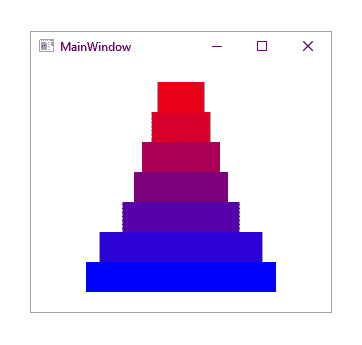

# 第七章：掌握实用动画

WPF 提供了从简单到非常复杂的广泛动画可能性。在本章中，我们将彻底探索 WPF 属性动画系统，但主要关注那些可以适用于现实世界商业应用的部分。我们将研究如何实时控制运行中的动画，并主要关注基于 XAML 的语法。然后我们将看到如何将动画直接构建到我们的应用程序框架中。

在 WPF 中，动画是通过在固定间隔内重复更改单个属性值来创建的。动画由多个组件组成：我们需要一个时间系统、一个负责更新特定类型对象值的动画对象以及一个合适的属性来进行动画化。

为了能够动画化一个属性，它必须是`DependencyObject`的依赖属性，并且其类型必须实现`IAnimatable`接口。由于大多数 UI 控件扩展了`DependencyObject`类，这使得我们可以动画化大多数控件属性。

此外，还必须存在相关类型的动画对象。在 WPF 中，动画对象也充当时间系统，因为它们扩展了`Timeline`类。在研究各种动画对象之前，让我们首先检查时间系统。

# 研究时间线

动画需要某种时间机制，负责在正确的时间更新相关属性值。在 WPF 中，这种时间机制由抽象的`Timeline`类提供，简而言之，它代表一段时间。所有可用的动画类都扩展了这个类，并添加了自己的动画功能。

当使用`Timeline`类进行动画时，会创建一个内部副本并冻结，使其不可变。此外，会创建一个`Clock`对象来保存`Timeline`对象的运行时时间状态，并负责实际的时间更新。`Timeline`对象本身除了定义相关的时间段外，几乎不做其他事情。

当我们定义`Storyboard`对象或调用`Animatable.BeginAnimation`方法之一时，`Clock`对象将自动为我们创建。请注意，我们通常不需要直接关注这些`Clock`对象，但了解它们对于理解整体情况可能有所帮助。

存在多种不同的`Timeline`对象类型，从`AnimationTimeline`类到`TimelineGroup`和`ParallelTimeline`类。然而，对于动画目的，我们主要使用`Storyboard`类，它扩展了`ParallelTimeline`和`TimelineGroup`类，并添加了动画目标属性和方法来控制时间线。让我们首先研究基类`Timeline`的主要属性。

`Duration` 属性指定由相关 `Timeline` 对象表示的时间。然而，时间线可以有重复，因此 `Duration` 属性的更准确描述可能是它指定了相关 `Timeline` 对象的单次迭代的持续时间。

`Duration` 属性的类型是 `Duration`，它包含一个 `TimeSpan` 属性，该属性包含指定持续时间值的实际时间。然而，WPF 包含一个类型转换器，它使我们能够在以下格式中指定 XAML 中的 `TimeSpan` 值，其中方括号突出显示可选部分：

```cs
Duration="[Days.]Hours:Minutes:Seconds[.FractionalSeconds]" 
Duration="[Days.]Hours:Minutes" 
```

然而，`Duration` 结构还接受除了 `TimeSpan` 持续时间之外的其他值。有一个 `Automatic` 值，这是包含其他时间线的组件时间线的默认值。在这些情况下，此值仅意味着父时间线的持续时间将与它的子时间线中最长持续时间相同。我们明确使用此值几乎没有意义。

然而，还有一个对我们非常有用的额外价值。`Duration` 结构还定义了一个表示无限时间段的 `Forever` 属性。我们可以使用这个值使动画无限期地继续，或者更准确地说，只要其相关的视图正在显示：

```cs
Duration="Forever" 
```

当 `Timeline` 对象达到其持续时间结束时，它将停止播放。如果它与任何关联的子时间线相关联，那么它们也将在此点停止播放。然而，时间线的自然持续时间可以通过其他属性进行扩展或缩短，我们将在稍后看到。

一些时间线，如 `ParallelTimeline` 和 `Storyboard` 类，能够包含其他时间线，并且可以通过设置自己的 `Duration` 属性值来影响它们的持续时间，这将覆盖子时间线设置的值。让我们通过修改 第五章 的早期动画示例，*使用正确的控件完成任务* 来演示这一点：

```cs
<Rectangle Width="0" Height="0" Fill="Orange"> 
  <Rectangle.Triggers> 
    <EventTrigger RoutedEvent="Loaded"> 
      <BeginStoryboard> 
        <Storyboard Duration="0:0:2.5"> 
          <DoubleAnimation Storyboard.TargetProperty="Width" To="300.0" 
            Duration="0:0:2.5" /> 
          <DoubleAnimation Storyboard.TargetProperty="Height" To="300.0"
            Duration="0:0:5" /> 
        </Storyboard> 
      </BeginStoryboard> 
    </EventTrigger> 
  </Rectangle.Triggers> 
</Rectangle> 
```

在这个先前的示例中，我们有一个初始尺寸设置为零的 `Rectangle` 对象。`Storyboard` 对象包含两个独立的动画对象，将动画其尺寸从零到三百像素。将动画矩形宽度的动画对象的持续时间设置为两秒半，而将动画高度的动画对象的持续时间设置为五秒。

然而，包含的 `Storyboard` 对象的持续时间是两秒半，因此这将停止两个子动画对象的时间线在两秒半后，无论它们声明的持续时间如何。这将导致动画完成后，我们的 `Rectangle` 对象将显示为一个矩形，而不是具有相等高度和宽度值的正方形。

如果我们改变了故事板的持续时间以匹配较长的子动画，或者改变了该动画持续时间以匹配较短的子动画，那么我们的动画形状将结束为一个正方形，而不是一个矩形。

调整动画元素分配的持续时间的另一种方法是设置其 `AutoReverse` 属性。实际上，将此属性设置为 `True` 通常会将 `Duration` 属性指定的长度加倍，因为时间线在完成正常的正向迭代后将以反向播放。让我们修改上一个示例中的故事板来演示这一点：

```cs
<Storyboard Duration="0:0:5"> 
  <DoubleAnimation Storyboard.TargetProperty="Width" To="300.0"  
    Duration="0:0:2.5" AutoReverse="True" /> 
  <DoubleAnimation Storyboard.TargetProperty="Height" To="300.0"  
    Duration="0:0:5" /> 
</Storyboard> 
```

现在，两个子时间线将具有相同的时间线整体持续时间，因为第一个，之前较短的时间线实际上已经加倍了长度。然而，这将导致第一个时间线将矩形的宽度动画化到三百像素，然后回到零，因此在动画完成后将不可见。此外，请注意，我们必须将父故事板持续时间设置为五秒钟，才能看到子时间线中的差异。

再次注意，设置在包含其他时间线的时间线上的属性将影响子时间线上这些属性的值。因此，在父时间线（`Storyboard` 对象）上设置 `AutoReverse` 属性为 `True` 将使子动画的总运行时间加倍；在我们的例子中，使用以下示例，矩形现在将总共动画化十秒钟：

```cs
<Storyboard Duration="0:0:5" AutoReverse="True"> 
  <DoubleAnimation Storyboard.TargetProperty="Width" To="300.0"  
    Duration="0:0:2.5" AutoReverse="True" /> 
  <DoubleAnimation Storyboard.TargetProperty="Height" To="300.0"  
    Duration="0:0:5" /> 
</Storyboard> 
```

`RepeatBehavior` 属性的类型为 `RepeatBehavior`，并且也可以影响时间线的整体持续时间。与 `AutoReverse` 属性不同，它既可以缩短整体持续时间，也可以延长它。通过使用 `RepeatBehavior` 属性，我们可以以多种方式指定值，使用不同的行为。

最简单的方法是提供一个乘数，表示我们希望将时间线的原始持续时间乘以多少次。一个现有的 XAML 类型转换器使我们能够在 XAML 中通过在计数后指定一个 `x` 来设置重复计数，如下面的示例所示。请注意，我们还可以在此处指定带有小数点的数字，包括小于一的值：

```cs
<Storyboard Duration="0:0:5" AutoReverse="True" RepeatBehavior="2x"> 
  <DoubleAnimation Storyboard.TargetProperty="Width" To="300.0"  
    Duration="0:0:2.5" AutoReverse="True" /> 
  <DoubleAnimation Storyboard.TargetProperty="Height" To="300.0"  
    Duration="0:0:5" /> 
</Storyboard> 
```

在这个例子中，正常持续时间应该是五秒钟，但 `AutoReverse` 属性被设置为 `True`，因此该持续时间被加倍。然而，`RepeatBehavior` 属性被设置为 `2x`，这将把加倍后的十秒钟乘以二十秒钟。这个乘数值为二将被存储在 `RepeatBehavior` 结构的 `Count` 属性中。

使用计数选项的另一种选择是简单地设置我们希望动画持续的时间。用于设置`Duration`属性的相同 XAML 语法也可以用于设置`RepeatBehavior`属性。同样，`RepeatBehavior`结构还定义了一个`Forever`属性，表示无限的时间段，我们可以使用这个值使动画无限期地继续。

一个可以影响动画持续时间的额外属性是`SpeedRatio`属性。这个值会乘以其他相关的持续时间属性，因此可以加快或减慢相关的时间线。让我们再次更新我们的示例，以帮助解释这个属性：

```cs
<Storyboard Duration="0:0:5" AutoReverse="True" SpeedRatio="0.5"> 
  <DoubleAnimation Storyboard.TargetProperty="Width" To="300.0"  
    Duration="0:0:2.5" AutoReverse="True" /> 
  <DoubleAnimation Storyboard.TargetProperty="Height" To="300.0"  
    Duration="0:0:5" SpeedRatio="2" /> 
</Storyboard> 
```

再次，这里的正常持续时间应该是五秒，`AutoReverse`属性设置为`True`，因此持续时间加倍。然而，`SpeedRatio`属性设置为`0.5`，因此加倍后的持续时间再次加倍，达到二十秒。请注意，`SpeedRatio`值为`0.5`表示正常速度的一半，因此是正常持续时间的两倍。

第二个子时间线也设置了`SpeedRatio`属性，但设置为`2`，因此其速度加倍，持续时间减半。由于其指定的时间是其兄弟时间线时间的一半，且其速度现在是正常速度的两倍，这起到了重新同步两个子动画的效果，因此两个维度现在作为一个正方形而不是矩形一起增长。

我们还可以使用两个与速度相关的属性来微调我们的动画：`AccelerationRatio`和`DecelerationRatio`属性。这些属性调整相关动画加速和减速所需的时间比例。虽然这种效果有时可能很微妙，但正确使用时也可以给我们的动画带来专业的触感。

这两个属性的可接受值介于零和一之间。如果同时使用这两个属性，则它们值的总和必须仍然介于零和一之间。如果违反此规则，则在运行时将抛出以下异常：

```cs
The sum of AccelerationRatio and DecelerationRatio must be less than or equal to one.
```

在这两个属性中的任何一个上输入超出可接受范围的值也会导致错误，尽管这样做将导致编译错误：

```cs
Property value must be between 0.0 and 1.0.
```

让我们看看一个示例，突出这两个属性不同值之间的差异：

```cs
<StackPanel Margin="20"> 
  <StackPanel.Triggers> 
    <EventTrigger RoutedEvent="Loaded"> 
      <BeginStoryboard> 
        <Storyboard RepeatBehavior="Forever" Duration="0:0:1.5"
          SpeedRatio="0.5" Storyboard.TargetProperty="Width">
          <DoubleAnimation Storyboard.TargetName="RectangleA"
            AccelerationRatio="1.0" From="0" To="300" />
          <DoubleAnimation Storyboard.TargetName="RectangleB"
            AccelerationRatio="0.8" DecelerationRatio="0.2" 
            From="0" To="300" /> 
          <DoubleAnimation Storyboard.TargetName="RectangleC" 
            AccelerationRatio="0.6" DecelerationRatio="0.4" 
            From="0" To="300" /> 
          <DoubleAnimation Storyboard.TargetName="RectangleD"
            AccelerationRatio="0.5" DecelerationRatio="0.5" 
            From="0" To="300" /> 
          <DoubleAnimation Storyboard.TargetName="RectangleE"
            AccelerationRatio="0.4" DecelerationRatio="0.6" 
            From="0" To="300" /> 
          <DoubleAnimation Storyboard.TargetName="RectangleF"
            AccelerationRatio="0.2" DecelerationRatio="0.8" 
            From="0" To="300" /> 
          <DoubleAnimation Storyboard.TargetName="RectangleG"
            DecelerationRatio="1.0" From="0" To="300" /> 
        </Storyboard> 
      </BeginStoryboard> 
    </EventTrigger> 
  </StackPanel.Triggers> 
  <Rectangle Name="RectangleA" Fill="#FF0000" Height="30" /> 
  <Rectangle Name="RectangleB" Fill="#D5002B" Height="30" /> 
  <Rectangle Name="RectangleC" Fill="#AB0055" Height="30" /> 
  <Rectangle Name="RectangleD" Fill="#800080" Height="30" /> 
  <Rectangle Name="RectangleE" Fill="#5500AB" Height="30" /> 
  <Rectangle Name="RectangleF" Fill="#2B00D5" Height="30" /> 
  <Rectangle Name="RectangleG" Fill="#0000FF" Height="30" /> 
</StackPanel> 
```

此代码在`StackPanel`控件中定义了多个`Rectangle`对象，每个对象都与其自己的`DoubleAnimation`元素相关联，该元素在 1.5 秒内将宽度从零增加到三百像素。

在这里，我们使用了`Storyboard.TargetName`和`Storyboard.TargetProperty`属性从单个`EventTrigger`中定位矩形，以减少前面示例中的代码量。我们将在稍后详细介绍这些附加属性，但现在，我们只需说它们用于指定要动画化的目标元素和属性。

每个动画都针对不同的矩形，并为`AccelerationRatio`和`DecelerationRatio`属性设置了不同的值。顶部矩形的动画将`AccelerationRatio`属性设置为`1.0`，而底部矩形的动画将`DecelerationRatio`属性设置为`1.0`。

介于这些矩形之间的动画具有不同的值。矩形越高，`AccelerationRatio`属性的值就越高，`DecelerationRatio`属性的值就越低；而矩形越低，`AccelerationRatio`属性的值就越低，`DecelerationRatio`属性的值就越高。

当这个示例运行时，我们可以清楚地看到各种比率值之间的差异。在每个迭代的开始附近，我们可以看到使用较高`AccelerationRatio`值的顶部矩形增长的大小不如使用较高`DecelerationRatio`值的底部矩形；然而，所有矩形在大约相同的时间内达到 300 像素：



在`Timeline`类中，另一个有用的属性是`BeginTime`属性。正如其名所示，它设置动画开始的时间；它可以被视为一个延迟时间，它相对于父级和兄弟时间轴延迟其动画的开始。

这个属性的默认值是零秒，当它被设置为正值时，延迟只在时间轴的开始处发生一次，并且不受可能设置在其上的其他属性的影响。它通常用于延迟一个或多个动画的启动，直到另一个动画完成。让我们再次调整之前的示例来演示这一点：

```cs
<Rectangle Width="0" Height="1" Fill="Orange"> 
  <Rectangle.Triggers> 
    <EventTrigger RoutedEvent="Loaded"> 
      <BeginStoryboard> 
        <Storyboard> 
          <DoubleAnimation Storyboard.TargetProperty="Width" To="300.0" 
            Duration="0:0:2" /> 
          <DoubleAnimation Storyboard.TargetProperty="Height" To="300.0" 
            Duration="0:0:2" BeginTime="0:0:2" /> 
          <DoubleAnimation Storyboard.TargetProperty="Width" To="0.0" 
            Duration="0:0:2" BeginTime="0:0:4" /> 
          <DoubleAnimation Storyboard.TargetProperty="Height" To="0.0"
            Duration="0:0:2" BeginTime="0:0:4" /> 
        </Storyboard> 
      </BeginStoryboard> 
    </EventTrigger> 
  </Rectangle.Triggers> 
</Rectangle> 
```

在这个示例中，我们有一个单像素高的矩形，其宽度向外扩展直到达到三百像素宽，然后垂直扩展直到达到三百像素高。在这一点上，其尺寸均匀减小，直到形状缩小到无。

这是通过在宽度增加动画运行时延迟最后三个动画，然后在高度增加动画运行时延迟最后两个动画来实现的。最后两个动画的`BeginTime`属性被设置为相同的值，这样它们就可以相互同步开始和运行。

最后一个非常有用的时间线属性是`FillBehavior`属性，它指定当时间线达到其总持续时间或填充周期结束时，数据绑定属性值应该发生什么。此属性的类型为`FillBehavior`，并且只有两个值。

如果我们将此属性设置为`HoldEnd`值，数据绑定属性值将保持在动画结束前刚刚达到的最终值。相反，如果我们将此属性设置为默认值`Stop`，数据绑定属性值将恢复到动画开始之前属性原有的值。让我们用一个简单的例子来说明这一点：

```cs
<StackPanel Margin="20"> 
  <StackPanel.Triggers> 
    <EventTrigger RoutedEvent="Loaded"> 
      <BeginStoryboard> 
        <Storyboard Duration="0:0:1.5" SpeedRatio="0.5"  
          Storyboard.TargetProperty="Opacity"> 
          <DoubleAnimation Storyboard.TargetName="RectangleA" To="0.0"
            FillBehavior="HoldEnd" /> 
          <DoubleAnimation Storyboard.TargetName="RectangleB" To="0.0"
            FillBehavior="Stop" /> 
        </Storyboard> 
      </BeginStoryboard> 
    </EventTrigger> 
  </StackPanel.Triggers> 
  <Rectangle Name="RectangleA" Fill="Orange" Height="100"  
    HorizontalAlignment="Stretch" Margin="0,0,0,20" /> 
  <Rectangle Name="RectangleB" Fill="Orange" Height="100"  
    HorizontalAlignment="Stretch" /> 
</StackPanel> 
```

在这个示例中，两个`FillBehavior`枚举实例之间的差异得到了清晰的展示。我们有两个大小相同的矩形，它们设置了相同的时间线来动画化它们的`Opacity`属性值，除了它们的`FillBehavior`属性值不同。

两个矩形以相同的时间从不透明淡出到不可见，但一旦两个时间线完成，将`FillBehavior`属性设置为`Stop`的矩形会立即再次变得可见，就像动画开始之前一样，而将`FillBehavior`属性设置为`HoldEnd`的另一个矩形则保持不可见，就像动画结束时一样。

虽然这涵盖了`Timeline`类直接暴露的主要属性，但还有一些属性是由扩展`Timeline`类的许多动画类声明的，这些属性对于完全理解是必不可少的。它们是`From`、`By`和`To`属性，这些属性指定了动画的起始点和结束点。

由于动画类生成属性值，因此针对不同的属性类型有不同的动画类。例如，生成`Point`值的动画类称为`PointAnimation`类，所有正常的动画类都遵循相同的命名模式，即使用相关类型的名称，形式为`<TypeName>Animation`，例如`ColorAnimation`。

正常的动画类，通常被称为`From`、`By`和`To`动画，通常需要指定两个值，尽管其中之一有时可以隐式提供。然后，相关的属性将沿着两个指定值之间的自动插值值路径进行动画化。

最常见的是使用`From`属性提供起始值，使用`To`属性提供结束值。然而，我们也可以指定一个单一的起始值、结束值或偏移值，第二个值将取自动画属性的当前值。我们可以使用`By`属性设置偏移值，这表示属性值将在整个持续时间内的确切变化量。

为这些不同的属性指定值可以对最终动画产生截然不同的效果。仅使用`From`属性将使动画从所需值开始，并动画化该属性，直到它达到属性的基本值。

仅使用`To`属性将使属性从其当前值开始动画化，并结束在指定的值。仅使用`By`属性将使属性从其当前值动画化，直到该值与指定的偏移量之和达到。

这三个属性的组合可以用来针对正确的属性值范围。设置`From`和`By`属性将使动画从`From`属性指定的值开始，并动画化该属性，直到达到`By`属性指定的偏移量。

同时设置`From`和`To`属性将使动画从`From`属性指定的值开始，并动画化该属性，直到达到`To`属性指定的值。由于`By`和`To`属性都指定了动画的结束值，如果它们都设置在动画元素上，则`By`属性指定的值将被忽略。

当这些更常见的动画使用一个或两个`From`、`By`和`To`属性组合来指定要动画化的相关属性的值范围时，还有另一种指定目标值的方法。现在让我们来看看关键帧动画。

# 引入关键帧

关键帧动画使我们能够执行一些使用`From`、`By`和`To`动画无法做到的事情。与那些动画不同，使用关键帧动画，我们能够指定超过两个目标值，并以离散的步骤动画化通常无法动画化的对象。因此，`<TypeName>AnimationUsingKeyFrames`类的数量比`<TypeName>Animation`类多，例如：`RectAnimationUsingKeyFrames`、`SizeAnimationUsingKeyFrames`。

每个`<TypeName>AnimationUsingKeyFrames`类都有一个`KeyFrames`属性，我们通过填充关键帧来指定动画过程中必须传递的各种值。每个关键帧都有一个`KeyTime`和`Value`属性，用于指定值和应达到的相对时间。

如果没有声明带有零秒关键时间的键帧，动画将从相关属性的当前值开始。动画将根据其`KeyTime`属性的值对关键帧进行排序，而不是它们声明的顺序，并根据它们的插值方法在各个值之间创建过渡，我们稍后会了解到这一点。

注意，`KeyTime`属性是`KeyTime`类型，这使我们能够使用除`TimeSpan`值以外的类型设置它。我们还可以指定百分比值，这些值确定每个关键帧将分配的指定动画持续时间的百分比。请注意，我们需要使用累积值，以确保最终的关键帧关键时间值始终为`100%`。

或者，我们可以使用一些特殊的值。当我们想要一个具有恒定速度的动画，无论指定的值如何，我们都可以为每个关键帧指定`Paced`值。这会在将它们分配到父时间线的持续时间之前，考虑每个关键帧值之间的变化，从而创建一个平滑、均匀的过渡。

与此方法相反，我们还可以为每个关键帧指定`Uniform`值，这基本上会在父动画的持续时间内在关键帧之间均匀分配。为此，它只需计算关键帧的数量，并将该数量除以总持续时间长度，这样每个关键帧将持续相同的时间。

对于不同的`<TypeName>AnimationUsingKeyFrames`类，存在不同种类的关键帧，也使用了不同的插值方法。这些关键帧的命名约定遵循格式`<插值方法><TypeName>KeyFrame`，例如：`LinearDoubleKeyFrame`。

有三种插值方法。第一种是`Discrete`，它不执行插值，只是从一个值跳到另一个值。这种方法对于设置`bool`或`object`值很有用。

下一种方法是`Linear`，它在关键帧的值和前一个关键帧的值之间执行线性插值。这意味着动画看起来将是平滑的，但如果你的关键帧时间不均匀分布，动画速度会加快和减慢。

最后也是最复杂的一种插值方法是`Spline`，但它也提供了对动画时间控制的最大灵活性。它添加了一个名为`KeySpline`的额外属性，使我们能够指定一个从`0.0,0.0`延伸到`1.0,1.0`的贝塞尔曲线上的两个控制点。第一个控制点影响曲线的前半部分，而第二个点影响后半部分。

使用这两个控制点，我们可以调整动画在其持续时间内的速度。例如，将第一个控制点设置为`0.0,1.0`并将第二个设置为`1.0,0.0`将导致原始线性曲线的最大扭曲，并导致动画迅速加速，然后在中间几乎停止，然后在结束时再次急剧加速。

通过这两个点，我们可以完全控制每对关键帧值之间值变化的速率。这种插值类型在尝试创建更逼真的动画时非常有用。请注意，我们可以在每个关键帧动画内部自由混合和匹配不同的插值方法的关键帧。

例如，如果我们想动画化一个`Point`元素，在这种情况下我们需要使用`PointAnimationUsingKeyFrames`类，然后我们可以选择代表不同插值方法的关键帧类。在这个例子中，我们可以使用`DiscretePointKeyFrame`、`LinearPointKeyFrame`和`SplinePointKeyFrame`类的任何组合。

注意，由于`KeyFrames`属性被设置为`ContentPropertyAttribute`属性中的`name`输入参数，该属性是每个`<TypeName>AnimationUsingKeyFrames`类中声明的类签名的一部分，因此我们不需要在 XAML 中显式声明这个属性，可以直接在这些元素内部声明各种关键帧，如下面的代码所示：

```cs
<Ellipse Width="100" Height="100" Stroke="Black" StrokeThickness="3"> 
  <Ellipse.Fill> 
    <RadialGradientBrush> 
      <GradientStop Color="Yellow" Offset="0" /> 
      <GradientStop Color="Orange" Offset="1" /> 
    </RadialGradientBrush> 
  </Ellipse.Fill> 
  <Ellipse.Triggers> 
    <EventTrigger RoutedEvent="Loaded"> 
      <BeginStoryboard> 
        <Storyboard RepeatBehavior="Forever"  
          Storyboard.TargetProperty="Fill.GradientOrigin"> 
          <PointAnimationUsingKeyFrames> 
            <DiscretePointKeyFrame Value="0.5, 0.5" KeyTime="0:0:0" /> 
            <LinearPointKeyFrame Value="1.0, 1.0" KeyTime="0:0:2" /> 
            <SplinePointKeyFrame KeySpline="0,0.25 0.75,0" Value="1.0, 0.0"
              KeyTime="0:0:4" /> 
            <LinearPointKeyFrame Value="0.0, 0.0" KeyTime="0:0:5" /> 
            <SplinePointKeyFrame KeySpline="0,0.75 0.25,0" Value="0.5, 0.5"
              KeyTime="0:0:8" /> 
          </PointAnimationUsingKeyFrames> 
        </Storyboard> 
      </BeginStoryboard> 
    </EventTrigger> 
  </Ellipse.Triggers> 
</Ellipse> 
```

在这个例子中，我们声明了一个`Ellipse`形状，其`Fill`属性设置为`RadialGradientBrush`类的实例。这个画刷中心是黄色，边缘是橙色。请注意，这些画刷有一个名为`GradientOrigin`的属性，它指定了渐变的中心点，默认值为点`0.5,0.5`。在这个例子中，我们动画化了这个属性，这相当于在 3D 球体周围移动光源的效果：


我们使用一个带有`Loaded`事件的`EventTrigger`来启动我们的动画，并将关联的故事板的`RepeatBehavior`属性设置为`Forever`。正如之前提到的，我们将`TargetProperty`属性设置为画刷的`GradientOrigin`属性，该画刷被设置为`Fill`属性。

在故事板内部，我们声明了一个`PointAnimationUsingKeyFrames`元素，并且直接在其内部，我们声明了多个不同类型的`<InterpolationMethod><Type>KeyFrame`对象。正如之前提到的，我们不需要显式声明`KeyFrames`属性，就可以在它内部声明这些关键帧元素。

注意，这里使用的`DiscretePointKeyFrame`元素完全是可选的，如果移除它，也不会有任何变化。这是因为点`0.5,0.5`既是动画的起始值也是渐变画刷的默认值，同时也是动画的结束值。此外，如果我们省略一个零时间的关键帧，系统会隐式地为我们添加一个具有该值的关键帧。

接下来，我们声明一个`LinearPointKeyFrame`元素，它将以线性、均匀的方式将渐变中心从点`0.5,0.5`动画化到点`1.0,1.0`。随后，我们有一个`SplinePointKeyFrame`元素，它将渐变中心从上一个点动画化到点`1.0,0.0`。注意`KeySpline`属性，它调整动画过程中的速度。

从那里，我们使用另一个`LinearPointKeyFrame`元素，在一秒钟内平滑且均匀地过渡到点`0.0,0.0`。最后，我们使用第二个`SplinePointKeyFrame`元素来将渐变起点动画化回圆的中心及其起始位置，占用总持续时间的最后三秒。

当这个示例运行时，我们可以清楚地看到它在这两个`LinearPointKeyFrame`元素期间均匀地动画化渐变起点，并在两个`SplinePointKeyFrame`元素期间改变速度。

# 讲述故事

虽然扩展`Timeline`类的各种动画类可以直接在代码中动画化控件属性，但为了仅使用 XAML 声明和触发动画，我们需要使用`Storyboard`类。这被称为容器时间线，因为它扩展了抽象的`TimelineGroup`类，这使得它能够包含子时间线。

`Storyboard`类扩展的另一个容器时间线类是`ParallelTimeline`类，这些类使我们能够对子时间线进行分组，并作为一组设置它们的属性。当创建更复杂的动画时，如果我们只需要延迟一组子时间线的开始，我们应该使用`ParallelTimeline`类而不是`Storyboard`类，因为它更高效。

我们可以将之前的`BeginTime`示例重写为使用`ParallelTimeline`元素来延迟最后两个时间线的开始。让我们看看它可能是什么样子：

```cs
<Storyboard> 
  <DoubleAnimation Storyboard.TargetProperty="Width" To="300.0"  
    Duration="0:0:2" /> 
  <DoubleAnimation Storyboard.TargetProperty="Height" To="300.0"  
    Duration="0:0:2" BeginTime="0:0:2" /> 
  <ParallelTimeline BeginTime="0:0:4"> 
    <DoubleAnimation Storyboard.TargetProperty="Width" To="0.0"  
      Duration="0:0:2" /> 
    <DoubleAnimation Storyboard.TargetProperty="Height" To="0.0"  
      Duration="0:0:2" /> 
  </ParallelTimeline> 
</Storyboard> 
```

由于`Storyboard`类是一个`Timeline`对象，它也具有各种动画对象相同的属性。它从`ParallelTimeline`类继承的一个额外属性是`SlipBehavior`属性。这个属性只有在我们要将动画时间线与`MediaTimeline`元素的播放同步时才真正有用，但了解这一点是值得的。

这个属性是枚举类型`SlipBehavior`，它只有两个成员。`Grow`的值表示我们不需要我们的动画时间线与我们的媒体时间线同步，并且是这个属性的默认值。

相反，`Slip`的值表示我们希望在必要时使我们的动画时间线向前或向后滑动，以保持它们与播放的媒体同步。如果使用此设置时媒体需要时间来加载，那么故事板中的动画时间线将等待媒体准备好，并在该点继续。

除了从各种基类继承的属性外，`Storyboard`类还声明了三个重要的附加属性，这些属性对于将动画定位到单个 UI 元素及其属性至关重要。

`Storyboard.Target`附加属性指定了应该被动画化的 UI 控件，尽管仅设置此属性是不够的，因为它没有指定目标属性。此属性的类型为`object`，尽管它只能与类型为`DependencyObject`的对象一起使用。

为了使用这个属性，我们需要指定一个绑定路径，该路径引用目标 UI 控件。如果目标元素扩展了`FrameworkElement`或`FrameworkContentElement`类，那么一种方法是为目标元素命名，并使用`ElementName`绑定来引用它：

```cs
Storyboard.Target="{Binding ElementName=TargetControlName}" 
```

大多数 UI 元素扩展了声明了`Name`属性的这两个类之一。然而，如果我们为目标控件提供了一个名称，那么有一个更简单的方式来针对它。我们不需要使用`Storyboard.Target`属性，而是可以使用`Storyboard.TargetName`附加属性，仅通过它们声明的名称来指定目标元素，而不需要任何绑定：

```cs
Storyboard.TargetName="TargetControlName" 
```

我们并不总是需要指定这个属性值，因为有时目标元素可以隐式地确定。如果相关的故事板是通过`BeginStoryboard`元素启动的，那么声明它的 UI 元素将被针对。另外，如果相关的故事板是另一个时间线的子项，那么父时间线的目标将被继承。

`Storyboard`类声明的最重要的属性是`TargetProperty`附加属性。我们使用这个属性来指定我们想在目标元素上动画化的属性。请注意，为了使这生效，目标属性必须是一个依赖属性。

有时，我们可能需要针对之前提到的框架类中任何一个都没有扩展的对象；在 WPF 中，我们同样能够针对扩展了`Freezable`类的可冻结类。为了在 XAML 中针对这些类之一，我们需要使用`x:Name`指令来指定对象名称，因为它们没有`Name`属性。

作为旁注，WPF 类如果声明了自己的`Name`属性，实际上会通过`x:Name`指令映射名称值，这是 XAML 规范的一部分。在这些情况下，我们可以自由使用这两个中的任何一个来为元素注册名称，但我们不能同时设置两个。

注意，无名称的元素仍然可以被我们的动画引用，尽管它们需要间接引用。我们不是直接引用它们，而是需要指定父属性或可冻结对象的名称，然后在`TargetProperty`附加属性中链式调用属性，直到达到所需的元素。我们在上一节的最后一个示例中使用了这种方法：

```cs
Storyboard.TargetProperty="Fill.GradientOrigin" 
```

在这个例子中，我们引用了 `Fill` 属性，它属于 `RadialGradientBrush` 类型，然后从那里链接到画刷的 `GradientOrigin` 属性。请注意，如果我们在这里使用 `SolidColorBrush` 类的实例而不是这个，这个引用将会失败，因为那个画刷中没有 `GradientOrigin` 属性。然而，尽管动画无法工作，这不会引发任何错误。

# 控制故事板

为了在 XAML 中开始一个故事板，我们需要使用一个 `BeginStoryboard` 元素。这个类扩展了 `TriggerAction` 类，如果你还记得，那就是我们在 `EventTrigger` 类的 `TriggerActionCollection` 以及 `TriggerBase.EnterActions` 和 `TriggerBase.ExitActions` 属性中需要使用的类型。

我们通过将 `Storyboard` 属性设置为代码中的 `Storyboard` 属性来指定要使用的 storyboard。当使用 XAML 时，`Storyboard` 属性隐式设置为在 `BeginStoryboard` 元素内声明的 storyboard。

`BeginStoryboard` 动作负责将动画时间线与动画目标及其目标属性连接起来，并且还负责在其故事板内启动各种动画时间线。它是通过调用关联的 `Storyboard` 对象的 `Begin` 方法来做到这一点的，一旦其父级的触发条件得到满足。

如果一个已经运行的故事板被要求再次开始，无论是通过 `BeginStoryboard` 动作间接地，还是通过 `Begin` 方法直接地，所发生的情况将取决于 `HandoffBehavior` 属性设置的值。

这个属性是枚举类型 `HandoffBehavior`，有两个值。默认值是 `SnapshotAndReplace`，这将重新启动内部时钟，本质上具有用另一个时间线替换一个时间线的效果。另一个值更有趣：`Compose` 值将在重新启动动画时保留原始时钟，并在当前动画之后附加新的动画，在它们之间执行一些插值，从而实现更平滑的连接。

这种方法的一个问题是保留的时钟将继续使用系统资源，如果处理不当，这可能会导致内存问题。然而，这种方法产生的动画更加平滑、自然和流畅，这可能值得额外的资源。这最好用一个小的例子来演示：

```cs
<Canvas> 
  <Rectangle Canvas.Top="200" Canvas.Left="25" Width="100" Height="100"  
    Fill="Orange" Stroke="Black" StrokeThickness="3"> 
    <Rectangle.Style> 
      <Style TargetType="{x:Type Rectangle}"> 
        <Style.Triggers> 
          <Trigger Property="IsMouseOver" Value="True"> 
            <Trigger.EnterActions> 
              <BeginStoryboard> 
                <Storyboard> 
                  <DoubleAnimation Duration="0:0:2"
                    Storyboard.TargetProperty="(Canvas.Top)" To="0" /> 
                </Storyboard> 
              </BeginStoryboard> 
            </Trigger.EnterActions> 
            <Trigger.ExitActions> 
              <BeginStoryboard> 
                <Storyboard> 
                  <DoubleAnimation Duration="0:0:2"
                    Storyboard.TargetProperty="(Canvas.Top)" To="200" /> 
                </Storyboard> 
              </BeginStoryboard> 
            </Trigger.ExitActions> 
          </Trigger> 
        </Style.Triggers> 
      </Style> 
    </Rectangle.Style> 
  </Rectangle> 
  <Rectangle Canvas.Top="200" Canvas.Left="150" Width="100" Height="100"  
    Fill="Orange" Stroke="Black" StrokeThickness="3"> 
    <Rectangle.Style> 
      <Style TargetType="{x:Type Rectangle}"> 
        <Style.Triggers> 
          <Trigger Property="IsMouseOver" Value="True"> 
            <Trigger.EnterActions> 
              <BeginStoryboard> 
                <Storyboard> 
                  <DoubleAnimation Duration="0:0:2"
                    Storyboard.TargetProperty="(Canvas.Top)" To="0" /> 
                </Storyboard> 
              </BeginStoryboard> 
            </Trigger.EnterActions> 
            <Trigger.ExitActions> 
              <BeginStoryboard HandoffBehavior="Compose"> 
                <Storyboard> 
                  <DoubleAnimation Duration="0:0:2"
                    Storyboard.TargetProperty="(Canvas.Top)" To="200" /> 
                </Storyboard> 
              </BeginStoryboard> 
            </Trigger.ExitActions> 
          </Trigger> 
        </Style.Triggers> 
      </Style> 
    </Rectangle.Style> 
  </Rectangle> 
</Canvas> 
```

在这个例子中，我们有两个矩形，每个矩形都有自己的动画。它们之间的唯一区别是，启动右侧矩形动画的 `BeginStoryboard` 元素有一个 `HandoffBehavior` 的值为 `Compose`，而另一个使用默认值 `SnapshotAndReplace`。

当示例运行时，当鼠标光标放置在矩形上方时，每个矩形都会向上移动；当光标从矩形上移开时，矩形会向下移动。如果我们保持鼠标光标在每个矩形的边界内，将光标移动到屏幕顶部与矩形一起，然后移开光标让矩形落下，这两个动画将看起来完全相同。

然而，如果我们把鼠标光标从一边移动到另一边，穿过两个矩形，我们将会看到两个动画之间的差异。我们会看到，当光标进入每个矩形的边界时，它们各自开始向上移动。但一旦光标离开矩形边界，我们就看到了差异。

左边的矩形，具有默认值`SnapshotAndReplace`，将停止向上移动并立即开始其向下动画，而另一个矩形将在开始向下动画之前继续向上移动一段时间。这导致两个动画之间的转换看起来更加平滑、自然。

然而，这两种交手行为的区别，最清楚地通过简单地放置鼠标光标在一个矩形上并保持在那里来演示。这样做左边的矩形会导致矩形向上移动，直到鼠标光标不再在其边界内，然后它将立即开始再次向下移动。

然而，由于鼠标光标将再次位于矩形的边界内，它将再次开始向上动画。这将导致矩形再次远离鼠标光标，因此我们将结束一个重复的行为循环，这会导致矩形在鼠标光标上方看起来像快速震动或卡顿。

另一方面，右边的矩形，具有`HandoffBehavior`的`Compose`，将向上移动直到鼠标光标不再在其边界内，但随后会继续向上移动一段时间，然后开始向下移动。这再次创建了一个远更平滑的动画，并将导致矩形在鼠标光标上方轻轻弹跳，与另一个卡顿的矩形形成鲜明对比。

有几个相关的`TriggerAction`派生类，它们以单词`Storyboard`结尾，使我们能够控制相关`Storyboard`元素的各种方面。通过在其它动作的`BeginStoryboardName`属性中指定`BeginStoryboard`元素的`Name`属性值，我们能够进一步控制正在运行的 Storyboard。

我们可以使用`PauseStoryboard`元素暂停正在运行的动画故事板，使用`ResumeStoryboard`来恢复暂停的动画故事板。如果相关的动画故事板没有在运行，`PauseStoryboard`元素将不执行任何操作，同样，如果相关的动画故事板尚未暂停，`ResumeStoryboard`动作也不会执行任何操作。因此，不能使用`ResumeStoryboard`触发动作来启动动画故事板。

`StopStoryboard`动作将停止正在运行的动画故事板，但如果相关的动画故事板尚未运行，则不执行任何操作。最后，有一个`RemoveStoryboard`触发动作，当其父级触发条件满足时，将移除动画故事板。由于动画故事板消耗资源，当它们不再需要时，我们应该移除它们。

例如，如果我们使用带有`Loaded`事件的`EventTrigger`来启动一个其`RepeatBehavior`属性设置为`Forever`的时间线，那么我们应该在`Unloaded`事件中使用另一个带有`RemoveStoryboard`动作的`EventTrigger`元素来移除动画故事板。这有点类似于在`IDisposable`实现上调用`Dispose`方法。

注意，删除由`BeginStoryboard`动作启动的动画故事板非常重要，其`HandoffBehavior`属性设置为`Compose`，因为它可能会导致许多内部时钟被实例化但未释放。删除动画故事板还将导致内部使用的时钟被释放。让我们看看我们如何使用这些元素的实用示例：

```cs
<StackPanel TextElement.FontSize="14"> 
  <TextBox Text="{Binding Name, UpdateSourceTrigger=PropertyChanged}"  
    Margin="20"> 
    <TextBox.Effect> 
      <DropShadowEffect Color="Red" ShadowDepth="0" BlurRadius="0"  
        Opacity="0.5" /> 
    </TextBox.Effect> 
    <TextBox.Style> 
      <Style TargetType="{x:Type TextBox}"> 
        <Style.Triggers> 
          <DataTrigger Binding="{Binding IsValid}" Value="False"> 
            <DataTrigger.EnterActions> 
              <BeginStoryboard Name="GlowStoryboard"> 
                <Storyboard RepeatBehavior="Forever"> 
                  <DoubleAnimation Storyboard.
                    TargetProperty="Effect.(DropShadowEffect.BlurRadius)"
                    To="25" Duration="0:0:1.0" AutoReverse="True" /> 
                </Storyboard> 
              </BeginStoryboard> 
            </DataTrigger.EnterActions> 
          </DataTrigger> 
          <MultiDataTrigger> 
            <MultiDataTrigger.Conditions> 
              <Condition Binding="{Binding IsValid}" Value="False" /> 
              <Condition Binding="{Binding IsFocused,  
                RelativeSource={RelativeSource Self}}" Value="True" /> 
            </MultiDataTrigger.Conditions> 
            <MultiDataTrigger.EnterActions> 
              <PauseStoryboard BeginStoryboardName="GlowStoryboard" /> 
            </MultiDataTrigger.EnterActions> 
          </MultiDataTrigger> 
          <Trigger Property="IsFocused" Value="True"> 
            <Trigger.EnterActions> 
              <PauseStoryboard BeginStoryboardName="GlowStoryboard" /> 
            </Trigger.EnterActions> 
            <Trigger.ExitActions> 
              <ResumeStoryboard BeginStoryboardName="GlowStoryboard" /> 
            </Trigger.ExitActions> 
          </Trigger> 
          <DataTrigger Binding="{Binding IsValid}" Value="True"> 
            <DataTrigger.EnterActions> 
              <StopStoryboard BeginStoryboardName="GlowStoryboard" /> 
            </DataTrigger.EnterActions> 
          </DataTrigger> 
          <EventTrigger RoutedEvent="Unloaded"> 
            <EventTrigger.Actions> 
              <RemoveStoryboard BeginStoryboardName="GlowStoryboard" />
            </EventTrigger.Actions> 
          </EventTrigger> 
        </Style.Triggers> 
      </Style> 
    </TextBox.Style> 
  </TextBox> 
  <TextBox Margin="20 0" /> 
</StackPanel> 
```

此示例有两个文本框，下方的文本框仅用于使我们能够从第一个文本框中移除焦点。第一个文本框绑定到我们的视图模型中的`Name`属性。让我们假设我们有一些验证代码，当`Name`属性发生变化时，它将更新一个名为`IsValid`的属性。我们将在第九章中深入探讨验证，*实现响应式数据验证*，但现在让我们保持简单：

```cs
private string name = string.Empty; 
private bool isValid = false;

... 

public string Name 
{ 
  get { return name; } 
  set 
  { 
    if (name != value) 
    { 
      name = value; 
      NotifyPropertyChanged(); 
      IsValid = name.Length > 2; 
    } 
  } 
} 

public bool IsValid 
{ 
  get { return isValid; } 
  set { if (isValid != value) { isValid = value;
    NotifyPropertyChanged(); } } 
} 
```

在这里，我们只是验证`Name`属性是否有三个或更多字符的值。在这个例子中的基本思想是，我们有一个动画，突出显示特定表单字段需要有效值的事实。

这可能是一个抖动，或者表单字段的增长和缩小，或者相邻元素的动画，但在我们的情况下，我们使用了一个`DropShadowEffect`元素来创建围绕它的发光效果。

在我们风格的`Triggers`集合中，我们声明了多个触发器。第一个是一个`DataTrigger`，它将数据绑定到视图模型中的`IsValid`属性，并使用名为`GlowStoryboard`的`BeginStoryboard`触发动作元素来使文本框周围的发光效果在属性值为`false`时增长和缩小。

虽然动画在吸引眼球方面很出色，但它们也可能相当分散注意力。暂时跳过`MultiDataTrigger`，因此当文本框获得焦点时，我们的动画将暂停，以便用户可以不受干扰地输入详细信息。我们通过在触发器中声明一个带有`IsFocused`属性为`true`条件的`PauseStoryboard`动作来实现这一点。

使用触发器的`EnterActions`集合确保当`IsFocused`属性设置为`true`时运行`PauseStoryboard`动作。在触发器的`ExitActions`集合中声明`ResumeStoryboard`动作确保当`IsFocused`属性设置为`false`时运行，换句话说，当控件失去焦点时。

当用户输入一个值时，我们的视图模型验证提供的值是否确实有效，如果是这样，它将`IsValid`属性设置为`true`。在我们的例子中，我们只是验证输入的字符串是否包含三个或更多字符，以便它是有效的。将`UpdateSourceTrigger`属性设置为`PropertyChanged`确保了每次按键时都会进行验证。

我们的例子使用`DataTrigger`来数据绑定到这个属性，当它为`true`时，它触发`StopStoryboard`动作，停止故事板继续运行。由于我们的故事板的`FillBehavior`属性没有明确设置，它将默认为`Stop`值，动画属性值将返回到动画之前拥有的原始值。

*然而，如果用户输入了三个或更多字符然后删除它们会发生什么？* 数据触发器将触发`StopStoryboard`动作，并停止故事板。随着字符的删除和`IsValid`属性被设置为`false`，第一个`DataTrigger`的条件将触发初始的`BeginStoryboard`动作，再次启动故事板。

但这将在文本框仍然获得焦点且效果上的动画不应运行时发生。这就是我们之前跳过的`MultiDataTrigger`元素的原因。在这个触发器中，我们有两个条件。一个是`IsFocused`属性应该是`true`，仅为此，我们本可以使用一个`MultiTrigger`。

然而，另一个条件要求我们将数据绑定到视图模型的`IsValid`属性，为此，我们需要使用`MultiDataTrigger`元素。因此，当文本框获得焦点并且数据绑定的值变为无效时，或者换句话说，当用户删除第三个字符时，这个触发器将运行其`PauseStoryboard`动作。

触发器按照在 XAML 中声明的顺序从上到下进行评估，并且当用户删除第三个字符时，第一个触发器开始动画。`MultiDataTrigger`必须在第一个触发器之后声明，这样故事板就会在暂停之前开始。在这种情况下，当用户将焦点从第一个文本框移开时，所需的辉光效果将再次开始。

最后，这个示例演示了我们可以如何使用`RemoveStoryboard`触发动作在不再需要故事板时将其移除，从而释放其资源。通常的做法是利用相关控制的`Unloaded`事件中的`EventTrigger`来完成此操作。

虽然这些是控制其相关故事板元素运行状态的唯一触发动作元素，但还有另外三个动作可以控制故事板的其它方面或设置其它属性。

`SetStoryboardSpeedRatio`触发动作可以设置相关故事板的`SpeedRatio`。我们在其`SpeedRatio`属性中指定所需的比率，并在满足动作的相关触发条件时应用此值。请注意，此元素只能作用于已经启动的故事板，尽管它可以在这一点之后任何时候工作。

`SkipStoryboardToFill`触发动作将故事板的当前位置移动到其填充周期，如果有的话。记住，`FillBehavior`属性决定了填充周期期间应该发生什么。如果故事板有子时间轴，那么它们的当前位置也将在此点前移到它们的填充周期。

最后但同样重要的是，存在一个`SeekStoryboard`触发动作，它使我们能够将故事板的当前位置移动到相对于由`Origin`属性指定的位置的某个位置，该属性的默认开始时间为零秒。在声明`SeekStoryboard`动作时，我们在`Offset`属性中指定所需的查找位置，并可选择设置`Origin`属性。

`Offset`属性是`TimeSpan`类型，我们可以在 XAML 中使用前面突出显示的时间表示法来指定其值。`Origin`属性是`TimeSeekOrigin`类型，我们可以指定两个值之一。

首先是`BeginTime`的默认值，它将时间轴的起点定位在时间轴的开始处，而第二个是`Duration`，它将时间轴定位在自然持续时间的单个迭代结束时。请注意，在遍历时间轴持续时间时，不会考虑各种速度比值的设置。

这就完成了我们对可以使用来控制故事板的触发动作范围的探讨。这些触发动作中的每一个在满足其相关触发条件时都会在`Storyboard`类中调用相应的方法。

# 缓动函数

当使用 WPF 声明动画时，我们能够利用一种强大的功能，帮助我们定义更专业的动画。虽然我们通常为动画提供起始值和结束值，让 WPF 插值中间值，但有一种方法可以影响这个插值过程。

有许多数学函数提供了复杂的动画路径，被称为缓动函数。例如，这些可以精确地复制弹簧的运动或球体的弹跳。

我们可以在动画的`EasingFunction`属性中简单地声明适当的缓动函数。每个缓动函数都扩展了`EasingFunctionBase`类，并具有其特定的属性。例如，`BounceEase`元素提供了`Bounces`和`Bounciness`属性，而`ElasticEase`类声明了`Oscillations`和`Springiness`属性。

所有缓动函数都从基类继承了`EasingMode`属性。这个属性是枚举类型`EasingMode`，并提供了三个选项。`EaseIn`选项遵循与每个缓动函数相关的正常数学公式。`EaseOut`选项使用数学公式的逆。

`EaseInOut`选项在第一半使用标准公式，在第二半使用逆公式。虽然不是严格正确，但可以大致理解为`EaseIn`影响动画的开始，`EaseOut`影响动画的结束，而`EaseInOut`则影响动画的开始和结束。让我们通过一个弹跳球动画的例子来展示这个功能：

```cs
<Canvas> 
  <Ellipse Width="50" Height="50" Fill="Orange" Stroke="Black"  
    StrokeThickness="3"> 
    <Ellipse.Triggers> 
      <EventTrigger RoutedEvent="Loaded"> 
        <BeginStoryboard> 
          <Storyboard RepeatBehavior="Forever"> 
            <Storyboard Storyboard.TargetProperty="(Canvas.Top)"> 
              <DoubleAnimation Duration="00:00:3" From="0" To="200"> 
                <DoubleAnimation.EasingFunction> 
                  <BounceEase EasingMode="EaseOut" Bounces="10" 
                    Bounciness="1.5" /> 
                </DoubleAnimation.EasingFunction> 
              </DoubleAnimation> 
            </Storyboard> 
            <Storyboard Storyboard.TargetProperty="(Canvas.Left)"> 
              <DoubleAnimation Duration="00:00:3.5" From="0" To="200"
                DecelerationRatio="0.2" /> 
            </Storyboard> 
          </Storyboard> 
        </BeginStoryboard> 
      </EventTrigger> 
    </Ellipse.Triggers> 
  </Ellipse> 
  <Line Canvas.Top="250" Canvas.Left="25" X1="0" Y1="1.5" X2="225" Y2="1.5"
    Stroke="Black" StrokeThickness="3" /> 
</Canvas> 
```

在这里，我们有一个包含两个形状的`Canvas`面板：一个椭圆和一个线条。线条只是为了让人们有地面的印象。`Ellipse`元素定义了一些基本的外观属性，然后是一个`EventTrigger`元素，当形状对象加载时启动我们的缓动动画。我们有一个设置为无限重复的外部`Storyboard`元素，它包含两个内部故事板。

这些内部故事板中的第一个使用`Storyboard.TargetProperty`针对`Canvas.Top`附加属性，而第二个则针对其`Canvas.Left`附加属性。请注意，我们在这里不需要指定`Storyboard.Target`属性值，因为故事板位于目标元素内，这将隐式地设置为我们的目标。此外，请记住，为了使其生效，我们需要用方括号将附加属性名称及其类名称括起来。

第一个故事板负责我们球体的垂直运动，因此这是我们想要使用`BounceEase`函数的动画。为了利用这个功能，我们只需在`DoubleAnimation.EasingFunction`属性中声明`BounceEase`对象，并设置所需的属性值。

`Bounces`属性决定了球应该弹跳多少次，或者从动画的下限反弹多少次。请注意，这不包括这个缓动函数将执行的最终半弹跳。`Bounciness`属性指定了球的弹跳程度。奇怪的是，这个值越高，球的弹跳性就越小。此外，请注意这个值必须是正数。

由于物理学决定球的水平速度在大多数情况下应该保持恒定，我们不需要对第二个动画应用缓动函数。相反，我们为其`DecelerationRatio`属性添加了一个小值，这很好地模拟了球侧面的摩擦力。

如所见，利用这些数学公式来大大增加动画的运动是非常容易的。虽然这本书中没有足够的空间让我们涵盖所有这些缓动函数，但自己调查它们是非常值得的。让我们看看另一个例子，看看我们如何使用`ElasticEase`类来模拟弹簧的运动：

```cs
<Rectangle Canvas.Top="250" Canvas.Left="25" Width="25" Height="50"  
  Fill="Orange" Stroke="Black" StrokeThickness="3"> 
  <Rectangle.Triggers> 
    <EventTrigger RoutedEvent="Loaded"> 
      <BeginStoryboard> 
        <Storyboard RepeatBehavior="Forever"> 
          <Storyboard Storyboard.TargetProperty="Height"> 
            <DoubleAnimation Duration="00:00:3" From="50" To="200"> 
              <DoubleAnimation.EasingFunction> 
                <ElasticEase EasingMode="EaseOut" Oscillations="6" 
                  Springiness="2" /> 
              </DoubleAnimation.EasingFunction> 
            </DoubleAnimation> 
          </Storyboard> 
        </Storyboard> 
      </BeginStoryboard> 
    </EventTrigger> 
  </Rectangle.Triggers> 
</Rectangle> 
```

在这个例子中，我们有一个细长的`Rectangle`元素，使用`ElasticEase`函数模拟弹簧的运动。`Oscillations`属性指定了矩形在动画效果的生命周期内将增长和收缩的次数，而`Springiness`属性决定了弹簧的刚度，其中较大的值等于更大的弹力。

虽然这两个演示的缓动函数相当专业，不适用于许多情况，但剩余的大多数函数都是标准圆形、指数曲线或使用公式 *f(t) = t^n* 的曲线的变体，其中 *n* 要么由所使用的确切缓动函数确定，要么由`PowerEase`函数的`Power`属性确定。

例如，`QuadraticEase`函数使用公式 *f(t) = t²*，`CubicEase`函数使用公式 *f(t) = t³*，`QuarticEase`函数使用公式 *f(t) = t⁴*，`QuinticEase`函数使用公式 *f(t) = t⁵*，而`PowerEase`函数使用公式 *f(t) = t^n*，其中 *n* 由其`Power`属性确定。

除了这些标准加速度/减速度曲线的变体之外，还有一个非常有用的缓动函数名为`BackEase`。它根据`EasingMode`属性的值，会超出其起始或结束的`From`或`To`值，然后反转回它。这是更可用的缓动函数之一，让我们看看一个`TextBox`元素在屏幕上滑动的例子：

```cs
<Canvas ClipToBounds="True"> 
  <TextBox Canvas.Top="50" Canvas.Left="-150" Width="150" Height="25"> 
    <TextBox.Triggers> 
      <EventTrigger RoutedEvent="Loaded"> 
        <BeginStoryboard> 
          <Storyboard Storyboard.TargetProperty="(Canvas.Left)"
            Duration="00:00:2" RepeatBehavior="Forever">
            <DoubleAnimation Duration="00:00:1" From="-150" To="50"> 
              <DoubleAnimation.EasingFunction> 
                <BackEase EasingMode="EaseOut" Amplitude="0.75" /> 
              </DoubleAnimation.EasingFunction> 
            </DoubleAnimation> 
          </Storyboard> 
        </BeginStoryboard> 
      </EventTrigger> 
    </TextBox.Triggers> 
  </TextBox> 
</Canvas> 
```

在这个例子中，我们从一个`Canvas`对象开始，其`ClipToBounds`属性设置为`true`。这确保了超出画布边界的元素将不可见。在画布内部，我们声明了一个`TextBox`控件，它最初放置在画布的完全外部，因此它是不可见的。

当控件加载时，`EventTrigger`元素将启动针对`Canvas.Left`附加属性的动画。请注意，故事板上的持续时间比动画上的持续时间长一秒，因此故事板将在动画完成后等待一秒再重新启动。这给了我们时间去欣赏应用缓动函数的效果。

动画将使文本框从其初始的离屏位置滑动到结束位置。通过使用`BackEase`函数，文本框将稍微滑动过其结束位置，然后反向回到它。它将滑过结束位置的距离由其`Amplitude`属性的值决定，更高的值会延长超调距离。

虽然我们迄今为止只讨论了使用这些缓动函数与`From`、`By`和`To`动画一起使用，但也可以将它们与关键帧动画一起使用。有一些类遵循`Easing<Type>KeyFrame`命名约定，例如`EasingColorKeyFrame`类。这些类有一个`EasingFunction`属性，使我们能够指定要使用哪个函数：

```cs
<TextBlock Text="The operation was successful" Margin="20"> 
  <TextBlock.Triggers> 
    <EventTrigger RoutedEvent="Loaded"> 
      <BeginStoryboard> 
        <Storyboard Storyboard.TargetProperty="FontSize"> 
          <DoubleAnimationUsingKeyFrames Duration="00:00:2.5"> 
            <DiscreteDoubleKeyFrame KeyTime="0:0:0" Value="8" /> 
            <EasingDoubleKeyFrame KeyTime="0:0:1" Value="36"> 
              <EasingDoubleKeyFrame.EasingFunction> 
                <BounceEase EasingMode="EaseOut" Bounces="2" 
                  Bounciness="1.5" /> 
              </EasingDoubleKeyFrame.EasingFunction> 
            </EasingDoubleKeyFrame> 
            <EasingDoubleKeyFrame KeyTime="0:0:2" Value="8"> 
              <EasingDoubleKeyFrame.EasingFunction> 
                <ElasticEase EasingMode="EaseIn" Oscillations="2" 
                  Springiness="1.5" /> 
              </EasingDoubleKeyFrame.EasingFunction> 
            </EasingDoubleKeyFrame> 
            <EasingDoubleKeyFrame KeyTime="0:0:2.5" Value="36"> 
              <EasingDoubleKeyFrame.EasingFunction> 
                <BackEase EasingMode="EaseOut" Amplitude="2" /> 
              </EasingDoubleKeyFrame.EasingFunction> 
            </EasingDoubleKeyFrame> 
          </DoubleAnimationUsingKeyFrames> 
        </Storyboard> 
      </BeginStoryboard> 
    </EventTrigger> 
  </TextBlock.Triggers> 
</TextBlock> 
```

在这个示例中，我们使用多个关键帧来动画化`TextBlock`元素中的文本大小。这创建了类似于我们在 Microsoft PowerPoint 演示文稿中的文本行上看到的过渡效果，并且可能适合用于向用户展示文本信息的应用程序。

我们首先针对`FontSize`属性，并指定总共两秒半的持续时间。我们的第一个关键帧简单地设置我们的起始字体大小为零秒，因此我们可以使用一个`DiscreteDoubleKeyFrame`。第二个关键帧是一个具有`BounceEase`缓动函数和一秒持续时间或关键时间的`EasingDoubleKeyFrame`元素。

随后，我们还有一个持续一秒的`EasingDoubleKeyFrame`元素，但这个元素使用的是`ElasticEase`函数。最后，我们用一个具有`BackEase`缓动函数和半秒持续时间的`EasingDoubleKeyFrame`元素结束。请注意，我们使用了小的`Bounces`和`Oscillations`属性值，以保持动画更易于使用。

使用这些缓动函数与关键帧一起，使我们能够将任意数量的它们串联起来，以创建更复杂的动画效果。然而，很容易过度使用并创建过于复杂的动画效果，正如在这个示例中通过增加`Bounces`和`Oscillations`属性设置的值所看到的那样。实际上，这里使用的即使是适度的值也可能被认为对于实际应用来说太多了。

# 沿路径动画

在 WPF 中还有另一种动画属性值的方法。使用`PathFigure`和`PathSegment`对象，我们可以构建一个`PathGeometry`对象，然后根据路径的`X`、`Y`和/或旋转角度值来动画化属性值。

由于这种方法主要用于沿复杂路径动画化对象，因此并不针对典型的商业应用，我们在这里只介绍这种功能的基本内容。与其他类型的动画类一样，存在不同的路径动画类型，它们操作不同的 CLR 类型。路径动画类遵循命名约定`<Type>AnimationUsingPath`。

每个`<Type>AnimationUsingPath`类都有一个`PathGeometry`属性，我们可以使用它来指定一个动画路径，使用类型为`PathGeometry`的对象。为了利用除了旋转角度之外还能动画化路径`X`和`Y`值的能力，我们需要使用一个`MatrixTransform`元素。让我们看看这个示例：

```cs
<TextBlock Margin="100,125" Text="Hello World" FontSize="18"> 
  <TextBlock.RenderTransform> 
    <MatrixTransform x:Name="MatrixTransform"> 
      <MatrixTransform.Matrix> 
        <Matrix /> 
      </MatrixTransform.Matrix> 
    </MatrixTransform> 
  </TextBlock.RenderTransform> 
  <TextBlock.Triggers> 
    <EventTrigger RoutedEvent="TextBlock.Loaded"> 
      <BeginStoryboard> 
        <Storyboard> 
          <MatrixAnimationUsingPath  
            Storyboard.TargetName="MatrixTransform"  
            Storyboard.TargetProperty="Matrix" Duration="0:0:4"  
            RepeatBehavior="Forever" DoesRotateWithTangent="True"> 
            <MatrixAnimationUsingPath.PathGeometry> 
              <PathGeometry> 
                <PathFigure StartPoint="49.99,49.99">
                  <ArcSegment Point="50,50" Size="50,50"  
                    SweepDirection="Clockwise" IsLargeArc="True" /> 
                </PathFigure> 
              </PathGeometry> 
            </MatrixAnimationUsingPath.PathGeometry> 
          </MatrixAnimationUsingPath> 
        </Storyboard> 
      </BeginStoryboard> 
    </EventTrigger> 
  </TextBlock.Triggers> 
</TextBlock> 
```

在这个示例中，我们使用`MatrixAnimationUsingPath`元素围绕圆形路径动画化一个`TextBlock`元素。圆形路径由单个`PathFigure`元素内的单个`ArcSegment`元素定义。我们将`PathFigure.StartPoint`属性的值设置为几乎与`ArcSegment.Point`值相匹配，以便椭圆的两端相遇。

为了使用`MatrixAnimationUsingPath`元素动画化文本元素的旋转，我们需要将其`DoesRotateWithTangent`属性设置为`true`。如果这个属性被设置为`false`，或者简单地省略，那么文本元素仍然会以圆形运动进行动画化，但它将不再与圆形路径的切线方向旋转，而是保持直立。

除了`MatrixAnimationUsingPath`类之外，我们还可以使用`DoubleAnimationUsingPath`或`PointAnimationUsingPath`类之一来沿路径动画化对象。然而，而不是提供这些替代方法的示例，我们现在继续了解如何将日常动画包含到我们的应用程序框架中。

# 创建日常动画

在介绍了 WPF 提供的广泛动画之后，我们可以看到许多动画都是设计来使我们能够执行模拟现实世界情况的动画，而不是在标准商业应用中动画化表单字段。因此，本章中讨论的一些技术不适合用于我们的应用程序框架。

然而，这并不意味着我们不能创建动画用于我们的日常应用。只要我们记住在商业应用中动画越少越好，我们当然可以将简单的动画构建到我们的应用程序框架中。在框架中封装这些基本动画的最好方法之一是编写一个或多个自定义动画面板。让我们看看一个简单的`StackPanel`动画示例：

```cs
using System; 
using System.Windows; 
using System.Windows.Controls; 
using System.Windows.Media; 
using System.Windows.Media.Animation; 

namespace CompanyName.ApplicationName.Views.Panels 
{ 
  public class AnimatedStackPanel : Panel 
  { 
    public static DependencyProperty OrientationProperty =  
      DependencyProperty.Register(nameof(Orientation),  
      typeof(Orientation), typeof(AnimatedStackPanel),  
      new PropertyMetadata(Orientation.Vertical)); 

    public Orientation Orientation 
    { 
      get { return (Orientation)GetValue(OrientationProperty); } 
      set { SetValue(OrientationProperty, value); } 
    } 

    protected override Size MeasureOverride(Size availableSize) 
    { 
      double x = 0, y = 0; 
      foreach (UIElement child in Children) 
      { 
        child.Measure(availableSize); 
        if (Orientation == Orientation.Horizontal) 
        { 
          x += child.DesiredSize.Width; 
          y = Math.Max(y, child.DesiredSize.Height); 
        } 
        else 
        { 
          x = Math.Max(x, child.DesiredSize.Width); 
          y += child.DesiredSize.Height; 
        } 
      } 
      return new Size(x, y); 
    } 

    protected override Size ArrangeOverride(Size finalSize) 
    { 
      Point endPosition = new Point(); 
      foreach (UIElement child in Children) 
      { 
        if (Orientation == Orientation.Horizontal)
        {
          child.Arrange(new Rect(-child.DesiredSize.Width, 0, 
            child.DesiredSize.Width, finalSize.Height));
          endPosition.X += child.DesiredSize.Width;
        }
        else
        {
          child.Arrange(new Rect(0, -child.DesiredSize.Height,
            finalSize.Width, child.DesiredSize.Height));
          endPosition.Y += child.DesiredSize.Height;
        }
        AnimatePosition(child, endPosition, 
          TimeSpan.FromMilliseconds(300));
      } 
      return finalSize; 
    } 

    private void AnimatePosition(UIElement child, Point endPosition,  
      TimeSpan animationDuration) 
    { 
      if (Orientation == Orientation. Vertical)  
        GetTranslateTransform(child).BeginAnimation( 
        TranslateTransform.YProperty, 
        new DoubleAnimation(endPosition.Y, animationDuration)); 
      else GetTranslateTransform(child).BeginAnimation( 
        TranslateTransform.XProperty,
        new DoubleAnimation(endPosition.X, animationDuration)); 
    } 

    private TranslateTransform GetTranslateTransform(UIElement child) 
    { 
      return child.RenderTransform as TranslateTransform ??  
        AddTranslateTransform(child); 
    } 

    private TranslateTransform AddTranslateTransform(UIElement child) 
    { 
      TranslateTransform translateTransform = new TranslateTransform(); 
      child.RenderTransform = translateTransform; 
      return translateTransform; 
    } 
  } 
} 
```

与所有自定义面板一样，我们只需要提供`MeasureOverride`和`ArrangeOverride`方法的实现。然而，在我们的情况下，我们想要重新创建原始`StackPanel`控件的功能，因此我们还声明了一个类型为`System.Windows.Controls.Orientation`的`Orientation`依赖属性，其默认值为`Vertical`。

在`MeasureOverride`方法中，我们遍历面板的每个子元素，调用它们的`Measure`方法，传入`availableSize`输入参数。请注意，这设置了它们的`DesiredSize`属性，直到这一点之前，它将被设置为`0,0`。

在调用每个子元素的`Measure`方法之后，我们能够使用它们的`DesiredSize`属性值来计算根据`Orientation`属性的值，正确显示渲染项目所需的总尺寸。

如果将`Orientation`属性设置为`Vertical`，我们使用`Math.Max`方法来确保我们考虑到最宽元素的尺寸；如果设置为`Horizontal`，则使用它来找到最高元素的尺寸。一旦每个子元素都被测量，并且计算出了面板的整体所需尺寸，我们就从`MeasureOverride`方法返回这个尺寸值。

在`ArrangeOverride`方法中，我们再次遍历子元素集合，但这次我们在每个子元素上调用`Arrange`方法，将每个子元素定位在面板外部，这将成为它们动画的起点。

如果将`Orientation`属性设置为`Horizontal`，我们将子元素定位在原点左侧一个子元素宽度处，并将它们的高度设置为面板的高度。如果将`Orientation`属性设置为`Vertical`，我们将它们定位在原点上方一个子元素高度处，并将它们的宽度设置为面板的宽度。

这会产生在每个面板的高度或宽度上拉伸每个项目的效果，具体取决于`Orientation`属性的值，因为整齐排列且尺寸均匀的项目比边缘不齐的项目看起来更整洁、更专业。通过这种方式，我们可以将这些决策直接构建到我们的框架控件中。

接下来，我们使用`endPosition`变量计算每个子元素动画后的期望位置，然后调用`AnimatePosition`方法，传入子元素、结束位置和动画持续时间。我们通过返回未改变的`finalSize`输入参数来结束该方法。

在`AnimatePosition`方法中，我们调用`GetTranslateTransform`方法来获取我们将用于移动每个子元素穿过面板的`TranslateTransform`对象。如果`Orientation`属性设置为`Vertical`，我们动画`TranslateTransform.YProperty`属性到`endPosition.Y`属性的值；否则，我们动画`TranslateTransform.XProperty`属性到`endPosition.X`属性的值。

为了动画化这些属性值，我们在具有要添加的属性的`UIElement`对象上使用`BeginAnimation`方法。这个方法有两个重载版本，但我们使用的是接受要动画化的依赖属性的键和动画对象的那个。另一个重载使我们能够指定与动画一起使用的`HandoffBehavior`。

对于我们的动画，我们正在使用一个`DoubleAnimation`，其构造函数接受动画的`To`值和持续时间，尽管我们还可以使用其他几个重载版本，如果我们需要指定更多的属性，例如`From`和`FillBehavior`值。

为了动画化面板中项的移动，我们需要确保它们在容器的`RenderTransform`属性上应用了`TranslateTransform`元素。记住，不同的`ItemsControl`类将使用不同的容器项，例如，`ListBox`控件将使用`ListBoxItem`容器元素。

因此，如果一个项还没有应用`TranslateTransform`元素，我们必须添加一个。一旦每个元素都有一个`TranslateTransform`元素，我们就可以使用它的`X`和`Y`属性来移动项。

在`GetTranslateTransform`方法中，我们只需从每个子项的`RenderTransform`属性中返回现有的`TranslateTransform`元素，如果存在的话，或者如果没有，就调用`AddTranslateTransform`方法来返回一个新的。在`AddTranslateTransform`方法中，我们只是初始化一个新的`TranslateTransform`元素，并将其设置为`child`输入参数的`RenderTransform`属性，然后返回它。

我们现在已经创建了一个基本的动画面板，并且只需要大约七十行代码。现在，使用我们的应用程序框架的开发者可以通过在`ItemsPanelTemplate`中指定它作为`ItemsPanel`值，简单地动画化任何`ItemsControl`或其派生集合控件中项的进入：

```cs

... 
<ListBox ItemsSource="{Binding Users}"> 
  <ListBox.ItemsPanel> 
    <ItemsPanelTemplate> 
      <Panels:AnimatedStackPanel /> 
    </ItemsPanelTemplate> 
  </ListBox.ItemsPanel> 
</ListBox> 
```

然而，我们的面板目前只提供一种类型的动画，尽管有两种可能的方向，并且仅在添加新项时工作。动画对象的退出有些复杂，因为当在数据绑定集合上调用`Remove`方法时，它们通常会被立即从面板的`Children`集合中移除。

为了实现工作的退出动画，我们需要实现一些功能。我们需要更新我们的数据模型类，为它们提供新的属性来标识它们当前处于动画的哪个阶段，并在当前状态改变时引发新的事件。

我们需要一个`IAnimatable`接口和一个为每个数据模型提供实现的`Animatable`类。让我们首先看看接口：

```cs
namespace CompanyName.ApplicationName.DataModels.Interfaces 
{ 
  public interface IAnimatable 
  { 
    Animatable Animatable { get; set; } 
  } 
} 
```

注意，在`System.Windows.Media.Animation`命名空间中已经定义了一个`Animatable`类和一个`IAnimatable`接口。虽然创建与现有类和接口同名的新类和接口可能不明智，但出于本书有限的目的，我们将使用这些名称，并注意防止冲突。

现在让我们继续前进，看看我们`Animatable`类的实现：

```cs
using System; 
using CompanyName.ApplicationName.DataModels.Enums; 
using CompanyName.ApplicationName.DataModels.Interfaces; 

namespace CompanyName.ApplicationName.DataModels 
{ 
  public class Animatable 
  { 
    private AdditionStatus additionStatus = AdditionStatus.ReadyToAnimate; 
    private RemovalStatus removalStatus = RemovalStatus.None;  
    private TransitionStatus transitionStatus = TransitionStatus.None; 
    private IAnimatable owner; 

    public Animatable(IAnimatable owner) 
    { 
      Owner = owner; 
    } 

    public Animatable() { } 

    public event EventHandler<EventArgs> OnRemovalStatusChanged;  
    public event EventHandler<EventArgs> OnTransitionStatusChanged; 

    public IAnimatable Owner 
    { 
      get { return owner; } 
      set { owner = value; } 
    } 

    public AdditionStatus AdditionStatus 
    { 
      get { return additionStatus; } 
      set { additionStatus = value; } 
    } 

    public TransitionStatus TransitionStatus 
    { 
      get { return transitionStatus; } 
      set 
      { 
        transitionStatus = value; 
        OnTransitionStatusChanged?.Invoke(this, new EventArgs()); 
      } 
    } 

    public RemovalStatus RemovalStatus 
    { 
      get { return removalStatus; } 
      set 
      { 
        removalStatus = value; 
        OnRemovalStatusChanged?.Invoke(this, new EventArgs()); 
      } 
    } 
  } 
} 
```

这个类不需要太多解释，只需注意，当`TransitionStatus`和`RemovalStatus`属性的值分别改变时，`OnTransitionStatusChanged`和`OnRemovalStatusChanged`事件会被触发，并且在这个情况下，类将自身作为`sender`输入参数传递。让我们看看在`Animatable`类中使用的三个新枚举类：

```cs
namespace CompanyName.ApplicationName.DataModels.Enums 
{ 
  public enum AdditionStatus 
  { 
    None = -1, ReadyToAnimate = 0, DoNotAnimate = 1, Added = 2 
  } 

  public enum TransitionStatus 
  { 
    None = -1, ReadyToAnimate = 0, AnimationComplete = 1 
  }

  public enum RemovalStatus 
  { 
    None = -1, ReadyToAnimate = 0, ReadyToRemove = 1 
  } 
} 
```

我们随后需要在每个我们想要动画化的数据模型类中实现这个接口：

```cs
public class User : ... , IAnimatable 
{ 
  private Animatable animatable;

  ...

  public User(Guid id, string name, int age) 
  { 
    Animatable = new Animatable(this); 
    ... 
  } 

  public Animatable Animatable 
  { 
    get { return animatable; } 
    set { animatable = value; } 
  } 

  ... 
} 
```

我们接下来需要做的是停止`Remove`方法在调用时实际移除每个项目。我们需要更新我们的`BaseCollection<T>`类，或者添加一个新的`BaseAnimatableCollection<T>`类，以便它触发动画而不是直接移除项目。以下是一个简化的例子，展示了我们可能实现这一点的几种方法之一：

```cs
using System; 
using System.Collections.Generic; 
using System.ComponentModel; 
using System.Linq; 
using CompanyName.ApplicationName.DataModels.Enums; 
using CompanyName.ApplicationName.DataModels.Interfaces; 

namespace CompanyName.ApplicationName.DataModels.Collections 
{ 
  public class BaseAnimatableCollection<T> : BaseCollection<T>  
    where T : class, IAnimatable, INotifyPropertyChanged, new() 
  { 
    private bool isAnimatable = true; 

    public BaseAnimatableCollection(IEnumerable<T> collection) 
    { 
      foreach (T item in collection) Add(item); 
    } 

    ... 

    public bool IsAnimatable  
    { 
      get { return isAnimatable; } 
      set { isAnimatable = value; } 
    } 

    public new int Count => IsAnimatable ? 
      this.Count(i => i.Animatable.RemovalStatus == RemovalStatus.None) :
      this.Count(); 

    public new void Add(T item) 
    { 
      item.Animatable.OnRemovalStatusChanged +=
        Item_OnRemovalStatusChanged; 
      item.Animatable.AdditionStatus = AdditionStatus.ReadyToAnimate; 
      base.Add(item); 
    } 

    public new virtual void Add(IEnumerable<T> collection) 
    { 
      foreach (T item in collection) Add(item); 
    } 

    public new virtual void Add(params T[] items) 
    { 
      Add(items as IEnumerable<T>); 
    } 

    public new void Insert(int index, T item) 
    { 
      item.Animatable.OnRemovalStatusChanged += 
        Item_OnRemovalStatusChanged; 
      item.Animatable.AdditionStatus = AdditionStatus.ReadyToAnimate; 
      base.Insert(index, item); 
    } 

    protected override void ClearItems() 
    { 
      foreach (T item in this) item.Animatable.OnRemovalStatusChanged -=
        Item_OnRemovalStatusChanged; 
      base.ClearItems(); 
    } 

    public new bool Remove(T item) 
    { 
      item.Animatable.RemovalStatus = RemovalStatus.ReadyToAnimate; 
      return true; 
    } 

    public void Item_OnRemovalStatusChanged(object sender, EventArgs e) 
    { 
      Animatable animatable = (Animatable)sender; 
      if (animatable.RemovalStatus == RemovalStatus.ReadyToRemove ||  
        (animatable.RemovalStatus == RemovalStatus.ReadyToAnimate && 
        !IsAnimatable)) 
      { 
        base.Remove(animatable.Owner as T); 
        animatable.RemovalStatus = RemovalStatus.None; 
      } 
    } 
  } 
} 
```

请记住，这是一个基本的例子，可以从许多方面进行改进，例如添加对`null`的检查、启用不触发动画的添加、移除和插入功能，以及添加其他有用的属性。

在这个类中，我们首先指定泛型`T`类型参数必须实现`IAnimatable`接口。正如我们其他的基础集合类一样，我们确保所有添加和插入的项目都会调用一个新的`Add`方法，该方法附加我们的动画相关处理程序。我们在构造函数中展示了这个例子，但跳过了其他构造函数声明以节省空间。

我们随后声明了一个`IsAnimatable`属性，我们可以使用这个属性来使这个集合在没有动画的情况下工作。这个属性在重写的（或`new`）`Count`属性中使用，以确保那些即将被移除的项目不会被包含在集合子项的计数中。

在新的`Add`方法中，我们将我们的`Item_OnRemovalStatusChanged`处理程序的引用附加到被添加项目的`Animatable`对象的`OnRemovalStatusChanged`事件上。然后我们将`Animatable`对象的`AdditionStatus`属性设置为`ReadyToAnimate`成员，以表示该对象已准备好开始其入场动画。

由于这个基础集合扩展了另一个基础类，我们需要记住调用它的`Add`方法，传入项目，以便它可以附加自己的处理程序来处理项目的`PropertyChanged`事件。其他`Add`重载允许将多个项目添加到集合中，但两者都内部调用第一个`Add`方法。`Insert`方法与第一个`Add`方法做相同的事情。

`ClearItems` 方法遍历集合中的每个项目，在调用基类的 `ClearItems` 方法之前，从每个项目移除对 `Item_OnRemovalStatusChanged` 处理器的引用。实际上，这个方法可以保留用于从集合中移除所有项目而不使用动画，但通过为每个项目调用 `Remove` 方法可以包括动画效果。

这个类中的 `Remove` 方法使我们能够为每个项目的退出进行动画处理；它实际上并没有从集合中移除项目，而是将项目的 `Animatable` 对象的 `RemovalStatus` 属性设置为 `ReadyToAnimate` 成员，以表示该对象已准备好开始其退出动画。然后，该方法返回 `true` 以表示成功移除项目。

最后，我们来到了 `Item_OnRemovalStatusChanged` 事件处理器，这是启用退出动画的下一个重要部分。在其中，我们将 `sender` 输入参数转换为我们的 `Animatable` 类的实例。记住，当引发事件时，它将自身作为 `sender` 参数传递。

然后，我们检查 `Animatable` 实例的 `RemovalStatus` 属性是否设置为 `ReadyToRemove` 成员，或者其 `RemovalStatus` 属性设置为 `ReadyToAnimate` 且集合不可动画化。如果任一条件为真，我们最终调用基类的 `Remove` 方法来实际从集合中移除项目并将 `RemovalStatus` 属性设置为 `None`。

以这种方式，当集合被设置为不可动画化并且调用 `Remove` 方法时，项目会立即被移除，并且在 `Item_OnRemovalStatusChanged` 处理器中将 `Animatable` 对象的 `RemovalStatus` 属性设置为 `None` 成员。如果你还记得，当 `RemovalStatus` 属性值改变时，会引发 `OnRemovalStatusChanged` 事件。

然而，我们仍然缺少这个谜题的一部分。*是什么将* `Animatable` *对象的* `RemovalStatus` *属性设置为* `ReadyToRemove` *成员以移除每个项目？* 我们需要更新我们的动画面板来完成这个任务，为此，它需要维护一个需要移除的元素集合，并在它们的退出动画完成后通知该集合移除它们：

```cs
private List<UIElement> elementsToBeRemoved = new List<UIElement>();
```

我们可以使用 `Storyboard.Completed` 事件来通知我们动画何时完成，然后通过将 `Animatable` 对象的 `RemovalStatus` 属性设置为 `ReadyToRemove` 成员，在该点发出移除项目的信号。让我们看看我们动画面板所需的更改。首先，我们需要添加以下 `using` 声明：

```cs
using System.Collections.Generic; 
using CompanyName.ApplicationName.DataModels.Enums; 
using Animatable = CompanyName.ApplicationName.DataModels.Animatable; 
using IAnimatable = 
  CompanyName.ApplicationName.DataModels.Interfaces.IAnimatable; 
```

接下来，我们需要将原始 `ArrangeOverride` 方法中的 `AnimatePosition` 方法的调用替换为以下行：

```cs
BeginAnimations(child, finalSize, endPosition); 
```

然后，我们需要在 `ArrangeOverride` 方法之后添加以下附加方法：

```cs
private void BeginAnimations(UIElement child, Size finalSize, 
  Point endPosition) 
{ 
  FrameworkElement frameworkChild = (FrameworkElement)child; 
  if (frameworkChild.DataContext is IAnimatable) 
  { 
    Animatable animatable =
      ((IAnimatable)frameworkChild.DataContext).Animatable; 
    animatable.OnRemovalStatusChanged -= Item_OnRemovalStatusChanged; 
    animatable.OnRemovalStatusChanged += Item_OnRemovalStatusChanged; 
    if (animatable.AdditionStatus == AdditionStatus.DoNotAnimate) 
    { 
      child.Arrange(new Rect(endPosition.X, endPosition.Y,  
        frameworkChild.ActualWidth, frameworkChild.ActualHeight)); 
    } 
    else if (animatable.AdditionStatus == AdditionStatus.ReadyToAnimate) 
    { 
      AnimateEntry(child, endPosition); 
      animatable.AdditionStatus = AdditionStatus.Added;  
      animatable.TransitionStatus = TransitionStatus.ReadyToAnimate; 
    } 
    else if (animatable.RemovalStatus == RemovalStatus.ReadyToAnimate)
      AnimateExit(child, endPosition, finalSize);  
    else if (animatable.TransitionStatus == 
      TransitionStatus.ReadyToAnimate) 
      AnimateTransition(child, endPosition); 
  } 
} 

private void Item_OnRemovalStatusChanged(object sender, EventArgs e) 
{ 
  if (((Animatable)sender).RemovalStatus == RemovalStatus.ReadyToAnimate)  
    InvalidateArrange(); 
} 

private void AnimateEntry(UIElement child, Point endPosition) 
{ 
  AnimatePosition(child, endPosition, TimeSpan.FromMilliseconds(300)); 
} 

private void AnimateTransition(UIElement child, Point endPosition) 
{ 
  AnimatePosition(child, endPosition, TimeSpan.FromMilliseconds(300)); 
} 

private void AnimateExit(UIElement child, Point startPosition,
  Size finalSize) 
{ 
  SetZIndex(child, 100); 
  Point endPosition = 
    new Point(startPosition.X + finalSize.Width, startPosition.Y); 
  AnimatePosition(child, startPosition, endPosition,  
    TimeSpan.FromMilliseconds(300), RemovalAnimation_Completed); 
  elementsToBeRemoved.Add(child); 
} 

private void AnimatePosition(UIElement child, Point startPosition,
  Point endPosition, TimeSpan animationDuration,
  EventHandler animationCompletedHandler) 
{ 
  if (startPosition.X != endPosition.X) 
  { 
    DoubleAnimation xAnimation = new DoubleAnimation(startPosition.X,  
      endPosition.X, animationDuration); 
    xAnimation.AccelerationRatio = 1.0; 
    if (animationCompletedHandler != null)  
      xAnimation.Completed += animationCompletedHandler; 
    GetTranslateTransform(child).BeginAnimation(
      TranslateTransform.XProperty, xAnimation); 
  } 
  if (startPosition.Y != endPosition.Y) 
  { 
    DoubleAnimation yAnimation = new DoubleAnimation(startPosition.Y,  
      endPosition.Y, animationDuration); 
    yAnimation.AccelerationRatio = 1.0; 
    if (startPosition.X == endPosition.X && animationCompletedHandler !=
      null) yAnimation.Completed += animationCompletedHandler;
    GetTranslateTransform(child).BeginAnimation( 
      TranslateTransform.YProperty, yAnimation); 
  } 
} 

private void RemovalAnimation_Completed(object sender, EventArgs e) 
{ 
  for (int index = elementsToBeRemoved.Count - 1; index >= 0; index--) 
  { 
    FrameworkElement frameworkElement =  
      elementsToBeRemoved[index] as FrameworkElement; 
    if (frameworkElement.DataContext is IAnimatable) 
    { 
      ((IAnimatable)frameworkElement.DataContext).Animatable.RemovalStatus
        = RemovalStatus.ReadyToRemove; 
      elementsToBeRemoved.Remove(frameworkElement); 
    } 
  } 
} 
```

让我们检查这段新代码。首先，我们有`BeginAnimations`方法，在这个方法中，我们将容器控件强制转换为`FrameworkElement`类型，以便我们可以访问其`DataContext`属性。我们的数据对象通过这个属性访问，并将其转换为`IAnimatable`实例，这样我们就可以通过其`Animatable`属性访问`Animatable`对象。

在重新附加之前，我们从`OnRemovalStatusChanged`事件中移除我们的`Item_OnRemovalStatusChanged`事件处理器，以确保无论每个子项通过此方法的次数如何，都只附加一个处理器。

如果`AdditionStatus`属性被设置为`DoNotAnimate`，我们将立即且无动画地安排项目到其结束位置，而如果它被设置为`ReadyToAnimate`，我们将调用`AnimateEntry`方法，然后将`AdditionStatus`属性设置为`Added`。最后，如果`RemovalStatus`属性被设置为`ReadyToAnimate`，我们将调用`AnimateExit`方法。

在`Item_OnRemovalStatusChanged`事件处理器中，如果`RemovalStatus`属性被设置为`ReadyToAnimate`，我们会调用面板的`InvalidateArrange`方法。这是退出动画策略的另一个重要部分，它请求布局系统调用`ArrangeOverride`方法，从而触发退出动画的开始。

记住，当`RemovalStatus`属性的值发生变化时，会触发`OnRemovalStatusChanged`事件。同时，回忆一下，`RemovalStatus`属性在`BaseAnimatableCollection<T>`类的`Remove`方法中被设置为`ReadyToAnimate`成员。这会引发事件，并且这个事件处理器会启动动画。

`AnimateEntry`方法简单地调用我们第一次动画尝试中的原始、未更改的`AnimatePosition`方法。`AnimateExit`方法接受一个额外的`startPosition`输入参数，它表示每个项目在面板中的当前位置。

我们首先将每个子项的`Panel.SetZIndex`附加属性设置为`100`，以确保它们的动画离开被渲染在剩余项目之上或覆盖其上。然后，我们使用起始位置和面板的大小计算动画的结束位置。

接下来，我们调用`AnimatePosition`方法的另一个重载版本，传入我们的子项、起始位置、结束位置、动画持续时间和事件处理器作为参数。在子项的位置动画开始后，我们将子项添加到`elementsToBeRemoved`集合中。

在`AnimatePosition`方法中，我们首先检查我们的起始位置和结束位置是否不同，然后创建并启动我们的`DoubleAnimation`对象。如果`X`值不同且事件处理器输入参数不是`null`，则在开始其动画之前，我们将它附加到`xAnimation`对象的`Completed`事件上。

如果`Y`值不同，并且事件处理程序输入参数不是`null`，并且事件处理程序尚未附加到`xAnimation`对象上，那么在开始其动画之前，我们将它附加到`yAnimation`对象的`Completed`事件。请注意，我们只需要将一个处理程序附加到该事件，因为我们只有一个对象需要从集合中移除。

此外，请注意，我们在本重载中设置`AccelerationRatio`属性为`1.0`，以便项目加速离开屏幕。然而，在一个商业应用程序框架中，我们希望保持我们的动画属性同步，因此，我们可能会在原始的`AnimatePosition`方法中的动画对象上也将`AccelerationRatio`属性设置为`1.0`。

最后一个拼图碎片是`RemovalAnimation_Completed`事件处理方法。当退出动画完成后，该方法会被调用，并遍历`elementsToBeRemoved`集合。如果任何要移除的元素实现了`IAnimatable`接口，则将其`Animatable`对象的`RemovalStatus`属性设置为`ReadyToRemove`成员。

如果你还记得，这会引发`OnRemovalStatusChanged`事件，该事件由`BaseAnimatableCollection`类中的`Item_OnRemovalStatusChanged`事件处理程序处理。在那个方法中，会检查`Animatable`对象的`RemovalStatus`属性中的`ReadyToRemove`成员，如果找到，则实际从集合中移除拥有该项目的项。

因此，总结一下；动画集合的`Remove`方法被调用，但不是移除项目，而是在其上设置一个属性，这会引发一个由动画面板处理的事件；面板随后开始退出动画，当动画完成后，它引发一个由集合类处理的事件，导致项目实际上被从集合中移除。

虽然这个动画面板已经完全可用，但它可以通过多种方式进一步改进。我们可以做的一件重要的事情是将所有属性和动画代码从此类中提取出来，并将它们放入一个基`AnimatedPanel`类中。这样，我们就可以在创建其他类型的动画面板时重用此类，例如`AnimatedWrapPanel`。

然后，我们可以通过公开额外的动画属性进一步扩展基类，以便我们的面板用户可以更多地控制它提供的动画。例如，我们可以声明`VerticalContentAlignment`和`HorizontalContentAlignment`属性来指定我们的面板项应在面板中如何对齐。

此外，我们可以添加`EntryAnimationDirection`和`ExitAnimationDirection`属性来指定在将面板项添加到或从面板中移除时动画的方向。我们还可以通过动画`Opacity`属性或`RotationTransform`元素的`Angle`属性来启用不同类型的动画，例如淡入或旋转。

此外，我们可以添加 `EntryAnimationDuration` 和 `ExitAnimationDuration` 属性来指定每个动画应该持续的时间长度，而不是直接将值硬编码到我们的面板中。实际上，我们使用应用程序框架面板所能提供的功能几乎没有任何限制，除了由最终用户的计算机硬件所规定的限制。

# 摘要

在本章中，我们研究了 WPF 提供的动画可能性，主要关注 XAML 和更易用的选项。我们发现了时间线的细节，还探讨了如何将动画融入我们的应用程序框架，以便用户可以轻松利用动画的力量，而无需了解任何关于动画的知识。

在下一章中，我们将探讨多种方法来改善我们应用程序的整体外观和感觉，从提供一致的应用程序样式和图标到检查创建丰富图形的多种技术。
