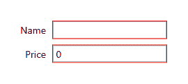
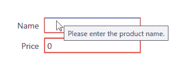
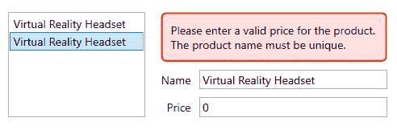
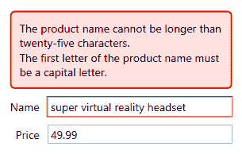
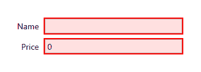
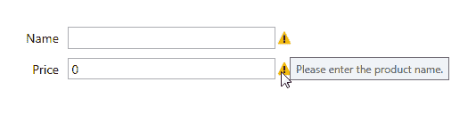
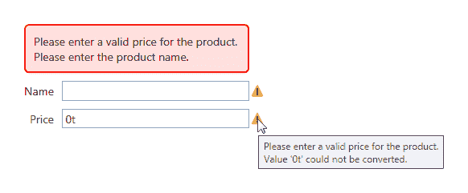
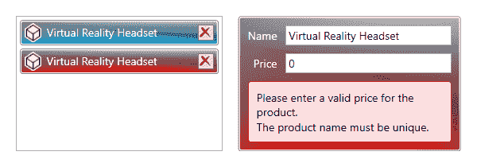
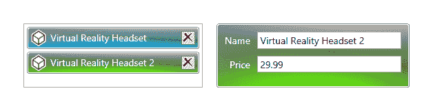
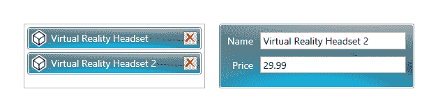

# 实现响应式数据验证

数据验证与数据输入表单密切相关，对于促进清洁、可用的数据至关重要。虽然 WPF 中的 UI 控件可以自动验证输入的值是否与它们的数据绑定属性的类型匹配，但它们无法验证输入数据的正确性。

例如，一个绑定到整数的 `TextBox` 控件如果用户输入了非数字值，可能会突出显示错误，但它不会验证输入的数字是否具有正确的位数，或者前四位数字是否适合指定的信用卡类型。

为了在使用 MVVM 时验证这些类型的数据正确性，我们需要实现 .NET 验证接口之一。在本章中，我们将详细检查可用的接口，查看多个实现，并探索 WPF 提供的其他与验证相关的功能。让我们首先看看验证系统。

在 WPF 中，验证系统很大程度上围绕静态的 `Validation` 类。这个类有几个附加属性、方法和一个附加事件，支持数据验证。每个绑定实例都有一个 `ValidationRules` 集合，可以包含 `ValidationRule` 元素。

WPF 提供了三个内置规则：

+   `ExceptionValidationRule` 对象检查在更新绑定源属性时抛出的任何异常。

+   `DataErrorValidationRule` 类检查实现 `IDataErrorInfo` 接口的类可能引发的错误。

+   `NotifyDataErrorValidationRule` 类检查实现 `INotifyDataErrorInfo` 接口的类引发的错误。

每次尝试更新数据源属性时，绑定引擎首先清除 `Validation.Errors` 集合，然后检查绑定的 `ValidationRules` 集合，看它是否包含任何 `ValidationRule` 元素。如果包含，它会依次调用每个规则的 `Validate` 方法，直到所有规则都通过，或者其中一个返回错误。

当数据绑定值在 `ValidationRule` 元素的 `Validation` 方法中失败条件时，绑定引擎会将一个新的 `ValidationError` 对象添加到数据绑定目标控件的 `Validation.Errors` 集合中。

这将使元素的 `Validation.HasError` 附加属性设置为 `true`，并且如果绑定的 `NotifyOnValidationError` 属性设置为 `true`，绑定引擎还会在数据绑定目标上引发 `Validation.Error` 附加事件。

# 使用验证规则——做还是不做？

在 WPF 中，处理数据验证有两种不同的方法。一方面，我们有基于 UI 的 `ValidationRule` 类、`Validation.Error` 附加事件以及 `Binding.NotifyOnValidationError` 和 `UpdateSourceExceptionFilter` 属性，另一方面，我们还有两个基于代码的验证接口。

虽然`ValidationRule`类及其相关验证方法工作得非常完美，但它们是在 XAML 中指定的，因此与 UI 绑定。此外，当使用`ValidationRule`类时，我们实际上是将验证逻辑从它们验证的数据模型中分离出来，并将其存储在完全不同的程序集中。

当使用 MVVM 方法开发 WPF 应用程序时，我们与数据而不是 UI 元素一起工作，因此我们往往避免直接使用`ValidationRule`类及其相关的验证策略。

此外，`Binding`类的`NotifyOnValidationError`和`UpdateSourceExceptionFilter`属性也需要事件或委托处理程序，正如我们所发现的，我们更喜欢在 MVVM 中使用时避免这样做。因此，我们不会在本书中探讨基于 UI 的验证方法，而是专注于两个基于代码的验证接口。

# 掌握验证接口

在 WPF 中，我们有访问两个主要验证接口的能力；原始的一个是`IDataErrorInfo`接口，而在.NET 4.5 中，添加了`INotifyDataErrorInfo`接口。在本节中，我们将首先研究原始验证接口及其不足，并看看我们如何使其更易于使用，然后再检查后者。

# 实现 IDataErrorInfo 接口

`IDataErrorInfo`接口非常简单，只需要实现两个必需的属性。`Error`属性返回描述验证错误的错误消息，而`Item[string]`索引器返回指定属性的错误消息。

这看起来足够简单，那么让我们看看这个接口的基本实现。让我们创建另一个基类来实现这个接口，并且现在省略所有其他无关的基类成员，以便我们可以专注于这个接口：

```cs
using System.ComponentModel; 
using System.Runtime.CompilerServices; 
using CompanyName.ApplicationName.Extensions;

namespace CompanyName.ApplicationName.DataModels 
{ 
  public abstract class BaseValidationModel : INotifyPropertyChanged, 
    IDataErrorInfo 
  { 
    protected string error = string.Empty; 

    #region IDataErrorInfo Members 

    public string Error => error; 

    public virtual string this[string propertyName] => error; 

    #endregion 

    #region INotifyPropertyChanged Members 

    ... 

    #endregion 
  } 
} 
```

在这个最简单的实现中，我们声明了一个受保护的`error`字段，它将被派生类访问。请注意，返回它的`Error`属性使用了 C# 6.0 表达式主体属性语法。这种语法是方法的简写表示法，其中成员体被内联表达式替换。

我们已将类索引器（`this`属性）声明为`virtual`，这样我们就可以在派生类中重写它。另一个选择是将它声明为`abstract`，这样派生类就必须重写它。您是否更喜欢使用`virtual`或`abstract`将取决于您的具体情况，例如，您是否期望每个派生类都需要验证。

让我们看看一个从我们的新基类派生出的类的示例：

```cs
using System; 

namespace CompanyName.ApplicationName.DataModels 
{ 
  public class Product : BaseValidationModel 
  { 
    private Guid id = Guid.Empty; 
    private string name = string.Empty; 
    private decimal price = 0; 

    public Guid Id 
    { 
      get { return id; } 
      set { if (id != value) { id = value; NotifyPropertyChanged(); } } 
    } 

    public string Name 
    { 
      get { return name; } 
      set { if (name != value) { name = value; NotifyPropertyChanged(); } }
    } 

    public decimal Price 
    { 
      get { return price; } 
      set { if (price != value) { price = value;
        NotifyPropertyChanged(); } } 
    } 

    public override string this[string propertyName] 
    { 
      get 
      { 
        error = string.Empty; 
        if (propertyName == nameof(Name)) 
        { 
          if (string.IsNullOrEmpty(Name))  
            error = "Please enter the product name."; 
          else if (Name.Length > 25) error = "The product name cannot be
            longer than twenty-five characters."; 
        } 
        else if (propertyName == nameof(Price) && Price == 0)
          error = "Please enter a valid price for the product."; 
        return error; 
      } 
    } 
  } 
} 
```

在这里，我们有一个基本的`Product`类，它扩展了我们的新基类。每个想要参与验证过程的派生类需要做的唯一工作就是重写类索引器，并提供有关其相关验证逻辑的详细信息。

在索引器中，我们首先将`error`字段设置为空字符串。请注意，这是此实现的一个基本部分，因为没有它，任何触发的验证错误永远不会被清除。有几种方法可以实现此方法，有几种不同的抽象是可能的。然而，所有实现都需要在调用此属性时运行验证逻辑。

在我们的特定示例中，我们简单地使用一个`if`语句来检查每个属性的错误，尽管在这里`switch`语句也适用。第一个条件检查`propertyName`输入参数的值，而每个属性的多个验证规则可以通过内部的`if`语句来处理。

如果`propertyName`输入参数等于`Name`，那么我们首先检查确保它有一些值，并在失败的情况下提供错误消息。如果属性值不是`null`或空，那么第二个验证条件检查长度是否不超过 25 个字符，这模拟了我们可能有的特定数据库约束。

如果`propertyName`输入参数等于`Price`，那么我们只需检查是否输入了一个有效且正的值，并在失败的情况下提供另一个错误消息。如果我们在这个类中有更多的属性，那么我们只需添加更多的`if`条件，检查它们的属性名，并进行进一步的验证检查。

现在我们已经有了可验证的类，让我们在`App.xaml`文件中添加一个新的视图和视图模型以及`DataTemplate`，以连接这两个组件，展示我们还需要做什么才能将验证逻辑连接到 UI 中的数据。让我们首先看看`ProductViewModel`类：

```cs
using CompanyName.ApplicationName.DataModels; 

namespace CompanyName.ApplicationName.ViewModels 
{ 
  public class ProductViewModel : BaseViewModel 
  { 
    private Product product = new Product(); 

    public Product Product 
    { 
      get { return product; } 
      set { if (product != value) { product = value;  
        NotifyPropertyChanged(); } } 
    } 
  } 
} 
```

`ProductViewModel`类简单地定义了一个单个的`Product`对象，并通过`Product`属性公开它。现在让我们向应用程序资源文件中添加一些基本样式，我们将在相关的视图中使用这些样式：

```cs
<Style x:Key="LabelStyle" TargetType="{x:Type TextBlock}">
  <Setter Property="HorizontalAlignment" Value="Right" />
  <Setter Property="VerticalAlignment" Value="Center" /> 
  <Setter Property="Margin" Value="0,0,10,10" />
</Style> 
<Style x:Key="FieldStyle" TargetType="{x:Type TextBox}">
  <Setter Property="SnapsToDevicePixels" Value="True" />
  <Setter Property="VerticalAlignment" Value="Center" /> 
  <Setter Property="Margin" Value="0,0,0,10" /> 
  <Setter Property="Padding" Value="1.5,2" /> 
</Style> 
```

现在，让我们看看视图：

```cs
<UserControl x:Class="CompanyName.ApplicationName.Views.ProductView"  

  Width="320" FontSize="14"> 
  <Grid Margin="20">
    <Grid.RowDefinitions> 
      <RowDefinition Height="Auto" /> 
      <RowDefinition Height="Auto" /> 
    </Grid.RowDefinitions> 
    <Grid.ColumnDefinitions> 
      <ColumnDefinition Width="Auto" /> 
      <ColumnDefinition /> 
    </Grid.ColumnDefinitions> 
    <TextBlock Text="Name" Style="{StaticResource LabelStyle}" /> 
    <TextBox Grid.Column="1" Text="{Binding Product.Name,  
      UpdateSourceTrigger=PropertyChanged, ValidatesOnDataErrors=True}"
      Style="{StaticResource FieldStyle}" /> 
    <TextBlock Grid.Row="1" Text="Price" 
      Style="{StaticResource LabelStyle}" /> 
    <TextBox Grid.Row="1" Grid.Column="1" Text="{Binding Product.Price,
      UpdateSourceTrigger=PropertyChanged, ValidatesOnDataErrors=True}"
      Style="{StaticResource FieldStyle}" /> 
  </Grid> 
</UserControl> 
```

在 XAML 中，我们有一个典型的两列`Grid`面板，有两行。两个`TextBlock`标签应用了`LabelStyle`样式，两个`TextBox`输入控件应用了`FieldStyle`样式。应用于每个`TextBox.Text`属性绑定的有两个重要属性被设置。

第一个是`UpdateSourceTrigger`属性，它控制数据源何时更新，因此也控制验证何时发生。如果你还记得，`PropertyChanged`的值会导致数据绑定属性值变化时立即发生更新。另一个值可以是`LostFocus`，它会在 UI 控件失去焦点时（例如，在切换到下一个控件时）导致更新。

这里另一个重要的属性是 `ValidatesOnDataErrors` 属性，没有它，我们的当前示例将无法工作。将此属性设置为 `True` 在绑定上会导致内置的 `DataErrorValidationRule` 元素隐式添加到 `Binding.ValidationRules` 集合中。

当数据绑定值发生变化时，此元素将检查由 `IDataErrorInfo` 接口引发的错误。它是通过每次数据源更新时调用我们数据模型中的索引器，并使用数据绑定属性名称来完成的。因此，在这个基本示例中，开发者将负责在每次绑定时将此属性设置为 `True` 以使验证生效。

在 .NET 4.5 中，微软对当 `UpdateSourceTrigger` 绑定设置为 `PropertyChanged` 时 `TextBox` 控件中输入数值数据的方式引入了一个破坏性更改。他们的更改阻止用户输入数值分隔符。请参阅本章后面的 *与旧行为保持同步* 部分，以了解原因和如何解决这个问题。

当使用 `PropertyChanged` 作为 `UpdateSourceTrigger` 属性的值，并且每次属性更改时都进行验证时，我们就有立即更新错误的优点。然而，这种验证方法是以预防性方式进行的，所有验证错误都会在用户有机会输入任何数据之前显示出来。这可能会让用户感到有些不快，所以让我们快速看一下示例程序启动时的样子：



如您所见，很明显存在一些问题，但尚不清楚它们是什么。到目前为止，我们还没有输出错误消息。我们可以使用的一个常见输出是各种表单控件的工具提示。

我们可以向我们的 `FieldStyle` 样式添加一个触发器，该触发器监听 `Validation.HasError` 附加属性，并在出现错误时将 `TextBox` 控件的工具提示设置为错误的 `ErrorContent` 属性。这就是微软在他们的网站上传统上展示如何做到这一点的方式：

```cs
<Style.Triggers> 
  <Trigger Property="Validation.HasError" Value="True"> 
    <Setter Property="ToolTip" Value="{Binding (Validation.Errors)[0]. 
      ErrorContent, RelativeSource={RelativeSource Self}}" /> 
  </Trigger> 
</Style.Triggers> 
```

注意，我们在 `Validation.Errors` 集合的绑定路径中使用方括号，因为它是一个附加属性，我们使用 `RelativeSource.Self` 实例，因为我们想针对 `TextBox` 控件本身的 `Errors` 集合。此外，请注意，此示例仅显示 `Errors` 集合中的第一个 `ValidationError` 对象。

在我们的数据绑定 `TextBox` 控件上使用此样式有助于在用户将鼠标光标置于相关控件上时提供更多信息：



然而，当没有要显示的验证错误时，Visual Studio 的输出窗口中会出现错误，因为我们正在尝试从 `Validation.Errors` 附加属性集合中查看第一个错误，但不存在：

```cs
System.Windows.Data Error: 17 : Cannot get 'Item[]' value (type 'ValidationError') from '(Validation.Errors)' (type 'ReadOnlyObservableCollection`1'). BindingExpression:
Path=(Validation.Errors)[0].ErrorContent; DataItem='TextBox' (Name='');
target element is 'TextBox' (Name=''); target property is 'ToolTip' (type 'Object') ArgumentOutOfRangeException: 'System.ArgumentOutOfRangeException: Specified argument was out of the range of valid values.
Parameter name: index'
```

有许多方法可以避免这个错误，例如简单地显示整个集合，我们将在本章后面看到这个示例。然而，最简单的方法是利用隐式用于包装`IEnumerable`数据集合的`ICollectionView`对象的`CurrentItem`属性，这些数据集合绑定到`ItemsControl`元素。

这与`ListBox`隐式地将我们的数据绑定数据项包装在`ListBoxItem`元素中的方式类似。包装我们的数据集合的`ICollectionView`接口的实现主要用于启用排序、过滤和分组数据，而不影响实际数据，但在这个情况下，它的`CurrentItem`属性是一个额外的优势。

因此，我们可以替换掉在无验证错误时给我们造成问题的索引器。现在，当没有错误时，`CurrentItem`属性将返回`null`，而不是抛出异常，因此，尽管微软自己的示例展示了索引器的使用，但这仍然是一个更好的解决方案：

```cs
<Setter Property="ToolTip" Value="{Binding (Validation.Errors). 
  CurrentItem.ErrorContent, RelativeSource={RelativeSource Self}}" /> 
```

然而，如果最终用户不知道需要将鼠标光标放在控件上才能看到工具提示，那么情况仍然没有得到改善。因此，这种初始实现仍有改进的空间。这个界面的另一个缺点是它被设计成原子的，因此它一次只处理一个属性的单一错误。

在我们的`Product`类示例中，我们想要验证`Name`属性不仅被输入，而且具有有效的长度。按照我们为该属性声明的两个验证条件的顺序，当 UI 中的字段为空时，将首先引发第一个错误，如果输入的值过长，将引发第二个错误。由于输入的值不能同时不存在且过长，所以在这种特定情况下，一次只报告一个错误并不成问题。

然而，如果我们有一个具有多个验证条件（如最大长度和特定格式）的属性，那么使用通常的`IDataErrorInfo`接口实现，我们一次只能查看这些错误中的一个。然而，尽管有这个限制，我们仍然可以改进这个基本实现。让我们看看我们如何使用一个新的基类来做到这一点：

```cs
using System.Collections.ObjectModel; 
using System.Collections.Specialized; 
using System.ComponentModel; 
using System.Linq; 
using System.Runtime.CompilerServices; 
using System.Text; 
using CompanyName.ApplicationName.Extensions; 

namespace CompanyName.ApplicationName.DataModels 
{ 
  public abstract class BaseValidationModelExtended : 
    INotifyPropertyChanged, IDataErrorInfo 
  { 
    protected ObservableCollection<string> errors =  
      new ObservableCollection<string>(); 
    protected ObservableCollection<string> externalErrors =  
      new ObservableCollection<string>(); 

    protected BaseValidationModelExtended() 
    { 
      ExternalErrors.CollectionChanged += ExternalErrors_CollectionChanged; 
    } 

    public virtual ObservableCollection<string> Errors => errors; 

    public ObservableCollection<string> ExternalErrors => externalErrors; 

    public virtual bool HasError => errors != null && errors.Any(); 

    #region IDataErrorInfo Members 

    public string Error 
    { 
      get 
      { 
        if (!HasError) return string.Empty; 
        StringBuilder errors = new StringBuilder(); 
        Errors.ForEach(e => errors.AppendUniqueOnNewLineIfNotEmpty(e)); 
        return errors.ToString(); 
      } 
    } 

    public virtual string this[string propertyName] => string.Empty; 

    #endregion 

    #region INotifyPropertyChanged Members 

    public virtual event PropertyChangedEventHandler PropertyChanged;

    protected virtual void NotifyPropertyChanged( 
      params string[] propertyNames) 
    { 
      if (PropertyChanged != null) 
      { 
        foreach (string propertyName in propertyNames) 
        { 
          if (propertyName != nameof(HasError)) PropertyChanged(this, 
            new PropertyChangedEventArgs(propertyName)); 
        } 
        PropertyChanged(this,  
          new PropertyChangedEventArgs(nameof(HasError))); 
      } 
    } 

    protected virtual void NotifyPropertyChanged( 
      [CallerMemberName]string propertyName = "") 
    { 
      if (PropertyChanged != null) 
      { 
        if (propertyName != nameof(HasError)) PropertyChanged(this, 
          new PropertyChangedEventArgs(propertyName)); 
        PropertyChanged(this,
          new PropertyChangedEventArgs(nameof(HasError))); 
      } 
    } 

    #endregion 

    private void ExternalErrors_CollectionChanged(object sender,  
      NotifyCollectionChangedEventArgs e) =>  
      NotifyPropertyChanged(nameof(Errors)); 
  } 
} 
```

在这个示例中，我们添加了两个集合来存储错误消息；`Errors`集合属性包含在派生类中生成的验证错误，而`ExternalErrors`集合属性包含外部生成的验证错误，通常来自父视图模型。

在构造函数中，我们将`ExternalErrors_CollectionChanged`事件处理程序附加到`ExternalErrors`集合属性的`CollectionChanged`事件上，以便在向其中添加或从中删除项目时得到通知。

在错误集合属性的声明之后，我们看到 `HasError` 表达式体的属性，该属性检查 `Errors` 集合是否包含任何错误。请注意，我们检查 `errors` 字段是否为 `null`，而不是 `Errors` 属性，因为调用 `Errors` 属性会重新生成错误消息，而我们不希望在每次调用 `HasError` 属性时都重新生成它们两次。

接下来，我们看到 `IDataErrorInfo` 接口的新实现。类索引器与之前实现中的相同，但我们看到 `Error` 属性的定义有所不同，现在它编译了一个完整的错误列表，而不是一次返回一个错误消息。

在其中，我们首先检查是否存在任何错误，如果不存在则返回一个空字符串。如果存在错误，我们初始化一个 `StringBuilder` 对象，并使用我们的 `ForEach` 扩展方法遍历 `Errors` 集合，并将它们中的每一个（如果它们尚未被包含）追加到其中。我们使用另一个扩展方法在返回输出之前这样做，所以现在让我们看看它是什么样子：

```cs
public static void AppendUniqueOnNewLineIfNotEmpty(
  this StringBuilder stringBuilder, string text)
{ 
  if (text.Trim().Length > 0 && !stringBuilder.ToString().Contains(text))
    stringBuilder.AppendFormat("{0}{1}", stringBuilder.ToString().Trim().
    Length == 0 ? string.Empty : Environment.NewLine, text); 
}
```

在我们的 `AppendUniqueOnNewLineIfNotEmpty` 扩展方法中，我们首先检查输入值不是一个空字符串，并且它还没有存在于 `StringBuilder` 对象中。如果 `text` 输入参数有效，我们使用三元运算符来确定它是否是第一个要添加的值，以及是否需要在添加新的唯一值之前添加一个新行，然后再添加新的唯一值。

现在回到我们的验证基类，我们看到 `INotifyPropertyChanged` 接口的新实现。请注意，我们通过为任何其他属性的更改注册引发 `PropertyChanged` 事件来重复我们之前的 `BaseSynchronizableDataModel` 类示例，但与之前的示例不同，我们在这次中引发的是 `HasError` 属性，而不是 `HasChanges` 属性。

如果我们愿意，我们可以将这两个结合起来，并在接收到其他属性更改的通知时为这两个属性各自引发 `PropertyChanged` 事件。在这种情况下，目的是调用 `HasError` 属性，该属性将在 UI 中用于显示或隐藏显示错误消息的控件，因此它将在每次有效的属性更改后更新。

在我们班级的底部，我们可以看到表达式体的 `ExternalErrors_CollectionChanged` 方法，该方法为 `Errors` 集合属性调用 `NotifyPropertyChanged` 方法。这会通知绑定到该属性的数据绑定控件，其值已更改，并且它们应该检索新的值。

让我们看看现在的一个示例实现，使用我们 `Product` 类的扩展版本：

```cs
public class ProductExtended : BaseValidationModelExtended
{
  ...

  public override ObservableCollection<string> Errors
  {
    get
    {
      errors = new ObservableCollection<string>();
      errors.AddUniqueIfNotEmpty(this[nameof(Name)]);
      errors.AddUniqueIfNotEmpty(this[nameof(Price)]);
      errors.AddRange(ExternalErrors);
      return errors;
    }
  }

  ...
}
```

因此，当外部错误被添加到 `ExternalErrors` 集合时，将调用 `ExternalErrors_CollectionChanged` 方法，并通知 `Errors` 属性的更改。这导致属性被调用，外部错误（错误）被添加到内部的 `errors` 集合中，以及任何内部错误。

为了使这个特定的 `IDataErrorInfo` 接口实现生效，每个数据模型类都需要重写这个 `Errors` 属性，以添加每个已验证属性的错误消息。我们提供了一些扩展方法来简化这项任务。正如其名称所暗示的，`AddUniqueIfNotEmpty` 方法在字符串已存在于集合中时不会添加它们：

```cs
public static void AddUniqueIfNotEmpty(
  this ObservableCollection<string> collection, string text) 
{ 
  if (!string.IsNullOrEmpty(text) && !collection.Contains(text))  
    collection.Add(text); 
} 
```

`AddRange` 方法是另一个有用的扩展方法，它简单地遍历输入参数 `range` 集合，并将它们逐个添加到 `collection` 参数中：

```cs
public static void AddRange<T>(this ICollection<T> collection,  
  ICollection<T> range) 
{ 
  foreach (T item in range) collection.Add(item); 
} 
```

除了在派生类中实现这个新的 `Errors` 集合属性外，开发者还需要确保每次一个可验证的属性值发生变化时，都要通知对其的更改。我们可以通过使用接受多个值的 `NotifyPropertyChanged` 方法重载来完成此操作：

```cs
public string Name 
{ 
  get { return name; } 
  set { if (name != value) { name = value;  
    NotifyPropertyChanged(nameof(Name), nameof(Errors)); } } 
} 

public decimal Price 
{ 
  get { return price; } 
  set { if (price != value) { price = value;  
    NotifyPropertyChanged(nameof(Price), nameof(Errors)); } } 
}
```

`Errors` 属性负责调用具有我们想要验证的每个属性的名称的类索引器。然后，将返回的错误消息（包括来自 `ExternalErrors` 集合属性的消息）添加到内部的 `errors` 集合中。

实际上，我们在数据模型中复制了 `Validation` 类和 `DataErrorValidationRule` 元素在 UI 中所做的工作。这意味着我们不再需要在每个绑定上设置 `ValidatesOnDataErrors` 属性为 `True`。当使用 MVVM 时，这是一个更好的解决方案，因为我们更愿意与数据而不是 UI 元素一起工作，现在我们也可以完全访问我们视图模型中的所有数据验证错误。

此外，我们现在有了通过 `ExternalErrors` 集合属性手动将错误消息从我们的视图模型传递到数据模型的能力。当我们需要跨一组数据模型对象进行验证时，这非常有用。

例如，如果我们需要确保每个数据模型对象的名字在相关对象集合中是唯一的，我们可以使用这个功能。现在让我们创建一个新的 `ProductViewModelExtended` 类来查看我们如何实现这一点：

```cs
using System;
using System.ComponentModel;
using System.Linq;
using CompanyName.ApplicationName.DataModels;
using CompanyName.ApplicationName.DataModels.Collections;

namespace CompanyName.ApplicationName.ViewModels
{
  public class ProductViewModelExtended : BaseViewModel
  {
    private ProductsExtended products = new ProductsExtended();

    public ProductViewModelExtended()
    {
      Products.Add(new ProductExtended() { Id = Guid.NewGuid(), 
        Name = "Virtual Reality Headset", Price = 14.99m });
      Products.Add(new ProductExtended() { Id = Guid.NewGuid(), 
        Name = "Virtual Reality Headset" });
      Products.CurrentItemChanged += Products_CurrentItemChanged;
      Products.CurrentItem = Products.Last();
      ValidateUniqueName(Products.CurrentItem);
    }

    public ProductsExtended Products
    {
      get { return products; }
      set { if (products != value) { products = value; 
        NotifyPropertyChanged(); } }
    }

    private void Products_CurrentItemChanged(
      ProductExtended oldProduct, ProductExtended newProduct)
    {
      if (newProduct != null) 
        newProduct.PropertyChanged += Product_PropertyChanged;
      if (oldProduct != null) 
        oldProduct.PropertyChanged -= Product_PropertyChanged;
    }

    private void Product_PropertyChanged(object sender, 
      PropertyChangedEventArgs e)
    {
      if (e.PropertyName == nameof(Products.CurrentItem.Name)) 
        ValidateUniqueName(Products.CurrentItem);
    }

    private void ValidateUniqueName(ProductExtended product)
    {
      string errorMessage = "The product name must be unique.";
      if (!IsProductNameUnique(product)) 
        product.ExternalErrors.Add(errorMessage);
      else product.ExternalErrors.Remove(errorMessage);
    }

    private bool IsProductNameUnique(ProductExtended product) => 
      !Products.Any(p => p.Id != product.Id && 
      !string.IsNullOrEmpty(p.Name) && p.Name == product.Name);
  }
}
```

与 `ProductViewModel` 类类似，我们的 `ProductViewModelExtended` 类也扩展了 `BaseViewModel` 类，但它声明了一个 `ProductsExtended` 集合，并在构造函数中添加了两个 `ProductExtended` 对象，而不是之前使用的单个 `Product` 实例。`ProductsExtended` 类简单地扩展了我们的 `BaseCollection` 类：

```cs
namespace CompanyName.ApplicationName.DataModels.Collections 
{ 
  public class ProductsExtended : BaseCollection<ProductExtended> { } 
} 
```

在类构造函数中，我们首先向 `ProductsExtended` 集合中添加几个测试产品，然后将 `Products_CurrentItemChanged` 方法附加到其 `CurrentItemChanged` 代理上。为了将第二个项目设置为当前项目，我们在 `ProductsExtended` 集合上调用 `Last` 方法，并将其设置为 `CurrentItem` 属性。

这确保了在将第二个项目设置为当前项目时调用 `Products_CurrentItemChanged` 方法，并且 `Product_PropertyChanged` 处理器被附加到它上。之后，我们调用稍后描述的 `ValidateUniqueName` 方法，传入当前项目。

在 `Products` 属性声明之后，我们看到 `Products_CurrentItemChanged` 方法，该方法将在 `CurrentItem` 属性的值每次更改时被调用。在其中，我们将 `Product_PropertyChanged` 方法附加到新的、当前的 `ProductExtended` 对象的 `PropertyChanged` 事件上，并从先前的对象中分离出来。

`Product_PropertyChanged` 方法将在相关 `ProductExtended` 对象的任何属性发生变化时被调用。如果发生变化的属性是 `Name` 属性，我们将调用 `ValidateUniqueName` 方法，因为这是我们需要验证唯一性的属性。

`ValidateUniqueName` 方法负责从 `product` 输入参数的 `ExternalErrors` 集合属性中添加或删除错误。它是通过检查 `IsProductNameUnique` 方法的结果来实现的，该方法执行实际的唯一性检查。

在表达式体的 `IsProductNameUnique` 方法中，我们使用 LINQ 查询 `Products` 集合，以确定是否存在具有相同名称的现有项目。这是通过检查每个项目不具有相同的识别号，换句话说，不是正在编辑的对象，但确实具有相同的名称，并且该名称不是空字符串来实现的。

如果找到任何具有相同名称的其他产品，则该方法返回 `false`，并在 `ValidateUniqueName` 方法中将错误添加到产品的 `ExternalErrors` 集合中。请注意，如果发现名称是唯一的，我们必须手动删除此错误。

现在，让我们创建一个新的 `ProductViewExtended` 类，以更好地显示这些错误。首先，让我们向应用程序资源文件中添加另一个可重用资源：

```cs
<DataTemplate x:Key="WrapTemplate">
    <TextBlock Text="{Binding}" TextWrapping="Wrap" />
</DataTemplate>
```

此 `DataTemplate` 简单地显示一个 `TextBlock` 控件，其 `Text` 属性绑定到 `DataTemplate` 的数据上下文，并且其 `TextWrapping` 属性设置为 `Wrap`，这具有将不适应提供的宽度的文本包装起来的效果。现在，让我们看看使用此模板的新 `ProductViewExtended` 类：

```cs
<UserControl x:Class="CompanyName.ApplicationName.Views.ProductViewExtended"

  Width="600" FontSize="14">
  <Grid Margin="20">
    <Grid.ColumnDefinitions>
      <ColumnDefinition />
      <ColumnDefinition />
    </Grid.ColumnDefinitions>
    <ListBox ItemsSource="{Binding Products}" SelectedItem="{Binding 
      Products.CurrentItem}" DisplayMemberPath="Name" Margin="0,0,20,0" />
    <Grid Grid.Column="1">
      <Grid.RowDefinitions>
        <RowDefinition Height="Auto" />
        <RowDefinition Height="Auto" />
        <RowDefinition Height="Auto" />
      </Grid.RowDefinitions>
      <Grid.ColumnDefinitions>
        <ColumnDefinition Width="Auto" />
        <ColumnDefinition />
      </Grid.ColumnDefinitions>
      <Border Grid.ColumnSpan="2" BorderBrush="Red" BorderThickness="2" 
        Background="#1FFF0000" CornerRadius="5" Visibility="{Binding 
        Products.CurrentItem.HasError, Converter={StaticResource 
        BoolToVisibilityConverter}}" Margin="0,0,0,10" Padding="10">
        <ItemsControl ItemsSource="{Binding Products.CurrentItem.Errors}" 
          ItemTemplate="{StaticResource WrapTemplate}" />
      </Border>
      <TextBlock Grid.Row="1" Text="Name" 
        Style="{StaticResource LabelStyle}" />
      <TextBox Grid.Row="1" Grid.Column="1" Text="{Binding 
        Products.CurrentItem.Name, UpdateSourceTrigger=PropertyChanged}" 
        Style="{StaticResource FieldStyle}" /> 
      <TextBlock Grid.Row="2" Text="Price" 
        Style="{StaticResource LabelStyle}" />
      <TextBox Grid.Row="2" Grid.Column="1" 
        Text="{Binding Products.CurrentItem.Price, Delay=250, 
        UpdateSourceTrigger=PropertyChanged}" 
        Style="{StaticResource FieldStyle}" />
    </Grid>
  </Grid>
</UserControl>
```

在这个示例中，我们现在有一个具有两列的`Grid`面板。在左侧列中，我们有一个`ListBox`控件，而在右侧列中，我们有一个包含我们的表单字段的另一个`Grid`面板。`ListBox`控件的`ItemsSource`属性绑定到我们的视图模型中的`Products`集合属性，并且`SelectedItem`属性绑定到其`CurrentItem`属性。

我们将`DisplayMemberPath`属性设置为`Name`，以输出每个产品的名称，作为为我们的`Product`类创建`DataTemplate`的快捷方式。或者，我们也可以从`Product`类中的`ToString`方法返回`Name`属性的值以实现相同的视觉效果，尽管这样当属性值更改时，UI 界面不会更新。

在右侧的`Grid`面板中，我们声明了三行，在顶部的一行中，我们定义了一个包含`ItemsControl`对象的`Border`元素。它的`ItemsSource`属性绑定到设置在`Products`集合的`CurrentItem`属性上的项的`Errors`集合属性，并且其`ItemTemplate`属性设置为我们的新`WrapTemplate`数据模板。边框的`Visibility`属性通过应用程序资源中的`BoolToVisibilityConverter`实例绑定到项的`HasError`属性。

因此，当对项的验证属性进行更改并引发我们的验证基类中的错误时，`PropertyChanged`事件会为`HasError`属性引发，这会提醒此绑定检查最新值并通过应用的`BoolToVisibilityConverter`实例相应地更新其可见性值。

注意，我们在这里使用`ItemsControl`，因为使用这个集合，我们不需要`ListBox`控件提供的额外功能，例如边框或选中项的概念。错误输出下面的两行包含来自`ProductView`示例的表单字段。

当这个示例运行时，我们将在我们的`ListBox`控件中看到两个具有相同名称的项。因此，将已经显示一个验证错误，突出显示这一事实，并且这是通过在视图模型中的`ExternalErrors`集合中添加来实现的。

此外，我们还将看到一个错误，突出显示需要输入有效价格的事实：



由于字段绑定的`UpdateSourceTrigger`属性已被设置为`PropertyChanged`，并且数据绑定的属性会立即进行验证，因此当我们输入相关表单字段时，错误会立即消失或重新出现。这种设置，加上我们每次属性更改时都会进行验证的事实，使得我们的验证工作以预防性方式进行。

我们也可以通过将 `UpdateSourceTrigger` 属性设置为 `Explicit` 值来修改此行为，使其仅在用户按下提交按钮时生效。然而，这要求我们在代码背后文件中访问数据绑定控件，因此在使用 MVVM 方法时，我们倾向于避免这种方法：

```cs
BindingExpression bindingExpression =  
  NameOfTextBox.GetBindingExpression(TextBox.TextProperty); 
bindingExpression.UpdateSource(); 
```

或者，如果我们想在 MVVM 中以这种方式进行验证，我们可以在绑定到提交或保存按钮的命令执行时简单地调用验证代码。现在，让我们看看 `INotifyDataErrorInfo` 接口，看看它与 `IDataErrorInfo` 接口有何不同。

# 介绍 `INotifyDataErrorInfo` 接口

`INotifyDataErrorInfo` 接口是在 .NET 4.5 中添加到 .NET Framework 中的，以解决对先前 `IDataErrorInfo` 接口的问题。与 `IDataErrorInfo` 接口一样，`INotifyDataErrorInfo` 接口也是一个简单的事情，我们只需要实现三个成员。

通过这个接口，我们现在有一个 `HasErrors` 属性，它表示相关数据模型实例是否有任何错误，一个 `GetErrors` 方法来检索对象的错误集合，以及一个 `ErrorsChanged` 事件，在实体错误更改时触发。我们可以立即看出，这个接口是为了处理多个错误而设计的，与 `IDataErrorInfo` 接口不同。现在，让我们看看这个接口的一个实现：

```cs
using System;
using System.Collections;
using System.Collections.Generic;
using System.Collections.ObjectModel;
using System.ComponentModel;
using System.Linq;
using System.Runtime.CompilerServices;
using CompanyName.ApplicationName.Extensions;

namespace CompanyName.ApplicationName.DataModels
{
  public abstract class BaseNotifyValidationModel : INotifyPropertyChanged, 
    INotifyDataErrorInfo
  {
    protected Dictionary<string, List<string>> AllPropertyErrors { get; } =
      new Dictionary<string, List<string>>();

    public ObservableCollection<string> Errors => 
      new ObservableCollection<string>(
      AllPropertyErrors.Values.SelectMany(e => e).Distinct());

    public abstract IEnumerable<string> this[string propertyName] { get; }

    public void NotifyPropertyChangedAndValidate(
      params string[] propertyNames)
    {
      foreach (string propertyName in propertyNames) 
        NotifyPropertyChangedAndValidate(propertyName);
    }

    public void NotifyPropertyChangedAndValidate(
      [CallerMemberName]string propertyName = "")
    {
      NotifyPropertyChanged(propertyName);
      Validate(propertyName);
    }

    public void Validate(string propertyName)
    {
      UpdateErrors(propertyName, this[propertyName]);
    }

    private void UpdateErrors(string propertyName, 
      IEnumerable<string> errors)
    {
      if (errors.Any())
      {
        if (AllPropertyErrors.ContainsKey(propertyName)) 
          AllPropertyErrors[propertyName].Clear();
        else AllPropertyErrors.Add(propertyName, new List<string>());
        AllPropertyErrors[propertyName].AddRange(errors);
        OnErrorsChanged(propertyName);
      }
      else
      {
        if (AllPropertyErrors.ContainsKey(propertyName)) 
          AllPropertyErrors.Remove(propertyName);
        OnErrorsChanged(propertyName);
      }
    }

    #region INotifyDataErrorInfo Members

    public event EventHandler<DataErrorsChangedEventArgs> ErrorsChanged;

    protected void OnErrorsChanged(string propertyName)
    {
      ErrorsChanged?.Invoke(this, 
        new DataErrorsChangedEventArgs(propertyName));
      NotifyPropertyChanged(nameof(Errors), nameof(HasErrors));
    }

    public IEnumerable GetErrors(string propertyName)
    {
      List<string> propertyErrors = new List<string>();
      if (string.IsNullOrEmpty(propertyName)) return propertyErrors;
      AllPropertyErrors.TryGetValue(propertyName, out propertyErrors);
      return propertyErrors;
    }

    public bool HasErrors => 
      AllPropertyErrors.Any(p => p.Value != null && p.Value.Any());

    #endregion

    #region INotifyPropertyChanged Members

    public virtual event PropertyChangedEventHandler PropertyChanged;

    protected virtual void NotifyPropertyChanged(
      params string[] propertyNames)
    {
      if (PropertyChanged != null) propertyNames.ForEach(
        p => PropertyChanged(this, new PropertyChangedEventArgs(p)));
    }

    protected virtual void NotifyPropertyChanged(
      [CallerMemberName]string propertyName = "")
    {
      PropertyChanged?.Invoke(this, 
        new PropertyChangedEventArgs(propertyName));
    }

    #endregion
  }
}
```

在我们的第一个实现中，我们看到只读的 `AllPropertyErrors` 自动属性声明，初始化为一个新的实例。对于这个集合，我们使用 `Dictionary<string, List<string>>` 类型，其中每个出错属性的名称用作字典键，该属性的错误可以存储在相关的 `string` 列表中。

接下来，我们看到只读的、表达式体的 `Errors` 属性，它将保存要在 UI 中显示的错误 `string` 集合。它被设置为返回来自 `AllPropertyErrors` 集合的唯一错误汇总。接下来，我们发现一个抽象的 `string` 索引器，它返回一个 `IEnumerable` 的 `string` 类型，负责从与 `propertyName` 输入参数指定的属性相关的派生类返回多个验证错误。我们将在稍后看到我们如何在派生类中实现此属性。

之后，我们添加了两个方便的 `NotifyPropertyChangedAndValidate` 方法，我们可以使用这两个方法在单个操作中既提供属性变更的通知，又对其进行验证。在这些方法中，我们调用我们的 `NotifyPropertyChanged` 方法实现，然后是我们的 `Validate` 方法，并将相关的属性名称传递给每个方法。

在 `Validate` 方法中，我们调用 `UpdateErrors` 方法，传入 `propertyName` 输入参数和指定属性的关联错误，这些错误是从 `this` 索引器属性返回的。在 `UpdateErrors` 方法中，我们首先检查 `errors` 输入参数指定的集合中是否有任何错误。

如果有错误，并且确实包含一些错误，我们从 `AllPropertyErrors` 集合中清除相关属性的错误，或者如果没有错误，为该属性初始化一个新的条目，然后向 `AllPropertyErrors` 集合中的相关属性添加传入的错误，并调用 `OnErrorsChanged` 方法来引发 `ErrorsChanged` 事件。

如果 `errors` 输入参数指定的集合中没有错误，我们将在验证相关属性存在之后，从 `AllPropertyErrors` 集合中移除所有之前的条目，以避免抛出异常。然后我们调用 `OnErrorsChanged` 方法来引发 `ErrorsChanged` 事件，以通知集合的变化。

接下来，我们看到所需的 `INotifyDataErrorInfo` 接口成员。我们仅为了内部使用声明 `ErrorsChanged` 事件，并使用空条件运算符调用相关的 `OnErrorsChanged` 方法来引发它，尽管这个方法在技术上不是接口的一部分，我们可以根据需要自由地引发事件。在引发事件后，我们通知系统 `Errors` 和 `HasErrors` 属性的变化，以刷新错误集合，并更新任何更改的 UI。

在 `GetErrors` 方法中，我们需要返回 `propertyName` 输入参数的错误。我们首先初始化 `propertyErrors` 集合，如果 `propertyName` 输入参数是 `null` 或空，我们立即返回该集合。否则，我们使用 `TryGetValue` 方法从 `AllPropertyErrors` 集合中填充与 `propertyName` 输入参数相关的错误到 `propertyErrors` 集合。然后我们返回 `propertyErrors` 集合。

然后是简化的 `HasErrors` 表达式属性，它简单地返回 `true` 如果 `AllPropertyErrors` 集合属性包含任何错误，否则返回 `false`。我们通过实现 `INotifyPropertyChanged` 接口的默认方法来完成类的定义。注意，如果我们打算这个基类扩展另一个具有该接口自己实现的类，我们可以简单地省略这一部分。

让我们复制我们之前定义的 `Product` 类，以便创建一个新的 `ProductNotify` 类，该类将扩展我们的新基类。除了类名和错误集合外，我们还需要进行一些修改。现在让我们来看看这些修改：

```cs
using System;
using System.Collections.Generic;

namespace CompanyName.ApplicationName.DataModels
{
  public class ProductNotify : BaseNotifyValidationModel
  {
    ...

    public string Name
    {
      get { return name; }
      set { if (name != value) { name = value; 
        NotifyPropertyChangedAndValidate(); } }
    }

    public decimal Price
    {
      get { return price; }
      set { if (price != value) { price = value; 
        NotifyPropertyChangedAndValidate(); } }
    }

    public override IEnumerable<string> this[string propertyName]
    {
      get
      {
        List<string> errors = new List<string>();
        if (propertyName == nameof(Name))
        {
          if (string.IsNullOrEmpty(Name)) 
            errors.Add("Please enter the product name.");
          else if (Name.Length > 25) errors.Add("The product name cannot
            be longer than twenty-five characters.");
          if (Name.Length > 0 && char.IsLower(Name[0])) errors.Add("The 
            first letter of the product name must be a capital letter.");
        }
        else if (propertyName == nameof(Price) && Price == 0) 
          errors.Add("Please enter a valid price for the product.");
        return errors;
      }
    }
  }
}
```

`ProductNotify`类和`Product`类之间的主要区别在于基类、使用的通知方法和处理多个并发错误的方式。我们首先扩展了我们的新`BaseNotifyValidationModel`基类。除了不需要验证的`Id`属性外，每个属性现在都调用新基类中的`NotifyPropertyChangedAndValidate`方法，而不是`BaseValidationModel`类中的`NotifyPropertyChanged`方法。

除了这些，`this`索引器属性现在可以同时报告多个错误，而不是像`BaseValidationModel`类可以处理的单个错误。因此，它现在声明了一个`string`列表来保存错误，每个有效的错误依次添加到其中。最大的不同之处在于我们还添加了一个新的错误，该错误验证产品名称的首字母应该以大写字母开头。

现在我们来看看我们的`ProductNotifyViewModel`类：

```cs
using System;
using System.Linq;
using CompanyName.ApplicationName.DataModels;
using CompanyName.ApplicationName.DataModels.Collections;

namespace CompanyName.ApplicationName.ViewModels
{
  public class ProductNotifyViewModel : BaseViewModel
  {
    private ProductsNotify products = new ProductsNotify();

    public ProductNotifyViewModel()
    {
      Products.Add(new ProductNotify() { Id = Guid.NewGuid(), 
        Name = "Virtual Reality Headset", Price = 14.99m });
      Products.Add(new ProductNotify() { Id = Guid.NewGuid(), 
        Name = "Virtual Reality Headset" });
      Products.CurrentItem = Products.Last();
      Products.CurrentItem.Validate(nameof(Products.CurrentItem.Name));
      Products.CurrentItem.Validate(nameof(Products.CurrentItem.Price));
    }

    public ProductsNotify Products
    {
      get { return products; }
      set { if (products != value) { products = value; 
        NotifyPropertyChanged(); } }
    }
  }
}
```

我们通过扩展我们常用的`BaseViewModel`基类来开始我们的`ProductNotifyViewModel`视图模型。我们声明了一个`ProductsNotify`集合，并在构造函数中用两个`ProductNotify`对象填充它，这些对象的属性值与`ProductViewModelExtended`类示例中使用的相同。我们再次在`ProductsNotify`集合上调用`Last`方法，并将该最后一个元素设置为它的`CurrentItem`属性以在 UI 中预选第二个项目。

然后，我们在设置为`CurrentItem`属性的`Validate`方法上调用两次，传入`Name`和`Price`属性，使用`nameof`运算符确保正确性。类以`Products`属性的常规声明结束。请注意，`ProductsNotify`类简单地扩展了我们的`BaseCollection`类，就像我们的`Products`类一样：

```cs
namespace CompanyName.ApplicationName.DataModels.Collections
{
  public class ProductsNotify : BaseCollection<ProductNotify> { }
}
```

还要注意的是，如果我们从构造函数中移除了对`Validate`方法的调用，这个实现将不再以预防的方式工作。它将最初隐藏任何现有的验证错误，例如空必填值，直到用户进行更改并且出现问题时。因此，空必填值永远不会引发错误，除非输入了一个值然后删除，再次变为空。

为了解决这个问题，我们可以声明一个`ValidateAllProperties`方法，我们的视图模型可以调用它来强制进行新的验证过程，要么在用户有机会输入任何数据之前预防性地进行，要么在所有字段都已填写后点击保存按钮时进行。我们将在本章后面看到这个示例，但现在让我们看看`ProductNotifyView`类的 XAML：

```cs
<UserControl x:Class="CompanyName.ApplicationName.Views.ProductNotifyView"

  Width="600" FontSize="14">
  <Grid Margin="20">
    <Grid.Resources>
      <DataTemplate x:Key="ProductTemplate">
        <TextBlock Text="{Binding Name, 
          ValidatesOnNotifyDataErrors=False}" />
      </DataTemplate>
    </Grid.Resources>
    <Grid.ColumnDefinitions>
      <ColumnDefinition />
      <ColumnDefinition />
    </Grid.ColumnDefinitions>
    <ListBox ItemsSource="{Binding Products}" 
      SelectedItem="{Binding Products.CurrentItem}" 
      ItemTemplate="{StaticResource ProductTemplate}" Margin="0,0,20,0" />
    <Grid Grid.Column="1">
      <Grid.RowDefinitions>
        <RowDefinition Height="Auto" />
        <RowDefinition Height="Auto" />
        <RowDefinition Height="Auto" />
      </Grid.RowDefinitions>
      <Grid.ColumnDefinitions>
        <ColumnDefinition Width="Auto" />
        <ColumnDefinition />
      </Grid.ColumnDefinitions>
      <Border Grid.ColumnSpan="2" BorderBrush="Red" 
        BorderThickness="2" Background="#1FFF0000" CornerRadius="5" 
        Visibility="{Binding Products.CurrentItem.HasErrors, 
        Converter={StaticResource BoolToVisibilityConverter}}" 
        Margin="0,0,0,10" Padding="10">
        <ItemsControl ItemsSource="{Binding Products.CurrentItem.Errors}" 
          ItemTemplate="{StaticResource WrapTemplate}" />
      </Border>
      <TextBlock Grid.Row="1" Text="Name" 
        Style="{StaticResource LabelStyle}" />
      <TextBox Grid.Row="1" Grid.Column="1" 
        Text="{Binding Products.CurrentItem.Name, 
        UpdateSourceTrigger=PropertyChanged, 
        ValidatesOnNotifyDataErrors=True}" 
        Style="{StaticResource FieldStyle}" />
      <TextBlock Grid.Row="2" Text="Price" 
        Style="{StaticResource LabelStyle}" />
      <TextBox Grid.Row="2" Grid.Column="1" 
        Text="{Binding Products.CurrentItem.Price, 
        UpdateSourceTrigger=PropertyChanged, 
        ValidatesOnNotifyDataErrors=True, Delay=250}" 
        Style="{StaticResource FieldStyle}" />
    </Grid>
  </Grid>
</UserControl>
```

在`Resources`部分，我们声明了一个新的`DataTemplate`元素，命名为`ProductTemplate`。这个模板只显示`Name`属性的值，但重要的是，将绑定的`ValidatesOnNotifyDataErrors`属性设置为`False`，这样在`ListBoxItem`元素内不会显示任何错误模板。

另一点需要注意的是，全局错误显示边框的 `Visibility` 属性现在已更新，以与 `INotifyDataErrorInfo` 接口的新 `HasErrors` 属性一起工作，而不是我们之前的 `BaseValidationModelExtended` 类中的 `HasError` 属性。

唯一的其他更改是对两个 `TextBox` 控件的 `Text` 属性绑定进行的；当使用 `INotifyDataErrorInfo` 接口时，我们现在需要将 `ValidatesOnNotifyDataErrors` 属性设置为 `True`，而不是像之前那样将 `ValidatesOnDataErrors` 属性设置为 `True`。

我们将在不久之后再次更新这个示例，但在那之前，让我们探索另一种提供验证逻辑的方法。

# 数据标注

.NET 框架还在 `System.ComponentModel.DataAnnotations` 命名空间中为我们提供了一个基于属性的替代验证系统。它主要包含一系列属性类，我们可以用它们来装饰我们的数据模型属性，以便指定我们的验证规则。除了这些属性之外，它还包括一些验证类，我们将在稍后研究。

例如，让我们看看如何使用这些数据标注属性来复制我们的 `ProductNotify` 类中的当前验证规则。我们需要证实 `Name` 属性已被输入，并且长度不超过 25 个字符，以及 `Price` 属性大于零。对于 `Name` 属性，我们可以使用 `RequiredAttribute` 和 `MaxLengthAttribute` 属性：

```cs
using System.ComponentModel.DataAnnotations;

...

[Required(ErrorMessage = "Please enter the product name.")] 
[MaxLength(25, ErrorMessage = "The product name cannot be longer than  
  twenty-five characters.")] 
public string Name 
{ 
  get { return name; } 
  set { if (name != value) { name = value; 
    NotifyPropertyChangedAndValidate(); } } 
}
```

与所有属性一样，当我们使用它们来装饰属性时，可以省略单词 `Attribute`。这些数据标注属性中的大多数都声明了一个或多个具有多个可选参数的构造函数。`ErrorMessage` 输入参数用于设置在指定的条件未满足时输出的消息。

`RequiredAttribute` 构造函数没有输入参数，它只是简单地检查数据绑定值是否不是 `null` 或空。`MaxLengthAttribute` 类的构造函数接受一个整数，指定数据绑定值的最大允许长度，如果输入值更长，它将引发一个 `ValidationError` 实例。

对于 `Price` 属性，我们可以使用具有非常高的最大值的 `RangeAttribute`，因为没有可用的 `MinimumAttribute` 类：

```cs
[Range(0.01, (double)decimal.MaxValue,  
  ErrorMessage = "Please enter a valid price for the product.")] 
public decimal Price 
{ 
  get { return price; } 
  set { if (price != value) { price = value; 
    NotifyPropertyChangedAndValidate(); } } 
} 
```

`RangeAttribute` 类的构造函数接受两个 `double` 值，指定最小和最大有效值，在这个例子中，我们将最小值设置为一分钱，最大值设置为最大的 `decimal` 值，因为我们的 `Price` 属性是 `decimal` 类型。请注意，我们在这里不能使用 `RequiredAttribute` 类，因为数值数据绑定值永远不会是 `null` 或空。

有大量这些数据注释属性类，涵盖了最常见的验证场景，但当我们有一个没有预存在属性来帮助我们的需求时，我们可以通过扩展`ValidationAttribute`类来创建自己的自定义属性。让我们创建一个只验证最小值的属性：

```cs
using System.ComponentModel.DataAnnotations; 

namespace CompanyName.ApplicationName.DataModels.Attributes 
{ 
  public class MinimumAttribute : ValidationAttribute 
  { 
    private double minimumValue = 0.0; 

    public MinimumAttribute(double minimumValue) 
    { 
      this.minimumValue = minimumValue; 
    } 

    protected override ValidationResult IsValid(object value,  
      ValidationContext validationContext) 
    { 
      if (value.GetType() != typeof(decimal) || 
        (decimal)value < (decimal)minimumValue) 
      { 
        string[] memberNames =  
          new string[] { validationContext.MemberName }; 
        return new ValidationResult(ErrorMessage, memberNames); 
      } 
      return ValidationResult.Success; 
    } 
  } 
} 
```

当我们扩展`ValidationAttribute`类时，我们只需要重写`IsValid`方法以返回`true`或`false`，这取决于我们的输入值，该值由`value`输入参数指定。在我们的简单示例中，我们首先声明`minimumValue`字段以存储在验证期间使用的目标最小允许值。

我们在类构造函数中填充这个字段，使用我们的类用户提供的值。接下来，我们重写返回`ValidationResult`实例的`IsValid`方法。在这个方法中，我们首先检查`value`输入参数的类型，并将其转换为`decimal`，以便与我们的`minimumValue`字段的值进行比较。

注意，我们将这个`double`类型硬编码为最小值的类型，因为尽管我们的`Price`属性是`decimal`类型，但`decimal`类型不被视为原始类型，因此不能用于属性。一个更好、更可重用的解决方案是声明多个构造函数，这些构造函数接受不同数值类型，可以在更广泛的场景中使用，并更新我们的`IsValid`方法，以便能够比较不同类型与输入值。

在我们的例子中，如果输入值是错误类型，或者转换值小于`minimumValue`字段的值，我们首先创建`memberNames`变量，并将`validationContext`输入参数中`MemberName`属性的值插入其中。然后，我们返回一个`ValidationResult`类的新实例，输入使用的错误消息和我们的`memberNames`集合。

如果输入值根据我们的特定验证逻辑有效，那么我们只需返回`ValidationResult.Success`字段以表示验证成功。现在让我们看看我们的新属性被用于`ProductNotify`类的`Price`属性：

```cs
[Minimum(0.01, 
  ErrorMessage = "Please enter a valid price for the product.")] 
public decimal Price 
{ 
  get { return price; } 
  set { if (price != value) { price = value;  
    NotifyPropertyChangedAndValidate(); } } 
} 
```

实际上，我们的新属性将完全按照之前使用的`RangeAttribute`实例工作，但它清楚地展示了我们如何创建自己的自定义验证属性。在我们继续查看如何使用我们的代码读取这些错误之前，让我们首先看看如何从我们的属性中的数据模型访问第二个属性的值，因为这在验证时是一个常见的要求：

```cs
PropertyInfo propertyInfo =  
  validationContext.ObjectType.GetProperty(otherPropertyName); 
if (propertyInfo == null) throw new ArgumentNullException( 
  $"Unknown property: {otherPropertyName}"); 
object otherPropertyValue =  
  propertyInfo.GetValue(validationContext.ObjectInstance); 
```

这个例子假设我们已经添加了对`System`和`System.Reflection`命名空间的引用，并在构造函数中声明了一个名为`otherPropertyName`的`string`字段，该字段填充了其他属性名称。使用反射，我们尝试访问与指定属性名称相关的`PropertyInfo`对象。

如果`PropertyInfo`对象为`null`，我们抛出一个`ArgumentNullException`对象，提醒开发者他们使用了不存在的属性名称。否则，我们使用`PropertyInfo`对象的`GetValue`方法从其他属性中检索值。

现在我们已经了解了如何使用和创建我们自己的自定义验证属性，让我们看看我们如何使用它们来验证从其基类之一的数据模型实例：

```cs
ValidationContext validationContext = new ValidationContext(this);
List<ValidationResult> validationResults = new List<ValidationResult>(); 
Validator.TryValidateObject(this, validationContext, validationResults,  
  true); 
```

我们首先初始化一个`ValidationContext`对象，传入基类中的数据模型实例。然后，上下文对象被传递到`Validator`类的`TryValidateObject`方法，以检索任何数据注释属性中的验证错误。

我们还初始化并传递一个`ValidationResult`类型的列表到`TryValidateObject`方法，该方法将填充当前数据对象的错误。请注意，此方法的第四个`bool`输入参数指定它是否将返回所有属性的错误，或者仅针对那些已用数据注释命名空间中的`RequiredAttribute`装饰的属性。

之后，我们将看到如何将此集成到我们的应用程序框架的验证基类中，但现在让我们研究如何在不同的场景中执行不同级别的验证。

# 多级验证

.NET 验证接口中未解决的问题之一是能够打开或关闭验证，或者设置不同的验证级别。这在几个不同的场景中可能很有用，例如，有不同视图来编辑数据模型对象的属性。

例如，可能有一个视图允许用户更新`User`对象的网络安全设置，我们希望验证每个属性都有值，但只针对当前在视图中显示的属性。毕竟，如果用户无法在当前视图中执行此操作，通知用户某个字段必须输入是没有意义的。

解决方案是定义多个验证级别，除了表示完全验证和无验证的级别之外。让我们看看一个简单的`ValidationLevel`枚举，它可能满足这个要求：

```cs
namespace CompanyName.ApplicationName.DataModels.Enums 
{ 
  public enum ValidationLevel 
  { 
    None, Partial, Full 
  } 
} 
```

如我们所见，在这个简单的例子中，我们只有三个验证级别，尽管我们可以添加更多。然而，在实践中，我们仍然可以用这个简单的枚举来管理。让我们看看我们如何使用它来实现验证基类中的多级验证：

```cs
private ValidationLevel validationLevel = ValidationLevel.Full; 

public ValidationLevel ValidationLevel 
{ 
  get { return validationLevel; } 
  set { if (validationLevel != value) { validationLevel = value; } } 
} 

private void Validate(string propertyName, IEnumerable<string> errors)
{
  if (ValidationLevel == ValidationLevel.None) return;
  UpdateErrors(propertyName, this[propertyName]);
}
```

我们添加了一个`ValidationLevel`属性，其`validationLevel`后端字段默认为`Full`枚举成员，因为这通常是正常操作。然后，在`Validate`方法中，我们添加了一行代码，如果`ValidationLevel`属性设置为`None`枚举成员，则简单地退出该方法。

最后，使用我们的应用程序框架的开发者需要在数据模型类中验证属性时使用`ValidationLevel`属性。想象一下，用户可以直接在集合控件中编辑我们的产品名称，或者在单独的视图中编辑所有产品的属性。让我们看看我们的`ProductNotify`类索引器属性需要看起来像什么以展示这一点：

```cs
public override IEnumerable<string> this[string propertyName] 
{ 
  get 
  { 
    List<string> errors = new List<string>(); 
    if (propertyName == nameof(Name)) 
    { 
      if (string.IsNullOrEmpty(Name)) 
        errors.Add("Please enter the product name."); 
      else if (Name.Length > 25) errors.Add("The product name cannot be
        longer than twenty-five characters."); 
      if (Name.Length > 0 && char.IsLower(Name[0])) errors.Add("The first
        letter of the product name must be a capital letter."); 
    } 
    else if (propertyName == nameof(Price) &&  
      ValidationLevel == ValidationLevel.Full && Price == 0) 
      errors.Add("Please enter a valid price for the product."); 
    return errors; 
  } 
} 
```

使用我们对`INotifyDataErrorInfo`接口的实现，我们首先初始化一个名为`errors`的`string`列表，然后检查`propertyName`输入参数的值。由于此实现使我们能够针对每个属性返回多个验证错误，我们需要注意我们的`if`和`else`语句。

例如，当`propertyName`输入参数等于`Name`时，我们有两个`if`语句和一个`else`语句。第一个`if`语句验证`Name`属性是否有值，而`else`语句检查其值是否不超过 25 个字符。

由于这两个条件不可能同时为真，我们使用`if...else`语句将它们结合起来。另一方面，产品名称可能超过 25 个字符，并且以小写字母开头，因此下一个条件有自己的`if`语句。在这个例子中，当`ValidationLevel`属性设置为`Partial`或`Full`成员时，将验证`Name`属性。

然而，`Price`属性的剩余条件仅在`ValidationLevel`属性设置为`Full`成员时才进行验证，因此这只是一个额外的条件。要触发数据模型变量的部分验证，我们可以简单地将其`ValidationLevel`属性设置为以下内容：

```cs
product.ValidationLevel = ValidationLevel.Partial;
```

现在，让我们研究如何结合我们迄今为止看到的不同的技术。

# 结合多种验证技术

现在我们已经仔细研究了两个验证接口、数据注释属性以及不同级别的验证能力，让我们看看我们如何将这些不同的技术结合起来。

让我们通过复制我们在`BaseNotifyValidationModel`类中的内容来创建一个`BaseNotifyValidationModelExtended`类，并包含以下新添加的内容。首先，我们需要添加一些额外的`using`指令到之前实现中使用的那些：

```cs
using System.Collections.Specialized;
using System.ComponentModel.DataAnnotations;
using CompanyName.ApplicationName.DataModels.Enums;
```

接下来，我们需要添加我们的`validationLevel`字段：

```cs
private ValidationLevel validationLevel = ValidationLevel.Full;
```

我们需要添加一个构造函数，在其中我们将`ExternalErrors_CollectionChanged`事件处理程序附加到`ExternalErrors`集合属性上的`CollectionChanged`事件，就像我们之前做的那样：

```cs
protected BaseNotifyValidationModelExtended() 
{ 
  ExternalErrors.CollectionChanged += ExternalErrors_CollectionChanged; 
} 
```

现在，让我们添加熟悉的`ValidationLevel`、`Errors`和`ExternalErrors`属性，以及抽象的`ValidateAllProperties`方法：

```cs
public ValidationLevel ValidationLevel 
{ 
  get { return validationLevel; } 
  set { if (validationLevel != value) { validationLevel = value; } } 
} 

public virtual ObservableCollection<string> Errors 
{ 
  get 
  { 
    ObservableCollection<string> errors = new ObservableCollection<string>
      (AllPropertyErrors.Values.SelectMany(e => e).Distinct());
    ExternalErrors.Where(
      e => !errors.Contains(e)).ForEach(e => errors.Add(e)); 
    return errors; 
  } 
} 

public ObservableCollection<string> ExternalErrors { get; } =  
  new ObservableCollection<string>(); 

public abstract void ValidateAllProperties(); 
```

注意，在这个实现中，我们的框架的用户将不再需要覆盖`Errors`属性以确保他们的可验证属性得到验证。虽然我们仍然将其声明为虚拟的，以便在必要时可以覆盖，但这个基类实现已经将所有验证错误编译到内部集合中，准备显示，并应替换我们从上一个基类中复制的那一个。

这次，我们使用`AllPropertyErrors`属性`Dictionary`对象中每个属性错误集合的所有唯一错误初始化一个新的局部`errors`集合。然后，如果它们尚未存在于`errors`集合中，我们添加`ExternalErrors`集合中的任何错误。这个`Errors`字符串集合主要用于它方便在 UI 中进行数据绑定。

在新的`Errors`属性之后，我们看到具有初始化器的`ExternalErrors`自动属性以及需要在派生类中实现并可以调用来强制进行新的验证遍历的抽象`ValidateAllProperties`方法，无论是主动还是点击保存按钮，一旦所有字段都已填写。我们很快将看到这个的示例实现。

返回到我们的基类，在`ValidateAllProperties`方法之后，我们需要声明几个`Validate`方法，以替换`BaseNotifyValidationModel`类中的那个。其中第一个是一个便利方法，它接受任意数量的属性名称输入参数，并为每个属性名称简单调用第二个方法一次：

```cs
public void Validate(params string[] propertyNames) 
{ 
  foreach (string propertyName in propertyNames) 
    Validate(propertyName); 
} 

public void Validate(string propertyName)
{
  if (ValidationLevel == ValidationLevel.None) return;
  ValidationContext validationContext = new ValidationContext(this);
  List<ValidationResult> validationResults = new List<ValidationResult>();
  Validator.TryValidateObject(this, validationContext, validationResults, 
    true);
  IEnumerable<string> allErrors = 
    validationResults.Where(v => v.MemberNames.Contains(propertyName)).
    Select(v => v.ErrorMessage).Concat(this[propertyName]);
  UpdateErrors(propertyName, allErrors);
}
```

在`Validate`方法中，如果`ValidationLevel`属性设置为`None`成员，我们不执行任何验证并立即从方法返回。否则，我们检索与之前在*数据注释*部分中描述的数据注释相关的验证错误。

我们首先过滤与由`propertyName`输入参数指定的属性相关的错误，并将它们与`this`索引器属性返回的错误集合连接起来。最后，我们将包含所有错误的编译后的集合以及`propertyName`输入参数传递给我们的`BaseNotifyValidationModel`类中的未更改的`UpdateErrors`方法。

接下来，我们需要添加`ExternalErrors_CollectionChanged`方法，该方法现在在构造函数中被引用。它只是通知`Errors`集合属性和`HasError`属性的变化，以便每次添加或删除外部错误时，它们都会在 UI 中更新：

```cs
private void ExternalErrors_CollectionChanged(object sender, 
  NotifyCollectionChangedEventArgs e) 
{ 
  NotifyPropertyChanged(nameof(Errors), nameof(HasErrors)); 
} 
```

可以使用`HasErrors`属性来设置 UI 中集合控制的可见性，以便它可以在存在任何错误时显示完整的错误集合，并在没有错误时隐藏它。我们需要做的最后一个更改是向`HasErrors`属性添加一个额外的条件，该条件监听外部错误以及内部生成的错误：

```cs
public bool HasErrors => ExternalErrors.Any() ||  
  allPropertyErrors.Any(p => p.Value != null && p.Value.Any()); 
```

现在，我们的基验证类将管理在索引器中定义的错误，以及可能装饰类属性的任何数据注释属性以及由外部视图模型生成的错误。现在让我们看看我们如何使用它。

让我们先复制我们的 `ProductNotify` 类，将其重命名为 `ProductNotifyExtended`，并使其扩展我们新的 `BaseNotifyValidationModelExtended` 基类。然后我们需要进行以下更改：

```cs
public class ProductNotifyExtended : 
  BaseNotifyValidationModelExtended
{
  ...

  public override IEnumerable<string> this[string propertyName]
  {
    get
    {
      List<string> errors = new List<string>();
      if (propertyName == nameof(Name))
      {
        ...
      }
      else if (propertyName == nameof(Price) && 
        ValidationLevel == ValidationLevel.Full && Price == 0) 
        errors.Add("Please enter a valid price for the product.");
      return errors;
    }
  }

  public override void ValidateAllProperties()
  {
    Validate(nameof(Name), nameof(Price));
  }
}
```

这个新的数据模型除了名称、基类、`ValidateAllProperties` 方法和在前一小节中讨论的向 `this` 索引器添加额外条件之外，与复制的模型相同。

`ValidateAllProperties` 方法调用基类的 `Validate` 方法，传入 `Name` 和 `Price` 属性的名称，并且可以从视图模型中随时调用以验证这两个属性。`this` 索引器已根据前一小节的示例进行更新，以便 `ValidationLevel` 属性在验证过程中发挥作用。

现在，让我们通过复制并重命名 `ProductNotifyViewModel` 类来创建一个 `ProductNotifyViewModelExtended` 类，并做出以下更改：

```cs
public class ProductNotifyViewModelExtended : BaseViewModel
{
  private ProductsNotifyExtended products = 
    new ProductsNotifyExtended();

  public ProductNotifyViewModelExtended()
  {
    Products.Add(new ProductNotifyExtended() { Id = Guid.NewGuid(), 
      Name = "Virtual Reality Headset", Price = 14.99m });
    Products.Add(new ProductNotifyExtended() { Id = Guid.NewGuid(), 
      Name = "super virtual reality headset", Price = 49.99m });
    Products.CurrentItem = Products.Last();
    Products.CurrentItem.Validate(nameof(Products.CurrentItem.Name));
    Products.CurrentItem.Validate(nameof(Products.CurrentItem.Price));
  }

  public ProductsNotifyExtended Products
  {
    get { return products; }
    set { if (products != value) { products = value; 
      NotifyPropertyChanged(); } }
  }
}
```

首先，我们将所有 `ProductNotify` 类的实例替换为 `ProductNotifyExtended` 类，并将所有 `ProductsNotify` 类的实例替换为 `ProductsNotifyExtended` 类。

`ProductsNotifyExtended` 类是封装我们的 `BaseCollection` 类功能的标准包装器：

```cs
namespace CompanyName.ApplicationName.DataModels.Collections
{
  public class ProductsNotifyExtended : 
    BaseCollection<ProductNotifyExtended> { }
}
```

`ProductNotifyViewModelExtended` 类的最后一个更改是在构造函数中将第二个数据项的值更改为新示例中显示的值。让我们也通过简单地复制并重命名它来从我们的 `ProductNotifyView` 类创建一个新的 `ProductNotifyViewExtended` 类。在此阶段不需要对其做其他更改。

在 `App.xaml` 文件中连接视图和视图模型并运行此示例后，我们可以看到，就像我们的 `BaseValidationModelExtended` 示例一样，此实现也使我们能够在全局错误输出集合控件中为每个属性显示多个验证错误：



现在让我们看看我们如何自定义向用户突出显示这些验证错误的方式。

# 自定义错误模板

除了基本的 `Errors` 和 `HasError` 属性外，`Validation` 类还声明了一个 `ControlTemplate` 类型的附加属性 `ErrorTemplate`。分配给此属性的默认模板负责定义围绕与验证错误关联的 UI 字段的红色矩形。

然而，这个属性使我们能够更改这个模板，因此，我们可以定义如何将验证错误突出显示给应用程序用户。由于这个属性是一个附加属性，这意味着我们可以为 UI 中的每个控件应用不同的模板。然而，这并不推荐，因为这可能会使应用程序看起来不那么一致。

这个模板实际上使用了一个`Adorner`元素来在装饰层中渲染其图形，在错误的相关控件之上。因此，为了指定我们的错误视觉元素相对于相关控件的位置，我们需要在错误模板中声明一个`AdornedElementPlaceholder`元素。

让我们看看一个简单的例子，其中我们定义了一个比默认值稍厚的、非模糊的边框，并使用浅红色在相关控件背景上绘制，以增加强调。我们首先需要在合适的位置定义一个`ControlTemplate`对象：

```cs
<ControlTemplate x:Key="ErrorTemplate"> 
  <Border BorderBrush="Red" BorderThickness="2" Background="#1FFF0000"  
    SnapsToDevicePixels="True"> 
    <AdornedElementPlaceholder /> 
  </Border> 
</ControlTemplate> 
```

在这个例子中，我们在`Border`元素内部声明了`AdornedElementPlaceholder`元素，这样边框就会渲染在相关控件的外侧。注意，如果没有声明这个`AdornedElementPlaceholder`元素，当发生错误时，我们的边框将类似于相关控件左上角的一个小红点。

现在，让我们看看我们如何应用这个模板，使用我们之前提到的绑定到`Product.Price`属性的控件示例：

```cs
<TextBox Grid.Row="2" Grid.Column="1" 
  Text="{Binding Products.CurrentItem.Price,
  UpdateSourceTrigger=PropertyChanged, 
  ValidatesOnNotifyDataErrors=True, Delay=250}" 
  Style="{StaticResource FieldStyle}"
  Validation.ErrorTemplate="{StaticResource ErrorTemplate}" />
```

现在，让我们看看渲染后的样子：



如果我们想要将错误突出显示元素定位在相对于错误的相关控件的不同位置，我们可以使用其中一个面板来定位它们。让我们看看我们可以使用的稍微复杂一些的错误模板。让我们首先在合适的位置声明一些资源：

```cs
<ToolTip x:Key="ValidationErrorsToolTip"> 
  <ItemsControl ItemsSource="{Binding}"> 
    <ItemsControl.ItemTemplate> 
      <DataTemplate> 
        <TextBlock Text="{Binding ErrorContent}" /> 
      </DataTemplate> 
    </ItemsControl.ItemTemplate> 
  </ItemsControl> 
</ToolTip> 
<ControlTemplate x:Key="WarningErrorTemplate"> 
  <StackPanel Orientation="Horizontal"> 
    <AdornedElementPlaceholder Margin="0,0,10,0" /> 
    <Image Source="pack://application:,,,/CompanyName.ApplicationName; 
      component/Images/Warning_16.png" Stretch="None" 
      ToolTip="{StaticResource ValidationErrorsToolTip}" /> 
  </StackPanel> 
</ControlTemplate> 
```

在这个例子中，我们声明了一个名为`ValidationErrorsToolTip`的`ToolTip`资源。在其中，我们声明了一个`ItemsControl`元素来显示所有的验证错误。我们在`ItemTemplate`属性中定义了一个`DataTemplate`元素，它将输出`Validation.Errors`集合中每个`ValidationError`对象的`ErrorContent`属性的值。这个集合将隐式设置为控件模板的数据上下文。

接下来，我们声明一个`ControlTemplate`元素并将其设置为`ErrorTemplate`属性，使用`WarningErrorTemplate`键。在其中，我们定义一个水平的`StackPanel`控件，并在其中声明所需的`AdornedElementPlaceholder`元素。随后是来自 Visual Studio 图标集的警告图标，这在第八章中讨论过，*创建视觉吸引力的用户界面*，并应用了`ValidationErrorsToolTip`资源到其`ToolTip`属性。

我们可以使用`ErrorTemplate`属性如下应用此模板：

```cs
<TextBox Grid.Row="2" Grid.Column="1" 
  Text="{Binding Products.CurrentItem.Price, 
  UpdateSourceTrigger=PropertyChanged,  
  ValidatesOnNotifyDataErrors=True, Delay=250}" 
  Style="{StaticResource FieldStyle}" 
  Validation.ErrorTemplate="{StaticResource WarningErrorTemplate}" /> 
```

当现在在这个`TextBox`控件上发生验证错误时，它将看起来像这样：



现在我们已经调查了显示验证错误的各种方法，让我们继续探讨如何完全避免基于 UI 的验证错误。

# 避免基于 UI 的验证错误

在上一节中的最后一个示例中，我们将整个`Validation.Errors`集合数据绑定到我们的`TextBox`控件的错误模板中的工具提示。我们还从我们的基类将我们自己的`Errors`集合数据绑定到表单字段上方的`ItemsControl`元素。

我们的`Errors`集合可以显示每个数据模型中所有属性的错误。然而，`Validation.Errors`集合可以访问基于 UI 的验证错误，这些错误永远不会返回到视图模型。看看以下示例：



基于 UI 的验证错误提示说值'0t'无法转换，这解释了为什么视图模型从未看到这个错误。数据绑定属性中期望的值类型是`decimal`，但输入了一个不可转换的值。因此，输入值无法转换为有效的`decimal`数字，所以数据绑定值永远不会更新。

然而，`Validation.Errors`集合是一个 UI 元素，每个数据绑定控件都有自己的集合，因此我们无法从我们的视图模型类中简单地访问它们。此外，`ValidationError`类位于`System.Windows.Controls` UI 程序集中，所以我们不希望将对该程序集的引用添加到我们的`ViewModels`项目中。

而不是试图从视图模型中控制基于 UI 的验证错误，我们可以扩展控件，或者定义附加属性来限制用户最初输入无效数据的能力，从而避免基于 UI 的验证的需要。让我们看看我们如何使用`TextBoxProperties`类修改标准的`TextBox`控件，使其只能接受数值输入：

```cs
using System.Text.RegularExpressions; 
using System.Windows; 
using System.Windows.Controls; 
using System.Windows.Input; 

namespace CompanyName.ApplicationName.Views.Attached 
{ 
  public class TextBoxProperties : DependencyObject 
  { 
    #region IsNumericOnly 

    public static readonly DependencyProperty IsNumericOnlyProperty =  
      DependencyProperty.RegisterAttached("IsNumericOnly",  
      typeof(bool), typeof(TextBoxProperties),  
      new UIPropertyMetadata(default(bool), OnIsNumericOnlyChanged)); 

    public static bool GetIsNumericOnly(DependencyObject dependencyObject) 
    { 
      return (bool)dependencyObject.GetValue(IsNumericOnlyProperty); 
    } 

    public static void SetIsNumericOnly(DependencyObject dependencyObject, 
      bool value) 
    { 
      dependencyObject.SetValue(IsNumericOnlyProperty, value); 
    } 

    private static void OnIsNumericOnlyChanged(DependencyObject  
      dependencyObject, DependencyPropertyChangedEventArgs e) 
    { 
      TextBox textBox = (TextBox)dependencyObject; 
      bool newIsNumericOnlyValue = (bool)e.NewValue; 
      if (newIsNumericOnlyValue) 
      { 
        textBox.PreviewTextInput += TextBox_PreviewTextInput; 
        textBox.PreviewKeyDown += TextBox_PreviewKeyDown; 
        DataObject.AddPastingHandler(textBox, TextBox_Pasting); 
      } 
      else 
      { 
        textBox.PreviewTextInput -= TextBox_PreviewTextInput; 
        textBox.PreviewKeyDown -= TextBox_PreviewKeyDown; 
        DataObject.RemovePastingHandler(textBox, TextBox_Pasting); 
      } 
    } 

    private static void TextBox_PreviewTextInput(object sender,  
      TextCompositionEventArgs e) 
    { 
      string text = GetFullText((TextBox)sender, e.Text); 
      e.Handled = !IsTextValid(text); 
    } 

    private static void TextBox_PreviewKeyDown(object sender, 
      KeyEventArgs e) 
    { 
      TextBox textBox = (TextBox)sender; 
      if (textBox.Text.Length == 1 && 
        (e.Key == Key.Delete || e.Key == Key.Back))
      {
        textBox.Text = "0";
        textBox.CaretIndex = 1;
        e.Handled = true;
      }
      else if (textBox.Text == "0") textBox.Clear();
      else e.Handled = e.Key == Key.Space;
    } 

    private static void TextBox_Pasting(object sender,  
      DataObjectPastingEventArgs e) 
    { 
      if (e.DataObject.GetDataPresent(typeof(string))) 
      { 
        string text = GetFullText((TextBox)sender,  
          (string)e.DataObject.GetData(typeof(string))); 
        if (!IsTextValid(text)) e.CancelCommand(); 
      } 
      else e.CancelCommand(); 
    } 

    private static string GetFullText(TextBox textBox, string input) 
    { 
      return textBox.SelectedText.Length > 0 ?  
        string.Concat(textBox.Text.Substring(0, textBox.SelectionStart), 
        input, textBox.Text.Substring(textBox.SelectionStart +  
        textBox.SelectedText.Length)) :  
        textBox.Text.Insert(textBox. SelectionStart, input); 
    } 

    private static bool IsTextValid(string text) 
    { 
      return Regex.Match(text, @"^\d*\.?\d*$").Success; 
    } 

    #endregion 

    ... 
  } 
} 
```

排除`TextBoxProperties`类中的其他现有成员，我们首先声明`IsNumericOnly`附加属性及其相关获取器和设置器方法，并附加`OnIsNumericOnlyChanged`处理器。

在`OnIsNumericOnlyChanged`方法中，我们首先将`dependencyObject`输入参数转换为`TextBox`元素，然后将`DependencyPropertyChangedEventArgs`类的`NewValue`属性转换为`bool`类型的`newIsNumericOnlyValue`变量。

如果`newIsNumericOnlyValue`变量为`true`，我们将为`PreviewTextInput`、`PreviewKeyDown`和`DataObject.Pasting`事件附加我们的事件处理器。如果`newIsNumericOnlyValue`变量为`false`，我们将断开处理器。

我们需要处理所有这些事件，以便创建一个只能输入数值的 `TextBox` 控件。当 `TextBox` 元素从任何设备接收文本输入时，会引发 `UIElement.PreviewTextInput` 事件，当按下键盘键时，会触发特定的 `Keyboard.PreviewKeyDown` 事件，当我们从剪贴板粘贴时，会引发 `DataObject.Pasting` 事件。

在 `TextBox_PreviewTextInput` 处理方法中的 `TextCompositionEventArgs` 对象仅通过其 `Text` 属性提供给我们最后输入的字符，以及 `TextComposition` 详细信息。在调用此隧道事件阶段，相关 `TextBox` 控件的 `Text` 属性尚未意识到这个最新字符。

因此，为了正确验证整个输入的文本值，我们需要将现有值与这个新字符组合起来。我们在 `GetFullText` 方法中这样做，并将返回值传递给 `IsTextValid` 方法。

然后，我们将 `IsTextValid` 方法的反转返回值设置到 `TextCompositionEventArgs` 输入参数的 `Handled` 属性。请注意，我们反转这个 `bool` 值，因为将 `Handled` 属性设置为 `true` 将停止事件进一步路由，并导致最新字符不被接受。因此，我们在输入值无效时执行此操作。

接下来，我们看到 `TextBox_PreviewKeyDown` 事件处理方法，在其中，我们再次将 `sender` 输入参数强制转换为 `TextBox` 实例。我们特别需要处理此事件，因为当按下键盘上的 *空格键*、*删除* 或 *退格* 键时，不会引发 `PreviewTextInput` 事件。

因此，如果按下的键是 *空格键*，或者输入文本的长度是单个字符并且按下了 *删除* 或 *退格* 键，我们将通过将 `KeyEventArgs` 输入参数的 `Handled` 属性设置为 `true` 来停止事件进一步路由；这阻止用户从 `TextBox` 控件中删除最后一个字符，这会导致基于 UI 的验证错误。

然而，如果用户尝试删除最后一个字符是因为它不正确，并且他们想用不同的值替换它，这可能会很尴尬。因此，在这种情况下，我们将最后一个字符替换为零，并将光标位置放置在其后，这样用户就可以输入不同的值。请注意，我们添加了一个额外条件，如果输入是 `0`，则清除文本，以便用输入的字符替换它。

在 `TextBox_Pasting` 处理方法中，我们检查从 `DataObjectPastingEventArgs` 输入参数访问的 `DataObject` 属性是否有可用的 `string` 数据，如果没有，则调用其 `CancelCommand` 方法来取消粘贴操作。

如果存在`string`数据，我们将`sender`输入参数转换为`TextBox`实例，然后将`DataObject`属性的数据传递给`GetFullText`方法以重建整个输入字符串。我们将重建的文本传递给`IsTextValid`方法，如果它无效，则调用`CancelCommand`方法以取消粘贴操作。

接下来是`GetFullText`方法，其中重建了从`TextBox`元素输入的文本。在这个方法中，如果`TextBox`控件中选择了任何文本，我们就通过连接选择前的文本部分、新输入或粘贴的文本以及选择后的文本部分来重建字符串。否则，我们使用`String`类的`Insert`方法以及`TextBox`控件的`SelectionStart`属性，将新字符插入到字符串的适当位置。

在课程结束时，我们看到`IsTextValid`方法，它简单地返回`Regex.Match`方法的`Success`属性值。我们验证的正则表达式如下：

```cs
@"^\d*\.?\d*$"
```

`&`（`@`）标记字符串为字面量，这在使用通常需要转义的字符时很有用，而`^`（ caret）符号表示输入行的开始，`\d*`表示我们可以有零个或多个数字，`\.?`指定然后可以有一个或零个点，`\d*`再次表示我们可以有零个或多个数字，最后，`$`表示输入行的结束。

当附加到普通的`TextBox`控件时，我们现在只能输入数值，但整数和小数都是允许的。请注意，这个特定的实现不接受负号，因为我们不想允许负价格，但这可以很容易地更改。使用我们之前的`ProductNotifyViewExtended`示例，我们可以这样附加我们的新属性：

```cs

... 
<TextBox Grid.Row="2" Grid.Column="1" 
  Text="{Binding Products.CurrentItem.Price, 
  UpdateSourceTrigger=PropertyChanged, 
  ValidatesOnNotifyDataErrors=True, Delay=250}" 
  Style="{StaticResource FieldStyle}"
  Attached:TextBoxProperties.IsNumericOnly="True" />
```

# 保持与旧行为同步

那些尝试过我们各种`Product`相关示例的人可能会注意到，当尝试输入价格时发生了一些奇怪的事情。在.NET 4.5 中，微软决定对`TextBox`控件中数据输入的方式引入一个破坏性更改，当`UpdateSourceTrigger`绑定值设置为`PropertyChanged`时。

从.NET 4.5 开始，当我们将`TextBox.Text`属性绑定到`float`、`double`或`decimal`数据类型时，我们不能再输入数值分隔符，无论是点还是逗号。他们这样做的原因是，之前在用户输入非数字字符时，`TextBox`控件中显示的值会与绑定值不同步。

让我们调查这种情况；一个用户想要输入`0.99`，在第二个字符之后，输入值`0.`被发送回数据绑定的视图模型。但由于它不是一个有效的十进制值，因此它被解析为`0`，并将该值发送回数据绑定的`Textbox`元素以进行显示。因此，第二个字符，即小数点，被从`Text`字段中移除。

不幸的是，这个变更意味着当`UpdateSourceTrigger`属性设置为`PropertyChanged`时，用户不能再直接在`TextBox`控件中输入小数位数。这可以在我们的`ProductView`示例中看到，其中在标记为`Price`的`TextBox`控件中根本无法输入带有小数位的有效值。

有许多方法可以解决这个问题，但没有一个是完美的。一种简单的方法是将`Binding`元素上的`Mode`属性设置为`OneWayToSource`成员，以阻止从视图模型返回值，尽管这也会阻止任何初始默认值被发送。

当在.NET 4.5 中宣布这个重大变更时，随着变更引入了一个新的属性；`KeepTextBoxDisplaySynchronizedWithTextProperty`属性被添加到`FrameworkCompatibilityPreferences`类中，并指定了一个`TextBox`控件是否应该显示与它的数据绑定属性值相同。如果我们将其设置为`false`，它应该返回之前的行为：

```cs
FrameworkCompatibilityPreferences. 
  KeepTextBoxDisplaySynchronizedWithTextProperty = false; 
```

注意，我们需要在应用程序生命周期非常早的时候设置这个属性，例如在`App.xaml.cs`文件的构造函数中。一旦设置，就不能更改。避免这个问题的另一种方法是将`UpdateSourceTrigger`属性设置为除`PropertyChanged`之外的其他任何值：

```cs
<TextBox Text="{Binding Products.CurrentItem.Price, 
  Style="{StaticResource FieldStyle}" UpdateSourceTrigger=LostFocus ... />
```

然而，如果我们想要提前验证，或者想要我们的数据源在每次按键时更新，这就没有用了。或者，我们可以简单地将一个`string`属性数据绑定到我们的`TextBox`控件，并在我们的视图模型中执行自己的数字解析。这可能是一个从用户角度来看的最佳解决方案，因为它将使用户能够轻松地输入他们的值。

另一个选项是利用我们在第四章中讨论的`Binding`类的`Delay`属性，*精通数据绑定*。如果我们将其设置为仅几百毫秒的数值，这将给用户足够的时间输入他们的数字，包括小数点和随后的数字，在值被解析为数据绑定类型之前：

```cs
<TextBox Text="{Binding Products.CurrentItem.Price,
  UpdateSourceTrigger=PropertyChanged, Delay=250}" ... />
```

这是我们示例中使用的选项，主要是因为它是一个快速且简单的修复方案。然而，在使用这种方法处理实际货币属性时，应该小心谨慎，因为如果用户输入速度慢且没有注意输入的值，错误很容易发生。

就像 WPF 一样，实现任何解决方案都有许多不同的方法。正如我们在上一节中看到的，也有其他方法可以阻止用户最初输入无效数据；我们可以构建或使用第三方数字上下控制，使用自定义时钟控制让用户输入时间值，或者甚至使用组合框来限制用户可以选择的值集合。

# 验证和视觉的融合

现在我们将利用我们在第八章，“创建视觉吸引人的用户界面”中讨论的一些技术，来设计一个视觉上吸引人的用户界面，以新颖的方式突出显示验证错误，使用我们的发光示例。对于这个示例，我们希望有知道数据何时发生变化的能力，因此我们需要扩展我们之前定义的`BaseSynchronizableDataModel`类，并创建一个新的基类。

让我们复制我们的`BaseNotifyValidationModelExtended`类，以便创建一个新的`BaseNotifyValidationModelGeneric`类，并使其扩展我们的可同步基类。在这个过程中，我们还需要使其泛型化，并将基类中`T`泛型类型参数的相同泛型约束添加到其声明中：

```cs
using CompanyName.ApplicationName.DataModels.Interfaces;

...

public abstract class BaseNotifyValidationModelGeneric<T> : 
  BaseSynchronizableDataModel<T>, INotifyPropertyChanged, 
  INotifyDataErrorInfo 
  where T : BaseDataModel, ISynchronizableDataModel<T>, new()
```

我们需要移除复制的`INotifyPropertyChanged`接口实现，并使用来自`BaseSynchronizableDataModel`类的现有实现。我们还需要在新的`ProductNotifyGeneric`类中实现新基类所需的新成员。让我们先复制`ProductNotifyExtended`类，将其重命名为`ProductNotifyGeneric`，然后向其末尾添加这些方法：

```cs
public class ProductNotifyGeneric : 
  BaseNotifyValidationModelGeneric<ProductNotifyGeneric> 
{ 
  ...

  public override void CopyValuesFrom(ProductNotifyGeneric product) 
  { 
    Id = product.Id; 
    Name = product.Name; 
    Price = product.Price; 
  } 

  public override bool PropertiesEqual(ProductNotifyGeneric otherProduct) 
  { 
    if (otherProduct == null) return false; 
    return Id == otherProduct.Id && Name == otherProduct.Name && 
      Price == otherProduct.Price;
  }

  public override string ToString()
  {
    return $"{Name}: £{Price:N2}";
  }
} 
```

首先，我们扩展自我们的新泛型`BaseNotifyValidationModelGeneric`类，并实现基类中所有必需的成员；`CopyValuesFrom`方法用于创建数据对象的克隆副本，`PropertiesEqual`方法用于将其属性值与其他`ProductNotifyGeneric`实例进行比较，而`ToString`方法为该类提供了有用的文本输出。

现在我们已经从之前的`BaseSynchronizableDataModel`类扩展了我们的`BaseNotifyValidationModelGeneric`类，并且反过来，在`ProductNotifyGeneric`类中扩展了它，我们现在可以创建一个新的`ProductsNotifyGeneric`集合类来扩展我们之前的`BaseSynchronizableCollection`类：

```cs
public class ProductsNotifyGeneric : 
  BaseSynchronizableCollection<ProductNotifyGeneric> { } 
```

现在我们为这个新示例创建一个视图模型，我们将使用这些新的模型。我们可以从复制`ProductViewModelExtended`视图模型开始，并将其重命名为`ProductNotifyViewModelGeneric`。我们需要将所有`ProductExtended`类的实例替换为我们的新`ProductNotifyGeneric`类，并将所有`ProductsExtended`集合类的实例替换为新的`ProductsNotifyGeneric`类。

在将之前视图模型中的两个未更改的产品添加到其中之后，我们现在可以在构造函数中调用新的`ProductsNotifyGeneric`集合上的`Synchronize`方法，以便设置所有包含数据项的未更改状态：

```cs
public ProductNotifyViewModelGeneric()
{
  Products.Add(new ProductNotifyGeneric() { Id = Guid.NewGuid(), 
    Name = "Virtual Reality Headset", Price = 14.99m });
  Products.Add(new ProductNotifyGeneric() { Id = Guid.NewGuid(), 
    Name = "Virtual Reality Headset" });
  Products.Synchronize();
  Products.CurrentItemChanged += Products_CurrentItemChanged;
  Products.CurrentItem = Products.Last();
  Products.CurrentItem.Validate(nameof(Products.CurrentItem.Name), 
    nameof(Products.CurrentItem.Price));
  ValidateUniqueName(Products.CurrentItem);
}
```

构造函数中的唯一其他更改是我们现在在当前项上调用基类`Validate`方法，并传入`Name`和`Price`属性的名称，这样可以在用户有机会输入任何数据之前以预防性方式验证这些字段。

我们需要添加到这个类中的最后一件事是一系列处理来自 UI 的命令的方法：

```cs
using System.Windows.Input; 
using CompanyName.ApplicationName.ViewModels.Commands;

...

public ICommand DeleteCommand 
{ 
  get { return new ActionCommand(action => Delete(action),  
    canExecute => CanDelete(canExecute)); } 
} 

private bool CanDelete(object parameter) 
{ 
  return Products.Contains((ProductNotifyGeneric)parameter);       
} 

private void Delete(object parameter) 
{ 
  Products.Remove((ProductNotifyGeneric)parameter);       
} 
```

在这里，我们使用我们的`ActionCommand`类创建一个`ICommand`实例，用户可以使用它从 UI 中的产品集合中删除所选项。在`CanDelete`方法中，我们验证要删除的项实际上存在于集合中，但这可以替换为您的自己的条件。例如，您可以检查项是否有任何更改，或者当前用户是否有删除对象的正确安全权限。在`Delete`方法中，我们简单地从集合中删除所选项。

现在我们已经准备好了视图模型，让我们将注意力转向配套的视图。为此，让我们创建一个新的视图，并将其命名为`ProductNotifyViewGeneric`。然后我们需要提供一些更多资源用于本例。让我们首先向应用程序资源文件中添加两个额外的发光画笔资源，包括来自第八章，*创建视觉吸引人的用户界面*的`GreenGlow`画笔资源：

```cs
<RadialGradientBrush x:Key="BlueGlow" Center="0.5,0.848"  
  GradientOrigin="0.5,0.818" RadiusX="-1.424" RadiusY="-0.622"  
  RelativeTransform="{StaticResource GlowTransformGroup}"> 
  <GradientStop Color="#CF01C7FF" Offset="0.168" /> 
  <GradientStop Color="#4B01C7FF" Offset="0.478" /> 
  <GradientStop Color="#1101C7FF" Offset="1" /> 
</RadialGradientBrush> 
<RadialGradientBrush x:Key="RedGlow" Center="0.5,0.848"  
  GradientOrigin="0.5,0.818" RadiusX="-1.424" RadiusY="-0.622"  
  RelativeTransform="{StaticResource GlowTransformGroup}"> 
  <GradientStop Color="#CFFF0000" Offset="0.168" /> 
  <GradientStop Color="#4BFF0000" Offset="0.478" /> 
  <GradientStop Color="#00FF0000" Offset="1" /> 
</RadialGradientBrush> 
```

现在我们来看看使用这些画笔资源的样式：

```cs
<Style x:Key="GlowStyle" TargetType="{x:Type Rectangle}"> 
  <Setter Property="SnapsToDevicePixels" Value="True" /> 
  <Setter Property="Opacity" Value="1.0" /> 
  <Setter Property="StrokeThickness" Value="0" /> 
  <Setter Property="RadiusX" Value="2.5" /> 
  <Setter Property="RadiusX" Value="2.5" /> 
  <Setter Property="IsHitTestVisible" Value="False" /> 
  <Setter Property="VerticalAlignment" Value="Stretch" /> 
  <Setter Property="HorizontalAlignment" Value="Stretch" /> 
  <Setter Property="Fill" Value="{StaticResource BlueGlow}" /> 
</Style> 
```

第一种样式是可重用的，可以在全局应用程序资源中声明，而以下样式扩展了第一种样式，是数据模型特定的，可以在我们新的`ProductNotifyViewGeneric`类中本地声明：

```cs
<Style x:Key="ProductGlowStyle" TargetType="{x:Type Rectangle}"  
  BasedOn="{StaticResource GlowStyle}"> 
  <Style.Triggers> 
    <DataTrigger Binding="{Binding Products.CurrentItem.HasChanges,  
      FallbackValue=False, Mode=OneWay}" Value="True"> 
      <Setter Property="Fill" Value="{StaticResource GreenGlow}" /> 
    </DataTrigger> 
    <DataTrigger Binding="{Binding Products.CurrentItem.HasErrors,  
      FallbackValue=False, Mode=OneWay}" Value="True"> 
      <Setter Property="Fill" Value="{StaticResource RedGlow}" /> 
    </DataTrigger> 
  </Style.Triggers> 
</Style> 
<Style x:Key="ProductItemGlowStyle" TargetType="{x:Type Rectangle}"  
  BasedOn="{StaticResource GlowStyle}"> 
  <Style.Triggers> 
    <DataTrigger Binding="{Binding HasChanges, FallbackValue=False,  
      Mode=OneWay}" Value="True"> 
      <Setter Property="Fill" Value="{StaticResource GreenGlow}" /> 
    </DataTrigger> 
    <DataTrigger Binding="{Binding HasErrors, FallbackValue=False,  
      Mode=OneWay}" Value="True"> 
      <Setter Property="Fill" Value="{StaticResource RedGlow}" /> 
    </DataTrigger> 
  </Style.Triggers> 
</Style> 
```

我们为表单矩形声明了`ProductGlowStyle`样式，并为`Products`集合中的数据项声明了`ProductItemGlowStyle`样式。这两个样式之间的唯一区别在于两个数据触发器的绑定路径。

在这些样式中，我们添加了一个`DataTrigger`元素，当`Products`集合中当前项的`HasChanges`属性为`True`时，将矩形的`Fill`属性设置为`GreenGlow`资源，另一个将`Fill`属性设置为`RedGlow`资源，当当前项的`HasErrors`属性为`True`时。由于声明突出显示错误的触发器在声明突出显示有效更改的触发器之后，如果两个条件都为`True`，这将覆盖第一个，这对于本例至关重要。

接下来，我们需要修改我们为第一个产品示例添加到应用程序资源中的默认样式。让我们将这些基于原始样式的新样式添加到我们的`ProductNotifyViewGeneric`类中，以便它们覆盖默认样式：

```cs
<Style x:Key="WhiteLabelStyle" TargetType="{x:Type TextBlock}" 
  BasedOn="{StaticResource LabelStyle}">
  <Setter Property="Foreground" Value="White" />
</Style>
<Style x:Key="ErrorFreeFieldStyle" TargetType="{x:Type TextBox}" 
  BasedOn="{StaticResource FieldStyle}">
  <Setter Property="Validation.ErrorTemplate" Value="{x:Null}" />
</Style>
```

由于这些新样式基于之前的样式，我们保留了相同的属性值，但为每个样式添加了一个额外的属性。`WhiteLabelStyle` 样式将 `Foreground` 属性设置为 `White`，而 `ErrorFreeFieldStyle` 样式将 `Validation.ErrorTemplate` 附加属性设置为 `null`，因为我们将在本例中用其他方式突出显示验证错误。

现在我们来看一下新 `ProductNotifyGeneric` 类的数据模板资源，它使用了我们的新 `ProductItemGlowStyle` 样式，首先确保我们为 `DataModels` 和 `Views` 项目添加了几个 XML 命名空间前缀：

```cs
xmlns:DataModels="clr-namespace:CompanyName.ApplicationName.DataModels; 
  assembly=CompanyName.ApplicationName.DataModels" 

... 
<DataTemplate DataType="{x:Type DataModels:ProductNotifyGeneric}"> 
  <Border CornerRadius="3" BorderBrush="{StaticResource TransparentBlack}" 
    BorderThickness="1" Background="{StaticResource TransparentWhite}"> 
    <Border Name="InnerBorder" CornerRadius="2" Margin="1"  
      Background="{StaticResource LayeredButtonBackground}"> 
      <Grid> 
        <Rectangle IsHitTestVisible="False" RadiusX="2" RadiusY="2"  
          Style="{StaticResource ProductItemGlowStyle}" /> 
        <Grid> 
          <Grid.ColumnDefinitions> 
            <ColumnDefinition Width="Auto" /> 
            <ColumnDefinition /> 
            <ColumnDefinition Width="Auto" /> 
          </Grid.ColumnDefinitions> 
          <Image Width="24" Height="24" 
            Source="pack://application:,,,/CompanyName.ApplicationName;
            component/Images/Product.ico" VerticalAlignment="Center"
            Margin="3,2,5,2" /> 
          <TextBlock Grid.Column="1" HorizontalAlignment="Left"  
            VerticalAlignment="Center" Text="{Binding Name}"  
            TextWrapping="Wrap" Margin="0,1,5,3" Foreground="White"  
            FontSize="14" Validation.ErrorTemplate="{x:Null}" /> 
          <Button Grid.Column="2"  
            Command="{Binding DataContext.DeleteCommand,  
            RelativeSource={RelativeSource FindAncestor,  
            AncestorType={x:Type Views:ProductNotifyViewGeneric}}}" 
            CommandParameter="{Binding}" Margin="0,2,4,2" 
            Width="20" Height="20"> 
            <Image Width="16" Height="16"  
              Source="pack://application:,,,/CompanyName.ApplicationName; 
              component/Images/Delete_16.png"  
              HorizontalAlignment="Center" VerticalAlignment="Center" /> 
          </Button> 
        </Grid> 
      </Grid> 
    </Border> 
  </Border> 
</DataTemplate> 
```

在本例中，我们重用了来自第八章的“创建视觉吸引人的用户界面”的双边框技术，因此无需再次检查该代码。在边框内，我们声明了一个 `Grid` 面板，其中包含一个应用了我们的新 `ProductItemGlowStyle` 样式的 `Rectangle` 元素，以及另一个 `Grid` 面板来显示每个用户的名称和一些图像。

这些图像来自我们之前讨论过的 Visual Studio 图像库，我们使用其中的第一个来表示这些对象是产品。三个元素中的每个 `VerticalAlignment` 属性都设置为 `Center`，以确保它们在垂直方向上对齐，而 `TextBlock` 元素的 `TextWrapping` 属性设置为 `Wrap`，以防任何产品名称过长。

注意，这里将 `Validation` 类的 `ErrorTemplate` 属性设置为 `null`，是为了移除默认的错误模板，该模板通常以不吸引人的红色矩形的形式出现。由于当对象有错误时，我们将整个对象发光变红，因此不需要同时显示默认模板。

第二张图像指定了这些项目中的每个都可以被删除。请注意，它是在 `Button` 控件中声明的，尽管我们没有尝试对该按钮进行样式化，但它也可以被给予双边框处理或其他任何自定义样式。此按钮是可选的，但仅作为从视图模型到每个数据对象的命令链接的示例。

注意，按钮的 `Command` 属性中的绑定路径使用 `RelativeSource` 绑定来引用 `ProductNotifyViewGeneric` 类的祖先。特别是，它引用了视图的 `DataContext` 的 `DeleteCommand` 属性，在我们的情况下，这是一个 `ProductNotifyViewModelGeneric` 类的实例。

然后，`CommandParameter` 属性被绑定到每个数据模板的整个数据上下文，这意味着整个 `ProductNotifyGeneric` 数据模型对象将作为命令参数传递。使用我们的 `ActionCommand` 类，这通过 `ProductNotifyViewModelGeneric` 类中早期示例的 `action` 和 `canExecute` 字段来指定。

现在我们已经用这个数据模板在`ListBox`控件中设置了`ProductNotifyGeneric`项的样式，我们还可以做另外一件事来进一步改善外观；我们可以移除包裹我们的数据模型的`ListBoxItem`元素的默认选择矩形。在.NET 3.5 及之前版本中，我们只需向`ListBoxItem`类的样式添加一些资源，就可以完成这项工作：

```cs
<Style TargetType="{x:Type ListBoxItem}"> 
  <Style.Resources> 
    <SolidColorBrush x:Key="{x:Static SystemColors.HighlightBrushKey}"  
      Color="Transparent" /> 
    <SolidColorBrush x:Key="{x:Static SystemColors.ControlBrushKey}"  
      Color="Transparent" /> 
    <SolidColorBrush x:Key="{x:Static SystemColors.HighlightTextBrushKey}" 
      Color="Black" /> 
    <SolidColorBrush x:Key="{x:Static SystemColors.ControlTextBrushKey}" 
      Color="Black" /> 
  </Style.Resources> 
</Style> 
```

然而，从.NET 4.0 开始，这将不再工作。相反，我们现在需要为`ListBoxItem`类定义一个新的`ControlTemplate`对象，该对象在选中时或当用户的鼠标光标悬停在其上时不会突出显示其背景：

```cs
<Style TargetType="{x:Type ListBoxItem}"> 
  <Setter Property="Padding" Value="0" /> 
  <Setter Property="Margin" Value="2,2,2,0" /> 
  <Setter Property="BorderThickness" Value="1" /> 
  <Setter Property="Template"> 
    <Setter.Value> 
      <ControlTemplate TargetType="{x:Type ListBoxItem}"> 
        <Border x:Name="Bd" BorderBrush="{TemplateBinding BorderBrush}" 
          BorderThickness="{TemplateBinding BorderThickness}" 
          Background="{TemplateBinding Background}" 
          Padding="{TemplateBinding Padding}" SnapsToDevicePixels="True"> 
          <ContentPresenter 
            ContentTemplate="{TemplateBinding ContentTemplate}" 
            Content="{TemplateBinding Content}" 
            ContentStringFormat="{TemplateBinding ContentStringFormat}" 
            HorizontalAlignment="{TemplateBinding 
            HorizontalContentAlignment}"       
            SnapsToDevicePixels="{TemplateBinding SnapsToDevicePixels}"
            VerticalAlignment="{TemplateBinding VerticalContentAlignment}"
            /> 
        </Border> 
        <ControlTemplate.Triggers> 
          <Trigger Property="IsEnabled" Value="False"> 
            <Setter Property="TextElement.Foreground"  
              TargetName="Bd" Value="{DynamicResource  
              {x:Static SystemColors.GrayTextBrushKey}}" /> 
          </Trigger> 
        </ControlTemplate.Triggers> 
      </ControlTemplate> 
    </Setter.Value> 
  </Setter> 
</Style> 
```

要创建这种样式的`ControlTemplate`元素，我们首先访问了`ListBoxItem`类的默认模板，如第五章中“*修改现有控件*”部分所述，*使用适合工作的控件*，然后简单地移除了着色背景的触发器。接着，我们将它添加到一个没有`x:Key`指令的样式，这样它就会隐式地应用于作用域内的所有`ListBoxItem`元素。

接下来，我们有`ErrorBorderStyle`样式，它为我们的全局验证错误显示的边框设置样式，并使用我们的`BoolToVisibilityConverter`类设置`Visibility`属性，当`Products`集合中当前项的`HasErrors`属性为`True`时显示控件：

```cs
<Style x:Key="ErrorBorderStyle" TargetType="{x:Type Border}"> 
  <Setter Property="BorderBrush" Value="#7BFF0000" /> 
  <Setter Property="Background" Value="#FFFFDFE1" /> 
  <Setter Property="BorderThickness" Value="1" /> 
  <Setter Property="CornerRadius" Value="2.75" /> 
  <Setter Property="Padding" Value="5,3" /> 
  <Setter Property="Margin" Value="0,0,0,5" /> 
  <Setter Property="SnapsToDevicePixels" Value="True" /> 
  <Setter Property="Visibility" 
    Value="{Binding Products.CurrentItem.HasErrors, 
    Converter={StaticResource BoolToVisibilityConverter},  
    FallbackValue=Collapsed, Mode=OneWay}" /> 
</Style> 
```

现在我们已经为我们的视图添加了所有必需的资源，让我们继续查看`ProductNotifyViewGeneric`类中的 XAML 文件，它使用了这些资源：

```cs
<Grid Margin="20">
  <Grid.Resources>
    ...
  </Grid.Resources>
  <Grid.ColumnDefinitions>
    <ColumnDefinition />
    <ColumnDefinition />
  </Grid.ColumnDefinitions>
  <ListBox ItemsSource="{Binding Products}" 
    SelectedItem="{Binding Products.CurrentItem}" Margin="0,0,20,0" 
    HorizontalContentAlignment="Stretch" />
  <Border Grid.Column="1" CornerRadius="3" 
    BorderBrush="{StaticResource TransparentBlack}" BorderThickness="1" 
    Background="{StaticResource TransparentWhite}">
    <Border Name="InnerBorder" CornerRadius="2" Margin="1" 
      Background="{StaticResource LayeredButtonBackground}">
      <Grid>
        <Rectangle IsHitTestVisible="False" RadiusX="2" RadiusY="2" 
          Style="{StaticResource ProductGlowStyle}" />
        <Grid Margin="10">
          <Grid.RowDefinitions>
            <RowDefinition Height="Auto" />
            <RowDefinition Height="Auto" />
            <RowDefinition Height="Auto" />
          </Grid.RowDefinitions>
          <Grid.ColumnDefinitions>
            <ColumnDefinition Width="Auto" />
            <ColumnDefinition />
          </Grid.ColumnDefinitions>
          <TextBlock Text="Name" 
            Style="{StaticResource WhiteLabelStyle}" />
          <TextBox Grid.Column="1" 
            Text="{Binding Products.CurrentItem.Name, 
            UpdateSourceTrigger=PropertyChanged}" 
            Style="{StaticResource ErrorFreeFieldStyle}" />
          <TextBlock Grid.Row="1" Text="Price" 
            Style="{StaticResource WhiteLabelStyle}" />
          <TextBox Grid.Row="1" Grid.Column="1" 
            Text="{Binding Products.CurrentItem.Price, 
            UpdateSourceTrigger=PropertyChanged, Delay=250}" 
            Style="{StaticResource ErrorFreeFieldStyle}" 
            Attached:TextBoxProperties.IsNumericOnly="True" />
          <Border Grid.Row="2" Grid.ColumnSpan="2" Style="{StaticResource 
            ErrorBorderStyle}" Margin="0,0,0,10" Padding="10">
            <ItemsControl ItemsSource="{Binding Products.CurrentItem.Errors}" 
              ItemTemplate="{StaticResource WrapTemplate}" />
          </Border>
        </Grid>
      </Grid>
    </Border>
  </Border>
</Grid>
```

我们使用与上一个例子相同的`Grid`面板，左侧有一个`ListBox`控件，右侧有一些表单控件。请注意，我们在`ListBox`控件上设置了`HorizontalContentAlignment`属性为`Stretch`，以确保其`ListBoxItem`元素可以拉伸以适应整个宽度。

在右侧，我们看到双边框和用我们创建的发光颜色资源着色的`Rectangle`元素，该资源在第八章中介绍，*创建视觉吸引人的用户界面*。而不是像之前那样硬编码一个特定的颜色资源，我们现在将我们的新`ProductGlowStyle`样式应用到它上面，这样它就会根据数据的有效性，通过其数据触发器改变颜色。

注意，我们添加了一个外部的`Grid`面板，它只包含发光矩形和原始的`Grid`面板，这现在为我们的表单添加了外部边距。原始面板与上一个例子相比变化不大，尽管错误显示边框现在使用我们新的`ErrorBorderStyle`样式，并且显示在表单字段下方，以承认一些用户不喜欢字段在错误出现和消失时移动。

表单字段也大多保持不变，尽管在使用我们新的实现时，我们不再需要在每个绑定上设置 `ValidatesOnNotifyDataErrors` 属性为 `True`。我们还应用了我们的新 `WhiteLabelStyle` 和 `ErrorFreeFieldStyle` 样式到表单标签和字段上，以便将标签前景色设置为白色，并在存在验证错误时隐藏默认的红色错误边框。

当现在运行此视图时，它将渲染以下视觉输出，表单和错误项目上都有红色发光效果：



在纠正错误后，我们会在表单和编辑的项目上看到绿色发光：



保存更改后，我们需要再次在 `Products` 集合上调用 `Synchronize` 方法，然后我们会看到以下截图，其中所有对象现在都涂上了默认的蓝色发光效果：



以这种方式，我们能够使用发光的颜色清楚地通知用户在任何给定时间控件的状态。

# 摘要

在本章中，我们全面了解了 .NET Framework 提供的数据验证选项，主要集中讨论了实现两个可用验证接口的多种方法。我们研究了数据注释验证属性的使用，探讨了提供自定义错误模板，并将我们新获得的知识与 第八章，*创建视觉上吸引人的用户界面* 中的知识相结合，以构建一个视觉上令人愉悦的验证示例。

在下一章中，我们将探讨多种方式，通过这些方式我们可以为我们的应用程序用户提供出色的用户体验，从异步编程到反馈机制。我们还将研究如何利用应用程序设置来提供用户偏好，并探索向应用程序用户提供应用程序内帮助的各种方式。我们将以进一步探讨为最终用户提供改进用户体验的额外方式结束。
