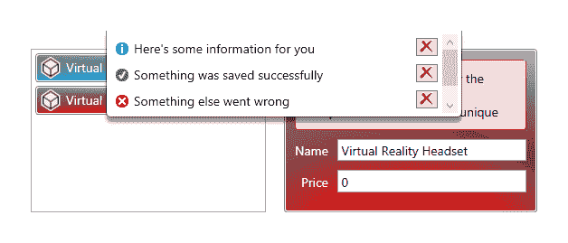
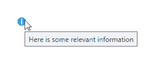
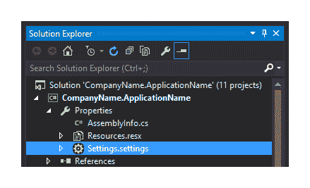
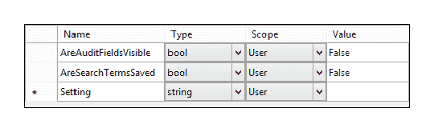

# 完成卓越的用户体验

正如我们所见，向视图中添加表单字段并生成视觉上吸引人且功能足够的应用程序很容易。然而，要为最终用户提供一个真正满足所有要求的界面则需要更多的工作。例如，你有多少次点击应用程序中的按钮，而整个应用程序在执行某些工作时会冻结？

在本章中，我们将探讨通过使用异步编程以及许多其他提高最终用户体验的方法来解决此问题。例如，我们将研究启用用户使用他们自己的用户偏好设置自定义应用程序版本的方法。

我们将讨论通过提供用户反馈来保持用户知情，并通过添加反馈系统来更新我们的应用程序框架。我们将探讨提供应用程序内帮助文件和文档的几种替代方法，以及许多使应用程序更用户友好并使用户生活更加轻松的其他方法。

# 提供用户反馈

一个优秀应用程序的一个基本方面是让最终用户了解应用程序中的情况。如果他们点击一个功能按钮，他们应该被告知操作的进度或状态。如果没有足够的反馈，用户可能会感到困惑，不知道某个特定操作是否成功，并可能尝试多次运行它，这可能会导致错误。

因此，在我们的应用程序框架中实现一个反馈系统是至关重要的。到目前为止，在这本书中，我们在几个地方看到了 `FeedbackManager` 类的名称，尽管我们看到的实现非常少。现在让我们看看我们如何在应用程序框架中实现一个有效的反馈系统，从包含单个反馈消息的 `Feedback` 类开始：

```cs
using System; 
using System.ComponentModel; 
using CompanyName.ApplicationName.DataModels.Enums; 
using CompanyName.ApplicationName.DataModels.Interfaces;  
using CompanyName.ApplicationName.Extensions; 

namespace CompanyName.ApplicationName.DataModels 
{ 
  public class Feedback : IAnimatable, INotifyPropertyChanged 
  { 
    private string message = string.Empty; 
    private FeedbackType type = FeedbackType.None; 
    private TimeSpan duration = new TimeSpan(0, 0, 4); 
    private bool isPermanent = false; 
    private Animatable animatable; 

    public Feedback(string message, FeedbackType type, TimeSpan duration)
    { 
      Message = message; 
      Type = type; 
      Duration = duration == TimeSpan.Zero ? this.duration : duration; 
      IsPermanent = false; 
      Animatable = new Animatable(this); 
    } 

    public Feedback(string message, bool isSuccess, bool isPermanent) :  
      this(message, isSuccess ? FeedbackType.Success :  
      FeedbackType.Error, TimeSpan.Zero) 
    { 
      IsPermanent = isPermanent; 
    } 

    public Feedback(string message, FeedbackType type) : this(message,  
      type, TimeSpan.Zero) { } 

    public Feedback(string message, bool isSuccess) : this(message,  
      isSuccess ? FeedbackType.Success : FeedbackType.Error,  
      TimeSpan.Zero) { } 

    public Feedback() : this(string.Empty, FeedbackType.None) { } 

    public string Message 
    { 
      get { return message; } 
      set { message = value; NotifyPropertyChanged(); } 
    } 

    public TimeSpan Duration 
    { 
      get { return duration; } 
      set { duration = value; NotifyPropertyChanged(); } 
    } 

    public FeedbackType Type 
    { 
      get { return type; } 
      set { type = value; NotifyPropertyChanged(); } 
    } 

    public bool IsPermanent 
    { 
      get { return isPermanent; } 
      set { isPermanent = value; NotifyPropertyChanged(); } 
    } 

    #region IAnimatable Members 

    public Animatable Animatable 
    { 
      get { return animatable; } 
      set { animatable = value; } 
    } 

    #endregion 

    #region INotifyPropertyChanged Members 

    ... 

    #endregion 
  } 
} 
```

注意，我们的 `Feedback` 类实现了我们之前看到的 `IAnimatable` 接口，以及 `INotifyPropertyChanged` 接口。在声明私有字段之后，我们声明了多个有用的构造函数重载。

在此示例中，我们为 `duration` 字段硬编码了一个默认的反馈显示时长为四秒。在主构造函数中，我们根据 `duration` 输入参数的值设置 `Duration` 属性；如果输入参数是 `TimeSpan.Zero` 字段，则使用默认值，但如果输入参数是非零值，则使用该值。

`Message` 属性将保存反馈信息；`Duration` 属性指定了消息显示的时长；`Type` 属性使用我们之前看到的 `FeedbackType` 枚举来指定消息的类型，而 `IsPermanent` 属性决定了消息是否应该永久显示，直到用户手动关闭它为止。

我们`IAnimatable`类的实现显示在其他属性下方，它仅由`Animatable`属性组成，但为了简洁起见，我们省略了`INotifyPropertyChanged`接口的实现，因为我们正在使用之前看到的默认实现。

现在，让我们看看将包含单个`Feedback`实例的`FeedbackCollection`类：

```cs
using System.Collections.Generic; 
using System.Linq; 

namespace CompanyName.ApplicationName.DataModels.Collections 
{ 
  public class FeedbackCollection : BaseAnimatableCollection<Feedback> 
  { 
    public FeedbackCollection(IEnumerable<Feedback> feedbackCollection) : 
      base(feedbackCollection) { } 

    public FeedbackCollection() : base() { } 

    public new void Add(Feedback feedback) 
    { 
      if (!string.IsNullOrEmpty(feedback.Message) && (Count == 0 ||  
        !this.Any(f => f.Message == feedback.Message))) base.Add(feedback); 
    } 

    public void Add(string message, bool isSuccess) 
    { 
      Add(new Feedback(message, isSuccess)); 
    } 
  } 
} 
```

`FeedbackCollection`类扩展了我们之前看到的`BaseAnimatableCollection`类，并将它的泛型类型参数设置为`Feedback`类。这是一个非常简单的类，声明了几个构造函数，将任何输入参数直接传递给基类构造函数。

此外，它声明了两个`Add`方法，第二个方法只是从其输入参数创建一个`Feedback`对象，并将其传递给第一个方法。第一个方法首先检查反馈消息不是`null`或空，并且相同的消息尚未包含在反馈集合中，然后再将新消息添加到集合中。

注意，我们当前的实现使用基类`Add`方法将新项目添加到反馈集合的末尾。我们也可以选择在这里使用基类的`Insert`方法，将新项目添加到集合的开头。

现在，让我们看看使用这两个类的`FeedbackManager`类：

```cs
using System.ComponentModel;  
using System.Runtime.CompilerServices; 
using CompanyName.ApplicationName.DataModels; 
using CompanyName.ApplicationName.DataModels.Collections; 

namespace CompanyName.ApplicationName.Managers 
{ 
  public class FeedbackManager : INotifyPropertyChanged 
  { 
    private static FeedbackCollection feedback = new FeedbackCollection(); 
    private static FeedbackManager instance = null; 

    private FeedbackManager() { } 

    public static FeedbackManager Instance => 
      instance ?? (instance = new FeedbackManager()); 

    public FeedbackCollection Feedback 
    { 
      get { return feedback; } 
      set { feedback = value; NotifyPropertyChanged(); } 
    } 

    public void Add(Feedback feedback) 
    { 
      Feedback.Add(feedback); 
    } 

    public void Add(string message, bool isSuccess) 
    { 
      Add(new Feedback(message, isSuccess)); 
    } 

    #region INotifyPropertyChanged Members 

    ... 

    #endregion 
  } 
} 
```

`FeedbackManager`类还实现了`INotifyPropertyChanged`接口，在其中我们看到静态的`FeedbackCollection`字段。接下来，我们看到静态的`instance`字段、私有构造函数以及类型为`FeedbackManager`的静态`Instance`属性，它首次使用时实例化`instance`字段，并告诉我们这个类遵循单例模式。

`Feedback`属性随后是类对`FeedbackCollection`字段的访问。之后，我们看到一系列方便的重载的`Add`方法，它允许开发者使用不同的参数添加反馈。在这里，为了简洁起见，我们再次省略了`INotifyPropertyChanged`接口的实现，但它使用我们之前看到的默认实现。

现在，让我们关注`FeedbackControl`对象的 XAML：

```cs
<UserControl  
  x:Class="CompanyName.ApplicationName.Views.Controls.FeedbackControl" 

  xmlns:Converters="clr-namespace:CompanyName.ApplicationName.Converters; 
    assembly=CompanyName.ApplicationName.Converters" 
  xmlns:DataModels="clr-namespace:CompanyName.ApplicationName.DataModels; 
    assembly=CompanyName.ApplicationName.DataModels" 
  > 
  <UserControl.Resources> 
    <Converters:FeedbackTypeToImageSourceConverter  
      x:Key="FeedbackTypeToImageSourceConverter" /> 
    <Converters:BoolToVisibilityConverter  
      x:Key="BoolToVisibilityConverter" /> 
    <ItemsPanelTemplate x:Key="AnimatedPanel"> 
      <Panels:AnimatedStackPanel /> 
    </ItemsPanelTemplate> 
    <Style x:Key="SmallImageInButtonStyle" TargetType="{x:Type Image}"  
      BasedOn="{StaticResource ImageInButtonStyle}"> 
      <Setter Property="Width" Value="16" /> 
      <Setter Property="Height" Value="16" /> 
    </Style> 
    <DataTemplate x:Key="FeedbackTemplate" DataType="{x:Type  
      DataModels:Feedback}"> 
      <Grid Margin="2,1,2,0" MouseEnter="Border_MouseEnter"  
        MouseLeave="Border_MouseLeave"> 
        <Grid.ColumnDefinitions> 
          <ColumnDefinition Width="16" /> 
          <ColumnDefinition /> 
          <ColumnDefinition Width="24" /> 
        </Grid.ColumnDefinitions> 
        <Image Stretch="None" Source="{Binding Type, 
          Converter={StaticResource FeedbackTypeToImageSourceConverter}}"  
          VerticalAlignment="Top" Margin="0,4,0,0" /> 
        <TextBlock Grid.Column="1" Text="{Binding Message}"  
          MinHeight="22" TextWrapping="Wrap" Margin="5,2,5,0" 
          VerticalAlignment="Top" FontSize="14" /> 
        <Button Grid.Column="2" ToolTip="Removes this message from the
          list" VerticalAlignment="Top" PreviewMouseLeftButtonDown=
          "DeleteButton_PreviewMouseLeftButtonDown"> 
          <Image Source="pack://application:,,,/ 
            CompanyName.ApplicationName;component/Images/Delete_16.png"  
            Style="{StaticResource SmallImageInButtonStyle}" /> 
        </Button> 
      </Grid> 
    </DataTemplate> 
    <DropShadowEffect x:Key="Shadow" Color="Black" ShadowDepth="6"  
      Direction="270" Opacity="0.4" /> 
  </UserControl.Resources> 
  <Border BorderBrush="{StaticResource TransparentBlack}"  
    Background="White" Padding="3" BorderThickness="1,0,1,1"  
    CornerRadius="0,0,5,5" Visibility="{Binding HasFeedback,  
    Converter={StaticResource BoolToVisibilityConverter},  
    RelativeSource={RelativeSource Mode=FindAncestor,  
    AncestorType={x:Type Controls:FeedbackControl}}}"  
    Effect="{StaticResource Shadow}"> 
    <ListBox MaxHeight="89" ItemsSource="{Binding Feedback,  
      RelativeSource={RelativeSource Mode=FindAncestor,  
      AncestorType={x:Type Controls:FeedbackControl}}}"  
      ItemTemplate="{StaticResource FeedbackTemplate}"  
      ItemsPanel="{StaticResource AnimatedPanel}"  
      ScrollViewer.HorizontalScrollBarVisibility="Disabled"  
      ScrollViewer.VerticalScrollBarVisibility="Auto" BorderThickness="0"  
      HorizontalContentAlignment="Stretch" /> 
  </Border> 
</UserControl> 
```

我们首先为我们的应用程序项目的一些部分添加了多个 XAML 命名空间前缀。使用`Converters`前缀，我们将之前看到的`FeedbackTypeToImageSourceConverter`和`BoolToVisibilityConverter`类的实例添加到`UserControl.Resources`部分。我们还重用了来自第七章，《精通实用动画》的`AnimatedStackPanel`类。

接下来，我们看到的是`SmallImageInButtonStyle`样式，它基于我们之前也看到过的`ImageInButtonStyle`样式，并添加了一些尺寸属性。之后，我们看到的是`FeedbackStyle`样式，它定义了在我们的反馈控制中每个反馈消息的外观。

每个`Feedback`对象将在三列中渲染：第一列包含一个指定反馈类型的图像，使用我们之前看到的`FeedbackTypeToImageSourceConverter`类；第二列显示消息，具有`TextWrapping`值为`Wrap`；第三列包含一个带有图像的按钮，使用我们的`SmallImageInButtonStyle`样式，用户可以使用它来删除消息。

注意，由于这是一个纯 UI 控件，其中没有业务逻辑，因此即使在使用 MVVM 的情况下，我们也能使用文件背后的代码。因此，我们将`MouseEnter`和`MouseLeave`事件的事件处理器附加到包含每个`Feedback`对象的`Grid`面板上，并将另一个用于`PreviewMouseLeftButtonDown`事件的处理器附加到删除按钮上。我们这里最后的资源是一个定义了小阴影效果的`DropShadowEffect`实例。

对于反馈控制，我们定义了一个使用半透明边框画笔，`BorderThickness`值为`1,0,1,1`，`CornerRadius`值为`0,0,5,5`的`Border`元素。这四个值就像`Margin`属性一样工作，使我们能够为四个侧面或`CornerRadius`属性的情况下的每个角落设置不同的值。这样，我们可以显示一个只有三边有边框，两个角落是圆角的矩形。

注意，这个边框上的`Visibility`属性是通过`FeedbackControl`类的`HasFeedback`属性以及我们`BoolToVisibilityConverter`类的一个实例来确定的。因此，当没有要显示的反馈对象时，边框将被隐藏。另外，请注意，我们的`Shadow`资源被应用到边框的`Effect`属性上。

在边框内部，我们声明了一个`ListBox`控件，其`ItemsSource`属性被设置为`FeedbackControl`类的`Feedback`属性，其高度限制为最多三个反馈项，之后将显示垂直滚动条。其`ItemTemplate`属性被设置为我们在资源部分定义的`FeedbackTemplate`。

其`ItemsPanel`属性被设置为我们在资源中声明的用于动画反馈项进入和退出的`AnimatedPanel`资源。接下来，我们通过将`BorderThickness`属性设置为`0`来移除`ListBox`的默认边框，并通过将`HorizontalContentAlignment`属性设置为`Stretch`来拉伸自动生成的`ListBoxItem`对象以适应`ListBox`控件宽度。

现在我们来看看反馈控制的代码：

```cs
using System; 
using System.Collections.Generic; 
using System.Collections.Specialized; 
using System.Linq; 
using System.Windows; 
using System.Windows.Controls; 
using System.Windows.Input; 
using System.Windows.Threading; 
using CompanyName.ApplicationName.DataModels; 
using CompanyName.ApplicationName.DataModels.Collections; 
using CompanyName.ApplicationName.Extensions; 

namespace CompanyName.ApplicationName.Views.Controls 
{ 
  public partial class FeedbackControl : UserControl 
  { 
    private static List<DispatcherTimer> timers =  
      new List<DispatcherTimer>(); 

    public FeedbackControl() 
    { 
      InitializeComponent(); 
    } 

    public static readonly DependencyProperty FeedbackProperty =  
      DependencyProperty.Register(nameof(Feedback),  
      typeof(FeedbackCollection), typeof(FeedbackControl),  
      new UIPropertyMetadata(new FeedbackCollection(),  
      (d, e) => ((FeedbackCollection)e.NewValue).CollectionChanged +=  
      ((FeedbackControl)d).Feedback_CollectionChanged));

    public FeedbackCollection Feedback 
    { 
      get { return (FeedbackCollection)GetValue(FeedbackProperty); } 
      set { SetValue(FeedbackProperty, value); } 
    } 

    public static readonly DependencyProperty HasFeedbackProperty =  
      DependencyProperty.Register(nameof(HasFeedback), typeof(bool),  
      typeof(FeedbackControl), new PropertyMetadata(true)); 

    public bool HasFeedback 
    { 
      get { return (bool)GetValue(HasFeedbackProperty); } 
      set { SetValue(HasFeedbackProperty, value); } 
    } 

    private void Feedback_CollectionChanged(object sender,  
      NotifyCollectionChangedEventArgs e) 
    { 
      if ((e.OldItems == null || e.OldItems.Count == 0) &&  
        e.NewItems != null && e.NewItems.Count > 0) 
      { 
        e.NewItems.OfType<Feedback>().Where(f => !f.IsPermanent). 
          ForEach(f => InitializeTimer(f)); 
      } 
      HasFeedback = Feedback.Any(); 
    } 

    private void InitializeTimer(Feedback feedback) 
    { 
      DispatcherTimer timer = new DispatcherTimer(); 
      timer.Interval = feedback.Duration; 
      timer.Tick += Timer_Tick; 
      timer.Tag = new Tuple<Feedback, DateTime>(feedback, DateTime.Now); 
      timer.Start(); 
      timers.Add(timer); 
    } 

    private void Timer_Tick(object sender, EventArgs e) 
    { 
      DispatcherTimer timer = (DispatcherTimer)sender; 
      timer.Stop(); 
      timer.Tick -= Timer_Tick; 
      timers.Remove(timer); 
      Feedback feedback = ((Tuple<Feedback, DateTime>)timer.Tag).Item1; 
      Feedback.Remove(feedback); 
    } 

    private void DeleteButton_PreviewMouseLeftButtonDown(object sender,  
      MouseButtonEventArgs e) 
    { 
      Button deleteButton = (Button)sender; 
      Feedback feedback = (Feedback)deleteButton.DataContext; 
      Feedback.Remove(feedback); 
    } 

    private void Border_MouseEnter(object sender, MouseEventArgs e) 
    { 
      foreach (DispatcherTimer timer in timers) 
      { 
        timer.Stop(); 
        Tuple<Feedback, DateTime> tag = 
          (Tuple<Feedback, DateTime>)timer.Tag; 
        tag.Item1.Duration = timer.Interval = tag.Item1.Duration. 
          Subtract(DateTime.Now.Subtract(tag.Item2)); 
      } 
    } 

    private void Border_MouseLeave(object sender, MouseEventArgs e) 
    { 
      foreach (DispatcherTimer timer in timers) 
      { 
        Feedback feedback = ((Tuple<Feedback, DateTime>)timer.Tag).Item1; 
        timer.Tag = new Tuple<Feedback, DateTime>(feedback, DateTime.Now); 
        timer.Start(); 
      } 
    } 
  } 
} 
```

我们首先声明了一个`DispatcherTimer`实例的集合，这些实例将负责根据每个反馈对象的`Duration`属性来计时，以确定何时从集合中移除每个反馈对象。然后我们看到`Feedback`和`HasFeedback`依赖属性的声明，以及它们的 CLR 包装和`Feedback`属性的`CollectionChanged`处理程序。

在附加的`Feedback_CollectionChanged`处理方法中，我们调用`InitializeTimer`方法，传入每个新的非永久反馈项。请注意，我们需要使用`OfType` LINQ 扩展方法将`NotifyCollectionChangedEventArgs`类的`NewItems`属性中的每个项从类型`object`转换为`Feedback`。在将控制权返回给调用者之前，我们相应地设置`HasFeedback`属性。

在`InitializeTimer`方法中，我们初始化一个`DispatcherTimer`实例，并将其间隔设置为`feedback`输入参数的`Duration`属性中的值。然后我们附加`Timer_Tick`事件处理程序，将当前时间和反馈对象添加到计时器的`Tag`属性中以便后续使用，启动计时器，并将其添加到`timers`集合中。

在`Timer_Tick`方法中，我们从`sender`输入参数访问计时器，并从其`Tag`属性访问`Feedback`实例。然后，反馈项从`Feedback`集合中移除，计时器停止并从`timers`集合中移除，并且`Tick`事件处理程序被断开连接。

在`DeleteButton_PreviewMouseLeftButtonDown`方法中，我们首先将删除按钮从`sender`输入参数转换。然后，我们将`Feedback`对象从按钮的`DataContext`属性转换，并将其从`Feedback`集合中移除。

在`Border_MouseEnter`方法中，我们遍历`timers`集合，并停止每个计时器。然后，每个计时器的间隔和每个相关联的`Feedback`对象的持续时间被设置为它们应该显示的剩余时间，实际上暂停了它们的持续时间。

最后，我们看到`Border_MouseLeave`方法，它重新初始化`timers`集合中每个计时器的`Tag`属性，使用相同的反馈项和当前日期和时间，并在用户将鼠标指针移出反馈控件时重新启动它。

这意味着如果用户将鼠标指针移到反馈控件上，临时反馈消息的显示时间可以延长。这个功能将保持反馈消息在控件中，直到用户将鼠标指针保持在控件上，从而给他们足够的时间阅读消息。现在让我们看看这个控件的样子：



如果你的视图顶部有菜单按钮，那么反馈可以出现在应用程序的底部，或者甚至从一侧滑入。此外，请注意，删除按钮尚未样式化，以缩短此示例，但在实际应用程序中，它们应该与其它控件保持一致的风格。

如果您还记得第三章中的内容，即*编写自定义应用程序框架*，那么我们所有的视图模型都将通过`BaseViewModel`类中的`FeedbackManager`属性访问我们新的`FeedbackManager`类，因此我们可以像这样从任何视图模型中复制前面的反馈图像：

```cs
FeedbackManager.Add(new Feedback("Here's some information for you",  
  FeedbackType.Information)); 
FeedbackManager.Add("Something was saved successfully", true); 
FeedbackManager.Add("Something else went wrong", false); 
FeedbackManager.Add("Something else went wrong too", false); 
```

现在，让我们继续探索如何通过最大化 CPU 的利用率来使我们的应用程序更加响应。

# 利用多线程

传统上，所有应用程序都是作为单线程应用程序开发的。然而，当长时间运行的后台进程正在运行时，应用程序的用户界面会冻结并变得无响应，因为单个线程正忙于其他地方。这个问题以及其他性能瓶颈导致了当前异步编程和多线程应用程序的时代。

在过去的日子里，创建多线程应用程序是一件复杂的事情。随着.NET Framework 每个后续版本的推出，微软一直努力使这项任务变得更简单。最初，我们只有`Thread`类，然后在.NET 2.0 中引入了`BackgroundWorker`类，但在.NET 4.0 中，他们引入了`Task`类，而在.NET 4.5 中，他们引入了`async`和`await`关键字。

在本节中，我们将探讨多线程的后继方法，并为我们应用程序框架添加功能，使我们能够异步执行我们的数据检索和更新操作。让我们首先看看`async`和`await`关键字。

# 发现 Async 和 Await 关键字

与这些新关键字一起，微软还在.NET Framework 中添加了许多以`Async`后缀结尾的方法。正如后缀所暗示的，这些方法都是异步的，并且与新的关键字一起使用。让我们从基本规则开始。

首先，为了在方法中使用`await`关键字，方法签名必须用`async`关键字声明。`async`关键字使我们能够在方法中使用`await`关键字而不会出错，并且负责从异步方法返回仅`T`泛型类型参数，这些方法的签名声明了返回类型为`Task<T>`。修改了`async`关键字的方法被称为异步方法。

异步方法实际上是以同步方式执行的，直到它们达到一个`await`表达式。如果方法中没有`await`关键字，那么整个方法将以同步方式运行，编译器将输出一个警告。

虽然部分异步方法以异步方式运行，但实际上它们并不是在它们自己的线程上运行的。使用`async`和`await`关键字不会创建额外的线程。相反，它们通过使用当前的同步上下文来提供多线程的外观，但只有在方法活动时，而不是在方法暂停并运行`await`表达式时。

当执行到达一个`await`关键字时，方法将挂起，直到所等待的任务异步完成。在这段时间内，执行返回到方法调用者。当异步操作完成时，程序执行返回到方法，并同步运行其中的剩余代码。

异步方法需要具有特定的签名。它们都需要使用`async`修饰符关键字，并且除了这一点之外，异步方法的名称应该以`Async`后缀结尾，以清楚地表明它们是异步方法。声明异步方法的另一个要求是，它们不能包含任何`ref`或`out`输入参数。

最后一个要求是，异步方法只能使用三种返回类型之一：`Task`、泛型`Task<TResult>`或`void`。请注意，泛型类型参数`TResult`与`T`相同，可以被替换，但 Microsoft 将其称为`TResult`，因为它指定了返回类型。

所有返回一些有意义结果的异步方法都将使用类型`Task<TResult>`，其中实际返回值的类型将由`TResult`泛型类型参数指定。因此，如果我们想从我们的异步方法返回一个`string`，我们声明我们的异步方法返回一个类型为`Task<string>`的参数。让我们看看这个动作的例子：

```cs
using System; 
using System.IO; 
using System.Threading.Tasks;

...

public async Task<string> GetTextFileContentsAsync(string filePath) 
{ 
  string fileContents = string.Empty; 
  try 
  { 
    using (StreamReader streamReader = File.OpenText(filePath)) 
    { 
      fileContents = await streamReader.ReadToEndAsync(); 
    } 
  } 
  catch { /*Log error*/ } 
  return fileContents; 
} 
```

这里我们有一个简单的异步方法，它返回一个表示由`filePath`输入参数指定的文本文件内容的`string`。请注意，方法的实际返回类型实际上是`Task<string>`。在其中，我们首先初始化`fileContents`变量，然后尝试在`using`语句中从`File.OpenText`方法创建一个`StreamReader`实例。

在`using`语句内部，我们尝试通过等待`StreamReader`类的`ReadToEndAsync`方法的结果来填充`fileContents`变量。直到这一点，方法将以同步方式运行。将调用`ReadToEndAsync`方法，然后控制将立即返回到我们的异步方法的调用者。

当`ReadToEndAsync`方法的返回值准备好时，执行将返回到我们的异步方法，并从上次离开的地方继续。在我们的例子中，除了返回结果字符串之外，没有其他事情要做，尽管异步方法可以在`await`关键字之后包含任意数量的行，甚至多个`await`关键字。请注意，在实际应用中，我们会记录从这个方法抛出的任何异常。

如果我们的异步方法只是异步执行某些功能，但不返回任何内容，那么我们使用返回类型`Task`。也就是说，基于任务的异步方法将返回一个`Task`对象，使其能够与`await`关键字一起使用，但实际的方法不会向该方法的调用者返回任何内容。让我们看看这个例子：

```cs
using System.Text;

...

public async Task SetTextFileContentsAsync(string filePath,  
  string contents) 
{ 
  try 
  { 
    byte[] encodedFileContents = Encoding.Unicode.GetBytes(contents); 
    using (FileStream fileStream = new FileStream(filePath,  
      FileMode.OpenOrCreate, FileAccess.Write, FileShare.None, 4096, true))
    { 
      await fileStream.WriteAsync(encodedFileContents, 0,  
        encodedFileContents.Length); 
    } 
  } 
  catch { /*Log error*/ } 
} 
```

在`SetTextFileContentsAsync`方法中，我们首先需要将我们的输入字符串转换为字节数组。因此，我们现在需要添加一个`using`指令来指定`System.Text`命名空间，除了最初指定的三个之外。请注意，在这个特定的例子中，我们使用的是`Unicode`编码，但你也可以使用任何其他的编码值。

在使用`GetBytes`方法从`contents`输入参数获取字节数组之后，我们在另一个`using`语句中初始化一个新的`FileStream`对象。除了`bool`类型的`useAsync`输入参数之外，在这个示例中用于`FileStream`构造函数的其他参数并不重要，你可以自由地用更适合你需求的值替换它们。

在`using`语句内部，我们看到`await`关键字与`WriteAsync`方法一起使用。到目前为止，此方法将以同步方式运行，并且在这一行上，它将开始执行`WriteAsync`方法，然后返回控制权给方法调用者。

当执行离开`using`语句时，`FileStream`实例将被关闭并释放。由于此方法没有返回值，异步方法的返回类型是`Task`，这使得它能够被调用代码挂起。再次提醒，我们通常会记录可能从这个方法抛出的任何异常，但在这里为了简洁省略了这一步骤。

当使用 MVVM 时，我们中的大多数人永远不会使用`void`的第三个返回类型选项，因为它主要用于事件处理方法。请注意，返回`void`的异步方法不能被挂起，并且调用代码不能捕获此类异步方法抛出的异常。

关于异步方法最常问的问题之一是“我如何从一个同步方法创建一个异步方法？”幸运的是，使用`Task.Run`方法有一个非常简单的解决方案，现在让我们快速看一下它：

```cs
await Task.Run(() => SynchronousMethod(parameter1, parameter2, etc)); 
```

在这里，我们使用 Lambda 表达式来指定在异步上下文中运行的同步方法。这就是我们运行同步方法异步所需做的全部。然而，对于相反的要求呢？现在让我们看看我们如何可以同步地运行异步方法。同样，`Task`类为我们提供了一个解决方案：

```cs
Task task = SetFileContentsAsync(filePath, contents); 
task.RunSynchronously(); 
```

正如我们在第一章的结尾所看到的，*使用 WPF 的更智能的工作方式*，为了同步地运行异步方法，我们首先需要从我们的异步方法中实例化一个`Task`对象。然后，我们只需调用该实例上的`RunSynchronously`方法，它就会同步运行。

# 将异步性构建到我们的框架中

使用`Task`类，我们可以将功能添加到我们的应用程序框架中，使我们能够异步调用任何数据访问方法。此外，它还将使我们能够在应用程序运行时异步执行数据操作，在测试时同步执行。为了实现这一点，我们需要实现几个部分，它们共同提供这一功能。

让我们看看第一部分，它将包装每个数据操作，如果适用，则包含结果值、任何反馈消息或错误详情：

```cs
using System; 
using System.Data.SqlClient; 
using CompanyName.ApplicationName.DataModels.Enums; 
using CompanyName.ApplicationName.Extensions; 

namespace CompanyName.ApplicationName.DataModels 
{ 
  public abstract class DataOperationResult<T> 
  { 
    public DataOperationResult(string successText) 
    { 
      Description = string.IsNullOrEmpty(successText) ?  
        "The data operation was successful" : successText; 
    } 

    public DataOperationResult(Exception exception, string errorText) 
    { 
      Exception = exception; 
      if (Exception is SqlException) 
      { 
        if (exception.Message.Contains("The server was not found"))
          Error = DataOperationError.DatabaseConnectionError;
        else if (exception.Message.Contains("constraint"))
          Error = DataOperationError.DatabaseConstraintError; 
        // else Description = Exception.Message; 
      } 
      if (Error != DataOperationError.None)  
        Description = Error.GetDescription(); 
      else  
      { 
        Error = DataOperationError.UndeterminedDataOperationError; 
        Description = string.IsNullOrEmpty(errorText) ?  
          Error.GetDescription() : errorText; 
      } 
    } 

    public DataOperationResult(Exception exception) : 
      this(exception, string.Empty) { } 

    public string Description { get; set; } 

    public DataOperationError Error { get; set; } = 
      DataOperationError.None; 

    public Exception Exception { get; set; } = null; 

    public bool IsSuccess =>  
      Error == DataOperationError.None && Exception == null; 
  } 
} 
```

在我们的抽象`DataOperationResult`类中，我们有许多属性和构造函数重载。第一个构造函数用于成功的设置数据操作，仅接受`successText`输入参数，该参数用于填充`Description`属性，除非它是`null`或空，在这种情况下，将使用默认的成功操作消息。

第二个构造函数用于在数据操作过程中抛出异常时使用，它接受异常和错误信息作为输入参数。在其中，我们首先将`Exception`属性设置为`exception`输入参数指定的异常，然后我们有机会捕获常见的异常，并用简单的英语替换错误信息。

尽管我们在这个例子中只检查`SqlException`类型的异常，但我们很容易将其扩展以捕获其他已知或预期的异常，并使用通俗易懂的语言替换它们的消息，通过添加额外的`else...if`条件。

注意，这里使用枚举类型`DataOperationError`的`Error`属性来设置和输出预定义的错误信息，我们稍后会看到。如果异常不是我们预期的类型，那么我们可以选择输出实际的异常信息，尽管这对用户来说意义不大，可能会被认为是混淆的，甚至令人担忧。

相反，我们可以在数据库中记录异常，并从`errorText`输入参数输出消息。我们检查`Error`属性是否已设置，如果已设置，则调用我们的`GetDescription`扩展方法来检索与设置枚举成员相关的消息，并将其设置为`Description`属性。

否则，我们将`Error`属性设置为`UndeterminedDataOperationError`成员，如果`errorText`输入参数不是`null`或空，则将`Description`属性设置为`errorText`的值，如果是，则设置为所选枚举成员关联的文本。第三个构造函数也用于抛出异常的情况，但没有预定义的反馈信息。

在构造函数之后，我们看到 `DataOperationResult` 类的属性，其中大部分都是不言自明的。特别值得注意的是 `IsSuccess` 属性，它可以被调用代码用来确定如何处理结果。现在让我们看看用于保存错误描述的 `DataOperationError` 枚举类：

```cs
using System.ComponentModel; 

namespace CompanyName.ApplicationName.DataModels.Enums 
{ 
  public enum DataOperationError 
  { 
    [Description("")] 
    None = 0, 
    [Description("A database constraint has not been adhered to, so this
      operation cannot be completed")] 
    DatabaseConstraintError = 9995, 
    [Description("There was an undetermined data operation error")] 
    UndeterminedDataOperationError = 9997, 
    [Description("There was a problem connecting to the database")] 
    DatabaseConnectionError = 9998, 
  } 
} 
```

如您所见，我们利用 `DescriptionAttribute` 类将人性化错误消息与每个枚举成员相关联。我们可以使用之前看到的 `GetDescription` 扩展方法来访问属性中的文本值。

每个枚举成员都被分配了一个数字，如果你直接使用 SQL 存储过程或查询，这可以很好地与 SQL Server 错误号配合使用。例如，我们可以将 SQL 错误代码转换为特定的枚举成员，以获取每个错误的自定义消息。现在让我们看看扩展 `DataOperationResult` 类的两个类：

```cs
using System; 

namespace CompanyName.ApplicationName.DataModels 
{ 
  public class GetDataOperationResult<T> : DataOperationResult<T> 
  { 
    public GetDataOperationResult(Exception exception, string errorText) :
      base(exception, errorText) 
    { 
      ReturnValue = default(T); 
    } 

    public GetDataOperationResult(Exception exception) :  
      this(exception, string.Empty) { } 

    public GetDataOperationResult(T returnValue, string successText) :  
      base(successText) 
    { 
      ReturnValue = returnValue; 
    } 

    public GetDataOperationResult(T returnValue) : 
      this(returnValue, string.Empty) { } 

    public T ReturnValue { get; private set; } 
  } 
} 
```

我们从 `GetDataOperationResult` 类开始，该类用于返回获取数据操作的结果，或者在发生错误时返回异常详细信息。它添加了一个泛型类型 `T` 的 `ReturnValue` 属性来保存数据操作的返回值。除了这个单一成员外，它还简单地添加了多个构造函数，每个构造函数都调用基础类构造函数。

第一个用于抛出异常时，并将 `ReturnValue` 属性设置为默认值，而不是将其保留为 `null`。第二个构造函数也用于抛出异常时，但没有预定义的错误消息。

第三个构造函数用于成功的数据操作，并将 `ReturnValue` 属性设置为返回值。第四个也用于成功的数据操作，但没有预定义的成功消息。它调用第三个构造函数，传递返回值和一个空字符串作为成功消息。现在让我们看看扩展 `DataOperationResult` 类的另一个类：

```cs
using System; 

namespace CompanyName.ApplicationName.DataModels 
{ 
  public class SetDataOperationResult : DataOperationResult<bool> 
  { 
    public SetDataOperationResult(Exception exception, string errorText) :
       base(exception, errorText) { } 

    public SetDataOperationResult(string successText) :  
      base(successText) { } 
  } 
} 
```

`SetDataOperationResult` 类用于设置操作，因此没有返回值。与 `GetDataOperationResult` 类类似，它的两个构造函数调用相关的基础类构造函数。第一个用于抛出异常时，第二个用于成功的数据操作，并接受一个输入参数用于操作的成功消息。

我们需要在 `FeedbackManager` 类中添加一个新的方法，以便我们能够直接从 `GetDataOperationResult` 和 `SetDataOperationResult` 类添加反馈消息。我们还将包括一个参数，允许我们覆盖每个消息是否会在其设定的持续时间显示，或者直到用户手动关闭它。现在让我们看看这个：

```cs
public void Add<T>(DataOperationResult<T> result, bool isPermanent) 
{ 
  Add(new Feedback(result.Description, result.IsSuccess, isPermanent)); 
} 
```

注意，我们在这里使用`DataOperationResult`基类作为输入参数，这样我们的任何派生类都可以与它一起使用。此方法简单地从`DataOperationResult`类的`Description`和`IsSuccess`属性初始化一个`Feedback`对象，并将其传递给实际将其添加到`Feedback`集合的`Add`方法。

如果我们将要对 UI 反馈控件进行异步调用，那么我们还需要确保它们在 UI 线程上执行，以避免常见的`调用线程无法访问此对象，因为不同的线程拥有它`异常。

为了启用此功能，我们需要将之前讨论过的`UiThreadManager`类引用添加到我们的`FeedbackManager`类中，尽管在这里我们添加了对`IUiThreadManager`接口的引用，以便在测试时使用不同的实现：

```cs
using System; 
using CompanyName.ApplicationName.Managers.Interfaces;

...

private IUiThreadManager uiThreadManager = null;

...

public IUiThreadManager UiThreadManager 
{ 
  get { return uiThreadManager; } 
  set { uiThreadManager = value; } 
} 

...

public void Add(Feedback feedback) 
{ 
  UiThreadManager.RunOnUiThread((Action)delegate 
  { 
    Feedback.Add(feedback); 
  }); 
} 
```

使用`IUiThreadManager`接口，我们只需用`RunOnUiThread`方法包装添加反馈到`FeedbackManager.Feedback`集合属性的单一调用，以在 UI 线程上运行它。然而，我们的`uiThreadManager`字段需要在显示任何反馈之前初始化，并且我们可以从`BaseViewModel`类的第一次使用中完成这一点：

```cs
public BaseViewModel() 
{ 
  if (FeedbackManager.UiThreadManager == null) 
    FeedbackManager.UiThreadManager = UiThreadManager; 
} 

...

public IUiThreadManager UiThreadManager 
{ 
  get { return DependencyManager.Instance.Resolve<IUiThreadManager>(); } 
} 
```

第一次实例化任何 ViewModel 时，将调用此基类构造函数，并且`FeedbackManager`类中的`IUiThreadManager`接口实例将被初始化。当然，为了在运行时正确解析我们的`IUiThreadManager`接口实例，我们首先需要在`App.xaml.cs`文件中注册它，以及其他注册项。

```cs
DependencyManager.Instance.Register<IUiThreadManager, UiThreadManager>();
```

让我们现在看看这个接口及其实现它的类：

```cs
using System; 
using System.Threading.Tasks; 
using System.Windows.Threading; 

namespace CompanyName.ApplicationName.Managers.Interfaces 
{ 
  public interface IUiThreadManager 
  { 
    object RunOnUiThread(Delegate method); 

    Task RunAsynchronously(Action method); 

    Task<TResult> RunAsynchronously<TResult>(Func<TResult> method); 
  } 
} 
```

`IUiThreadManager`接口是一个非常简单的事情，只声明了三个方法。`RunOnUiThread`方法用于在 UI 线程上运行代码；第一个`RunAsynchronously`方法用于异步运行代码，第二个`RunAsynchronously`方法用于异步运行返回某些内容的方法。现在让我们看看实现它的类：

```cs
using System; 
using System.Threading.Tasks;  
using System.Windows; 
using System.Windows.Threading; 
using CompanyName.ApplicationName.Managers.Interfaces; 

namespace CompanyName.ApplicationName.Managers 
{ 
  public class UiThreadManager : IUiThreadManager 
  { 
    public object RunOnUiThread(Delegate method) 
    { 
      return Application.Current.Dispatcher.Invoke( 
        DispatcherPriority.Normal, method); 
    } 

    public Task RunAsynchronously(Action method) 
    { 
      return Task.Run(method); 
    } 

    public Task<TResult> RunAsynchronously<TResult>(Func<TResult> method) 
    { 
      return Task.Run(method); 
    } 
  } 
} 
```

在`UiThreadManager`类中，`RunOnUiThread`方法调用`Application.Current.Dispatcher`对象的`Invoke`方法，以确保传递给它的方法被排队在 UI 线程上运行。

基本上，分发器负责维护特定线程的工作项队列，每个线程都将有自己的分发器。`Application.Current`属性返回当前`AppDomain`对象的`Application`对象，其`Dispatcher`属性返回在应用程序启动时运行的线程的分发器——UI 线程。

如前所述，`RunAsynchronously` 方法只是将 `method` 输入参数指定的方法传递给 `Task.Run` 方法。我们还在 第一章 中看到了模拟 `RunAsynchronously` 方法的示例，*一种更智能的 WPF 工作方式*，但现在让我们看看整个 `MockUiThreadManager` 类，我们可以在测试我们的应用程序时使用它：

```cs
using System; 
using System.Threading.Tasks; 
using System.Windows.Threading; 
using CompanyName.ApplicationName.Managers.Interfaces; 

namespace Test.CompanyName.ApplicationName.Mocks.Managers 
{ 
  public class MockUiThreadManager : IUiThreadManager 
  { 
    public object RunOnUiThread(Delegate method) 
    { 
      return method.DynamicInvoke(); 
    } 

    public Task RunAsynchronously(Action method) 
    { 
      Task task = new Task(method); 
      task.RunSynchronously(); 
      return task; 
    } 

    public Task<TResult> RunAsynchronously<TResult>(Func<TResult> method) 
    { 
      Task<TResult> task = new Task<TResult>(method); 
      task.RunSynchronously(); 
      return task; 
    } 
  } 
} 
```

在 `RunOnUiThread` 方法中，我们只是调用 `Delegate` 类的 `DynamicInvoke` 方法来运行由 `method` 输入参数指定的方法。正如我们之前看到的，`RunAsynchronously` 方法使用 `Task` 类的 `RunSynchronously` 方法来同步运行由 `method` 输入参数指定的方法，以避免在测试期间出现时间问题。

在其中，我们首先使用由 `method` 输入参数指定的方法创建一个新的 `Task` 对象，然后调用其上的 `RunSynchronously` 方法，最后返回该任务。当使用 `await` 关键字调用时，这实际上会返回方法的返回结果。

现在让我们看看这个功能可能最重要的部分，即使用 `IUiThreadManager` 接口的地方，`DataOperationManager` 类：

```cs
using System; 
using System.Diagnostics; 
using System.Threading.Tasks; 
using System.Windows.Threading; 
using CompanyName.ApplicationName.DataModels; 
using CompanyName.ApplicationName.Managers.Interfaces; 

namespace CompanyName.ApplicationName.Managers 
{ 
  public class DataOperationManager 
  { 
    private const int maximumRetryCount = 2; 
    private IUiThreadManager uiThreadManager; 

    public DataOperationManager(IUiThreadManager uiThreadManager) 
    { 
      UiThreadManager = uiThreadManager; 
    } 

    private IUiThreadManager UiThreadManager 
    { 
      get { return uiThreadManager.Instance; } 
      set { uiThreadManager = value; } 
    } 

    private FeedbackManager FeedbackManager 
    { 
      get { return FeedbackManager.Instance; } 
    } 

    public GetDataOperationResult<TResult> TryGet<TResult>( 
      Func<TResult> method, string successText, string errorText,  
      bool isMessageSupressed) 
    { 
      Debug.Assert(method != null, "The method input parameter of the
        DataOperationManager.TryGet<TResult>() method must not be null."); 
      for (int index = 0; index < maximumRetryCount; index++) 
      { 
        try 
        { 
          TResult result = method(); 
          return WithFeedback(
            new GetDataOperationResult<TResult>(result, successText), 
            isMessageSupressed); 
        } 
        catch (Exception exception) 
        { 
          if (index == maximumRetryCount - 1) 
          { 
            return WithFeedback(
              new GetDataOperationResult<TResult>(exception, errorText),
              isMessageSupressed); 
          } 
          Task.Delay(TimeSpan.FromMilliseconds(300)); 
        } 
      }  
      return WithFeedback(
        new GetDataOperationResult<TResult>(default(TResult), successText),
        isMessageSupressed); 
    } 

    private GetDataOperationResult<TResult>WithFeedback<TResult>(      
      GetDataOperationResult<TResult> dataOperationResult, bool  
      isMessageSupressed) 
    { 
      if (isMessageSupressed && dataOperationResult.IsSuccess)  
        return dataOperationResult; 
      FeedbackManager.Add(dataOperationResult, false); 
      return dataOperationResult; 
    } 

    public Task<GetDataOperationResult<TResult>> TryGetAsync<TResult>(
      Func<TResult> method, string successText, string errorText,  
      bool isMessageSupressed) 
    { 
      return UiThreadManager.RunAsynchronously(() => 
        TryGet(method, successText, errorText, isMessageSupressed)); 
    } 

    public SetDataOperationResult TrySet(Action method, 
      string successText, string errorText, bool isMessagePermanent, 
      bool isMessageSupressed) 
    { 
      Debug.Assert(method != null, "The method input parameter of the
        DataOperationManager.TrySet<TResult>() method must not be null."); 
      for (int index = 0; index < maximumRetryCount; index++) 
      { 
        try 
        { 
          method(); 
          return WithFeedback(new SetDataOperationResult(successText),
            isMessagePermanent, isMessageSupressed); 
        } 
        catch (Exception exception) 
        { 
          if (index == maximumRetryCount - 1) 
          { 
            return WithFeedback(new SetDataOperationResult(exception,
              errorText), isMessagePermanent, isMessageSupressed); 
          } 
          Task.Delay(TimeSpan.FromMilliseconds(300)); 
        } 
      } 
      return WithFeedback(new SetDataOperationResult(successText),  
        isMessagePermanent, isMessageSupressed); 
    } 

    private SetDataOperationResult WithFeedback( 
      SetDataOperationResult dataOperationResult, 
      bool isMessagePermanent, bool isMessageSupressed) 
    { 
      if (isMessageSupressed && dataOperationResult.IsSuccess)  
        return dataOperationResult; 
      FeedbackManager.Add(dataOperationResult, isMessagePermanent); 
      return dataOperationResult; 
    } 

    public Task<SetDataOperationResult> TrySetAsync(Action method) 
    { 
      return TrySetAsync(method, string.Empty, string.Empty); 
    } 

    public Task<SetDataOperationResult> TrySetAsync(Action method,  
      string successText, string errorText) 
    { 
      return TrySetAsync(method, successText, errorText, false, false); 
    } 

    public Task<SetDataOperationResult> TrySetAsync(Action method,
      string successText, string errorText, bool isMessagePermanent,  
      bool isMessageSupressed) 
    { 
      return UiThreadManager.RunAsynchronously(() => TrySet(method, 
        successText, errorText, isMessagePermanent, isMessageSupressed)); 
    } 
  } 
} 
```

`DataOperationManager` 类开始于几个私有字段，这些字段代表在出现问题时重试每个数据操作的最大尝试次数，以及用于在运行应用程序时异步运行我们的函数的 `IUiThreadManager` 接口实例。

构造函数使我们能够将 `IUiThreadManager` 依赖项注入到类中，并将其设置为私有的 `UiThreadManager` 属性，该属性只能在类内部访问。同样，`FeedbackManager` 属性也是私有的，使我们能够将反馈信息传递给管理类以在 UI 中显示。

接下来，我们看到通用的 `TryGet<TResult>` 方法，它返回一个类型为 `GetDataOperationResult<TResult>` 的对象。更具体地说，它返回一个类型为 `TResult` 的泛型对象，被我们自己的 `GetDataOperationResult` 对象包装。它首先断言 `method` 输入参数不是 `null`，因为这个类是基于必需参数的。

在这个方法中，我们创建一个循环，其迭代次数由 `maximumRetryCount` 字段的值确定，并在循环中尝试运行由 `method` 输入参数指定的函数。如果数据操作成功，我们初始化一个 `GetDataOperationResult` 对象，传递返回值和成功反馈信息，并通过 `WithFeedback` 方法返回它。

如果发生错误且尚未达到最大尝试次数，那么我们使用异步的 `Task.Delay` 方法等待，然后再尝试再次运行该方法。如果达到最大错误次数，则将异常和错误反馈信息包装在 `GetDataOperationResult` 对象中，并通过 `WithFeedback` 方法返回。

我们可以在这里实现的一个改进是，每次重试数据操作时增加这个延迟时间。我们可以实现一个函数，该函数返回一个基于`maximumRetryCount`字段的指数增长数，表示将传递给`Task.Delay`方法的毫秒值。这将更有可能更好地处理短暂的网络中断。

`WithFeedback`方法允许开发者抑制成功反馈消息，因为他们可能并不总是需要用户接收反馈。例如，如果我们已经显示在屏幕上，或者即将显示在屏幕上，我们可能不需要通知他们他们的数据对象已成功从数据库中检索出来。

因此，如果数据操作成功并且`isMessageSupressed`输入参数为`true`，则直接返回数据操作结果，不提供反馈。否则，将`dataOperationResult`输入参数对象传递给`FeedbackManager`类以显示相关消息，使用我们之前添加的新方法。

接下来，我们看到异步的`TryGetAsync`方法，它只是通过`UiThreadManager`类的`RunAsynchronously`方法调用`TryGet`方法。之后，我们有`TrySet`方法，它负责运行所有设置数据操作，并返回类型为`SetDataOperationResult`的对象。

此方法与`TryGet`方法非常相似，除了它适用于设置数据操作。同样，它首先断言`method`输入参数不是`null`，然后在 for 循环中运行剩余的代码。这再次使我们的重试能力成为可能，并且受`maximumRetryCount`字段值的限制。

在该方法中，我们尝试运行由`method`输入参数指定的函数，如果数据操作成功，则初始化一个`SetDataOperationResult`对象，仅传递成功反馈消息，并通过`WithFeedback`方法返回它。

如果发生错误并且尚未达到由`maximumRetryCount`字段指定的尝试次数，那么我们将使用`Task.Delay`方法等待，然后再尝试再次运行该方法。如果达到最大错误数，则将异常和错误反馈信息封装在`SetDataOperationResult`对象中，并通过`WithFeedback`方法返回。

与`SetDataOperationResult`对象一起使用的`WithFeedback`方法与之前用于通用`GetDataOperationResult`对象的方法完全相同。最后，我们有一些重载的`TrySetAsync`方法，它们最终通过`UiThreadManager`类的`RunAsynchronously`方法异步调用`TrySet`方法。

这里有一点需要注意，目前这个类位于`Managers`项目中。如果我们有可能需要更换我们的数据访问技术，那么我们可能更愿意将这个类移动到数据访问项目中以便于移除。按照现状，我们没有这样的需求，所以它现在所在的位置是合适的。

我们可以在之前看到的`DataController`类中使用这个`DataOperationManager`类，只需进行一些修改。我们还可以用一些新的方法替换它之前的`SetAuditCreateFields`和`SetAuditUpdateFields`方法，这些新方法也会更新实现`ISynchronizableDataModel`接口的数据模型。让我们看看那里的新代码：

```cs
using System; 
using System.Threading.Tasks; 
using CompanyName.ApplicationName.DataModels; 
using CompanyName.ApplicationName.DataModels.Collections; 
using CompanyName.ApplicationName.DataModels.Enums; 
using CompanyName.ApplicationName.DataModels.Interfaces; 
using CompanyName.ApplicationName.Managers; 
using CompanyName.ApplicationName.Models.Interfaces; 

namespace CompanyName.ApplicationName.Models.DataControllers 
{ 
  public class DataController 
  {
    ...

    private DataOperationManager dataOperationManager;

    public DataController(IDataProvider dataProvider,  
      DataOperationManager dataOperationManager, User currentUser) 
    { 
      ... 
      DataOperationManager = dataOperationManager;  
      CurrentUser = currentUser.Clone();
    } 

    protected DataOperationManager DataOperationManager 
    { 
      get { return dataOperationManager; } 
      private set { dataOperationManager = value; } 
    }

    ... 

    public Task<SetDataOperationResult> AddProductAsync(Product product) 
    { 
      return DataOperationManager.TrySetAsync(() =>  
        DataProvider.AddProduct(InitializeDataModel(product)), 
        $"{product.Name} was added to the data source successfully", $"A 
        problem occurred and {product.Name} was not added to the data 
        source."); 
    } 

    public Task<SetDataOperationResult> DeleteProductAsync( 
      Product product) 
    { 
      return DataOperationManager.TrySetAsync(() =>  
        DataProvider.DeleteProduct(DeleteDataModel(product)), 
        $"{product.Name} has been deleted from the data source 
        successfully.", $"A problem occurred and {product.Name} was not
        deleted from the data source.", true, false); 
    } 

    public Task<GetDataOperationResult<Products>> GetProductsAsync() 
    { 
      return DataOperationManager.TryGetAsync(() =>  
        DataProvider.GetProducts(), string.Empty, "A problem occurred when
        trying to retrieve the products.", true); 
    } 

    public SetDataOperationResult UpdateProduct(Product product) 
    { 
      return DataOperationManager.TrySet(() =>  
        DataProvider.UpdateProduct(UpdateDataModel(product)), 
        $"{product.Name} was saved in the data source successfully.", $"A
        problem occurred and {product.Name} was not updated in the data 
        source.", false, false); 
    } 

    private T InitializeDataModel<T>(T dataModel)  
      where T : class, IAuditable, new() 
    { 
      dataModel.Auditable = new Auditable(dataModel, CurrentUser); 
      if (dataModel is ISynchronizableDataModel<T>) 
      { 
        ISynchronizableDataModel<T> synchronisableDataModel =  
          (ISynchronizableDataModel<T>)dataModel; 
        synchronisableDataModel.ObjectState = ObjectState.Active; 
      } 
      return dataModel; 
    } 

    private T DeleteDataModel<T>(T dataModel)  
      where T : class, IAuditable, new() 
    { 
      dataModel.Auditable.UpdatedOn = DateTime.Now; 
      dataModel.Auditable.UpdatedBy = CurrentUser; 
      if (dataModel is ISynchronizableDataModel<T>) 
      { 
        ISynchronizableDataModel<T> synchronisableDataModel =  
          (ISynchronizableDataModel<T>)dataModel; 
        synchronisableDataModel.ObjectState = ObjectState.Deleted; 
      } 
      return dataModel; 
    } 

    private T UpdateDataModel<T>(T dataModel)  
      where T : class, IAuditable, new() 
    { 
      dataModel.Auditable.UpdatedOn = DateTime.Now; 
      dataModel.Auditable.UpdatedBy = CurrentUser; 
      return dataModel; 
    } 
  } 
} 
```

我们从这个类`DataOperationManager`的`dataOperationManager`字段开始，这个字段属于`DataOperationManager`类型。在这里我们不需要使用接口，因为这个类在测试期间是安全的。然而，它包含一个`IUiThreadManager`类型的成员，我们需要能够根据我们是在运行还是测试应用程序来使用这个成员的不同实现。

因此，我们仍然需要通过构造函数注入`dataOperationManager`字段的实例，以便在调用代码中解决其`IUiThreadManager`接口的实例。在构造函数之后，我们看到一个私有的`DataOperationManager`属性，它只能从类内部设置。

新方法中的第一个是`AddProductAsync`方法，作为一个集合操作，它返回一个类型为`SetDataOperationResult`的`Task`。内部，就像这里所有的异步集合操作一样，它调用`DataOperationManager`类的`TrySetAsync`方法。它传递要异步运行的方法以及要显示为用户反馈的成功和未指定的错误文本。

注意，我们在将`product`输入参数传递给`IDataProvider`实例的`AddProduct`方法之前，先传递给`InitializeDataModel`方法，以便在它存储到数据库之前初始化基类`Auditable`属性。

如果当前实例也扩展了`ISynchronizableDataModel`接口，那么它的`ObjectState`属性将被设置为`ObjectState`枚举中的`Active`成员。这个想法可以很容易地扩展；如果我们有一个带有单个标识属性的`IIdentifiable`接口，我们也可以在这里初始化它。

`DeleteProductAsync`方法也返回一个类型为`SetDataOperationResult`的`Task`，并调用`DataOperationManager`类的`TrySetAsync`方法，但它使用了一个不同的重载，这使得反馈信息可以永久显示或直到用户手动关闭它。在这个例子中，它被用来确保用户知道产品已被删除。

在此方法中，我们在将其传递给`IDataProvider`实例的`DeleteProduct`方法之前，将`product`输入参数传递给`DeleteDataModel`方法。这会将`Auditable`类的`UpdatedOn`属性设置为当前日期和时间，并将`UpdatedBy`属性设置为当前登录用户。如果当前实例扩展了`ISynchronizableDataModel`接口，则其`ObjectState`属性也将设置为`Deleted`状态。

下一个新方法是`GetProductsAsync`方法，它是一个获取操作，返回类型为`Task<GetDataOperationResult<Products>>`的`Task`。内部，就像所有异步获取操作一样，它调用`DataOperationManager`类的`TryGetAsync`方法。它传递异步运行的方法以及要显示为用户反馈的未指定错误文本。

特别值得注意的是它传递的`bool`参数，该参数会抑制任何成功的反馈信息显示。如果发生错误，则显示提供的错误信息或更明确的自定义错误信息，但由于没有显示成功信息，我们只需为该参数传递一个空字符串。

最后一个新数据操作方法是`UpdateProduct`方法，它不是异步的，并直接返回`SetDataOperationResult`。它不调用`TrySetAsync`方法，而是调用`DataOperationManager`类的`TrySet`方法，并将运行成功和错误消息的方法以及两个`bool`参数传递，表示应该正常显示反馈。

在内部，它将`product`输入参数传递给`UpdateDataModel`方法，然后再将其传递给`IDataProvider`实例的`UpdateProduct`方法。这会将`Auditable`类的`UpdatedOn`属性设置为当前日期和时间，并将`UpdatedBy`属性设置为当前登录用户。

这提供了一个示例，说明了我们可能构建我们的数据操作方法，主要使用异步访问方法，但并不限制必须这样做。当然，在应用程序中访问数据有许多方法，你应该尝试最适合你的方法。这种方法最适合大规模应用程序，因为创建此系统需要相当多的开销。

然而，仍然缺少一个拼图。现在我们已经更改了`DataController`类的构造函数，我们还需要更新我们的`BaseViewModel`类，它再次公开它：

```cs
protected DataController Model 
{ 
  get { return new DataController(
    DependencyManager.Instance.Resolve<IDataProvider>(), 
    new DataOperationManager(UiThreadManager), 
    StateManager.CurrentUser); } 
}

...

public IUiThreadManager UiThreadManager 
{ 
  get { return DependencyManager.Instance.Resolve<IUiThreadManager>(); } 
} 
```

现在，`IDataProvider`实现由`DependencyManager`实例解析，同时将`IUiThreadManager`实现注入到`DataOperationManager`对象中。此外，我们将`StateManager.CurrentUser`属性的值传递给`DataController`类构造函数，以便每次请求时都实例化它。

现在我们已经建立了一个系统，该系统可以同步或异步地运行我们的数据操作，如果数据操作失败，可以在最终向用户报告自定义反馈消息之前重试指定次数。

我们可以自定义这些消息在自动消失之前保持可见的时间长度，或者是否将自动消失，或者甚至是否一开始就显示。即使有这些选项，系统仍然保持轻量级，并且可以轻松添加。

# 走得更远

大多数私人开发的应用程序主要是功能性的，在设计关注点和可用性方面投入的时间和精力很少。我们有多少次看到当发生错误时，应用程序向最终用户抛出堆栈跟踪，或者用驼峰命名法突出显示字段错误的验证消息，而不是在 UI 中使用的标签？

在一个好的应用程序中，最终用户不应该遇到任何基于代码的术语。如果我们正在编写基于英语的应用程序，我们不会输出西班牙语的错误消息，那么*为什么*要输出 C#的错误消息呢？这可能会让用户困惑，甚至在某些情况下使他们感到惊慌。

你有多少次使用过执行每个涉及比必要的鼠标点击更多的任务的应用程序？本节致力于避免这些情况，并提出了一些改进我们应用程序可用性的方法。

# 生成应用程序内帮助

在一个理想的世界里，我们都会创建出如此直观的应用程序，以至于我们不需要提供应用程序内的帮助。然而，由于一些现代应用程序的复杂性，这并不总是可能的。因此，为我们的应用程序的最终用户提供一些形式上的帮助，以便他们在需要时可以参考，通常是有帮助的。

有多种方法可以实现这一点，其中第一种简单的方法是从应用程序提供指向单独的帮助文件的链接。如果我们有一个包含用户帮助的 PDF 或其他类型的文件，我们可以在 Visual Studio 中将它作为资源添加到我们的解决方案中。

要做到这一点，我们可以在我们的解决方案中添加一个`资源`文件夹，然后在新建文件夹的上下文菜单中选择“添加新项”选项。在“添加新项”对话框中导航到帮助文件并成功添加后，我们可以在解决方案资源管理器中选择它并按*F4*键查看其属性，或者右键单击它并从上下文菜单中选择“属性”。

属性显示后，我们可以验证文件是否已添加，其构建操作为内容，并将输出目录的值设置为“始终复制”或“如果较新则复制”，这确保我们的帮助文件及其`资源`文件夹将被复制到包含应用程序可执行文件的文件夹中，并且始终使用最新版本。

我们可以在我们的应用程序中添加一个菜单项或按钮，用户可以选择它来直接打开文档。在我们的数据绑定到这个控件的观点模型命令中，我们可以调用`Process`类的`Start`方法，传递帮助文件的路径，以在用户的计算机上使用默认应用程序打开文件：

```cs
System.Diagnostics.Process.Start(filePath); 
```

我们可以使用以下代码获取应用程序可执行文件的文件夹路径：

```cs
string filePath = System.AppDomain.CurrentDomain.BaseDirectory; 
```

因此，如果我们的`Resources`文件夹位于启动项目中，我们可以这样获取其文件夹路径：

```cs
string filePath = Path.Combine(
  new DirectoryInfo(System.AppDomain.CurrentDomain.BaseDirectory).
  Parent.Parent.FullName, "Resources"); 
```

这利用了`DirectoryInfo`类来访问可执行文件的上层文件夹，或者项目的根目录，以及`Path`类的`Combine`方法来创建一个文件路径，该路径将新的`Resources`文件夹与该路径合并。

如果我们没有我们应用程序的完整文档文件，一个快速简单的方法是在每个视图中添加一个信息图标。这个图像控件可以在用户将鼠标指针放在它上面时显示相关信息提示：



使用在第八章“创建视觉吸引力的用户界面”中讨论的 Visual Studio 图像库中的信息图标，我们可以这样创建这些帮助点：

```cs
<Image Source="pack://application:,,,/CompanyName.ApplicationName; 
  component/Images/Information_16.png" Stretch="None" ToolTip="Here is  
  some relevant information" /> 
```

无论哪种方式，我们的想法是向应用程序用户提供他们可能需要的任何帮助，直接从应用程序本身开始。这不仅提高了我们应用程序的可用性，还减少了用户错误并提高了数据质量。

# 启用用户偏好

我们应用程序的用户可能彼此非常不同，或者至少有他们各自的偏好。一个用户可能更喜欢以某种方式工作，而另一个可能有不同的偏好。提供他们能够根据他们工作的方式自定义应用程序的能力将提高他们对应用程序的可用性。

这可能与他们在应用程序启动时希望看到的视图有关，或者与每个视图中他们希望使用的特定选项有关，甚至可能与应用程序上次使用时的尺寸和位置有关。我们可以为每个用户提供无数种偏好设置。

幸运的是，我们可以通过最小的工作量提供这种自定义功能，因为.NET Framework 为我们提供了用于此目的的设置文件。这些设置可以是应用程序范围或用户范围，并且可以在每个设置文件中混合使用。

应用程序设置对每个用户都是相同的，适合存储配置设置，例如电子邮件服务器详情或凭据。用户设置对每个用户可能不同，适合于刚才讨论的个人定制。

通常，启动项目已经有一个名为 `Settings.settings` 的设置文件。可以在 Visual Studio 中的解决方案资源管理器中打开 `Properties` 文件夹来找到它，并通过双击它来打开。或者，您可以在解决方案资源管理器中右键单击项目，选择“属性”选项，然后选择“设置”选项卡：



设置文件也可以添加到其他项目中，尽管它们默认情况下通常不可用。为了将设置文件添加到其他项目，我们首先需要通过在解决方案资源管理器中右键单击项目并选择“属性”选项来打开项目属性。

在项目属性窗口中，选择“设置”选项卡，并单击显示“此项目不包含默认设置文件”的链接。点击此处创建一个。设置文件将在解决方案资源管理器中项目的 `Properties` 文件夹内创建。然后我们可以开始添加我们的用户偏好设置：



要添加我们的自定义设置，请在设置文件中点击一个空白行，并输入设置的名称、数据类型、作用域和默认值。名称将在代码中使用，因此它不能包含空格。我们可以选择自己的自定义数据类型，尽管我们选择的任何类型都必须是可序列化的。默认值是用户更改之前设置将具有的初始值。

设置通常在应用程序启动时加载，并在应用程序关闭前保存。因此，在 `MainWindow.xaml.cs` 文件中附加到 `Loaded` 和 `Closed` 事件是惯例，尽管如果我们已经配置应用程序使用它，我们也可以在 `App.xaml.cs` 文件中这样做。这里有一个典型的例子：

```cs
using System; 
using System.Windows; 
using CompanyName.ApplicationName.ViewModels; 

namespace CompanyName.ApplicationName 
{ 
  public partial class MainWindow : Window 
  { 
    public MainWindow() 
    { 
      InitializeComponent(); 
      Loaded += MainWindow_Loaded; 
      Closed += MainWindow_Closed; 
    } 

    private void MainWindow_Loaded(object sender, RoutedEventArgs e) 
    { 
      MainWindowViewModel viewModel = new MainWindowViewModel(); 
      viewModel.LoadSettings(); 
      DataContext = viewModel; 
    } 

    private void MainWindow_Closed(object sender, EventArgs e) 
    { 
      MainWindowViewModel viewModel = (MainWindowViewModel)DataContext; 
      viewModel.SaveSettings(); 
    } 
  } 
} 
```

我们在构造函数中附加这两个事件处理器，在组件初始化之后立即进行。在 `MainWindow_Loaded` 方法中，我们实例化 `MainWindowViewModel` 类的一个实例，调用它的 `LoadSettings` 方法，并将其设置为窗口的 `DataContext` 属性值。

在 `MainWindow_Closed` 方法中，我们从 `DataContext` 属性访问 `MainWindowViewModel` 类的实例，但这次调用它的 `SaveSettings` 方法。现在，让我们在 `MainWindowViewModel.cs` 文件中查看这些方法：

```cs
using CompanyName.ApplicationName.ViewModels.Properties;

...

public void LoadSettings() 
{ 
  Settings.Default.Reload(); 
  StateManager.AreAuditFieldsVisible =
    Settings.Default.AreAuditFieldsVisible; 
  StateManager.AreSearchTermsSaved = Settings.Default.AreSearchTermsSaved; 
} 

public void SaveSettings() 
{ 
  Settings.Default.AreAuditFieldsVisible = 
    StateManager.AreAuditFieldsVisible;
  Settings.Default.AreSearchTermsSaved = StateManager.AreSearchTermsSaved;
  Settings.Default.Save(); 
} 
```

在 `LoadSettings` 方法中，我们首先需要做的是调用设置文件的默认实例上的 `Reload` 方法。这将从设置文件中加载设置到 `Default` 对象中。从那里，我们将每个设置属性设置为我们在 `StateManager` 类中创建的相应属性，以便在应用程序中使用。

注意，每个用户的个人设置值不是存储在`Settings.settings`文件中。相反，它们存储在他们的`AppData`文件夹中，该文件夹默认隐藏。确切文件路径可以使用`ConfigurationManager`类找到，但为了找到它，我们需要添加对`System.Configuration` DLL 的引用并使用以下代码：

```cs
using System.Configuration;

...

string filePath = ConfigurationManager.OpenExeConfiguration( 
  ConfigurationUserLevel.PerUserRoamingAndLocal).FilePath; 
```

在我的情况下，这对应以下文件路径：

```cs
C:\Users\Sheridan\AppData\Local\CompanyName\  
  CompanyName.ApplicationNa_Url_0nu0qp14li5newll2223u0ytheisf2gh\
  1.0.0.0\user.config 
```

注意，在`CompanyName`文件夹中的文件夹使用特定的识别号命名，该识别号与当前设置和应用程序版本相关。随着时间的推移和做出更改后，这里将出现带有新识别号的新文件夹，但这一切对用户来说都是完全透明的，因为他们的先前设置将被安全地迁移。

# 扩展常规礼仪

在应用开发领域，我们可以轻松地提高的一个方面是可用性。如今，许多应用在创建时很少或根本不考虑每天将使用该应用的用户。

我们可能都见过当发生错误时，应用程序会抛出异常堆栈跟踪的情况，虽然作为开发者，我们可能觉得这很有用，但对于最终用户来说，这可能会令人困惑，甚至令人恐慌。为了避免不必要地让最终用户感到担忧，我们可以将堆栈跟踪和任何其他与每个错误相关的信息输出到我们数据库中的`Errors`表中。

进一步扩展这个想法，完全避免在任何用户可以看到的应用程序中使用任何开发术语或短语是一个好的工作习惯。这包括所有 UI 标签以及任何额外的外部帮助文件和文档。使用这类术语会使应用程序更难使用，尤其是对于新用户。除了最知名的缩写外，也应避免使用。

通过关注细节，我们可以进一步使我们的应用程序人性化。你有多经常遇到一个显示类似“1 乘客”或“2 项目”标签的应用程序？虽然这是一个非常简单的问题，但在许多应用程序中都很常见。让我们创建一个新的扩展方法，将这个有用的功能封装在`IntegerExtensions`类中：

```cs
public static string Pluralize(this int input, string wordToAdjust) 
{ 
  return $"{wordToAdjust}{(input == 1 ? string.Empty : "s")}"; 
} 
```

在这个例子中，我们简单地使用字符串插值将`s`追加到`wordToAdjust`输入参数的末尾，当`this`输入参数的值为`1`时。虽然这对我们可能使用的多数单词都适用，但值得注意的是，有一些单词组这种方法不适用。

例如，一些单词，如以“y”结尾的单数形式“Activity”，在复数形式时将以“ies”结尾。然而，这个问题可以通过添加我们`Pluralize`方法的新重载或一个额外的输入参数来解决，该参数允许我们的代码用户指定他们所需的转换。

使用此方法，我们现在有一个非常简单的方法来确保在处理数量时我们的拼写总是正确的。让我们看看我们如何使用此方法来复数化单词`Ticket`，但仅当`Tickets`集合中的票数不是`1`时：

```cs
public string TicketCountText => Tickets.Count.Pluralize("Ticket"); 
```

此方法的扩展可以将此功能与实际数字结合，例如输出`6 Tickets`。让我们看看这个新方法：

```cs
public static string Combine(this int input, string wordToAdjust) 
{ 
  return $"{input} {wordToAdjust}{(input == 1 ? string.Empty : "s")}"; 
} 
```

`Combine`方法与`Pluralize`方法非常相似，不同之处在于它还包括`input`输入参数的值在文本输出中。我们也可以以相同的方式扩展此方法，就像我们可以扩展`Pluralize`方法来处理除了只需附加`s`以外的单词的复数化。我们也可以以相同的方式使用它：

```cs
public string TicketCountText => Tickets.Count.Combine("Ticket"); 
```

我们使文本输出更人性化的另一种方法是为集合控件提供一个选择摘要字段，该字段显示所选项目的逗号分隔列表。显然，对于只允许进行单选的控件来说，这并不是必需的；然而，对于使用多选集合控件的用户来说，这可能是一个有用的确认。现在让我们看看我们如何声明一个`ToCommaSeparatedString`方法：

```cs
using System.Text;

...

public static string ToCommaSeparatedString<T>( 
  this IEnumerable<T> collection) 
{ 
  StringBuilder stringBuilder = new StringBuilder(); 
  int index = 0; 
  foreach (T item in collection) 
  { 
    if (index > 0) 
    { 
      if (index < collection.Count() - 1) stringBuilder.Append(", "); 
      else if (index == collection.Count() - 1)  
        stringBuilder.Append(" and "); 
    } 
    stringBuilder.Append(item.ToString()); 
    index++; 
  } 
  return stringBuilder.ToString(); 
} 
```

在这里，我们有一个可以在任何类型为或扩展`IEnumerable<T>`接口的集合上调用的方法，并返回一个包含每个包含元素的逗号分隔列表的字符串。我们可以用字符串集合调用它，或者在我们的类中实现`object.ToString`方法，因为这将针对每个元素被调用。

此方法使用`StringBuilder`类构建逗号分隔列表。由于`StringBuilder`类在初始化和导出构建的字符串时略有开销，测试表明，它只有在附加 10 个或更多字符串时，相对于基本字符串连接才能真正提供时间上的改进。

因此，你可能更喜欢重构此方法以删除`StringBuilder`对象，尽管你也可能发现毫秒级的差异微不足道。回到方法本身，在声明`StringBuilder`对象之后，我们初始化`index`变量，该变量用于指定将哪个分隔符与每个字符串连接。

当`index`变量等于零且尚未向`StringBuilder`对象添加任何字符串时，不会附加任何分隔符。之后，我们检查当前字符串是否是集合中的最后一个，如果是，则在它前面添加`“ and ”`；否则，在它前面添加一个逗号和一个空格。

在每次迭代之后，我们增加`index`变量，完成后，我们从`StringBuilder`对象返回输出。它可以用来显示用户所选产品的逗号分隔列表，如下所示：

```cs
SelectedProducts.Select(p => p.Name).ToCommaSeparatedString(); 
```

正如你所见，我们有多种方法可以使我们的输出对最终用户更人性化，使他们在使用我们的应用程序时感到更加轻松。现在让我们继续看看我们还可以提供哪些其他方式来为我们的用户提供出色的用户体验。

# 减轻最终用户的负担

我们可以做的很多事情来使最终用户的生活更加轻松。一个简单的例子就是在表单中设置焦点到第一个字段，这样用户就可以在加载视图后立即开始输入，而无需首先手动聚焦它。

我们在第四章中看到了使用附加属性来完成这一任务的方法，*精通数据绑定*，但我们也可以通过首先在我们的`BaseViewModel`类中添加一个新的`bool`属性来轻松实现这一点：

```cs
private bool isFocused = false;

...

public bool IsFocused 
{ 
  get { return isFocused; } 
  set { if (isFocused != value) { isFocused = value;
    NotifyPropertyChanged(); } } 
}
```

接下来，我们可以在`App.xaml`文件中的应用程序资源中添加一个样式资源：

```cs
<Style TargetType="{x:Type TextBox}"> 
  <!-- Define default TextBox style here --> 
</Style> 
<Style x:Key="FocusableTextBoxStyle" TargetType="{x:Type TextBox}"  
  BasedOn="{StaticResource {x:Type TextBox}}"> 
  <Style.Triggers> 
    <DataTrigger Binding="{Binding IsFocused}" Value="True"> 
      <Setter Property="FocusManager.FocusedElement"  
        Value="{Binding RelativeSource={RelativeSource Self}}" /> 
    </DataTrigger> 
  </Style.Triggers> 
</Style> 
```

这假设我们已经有了一个我们想要为我们的`TextBox`控件使用的默认样式，并且我们的新样式将基于这个样式，但添加了额外的可聚焦功能。它仅由一个使用`FocusManager`类的`FocusedElement`属性的数据触发器组成，当`IsFocused`属性设置为`true`时，将聚焦应用了此样式的`TextBox`元素。

因此，我们只需要在视图中应用此样式，并在相关的视图模型中适当的位置将`BaseViewModel`类的`IsFocused`属性设置为`true`，就可以聚焦特定的`TextBox`控件。

```cs
IsFocused = true; 
```

注意，当属性变为`true`时，`TextBox`控件将获得焦点，因此如果属性已经是`true`，我们可能需要首先将其设置为`false`，然后再将其设置为`true`以使其工作。例如，如果属性在视图加载之前是`true`，那么`TextBox`控件将不会获得焦点。

使我们的应用程序用户的生活更加简单的一个简单例子可能是预先填充我们可能能够填充的任何表单字段。例如，如果我们的应用程序有一个使用用户 Windows 用户名的登录屏幕，我们可以在从`WindowsIdentity`类访问它后，像这样填写用户名字段：

```cs
UserName = WindowsIdentity.GetCurrent().Name; 
```

这种情况的另一个例子可能是预先填充表单字段，使用最常用的值。我们可能会用今天的日期填充日期字段，或者将已支付金额字段填充为总金额，如果这是用户通常的做法。

然而，当我们这样做时，我们需要小心，因为如果我们得到默认值（们）错误，可能会适得其反，实际上让用户删除默认值并替换为想要的值比直接输入值花费的时间更长。记住，我们的想法是节省用户的时间并提高他们的生产力。

很经常，我们可以为我们应用程序的用户节省大量的时间。如果我们有机会了解他们具体做什么以及他们如何在日常使用中利用应用程序，那么我们通常可以将他们的许多操作编程到应用程序的功能中。

例如，如果任何用户需要反复编辑多个具有相同数据的文件，可能是为了添加、删除或更新特定字段，那么我们可以在应用程序中直接构建该功能。

我们可以提供一个视图，让他们设置要更改的字段或字段，以及新的值，同时具备选择多个记录的能力，从而为他们节省大量的时间和精力。

所有琐碎的或重复的任务都可以编程到函数中，因此编写一个好的应用程序不仅限于创建漂亮和异步的 UI，还要使其高度可用。此外，应用程序越有用，用户的生产力就越高，我们和我们的开发团队（如果适用）将获得的赞誉也越慷慨。

# 摘要

在本章中，我们讨论了进一步改进我们应用程序的方法，使它们尽可能对最终用户有用。我们研究了如何实现一个定制的用户反馈系统，以使用户了解他们执行的操作的状态。

我们还研究了如何使我们的应用程序异步，这样当应用程序执行长时间运行的操作时，我们的 UI 不会冻结。然后我们查看了一种将这种异步行为直接构建到我们的应用程序框架中的方法，这样我们就可以以最少的代码异步运行任何数据访问操作。

我们以一个简短的章节结束，该章节致力于改善我们的应用程序在最终用户眼中的形象。在其中，我们详细介绍了实现这一目标的各种方法，从提供应用程序内的帮助和用户偏好设置，到关注细节并实现工作密集型功能，以节省用户手动执行相同操作的时间。

在下一章中，我们将探讨多种提高我们应用程序性能的方法，从利用已安装的显卡到编写更高效的代码。我们还将研究如何提高我们的数据绑定和资源效率，并调查其他技术，如数据虚拟化。
