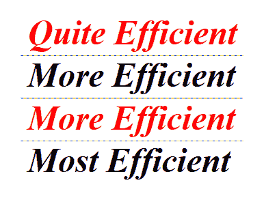

# 第十一章：提升应用程序性能

通常来说，**Windows Presentation Foundation**（WPF）应用程序的性能是其最大的问题之一。我们的渲染数据对象和 UI 包含的视觉层越多，渲染它们所需的时间就越长，因此我们通常需要在使应用程序视觉吸引力和提高性能之间保持平衡。

通过在更强大的计算机上运行我们的 WPF 应用程序，可以改善这种状况。这也解释了为什么这些应用程序在金融行业中最为普遍。然而，并不是每个人都能承担起为所有用户更新计算机的费用。

幸运的是，我们有多种方法可以提升我们的 WPF 应用程序的性能，我们将在下面探讨这些方法。提升应用程序性能的技巧实际上归结于进行许多小的改进，这些改进累积起来会产生明显的效果。

在本章中，我们将探讨如何更好地利用计算机图形卡的图形渲染能力，并更有效地声明我们的资源。我们将研究如何通过选择使用更轻量级的 UI 控件、更高效的数据绑定模式以及采用其他技术（如虚拟化）来提高应用程序的性能。

# 利用硬件渲染的强大功能

正如我们已经学到的，WPF 可以输出的视觉效果虽然美丽，但可能非常 CPU 密集型，我们在设计视图时需要牢记这一点。然而，我们不必牺牲设计，可以将密集的渲染过程卸载到宿主计算机的**图形处理单元**（GPU）上。

虽然 WPF 默认会使用其软件渲染管道，但它也能利用硬件渲染管道。这个硬件管道利用了 Microsoft DirectX 的特性，只要宿主 PC 安装了 DirectX 7 或更高版本。此外，如果安装的 DirectX 版本为 9 或更高，性能提升会更加明显。

WPF 框架会查看运行在其上的计算机上安装的图形硬件，并根据其特性（如视频 RAM、着色器和多纹理支持）将其分为三类。如果它不支持 DirectX 7 或更高版本，则被归类为渲染层级 0，并且完全不会用于硬件渲染。

然而，如果它支持 DirectX 7 或更高版本，但低于版本 9，则被归类为渲染层级 1，并将用于部分硬件渲染。然而，由于几乎所有新的显卡都支持高于 9 版本的 DirectX，它们都会被归类为渲染层级 2，并用于完全硬件渲染。

由于在渲染过程中 UI 将会冻结，因此应尽量减少需要渲染的视觉层数量。因此，对于将在具有渲染等级 0 的图形硬件上运行且使用软件渲染的 WPF 应用程序，我们需要格外小心。

然而，如果我们的应用程序可能需要在较旧的计算机上运行，或者具有较旧图形硬件的计算机上运行，我们可以通过渲染等级来检测这一点，并在这些情况下运行更高效的代码。我们可以使用`RenderCapability`类的静态`Tier`属性来找出主机计算机图形硬件的渲染等级。

不幸的是，这个属性的类型并不是某种有用的枚举，而实际上是一个整数，其中只有高位字表示等级的值，可以是`0`、`1`或`2`。我们可以通过在整数中移位位来获取它，只从最后两个字节读取值：

```cs
using System.Windows.Media;

...

int renderingTier = RenderCapability.Tier >> 16; 
```

一旦我们知道主机计算机图形硬件的渲染等级，我们就可以相应地编写代码。例如，让我们想象我们有一个处理器密集型的视图，其中包含大量视觉元素，每个元素都由集合中的每个项目组成。我们可以将等级值设置到一个属性中，并将其数据绑定到视图上，这样我们就可以根据主机计算机的处理能力选择不同的数据模板。让我们通过首先创建缺失的枚举来检查这个示例：

```cs
namespace CompanyName.ApplicationName.DataModels.Enums 
{ 
  public enum RenderingTier 
  { 
    Zero = 0, 
    One = 1, 
    Two = 2 
  } 
} 
```

接下来，我们需要在我们的`StateManager`类中添加一个`RenderingTier`类型的属性，该类来自第三章，*编写自定义应用程序框架*：

```cs
public RenderingTier RenderingTier { get; set; } 
```

我们不需要通知`INotifyPropertyChanged`接口关于此属性任何更改，因为它将在应用程序启动时只设置一次。让我们调整我们之前的示例：

```cs
public App() 
{ 
  StateManager.Instance.RenderingTier =  
    (RenderingTier)(RenderCapability.Tier >> 16); 
} 
```

在将移位后的整数值转换为我们的`RenderingTier`枚举并将其设置到`StateManager`类中的新`RenderingTier`属性之后，我们就可以开始在视图中使用它，以确定我们可以使用多少可视化级别：

```cs
<ListBox ItemsSource="{Binding Products}"> 
  <ListBox.Style> 
    <Style TargetType="{x:Type ListBox}"> 
      <Setter Property="ItemTemplate"  
        Value="{StaticResource SimpleDataTemplate}" /> 
      <Style.Triggers> 
        <DataTrigger Binding="{Binding  
          StateManager.Instance.RenderingTier}" Value="One"> 
          <Setter Property="ItemTemplate"  
            Value="{StaticResource MoreComplexDataTemplate}" /> 
        </DataTrigger> 
        <DataTrigger Binding="{Binding  
          StateManager.Instance.RenderingTier}" Value="Two"> 
          <Setter Property="ItemTemplate"  
            Value="{StaticResource MostComplexDataTemplate}" /> 
        </DataTrigger> 
      </Style.Triggers> 
    </Style> 
  </ListBox.Style> 
</ListBox> 
```

在这个示例中，我们有一个`ListBox`控件，它正在显示一组产品。我们的想法是可以声明三个不同的数据模板来定义每个产品将看起来是什么样子。我们有一个`SimpleDataTemplate`模板，它可能只提供基于文本的输出，一个`MoreComplexDataTemplate`模板，它可能包含一些基本视觉元素，以及一个`MostComplexDataTemplate`模板，它可能包含多层视觉元素。

在应用于列表框的样式中，我们将默认的`SimpleDataTemp``late`模板设置为它的`ItemTemplate`属性的值。然后，使用`StateManager`类的`RenderingTier`属性，我们声明了一些数据触发器，根据主机计算机的渲染等级将`ItemTemplate`属性的值切换到更复杂的模板之一。

# 制作更高效资源

当我们引用资源时，我们可以使用`StaticResource`或`DynamicResource`。如果你还记得第五章中的内容，即*为工作选择正确的控件*，`StaticResource`将只查找资源值一次，这相当于编译时查找。而`DynamicResource`每次请求资源时都会重复查找资源值，无论其是否已更改，就像运行时查找一样。

因此，我们只有在真正需要时才应使用`DynamicResource`，因为我们可以通过使用`StaticResource`类来获得更好的性能。如果我们发现我们需要使用大量的`DynamicResource`引用来访问资源，那么我们可以重构我们的代码，将数据绑定到`StateManager`类中的属性，而不是资源，以提高性能。

提高资源性能的另一种简单方法是将它们重用。我们不应在 XAML 中它们被使用的位置内联声明它们，而应在合适的资源部分声明它们并引用它们。

这样，每个资源只创建一次并共享。为了进一步扩展这个想法，我们可以在`App.xaml`文件中的应用程序资源中定义所有共享资源，并在所有应用程序视图中共享它们。

想象一下这样的情况：一些画笔资源在`DataTemplate`元素内的 XAML 中被内联声明。现在想象这个模板被设置为`ItemsControl`对象的`ItemTemplate`，并且绑定到其`ItemsSource`属性集合包含了一千个元素。

因此，应用程序将为每个在数据模板中局部声明的具有相同属性的画笔创建一千个画笔对象。现在将此与另一种情况进行比较，在这种情况下，我们只需在资源部分声明一次所需的画笔，并从模板中引用它。这种方法的好处和可以节省的计算机资源是显而易见的。

此外，这个想法也影响了我们的视图的`Resources`部分，特别是如果我们同时显示多个视图时。如果我们声明一个视图来定义集合中每个对象应该如何渲染，那么在集合中的每个元素上都会初始化一次在视图中声明的所有资源。在这种情况下，在应用程序级别声明它们会更好。

# 冻结对象

在 WPF 中，某些资源对象，如动画、几何形状、画笔和笔，可以被设置为`Freezable`。这提供了可以帮助提高我们 WPF 应用程序性能的特殊功能。`Freezable`对象可以是冻结的或非冻结的。在非冻结状态下，它们的行为就像任何其他对象一样；然而，当冻结时，它们变得不可变，并且不能再被修改。

冻结对象的主要好处是它可以提高应用程序的性能，因为冻结的对象在监控和发布更改通知时不再需要消耗资源。另一个好处是，冻结的对象也可以安全地在线程之间共享，这与未冻结的对象不同。

许多与 UI 相关的对象扩展了 `Freezable` 类以提供此功能，并且大多数 `Freezable` 对象都与图形子系统相关，因为渲染视觉是性能提升最需要的领域之一。

例如，`Brush`、`Geometry` 和 `Transform` 类等类包含非托管资源，系统必须监控它们的变化。通过冻结这些对象并使它们不可变，系统能够释放其监控资源，并在其他地方更好地利用它们。此外，冻结对象的内存占用也远小于其未冻结的对应物。

因此，为了获得最大的性能提升，我们应该习惯在所有 `Resource` 部分中冻结所有资源，只要我们没有修改它们的计划。由于大多数资源通常保持未修改状态，我们通常能够冻结绝大多数资源，并通过这样做获得显著和明显的性能提升。

在第八章，*创建视觉吸引人的用户界面*中，我们学习了如何通过调用其 `Freeze` 方法在代码中冻结 `Freezable` 对象。现在，让我们看看我们如何在 XAML 中冻结我们的资源。首先，我们需要向表示选项命名空间添加一个 XAML 命名空间前缀，以便访问其 `Freeze` 属性：

```cs
xmlns:PresentationOptions=
  "http://schemas.microsoft.com/winfx/2006/xaml/presentation/options 
" 
mc:Ignorable="PresentationOptions" 
```

注意，我们还包括另一个 XAML 命名空间前缀，以便能够访问 `Ignorable` 属性，并将我们的 `PresentationOptions` 前缀设置为它的值。这是因为 `Freeze` 属性主要只被 WPF XAML 处理器识别，并且为了与其他 XAML 读取器保持兼容性，我们需要指定该属性可以被忽略。

我们将在即将到来的*得出结论*部分找到一个完整的示例，但现在，让我们使用早期示例中的一个资源，来探讨如何在 XAML 中冻结一个 `Freezable` 对象：

```cs
<DropShadowEffect x:Key="Shadow" BlurRadius="10" Direction="270"  
  ShadowDepth="7" Opacity="0.5" PresentationOptions:Freeze="True" /> 
```

一些 `Freezable` 对象，例如动画和几何对象，可以包含其他 `Freezable` 对象。当一个 `Freezable` 对象被冻结时，其子对象也会被冻结。然而，也有一些情况下 `Freezable` 对象无法被冻结。

如果它有任何可能因动画、数据绑定或 `DynamicResource` 引用而改变值的属性，则会出现一种情况。另一种情况发生在 `Freezable` 对象有任何无法冻结的子对象时。

例如，如果我们正在自定义控件的代码后部冻结资源类型对象，那么我们可以调用 `Freezable` 类的 `CanFreeze` 属性来检查每个 `Freezable` 对象是否可以冻结，然后再尝试冻结它们：

```cs
EllipseGeometry ellipseGeometry =  
  new EllipseGeometry(new Rect(0, 0, 500, 250)); 
if (ellipseGeometry.CanFreeze) ellipseGeometry.Freeze(); 
Path.Data = ellipseGeometry; 
```

一旦`Freezable`对象被冻结，它就不能再被修改，尝试修改它将引发`InvalidOperationException`异常。请注意，`Freezable`对象不能被解冻；因此，为了避免这种情况，我们可以在尝试修改对象之前检查`IsFrozen`属性的值。如果它被冻结，我们可以使用它的`Clone`方法制作一个副本并对其进行修改：

```cs
if (ellipseGeometry.IsFrozen) 
{ 
  EllipseGeometry ellipseGeometryClone = ellipseGeometry.Clone(); 
  ellipseGeometryClone.RadiusX = 400; 
  ellipseGeometryClone.Freeze();
  Path.Data = ellipseGeometryClone; 
} 
else ellipseGeometry.RadiusX = 400; 
```

如果克隆了一个`Freezable`对象，它可能拥有的任何`Freezable`子对象也将被复制以允许修改。当一个冻结对象被动画化时，动画系统会以这种方式创建它的克隆副本，以便它可以修改它们。但是，由于这会增加性能开销，因此如果预期对象将被动画化，建议不要冻结`Freezable`对象。

# 使用适合性能的控件

如前所述，在使用 WPF 时，通常有几种不同的方法可以实现相同的功能或 UI 显示。有些方法比其他方法提供更好的性能。例如，我们了解到一些面板执行更密集的布局工作，因此比其他面板消耗更多的 CPU 周期和/或 RAM。

因此，这是我们可以在其中进行调查以改进性能的一个领域。如果我们不需要`Grid`面板的复杂布局和调整大小能力，那么我们可以通过利用更高效的`StackPanel`或`Canvas`面板来获得性能提升。

另一个例子可能是，如果我们不需要在集合控件中选择的能力，那么我们应该使用`ItemsControl`元素而不是`ListBox`。虽然交换一个控件本身不会对性能产生太大的改善，但在将此相同的交换应用于将显示数千次的项目的`DataTemplate`中，将会产生明显的差异。

正如我们在第五章“使用适合工作的控件”中发现的，每次渲染 UI 元素时，布局系统必须完成两个遍历，一个测量遍历和一个排列遍历，这共同被称为布局遍历。如果元素有子元素和/或孙元素，它们都需要完成布局遍历。这个过程很复杂，遍历次数越少，我们的视图渲染速度就越快。

如前所述，我们需要小心确保不会不必要地触发布局系统的额外遍历，因为这可能导致性能下降。这种情况可能发生在向或从面板添加或删除项目、对元素应用转换或调用`UIElement.UpdateLayout`方法时，后者会强制进行新的布局遍历。

由于 UI 元素的变化会使其子元素无效并强制进行新的布局遍历，因此在代码中构建层次化数据时，我们需要特别小心。如果我们首先创建子元素，然后是它们的父对象，然后是这些对象的父对象，依此类推，我们将因为现有的子项被迫执行多次布局遍历而遭受巨大的性能损失。

为了解决这个问题，我们需要始终确保从上到下构建我们的树，而不是像刚才描述的那样从上到下。如果我们首先添加父元素（们），然后添加它们的子元素，如果有，再添加这些子元素的父元素，等等，我们就可以避免额外的布局遍历。使用自上而下的方法可以提升性能，大约快五倍，因此这一点不容忽视。让我们看看我们可以采用的更多与控制相关的性能优势。

# 绘制结论

当我们需要在 UI 中绘制形状时，例如在 第八章 的示例中，即“创建视觉上吸引人的用户界面”，我们倾向于使用抽象的 `Shape` 类，或者更准确地说，使用其一或多个派生类。

`Shape` 类扩展了 `FrameworkElement` 类，因此可以利用布局系统，可以进行样式化，可以访问一系列的描边和填充属性，其属性可以进行数据绑定和动画处理。这使得它易于使用，并且通常是 WPF 应用程序中绘制形状的首选方法。

然而，WPF 也提供了更底层的类，这些类可以以更高效的方式实现相同的结果。扩展抽象 `Drawing` 类的五个类具有更小的继承层次结构，因此与基于 `Shape` 对象的对应类相比，它们的内存占用更小。

最常用的两个类包括用于绘制几何形状的 `GeometryDrawing` 类，以及用于将多个绘图对象组合成单个复合绘图的 `DrawingGroup` 类。

此外，`Drawing` 类还被 `GlyphRunDrawing` 类扩展，用于渲染文本；`ImageDrawing` 类用于显示图像；以及 `VideoDrawing` 类，它使我们能够播放视频文件。由于 `Drawing` 类扩展了 `Freezable` 类，如果这些实例之后不需要修改，通过冻结其实例可以进一步节省效率。

在 WPF 中绘制形状还有另一种方法，可能甚至更高效。`DrawingVisual` 类不提供事件处理或布局功能，因此与其它绘图方法相比，其性能得到了提升。然而，这是一个仅限代码的解决方案，没有基于 XAML 的 `DrawingVisual` 选项。

此外，它缺乏布局能力意味着，为了显示它，我们需要创建一个扩展提供 UI 布局支持的类（如 `FrameworkElement` 类）的类。然而，为了更高效，我们也可以扩展 `Visual` 类，因为这是在 UI 中可以渲染的最轻量级的类，具有最少的属性和无需处理的事件。

这个类将负责维护一个要渲染的 `Visual` 元素集合，创建一个或多个 `DrawingVisual` 对象以添加到集合中，并重写一个属性和一个方法，以便参与渲染过程。它还可以选择性地提供事件处理和点击测试功能，如果需要用户交互的话。

这完全取决于我们想要绘制的内容。通常，绘图越高效，其灵活性就越低。例如，如果我们只是绘制一些静态的剪贴画、背景图像，或者可能是标志，我们可以利用更高效的绘图方法。然而，如果我们需要我们的绘图随着应用程序窗口大小的变化而增长和缩小，那么我们就需要使用灵活性更高的、效率较低的方法，或者使用另一个提供该功能的类。

让我们探索一个示例，使用三种不同的绘图方法创建相同的图形图像。我们将定义一些笑脸表情符号，从左侧的基于 `Shape` 的方法开始，中间是基于 `Drawing` 对象的方法，右侧是基于 `DrawingVisual` 的方法。让我们首先看看视觉输出：


现在，让我们检查一下 XAML：

```cs
<UserControl x:Class="CompanyName.ApplicationName.Views.DrawingView" 

  xmlns:Controls=
    "clr-namespace:CompanyName.ApplicationName.Views.Controls" 
  xmlns:PresentationOptions=
    "http://schemas.microsoft.com/winfx/2006/xaml/presentation/options" 
  Width="450" Height="150"> 
  <Grid> 
    <Grid.Resources> 
      <RadialGradientBrush x:Key="RadialBrush" RadiusX="0.8" RadiusY="0.8"
        PresentationOptions:Freeze="True"> 
        <GradientStop Color="Orange" Offset="1.0" /> 
        <GradientStop Color="Yellow" /> 
      </RadialGradientBrush> 
    </Grid.Resources> 
    <Grid.ColumnDefinitions> 
      <ColumnDefinition /> 
      <ColumnDefinition /> 
      <ColumnDefinition /> 
    </Grid.ColumnDefinitions> 
    <Grid> 
      <Grid.RowDefinitions> 
        <RowDefinition Height="3*" /> 
        <RowDefinition Height="2*" /> 
        <RowDefinition Height="2*" /> 
        <RowDefinition Height="2*" /> 
        <RowDefinition Height="3*" /> 
      </Grid.RowDefinitions> 
      <Grid.ColumnDefinitions> 
        <ColumnDefinition /> 
        <ColumnDefinition /> 
        <ColumnDefinition /> 
        <ColumnDefinition /> 
        <ColumnDefinition /> 
      </Grid.ColumnDefinitions> 
      <Ellipse Grid.RowSpan="5" Grid.ColumnSpan="5"  
        Fill="{StaticResource RadialBrush}" Stroke="Black"  
        StrokeThickness="5" /> 
      <Ellipse Grid.Row="1" Grid.Column="1" Fill="Black" Width="20"  
        HorizontalAlignment="Center" /> 
      <Ellipse Grid.Row="1" Grid.Column="3" Fill="Black" Width="20"  
        HorizontalAlignment="Center" /> 
      <Path Grid.Row="3" Grid.Column="1" Grid.ColumnSpan="3" Stroke="Black"
        StrokeThickness="10" StrokeStartLineCap="Round"
        StrokeEndLineCap="Round" Data="M0,10 A10,25 0 0 0 12.5,10" 
        Stretch="Fill" HorizontalAlignment="Stretch" /> 
    </Grid> 
    <Canvas Grid.Column="1"> 
      <Canvas.Background> 
        <DrawingBrush PresentationOptions:Freeze="True"> 
          <DrawingBrush.Drawing> 
            <DrawingGroup> 
              <GeometryDrawing Brush="{StaticResource RadialBrush}"> 
                <GeometryDrawing.Geometry> 
                  <EllipseGeometry Center="50,50" RadiusX="50"  
                    RadiusY="50" /> 
                </GeometryDrawing.Geometry> 
                <GeometryDrawing.Pen> 
                  <Pen Thickness="3.5" Brush="Black" /> 
                </GeometryDrawing.Pen> 
              </GeometryDrawing> 
              <GeometryDrawing Brush="Black"> 
                <GeometryDrawing.Geometry> 
                  <EllipseGeometry Center="29.5,33" RadiusX="6.75"  
                    RadiusY="8.5" /> 
                </GeometryDrawing.Geometry> 
              </GeometryDrawing> 
              <GeometryDrawing Brush="Black"> 
                <GeometryDrawing.Geometry> 
                  <EllipseGeometry Center="70.5,33" RadiusX="6.75"  
                    RadiusY="8.5" /> 
                </GeometryDrawing.Geometry> 
              </GeometryDrawing> 
              <GeometryDrawing> 
                <GeometryDrawing.Geometry> 
                  <PathGeometry> 
                    <PathGeometry.Figures> 
                      <PathFigure StartPoint="23,62.5"> 
                        <ArcSegment Point="77,62.5" Size="41 41" /> 
                      </PathFigure> 
                    </PathGeometry.Figures> 
                  </PathGeometry> 
                </GeometryDrawing.Geometry> 
                <GeometryDrawing.Pen> 
                  <Pen Thickness="7" Brush="Black" StartLineCap="Round"
                    EndLineCap="Round" /> 
                </GeometryDrawing.Pen> 
              </GeometryDrawing> 
            </DrawingGroup> 
          </DrawingBrush.Drawing> 
        </DrawingBrush> 
      </Canvas.Background> 
    </Canvas> 
    <Canvas Grid.Column="2"> 
      <Canvas.Background> 
        <VisualBrush> 
          <VisualBrush.Visual> 
            <Controls:SmileyFace /> 
          </VisualBrush.Visual> 
        </VisualBrush> 
      </Canvas.Background> 
    </Canvas> 
  </Grid> 
</UserControl> 
```

从这个例子中，我们可以立即看到的第一件事是，基于 `Shape` 对象的绘图方法要简单得多，用更少的 XAML 代码行就能达到与基于更冗长的 `Drawing` 对象的方法相同的输出。现在让我们来研究一下代码。

在定义了 `PresentationOptions` XAML 命名空间之后，我们声明了一个 `RadialGradientBrush` 资源，并通过使用本章前面讨论过的 `Freeze` 属性来冻结它，从而优化其效率。请注意，如果我们打算同时多次使用这个控件，那么我们可以通过在应用程序资源中声明所有的 `Brush` 和 `Pen` 对象，并使用 `StaticResource` 引用来引用它们，来进一步提高效率。

然后，我们声明一个外部的 `Grid` 面板，它有两个列。在左侧列中，我们声明另一个 `Grid` 面板，有五行和五列。这个内部面板用于定位构成第一个笑脸的各种 `Shape` 元素。请注意，我们在这个面板的行定义上使用星号大小，以略微增加顶部和底部行的大小，以便更好地定位眼睛和嘴巴。

在面板内部，我们定义一个`Ellipse`对象来创建脸的整体形状，用资源中的画笔填充它，并用黑色画笔添加轮廓。然后我们使用两个进一步填充黑色画笔的`Ellipse`元素来绘制眼睛，以及一个`Path`元素来绘制微笑。请注意，我们没有填充`Path`元素，因为这看起来更像是一个张开的嘴巴而不是微笑。

需要注意的两个其他重要点是，我们必须将`Stretch`属性设置为`Fill`，以便让`Path`元素填充我们提供的可用空间，并且我们必须将`StrokeStartLineCap`和`StrokeEndLineCap`属性设置为`Round`，以产生微笑的圆润末端。

我们指定`Path`元素应使用的形状，使用其`Data`属性和之前使用的内联迷你语言。现在让我们将这个值分解成各种迷你语言命令：

```cs
M0,10 A10,25 0 0 0 12.5,10 
```

与前面的例子一样，我们首先使用指定为`M`和随后的坐标对的移动命令，这决定了线的起点。其余部分由椭圆弧命令组成，该命令由`A`和随后的五个参数指定。

按顺序，椭圆弧命令的五个参数与弧的大小有关，或者说是其*x*和*y*半径，旋转角度，一个位字段用于指定弧的角度是否应该大于 180 度，另一个位字段用于指定弧应该顺时针还是逆时针绘制，最后是弧的终点。

这个路径迷你语言语法的完整细节可以在微软网站上找到。请注意，我们可以将绘制方向的位字段更改为`1`，以绘制一个皱眉：

```cs
M0,10 A10,25 0 0 1 12.5,10 
```

现在，让我们转向外部`Grid`面板的第二列。在这一列中，我们重新创建相同的笑脸，但使用更高效的基于`Drawing`对象的对象。由于它们不能像`Shape`类那样自行渲染，我们需要利用其他元素来完成这项工作，因此我们定义它们在`DrawingBrush`元素内部，并使用它来绘制`Canvas`对象的背景。

这里有两个需要注意的重要事项。首先，我们本可以使用`DrawingBrush`元素来绘制任何扩展`FrameworkElement`类的类，例如`Rectangle`元素或另一种类型的面板。

第二点是，由于我们使用`Freeze`属性冻结了`DrawingBrush`元素，所有扩展`Freezable`类型的内部元素也将被冻结。在这种情况下，这包括`GeometryDrawing`对象、`EllipseGeometry`和`PathGeometry`对象，甚至用于绘制它们的`Brush`和`Pen`元素。

当使用`DrawingBrush`对象来渲染我们的绘图时，我们必须使用`Drawing`属性来定义它们。由于我们希望从多个基于`Drawing`的对象构建我们的图像，我们需要将它们全部包裹在一个`DrawingGroup`对象中。

为了重新创建脸的整体形状，我们从一个`GeometryDrawing`元素开始，并指定一个`EllipseGeometry`对象作为其`Geometry`属性值。使用这个`GeometryDrawing`元素，我们通过设置我们的`RadialGradientBrush`资源引用到其`Brush`属性来绘制背景，并在其`Pen`属性中定义一个新的`Pen`实例以指定其轮廓。

与所有`Geometry`对象一样，我们指定其尺寸，使它们相互成比例，而不是使用确切的像素大小。例如，我们的视图高度为 150 像素；然而，我们并没有将这个`EllipseGeometry`对象的`Center`属性设置为 75，即高度的一半，而是将其设置为 50。

由于两个半径属性也设置为 50，它们与中心的相对位置保持一致，因此生成的图像按比例缩放以适应其渲染的容器。我们使用的比例取决于我们的偏好。例如，我们可以在我们的绘图示例中将所有坐标、半径、画笔和笔触厚度都除以相同的数值，最终得到相同的面视觉。

接下来，我们为脸上的两个眼睛各自添加另一个具有`EllipseGeometry`对象指定在其`Drawing`属性中的`GeometryDrawing`元素。这些没有轮廓，因此`Pen`属性没有分配任何内容，并且仅使用黑色`Brush`设置其`Brush`属性进行着色。最后的`GeometryDrawing`元素承载了一个绘制脸上微笑的`PathGeometry`对象。

注意，在 XAML 中定义`PathGeometry`对象比使用路径迷你语言语法更为冗长。在其中，我们需要在`PathFigures`集合属性中指定每个`PathFigure`元素，尽管实际上在 XAML 中声明周围集合是可选的。在我们的笑脸示例中，我们只需要定义一个包含`ArcSegment`对象的单个`PathFigure`元素。

`PathFigure`元素的`StartPoint`属性决定了弧应该开始的位置，`ArcSegment`对象的`Size`属性与弧的大小相关，或者其*x*和*y*半径，而其`Point`属性指定了弧的终点。

为了定义与之前笑脸相同的圆滑端点，我们指定给这个`PathGeometry`对象的`Pen`元素必须将其`StartLineCap`和`EndLineCap`属性设置为`PenLineCap`枚举的`Round`成员。这完成了绘制笑脸的第二种方法。

第三种方法在代码内部使用`DrawingVisual`对象，并生成一个`Visual`对象。由于`Grid`面板的`Children`集合中的项是`UIElement`类型，我们无法直接将其添加到其中。相反，我们可以将其设置为`VisualBrush`元素的`Visual`属性，并使用它来绘制一个高效容器（如`Canvas`控件）的背景。

现在我们来看看`SmileyFace`类中的代码：

```cs
using System; 
using System.Collections.Generic; 
using System.Windows; 
using System.Windows.Media; 

namespace CompanyName.ApplicationName.Views.Controls 
{ 
  public class SmileyFace : Visual 
  { 
    private VisualCollection visuals; 

    public SmileyFace() 
    { 
      visuals = new VisualCollection(this); 
      visuals.Add(GetFaceDrawingVisual()); 
    } 

    private DrawingVisual GetFaceDrawingVisual() 
    { 
      RadialGradientBrush radialGradientBrush =  
        new RadialGradientBrush(Colors.Yellow, Colors.Orange); 
      radialGradientBrush.RadiusX = 0.8; 
      radialGradientBrush.RadiusY = 0.8; 
      radialGradientBrush.Freeze(); 
      Pen outerPen = new Pen(Brushes.Black, 5.25); 
      outerPen.Freeze(); 
      DrawingVisual drawingVisual = new DrawingVisual(); 
      DrawingContext drawingContext = drawingVisual.RenderOpen(); 
      drawingContext.DrawEllipse(radialGradientBrush, outerPen,  
        new Point(75, 75), 72.375, 72.375);  
      drawingContext.DrawEllipse(Brushes.Black, null,  
        new Point(44.25, 49.5), 10.125, 12.75); 
      drawingContext.DrawEllipse(Brushes.Black, null,  
        new Point(105.75, 49.5), 10.125, 12.75); 
      ArcSegment arcSegment = 
        new ArcSegment(new Point(115.5, 93.75), new Size(61.5, 61.5), 0,
        false, SweepDirection.Counterclockwise, true); 
      PathFigure pathFigure = new PathFigure(new Point(34.5, 93.75),  
        new List<PathSegment>() { arcSegment }, false); 
      PathGeometry pathGeometry =  
        new PathGeometry(new List<PathFigure>() { pathFigure }); 
      pathGeometry.Freeze(); 
      Pen smilePen = new Pen(Brushes.Black, 10.5); 
      smilePen.StartLineCap = PenLineCap.Round; 
      smilePen.EndLineCap = PenLineCap.Round; 
      smilePen.Freeze(); 
      drawingContext.DrawGeometry(null, smilePen, pathGeometry); 
      drawingContext.Close(); 
      return drawingVisual; 
    } 

    protected override int VisualChildrenCount 
    { 
      get { return visuals.Count; } 
    } 

    protected override Visual GetVisualChild(int index) 
    { 
      if (index < 0 || index >= visuals.Count)  
        throw new ArgumentOutOfRangeException(); 
      return visuals[index]; 
    } 
  } 
} 
```

我们可以从几个类中扩展我们的`SmileyFace`类，以便在 UI 中显示它。正如我们在第五章中看到的，*使用适合工作的正确控件*，大多数 UI 控件都有丰富的继承层次结构，每个扩展类都提供了一些特定的功能。

为了使我们的`DrawingVisual`最有效的容器，我们希望扩展一个类，使其能够参与布局过程，但通过未使用的属性和不必要的事件处理尽可能减少额外的开销。因此，我们选择了`Visual`类，它不能直接在 XAML 中用作 UI 元素，但它可以作为`VisualBrush`元素的视觉并用于绘制表面。

为了在`SmileyFace`类中生成一个或多个`DrawingVisual`元素，我们需要声明并维护一个`VisualCollection`实例，该实例将包含我们想要显示的`Visual`元素。在构造函数中，我们初始化这个集合，并通过`GetFaceDrawingVisual`方法将我们想要渲染的单个`DrawingVisual`元素添加到其中。

在`GetFaceDrawingVisual`方法中，我们首先使用`RadialGradientBrush`类和一个`Pen`元素声明我们`RadialBrush`资源的新版本，并使用它们的`Freeze`方法将其冻结。接下来，我们初始化一个单独的`DrawingVisual`元素，并从其`RenderOpen`方法中访问一个`DrawingContext`对象，以便绘制我们的形状。

我们使用`DrawingContext`对象首先绘制作为脸部背景的椭圆。它使用冻结的`Brush`和`pen`元素着色。请注意，由于`Visual`类没有`Stretch`属性或大小概念，我们在这里使用的维度是精确的设备无关像素维度，而不是像之前绘图方法中使用的那种相对值。

在这个例子中，我们的笑脸宽度为 150 像素，高度为 150 像素，因此中心位置将是其一半。因此，这些精确的像素值可以通过将之前基于`Drawing`的示例中的相对值乘以`1.5`来计算。

然而，我们还需要考虑这样一个事实，轮廓将有一半在绘制内部，一半在绘制外部。因此，我们需要调整这个椭圆的两个半径，将它们减少到轮廓大小的一半。由于用于这个椭圆的笔的厚度为`5.25`设备无关像素，我们需要将每个半径减少`2.625`。

接下来，我们再次调用`DrawEllipse`方法来绘制每个眼睛，传入一个黑色画刷和没有`Pen`元素，以及它们新计算的位置和大小。对于微笑，我们首先需要创建一个`ArcSegment`元素并将其添加到`PathSegment`类型的集合中，同时初始化一个`PathFigure`对象。

然后，我们将 `PathFigure` 对象添加到一个集合中，并将其传递给 `PathGeometry` 对象的构造函数以初始化它。接下来，我们定义将用于绘制笑脸的 `Pen` 对象，确保我们将它的 `StartLineCap` 和 `EndLineCap` 属性设置为 `PenLineCap` 枚举的 `Round` 成员，就像之前的例子一样。

然后，我们将这个 `Pen` 对象冻结，并将其与 `PathGeometry` 对象一起传递给 `DrawingContext` 对象的 `DrawGeometry` 方法来绘制它。最后，我们使用其 `Close` 方法关闭绘图上下文，并返回我们刚刚创建的单个 `DrawingVisual` 元素。

虽然我们现在已经处理了绘制笑脸的代码，但在 UI 中我们仍然看不到任何东西。为了参与渲染过程，我们需要覆盖 `Visual` 类的几个成员，即 `VisualChildrenCount` 属性和 `GetVisualChild` 方法。

当覆盖这些成员时，我们需要通知 `Visual` 类它为我们渲染的视觉元素。因此，我们只需从 `VisualChildrenCount` 属性返回我们内部 `VisualCollection` 对象中的项目数量，并从 `GetVisualChild` 方法返回与指定 `index` 输入参数相关的集合中的项目。

在这个例子中，我们添加了对 `index` 输入参数无效值的检查，尽管如果我们最初从 `VisualChildrenCount` 属性输出正确数量的项目，这种情况永远不会发生。

因此，现在我们已经看到了三种不同的绘图方法来创建相同的视觉输出，每个方法都比前一个更高效。然而，除了效率差异之外，我们还应该意识到这些绘图方法在元素操作和多功能性方面的差异。

例如，让我们调整我们的 `DrawingView` 类的 `Width`，将其 `ClipToBounds` 属性设置为 `true`，并查看其新的输出：

```cs
  Width="225" Height="150" ClipToBounds="True"> 
```

现在我们再次运行应用程序并查看输出：


如前一个截图所示，这些绘图方法在调整大小时表现不同。第一个方法在当前大小下重新绘制，每条绘制线的厚度保持不变，尽管这个脸的宽度已经被提供给它的父 `Grid` 面板的空隙所缩小。

然而，第二个和第三个笑脸实际上看起来像被压扁的图像，其中每条线的厚度不再静态；线条越垂直，现在它就越细。这些脸的整体宽度也已经被父 `Grid` 面板调整。

然而，第三个脸部却只被用于显示它的 `VisualBrush` 对象进行了缩放。如果我们不是扩展 `Visual` 类，而是从 `UIElement` 类派生以利用其一些功能，或者可能使我们能够直接在 XAML 中显示我们的 `SmileyFace` 控件，那么我们会看到不同的输出。让我们对我们的类声明做一些轻微的调整：

```cs
public class SmileyFace : UIElement 
```

现在我们也直接在 XAML 中显示它，替换掉之前显示它的 `Canvas` 和 `VisualBrush` 对象：

```cs
<Controls:SmileyFace Grid.Column="2" /> 
```

现在，如果我们再次运行应用程序并查看输出，它看起来会非常不同：


由于我们为绘图指定了精确的值，我们的 `SmileyFace` 控件没有扩展任何能够实现调整大小或缩放的类，而且我们也不再拥有 `VisualBrush` 对象来调整它的大小。也就是说，绘图将保持完整的大小，除了它现在不再适合从父 `Grid` 面板提供的空间。

为了将绘制不同大小形状的能力构建到我们的类中，我们需要从提供额外属性和功能性的类中派生它。`FrameworkElement` 类为我们提供了可以使用来绘制所需大小形状的尺寸属性，以及一个 `Loaded` 事件，我们可以使用它来延迟构建我们的形状，直到布局系统计算出相关的大小。

让我们检查我们需要做出的更改以实现这一点：

```cs
public class SmileyFace : FrameworkElement 
{ 
  ...

  public SmileyFace() 
  { 
    visuals = new VisualCollection(this); 
    Loaded += SmileyFace_Loaded; 
  } 

  private void SmileyFace_Loaded(object sender, RoutedEventArgs e) 
  { 
    visuals.Add(GetFaceDrawingVisual()); 
  } 

  private DrawingVisual GetFaceDrawingVisual() 
  { 
    ... 
    DrawingVisual drawingVisual = new DrawingVisual(); 
    DrawingContext drawingContext = drawingVisual.RenderOpen(); 
    drawingContext.DrawEllipse(radialGradientBrush, outerPen,  
      new Point(ActualWidth / 2, ActualHeight / 2), (ActualWidth -  
      outerPen.Thickness) / 2, (ActualHeight - outerPen.Thickness) / 2); 
    drawingContext.DrawEllipse(Brushes.Black, null, new Point(
      ActualWidth / 3.3898305084745761, ActualHeight / 3.0303030303030303),
      ActualWidth / 14.814814814814815, ActualHeight / 11.764705882352942); 
    drawingContext.DrawEllipse(Brushes.Black, null, new Point(
      ActualWidth / 1.4184397163120568, ActualHeight / 3.0303030303030303),
      ActualWidth / 14.814814814814815, ActualHeight / 11.764705882352942); 
    ArcSegment arcSegment = new ArcSegment(new Point(ActualWidth /  
      1.2987012987012987, ActualHeight / 1.6), new Size(ActualWidth /
      2.4390243902439024, ActualHeight /  2.4390243902439024), 0, false,
      SweepDirection.Counterclockwise, true); 
    PathFigure pathFigure = new PathFigure(new Point(ActualWidth /  
      4.3478260869565215, ActualHeight / 1.6), new List<PathSegment>() {
      arcSegment }, false); 
    PathGeometry pathGeometry =
      new PathGeometry(new List<PathFigure>() { pathFigure }); 
    ... 
    return drawingVisual; 
  } 

  ...
} 
```

第一个更改是我们需要将生成形状的调用从构造函数移动到 `SmileyFace_Loaded` 处理方法。如果我们没有移动这个调用，我们的形状将没有大小，因为用于定义其大小的 `ActualWidth` 和 `ActualHeight` 属性在那个时间点还没有被布局系统设置。

接下来，在 `GetFaceDrawingVisual` 方法中，我们需要将硬编码的值替换为控件尺寸的分割。绘制整个脸部的椭圆计算简单，其位置为控件宽度和高度的一半，半径为控件宽度和高度的一半减去绘制轮廓的 `Pen` 元素厚度的一半。

然而，如果你想知道所有剩余的长小数除数值是从哪里来的，答案是基本的数学。原始绘图宽度和高度都是 `150` 像素，因此我们可以将这个值除以之前示例中绘制的线条的各种位置和大小。

例如，绘制第一个眼睛的椭圆之前是居中的，`X` 位置为 `44.25`。因此，为了计算我们所需的宽度除数，我们只需将 `150` 除以 `44.25`，结果为 `3.3898305084745761`。因此，当控件提供 `150` 像素的空间时，它将在 `X` 位置 `44.25` 处绘制左眼，并且现在将在所有其他大小上正确缩放。

每个绘制形状的位置和大小除数都是使用这种方法计算的，以确保它们能够适当地适应提供给我们的控件的空间。请注意，我们同样可以改变画笔和笔的粗细，但在这个例子中为了简洁我们没有这样做。

当现在运行这个示例时，我们再次得到了一个略微不同的输出：


现在，第一面和第三面的外观更相似，它们绘制的线条的厚度在长度上是静态且不变的，与第二面不同。因此，我们可以看到在创建自定义绘图时有很多选择，我们需要在效率的需求与绘图方法的易用性之间取得平衡，同时也要考虑最终图像的使用。

在进入本章的下一个主题之前，我们在绘制复杂形状时还可以做出一些额外的效率提升。如果我们的代码使用了大量的`PathGeometry`对象，那么我们可以通过使用`StreamGeometry`对象来替换它们。

`StreamGeometry`类专门优化了处理多个路径几何形状，并且比使用多个`PathGeometry`实例的性能更好。实际上，我们已经在无意中使用`StreamGeometry`类了，因为当 XAML 读取器解析绑定路径迷你语言语法时，它内部使用的就是这个类。

它可以与`StringBuilder`类类似地考虑，即它比使用多个`PathGeometry`类的实例绘制复杂形状更有效率，但它也有一些开销，因此只有在替换相当数量的它们时才会对我们有益。

最后，而不是使用`VisualBrush`来显示我们的`DrawingVisual`，`VisualBrush`在每次布局过程中都会刷新，如果我们的绘图在 UI 中永远不会被操作，那么从它们创建实际图像并显示这些图像将更加高效。

`RenderTargetBitmap`类为我们提供了一个简单的方法，通过其`Render`方法从`Visual`实例创建图像。让我们看看一个这样的例子：

```cs
using System.IO; 
using System.Windows.Media; 
using System.Windows.Media.Imaging;

...

RenderTargetBitmap renderTargetBitmap = new RenderTargetBitmap( 
  (int)ActualWidth, (int)ActualHeight, 96, 96, PixelFormats.Pbgra32); 
renderTargetBitmap.Render(drawingVisual); 
renderTargetBitmap.Freeze();  
PngBitmapEncoder image = new PngBitmapEncoder(); 
image.Frames.Add(BitmapFrame.Create(renderTargetBitmap)); 
using (Stream stream = File.Create(filePath)) 
{ 
  image.Save(stream); 
} 
```

我们首先初始化一个`RenderTargetBitmap`对象，指定要创建的图像所需的尺寸、分辨率和像素格式。请注意，静态`PixelFormats`类的`Pbgra32`成员指定了一个遵循 sRGB 格式的像素格式，每个像素使用 32 位，每个 alpha、红色、绿色和蓝色通道每个像素接收 8 位。

接下来，我们将我们的`DrawingVisual`元素或任何扩展了`Visual`类的其他元素传递给`RenderTargetBitmap`类的`Render`方法以渲染它。为了使操作更加高效，我们随后调用它的`Freeze`方法来冻结对象。

为了保存 PNG 图像文件，我们首先初始化一个 `PngBitmapEncoder` 对象，并通过 `BitmapFrame` 类的 `Create` 方法将 `renderTargetBitmap` 变量添加到其 `Frames` 集合中。最后，我们使用 `File.Create` 方法初始化一个 `Stream` 对象，传入所需的文件名和路径，并调用其 `Save` 方法将文件保存到计算机的硬盘上。或者，可以使用 `JpegBitmapEncoder` 类来创建 JPG 图像文件。

现在我们来探讨如何更有效地使用图像。

# 更高效地使用图像

当在 WPF 应用程序中显示图像时，它默认以全尺寸加载和解码。如果你的应用程序显示来自原始图像的多个缩略图，那么通过复制你的全尺寸图像并将它们调整到缩略图正确的尺寸，而不是让 WPF 为你完成，你可以获得更好的性能。

或者，你可以要求 WPF 将你的图像解码到缩略图所需的大小，尽管如果你想要显示全尺寸图像，你实际上需要分别解码每个全尺寸图像。让我们看看如何通过使用 `BitmapImage` 对象作为 `Image` 控件的源来实现这一点：

```cs
<Image Width="64"> 
  <Image.Source> 
    <BitmapImage DecodePixelWidth="64" UriSource="pack://application:,,,/
      CompanyName.ApplicationName;component/Images/Image1.png" /> 
  </Image.Source> 
</Image> 
```

这个示例中的重要部分是 `BitmapImage` 类的 `DecodePixelWidth` 属性，它指定了解码到图像的实际大小。在这个示例中，这将导致更小的内存占用以及更快的渲染速度。

注意，如果 `BitmapImage` 类的 `DecodePixelHeight` 和 `DecodePixelWidth` 属性都设置了，将根据它们的值计算一个新的宽高比。然而，如果只设置其中一个属性，则将使用图像的原始宽高比。因此，通常只设置其中一个属性，以便将图像解码到与原始大小不同的尺寸，同时保持其宽高比。

通常，当在 WPF 应用程序中使用图像时，它们在加载时都会被缓存到内存中。如果在上述场景中使用代码，还可以获得的一个好处是将 `BitmapImage` 类的 `CacheOption` 属性设置为 `OnDemand` 枚举成员，这将推迟相关图像的缓存，直到实际请求显示图像。

这可以在加载时节省大量的资源，尽管每个图像在首次显示时将稍微慢一点。然而，一旦图像被缓存，它将完全以默认方式创建的图像相同的方式工作。

在`BitmapImage`类中还有一个额外的属性，可以在加载多个图像文件时提高性能。`CreateOptions`属性是`BitmapCreateOptions`枚举类型，使我们能够指定与图像加载相关的初始化选项。此枚举可以使用位组合设置，因为它在其声明中指定了`FlagsAttribute`属性。

可以使用`DelayCreation`成员来延迟每个图像的初始化，直到实际需要时，从而加快加载相关视图的过程，同时在实际需要时请求每个图像的过程会增加微小的成本。

这将有利于例如照片画廊类型的应用程序，例如，每个完整尺寸图像的初始化可以延迟到用户点击相应的缩略图时。只有在那时，图像才会被创建，但由于那时只需创建单个图像，因此初始化时间可以忽略不计。

虽然可以使用位或运算符（`|`）将多个这些成员设置为`CreateOptions`属性，但应注意不要同时设置`PreservePixelFormat`成员，除非确实需要，因为这可能会导致性能降低。当未设置时，系统将默认选择具有最佳性能的像素格式。让我们来看一个简短的例子：

```cs
private Image CreateImageEfficiently(string filePath) 
{ 
  Image image = new Image(); 
  BitmapImage bitmapImage = new BitmapImage(); 
  bitmapImage.BeginInit(); 
  bitmapImage.CacheOption = BitmapCacheOption.OnDemand; 
  bitmapImage.CreateOptions = BitmapCreateOptions.DelayCreation; 
  bitmapImage.UriSource = new Uri(filePath, UriKind.Absolute);
  bitmapImage.Freeze();
  bitmapImage.EndInit();
  image.Source = bitmapImage; 
  return image; 
}
```

在代码中创建图像时，我们需要初始化`BitmapImage`类的一个实例，将其用作将在 UI 中显示的实际`Image`对象的数据源。在这样做时，我们需要在对其进行更改之前调用其`BeginInit`方法，然后在其之后调用`EndInit`方法。请注意，初始化之后所做的所有更改都将被忽略。

在初始化过程中，我们将`CacheOption`属性设置为`OnDemand`成员，将`CreateOptions`属性设置为`DelayCreation`成员。请注意，我们在此处没有设置`DecodePixelWidth`或`DecodePixelHeight`属性，因为此代码示例是为初始化我们画廊示例中的完整尺寸图像而设置的。

此外，请注意，在这个特定的例子中，我们使用绝对文件路径初始化`Uri`对象，通过将`UriKind`枚举的`Absolute`成员传递给构造函数。如果您更喜欢使用相对文件路径，可以将此行更改为指定相对文件路径，通过将`UriKind`枚举的`Relative`成员传递给构造函数：

```cs
bitmapImage.UriSource = new Uri(filePath, UriKind.Relative); 
```

现在回到示例的末尾，我们可以看到对`Freeze`方法的调用，这确保了`BitmapImage`对象将是不可修改的，并且处于其最有效状态。如果稍后需要修改图像，则可以省略此行。

最后，我们调用 `EndInit` 方法来表示 `BitmapImage` 对象初始化的结束，将 `BitmapImage` 对象设置为返回的 `Image` 对象的 `Source` 属性值，然后返回 `Image` 对象给方法调用者。

现在我们已经看到了一些关于如何更有效地显示我们的图像的提示，让我们来调查一下我们如何为我们的应用程序的文本输出做同样的事情。

# 提升文本输出的性能

WPF 提供了与绘制形状类似的选择来创建文本；输出方法越灵活，使用起来就越容易，但效率就越低，反之亦然。我们中的绝大多数人选择最简单但效率最低的方法，即使用高级的 `TextBlock` 或 `Label` 元素。

虽然在典型表单中使用时这通常不会给我们带来任何问题，但在数据网格或其他集合控件中显示成千上万的文本块时，肯定有改进的空间。如果我们需要格式化文本，我们可以利用更高效的 `FormattedText` 对象；否则，我们可以使用最低级的方法和最有效的 `Glyphs` 元素。

让我们看看一个例子：

```cs
<UserControl x:Class="CompanyName.ApplicationName.Views.TextView" 

  xmlns:Controls=
    "clr-namespace:CompanyName.ApplicationName.Views.Controls" 
  Height="250" Width="325"> 
  <Grid ShowGridLines="True"> 
    <Grid.RowDefinitions> 
      <RowDefinition /> 
      <RowDefinition /> 
      <RowDefinition /> 
      <RowDefinition /> 
    </Grid.RowDefinitions> 
    <Label Content="Quite Efficient" FontFamily="Times New Roman"  
      FontSize="50" FontWeight="Bold" FontStyle="Italic"  
      Foreground="Red" Margin="10,0,0,0" Padding="0" /> 
    <TextBlock Grid.Row="1" Text="More Efficient" 
      FontFamily="Times New Roman" FontSize="50" FontWeight="Bold"
      FontStyle="Italic" Foreground="Black" Margin="10,0,0,0" /> 
    <Controls:FormattedTextOutput Grid.Row="2" Text="More Efficient" /> 
    <Glyphs Grid.Row="3" UnicodeString="Most Efficient"  
      FontUri="C:\WINDOWS\Fonts\timesbi.TTF" FontRenderingEmSize="50"  
      Fill="Black" OriginX="10" OriginY="45" /> 
  </Grid> 
</UserControl> 
```

在这里，我们有一个包含四个行的 `Grid` 面板的视图。第一行包含一个 `Label` 控件，尽管相当高效，但在这里显示的文本输出方法中效率最低，并且正如我们很快就会看到的，它只应在非常特定的情况下使用。在其上，我们指定 `FontFamily`、`FontSize`、`FontWeight`、`FontStyle` 和 `Foreground` 属性来定义其文本的外观。

第二行包含一个 `TextBlock` 元素，它稍微高效一些，并且像 `Label` 元素一样，我们直接在其上指定 `FontFamily`、`FontSize`、`FontWeight`、`FontStyle` 和 `Foreground` 属性。值得注意的是，为了产生相同的视觉输出，我们不需要将其 `Padding` 属性设置为 `0`，这在 `Label` 控件中是必需的。

在第三行，我们有一个自定义的 `FormattedTextOutput` 控件，它内部使用 `FormattedText` 对象，并且仍然稍微高效一些。正如我们很快就会看到的，我们需要在代码中指定这个文本对象的相关属性。

最后，我们在第四行看到一个 `Glyphs` 元素，这代表了在 WPF 应用程序中输出文本的最有效方法。请注意，当使用这种文本输出方法时，我们不是通过名称指定字体族，而是将其精确的字体文件路径设置为 `FontUri` 属性。

由于我们想要匹配 Times New Roman 字体的粗体斜体版本，我们需要特别设置文件路径到那个确切的文件。因此，我们需要指定 `timesbi.ttf` 文件，而不是正常的 `times.ttf` 版本。除了将字体大小设置为 `FontRenderingEmSize` 属性以及将边距设置为 `OriginX` 和 `OriginY` 属性外，这个类相当直观。

在继续之前，让我们首先看看这个视图的视觉输出：



现在我们来看看`FormattedTextOutput`类内部的代码：

```cs
using System.Globalization; 
using System.Windows; 
using System.Windows.Media; 

namespace CompanyName.ApplicationName.Views.Controls 
{ 
  public class FormattedTextOutput : FrameworkElement 
  { 
    public static readonly DependencyProperty TextProperty =  
      DependencyProperty.Register(nameof(Text), typeof(string),
      typeof(FormattedTextOutput), new FrameworkPropertyMetadata( 
      string.Empty, FrameworkPropertyMetadataOptions.AffectsRender)); 

    public string Text 
    { 
      get { return (string)GetValue(TextProperty); } 
      set { SetValue(TextProperty, value); } 
    } 

    protected override void OnRender(DrawingContext drawingContext) 
    { 
      DpiScale dpiScale = VisualTreeHelper.GetDpi(this); 
      FormattedText formattedText = new FormattedText(Text, 
        CultureInfo.GetCultureInfo("en-us"), FlowDirection.LeftToRight, 
        new Typeface("Times New Roman"), 50, Brushes.Red, 
        dpiScale.PixelsPerDip);
      formattedText.SetFontStyle(FontStyles.Italic); 
      formattedText.SetFontWeight(FontWeights.Bold); 
      drawingContext.DrawText(formattedText, new Point(10, 0)); 
    } 
  } 
} 
```

`FormattedTextOutput`类相对简单，只有一个依赖属性及其关联的 CLR 包装和一个重写的基类方法。一个非常重要的一点是，我们使用`FrameworkPropertyMetadataOptions`枚举的`AffectsRender`成员来指定更改此属性需要引起新的渲染过程。

通常，`Text`属性将在`UIElement`基类调用`OnRender`方法之后从任何数据绑定中更新。如果不指定此选项，我们的类将永远不会输出任何数据绑定的值。通过指定此选项，我们实际上是在告诉框架每次此属性值更改时都再次调用`OnRender`方法。

在重写的`OnRender`方法中，我们首先使用基本属性初始化一个`FormattedText`对象，例如要渲染的文本、当前的区域设置以及要使用的字体颜色、大小和类型。可以通过类公开的各种设置方法设置额外的样式属性。最后，我们调用由`drawingContext`输入参数指定的`DrawingContext`对象的`DrawText`方法，传入`FormattedText`对象和渲染位置。

注意，我们可以使用数据绑定与所有这些文本渲染方法，所以现在让我们更新之前的示例来演示这一点：

```cs
...
<Label Content="{Binding Text}" FontFamily="Times New Roman"  
  FontSize="50" FontWeight="Bold" FontStyle="Italic" Foreground="Red"
  Margin="10,0,0,0" Padding="0" /> 
<TextBlock Grid.Row="1" Text="{Binding Text}" 
  FontFamily="Times New Roman" FontSize="50" FontWeight="Bold"
  FontStyle="Italic" Foreground="Red" Margin="10,0,0,0" /> 
<Controls:FormattedTextOutput Grid.Row="2" Text="{Binding Text}" /> 
<Glyphs Grid.Row="3" UnicodeString="{Binding Text}" FontUri=
  "C:\WINDOWS\Fonts\timesbi.TTF" FontRenderingEmSize="50"  
  Fill="Black" OriginX="10" OriginY="45" /> 
...
```

对于这个示例，我们可以在我们的视图模型中简单地硬编码一个值：

```cs
namespace CompanyName.ApplicationName.ViewModels 
{ 
  public class TextViewModel : BaseViewModel 
  { 
    public string Text { get; set; } = "Efficient"; 
  } 
} 
```

虽然我们可以在使用所有这些文本输出方法时进行数据绑定，但也有一些需要注意的事项。我们刚刚了解到与我们自定义的`FormattedTextOutput`类中的`Text`属性所需的元数据相关的一个问题，还有一个与`Glyphs`类相关的问题。

它有一个要求，即如果表示提供要渲染的文本的替代方法的`Indicies`属性也为空，则`UnicodeString`属性不能为空。遗憾的是，由于这个要求，尝试像我们在扩展示例中所做的那样将数据绑定到`UnicodeString`属性，将导致编译错误：

```cs
Glyphs Indices and UnicodeString properties cannot both be empty.
```

为了解决这个问题，我们可以简单地为`Binding`类的`FallbackValue`属性提供一个值，这样`Glyphs`类就可以确信，即使没有数据绑定的值，其`UnicodeString`属性也将有一个非空值。

注意，将`FallbackValue`属性设置为空字符串将导致抛出相同的错误：

```cs
<Glyphs Grid.Row="3" UnicodeString="{Binding Text, FallbackValue='Data
  Binding Not Working'}" FontUri="C:\WINDOWS\Fonts\timesbi.TTF"
  FontRenderingEmSize="50" Fill="Black" OriginX="10" OriginY="45" /> 
```

关于数据绑定还有一个进一步的问题；然而，这次它涉及到`Label`类的`Content`属性。因为`string`类型是不可变的，每次数据绑定的值更新`Content`属性时，之前的`string`类型将被丢弃并替换为新的类型。

此外，如果使用默认的`ContentTemplate`元素，它将在每次替换属性字符串时生成一个新的`TextBlock`元素并丢弃之前的元素。因此，更新数据绑定的`TextBlock`比更新`Label`控件快大约四倍。因此，如果我们需要更新我们的数据绑定的文本值，我们不应使用`Label`控件。

实际上，每种渲染文本的方法都有其特定的目的。`Label`控件应专门用于在表单中标记文本字段，并且通过这样做，我们可以利用其访问键功能及其引用目标控件的能力。`TextBlock`元素是一种通用的文本输出方法，应该大多数时候使用。

`FormattedText`对象应该只在我们需要以特定方式格式化某些文本时使用。它提供了输出具有广泛效果的文本的能力，例如能够独立绘制文本的轮廓和填充，以及格式化渲染文本字符串中的特定字符范围。

`Glyphs`类直接扩展了`FrameworkElement`类，因此它非常轻量级，并且在我们需要比使用替代方法更有效地重新创建文本输出时应该使用它。尽管`FormattedText`类可以利用较低级别的核心类来渲染其输出，但渲染文本最有效的方法是使用`Glyphs`对象。

# 喜欢链接

正如您已经看到的，我们在视图中使用的每个 UI 元素都需要时间来渲染。简单来说，我们使用的元素越少，视图显示得就越快。那些在我们视图中使用过`Hyperlink`元素的人可能已经知道，我们不能单独显示它们，而必须将它们包裹在一个`TextBlock`元素中。

然而，由于每个`Hyperlink`元素都是自包含的，拥有自己的导航 URI、内容和属性选项，我们实际上可以在单个`TextBlock`元素中显示多个它们。这将减少渲染时间；因此，我们可以移除的`TextBlock`元素越多，它就会变得越快。让我们看一个例子：

```cs
<ListBox ItemsSource="{Binding Products}" FontSize="14"  
  HorizontalContentAlignment="Stretch"> 
  <ListBox.ItemTemplate> 
    <DataTemplate DataType="{x:Type DataModels:Product}"> 
      <Grid> 
        <Grid.ColumnDefinitions> 
          <ColumnDefinition /> 
          <ColumnDefinition Width="Auto" /> 
          <ColumnDefinition Width="Auto" /> 
        </Grid.ColumnDefinitions> 
        <TextBlock Text="{Binding Name}" /> 
        <TextBlock Grid.Column="1" 
          Text="{Binding Price, StringFormat=C}" Margin="10,0" /> 
        <StackPanel Grid.Column="2" TextElement.FontSize="14"  
          Orientation="Horizontal"> 
          <TextBlock> 
            <Hyperlink Command="{Binding ViewCommand,  
              RelativeSource={RelativeSource  
              AncestorType={x:Type Views:TextView}}}"  
              CommandParameter="{Binding}">View</Hyperlink> 
          </TextBlock> 
          <TextBlock Text=" | " /> 
          <TextBlock> 
            <Hyperlink Command="{Binding EditCommand,  
              RelativeSource={RelativeSource  
              AncestorType={x:Type Views:TextView}}}"  
              CommandParameter="{Binding}">Edit</Hyperlink> 
          </TextBlock> 
          <TextBlock Text=" | " /> 
          <TextBlock> 
            <Hyperlink Command="{Binding DeleteCommand,  
              RelativeSource={RelativeSource  
              AncestorType={x:Type Views:TextView}}}"  
              CommandParameter="{Binding}">Delete</Hyperlink> 
          </TextBlock> 
        </StackPanel> 
      </Grid> 
    </DataTemplate> 
  </ListBox.ItemTemplate> 
</ListBox> 
```

在这里，我们有一个`Product`对象的集合，这些对象绑定到`ListBox`上，每个项目都显示其名称、价格以及以`Hyperlink`对象形式呈现的三个命令。在继续之前，让我们看看它是什么样子：


现在专注于链接，我们的示例在每个项目中使用九个 UI 元素来渲染这三个链接。`StackPanel`元素将它们全部组合在一起，每个`Hyperlink`对象都有自己的`TextBlock`元素和另外两个`TextBlock`元素来显示管道分隔符字符。

`Hyperlink` 对象绑定到视图模型中的命令，而 `CommandParameter` 属性绑定到整个 `Product` 对象，该对象被设置为每个项目的数据源。这样，当点击链接时，我们将能够访问视图模型中的相关 `Product` 实例。

虽然这个 XAML 没有什么问题，但如果我们需要更高效，那么我们可以用以下 `TextBlock` 元素替换 `StackPanel` 中的所有内容以及面板本身：

```cs
<TextBlock Grid.Column="2" TextElement.FontSize="14" Foreground="White"> 
  <Hyperlink Command="{Binding ViewCommand, RelativeSource={ 
    RelativeSource AncestorType={x:Type Views:TextView}}}"  
    CommandParameter="{Binding}">View</Hyperlink> 
  <Run Text=" | " /> 
  <Hyperlink Command="{Binding EditCommand, RelativeSource={ 
    RelativeSource AncestorType={x:Type Views:TextView}}}"  
    CommandParameter="{Binding}">Edit</Hyperlink> 
  <Run Text=" | " /> 
  <Hyperlink Command="{Binding DeleteCommand, RelativeSource={ 
    RelativeSource AncestorType={x:Type Views:TextView}}}"  
    CommandParameter="{Binding}">Delete</Hyperlink> 
</TextBlock> 
```

如你所见，我们现在将所有三个 `Hyperlink` 对象都放在一个单独的 `TextBlock` 元素中，并用 `Run` 对象替换了显示管道字符的两个 `TextBlock` 元素。使用 `Run` 类比在另一个 `TextBlock` 元素中使用一个 `TextBlock` 元素要高效得多。

现在，我们只需要为每个项目渲染六个元素来生成链接，包括使用两个更高效的元素，每个项目渲染的元素减少三个。然而，如果我们有 1,000 个产品，我们最终将渲染 3,000 个更少的 UI 元素，用 2,000 个更高效的替换，所以很容易看出这可以很快地积累成一些真正的效率节省。

在这个例子中，我们可以通过简单地删除每个链接下的行来进一步改进。令人惊讶的是，如果我们删除它们的下划线，我们可以将渲染我们的 `Hyperlink` 元素所需的时间减少高达 25%。我们可以通过将它们的 `TextDecorations` 属性设置为 `None` 来做到这一点：

```cs
<Hyperlink ... TextDecorations="None">View</Hyperlink> 
```

我们可以通过仅在用户的鼠标光标悬停在链接上时显示下划线来进一步扩展这个想法。这样，我们仍然提供了视觉确认，表明链接实际上是一个链接，但我们节省了初始渲染时间：

```cs
<Style TargetType="{x:Type Hyperlink}">
  <Setter Property="TextDecorations" Value="None" />
  <Style.Triggers>
    <Trigger Property="IsMouseOver" Value="True">
      <Setter Property="TextDecorations" Value="Underline" />
    </Trigger>
  </Style.Triggers>
</Style>
```

现在，让我们将注意力转向在应用程序中的数据绑定时可以做出的多项性能改进。

# 数据绑定

当数据绑定时，性能的最简单改进可以通过正确设置 `Binding.Mode` 属性来获得。为了使数据绑定成为可能，框架会附加处理程序来监听我们数据绑定属性的变化。

对于双向绑定，事件处理程序将被附加到 `INotifyPropertyChanged` 接口的 `PropertyChanged` 事件，以监听我们数据模型对象或视图模型中的变化，以及相关绑定目标控件中的各种其他 `XxxChanged` 事件，以监听基于 UI 的属性变化。

当我们只需要单向绑定时，我们可以通过将 `Binding` 类的 `Mode` 属性设置为 `BindingMode` 枚举的适当成员来节省一些计算资源。如果你还记得，当一个数据绑定属性仅用于显示目的时，我们应该将其 `Mode` 属性设置为 `OneWay`，而当我们不需要从视图模型更新可编辑字段时，我们应该将其 `Mode` 属性设置为 `OneWayToSource` 成员。

在这样做的时候，我们减少了监听变化的处理程序数量，因此可以释放资源以供实际需要的地方使用。再次强调，仅对单个绑定执行此操作的影响将微乎其微，但如果我们对每个相关的绑定都这样做，那么效率的提高将开始产生差异。

另一个良好的实践是，为每个我们声明的绑定设置`Binding`类的`FallbackValue`属性。如第四章中提到的*精通数据绑定*，这样做将阻止 WPF 框架在数据绑定错误时查找目标依赖属性的默认值，并防止生成和输出跟踪语句。

同样，设置`TargetNullValue`属性与设置`FallbackValue`属性相似，因为它比不设置它稍微高效一些。再次强调，在单个绑定上这样做的影响可以忽略不计；然而，如果我们对每个绑定都这样做，它将为渲染或其他所需过程释放 CPU 周期。

实际上，提高我们应用程序性能的最佳绑定相关方法是简单地修复我们可能有的任何数据绑定错误。每次绑定无法解析时，框架都会执行一系列检查，消耗宝贵的资源，正如本节前面所提到的。因此，当涉及到性能时，保持输出窗口没有绑定错误是必须的。

# 注册依赖属性

正如我们在本章前面的*使用正确的控件以获得性能*部分所看到的，在设置我们的依赖属性元数据时，我们需要小心。在注册依赖属性时错误地指定框架元数据可能会降低性能，迫使布局系统进行不必要的额外布局遍历。

尤其是在指定`FrameworkPropertyMetadataOptions`枚举中的任何`AffectsMeasure`、`AffectsArrange`、`AffectsParentMeasure`、`AffectsParentArrange`或`AffectsRender`成员时，我们需要格外小心，并确保它们确实是必需的。

同样，如果我们注册依赖属性时指定了`FrameworkPropertyMetadataOptions`枚举的`Inherits`成员，那么实际上是在增加属性无效化所需的时间长度。因此，我们应该确保这个特定的元数据成员仅在真正需要时使用。

最后一个可以改善应用程序性能的元数据选项是`SubPropertiesDoNotAffectRender`成员。如果我们的依赖属性类型是引用类型，我们可以指定这个枚举成员以阻止布局系统检查对象的所有子属性的变化，否则它将默认这样做。

虽然我们可能需要调用`DependencyProperty`类的`OverrideMetadata`方法来覆盖.NET Framework 中现有属性的元数据，但这会带来轻微的性能影响。当我们为我们的自定义依赖属性设置元数据时，我们应该始终使用适当的`Register`或`RegisterAttached`方法来指定我们的要求，因为这提供了更好的性能。

同样，当注册我们的自定义依赖属性时，我们也应该使用相关的`Register`或`RegisterAttached`方法设置它们的默认值，因为它们被创建时，而不是在构造函数中逐个实例化，或者使用其他方法。

# 绑定到集合

如你所可能意识到的，当在 WPF 应用程序中处理将要更新的集合时，我们倾向于使用泛型的`ObservableCollection<T>`类。原因在于这个类实现了`INotifyCollectionChanged`接口，该接口会通知监听者集合的变化，例如添加、删除或清除项目。

我们可能没有意识到，使用此类来保存我们的数据集合可以带来惊人的性能提升。例如，与泛型的`List<T>`类相比，我们注意到它不会自动引发任何集合更改事件。为了使视图能够显示更新的集合，我们需要将其重置为相关集合控件的相关`ItemsSource`属性值。

然而，每次设置`ItemsSource`属性时，数据绑定集合控件都会清除其当前的项目列表并完全重新生成它们，这可能会是一个耗时的过程。因此，向`ObservableCollection<T>`添加单个项目大约需要 20 毫秒来渲染，但重置`ItemsSource`属性值可能需要超过 1.5 秒。

然而，如果我们的集合是不可变的，并且我们不会以任何方式更改它，我们就不需要使用泛型的`ObservableCollection<T>`类，因为我们不需要它的更改处理程序。与其浪费资源在未使用的更改处理程序上，我们可以使用不同类型的集合类。

当将不可变集合绑定到 UI 控件时，虽然没有首选的集合类型，但我们应尽量避免使用`IEnumerable`类作为集合容器。此类不能直接由`ItemsControl`类使用，并且当它被使用时，WPF 框架将生成一个泛型的`IList<T>`集合来包装`IEnumerable`实例，这也可能对性能产生负面影响。

在接下来的几节中，我们将探讨其他我们可以高效显示大量集合的方法。

# 缩小数据对象

很常见，我们的应用程序将拥有相当大的数据对象，拥有数十个甚至数百个属性。如果我们有数千个这样的数据对象，并且为每个数据对象加载所有属性，我们的应用程序会变慢，甚至可能耗尽内存。

我们可能会认为，如果我们简单地不填充所有属性值，就可以节省 RAM；然而，如果我们使用相同的类，我们很快就会发现，即使是这些属性的默认值或空值也可能消耗太多的内存。一般来说，除了少数例外，未设置的属性与已设置的属性占用相同的 RAM。

如果我们的数据模型对象具有非常多的属性，一个解决方案是将它分解成更小的部分。例如，我们可以创建多个较小的子产品类，如`ProductTechnicalSpecification`、`ProductDescription`、`ProductDimension`、`ProductPricing`等。

而不是构建一个巨大的视图来编辑整个产品，我们还可以提供多个较小的视图，可能甚至可以从同一视图的不同标签页中访问。这样，我们就可以只加载`ProductDescription`对象供用户选择，然后在每个子视图中加载产品的各个部分。

通过这种方法可以获得显著的性能提升，因为绑定到一个具有许多属性的单一对象可能需要比绑定到具有较少属性的许多对象多四倍的时间。

将我们的数据对象拆分成更小的部分的一个替代方案是使用瘦数据对象的概念。例如，假设我们的`Product`类有数十个属性，而我们有成千上万的产品。我们可以创建一个只包含用于识别在选中时加载的完整数据对象以及显示在产品集合中的属性的`ThinProduct`类。

在这种情况下，我们可能只需要在`ThinProduct`类中设置两个属性，一个唯一的标识属性和一个显示名称属性。这样，我们可以将产品的内存占用减少 10 倍甚至更多。这意味着它们可以从数据库中加载并在极短的时间内显示，比完整的`Product`对象快得多。

为了方便在`Product`和`ThinProduct`类之间进行数据传输，我们可以在每个类中添加构造函数，该构造函数接受另一个类型并更新相关属性：

```cs
using System; 

namespace CompanyName.ApplicationName.DataModels 
{ 
  public class ThinProduct : BaseDataModel 
  { 
    private Guid id = Guid.Empty; 
    private string name = string.Empty; 

    public ThinProduct(Product product) 
    { 
      Id = product.Id; 
      Name = product.Name; 
    } 

    public Guid Id 
    { 
      get { return id; } 
      set { if (id != value) { id = value;
        NotifyPropertyChanged(); } } 
    } 

    public string Name 
    { 
      get { return name; } 
      set { if (name != value) { name = value;
        NotifyPropertyChanged(); } } 
    } 

    public override string ToString() 
    { 
      return Name; 
    } 
  } 
} 
```

在这个`ThinProduct`类中的属性基本上反映了我们之前看到的`Product`类中的属性，但只是用于识别每个实例的属性。添加了一个构造函数，它接受一个类型为`Product`的输入参数，以实现两个类之间的轻松转换。类似的构造函数也添加到`Product`类中，但它接受一个类型为`ThinProduct`的输入参数：

```cs
public Product(ThinProduct thinProduct) : this() 
{ 
  Id = thinProduct.Id; 
  Name = thinProduct.Name; 
} 
```

理念是我们有一个视图模型，它显示大量产品，在代码中，我们实际上加载了大量这些更轻的 `ThinProduct` 实例。当用户选择一个产品进行查看或编辑时，我们使用所选项目的标识号来加载与该标识符相关的完整 `Product` 对象。

给定一个名为 `Products` 的属性中的这些 `ThinProduct` 实例的基础集合，我们可以这样实现。首先，让我们将我们的集合绑定到一个 `ListBox` 控件上：

```cs
<ListBox ItemsSource="{Binding Products}" 
  SelectedItem="{Binding Products.CurrentItem}" ... /> 
```

当用户从列表中选择一个产品时，集合的 `CurrentItem` 属性将持有所选项目的引用。如果我们在一开始加载集合时将其 `CurrentItemChanged` 代理附加到一个处理程序上，我们就可以在项目被选中时得到通知。

在这一点上，我们可以使用所选 `ThinProduct` 实例的标识符来加载完整的 `Product` 对象，并将相关的反馈输出给用户：

```cs
private void Products_CurrentItemChanged(ThinProduct oldProduct,  
  ThinProduct newProduct) 
{ 
  GetDataOperationResult<Product> result =  
    await Model.GetProductAsync(newProduct.Id); 
  if (result.IsSuccess) Product = result.ReturnValue; 
  else FeedbackManager.Add(result, false); 
} 
```

在下一节中，我们将了解如何使用集合控件更有效地显示我们的大量集合，而不是将我们的大型类拆分成更小的类或创建相关联的轻量级数据对象。

# 虚拟化集合

当我们在集合控件中显示大量项目时，可能会对应用程序的性能产生负面影响。这是因为布局系统将为数据绑定集合中的每个项目创建一个布局容器，例如，在 `ComboBox` 的情况下，创建一个 `ComboBoxItem`。由于在任何时候只显示完整项目数的一小部分，我们可以利用虚拟化来改善这种情况。

UI 虚拟化将生成和布局这些项目容器推迟到每个项目实际上在相关集合控件中可见时，通常可以节省大量资源。如果我们使用 `ListBox` 或 `ListView` 控件来显示我们的集合，我们可以利用虚拟化而不必做任何事情，因为它们默认使用它。

在 `ComboBox`、`ContextMenu` 和 `TreeView` 控件中也可以启用虚拟化，尽管这需要手动完成。当使用 `TreeView` 控件时，我们可以通过将 `VirtualizingStackPanel.IsVirtualizing` 附加属性设置为 `True` 来启用虚拟化：

```cs
<TreeView ItemsSource="{Binding Items}" 
  VirtualizingStackPanel.IsVirtualizing="True" /> 
```

对于内部使用 `StackPanel` 类的其他控件，例如 `ComboBox` 和 `ContextMenu` 控件，我们可以通过将一个包含 `VirtualizingStackPanel` 类实例的 `ItemsPanelTemplate` 元素设置为 `ItemsPanel` 属性，并将它的 `IsVirtualizing` 属性设置为 `True` 来启用虚拟化：

```cs
<ComboBox ItemsSource="{Binding Items}"> 
  <ComboBox.ItemsPanel> 
    <ItemsPanelTemplate> 
      <VirtualizingStackPanel IsVirtualizing="True" /> 
    </ItemsPanelTemplate> 
  </ComboBox.ItemsPanel> 
</ComboBox> 
```

除了将 `IsVirtualizing` 属性设置为 `False` 之外，还有其他一些原因可能导致 UI 虚拟化不起作用。一种情况是项目容器已被手动添加到 `ItemsControl` 对象或其派生控件中。另一种情况是项目容器具有不同的类型。

虚拟化可能不起作用的最后一个原因并不那么明显，它与`ScrollViewer`类的`CanContentScroll`属性有关。这是一个有趣的属性，它指定了集合控件中的`ScrollViewer`是否将以逻辑单位或物理单位滚动其项。默认值是`False`，这意味着以物理单位平滑滚动。

物理单位与 WPF 工作的设备无关像素相关，而逻辑单位与集合项的宽度或高度相关，这取决于控件的方向。由于`CanContentScroll`属性的默认值是`False`，因此需要将其设置为`True`以启用虚拟化。这样，滚动是逐项进行的，而不是逐像素进行的。

当在扩展`ItemsControl`类的集合控件中使用虚拟化，并且用户滚动时，会为新的可见项创建新的项容器，并且不再可见的项的容器将被销毁。

在.NET Framework 3.5 版本中，引入了对虚拟化系统的优化。容器回收使集合控件能够重用项容器，而不是在用户滚动时创建新的容器并丢弃旧的容器。这提供了额外的性能优势，可以通过将`VirtualizationMode`附加属性设置为`Recycling`值来启用：

```cs
<TreeView ItemsSource="{Binding Items}" 
  VirtualizingStackPanel.IsVirtualizing="True" /> 
  VirtualizingStackPanel.VirtualizationMode="Recycling" /> 
```

WPF 为我们提供的另一个进一步优化是延迟滚动。通常，在集合控件中滚动会持续更新 UI。然而，如果我们的数据项或它们的项容器有多个定义它们的视觉层，并且滚动速度较慢，我们可以选择将 UI 更新延迟到滚动完成。

为了在集合控件上启用延迟滚动，我们需要将`ScrollViewer.IsDeferredScrollingEnabled`附加属性设置为`True`。尽管我们通常不在 XAML 中直接使用`ScrollViewer`元素，但我们也可以将此属性附加到在其控件模板中包含`ScrollViewer`元素的集合控件上：

```cs
<ListBox ItemsSource="{Binding Items}"
  ScrollViewer.IsDeferredScrollingEnabled="True" /> 
```

我们现在已经调查了我们可以通过计算机硬件、资源、正确的控件选择、绘制和显示图像的方法、输出文本、链接、数据绑定、最小化内存占用以及数据虚拟化来实现的性能改进。只有一个关键领域需要考虑，那就是事件，所以让我们看看下一个。

# 处理事件

应用程序中出现内存泄漏的最常见原因之一是未能移除不再需要的处理程序。当我们以常规方式将事件处理程序附加到对象的某个事件上时，我们实际上是在向该对象传递处理程序的引用，并为其创建了一个硬引用。

当对象不再需要且可能被释放时，引发事件的那个对象中的引用将阻止这种情况发生。这是因为垃圾收集器无法收集可以从应用程序代码的任何部分访问的对象。在最坏的情况下，保持对象存活可能包含许多其他对象，因此无意中也将它们保持存活。

这个问题在于，在对象不再需要后继续保持对象存活将无谓地增加应用程序的内存占用，在某些情况下，会有戏剧性和不可逆转的后果，导致抛出 `OutOfMemoryException`。因此，在尝试释放它们之前，从我们不再使用的对象中移除我们订阅的事件的事件处理器是至关重要的。

然而，有一个替代方法可以用来避免这种情况。在 .NET Framework 中，有一个 `WeakReference` 类，它可以用来移除使用传统方法将事件处理器附加到事件所引起的硬引用。

基本的想法是，引发事件的类应该维护一个 `WeakReference` 实例的集合，并在另一个类将事件处理器附加到事件时将其添加到该集合中。现在，让我们从之前创建的 `ActionCommand` 类中创建一个新的 `WeakReferenceActionCommand` 类，以使用这个 `WeakReference` 类：

```cs
using System; 
using System.Collections.Generic; 
using System.Windows.Input; 

namespace CompanyName.ApplicationName.ViewModels.Commands 
{ 
  public class WeakReferenceActionCommand : ICommand 
  { 
    private readonly Action<object> action; 
    private readonly Predicate<object> canExecute; 
    private List<WeakReference> eventHandlers = new List<WeakReference>(); 

    public WeakReferenceActionCommand(Action<object> action) : 
      this(action, null) { } 

    public WeakReferenceActionCommand(Action<object> action,  
      Predicate<object> canExecute) 
    { 
      if (action == null) throw new ArgumentNullException("The action 
        input parameter of the WeakReferenceActionCommand constructor 
        cannot be null."); 
      this.action = action; 
      this.canExecute = canExecute; 
    } 

    public event EventHandler CanExecuteChanged 
    { 
      add 
      { 
        eventHandlers.Add(new WeakReference(value)); 
        CommandManager.RequerySuggested += value; 
      } 
      remove 
      { 
        if (eventHandlers == null) return; 
        for (int i = eventHandlers.Count - 1; i >= 0; i--) 
        { 
          WeakReference weakReference = eventHandlers[i]; 
          EventHandler handler = weakReference.Target as EventHandler; 
          if (handler == null || handler == value) 
          { 
            eventHandlers.RemoveAt(i); 
          } 
        } 
        CommandManager.RequerySuggested -= value; 
      } 
    } 

    public void RaiseCanExecuteChanged() 
    { 
      eventHandlers.ForEach(
        r => (r.Target as EventHandler)?.Invoke(this, new EventArgs())); 
    } 

    public bool CanExecute(object parameter) 
    { 
      return canExecute == null ? true : canExecute(parameter); 
    } 

    public void Execute(object parameter) 
    { 
      action(parameter); 
    } 
  } 
} 
```

我们首先将我们的新集合的声明添加到现有的字段中，该集合包含 `WeakReference` 类型的对象。两个构造函数保持不变，但在 `CanExecuteChanged` 事件中附加处理器时，我们现在将事件处理委托包装在一个 `WeakReference` 对象中，并将其添加到集合中。我们仍然需要像之前一样将附加到处理器上的引用传递到 `CommandManager` 类的 `RequerySuggested` 事件。

当移除事件处理器时，我们首先检查我们的 `WeakReference` 集合是否不是 `null`，如果是，则简单地返回控制权给调用者。如果不是，我们使用一个 `for` 循环以相反的顺序遍历集合，这样我们就可以在不影响循环索引的情况下移除项目。

我们依次尝试从每个 `WeakReference` 对象的 `Target` 属性中访问实际的事件处理器，使用 `as` 关键字将其转换为 `EventHandler` 基类型。然后，如果其事件处理器引用是 `null` 或与正在移除的处理程序匹配，我们就移除该 `WeakReference` 实例。

注意，`Target` 属性中的 `null` 引用将是垃圾收集器已处理掉的一个类的事件处理器的结果。和之前一样，我们随后也会从 `CommandManager.RequerySuggested` 事件中移除该事件处理器。

最后，我们需要更新我们的`RaiseCanExecuteChanged`方法，以便使用我们新的`WeakReference`对象集合。在其中，我们再次使用我们的`ForEach`扩展方法遍历集合中的每个实例，并使用空条件运算符检查其`Target`属性是否为`null`，然后通过委托的`Invoke`方法调用它。

因此，这里的想法是我们不再直接持有任何对附加事件处理程序的引用，因此我们可以随时自由地处置这些类，而不用担心它们被不必要地保留。

# 摘要

在本章中，我们探讨了我们可以使用的多种选项来提高我们的 WPF 应用程序的性能。正如我们所看到的，这更多的是通过进行大量的小改动来获得整体明显的性能提升。

我们看到我们可以利用计算机图形卡的图形渲染能力，并更有效地声明资源。我们研究了使用更轻量级的 UI 控件和更高效的渲染绘图、图像和文本的方法来提高我们应用程序的性能。我们还学习了如何进行数据绑定、显示大型对象和集合，以及以改进的性能处理事件。

在下一章中，我们将探讨所有专业应用最终的需求，即部署。在其中，我们首先将介绍较老的方法，即使用 Windows Installer 软件，然后进一步研究更常见且更新的方法，即使用 ClickOnce 功能。
