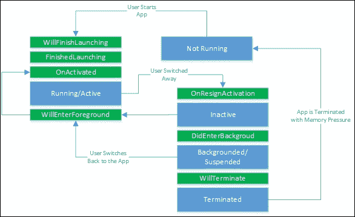
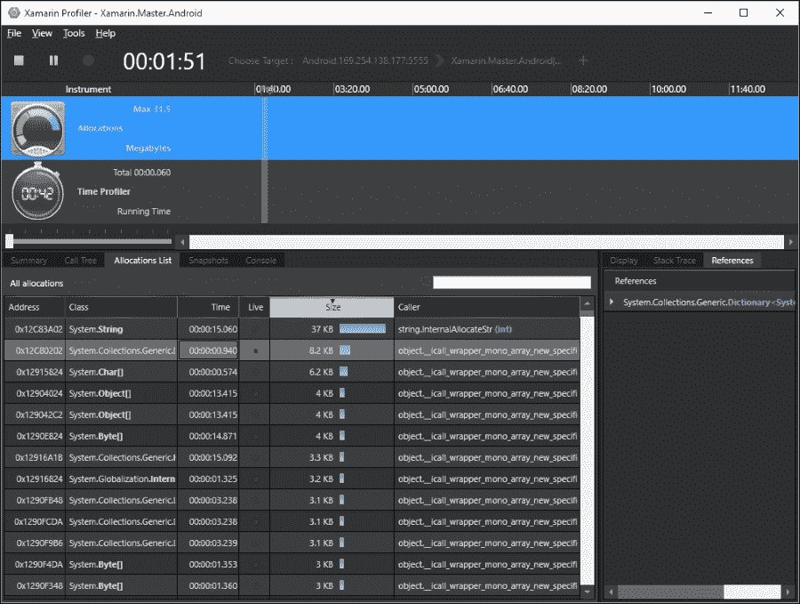
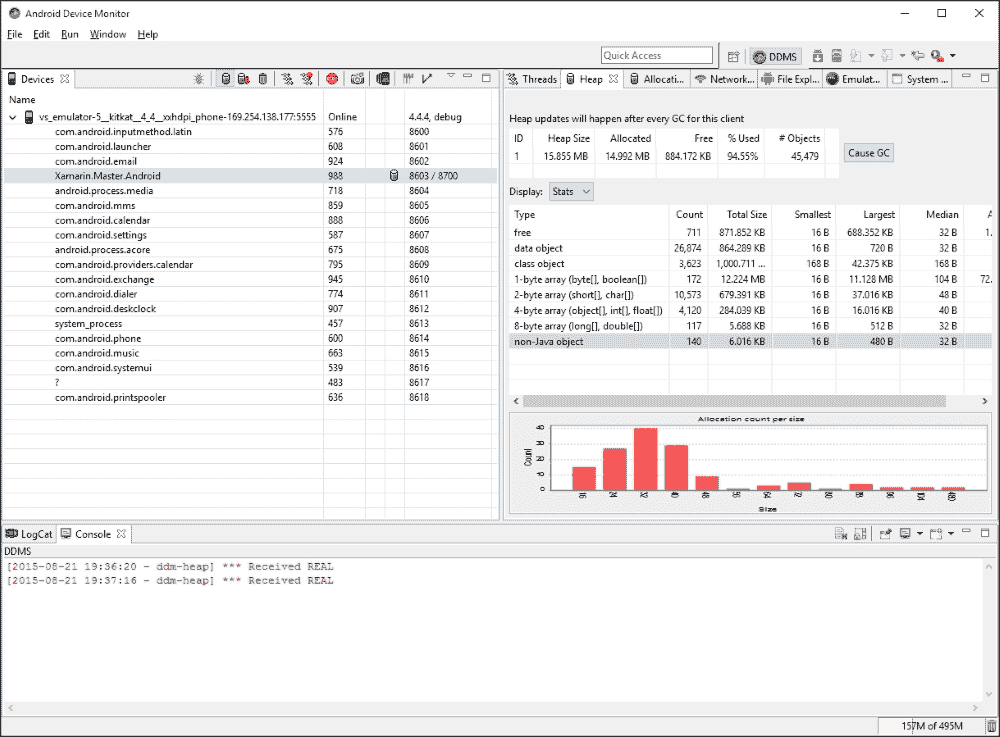
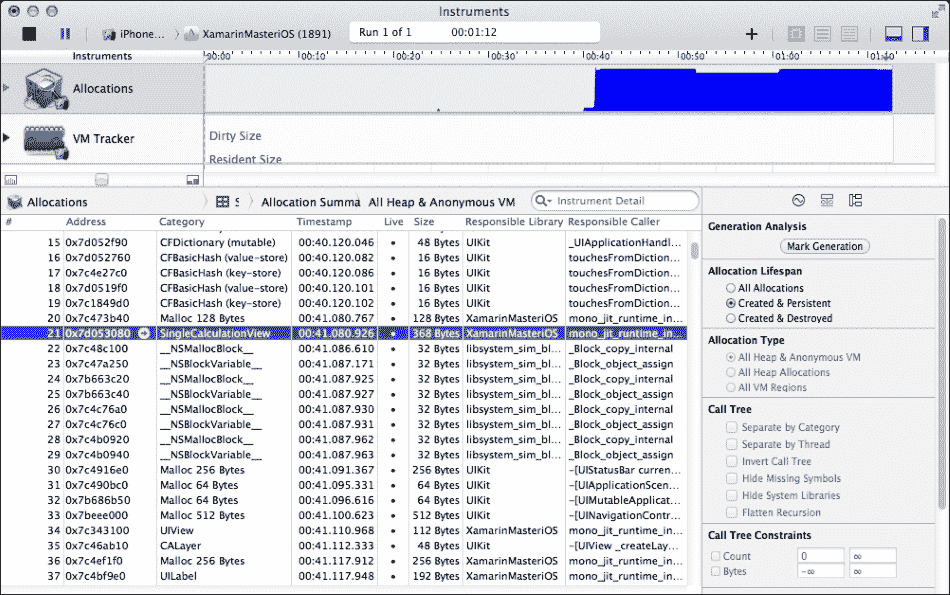
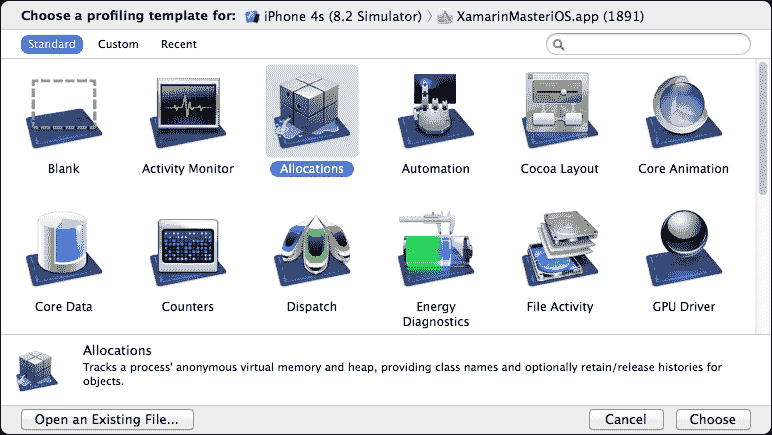
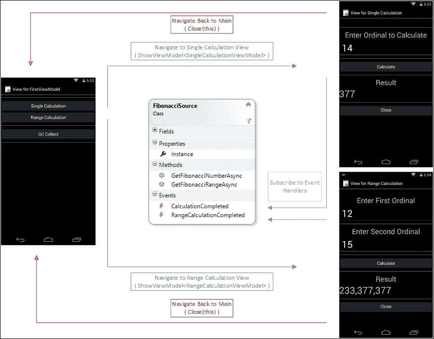
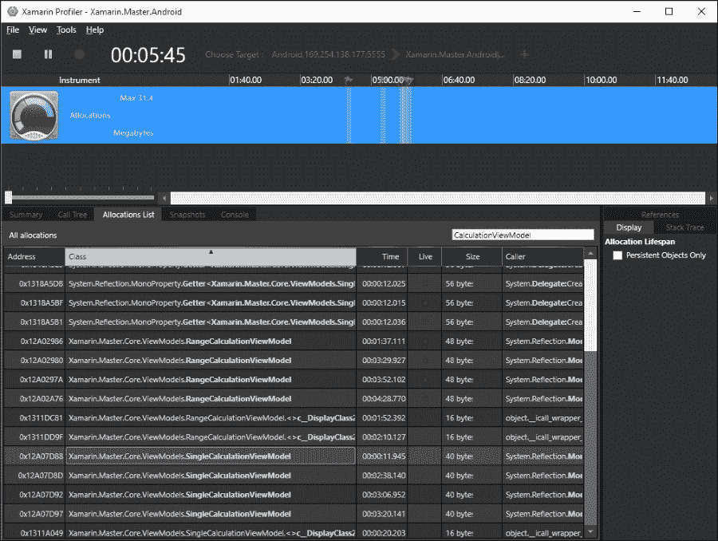
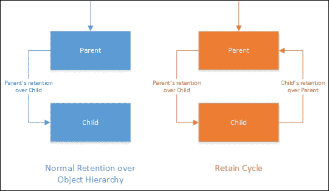
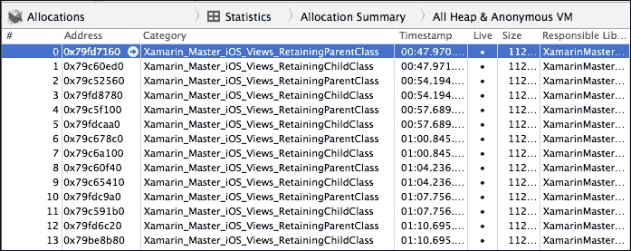

# 第二章 内存管理

本章探讨了使用 Xamarin 运行时在 iOS 和 Android 上如何管理内存。虽然与.NET 平台进行类比，但它将提供可能导致泄漏的内存管理问题和问题的示例，并查看有助于开发者节省宝贵资源的有效模式。本章分为以下部分：

+   应用组件生命周期

+   垃圾回收

+   平台特定概念

+   故障排除和诊断

+   模式和最佳实践

# 应用组件生命周期

在 Xamarin 生态系统中的每个平台在应用程序的执行生命周期中都有一定的过程和状态。开发者可以实现某些方法并订阅生命周期事件，如应用程序启动、挂起、终止和后台运行，以处理所需的应用程序状态并释放不再需要的资源。

## 活动生命周期（Android）

在 Android 应用程序中，与传统的应用程序开发模型相反，任何活动都可以作为应用程序的入口点（只要它被指定为这样的入口点）。应用程序中的任何活动都可以在启动时初始化，也可以在应用程序恢复或从崩溃中重新启动时直接恢复。

为了管理活动的生命周期，存在不同的状态和事件，这些可以帮助开发者组织内存资源和程序功能。

### 活动/运行

当应用程序是焦点应用程序且活动处于前台时，称活动处于活动状态。在此状态下，除非操作系统需要采取特殊措施（例如，系统内存不足或应用程序无响应），否则开发者无需担心内存和资源，因为应用程序具有最高优先级。

在创建周期中，`OnCreate`是应用程序调用的第一个方法。这是初始化步骤，其中创建视图、引入变量和加载静态数据资源。

`OnStart`或`OnRestart`（如果活动在后台后重新启动）是创建周期中的第二个事件方法。如果需要实现特定的数据重新加载过程，则可以重写此方法（们）。这是在活动变得可见之前最后调用的方法。

在活动成功启动后，会调用`OnResume`方法。此方法表明应用程序已准备好与用户交互。它可以用来（重新）订阅外部事件、显示警报/用户消息以及与设备外围设备通信。

### 暂停

当设备进入睡眠状态且此活动处于前台，或者活动被另一个对话框或活动部分隐藏时，活动会被暂停。在此状态下，活动仍然是“活跃”的，但不能与用户交互。

`OnPause`事件方法在活动进入暂停状态之前被调用。这个事件方法是在任何外部事件提供者取消订阅、提交任何未保存的更改以及清理消耗内存资源的对象的理想位置，因为在暂停状态下用户交互是不可能的。当活动再次获得最高优先级时，它将只调用`OnResume`方法，而不会经历完整的创建周期。

### 背景

当用户按下主页按钮或使用应用切换器时，活动进入后台状态。在此状态下，不能保证活动会一直存活到用户“重新启动”应用程序。

当应用程序进入后台或停止时，会调用`OnStop`方法。背景化和停止状态之间的区别在于，当活动正在准备销毁时，它处于停止状态，随后将调用`OnDestroy`方法，因为应用程序已被关闭且不再被用户使用。如果用户恢复应用程序，活动将调用`OnRestart`方法，然后跟随完整创建过程。

### 停止

停止状态代表活动的生命周期结束。当用户按下返回按钮，表示应用程序不再需要时，活动进入此状态。然而，也有可能活动是因为系统内存资源不足，需要关闭处于较低优先级状态（如暂停或后台）的活动而进入此状态。

`OnDestroy`方法跟随停止状态，是最后被调用的生命周期事件方法。这是应用程序停止可能引起泄漏的长运行进程或清理其他持久资源的最后机会。建议在`OnPause`和`OnStop`方法中实现大部分资源清理，因为与由用户触发的`OnPause`和`OnStop`方法不同，`OnDestroy`可能被系统意外调用。

### 重新启动

当活动在后台之后返回用户交互时，我们称其为“重新启动”。重新启动的活动可以重新加载任何保存的状态信息，并创建一个不间断的用户体验。经过初始化步骤后，应用程序再次进入运行状态。

## 应用程序生命周期（iOS）

在 iOS 上，应用程序生命周期是通过 UI 应用程序代理来处理的。一旦实现了代理方法并进行了注册，这些方法将由执行上下文调用。

```cs
public class Application
{
    static void Main(string[] args)
    {
        UIApplication.Main(args, null, "AppDelegate");
    }
}

[Register("AppDelegate")]
public partial class AppDelegate : UIApplicationDelegate
{
    //Implement required methods
}
```

在 iOS 上，应用程序事件比 Android 上事件自上而下的执行要复杂一些。开发者可以使用在`AppDelegate`中实现的状态相关方法将他们的方法插入到传递状态。



图 1：iOS 应用程序状态转换

最重要的状态相关方法是以下这些：

+   `WillFinishLaunching` 是应用程序在启动时执行代码的第一个机会。它表示应用程序已经开始启动，但状态尚未恢复。

+   `FinishedLaunching` 在 `WillFinishLaunching` 完成后，状态恢复发生时被调用。

+   `OnActivated` 和 `OnResignActivation` 与 Android 平台上的 `OnPause` 和 `OnResume` 事件方法类似。

+   当应用程序进入后台状态时，会调用 `DidEnterBackground`。它类似于 Android 上的 `OnStop` 方法，但此方法有时间限制；该方法应在少于 5 秒内执行，并在分配的时间后无通知退出。如果需要更多时间执行某些方法，应用程序可以启动后台任务来完成执行。

+   `WillEnterForeground` 和 `WillTerminate` 可以跟随 `DidEnterBackground` 执行。如果调用前者方法，应用程序即将被带回前台和活动状态，否则，应用程序准备被终止，因为系统需要更多内存，或者用户正在关闭后台应用程序。

# 垃圾回收

**垃圾回收**（**GC**）是现代应用程序开发平台中最有效的自动化内存管理技术之一。简单来说，通过自动垃圾回收，为应用程序使用的对象分配内存资源，并回收不再需要的资源。

### 注意

尽管垃圾回收作为一个自动化过程接管了内存分配的管理负担，但它可能会对性能产生重大影响。这种性能劣势是 iOS 平台上没有垃圾回收机制的主要原因之一。

理论上，GC 负责回收当前执行的应用程序无法访问的运行时元素占用的内存资源。然而，此机制不能总是正确地识别这些不可达资源，并且在清除已识别的内存指针时可能会产生意外的结果。

当应用程序未能识别和/或释放由不可达代码元素占用的资源时，就会发生内存泄漏，这可能导致内存耗尽问题。

当在执行上下文中还存在引用时释放内存区域，就会发生悬挂指针。然后这些引用被移除，内存可以重新分配给其他用途。

当内存区域已经被回收，而应用程序或垃圾收集器试图再次释放这个区域时，会发生双重释放错误。

## Xamarin 项目的垃圾回收

在 .NET 框架中，由公共语言运行时定义的托管代码是内存资源由本地垃圾收集器管理的应用程序代码。GC 在初始化时分配内存的一个段来存储和管理内存资源，这被称为“托管堆”。CLR 中的垃圾收集发生在三个不同的代上，不同生命周期的对象分别位于堆中。代之间的提升和对象的存活取决于它们被放置的代以及它们在之前的垃圾收集周期中的存活情况。

### SGen 垃圾收集器

SGen 垃圾收集器是大多数 Xamarin 项目（包括 Xamarin.iOS 和 Xamarin.Android）使用的代式垃圾收集器。SGen 在更小的对象集上执行更频繁的垃圾收集，这使得它在保守的 Boehm GC 上更有效率。

SGen 使用三个堆，即幼崽堆、主要堆和大对象空间，根据对象的内存需求分配内存段，当对象在垃圾收集周期中存活时，它们在堆之间进行提升。在这个配置中，幼崽堆类似于 .NET CLR 中的第 0 代，是大多数对象被创建和销毁的地方，大多数的垃圾收集周期都发生在这里以释放内存资源。经过小周期垃圾收集后存活的对象可以被提升到主要堆。主要堆只有在堆本身即将耗尽内存时才会进行主要垃圾收集周期。最后一个堆仅用于具有更高内存需求的大对象，并且不接受来自其他堆的提升。

### 注意

需要记住的是，在垃圾收集周期中，所有注册到运行时的线程，包括主运行循环线程，都会暂停。对此执行暂停的一个例外是继续运行 iOS 动画的独立进程。

### Boehm 垃圾收集器（仅限 iOS）

Boehm GC (也称为 Boehm-Demers-Weiser 垃圾收集器) 是一个开源的垃圾收集器实现，最初是为 C/C++ 语言实现创建的。作为一个保守的垃圾收集器，它仍然有泄漏检测的程序，支持“已终结”语义，并且对代式实现的有限支持使其成为在各种平台上实现和移植的吸引人候选者。

Boehm GC 的实现仅适用于使用 Classic API 的 Xamarin.iOS 应用程序，其中它是默认的垃圾收集器。

# 平台特定概念

为了理解内存管理技术和陷阱，必须了解一些与平台相关的概念。尽管 Xamarin 提供了几乎与平台无关的开发体验，但 iOS 和 Android 平台在内存分配和引用处理上与 .NET CLR 以及彼此略有不同。

## 对象引用类型

根据应用需求，引用对象可以被分类。这种分类有助于垃圾收集器决定是否可以释放引用对象的内存分配。

强引用（Strong Reference）保护对象不被“垃圾回收”。当类实例直接由当前执行上下文使用时，引用的对象被称为强引用/可达。

当不需要的引用会干扰垃圾收集时，可以使用弱引用（Weak References）来引用类实例。当引用的对象是弱可达的时，依赖的代码部分在使用引用对象之前必须检查该对象是否仍然存活。根据声明类型实现的释放和终结过程，弱引用在 CLR 中有两种类型：长弱引用和短弱引用。长弱引用是那些可以继续存在并可以被析构函数终结而不是被释放或垃圾回收的类型。

软引用（Soft References）和虚引用（Phantom References）是 Android 运行时的特定内容。简单来说，软引用比弱引用更持久，只有在内存压力下，即使对象不再是强可达的，垃圾收集器才会清除它们。虚引用是 Android 运行时中最弱的引用。它们仅用于实现特殊对象终结方法，并且必须与引用队列关联以进行处理。

## 自动引用计数（Automatic Reference Counting，简称 ARC）

自动引用计数（Automatic Reference Counting，简称 ARC）是 iOS 5 中引入的编译器功能。它被称为编译器功能，因为它不能被归类为垃圾回收实现。它是一种静态分析实现，其中编译器分析代码执行树，并根据对象持久性要求插入保留和释放消息。

在 ARC 中，不允许在应用程序中插入传统的内存管理调用以分配内存和释放内存地址。

# 故障排除和诊断

分析（Profiling）是描述在目标应用程序运行时进行的动态系统分析的术语。分析器通常收集有关 CPU 利用率、帧率值以及最重要的是内存分配数据等指标的数据。特别是在 Xamarin 项目中，由于我们处理多个平台，分析成为测试和诊断的重要部分。

有许多工具可以用来分析 Xamarin 项目的内存使用情况，其中 Xamarin Profiler 是唯一一个可以用于 Xamarin.iOS 和 Xamarin.Android 应用程序的工具。

## Xamarin Profiler

Xamarin Profiler 是 Xamarin Suite 中的最新成员。与其他平台特定应用程序相比，这个分析器具有优势，因为它可以在 OS X 或 Windows 上运行，针对 Xamarin.Android 或 Xamarin.iOS 应用程序。



图 2：Xamarin Profiler

它被设计用来为开发者提供几乎实时的（取决于采样率）关于 Xamarin 应用程序内存堆的信息。它还可以保存内存分配快照，稍后可以访问和分析。

它可以直接从 Visual Studio 或 Xamarin Studio 启动，并且可以使用模拟器和真实设备构建/运行配置。

目前在初始弹出窗口中可以选择两个工具。

### 分配工具

第一项工具是分配模板，它提供了关于内存段和分配的详细信息。在这个视图中，开发者可以在**摘要**选项卡下看到按类名分组的分配的通用列表。**调用树**选项卡提供了应用程序中线程的列表以及它们与内存对象的关系。分配列表提供了关于对象分配的实时数据，而**快照**选项卡提供了存储的内存快照的信息。

### 时间分析器

时间分析器是 Xamarin Profiler 中可以使用的第二项工具。它提供了关于应用程序执行特定方法花费多少时间的宝贵信息。开发者可以查看每个方法的整个堆栈跟踪。

## 设备监控器（仅限 Android）

Android 设备监控器迄今为止一直是 Android 开发的 主要诊断工具。对于 Xamarin 开发者来说，当安装了 Android SDK 后，可以直接从 Visual Studio 的工具箱项或 Xamarin Studio 的工具菜单中访问设备监控器。

在设备监控器的主页上，有一个树形视图显示可以连接到设备监控器的每个设备或模拟器。

### 注意

一次只能连接一个调试器到任何设备，因此在使用设备监控器之前，其他调试器必须断开连接。

一旦选择了设备，开发者可以使用图形界面获取分配信息和堆状态。使用设备监控器还可以触发垃圾回收周期。



图 3：Android 设备监控器连接到 Visual Studio 模拟器

## 工具（仅限 iOS）

Instruments 是一个非常有价值的应用程序，它随 Xcode 工具集一起安装。在这个应用程序中，开发者可以提供一套从能耗、图形资源到内存分配的各种诊断工具。

分配工具的界面与 Xamarin Profiler 非常相似，并提供几乎实时的内存对象数据。



图 4：Instruments 分析 Xamarin 应用程序

Xcode Instruments 工具可以与实际设备或 iOS 模拟器一起使用。它可以直接从 Xamarin Studio 启动。一旦应用程序在 iOS 模拟器或实际设备上启动，它就会在目标选择窗口中可用。



图 5：以 iOS 模拟器为目标设备的 Instruments

### 注意

如果你使用 Microsoft Windows 开发 Xamarin.iOS 应用程序，并且有一个 OS X 构建机器，你将无法直接从开发站访问 Instruments。一旦应用程序在测试设备或模拟器上，你可以在构建机器上启动 instruments 并选择正确的目标进行分析。

## Monotouch Profiler（仅限 iOS）

Monotouch Profiler 是在它被 Xamarin Profiler 取代之前，用于诊断 Xamarin.iOS 应用程序内存问题的 Xamarin 工具。它仍然可以通过在 Xamarin Studio 的 **项目** 菜单下使用 **运行与 Mono HeapShot** 菜单项来访问。虽然它提供了有关内存分配和堆的有用信息，但目前它仅限于作为一个轻量级应用程序来获取内存快照。

# 模式和最佳实践

在处理托管运行时和垃圾回收时，开发者必须注意某些模式和反模式。如果不妥善处理，托管和本地对象都可能产生不可收集的跟踪，这反过来又可能导致内存泄漏和不必要的资源消耗。

## 可释放对象

垃圾回收器管理的资源通常限于内存分配。其他资源，如网络套接字、数据库句柄、UI 元素和文件/设备描述符需要额外的定义或机制。

在托管运行时，这些对象资源可以通过两种不同的方式清理。第一种，效率较低、不可预测的方式是实现析构器/最终化器。一旦垃圾回收器决定对象不再被强引用，资源如网络套接字可以被释放。然而，可最终化的对象必须等待下一个 GC 周期才能被清理，并且不能由开发者的主动操作来最终化。

清理应用程序资源的另一种方法是，在具有资源引用的类中实现 `IDisposable` 接口。此接口只需要实现单个 `Dispose` 方法即可释放托管资源。垃圾回收器还提供了一个方法 (`GC.SuppressFinalize`) 来避免最终化，因为对象将使用 `IDisposable` 接口进行处置。

```cs
public class DisposableFinalizableClass : IDisposable
{

    private ManagedResource m_Resource; // reference to a resource

    public DisposableFinalizableClass()
    {
        m_Resource = new ManagedResource(); // allocates the resource
    }

    /// <summary>
    /// Destructor for the DisposableFinalizableClass
    /// <remarks>
    /// Note that we are not overriding the object.Finalize method
    /// but providing a destructor for the Finalize method to call
    /// </remarks>
    /// </summary>
    ~DisposableFinalizableClass()
    {
        Dispose(false);
    }

    /// <summary>
    /// Implementing the Dispose method
    /// </summary>
    public void Dispose()
    {
        Dispose(true);

        // Letting the GC know that there is no more need for
        // Finalization, the resources are already cleaned-up
        GC.SuppressFinalize(this);
    }

    protected virtual void Dispose(bool disposing)
    {
        if (disposing)
        {
            if (m_Resource != null) m_Resource.Dispose();
        }
        else
        {
            // Called from Finalize
            // Clean-up any unmanaged resources
        }
    }
}
```

可释放对象可以与 `using` 块一起使用，这为开发者提供了一种确定性的方法，以便在对象不再需要时立即释放相关资源。

## 过期监听器问题

与 UI 元素或遗留 API 实现一起使用的最常见模式之一是观察者模式。正如你可能知道的，此模式中有两个利益相关者，观察者和提供者。观察者订阅提供者提供的事件以接收更新。

当观察者模式实现不正确或不完整时，会出现已失效的监听器问题。在这个模式中，订阅后，提供者会保持对观察者的强引用。如果在这个订阅没有被移除之前订阅者离开了上下文，应用程序将无法回收订阅者对象（例如，Android 活动或视图模型），从而导致内存泄漏。

为了演示这个问题，我们将使用斐波那契序列的单例实现，并使用异步方法作为事件提供者。

```cs
public event EventHandler<int> CalculationCompleted;

public event EventHandler<List<int>> RangeCalculationCompleted;

/// <summary>
/// Calculates n-th number in Fibonacci sequence
/// </summary>
/// <param name="ordinal">Ordinal of the number to calculate</param>
public void GetFibonacciNumberAsync(int ordinal)
{
    var task = Task.Run(() =>
    {
        var result = GetFibonacciNumberInternal(ordinal);
        if (CalculationCompleted != null) CalculationCompleted(this, result);
    });

    // Avoiding Deadlocks on the UI thread
    task.ConfigureAwait(false);
}

/// <summary>
/// Calculates a range of numbers in Fibonnaci sequence
/// </summary>
/// <param name="firstOrdinal">Ordinal of the first number</param>
/// <param name="lastOrdinal">Ordinal of the last number</param>
public void GetFibonacciRangeAsync(int firstOrdinal, int lastOrdinal)
{
    var task = Task.Run(() =>
    {
        var result = GetFibonacciRangeInternal(firstOrdinal, lastOrdinal);
        if (RangeCalculationCompleted != null) RangeCalculationCompleted(this, result);
    });

    task.ConfigureAwait(false);
}

public static FibonacciSource Instance
{
    get 
    { 
        return m_Instance ?? (m_Instance = new FibonacciSource()); 
    }
}
```

我们将使用 MvvmCross 实现两个独立的视图模型，并使用关联的视图来调用异步方法，然后使用视图模型上的`Close`方法返回到主视图。在每个视图模型的构造函数中，我们将订阅`FibonacciSource`上的相应事件。



图 6：斐波那契计算器应用

为了调查任何内存泄漏，我们在主视图和计算视图之间来回导航。在两个视图（即单个和范围）上迭代几次之后（即，单次和范围），我们在 Xamarin Profiler 上得到了以下结果（仅使用“分配”模板）。



图 7：Xamarin Profiler 结果

你会注意到在垃圾回收（你可以通过`GC.Collect()`触发 GC 运行）之后，`SingleCalculationViewModel`的实例都不再存活，然而`RangeCalculationViewModel`的实例是持久的。这是因为`RangeCalculationViewModel`的关闭命令中缺少取消订阅的调用。

```cs
private MvxCommand m_CloseCommand;

public ICommand CloseCommand
{
    get
    {
        m_CloseCommand = m_CloseCommand ?? new MvxCommand(DoClose);
        return m_CloseCommand;
    }
}

private void DoClose()
{
    // FibonacciSource.Instance.RangeCalculationCompleted -= OnCalculationCompleted;
    Close(this);
}
```

我们也可以使用这个 Android 应用程序的`OnPause`事件或任何其他平台上的相关事件，在订阅者或持有订阅的视图组件离开上下文之前取消订阅。

在这种情况下，另一个解决方案是使用`TaskCompletionSource`将可观察模式转换为可等待模式。包装可观察的斐波那契源将给你更好的订阅控制，并且产生的异步任务更适合移动开发和 MVVM 模式。

```cs
private Task<List<int>> CalculateFibonacciRangeAsync(int firstOrdinal, int secondOrdinal)
{
    TaskCompletionSource<List<int>> taskCompletionSource = new TaskCompletionSource<List<int>>();

    EventHandler<List<int>> calcCompletedEventHandler = null;

    calcCompletedEventHandler =
        (sender, e) =>
        {
            FibonacciSource.Instance.RangeCalculationCompleted -= calcCompletedEventHandler;
            taskCompletionSource.SetResult(e);
        };

    FibonacciSource.Instance.RangeCalculationCompleted += calcCompletedEventHandler;

    FibonacciSource.Instance.GetFibonacciRangeAsync(firstOrdinal, secondOrdinal);

    return taskCompletionSource.Task;
}
```

最后，这个异步任务会通过`ContinueWith`语句被调用，以在视图模型中设置结果。

```cs
private void DoCalculate()
{
    if (!string.IsNullOrWhiteSpace(Input1) && !string.IsNullOrWhiteSpace(Input2))
    {
        int numberOrdinal1, numberOrdinal2;

        if (int.TryParse(Input1, out numberOrdinal1) && int.TryParse(Input2, out numberOrdinal2))
        {
            InfoText = "Calculating";

            var fibonacciTask = CalculateFibonacciRangeAsync(numberOrdinal1, numberOrdinal2)
                .ContinueWith(task =>
                {
                    Result = string.Join(",", task.Result);
                    InfoText = "";
                });

            fibonacciTask.ConfigureAwait(false);

            return;
        }
    }

    InfoText = "Invalid Input";
}
```

## 弱引用

弱引用在处理松散耦合的应用层时可以提供很大的帮助。在这些类型的场景中，当对象需要在类域之外进行管理时，可以使用弱引用根据可达性概念从 GC 保护中移除这些实例，因为这些实例对应用的其他层有强引用。

让我们假设在前面的例子中，斐波那契序列项被处理为具有名为`FibonacciItem`的类的引用值。这个类携带计算出的值和计算的时间。

```cs
public class FibonacciItem
{
    public int Value { get; private set; }

    private readonly DateTime m_Calculated;

    public FibonacciItem(int value, DateTime calculatedTime)
    {
        Value = value;

        m_Calculated = calculatedTime;
    }
}
```

为了减少处理时间，我们现在可以实施一个缓存机制，该机制将强制源根据序号重新计算值，如果它尚未存在于缓存中，或者如果它被废弃以节省内存资源。为此，我们可以使用`WeakReference`来缓存斐波那契项。

```cs
public class FibonacciCache
{
    // Dictionary to contain the cache. 
    private static Dictionary<int, WeakReference> _cache;

    public FibonacciCache()
    {
        _cache = new Dictionary<int, WeakReference>();
    }

    /// <summary>
    /// Accessor to FibonacciItem references
    /// </summary>
    /// <param name="ordinal"></param>
    /// <returns>FibonacciItem if it is still alive</returns>
    public FibonacciItem this[int ordinal]
    {
        get
        {
            if (!_cache.ContainsKey(ordinal)) return null;

            if (_cache[ordinal].IsAlive)
            {
                // Object was obtained with the weak reference.
                FibonacciItem cachedItem = _cache[ordinal].Target as FibonacciItem;
                return cachedItem;
            }
            else
            {
                // Object reference is already disposed of   
                return null;
            }
        }
        set
        {
            _cache[ordinal] = new WeakReference(value);
        }
    }
} 
```

## 跨域对象

在 Xamarin 应用程序中，最常见的一个内存问题，跨堆引用，发生在原生运行时和 mono 运行时之间发生交叉时。这个问题源于 mono 运行时几乎被视为一个独立的域，并且仅通过 GC 句柄在原生域的堆中进行管理。

在 Android 场景中，当 Java 对象被托管 C#对象引用或反之亦然时，两个运行时之间的通信变得昂贵。例如，如果我们不使用 ViewModel 模式实现斐波那契计算器，我们希望创建一个数据适配器，将范围计算结果加载到列表视图中。

```cs
private void OnFibonacciCalculationCompleted(object sender, List<FibonacciItem> result)
{
    RunOnUiThread(() =>
    {
        var listView = FindViewById<ListView>(Resource.Id.lstResult);

        listView.Adapter = new ArrayAdapter<string>(this, Resource.Layout.ListViewItem, 
            result.Select(val => val.Value.ToString()).ToArray());

    });
}
```

这种实现具有更高的垃圾收集成本。考虑到语言交叉，它还有性能惩罚，更不用说每个世界中的对象实际上被镜像，这增加了内存分配成本。

这里的解决方案是在托管世界中尽可能多地完成工作，让运行时处理其余部分。因此，我们不是使用本地的`ArrayAdapter`，而是可以实现一个基适配器，将`FibonacciItem`实例传递给`ListView`。

```cs
public class FibonacciResultsAdapter : BaseAdapter<FibonacciItem>
{
    List<FibonacciItem> m_ResultItems;

    Activity m_Context;

    public FibonacciResultsAdapter(Activity context, List<FibonacciItem> items)
    {
        m_Context = context;
        m_ResultItems = items;
    }

    public override long GetItemId(int position) { return position; }

    public override FibonacciItem this[int position]
    {
        get { return m_ResultItems[position]; }
    }

    public override int Count
    {
        get { return m_ResultItems.Count; }
    }

    public override View GetView(int position, View convertView, ViewGroup parent)
    {
        View view = convertView;

        if (view == null)
            view = m_Context.LayoutInflater.Inflate(Resource.Layout.ListViewItem, null);

        view.FindViewById<TextView>(Android.Resource.Id.txtOutput).Text = m_ResultItems[position].Value.ToString();

        return view;
    }
}
```

通过实现适配器，我们移除了 Java 类型`ArrayAdapter`、`ArrayList`以及 Java 对`FibonacciItem`实例的引用。

同样适用于在托管域中继承原生对象的情况。这些所谓的“特殊对象”由垃圾收集器以不同的方式处理。它们必须在每次垃圾回收周期中重新扫描它们携带的所有引用。

## 循环引用（循环）

在一般情况下，当底层平台使用某种类型的引用计数作为内存管理策略，并且根据对该特定对象实例的引用数量来清理内存时，会发生循环引用。

随着 Microsoft 发布.NET 和引入代际跟踪垃圾回收，Microsoft 放弃了引用计数。在 Android 设备上的 mono 运行时，SGen 也使用某种形式的标记和清除算法。在这两个运行时中，引用都是从所谓的“应用程序根”进行追踪的。这些对象是在垃圾回收周期时“假定”为存活的对象。

根可以是：

+   对全局对象的引用

+   对静态对象的引用

+   对静态字段的引用

+   对栈上局部对象的引用

+   对等待最终化的对象的引用

+   对 CPU 寄存器中托管堆上对象的引用

然而，如前所述，在 iOS 上，为了性能而放弃了垃圾回收，而 ARC（自动引用计数）却无法处理所谓的保留周期。保留周期发生在创建层次结构中的较低元素（即子元素）需要引用父元素时。在这种情况下，当子或父发送`release`时，由于存在额外的引用保持每个项目存活，`dealloc`方法永远不会运行。



图 8：保留周期

当托管对象从原生对象（即从`NSObect`派生的任何对象）派生时，例如 UI 控件，这种本地的 iOS 问题就会成为 Xamarin 应用程序的问题。当托管类从原生对象继承时，为了防止它们被垃圾回收，Xamarin.iOS 创建了一个 GCHandle。这些 GCHandles 以及对象之间的托管引用共同创建了所描述的（间接）保留周期。

如果我们处理的是一个包含子视图数组的父`UIView`，并且子视图对象保留了对父对象的引用：

```cs
public class RetainingParentClass : UIView
{
    public RetainingParentClass()
    {

    }
}

public class RetainingChildClass : UIView
{
    private RetainingParentClass m_Parent;

    public RetainingChildClass(RetainingParentClass parent)
    {
        m_Parent = parent;
    }
}
```

以下代码片段将创建一个保留周期，并导致应用程序中的内存泄漏：

```cs
var parent = new RetainingParentClass();

parent.Add(new RetainingChildClass(parent));
```

如果我们在视图的构造函数中执行此代码，每次应用程序导航到这个视图时，我们都会创建一个新的父对象，它永远不会被垃圾回收。



图 9：保留对象的工具视图

在这种情况下，最简单的修复方法是，当我们从子对象创建对父对象的引用时使用`WeakReference`。使用弱引用可以避免保留周期情况，并且不会干扰垃圾回收。

```cs
public class RetainingChildClass : UIView
{
    private WeakReference<RetainingParentClass> m_Parent;

    public RetainingChildClass(RetainingParentClass parent)
    {
        m_Parent = new WeakReference<RetainingParentClass>(parent);
    }
}
```

另一个选项是实现`IDisposable`接口，通过在 GC 之前将引用设置为 null 来移除对象之间的强链接。

# 摘要

为了管理应用程序资源，必须对应用程序生命周期有更深入的了解。本章概述的应用程序生命周期事件是 iOS 和 Android 平台上访问底层平台运行时的主要入口点。如果使用得当，两个平台上的事件委托和事件方法可以帮助开发者节省宝贵的资源并避免内存问题。

讨论的其他概念包括垃圾回收、对象引用和自动引用计数。这些概念构成了目标 Xamarin 平台内存管理的基础。

我们还更详细地研究了目标平台的诊断和性能分析工具以及如何有效地使用它们。虽然 iOS 和 Android 平台各自都有一个用于分析内存分配的本地应用程序，但 Xamarin Profiler 为这两个平台提供了一个统一的解决方案。

最后，针对不同记忆相关问题和陷阱，概述了一些有用的模式。为了分析这些模式，分别使用了 Xamarin Profiler 和 Instruments 来分析 Android 和 iOS 应用程序。

在下一章中，我们将探讨异步实现技术，并研究多线程和后台执行的各种模式。
