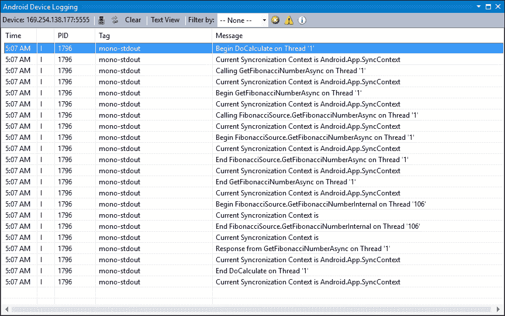
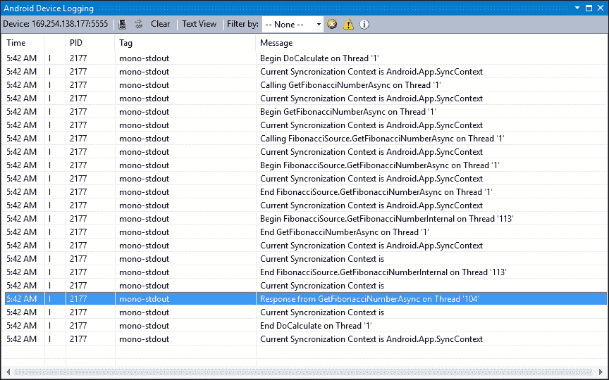
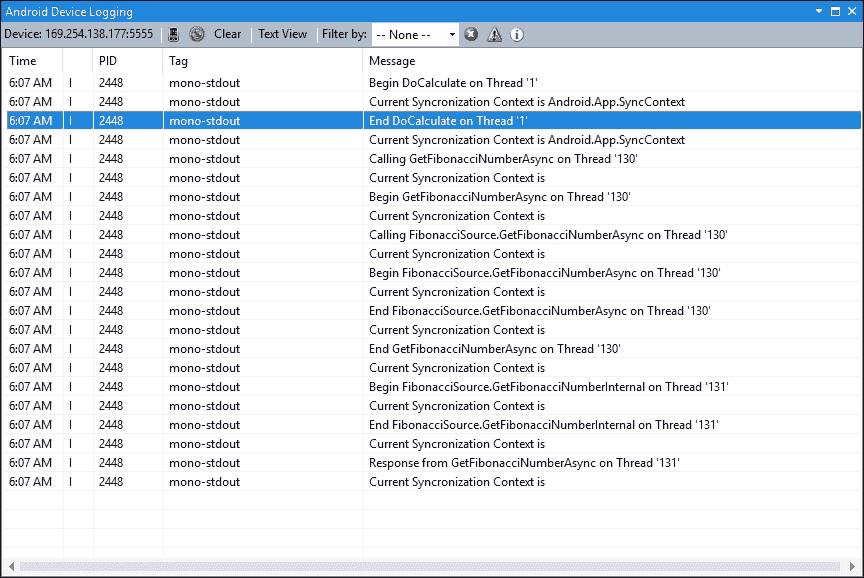
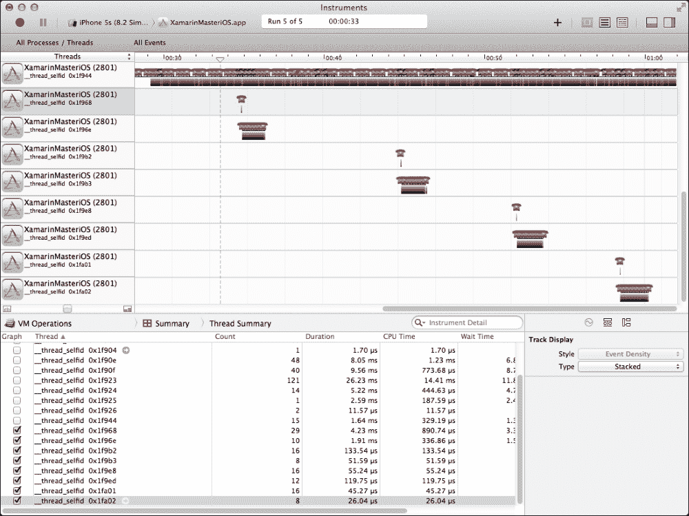
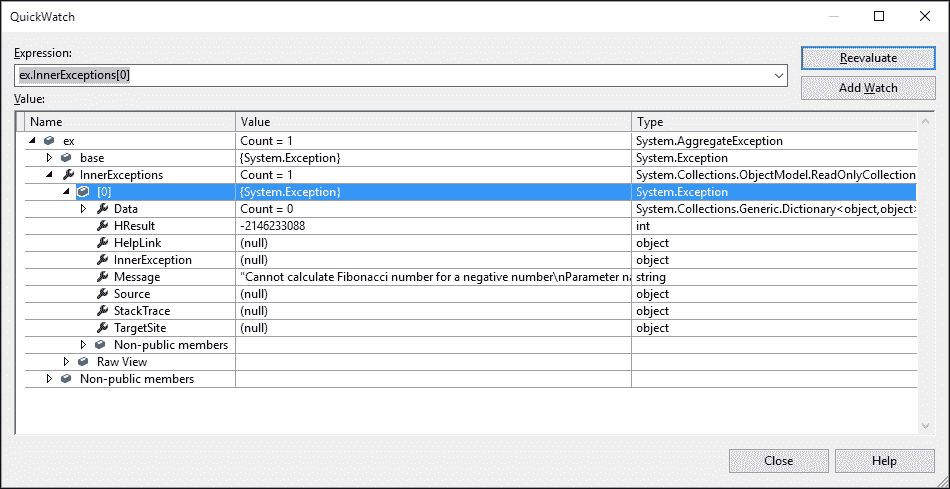
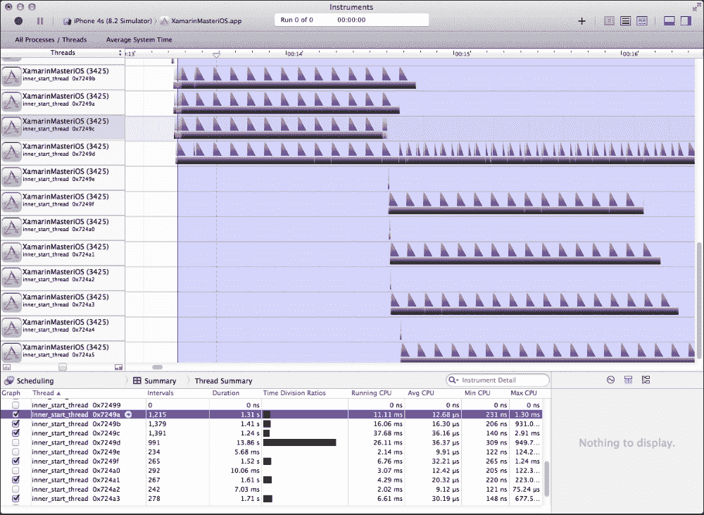

# 第三章 异步编程

本章深入探讨了异步和多线程编程概念。我们将讨论平台特定的问题，并深入描述在不同平台上如何执行线程场景。本章分为以下部分：

+   Xamarin 上的多线程

+   异步方法

+   并行执行

+   模式和最佳实践

+   后台任务

# Xamarin 上的多线程

Xamarin 平台与 Windows Runtime 遵循单线程公寓模型的基本原则。在这个模型中，简单来说，一个进程被分配一个线程，这个线程作为所有其他可能创建并返回的分支的主干。

虽然开发者仍然有能力创建和消费多个线程，但在 Xamarin 目标平台上的现代应用程序中，这种模型已经通过并发实现进行了扩展，将线程管理的责任委托给运行时，并允许开发者仅定义可能或可能不在单独线程上执行的执行块。

## 单线程模型

在 Android 和 iOS 中，每个移动应用程序都是在单个线程上启动和运行的，这个线程通常被称为主线程或 UI 线程。大多数的 UI 交互以及进程生命周期事件处理程序和委托都是在该线程上执行的。

在此模型中，开发者主要应关注尽可能长时间地保持主线程对 UI 交互的可用性。如果我们在这个线程上执行一个阻塞调用，它将立即反映给用户，表现为屏幕冻结或应用程序无响应错误，这不可避免地会被底层平台的所谓看门狗实现终止。除了平台特定的限制之外，用户还期望在任何时候都能有一个响应式的 UI，并且无法忍受屏幕冻结哪怕是一瞬间。如果屏幕冻结持续更长时间，他们将尝试强制终止应用程序（参见第七章的*反馈*部分，*视图元素*）。

开发者仍然可以在主线程中创建、消费和监控其他线程。使用后台线程并在后台调用长时间运行的过程是可能的。为此，Xamarin.iOS 和 Xamarin.Android 项目上提供了`System.Threading`命名空间和与线程相关的类。此外，每个平台在底层都有自己的线程实现。

例如，让我们想象我们想要执行一个长时间运行的过程，我们不想这个方法阻塞 UI 线程。使用经典的多线程，实现将类似于：

```cs
//var threadStart = new ThreadStart(MyLongRunningProcess);
//(new Thread(threadStart)).Start();

// Or simply
(new Thread(MyLongRunningProcess)).Start();
```

每个 `Thread` 都可以提供有关当前执行状态的信息，并且可以被取消、启动、中断，甚至可以被另一个线程加入。开发者可以使用线程模型来限制应用程序的速率和/或更有效地执行代码，而不会犯阻塞 UI 线程的致命错误。

当你在单独的线程上执行的过程需要更新 UI 组件时，可能会变得有些复杂。这将是一个跨线程违规操作。

例如，如果我们想在 Android 活动中从单独的线程更新一个 UI 组件，我们需要在活动上执行以下操作（使用 `Activity.RunOnUiThread`）：

```cs
this.RunOnUiThread(() => { UpdateUIComponent(); });
```

在 iOS 上执行相同的操作看起来类似（使用 `NSObject.InvokeOnMainThread`）：

```cs
this.InvokeOnMainThread(() => { UpdateUIComponent(); });
```

作为参考，在 Windows Runtime 中，同样的执行过程如下所示：

```cs
CoreApplication.MainView
    .CoreWindow.Dispatcher.RunAsync(CoreDispatcherPriority.Normal, 
        () => { UpdateUIComponent(); });
```

当出现异常或操作需要取消时，经典线程模型下的实现变得更加复杂，更不用说线程间的同步和线程安全的数据流完全依赖于开发者或第三方实现。

在 Xamarin 中使用 `System.Threading` 命名空间和经典线程模型的一个重要错误是，这个命名空间和与线程相关的类不能在 PCLs 中使用。

## 基于任务的异步模式

自从 .NET 4.0 中引入 Tasks 框架以及后来 Mono 的采用，**基于任务的异步模式（TAP**）已经成为移动应用程序的主要实现策略。虽然它提供了从线程结构中所需的抽象，但也给了开发团队创建易于阅读、管理和可扩展的应用程序项目的机会。如前所述，由于每个 Xamarin 目标平台都根据底层运行时实现线程，Tasks 框架提供的这种抽象使其成为跨平台项目中异步实现的理想候选，并且是可移植类库中不可或缺的部分。

在这种模式中，每个执行块根据块的返回值被表示为 `Task` 或 `Task<T>`（例如，如果块返回 void，则应将其转换为返回 `Task`；如果块返回 `int`，则方法签名应为 `Task<int>`）。任务可以同步或异步执行，可以等待结果或作为完成时的回调承诺执行，可以将任务推送到另一个线程池或在可用时在主线程上执行，占用处理器时间。

任务特别适合于计算密集型操作，因为它们提供了对异步方法何时以及如何执行的良好控制。这些方法上的取消和进度支持使得长时间运行的过程易于管理。

## iOS 的并发模型

并发和 iOS 运行时的操作块是苹果对任务框架试图解决的问题的回应。本质上，任务框架和 iOS 上的并发模型是通过创建抽象层来解决创建多任务、健壮且易于扩展的应用程序的解决方案，这样应用程序就不直接管理线程，而是让操作系统决定在哪里以及何时执行操作。

iOS 运行时使用操作或调度队列以**先进先出**（**FIFO**）的方式异步调度任务。这种方法提供了自动线程池管理以及简单的编程接口。

虽然 iOS 运行时构造，如`NSOperation`、`NSBlockOperation`和`NSOperationQueue`，在 Xamarin.iOS 框架中实现并可供使用，但它们的实现仅针对 iOS 平台，而任务可以在所有三个平台上使用。

# 异步方法

**任务并行库**（**TPL**）是.NET 框架中并行计算的核心部分，在 Xamarin 运行时中也具有相同的地位。

异步方法执行，结合`async`和`await`关键字（自 C# 5.0 引入），可以使应用程序更加响应和高效，并降低实现多线程和同步的复杂性。无需实现参数化线程，启动和推送都委托给后台线程，所谓的“可等待”对象。您可以通过将方法返回类型转换为`Task`或`Task<T>`来轻松地将方法转换为异步承诺。作为回报，运行时会在最佳时间执行代码，并将结果返回到您的执行上下文。

例如，使用任务的前一个线程创建示例将非常简单：

```cs
Task.Run(() => MyLongRunningProcess());

// Or
Task.Factory.StartNew(MyLongRunningProcess, TaskCreationOptions.LongRunning);
```

然而，任务框架不仅关乎创建线程或执行非阻塞方法，还关乎以尽可能简单的方式协调和管理这些异步任务。有许多静态辅助方法以及为任务实现的方法，帮助开发者轻松实现一些这些协调场景。

## 继续阅读

`Task`类上的`ContinueWith`函数允许开发者将依赖的任务链在一起，并将它们作为一个整体的任务执行。一旦第一个任务的结果被发送回任务调度器，就会执行延续代理。重要的是要提到，第一个任务和延续方法不一定在同一个线程上执行。代码如下：

```cs
Task.Run(() => MyLongRunningProcess())
    .ContinueWith(task => MySecondLongRunningProcess());
```

如果第二个任务依赖于第一个任务的结果：

```cs
Task.Run(() => MyLongRunningProcess())
            .ContinueWith(task => MySecondLongRunningProcess(task.Result));
```

## 取消

`CancellationToken`和`CancellationTokenSource`用作远程令牌，以控制异步方法、线程或多个线程的执行生命周期以及令牌反映的事件源。

简而言之，`CancellationTokenSource`负责抛出基于时间或手动的取消事件，这些事件可以通过异步方法上下文中的令牌检索。

您可以使用默认构造函数创建一个取消源，并可以向令牌添加基于时间的取消操作：

```cs
m_CancellationSource = new CancellationTokenSource();

var token = m_CancellationSource.Token;

// You can cancel it after a certain amount of time, which would trigger an OperationCanceledException
// m_CancellationSource.CancelAfter(2000);
```

一旦我们正在执行异步方法，我们可以使用此源中的令牌，或者我们可以将其与`TaskFactory`关联以创建一个协作的任务列表：

```cs
Task.Run(() =>
{
    // Executing my long running method
    if (token.IsCancellationRequested)
    {
        token.ThrowIfCancellationRequested();
    }
}, token);
```

或者：

```cs
var taskFactory = new TaskFactory(m_CancellationSource.Token);
taskFactory.StartNew(() =>
    {
        // Executing my long running method
        if (Task.Factory.CancellationToken != CancellationToken.None && Task.Factory.CancellationToken.IsCancellationRequested)
        {
           Task.Factory.CancellationToken
               .ThrowIfCancellationRequested();
        }
    });
```

最后，您还可以使用`CancellationTokenSource`的`Cancel`或`CancelAfter`（带有时间延迟）方法取消线程或一组线程。

## 进度

另一个帮助用户了解后台正在调用的操作的异步控制功能是进度回调实现。就像`CancellationToken`一样，我们可以向异步任务提供一个事件处理器，用于进度事件，异步方法可以调用该事件处理器将进度信息传递回主线程。

对于简单的进度报告，只需在异步方法中添加一个继承自`IProgress<T>`接口的额外参数就足够了。

例如，如果我们想在`GetFibonacciRangeAsync`方法中实现一个进度事件处理器，我们可以使用要计算的值的数量和当前正在计算的序号来报告总进度的百分比：

```cs
public async Task<List<int>> GetFibonacciRangeAsync(int firstOrdinal, int lastOrdinal, IProgress<int> progress = null)
{
    var results = new List<int>();

    for (var i = firstOrdinal; i < lastOrdinal; i++)
    {
        results.Add(await GetFibonacciNumberAsync(i));

        decimal currentPercentage = (decimal) lastOrdinal - i/(decimal) lastOrdinal - firstOrdinal;

        if (progress != null)
            progress.Report((int)(currentPercentage * 100);
    }

    return results;
}
```

为了能够在我们的视图模型中使用进度值，我们可以利用`Progress<T>`类，它是`IProgress<T>`的默认实现。代码如下：

```cs
Action<int> reportProgress = (value) =>
{
    InfoText = string.Format("{0}% Completed", value);
};

var progress = new Progress<int>(reportProgress);

m_SourceAsync.GetFibonacciRangeAsync(numberOrdinal1, numberOrdinal2, progress)
    .ContinueWith(task =>
    {
        Result = string.Join(",", task.Result.Select(val=>val));
        InfoText = "";
    });
```

## 任务批量

在基于任务的异步模式中，除了延续之外，还有其他方法可以批量执行任务，甚至在并行中执行。上一节中的示例是分别等待每个数字计算，并执行下一个调用。然而，内部方法的实现方式使它们彼此独立。因此，实际上没有必要逐个等待它们返回结果。代码如下：

```cs
List<Task<int>> calculations = new List<Task<int>>();

Mvx.Trace("Starting Calculations");

for (var i = firstOrdinal; i < lastOrdinal; i++)
{
    var currentOrdinal = i;
    calculations.Add(Task.Factory.StartNew(() => 
        GetFibonacciNumberInternal(currentOrdinal).Value, TaskCreationOptions.LongRunning));
}

Mvx.Trace("Starting When All", DateTime.Now);
int[] results = await Task.WhenAll(calculations);
Mvx.Trace("Calculations Completed", DateTime.Now);

return results.OrderBy(value=>value).ToList();
```

### 注意

`Mvx`静态类和`Trace`方法由 MvvmCross 库提供。它将在后面的章节中进一步讨论。

现在，序列中的每个斐波那契数都是并行计算的，当序列范围完成时，返回一个结果值数组。最后，我们排序数组并返回值列表。

我们可以通过添加一个带有互斥（线程安全）计数器的进度通知器来扩展此实现：

```cs
calculations.Add(Task.Factory.StartNew(() =>
    GetFibonacciNumberInternal(currentOrdinal).Value, TaskCreationOptions.LongRunning)
    .ContinueWith(task =>
    {
        if (progress != null)
        {
            var currentTotal = Interlocked.Increment(ref currentCount);
            decimal currentPercentage = (decimal) currentTotal/(decimal) totalCount;
            progress.Report((int)(currentPercentage * 100));
        }
        return task.Result;
    })); 
```

上述计算产生的日志跟踪如下：

```cs
09-07 21:18:29.232 I/mono-stdout( 3094): mvx:Diagnostic: 40.80 Starting Calculations
09-07 21:18:29.352 I/mono-stdout( 3094): mvx:Diagnostic: 40.92 Starting When All
09-07 21:18:30.432 I/mono-stdout( 3094): mvx:Diagnostic: 42.00 Calculations Completed
```

计算的总时间约为 1.2 秒。

在每个方法上重复相同的计算将给出以下输出（计算序号 4 直到 11）：

```cs
09-07 21:26:58.716 I/mono-stdout( 3281): mvx:Diagnostic: 10.60 Starting Calculations
09-07 21:26:58.724 I/mono-stdout( 3281): mvx:Diagnostic: 10.61 Starting calculating ordinal 4
…
09-07 21:27:03.900 I/mono-stdout( 3281): mvx:Diagnostic: 15.78 Starting calculating ordinal 11
09-07 21:27:05.028 I/mono-stdout( 3281): mvx:Diagnostic: 16.91 Calculations Completed
```

同样的计算总共花费了大约 6.3 秒。

除了`WhenAll`之外，开发者还配备了`Task`类上的`WhenAny`、`WaitAll`、`WaitAny`方法以及`TaskFactory`类上的`ContinueWhenAll`和`ContinueWhenAny`方法。

# 并行执行

在前面的章节中，讨论集中在`System.Threading.Tasks`命名空间和`Task`类上。尽管任务是基于异步模型的基础和所谓的任务并行性的基石，但并发集合命名空间构成了异步模型的数据并行性部分，并为开发者提供了执行代码最有效和线程安全的方式的工具。

`BlockingCollection<T>`是并发集合实现之一，它封装了线程之间的核心同步和协调，并为实现 Xamarin 应用程序中的提供者-消费者模型提供了线程安全的数据存储。

使用`BlockingCollection<T>`，我们可以轻松实现一个新的方法，该方法利用了前面示例中的并行执行。在这个实现中，我们的视图模型将是消费者，斐波那契源和范围计算任务将是提供者。

如果我们使用阻塞集合重写范围计算方法，我们的方法签名将类似于：

```cs
public async Task GetFibonacciRangeAsync(int firstOrdinal, int lastOrdinal, BlockingCollection<int> blockingCollection)
```

因此，从某种意义上说，消费者将创建阻塞集合，并将其传递给提供者以填充计算值。作为回报，提供者需要使用`TryAdd`或`Add`方法将每个计算值从并行任务中推送到集合中。代码如下：

```cs
for (var i = firstOrdinal; i < lastOrdinal; i++)
{
    var currentOrdinal = i;

    calculations.Add(Task.Factory.StartNew(() =>
        GetFibonacciNumberInternal(currentOrdinal).Value, TaskCreationOptions.LongRunning)
        .ContinueWith(task =>
        {
            blockingCollection.Add(task.Result);
            return task.Result;
        }));
}
```

最后，一旦所有计算完成，提供者需要将集合标记为添加完成。代码如下：

```cs
//
// Collection is filled completely
await Task.WhenAll(calculations).ContinueWith(task =>
{
    blockingCollection.CompleteAdding();
});
```

当这些任务在提供者端执行时，我们可以在视图模型中使用`while`循环创建消费者，检查特定间隔是否有新项目使用`TryTake`，直到完成。然而，对于此目的，并发集合已经实现了一个方法：`GetConsumingEnumerable`。使用此方法可以使消费者线程的执行变得像`foreach`块一样简单。代码如下：

```cs
var blockingCollection = new BlockingCollection<int>();

var fibonacciTask = (new FibonacciSourceAsync())
    .GetFibonacciRangeAsync(numberOrdinal1,
        numberOrdinal2, blockingCollection);

fibonacciTask.ConfigureAwait(false);

//
// Starting the Consumer thread
Task.Factory.StartNew(() =>
{
    foreach (var item in blockingCollection.GetConsumingEnumerable())
    {
        var currentItem = item;
        if (Result != string.Empty) Result += ",";

        Result += currentItem;
    }

    InfoText = "Done";

}, TaskCreationOptions.LongRunning);
```

在此模型中，提供者线程（以及每个正在执行的并行任务）和消费者线程几乎可以即时执行，并且结果几乎立即通过视图模型反映到 UI 上。

在前面的实现中，尽管可能将多个值添加到阻塞集合中，并且阻塞集合支持多个消费者，但`foreach`循环遵循更线性的执行。我们可以通过添加多个消费者来扩展此模型，使用`System.Threading.Tasks.Parallel`命名空间中的`Parallel.ForEach`扩展方法。代码如下：

```cs
Task.Factory.StartNew(() =>
{
    var result = Parallel.ForEach(blockingCollection.GetConsumingEnumerable(), item =>
    {
        UpdateUIWithItem(item);
    }).IsCompleted;

    if (result) InfoText = "Done";
}, TaskCreationOptions.LongRunning);
```

开发者还可以使用和适应其他并发场景的构造和实现模式，例如`Partitioner`、`ActionBlock`、`ConcurrentScheduler`等。然而，这些概念超出了本书的范围。

# 模式和最佳实践

在实现异步任务时，可以与经典的多线程和事件模式进行类比，甚至进行转换。然而，异步方法必须谨慎实现，以避免死锁和未捕获的异常。

## 异步模式转换

观察者模式——也称为**基于事件的异步模式**（**EAP**）——曾经是长时间运行过程和服务/远程应用程序 API 的主要开发工具。事件和委托在现代应用程序中仍然构成了相当一部分 UI 相关实现。

然而，异步任务和可等待对象提供了一个更方便的方式来处理长时间运行的过程和链式完成方法。

幸运的是，可以将其他异步模式转换为基于任务的实现模式。这类场景涉及使用`TaskCompletionSource`类。

为了演示这一点，我们将使用之前示例中的简化版斐波那契源实现：

```cs
public event EventHandler<int> CalculationCompleted;

public event EventHandler<string> CalculationFailed;

/// <summary>
/// Calculates n-th number in Fibonacci sequence
/// </summary>
/// <param name="ordinal">Ordinal of the number to calculate</param>
public void GetFibonacciNumber(int ordinal)
{
    try
    {
        var result = GetFibonacciNumberInternal(ordinal);

        if (CalculationCompleted != null) CalculationCompleted(this, result);
    }
    catch (Exception ex)
    {
        if (CalculationFailed != null) CalculationFailed(this, ex.Message);
    }
}
```

在这个例子中，我们有一个成功计算的事件处理程序，另一个是失败计算的事件处理程序（例如，如果序号小于 0，它应该抛出`ArgumentOutOfRangeException`）。

我们的目的是实现一个异步方法，我们可以执行它并将结果传递给 UI，而无需每次创建新的`FibonacciSource`时都订阅事件。

为了这个目的，我们可以实现`FibonacciSource`的新版本，仅暴露异步方法而不是基于事件的方法。代码如下：

```cs
public class FibonacciSourceAsync : FibonacciSource
{
    public new Task<int> GetFibonacciNumberAsync(int ordinal)
    {
        var myTaskSource = new TaskCompletionSource<int>();

        EventHandler<FibonacciItem> onCalculationCompleted = null;
        EventHandler<string> onCalculationFailed = null;

        //
        // Subscribe to TaskCompleted: When the CalculationCompleted event is fired, set result.
        onCalculationCompleted = (sender, args) =>
        {
            // Not forgetting to release the event handler
            CalculationCompleted -= onCalculationCompleted;
            myTaskSource.SetResult(args.Value);
        };

        //
        // Subscribe to TaskFailed: If there is an error in the execution, set error.
        onCalculationFailed = (sender, args) =>
        {
            CalculationFailed -= onCalculationFailed;
            myTaskSource.SetException(new Exception(args));
        };

        CalculationCompleted += onCalculationCompleted;

        CalculationFailed += onCalculationFailed;

        // Finally execute the task and return the associated Task promise.
        base.GetFibonacciNumberAsync(ordinal);

        return myTaskSource.Task;

    }
}
```

现在计算斐波那契数的调用将看起来类似：

```cs
public async Task<int> CalculateFibonacciValueAsync(int ordinal)
{
    var fibonacciSource =  new FibonacciSourceAsync();

    try
    {
        return (await fibonacciSource.GetFibonacciNumberAsync(ordinal));
    }
    catch (Exception ex)
    {
        // TODO: Do something with exception 
    }
}
```

该实现可以通过进度和取消令牌实现进一步扩展。

## 多线程与任务

关于异步调用，有一点很重要需要认识到，它们不一定在单独的线程上运行。实际上，调用被“安排”在所谓的同步上下文中运行在主线程上，除非它们被指示否则。同步上下文是负责安排需要等待的异步调用的消息队列。一旦异步方法（或大多数情况下是`Task`）成功执行，结果就会发布回同步上下文（即主 UI 线程）。

为了演示目的，我们将使用之前示例中的异步实现（EAP 转换）以及一些额外的诊断调用，以获取有关正在使用的线程和同步上下文的信息。

### 注意

这里使用的 `TraceThreadInfo` 方法及其相关的 `ThreadInfo` 类是一个通过依赖注入使用的自定义实现。原因是 threading 命名空间只包含 PCL 中的任务相关类，而获取当前线程 ID 的唯一方法是通过平台特定的实现。平台特定的实现模式将在后续章节中详细讨论。

在跟踪方法中，我们将记录当前线程 ID 和当前同步上下文：

```cs
public IThreadInfo ThreadInfo
{
    get { return Mvx.GetSingleton<IThreadInfo>(); }
}

private void TraceThreadInfo(string message)
{
    Debug.WriteLine("{0} on Thread '{1}'", message, ThreadInfo.CurrentThreadId);
    Debug.WriteLine("Current Synchronization Context is {0}", SynchronizationContext.Current);
}
```

附在计算按钮上的计算命令是：

```cs
TraceThreadInfo("Begin DoCalculate");

if (!string.IsNullOrWhiteSpace(Input))
{
    int numberOrdinal;

    if (int.TryParse(Input, out numberOrdinal))
    {
        InfoText = "Calculating";

        TraceThreadInfo("Calling GetFibonacciNumberAsync");

        var result = await GetFibonacciNumberAsync(numberOrdinal);

        TraceThreadInfo("Response from GetFibonacciNumberAsync");

        Result = result.ToString();

        InfoText = string.Empty;

        TraceThreadInfo("End DoCalculate");

        return;
    }
}

InfoText = "Invalid Input";
```

相关的跟踪日志如下所示：



Tasks 的内联执行跟踪

通过查看上述执行堆栈的跟踪消息，可以很容易地看出，尽管我们正在处理异步任务，但整个执行过程都在主线程上完成，除了对源内部方法的实际调用（即它在 Thread 106 上执行）。其余的方法调用具有 `Android.App.SyncContext` 作为同步上下文，执行顺序与实现的调用序列没有不同。

稍微改变实现并使用 `Task` 项的 `ContinueWith` 函数，我们得到稍微不同的结果。代码如下：

```cs
TraceThreadInfo("Calling GetFibonacciNumberAsync");

await GetFibonacciNumberAsync(numberOrdinal).ContinueWith(task =>
{
    TraceThreadInfo("Response from GetFibonacciNumberAsync");

    Result = task.Result.ToString();

    InfoText = string.Empty;
});

TraceThreadInfo("End DoCalculate");
```

此实现的跟踪日志如下所示：



Tasks 的异步执行

如跟踪日志所示，`ContinueWith` lambda 在单独的线程上执行，但执行仍然是顺序的。

### 注意

这里的一个重要注意事项是我们正在将结果返回到 ViewModel 的单独线程上。在这个例子中，跨线程调用由 MvvmCross 框架处理。如果我们处理这个赋值，调用将类似于：

```cs
await GetFibonacciNumberAsync(numberOrdinal).ContinueWith(task =>
{
    TraceThreadInfo("Response from GetFibonacciNumberAsync");

    this.RunOnUiThread(() =>
    {
        txtResult.Text = task.Result.ToString();
    });

    txtInfo.Text = "";
});
```

在前面的例子中，一旦执行进入单独的线程，同步上下文就被取消。在 .NET 运行时，未由主同步上下文跟踪的异步任务实际上被分配了一个 `TaskScheduler` 实例，并通过此上下文执行。在这种情况下，`TaskScheduler` 负责将成功后消息重定向回主线程，如果任务配置为使用相同的上下文（即 `ConfigureAwait(true)`）。

然而，在 .NET 中同步上下文的工作方式以及配置的任务调用返回到主线程可能会导致死锁，如果异步任务在主线程上以同步方式（即使用 `Task.Result` 或 `Task.Wait()`）调用。在这种情况下，一旦异步调用执行完成并尝试返回到主上下文，由于主上下文实际上正在等待异步任务本身完成，因此主上下文仍然不可访问。

`ConfigureAwait(false)`通知调度器不要在任务被调用的相同执行上下文中寻找并返回结果，而是直接在执行上下文中执行并运行到完成。这避免了死锁场景。

这种死锁场景是.NET 运行时的特定问题，因为 Android 上的 Mono 运行时和 Mono.Touch 编译器处理任务执行的方式；在这些平台上目前不会发生死锁。然而，遵循与异步任务和 awaitables 相关的编码约定非常重要，以避免任何意外行为。

为了在单独的线程上执行整个任务，我们可以使用`Task.Run`（这将任务推送到线程池）或`Task.Factory.StartNew`。使用`StartNew`方法可以让你定义即将在任务中执行的方法类型，并让运行时做出使用不同线程的明智决策。代码如下：

```cs
var task = Task.Factory.StartNew(async () =>
{
    TraceThreadInfo("Calling GetFibonacciNumberAsync");

    var result = await GetFibonacciNumberAsync(numberOrdinal);

    TraceThreadInfo("Response from GetFibonacciNumberAsync");

    Result = result.ToString();

    InfoText = string.Empty;

}, TaskCreationOptions.LongRunning);

task.ConfigureAwait(false);
```

在下面的跟踪中，与之前的示例最大的不同是，`DoCalculate`方法甚至在为计算创建的任务开始执行之前就退出了。这种执行方式非常适合在跨平台移动应用项目中应用 MVVM 模式。它可以避免任何 UI 阻塞问题，并为用户提供连续性的感觉。



启动一个新的异步任务

如果我们想要分析 iOS 应用程序上的相同执行过程（即计算某个序号上的斐波那契数列中的数字），我们可以很容易地使用 Xcode Instruments 的“系统跟踪”模板来识别线程模式。



计算四个不同的斐波那契数

## 异常处理

如果在多线程实现中不遵循正确的异步路径，处理异常可能会变得繁琐。然而，在大多数情况下，async/await 语言构造减轻了开发者的负担。如果异步链没有被中断，并且调用被正确实现，那么在异步上下文中捕获异常与使用线性代码捕获它们没有区别。

使用我们之前章节中的示例：

```cs
try
{
    var result = await GetFibonacciNumberAsync(numberOrdinal);

    Result = result.ToString();

    InfoText = "";
}
catch (Exception ex)
{
    Debug.WriteLine("Error:" + ex.Message);
    InfoText = "EX:" + ex.Message;
}
```

在这个例子中，如果我们传入的参数是一个负数，它将抛出一个包含消息**无法计算负数的斐波那契数**的异常，我们将在信息文本框中显示错误消息。

然而，如果我们使用`ContinueWith`结构来执行相同的代码，结果会有所不同：

```cs
try
{
    await GetFibonacciNumberAsync(numberOrdinal).ContinueWith(result =>
    {
        Result = result.Result.ToString();

        InfoText = string.Empty;
    });
}
catch (Exception ex)
{
    Debug.WriteLine("Error:" + ex.Message);
    InfoText = "EX:" + ex.Message;
}
```

在这个例子中，我们会收到**一个或多个错误发生**的异常消息。原因是第二个场景中抛出的异常是由于我们创建的异步链而导致的`AggregateException`。



异步链中的 AggregateException

如果我们在任务本身上使用`.Result`或`.Wait()`调用，结果将会相同。

这个实现的重要部分是我们对异步方法调用`await`。如果不是这样，捕获块永远不会被调用。没有`await`关键字，try/catch 块只会检查任务的准备是否按预期进行，而不是实际的执行。

另一种无法用 try/catch 块捕获的异步执行类型是返回`void`而不是`Task`或`Task<T>`的异步方法。类似于在事件处理器中抛出异常，它们只能被捕获在`AppDomain.UnhandledException`或`Application.ThreadException`事件中。对于异步方法来说，始终是一个更好的实践，让它们返回`Task`然后返回`void`。

然而，在`ContinueWith`实现中，有了手头的`Task`引用，我们也可以在执行完成之前检查任务的状态。这个赋值实际上导致了异常向上层冒泡。在这种情况下，我们不需要 try/catch 块。代码如下：

```cs
await GetFibonacciNumberAsync(numberOrdinal).ContinueWith(result =>
{
    TraceThreadInfo("Response from GetFibonacciNumberAsync");

    if (result.IsFaulted)
    {
        Result = string.Empty;

        InfoText = string.Join("\r\n", result.Exception
            .InnerExceptions.Select(exception => exception.Message));
    }
    else
    {
        Result = result.Result.ToString();

        InfoText = string.Empty;
    }
});
```

## 初始化模式

尤其是在涉及服务的场景中，一个常见的需求是拥有一个初始化函数，该函数将准备通信通道并/或执行一个“ping”或认证调用。当开发者面临此类场景时，他们可能犯的最大错误就是在构造函数中使用`.Result`和/或`.Wait()`语句调用异步初始化函数（使其成为一个同步调用）。

对于这种场景，让我们假设我们有一个实现了两个简单异步方法实现的接口的服务。

```cs
public interface IService
{
    Task<string> AuthenticateAsync(string username, string password);

    Task<int> ServiceMethodAsync(string myParameter);
}
```

为了能够调用`ServiceMethodAsync`，我们首先需要调用`AuthenticateAsync`并从服务接收认证令牌。代码如下：

```cs
public MyService(string username, string password)
{
    //
    // Following call would block the constructor
    // IMPORTANT: If it was being called from the main UI thread, it might cause a deadlock
    // Blocking Call Example 1:
    // AuthenticateAsync(username, password).Wait();
    // Blocking Call Example 2:
    m_Token = AuthenticateAsync(username, password).Result;
}
```

在这个例子中，我们在服务的构造函数中实现了认证调用。尽管在某些情况下实现可能有效，但如果服务构造函数是从主 UI 线程调用的，线程将进入死锁，正如前一个部分所描述的。

最简单的解决方案是公开初始化函数给外部层，或者让服务在每次服务调用之前调用初始化。为此，我们可以将认证调用包装在初始化方法中。代码如下：

```cs
public MyService(string username, string password)
{
    m_Username = username;
    m_Password = password;
}

private async Task EnsureInitializationAsync()
{
    if (string.IsNullOrEmpty(m_Token))
    {
        m_Token = await AuthenticateAsync(m_Username, m_Password);
    }
}
```

服务方法调用看起来可能如下所示：

```cs
public async Task<int> ServiceMethodAsync(string myParameter)
{
    await EnsureInitializationAsync();

    try
    {
        int result = await InternalServiceMethodAsync(myParameter);

        return result;
    }
    catch (Exception ex)
    {
        // TODO:
        throw;
    }
}
```

如前所述，我们也可以通过接口公开初始化：

```cs
/// <summary>
/// Describes the service as requiring async initialization
/// </summary>
public interface IAsyncInitialization
{
    /// <summary>
    /// The result of the asynchronous initialization.
    /// </summary>
    Task Initialization { get; }
}

public class MyService : IService, IAsyncInitialization
{
...

    public Task Initialization { get; private set; }

    public MyService(string username, string password)
    {
        m_Username = username;
        m_Password = password;

        Initialization = EnsureInitializationAsync();
    }

    private async Task EnsureInitializationAsync()
    {
        if (string.IsNullOrEmpty(m_Token))
        {
            m_Token = await AuthenticateAsync(m_Username, m_Password);
        }
    }

...
}
```

在这种情况下，调用方法需要检查服务是否需要异步初始化，并检查所需的任务结果。代码如下：

```cs
if (serviceInstance is IAsyncInitialization)
{
    /// Wait for the results of the initialization
    await serviceInstance.Initialization;
}

await serviceInstance.ServiceMethodAsync("param");
```

## 信号量

在异步上下文中，同步和节流方法与经典的.NET 运行时实现略有不同。例如，不允许在异步调用中使用锁块，并且您将无法使用`Mutex`进行同步。`Mutex`不适用，因为互斥锁只能由单个线程拥有，而异步执行并不保证在它们启动的同一线程上完成。代码如下：

```cs
//
// Error: The 'await' operator cannot be used in the body of a lock statement
//lock (m_FibonacciSource)
//{   
//    var result = await GetFibonacciNumberAsync(numberOrdinal);
//}

//
// Warning: Might work but not guaranteed
m_Mutex.WaitOne(200);

await GetFibonacciNumberAsync(numberOrdinal).ContinueWith((task) =>
{
    TraceThreadInfo("Response from GetFibonacciNumberAsync");

    Result = task.Result.ToString();

    InfoText = string.Empty;
});

m_Mutex.ReleaseMutex();
```

为了处理异步任务的非确定性执行和线程模型，.NET 添加了一个新的结构：信号量。`Semaphore`（`WaitHandle`的实现）和`SemaphoreSlim`（`Semaphore`的轻量级版本，使用监视器实现）类型在`Wait`和`Release`调用上不强制执行线程身份，并且可以异步等待。

例如，让我们执行一系列并行计算，这些计算由允许 3 个访问计数（`SemaphoreSlim(3)`或`SemaphoreSlim(3,3)`）的信号量编排，如下所示：

```cs
var semaphoreSlim = new SemaphoreSlim(3);

int count = 11;

for (var i = 0; i < 7; i++)
{
    Task.Factory.StartNew(() =>
    {
        return semaphoreSlim.WaitAsync().ContinueWith((waitTask) =>
        {
            return Task.Factory.StartNew(() =>
            {
                return GetFibonacciNumberAsync(count = Interlocked.Increment(ref count)).ContinueWith(
                    (calculateTask) =>
                    {
                        TraceThreadInfo(string.Format("Current count on Semaphore: {0}",
                            semaphoreSlim.Release() + 1));
                    });

            }, TaskCreationOptions.LongRunning);
        });
    }, TaskCreationOptions.LongRunning);
```

这种并行执行可以在 Instruments 系统跟踪模板的平均系统时间视图中轻松找到。如下面的截图所示，每个序号计算都会给出所选计算线程上的确切峰值数）：



同步线程的系统时间平均值

# 后台任务

当需要执行非时间限制的长时间运行过程时，线程和任务解决方案并不是唯一的选择。此外，这两种选项都是用于在您的应用程序处于前台或活动状态时执行代码。当应用程序进入后台或挂起状态时，应用程序可能仍然需要在易失性数据丢失之前执行一些较长时间的方法，或者当应用程序不在交互状态时，可能需要后台运行一个进程。

对于这些类型的场景，iOS 和 Android 都提供了后台和后台操作选项。

## iOS 上的后台任务

iOS 上的后台任务是应用程序执行处理任务的最简单方式，无需 UI 线程或响应生命周期代理。

可以执行三种类型的后台任务，以满足不同的需求：

+   **后台安全任务**：这些任务可以在过程生命周期的任何阶段执行。它们不会受到应用程序进入后台的影响和/或中断。代码如下：

    ```cs
    nint taskId = UIApplication.SharedApplication
        .BeginBackgroundTask(() =>
    {
        // TODO: Do something if the allotted time runs out
    });

    // TODO: Implement the processing logic

    if (taskId != UIApplication.BackgroundTaskInvalid)
    {
        UIApplication.SharedApplication.EndBackgroundTask(taskId);
    }
    ```

+   **进入后台任务**：另一种类型的后台任务用于将状态保存或清理逻辑传递给后台进程。`DidEnterBackground`生命周期委托用于初始化这些任务，并在应用程序进入后台状态后继续处理。这些任务的创建与后台安全任务类似。唯一的区别是必须在执行块内部而不是调用线程中调用`EndBackgroundTask`方法，因为调用进程可能已经返回，不再等待后台任务的执行。代码如下：

    ```cs
    public override void DidEnterBackground (UIApplication application)
    {
        nint taskId = UIApplication.SharedApplication
            .BeginBackgroundTask(() =>
        {
            // TODO: Do something if the allotted time runs out
        });

        Task.Run(() =>
        {
            // TODO: Implement the processing logic
            UIApplication.SharedApplication.EndBackgroundTask(taskId);
        });
    }
    ```

+   **后台传输**：这些任务特定于 iOS 7+，提供更长的处理时间（其他后台任务的严格限制为 600 秒，而后台传输可以持续长达 10,000 秒）。后台传输任务用于执行长时间的网络操作，并通过网络上传/下载大文件。

## 服务（仅限 Android）

在 Android 平台上，一旦活动进入后台状态，它们就无法执行任务，通常在进入后台后不久就会被停止。服务是引入的应用程序组件，为开发者提供一个接口，以便在后台启动和停止长时间运行的过程。

尽管服务是作为应用程序的一部分创建的，但它们有自己的独立生命周期，即使启动它们的程序和活动被停止或销毁，它们也可以运行。

服务可以采取以下两种形式之一：

+   **启动状态**：当活动通过使用意图调用`StartService`方法显式启动服务时，服务处于“启动状态”。启动服务通常用作`BackgroundWorker`，一旦处理操作完成，服务本身或活动会停止它。

+   **绑定状态**：一个“绑定”服务通常作为客户端在应用程序的活动或甚至其他应用程序中的提供者。只要另一个组件绑定到它，绑定服务就会保持活跃。

这两种初始化模式都使用类似的回调方法，但不限于`OnStartCommand`、`OnBind`、`OnCreate`和`OnDestroy`来启动后台处理并处理其生命周期。

在 Android 命名空间中实现了各种基类，根据需求，可以实现这些基类并启动或绑定。

为了实现一个用于执行一些后台处理任务的启动服务，实现过程的第一步是创建`IntentService`类：

```cs
[Service]
[IntentFilter(new String[] { "com.xamarin.MyDemoService" })]
public class MyDemoService : IntentService
{
    public MyDemoService()
        : base("MyDemoService")
    {
    }

    protected override void OnHandleIntent(Intent intent)
    {
        var myParameter = intent.GetStringExtra("parameter");

        // Invoke long running process
        DoWork(myParameter);
    }
}
```

`IntentService`基类已经处理了生命周期事件，例如`OnStart`，因此我们只需实现`OnHandleIntent`方法来响应活动发出的意图请求。该类的两个属性`Service`和`IntentFilter`被 Xamarin 编译器用于在应用程序清单中生成条目。此实现的调试构建会在应用程序清单中输出以下服务条目。代码如下：

```cs
<service android:name="md5d06a1058f86cf8319abb1555c0b54fbf.MyDemoService">
    <intent-filter>
        <action android:name="com.xamarin.MyDemoService" />
    </intent-filter>
</service>
```

在活动中使用此实现时，可以通过使用意图过滤器条目或使用服务类型来启动意图服务。

```cs
//StartService (new Intent (this, typeof(MyDemoService)));
StartService(new Intent("com.xamarin.MyDemoService"));
```

# 摘要

总体而言，异步/并发实现模式和后台任务允许开发者将繁重的工作从 UI 线程推离，并在现代移动应用的单一线程范式下创建响应式应用程序。

基于任务的异步模式提供了一种高效且可扩展的方式来轻松实现异步操作。此外，进度、取消和并发集合有助于监控、扩展和管理这些异步块的执行，同时提供了一种相互协作的方式。实现这些块时，开发者无需承担线程、同步以及根据硬件资源扩展线程的负担。

在本书中分析了内存和 CPU 相关主题之后，在下一章中，我们将讨论本地存储以及如何高效地使用它。
