# 第七章. 视图元素

在本章中，您将找到关于**用户体验**（**UX**）设计概念的简介信息，以及 Xamarin 平台上设计原则的异同解释。将通过实例说明 UI 元素之间的关联，并使用实际案例展示有用的设计模式，以在平台间创建一致的用户体验，同时不牺牲原生外观和感觉。本章分为以下部分：

+   设计理念

+   设计元素

+   用户交互

# 设计理念

在为跨平台应用设计时，最大的陷阱之一是将一个操作系统的设计模式强加给另一个操作系统。在移动世界中，每个平台及其用户都对应用程序有一定的期望。这些期望可能微不足道，比如一个常见功能访问按钮上的图标（例如，iOS 和 Android 上的分享按钮），或者非常重要，比如视图布局（例如，iOS 和 Windows Phone 上视图底部和顶部的标签按钮）。在这个范式下，设计师的责任变得更加复杂，因为设计在创建应用程序品牌的同时，还需要对平台用户有吸引力。

## 用户期望

移动平台用户是习惯性动物。一个移动应用程序采用率的关键决定因素之一是它使用起来有多容易，以及平台用户发现功能有多容易。重要的是要记住，当用户熟悉了特定的平台时，他们会在与该设备交互时期望某些模式和行为。试图改变这些习惯并强迫用户进入他们不习惯的使用模式可能会代价高昂。

## 平台要求

iOS 和 Windows Runtime 都有经过多年微软和苹果在各个软件平台上的经验而精炼的明确设计指南。Android 作为一个开源开发平台，自早期版本以来一直在寻找自己的身份，并且最初的一般实现原则是在 iOS 上设计，然后将设计移植到 Android。然而，随着谷歌发布 Material Design 指南，Android 平台和应用程序开发者似乎终于找到了一个可以遵循的方案，并在不同的应用程序上为 Android 平台创建统一体验。

随着极简主义和平面设计模式在软件设计中的出现，微软是第一个发布微软设计语言（现代 UI，代号 Metro）的先驱。现代 UI 设计严重依赖于字体和几何形状。这种设计模式的理念是“内容优于装饰”，并鼓励应用程序开发者使用内容本身来提供交互性，并移除任何对内容或功能不重要的不必要的装饰。

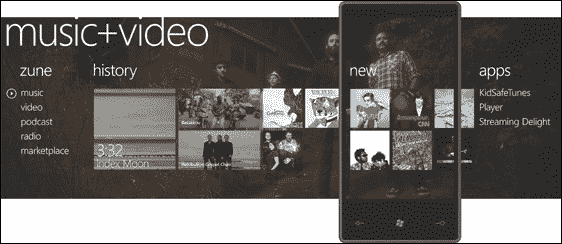

Windows Phone 7 的全景视图

随着 iOS 7 的发布，苹果通过对其用户界面的全面改革加入了极简主义运动，这一改革被设计高级副总裁乔纳森·艾夫（Jonathan Ive）描述为将复杂化为秩序。透明度、字体和分层是这种新设计的亮点。这是苹果设计方向的一次重大转变，当时它以其在各种应用程序和平台上的拟物化设计而闻名。

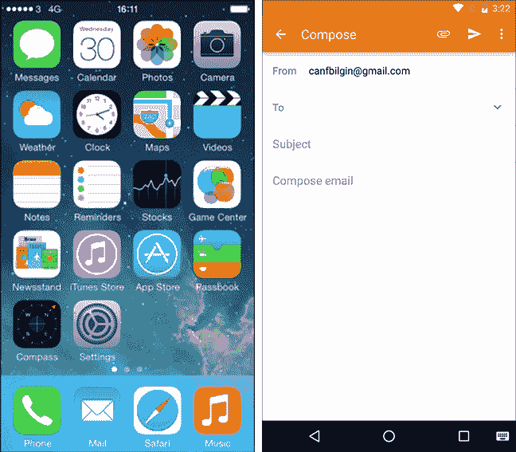

iOS 7 主页和 Android 对话框

谷歌对扁平化设计原则的看法，即 Material Design（代号量子纸），试图通过将设计元素简化到其基本要素，并重新创建具有类似纸张和墨水本质的强烈字体的交互表面来解决相同类型的设计问题。

## 硬件依赖性

与网络应用程序类似，在 Xamarin 目标平台上，尤其是在 Windows 和 Android 上，Xamarin 应用程序将要运行或显示的硬件差异很大。为特定平台设计的应用程序可以在具有中等分辨率的低端触摸屏设备上使用，也可以在具有高清显示的平板电脑上使用，无论是横向还是纵向旋转。这种硬件依赖性在设计移动应用程序的用户界面时应是主要关注点之一。

例如，在 Android 3.0 之前的手机通常有硬件按钮，这些按钮有助于在应用程序和操作系统本身中进行导航。这些按钮包括返回、菜单、搜索和主页按钮。尽管后来的设备将硬件按钮替换为底部的系统导航栏（软件按钮），但这一特性在仍然具有返回、Windows 和搜索硬件按钮的 Windows Phone 设备上得到了延续。在 iOS 上，导航层次结构的实现完全取决于应用程序，通常由放置在顶部导航栏上的返回按钮处理。

### Android 上的设计指标

对于不同的分辨率，为了创建自适应的用户界面，每个平台使用不同的方法。然而，在每个平台上，重要的指标单位是像素密度。像素密度可以定义为在一英寸长度内可以容纳的像素数量。根据像素密度（PPI 或每英寸像素数），独立于屏幕的总物理宽度和高度，开发者可以在各种移动设备上创建一致的视图。换句话说，总屏幕分辨率（像素密度乘以屏幕尺寸）是设计跨设备/平台应用程序时考虑的一个下降特性。

在 Android 平台上，为了在不同像素密度上创建统一的使用体验，开发者和设计师被鼓励使用密度无关像素（dp）单位来表示 UI 控件的各个尺寸和测量值。密度无关像素是通过将 160 像素密度作为标准来计算的，并使用归一化像素值来计算显示尺寸。

查看以下表格以获取有关 Android 密度无关像素的更多信息：

| 屏幕密度 | 密度桶 | 屏幕分辨率（像素） | 屏幕分辨率（dp） |
| --- | --- | --- | --- |
| 120 | LDPI | 360 x 480 | 480 x 640 |
| 160 | MDPI | 480 x 640 | 480 x 640 |
| 240 | HDPI | 720 x 960 | 480 x 640 |
| 320 | XHDPI | 960 x 1280 | 480 x 640 |

> *Android 密度无关像素（dp）*

为了演示缩放和密度无关像素，我们可以比较不同设备上的以下视图。使用像素设计的内容将在不同设备上以不同的方式可视化：

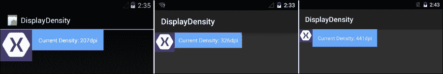

使用像素设计 UI

然而，如果我们使用 dp 作为测量单位来使用相同的设计元素，UI 将会更加统一。

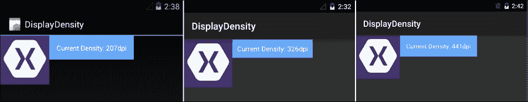

使用 dp 设计 UI

与 dp 类似，Android 上另一个密度无关的度量单位是 "sp"，或可缩放像素。dp 和 sp 之间的主要区别在于 sp 是根据用户的字体设置进行缩放的，通常与文本内容相关联，而 dp 由操作系统管理，用户通常无法对其进行任何控制。

对于媒体资源（例如，图像）和布局，Android 解决方案结构支持创建专门的设计元素。可以使用正确的密度桶标识符作为 `drawable` 文件夹的后缀来提供不同大小和分辨率的图标和其他图形（例如，`drawable-xhdpi` 用于超高密度）。同样，如果需要，可以根据布局文件夹中的屏幕尺寸组提供多个替代布局（例如，`layout-xlarge` 或 `layout-xlarge-land` 用于超大屏幕上的纵向和横向显示）。

#### iOS 上的设计指标

在 iOS 生态系统中，只有少数设备和屏幕分辨率。在这个平台上，显示缩放的标识符是点（pt）表示法。点在非视网膜显示器上显示为一个物理像素。在视网膜显示器和更高配置（iPhone 6 Plus）上，缩放因子分别计算为 2x 和 3x，而点测量值保持不变。

### 注意

iPhone 6 Plus 的缩放因子为 3，屏幕分辨率为 414 x 736 点。这相当于 1242 x 2208 像素分辨率。然而，该设备上支持的物理分辨率是 1080 x 1920。因此，使用 3x 缩放因子渲染的图像在此设备上以 1:1.15 的比例进行下采样。

#### Windows Runtime 上的设计度量

在 Windows Runtime 上，应用视图的缩放由缩放算法负责，这些算法将控件、字体和其他 UI 元素的大小标准化。这个过程发生在运行时，开发者通常不需要处理它。当设计 Windows Runtime 应用程序时，度量单位是像素。然而，像素被称为有效像素。有效像素是操作系统的标准化尺寸单位。

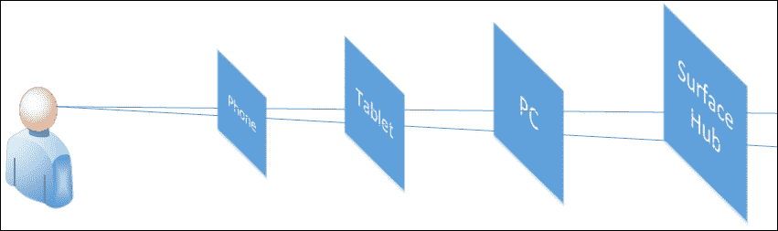

Windows Runtime 上的有效像素

对于有效像素的一个常见例子是考虑一个 24px 大小的字体。使用这个字体可视化的文本在用户距离手机 5-10 厘米处和距离几米远的 surface hub 上显示方式相同。

# 设计元素

为了在各个平台上创建一致的布局，同时符合平台要求，开发者和设计师需要熟悉每个平台，并在这些平台的布局和 UI 控件之间建立联系。我们将在下一章中讨论 Xamarin.Forms 范围内的这个问题。这些平台之间的联系构成了 Xamarin.Forms 框架的基础。

## 基本布局

在所有三个平台上，主要的布局元素彼此非常相似。然而，这些元素的位置根据平台的不同而有很大差异。

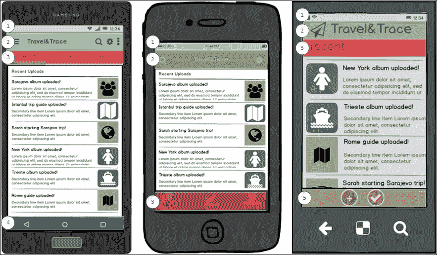

用户界面布局

在每个平台上，显示系统信息的状态栏都位于屏幕顶部（如前一张截图中所标记的“1”所示）。这部分是设计适用于 Xamarin 目标平台的应用程序时应牢记的常量元素之一。

### 注意

在 Windows 10 操作系统上，系统栏可以根据用户的主动操作来扩展，以提供有关系统的详细信息。这种扩展会导致应用画布上的元素被隐藏。然而，这并不会导致元素偏移，扩展发生在屏幕的不同层上。

在所有三个平台上，第二个元素通常是导航栏（在屏幕截图上标记为“2”）。此元素仅用于显示有关当前视图的信息。然而，在 iOS 和特别是 Android 上，导航栏具有额外的功能。iOS 应用程序中的导航栏可用于分层导航项。然而，在 Android 平台上，所谓的应用栏包含与上下文相关的命令和导航项。在 Android 应用程序的主要应用栏（右侧的导航面板）上显示的上下文菜单以及显示不适用于主应用栏（右侧的导航面板）的额外上下文相关命令的上下文菜单和显示左侧导航面板的导航抽屉是 Android 应用程序主要应用栏的功能和结构元素。在 Windows Phone 应用程序的标题区域放置与应用程序和内容相关的按钮或链接已被不推荐。然而，在 Windows 10 上，类似于 Android 平台上的导航抽屉，开发者可以实现应用程序级别的切换。

在 Windows 平台上，与上下文相关的应用程序命令和显示在上下文菜单中的附加项通常位于应用程序栏底部（标记为“5”）。尽管可以在屏幕顶部创建应用程序栏，但这通常适用于使用对等/水平导航模式的应用程序（参考下一节，*导航*）。

系统导航栏（标记为“4”）位于 Android 平台屏幕底部。此栏包含三个按钮，即返回、主页和历史记录。在 Android 4.0 之前，这些按钮曾是硬件按钮。

与 Windows Phone 上的底部应用栏和 Android 系统导航栏不同，在 iOS 上，这个区域通常由标签栏（标记为“3”）占据。标签栏提供了 iOS 应用程序的主要导航功能，并且应该在应用程序的每个屏幕上可用（类似于 Windows Phone 上的对等导航应用栏）。

## 导航

在应用程序设计中，导航策略应该是首要决策事项之一。根据应用程序的要求或要关注的元素，开发者可以采用不同的导航策略。

在构建导航树和准备应用程序的流程图时，你可以使用两种类型的遍历：分层（垂直）和对等（水平）。当用户想要在导航树同一级别的页面之间导航时，会发生水平导航。分层导航可以在垂直路径的任一方向上。一般来说，随着用户导航的深入，屏幕上类似类型的对象数量减少，单个对象的细节增加。换句话说，在应用程序导航层次结构的子树的低层节点中很少看到列表视图。


导航层次结构

在传统的导航方法之上，可以在不同级别和子树之间的页面之间使用跳转链接，以便轻松访问这些节点（例如，一个从层次结构底部导航回主页的“首页”链接）。

为了展示导航设计，我们将为 TravelTrace 应用程序创建一个界面，该界面在上一章中作为功能实现的示例。

### 水平导航

在同级或兄弟之间进行导航可以提供一种轻松切换上下文的方法，以便在*顶级*项目之间切换。在这种情况下，同级将代表应用程序的主要功能，这些功能通常应始终对用户可用。在这一级别，导航可以通过标签控件或 Android 平台上的导航抽屉等应用程序级导航提供者来实现。主页应具有清晰的设计和焦点；它应该说明您的应用程序旨在做什么。

例如，如果我们想用我们的旅行应用程序来展示顶级同级项，我们首先需要确定应用程序必须提供的主要功能。

这款旅行伴侣应用程序的可能功能包括：

+   获取附近景点的详细信息

+   允许用户规划他们的旅行

+   创建并分享旅行纪念品（照片、笔记、提示等）

应用程序的功能可能包括：

+   创建一个社交平台来分享和重用旅行体验

+   在旅行和文化访问前后协助用户

总体而言，我们希望强调社交方面，并在用户访问期间提供个人协助。鉴于这个“决定”，我们可以开始为我们的应用程序设计初始概念。

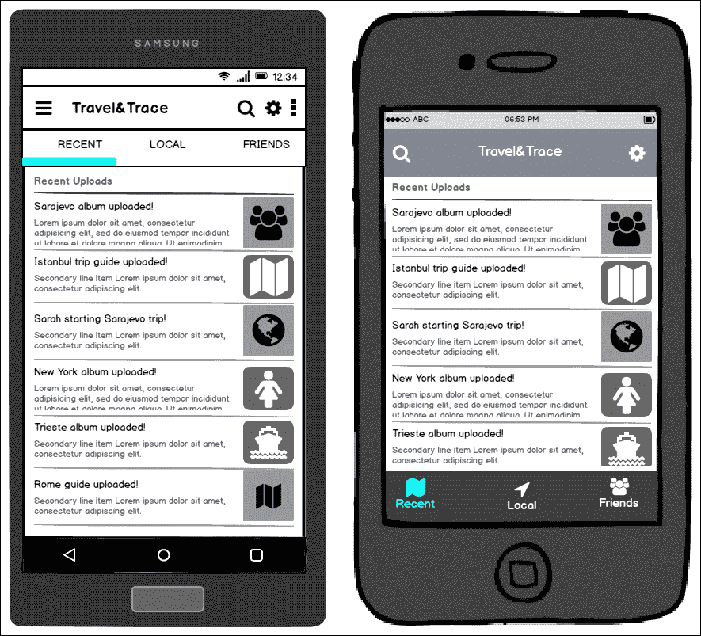

主屏幕示例

在 Windows Phone 平台上，主屏幕可以是中心视图或枢轴视图。尽管每个视图都有类似的导航属性，但枢轴控件通常用于显示具有相似特性的内容分组。

因此，通常更倾向于使用中心视图作为主页，以便使应用程序的不同顶级部分可用，并且子节点易于发现。

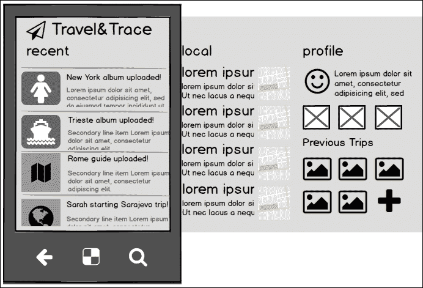

中心视图（Windows Phone）

当考虑 Windows Phone 和`HubView`时，在层次结构中的顶级项之间导航的唯一可能方式是滑动手势，而在其他平台上则可以点击标签栏按钮。

在导航不同类别或内容项的过滤视图时，也可能发生另一种类型的水平导航。在 Android 平台上，主应用栏可以托管一个过滤器下拉菜单，以选择显示内容项的正确类别。在 iOS 上，导航栏或次要底部工具栏可以用来创建一个按钮，显示选择器（也称为旋转按钮），以选择导航树上的正确兄弟节点。iOS 上另一个可能的水平导航提供者控件是`SegmentedView`控件，它可以用来显示同一类型内容的不同视角（例如，与未来计划相比的过往旅行或最近的指南和专辑）。

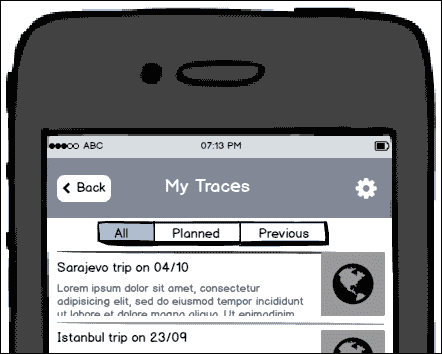

iOS 上的 SegmentedView 控件

在 Windows 平台上，对于具有“几个”以上类别且可能类别始终可见并显示在内容区域旁边的用例，选择主/详细类型的实现通常是一个更好的主意。也可以在附加到命令栏按钮之一的飞出菜单中使用下拉菜单。如果类别数量有限，可以在视图实现中使用`PivotView`控件。


Windows Phone 上的命令栏飞出

在所有平台上，也可以包含内容内的选择控件，帮助用户在类别之间导航（下拉菜单、选择器、旋转按钮、超链接、按钮等）。

例如，我们的旅行应用程序的目录视图允许用户自由浏览上传的内容，需要将不同大陆的国家项目进行分类。

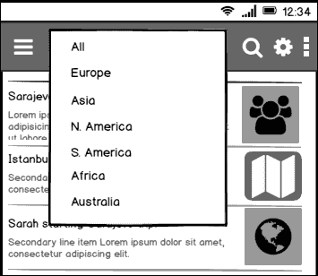

Android 上的主应用栏过滤器

最后，iOS 和 Android 顶部导航栏和主应用栏上使用的 Next/Previous 按钮，以及 Windows Phone 上的左右滑动手势，可以在在兄弟节点和/或集合项之间导航时创造一个愉快的体验。这种类型的导航通常用于层次导航树底部或子树底部。

### 垂直导航

具有父子关系的元素（例如，父页面可以是国家视图，子视图可以是城市详情）可以使用导航树的垂直遍历。最简单和最常见的方式是当用户点击项目时导航到内容元素的细节视图。

与细节概念相关的一个常见错误是将它变成一个两步过程，其中用户首先需要选择项目，然后点击一个细节命令按钮。在现代应用程序中，通过使用内容元素本身作为交互元素，使 UI 直观至关重要。

一旦用户处于详细信息视图，向上导航到导航树中的上一级可以通过在主应用栏（在 Android 上）和导航栏（在 iOS 上）上的返回按钮，或者使用 Windows Phone 上的硬件返回按钮和系统栏上的软返回按钮来实现。不建议在 Windows Phone 平台上使用额外的返回按钮，因为设计空间已经有限，并且可以使用硬件按钮实现相同的功能，这与桌面版本不同，桌面版本没有硬件按钮，设计画布相对宽敞。

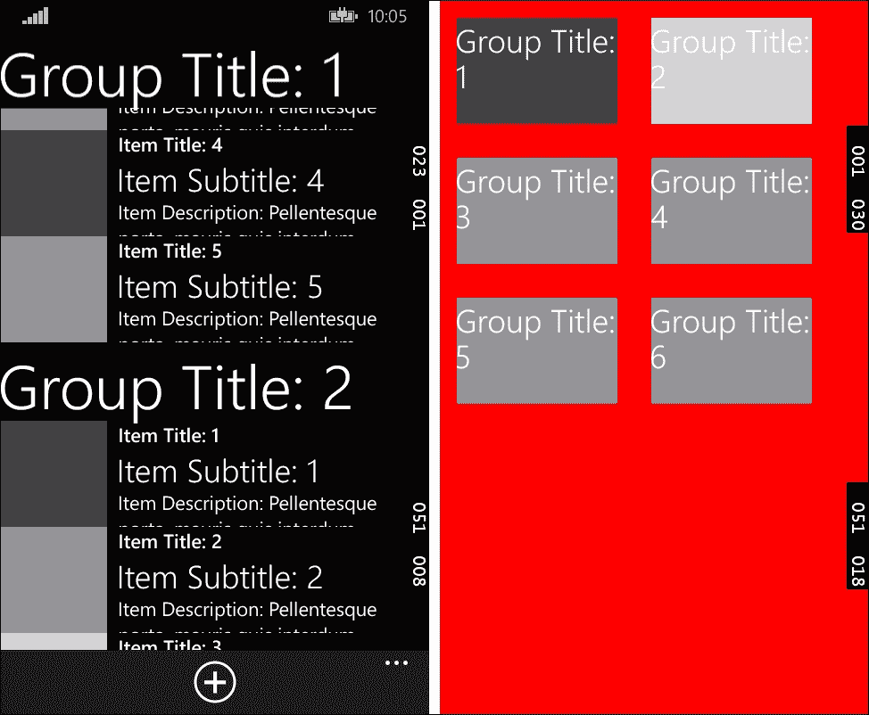

Windows Phone 上的语义缩放

在 Windows Phone 平台上，在不实现二级视图的情况下，创建对内容元素的不同视角的另一种方法是使用`SemanticZoom`控件。`SemanticZoom`控件提供了同一列表内容元素的两个视图，其中第一个通常是一个分类视图，元素数量较少，第二个是包含内容项额外详细信息的完整列表视图。两个视图之间的导航通常通过捏入和捏出手势来实现（有关详细信息，请参阅*手势*部分）。

### 跳转导航

当应用程序在未遵守导航层次结构的情况下在不同节点之间导航时，就会发生跳转或交叉导航（例如，可以导航到位于 Windows Phone 应用程序顶层中心页面的第三级项的详细信息视图）。

这种类型的导航通常与非常特定的功能一起使用，这些功能与应用程序的一般轮廓无关。导航命令可以包含在导航栏中，或者作为嵌入到内容中的超链接。使用命令栏创建与项目相关的导航链接也很常见。

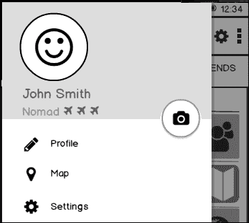

Android 上的导航抽屉

在 Android 上，创建用于轻松切换上下文的导航访问点的另一种可能方式是使用导航抽屉类型的功能。在 iOS 上，可以通过持续标签栏获得类似体验。如前所述，随着 Windows 10 的发布，类似的功能被添加到了 Windows Phone 平台。

## 内容元素

每个 Xamarin 目标平台都提出了一些策略和指南来可视化内容。尽管开发人员被赋予了创建吸引人和创新的设计块的自由，尤其是在 Android 和 Windows Phone 平台上，但必须遵守严格的指南。我们可以将这些内容块和控制项分为几个类别。

### 收藏视图

集合视图提供了一种高效的方式来显示基于集合的内容元素。在大多数实现用例中，集合元素是交互式的，并使用文本和图像控件显示内容项的属性。在内容项本身上添加与项目相关的命令或标志也很常见，形式为标记（例如，将项目添加到收藏夹的命令、显示状态图标等）。

#### `UITableView (iOS)`

在 iOS 平台上，`UITableView` 提供了一种灵活的方式来在可自定义的布局上显示集合数据。在表格视图中，每个单元格都可以自定义以显示来自内容项的一批属性，并且开发者可以自由使用内置的事件和命令来实现额外的命令逻辑（例如，行操作）。

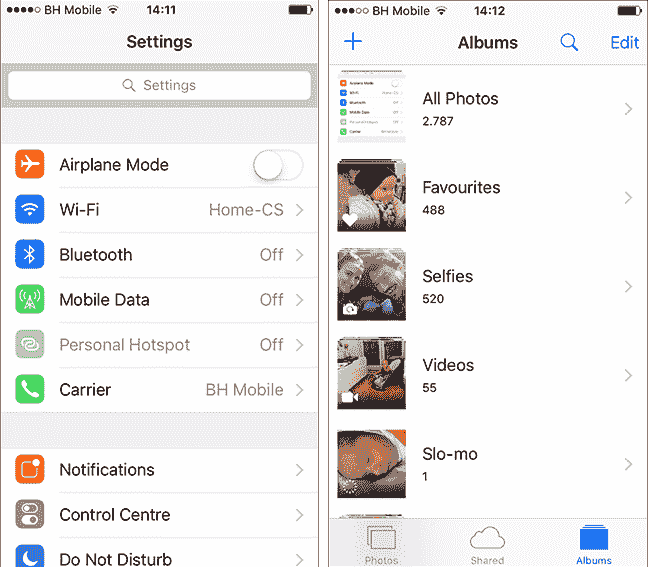

分组表格视图和带有详细信息的表格视图

`UITableView` 和相关控制器 (`UITableViewSource`) 的另一个开箱即用的功能是内容元素所谓的索引。索引的工作方式与 Windows 平台上的跳转列表类似，提供了一种轻松的方式来对内容项进行编目，并使用户能够轻松跳转到正确的部分或组。

搜索显示控制器也可以与 `UITableView` 关联，在项目集合上创建标准的 iOS 搜索体验。

默认情况下可以包含在表格视图单元格中的可能的艺术品如下：

|  | 复选标记 | 表示行被选中 |
| --- | --- | --- |
|  | 揭示指示器 | 表示与行关联的另一个表格 |
|  | 详细信息揭示指示器 | 标识用户可以点击以查看当前行的详细信息（例如，弹出视图） |
|  | 行重排 | 标识行可以被拖动以重新排序 |
|  | 行插入 | 向表格中添加新行 |
|  | 删除视图/隐藏 | 显示或隐藏当前行的删除按钮 |
|  | 删除按钮 | 删除行 |

> *表格视图艺术品*

#### `UICollectionView (iOS)`

`UICollectionView` 用于在 iOS 平台上创建类似网格的布局。集合视图也可以通过内置属性和基类进行自定义。与本质上受表格结构和包含单元格限制的表格视图相比，集合视图在本质上更灵活。

集合视图也由可以在多种布局中显示的单元格组成。默认布局可以使用 `UICollectionViewFlowLayout` 进行自定义。流布局可以定义行之间的最小行间距、项目之间的最小临时间距、项目大小和部分内边距（分配给集合中各部分的边距）。

以下代码示例创建了一个简单的流布局结构：

```cs
UICollectionViewFlowLayout flowLayout = 
                          new UICollectionViewFlowLayout();
flowLayout.MinimumLineSpacing = 20f;
flowLayout.MinimumInteritemSpacing = 4f;
flowLayout.SectionInset = new UIEdgeInset(4f, 4f, 4f, 4f);
flowLayout.ItemSize = new SizeF(20f, 20f);
myCollectionView.CollectionViewLayout = flowLayout;
```

另一种自定义集合视图布局的方法是继承 `UICollectionViewLayout` 类并实现自定义布局。在自定义布局实现中，该类负责根据集合大小和可用布局区域提供布局属性，如单元格的大小和位置。

`UICollectionViewController` 用于标准化要呈现的数据，并作为集合和单元格级别事件（如单元格选择和上下文菜单）的代理。

此外，`SupplementaryView` 和 `DecorationView` 类通过提供与部分相关的详细信息和集合视图层的 UI 自定义来提供额外的自定义。

#### ListView (Android)

`ListView` 是 Android 平台上使用最频繁的组件之一。虽然它可以用来显示相对较小的菜单项列表，但通过适配器，它也可以用来可视化来自其他应用程序和服务的数据。可以将 `ListView` 控件与 iOS 平台上的 `UITableView` 控件和数据提供者接口进行比较。Android 上的适配器可以与 iOS 上的 `UITableViewSource` 相比较。

默认情况下，`ListView` 包含 12 个内置视图，可以通过 `Android.Resource.Layout` 类访问。这些布局从简单的单行文本到可展开的分组类别视图不等。每个布局都使用几个控件引用，如 Text1、Text2 和 Icon，这些应由适配器通过将值分配给内容字段来填充。通过创建 AXML 标记文件并在适配器中引用该标记，也可以实现自定义布局。

一个示例自定义布局实现可能如下所示：

```cs
<RelativeLayout 
    android:layout_width="fill_parent"
    android:layout_height="wrap_content"
 android:background="@drawable/CustomSelector"
    android:padding="8dp">
    <LinearLayout
        android:id="@+id/Text"
        android:orientation="vertical"
        android:layout_width="wrap_content"
        android:layout_height="wrap_content"
        android:paddingLeft="10dip">
        <TextView
            android:id="@+id/Title"
            android:layout_width="wrap_content"
            android:layout_height="wrap_content"
            android:textSize="20dip" />
        <TextView
            android:id="@+id/Description"
            android:layout_width="wrap_content"
            android:layout_height="wrap_content"
            android:textSize="14dip" />
    </LinearLayout>
    <ImageView
        android:id="@+id/Image"
        android:layout_width="48dp"
        android:layout_height="48dp"
        android:padding="5dp"
        android:src="img/icon"
        android:layout_alignParentRight="true" />
</RelativeLayout>
```

我们还可以通过添加视觉状态选择器来扩展样式（参见前一个示例中的背景颜色分配）。

自定义视觉状态选择器的实现可以定义为以下内容：

```cs
<?xml version="1.0" encoding="utf-8"?>
<selector >
  <item android:state_pressed="false"
        android:state_selected="false"
        android:drawable="@color/blue" />
  <item android:state_pressed="true"
        android:state_selected="false"
        android:drawable="@color/red" />
</selector>
```

最后，列表适配器的实现可能如下所示：

```cs
    public class CountriesDataAdapter : BaseAdapter<Country>
    {
        private List<Country> m_Items;

        private Activity m_Context;

        public CountriesDataAdapter(Activity context, List<Country> items)
        {
            m_Context = context;
            m_Items = items;
        }

        public override long GetItemId(int position)
        {
            return position;
        }

        public override View GetView(int position, View convertView, ViewGroup parent)
        {
            var item = m_Items[position];

            View view = convertView ?? 
m_Context.LayoutInflater
.Inflate(Resource.Layout.CustomRowView, null);

            view.FindViewById<TextView>(Resource.Id.Title).Text = item.Name;
            view.FindViewById<TextView>(Resource.Id.Description).Text = string.Format("In {0} region of {1}", item.Region.Name, item.Region.Continent);
            view.FindViewById<ImageView>(Resource.Id.Image).SetImageResource(Resource.Drawable.Icon);

            return view;
        }

        public override int Count
        {
            get { return m_Items.Count; }
        }

        public override Country this[int position]
        {
            get { return m_Items[position]; }
        }
    }
```

上述代码应生成类似于以下截图的视图：

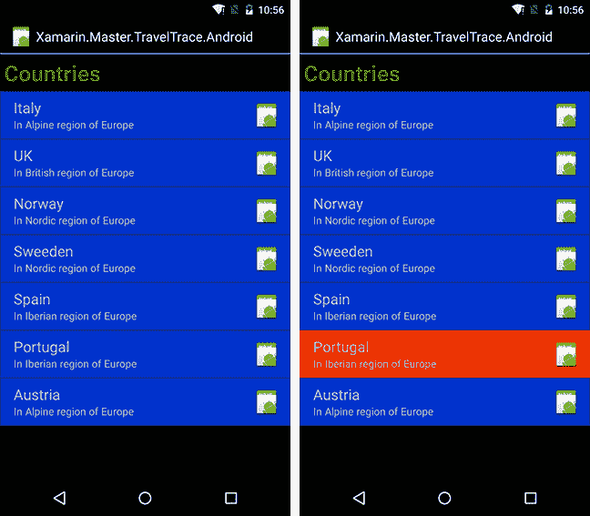

带有自定义布局的列表视图

#### GridView (Android)

除了`ListView`控件外，在 Android 平台上，集合可以通过`ViewGroup`进行可视化。视图组用于捆绑不同的视觉树，并在可滚动的视图元素中显示项目。`ViewGroup`最常见实现是`GridView`小部件。`GridView`是一个可滚动的网格控件，其中内容项再次提供了`ListAdapter`实现。

`GridView`通常与一组同质的内容项一起使用。这些内容项由一组文本内容和相关的图像项组成。内容项通常被称为磁贴，它们还可以包括几个与内容相关的命令。

磁贴在概念上类似于 Windows 应用程序现代 UI 设计的动态磁贴块。它们由主要内容和次要内容组成。主要内容填充整个单元格（例如，相册应用中的专辑封面），而次要内容则由图标或文本表示。主要操作通常是垂直下降的导航命令（导航到详细视图）。与内容项相关联的上下文操作通常被认为是磁贴上的次要内容。

如果内容项上的操作量或内容不是同质的，建议考虑在网格视图中使用卡片而不是磁贴。

#### CardView（Android）

`CardView`控件是在 Android 5.0 中引入的，它可以被描述为一个自包含的内容单元。这里的自包含是指卡片通常包括多个操作和多种与内容相关的项目。用户通常不需要求助于二级操作（选择然后使用上下文菜单）来与这些内容项交互。

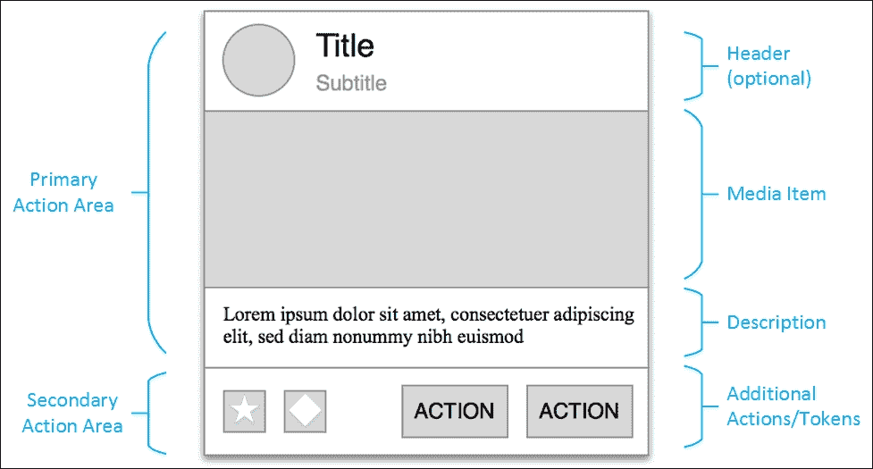

标准卡片布局

当没有直接比较集合元素的需求和可能性，且内容由各种类型的数据组成时，通常使用卡片。卡片可以通过使用操作按钮或在某些情况下，使用内容内的输入控件来交互。它们可以是可展开的，并且通常具有固定的宽度。

`CardView`作为一个`FrameLayout`小部件实现，可以与`ListView`或`GridView`一起使用来表示内容元素。

#### ListView 和 ListBox（Windows Phone）

`ListView`和`ListBox`是 Windows Phone 平台上的主要集合可视化控件。`ListView`是`ListBox`的一个更专业的实现，主要用于显示基于文本的内容。它的对应物`ListBox`高度可定制，可以用于显示由多种数据类型组成的内容。

这两个容器都可以用于项目级别的上下文操作。然而，`ListBox`类似于 Android 平台上的`CardViews`，用于创建可能包括操作和输入控件的可交互内容元素。

这两个控件都支持双向数据绑定，并且可以使用行为、项目模板和/或控件样式来对项目进行样式化和自定义。默认情况下，这两个控件的方向都是垂直的，但如果希望内容项目在水平线上显示，则可以将方向设置为水平。

如果需要在模板级别进行更多自定义以及如何布局项目，开发者还可以使用 `ItemsControl`，这是 Windows Phone 平台上大多数集合视图的基础实现。

为了自定义在 `ListView` 上显示的项目，我们首先需要创建一个 `DataTemplate`，它将是用于 `ListViewItems` 的模板。

一个示例 DataTemplate 声明可能如下所示：

```cs
<DataTemplate x:Key="SampleItemTemplate">
  <Grid>
    <Grid.ColumnDefinitions>
      <ColumnDefinition Width="Auto" />
      <ColumnDefinition />
    </Grid.ColumnDefinitions>
    <Border Margin="0,10,0,0">
      <Image Source="{Binding ImageUrl}" Height="80" Width="80" />
    </Border>
    <StackPanel Grid.Column="1" Margin="15,0,0,0">
      <TextBlock Text="{Binding Title}"
        Style="{ThemeResource ListViewItemTextBlockStyle}" />
      <TextBlock Text="{Binding Subtitle}"
        Style="{ThemeResource ListViewItemSubheaderTextBlockStyle}" />
    </StackPanel>
  </Grid>
</DataTemplate>
```

一旦我们的模板准备就绪，我们可以将模板分配给我们的 `ListView`，同时附带集合数据源，这是一个包含简单 `SampleItem` 对象的列表，这些对象的属性在 `DataTemplate` 中进行了描述。

代码如下：

```cs
<Grid>
  <ListView
    ItemTemplate="{StaticResource SampleItemTemplate}"
    ItemsSource="{Binding MyItems}" />
</Grid>
```

现在，内容项目在 `ListView` 中以两列样式显示，包括图片、标题和描述文本。

#### GridView (Windows Phone)

`GridView` 是 Windows Phone 平台上 `ItemsControl` 的另一种实现，它允许开发者以流布局创建集合视图。在处理媒体元素时，通常应首选 `GridView` 而不是 `ListBox` 或 `ListView`。

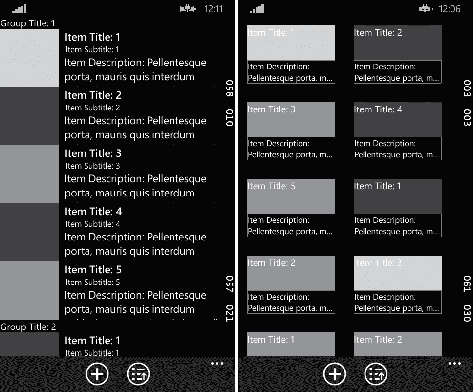

ListView 与 GridView 的比较

与之前定义的元素类似，`GridView` 支持双向数据绑定，并且可以使用标准方法进行自定义。

#### 虚拟化面板（Windows Phone）

重要的是要认识到移动平台的性能不如桌面或平板设备。特别是当处理大量数据时，尽管应用程序在桌面工作站上可以很好地进行视觉表现，但内存资源可能会在移动设备上导致 UI 闪烁、延迟，甚至阻塞。为了通过仅加载所需数据来减少内存使用并提高性能，Windows Runtime 提供了虚拟化面板控件（例如，`VirtualizingStackPanel`）。`ItemsControl` 是大多数在此描述中提到的集合视图的基础，它支持数据和 UI 虚拟化。

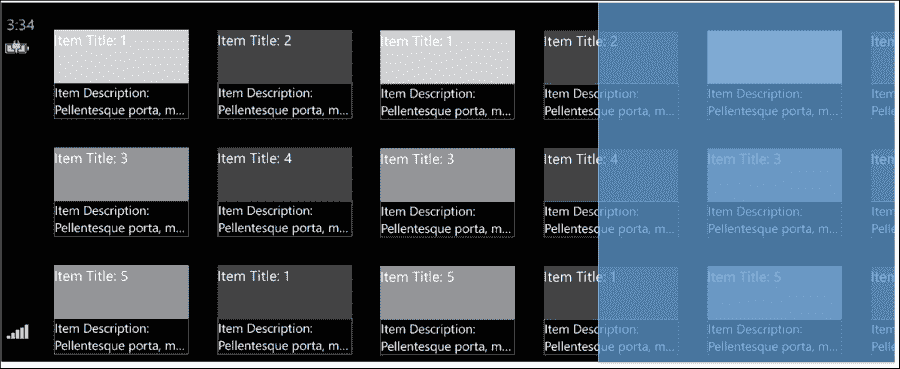

Windows Runtime 上的 UI 虚拟化

UI 虚拟化处理的是在应用程序视图中渲染的控件。当应用程序的列表视图绑定到大量项目时，在这种情况下，不需要在运行时内存中渲染和保持控件，而只需处理视口中的控件。在这个范例中，通过滚动操作从屏幕上移除的控件，如果用户滚动回来看，需要被销毁并重新绘制。

数据虚拟化处理分页数据源。例如，对于“可虚拟化”的数据源（实现`ISupportIncrementalLoading`的集合），只有当前视口所需的数据被加载到应用程序中，当 UI 控件需要显示更多项目时，会从数据源请求额外的批次。随机访问虚拟化允许开发者在任何随机序号上检索数据子集。对于这种类型的数据虚拟化，数据源需要实现`INotifyCollectionChanged`和`IObservableVector`。

### 模态视图

模态视图是临时视图组件，可以提供交互式界面以获取用户对特定任务的输入或决定工作流程的执行路径。使用警告对话框通知用户关于对应用程序执行至关重要的关键信息也是常见的。

#### 弹出视图和警告（iOS）

iOS 平台提供了各种模态对话框，用于在不同场景下显示、编辑和操作数据。这些对话框类型的外观各不相同，但共同点是它们总是获得焦点，并显示在屏幕的最高层，而对话框下的内容则通过半透明覆盖层隐藏。

操作表是使用频率最高的模态对话框之一。这种对话框类型通常用于在开始任务或取消任务之前给用户一个选项。它通常以按钮列表的形式显示；最后一个按钮通常是屏幕底部的“取消”按钮。

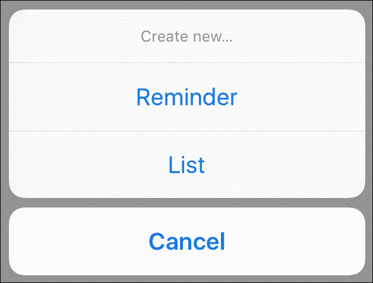

iOS 上的操作表显示

可以使用`UIAlertController`并指定`UIAlertControllerStyleActionSheet`来初始化操作表。如果屏幕尺寸允许（在水平规则的环境中），操作表将以弹出视图的形式显示。

警告对话框是 iOS 上另一种类型的模态对话框。警告通常用于通知或请求用户同意影响应用程序执行的问题。与操作表不同，警告对话框可以包含描述性文本、标题，甚至文本输入字段。

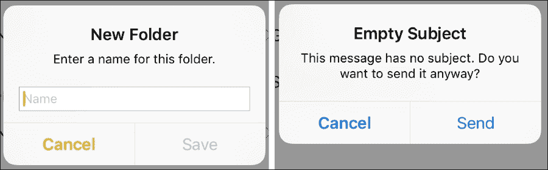

带输入字段且只有描述和标题的警告对话框

可以使用`UIAlertController`和指定`UIAlertControllerStyleAlert`来调用警告对话框。警告对话框应避免任何形式的冗余、非正式和负面内容。如果标题提供了足够的信息让用户继续执行，则可以省略描述性文本。

弹出视图是 iOS 平台上的另一种临时上下文视图。然而，弹出视图仅在水平规则的环境中显示（在 iPad 的纵向和横向，以及 iPhone 6 Plus 的横向旋转中）。在水平紧凑的环境中，它们作为全屏模态对话框显示。

为了初始化弹出视图，可以使用`UIPopoverPresentationController`。

模态对话框是 iOS 上使用的另一种类型的临时视图显示。模态对话框可用于需要执行非常特定任务或工作流程的自包含和紧凑视图的场景。

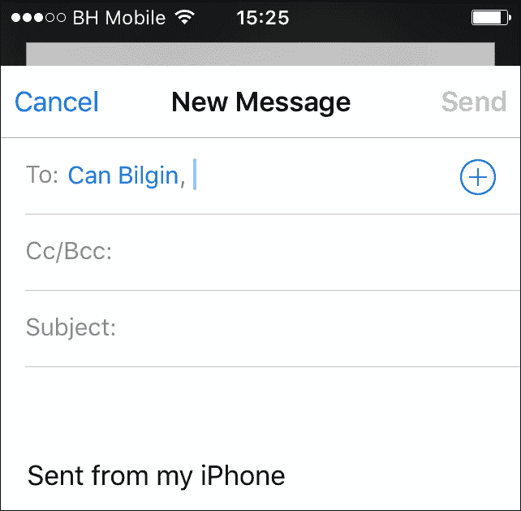

页面表单样式的模态对话框

模态对话框可以使用 `UIPresentationController` 创建，具有各种模态呈现样式（全屏、页面表单、表单表单和当前上下文）。然而，与模态对话框关联的呈现样式在水平紧凑环境中几乎表现相同（所有 iPhone 模型，除了横向模式下的 iPhone 6 Plus）。

#### 弹出菜单、弹出和菜单（Windows Phone）

弹出菜单是 Windows Phone 平台上的主要模态对话框。它们可用于各种场景，包括显示上下文菜单、显示项目的附加详细信息或获取用户的同意。不同类型弹出菜单的共同行为是它们总是以最高的 z-index 在屏幕上显示，并且下面的元素通过半透明覆盖被禁用。弹出菜单默认具有轻触关闭机制。换句话说，如果用户在弹出控件边界外任何地方轻触，它们可以被关闭。

弹出菜单通常与当前视图上的另一个控件相关联，要么通过使用附加属性，要么通过使用 `Flyout` 类的 `ShowAt` 函数。`Flyout` 类的内容属性用于分配一个 `UIElement` 以在屏幕上显示。

```cs
    var flyout = new Flyout();
    var stackPanel = new StackPanel { Orientation = Orientation.Vertical, Margin = new Thickness(5)};
    var textBlock = new TextBlock { Text = "Flyout Text Content", FontSize = 20 };
    var textInput = new TextBox { PlaceholderText = "Input Value", FontSize = 18 };
    var button = new Button { Content = "Apply", FontSize = 18 };
    stackPanel.Children.Add(textBlock);
    stackPanel.Children.Add(textInput);
    stackPanel.Children.Add(button);
    flyout.Content = stackPanel;
    flyout.ShowAt(TextBlock);
```

上述示例代码将创建一个包含文本内容、输入字段和按钮的弹出菜单：

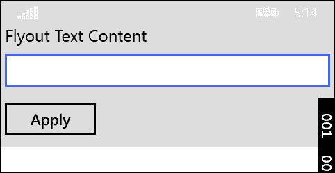

Windows Phone 上的简单弹出菜单

### 注意

尽管弹出菜单始终附加到一个 `UIElement`（无论是使用 XAML 还是代码）并且对话框应该显示在相关元素附近，但在 Windows Phone 上，弹出菜单的行为类似于显示在屏幕顶部的消息对话框。

在 Windows 运行时，可以使用弹出菜单的派生类型来处理特定场景。`MenuFlyout`、`TimePickerFlyout` 和 `DateTimePickerFlyout` 是这些实现的示例。

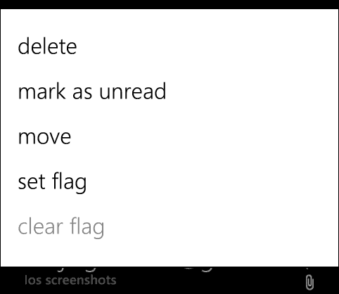

菜单弹出菜单使用

除了弹出菜单之外，弹出控制还可以用来显示临时视图或内容项的详细信息。弹出菜单通常是独立的控件，可以直接包含在视图 XAML 中。它们可以选择使用轻触关闭，并可以使用 `IsOpen` 属性来显示或隐藏。

对于警报对话框或关键输入要求，`MessageDialog`类为开发者提供了一个熟悉的实现工具。`MessageDialog`是一个简单的对话框，用于显示文本内容和众多 UI 命令。`UICommand`类代表一个按钮及其相关的动作（如果有），用于在对话框上显示动作，并在用户选择后为对话框提供一个结果。以下实现创建了一个带有文本字段和两个命令的消息对话框：

```cs
MessageDialog dialog = new MessageDialog("You are about to delete an important item", "Important Deletion");
dialog.Commands.Add(new UICommand("Sure"));
dialog.Commands.Add(new UICommand("Not Really"));
dialog.ShowAsync();
```

这在 UI 上显示的方式类似于飞出视图的视觉表示：

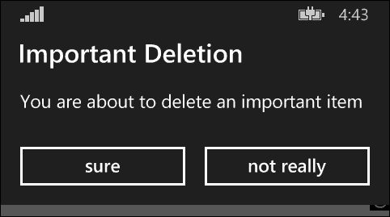

Windows Phone 上的 MessageDialog 示例

#### 对话框（Android）

在 Android 上的对话框可以简单实现，如警报对话框或全屏对话框，用于检索所需表单数据以继续当前任务。对话框的行为与其他平台上的模态对话框实现相同；它们中断当前任务，并显示在底层之上。底层内容通过半透明的灰色覆盖层隐藏。

简单的警报对话框，类似于其他平台上的并行实现，由标题、描述性内容和确认操作组成。它们在用户输入对执行至关重要的情况下被调用。

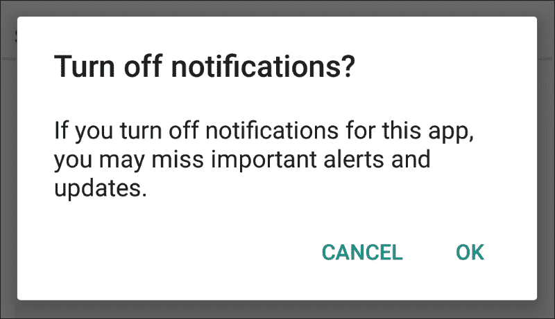

Android 警报对话框

在描述性内容和动作按钮内容中避免任何歧义是很重要的。

在 Android 应用程序中使用的另一种流行对话框是上下文菜单对话框。这种类型的对话框在选择列表中的项目后不需要任何确认。它们也有轻量级消失的行为。如果对话框有关于选择项的附加信息以及可能的其他操作，它们被称为简单对话框。这些对话框上的选择也不需要确认。

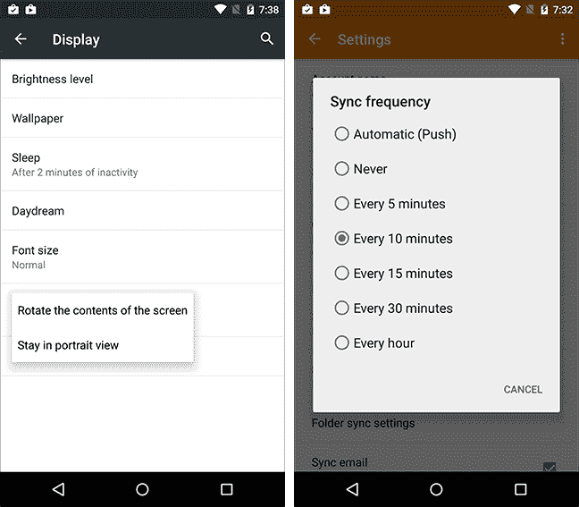

Android 对话框

如果对话框实现需要用户明确确认所做的选择，这些对话框通常被称为确认对话框。在对话框屏幕底部通常有一个“取消”按钮，以便保留之前选定的选项。

### 文本视图

在所有三个平台上，随着极简设计倾向的出现，排版和文本内容项成为了用户体验设计的焦点。每个平台都有针对不同场景的字体大小和字体的明确指南。更重要的是，这些平台中的每一个都有专门的方式来显示和编辑富文本格式。

+   **Windows**: 在 Windows Phone 平台上，Run 元素用于定义应用特定格式化的文本部分。Run 元素可以包含在 `TextBlock` 元素或 `RichTextBlock` 控件中。除了 Runs，`RichTextBlocks` 还可以与类似 html 的样式元素（例如，粗体、span、斜体等）结合使用。使用 `RichTextBlocks` 和 `RichTextBlockOverflow` 作为容器，Windows Phone 应用程序可以支持任何形状和样式的文本显示。

+   **Android**: 在 Android 平台上，使用所谓的 spans 实现文本格式化。有大量的预定义样式 span 实现，例如 `RelativeSizeSpan`、`ForegroundColorSpan` 和 `ClickableSpan`。这些 span 实现用于设置 `SpannableString` 中某些部分的描述样式。有一个 `SpannableStringBuilder` 类可以用来创建带样式的段落/文本内容。一旦 `SpannableString` 完成，它就可以用作 `TextView` 控件的内容。

+   **iOS**: 在 iOS 平台上，文本相关功能和控件由 Core Text 库引入。`UITextView` 控件是该库中的可视化元素。通过使用 `NSMutableAttributedText` 类实现文本格式化。对于带属性的文本内容，可以设置不同的文本范围以使用某些属性，例如 `NSUnderlineStyleAttribute`、`NSBackgroundColorAttribute` 等。在显示带属性的文本块时，可以使用 `NSTextContainer` 来描述一个形状，其中文本应该以行片段的形式显示。

### 网页视图

在 Xamarin 目标平台上，网页视图控件用于显示丰富的 HTML 内容。这些网页视图控件构建自己的导航堆栈，独立于应用程序运行时。在 Android 和 Windows Phone 上，还可以将 JavaScript 注入到控件上显示的 HTML 内容中。

在所有平台上，不仅可以从远程加载，还可以从应用程序资源中加载本地网络应用程序。

## 反馈

现代应用程序设计的支柱之一是确保用户始终了解应用程序正在执行的操作以及这些任务的进度。即使应用程序正在处理阻塞调用（在完成任务之前无法继续执行），显示进度环也能营造出应用程序仍然响应的错觉。

进度指示器可以分为两组：不确定的和确定的。

### 不确定进度

不确定的任务及其相关的进度指示器与那些应用程序无法提供估计完成时间或进度信息的操作相关。这些操作可能依赖于多个子程序的完成，可能与整个应用程序或单个 UI 元素相关。

对于不确定过程，我们首先需要决定该过程对于应用程序有多重要。如果应用程序无法在没有完成当前过程的情况下继续，这将是一个应用程序级阻塞调用。在涉及阻塞调用（包括单步或多步）的情况下，使用主内容区域上的进度环是一个好主意。这种场景的一个好例子是主客户端试图从服务器检索电子邮件消息，而不知道服务器上有多少条消息。如果此过程中涉及多个步骤，你还可以在进度环附近或上方显示信息文本。

在 Android 上，可以使用`ProgressDialog`类实现此实现。实例化此控件提供了一个模态对话框，可以包含描述性文本。在将其显示在 UI 上之前，将不确定标志设置为 true 是很重要的。

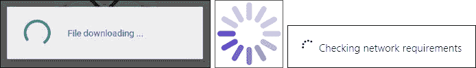

Android、iOS 和 Windows Phone 上的进度环

在 iOS 上，使用`UIActivityIndicatorView`可以实现相同的可视化。你可以修改其行为以实现动画和颜色变化。

在 Windows Phone 上，`ProgressRing`类提供了相同类型的功能。

在不确定的场景中，如果正在执行的过程不会阻止用户继续与应用程序交互，最好给出关于过程和执行中涉及的控件更微妙的指示。这可以通过使用位于或覆盖过程开始处的进度环或进度条来实现。在 iOS 上，进度条和环之间的唯一区别是过程是确定性的还是不确定性的。然而，在 Android 和 Windows Phone 上，进度条也可以作为不确定任务指示器。在 Windows Phone 平台上，如果过程是应用程序级任务，通常也会在屏幕顶部显示不确定进度条，但与应用程序的交互可以继续，无需等待此过程的完成结果。

### 确定进度

确定任务及其相关指示器与应用程序可以提供当前状态信息给用户的过程相关。在 Xamarin 目标平台上，首选的确定进度指示器是进度条。进度条在提供过程当前完成状态的视觉指示的同时，还可以包括一个标签，给出任务当前状态的文本描述。

如果过程相对较长，提供取消方法（例如，进度条附近的取消按钮）也很重要。

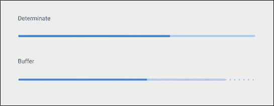

Android 确定进度条显示

在 Android 平台上，除了进度指示外，进度条上还可以显示缓冲百分比。

# 用户交互

在跨平台开发项目中，应用程序的用户交互模式集合是另一个重要元素。已经在其他平台上使用应用程序的用户希望在其他平台运行的客户端上找到相同的交互模式。当涉及到特定平台的交互模式时，这个决策过程变得更加复杂，因为应用程序应该为平台用户提供一个熟悉的界面。在这种情况下，实现平台原生性和应用程序身份之间的平衡妥协非常重要，并找到最佳解决方案。

使用交互模式进行品牌的一个好例子是 iOS 应用程序中使用的“下拉刷新”交互模式。大多数处理信息流（例如，Facebook、Twitter 等）的应用程序提供商都在他们的 iOS 应用程序中使用了这种实现。尽管这不是 Android 和 Windows Phone 上的原生交互模式，但类似的方案在这些平台上迅速流行起来；因此，大多数开发者和用户现在在各种平台上都采用了这种用例。

## 交互控件

在大多数情况下，为 Xamarin 目标平台构建的应用程序需要输入和其他交互控件来收集用户必要的信息。通过交互，我们指的是几乎可以在 Xamarin 应用程序中使用的所有 UI 控件。在这种情况下，甚至一个简单的筛选下拉控件，用于选择不同的视图视角，也会是一个交互控件，请求用户显示适当的数据或视角。

### 文本输入

文本输入字段是使用最频繁的一种输入字段类型。文本字段可以设计为单行文本或多行文本。文本字段的一个重要方面是，一旦在触摸设备上选中文本输入字段，虚拟键盘就会出现在屏幕上。在设计用户界面并在之后实现时，牢记这一点通常是一个好主意。

在 iOS 上，虽然`UITextField`提供了单行文本输入的机制，但`UITextView`可以用来创建可编辑的富文本内容。这两个控件都提供了诸如大写和纠错等选项。

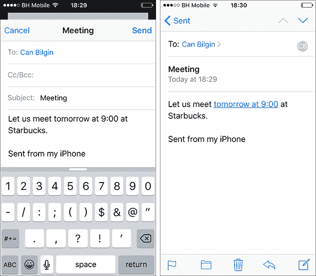

UITextView 编辑和只读视图

此外，`UITextView`提供了可以将互联网地址转换为链接、地址转换为地图链接、电话号码转换为拨打电话的深度链接以及日期/时间值转换为日历事件项的检测器。

Android 文本输入字段与 iOS 平台上的类似。主要区别在于，在 Android 上，除了两个不同的控件外，只有`EditText`控件用于多行和单行文本输入。这是通过设置控件的`InputType`属性（或在 AXML 中的`inputType`属性）来实现的。除了文本格式之外，还可以设置其他输入范围，例如邮政地址、首字母大写、自动更正和句子开头大写。请注意，这些范围参数是位组合。另一个提供自动建议的专用控件是`AutoCompleteTextView`，开发者可以将`ArrayAdapter`分配为建议的源。

在 Windows Phone 上，`TextBox`是最常用的文本输入控件。它可以高度定制以满足之前提到的要求。此外，输入范围字段允许开发者控制用于输入值的虚拟键盘。例如，将范围设置为电话号码将显示仅包含数字的键盘。"AutoSuggestBox"、"PasswordBox"和"RichEditBox"是其他可以用于更专业场景的控件。

### 下拉选择

在每个平台上，可以使用专门的控件来使用下拉元素。在 iOS 上使用`UIPickerView`，而在 Android 上通过所谓的旋转器实现相同的功能。旋转器与其他内容驱动的控件非常相似，它们通过`SpinnerAdapter`进行填充。

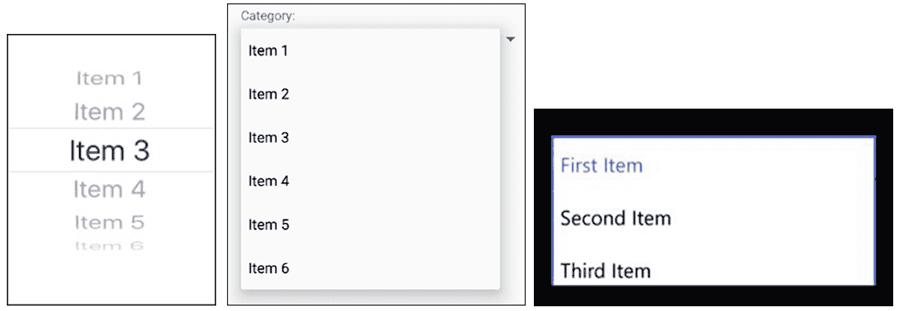

iOS、Android 和 Windows Phone 上的下拉控件

除了旋转器控件外，简单的菜单对话框也可以用于用户的输入。Windows Runtime 为不同的选择用例提供了额外的专用控件，即`ComboBox`和`ListView`。

### 选项选择

与 HTML 表单中的单选按钮或复选框类似，每个平台都提供了相关的 UI 元素选项。在 Android 上，针对此场景的专用控件有复选框、单选按钮和切换按钮。从 Android 4.0（API 14）开始，也可以使用开关控制。除了这些控件之间的视觉差异外，行为是相同的。在 iOS 上，布尔数据类型的主要切换控件是开关。类似于 Android，Windows Phone 提供复选框、单选按钮和切换开关控件，以及选项选择和布尔类型。

### 注意

每个平台都有许多其他控件，每个控件都为不同的 UI 交互场景提供了特定的用途。Windows Runtime 和 Material Design 的用户体验指南是相应平台上的优秀资源。尽管苹果的人机界面设计文档没有像其他平台那样提供广泛的用户体验指南，但它们仍然是了解用户控件用例的宝贵资源。

## 手势

当为 Xamarin 目标平台开发时，你应该始终记住，将要运行应用程序的设备很可能具有触摸屏。

触摸屏设备除了经典的指针式手势（例如，点击、双击、滚动等）外，还提供了各种交互手势，这些手势有助于开发者创建能够以更自然方式与用户交互的界面。

| 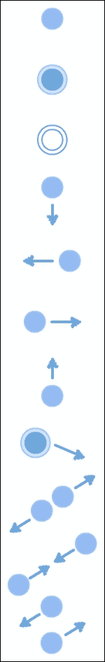 | 点击 | 在大多数场景中，点击手势与指针设备的单次点击类似。它主要用于选择控件。 |
| --- | --- | --- |
| 长按 | 长按或点击并保持用于在 Windows Phone 上访问上下文菜单。在 Android 上，它用于项目选择。 |
| 双击 | 双击通常用于放大/缩小控件。 |
| 向下滑动 | 向下滑动或平移向下用于垂直滚动场景。此外，列表控件在 Windows 上支持滑动向下进行选择。它也常与“下拉刷新”实现一起使用。 |
| 向右滑动 | 与向下滑动类似，向右滑动用于垂直滚动场景和同级导航场景。如果手势快速，则称为“轻扫”。 |
| 向左滑动 | 这与其他平移手势相同。它也可以用于在 iOS 和 Windows Phone 10 上删除列表项。 |
| 向上滑动 | 这是一种另一种平移手势。它还可以用于在 Android 应用程序上显示底部面板。 |
| 点击与拖动 | 这通常用作与可拖动组件交互的主动手势。 |
| 向外捏合 | 这用于活动画布应用模式。它用于放大视图。在 Windows 上，语义缩放控件就利用了这一点。 |
| 向内捏合 | 这与向外捏合手势类似，用于缩小应用程序屏幕活动内容区域（例如，放大照片）。 |
| 旋转 | 这是另一种在活动画布应用程序（例如，地图客户端）上使用的手势。它用于旋转当前视口。 |

> *常见手势*

虽然这些手势中的一些已经在 Xamarin 平台上的内置控件中实现，但可能存在需要使用它们来在应用程序中创建新的交互用例的场景。对于这类需求，可以在相应的框架中找到专门的实现。

在 iOS 平台上，手势识别器实现的起点是抽象类`UIGestureRecognizer`。`UIKit`中有许多手势识别器的实现，它们可以与代理实现结合使用。

在 Android 上，可以使用`GestureDetector`类和`IOnGestureListener`接口来提供各种手势事件和用户动作的实现。经典的交互事件，如平移手势和点击动作，可以通过任何`Activity`实现的`OnTouchEvent`方法访问。

在 Windows Phone 平台上，大多数默认控件都提供了与指针或触摸事件进行交互的功能，用于经典操作场景。然而，对于更复杂的手势，可以使用`Windows.UI.Input`命名空间中可用的`GestureRecognizer`类。

# 摘要

本章概述了 Xamarin 目标平台的设计理念以及设计模式。设计元素部分概述了设计师和开发者可用的主要控件和布局，同时提供了各种内容显示策略。还有关于交互式和现代用户界面设计的附加部分。

尽管每个平台都提供了自己的 UI 设计模式和指南，但在跨平台应用程序的设计工作中，主要目标是找到一个在本地外观和感觉与应用程序品牌设计之间的最佳折衷方案。

在下一章中，我们将讨论 Xamarin.Forms 框架，并利用这里概述的设计元素之间的相关性。
