# 第八章. Xamarin.Forms

Xamarin.Forms 是 Xamarin 编译器技术的扩展模块；在目标平台原生 UI 组件之上的抽象层。本章将重点介绍 Xamarin.Forms 的各种功能和扩展选项，这些功能和选项帮助开发者创建可以编译成 Xamarin 项目的跨平台应用程序用户界面，从而提高代码共享的质量标准，并使跨平台应用程序开发项目更加易于管理和统一。本章分为以下几部分：

+   内部机制

+   组件

+   扩展表单

+   模式和最佳实践

# 内部机制

如前所述，Xamarin 作为一个跨平台开发框架，为开发者提供了创建依赖于并使用相同代码库的应用程序的工具集。在这些类型的实现中，共享的代码量与可管理性成正比。

在 Android 和 iOS 平台上，Xamarin.Forms 在 Mono 运行时之上和预编译.NET 堆栈之上添加了一个抽象层。这个抽象层的唯一责任是向 Xamarin 编译器提供必要的指令，以标准化 GUI 元素的代码或标记，以便在 Xamarin 应用程序中渲染原生控件。由于 Xamarin 的平台语言是 C#，**可扩展应用程序标记语言**（**XAML**）是首选的设计标记语言。Xamarin.Forms 为 Windows Store 应用程序提供了相同的抽象作为运行时库。

Xamarin.Forms 提供的抽象层利用了之前章节中（见第七章，*视图元素*）所展示的类似 UI 元素和布局模式。在这种情况下，Xamarin.Forms 只为所有三个平台提供通用的控件和视图，并省略了特定平台的 UI 元素。重要的是要理解，Xamarin.Forms 不是原生用户界面实现的替代品，而更多是在创建跨平台应用程序时构建的基础。

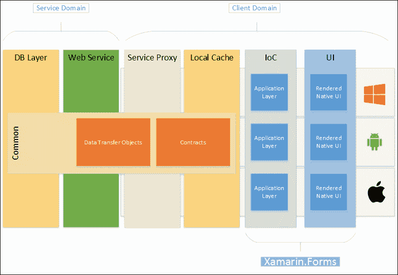

图 1：Xamarin.Forms 抽象层

Xamarin.Forms 不仅提供了一个统一的本地 UI 开发框架，还提供了与松散耦合 UI 开发相关的一些附加功能，例如数据绑定、依赖注入和信使基础设施。在某种程度上，这些功能使得在各个移动应用程序项目中使用的第三方 MVVM 库变得过时。

## Xamarin.Forms 结构

Xamarin.Forms 库通过 NuGet 包进行分发，可以自由地包含在跨平台开发项目中。

虽然 iOS 的 NuGet 包没有显示任何依赖项，但 Android 和 Windows Phone 版本依赖于几个支持库（即 Windows Phone 的 WPToolKit；以及 Android 的几个设计和兼容性包）。

Xamarin.Forms.Core 库包含 UI 元素和必要的 XAML 声明，以及与数据绑定和类似操作相关的附加功能。此程序集可以包含在提供视图实现的平台特定项目中可移植类库项目中。作为回报，原生客户端项目应引用 Xamarin.Forms.Core 和 Xamarin.Forms 的平台特定程序集（例如，Xamarin.Forms.Platform.iOS）。Xamarin.Forms 平台库包含所谓的渲染器实现，负责使用原生控件渲染 Xamarin.Forms 元素。换句话说，这些平台程序集提供了原生元素与其 Xamarin.Forms 对应元素之间的映射。

## 项目结构

为了创建一个针对 iOS、Android 和/或 Windows Phone 8 的 Xamarin.Forms 应用程序项目，可以使用 **跨平台** 部分中的任何一个项目模板。虽然可移植库项目模板使用 PCL 创建 Xamarin.Forms 应用程序样板，但共享项目模板创建了一个共享项目，其中文件引用链接到原生客户端应用程序项目。

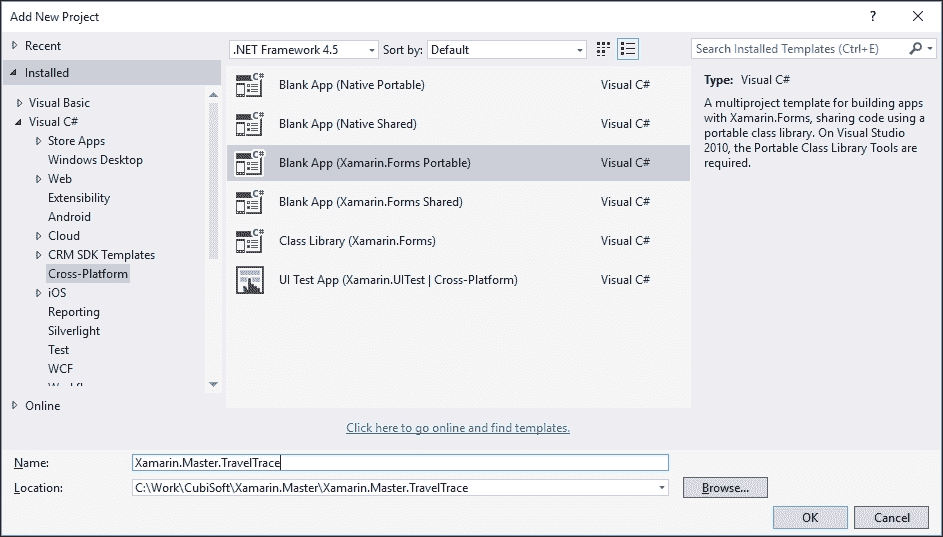

图 2：Xamarin.Forms 项目模板

### 小贴士

在较旧版本的 Xamarin 中，项目模板可以在 **移动应用** 部分找到。

一旦项目初始化，通过选择 **Blank App (Xamarin.Forms Portable**) 项目模板，创建的解决方案将包括四个项目，一个项目与输入的项目名称相同，另外三个具有平台后缀的平台特定项目。

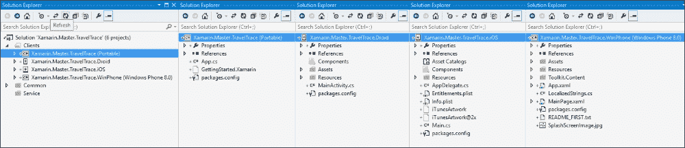

图 3：Xamarin.Forms 解决方案主视图和项目范围

使用此项目模板的 Xamarin.Forms 的一项注意事项是，实际上由该框架支持的其他平台（例如，Windows Phone 8.1 和 Windows 10）并未包含在此多项目模板中。这些项目可以手动创建，并且可以使用 NuGet 包管理器添加 Xamarin.Forms 的 NuGet 包。还重要的是要提到，项目模板中引用的 NuGet 包可能不是 Xamarin.Forms 的最新版本，因此可以使用 NuGet 包管理器进行更新。

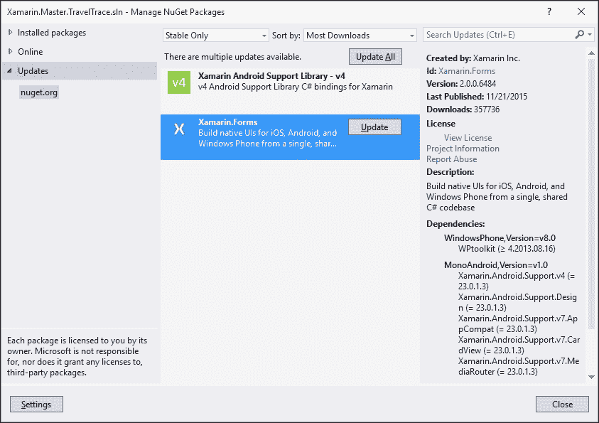

图 4：Xamarin.Forms 的最新 NuGet 包

如果查看可移植库中生成的代码 `App.cs` 和平台特定项目，实现模式立即变得明显。

Xamarin.Forms 的实现包含作为根节点的应用程序类实现。此应用程序由平台特定项目中生成的代码初始化和调用（类似于以下从 Xamarin.Forms iOS 应用程序示例中摘录的代码）：

```cs
[Register("AppDelegate")]
public partial class AppDelegate : global::Xamarin.Forms.Platform.iOS.FormsApplicationDelegate
{
    public override bool FinishedLaunching(UIApplication app, NSDictionary options)
    {
        global::Xamarin.Forms.Forms.Init();
        LoadApplication(new App());

        return base.FinishedLaunching(app, options);
    }
}
```

模板样板中的应用程序初始化代码创建了一个包含单个标签的`StackLayout`元素的页面，并将此视图指定为主要页面：

```cs
public App()
{
    // The root page of your application
    MainPage = new ContentPage
    {
        Content = new StackLayout
        {
            VerticalOptions = LayoutOptions.Center,
            Children = {
                new Label {
                    XAlign = TextAlignment.Center,
                    Text = "Welcome to Xamarin Forms!"
                }
            }
        }
    };
}
```

如您所见，Xamarin.Forms 应用程序结构由不同布局配置中的控件组成，这些配置通过各种页面类型呈现。

# 组件

根据它们在视图层次结构中的位置和它们的用途，Xamarin.Forms 组件可以分为三个主要组。

## 页面

从概念上讲，页面是导航元素。它们提供了视图元素的通用层次组织，同时充当布局的容器。有各种可以继承和实现或使用 XAML 标记设计的页面类型。

### 标签页

在上一章讨论顶级导航页面时，我们提到了几个可以在顶级页面中提供水平导航的控件。使用 Xamarin.Forms，`TabbedPage`允许开发人员创建这些水平导航视图元素。`TabbedPage`在 Android 上生成标签操作栏和相关活动。在 Windows Phone 上，生成的视图包含枢轴控件。最后，在 iOS 上，生成的视图包含标签栏和相关视图。

`TabbedPage`包含其子导航页面（即，`Children`属性接受不同的页面实现），并且子元素的页面标题用作导航链接。

将上一章中的标签视图示例实现到我们的 TravelTrace 应用程序中看起来会类似于以下片段：

```cs
var tabbedPage = new TabbedPage();

tabbedPage.Children.Add(new ContentPage
{
    Title = "Recent",
    Content = new StackLayout
    {
        VerticalOptions = LayoutOptions.Center,
        Children = {
            new Label {
                HorizontalTextAlignment = TextAlignment.Center,
                Text = "Recent uploads page"
            }
        }
    }
});

// ...
// TODO: Add the other tab nav items

MainPage = tabbedPage;
```

同样的实现可以使用 XAML 和创建`TabbedPage`实现来完成：

```cs
<TabbedPage 

  x:Class="Xamarin.Master.TravelTrace.Views.MainTabView">
  <ContentPage Title="Recent" Icon="social.png">
    <StackLayout VerticalOptions="Center">
      <Label Text="Recent uploads page" HorizontalTextAlignment="Center"></Label>
    </StackLayout>
  </ContentPage>
  <ContentPage Title="Local" Icon="map.png">
    <StackLayout VerticalOptions="Center">
      <Label Text="Local landmarks page" HorizontalTextAlignment="Center"></Label>
    </StackLayout>
  </ContentPage>
  <ContentPage Title="Friends" Icon="people.png">
    <StackLayout VerticalOptions="Center">
      <Label Text="Friends related page" HorizontalTextAlignment="Center"></Label>
    </StackLayout>
  </ContentPage>
</TabbedPage>
```

将新创建的`MainTabView`类实例分配给`App.cs`中的`MainPage`会导致与代码实现相同的视图。

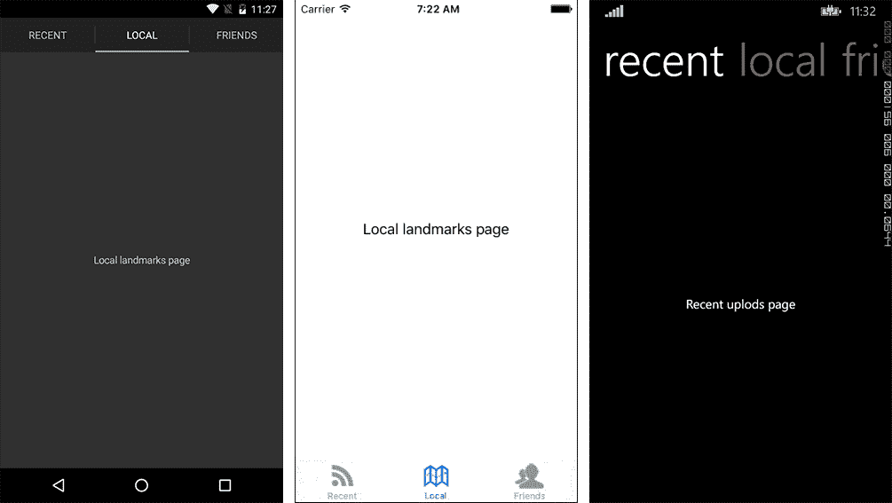

图 5：TabbedPage 视图

在这里提到这一点很重要，为`TabbedPage`实现中单个对等项提供的`Icon`属性仅适用于 iOS 平台。Xamarin 不支持标签和枢轴视图中的图标，并且这不是 Android 和 Windows Phone 接受的设计方法。

### 主详细页面

具有标签视图的示例满足我们设计的水平导航要求，但我们也需要为我们的 Android 应用程序提供一个导航抽屉和相关的菜单导航项。

`MasterDetailPage`提供了一个结构，其中主页面选择菜单可以在详细页面中发起导航请求。此外，如果`Detail`页面的内容封装在`NavigationPage`中，生成的视图将被添加到导航堆栈中，这样以前显示的页面就可以通过事件方法轻松地拉入主视图。为了包含一个额外的导航层和全局菜单，我们现在可以使用`MasterDetailPage`类来创建所需的导航结构。

实现的第一步是创建我们的主视图。在这种情况下，主视图将包括一个简单的列表视图，其中包含菜单和一个作为列表标题的配置文件显示。当列表视图内容项被选中时，我们可以将事件冒泡到 `MasterDetailPage`，或者将父页面作为参数传递给我们正在实现的菜单页面。

```cs
public NavigationMenuView(Page root)
{
    Icon = "toggle.png";

    InitializeComponent();

    ListViewMenu.ItemsSource = m_MenuItems = new List<Tuple<string, string, string>
    {
        new Tuple<string, string, string>("Profile", "profile", "profileicon.png"),
        new Tuple<string, string, string>("Map", "map", "mapicon.png"),
        new Tuple<string, string, string>("Settings", "settings", "settingsicon.png")
    };

    ListViewMenu.SelectedItem = m_MenuItems[0];

    ListViewMenu.ItemSelected += async (sender, e) => 
    {
        if(ListViewMenu.SelectedItem == null)
            return;

        // TODO: Implement the navigation strategy 
        Debug.WriteLine("Item selected {0}", 
          ((Tuple<string, string, string>)e.SelectedItem).Item2);
    };
}
```

在这个实现中，我们使用一个包含标签、标记和菜单项图标的三个参数的 `Tuple`。当然，实现一个包含这些数据值的类会更好。

现在我们可以通过设置 `Master` 和 `Detail` 属性来构建我们的 `MasterDetailPage`：

```cs
var masterDetailPage = new MasterDetailPage();

// Can select any of the behaviors: 
// Default, Popover, Split, SplitOnLandscape, SplitOnPortrait
masterDetailPage.MasterBehavior = MasterBehavior.Popover;
masterDetailPage.Master = new NavigationMenuView(masterDetailPage);
masterDetailPage.Detail = new NavigationPage(new ContentPage
{
    Title = "Detail Page",
    Content = new StackLayout
    {
        VerticalOptions = LayoutOptions.Center,
        Children = {
            new Label {
                HorizontalTextAlignment = TextAlignment.Center,
                Text = "Here is the Detail"
            }
        }
    }
});

MainPage = masterDetailPage;
```

`MasterBehavior` 可以根据平台进行调整。在这个例子中，我们将使用弹出行为，该行为在 Android 上显示一个弹出窗口和一个切换按钮在主应用栏中，并在其他平台上创建一个导航命令图标以打开弹出窗口。

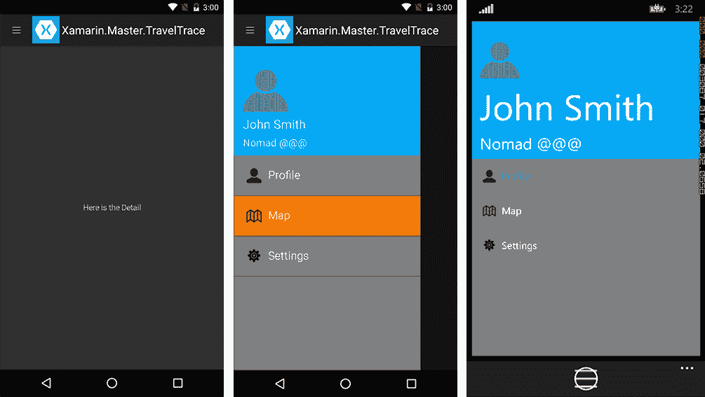

图 6：Android 和 Windows Phone 上的导航弹出窗口

当使用 `MasterDetailPage` 时，重要的是要预测在 Xamarin.Forms 标记中做出的设计决策的结果，以确保针对目标平台的最终应用程序仍然遵循设计指南。

### NavigationPage

`NavigationPage` 是 `Page` 类的最抽象实现。使用 `NavigationPage` 的主要目的是在应用程序上下文中创建一个导航堆栈。这种导航上下文在 Windows Phone 上是原生支持的。然而，其他平台不会为之前查看的页面创建堆栈。使用 `NavigationPage`，可以利用导航历史记录中的项目，并使用推送和弹出方法来操作堆栈。

### CarouselPage

`CarouselPage` 是另一种用户可以使用滑动或轻扫手势在同级页面之间导航的水平导航实现。`CarouselPage` 与 Windows Phone 7 平台上的全景视图和枢轴控件非常相似，除了 `CarouselPage` 有严格的快照点（即，当自由滚动视图快照到控件或页面的边缘时）并且它没有无限循环的项目，与枢轴控件相比，而是有更线性的导航。在行为上，它类似于并使用与 Windows Runtime 中的 `FlipView` 控件相似的导航策略。

为了启动一个轮播式导航结构，可以使用 XAML 或代码隐藏。一个简单的包含三个内容页面实现的轮播视图如下所示：

```cs
<CarouselPage 

  x:Class="Xamarin.Master.TravelTrace.Views.GuidesView">
  <ContentPage Title="First Peer">
    <StackLayout  HeightRequest="50" VerticalOptions="Center" BackgroundColor="Silver">
      <Label Text="Content for the First Peer" HorizontalTextAlignment="Center"></Label>
    </StackLayout>
  </ContentPage>
  <ContentPage Title="Second Per">
    <StackLayout HeightRequest="50" VerticalOptions="Center" BackgroundColor="Gray">
      <Label Text="Content for the Second Peer" HorizontalTextAlignment="Center"></Label>
    </StackLayout>
  </ContentPage>
  <ContentPage Title="Third Peer">
    <StackLayout HeightRequest="50" VerticalOptions="Center" BackgroundColor="Silver">
      <Label Text="Content for the Third Peer" HorizontalTextAlignment="Center"></Label>
    </StackLayout>
  </ContentPage>
</CarouselPage>
```

结果视图将是一个容器，用于在同级之间通过触摸启动的水平导航。

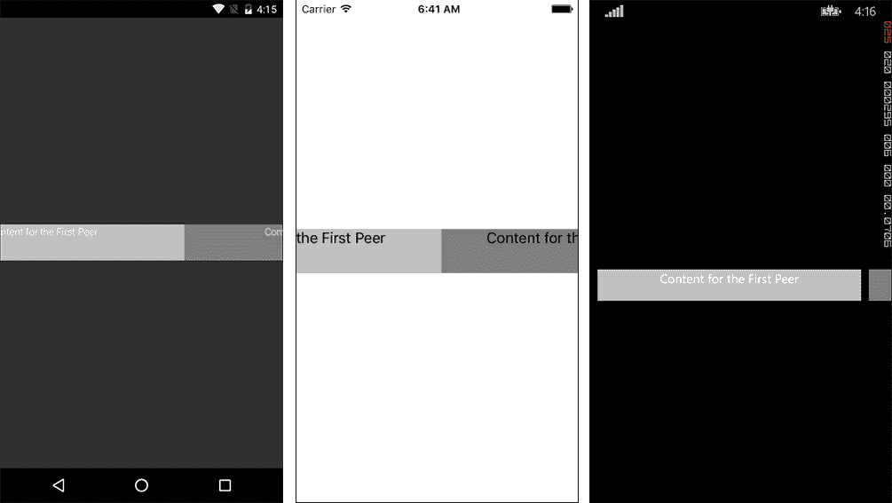

图 7：轮播视图

### ContentPage

`ContentPage` 是一种简单的页面实现，通常与之前描述的页面结构一起使用。它可以描述为实际的内容呈现器。在其他导航实现中的子视图通常由 `ContentPage` 实现。

为了设置用户界面中要可视化的内容，您可以使用`Content`属性，该属性接受一个视图对象的列表。布局元素通常用作`ContentPage`和其他用户控制的直接子元素，其他用户控制附加到这个视觉树中。

## 布局

布局是结构化设计元素，允许开发者使用各种策略组织 UI 控件。我们可以根据它们的类继承层次结构将布局分为两组：单视图和多视图。

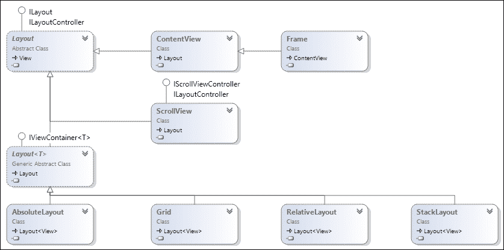

图 8：布局类

单视图布局是基本布局实现的直接后代，并且它们只能显示单个视图项（它们也可以是视觉树的一个分支）。这个类别的例子包括`ContentView`、`Frame`和`ScrollView`。`ContentView`和`Frame`元素很少使用，在处理较少的内容元素和/或具有活动屏幕模式的应用程序（例如，绘图应用程序会使用一个带有绝对定位的单个画布实现；绘制的几何项将是画布的子项）时可能很有帮助。

另一方面，`ScrollView`是最受欢迎的控件之一，可以与另一个布局元素（如`StackLayout`）一起使用。当与`StackLayout`一起使用时，如果`StackLayout`的计算高度大于客户端区域，父控件`ScrollView`使子控件能够改变视口。尽管这并不常见，但`ScrollView`仍然可以与简单的控件（如`Label`或`Image`）一起使用。

例如，如果我们要在上一节创建的`TabbedPage`中实现主要内容，我们可以使用`ScrollView`来显示显示从 TravelTrace 服务器最近上传的项目。这个实现的标记将类似于以下片段：

```cs
  <ScrollView>
    <StackLayout x:Name="StackLayout">
      <Grid Padding="10" ColumnSpacing="4">…</Grid>
      <Grid Padding="10" ColumnSpacing="4">…</Grid>
      <!-- Omitted for clarity -->
    </StackLayout>
  </ScrollView>
```

它几乎会像滚动`ListView`一样显示：

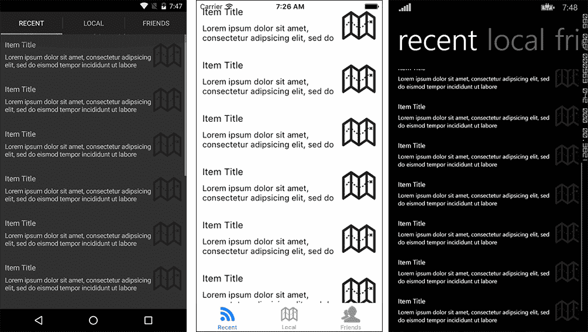

图 9：ScrollView 可视化

### 注意

在正常情况下，处理大量数据项的长列表时，`ListView`应该是要使用的主要控件。此实现仅用于演示目的。

多页面布局类别包括`AbsoluteLayout`、`Grid`、`RelativeLayout`以及，如前例所示，`StackLayout`。每个布局都用于满足各种设计相关要求的具体场景。

`Grid`类似于 Windows Presentation Foundation 中的`Grid`，用于在网格结构中组织子元素。创建网格的第一步是定义`ColumnDefinitions`和`RowDefinitions`，它们描述了将要用于渲染元素的单元格。在此步骤之后，可以使用`Grid`的附加属性（如`Grid.Row`、`Grid.Column`、`Grid.RowSpan`和`Grid.ColumnSpan`）将视图元素添加到网格中。

使用前一个实现中的示例单元格，我们可以有一个经典的单元格视图，其中有两行文本和位于单元格最右侧部分的图像：

```cs
<Grid Padding="10" ColumnSpacing="4">
  <Grid.RowDefinitions>
    <RowDefinition Height="Auto" />
    <RowDefinition Height="40" />
  </Grid.RowDefinitions>
  <Grid.ColumnDefinitions>
    <ColumnDefinition Width="*" />
    <ColumnDefinition Width="60" />
  </Grid.ColumnDefinitions>
  <Image Grid.RowSpan="2" Grid.Column="1" Source="mapicon.png" HeightRequest="40" WidthRequest="40"/>
  <Label Grid.Row="0" Grid.Column="0" Text="Item Title" FontSize="16"/>
  <Label Grid.Row="1" Grid.Column="0" Text="{Binding LongTextPlaceholder}" FontSize="14" />
</Grid>
```

`AbsoluteLayout`提供了一种渲染机制，其中子元素以浮动矩形的形式组织。放置几何形状（即`LayoutBounds`属性）定义了元素的 X 和 Y 坐标以及边界矩形的尺寸。`LayoutBounds`属性可以接受设备单位或比例单位。用于比例单位的观念类似于 HTML 布局中使用的"%"系统。这些值必须在 0-1 的范围内，以指定屏幕区域上的元素。`AbsoluteLayoutFlags`枚举可以用来定义遵循比例单位系统或其他方式（例如，`PositionProportional`、`HeightProportional`、`SizeProportional`或`All`）的边界矩形值。

`RelativeLayout`在概念上类似于 Android 和 Windows 10 平台上的相对布局。它也使用与 iOS 自动布局实现类似的约束机制。在相对布局中，元素可以定位在一个类似于绝对布局的边界矩形内。然而，这个边界矩形的值是以父元素（`RelativeToParent`）或视觉树中的另一个控件（`RelativeToView`）为参考定义的。开发者还被允许使用常数而不参考另一个控件。

在相对布局中，如果布局是在代码背后创建的，则使用 lambda 表达式或匿名函数定义约束。例如，为了将一个图像元素添加到页面中心，大小为（100,100），我们会使用`RelativeToParent`约束：

```cs
relativeLayout.Children.Add(image,
    Constraint.RelativeToParent(parent => parent.Width/2 - 50),
    Constraint.RelativeToParent(parent => parent.Height/2 - 50),
    Constraint.Constant(100), Constraint.Constant(100));
```

如果我们在图片下方 10 个单位处插入一个标签，它看起来将如下所示：

```cs
relativeLayout.Children.Add(label,
    Constraint.RelativeToParent(parent => parent.Width/2 - 100),
    Constraint.RelativeToView(image, (parent, view) =>
    {
        // Here view is referring to the other relative control
        return view.Y + view.Height + 10;
    }),
    Constraint.Constant(200),
    Constraint.Constant(100));
```

结果将如下所示：

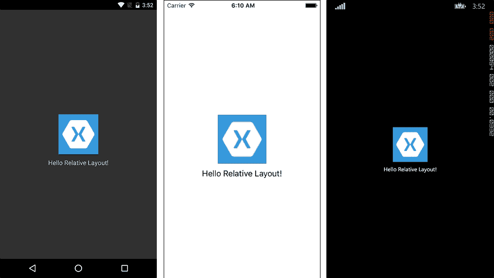

图 10：相对布局

可以使用 XAML 中的标记扩展进行类似的实现。尽管约束表达式选项受因子和常数值的限制（即使用相对布局，因子乘以所选属性的值，常量用于偏移值），但在数据绑定场景中它可能非常有用。

```cs
<RelativeLayout x:Name="relativeLayout">
  <Image x:Name="Image" Source="icon.png" HeightRequest="100" WidthRequest="100"
          RelativeLayout.XConstraint=
          "{ConstraintExpression Type=RelativeToParent, 
                                  Property=Width, 
                                  Factor=0.5, 
                                  Constant=-50}"
          RelativeLayout.YConstraint=
          "{ConstraintExpression Type=RelativeToParent, 
                                  Property=Height, 
                                  Factor=0.5, 
                                  Constant=-50}" />
  <Label Text="Hello Relative Layout!" HeightRequest="100" WidthRequest="200" HorizontalTextAlignment="Center"
          RelativeLayout.XConstraint=
          "{ConstraintExpression Type=RelativeToParent, 
                                  Property=Width, 
                                  Factor=0.5, 
                                  Constant=-100}"
          RelativeLayout.YConstraint=
          "{ConstraintExpression Type=RelativeToView,
                                  ElementName=Image,
                                  Property=Y, 
                                  Constant=110}"/>
</RelativeLayout>
```

最后，`StackLayout`与 Windows 平台上的`StackPanel`和 Android 平台上的`LinearLayout`类似，提供了一种流式布局，其中子视图（即控件）会根据设置的朝向和元素的计算或请求的尺寸自动排列。

## 视图

在 Xamarin.Forms 中，用户界面控件被称为视图。视图是 Xamarin 目标平台上的控件或小部件的抽象，每个视图都在相应的平台上使用本地控件进行渲染。

对于文本相关场景，有三个控件：`Editor`、`Entry` 和 `Label`。`Editor` 和 `Entry` 视图分别向用户界面提供多行和单行编辑功能。另一方面，标签视图可以用作只读控件，适用于任何场景。

对于下拉相关场景，可以使用 `Picker` 视图。更专业的拾取器实现包括 `TimePicker` 和 `DatePicker`。`Stepper` 和 `Slider` 是其他可以提供约束值的视图，例如一定范围内的整数。对于选项场景，唯一可用的控件是 `Switch` 视图。`Switch` 视图在 Android 和 iOS 上渲染为 `Switch` 控件，在 Windows 上渲染为 `ToggleButton`。

对于进程反馈实现，有两个视图可供选择，即 `ProgressBar` 和 `ActivityIndicator`。`ProgressBar` 提供一个确定性的进度指示器，而 `ActivityIndicator` 在目标平台上渲染为一个不确定性的进度环。

对于与网络资源相关的场景，可以使用 `WebView`。与目标平台上的嵌入式网页原生控件类似，`WebView` 可以用来显示本地（即，由应用程序资源或文本值构建的网页元素）或远程网页。它提供了对显示的网页文档的导航堆栈和导航事件的访问。

对于集合视图，Xamarin.Forms 中有两个主要控件：`ListView` 和 `TableView`。`ListView` 无疑是最专业的控件，用于显示内容项的集合。它支持数据绑定场景以及更专业的操作，如下拉刷新、上下文相关命令和选择。另一方面，`TableView` 用于内容项更异质化的场景，而不是数据绑定源，需要固定 UI 元素声明。它可以用于选择菜单显示、配置值或作为输入表单。

`ListView` 和 `TableView` 都由单元格组成。单元格是用于在这些集合视图中渲染内容元素的视觉模板。虽然 `TableView` 通常与默认模板（如 `SwitchCell` 和 `EntryCell`）相关联，这些模板用于在表格中创建表单元素，但 `ListView` 通常使用 `ViewCell` 的模板实现。对于更简单的实现场景，也可以使用内置的单元格实现，如 `TextCell` 和 `ImageCell`，与 `ListView` 控件一起使用。

### 小贴士

对于 `TableView` 集合控件，iOS 平台目前不支持 `HasUnevenRows` 属性和单元格的自动布局。这是一个已知的平台限制，最近已针对 `ListView` 控件进行了修复。开发者可以选择为 `TableView` 定义一个固定的 `RowHeight`，或者为每个单元格定义一个 `Height` 值。

为了演示`ListView`的使用，我们可以利用之前的实现，其中我们使用了`StackLayout`和`ScrollView`。在前一个场景中，我们创建了硬编码的 UI 元素，这些元素被定义为`Grid`项。在这个实现中，让我们假设我们有一个可以设置为`ListView`数据提供者的数据源：

```cs
RecentUploadsList.ItemsSource = new List<Tuple<string, string, string>>
{
    new Tuple<string, string, string>("Sarajevo trip on 04.10", longText, "profileicon.png"),
    new Tuple<string, string, string>("Istanbul trip on 23.09", longText, "mapicon.png"),
    new Tuple<string, string, string>("Rome trip on 12.09", longText, "settingsicon.png"),
    new Tuple<string, string, string>("Sarajevo trip on 04.10", longText, "profileicon.png"),
    new Tuple<string, string, string>("Istanbul trip on 23.09", longText, "mapicon.png"),
    new Tuple<string, string, string>("Rome trip on 12.09", longText, "settingsicon.png"),
    new Tuple<string, string, string>("Sarajevo trip on 04.10", longText, "profileicon.png"),
    new Tuple<string, string, string>("Istanbul trip on 23.09", longText, "mapicon.png"),
    new Tuple<string, string, string>("Rome trip on 12.09", longText, "settingsicon.png")
};
```

在此提供者中，我们使用一个包含三个值的`Tuple`，为内容条目提供显示名称、描述和图像值。

### 注意

`Tuple`值通过 Item1、Item2…属性进行访问。

`ListView`可以包含三个视觉模板，分别定义集合视图的相应部分：`HeaderTemplate`、`FooterTemplate`和`ItemTemplate`。也可以直接使用视图元素来设置标题和页脚：

```cs
<ListView BackgroundColor="Gray" SeparatorColor="Black" HasUnevenRows="true" x:Name="RecentUploadsList" >
  <ListView.Header>
    <Label TranslationX="10" Text="Recent Uploads"></Label>
  </ListView.Header>
  <!--<ListView.ItemTemplate> TODO: Insert DataTemplate </ListView.ItemTemplate>-->
</ListView>
```

`ItemTemplate`定义了内容元素在集合视图中如何渲染。如果未定义`ItemTemplate`，列表渲染器将尝试将内容元素转换为字符串，并以`TextCells`的形式显示它们。从先前的示例中重用网格实现，我们可以为`ListView`的`ItemTemplate`属性定义`DataTemplate`：

```cs
<ListView.ItemTemplate>
  <DataTemplate>
    <ViewCell>
        <Grid Padding="10" ColumnSpacing="4">
          <Grid.RowDefinitions>
            <RowDefinition Height="Auto" />
            <RowDefinition Height="40" />
          </Grid.RowDefinitions>
          <Grid.ColumnDefinitions>
            <ColumnDefinition Width="*" />
            <ColumnDefinition Width="60" />
          </Grid.ColumnDefinitions>
          <Image Grid.RowSpan="2" Grid.Column="1" Source="{Binding Item3}" 
                  HeightRequest="40" WidthRequest="60"/>
          <Label Grid.Row="0" Grid.Column="0" 
                  Text="{Binding Item1}" FontSize="16" />
          <Label Grid.Row="1" Grid.Column="0" 
                  Text="{Binding Item2}" FontSize="14" />
        </Grid>
    </ViewCell>
  </DataTemplate>
</ListView.ItemTemplate>
```

此实现将在一个可滚动的列表容器中显示，类似于以下截图：

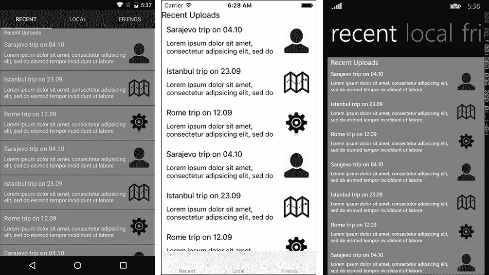

图 11：具有项目源的`ListView`

为了实现与上下文相关的功能，可以编辑项目数据模板、视图单元格，以包含上下文菜单元素。也可以在代码隐藏文件中修改视图单元格。

以下 XAML 代码片段可以用来创建两个上下文菜单操作：`Favourite`和`Remove`：

```cs
<ViewCell.ContextActions>
  <MenuItem Text="Favourite" Clicked="OnFavouriteClicked" CommandParameter="{Binding .}">
  </MenuItem>
  <MenuItem Text="Remove" IsDestructive="True" Clicked="OnRemoveClicked" CommandParameter="{Binding .}">
  </MenuItem>
</ViewCell.ContextActions>
```

注意，`Remove`命令被标记为破坏性操作。`IsDestructive`标志用于在 iOS 上创建滑动删除行为。在其他平台上，破坏性行为的表现与其他命令类似。

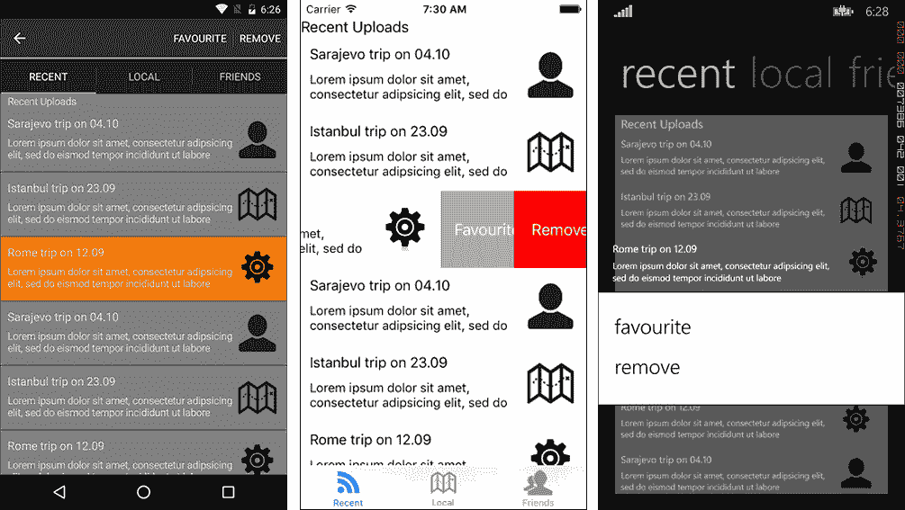

图 12：上下文菜单操作

`ListView`还有一个名为`IsPullToRefreshEnabled`的标志。此属性可用于支持下拉刷新行为。`RefreshCommand`可用于绑定刷新列表所需的操作。

# 扩展形式

尽管 Xamarin.Forms 框架提供了一套广泛的可自定义 UI 元素，但在某些场景中，您可能希望更改某些控件的外观或行为。此外，有时提供跨应用的自定义方案可以提供一致性并减少冗余。Xamarin.Forms 中使用的 XAML 标记基础设施提供了各种自定义实现场景。

## 样式

在实现某些 UI 模式时，视图元素必须相互独立声明，同时它们必须携带相同的设计属性，如字体、布局属性、颜色等。在这种情况下，可以使用样式来组织和重用元素属性。

使用 `ListView`，唯一定义的视图容器将是项目数据模板，从数据源加载的内容项将使用相同的模板进行渲染。然而，如果视图需求是使用 `Grid`、`StackLayout` 或 `TableView`，则每个视图项都必须单独定义。

例如，使用 `TableView` 控件为 Xamarin.Forms 应用程序创建设置视图可能会变得相当繁琐。在此实现中，如果我们不能使用标准单元格视图，如 `EntryCell` 或 `SwitchCell`，因为要求，由于要求，标记变得更加冗余，每个控件都必须声明类似的字体和颜色，这些字体和颜色构成了应用程序的主题。

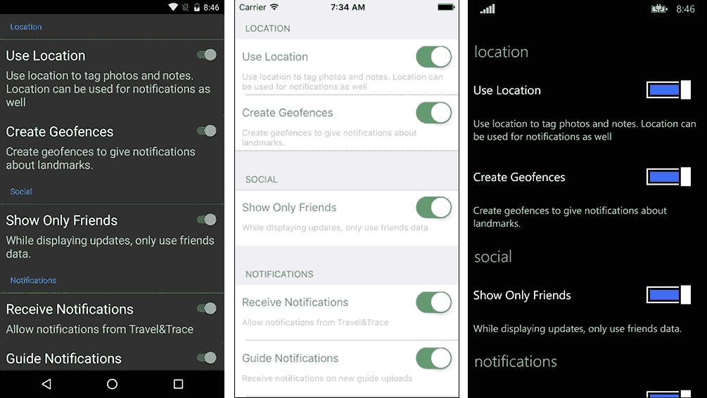

图 13：TableView 用于设置视图

在此实现中，自定义单元格视图被用来为每个设置创建描述元素。如果我们查看标记文件，我们可以看到每个文本元素的重复样式：

```cs
<TableView Intent="Settings" HasUnevenRows="True">
  <TableRoot>
    <TableSection Title="Location">
      <ViewCell>
        <StackLayout Orientation="Vertical" Padding="10">
          <StackLayout Orientation="Horizontal">
            <Label TextColor="White" FontSize="24"
                   VerticalTextAlignment="Center" 
                   HorizontalOptions="StartAndExpand" 
                   Text="Use Location" />
            <Switch IsToggled="True"></Switch>
          </StackLayout>
          <Label TextColor="Silver" FontSize="20"
                 VerticalTextAlignment="Center" 
                 HorizontalOptions="StartAndExpand"  
                 Text="Use location to tag photos and notes. Location can be used for notifications as well">
          </Label>
        </StackLayout>
      </ViewCell>
      <ViewCell>
        <StackLayout Orientation="Vertical" Padding="10">
          <StackLayout Orientation="Horizontal">
            <Label TextColor="White" FontSize="24"
                   VerticalTextAlignment="Center" 
                   HorizontalOptions="StartAndExpand" 
                   Text="Create Geofences" />
            <Switch IsToggled="True"></Switch>
          </StackLayout>
          <Label TextColor="Silver" FontSize="20"
                  VerticalTextAlignment="Center" 
                  HorizontalOptions="StartAndExpand" 
                  Text="Create geofences to give notifications about landmarks.">
          </Label>
        </StackLayout>
      </ViewCell>
    </TableSection>
    <!-- Additional sections were removed for simplicity -->
  </TableRoot>
</TableView>
```

在这个例子中，每个标签至少定义了 `TextColor`、`FontSize`、`VerticalTextAlignment` 和 `HorizontalOptions`。设置标签和描述元素有一个模式，然而，垂直和水平对齐选项适用于所有文本元素。

初始时，我们可以通过创建一个将应用于所有 `Label` 元素的隐式样式来简化标记。隐式样式不定义资源键，因此它们应用于所有目标控件，例如 `TargetType`：

```cs
<ContentPage.Resources>
  <ResourceDictionary>
    <Style TargetType="Label">
      <Setter Property="HorizontalOptions" Value="StartAndExpand" />
      <Setter Property="VerticalTextAlignment" Value="Center" />
    </Style>
  </ResourceDictionary>
</ContentPage.Resources>
```

我们现在可以创建额外的样式来设置项目标签和描述：

```cs
<Style x:Key="SettingLabel" TargetType="Label">
  <Setter Property="FontSize" Value="24"></Setter>
  <Setter Property="TextColor" Value="White"></Setter>
</Style>
<Style x:Key="SettingDescription" TargetType="Label">
  <Setter Property="FontSize" Value="20"></Setter>
  <Setter Property="TextColor" Value="Silver"></Setter>
</Style>
```

然而，这并没有像我们预期的那样工作。结果表明，隐式样式被更具体的样式描述覆盖了。重要的是要认识到，为同一目标控件定义的样式之间没有隐式级联。XAML 不是 HTML/CSS。

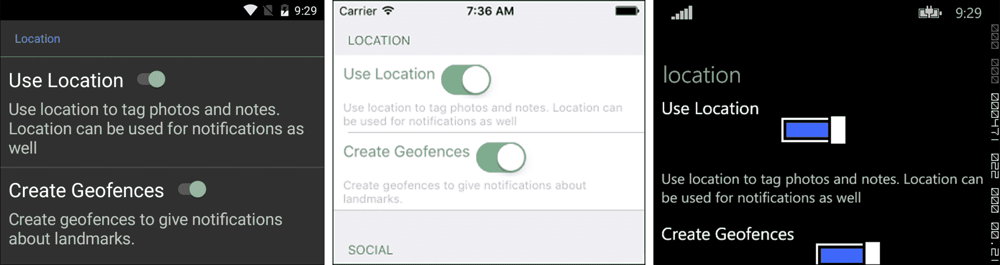

图 14：隐式样式被指定的样式覆盖

为了创建级联方案，我们需要将 `SettingLabel` 和 `SettingDescription` 样式基于初始隐式样式。为此，我们需要为我们的基本样式定义一个键，并在派生样式声明中引用此基本样式：

```cs
<ContentPage.Resources>
  <ResourceDictionary>
    <Style x:Key="BaseLabelStyle" TargetType="Label">
      <Setter Property="HorizontalOptions" Value="StartAndExpand" />
      <Setter Property="VerticalTextAlignment" Value="Center" />
    </Style>
 <Style x:Key="SettingLabel" BaseResourceKey="BaseLabelStyle" TargetType="Label">
      <Setter Property="FontSize" Value="24"></Setter>
      <Setter Property="TextColor" Value="White"></Setter>
    </Style>
 <Style x:Key="SettingDescription" BasedOn="{StaticResource BaseLabelStyle}" TargetType="Label">
      <Setter Property="FontSize" Value="20"></Setter>
      <Setter Property="TextColor" Value="Silver"></Setter>
    </Style>
  </ResourceDictionary>
</ContentPage.Resources>
```

注意，`SettingDescription` 样式使用 `BasedOn` 声明（类似于 WPF 实现），而 `SettingLabel` 使用 `BaseResourceKey` 属性。这两个引用都可以在 Xamarin.Forms 实现中使用。

## 触发器和行为

有时，实现需要根据相同或任何其他控件属性或数据的变化，以及某些事件（例如，根据数据输入值的变化禁用某个控件）来更改控件的风格或行为。在正常情况下，实现利用数据绑定，其中数据更改事件被路由到表示者，表示者更改视图，提供了一个简单的解决方案。然而，如果 UI 事件应该触发另一个 UI 更改，数据绑定的成本将是一个开销。相反，Xamarin.Forms 标记提供了触发器和行为，这些触发器和行为为内置控件增加了复杂性。

例如，我们为我们的应用程序之前创建的设置视图需要某些业务规则。第一个设置值，UserLocation，是 UseGeofences 设置的依赖项。换句话说，在技术上，不使用位置服务就无法创建地理围栏。对于这个特定场景，我们可以从`IsToggled`值创建一个数据绑定：

```cs
<Switch x:Name="SwitchUseGeofences" IsToggled="True"
              IsEnabled="{Binding Source={x:Reference SwitchUserLocation}, Path=IsToggled}">
```

前面的实现按预期工作，因为`IsToggled`和`IsEnabled`的值都使用`Boolean`作为值类型。如果我们需要更改目标 UI 元素的任何其他属性，我们就必须实现一个值转换器。此外，多个属性更改需要多个绑定。

触发器为这类场景提供了一个简单的解决方案。有四种类型的触发器可以用来启动设置器动作或自定义触发器动作的实现。属性触发器用于根据相同控件属性的值在用户控件上创建一个视觉状态。数据触发器以类似的方式使用，但在这个情况下，触发的原因由数据绑定定义。事件触发器绑定到用户控件事件，多触发器可以包含并调用依赖于多个条件的动作。

在这个情况下，可以从上一个示例中的相同场景使用`DataTrigger`来实现。在迭代场景时，实现可以设置关联描述标签的启用和文本颜色属性：

```cs
<ViewCell>
  <StackLayout Orientation="Vertical" Padding="10">
    <StackLayout Orientation="Horizontal">
      <Label Text="Create Geofences" Style="{StaticResource SettingLabel}" />
      <Switch x:Name="SwitchUseGeofences" IsToggled="True"
              IsEnabled="{Binding Source={x:Reference SwitchUserLocation}, Path=IsToggled}">
        <Switch.Triggers>
 <DataTrigger TargetType="Switch" Binding="{Binding Source={x:Reference SwitchUserLocation}, Path=IsToggled}" Value="True">
 <Setter Property="IsEnabled" Value="False"></Setter>
 </DataTrigger>
        </Switch.Triggers>
      </Switch>
    </StackLayout>
    <Label Text="Create geofences to give notifications about landmarks."
            Style="{StaticResource SettingDescription}">
      <Label.Triggers>
 <DataTrigger TargetType="Label" Binding="{Binding Source={x:Reference SwitchUserLocation}, Path=IsToggled}" Value="False">
 <Setter Property="IsEnabled" Value="False"></Setter>
 <Setter Property="TextColor" Value="Transparent"></Setter>
 </DataTrigger>
 </Label.Triggers>
    </Label>
  </StackLayout>
</ViewCell>
```

让我们再实现一个当主控件禁用时触发的通知，警告用户其他设置已被禁用。为此实现，我们需要一个事件触发器和触发器动作实现。触发器动作实现包括实现`TriggerAction<T>`类和虚拟的`Invoke`方法：（请参阅*依赖注入*部分以了解`INotificationService`的实现）

```cs
public class WarningTriggerAction : TriggerAction<Switch>
{
    public string Message { get; set; }
    protected override void Invoke(Switch sender)
    {
        if(!sender.IsToggled) 
            DependencyService.Get<INotificationService>()
                .Notify(Message);
    }
}
```

然后，我们需要在页面标记的根节点中声明包含实现的命名空间：

最后，我们可以在主设置控件上添加事件触发器：

```cs
<Switch x:Name="SwitchUserLocation" IsToggled="True">
  <Switch.Triggers>
    <EventTrigger Event="Toggled">
      <components:WarningTriggerAction Message="Disabling this setting will disable other values" />
    </EventTrigger>
  </Switch.Triggers>
</Switch>
```

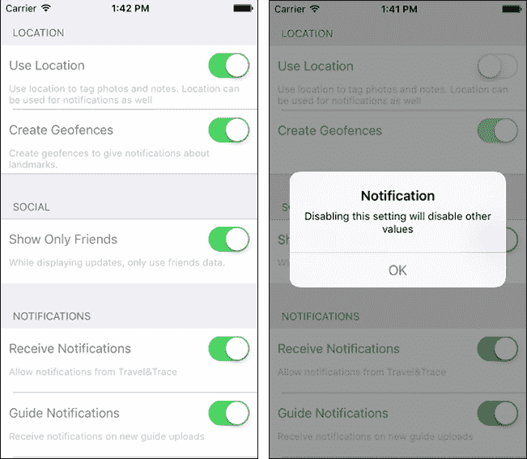

图 15：使用 EventTrigger 触发的通知

如果我们希望这个触发器应用于多个控件（例如，示例中的通知设置部分），我们可以为主要的设置值创建一个新的样式，并将触发器添加到样式声明中：

```cs
<Style x:Key="SectionToggleSwitch" TargetType="Switch">
  <Style.Triggers>
    <EventTrigger Event="Toggled">
      <components:WarningTriggerAction Message="Disabling this setting will disable other values" />
    </EventTrigger>
  </Style.Triggers>
</Style>
```

使用`Switch`控件的实现同样可以达到相同的结果。行为是一种更通用的扩展机制，允许开发者扩展现有的用户控件，而无需创建这些控件的派生类。

例如，如果我们使用相同的场景（即，当开关控制被切换关闭时，应向用户显示一个通知窗口），我们需要为`Switch`视图实现一个带有类型参数的基类`Behavior`：

```cs
public class SectionSwitchAlertBehavior : Behavior<Switch>
{
    public string Message { get; set; }

    protected override void OnAttachedTo(Switch control)
    {
        control.Toggled += ControlOnToggled;

        base.OnAttachedTo(control);
    }

    protected override void OnDetachingFrom(Switch control)
    {
        control.Toggled -= ControlOnToggled;

        base.OnDetachingFrom(control);
    }
    private void ControlOnToggled(object sender, ToggledEventArgs toggledEventArgs)
    {
        if (!toggledEventArgs.Value && !string.IsNullOrWhiteSpace(Message))
        {
            DependencyService.Get<INotificationService>().Notify(Message);
        }
    }
}
```

在自定义行为实现类中，`OnAttachedTo`方法用作初始化函数，其中可以自定义控件。同样，`OnDetachingFrom`用于清理自定义设置以及可能附加到控件上的任何现有事件处理器。尽管技术上可行，但使用行为修改绑定上下文并不建议。

自定义行为可以包含在针对同一类型控件的样式中，或者通过在特定控件中添加内联标记元素来实现：

```cs
<Style x:Key="SectionToggleSwitch" TargetType="Switch">
  <Style.Behaviors>
 <components:SectionSwitchAlertBehavior Message="Disabling this setting will disable other values" />
  </Style.Behaviors>
</Style>
```

## 自定义渲染器

Xamarin.Forms 为开发者提供了一个统一的标记和实现框架，用于创建所有 Xamarin 目标平台的本地 UI 视图。提供的 UI 元素的抽象被框架用来渲染本地控件。类似于 Xamarin.Forms 解决方案的解剖结构，Xamarin.Forms 平台中的每个视图/控件都是一个复合实现。虽然抽象的控制逻辑的行为可以在便携式类库中实现和派生，但与各个平台相关的控件渲染器是由特定平台库实现的。

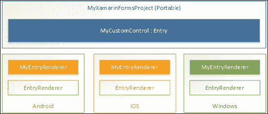

图 16：自定义渲染器实现

为了自定义一个控件，必须首先为抽象控件创建一个派生类。在此实现之后，自定义控件可以通过`clr-namespace`声明（类似于`TriggerAction`和`Behaviors`）进行引用，并在视图标记中使用。

在这个阶段，控件的自定义实现将使用基类的默认渲染器。为了改变特定平台上本地控件渲染的方式，我们需要提供一个自定义渲染器实现，并使用同一平台的`ExportRenderer`属性进行注册。

自定义渲染器提供了一种强大的方式，可以自定义 Xamarin.Forms 中常见视图实现如何在特定平台视图中呈现。

# 模式和最佳实践

在本节中，我们将讨论开发者在开发 Xamarin.Forms 应用程序时通常会采用的几种实现模式和工具。消息和依赖注入功能将在第九章*可重用 UI 模式*中进一步讨论。

## 消息基础设施

在**模型-视图-视图模型**（**MVVM**）或**模型-视图-演示者**（**MVP**）模式的理想实现中，每个屏幕都是自包含的；视图、模型和缓解组件的屏幕模块通过各种通信渠道相互通信。

然而，在复杂的应用程序中，有时需要在这些自包含元素之间建立通信渠道，因为某个屏幕上的操作结果应该传播到应用程序的其他无关部分，这些部分对这一操作的结果有共同兴趣。作为解决这个问题的一种方法，在 MVVM 框架如 MVVMCross、Prism 或 MVVM Light 中，通常可以看到事件聚合器模式的实现，提供了一种松散耦合、多播启用发布者/订阅者消息基础设施。事件聚合器可以描述为事件中心，它接收多种类型的强类型消息并将这些消息传递给多个订阅者。

在 Xamarin.Forms 中，事件聚合器被称为`MessagingCenter`。它公开了三组方法：`Subscribe`、`Unsubscribe`和`Send`。`Subscribe`和`Unsubscribe`方法由事件观察者使用，而`Send`方法由发布者使用。

在这个范例中，订阅者负责提供发送者的实例和/或类型以及预期的消息类型（即定义消息的简单文本参数）。消息类型或名称是消息的标识符，与消息签名（发送者类型和参数类型）一起，构成了订阅者的决策标准。最后，提供的最后一个参数是回调委托，它可以有发送者，以及可能的事件参数：

```cs
MessagingCenter.Subscribe<MyViewModel, MyMessageContract>(this, "MyMessageName",
    (sender, data) =>
    {
        // TODO: Use the provided data and the sender
    });

// or
//MessagingCenter.Subscribe(this, "MyMessageName", (sender) => { }, myViewModelInstance);
```

发布者负责提供具有相同消息名称和签名的消息。在发布者一侧，消息签名由消息名称和消息参数组成：

```cs
MessagingCenter.Send(this, "MyMessageName", new MyMessageContract
{
    // TODO: Pass on the required data.
});
```

MessagingCenter 可以证明是非常有用的，为 Xamarin.Forms 应用程序中的架构问题（特别是涉及关注点分离的场景）提供简单的解决方案/折衷方案，并在组件之间创建解耦的通信渠道。

## 依赖注入

如前所述，使用**可移植类库**（**PCLs**）实现通用跨平台库的最大缺点之一是平台特定功能无法直接访问，因为这些平台依赖的模块无法由这些库引用。

解决这个问题的最有效和优雅的解决方案之一是使用依赖注入（也称为 IoC - 控制反转）。使用依赖注入，特定平台的函数应该被抽象到隔离的接口中，这些接口可以后来用于访问通过提供的依赖容器注入的实现模块。

`DependencyService`在 Xamarin.Forms 中允许应用程序通过抽象接口使用特定平台的实现。

在一个常见的场景中，第一步是定义将要被通用应用程序层使用的抽象（在通用可移植表单库中）。

为了演示，让我们实现一个模块，该模块使用原生消息方法来显示用户的通知：

```cs
public interface INotificationService
{
    void Notify(string message);
}
```

现在我们可以在特定平台的项目中实现这个接口。在 Xamarin.Android 项目中，我们可以使用 toast 通知来实现：

```cs
[assembly:Xamarin.Forms.Dependency(typeof(NotificationService))]
namespace Xamarin.Master.TravelTrace.Droid.Modules
{
    public class NotificationService : INotificationService
    {
        public void Notify(string message)
        {
            var toast = Toast.MakeText(Application.Context, message, ToastLength.Long);
            toast.Show();
        }
    }
}
```

对于 iOS 平台，我们可以创建一个本地通知消息，并使用共享应用程序基础设施来展示它。然而，前台应用程序的本地通知会自动消失（只有 UI 级别还可以实现一个事件代理来处理接收到的通知事件并显示一个警告）。因此，我们将使用`UIAlertController`类，并通过当前窗口来展示：

```cs
[assembly: Xamarin.Forms.Dependency(typeof(NotificationService))]
namespace Xamarin.Master.TravelTrace.iOS.Modules
{
    public class NotificationService : INotificationService
    {
        public void Notify(string message)
        {
            //
            // This will not fire for the foreground application
            //UILocalNotification localNotification = new 
            // UILocalNotification();
            // localNotification.FireDate = 
            // NSDate.Now.AddSeconds(2);
            //localNotification.AlertBody = message;
            //localNotification.TimeZone = 
            // NSTimeZone.SystemTimeZone;
            // UIApplication.SharedApplication
            // .PresentLocalNotificationNow(localNotification);
            // UIApplication.SharedApplication
            // .ScheduleLocalNotification(localNotification);

            //Create Alert
            var okAlertController = UIAlertController.Create ("Notification", message, UIAlertControllerStyle.Alert);

            //Add Action
            okAlertController.AddAction(UIAlertAction.Create("OK", UIAlertActionStyle.Default, null));

            if (UIApplication.SharedApplication.KeyWindow != null)
                UIApplication.SharedApplication.KeyWindow.RootViewController.PresentViewController(okAlertController, true, null);
        }
    }
}
```

最后，对于 Windows Phone 平台，我们只能使用本地 toast 通知与 Windows Phone 8.1 和 Windows 10 移动设备上当前运行的应用程序。对于其他版本，类似于 iOS 场景，前台应用程序不允许使用本地 toast 通知。因此，我们可以使用`MessageBox`类实现一个更简单的通知对话框：

```cs
[assembly: Xamarin.Forms.Dependency(typeof(NotificationService))]
namespace Xamarin.Master.TravelTrace.WinPhone.Modules
{
    public class NotificationService : INotificationService
    {
        public void Notify(string message)
        {
            MessageBox.Show(message);
        }
    }
}
```

为了在实现 Xamarin.Forms 应用程序的可移植类库中使用`INotificationService`接口，我们需要解析接口以创建一个平台适当实现实例：

```cs
DependencyService.Get<INotificationService>().Notify("Hello Xamarin.Forms!");
```

重要的是要注意，在这个示例实现中，使用了`Dependency`程序集属性来注册平台相关的实现类。也可以使用`DependencyService`的`Register`方法来创建依赖容器：

```cs
Xamarin.Forms.DependencyService.Register<INotificationService, NotificationService>();
```

`Register`方法必须在 Xamarin.Forms 初始化（即`Forms.Init`方法）之后以及任何依赖模块加载之前调用。

## 共享项目与可移植项目

Xamarin.Forms 扩展引入了两种类型的跨项目解决方案模板。每个模板都包含特定平台的项目以及一个通用项目，用于实现这些原生应用程序的平台无关组件。

在之前的例子中，我们使用了 PCL 项目模板，该模板创建三个特定平台的项目，每个项目都引用一个跨平台的便携式类库。特定平台的项目将应用程序初始化委托给便携式类库，该类库初始化 Xamarin.Forms 并渲染使用 Xamarin.Forms 实现的页面。

第二个项目模板创建一个共享项目，该项目被包含并编译到特定平台的项目中。在这种情况下，由于我们实际上并没有处理一个无平台实现（即，共享项目中的实现直接编译到引用的项目中），因此开发者可以自由使用平台特定功能，前提是编译条件用于适当的平台。

展示两种方法之间差异的最简单方法是将上一节中的通知服务重新实现，不使用依赖注入。在之前的例子中，我们需要创建一个用于在常见视图中使用的通知功能抽象，并在运行时从特定平台的项目中注入实现。在共享项目的情况下，我们可以使用条件编译来实现相同的功能：

```cs
public class NotificationService
{
    public void Notify(string message)
    {
        if (!string.IsNullOrWhiteSpace(message))
#if __IOS__
    var okAlertController = UIAlertController.Create("Notification", message, UIAlertControllerStyle.Alert);

    okAlertController.AddAction(UIAlertAction.Create("OK", UIAlertActionStyle.Default, null));

    if (UIApplication.SharedApplication.KeyWindow != null)
        UIApplication.SharedApplication.KeyWindow.RootViewController
            .PresentViewController(okAlertController, true, null);
#elif __ANDROID__
    var toast = Toast.MakeText(Application.Context, message, ToastLength.Long);
    toast.Show();
#elif WINDOWS_PHONE
            MessageBox.Show(message);
#endif
    }
}
```

在这种情况下，每个平台编译都使用函数的特定部分。我们还可以使用其他类型的抽象和部分类或方法，根据场景需求创建优雅的实现。

## 平台特定微调

尽管如此，或者正因为 Xamarin.Forms 试图提供一个统一的实现层并将其转换为原生控件，有时开发者会面临为特定平台实现修改的挑战。这些修改从小到字体大小（因为设备和平台依赖的像素度量）或背景颜色等小改动，到更系统性的问题，如 iOS 平台上`TableViews`没有自动布局实现。处理这类情况有各种方法，而`Device`类通常是这些解决方案的访问点。

当处理常见的排版控件，如`Label`或`Entry`字段时，最简单的方法是使用`Device.Styles`类中可用的内置样式来符合特定设备的布局或无障碍性要求。有几个样式元素，如`BodyStyle`、`SubtitleStyle`和`CaptionStyle`，可以用来解决常见的实现问题。这个类中的样式元素在运行时为当前平台/设备计算，因此当处理标记而不是代码时，必须通过`DynamicResource` XAML 标记扩展来引用。

使用`TitleStyle`实现的简单标签如下：

```cs
var mylabel = new Label
{
    Text = "Text for my Title",
    Style = Device.Styles.TitleStyle
};
```

这也可以在标记文件中声明如下：

```cs
<Label x:Name="MyLabel" Text="Text for my Title" Style="{DynamicResource TitleStyle}" />
```

另一个有用的特定平台字体相关实用工具是 `NamedSize` 枚举。`NamedSize` 枚举可以与 `Device.GetNamedSize` 方法一起使用，以在目标平台中选择文本字段最合适的字体大小。枚举提供了四种内置选项，适用于不同场景：

```cs
var mylabel = new Label {Text = "Text for my Title"};

// A Large font size, for titles or other important text elements
mylabel.FontSize = Device.GetNamedSize(NamedSize.Large, typeof (Label));
```

内置转换器也可以用于在 XAML 标记中包含字体大小：

```cs
<Label x:Name="MyLabel" Text="Text for my Title" FontSize="Large" />
```

对于更通用的实现需求，`Device.Idiom` 和 `Device.OS` 分别提供了有关设备类型（桌面、手机、平板电脑等）和设备操作系统（Android、iOS、Windows 或 Windows Phone）的有价值的目标平台信息。

### 注意

目前，无法使用 `Device.OS` 属性区分 Windows Phone 8.1 和 Windows Phone Silverlight 版本。可以使用条件编译作为这种区分的替代方案。

此外，`Device.OnPlatform` 函数及其 XAML 扩展对应函数可以帮助开发者实现特定平台样式。`OnPlatform` 函数为每个平台使用三个值，并根据 `Device.OS` 属性返回适当的值。

使用 `OnPlatform` 函数可视化标签将类似于以下代码片段：

```cs
var mylabel = new Label {Text = "Text for my Title"};
mylabel.FontSize = Device.OnPlatform<double>(
     Android: 24, WinPhone: 24, iOS: 18);
```

或者，使用 XAML 标记扩展，它将看起来像这样：

```cs
<Label x:Name="MyLabel" Text="Text for my Title">
  <Label.FontSize>
    <OnPlatform x:TypeArguments="x:Double" Android="24" WinPhone="24" iOS="16"/>
  </Label.FontSize>
</Label>
```

`Device.OnPlatform` 函数还有一个重载，可以根据当前操作系统执行某些操作。

# 摘要

简而言之，Xamarin.Forms 提供了一套工具集，用于增加特定平台项目之间的代码共享，并为开发者提供在为这些项目开发 UI 组件时的统一体验。总的来说，Xamarin.Forms 框架证明是不可或缺的，尤其是在跨平台实现中，平台依赖性功能需求最小。

这个统一的抽象层负责渲染特定平台的 UI 控件，并为用户提供原生体验。此层还可以通过各种功能和模式进行扩展，其中一些在本章中已讨论。

在下一章中，我们将重点关注更多可重用视图元素和实现模式。Xamarin.Forms 将再次在此背景下被引用。
